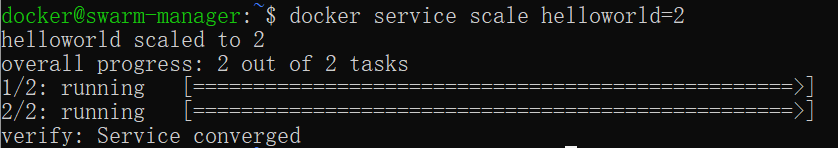
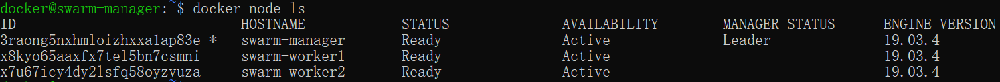

[toc]

### Docker

#### 1.简介

Docker 是一个开源的应用容器引擎，让开发者可以打包他们的应用以及依赖包到一个可移植的容器中,然后发布到任何流行的Linux机器或Windows 机器上,也可以实现虚拟化,容器是完全使用沙箱机制,相互之间不会有任何接口。

##### 应用场景

- Web 应用的自动化打包和发布。
- 自动化测试和持续集成、发布。
- 在服务型环境中部署和调整数据库或其他的后台应用。
- 从头编译或者扩展现有的 OpenShift 或 Cloud Foundry 平台来搭建自己的 PaaS 环境。

##### 优点

Docker 允许开发人员使用您提供的应用程序或服务的本地容器在标准化环境中工作，从而简化了开发的生命周期。容器非常适合持续集成和持续交付（CI / CD）工作流程，请考虑以下示例方案：

1. **快速，一致地交付您的应用程序**

- 您的开发人员在本地编写代码，并使用 Docker 容器与同事共享他们的工作。
- 他们使用 Docker 将其应用程序推送到测试环境中，并执行自动或手动测试。
- 当开发人员发现错误时，他们可以在开发环境中对其进行修复，然后将其重新部署到测试环境中，以进行测试和验证。
- 测试完成后，将修补程序推送给生产环境，就像将更新的镜像推送到生产环境一样简单。

2. **响应式部署和扩展**

   Docker 是基于容器的平台，允许高度可移植的工作负载。Docker 容器可以在开发人员的本机上，数据中心的物理或虚拟机上，云服务上或混合环境中运行。

   Docker 的可移植性和轻量级的特性，还可以使您轻松地完成动态管理的工作负担，并根据业务需求指示，实时扩展或拆除应用程序和服务。

3. **在同一硬件上运行更多工作负载**

   Docker 轻巧快速。它为基于虚拟机管理程序的虚拟机提供了可行、经济、高效的替代方案，因此您可以利用更多的计算能力来实现业务目标。Docker 非常适合于高密度环境以及中小型部署，而您可以用更少的资源做更多的事情。

##### Docker 架构

Docker 包括三个基本概念:

- **镜像（Image）**：Docker 镜像（Image），就相当于是一个 root 文件系统。比如官方镜像 ubuntu:16.04 就包含了完整的一套 Ubuntu16.04 最小系统的 root 文件系统。
- **容器（Container）**：镜像（Image）和容器（Container）的关系，就像是面向对象程序设计中的类和实例一样，镜像是静态的定义，容器是镜像运行时的实体。容器可以被创建、启动、停止、删除、暂停等。
- **仓库（Repository）**：仓库可看成一个代码控制中心，用来保存镜像。

Docker 使用**客户端-服务器 (C/S)** 架构模式，使用**远程API**来管理和创建Docker容器。

Docker 容器通过 Docker 镜像来创建。

容器与镜像的关系类似于面向对象编程中的对象与类。

| Docker | 面向对象 |
| :----- | :------- |
| 容器   | 对象     |
| 镜像   | 类       |


| 概念                   | 说明                                                         |
| :--------------------- | :----------------------------------------------------------- |
| Docker 镜像(Images)    | Docker 镜像是用于创建 Docker 容器的模板，比如 Ubuntu 系统。  |
| Docker 容器(Container) | 容器是独立运行的一个或一组应用，是镜像运行时的实体。         |
| Docker 客户端(Client)  | Docker 客户端通过命令行或者其他工具使用 Docker SDK (https://docs.docker.com/develop/sdk/) 与 Docker 的守护进程通信。 |
| Docker 主机(Host)      | 一个物理或者虚拟的机器用于执行 Docker 守护进程和容器。       |
| Docker Registry        | Docker 仓库用来保存镜像，可以理解为代码控制中的代码仓库。Docker Hub([https://hub.docker.com](https://hub.docker.com/)) 提供了庞大的镜像集合供使用。一个 Docker Registry 中可以包含多个仓库（Repository）；每个仓库可以包含多个标签（Tag）；每个标签对应一个镜像。通常，一个仓库会包含同一个软件不同版本的镜像，而标签就常用于对应该软件的各个版本。我们可以通过 **<仓库名>:<标签>** 的格式来指定具体是这个软件哪个版本的镜像。如果不给出标签，将以 **latest** 作为默认标签。 |
| Docker Machine         | Docker Machine是一个简化Docker安装的命令行工具，通过一个简单的命令行即可在相应的平台上安装Docker，比如VirtualBox、 Digital Ocean、Microsoft Azure。 |

#### 2.安装

##### Centos

###### 使用官方安装脚本自动安装

安装命令如下：

```shell
curl -fsSL https://get.docker.com | bash -s docker --mirror Aliyun
```

也可以使用国内 daocloud 一键安装命令：

```shell
curl -sSL https://get.daocloud.io/docker | sh
```

###### 手动安装

**卸载旧版本**:

较旧的 Docker 版本称为 docker 或 docker-engine 。如果已安装这些程序，请卸载它们以及相关的依赖项。

```shell
$ sudo yum remove docker \
         docker-client \
         docker-client-latest \
         docker-common \
         docker-latest \
         docker-latest-logrotate \
         docker-logrotate \
         docker-engine
```

**安装 Docker Engine-Community**

**使用 Docker 仓库进行安装**

在新主机上首次安装 Docker Engine-Community 之前，需要设置 Docker 仓库。之后，您可以从仓库安装和更新 Docker。

**设置仓库**

安装所需的软件包。yum-utils 提供了 yum-config-manager ，并且 device mapper 存储驱动程序需要 device-mapper-persistent-data 和 lvm2。

```shell
$ sudo yum install -y yum-utils \
  device-mapper-persistent-data \
  lvm2
```

使用以下命令来设置稳定的仓库。

**使用官方源地址（比较慢）**:

```shell
$ sudo yum-config-manager \
    --add-repo \
    https://download.docker.com/linux/centos/docker-ce.repo
```

**可以选择国内的一些源地址：**

```shell
$ sudo yum-config-manager \
    --add-repo \
    http://mirrors.aliyun.com/docker-ce/linux/centos/docker-ce.repo
```

**安装 Docker Engine-Community**

安装最新版本的 Docker Engine-Community 和 containerd，或者转到下一步安装特定版本：

```shell
$ sudo yum install docker-ce docker-ce-cli containerd.io
```

> **有多个 Docker 仓库吗？**

*如果启用了多个 Docker 仓库，则在未在 yum install 或 yum update 命令中指定版本的情况下，进行的安装或更新将始终安装最高版本，这可能不适合您的稳定性需求。*

Docker 安装完**默认未启动**。并且**已经创建好 docker 用户组**，但该用户组下没有用户。

**要安装特定版本的 Docker Engine-Community，请在存储库中列出可用版本，然后选择并安装：**

1. 列出并排序您存储库中可用的版本。此示例按版本号（从高到低）对结果进行排序。

   ```shell
   $ yum list docker-ce --showduplicates | sort -r
   
   docker-ce.x86_64  3:18.09.1-3.el7                     docker-ce-stable
   docker-ce.x86_64  3:18.09.0-3.el7                     docker-ce-stable
   docker-ce.x86_64  18.06.1.ce-3.el7                    docker-ce-stable
   docker-ce.x86_64  18.06.0.ce-3.el7                    docker-ce-stable
   ```

2. 通过其完整的软件包名称安装特定版本，该软件包名称是软件包名称（docker-ce）加上版本字符串（第二列），从第一个冒号（:）一直到第一个连字符，并用连字符（-）分隔。例如：docker-ce-18.09.1。

   ```shell
   $ sudo yum install docker-ce-<VERSION_STRING> docker-ce-cli-<VERSION_STRING> containerd.io
   ```

3. 启动 Docker

   ```shell
   $ sudo systemctl start docker
   ```

4. 通过运行 hello-world 映像来验证是否正确安装了 Docker Engine-Community 。

   ```shell
   sudo docker run hello-world
   ```

#### 3.使用

##### Docker Hello World

Docker 允许你在容器内运行应用程序， 使用 **docker run** 命令来在容器内运行一个应用程序。

```shell
runoob@runoob:~$ docker run ubuntu:15.10 /bin/echo "Hello world"
Hello world
```

**各个参数解析：**

- **docker:** Docker 的二进制执行文件。
- **run:** 与前面的 docker 组合来运行一个容器。
- **ubuntu:15.10** 指定要运行的镜像，Docker 首先从本地主机上查找镜像是否存在，如果不存在，Docker 就会从镜像仓库 Docker Hub 下载公共镜像。
- **/bin/echo "Hello world":** 在启动的容器里执行的命令

###### 运行交互式的容器

通过 docker 的两个参数 -i -t，让 docker 运行的容器实现**"对话"**的能力：

```shell
runoob@runoob:~$ docker run -i -t ubuntu:15.10 /bin/bash
root@0123ce188bd8:/#
```

**各个参数解析：**

- **-t:** 在新容器内指定一个伪终端或终端。
- **-i:** 允许你对容器内的标准输入 (STDIN) 进行交互。

注意第二行 **root@0123ce188bd8:/#**，此时我们已进入一个 ubuntu15.10 系统的容器

我们尝试在容器中运行命令 **cat /proc/version**和**ls**分别查看当前系统的版本信息和当前目录下的文件列表

```shell
root@0123ce188bd8:/#  cat /proc/version
Linux version 4.4.0-151-generic (buildd@lgw01-amd64-043) (gcc version 5.4.0 20160609 (Ubuntu 5.4.0-6ubuntu1~16.04.10) ) #178-Ubuntu SMP Tue Jun 11 08:30:22 UTC 2019
root@0123ce188bd8:/# ls
bin  boot  dev  etc  home  lib  lib64  media  mnt  opt  proc  root  run  sbin  srv  sys  tmp  usr  var
root@0123ce188bd8:/# 
```

我们可以通过运行 exit 命令或者使用 CTRL+D 来退出容器。

```shell
root@0123ce188bd8:/#  exit
exit
root@runoob:~# 
```

注意第三行中 **root@runoob:~#** 表明我们已经退出了当期的容器，返回到当前的主机中。

###### 启动容器（后台模式）

使用以下命令创建一个以进程方式运行的容器:

```shell
runoob@runoob:~$ docker run -d ubuntu:15.10 /bin/sh -c "while true; do echo hello world; sleep 1; done"
2b1b7a428627c51ab8810d541d759f072b4fc75487eed05812646b8534a2fe63
```

在输出中，我们没有看到期望的 "hello world"，而是一串长字符2b1b7a428627c51ab8810d541d759f072b4fc75487eed05812646b8534a2fe63

这个长字符串叫做容器 ID，对每个容器来说都是唯一的，我们可以通过容器 ID 来查看对应的容器发生了什么。

首先，我们需要确认容器有在运行，可以通过 **docker ps** 来查看：

```shell
runoob@runoob:~$ docker ps
CONTAINER ID        IMAGE                  COMMAND              ...  
5917eac21c36        ubuntu:15.10           "/bin/sh -c 'while t…"    ...
```

- **CONTAINER ID:** 容器 ID。

- **IMAGE:** 使用的镜像。

- **COMMAND:** 启动容器时运行的命令。

- **CREATED:** 容器的创建时间。

- **STATUS:** 容器状态。

  **状态有7种：**

  - **created**（已创建）
  - **restarting**（重启中）
  - **running**（运行中）
  - **removing**（迁移中）
  - **paused**（暂停）
  - **exited**（停止）
  - **dead**（死亡）

- **PORTS:** 容器的端口信息和使用的连接类型（tcp\udp）。

- **NAMES:** 自动分配的容器名称。

在宿主主机内使用 **docker logs** 命令，查看容器内的标准输出：

```shell
runoob@runoob:~$ docker logs 2b1b7a428627
```

###### 停止容器

使用 **docker stop** 命令来停止容器:

```shell
runoob@runoob:~$ docker stop 2b1b7a428627
```


##### Docker 容器使用

###### Docker 客户端

直接输入 docker 命令来查看到 Docker 客户端的所有命令选项

```shell
runoob@runoob:~# docker
```

通过命令 **docker command --help** 更深入的了解指定的 Docker 命令使用方法。

例如我们要查看 **docker stats** 指令的具体使用方法：

```shell
runoob@runoob:~# docker stats --help
```

###### 容器使用

**获取镜像**

如果我们本地没有 ubuntu 镜像，我们可以使用 docker pull 命令来载入 ubuntu 镜像：

```shell
$ docker pull ubuntu
```

**启动容器**

以下命令使用 ubuntu 镜像启动一个容器，参数为以命令行模式进入该容器：

```shell
$ docker run -it ubuntu /bin/bash
```

要退出终端，直接输入 **exit**:

```shell
root@ed09e4490c57:/# exit
```

**启动已停止运行的容器**

查看所有的容器命令如下：

```shell
$ docker ps -a
```

使用 docker start 启动一个已停止的容器：

```shell
$ docker start b750bbbcfd88 
```

**后台运行**

在大部分的场景下，我们希望 docker 的服务是在后台运行的，我们可以过 **-d** 指定容器的运行模式。

```shell
$ docker run -itd --name ubuntu-test ubuntu /bin/bash
```

**注：**加了 **-d** 参数默认不会进入容器，想要进入容器需要使用指令 **docker exec**（下面会介绍到）。

**停止一个容器**

```shell
$ docker stop <容器 ID>
```

停止的容器可以通过 docker restart 重启：

```shell
$ docker restart <容器 ID>
```

**进入容器**

在使用 **-d** 参数时，容器启动后会进入后台。此时想要进入容器，可以通过以下指令进入：

- **docker attach**
- **docker exec**：推荐大家使用 docker exec 命令，因为此退出容器终端，不会导致容器的停止。

**attach 命令**

下面演示了使用 docker attach 命令。

```shell
$ docker attach 1e560fca3906 
```

**注意：** 如果从这个容器退出，会导致容器的停止。

**exec 命令**

```shell
docker exec -it 243c32535da7 /bin/bash
```

**导出和导入容器** 

**导出容器**

```shell
$ docker export 1e560fca3906 > ubuntu.tar
```

导出容器 1e560fca3906 快照到本地文件 ubuntu.tar

**导入容器快照**

```shell
$ cat docker/ubuntu.tar | docker import - test/ubuntu:v1
```

将快照文件 ubuntu.tar 导入到镜像 test/ubuntu:v1:

此外，也可以通过指定 URL 或者某个目录来导入，例如：

```shell
$ docker import http://example.com/exampleimage.tgz example/imagerepo
```

**删除容器**

```shell
$ docker rm -f 1e560fca3906
```

下面的命令可以清理掉所有处于终止状态的容器。

```shell
$ docker container prune
```

##### 运行一个 web 应用

将在docker容器中运行一个 Python Flask 应用来运行一个web应用。

```shell
runoob@runoob:~# docker pull training/webapp  # 载入镜像
```

```shell
runoob@runoob:~# docker run -d -P training/webapp python app.py
```

参数说明:

- **-d:**让容器在后台运行。
- **-P:**将容器内部使用的网络端口随机映射到我们使用的主机上。

###### 查看 WEB 应用容器

使用 docker ps 来查看我们正在运行的容器：

```shell
runoob@runoob:~#  docker ps
CONTAINER ID        IMAGE               COMMAND             ...        PORTS                 
d3d5e39ed9d3        training/webapp     "python app.py"     ...        0.0.0.0:32769->5000/tcp
```

Docker 开放了 5000 端口（默认 Python Flask 端口）映射到主机端口 32769 上。

这时我们可以通过浏览器访问WEB应用


我们也可以通过 -p 参数来设置不一样的端口：

```shell
runoob@runoob:~$ docker run -d -p 5000:5000 training/webapp python app.py
```

**docker ps**查看正在运行的容器

```shell
runoob@runoob:~#  docker ps
CONTAINER ID        IMAGE                             PORTS                     NAMES
bf08b7f2cd89        training/webapp     ...        0.0.0.0:5000->5000/tcp    wizardly_chandrasekhar
d3d5e39ed9d3        training/webapp     ...        0.0.0.0:32769->5000/tcp   xenodochial_hoov
```

容器内部的 5000 端口映射到我们本地主机的 5000 端口上。

###### 网络端口的快捷方式

通过 **docker ps** 命令可以查看到容器的端口映射，**docker** 还提供了另一个快捷方式 **docker port**，使用 **docker port** 可以查看指定 （ID 或者名字）容器的某个确定端口映射到宿主机的端口号。

```shell
runoob@runoob:~$ docker port bf08b7f2cd89
5000/tcp -> 0.0.0.0:5000
```

###### 查看 WEB 应用程序日志

docker logs [ID或者名字] 可以查看容器内部的标准输出。

```shell
runoob@runoob:~$ docker logs -f bf08b7f2cd89
 * Running on http://0.0.0.0:5000/ (Press CTRL+C to quit)
192.168.239.1 - - [09/May/2016 16:30:37] "GET / HTTP/1.1" 200 -
192.168.239.1 - - [09/May/2016 16:30:37] "GET /favicon.ico HTTP/1.1" 404 -
```

**-f:** 让 **docker logs** 像使用 **tail -f** 一样来输出容器内部的标准输出。

###### 查看WEB应用程序容器的进程

使用 docker top 来查看容器内部运行的进程

```shell
runoob@runoob:~$ docker top wizardly_chandrasekhar
UID     PID         PPID          ...       TIME                CMD
root    23245       23228         ...       00:00:00            python app.py
```

###### 检查 WEB 应用程序

使用 **docker inspect** 来查看 Docker 的底层信息。它会返回一个 JSON 文件记录着 Docker 容器的配置和状态信息。

```shell
runoob@runoob:~$ docker inspect wizardly_chandrasekhar
[
    {
        "Id": "bf08b7f2cd897b5964943134aa6d373e355c286db9b9885b1f60b6e8f82b2b85",
        "Created": "2018-09-17T01:41:26.174228707Z",
        "Path": "python",
        "Args": [
            "app.py"
        ],
        "State": {
            "Status": "running",
            "Running": true,
            "Paused": false,
            "Restarting": false,
            "OOMKilled": false,
            "Dead": false,
            "Pid": 23245,
            "ExitCode": 0,
            "Error": "",
            "StartedAt": "2018-09-17T01:41:26.494185806Z",
            "FinishedAt": "0001-01-01T00:00:00Z"
        },
......
```

###### 停止 WEB 应用容器

```shell
runoob@runoob:~$ docker stop wizardly_chandrasekhar   
wizardly_chandrasekhar
```

###### 重启WEB应用容器

已经停止的容器，我们可以使用命令 docker start 来启动。

```shell
runoob@runoob:~$ docker start wizardly_chandrasekhar
wizardly_chandrasekhar
```

正在运行的容器，我们可以使用 **docker restart** 命令来重启。

docker ps -l 查询最后一次创建的容器：

```shell
#  docker ps -l 
CONTAINER ID        IMAGE                             PORTS                     NAMES
bf08b7f2cd89        training/webapp     ...        0.0.0.0:5000->5000/tcp    wizardly_chandrasekhar
```

###### 移除WEB应用容器

使用 docker rm 命令来删除不需要的容器

```shell
runoob@runoob:~$ docker rm wizardly_chandrasekhar  
wizardly_chandrasekhar
```

删除容器时，容器必须是停止状态，否则会报如下错误

```shell
runoob@runoob:~$ docker rm wizardly_chandrasekhar
Error response from daemon: You cannot remove a running container bf08b7f2cd897b5964943134aa6d373e355c286db9b9885b1f60b6e8f82b2b85. Stop the container before attempting removal or force remove
```


#### Docker 镜像使用

当运行容器时，使用的镜像如果在本地中不存在，docker 就会自动从 docker 镜像仓库中下载，默认是从 Docker Hub 公共镜像源下载。

##### 列出镜像列表

使用 **docker images** 来列出本地主机上的镜像。

```shell
runoob@runoob:~$ docker images           
REPOSITORY          TAG                 IMAGE ID            CREATED             SIZE
ubuntu              14.04               90d5884b1ee0        5 days ago          188 MB
php                 5.6                 f40e9e0f10c8        9 days ago          444.8 MB
```

- **REPOSITORY：**表示镜像的仓库源
- **TAG：**镜像的标签
- **IMAGE ID：**镜像ID
- **CREATED：**镜像创建时间
- **SIZE：**镜像大小

如果要使用版本为15.10的ubuntu系统镜像来运行容器时，命令如下：

```shell
runoob@runoob:~$ docker run -t -i ubuntu:15.10 /bin/bash 
root@d77ccb2e5cca:/#
```

如果你不指定一个镜像的版本标签，例如你只使用 ubuntu，docker 将默认使用 ubuntu:latest 镜像。

##### 获取一个新的镜像

当我们在本地主机上使用一个不存在的镜像时 Docker 就会自动下载这个镜像。如果我们想预先下载这个镜像，我们可以使用 docker pull 命令来下载它。

```shell
Crunoob@runoob:~$ docker pull ubuntu:13.10
13.10: Pulling from library/ubuntu
6599cadaf950: Pull complete 
23eda618d451: Pull complete 
f0be3084efe9: Pull complete 
52de432f084b: Pull complete 
a3ed95caeb02: Pull complete 
Digest: sha256:15b79a6654811c8d992ebacdfbd5152fcf3d165e374e264076aa435214a947a3
Status: Downloaded newer image for ubuntu:13.10
```

下载完成后，我们可以直接使用这个镜像来运行容器。

##### 查找镜像

可以从 Docker Hub 网站来搜索镜像，Docker Hub 网址为： **https://hub.docker.com/**

也可以使用 docker search 命令来搜索镜像。比如我们需要一个 httpd 的镜像来作为我们的 web 服务。我们可以通过 docker search 命令搜索 httpd 来寻找适合我们的镜像。

```shell
runoob@runoob:~$  docker search httpd
```


**NAME:** 镜像仓库源的名称

**DESCRIPTION:** 镜像的描述

**OFFICIAL:** 是否 docker 官方发布

**STARS**:** 类似 Github 里面的 star，表示点赞、喜欢的意思。

**AUTOMATED:** 自动构建。

##### 拖取镜像

```shell
runoob@runoob:~$ docker pull httpd
Using default tag: latest
latest: Pulling from library/httpd
8b87079b7a06: Pulling fs layer 
a3ed95caeb02: Download complete 
0d62ec9c6a76: Download complete 
a329d50397b9: Download complete 
ea7c1f032b5c: Waiting 
be44112b72c7: Waiting
```

下载完成后，我们就可以使用这个镜像了。

```shell
runoob@runoob:~$ docker run httpd
```

##### 删除镜像

镜像删除使用 **docker rmi** 命令:

```shell
$ docker rmi hello-world
```

##### 创建镜像

当我们从 docker 镜像仓库中下载的镜像不能满足我们的需求时，我们可以通过以下两种方式对镜像进行更改。

- 从已经创建的容器中更新镜像，并且提交这个镜像
- 使用 Dockerfile 指令来创建一个新的镜像

###### 更新镜像

更新镜像之前，我们需要使用镜像来创建一个容器。

```shell
runoob@runoob:~$ docker run -t -i ubuntu:15.10 /bin/bash
root@e218edb10161:/# 
```

在运行的容器内使用 **apt-get update** 命令进行更新。

在完成操作之后，输入 exit 命令来退出这个容器。

此时 ID 为 e218edb10161 的容器，是按我们的需求更改的容器。我们可以通过命令 docker commit 来提交容器副本。

```shell
runoob@runoob:~$ docker commit -m="has update" -a="runoob" e218edb10161 runoob/ubuntu:v2
sha256:70bf1840fd7c0d2d8ef0a42a817eb29f854c1af8f7c59fc03ac7bdee9545aff8
```

各个参数说明：

- **-m:** 提交的描述信息
- **-a:** 指定镜像作者
- **e218edb10161：**容器 ID
- **runoob/ubuntu:v2:** 指定要创建的目标镜像名

我们可以使用 **docker images** 命令来查看我们的新镜像 **runoob/ubuntu:v2**：

```shell
runoob@runoob:~$ docker images
REPOSITORY          TAG                 IMAGE ID            CREATED             SIZE
runoob/ubuntu       v2                  70bf1840fd7c        15 seconds ago      158.5 MB
ubuntu              14.04               90d5884b1ee0        5 days ago          188 MB
php                 5.6                 f40e9e0f10c8        9 days ago          444.8 MB
nginx               latest              6f8d099c3adc        12 days ago         182.7 MB
mysql               5.6                 f2e8d6c772c0        3 weeks ago         324.6 MB
httpd               latest              02ef73cf1bc0        3 weeks ago         194.4 MB
ubuntu              15.10               4e3b13c8a266        4 weeks ago         136.3 MB
hello-world         latest              690ed74de00f        6 months ago        960 B
training/webapp     latest              6fae60ef3446        12 months ago       348.8 MB
```

使用我们的新镜像 **runoob/ubuntu** 来启动一个容器

```shell
runoob@runoob:~$ docker run -t -i runoob/ubuntu:v2 /bin/bash                            
root@1a9fbdeb5da3:/#
```

###### 构建镜像

使用命令 **docker build** ， 从零开始来创建一个新的镜像。为此，我们需要创建一个 Dockerfile 文件，其中包含一组指令来告诉 Docker 如何构建我们的镜像。

```dockerfile
runoob@runoob:~$ cat Dockerfile 
FROM    centos:6.7
MAINTAINER      Fisher "fisher@sudops.com"

RUN     /bin/echo 'root:123456' |chpasswd
RUN     useradd runoob
RUN     /bin/echo 'runoob:123456' |chpasswd
RUN     /bin/echo -e "LANG=\"en_US.UTF-8\"" >/etc/default/local
EXPOSE  22
EXPOSE  80
CMD     /usr/sbin/sshd -D
```

每一个指令都会在镜像上创建一个新的层，每一个指令的前缀都必须是大写的。

第一条FROM，指定使用哪个镜像源

RUN 指令告诉docker 在镜像内执行命令，安装了什么。。。

然后，我们使用 Dockerfile 文件，通过 docker build 命令来构建一个镜像。

```shell
runoob@runoob:~$ docker build -t runoob/centos:6.7 .
Sending build context to Docker daemon 17.92 kB
Step 1 : FROM centos:6.7
 ---&gt; d95b5ca17cc3
Step 2 : MAINTAINER Fisher "fisher@sudops.com"
 ---&gt; Using cache
 ---&gt; 0c92299c6f03
Step 3 : RUN /bin/echo 'root:123456' |chpasswd
 ---&gt; Using cache
 ---&gt; 0397ce2fbd0a
Step 4 : RUN useradd runoob
......
```

参数说明：

- **-t** ：指定要创建的目标镜像名
- **.** ：Dockerfile 文件所在目录，可以指定Dockerfile 的绝对路径

我们可以使用新的镜像来创建容器

```shell
runoob@runoob:~$ docker run -t -i runoob/centos:6.7  /bin/bash
[root@41c28d18b5fb /]# id runoob
uid=500(runoob) gid=500(runoob) groups=500(runoob)
```

从上面看到新镜像已经包含我们创建的用户 runoob。

##### 设置镜像标签

我们可以使用 docker tag 命令，为镜像添加一个新的标签。

```shell
runoob@runoob:~$ docker tag 860c279d2fec runoob/centos:dev
```

docker tag 镜像ID，这里是 860c279d2fec ,用户名称、镜像源名(repository name)和新的标签名(tag)。


#### Docker 容器连接

##### 网络端口映射

创建了一个 python 应用的容器:

```shell
runoob@runoob:~$ docker run -d -P training/webapp python app.py
fce072cc88cee71b1cdceb57c2821d054a4a59f67da6b416fceb5593f059fc6d
```

可以指定容器绑定的网络地址，比如绑定 127.0.0.1。

```shell
runoob@runoob:~$ docker run -d -p 127.0.0.1:5001:5000 training/webapp python app.py
95c6ceef88ca3e71eaf303c2833fd6701d8d1b2572b5613b5a932dfdfe8a857c
```

使用 **-P** 参数创建一个容器，使用 **docker ps** 可以看到容器端口 5000 绑定主机端口 32768。

```shell
runoob@runoob:~$ docker ps
CONTAINER ID    IMAGE               COMMAND            ...           PORTS                     NAMES
fce072cc88ce    training/webapp     "python app.py"    ...     0.0.0.0:32768->5000/tcp   grave_hopper
```

也可以使用 **-p** 标识来指定容器端口绑定到主机端口。

两种方式的区别是:

- **-P :**是容器内部端口**随机**映射到主机的高端口。
- **-p :** 是容器内部端口绑定到**指定**的主机端口。

```shell
runoob@runoob:~$ docker run -d -p 5000:5000 training/webapp python app.py
33e4523d30aaf0258915c368e66e03b49535de0ef20317d3f639d40222ba6bc0
```

```shell
runoob@runoob:~$ docker ps
CONTAINER ID        IMAGE               COMMAND           ...           PORTS                     NAMES
33e4523d30aa        training/webapp     "python app.py"   ...   0.0.0.0:5000->5000/tcp    berserk_bartik
fce072cc88ce        training/webapp     "python app.py"   ...   0.0.0.0:32768->5000/tcp   grave_hopper
```

上面的例子中，默认都是绑定 tcp 端口，如果要绑定 UDP 端口，可以在端口后面加上 **/udp**。

```shell
runoob@runoob:~$ docker run -d -p 127.0.0.1:5000:5000/udp training/webapp python app.py
6779686f06f6204579c1d655dd8b2b31e8e809b245a97b2d3a8e35abe9dcd22a
runoob@runoob:~$ docker ps
CONTAINER ID        IMAGE               COMMAND           ...   PORTS                                NAMES
6779686f06f6        training/webapp     "python app.py"   ...   5000/tcp, 127.0.0.1:5000->5000/udp   drunk_visvesvaraya
95c6ceef88ca        training/webapp     "python app.py"   ...    5000/tcp, 127.0.0.1:5001->5000/tcp   adoring_stonebraker
33e4523d30aa        training/webapp     "python app.py"   ...     0.0.0.0:5000->5000/tcp               berserk_bartik
fce072cc88ce        training/webapp     "python app.py"   ...    0.0.0.0:32768->5000/tcp              grave_hopper
```

**docker port** 命令可以让我们快捷地查看端口的绑定情况。

```shell
runoob@runoob:~$ docker port adoring_stonebraker 5000
127.0.0.1:5001
```

##### Docker 容器互联

端口映射并不是唯一把 docker 连接到另一个容器的方法。

docker 有一个连接系统允许将多个容器连接在一起，共享连接信息。

docker 连接会创建一个父子关系，其中父容器可以看到子容器的信息。

###### 容器命名

当我们创建一个容器的时候，docker 会自动对它进行命名。另外，我们也可以使用 **--name** 标识来命名容器，例如：

```shell
runoob@runoob:~$  docker run -d -P --name runoob training/webapp python app.py
43780a6eabaaf14e590b6e849235c75f3012995403f97749775e38436db9a441
```

可以使用 **docker ps** 命令来查看容器名称。

```shell
runoob@runoob:~$ docker ps -l
CONTAINER ID     IMAGE            COMMAND           ...    PORTS                     NAMES
43780a6eabaa     training/webapp   "python app.py"  ...     0.0.0.0:32769->5000/tcp   runoob
```

###### 新建网络

先创建一个新的 Docker 网络。

```shell
$ docker network create -d bridge test-net
```

参数说明：

**-d**：参数指定 Docker 网络类型，有 bridge、overlay。

其中 overlay 网络类型用于 Swarm mode。

###### 连接容器

运行一个容器并连接到新建的 test-net 网络:

```shell
$ docker run -itd --name test1 --network test-net ubuntu /bin/bash
```

打开新的终端，再运行一个容器并加入到 test-net 网络:

```shell
$ docker run -itd --name test2 --network test-net ubuntu /bin/bash
```


下面通过 ping 来证明 test1 容器和 test2 容器建立了互联关系。

如果 test1、test2 容器内中无 ping 命令，则在容器内执行以下命令安装 ping（**即学即用**：可以在一个容器里安装好，提交容器到镜像，在以新的镜像重新运行以上俩个容器）。

```shell
apt-get update
apt install iputils-ping
```

如果你有多个容器之间需要互相连接，推荐使用 Docker Compose，后面会介绍。

##### 配置 DNS

可以在宿主机的 **/etc/docker/daemon.json** 文件中增加以下内容来设置全部容器的 DNS：

```json
{
  "dns" : [
    "114.114.114.114",
    "8.8.8.8"
  ]
}
```

设置后，启动容器的 DNS 会自动配置为 114.114.114.114 和 8.8.8.8。需要重启 docker 才能生效。

查看容器的 DNS 是否生效可以使用以下命令，它会**输出容器的 DNS 信息**：

```shell
$ docker run -it --rm  ubuntu  cat etc/resolv.conf
```

###### 手动指定容器的配置

如果只想在指定的容器设置 DNS，则可以使用以下命令：

```shell
$ docker run -it --rm -h host_ubuntu  --dns=114.114.114.114 --dns-search=test.com ubuntu
```

参数说明：

**--rm**：容器退出时自动清理容器内部的文件系统。

**-h HOSTNAME 或者 --hostname=HOSTNAME**： 设定容器的主机名，它会被写到容器内的 /etc/hostname 和 /etc/hosts。

**--dns=IP_ADDRESS**： 添加 DNS 服务器到容器的 /etc/resolv.conf 中，让容器用这个服务器来解析所有不在 /etc/hosts 中的主机名。

**--dns-search=DOMAIN**： 设定容器的搜索域，当设定搜索域为 .example.com 时，在搜索一个名为 host 的主机时，DNS 不仅搜索 host，还会搜索 host.example.com。

如果在容器启动时没有指定 **--dns** 和 **--dns-search**，Docker 会默认用宿主主机上的 /etc/resolv.conf 来配置容器的 DNS。


#### Docker 仓库管理

仓库（Repository）是集中存放镜像的地方。以下介绍一下 [Docker Hub](https://hub.docker.com/)。当然不止 docker hub，只是远程的服务商不一样，操作都是一样的

##### Docker Hub

目前 Docker 官方维护了一个公共仓库 [Docker Hub](https://hub.docker.com/)。

大部分需求都可以通过在 Docker Hub 中直接下载镜像来实现。

##### 推送镜像

用户登录后，可以通过 docker push 命令将自己的镜像推送到 Docker Hub。

以下命令中的 username 请替换为你的 Docker 账号用户名。

```shell
$ docker tag ubuntu:18.04 username/ubuntu:18.04
$ docker image ls

REPOSITORY      TAG        IMAGE ID            CREATED           ...  
ubuntu          18.04      275d79972a86        6 days ago        ...  
username/ubuntu 18.04      275d79972a86        6 days ago        ...  
$ docker push username/ubuntu:18.04
$ docker search username/ubuntu

NAME             DESCRIPTION       STARS         OFFICIAL    AUTOMATED
username/ubuntu
```


#### Dockerfile 

##### 什么是 Dockerfile？

Dockerfile 是一个用来构建镜像的文本文件，文本内容包含了一条条构建镜像所需的指令和说明。

##### 使用 Dockerfile 定制镜像

**定制一个 nginx 镜像（构建好的镜像内会有一个 /usr/share/nginx/html/index.html 文件）**

在一个空目录下，新建一个名为 Dockerfile 文件，并在文件内添加以下内容：

```shell
FROM nginx
RUN echo '这是一个本地构建的nginx镜像' > /usr/share/nginx/html/index.html
```

**FROM 和 RUN 指令的作用**

**FROM**：定制的镜像都是基于 FROM 的镜像，这里的 nginx 就是定制需要的基础镜像。后续的操作都是基于 nginx。

**RUN**：用于执行后面跟着的命令行命令。有以下俩种格式：

shell 格式：

```shell
RUN <命令行命令>
# <命令行命令> 等同于，在终端操作的 shell 命令。
```

exec 格式：

```shell
RUN ["可执行文件", "参数1", "参数2"]
# 例如：
# RUN ["./test.php", "dev", "offline"] 等价于 RUN ./test.php dev offline
```

**注意**：Dockerfile 的指令每执行一次都会在 docker 上新建一层。所以过多无意义的层，会造成镜像膨胀过大。例如：

```dockerfile
FROM centos
RUN yum install wget
RUN wget -O redis.tar.gz "http://download.redis.io/releases/redis-5.0.3.tar.gz"
RUN tar -xvf redis.tar.gz
以上执行会创建 3 层镜像。可简化为以下格式：
FROM centos
RUN yum install wget \
  && wget -O redis.tar.gz "http://download.redis.io/releases/redis-5.0.3.tar.gz" \
  && tar -xvf redis.tar.gz
如上，以 && 符号连接命令，这样执行后，只会创建 1 层镜像。
```

##### 开始构建镜像

在 Dockerfile 文件的存放目录下，执行构建动作。

以下示例，通过目录下的 Dockerfile 构建一个 nginx:test（镜像名称:镜像标签）。

**注**：最后的 **.** 代表本次执行的上下文路径

```shell
$ docker build -t nginx:test .
```


##### 上下文路径

指令最后一个 **.** 是上下文路径

上下文路径，是指 docker 在构建镜像，有时候想要使用到本机的文件（比如复制），docker build 命令得知这个路径后，会将路径下的所有内容打包。

**解析**：由于 docker 的运行模式是 C/S。我们本机是 C，docker 引擎是 S。实际的构建过程是在 docker 引擎下完成的，所以这个时候无法用到我们本机的文件。这就需要把我们本机的指定目录下的文件一起打包提供给 docker 引擎使用。

如果未说明最后一个参数，那么默认上下文路径就是 Dockerfile 所在的位置。

**注意**：上下文路径下不要放无用的文件，因为会一起打包发送给 docker 引擎，如果文件过多会造成过程缓慢。


##### 指令详解

**COPY**

复制指令，从上下文目录中复制文件或者目录到容器里指定路径。

格式：

```dockerfile
COPY [--chown=<user>:<group>] <源路径1>...  <目标路径>
COPY [--chown=<user>:<group>] ["<源路径1>",...  "<目标路径>"]
```

**[--chown=<user>:<group>]**：可选参数，用户改变复制到容器内文件的拥有者和属组。

**<源路径>**：源文件或者源目录，这里可以是通配符表达式，其通配符规则要满足 Go 的 filepath.Match 规则。例如：

```dockerfile
COPY hom* /mydir/
COPY hom?.txt /mydir/
```

**<目标路径>**：容器内的指定路径，该路径不用事先建好，路径不存在的话，会自动创建。


**ADD**

ADD 指令和 COPY 的使用格式一致（同样需求下，官方推荐使用 COPY）。功能也类似，不同之处如下：

- ADD 的**优点**：在执行 <源文件> 为 tar 压缩文件的话，压缩格式为 gzip, bzip2 以及 xz 的情况下，会**自动复制并解压**到 <目标路径>。
- ADD 的**缺点**：在**不解压的前提下，无法复制 tar 压缩文件**。会令镜像构建缓存失效，从而可能会令镜像构建变得比较缓慢。具体是否使用，可以根据是否需要自动解压来决定。


**CMD**

类似于 RUN 指令，用于运行程序，但二者运行的时间点不同:

- CMD 在docker run 时运行。
- RUN 是在 docker build。

**作用**：为启动的容器指定默认要运行的程序，程序运行结束，容器也就结束。CMD 指令指定的程序可被 docker run 命令行参数中指定要运行的程序所覆盖。

**注意**：如果 Dockerfile 中如果存在多个 CMD 指令，仅最后一个生效。

格式：

```dockerfile
CMD <shell 命令> 
CMD ["<可执行文件或命令>","<param1>","<param2>",...] 
CMD ["<param1>","<param2>",...]  # 该写法是为 ENTRYPOINT 指令指定的程序提供默认参数
```

推荐使用第二种格式，执行过程比较明确。第一种格式实际上在运行的过程中也会自动转换成第二种格式运行，并且默认可执行文件是 sh。


**ENTRYPOINT**

类似于 CMD 指令，但其不会被 docker run 的命令行参数指定的指令所覆盖，而且这些命令行参数会被当作参数送给 ENTRYPOINT 指令指定的程序。

但是, 如果运行 docker run 时使用了 --entrypoint 选项，此选项的参数可当作要运行的程序覆盖 ENTRYPOINT 指令指定的程序。

格式：

```shell
ENTRYPOINT ["<executeable>","<param1>","<param2>",...]
```

可以搭配 CMD 命令使用：一般是变参才会使用 CMD ，这里的 CMD 等于是在给 ENTRYPOINT 传参，以下示例会提到。

示例：

假设已通过 Dockerfile 构建了 nginx:test 镜像：

```dockerfile
FROM nginx

ENTRYPOINT ["nginx", "-c"] # 定参
CMD ["/etc/nginx/nginx.conf"] # 变参 
```

**不传参运行**

```shell
$ docker run  nginx:test
```

容器内会默认运行以下命令，启动主进程。

```shell
nginx -c /etc/nginx/nginx.conf
```

**传参运行**

```shell
$ docker run  nginx:test -c /etc/nginx/new.conf
```

容器内会默认运行以下命令，启动主进程(/etc/nginx/new.conf:假设容器内已有此文件)

```shell
nginx -c /etc/nginx/new.conf
```


**ENV**

设置环境变量，定义了**环境变量**，那么在后续的指令中，就可以使用这个环境变量。

格式：

```dockerfile
ENV <key> <value>
ENV <key1>=<value1> <key2>=<value2>...
```

设置 NODE_VERSION = 7.2.0 ， 在后续的指令中可以通过 $NODE_VERSION 引用：

```dockerfile
ENV NODE_VERSION 7.2.0

RUN curl -SLO "https://nodejs.org/dist/v$NODE_VERSION/node-v$NODE_VERSION-linux-x64.tar.xz" \
  && curl -SLO "https://nodejs.org/dist/v$NODE_VERSION/SHASUMS256.txt.asc"
```


**ARG**

构建参数，与 ENV 作用一至。不过作用域不一样。ARG 设置的环境变量**仅对 Dockerfile 内有效**，也就是说只有 **docker build** 的过程中有效，**构建好的镜像内不存在此环境变量**。

构建命令 docker build 中可以用 --build-arg <参数名>=<值> 来覆盖。

格式：

```dockerfile
ARG <参数名>[=<默认值>]
```


**VOLUME**

定义**匿名数据卷**。在启动容器时忘记挂载数据卷，会自动挂载到匿名卷。

作用：

- 避免重要的数据，因容器重启而丢失，这是非常致命的。
- 避免容器不断变大。

格式：

```dockerfile
VOLUME ["<路径1>", "<路径2>"...]
VOLUME <路径>
```

在启动容器 docker run 的时候，我们可以通过 -v 参数修改挂载点。


**EXPOSE**

仅仅只是声明端口。

作用：

- 帮助镜像使用者理解这个镜像服务的守护端口，以方便配置映射。
- 在运行时使用随机端口映射时，也就是 docker run -P 时，会自动随机映射 EXPOSE 的端口。

格式：

```dockerfile
EXPOSE <端口1> [<端口2>...]
```


**WORKDIR**

指定工作目录。用 WORKDIR 指定的工作目录，会**在构建镜像的每一层中都存在**。（WORKDIR 指定的工作目录，必须是提前创建好的）。

docker build 构建镜像过程中的，每一个 RUN 命令都是新建的一层。只有通过 WORKDIR 创建的目录才会一直存在。

格式：

```dockerfile
WORKDIR <工作目录路径>
```


**USER**

用于**指定执行后续命令的用户和用户组**，这边只是切换后续命令执行的用户（**用户和用户组必须提前已经存在**）

格式：

```dockerfile
USER <用户名>[:<用户组>]
```


**HEALTHCHECK**

用于指定某个程序或者指令来**监控 docker 容器服务的运行状态**。

格式：

```dockerfile
HEALTHCHECK [选项] CMD <命令>：设置检查容器健康状况的命令
HEALTHCHECK NONE：如果基础镜像有健康检查指令，使用这行可以屏蔽掉其健康检查指令

HEALTHCHECK [选项] CMD <命令> : 这边 CMD 后面跟随的命令使用，可以参考 CMD 的用法。
```


**ONBUILD**

用于**延迟构建命令**的执行。简单的说，就是 Dockerfile 里用 ONBUILD 指定的命令，在本次构建镜像的过程中不会执行（假设镜像为 test-build）。当有新的 Dockerfile 使用了之前构建的镜像 FROM test-build ，这是执行新镜像的 Dockerfile 构建时候，会执行 test-build 的 Dockerfile 里的 ONBUILD 指定的命令。

格式：

```dockerfile
ONBUILD <其它指令>
```


#### Docker Compose

##### Compose 简介

Compose 是用于定义和运行**多容器 Docker**应用程序的工具。通过 Compose，您可以使用 **YML 文件**来配置应用程序需要的所有服务。然后，使用一个命令，就可以从 YML 文件配置中创建并启动所有服务。

Compose 使用的三个步骤：

- 使用 Dockerfile 定义应用程序的环境。
- 使用 docker-compose.yml 定义构成应用程序的服务，这样它们可以在隔离环境中一起运行。
- 最后，执行 docker-compose up 命令来启动并运行整个应用程序。

**实例**

```yaml
\# yaml 配置实例
version: '3'
services:
 web:
  build: .
  ports:
  - "5000:5000"
  volumes**:
  - .:/code
  \- logvolume01:/var/log
  links:
  - redis
 redis:
  image: redis
volumes:
 logvolume01: {}
```

##### Compose 安装

Linux 上我们可以从 Github 上下载它的二进制包来使用，最新发行的版本地址：https://github.com/docker/compose/releases。

运行以下命令以下载 Docker Compose 的当前稳定版本：

```shell
$ sudo curl -L "https://github.com/docker/compose/releases/download/1.24.1/docker-compose-$(uname -s)-$(uname -m)" -o /usr/local/bin/docker-compose
```

要安装其他版本的 Compose，请替换 1.24.1。 

将可执行权限应用于二进制文件：

```shell
$ sudo chmod +x /usr/local/bin/docker-compose
```

创建软链：

```shell
$ sudo ln -s /usr/local/bin/docker-compose /usr/bin/docker-compose
```

测试是否安装成功：

```shell
$ docker-compose --version
cker-compose version 1.24.1, build 4667896b
```

**注意**： 对于 alpine，需要以下依赖包： py-pip，python-dev，libffi-dev，openssl-dev，gcc，libc-dev，和 make。


##### 使用

**准备**

创建一个测试目录：

```shell
$ mkdir composetest
$ cd composetest
```

在测试目录中创建一个名为 app.py 的文件，并复制粘贴以下内容：

```python
import time

import redis
from flask import Flask

app = Flask(__name__)
cache = redis.Redis(host='redis', port=6379)


def get_hit_count():
    retries = 5
    while True:
        try:
            return cache.incr('hits')
        except redis.exceptions.ConnectionError as exc:
            if retries == 0:
                raise exc
            retries -= 1
            time.sleep(0.5)


@app.route('/')
def hello():
    count = get_hit_count()
    return 'Hello World! I have been seen {} times.\n'.format(count)
```

redis 是应用程序网络上的 redis 容器的主机名，该主机使用的端口为 6379。

在 composetest 目录中创建另一个名为 requirements.txt 的文件，内容如下：

```shell
flask
redis
```

##### 创建 Dockerfile 文件

在 composetest 目录中，创建一个名为的文件 Dockerfile，内容如下：

```dockerfile
FROM python:3.7-alpine #从 Python 3.7 映像开始构建镜像
WORKDIR /code #将工作目录设置为 /code
ENV FLASK_APP app.py
ENV FLASK_RUN_HOST 0.0.0.0 #设置 flask 命令使用的环境变量。
RUN apk add --no-cache gcc musl-dev linux-headers #安装 gcc，以便诸如 MarkupSafe 和 SQLAlchemy 之类的 Python 包可以编译加速。
COPY requirements.txt requirements.txt 
RUN pip install -r requirements.txt #复制 requirements.txt 并安装 Python 依赖项。
COPY . . #将 . 项目中的当前目录复制到 . 镜像中的工作目录。
CMD ["flask", "run"] #容器提供默认的执行命令为：flask run。
```

**创建 docker-compose.yml**

在测试目录中创建一个名为 docker-compose.yml 的文件，然后粘贴以下内容：

```yaml
# yaml 配置
version: '3'
services:
  web:
    build: .
    ports:
     - "5000:5000"
  redis:
    image: "redis:alpine"
```

该 Compose 文件定义了两个服务：web 和 redis。

- **web**：该 web 服务使用从 Dockerfile 当前目录中构建的镜像。然后，它将容器和主机绑定到暴露的端口 5000。此示例服务使用 Flask Web 服务器的默认端口 5000 。
- **redis**：该 redis 服务使用 Docker Hub 的公共 Redis 映像。

**使用 Compose 命令构建和运行应用**

在测试目录中，执行以下命令来启动应用程序：

```shell
docker-compose up
```

如果你想在后台执行该服务可以加上 **-d** 参数：

```shell
docker-compose up -d
```


##### yml 配置指令参考

**version**

指定本 yml 依从的 compose 哪个版本制定的。

**build**

指定为构建镜像上下文路径：

例如 webapp 服务，指定为从上下文路径 ./dir/Dockerfile 所构建的镜像：

```yaml
version: "3.7"
services:
  webapp:
    build: ./dir
```

或者，作为具有在上下文指定的路径的对象，以及可选的 Dockerfile 和 args：

```yaml
version: "3.7"
services:
  webapp:
    build:
      context: ./dir #上下文路径
      dockerfile: Dockerfile-alternate #指定构建镜像的 Dockerfile 文件名
      args: #添加构建参数，这是只能在构建过程中访问的环境变量
        buildno: 1
      labels: #设置构建镜像的标签
        - "com.example.description=Accounting webapp"
        - "com.example.department=Finance"
        - "com.example.label-with-empty-value"
      target: prod #多层构建，可以指定构建哪一层
```

**cap_add，cap_drop**

添加或删除容器拥有的**宿主机的内核功能**。

```yaml
cap_add:
  - ALL # 开启全部权限

cap_drop:
  - SYS_PTRACE # 关闭 ptrace权限
```

**cgroup_parent**

为容器指定父 cgroup 组，意味着将继承该组的资源限制。

```yaml
cgroup_parent: m-executor-abcd
```

**command**

覆盖容器启动的默认命令。

```yaml
command: ["bundle", "exec", "thin", "-p", "3000"]
```

**container_name**

指定自定义容器名称，而不是生成的默认名称。

```yaml
container_name: my-web-container
```

**depends_on**

设置依赖关系。

- docker-compose up ：以**依赖性顺序启动**服务。在以下示例中，先启动 db 和 redis ，才会启动 web。
- docker-compose up SERVICE ：**自动包含 SERVICE 的依赖项**。在以下示例中，docker-compose up web 还将创建并启动 db 和 redis。
- docker-compose stop ：按**依赖关系顺序停止**服务。在以下示例中，web 在 db 和 redis 之前停止。

```yaml
version: "3.7"
services:
  web:
    build: .
    depends_on:
      - db
      - redis
  redis:
    image: redis
  db:
    image: postgres
```

注意：web 服务不会等待 redis db 完全启动 之后才启动。

**deploy**

指定与服务的部署和运行有关的配置。只在 swarm 模式下才会有用。

```yaml
version: "3.7"
services:
  redis:
    image: redis:alpine
    deploy:
      mode：replicated
      replicas: 6
      endpoint_mode: dnsrr
      labels: 
        description: "This redis service label"
      resources:
        limits:
          cpus: '0.50'
          memory: 50M
        reservations:
          cpus: '0.25'
          memory: 20M
      restart_policy:
        condition: on-failure
        delay: 5s
        max_attempts: 3
        window: 120s
```

可以选参数：

**endpoint_mode**：访问集群服务的方式。

```yaml
endpoint_mode: vip 
# Docker 集群服务一个对外的虚拟 ip。所有的请求都会通过这个虚拟 ip 到达集群服务内部的机器。
endpoint_mode: dnsrr
# DNS 轮询（DNSRR）。所有的请求会自动轮询获取到集群 ip 列表中的一个 ip 地址。
```

**labels**：在服务上**设置标签**。可以**用容器上的 labels（跟 deploy 同级的配置） 覆盖 deploy 下的 labels**。

**mode**：指定**服务提供的模式**。

- **replicated**：**复制服务**，复制指定服务到集群的机器上。
- **global**：全局服务，服务将部署至集群的每个节点。
- 图解：下图中黄色的方块是 replicated 模式的运行情况，灰色方块是 global 模式的运行情况。


**replicas：mode** 为 replicated 时，需要使用此参数配置具体运行的节点数量。

**resources**：配置服务器资源使用的限制，例如上例子，配置 redis 集群运行需要的 cpu 的百分比 和 内存的占用。避免占用资源过高出现异常。

**restart_policy**：配置如何**在退出容器时重新启动容器**。

- condition：可选 none，on-failure 或者 any（默认值：any）。
- delay：设置**多久之后重启**（默认值：0）。
- max_attempts：**尝试重新启动容器的次数**，超出次数，则不再尝试（默认值：一直重试）。
- window：设置**容器重启超时时间**（默认值：0）。

**rollback_config**：配置**在更新失败的情况下应如何回滚服务**。

- parallelism：一次要**回滚的容器数**。如果设置为0，则所有容器将同时回滚。
- delay：每个容器组回滚之间**等待的时间**（默认为0s）。
- failure_action：如果回滚失败，该怎么办。其中一个 **continue 或者 pause**（默认pause）。
- monitor：每个容器更新后，持续观察是否失败了的时间 (ns|us|ms|s|m|h)（默认为0s）。
- max_failure_ratio：在回滚期间可以**容忍的故障率**（默认为0）。
- order：回滚期间的操作顺序。其中一个 stop-first（串行回滚），或者 start-first（并行回滚）（默认 stop-first ）。

**update_config**：配置应**如何更新服务**，对于配置滚动更新很有用。

- parallelism：一次更新的容器数。
- delay：在更新一组容器之间等待的时间。
- failure_action：如果更新失败，该怎么办。其中一个 continue，rollback 或者pause （默认：pause）。
- monitor：每个容器更新后，持续观察是否失败了的时间 (ns|us|ms|s|m|h)（默认为0s）。
- max_failure_ratio：在更新过程中可以容忍的故障率。
- order：回滚期间的操作顺序。其中一个 stop-first（串行回滚），或者 start-first（并行回滚）（默认stop-first）。

**注**：仅支持 V3.4 及更高版本。


**devices**

指定设备映射列表。

```yaml
devices:
  - "/dev/ttyUSB0:/dev/ttyUSB0"
```

**dns**

自定义 DNS 服务器，可以是单个值或列表的多个值。

```yaml
dns: 8.8.8.8

dns:
  - 8.8.8.8
  - 9.9.9.9
```

**entrypoint**

覆盖容器默认的 entrypoint。

```yaml
entrypoint: /code/entrypoint.sh
```

也可以是以下格式：

```yaml
entrypoint:
    - php
    - -d
    - zend_extension=/usr/local/lib/php/extensions/no-debug-non-zts-20100525/xdebug.so
    - -d
    - memory_limit=-1
    - vendor/bin/phpunit
```

**env_file**

从文件添加环境变量。可以是单个值或列表的多个值。

```yaml
env_file: .env
```

也可以是列表格式：

```yaml
env_file:
  - ./common.env
  - ./apps/web.env
  - /opt/secrets.env
```

**environment**

添加环境变量。可以使用数组或字典、任何布尔值，布尔值需要用引号引起来，以确保 YML 解析器不会将其转换为 True 或 False。

```yaml
environment:
  RACK_ENV: development
  SHOW: 'true'
```

**expose**

暴露端口，但不映射到宿主机，只被连接的服务访问。

仅可以指定内部端口为参数：

```yaml
expose:
 - "3000"
 - "8000"
```

**extra_hosts**

添加主机名映射。类似 docker client --add-host。

```yaml
extra_hosts:
 - "somehost:162.242.195.82"
 - "otherhost:50.31.209.229"
```

以上会在此服务的内部容器中 /etc/hosts 创建一个具有 ip 地址和主机名的映射关系：

```yaml
162.242.195.82  somehost
50.31.209.229   otherhost
```

**healthcheck**

用于检测 docker 服务是否健康运行。

```yaml
healthcheck:
  test: ["CMD", "curl", "-f", "http://localhost"] # 设置检测程序
  interval: 1m30s # 设置检测间隔
  timeout: 10s # 设置检测超时时间
  retries: 3 # 设置重试次数
  start_period: 40s # 启动后，多少秒开始启动检测程序
```

**image**

指定容器运行的镜像。以下格式都可以：

```yaml
image: redis
image: ubuntu:14.04
image: tutum/influxdb
image: example-registry.com:4000/postgresql
image: a4bc65fd # 镜像id
```

**logging**

服务的**日志记录配置**。

driver：指定服务容器的日志记录驱动程序，默认值为json-file。有以下三个选项

```yaml
driver: "json-file"
driver: "syslog"
driver: "none"
```

仅在 json-file 驱动程序下，可以使用以下参数，限制日志得数量和大小。

```yaml
logging:
  driver: json-file
  options:
    max-size: "200k" # 单个文件大小为200k
    max-file: "10" # 最多10个文件
```

当达到文件限制上限，会自动删除旧得文件。

syslog 驱动程序下，可以使用 syslog-address 指定日志接收地址。

```yaml
logging:
  driver: syslog
  options:
    syslog-address: "tcp://192.168.0.42:123"
```

**network_mode**

设置网络模式。

```yaml
network_mode: "bridge"
network_mode: "host"
network_mode: "none"
network_mode: "service:[service name]"
network_mode: "container:[container name/id]"
```

networks

配置容器连接的网络，引用顶级 networks 下的条目 。

```yaml
services:
  some-service:
    networks:
      some-network:
        aliases:
         - alias1
      other-network:
        aliases:
         - alias2
networks:
  some-network:
    # Use a custom driver
    driver: custom-driver-1
  other-network:
    # Use a custom driver which takes special options
    driver: custom-driver-2
```

**aliases** ：同一网络上的其他容器可以使用服务名称或此别名来连接到对应容器的服务。

**restart**

- no：是**默认**的重启策略，在**任何情况下都不会重启容器**。
- always：容器**总是重新启动**。
- on-failure：在容器**非正常退出时（退出状态非0），才会重启容器**。
- unless-stopped：在容器**退出时总是重启容器**，但是**不考虑在Docker守护进程启动时就已经停止了的容器**

```yaml
restart: "no"
restart: always
restart: on-failure
restart: unless-stopped
```

注：swarm 集群模式，请改用 restart_policy。

**secrets**

存储敏感数据，例如密码：

```yaml
version: "3.1"
services:

mysql:
  image: mysql
  environment:
    MYSQL_ROOT_PASSWORD_FILE: /run/secrets/my_secret
  secrets:
    - my_secret

secrets:
  my_secret:
    file: ./my_secret.txt
```

**security_opt**

修改容器默认的 schema 标签。

```yaml
security-opt：
  - label:user:USER   # 设置容器的用户标签
  - label:role:ROLE   # 设置容器的角色标签
  - label:type:TYPE   # 设置容器的安全策略标签
  - label:level:LEVEL  # 设置容器的安全等级标签
```

**stop_grace_period**

指定在容器无法处理 SIGTERM (或者任何 stop_signal 的信号)，等待多久后发送 SIGKILL 信号关闭容器。

```yaml
stop_grace_period: 1s # 等待 1 秒
stop_grace_period: 1m30s # 等待 1 分 30 秒 
```

默认的等待时间是 10 秒。

**stop_signal**

设置停止容器的替代信号。默认情况下使用 SIGTERM 。

以下示例，使用 SIGUSR1 替代信号 SIGTERM 来停止容器。

```yaml
stop_signal: SIGUSR1
```

**sysctls**

设置容器中的内核参数，可以使用数组或字典格式。

```yaml
sysctls:
  net.core.somaxconn: 1024
  net.ipv4.tcp_syncookies: 0

sysctls:
  - net.core.somaxconn=1024
  - net.ipv4.tcp_syncookies=0
```

**tmpfs**

在容器内安装一个临时文件系统。可以是单个值或列表的多个值。

```yaml
tmpfs: /run

tmpfs:
  - /run
  - /tmp
```

**ulimits**

覆盖容器默认的 ulimit。

```yaml
ulimits:
  nproc: 65535
  nofile:
    soft: 20000
    hard: 40000
```

**volumes**

将主机的数据卷或着文件挂载到容器里。

```yaml
version: "3.7"
services:
  db:
    image: postgres:latest
    volumes:
      - "/localhost/postgres.sock:/var/run/postgres/postgres.sock"
      - "/localhost/data:/var/lib/postgresql/data"
```


#### Docker Machine

##### 简介

Docker Machine 是一种可以让您在虚拟主机上安装 Docker 的工具，并可以使用 docker-machine 命令来管理主机。

Docker Machine 也可以集中管理所有的 docker 主机，比如快速的给 100 台服务器安装上 docker。

Docker Machine 管理的虚拟主机可以是机上的，也可以是云供应商，如阿里云，腾讯云，AWS，或 DigitalOcean。

使用 docker-machine 命令，您可以启动，检查，停止和重新启动托管主机，也可以升级 Docker 客户端和守护程序，以及配置 Docker 客户端与您的主机进行通信。

##### 安装

安装 Docker Machine 之前你需要先安装 Docker。

```shell
$ base=https://github.com/docker/machine/releases/download/v0.16.0 &&
  curl -L $base/docker-machine-$(uname -s)-$(uname -m) >/tmp/docker-machine &&
  sudo mv /tmp/docker-machine /usr/local/bin/docker-machine &&
  chmod +x /usr/local/bin/docker-machine
```

查看是否安装成功：

```shell
$ docker-machine version
docker-machine version 0.16.0, build 9371605
```

##### 使用

**列出可用的机器**

可以看到目前只有这里默认的 default 虚拟机。

```shell
$ docker-machine ls
```

**创建机器**

创建一台名为 test 的机器。

```shell
$ docker-machine create --driver virtualbox test
```

- **--driver**：指定用来创建机器的驱动类型，这里是 virtualbox。

**查看机器的 ip**

```shell
$ docker-machine ip test
```

**停止机器**

```shell
$ docker-machine stop test
```

**启动机器**

```shell
$ docker-machine start test
```

**进入机器**

```shell
$ docker-machine ssh test
```

**docker-machine 命令参数说明**

- **docker-machine active**：查看当前激活状态的 Docker 主机。

  ```shell
  $ docker-machine ls
  
  NAME      ACTIVE   DRIVER         STATE     URL
  dev       -        virtualbox     Running   tcp://192.168.99.103:2376
  staging   *        digitalocean   Running   tcp://203.0.113.81:2376
  
  $ echo $DOCKER_HOST
  tcp://203.0.113.81:2376
  
  $ docker-machine active
  staging
  ```

- **config**：查看当前激活状态 Docker 主机的连接信息。

- **creat**：创建 Docker 主机

- **env**：显示连接到某个主机需要的环境变量

- **inspect**： 以 **json 格式输出**指定Docker的详细信息

- **ip**： 获取指定 Docker 主机的地址

- **kill**： 直接杀死指定的 Docker 主机

- **ls**： 列出所有的管理主机

- **provision**： 重新配置指定主机

- **regenerate-certs**： 为某个主机重新生成 TLS 信息

- **restart**： 重启指定的主机

- **rm**： 删除某台 Docker 主机，对应的虚拟机也会被删除

- **ssh**： 通过 SSH 连接到主机上，执行命令

- **scp**： 在 Docker 主机之间以及 Docker 主机和本地主机之间通过 scp 远程复制数据

- **mount**： 使用 SSHFS 从计算机装载或卸载目录

- **start**： 启动一个指定的 Docker 主机，如果对象是个虚拟机，该虚拟机将被启动

- **status**： 获取指定 Docker 主机的状态(包括：Running、Paused、Saved、Stopped、Stopping、Starting、Error)等

- **stop**： 停止一个指定的 Docker 主机

- **upgrade**： 将一个指定主机的 Docker 版本更新为最新

- **url**： 获取指定 Docker 主机的监听 URL

- **version**： 显示 Docker Machine 的版本或者主机 Docker 版本

- **help**： 显示帮助信息


#### Swarm 集群管理

##### 简介

Docker Swarm 是 Docker 的集群管理工具。它将 Docker 主机池转变为单个虚拟 Docker 主机。 Docker Swarm 提供了标准的 Docker API，所有任何已经与 Docker 守护程序通信的工具都可以使用 Swarm 轻松地扩展到多个主机。

支持的工具包括但不限于以下各项：

- Dokku
- Docker Compose
- Docker Machine
- Jenkins

##### 原理

如下图所示，swarm 集群由管理节点（manager）和工作节点（work node）构成。

- **swarm mananger**：负责整个集群的管理工作包括集群配置、服务管理等所有跟集群有关的工作。
- **work node**：即图中的 available node，主要负责运行相应的服务来执行任务（task）。


##### 使用

以 Docker Machine 和 virtualbox 进行介绍，确保你的主机已安装 virtualbox。

**创建 swarm 集群管理节点（manager）**

创建 docker 机器：

```shell
$ docker-machine create -d virtualbox swarm-manager
```

初始化 swarm 集群，进行初始化的这台机器，就是集群的管理节点。

```shell
$ docker-machine ssh swarm-manager
$ docker swarm init --advertise-addr 192.168.99.107 #这里的 IP 为创建机器时分配的 ip。
```


以上输出，证明已经初始化成功。需要把以下这行复制出来，在增加工作节点时会用到：

```shell
docker swarm join --token SWMTKN-1-4oogo9qziq768dma0uh3j0z0m5twlm10iynvz7ixza96k6jh9p-ajkb6w7qd06y1e33yrgko64sk 192.168.99.107:2377
```

**创建 swarm 集群工作节点（worker）**

直接创建好俩台机器，swarm-worker1 和 swarm-worker2 。


分别进入两个机器里，指定添加至上一步中创建的集群，这里会用到上一步复制的内容。


以上数据输出说明已经添加成功。

上图中，由于上一步复制的内容比较长，会被自动截断，实际上在图运行的命令如下：

```shell
docker@swarm-worker1:~$ docker swarm join --token SWMTKN-1-4oogo9qziq768dma0uh3j0z0m5twlm10iynvz7ixza96k6jh9p-ajkb6w7qd06y1e33yrgko64sk 192.168.99.107:2377
```

**查看集群信息**

进入管理节点，执行：docker info 可以查看当前集群的信息。

```shell
$ docker info
```


**部署服务到集群中**

**注意**：跟集群管理有关的任何操作，都是在**管理节点**上操作的。

以下例子，在一个工作节点上创建一个名为 helloworld 的服务，这里是随机指派给一个工作节点：

```shell
docker@swarm-manager:~$ docker service create --replicas 1 --name helloworld alpine ping docker.com
```

**查看服务部署情况**

查看 helloworld 服务运行在哪个节点上，可以看到目前是在 swarm-worker1 节点：

```shell
docker@swarm-manager:~$ docker service ps helloworld
```


查看 helloworld 部署的具体信息：

```shell
docker@swarm-manager:~$ docker service inspect --pretty helloworld
```

**扩展集群服务**

将上述的 helloworld 服务扩展到两个节点。

```shell
docker@swarm-manager:~$ docker service scale helloworld=2
```



**删除服务**

```shell
docker@swarm-manager:~$ docker service rm helloworld
```

**滚动升级服务**

以下实例，我们将介绍 redis 版本如何滚动升级至更高版本。

创建一个 3.0.6 版本的 redis。

```shell
docker@swarm-manager:~$ docker service create --replicas 1 --name redis --update-delay 10s redis:3.0.6
```

滚动升级 redis 。

```shell
docker@swarm-manager:~$ docker service update --image redis:3.0.7 redis
```

**停止某个节点接收新的任务**

查看所有的节点：

```shell
docker@swarm-manager:~$ docker node ls
```



停止节点 swarm-worker1：


**注意**：swarm-worker1 状态变为 Drain。不会影响到集群的服务，只是 swarm-worker1 节点不再接收新的任务，集群的负载能力有所下降。

可以通过以下命令重新激活节点：

```shell
docker@swarm-manager:~$  docker node update --availability active swarm-worker1
```

