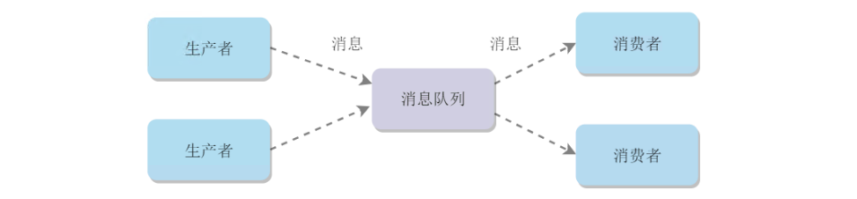
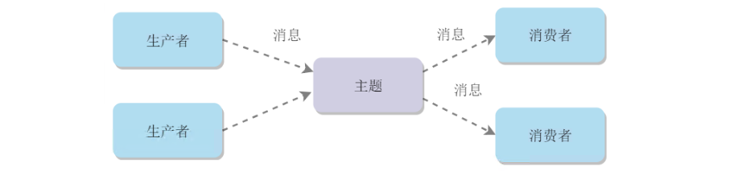
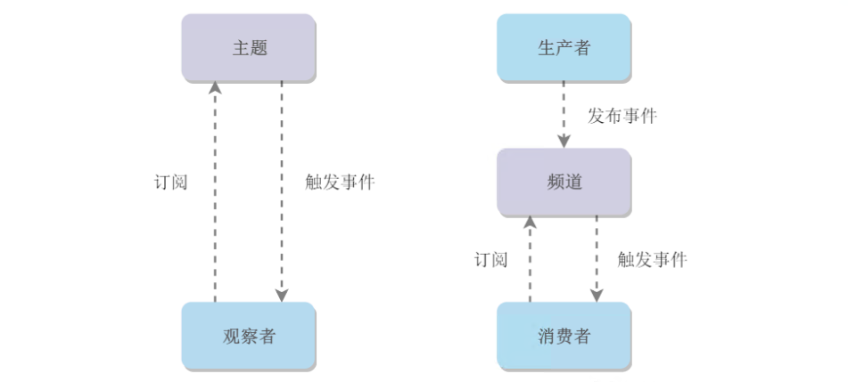

[TOC]

### 消息队列概述

#### 什么是消息队列

我们可以把消息队列比作是一个存放消息的容器，当我们需要使用消息的时候可以取出消息供自己使用。消息队列是分布式系统中重要的组件，使用消息队列主要是为了通过异步处理提高系统性能和削峰、降低系统耦合性。目前使用较多的消息队列有 ActiveMQ，RabbitMQ，Kafka，RocketMQ，我们后面会一一对比这些消息队列。

另外，我们知道队列 Queue 是一种先进先出的数据结构，所以消费消息时也是按照顺序来消费的。比如生产者发送消息1,2,3...对于消费者就会按照1,2,3...的顺序来消费。但是偶尔也会出现消息被消费的顺序不对的情况，比如某个消息消费失败又或者一个 queue 多个consumer 也会导致消息被消费的顺序不对，我们一定要保证消息被消费的顺序正确。

除了上面说的消息消费顺序的问题，使用消息队列，我们还要考虑如何保证消息不被重复消费？如何保证消息的可靠性传输（如何处理消息丢失的问题）？......等等问题。所以说使用消息队列也不是十全十美的，使用它也会让系统可用性降低、复杂度提高，另外需要我们保障一致性等问题。

#### 消息模型

##### 1. 点对点

消息生产者向消息队列中发送了一个消息之后，只能被一个消费者消费一次。

##### 2. 发布/订阅

消息生产者向频道发送一个消息之后，多个消费者可以从该频道订阅到这条消息并消费。

发布与订阅模式和观察者模式有以下不同：

- 观察者模式中，观察者和主题都知道对方的存在；而在发布与订阅模式中，生产者与消费者不知道对方的存在，它们之间通过频道进行通信。
- 观察者模式是同步的，当事件触发时，主题会调用观察者的方法，然后等待方法返回；而发布与订阅模式是异步的，生产者向频道发送一个消息之后，就不需要关心消费者何时去订阅这个消息，可以立即返回。

#### 使用场景

> **为什么使用消息队列?**

面试官问你这个问题，**期望的一个回答**是说，你们公司有个什么**业务场景**，这个业务场景有个什么技术挑战，如果不用 MQ 可能会很麻烦，但是你现在用了 MQ 之后带给了你很多的好处。

先说一下消息队列常见的使用场景吧，其实场景有很多，但是比较核心的有 3 个：**解耦**、**异步**、**削峰**。

##### 1. 解耦

看这么个场景。A 系统发送数据到 **BCD 三个系统**，通过接口调用发送。如果 E 系统也要这个数据呢？那如果 C 系统现在不需要了呢？A 系统负责人几乎崩溃......

在这个场景中，A 系统跟其它各种乱七八糟的系统**严重耦合**，A 系统产生一条比较关键的数据，很多系统都需要 A 系统将这个数据发送过来。A 系统要时时刻刻考虑 BCDE 四个系统如果挂了该咋办？要不要重发，要不要把消息存起来？头发都白了啊！

如果使用 MQ，**A 系统产生一条数据，发送到 MQ 里面去，哪个系统需要数据自己去 MQ 里面消费**。如果新系统需要数据，直接从 MQ 里消费即可；如果某个系统不需要这条数据了，就取消对 MQ 消息的消费即可。这样下来，A 系统压根儿不需要去考虑要给谁发送数据，不需要维护这个代码，也不需要考虑人家是否调用成功、失败超时等情况。

**总结**：通过一个 MQ，Pub/Sub 发布订阅消息这么一个模型，A 系统就跟其它系统彻底解耦了。

**面试技巧**：你需要去考虑一下你负责的系统中是否有类似的场景，就是一个系统或者一个模块，调用了多个系统或者模块，互相之间的调用很复杂，维护起来很麻烦。但是其实这个调用是不需要直接同步调用接口的，如果用 MQ 给它异步化解耦，也是可以的，你就需要去考虑在你的项目里，是不是可以运用这个 MQ 去进行系统的解耦。在**简历**中体现出来这块东西，用 MQ 作解耦。

##### 2. 异步

再来看一个场景，**A 系统接收一个请求**，需要在自己**本地写库**，还需要在 BCD 三个系统写库，自己本地写库要 3ms，BCD 三个系统分别写库要 300ms、450ms、200ms。最终请求总延时是 3 + 300 + 450 + 200 = 953ms，接近 1s，用户感觉搞个什么东西，慢死了慢死了。用户通过浏览器发起请求，等待个 1s，这几乎是不可接受的。

一般互联网类的企业，对于用户直接的操作，一般要求是每个请求都必须在 200 ms 以内完成，对用户几乎是**无感知**的。

如果**使用 MQ**，那么 A 系统连续发送 3 条消息到 MQ 队列中，假如耗时 5ms，A 系统从接受一个请求到返回响应给用户，总时长是 3 + 5 = 8ms，对于用户而言，其实感觉上就是点个按钮，**8ms 以后就直接返回**了，爽！网站做得真好，真快！

##### 3. 削峰

每天 0:00 到 12:00，A 系统风平浪静，每秒并发请求数量就 50 个。结果每次一到 12:00 ~ 13:00 ，每秒并发请求数量突然会暴增到 5k+ 条。但是系统是**直接基于 MySQL** 的，大量的请求涌入 MySQL，每秒钟对 MySQL 执行约 5k 条 SQL。一般的 MySQL，扛到每秒 2k 个请求就差不多了，如果每秒请求到 5k 的话，可能就直接把 MySQL 给打死了，导致系统崩溃，用户也就没法再使用系统了。

但是高峰期一过，到了下午的时候，就成了**低峰期**，可能也就 1w 的用户同时在网站上操作，每秒中的请求数量可能也就 50 个请求，对整个系统几乎没有任何的压力。

如果使用 MQ，每秒 5k 个请求写入 MQ，A 系统每秒钟最多处理 2k 个请求，因为 MySQL 每秒钟最多处理 2k 个。A **系统从 MQ 中慢慢拉取请求**，每秒钟就拉取 2k 个请求，不要超过自己每秒能处理的最大请求数量就 ok，这样下来，哪怕是高峰期的时候，A 系统也绝对不会挂掉。而 MQ 每秒钟 5k 个请求进来，就 2k 个请求出去，结果就导致在中午高峰期（1 个小时），可能有几十万甚至几百万的请求积压在 MQ 中。

这个短暂的高峰期积压是 OK 的，因为高峰期过了之后，每秒钟就 50 个请求进 MQ，但是 A 系统依然会按照每秒 2k 个请求的速度在处理。所以说，只要高峰期一过，A 系统就会快速将积压的消息给解决掉。

#### 使用消息队列带来的一些问题

- **系统可用性降低：** 系统可用性在某种程度上降低，为什么这样说呢？在加入 MQ 之前，你不用考虑消息丢失或者说 MQ 挂掉等等的情况，但是，引入 MQ 之后你就需要去考虑了，比如需要考虑消息队列的高可用！
- **系统复杂性提高：** 加入MQ之后，你需要保证消息**没有被重复消费、处理消息丢失的情况、保证消息传递的顺序性**等等问题！
- **一致性问题：** 我上面讲了消息队列可以实现异步，消息队列带来的异步确实可以提高系统响应速度。但是，万一消息的真正消费者并没有正确消费消息怎么办？这样就会导致数据不一致的情况了！比如 A 系统处理完了直接返回成功了，人都以为你这个请求就成功了；但是问题是，要是 BCD 三个系统那里，BD 两个系统写库成功了，结果 C 系统写库失败了，咋整？你这数据就不一致了。

所以消息队列实际是一种非常复杂的架构，你引入它有很多好处，但是也得针对它带来的坏处做各种额外的技术方案和架构来规避掉，做好之后，你会发现，妈呀，系统复杂度提升了一个数量级，也许是复杂了 10 倍。但是关键时刻，用，还是得用的。

#### 可靠性

##### 1. 发送端的可靠性

发送端完成操作后一定能将消息成功发送到消息队列中。

实现方法：在本地数据库建一张消息表，将消息数据与业务数据保存在同一数据库实例里，这样就可以利用本地数据库的事务机制。事务提交成功后，将消息表中的消息转移到消息队列中，若转移消息成功则删除消息表中的数据，否则继续重传。

##### 2. 接收端的可靠性

接收端能够从消息队列成功消费一次消息。

两种实现方法：

- 保证接收端处理消息的业务逻辑具有幂等性：只要具有幂等性，那么消费多少次消息，最后处理的结果都是一样的。
- 保证消息具有唯一编号，并使用一张日志表来记录已经消费的消息编号。

#### JMS VS AMQP

##### 1. JMS

###### ① JMS简介

　　JMS（JAVA Message Service,java消息服务）是java的消息服务，JMS的客户端之间可以通过JMS服务进行异步的消息传输。**JMS（JAVA Message Service，Java消息服务）API是一个消息服务的标准或者说是规范**，允许应用程序组件基于JavaEE平台创建、发送、接收和读取消息。它使分布式通信耦合度更低，消息服务更加可靠以及异步性。

**ActiveMQ 就是基于 JMS 规范实现的。**

###### ② JMS两种消息模型

① 点到点（P2P）模型

使用**队列（Queue）**作为消息通信载体；满足**生产者与消费者模式**，一条消息只能被一个消费者使用，未被消费的消息在队列中保留直到被消费或超时。比如：我们生产者发送100条消息的话，两个消费者来消费一般情况下两个消费者会按照消息发送的顺序各自消费一半（也就是你一个我一个的消费。）

② 发布/订阅（Pub/Sub）模型

发布订阅模型（Pub/Sub） 使用**主题（Topic）**作为消息通信载体，类似于**广播模式**；发布者发布一条消息，该消息通过主题传递给所有的订阅者，**在一条消息广播之后才订阅的用户则是收不到该条消息的**。

###### ③ JMS 五种不同的消息正文格式

　　JMS定义了五种不同的消息正文格式，以及调用的消息类型，允许你发送并接收以一些不同形式的数据，提供现有消息格式的一些级别的兼容性。

- StreamMessage -- Java原始值的数据流
- MapMessage--一套名称-值对
- TextMessage--一个字符串对象
- ObjectMessage--一个序列化的 Java对象
- BytesMessage--一个字节的数据流

##### 2. AMQP

　　​ AMQP，即Advanced Message Queuing Protocol，一个提供统一消息服务的应用层标准 **高级消息队列协议**（二进制应用层协议），是应用层协议的一个开放标准,为面向消息的中间件设计，兼容 JMS。基于此协议的客户端与消息中间件可传递消息，并不受客户端/中间件同产品，不同的开发语言等条件的限制。

**RabbitMQ 就是基于 AMQP 协议实现的。**

提供了五种消息模型：①direct exchange；②fanout exchange；③topic change；④headers exchange；⑤system exchange。本质来讲，后四种和JMS的pub/sub模型没有太大差别，仅是在路由机制上做了更详细的划分；

##### 3. JMS vs AMQP

|   对比方向   |                   JMS                    |        AMQP        |
| :----------: | :--------------------------------------: | :----------------: |
|     定义     |                 Java API                 |        协议        |
|    跨语言    |                    否                    |         是         |
|    跨平台    |                    否                    |         是         |
| 支持消息类型 | 提供两种消息模型：①Peer-2-Peer; ②Pub/sub | 提供了五种消息模型 |
| 支持消息类型 |   支持多种消息类型 ，我们在上面提到过    |  byte[]（二进制）  |

**总结：**

- AMQP 为消息定义了线路层（wire-level protocol）的协议，而JMS所定义的是API规范。在 Java 体系中，多个client均可以通过JMS进行交互，不需要应用修改代码，但是其对跨平台的支持较差。而AMQP天然具有跨平台、跨语言特性。
- JMS 支持TextMessage、MapMessage 等复杂的消息类型；而 AMQP 仅支持 byte[] 消息类型（复杂的类型可序列化后发送）。
- 由于Exchange 提供的路由算法，AMQP可以提供多样化的路由方式来传递消息到消息队列，而 JMS 仅支持 队列 和 主题/订阅 方式两种。 

#### 常见的消息队列对比

| 对比方向 |                             概要                             |
| :------: | :----------------------------------------------------------: |
|  吞吐量  | 万级的 ActiveMQ 和 RabbitMQ 的吞吐量（ActiveMQ 的性能最差）要比 十万级甚至是百万级的 RocketMQ 和 Kafka 低一个数量级。 |
|  可用性  | 都可以实现高可用。ActiveMQ 和 RabbitMQ 都是基于主从架构实现高可用性。RocketMQ 基于分布式架构。 kafka 也是分布式的，一个数据多个副本，少数机器宕机，不会丢失数据，不会导致不可用 |
|  时效性  | RabbitMQ 基于 erlang 开发，所以并发能力很强，性能极其好，延时很低，达到微秒级。其他三个都是 ms 级。 |
| 功能支持 | 除了 Kafka，其他三个功能都较为完备。 Kafka 功能较为简单，主要支持简单的 MQ 功能，在大数据领域的实时计算以及日志采集被大规模使用，是事实上的标准 |
| 消息丢失 | ActiveMQ 和 RabbitMQ 丢失的可能性非常低， RocketMQ 和 Kafka 理论上不会丢失。 |

**总结：**

- ActiveMQ 的社区算是比较成熟，但是较目前来说，ActiveMQ 的性能比较差，而且版本迭代很慢，不推荐使用。
- RabbitMQ 在吞吐量方面虽然稍逊于 Kafka 和 RocketMQ ，但是由于它基于 erlang 开发，所以并发能力很强，性能极其好，延时很低，达到微秒级。但是也因为 RabbitMQ 基于 erlang 开发，所以国内很少有公司有实力做erlang源码级别的研究和定制。如果业务场景对并发量要求不是太高（十万级、百万级），那这四种消息队列中，RabbitMQ 一定是你的首选。如果是大数据领域的实时计算、日志采集等场景，用 Kafka 是业内标准的，绝对没问题，社区活跃度很高，绝对不会黄，何况几乎是全世界这个领域的事实性规范。
- RocketMQ 阿里出品，Java 系开源项目，源代码我们可以直接阅读，然后可以定制自己公司的MQ，并且 RocketMQ 有阿里巴巴的实际业务场景的实战考验。RocketMQ 社区活跃度相对较为一般，不过也还可以，文档相对来说简单一些，然后接口这块不是按照标准 JMS 规范走的有些系统要迁移需要修改大量代码。还有就是阿里出台的技术，你得做好这个技术万一被抛弃，社区黄掉的风险，那如果你们公司有技术实力我觉得用RocketMQ 挺好的
- kafka 的特点其实很明显，就是仅仅提供较少的核心功能，但是提供超高的吞吐量，ms 级的延迟，极高的可用性以及可靠性，而且分布式可以任意扩展。同时 kafka 最好是支撑较少的 topic 数量即可，保证其超高吞吐量。kafka 唯一的一点劣势是有可能消息重复消费，那么对数据准确性会造成极其轻微的影响，在大数据领域中以及日志采集中，这点轻微影响可以忽略这个特性天然适合大数据实时计算以及日志收集。

> **Kafka、ActiveMQ、RabbitMQ、RocketMQ 有什么优缺点？**

|           特性           |               ActiveMQ                |                      RabbitMQ                      |                           RocketMQ                           |                            Kafka                             |
| :----------------------: | :-----------------------------------: | :------------------------------------------------: | :----------------------------------------------------------: | :----------------------------------------------------------: |
|        单机吞吐量        | 万级，比 RocketMQ、Kafka 低一个数量级 |                    同 ActiveMQ                     |                     10 万级，支撑高吞吐                      | 10 万级，高吞吐，一般配合大数据类的系统来进行实时数据计算、日志采集等场景 |
| topic 数量对吞吐量的影响 |                                       |                                                    | topic 可以达到几百/几千的级别，吞吐量会有较小幅度的下降，这是 RocketMQ 的一大优势，在同等机器下，可以支撑大量的 topic | topic 从几十到几百个时候，吞吐量会大幅度下降，在同等机器下，Kafka 尽量保证 topic 数量不要过多，如果要支撑大规模的 topic，需要增加更多的机器资源 |
|          时效性          |                 ms 级                 |     微秒级，这是 RabbitMQ 的一大特点，延迟最低     |                            ms 级                             |                       延迟在 ms 级以内                       |
|          可用性          |      高，基于主从架构实现高可用       |                    同 ActiveMQ                     |                      非常高，分布式架构                      | 非常高，分布式，一个数据多个副本，少数机器宕机，不会丢失数据，不会导致不可用 |
|        消息可靠性        |         有较低的概率丢失数据          |                      基本不丢                      |              经过参数优化配置，可以做到 0 丢失               |                         同 RocketMQ                          |
|         功能支持         |         MQ 领域的功能极其完备         | 基于 erlang 开发，并发能力很强，性能极好，延时很低 |           MQ 功能较为完善，还是分布式的，扩展性好            | 功能较为简单，主要支持简单的 MQ 功能，在大数据领域的实时计算以及日志采集被大规模使用 |

综上，各种对比之后，有如下建议：

一般的业务系统要引入 MQ，最早大家都用 ActiveMQ，但是现在确实大家用的**不多**了，没经过大规模吞吐量场景的验证，不推荐用这个了；

后来大家开始用 RabbitMQ，但是确实 erlang 语言阻止了大量的 Java 工程师去深入研究和掌控它，对公司而言，几乎处于不可控的状态，但是确实人家是开源的，比较稳定的支持，活跃度也高；

不过现在确实越来越多的公司会去用 RocketMQ，确实很不错，毕竟是阿里出品，但社区可能有突然黄掉的风险（目前 RocketMQ 已捐给 Apache，但 GitHub 上的活跃度其实不算高）对自己公司技术实力有绝对自信的，推荐用 RocketMQ，否则回去老老实实用 RabbitMQ 吧，人家有活跃的开源社区，绝对不会黄。

所以**中小型公司**，技术实力较为一般，技术挑战不是特别高，用 **RabbitMQ** 是不错的选择；**大型公司**，基础架构研发实力较强，用 RocketMQ 是很好的选择。

如果是**大数据领域**的实时计算、日志采集等场景，用 **Kafka** 是业内标准的，绝对没问题，社区活跃度很高，绝对不会黄，何况几乎是全世界这个领域的事实性规范。

#### 参考资料

- [Observer vs Pub-Sub](http://developers-club.com/posts/270339/)
- [消息队列中点对点与发布订阅区别](https://blog.csdn.net/lizhitao/article/details/47723105)