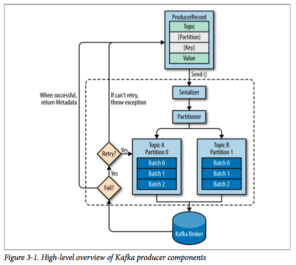
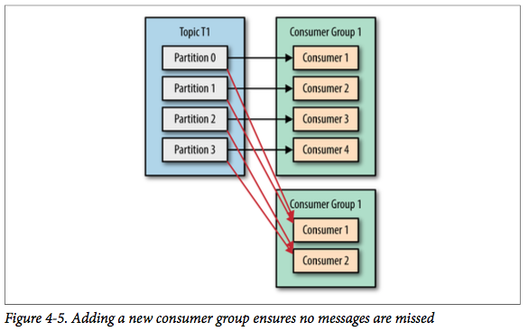
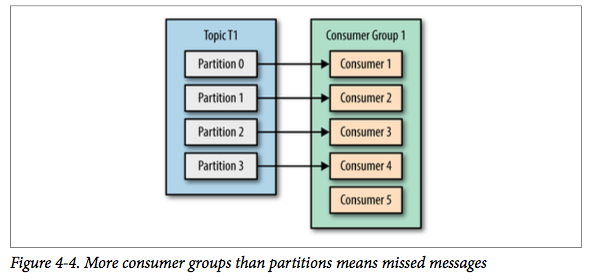
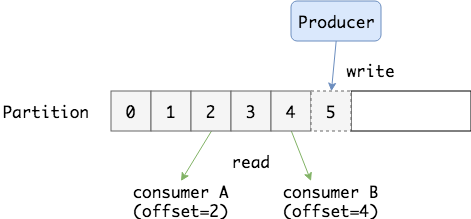
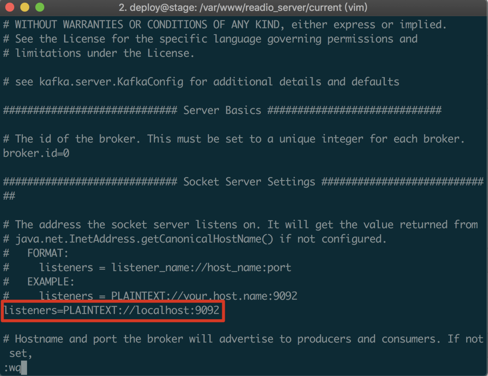

> 本文由 JavaGuide 读者推荐，JavaGuide 对文章进行了整理排版！原文地址：https://www.wmyskxz.com/2019/07/17/kafka-ru-men-jiu-zhe-yi-pian/ ， 作者：我没有三颗心脏。

# 一、Kafka 简介

------

## Kafka 创建背景

**Kafka** 是一个消息系统，原本开发自 LinkedIn，用作 LinkedIn 的活动流（Activity Stream）和运营数据处理管道（Pipeline）的基础。现在它已被[多家不同类型的公司](https://cwiki.apache.org/confluence/display/KAFKA/Powered+By) 作为多种类型的数据管道和消息系统使用。

**活动流数据**是几乎所有站点在对其网站使用情况做报表时都要用到的数据中最常规的部分。活动数据包括页面访问量（Page View）、被查看内容方面的信息以及搜索情况等内容。这种数据通常的处理方式是先把各种活动以日志的形式写入某种文件，然后周期性地对这些文件进行统计分析。**运营数据**指的是服务器的性能数据（CPU、IO 使用率、请求时间、服务日志等等数据)。运营数据的统计方法种类繁多。

近年来，活动和运营数据处理已经成为了网站软件产品特性中一个至关重要的组成部分，这就需要一套稍微更加复杂的基础设施对其提供支持。

## Kafka 简介

**Kafka 是一种分布式的，基于发布 / 订阅的消息系统。** 

主要设计目标如下：

- 以时间复杂度为 O(1) 的方式提供消息持久化能力，即使对 TB 级以上数据也能保证常数时间复杂度的访问性能。
- 高吞吐率。即使在非常廉价的商用机器上也能做到单机支持每秒 100K 条以上消息的传输。
- 支持 Kafka Server 间的消息分区，及分布式消费，同时保证每个 Partition 内的消息顺序传输。
- 同时支持离线数据处理和实时数据处理。
- Scale out：支持在线水平扩展。

## Kafka 基础概念

### 概念一：生产者与消费者


对于 Kafka 来说客户端有两种基本类型：

1. **生产者（Producer）**
2. **消费者（Consumer）**。

除此之外，还有用来做数据集成的 Kafka Connect API 和流式处理的 Kafka Streams 等高阶客户端，但这些高阶客户端底层仍然是生产者和消费者API，它们只不过是在上层做了封装。

这很容易理解，生产者（也称为发布者）创建消息，而消费者（也称为订阅者）负责消费or读取消息。

### 概念二：主题（Topic）与分区（Partition）


在 Kafka 中，消息以**主题（Topic）**来分类，每一个主题都对应一个 **「消息队列」**，这有点儿类似于数据库中的表。但是如果我们把所有同类的消息都塞入到一个“中心”队列中，势必缺少可伸缩性，无论是生产者/消费者数目的增加，还是消息数量的增加，都可能耗尽系统的性能或存储。

我们使用一个生活中的例子来说明：现在 A 城市生产的某商品需要运输到 B 城市，走的是公路，那么单通道的高速公路不论是在「A 城市商品增多」还是「现在 C 城市也要往 B 城市运输东西」这样的情况下都会出现「吞吐量不足」的问题。所以我们现在引入**分区（Partition）**的概念，类似“允许多修几条道”的方式对我们的主题完成了水平扩展。

### 概念三：Broker 和集群（Cluster）

一个 Kafka 服务器也称为 Broker，它接受生产者发送的消息并存入磁盘；Broker 同时服务消费者拉取分区消息的请求，返回目前已经提交的消息。使用特定的机器硬件，一个 Broker 每秒可以处理成千上万的分区和百万量级的消息。（现在动不动就百万量级..我特地去查了一把，好像确实集群的情况下吞吐量挺高的..嗯..）

若干个 Broker 组成一个集群（Cluster），其中集群内某个 Broker 会成为集群控制器（Cluster Controller），它负责管理集群，包括分配分区到 Broker、监控 Broker 故障等。在集群内，一个分区由一个 Broker 负责，这个 Broker 也称为这个分区的 Leader；当然一个分区可以被复制到多个 Broker 上来实现冗余，这样当存在 Broker 故障时可以将其分区重新分配到其他 Broker 来负责。下图是一个样例：


Kafka 的一个关键性质是日志保留（retention），我们可以配置主题的消息保留策略，譬如只保留一段时间的日志或者只保留特定大小的日志。当超过这些限制时，老的消息会被删除。我们也可以针对某个主题单独设置消息过期策略，这样对于不同应用可以实现个性化。

### 概念四：多集群

随着业务发展，我们往往需要多集群，通常处于下面几个原因：

- 基于数据的隔离；
- 基于安全的隔离；
- 多数据中心（容灾）

当构建多个数据中心时，往往需要实现消息互通。举个例子，假如用户修改了个人资料，那么后续的请求无论被哪个数据中心处理，这个更新需要反映出来。又或者，多个数据中心的数据需要汇总到一个总控中心来做数据分析。

上面说的分区复制冗余机制只适用于同一个 Kafka 集群内部，对于多个 Kafka 集群消息同步可以使用 Kafka 提供的 MirrorMaker 工具。本质上来说，MirrorMaker 只是一个 Kafka 消费者和生产者，并使用一个队列连接起来而已。它从一个集群中消费消息，然后往另一个集群生产消息。


# 二、Kafka 的设计与实现

------

上面我们知道了 Kafka 中的一些基本概念，但作为一个成熟的「消息队列」中间件，其中有许多有意思的设计值得我们思考，下面我们简单列举一些。

## 讨论一：Kafka 存储在文件系统上

是的，**您首先应该知道 Kafka 的消息是存在于文件系统之上的**。Kafka 高度依赖文件系统来存储和缓存消息，一般的人认为 “磁盘是缓慢的”，所以对这样的设计持有怀疑态度。实际上，磁盘比人们预想的快很多也慢很多，这取决于它们如何被使用；一个好的磁盘结构设计可以使之跟网络速度一样快。

现代的操作系统针对磁盘的读写已经做了一些优化方案来加快磁盘的访问速度。比如，**预读**会提前将一个比较大的磁盘快读入内存。**后写**会将很多小的逻辑写操作合并起来组合成一个大的物理写操作。并且，操作系统还会将主内存剩余的所有空闲内存空间都用作**磁盘缓存**，所有的磁盘读写操作都会经过统一的磁盘缓存（除了直接 I/O 会绕过磁盘缓存）。综合这几点优化特点，**如果是针对磁盘的顺序访问，某些情况下它可能比随机的内存访问都要快，甚至可以和网络的速度相差无几。**

**上述的 Topic 其实是逻辑上的概念，面相消费者和生产者，物理上存储的其实是 Partition**，每一个 Partition 最终对应一个目录，里面存储所有的消息和索引文件。默认情况下，每一个 Topic 在创建时如果不指定 Partition 数量时只会创建 1 个 Partition。比如，我创建了一个 Topic 名字为 test ，没有指定 Partition 的数量，那么会默认创建一个 test-0 的文件夹，这里的命名规则是：`<topic_name>-<partition_id>`。


任何发布到 Partition 的消息都会被追加到 Partition 数据文件的尾部，这样的顺序写磁盘操作让 Kafka 的效率非常高（经验证，顺序写磁盘效率比随机写内存还要高，这是 Kafka 高吞吐率的一个很重要的保证）。

每一条消息被发送到 Broker 中，会根据 Partition 规则选择被存储到哪一个 Partition。如果 Partition 规则设置的合理，所有消息可以均匀分布到不同的 Partition中。

## 讨论二：Kafka 中的底层存储设计

假设我们现在 Kafka 集群只有一个 Broker，我们创建 2 个 Topic 名称分别为：「topic1」和「topic2」，Partition 数量分别为 1、2，那么我们的根目录下就会创建如下三个文件夹：

```shell
    | --topic1-0
    | --topic2-0
    | --topic2-1
```

在 Kafka 的文件存储中，同一个 Topic 下有多个不同的 Partition，每个 Partition 都为一个目录，而每一个目录又被平均分配成多个大小相等的 **Segment File** 中，Segment File 又由 index file 和 data file 组成，他们总是成对出现，后缀 “.index” 和 “.log” 分表表示 Segment 索引文件和数据文件。

现在假设我们设置每个 Segment 大小为 500 MB，并启动生产者向 topic1 中写入大量数据，topic1-0 文件夹中就会产生类似如下的一些文件：

```shell
   | --topic1-0 
       | --00000000000000000000.index 
       | --00000000000000000000.log 
       | --00000000000000368769.index 
       | --00000000000000368769.log 
       | --00000000000000737337.index 
       | --00000000000000737337.log 
       | --00000000000001105814.index | --00000000000001105814.log 
   | --topic2-0 
   | --topic2-1

```

**Segment 是 Kafka 文件存储的最小单位。**Segment 文件命名规则：Partition 全局的第一个 Segment 从 0 开始，后续每个 Segment 文件名为上一个 Segment 文件最后一条消息的 offset 值。数值最大为 64 位 long 大小，19 位数字字符长度，没有数字用0填充。如 00000000000000368769.index 和 00000000000000368769.log。

以上面的一对 Segment File 为例，说明一下索引文件和数据文件对应关系：


其中以索引文件中元数据 `<3, 497>` 为例，依次在数据文件中表示第 3 个 message（在全局 Partition 表示第 368769 + 3 = 368772 个 message）以及该消息的物理偏移地址为 497。

注意该 index 文件并不是从0开始，也不是每次递增1的，这是因为 Kafka 采取稀疏索引存储的方式，每隔一定字节的数据建立一条索引，它减少了索引文件大小，使得能够把 index 映射到内存，降低了查询时的磁盘 IO 开销，同时也并没有给查询带来太多的时间消耗。

因为其文件名为上一个 Segment 最后一条消息的 offset ，所以当需要查找一个指定 offset 的 message 时，通过在所有 segment 的文件名中进行二分查找就能找到它归属的 segment ，再在其 index 文件中找到其对应到文件上的物理位置，就能拿出该 message 。

由于消息在 Partition 的 Segment 数据文件中是顺序读写的，且消息消费后不会删除（删除策略是针对过期的 Segment 文件），这种顺序磁盘 IO 存储设计师 Kafka 高性能很重要的原因。

> Kafka 是如何准确的知道 message 的偏移的呢？这是因为在 Kafka 定义了标准的数据存储结构，在 Partition 中的每一条 message 都包含了以下三个属性：
>
> - offset：表示 message 在当前 Partition 中的偏移量，是一个逻辑上的值，唯一确定了 Partition 中的一条 message，可以简单的认为是一个 id；
> - MessageSize：表示 message 内容 data 的大小；
> - data：message 的具体内容

## 讨论三：生产者设计概要

当我们发送消息之前，先问几个问题：每条消息都是很关键且不能容忍丢失么？偶尔重复消息可以么？我们关注的是消息延迟还是写入消息的吞吐量？

举个例子，有一个信用卡交易处理系统，当交易发生时会发送一条消息到 Kafka，另一个服务来读取消息并根据规则引擎来检查交易是否通过，将结果通过 Kafka 返回。对于这样的业务，消息既不能丢失也不能重复，由于交易量大因此吞吐量需要尽可能大，延迟可以稍微高一点。

再举个例子，假如我们需要收集用户在网页上的点击数据，对于这样的场景，少量消息丢失或者重复是可以容忍的，延迟多大都不重要只要不影响用户体验，吞吐则根据实时用户数来决定。

不同的业务需要使用不同的写入方式和配置。具体的方式我们在这里不做讨论，现在先看下生产者写消息的基本流程：



图片来源：[http://www.dengshenyu.com/%E5%88%86%E5%B8%83%E5%BC%8F%E7%B3%BB%E7%BB%9F/2017/11/12/kafka-producer.html](http://www.dengshenyu.com/分布式系统/2017/11/12/kafka-producer.html)

流程如下：

1. 首先，我们需要创建一个ProducerRecord，这个对象需要包含消息的主题（topic）和值（value），可以选择性指定一个键值（key）或者分区（partition）。
2. 发送消息时，生产者会对键值和值序列化成字节数组，然后发送到分配器（partitioner）。
3. 如果我们指定了分区，那么分配器返回该分区即可；否则，分配器将会基于键值来选择一个分区并返回。
4. 选择完分区后，生产者知道了消息所属的主题和分区，它将这条记录添加到相同主题和分区的批量消息中，另一个线程负责发送这些批量消息到对应的Kafka broker。
5. 当broker接收到消息后，如果成功写入则返回一个包含消息的主题、分区及位移的RecordMetadata对象，否则返回异常。
6. 生产者接收到结果后，对于异常可能会进行重试。


## 讨论四：消费者设计概要

### 消费者与消费组

假设这么个场景：我们从Kafka中读取消息，并且进行检查，最后产生结果数据。我们可以创建一个消费者实例去做这件事情，但如果生产者写入消息的速度比消费者读取的速度快怎么办呢？这样随着时间增长，消息堆积越来越严重。对于这种场景，我们需要增加多个消费者来进行水平扩展。

Kafka消费者是**消费组**的一部分，当多个消费者形成一个消费组来消费主题时，每个消费者会收到不同分区的消息。假设有一个T1主题，该主题有4个分区；同时我们有一个消费组G1，这个消费组只有一个消费者C1。那么消费者C1将会收到这4个分区的消息，如下所示：


如果我们增加新的消费者C2到消费组G1，那么每个消费者将会分别收到两个分区的消息，如下所示：


如果增加到4个消费者，那么每个消费者将会分别收到一个分区的消息，如下所示：



但如果我们继续增加消费者到这个消费组，剩余的消费者将会空闲，不会收到任何消息：



总而言之，我们可以通过增加消费组的消费者来进行水平扩展提升消费能力。这也是为什么建议创建主题时使用比较多的分区数，这样可以在消费负载高的情况下增加消费者来提升性能。另外，消费者的数量不应该比分区数多，因为多出来的消费者是空闲的，没有任何帮助。

**Kafka一个很重要的特性就是，只需写入一次消息，可以支持任意多的应用读取这个消息。**换句话说，每个应用都可以读到全量的消息。为了使得每个应用都能读到全量消息，应用需要有不同的消费组。对于上面的例子，假如我们新增了一个新的消费组G2，而这个消费组有两个消费者，那么会是这样的：


在这个场景中，消费组G1和消费组G2都能收到T1主题的全量消息，在逻辑意义上来说它们属于不同的应用。

最后，总结起来就是：如果应用需要读取全量消息，那么请为该应用设置一个消费组；如果该应用消费能力不足，那么可以考虑在这个消费组里增加消费者。

### 消费组与分区重平衡

可以看到，当新的消费者加入消费组，它会消费一个或多个分区，而这些分区之前是由其他消费者负责的；另外，当消费者离开消费组（比如重启、宕机等）时，它所消费的分区会分配给其他分区。这种现象称为**重平衡（rebalance）**。重平衡是 Kafka 一个很重要的性质，这个性质保证了高可用和水平扩展。**不过也需要注意到，在重平衡期间，所有消费者都不能消费消息，因此会造成整个消费组短暂的不可用。**而且，将分区进行重平衡也会导致原来的消费者状态过期，从而导致消费者需要重新更新状态，这段期间也会降低消费性能。后面我们会讨论如何安全的进行重平衡以及如何尽可能避免。

消费者通过定期发送心跳（hearbeat）到一个作为组协调者（group coordinator）的 broker 来保持在消费组内存活。这个 broker 不是固定的，每个消费组都可能不同。当消费者拉取消息或者提交时，便会发送心跳。

如果消费者超过一定时间没有发送心跳，那么它的会话（session）就会过期，组协调者会认为该消费者已经宕机，然后触发重平衡。可以看到，从消费者宕机到会话过期是有一定时间的，这段时间内该消费者的分区都不能进行消息消费；通常情况下，我们可以进行优雅关闭，这样消费者会发送离开的消息到组协调者，这样组协调者可以立即进行重平衡而不需要等待会话过期。

在 0.10.1 版本，Kafka 对心跳机制进行了修改，将发送心跳与拉取消息进行分离，这样使得发送心跳的频率不受拉取的频率影响。另外更高版本的 Kafka 支持配置一个消费者多长时间不拉取消息但仍然保持存活，这个配置可以避免活锁（livelock）。活锁，是指应用没有故障但是由于某些原因不能进一步消费。

### Partition 与消费模型

上面提到，Kafka 中一个 topic 中的消息是被打散分配在多个 Partition(分区) 中存储的， Consumer Group 在消费时需要从不同的 Partition 获取消息，那最终如何重建出 Topic 中消息的顺序呢？

答案是：没有办法。Kafka 只会保证在 Partition 内消息是有序的，而不管全局的情况。

下一个问题是：Partition 中的消息可以被（不同的 Consumer Group）多次消费，那 Partition中被消费的消息是何时删除的？ Partition 又是如何知道一个 Consumer Group 当前消费的位置呢？

无论消息是否被消费，除非消息到期 Partition 从不删除消息。例如设置保留时间为 2 天，则消息发布 2 天内任何 Group 都可以消费，2 天后，消息自动被删除。
Partition 会为每个 Consumer Group 保存一个偏移量，记录 Group 消费到的位置。 如下图：



### 为什么 Kafka 是 pull 模型

消费者应该向 Broker 要数据（pull）还是 Broker 向消费者推送数据（push）？作为一个消息系统，Kafka 遵循了传统的方式，选择由 Producer 向 broker push 消息并由 Consumer 从 broker pull 消息。一些 logging-centric system，比如 Facebook 的[Scribe](https://github.com/facebookarchive/scribe)和 Cloudera 的[Flume](https://flume.apache.org/)，采用 push 模式。事实上，push 模式和 pull 模式各有优劣。

**push 模式很难适应消费速率不同的消费者，因为消息发送速率是由 broker 决定的。**push 模式的目标是尽可能以最快速度传递消息，但是这样很容易造成 Consumer 来不及处理消息，典型的表现就是拒绝服务以及网络拥塞。**而 pull 模式则可以根据 Consumer 的消费能力以适当的速率消费消息。**

**对于 Kafka 而言，pull 模式更合适。**pull 模式可简化 broker 的设计，Consumer 可自主控制消费消息的速率，同时 Consumer 可以自己控制消费方式——即可批量消费也可逐条消费，同时还能选择不同的提交方式从而实现不同的传输语义。

## 讨论五：Kafka 如何保证可靠性

当我们讨论**可靠性**的时候，我们总会提到*保证**这个词语。可靠性保证是基础，我们基于这些基础之上构建我们的应用。比如关系型数据库的可靠性保证是ACID，也就是原子性（Atomicity）、一致性（Consistency）、隔离性（Isolation）和持久性（Durability）。

Kafka 中的可靠性保证有如下四点：

- 对于一个分区来说，它的消息是有序的。如果一个生产者向一个分区先写入消息A，然后写入消息B，那么消费者会先读取消息A再读取消息B。
- 当消息写入所有in-sync状态的副本后，消息才会认为**已提交（committed）**。这里的写入有可能只是写入到文件系统的缓存，不一定刷新到磁盘。生产者可以等待不同时机的确认，比如等待分区主副本写入即返回，后者等待所有in-sync状态副本写入才返回。
- 一旦消息已提交，那么只要有一个副本存活，数据不会丢失。
- 消费者只能读取到已提交的消息。

使用这些基础保证，我们构建一个可靠的系统，这时候需要考虑一个问题：究竟我们的应用需要多大程度的可靠性？可靠性不是无偿的，它与系统可用性、吞吐量、延迟和硬件价格息息相关，得此失彼。因此，我们往往需要做权衡，一味的追求可靠性并不实际。

> 想了解更多戳这里：http://www.dengshenyu.com/%E5%88%86%E5%B8%83%E5%BC%8F%E7%B3%BB%E7%BB%9F/2017/11/21/kafka-data-delivery.html

# 三、动手搭一个 Kafka

通过上面的描述，我们已经大致了解到了「Kafka」是何方神圣了，现在我们开始尝试自己动手本地搭一个来实际体验一把。

## 第一步：下载 Kafka

这里以 Mac OS 为例，在安装了 Homebrew 的情况下执行下列代码：

```shell
brew install kafka
```

由于 Kafka 依赖了 Zookeeper，所以在下载的时候会自动下载。

## 第二步：启动服务

我们在启动之前首先需要修改 Kafka 的监听地址和端口为 `localhost:9092`：

```shell
vi /usr/local/etc/kafka/server.properties
```


然后修改成下图的样子：


依次启动 Zookeeper 和 Kafka：

```shell
brew services start zookeeper
brew services start kafka
```

然后执行下列语句来创建一个名字为 “test” 的 Topic：

```shell
kafka-topics --create --zookeeper localhost:2181 --replication-factor 1 --partitions 1 --topic test
```

我们可以通过下列的命令查看我们的 Topic 列表：

```shell
kafka-topics --list --zookeeper localhost:2181
```

## 第三步：发送消息

然后我们新建一个控制台，运行下列命令创建一个消费者关注刚才创建的 Topic：

```shell
kafka-console-consumer --bootstrap-server localhost:9092 --topic test --from-beginning
```

用控制台往刚才创建的 Topic 中添加消息，并观察刚才创建的消费者窗口：

```shel
kafka-console-producer --broker-list localhost:9092 --topic test
```

能通过消费者窗口观察到正确的消息：


# 参考资料

------

1. https://www.infoq.cn/article/kafka-analysis-part-1 - Kafka 设计解析（一）：Kafka 背景及架构介绍
2. [http://www.dengshenyu.com/%E5%88%86%E5%B8%83%E5%BC%8F%E7%B3%BB%E7%BB%9F/2017/11/06/kafka-Meet-Kafka.html](http://www.dengshenyu.com/分布式系统/2017/11/06/kafka-Meet-Kafka.html) - Kafka系列（一）初识Kafka
3. https://lotabout.me/2018/kafka-introduction/ - Kafka 入门介绍
4. https://www.zhihu.com/question/28925721 - Kafka 中的 Topic 为什么要进行分区? - 知乎
5. https://blog.joway.io/posts/kafka-design-practice/ - Kafka 的设计与实践思考
6. [http://www.dengshenyu.com/%E5%88%86%E5%B8%83%E5%BC%8F%E7%B3%BB%E7%BB%9F/2017/11/21/kafka-data-delivery.html](http://www.dengshenyu.com/分布式系统/2017/11/21/kafka-data-delivery.html) - Kafka系列（六）可靠的数据传输


## Kafka面试题总结

### Kafka 是什么？主要应用场景有哪些？

Kafka 是一个分布式流式处理平台。这到底是什么意思呢？

流平台具有三个关键功能：

1. **消息队列**：发布和订阅消息流，这个功能类似于消息队列，这也是 Kafka 也被归类为消息队列的原因。
2. **容错的持久方式存储记录消息流**： Kafka 会把消息持久化到磁盘，有效避免了消息丢失的风险·。
3. **流式处理平台：** 在消息发布的时候进行处理，Kafka 提供了一个完整的流式处理类库。

Kafka 主要有两大应用场景：

1. **消息队列** ：建立实时流数据管道，以可靠地在系统或应用程序之间获取数据。
2. **数据处理：** 构建实时的流数据处理程序来转换或处理数据流。

### 和其他消息队列相比,Kafka的优势在哪里？

我们现在经常提到 Kafka 的时候就已经默认它是一个非常优秀的消息队列了，我们也会经常拿它给 RocketMQ、RabbitMQ 对比。我觉得 Kafka 相比其他消息队列主要的优势如下：

1. **极致的性能** ：基于 Scala 和 Java 语言开发，设计中大量使用了批量处理和异步的思想，最高可以每秒处理千万级别的消息。
2. **生态系统兼容性无可匹敌** ：Kafka 与周边生态系统的兼容性是最好的没有之一，尤其在大数据和流计算领域。

实际上在早期的时候 Kafka 并不是一个合格的消息队列，早期的 Kafka 在消息队列领域就像是一个衣衫褴褛的孩子一样，功能不完备并且有一些小问题比如丢失消息、不保证消息可靠性等等。当然，这也和 LinkedIn 最早开发 Kafka 用于处理海量的日志有很大关系，哈哈哈，人家本来最开始就不是为了作为消息队列滴，谁知道后面误打误撞在消息队列领域占据了一席之地。

随着后续的发展，这些短板都被 Kafka 逐步修复完善。所以，**Kafka 作为消息队列不可靠这个说法已经过时！**

### 队列模型了解吗？Kafka 的消息模型知道吗？

> 题外话：早期的 JMS 和 AMQP 属于消息服务领域权威组织所做的相关的标准，我在 [JavaGuide](https://github.com/Snailclimb/JavaGuide)的 [《消息队列其实很简单》](https://github.com/Snailclimb/JavaGuide#%E6%95%B0%E6%8D%AE%E9%80%9A%E4%BF%A1%E4%B8%AD%E9%97%B4%E4%BB%B6)这篇文章中介绍过。但是，这些标准的进化跟不上消息队列的演进速度，这些标准实际上已经属于废弃状态。所以，可能存在的情况是：不同的消息队列都有自己的一套消息模型。

#### 队列模型：早期的消息模型


**使用队列（Queue）作为消息通信载体，满足生产者与消费者模式，一条消息只能被一个消费者使用，未被消费的消息在队列中保留直到被消费或超时。** 比如：我们生产者发送 100 条消息的话，两个消费者来消费一般情况下两个消费者会按照消息发送的顺序各自消费一半（也就是你一个我一个的消费。）

**队列模型存在的问题：**

假如我们存在这样一种情况：我们需要将生产者产生的消息分发给多个消费者，并且每个消费者都能接收到完成的消息内容。

这种情况，队列模型就不好解决了。很多比较杠精的人就说：我们可以为每个消费者创建一个单独的队列，让生产者发送多份。这是一种非常愚蠢的做法，浪费资源不说，还违背了使用消息队列的目的。

#### 发布-订阅模型:Kafka 消息模型

发布-订阅模型主要是为了解决队列模型存在的问题。


发布订阅模型（Pub-Sub） 使用**主题（Topic）** 作为消息通信载体，类似于**广播模式**；发布者发布一条消息，该消息通过主题传递给所有的订阅者，**在一条消息广播之后才订阅的用户则是收不到该条消息的**。

**在发布 - 订阅模型中，如果只有一个订阅者，那它和队列模型就基本是一样的了。所以说，发布 - 订阅模型在功能层面上是可以兼容队列模型的。**

**Kafka 采用的就是发布 - 订阅模型。** 

> **RocketMQ 的消息模型和 Kafka 基本是完全一样的。唯一的区别是 Kafka 中没有队列这个概念，与之对应的是 Partition（分区）。**

### 什么是Producer、Consumer、Broker、Topic、Partition？

Kafka 将生产者发布的消息发送到 **Topic（主题）** 中，需要这些消息的消费者可以订阅这些 **Topic（主题）**，如下图所示：


上面这张图也为我们引出了，Kafka 比较重要的几个概念：

1. **Producer（生产者）** : 产生消息的一方。
2. **Consumer（消费者）** : 消费消息的一方。
3. **Broker（代理）** : 可以看作是一个独立的 Kafka 实例。多个 Kafka Broker 组成一个 Kafka Cluster。

同时，你一定也注意到每个 Broker 中又包含了 Topic 以及 Partition 这两个重要的概念：

- **Topic（主题）** : Producer 将消息发送到特定的主题，Consumer 通过订阅特定的 Topic(主题) 来消费消息。
- **Partition（分区）** : Partition 属于 Topic 的一部分。一个 Topic 可以有多个 Partition ，并且同一 Topic 下的 Partition 可以分布在不同的 Broker 上，这也就表明一个 Topic 可以横跨多个 Broker 。这正如我上面所画的图一样。

> 划重点：**Kafka 中的 Partition（分区） 实际上可以对应成为消息队列中的队列。这样是不是更好理解一点？**

### Kafka 的多副本机制了解吗？带来了什么好处？

还有一点我觉得比较重要的是 Kafka 为分区（Partition）引入了多副本（Replica）机制。分区（Partition）中的多个副本之间会有一个叫做 leader 的家伙，其他副本称为 follower。我们发送的消息会被发送到 leader 副本，然后 follower 副本才能从 leader 副本中拉取消息进行同步。

> 生产者和消费者只与 leader 副本交互。你可以理解为其他副本只是 leader 副本的拷贝，它们的存在只是为了保证消息存储的安全性。当 leader 副本发生故障时会从 follower 中选举出一个 leader,但是 follower 中如果有和 leader 同步程度达不到要求的参加不了 leader 的竞选。

**Kafka 的多分区（Partition）以及多副本（Replica）机制有什么好处呢？**

1. Kafka 通过给特定 Topic 指定多个 Partition, 而各个 Partition 可以分布在不同的 Broker 上, 这样便能提供比较好的并发能力（负载均衡）。
2. Partition 可以指定对应的 Replica 数, 这也极大地提高了消息存储的安全性, 提高了容灾能力，不过也相应的增加了所需要的存储空间。

### Zookeeper 在 Kafka 中的作用知道吗？

> **要想搞懂 zookeeper 在 Kafka 中的作用 一定要自己搭建一个 Kafka 环境然后自己进 zookeeper 去看一下有哪些文件夹和 Kafka 有关，每个节点又保存了什么信息。** 一定不要光看不实践，这样学来的也终会忘记！这部分内容参考和借鉴了这篇文章：https://www.jianshu.com/p/a036405f989c 。


下图就是我的本地 Zookeeper ，它成功和我本地的 Kafka 关联上（以下文件夹结构借助 idea 插件 Zookeeper tool 实现）。


ZooKeeper 主要为 Kafka 提供元数据的管理的功能。

从图中我们可以看出，Zookeeper 主要为 Kafka 做了下面这些事情：

1. **Broker 注册** ：在 Zookeeper 上会有一个专门**用来进行 Broker 服务器列表记录**的节点。每个 Broker 在启动时，都会到 Zookeeper 上进行注册，即到/brokers/ids 下创建属于自己的节点。每个 Broker 就会将自己的 IP 地址和端口等信息记录到该节点中去
2. **Topic 注册** ： 在 Kafka 中，同一个**Topic 的消息会被分成多个分区**并将其分布在多个 Broker 上，**这些分区信息及与 Broker 的对应关系**也都是由 Zookeeper 在维护。比如我创建了一个名字为 my-topic 的主题并且它有两个分区，对应到 zookeeper 中会创建这些文件夹：`/brokers/topics/my-topic/Partitions/0`、`/brokers/topics/my-topic/Partitions/1`
3. **负载均衡** ：上面也说过了 Kafka 通过给特定 Topic 指定多个 Partition, 而各个 Partition 可以分布在不同的 Broker 上, 这样便能提供比较好的并发能力。 对于同一个 Topic 的不同 Partition，Kafka 会尽力将这些 Partition 分布到不同的 Broker 服务器上。当生产者产生消息后也会尽量投递到不同 Broker 的 Partition 里面。当 Consumer 消费的时候，Zookeeper 可以根据当前的 Partition 数量以及 Consumer 数量来实现动态负载均衡。
4. ......

###  Kafka 如何保证消息的消费顺序？

我们在使用消息队列的过程中经常有业务场景需要严格保证消息的消费顺序，比如我们同时发了 2 个消息，这 2 个消息对应的操作分别对应的数据库操作是：更改用户会员等级、根据会员等级计算订单价格。假如这两条消息的消费顺序不一样造成的最终结果就会截然不同。

我们知道 Kafka 中 Partition(分区)是真正保存消息的地方，我们发送的消息都被放在了这里。而我们的 Partition(分区) 又存在于 Topic(主题) 这个概念中，并且我们可以给特定 Topic 指定多个 Partition。


每次添加消息到 Partition(分区) 的时候都会采用尾加法，如上图所示。Kafka 只能为我们保证 Partition(分区) 中的消息有序，而不能保证 Topic(主题) 中的 Partition(分区) 的有序。

> 消息在被追加到 Partition(分区)的时候都会分配一个特定的偏移量（offset）。Kafka 通过偏移量（offset）来保证消息在分区内的顺序性。

所以，我们就有一种很简单的保证消息消费顺序的方法：**1 个 Topic 只对应一个 Partition**。这样当然可以解决问题，但是破坏了 Kafka 的设计初衷。

Kafka 中发送 1 条消息的时候，可以指定 topic, partition, key,data（数据） 4 个参数。如果你发送消息的时候指定了 Partition 的话，所有消息都会被发送到指定的 Partition。并且，同一个 key 的消息可以保证只发送到同一个 partition，这个我们可以采用表/对象的 id 来作为 key 。

总结一下，对于如何保证 Kafka 中消息消费的顺序，有了下面两种方法：

1. 1 个 Topic 只对应一个 Partition。
2. （推荐）发送消息的时候指定 key/Partition。

当然不仅仅只有上面两种方法，上面两种方法是我觉得比较好理解的，

### Kafka 如何保证消息不丢失

#### 生产者丢失消息的情况

生产者(Producer) 调用`send`方法发送消息之后，消息可能因为网络问题并没有发送过去。 

所以，我们不能默认在调用`send`方法发送消息之后消息消息发送成功了。为了确定消息是发送成功，我们要判断消息发送的结果。但是要注意的是  Kafka 生产者(Producer) 使用  `send` 方法发送消息实际上是异步的操作，我们可以通过 `get()`方法获取调用结果，但是这样也让它变为了同步操作，示例代码如下：

> **详细代码见我的这篇文章：[Kafka系列第三篇！10 分钟学会如何在 Spring Boot 程序中使用 Kafka 作为消息队列?](https://mp.weixin.qq.com/s?__biz=Mzg2OTA0Njk0OA==&mid=2247486269&idx=2&sn=ec00417ad641dd8c3d145d74cafa09ce&chksm=cea244f6f9d5cde0c8eb233fcc4cf82e11acd06446719a7af55230649863a3ddd95f78d111de&token=1633957262&lang=zh_CN#rd)**

```java
SendResult<String, Object> sendResult = kafkaTemplate.send(topic, o).get();
if (sendResult.getRecordMetadata() != null) {
  logger.info("生产者成功发送消息到" + sendResult.getProducerRecord().topic() + "-> " + sendRe
              sult.getProducerRecord().value().toString());
}
```

但是一般不推荐这么做！可以采用为其添加回调函数的形式，示例代码如下：

````java
        ListenableFuture<SendResult<String, Object>> future = kafkaTemplate.send(topic, o);
        future.addCallback(result -> logger.info("生产者成功发送消息到topic:{} partition:{}的消息", result.getRecordMetadata().topic(), result.getRecordMetadata().partition()),
                ex -> logger.error("生产者发送消失败，原因：{}", ex.getMessage()));
````

如果消息发送失败的话，我们检查失败的原因之后重新发送即可！

**另外这里推荐为 Producer 的`retries `（重试次数）设置一个比较合理的值，一般是 3 ，但是为了保证消息不丢失的话一般会设置比较大一点。设置完成之后，当出现网络问题之后能够自动重试消息发送，避免消息丢失。另外，建议还要设置重试间隔，因为间隔太小的话重试的效果就不明显了，网络波动一次你3次一下子就重试完了**

#### 消费者丢失消息的情况

我们知道消息在被追加到 Partition(分区)的时候都会分配一个特定的偏移量（offset）。偏移量（offset)表示 Consumer 当前消费到的 Partition(分区)的所在的位置。Kafka 通过偏移量（offset）可以保证消息在分区内的顺序性。


当消费者拉取到了分区的某个消息之后，消费者会自动提交了 offset。自动提交的话会有一个问题，试想一下，当消费者刚拿到这个消息准备进行真正消费的时候，突然挂掉了，消息实际上并没有被消费，但是 offset 却被自动提交了。

**解决办法也比较粗暴，我们手动关闭闭自动提交 offset，每次在真正消费完消息之后之后再自己手动提交 offset 。** 但是，细心的朋友一定会发现，这样会带来消息被重新消费的问题。比如你刚刚消费完消息之后，还没提交 offset，结果自己挂掉了，那么这个消息理论上就会被消费两次。

#### Kafka 弄丢了消息

 我们知道 Kafka 为分区（Partition）引入了多副本（Replica）机制。分区（Partition）中的多个副本之间会有一个叫做 leader 的家伙，其他副本称为 follower。我们发送的消息会被发送到 leader 副本，然后 follower 副本才能从 leader 副本中拉取消息进行同步。生产者和消费者只与 leader 副本交互。你可以理解为其他副本只是 leader 副本的拷贝，它们的存在只是为了保证消息存储的安全性。

**试想一种情况：假如 leader 副本所在的 broker 突然挂掉，那么就要从 follower 副本重新选出一个 leader ，但是 leader 的数据还有一些没有被 follower 副本的同步的话，就会造成消息丢失。**

**设置 acks = all**

解决办法就是我们设置  **acks = all**。acks 是 Kafka 生产者(Producer)  很重要的一个参数。

acks 的默认值即为1，代表我们的消息被leader副本接收之后就算被成功发送。当我们配置 **acks = all** 代表则所有副本都要接收到该消息之后该消息才算真正成功被发送。

**设置 replication.factor >= 3**

为了保证 leader 副本能有 follower 副本能同步消息，我们一般会为 topic 设置 **replication.factor >= 3**。这样就可以保证每个 分区(partition) 至少有 3 个副本。虽然造成了数据冗余，但是带来了数据的安全性。

**设置 min.insync.replicas > 1**

一般情况下我们还需要设置 **min.insync.replicas> 1** ，这样配置代表消息至少要被写入到 2 个副本才算是被成功发送。**min.insync.replicas** 的默认值为 1 ，在实际生产中应尽量避免默认值 1。

但是，为了保证整个 Kafka 服务的高可用性，你需要确保 **replication.factor > min.insync.replicas** 。为什么呢？设想一下加入两者相等的话，只要是有一个副本挂掉，整个分区就无法正常工作了。这明显违反高可用性！一般推荐设置成 **replication.factor = min.insync.replicas + 1**。

**设置 unclean.leader.election.enable = false**

> **Kafka 0.11.0.0版本开始 unclean.leader.election.enable 参数的默认值由原来的true 改为false**

我们最开始也说了我们发送的消息会被发送到 leader 副本，然后 follower 副本才能从 leader 副本中拉取消息进行同步。多个 follower 副本之间的消息同步情况不一样，当我们配置了 **unclean.leader.election.enable = false**  的话，当 leader 副本发生故障时就不会从  follower 副本中和 leader 同步程度达不到要求的副本中选择出  leader ，这样降低了消息丢失的可能性。

### Kafka 如何保证消息不重复消费

代办...

### Reference

- Kafka 官方文档： https://kafka.apache.org/documentation/
- 极客时间—《Kafka核心技术与实战》第11节：无消息丢失配置怎么实现？