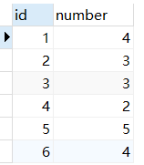
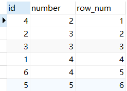
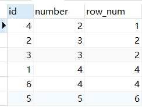
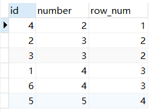
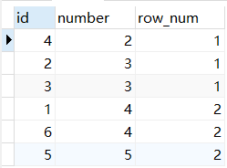

[toc]

#### 175.[组合两个表](https://leetcode-cn.com/problems/combine-two-tables/)

```sql
Create table Person (PersonId int, FirstName varchar(255), LastName varchar(255))
Create table Address (AddressId int, PersonId int, City varchar(255), State varchar(255))
Truncate table Person
insert into Person (PersonId, LastName, FirstName) values ('1', 'Wang', 'Allen')
Truncate table Address
insert into Address (AddressId, PersonId, City, State) values ('1', '2', 'New York City', 'New York')
```

```sql
表1: Person
+-------------+---------+
| 列名         | 类型     |
+-------------+---------+
| PersonId    | int     |
| FirstName   | varchar |
| LastName    | varchar |
+-------------+---------+
PersonId 是上表主键
表2: Address
+-------------+---------+
| 列名         | 类型    |
+-------------+---------+
| AddressId   | int     |
| PersonId    | int     |
| City        | varchar |
| State       | varchar |
+-------------+---------+
AddressId 是上表主键
```

编写一个 SQL 查询，满足条件：无论 person 是否有地址信息，都需要基于上述两表提供 person 的以下信息：

 ```sql
 FirstName, LastName, City, State
 ```

```sql
SELECT FirstName, LastName, City, State 
    From Person Left Join Address
        on Person.PersonId = Address.PersonId
```


#### [176. 第二高的薪水](https://leetcode-cn.com/problems/second-highest-salary/)

```sql
Create table If Not Exists Employee (Id int, Salary int)
Truncate table Employee
insert into Employee (Id, Salary) values ('1', '100')
insert into Employee (Id, Salary) values ('2', '200')
insert into Employee (Id, Salary) values ('3', '300')
```

编写一个 SQL 查询，获取 Employee 表中第二高的薪水（Salary） 。

```sql
+----+--------+
| Id | Salary |
+----+--------+
| 1  | 100    |
| 2  | 200    |
| 3  | 300    |
+----+--------+
```


例如上述 Employee 表，SQL查询应该返回 200 作为第二高的薪水。如果不存在第二高的薪水，那么查询应返回 null。

```sql
+---------------------+
| SecondHighestSalary |
+---------------------+
| 200                 |
+---------------------+
```

```sql
SELECT
    IFNULL(
      (SELECT DISTINCT Salary
       FROM Employee
       ORDER BY Salary DESC
        LIMIT 1 OFFSET 1),
    NULL) AS SecondHighestSalary
```

#### [177. 第N高的薪水](https://leetcode-cn.com/problems/nth-highest-salary/)

编写一个 SQL 查询，获取 `Employee` 表中第 *n* 高的薪水（Salary）。

```sql
+----+--------+
| Id | Salary |
+----+--------+
| 1  | 100    |
| 2  | 200    |
| 3  | 300    |
+----+--------+
```

例如上述 `Employee` 表，*n = 2* 时，应返回第二高的薪水 `200`。如果不存在第 *n* 高的薪水，那么查询应返回 `null`。

```sql
+------------------------+
| getNthHighestSalary(2) |
+------------------------+
| 200                    |
+------------------------+
```

```sql
CREATE FUNCTION getNthHighestSalary(N INT) RETURNS INT
BEGIN
    SET N := N-1;
  RETURN (
      # Write your MySQL query statement below.
      SELECT 
            salary
      FROM 
            employee
      GROUP BY 
            salary
      ORDER BY 
            salary DESC
      LIMIT N, 1  #limit后面不能跟表达式
  );
END
```

#### [178. 分数排名](https://leetcode-cn.com/problems/rank-scores/)

编写一个 SQL 查询来实现分数排名。

如果两个分数相同，则两个分数排名（Rank）相同。请注意，**平分后的下一个名次应该是下一个连续的整数值**。换句话说，名次之间不应该有“间隔”。

```go
+----+-------+
| Id | Score |
+----+-------+
| 1  | 3.50  |
| 2  | 3.65  |
| 3  | 4.00  |
| 4  | 3.85  |
| 5  | 4.00  |
| 6  | 3.65  |
+----+-------+
```

例如，根据上述给定的 `Scores` 表，你的查询应该返回（按分数从高到低排列）：

```go
+-------+------+
| Score | Rank |
+-------+------+
| 4.00  | 1    |
| 4.00  | 1    |
| 3.85  | 2    |
| 3.65  | 3    |
| 3.65  | 3    |
| 3.50  | 4    |
+-------+------+
```

对于 MySQL 解决方案，如果要转义用作列名的保留字，可以在关键字之前和之后使用撇号。例如 **``Rank``**

```sql
SELECT    
    Score,
    DENSE_RANK() OVER (
        ORDER BY Score desc
    ) `Rank`
FROM
    Scores; 
```

##### 四大排序函数



###### 1.ROW_NUMBER()

在排名时**序号连续不重复**，即使遇到表中的两个一样的数值亦是如此

```sql
select *,row_number() OVER(order by number ) as row_num
from num 
```



注意：在使用row_number() 实现分页时需要特别注意一点，**over子句中的order by 要与SQL排序记录中的order by保持一致**，否则得到的序号可能不是连续的.

###### 2.rank()

Rank() 函数会把要求**排序的值相同的归为一组且每组序号一样，排序不会连续执行.**

```sql
select *,rank() OVER(order by number ) as row_num
from num 
```



###### 3.dense_rank()

Dense_rank() **排序是连续的，也会把相同的值分为一组且每组排序号一样**

```sql
select *,dense_rank() OVER(order by number ) as row_num
from num 
```



###### 4.ntile()

Ntile(group_num) 将所有记录分成group_num个组，每组序号一样.

```sql
select *,ntile(2) OVER(order by number ) as row_num
from num 
```



#### [180. 连续出现的数字](https://leetcode-cn.com/problems/consecutive-numbers/)

表：`Logs`

```sql
+-------------+---------+
| Column Name | Type    |
+-------------+---------+
| id          | int     |
| num         | varchar |
+-------------+---------+
id 是这个表的主键。
```

编写一个 SQL 查询，查找所有至少连续出现三次的数字。

返回的结果表中的数据可以按 **任意顺序** 排列。

```sql
Logs 表：
+----+-----+
| Id | Num |
+----+-----+
| 1  | 1   |
| 2  | 1   |
| 3  | 1   |
| 4  | 2   |
| 5  | 1   |
| 6  | 2   |
| 7  | 2   |
+----+-----+

Result 表：
+-----------------+
| ConsecutiveNums |
+-----------------+
| 1               |
+-----------------+
1 是唯一连续出现至少三次的数字。
```

```sql
SELECT DISTINCT
    l1.Num AS ConsecutiveNums
FROM
    Logs l1,
    Logs l2,
    Logs l3
WHERE
    l1.Id = l2.Id - 1
    AND l2.Id = l3.Id - 1
    AND l1.Num = l2.Num
    AND l2.Num = l3.Num
```

#### [181. 超过经理收入的员工](https://leetcode-cn.com/problems/employees-earning-more-than-their-managers/)

`Employee` 表包含所有员工，他们的经理也属于员工。每个员工都有一个 Id，此外还有一列对应员工的经理的 Id。

```sql
+----+-------+--------+-----------+
| Id | Name  | Salary | ManagerId |
+----+-------+--------+-----------+
| 1  | Joe   | 70000  | 3         |
| 2  | Henry | 80000  | 4         |
| 3  | Sam   | 60000  | NULL      |
| 4  | Max   | 90000  | NULL      |
+----+-------+--------+-----------+
```

给定 Employee 表，编写一个 SQL 查询，该查询可以获取收入超过他们经理的员工的姓名。在上面的表格中，Joe 是唯一一个收入超过他的经理的员工。

```sql
+----------+
| Employee |
+----------+
| Joe      |
+----------+
```

```sql
SELECT
    a.Name AS 'Employee'
FROM
    Employee AS a,
    Employee AS b
WHERE
    a.ManagerId = b.Id
        AND a.Salary > b.Salary
```

#### [182. 查找重复的电子邮箱](https://leetcode-cn.com/problems/duplicate-emails/)

```sql
编写一个 SQL 查询，查找 Person 表中所有重复的电子邮箱。

示例：
+----+---------+
| Id | Email   |
+----+---------+
| 1  | a@b.com |
| 2  | c@d.com |
| 3  | a@b.com |
+----+---------+
根据以上输入，你的查询应返回以下结果：
+---------+
| Email   |
+---------+
| a@b.com |
+---------+
说明：所有电子邮箱都是小写字母。
```

```sql
select Email
from Person
group by Email
having count(Email) > 1;
```

#### [183. 从不订购的客户](https://leetcode-cn.com/problems/customers-who-never-order/)

```sql
某网站包含两个表，Customers 表和 Orders 表。编写一个 SQL 查询，找出所有从不订购任何东西的客户。
Customers 表：
+----+-------+
| Id | Name  |
+----+-------+
| 1  | Joe   |
| 2  | Henry |
| 3  | Sam   |
| 4  | Max   |
+----+-------+
Orders 表：
+----+------------+
| Id | CustomerId |
+----+------------+
| 1  | 3          |
| 2  | 1          |
+----+------------+
例如给定上述表格，你的查询应返回：
+-----------+
| Customers |
+-----------+
| Henry     |
| Max       |
+-----------+
```

```sql
select customers.name as 'Customers'
from customers
where customers.id not in
(
    select customerid from orders
);
```

#### [184. 部门工资最高的员工](https://leetcode-cn.com/problems/department-highest-salary/)

```sql
Employee 表包含所有员工信息，每个员工有其对应的 Id, salary 和 department Id。
+----+-------+--------+--------------+
| Id | Name  | Salary | DepartmentId |
+----+-------+--------+--------------+
| 1  | Joe   | 70000  | 1            |
| 2  | Jim   | 90000  | 1            |
| 3  | Henry | 80000  | 2            |
| 4  | Sam   | 60000  | 2            |
| 5  | Max   | 90000  | 1            |
+----+-------+--------+--------------+
Department 表包含公司所有部门的信息。
+----+----------+
| Id | Name     |
+----+----------+
| 1  | IT       |
| 2  | Sales    |
+----+----------+
编写一个 SQL 查询，找出每个部门工资最高的员工。对于上述表，您的 SQL 查询应返回以下行（行的顺序无关紧要）。
+------------+----------+--------+
| Department | Employee | Salary |
+------------+----------+--------+
| IT         | Max      | 90000  |
| IT         | Jim      | 90000  |
| Sales      | Henry    | 80000  |
+------------+----------+--------+
解释：
Max 和 Jim 在 IT 部门的工资都是最高的，Henry 在销售部的工资最高。
```

```sql
SELECT
    Department.name AS 'Department',
    Employee.name AS 'Employee',
    Salary
FROM
    Employee
        JOIN
    Department ON Employee.DepartmentId = Department.Id
WHERE
    (Employee.DepartmentId , Salary) IN
    (   SELECT
            DepartmentId, MAX(Salary)
        FROM
            Employee
        GROUP BY DepartmentId
	)
;
```

#### [185. 部门工资前三高的所有员工](https://leetcode-cn.com/problems/department-top-three-salaries/)

```sql
Employee 表包含所有员工信息，每个员工有其对应的工号 Id，姓名 Name，工资 Salary 和部门编号 DepartmentId 。

+----+-------+--------+--------------+
| Id | Name  | Salary | DepartmentId |
+----+-------+--------+--------------+
| 1  | Joe   | 85000  | 1            |
| 2  | Henry | 80000  | 2            |
| 3  | Sam   | 60000  | 2            |
| 4  | Max   | 90000  | 1            |
| 5  | Janet | 69000  | 1            |
| 6  | Randy | 85000  | 1            |
| 7  | Will  | 70000  | 1            |
+----+-------+--------+--------------+
Department 表包含公司所有部门的信息。

+----+----------+
| Id | Name     |
+----+----------+
| 1  | IT       |
| 2  | Sales    |
+----+----------+
编写一个 SQL 查询，找出每个部门获得前三高工资的所有员工。例如，根据上述给定的表，查询结果应返回：

+------------+----------+--------+
| Department | Employee | Salary |
+------------+----------+--------+
| IT         | Max      | 90000  |
| IT         | Randy    | 85000  |
| IT         | Joe      | 85000  |
| IT         | Will     | 70000  |
| Sales      | Henry    | 80000  |
| Sales      | Sam      | 60000  |
+------------+----------+--------+
解释：
IT 部门中，Max 获得了最高的工资，Randy 和 Joe 都拿到了第二高的工资，Will 的工资排第三。销售部门（Sales）只有两名员工，Henry 的工资最高，Sam 的工资排第二。
```

```sql
SELECT
    d.Name AS 'Department', e1.Name AS 'Employee', e1.Salary
FROM
    Employee e1
        JOIN
    Department d ON e1.DepartmentId = d.Id
WHERE
    3 > (SELECT
            COUNT(DISTINCT e2.Salary)
        FROM
            Employee e2
        WHERE
            e2.Salary > e1.Salary
                AND e1.DepartmentId = e2.DepartmentId
        )
;
```

#### [196. 删除重复的电子邮箱](https://leetcode-cn.com/problems/delete-duplicate-emails/)

```sql
编写一个 SQL 查询，来删除 Person 表中所有重复的电子邮箱，重复的邮箱里只保留 Id 最小 的那个。
+----+------------------+
| Id | Email            |
+----+------------------+
| 1  | john@example.com |
| 2  | bob@example.com  |
| 3  | john@example.com |
+----+------------------+
Id 是这个表的主键。
例如，在运行你的查询语句之后，上面的 Person 表应返回以下几行:
+----+------------------+
| Id | Email            |
+----+------------------+
| 1  | john@example.com |
| 2  | bob@example.com  |
+----+------------------+
 
提示：
执行 SQL 之后，输出是整个 Person 表。
使用 delete 语句。
```

```sql
DELETE p1 FROM Person p1,
    Person p2
WHERE
    p1.Email = p2.Email AND p1.Id > p2.Id
```

#### [197. 上升的温度](https://leetcode-cn.com/problems/rising-temperature/)

```sql
表 Weather
+---------------+---------+
| Column Name   | Type    |
+---------------+---------+
| id            | int     |
| recordDate    | date    |
| temperature   | int     |
+---------------+---------+
id 是这个表的主键
该表包含特定日期的温度信息
 
编写一个 SQL 查询，来查找与之前（昨天的）日期相比温度更高的所有日期的 id 。
返回结果 不要求顺序 。
查询结果格式如下例：
Weather
+----+------------+-------------+
| id | recordDate | Temperature |
+----+------------+-------------+
| 1  | 2015-01-01 | 10          |
| 2  | 2015-01-02 | 25          |
| 3  | 2015-01-03 | 20          |
| 4  | 2015-01-04 | 30          |
+----+------------+-------------+

Result table:
+----+
| id |
+----+
| 2  |
| 4  |
+----+
2015-01-02 的温度比前一天高（10 -> 25）
2015-01-04 的温度比前一天高（20 -> 30）
```

```sql
SELECT w2.Id
FROM Weather w1, Weather w2
WHERE DATEDIFF(w2.RecordDate, w1.RecordDate) = 1 #使用 DATEDIFF() 函数计算两个日期之间的间隔天数 data1 - data2
AND w1.Temperature < w2.Temperature
```

#### [262. 行程和用户](https://leetcode-cn.com/problems/trips-and-users/)

```sql
表：Trips
+-------------+----------+
| Column Name | Type     |
+-------------+----------+
| Id          | int      |
| Client_Id   | int      |
| Driver_Id   | int      |
| City_Id     | int      |
| Status      | enum     |
| Request_at  | date     |     
+-------------+----------+
Id 是这张表的主键。
这张表中存所有出租车的行程信息。每段行程有唯一 Id ，其中 Client_Id 和 Driver_Id 是 Users 表中 Users_Id 的外键。
Status 是一个表示行程状态的枚举类型，枚举成员为(‘completed’, ‘cancelled_by_driver’, ‘cancelled_by_client’) 。
 

表：Users
+-------------+----------+
| Column Name | Type     |
+-------------+----------+
| Users_Id    | int      |
| Banned      | enum     |
| Role        | enum     |
+-------------+----------+
Users_Id 是这张表的主键。
这张表中存所有用户，每个用户都有一个唯一的 Users_Id ，Role 是一个表示用户身份的枚举类型，枚举成员为 (‘client’, ‘driver’, ‘partner’) 。
Banned 是一个表示用户是否被禁止的枚举类型，枚举成员为 (‘Yes’, ‘No’) 。
 

写一段 SQL 语句查出 "2013-10-01" 至 "2013-10-03" 期间非禁止用户（乘客和司机都必须未被禁止）的取消率。非禁止用户即 Banned 为 No 的用户，禁止用户即 Banned 为 Yes 的用户。
取消率 的计算方式如下：(被司机或乘客取消的非禁止用户生成的订单数量) / (非禁止用户生成的订单总数)。
返回结果表中的数据可以按任意顺序组织。其中取消率 Cancellation Rate 需要四舍五入保留 两位小数 。

查询结果格式如下例所示：
Trips 表：
+----+-----------+-----------+---------+---------------------+------------+
| Id | Client_Id | Driver_Id | City_Id | Status              | Request_at |
+----+-----------+-----------+---------+---------------------+------------+
| 1  | 1         | 10        | 1       | completed           | 2013-10-01 |
| 2  | 2         | 11        | 1       | cancelled_by_driver | 2013-10-01 |
| 3  | 3         | 12        | 6       | completed           | 2013-10-01 |
| 4  | 4         | 13        | 6       | cancelled_by_client | 2013-10-01 |
| 5  | 1         | 10        | 1       | completed           | 2013-10-02 |
| 6  | 2         | 11        | 6       | completed           | 2013-10-02 |
| 7  | 3         | 12        | 6       | completed           | 2013-10-02 |
| 8  | 2         | 12        | 12      | completed           | 2013-10-03 |
| 9  | 3         | 10        | 12      | completed           | 2013-10-03 |
| 10 | 4         | 13        | 12      | cancelled_by_driver | 2013-10-03 |
+----+-----------+-----------+---------+---------------------+------------+
Users 表：
+----------+--------+--------+
| Users_Id | Banned | Role   |
+----------+--------+--------+
| 1        | No     | client |
| 2        | Yes    | client |
| 3        | No     | client |
| 4        | No     | client |
| 10       | No     | driver |
| 11       | No     | driver |
| 12       | No     | driver |
| 13       | No     | driver |
+----------+--------+--------+
Result 表：
+------------+-------------------+
| Day        | Cancellation Rate |
+------------+-------------------+
| 2013-10-01 | 0.33              |
| 2013-10-02 | 0.00              |
| 2013-10-03 | 0.50              |
+------------+-------------------+

2013-10-01：
  - 共有 4 条请求，其中 2 条取消。
  - 然而，Id=2 的请求是由禁止用户（User_Id=2）发出的，所以计算时应当忽略它。
  - 因此，总共有 3 条非禁止请求参与计算，其中 1 条取消。
  - 取消率为 (1 / 3) = 0.33
2013-10-02：
  - 共有 3 条请求，其中 0 条取消。
  - 然而，Id=6 的请求是由禁止用户发出的，所以计算时应当忽略它。
  - 因此，总共有 2 条非禁止请求参与计算，其中 0 条取消。
  - 取消率为 (0 / 2) = 0.00
2013-10-03：
  - 共有 3 条请求，其中 1 条取消。
  - 然而，Id=8 的请求是由禁止用户发出的，所以计算时应当忽略它。
  - 因此，总共有 2 条非禁止请求参与计算，其中 1 条取消。
  - 取消率为 (1 / 2) = 0.50
```

```sql
SELECT
  t.Request_at 'Day',
  ROUND( #round(x,d)  ，x指要处理的数，d是指保留几位小数,d可以是负数，是指定小数点左边的d位整数位为0,同时小数位均为0；
    1 - COUNT(IF(t.`Status` = 'completed', 1, NULL)) / COUNT(*)  -- 用1减去完成的比例就是取消的比例
    , 2) 'Cancellation Rate'
FROM
  Trips t
  INNER JOIN Users u ON t.Client_Id = u.Users_Id AND u.Banned = 'No' 
WHERE
  t.Request_at >= '2013-10-01' AND t.Request_at < '2013-10-04'
GROUP BY
  t.Request_at
```

#### [595. 大的国家](https://leetcode-cn.com/problems/big-countries/)

```sql
这里有张 World 表
+-----------------+------------+------------+--------------+---------------+
| name            | continent  | area       | population   | gdp           |
+-----------------+------------+------------+--------------+---------------+
| Afghanistan     | Asia       | 652230     | 25500100     | 20343000      |
| Albania         | Europe     | 28748      | 2831741      | 12960000      |
| Algeria         | Africa     | 2381741    | 37100000     | 188681000     |
| Andorra         | Europe     | 468        | 78115        | 3712000       |
| Angola          | Africa     | 1246700    | 20609294     | 100990000     |
+-----------------+------------+------------+--------------+---------------+
如果一个国家的面积超过 300 万平方公里，或者人口超过 2500 万，那么这个国家就是大国家。
编写一个 SQL 查询，输出表中所有大国家的名称、人口和面积。

例如，根据上表，我们应该输出:
+--------------+-------------+--------------+
| name         | population  | area         |
+--------------+-------------+--------------+
| Afghanistan  | 25500100    | 652230       |
| Algeria      | 37100000    | 2381741      |
+--------------+-------------+--------------+
```

```sql
SELECT
    name, population, area
FROM
    world
WHERE
    area > 3000000

UNION	#用于连接两个以上的 SELECT 语句的结果组合到一个结果集合中。多个 SELECT 语句会删除重复的数据。

SELECT
    name, population, area
FROM
    world
WHERE
    population > 25000000
;
```

#### [596. 超过5名学生的课](https://leetcode-cn.com/problems/classes-more-than-5-students/)

```sql
有一个courses 表 ，有: student (学生) 和 class (课程)。
请列出所有超过或等于5名学生的课。
例如，表：
+---------+------------+
| student | class      |
+---------+------------+
| A       | Math       |
| B       | English    |
| C       | Math       |
| D       | Biology    |
| E       | Math       |
| F       | Computer   |
| G       | Math       |
| H       | Math       |
| I       | Math       |
+---------+------------+
应该输出:
+---------+
| class   |
+---------+
| Math    |
+---------+
 
提示：
学生在每个课中不应被重复计算
```

```sql
select class
from
    courses
group by
    class
having count(distinct student) >= 5
;
```

#### [601. 体育馆的人流量](https://leetcode-cn.com/problems/human-traffic-of-stadium/)

```sql
表：Stadium
+---------------+---------+
| Column Name   | Type    |
+---------------+---------+
| id            | int     |
| visit_date    | date    |
| people        | int     |
+---------------+---------+
visit_date 是表的主键
每日人流量信息被记录在这三列信息中：序号 (id)、日期 (visit_date)、 人流量 (people)
每天只有一行记录，日期随着 id 的增加而增加
 
编写一个 SQL 查询以找出每行的人数大于或等于 100 且 id 连续的三行或更多行记录。
返回按 visit_date 升序排列的结果表。
查询结果格式如下所示。
Stadium table:
+------+------------+-----------+
| id   | visit_date | people    |
+------+------------+-----------+
| 1    | 2017-01-01 | 10        |
| 2    | 2017-01-02 | 109       |
| 3    | 2017-01-03 | 150       |
| 4    | 2017-01-04 | 99        |
| 5    | 2017-01-05 | 145       |
| 6    | 2017-01-06 | 1455      |
| 7    | 2017-01-07 | 199       |
| 8    | 2017-01-09 | 188       |
+------+------------+-----------+
Result table:
+------+------------+-----------+
| id   | visit_date | people    |
+------+------------+-----------+
| 5    | 2017-01-05 | 145       |
| 6    | 2017-01-06 | 1455      |
| 7    | 2017-01-07 | 199       |
| 8    | 2017-01-09 | 188       |
+------+------------+-----------+
id 为 5、6、7、8 的四行 id 连续，并且每行都有 >= 100 的人数记录。
请注意，即使第 7 行和第 8 行的 visit_date 不是连续的，输出也应当包含第 8 行，因为我们只需要考虑 id 连续的记录。
不输出 id 为 2 和 3 的行，因为至少需要三条 id 连续的记录。
```

```sql
select distinct a.*
from stadium a,stadium b,stadium c
where 
(
    (a.id=b.id-1 and b.id=c.id-1) or 
    (a.id=b.id+1 and b.id=c.id+1) or 
    (a.id=b.id-1 and a.id=c.id+1)
 )
and a.people>=100 and b.people>=100 and c.people>=100
order by a.id;
```

#### [620. 有趣的电影](https://leetcode-cn.com/problems/not-boring-movies/)

```sql
某城市开了一家新的电影院，吸引了很多人过来看电影。该电影院特别注意用户体验，专门有个 LED显示板做电影推荐，上面公布着影评和相关电影描述。
作为该电影院的信息部主管，您需要编写一个 SQL查询，找出所有影片描述为非 boring (不无聊) 的并且 id 为奇数 的影片，结果请按等级 rating 排列。

例如，下表 cinema:
+---------+-----------+--------------+-----------+
|   id    | movie     |  description |  rating   |
+---------+-----------+--------------+-----------+
|   1     | War       |   great 3D   |   8.9     |
|   2     | Science   |   fiction    |   8.5     |
|   3     | irish     |   boring     |   6.2     |
|   4     | Ice song  |   Fantacy    |   8.6     |
|   5     | House card|   Interesting|   9.1     |
+---------+-----------+--------------+-----------+
对于上面的例子，则正确的输出是为：
+---------+-----------+--------------+-----------+
|   id    | movie     |  description |  rating   |
+---------+-----------+--------------+-----------+
|   5     | House card|   Interesting|   9.1     |
|   1     | War       |   great 3D   |   8.9     |
+---------+-----------+--------------+-----------+
```

```sql
select *
from cinema
where
    description != 'boring'
    and (id % 2) != 0
order by rating desc
```

#### [626. 换座位](https://leetcode-cn.com/problems/exchange-seats/)

```sql
小美是一所中学的信息科技老师，她有一张 seat 座位表，平时用来储存学生名字和与他们相对应的座位 id。
其中纵列的 id 是连续递增的
小美想改变相邻俩学生的座位。
你能不能帮她写一个 SQL query 来输出小美想要的结果呢？

示例：
+---------+---------+
|    id   | student |
+---------+---------+
|    1    | Abbot   |
|    2    | Doris   |
|    3    | Emerson |
|    4    | Green   |
|    5    | Jeames  |
+---------+---------+
假如数据输入的是上表，则输出结果如下：

+---------+---------+
|    id   | student |
+---------+---------+
|    1    | Doris   |
|    2    | Abbot   |
|    3    | Green   |
|    4    | Emerson |
|    5    | Jeames  |
+---------+---------+
注意：
如果学生人数是奇数，则不需要改变最后一个同学的座位。
```

```sql
select 
(case
when mod(id,2)=1 and counts<>id then id+1	#奇数位置id+1
when mod(id,2)=1 and counts=id then id	    #奇数位置但是在最后一位，id不变
else id-1								 #偶数位置id-1
end
)as id,student
from seat,(select count(*)as counts from seat) as b
order by id asc;
#子查询记得用括号括好，然后起个别名
#COUNT(DISTINCT column_name) 函数返回指定列的不同值的数目
#SQL COUNT(*) 实例 如果我们省略 WHERE 子句，比如这样：
#SELECT COUNT(*) AS 别名 FROM 表名，结果会返回数值：行数
```

#### [627. 变更性别](https://leetcode-cn.com/problems/swap-salary/)

```sql
给定一个 salary 表，如下所示，有 m = 男性 和 f = 女性 的值。交换所有的 f 和 m 值（例如，将所有 f 值更改为 m，反之亦然）。要求只使用一个更新（Update）语句，并且没有中间的临时表。

注意，您必只能写一个 Update 语句，请不要编写任何 Select 语句。
例如：
| id | name | sex | salary |
|----|------|-----|--------|
| 1  | A    | m   | 2500   |
| 2  | B    | f   | 1500   |
| 3  | C    | m   | 5500   |
| 4  | D    | f   | 500    |
运行你所编写的更新语句之后，将会得到以下表:
| id | name | sex | salary |
|----|------|-----|--------|
| 1  | A    | f   | 2500   |
| 2  | B    | m   | 1500   |
| 3  | C    | f   | 5500   |
| 4  | D    | m   | 500    |
```

```sql
update salary
set 
    sex = case sex
        when 'm' then 'f'
        else 'm'
    end;
```

#### [1179. 重新格式化部门表](https://leetcode-cn.com/problems/reformat-department-table/)

```sql
部门表 Department：
+---------------+---------+
| Column Name   | Type    |
+---------------+---------+
| id            | int     |
| revenue       | int     |
| month         | varchar |
+---------------+---------+
(id, month) 是表的联合主键。
这个表格有关于每个部门每月收入的信息。
月份（month）可以取下列值 ["Jan","Feb","Mar","Apr","May","Jun","Jul","Aug","Sep","Oct","Nov","Dec"]。
 
编写一个 SQL 查询来重新格式化表，使得新的表中有一个部门 id 列和一些对应 每个月 的收入（revenue）列。
查询结果格式如下面的示例所示：
Department 表：
+------+---------+-------+
| id   | revenue | month |
+------+---------+-------+
| 1    | 8000    | Jan   |
| 2    | 9000    | Jan   |
| 3    | 10000   | Feb   |
| 1    | 7000    | Feb   |
| 1    | 6000    | Mar   |
+------+---------+-------+
查询得到的结果表：
+------+-------------+-------------+-------------+-----+-------------+
| id   | Jan_Revenue | Feb_Revenue | Mar_Revenue | ... | Dec_Revenue |
+------+-------------+-------------+-------------+-----+-------------+
| 1    | 8000        | 7000        | 6000        | ... | null        |
| 2    | 9000        | null        | null        | ... | null        |
| 3    | null        | 10000       | null        | ... | null        |
+------+-------------+-------------+-------------+-----+-------------+
注意，结果表有 13 列 (1个部门 id 列 + 12个月份的收入列)。
```

```sql
SELECT id,	#如果在没有返回匹配行SELECT语句中使用SUM函数，则SUM函数返回NULL，而不是0。
SUM(CASE `month` WHEN 'Jan' THEN revenue END) Jan_Revenue, 
SUM(CASE `month` WHEN 'Feb' THEN revenue END) Feb_Revenue,
SUM(CASE `month` WHEN 'Mar' THEN revenue END) Mar_Revenue,
SUM(CASE `month` WHEN 'Apr' THEN revenue END) Apr_Revenue,
SUM(CASE `month` WHEN 'May' THEN revenue END) May_Revenue,
SUM(CASE `month` WHEN 'Jun' THEN revenue END) Jun_Revenue,
SUM(CASE `month` WHEN 'Jul' THEN revenue END) Jul_Revenue,
SUM(CASE `month` WHEN 'Aug' THEN revenue END) Aug_Revenue,
SUM(CASE `month` WHEN 'Sep' THEN revenue END) Sep_Revenue,
SUM(CASE `month` WHEN 'Oct' THEN revenue END) Oct_Revenue,
SUM(CASE `month` WHEN 'Nov' THEN revenue END) Nov_Revenue,
SUM(CASE `month` WHEN 'Dec' THEN revenue END) Dec_Revenue
FROM Department
GROUP BY id;
```

