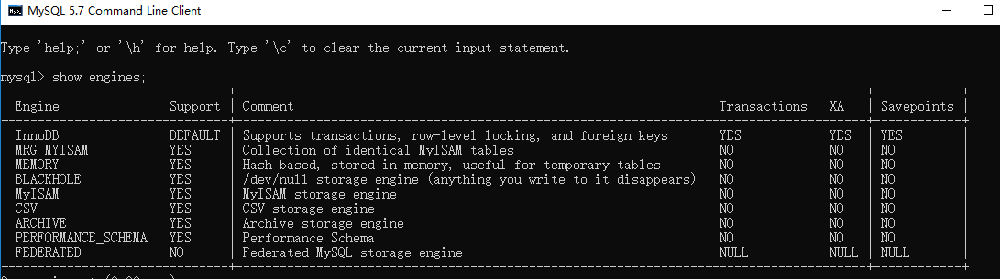

[TOC]

### MySQL高级特性

#### MySQL架构

##### 1. 架构概述

下图是 MySQL 的一个简要架构图。

- **连接器：** 身份认证和权限相关(登录 MySQL 的时候)。
- **查询缓存:** 执行查询语句的时候，会先查询缓存（MySQL 8.0 版本后移除，因为这个功能不太实用）。
- **分析器:** 没有命中缓存的话，SQL 语句就会经过分析器，分析器说白了就是要先看你的 SQL 语句要干嘛，再检查你的 SQL 语句语法是否正确。
- **优化器：** 按照 MySQL 认为最优的方案去执行。
- **执行器:** 执行语句，然后从存储引擎返回数据。


简单来说 MySQL 主要分为 Server 层和存储引擎层：

- **Server 层**：主要包括连接器、查询缓存、分析器、优化器、执行器等，所有跨存储引擎的功能都在这一层实现，比如存储过程、触发器、视图，函数等，还有一个通用的日志模块 binglog 日志模块。
- **存储引擎**： 主要负责数据的存储和读取，采用可以替换的插件式架构，支持 InnoDB、MyISAM、Memory 等多个存储引擎，其中 InnoDB 引擎有自有的日志模块 redolog 模块。**现在最常用的存储引擎是 InnoDB，它从 MySQL 5.5.5 版本开始就被当做默认存储引擎了。**

##### 2. SQL语句执行流程

一条 sql 语句是如何执行的呢？其实我们的 sql 可以分为两种，一种是查询，一种是更新（增加，更新，删除）。

###### ① 查询语句

先分析下查询语句，语句如下：

```mysql
select * from tb_student  A where A.age='18' and A.name=' 张三 ';
```

结合上面的说明，我们分析下这个语句的执行流程：

- 先检查该语句是**否有权限**，如果没有权限，直接返回错误信息，如果有权限，在 MySQL8.0 版本以前，会先查询缓存，以这条 sql 语句为 key 在内存中查询是否有结果，如果有直接缓存，如果没有，执行下一步。
- 通过**分析器进行词法分析**，提取 sql 语句的**关键元素**，比如提取上面这个语句是查询 select，提取需要查询的表名为 tb_student,需要查询所有的列，查询条件是这个表的 id='1'。然后判断这个 sql 语句是否有语法错误，比如关键词是否正确等等，如果检查没问题就执行下一步。
- 接下来就是优化器进行确定执行方案，上面的 sql 语句，可以有两种执行方案：

```
a.先查询学生表中姓名为“张三”的学生，然后判断是否年龄是 18。  
b.先找出学生中年龄 18 岁的学生，然后再查询姓名为“张三”的学生。
```

​    那么优化器根据自己的优化算法进行选择执行效率最好的一个方案（优化器认为，有时候不一定最好）。那么确认了执行计划后就准备开始执行了。

- 进行权限校验，如果没有权限就会返回错误信息，如果有权限就会调用数据库引擎接口，返回引擎的执行结果。

###### ② 更新语句

接下来我们看看更新语句如何执行，sql 语句如下：

```mysql
update tb_student A set A.age='19' where A.name=' 张三 ';
```

来给张三修改下年龄。其实条语句也基本上会沿着上一个查询的流程走，只不过执行更新的时候肯定要记录日志啦，这就会引入日志模块了，MySQL 自带的日志模块式 **binlog（归档日志）** ，所有的存储引擎都可以使用，我们常用的 InnoDB 引擎还自带了一个日志模块 **redo log（重做日志）**，我们就以 InnoDB 模式下来探讨这个语句的执行流程。流程如下：

- 先查询到张三这一条数据，如果有缓存，也是会用到缓存。
- 然后拿到查询的语句，把 age 改为 19，然后调用引擎 API 接口，写入这一行数据，InnoDB 引擎把数据保存在内存中，同时记录 redo log，此时 redo log 进入 prepare 状态，然后告诉执行器，执行完成了，随时可以提交。
- 执行器收到通知后记录 binlog，然后调用引擎接口，提交 redo log 为提交状态。
- 更新完成。

**为什么要用两个日志模块，用一个日志模块不行吗?**

这是因为最开始 MySQL 并没与 InnoDB 引擎( InnoDB 引擎是其他公司以插件形式插入 MySQL 的) ，MySQL 自带的引擎是 MyISAM，但是我们知道 redo log 是 InnoDB 引擎特有的，其他存储引擎都没有，这就导致会没有 crash-safe 的能力(crash-safe 的能力即使数据库发生异常重启，之前提交的记录都不会丢失)，binlog 日志只能用来归档。

并不是说只用一个日志模块不可以，只是 InnoDB 引擎就是通过 redo log 来支持事务的。那么，又会有同学问，我用两个日志模块，但是不要这么复杂行不行，为什么 redo log 要引入 prepare 预提交状态？这里我们用反证法来说明下为什么要这么做？

- **先写 redo log 直接提交，然后写 binlog**，假设写完 redo log 后，机器挂了，binlog 日志没有被写入，那么机器重启后，这台机器会通过 redo log 恢复数据，但是这个时候 bingog 并没有记录该数据，后续进行机器备份的时候，就会丢失这一条数据，同时主从同步也会丢失这一条数据。
- **先写 binlog，然后写 redo log**，假设写完了 binlog，机器异常重启了，由于没有 redo log，本机是无法恢复这一条记录的，但是 binlog 又有记录，那么和上面同样的道理，就会产生数据不一致的情况。

如果采用 redo log 两阶段提交的方式就不一样了，写完 binglog 后，然后再提交 redo log 就会防止出现上述的问题，从而保证了数据的一致性。那么问题来了，有没有一个极端的情况呢？假设 redo log 处于预提交状态，binglog 也已经写完了，这个时候发生了异常重启会怎么样呢？ 这个就要依赖于 MySQL 的处理机制了，MySQL 的处理过程如下：

- 判断 redo log 是否完整，如果判断是完整的，就立即提交。
- 如果 redo log 只是预提交但不是 commit 状态，这个时候就会去判断 binlog 是否完整，如果完整就提交 redo log, 不完整就回滚事务。

这样就解决了数据一致性的问题。


#### 函数

##### 1. 创建函数

学过的函数：LENGTH、SUBSTR、CONCAT 等
语法：

```mysql
CREATE FUNCTION 函数名(参数名 参数类型,...) RETURNS 返回类型
BEGIN
	函数体
END
```

##### 2. 调用函数

```mysql
SELECT 函数名（实参列表）
```

##### 3. MySQL函数内置

各个 DBMS 的函数都是不相同的，因此**不可移植**，以下主要是 MySQL 的函数。

|  函 数  |      说 明       |
| :-----: | :--------------: |
|  AVG()  | 返回某列的平均值 |
| COUNT() |  返回某列的行数  |
|  MAX()  | 返回某列的最大值 |
|  MIN()  | 返回某列的最小值 |
|  SUM()  |  返回某列值之和  |

**AVG**() 会忽略 **NULL** 行。

使用 DISTINCT 可以让汇总函数值汇总不同的值。

```sql
SELECT AVG(DISTINCT col1) AS avg_col
FROM mytable;
```

###### ① 文本处理

|   函数   |      说明      |   函数    |      说明      |
| :------: | :------------: | :-------: | :------------: |
|  LEFT()  |   左边的字符   |  RIGHT()  |   右边的字符   |
| LOWER()  | 转换为小写字符 |  UPPER()  | 转换为大写字符 |
| LTRIM()  | 去除左边的空格 |  RTRIM()  | 去除右边的空格 |
| LENGTH() |      长度      | SOUNDEX() |  转换为语音值  |

其中， **SOUNDEX()**  可以将一个字符串转换为描述其语音表示的字母数字模式。

```sql
SELECT *
FROM mytable
WHERE SOUNDEX(col1) = SOUNDEX('apple')
```

-----

###### ② 日期和时间处理


- 日期格式：YYYY-MM-DD
- 时间格式：HH:MM:SS

|     函 数     |             说 明              |
| :-----------: | :----------------------------: |
|   AddDate()   |    增加一个日期（天、周等）    |
|   AddTime()   |    增加一个时间（时、分等）    |
|   CurDate()   |          返回当前日期          |
|   CurTime()   |          返回当前时间          |
|    Date()     |     返回日期时间的日期部分     |
|  DateDiff()   |        计算两个日期之差        |
|  Date_Add()   |     高度灵活的日期运算函数     |
| Date_Format() |  返回一个格式化的日期或时间串  |
|     Day()     |     返回一个日期的天数部分     |
|  DayOfWeek()  | 对于一个日期，返回对应的星期几 |
|    Hour()     |     返回一个时间的小时部分     |
|   Minute()    |     返回一个时间的分钟部分     |
|    Month()    |     返回一个日期的月份部分     |
|     Now()     |       返回当前日期和时间       |
|   Second()    |      返回一个时间的秒部分      |
|    Time()     |   返回一个日期时间的时间部分   |
|    Year()     |     返回一个日期的年份部分     |

```sql
mysql> SELECT NOW();
```

```
2018-4-14 20:25:11
```

--------

###### ③ 数值处理

|  函数  |  说明  | 函数  |  说明  |
| :----: | :----: | :---: | :----: |
| SIN()  |  正弦  | COS() |  余弦  |
| TAN()  |  正切  | ABS() | 绝对值 |
| SQRT() | 平方根 | MOD() |  余数  |
| EXP()  |  指数  | PI()  | 圆周率 |
| RAND() | 随机数 |       |        |

---

#### 存储过程

##### 1. 概述

存储过程可以看成是对一系列 SQL 操作的**批处理**。

使用存储过程的好处：

- 代码封装，保证了一定的安全性；
- 代码复用；
- 由于是预先编译，因此具有很高的性能。

但是阿里巴巴的开发规范规定**别用**存储过程。

命令行中创建存储过程**==需要自定义分隔符==**，因为命令行是以 **; 为结束符**，而存储过程中也包含了**分号**，因此会错误把这部分分号当成是结束符，造成语法错误。

包含 **in、out 和 inout** 三种参数。

给变量赋值都需要用 select into 语句。

每次只能给**一个变量**赋值，不支持集合的操作。

存储过程含义：一组经过**预先编译**的SQL语句的集合
存储过程好处：

```mysql
1、提高了SQL语句的重用性，减少了开发程序员的压力
2、提高了效率
3、减少了传输次数
```

存储过程分类：

```mysql
1、无返回无参
2、仅仅带IN类型，无返回有参
3、仅仅带OUT类型，有返回无参
4、既带IN又带OUT，有返回有参
5、带INOUT，有返回有参
注意：IN、OUT、INOUT都可以在一个存储过程中带多个
```

##### 2. 创建存储过程

语法：

```mysql
CREATE PROCEDURE 存储过程名(IN|OUT|INOUT 参数名  参数类型,...)
BEGIN
	存储过程体
END
```

类似于方法：

```mysql
修饰符 返回类型 方法名(参数类型 参数名,...){
	方法体;
}
```

注意

```mysql
1、需要设置新的结束标记
DELIMITER 新的结束标记
示例：
DELIMITER $

CREATE PROCEDURE 存储过程名(IN|OUT|INOUT 参数名  参数类型,...)
BEGIN
	sql语句1;
	sql语句2;
END $

2、存储过程体中可以有多条SQL语句，如果仅仅一条SQL语句，则可以省略BEGIN END

3、参数前面的符号的意思
IN:该参数只能作为输入 （该参数不能做返回值）
OUT：该参数只能作为输出（该参数只能做返回值）
INOUT：既能做输入又能做输出
```

```mysql
delimiter //		# 自定义分隔符

create procedure myprocedure(out ret int)
    begin
        declare y int;
        select sum(col1)
        from mytable
        into y;
        select y*y into ret;
    end //

delimiter ;			# 换回分隔符
```

##### 3. 调用存储过程

```mysql
CALL 存储过程名(实参列表)
```

```mysql
call myprocedure(@ret);
select @ret;
```

##### 4. 游标

在存储过程中使用**游标**可以对**一个结果集**进行**移动遍历**。

游标主要用于**交互式应用**，其中用户需要对数据集中的任意行进行浏览和修改。

使用游标的四个步骤：

1. **声明游标**，这个过程**没有**实际检索出数据；
2. **打开游标**；
3. **取出数据**；
4. **关闭游标**；

```sql
delimiter //
create procedure myprocedure(out ret int)
    begin
        declare done boolean default 0;
        declare mycursor cursor for
        select col1 from mytable;
        # 定义了一个 continue handler，当 sqlstate '02000' 这个条件出现时，会执行 set done = 1
        declare continue handler for sqlstate '02000' set done = 1;

        open mycursor;

        repeat
            fetch mycursor into ret;
            select ret;
        until done end repeat;

        close mycursor;
    end //
 delimiter ;
```

---

#### 流程控制结构

##### 1. 系统变量

###### ① **全局变量**

作用域：针对于所有会话（连接）有效，但不能跨重启

```mysql
# 查看所有全局变量
SHOW GLOBAL VARIABLES;
# 查看满足条件的部分系统变量
SHOW GLOBAL VARIABLES LIKE '%char%';
# 查看指定的系统变量的值
SELECT @@global.autocommit;
# 为某个系统变量赋值
SET @@global.autocommit=0;
SET GLOBAL autocommit=0;
```

###### ② **会话变量**

作用域：针对于当前会话（连接）有效

```mysql
# 查看所有会话变量
SHOW SESSION VARIABLES;
# 查看满足条件的部分会话变量
SHOW SESSION VARIABLES LIKE '%char%';
# 查看指定的会话变量的值
SELECT @@autocommit;
SELECT @@session.tx_isolation;
# 为某个会话变量赋值
SET @@session.tx_isolation='read-uncommitted';
SET SESSION tx_isolation='read-committed';
```

##### 2. 自定义变量

###### ① **用户变量**

声明并初始化：

```mysql
SET @变量名=值;
SET @变量名:=值;
SELECT @变量名:=值;
```

赋值：

```mysql
方式一：一般用于赋简单的值
SET 变量名=值;
SET 变量名:=值;
SELECT 变量名:=值;
```


```mysql
方式二：一般用于赋表 中的字段值
SELECT 字段名或表达式 INTO 变量
FROM 表;
```

使用：

```mysql
SELECT @变量名;
```

###### ② **局部变量**

声明：

```mysql
DECLARE 变量名 类型 【DEFAULT 值】;
```

赋值：

```mysql
方式一：一般用于赋简单的值
SET 变量名 = 值;
SET 变量名:=值;
SELECT 变量名:=值;
```


```mysql
方式二：一般用于赋表 中的字段值
SELECT 字段名或表达式 INTO 变量
FROM 表;
```

使用：

```mysql
SELECT 变量名
```

##### 3. 分支

###### ① IF 函数

​	语法：IF (条件，值1，值2)
​	特点：可以用在任何位置

###### ② CASE 语句

语法：

```mysql
情况一：类似于SWITCH
CASE 表达式
WHEN 值1 THEN 结果1或语句1(如果是语句，需要加分号) 
WHEN 值2 THEN 结果2或语句2(如果是语句，需要加分号)
...
ELSE 结果n或语句n(如果是语句，需要加分号)
END 【CASE】（如果是放在BEGIN END中需要加上CASE，如果放在SELECT后面不需要）

情况二：类似于多重 IF
CASE 
WHEN 条件1 THEN 结果1或语句1(如果是语句，需要加分号) 
WHEN 条件2 THEN 结果2或语句2(如果是语句，需要加分号)
...
ELSE 结果n或语句n(如果是语句，需要加分号)
END 【CASE】（如果是放在BEGIN END中需要加上CASE，如果放在SELECT后面不需要）
```


特点：
	可以用在任何位置

###### ③ IF ELSEIF语句

语法：

```mysql
IF 情况1 THEN 语句1;
ELSEIF 情况2 THEN 语句2;
...
ELSE 语句n;
END IF;
```

特点：
	**只能**用在 BEGIN END 中！

三者比较：应用场合

- IF 函数		简单双分支
- CASE  结构	等值判断 的多分支
- IF 结构		区间判断 的多分支

##### 4. 循环

语法：


```mysql
【标签：】WHILE 循环条件  DO
	循环体
END WHILE 【标签】;
```

特点：

- 只能放在 BEGIN END 里面
- 如果要搭配 LEAVE 跳转语句，需要使用标签，否则可以不用标签
- LEAVE 类似于 Java 中的 break 语句，跳出所在循环！！！


#### 视图

##### 1. 概述

含义：理解成一张**虚拟的表**。MySQL5.1版本出现的新特性，是通过表**动态生成**的数据。

视图和表的区别：两者使用方式**完全相同**，不过表需要占用物理空间，而视图不占用物理空间，仅仅保存的是SQL逻辑。

视图的好处：

- 简化复杂的 SQL 操作，比如复杂的连接；
- 只使用实际表的一**部分数据**；
- 通过只给用户**访问视图的权限**，保证数据的安全性；
- 更改**数据格式和表示**。

##### 2. 视图的作用

- 测试表: user 有id，name，age，sex 字段

- 测试表: goods 有id，name，price 字段

- 测试表: ug 有 id，userid，goodsid 字段

**作用一：** 提高了**重用性**，就像一个函数。如果要**频繁获取** user 的 name 和 goods 的 name。就应该使用以下 sql 语言。示例：

 ```mysql
select a.name as username, b.name as goodsname from user as a, goods as b, ug as c where a.id = c.userid and c.goodsid = b.id;
 ```

但有了视图就不一样了，创建视图 **other**。示例

 ```mysql
create view other as select a.name as username, b.name as goodsname from user as a, goods as b, ug as c where a.id = c.userid and c.goodsid = b.id;
 ```

创建好视图后，就可以这样获取 user 的 name 和 goods 的 name。示例：

 ```mysql
select * from other;
 ```

**作用二：**对数据库**重构**，却不影响程序的运行。假如因为某种需求，需要将 user 拆成表 usera 和表 userb，该两张表的结构如下：

- 测试表: usera 有 id，name，age 字段
- 测试表: userb 有 id，name，sex 字段

这时如果使用 sql 语句：select * from user; 那就会提示该表**不存在**，这时该如何解决呢。解决方案：**创建视图**。以下 sql 语句创建视图：

```mysql
create view user as select a.name,a.age,b.sex from usera as a, userb as b where a.name = b.name;
```

以上假设 name 都是唯一的。此时使用 sql 语句：select * from user; 就不会报错。这就实现了更改数据库结构，不更改脚本程序的功能了。

**作用三：** 提高了安全性能。可以对**不同的用户，设定不同的视图**。例如：某用户只能获取 user 表的 name 和 age数据，不能获取 sex 数据。则可以这样创建视图。示例如下：

 ```mysql
create view other as select a.name, a.age from user as a;
 ```

​    这样的话，使用sql语句：select * from other; 最多就只能获取 name 和 age 的数据，其他的数据就获取不了了。

**作用四：** 让数据更加清晰。想要什么样的数据，就创建什么样的视图。

##### 3. 视图的基本操作

**查询语句**放在 AS 后面。

```mysql
# 创建视图
CREATE VIEW  视图名
AS
查询语句;
# 删除视图
DROP VIEW test1, test2;
# 查看视图结构
DESC test1;
SHOW CREATE VIEW test1;
```

##### 4. 视图的增删改查

```mysql
1、查看视图的数据 ★
SELECT * FROM my_v4;
SELECT * FROM my_v1 WHERE last_name = 'Partners';
2、插入视图的数据
INSERT INTO my_v4(last_name,department_id) VALUES('虚竹',90);
3、修改视图的数据
UPDATE my_v4 SET last_name = '梦姑' WHERE last_ame = '虚竹';
4、删除视图的数据
DELETE FROM my_v4;
```

##### 5. 某些视图不能更新

如果视图中数据是来自于**一个表**时，修改视图中的数据，表数据会**更新**。而且修改表中数据时，对应视图也会**更新**。但是如果视图数据来源于**两个表**时，修改视图数据时会报错，**无法**修改。具体见下面。

```mysql
包含以下关键字的SQL语句：分组函数、DISTINCT、GROUP BY、HAVING、UNION或者UNION ALL
常量视图
SELECT中包含子查询
JOIN
FROM一个不能更新的视图
WHERE子句的子查询引用了FROM子句中的表
```


#### 触发器

##### 1. 概述

触发器是与表有关的数据库对象，在**满足定义条件时触发**，并**执行触发器中定义的语句**集合。触发器的这种特性可以协助应用在数据库端确保数据的完整性。

举个例子，比如你现在有两个表【用户表】和【日志表】，当一个用户被创建的时候，就需要在日志表中插入创建的 log 日志，如果在不使用触发器的情况下，你需要**编写程序语言**逻辑才能实现，但是如果你定义了一个触发器，触发器的作用就是当你在用户表中插入一条数据的之后帮你在日志表中插入一条日志信息。当然触发器并不是只能进行**插入**操作，还能执行**修改，删除。**

##### 2. 创建触发器

创建触发器的语法如下：

```mysql
CREATE TRIGGER trigger_name trigger_time trigger_event ON tb_name FOR EACH ROW 
# trigger_stmt
# trigger_name：触发器的名称
# tirgger_time：触发时机，为BEFORE或者AFTER
# trigger_event：触发事件，为INSERT、DELETE或者UPDATE
# tb_name：表示建立触发器的表明，就是在哪张表上建立触发器
# trigger_stmt：触发器的程序体，可以是一条SQL语句或者是用BEGIN和END包含的多条语句
```

```mysql
# 所以可以说MySQL根据触发时机创建以下六种触发器：
BEFORE INSERT, BEFORE DELETE, BEFORE UPDATE
AFTER INSERT, AFTER DELETE, AFTER UPDATE
```

其中，触发器名参数指要创建的触发器的名字.

BEFORE 和 AFTER 参数指定了触发**执行的时间**，在事件**之前**或是**之后**。

FOR EACH ROW 表示**任何一条记录**上的操作满足触发事件都会触发该触发器。

**创建有多个==执行语句==的触发器**

```mysql
CREATE TRIGGER 触发器名 BEFORE|AFTER 触发事件
ON 表名 FOR EACH ROW
BEGIN
    执行语句列表
END
```

其中，**BEGIN 与 END** 之间的执行语句列表参数表示需要执行的**多个**语句，不同语句用**分号**隔开。

**tips：**一般情况下，MySQL 默认是以 **;** 作为结束执行语句，与触发器中需要的**分行**起冲突，为解决此问题可用 **DELIMITER**，如：DELIMITER ||，可以将结束符号变成 **||**， 当触发器创建完成后，可以用 **DELIMITER ;** 来将结束符号变成 **;** 。这与存储过程的使用类似。

```mysql
mysql> DELIMITER ||		# 修改默认的结束符号
mysql> CREATE TRIGGER demo BEFORE DELETE
    -> ON users FOR EACH ROW		# 每一行都观测
    -> BEGIN
    -> INSERT INTO logs VALUES(NOW());	# BEGIN 与 END 中间是触发时执行的逻辑
    -> INSERT INTO logs VALUES(NOW());
    -> END
    -> ||
Query OK, 0 rows affected (0.06 sec)

mysql> DELIMITER ;
```

上面的语句中，开头将结束符号定义为 ||，中间定义一个触发器，一旦有满足条件的**删除操作**。就会执行 BEGIN 和 END 中的语句，接着**使用 || 结束**。最后使用DELIMITER ; 将结束符号**还原**。

##### 3. 其他

触发器会在**某个表**执行以下语句时而**自动执行**：**==DELETE、INSERT、UPDATE==**。

触发器必须指定在语句执行**之前**还是**之后**自动执行，之前执行使用 **BEFORE** 关键字，之后执行使用 **AFTER** 关键字。**BEFORE 用于数据验证和净化，AFTER 用于审计跟踪**，将修改记录到另外一张表中。

INSERT 触发器包含一个名为 **NEW 的虚拟表**。

```sql
CREATE TRIGGER mytrigger AFTER INSERT ON mytable
FOR EACH ROW SELECT NEW.col into @result;

SELECT @result; -- 获取结果
```

**DELETE** 触发器包含一个名为 OLD 的虚拟表，并且是**只读**的。

**UPDATE** 触发器包含一个名为 NEW 和一个名为 OLD 的虚拟表，其中 NEW 是可以被修改的，而 OLD 是只读的。

MySQL 不允许在触发器中使用 CALL 语句，也就是**不能调用存储过程**。


#### 存储引擎

##### 1. 概述

**查看MySQL提供的所有存储引擎**

```sql
mysql> show engines;
```



从上图我们可以查看出 MySQL 当前**默认的存储引擎是 InnoDB**,并且在5.7版本所有的存储引擎中只有 InnoDB 是事务性存储引擎，也就是说只有 InnoDB 支持事务。

**查看MySQL当前默认的存储引擎**

我们也可以通过下面的命令查看默认的存储引擎。

```sql
mysql> show variables like '%storage_engine%';
```

**查看表的存储引擎**

```sql
show table status like "table_name" ;
```


MySQL 中的数据用各种不同的技术存储在文件（或者内存）中。这些技术中的每一种技术都使用不同的存储机制、索引技巧、锁定水平并且最终提供广泛的不同的功能和能力。通过选择不同的技术，你能够获得额外的速度或者功能，从而改善你的应用的整体功能。存储引擎说白了就是如何存储数据、如何为存储的数据建立索引和如何更新、查询数据等技术的实现方法。

　　例如，如果你在研究大量的临时数据，你也许需要使用内存存储引擎。内存存储引擎能够在内存中存储所有的表格数据。又或者，你也许需要一个支持事务处理的数据库（以确保事务处理不成功时数据的回退能力）。

> 在MySQL中有很多存储引擎，每种存储引擎大相径庭，那么又改如何选择呢？


　　`MySQL 5.5` 以前的默认存储引擎是 `MyISAM`, `MySQL 5.5` 之后的默认存储引擎是 `InnoDB`

不同存储引起都有各自的特点，为适应不同的需求，需要选择不同的存储引擎，所以首先考虑这些存储引擎各自的功能和兼容。

##### 2. InnoDB

是 MySQL 默认的**事务型**存储引擎，只有在需要它**不支持**的特性时，才考虑使用其它存储引擎。

实现了四个标准的隔离级别，默认级别是**可重复读（REPEATABLE READ）**。在可重复读隔离级别下，通过==**多版本并发控制（MVCC）+ 间隙锁（Next-Key Locking）**防止**幻影读**==。

主索引是聚簇索引，在索引中保存了数据，从而避免直接读取磁盘，因此对查询性能有很大的提升。

内部做了很多优化，包括从磁盘读取数据时采用的可预测性读、能够加快读操作并且自动创建的自适应哈希索引、能够加速插入操作的插入缓冲区等。

支持真正的在线**热备份**。其它存储引擎不支持在线热备份，要获取一致性视图需要停止对所有表的写入，而在读写混合场景中，停止写入可能也意味着停止读取。

MySQL 5.5 及之后版本的默认存储引擎

**特性**

- InnoDB为事务性存储引擎
- 完全支持事物的 ACID 特性
- Redo log （实现事务的持久性） 和 Undo log（为了实现事务的原子性，存储未完成事务log，用于回滚）
- InnoDB支持行级锁
- 行级锁可以最大程度的支持并发
- 行级锁是由存储引擎层实现的

**应用场景**

- 可靠性要求比较高，或者要求事务
- 表更新和查询都相当的频繁，并且行锁定的机会比较大的情况。

##### 3. MyISAM

设计简单，数据以**紧密格式**存储。对于**只读数据**，或者**表比较小**、可以**容忍修复操作**，则依然可以使用它。

提供了大量的特性，包括压缩表、空间数据索引等。

**不支持事务**。

**不支持行级锁，只能对整张表加锁**，读取时会对需要读到的**所有表加共享锁**，写入时则对表加**排它锁**。但在表有读取操作的同时，也可以往表中插入新的记录，这被称为**并发插入**（CONCURRENT INSERT）。

可以手工或者自动执行检查和修复操作，但是和事务恢复以及崩溃恢复不同，可能导致一些数据丢失，而且修复操作是非常慢的。

如果指定了 **DELAY_KEY_WRITE** 选项，在每次**修改**执行完成时，**不会立即**将修改的索引数据写入磁盘，而是会写到内存中的**键缓冲区**，只有在清理键缓冲区或者关闭表的时候才会将对应的索引块写入磁盘。这种方式可以极大的提升写入性能，但是在数据库或者主机崩溃时会**造成索引损坏**，需要执行**修复操作**。

MyISAM 在**读写分离**架构中可以用于**读服务器**上，提高读的效率。

MySQL 5.5 版本之前的默认存储引擎，在 `5.0` 以前最大表存储空间最大 `4G`，`5.0` 以后最大 `256TB`。


**MyISAM 存储引擎由 `.myd`（数据）和 `.myi`（索引文件）组成，`.frm`文件存储表结构（所以存储引擎都有）**

**特性**

- 并发性和锁级别 （对于读写混合的操作不好，为表级锁，写入和读互斥）
- 表损坏修复
- Myisam 表支持的索引类型（全文索引）
- Myisam 支持表压缩（压缩后，此表为只读，不可以写入。使用 myisampack 压缩）

**应用场景**

- 没有事务
- 只读类应用（插入不频繁，查询非常频繁）
- 空间类应用（唯一支持空间函数的引擎）
- 做很多 count 的计算

##### 3. 比较InnoDB与MyISAM

- 事务：InnoDB 是==事务型==的，可以使用 **Commit 和 Rollback** 语句。
- 并发：**MyISAM** 只支持**表级锁**，而 **InnoDB 还支持行级锁**。
- 外键：InnoDB 支持**外键**。
- 备份：InnoDB 支持**在线热备份**。
- 崩溃恢复：MyISAM **崩溃**后发生损坏的概率比 InnoDB 高很多，而且恢复的速度也更慢。
- 其它特性：MyISAM 支持压缩表和空间数据索引。

**两者的对比：**

1. **是否支持行级锁** : MyISAM 只有**表级锁**(table-level locking)，而 InnoDB 支持行级锁(row-level locking)和表级锁,默认为**行级锁**。
2. **是否支持事务和崩溃后的安全恢复： MyISAM** 强调的是性能，每次查询具有原子性,其执行速度比 InnoDB 类型更快，但是不提供事务支持。但是 **InnoDB** 提供事务支持事务，外部键等高级数据库功能。 具有事务 (commit)、回滚 (rollback) 和崩溃修复能力 (crash recovery capabilities) 的事务安全 (transaction-safe (ACID compliant)) 型表。
3. **是否支持外键：** MyISAM 不支持，而 InnoDB 支持。
4. **是否支持MVCC** ：仅 InnoDB 支持。应对高并发事务, MVCC 比单纯的加锁更高效；MVCC 只在 `READ COMMITTED` 和 `REPEATABLE READ` 两个隔离级别下工作；MVCC 可以使用乐观 (optimistic)锁 和 悲观(pessimistic)锁来实现；各数据库中 MVCC 实现并不统一。推荐阅读：[MySQL-InnoDB-MVCC多版本并发控制](https://segmentfault.com/a/1190000012650596)
5. ......

《MySQL 高性能》上面有一句话这样写到:

> 不要轻易相信“MyISAM 比 InnoDB 快”之类的经验之谈，这个结论往往不是绝对的。在很多我们已知场景中，InnoDB 的速度都可以让 MyISAM 望尘莫及，尤其是用到了聚簇索引，或者需要访问的数据都可以放入内存的应用。

一般情况下我们选择 InnoDB 都是没有问题的，但是某些情况下你并不在乎可扩展能力和并发能力，也不需要事务支持，也不在乎崩溃后的安全恢复问题的话，选择 MyISAM 也是一个不错的选择。但是一般情况下，我们都是需要考虑到这些问题的。

##### 4. CSV

**文件系统存储特点**

- 数据以文本方式存储在文件中
- `.csv`文件存储表内容
- `.csm`文件存储表的元数据，如表状态和数据量
- `.frm`存储表的结构

**CSV存储引擎特点**

- 以 CSV 格式进行数据存储
- 所有列必须都是不能为 NULL
- 不支持索引
- 可以对数据文件直接编辑（其他引擎是二进制存储，不可编辑）

**引用场景**

- 作为数据交换的中间表

##### 5. Archive

**特性**

- 以 zlib 对表数据进行压缩，磁盘 I/O 更少
- 数据存储在ARZ为后缀的文件中（表文件为 `a.arz`，`a.frm`）
- 只支持 insert 和 select 操作（不可以 delete 和 update，会提示没有这个功能）
- 只允许在自增ID列上加索引

**应用场景**

- 日志和数据采集类应用

##### 6. Memory

特性

- 也称为 HEAP 存储引擎，所以数据保存在内存中（数据库重启后会导致数据丢失）

- 支持 HASH 索引（等值查找应选择 HASH）和 BTree 索引（范围查找应选择）
- 所有字段都为固定长度，varchar(10) == char(10)
- 不支持 BLOG 和 TEXT 等大字段
- Memory 存储使用表级锁（性能可能不如 innodb） 
- 最大大小由 `max_heap_table_size` 参数决定
- Memory存储引擎默认表大小只有 `16M`，可以通过调整 `max_heap_table_size` 参数

应用场景

- 用于查找或是映射表，例如右边和地区的对应表
- 用于保存数据分析中产生的中间表
- 用于缓存周期性聚合数据的结果表


**注意：** Memory 数据易丢失，所以要求数据可再生

##### 7. Federated

**特性**

- 提供了访问远程 MySQL 服务器上表的方法
- 本地不存储数据，数据全部放在远程服务器上

**使用 Federated**

默认是禁止的。如果需要启用，需要在启动时增加Federated参数

##### 8. 问题

###### 问：如何选择存储引擎

**参考条件：**  

- 是否需要事务
- 是否可以热备份
- 崩溃恢复
- 存储引擎的特有特性  

**重要一点：** 不要混合使用存储引擎
**强烈推荐：** Innodb

###### 为什么不建议 InnoDB 使用亿级大表

仅作拓展延伸，详情请转向：[为什么不建议innodb使用亿级大表 | 峰云就她了](http://xiaorui.cc/2016/12/08/%E4%B8%BA%E4%BB%80%E4%B9%88%E4%B8%8D%E5%BB%BA%E8%AE%AEinnodb%E4%BD%BF%E7%94%A8%E4%BA%BF%E7%BA%A7%E5%A4%A7%E8%A1%A8/)


#### 分区与切分

##### 1. 水平切分

水平切分又称为 **Sharding**，它是将**同一个表**中的记录拆分到**多个结构相同的表**中。

当一个表的数据不断增多时，Sharding 是必然的选择，它可以将数据分布到**集群**的不同节点上，从而缓解**单个数据库**的压力。


《Java工程师修炼之道》的作者推荐 **尽量不要对数据进行分片，因为拆分会带来逻辑、部署、运维的各种复杂度** ，一般的数据表在优化得当的情况下支撑千万以下的数据量是没有太大问题的。如果实在要分片，尽量选择客户端分片架构，这样可以减少一次和中间件的网络I/O。

**下面补充一下数据库分片的两种常见方案：**

- **客户端代理：**  **分片逻辑在应用端，封装在 jar 包中，通过修改或者封装 JDBC 层来实现。** 当当网的 **Sharding-JDBC** 、阿里的 TDDL 是两种比较常用的实现。
- **中间件代理：** **在应用和数据中间加了一个代理层。分片逻辑统一维护在中间件服务中。** 我们现在谈的 **Mycat** 、360的 Atlas、网易的 DDB 等等都是这种架构的实现。

##### 2. 垂直切分

垂直切分是将一张表**按列切分**成多个表，通常是按照列的**关系密集程度**进行切分，也可以利用垂直切分将**经常被使用的列**和不**经常被使用的列**切分到不同的表中。

在数据库的层面使用垂直切分将按数据库中表的密集程度部署到不同的库中，例如将原来的电商数据库垂直切分成商品数据库、用户数据库等。

如果一个表中某个字段的内容长度过长，通常需要单独切分出去，比如 TEXT 类型的字段，可以考虑单独切分。


- **垂直拆分的优点：** 可以使得列数据变小，在查询时减少读取的 Block 数，减少 I/O 次数。此外，垂直分区可以简化表的结构，易于维护。
- **垂直拆分的缺点：** 主键会出现冗余，需要管理冗余列，并会引起 **Join 操作**，可以通过在**应用层进行 Join** 来解决。此外，垂直分区会让事务变得更加复杂；

##### 3. Sharding策略

- **哈希取模**：**hash(key) % N**；
- **范围**：可以是 **ID 范围**也可以是**时间范围**；
- **映射表**：使用**单独**的一个数据库来存储映射关系。

##### 4. Sharding存在的问题

###### ① 事务问题

使用**分布式事务**来解决，比如 XA 接口。

###### ② 连接

可以将原来的连接分解成**多个单表查询**，然后在**用户程序**中进行**连接**。

###### ③ ID唯一性

- 使用**全局唯一 ID（GUID）**
- 为每个**分片指定一个 ID 范围**
- **分布式 ID 生成器** (如 Twitter 的 **Snowflake** 算法)

##### 5. 分库分表的ID主键如何处理？

因为要是分成多个表之后，每个表都是从 1 开始累加，这样是不对的，我们需要一个**全局唯一的 id** 来支持。

生成全局 id 有下面这几种方式：

- **UUID**：不适合作为主键，因为太长了，并且无序不可读，查询效率低。比较适合用于生成唯一的名字的标示比如文件的名字。
- **数据库自增 ID** : 两台数据库分别**设置不同步长**，生成不重复 ID 的策略来实现高可用。这种方式生成的 ID 有序，但是需要**独立部署数据库实例**，成本高，还会有性能瓶颈。
- **利用 Redis 生成 ID :** 性能比较好，灵活方便，不依赖于数据库。但是，引入了新的组件造成系统更加复杂，可用性降低，编码更加复杂，增加了系统成本。
- **Twitter 的 snowflake 算法** ：Github 地址：https://github.com/twitter-archive/snowflake。
- **美团的 Leaf 分布式 ID 生成系统** ：Leaf 是美团开源的分布式ID生成器，能保证全局唯一性、趋势递增、单调递增、信息安全，里面也提到了几种分布式方案的对比，但也需要依赖关系数据库、Zookeeper等中间件。感觉还不错。美团技术团队的一篇文章：https://tech.meituan.com/2017/04/21/mt-leaf.html 。


#### 数据库连接池

数据库连接本质就是一个 **socket** 的连接。数据库服务端还要维护一些缓存和用户权限信息之类的 所以占用了一些内存。我们可以把数据库连接池是看做是**维护的数据库连接的缓存**，以便将来需要对数据库的请求时可以重用这些连接。为每个用户打开和维护数据库连接，尤其是对动态数据库驱动的网站应用程序的请求，既昂贵又浪费资源。**在连接池中，创建连接后，将其放置在池中，并再次使用它，因此不必建立新的连接。如果使用了所有连接，则会建立一个新连接并将其添加到池中**。 连接池还减少了用户必须等待建立与数据库的连接的时间。


#### MySQL语句执行流程

此处分析一个 sql 语句在 MySQL 中的执行流程，包括 sql 的查询在 MySQL 内部会怎么流转，sql 语句的更新是怎么完成的。


