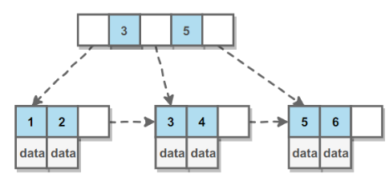
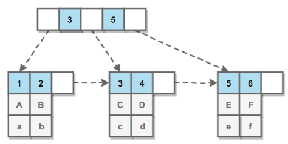
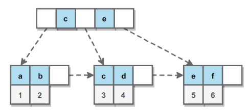

[TOC]

### MySQL索引

#### 概述

索引是帮助 MySQL 高效获取数据的**排好序**的**==数据结构==**。可以使用不同的数据结构实现索引，比如用 B+Tree，Hash 数据结构等实现索引。


#### 索引的优缺点

##### 1. 优点

- 大大减少了服务器需要扫描的**数据行数**，可以大大加快数据的**检索速度**（大大减少的检索的数据量）, 这也是创建索引的最主要的原因。
- 通过创建唯一性索引，可以保证数据库表中每一行数据的**唯一性**。
- 帮助服务器**避免进行排序和分组**，以及**避免创建临时表**（B+Tree 索引是**有序**的，可以**用于 ORDER BY 和 GROUP BY 操作**。临时表主要是在排序和分组过程中创建，因为不需要排序和分组，也就不需要创建临时表）。
- 将随机 I/O 变为**顺序 I/O**（B+Tree 索引是**有序**的，会将相邻的数据都**存储在一起**）。
- 可以加速表和表之间的**连接**，特别是在实现数据的参考完整性方面特别有意义。

> **索引这么多优点，为什么不对表中的每一个列创建一个索引呢？**

1. 当对表中的数据进行增加、删除和修改的时候，索引也要**动态的维护**，这样就降低了数据的维护速度。
2. 索引需要占**物理空间**，除了数据表占数据空间之外，每一个索引还要占一定的物理空间，如果要建立**聚簇索引**，那么需要的空间就会更大。
3. **创建索引和维护索引**要耗费时间，这种时间随着数据量的增加而增加。

> 索引的使用场景

索引能够轻易将查询性能提升几个数量级。

1. 对于非常小的表、大部分情况下简单的全表扫描比建立索引更高效。
2. 对于中到大型的表，索引就非常有效。
3. 但是对于特大型的表，建立和维护索引的代价将会随之增长。这种情况下，需要用到一种技术可以直接区分出需要查询的一组数据，而不是一条记录一条记录地匹配，例如可以使用分区技术。

**索引是在存储引擎层实现的，而不是在服务器层实现的**，所以不同存储引擎具有不同的索引类型和实现。

##### 2. 缺点

- 创建索引和维护索引要耗费时间，这种时间随着数据量的增加而增加。
- 索引需要占用物理空间，除了数据表占用数据空间之外，每一个索引还要占一定的物理空间，如果建立聚簇索引，那么需要的空间就会更大。
- 当对表中的数据进行增加、删除和修改的时候，索引也需要维护，降低数据维护的速度。

#### B-Tree

B- 树的**结点会同时存数据与索引**，通常**一个结点大小有限制**，如果一个结点存储的**数据过多，就会导致能存储的索引变少**，树的**分叉变少，使得树的高度变高**。所以需要用 B+ 树。

特点：

- 叶节点具有相同的**深度**，**叶节点的指针为空**
- 所有索引元素不重复
- 节点中的数据索引从左到右递增排列

#### B+Tree原理

##### 1. 数据结构

B Tree 指的是 **Balance Tree**，也就是**平衡树**。平衡树是一颗==**查找树**==，并且**所有==叶子节点位于同一层==**。

B+ Tree 是基于 B Tree 和**叶子节点顺序访问指针**进行实现，它具有 B Tree 的平衡性，并且通过**顺序访问指针**来提高区间查询的性能。

在 **B+ Tree** 中，一个节点中的 **key 从左到右非递减排列**，如果某个指针的左右相邻 key 分别是 key<sub>i</sub> 和 key<sub>i+1</sub>，且不为 null，则该指针指向节点的所有 key 大于等于 key<sub>i</sub> 且小于等于 key<sub>i+1</sub>。



B+ 树的**数据**都存在**叶子结点**上，而且叶子结点还有顺序指针，这样可以方便进行范围查询。而 B 树中数据可能在非叶子结点上，而且不含有指针。

加载一个**结点**就对应了一次**磁盘 IO 操作**。

特点：

- 非叶子节点不存储 data，**只存储索引(冗余)**，可以放更多的索引。B+ 树存在**冗余**，比如上图中 3 号在叶子结点和中间结点都存在，但是 B-Tree 中是不存在冗余的。
- 叶子节点包含所有**索引字段**。
- 叶子节点之间用**指针连接**，提高**区间访问**的性能。这样维护数据结构的话，叶子节点之间的元素是从小到大依次递增的，方便进行**范围查找**。

InnoDB 中一个结点默认的大小 **Innodb_page_size** 为 **16K**。如果存放的是 INT 类型的索引，那一个结点也可以存上千个值，可以有上千个分叉。

##### 2. 操作

进行查找操作时，首先在**根节点**进行**二分查找**，找到一个 key 所在的指针，然后递归地在指针所指向的节点进行查找。直到查找到叶子节点，然后在叶子节点上进行二分查找，找出 key 所对应的 data。

插入删除操作会破坏平衡树的平衡性，因此在插入删除操作之后，需要对树进行一个分裂、合并、旋转等操作来**维护平衡性**。

##### 3. 与红黑树的比较

红黑树等平衡树也可以用来实现**索引**，但是文件系统及数据库系统普遍采用 **B+ Tree 作为索引结构**，主要有以下两个原因：

（一）**更少的查找次数**

平衡树查找操作的时间复杂度和**树高 h 相关**，O(h)=O(log<sub>d</sub>N)，其中 d 为每个节点的出度。

**红黑树的出度为 2**，而 B+ Tree 的出度一般都非常大，所以红黑树的树高 h 很明显比 B+ Tree 大非常多，查找的次数也就更多。

B+ 树比红黑树更加**矮平**。

（二）**利用磁盘预读特性**

为了减少磁盘 I/O 操作，磁盘往往不是严格按需读取，而是每次都会**预读**。预读过程中，磁盘进行**顺序读取**，顺序读取不需要进行磁盘寻道，并且只需要很短的旋转时间，速度会非常快。

操作系统一般将内存和磁盘分割成**固定大小的块**，每一块称为**一页**，内存与磁盘以**页为单位**交换数据。数据库系统将索引的一个**节点**的大小设置为页的大小，使得一次 I/O 就能完全载入一个节点。并且可以利用**预读特性**，相邻的节点也能够被**预先载入**。

##### 4. B树与B+树的比较

关于 B 树与 B+ 树的比对看下面：

https://www.cnblogs.com/xueqiuqiu/articles/8779029.html

1. b+树的中间节点不保存数据，所以**磁盘页能容纳更多节点元素**，更“矮胖”；

2. b+树查询必须查找到叶子节点，b树只要匹配到即可不用管元素位置，因此b+树查找更稳定（并不慢）；

3. 对于**范围查找**来说，b+树只需**遍历叶子节点链表**即可，b树却需要**重复地中序遍历**

    

##### 5. 优势

红黑树等平衡树也可以用来实现索引，但是文件系统及数据库系统普遍采用 B Tree 作为索引结构，主要有以下两个原因：

**（一）更少的检索次数**

平衡树检索数据的时间复杂度等于树高 h，而树高大致为 O(h)=O(logdN)，其中 d 为每个节点的出度。

红黑树的出度为 2，而 B Tree 的出度一般都非常大。红黑树的树高 h 很明显比 B Tree 大非常多，因此检索的次数也就更多。

B+Tree 相比于 B-Tree 更适合外存索引，因为 B+Tree 内节点去掉了 data 域，因此可以拥有更大的出度，检索效率会更高。

**（二）利用计算机预读特性**

为了减少磁盘 I/O，磁盘往往不是严格按需读取，而是每次都会预读。这样做的理论依据是计算机科学中著名的局部性原理：当一个数据被用到时，其附近的数据也通常会马上被使用。预读过程中，磁盘进行顺序读取，顺序读取不需要进行磁盘寻道，并且只需要很短的旋转时间，因此速度会非常快。

操作系统一般将内存和磁盘分割成固态大小的块，每一块称为一页，内存与磁盘以页为单位交换数据。数据库系统将索引的一个节点的大小设置为页的大小，使得一次 I/O 就能完全载入一个节点，并且可以利用预读特性，相邻的节点也能够被预先载入。

更多内容请参考：[MySQL 索引背后的数据结构及算法原理]

----

#### MySQL索引分类

索引是在**存储引擎层**实现的，而不是在服务器层实现的，所以**不同存储引擎具有不同的索引类型**和实现。

MySQL 索引使用的数据结构主要有 **BTree索引** 和 **哈希索引** 。对于哈希索引来说，**底层的数据结构就是哈希表**，因此在绝大多数需求为**单条记录查询**的时候，可以选择**哈希索引**，查询性能最快；其余大部分场景，建议选择 BTree 索引。

MySQL 的 BTree 索引使用的是 B 树中的 B+Tree，但对于主要的两种存储引擎的实现方式是不同的。

- **MyISAM：**B+Tree 叶节点的 **data 域存放的是数据记录的地址**。在索引检索的时候，首先按照 B+Tree 搜索算法搜索索引，如果指定的 Key 存在，则取出其 data 域的值，然后以 data 域的值为地址读取相应的数据记录。这被称为“**非聚簇索引**”。
- **InnoDB：**其数据文件本身就是索引文件。相比 MyISAM，索引文件和数据文件是分离的，其表数据文件本身就是按 B+Tree 组织的一个索引结构，树的叶节点 data 域保存了完整的数据记录。这个索引的 key 是数据表的主键，因此 InnoDB 表数据文件本身就是主索引。这被称为“**聚簇索引**（或聚集索引）”。而其余的索引都作为辅助索引，**辅助索引的 data 域存储相应记录主键的值而不是地址**，这也是和 MyISAM 不同的地方。**在根据主索引搜索时，直接找到key所在的节点即可取出数据；在根据辅助索引查找时，则需要先取出主键的值，再走一遍主索引。** **因此，在设计表的时候，不建议使用过长的字段作为主键，也不建议使用非单调的字段作为主键，这样会造成主索引频繁分裂。** PS：整理自《Java工程师修炼之道》

##### 1. B+Tree索引

是大多数 MySQL 存储引擎的**默认索引**类型。

因为不再需要进行全表扫描，只需要对**树进行搜索**即可，所以查找速度快很多。

除了用于查找，还可以用于**排序和分组**（数据在叶子结点的存储方式决定）。

可以指定**多个列**作为索引列，多个索引列**共同**组成键。

适用于**全键值、键值范围和键前缀**查找，其中键前缀查找只适用于==**最左前缀**==查找。如果**不是按照索引列的顺序进行查找，则无法使用索引。**

InnoDB 的 B+Tree 索引分为**主索引和辅助索引**。主索引的**叶子节点** data 域记录着**完整**的**数据**记录，这种索引方式被称为==**聚簇索引**==。因为无法把数据行存放在两个不同的地方，所以一个表只能有**一个**聚簇索引。



**辅助索引**的**叶子节点**的 data 域记录着**主键的值**，因此在使用**辅助索引**进行查找时，需要先查找到**主键值**，然后再到主索引中进行查找。



##### 2. 哈希索引

**哈希索引**能以 **O(1)** 时间进行查找，但是**失去了有序性**：

- **无法**用于**排序与分组**；
- 只支持**精确查找**，无法用于**部分查找和范围查找**。

InnoDB 存储引擎有一个特殊的功能叫“**自适应哈希索引**”，当某个索引值被使用的**非常频繁**时，会在 **B+Tree 索引之上**再创建一个**哈希索引**，这样就让 B+Tree 索引具有哈希索引的一些优点，比如**快速**的哈希查找。

就是对需要查询的字段做一次哈希，然后进行查找。查找速度非常快，性能也很高。

##### 3. 全文索引

MyISAM 存储引擎支持**全文索引**，用于查找文本中的**关键词**，而不是直接比较是否相等。

查找条件使用 ==**MATCH AGAINST**==，而不是普通的 WHERE。

全文索引使用**倒排索引**实现，它记录着关键词到其所在**文档的映射**。

InnoDB 存储引擎在 MySQL 5.6.4 版本中也开始支持全文索引。

##### 4. 空间数据索引

MyISAM 存储引擎支持空间数据索引（**R-Tree**），可以用于**地理数据**存储。空间数据索引会从所有维度来索引数据，可以有效地使用任意维度来进行组合查询。

必须使用 GIS 相关的函数来维护数据。


#### 联合索引

##### 1. 什么是联合索引

两个或更多个列上的索引被称作联合索引，联合索引又叫复合索引。对于复合索引：Mysql 从左到右的使用索引中的字段，一个查询可以只使用索引中的一部份，但只能是最左侧部分。

例如索引是key index (a,b,c)，可以支持[a]、[a,b]、[a,b,c] 3种组合进行查找，但不支 [b,c] 进行查找。当最左侧字段是常量引用时，索引就十分有效。

##### 2. 命名规则

1. 需要加索引的字段，要在 where 条件中
2. 数据量少的字段不需要加索引
3. 如果 where 条件中是OR关系，加索引不起作用
4. 符合最左原则

##### 3. 创建索引

在执行 CREATE TABLE 语句时可以创建索引，也可以单独用 CREATE INDEX 或 ALTER TABLE 来为表增加索引。

**ALTER TABLE**

ALTER TABLE 用来创建普通索引、UNIQUE 索引或 PRIMARY KEY 索引。

例如：

```mysql
 ALTER TABLE table_name ADD INDEX index_name (column_list)
 ALTER TABLE table_name ADD UNIQUE (column_list)
 ALTER TABLE table_name ADD PRIMARY KEY (column_list)
```

其中 table_name 是要增加索引的表名，column_list 指出对哪些列进行索引，多列时各列之间用逗号分隔。索引名 index_name 可选，缺省时，MySQL将根据第一个索引列赋一个名称。另外，ALTER TABLE 允许在单个语句中更改多个表，因此可以在同时创建多个索引。


**CREATE INDEX**

CREATE INDEX 可对表增加普通索引或 UNIQUE 索引。

例如：

```mysql
 CREATE INDEX index_name ON table_name (column_list)
 CREATE UNIQUE INDEX index_name ON table_name (column_list)
```

table_name、index_name 和 column_list 具有与 ALTER TABLE 语句中相同的含义，索引名不可选。另外，不能用 CREATE INDEX 语句创建 PRIMARY KEY 索引。

##### 4. 索引类型

在创建索引时，可以规定索引能否包含重复值。如果不包含，则索引应该创建为 PRIMARY KEY 或 UNIQUE 索引。对于单列惟一性索引，这保证单列不包含重复的值。对于多列惟一性索引，保证多个值的组合不重复。
PRIMARY KEY 索引和 UNIQUE 索引非常类似。

事实上，PRIMARY KEY 索引仅是一个具有名称 PRIMARY 的 UNIQUE 索引。这表示一个表只能包含一个 PRIMARY KEY，因为一个表中不可能具有两个同名的索引。
下面的SQL语句对 students 表在 sid 上添加 PRIMARY KEY 索引。

```mysql
ALTER TABLE students ADD PRIMARY KEY (sid)
```

##### 5. 删除索引

可利用 ALTER TABLE 或 DROP INDEX 语句来删除索引。类似于 CREATE INDEX 语句，DROP INDEX 可以在 ALTER TABLE 内部作为一条语句处理，语法如下。

```mysql
 DROP INDEX index_name ON talbe_name
 ALTER TABLE table_name DROP INDEX index_name
 ALTER TABLE table_name DROP PRIMARY KEY
```

其中，前两条语句是等价的，删除掉 table_name 中的索引 index_name。

第3条语句只在删除 PRIMARY KEY 索引时使用，因为一个表只可能有一个 PRIMARY KEY 索引，因此不需要指定索引名。如果没有创建 PRIMARY KEY 索引，但表具有一个或多个 UNIQUE 索引，则 MySQL 将删除第一个 UNIQUE 索引。

如果从表中删除了某列，则索引会受到影响。对于多列组合的索引，如果删除其中的某列，则该列也会从索引中删除。如果删除组成索引的所有列，则整个索引将被删除。


##### 6. 什么情况下使用索引

1. 为了**快速查找匹配WHERE条件的行**。
2. 为了从考虑的条件中消除行。
3. 如果表有一个multiple-column索引，任何一个索引的最左前缀可以通过使用优化器来查找行。
4. 查询中与其它表关联的字，字段常常建立了外键关系
5. 查询中统计或分组统计的字段
    - select max(hbs_bh) from zl_yhjbqk
    - select qc_bh,count(*) from zl_yhjbqk group by qc_bh


 更多请转向：[MySQL-联合索引 - 简书](https://www.jianshu.com/p/f65be52d5e2b)


#### 聚集索引与非聚集索引

https://www.cnblogs.com/s-b-b/p/8334593.html

聚集索引一定是唯一索引。但唯一索引不一定是聚集索引。  

**聚集索引，在索引页里直接存放数据，而非聚集索引在索引页里存放的是索引，这些索引指向专门的数据页的数据。**


#### 索引优化

##### 1. 独立的列

在进行查询时，索引列**不能是表达式的一部分**，也不要对其**施加函数**或者成为**函数的参数**，否则**无法**使用索引。这会造成无法命中索引。

例如下面的查询不能使用 actor_id 列的索引：

```sql
SELECT actor_id FROM sakila.actor WHERE actor_id + 1 = 5;  
```

##### 2. 多列索引

在需要使用**多个列**作为条件进行查询时，使用**多列索引比使用多个单列索引性能更好**。例如下面的语句中，最好把 actor_id 和 film_id 设置为多列索引。

```sql
SELECT film_id, actor_ id FROM sakila.film_actor
WHERE actor_id = 1 AND film_id = 1;
```

##### 3. 索引列的顺序

让**==选择性最强==的索引列放在前面**。

索引的选择性是指：**不重复的索引值和记录总数的比值**。最大值**为 1**，此时**每个记录都有唯一的索引与其对应**。选择性越高，查询效率也越高。

例如下面显示的结果中 customer_id 的选择性比 staff_id 更高，因此最好把 customer_id 列放在多列索引的前面。

```sql
SELECT COUNT(DISTINCT staff_id)/COUNT(*) AS staff_id_selectivity,
COUNT(DISTINCT customer_id)/COUNT(*) AS customer_id_selectivity,
COUNT(*)
FROM payment;
```

```html
   staff_id_selectivity: 0.0001
customer_id_selectivity: 0.0373
               COUNT(*): 16049
```

##### 4. 前缀索引

对于 **BLOB、TEXT 和 VARCHAR** 类型的列，必须使用==**前缀索引**==，只索引**开始的部分字符**。

对于前缀长度的选取需要根据索引选择性来确定。

##### 5. 覆盖索引

索引包含**所有需要查询**的字段的值。

具有以下优点：

- 索引通常远小于数据行的大小，只读取索引能大大减少数据访问量。
- 一些存储引擎（例如 MyISAM）在内存中只缓存索引，而数据依赖于操作系统来缓存。因此，只访问索引可以不使用系统调用（通常比较费时）。
- 对于 InnoDB 引擎，若**辅助索引**能够覆盖查询，则**无需访问主索引**。

----

#### 索引的使用条件（注意事项）

- 对于**非常小**的表、大部分情况下简单的全表扫描比建立索引更高效；
- 对于**中到大型的表，索引就非常有效**；
- 但是对于**特大型**的表，建立和维护索引的代价将会随之增长。这种情况下，需要用到一种技术可以**直接区分**出需要查询的一组数据，而不是一条记录一条记录地匹配，例如可以使用**分区技术**。
- **主键，使用唯一索引。**
- 经常用作**查询条件**的字段需要创建索引
- 经常需要**排序、分组和统计**的字段需要建立索引
- 查询中与其他表**关联**的字段，外键关系建立索引。
- 在经常使用在 **WHERE 子句**中的列上面创建索引，加快条件的判断速度。
- 将打算**加索引**的列设置为 **NOT NULL** ，否则将导致引擎放弃使用索引而进行**全表**扫描。

哪些情况**不要**建索引：

- 表的记录太少，百万级以下的数据不需要创建索引。
- 经常**增删改**的表不需要创建索引
- 数据**重复**且分布平均的字段**不需要**创建索引，如 true, false 之类。
- **频繁更新**的字段不适合创建索引
- WHERE 条件里**用不到**的字段不需要创建索引

#### 使用索引的注意事项？

1. 避免 where 子句中对字段施加函数，这会造成无法命中索引。
2. 在使用InnoDB时使用与业务无关的自增主键作为主键，即使用逻辑主键，而不要使用业务主键。
3. 删除长期未使用的索引，不用的索引的存在会造成不必要的性能损耗 MySQL 5.7 可以通过查询 sys 库的 chema_unused_indexes 视图来查询哪些索引从未被使用。
4. 在使用 limit offset 查询缓慢时，可以借助索引来提高性能。


#### 索引失效

> 美团面经：哪些情况下不会使用索引？

- 如果MySQL估计使用**全表扫秒比使用索引快**，则不适用索引。

    例如，如果列key均匀分布在1和100之间，下面的查询使用索引就不是很好：select * from table_name where key>1 and key<90;

- 如果**条件中有or**，即使其中有条件带索引也不会使用

    例如：select * from table_name where key1='a' or key2='b';如果在key1上有索引而在key2上没有索引，则该查询也不会走索引

- 复合索引，如果索引列**不是复合索引的第一部分**，则不使用索引（即不符合最左前缀）

    例如，复合索引为(key1,key2),则查询select * from table_name where key2='b';将不会使用索引

- 如果**like是以 % 开始的**，则该列上的索引不会被使用。

    例如select * from table_name where key1 like '%a'；该查询即使key1上存在索引，也不会被使用如果列类型是字符串，那一定要在条件中使用引号引起来，否则不会使用索引

- 如果列为字符串，则where条件中必须将字符常量值加引号，否则即使该列上存在索引，也不会被使用。

    例如,select * from table_name where key1=1;如果key1列保存的是字符串，即使key1上有索引，也不会被使用。

- 如果使用MEMORY/HEAP表，并且where条件中不使用“=”进行索引列，那么不会用到索引，head表只有在“=”的条件下才会使用索引


#### 在什么情况下适合建立索引

- 为经常出现在关键字**order by、group by、distinct**后面的字段，建立索引。 
- 在union等集合操作的结果集字段上，建立索引。其建立索引的目的同上。 
- 为经常用作查询选择 where 后的字段，建立索引。 
- **在经常用作表连接 join 的属性上，建立索引。** 
- 考虑使用索引覆盖。对数据很少被更新的表，如果用户经常只查询其中的几个字段，可以考虑在这几个字段上建立索引，从而将表的扫描改变为索引的扫描。 


#### 索引设计规范

> **限制每张表上的索引数量,建议单张表索引不超过 5 个**

索引并不是越多越好！索引可以提高效率同样可以降低效率。

索引可以增加查询效率，但同样也会**降低插入和更新的效率**，甚至有些情况下会降低查询效率。

因为 MySQL 优化器在选择如何优化查询时，会根据统一信息，对每一个可以用到的索引来进行评估，以生成出一个最好的执行计划，如果同时有很多个索引都可以用于查询，就**会增加 MySQL 优化器生成执行计划的时间，同样会降低查询性能**。

> **禁止给表中的每一列都建立单独的索引**

5.6 版本之前，一个 sql 只能使用到一个表中的一个索引，5.6 以后，虽然有了合并索引的优化方式，但是还是远远没有使用一个**联合索引**的查询方式好。

> **每个 Innodb 表必须有个主键**

Innodb 是一种**索引组织表**：数据的存储的逻辑顺序和索引的顺序是相同的。每个表都可以有多个索引，但是表的存储顺序只能有一种。

Innodb 是按照主键索引的顺序来组织表的。

- 不要使用更新频繁的列作为主键，不适用多列主键（相当于联合索引）。
- 不要使用 UUID, MD5, HASH, 字符串列作为主键（无法保证数据的顺序增长）。
- 主键建议使用自增 ID 值。

> **常见索引列建议**

- 出现在 SELECT、UPDATE、DELETE 语句的 WHERE 从句中的列。
- 包含在 ORDER BY、GROUP BY、DISTINCT 中的字段。
- 并不要将符合 1 和 2 中的字段的列都建立一个索引， 通常将 1、2 中的字段建立联合索引效果更好。
- 多表 join 的关联列。

> **如何选择索引列的顺序**

建立索引的目的是：希望通过索引进行数据查找，减少随机 IO，增加查询性能 ，索引能过滤出越少的数据，则从磁盘中读入的数据也就越少。

- **区分度最高的放在联合索引的最左侧**（区分度=列中不同值的数量/列的总行数）。
- 尽量**把字段长度小的列放在联合索引的最左侧**（因为字段长度越小，一页能存储的数据量越大，IO 性能也就越好）。
- 使用**最频繁的列**放到联合索引的左侧（这样可以比较少的建立一些索引）。

> **避免建立冗余索引和重复索引（增加了查询优化器生成执行计划的时间）**

- 重复索引示例：primary key(id)、index(id)、unique index(id)
- 冗余索引示例：index(a,b,c)、index(a,b)、index(a)

> **对于频繁的查询优先考虑使用覆盖索引**

**覆盖索引**：就是包含了所有查询字段 (where,select,ordery by,group by 包含的字段) 的索引。

**覆盖索引的好处：**

- **避免 Innodb 表进行索引的二次查询:** Innodb 是以聚集索引的顺序来存储的，对于 Innodb 来说，二级索引在叶子节点中所保存的是行的主键信息，如果是用二级索引查询数据的话，在查找到相应的键值后，还要通过主键进行二次查询才能获取我们真实所需要的数据。而在覆盖索引中，二级索引的键值中可以获取所有的数据，避免了对主键的二次查询 ，减少了 IO 操作，提升了查询效率。
- •**可以把随机 IO 变成顺序 IO 加快查询效率:** 由于覆盖索引是按键值的顺序存储的，对于 IO 密集型的范围查找来说，对比随机从磁盘读取每一行的数据 IO 要少的多，因此利用覆盖索引在访问时也可以把磁盘的随机读取的 IO 转变成索引查找的顺序 IO。

> **索引 SET 规范**

**尽量避免使用外键约束**

- 不建议使用外键约束（foreign key），但一定要在表与表之间的关联键上建立索引。
- 外键可用于保证数据的参照完整性，但建议在**业务端**实现。
- **外键会影响父表和子表的写操作从而降低性能**


看看这个帖子：美团的：https://www.cnblogs.com/php-rearch/p/5034118.html


#### 问题

##### 1. 为什么用B+树做索引而不用B-树或红黑树

B+ 树只有叶节点存放数据，其余节点用来索引，而 B- 树是每个索引节点都会有 **Data 域**。所以从 InooDB 的角度来看，B+ 树是用来充当索引的，一般来说索引非常大，尤其是关系性数据库这种数据量大的索引能达到亿级别，所以为了减少内存的占用，索引也会被存储在磁盘上。

那么 MySQL如何衡量查询效率呢？答：**磁盘 IO 次数**

- B- 树 / B+ 树 的特点就是每层节点数目非常多，层数很少，目的就是为了就少磁盘 IO 次数，但是 B- 树的每个节点都有 data 域（指针），这无疑**增大了节点大小**，说白了增加了磁盘 IO 次数（磁盘 IO 一次读出的数据量大小是固定的，单个数据变大，每次读出的就少，IO 次数增多，一次 IO 多耗时），而 B+ 树除了叶子节点其它节点并不存储数据，节点小，磁盘 IO 次数就少。
- B+ 树所有的 Data 域在叶子节点，一般来说都会进行一个优化，就是**将所有的叶子节点用指针串起来**。这样遍历叶子节点就能获得全部数据，这样就能进行**区间访问**。在数据库中基于范围的查询是非常频繁的，而 **B 树不支持这样的遍历操作**。

B 树相对于红黑树的区别

- **AVL 树和红黑树基本都是存储在内存中才会使用的数据结构**。在大规模数据存储的时候，红黑树往往出现由于**树的深度过大**而造成磁盘 IO 读写过于频繁，进而导致效率低下的情况。为什么会出现这样的情况，我们知道要获取磁盘上数据，必须先通过磁盘移动臂移动到数据所在的柱面，然后找到指定盘面，接着旋转盘面找到数据所在的磁道，最后对数据进行读写。磁盘IO代价主要花费在查找所需的柱面上，树的深度过大会造成磁盘IO频繁读写。根据**磁盘查找存取的次数往往由树的高度所决定**，所以，只要我们通过某种较好的树结构减少树的结构尽量减少树的高度，B树可以有多个子女，从几十到上千，可以降低树的高度。
- **数据库系统的设计者巧妙利用了磁盘预读原理**，将**一个节点的大小设为等于一个页**，这样**每个节点只需要一次 I/O 就可以完全载入**。为了达到这个目的，在实际实现 B-Tree 还需要使用如下技巧：每次新建节点时，直接申请一个页的空间，这样就保证**一个节点物理上也存储在一个页里**，加之计算机存储分配都是按页对齐的，就实现了一个 node 只需一次 I/O。

B- 树的结点会同时存数据与索引，通常一个结点大小有限制（**Innodb_page_size** 默认为 16K），如果一个结点存储的数据过多，就会导致能存储的索引变少，树的分叉变少，使得树的高度变高。


