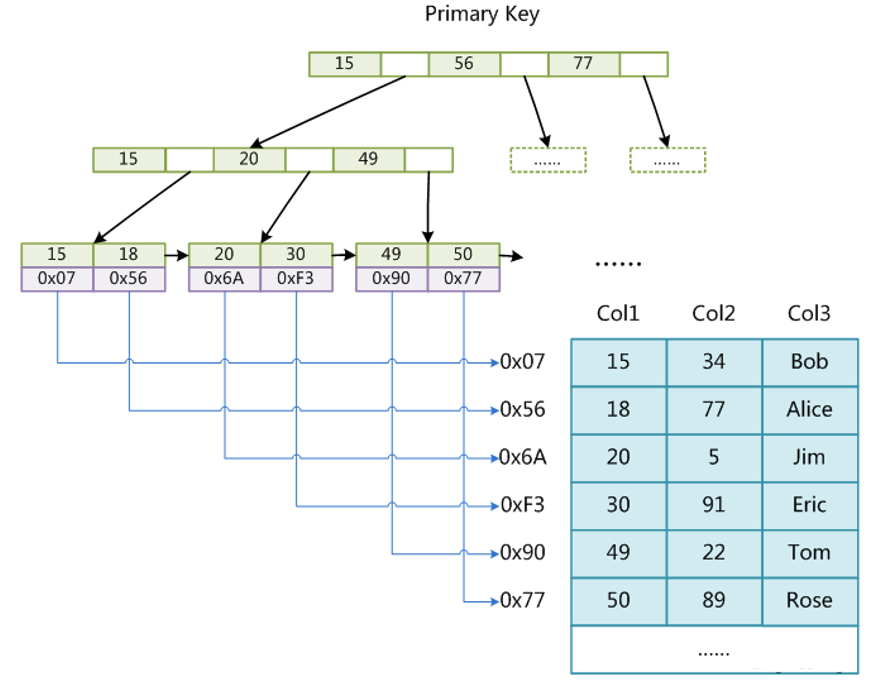
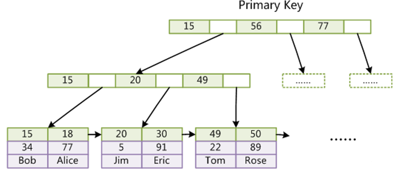
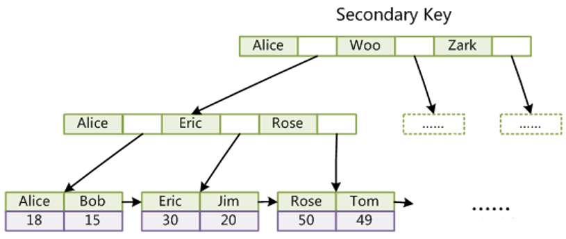
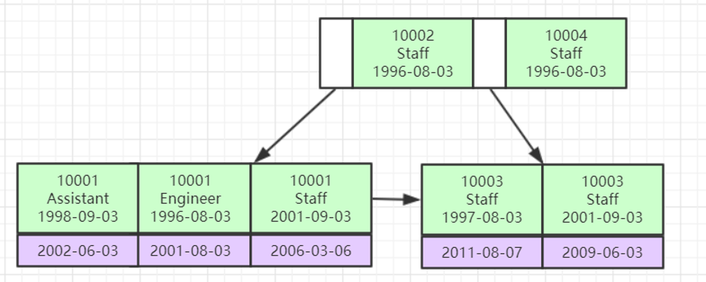

[TOC]

### 索引与优化

#### 存储引擎索引实现

索引分成了**主键索引与非主键索引**（普通索引、辅助索引）。

##### 1. MyISAM索引实现

MyISAM存储引擎的表在磁盘中会存储为三个文件：**==.myd==（数据文件）和 ==.myi==（索引文件）组成，==.frm== 文件存储表结构（所以存储引擎都有）**。

所以 MyISAM **主键索引**的**索引文件和数据文件是分离**的，这就是**非聚集索引**。MyISAM 存储引擎中非主键索引（普通索引）与主键索引组织方式是类似的。组织方法如下，B+Tree 索引叶子结点存储的是真实数据的地址：



##### 2. InnoDB索引实现

InnoDB 存储引擎的表在磁盘中会存储为两个文件：**==.ibd== 文件（索引+数据文件）和 ==.frm== 文件（表结构）**。

对于**主键索引**，InnoDB 的**主键索引**就是聚集索引。InnoDB 通过主键聚集索引。

- 表数据文件本身就是按 **B+Tree** 组织的一个索引结构文件。
- **聚集索引-叶节点包含了完整的数据记录**。

其组织方式如下。可以看到在叶子结点上索引是主键（绿色格子），其下面存储的是**全部完整的数据**。这就是聚集的含义。



对于**非主键索引（辅助索引）**，InnoDB 组织方式大致如下，索引叶子结点存储的是**主键值**。



索引下面记录的是**主键值**！而不是像主键索引那样存储的是全部数据。得到主键值之后通过主键进行查找。

为什么这样做？这是为了保证**一致性和节省存储空间**。一致性是指，比如当插入一条数据的时候，如果非主键索引上也存储全部元素，那么就需要保证在不同的地方都全部插入数据，这就难以保证一致性；只在主键索引下面存放完整数据，只需要维护一份完整数据，既能保证一致性也能节省空间。

对于**联合索引**（多个索引字段组合），**存储结构**就是把多个字段同时放到了结点的 Key 中了。联合索引怎么比大小排序？比如有三个索引字段 (a, b, c)，那么此时比较大小是依次比较索引字段，先比较 a 字段，再比较 b 字段。注意：如果索引相同，那么是**挨着排存储在结点**中的，只要保证右边的值大于等于左边的即可。

下面是一个创建联合索引的例子。

```mysql
KEY `idx_film_actor_id` (`film_id`,`actor_id`)
```

其组织方式如下，可以看到多个索引字段存储到了一起，索引叶子结点中，绿色的部分是联合索引的全部值，紫色部分是非索引的值。其实也是全部数据都存储到了叶子结点上。



少用单值索引，比如有一个表有 20 个字段，有 5 个需要建索引，如果建 5 个单值索引，那么就会有五个 B+Tree 结构存放在 InnoDB 引擎的 .ibd 文件中。推荐使用**联合索引**，如果把五个字段联合起来建立联合索引，那么只会有一棵 B+Tree。

> 为什么 InnoDB 表**必须有主键**？

InnoDB 设计的数据文件就是依附于 B+Tree 的，所有数据都是依附在主键上的，所以说必须有主键。如果自己建表的时候没有主键，那么会自动找一列可以充当唯一索引的当做主键，如果找不到，那么就会自动生成一个 rowId 当做主键。

> 为什么推荐使用**整型的自增**主键？

主键为啥推荐用**整型**？索引之前查找都是基于比较的，用整型是非常方便的。别用 UUID 当主键，占用空间也大，而且难以比较。为什么推荐**自增**？如果是自增的话，直接顺序放就行了，如果不是自增，当前面的结点已经存满之后，此时为了维护 B+Tree 的特性，会导致前面的结点进行分裂与平衡的变动，影响性能。

##### 3. 总结

- **MyISAM 的主键索引是非聚集索引，InnoDB 的主键索引是聚集索引。**
- 多个索引字段建议创建联合索引。


#### Explain详解

使用 EXPLAIN 关键字可以**模拟优化器执行 SQL 语句**，分析你的查询语句或是结构的性能瓶颈**在 select 语句之前增加  explain 关键字**，MySQL 会在查询上设置一个**标记**，执行查询会返回执行计划的信息，而不是执行这条 SQL。

注意：如果  from 中包含子查询，仍会执行该子查询，将结果放入临时表中。

先创建几个表。

```mysql
DROP TABLE IF EXISTS `actor`;
 CREATE TABLE `actor` (
     `id` int(11) NOT NULL,
     `name` varchar(45) DEFAULT NULL,
     `update_time` datetime DEFAULT NULL,
     PRIMARY KEY (`id`)
 ) ENGINE=InnoDB DEFAULT CHARSET=utf8;

INSERT INTO `actor` (`id`, `name`, `update_time`) VALUES (1,'a','2017‐12‐22 15:27:18'), (2,'b','2017‐12‐22 15:27:18'), (3,'c','2017‐12‐22 15:27:18');

DROP TABLE IF EXISTS `film`;
CREATE TABLE `film` (
    `id` int(11) NOT NULL AUTO_INCREMENT,
    `name` varchar(10) DEFAULT NULL,
    PRIMARY KEY (`id`),
    KEY `idx_name` (`name`)
) ENGINE=InnoDB DEFAULT CHARSET=utf8;
INSERT INTO `film` (`id`, `name`) VALUES (3,'film0'),(1,'film1'),(2,'film2');

DROP TABLE IF EXISTS `film_actor`;
CREATE TABLE `film_actor` (
    `id` int(11) NOT NULL,
    `film_id` int(11) NOT NULL,
    `actor_id` int(11) NOT NULL,
    `remark` varchar(255) DEFAULT NULL,
    PRIMARY KEY (`id`),
    # 这里创建了联合索引
    KEY `idx_film_actor_id` (`film_id`,`actor_id`)) ENGINE=InnoDB DEFAULT CHARSET=utf8;
INSERT INTO `film_actor` (`id`, `film_id`, `actor_id`) VALUES (1,1,1), (2,1,2),(3,2,1);
```


#### 索引优化

```mysql
CREATE TABLE `employees` (
    `id` int(11) NOT NULL AUTO_INCREMENT,
    `name` varchar(24) NOT NULL DEFAULT '' COMMENT '姓名',
    `age` int(11) NOT NULL DEFAULT '0' COMMENT '年龄',
    `position` varchar(20) NOT NULL DEFAULT '' COMMENT '职位',
    `hire_time` timestamp NOT NULL DEFAULT CURRENT_TIMESTAMP COMMENT '入职时间', 
    PRIMARY KEY (`id`),
    # 创建联合索引
    KEY `idx_name_age_position` (`name`,`age`,`position`) USING BTREE
) ENGINE=InnoDB AUTO_INCREMENT=4 DEFAULT CHARSET=utf8 COMMENT='员工记录表';

INSERT INTO employees(name,age,position,hire_time) VALUES('LiLei',22,'manager',NOW());
INSERT INTO employees(name,age,position,hire_time) VALUES('HanMeimei',23,'dev',NOW());
INSERT INTO employees(name,age,position,hire_time) VALUES('Lucy',23,'dev',NOW());
```

注意这里创建了联合索引：idx_name_age_position，联合了三个字段 name，age 和 position。

> **最左前缀法则**

如果索引了**多列**，要遵守最左前缀法则。指的是查询从索引的**最左前列开始并且不跳过索引中的列**。也就是要命中索引的话，**必须包含左边的字段，一个或者多个都可**。结合上面联合索引的组织图，可以看到联合索引是从左往右挨着比较的，如果差了左边的字段，那么其实也就是挨着比较，也就相当于走全表扫描了。

比如索引字段为 A（name），B（age），C（position）。

- 则查询条件为 A，会走索引。
- 查询条件为 AB，会走索引。
- 查询条件为 ABC，会走索引。
- 查询条件为 BC，不会走索引。
- 查询条件为 AC，只会走字段 A 的索引。

案例 1：

```mysql
EXPLAIN SELECT * FROM employees WHERE age = 22 AND position ='manager'; 
```

这里查询条件只含 B 和 C，**不会**走索引。

案例 2：

```java
EXPLAIN SELECT * FROM employees WHERE position = 'manager';
```

这里查询条件只含 C，**不会**走索引。

案例 3：

```mysql
EXPLAIN SELECT * FROM employees WHERE name = 'LiLei';  
```

这里查询条件只含 A，就是最左前缀，**会**走索引。

案例 4：

```mysql
EXPLAIN SELECT * FROM employees WHERE name= 'LiLei' AND age = 22;
EXPLAIN SELECT * FROM employees WHERE age = 22 AND name= 'LiLei';
```

这里查询条件含 A 和 B（写的顺序倒过来也可），就是最左前缀，**会**走索引。

> 不在索引列上做**任何操作（计算、函数、（自动or手动）类型转换）**，会导致索引失效而转向全表扫描。

下面一句，有函数直接不走索引。

```mysql
EXPLAIN SELECT * FROM employees WHERE left(name,3) = 'LiLei';
```

下面一个语句，使用日期函数，不会走索引。

````mysql
EXPLAIN select * from employees where date(hire_time) ='2018-09-30';
````

可以自己转换为范围查询走索引。

```mysql
EXPLAIN select * from employees where hire_time >='2018-09-30 00:00:00' and
hire_time <='2018-09-30 23:59:59';
```

> **范围查找之后**的索引失效

下面的句子中第一句走三个索引，但是第二个 SQL 只走了两个索引，也就是 age 是范围查找，这里 age 后面的索引是失效了，也就是只会走 name 和 age 两个索引，position 失效了。

```mysql
EXPLAIN SELECT * FROM employees WHERE name= 'LiLei' AND age = 22 AND position ='manager';
EXPLAIN SELECT * FROM employees WHERE name= 'LiLei' AND age > 22 AND position ='manager';
```

> 尽量使用**覆盖索引**（只访问索引的查询（索引列包含查询列）），减少 **select *** 语句  

```mysql
EXPLAIN SELECT * FROM employees WHERE name= 'LiLei' AND age = 23 AND
position ='manager';
```

优化一下：

```mysql
EXPLAIN SELECT name,age FROM employees WHERE name= 'LiLei' AND age = 23
AND position ='manager';  
```

> 在使用**不等于**（!= 或者<>）的时候无法使用索引会**导致全表扫描**  

因为索引一般是比较相不相等，比较不相等其实也就是全表扫描了。

```mysql
EXPLAIN SELECT * FROM employees WHERE name != 'LiLei';
```

> is null, is not null 也无法使用索引  

建议数据表的字段设置为**非 NULL**，没有值也搞一个默认值，这样保证索引。

```mysql
EXPLAIN SELECT * FROM employees WHERE name is null;
```

> like 以通配符开头（'$abc...'）MySQL 索引失效会变成全表扫描操作  

**% 在前面是没法走索引的**，直接就是全表扫描了。

```mysql
EXPLAIN SELECT * FROM employees WHERE name like '%Lei';
```

**% 在后面是可以走索引的。**这里是知道前缀的情况，比对前缀就行了。 

```mysql
EXPLAIN SELECT * FROM employees WHERE name like 'Lei%';
```

问题：解决 like '%字符串%' 索引不被使用的方法？  

a）使用**覆盖索引**，查询字段必须是建立覆盖索引字段。这里

```mysql
EXPLAIN SELECT name, age, position FROM employees WHERE name like '%Lei%';
```

b）如果不能使用覆盖索引则可能需要借助**搜索引擎**，如 ES。

> 字符串不加单引号索引失效 

下面第一句走索引，第二句不走索引。

```mysql
EXPLAIN SELECT * FROM employees WHERE name = '1000';
EXPLAIN SELECT * FROM employees WHERE name = 1000;
```

> 少用 or 或 in，用它查询时，MySQL 不一定使用索引，MySQL 内部优化器会根据检索比例、表大小等多个因素整体评估是否使用索引，详见范围查询优化  

```mysql
EXPLAIN SELECT * FROM employees WHERE name = 'LiLei' or name = 'HanMeimei';
```

> 范围查询优化

给年龄添加单值索引。

```mysql
ALTER TABLE `employees` ADD INDEX `idx_age` (`age`) USING BTREE ;
```

下面的范围查询，实际上没有走索引。

```mysql
explain select * from employees where age >=1 and age <=2000;
```

没走索引原因：MySQL 内部优化器会**根据检索比例、表大小等多个因素整体评估是否使用索引**。比如这个例子，可能是由于单次数据量**查询过大**导致优化器最终选择不走索引。

优化方法：**可以将大的范围拆分成多个小范围**。

比如改成下面的两个范围查询，可能就会走。

```mysql
explain select * from employees where age >=1 and age <=1000;
explain select * from employees where age >=1001 and age <=2000;
```

> MySQL 如何选择合适的索引

看下面的 SQL 语句。

```mysql
EXPLAIN select * from employees where name > 'a';
```

这里是没走索引的。

如果用 name 索引需要遍历 name 字段联合索引树，然后还需要根据**遍历出来的主键值**去主键索引树里再去查出最终数据，相当于遍历了两棵索引树（一颗主键索引树、一颗联合索引树），成本比全表扫描还高，所以就不走索引了。

可以用**覆盖索引**优化，这样只需要遍历 name 字段的**联合索引树**就能拿到所有结果，如下：  

```mysql
EXPLAIN select name,age,position from employees where name > 'a' ;
```

再看下面的 SQL。这一条其实跟上面的类似，只是 name 的范围不同，这里 MySQL 根据数据量发现，这里数据量较少，于是就**走了索引**。这里就是引擎执行的**过程中**根据数据情况会进行优化。

```mysql
EXPLAIN select * from employees where name > 'zzz' ;
```

#### Trace工具

对于上面这两种 name>'a' 和 name>'zzz' 的执行结果，MySQL 最终是否选择走索引或者一张表涉及多个索引，MySQL 最终如何选择索引，我们可以用 **trace 工具**来一查究竟，开启 trace 工具会**影响 MySQL 性能**，所以只能**临时分析** SQL 使用，**用完之后立即关闭**。

开启 trace 工具。

```mysql
set session optimizer_trace="enabled=on",end_markers_in_json=on;    # 开启trace
```

执行一下下面的语句。

```mysql
select * from employees where name > 'a' order by position;
```

分析结果存放到了下面的表中。

```mysql
SELECT * FROM information_schema.OPTIMIZER_TRACE;
```

得到 trace 字段：

```json

{
"steps": [
{
"join_preparation": { ‐‐第一阶段：SQL准备阶段
                 "select#": 1,
                 "steps": [
                 {
                 "expanded_query": "/* select#1 */ select `employees`.`id` AS `id`,`employees`.`name` AS `name`,`employees`.`age` AS `age`,`employees`.`position` AS `position`,`employees`.`hire_time` AS `hire_time` from`employees` where (`employees`.`name` > 'a') order by `employees`.`position`"
}
]/* steps */
}/* join_preparation */},
{
"join_optimization": { ‐‐第二阶段：SQL优化阶段
"select#": 1,
"steps": [
{
"condition_processing": { ‐‐条件处理
"condition": "WHERE",
"original_condition": "(`employees`.`name` > 'a')",
"steps": [
{
"transformation": "equality_propagation",
"resulting_condition": "(`employees`.`name` > 'a')"
},
{
"transformation": "constant_propagation",
"resulting_condition": "(`employees`.`name` > 'a')"
},
{
"transformation": "trivial_condition_removal",
"resulting_condition": "(`employees`.`name` > 'a')"
}
]/* steps */
}/* condition_processing */
},
{
"substitute_generated_columns": {
}/* substitute_generated_columns */
},
{
"table_dependencies": [ ‐‐表依赖详情
{
"table": "`employees`",
"row_may_be_null": false,
"map_bit": 0,
"depends_on_map_bits": [
]/* depends_on_map_bits */
}
]/* table_dependencies */
},
{
"ref_optimizer_key_uses": [
]/* ref_optimizer_key_uses */
},
{
"rows_estimation": [ ‐‐预估表的访问成本
{
"table": "`employees`",
"range_analysis": {
"table_scan": { ‐‐全表扫描情况
"rows": 10123, ‐‐扫描行数
"cost": 2054.7 ‐‐查询成本
}/* table_scan */,70 "potential_range_indexes": [ ‐‐查询可能使用的索引
{
"index": "PRIMARY", ‐‐主键索引
"usable": false,
"cause": "not_applicable"
},
{
"index": "idx_name_age_position", ‐‐辅助索引
"usable": true,
"key_parts": [
"name",
"age",
"position",
"id"
]/* key_parts */
}
]/* potential_range_indexes */,
"setup_range_conditions": [
]/* setup_range_conditions */,
"group_index_range": {
"chosen": false,
"cause": "not_group_by_or_distinct"
}/* group_index_range */,
"analyzing_range_alternatives": { ‐‐分析各个索引使用成本
"range_scan_alternatives": [
{
"index": "idx_name_age_position",
"ranges": [
"a < name" ‐‐索引使用范围
]/* ranges */,
"index_dives_for_eq_ranges": true,
"rowid_ordered": false, ‐‐使用该索引获取的记录是否按照主键排序
"using_mrr": false,
"index_only": false, ‐‐是否使用覆盖索引
"rows": 5061, ‐‐索引扫描行数
"cost": 6074.2, ‐‐索引使用成本
"chosen": false, ‐‐是否选择该索引
"cause": "cost"
}
]/* range_scan_alternatives */,
"analyzing_roworder_intersect": {
"usable": false,
"cause": "too_few_roworder_scans"
}/* analyzing_roworder_intersect */
}/* analyzing_range_alternatives */
}/* range_analysis */
}
]/* rows_estimation */
},
{
"considered_execution_plans": [
{ "plan_prefix": [
]/* plan_prefix */,
"table": "`employees`",
"best_access_path": { ‐‐最优访问路径
"considered_access_paths": [ ‐‐最终选择的访问路径
{
"rows_to_scan": 10123,
"access_type": "scan", ‐‐访问类型：为scan，全表扫描
"resulting_rows": 10123,
"cost": 2052.6,
"chosen": true, ‐‐确定选择
"use_tmp_table": true
}
]/* considered_access_paths */
}/* best_access_path */,
"condition_filtering_pct": 100,
"rows_for_plan": 10123,
"cost_for_plan": 2052.6,
"sort_cost": 10123,
"new_cost_for_plan": 12176,
"chosen": true
}
]/* considered_execution_plans */
},
{
"attaching_conditions_to_tables": {
"original_condition": "(`employees`.`name` > 'a')",
"attached_conditions_computation": [
]/* attached_conditions_computation */,
"attached_conditions_summary": [
{
"table": "`employees`",
"attached": "(`employees`.`name` > 'a')"
}
]/* attached_conditions_summary */
}/* attaching_conditions_to_tables */
},
{
"clause_processing": {
"clause": "ORDER BY",
"original_clause": "`employees`.`position`",
"items": [
{
"item": "`employees`.`position`"
}
]/* items */,
"resulting_clause_is_simple": true,
"resulting_clause": "`employees`.`position`"
}/* clause_processing */
},
{
"reconsidering_access_paths_for_index_ordering": {
"clause": "ORDER BY", "steps": [
]/* steps */,
"index_order_summary": {
"table": "`employees`",
"index_provides_order": false,
"order_direction": "undefined",
"index": "unknown",
"plan_changed": false
}/* index_order_summary */
}/* reconsidering_access_paths_for_index_ordering */
},
{
"refine_plan": [
{
"table": "`employees`"
}
]/* refine_plan */
}
]/* steps */
}/* join_optimization */
},
{
"join_execution": { ‐‐第三阶段：SQL执行阶段
"select#": 1,
"steps": [
]/* steps */
}/* join_execution */
}
]/* steps */
}
```

**全表扫描的成本低于索引扫描，所以最终选择全表扫描。**

也就是这个工具会**分析并预估**走索引和全表扫描的**成本**，进行对比，然后进行选择执行。

如果一个 SQL 走了索引，一个没走，就可以用 trace 工具来试试。


#### Order by与Group by优化

MySQL 支持两种方式的排序 filesort 和 index，Using index 是指 MySQL 扫描索引本身完成排序。index 效率高，filesort 相当于是加载数据之后再进行重新排序，效率低。
Order by 满足两种情况会使用 Using index。

- order by 语句使用**索引最左前列**。
- 使用 where 子句与 order by 子句**条件列组合满足索引最左前列**。

所以尽量在**索引列上完成排序**，遵循索引建立（索引创建的顺序）时的**最左前缀法则**。如果 order by 的条件不在索引列上，就会产生 **Using filesort**。

能用覆盖索引尽量用覆盖索引。

group by 与 order by 很类似，其实质是**先排序后分组**，遵照索引创建顺序的**最左前缀法则**。对于 group by 的优化如果不需要排序的可以**加上 order by null 禁止排序**。注意，**where 高于 having**，能写在 where 中的限定条件就不要去 having 限定了。  


#### Using filesort

filesort **文件排序**方式，效率较低。

排序方式分为：

- **单路排序**：是一次性取出满足条件行的**所有字段**，然后在 **sort buffer** 中进行排序；用 trace 工具可以看到sort_mode 信息里显示 <sort_key, additional_fields> 或者 <sort_key, packed_additional_fields>。  
- **双路排序**（又叫**回表**排序模式）：是首先根据相应的条件**取出相应的排序字段和可以直接定位行数据的行 ID**，然后在 **sort buffer** 中进行排序，排序完后需要**再次回表查询得到其它需要的字段**；用 trace 工具可以看到 sort_mode 信息里显示 <sort_key, rowid>。  

MySQL 通过比较系统变量 **max_length_for_sort_data**(默认 1024 字节) 的大小和需要查询的字段总大小来判断使用哪种排序模式。

- 如果 max_length_for_sort_data 比查询字段的总长度大，那么使用 **单路排序**模式；
- 如果 max_length_for_sort_data 比查询字段的总长度**小**，那么使用 **双路排序**模式。其实就是如果需要回表的数据行太多，那么开销就会很大。

如果有 filesort，那么 **trace** 分析结果中会有 filesort_summary 的信息。

```json
"filesort_summary": { 
    "rows": 10000, // 预计扫描行数
    "examined_rows": 10000, // 参数排序的行
    "number_of_tmp_files": 3, 
    "sort_buffer_size": 262056, // 排序缓存的大小
    "sort_mode": "<sort_key, packed_additional_fields>" // 排序方式，这里用的单路排序
}
```

number_of_tmp_files 表示使用**临时文件**的个数，这个值如果为 0 代表全部使用的 sort_buffer **内存排序**，否则使用的**磁盘文件排序**。如果内存不够用，可能使用磁盘排序。

例子如下：

```mysql
select * from employees where name = 'zhuge' order by position;
```

我们先看**单路排序**的详细过程：

- 从索引 name 找到第一个满足 name = ‘zhuge’ 条件的主键 id
- 根据主键 id 取出**整行**，取出所有字段的值，存入 **sort_buffer** 中
- 从索引 name 找到下一个满足 name = ‘zhuge’ 条件的主键 id
- 重复上述步骤直到不满足 name = ‘zhuge’
- 对 sort_buffer 中的数据按照字段 position 进行排序
- 返回结果给客户端

我们再看下**双路排序**的详细过程：

- 从索引 name 找到第一个满足 name = ‘zhuge’ 的主键 **id**
- 根据主键 id 取出整行，把排序字段 position 和主键 id 这两个字段放到 sort buffer 中
- 从索引 name 取下一个满足 name = ‘zhuge’ 记录的主键 id
- 重复上述步骤直到不满足 name = ‘zhuge’
- 对 **sort_buffer 中的字段 position 和主键 id 按照字段 position 进行排序**
- 遍历排序好的 id 和字段 position，按照 id 的值**回到原表**中取出 所有字段的值返回给客户端  

其实对比两个排序模式，**单路排序**会把所有需要查询的字段**都放到 sort buffer** 中，而双路排序只会把主键和需要排序的字段放到 sort buffer 中进行排序，然后再通过主键回到原表查询需要的字段。

如果 MySQL 排序内存配置的比较小并且没有条件继续增加了，可以适当把 max_length_for_sort_data 配置小点，让优化器选择使用双路排序算法，可以在 sort_buffer 中一次排序更多的行，只是需要再根据主键回到原表取数据。

如果 MySQL **排序内存**有条件可以配置比较大，可以适当增大 max_length_for_sort_data 的值，让优化器优先选择全字段排序(单路排序)，把需要的字段放到 sort_buffer 中，这样排序后就会直接从内存里返回查询结果了。

所以，MySQL 通过 max_length_for_sort_data 这个参数来控制排序，在不同场景使用不同的排序模式，从而提升排序效率。

注意，如果**全部使用 sort_buffer 内存排序一般情况下效率会高于磁盘文件排序**，但不能因为这个就随便增大 sort_buffer (默认 1M)，MySQL 很多参数设置都是做过优化的，不要轻易调整。  


#### 分页查询优化

很多时候我们业务系统实现分页功能可能会用如下 SQL 实现：

```mysql
mysql> select * from employees limit 10000, 10;
```

表示从表 employees 中取出从 10001 行**开始的 10 行记录**。看似只查询了 10 条记录，实际这条 SQL 是先读取 10010 条记录，然后**抛弃**前 10000 条记录，然后读到后面 10 条想要的数据。因此要查询一张大表比较靠后的数据，执行效率是非常低的。

常见的分页场景优化技巧。

##### 1. 根据非主键字段排序的分页查询

看一个根据非主键字段排序的分页查询，SQL 如下 :

```mysql
select * from employees ORDER BY name limit 90000,5;
EXPLAIN select * from employees ORDER BY name limit 90000,5;
```

发现**并没有使用 name 字段的索引**（key 字段对应的值为 null），具体原因上节课讲过：扫描整个索引并查找到没索引
的行(可能要遍历多个索引树)的成本比扫描全表的成本更高，所以优化器放弃使用索引。

知道不走索引的原因，那么怎么优化？

其实关键是让**排序时返回的字段尽可能少**，所以可以**让排序和分页操作先查出主键**，然后根据主键查到对应的记录，SQL
改写如下 :

```mysql
select * from employees e inner join (select id from employees order by name limit 90000,5) ed on e.id = ed.id;
```

观察执行计划之后可以发现，原 SQL 使用的是 **filesort 排序**，而优化后的 SQL 使用的是**索引排序**。  


#### Join关联查询优化

建个表

```mysql
CREATE TABLE `t1` (
     `id` int(11) NOT NULL AUTO_INCREMENT,
     `a` int(11) DEFAULT NULL,
     `b` int(11) DEFAULT NULL,
     PRIMARY KEY (`id`),
     KEY `idx_a` (`a`)) ENGINE=InnoDB AUTO_INCREMENT=10001 DEFAULT CHARSET=utf8;
create table t2 like t1;
```

互联网公司少用 Join。Join 一般都是放到业务层进行。

MySQL 的表关联常见有两种算法：

- Nested-Loop Join 算法
- Block Nested-Loop Join 算法  

##### 1. 嵌套循环连接 Nested-Loop Join(NLJ) 算法

一次一行循环地从第一张表（称为**驱动表**）中读取行，在这行数据中取到关联字段，根据关联字段在另一张表（**被驱动**
**表**）里取出满足条件的行，然后取出两张表的结果合集。  

```mysql
EXPLAIN select * from t1 inner join t2 on t1.a= t2.a;
```

**驱动表是 t2**，被驱动表是 t1。**先执行的就是驱动表**(执行计划结果的 id 如果一样则按从上到下顺序执行 SQL)；优
化器**一般会优先选择小表做驱动表**。所以使用 inner join 时，排在前面的表并不一定就是驱动表。
使用了 NLJ 算法。一般 join 语句中，如果执行计划 Extra 中未出现 Using join buffer 则表示使用的 join 算法是 NLJ。  

上面 SQL 的大致流程如下：

- 从表 t2 中读取一行数据；
- 从第 1 步的数据中，取出关联字段 a，到表 t1 中查找；
- 取出表 t1 中满足条件的行，跟 t2 中获取到的结果合并，作为结果返回给客户端；
- 重复上面 3 步。

整个过程会读取 t2 表的**所有数据**(扫描 100 行)，然后遍历这每行数据中**字段 a 的值**，根据 t2 表中 a 的值索引扫描 t1 表
中的对应行(扫描 100 次 t1 表的索引，1 次扫描可以认为最终只扫描 t1 表一行完整数据，也就是总共 t1 表也扫描了 100
行)。因此整个过程扫描了 200 行。

如果被驱动表的关联字段没索引，使用 NLJ 算法**性能会比较低**(下面有详细解释)，MySQL 会选择 Block Nested-Loop Join 算法。

##### 2. 基于块的嵌套循环连接Block Nested-Loop Join(BNL)算法

把驱动表的数据读入到 join_buffer 中，然后**扫描被驱动表**，把被驱动表每一行取出来跟 join_buffer 中的数据做对比。

```mysql
EXPLAIN select*from t1 inner join t2 on t1.b= t2.b;  
```

Extra 中 的 Using join buffer (Block Nested Loop) 说明该关联查询使用的是 BNL 算法。

上面 SQL 的大致流程如下：

- 把 t2 的所有数据放入到 join_buffer 中
- 把表 t1 中每一行取出来，跟 join_buffer 中的数据做对比
- 返回满足 join 条件的数据

整个过程对表 t1 和 t2 都做了**一次全表扫描**，因此扫描的总行数为10000(表 t1 的数据总量) + 100(表 t2 的数据总量) =
10100。并且 join_buffer 里的数据是**无序**的，因此对表 t1 中的每一行，都要做 **100 次判断**，所以内存中的判断次数是
100 * 10000= **100 万次**。    

被驱动表的关联字段**没索引**为什么要选择**使用 BNL 算法**而不使用 Nested-Loop Join 呢？
如果上面第二条 SQL 使用 Nested-Loop Join，那么扫描行数为 100 * 10000 = 100万次，这个是**磁盘扫描**。
很显然，用 BNL 磁盘扫描次数少很多，相比于磁盘扫描，BNL 的**内存计算**会快得多。
因此 MySQL 对于被驱动表的**关联字段没索引的关联查询，一般都会使用 BNL 算法。如果有索引一般选择 NLJ 算法，有索引的情况下 NLJ 算法比 BNL算法性能更高。**

**对于关联 SQL 的优化**

- 关联字段加**索引**，让 MySQL 做 join 操作时尽量选择 **NLJ 算法**
- 小标驱动大表，写多表连接 SQL 时如果明确知道哪张表是小表可以用 **straight_join** 写法固定连接驱动方式，省去 MySQL 优化器自己判断的时间。

straight_join 解释：straight_join 功能同 join 类似，但**能让左边的表来驱动右边的表**，能改表优化器对于联表查询的执行顺序。
比如：select * from t2 straight_join t1 on t2.a = t1.a; 代表制定 MySQL 选 t2 表作为驱动表。  


#### count(*)查询优化

对于下面的语句。

```mysql
mysql> EXPLAIN select count(1) from employees;
mysql> EXPLAIN select count(id) from employees;
mysql> EXPLAIN select count(name) from employees;
mysql> EXPLAIN select count(*) from employees;
```

四个 SQL 的执行计划一样，说明这四个 SQL  执行效率应该差不多，区别在于根据某个字段 count 不会统计字段为 null 值的数据行。
为什么 MySQL 最终选择**辅助索引**而不是主键聚集索引？因为二级索引相对主键索引存储数据更少，检索性能应该更高。

**常见优化方法**

- 查询 MySQL 自己维护的总行数。对于 MyISAM 存储引擎的表做不带 where 条件的 count 查询性能是很高的，因为 MyISAM 存储引擎的表的总行数会被 MySQL 存储在磁盘上，查询不需要计算。对于 InnoDB 存储引擎的表MySQL 不会存储表的总记录行数，查询 count 需要实时计算。
- 将总数维护到 Redis 里。插入或删除表数据行的时候同时维护 Redis 里的表总行数 key 的计数值(用 incr 或 decr 命令)，但是这种方式可能不准，很难保证表操作和 Redis 操作的事务一致性。  