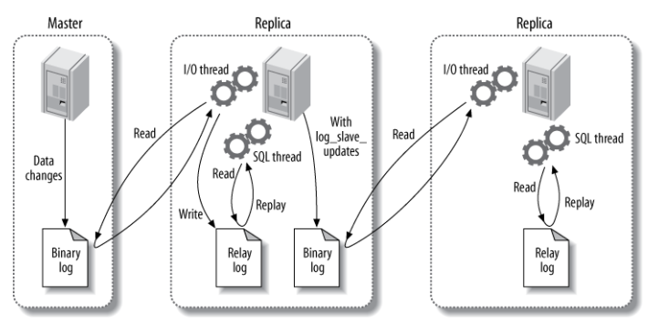
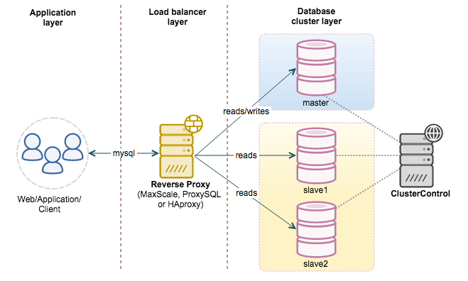

[TOC]

### MySQL复制

#### 主从复制

##### 1. 复制步骤

- master记录**更改**的明细，存入到**二进制日志**（binary log），如记录增删改的过程，不记录查询的过程。
- master 发送同步消息给 slave。
- slave 收到消息后，将 master 的二进制日志复制到本地的**中继日志**（relay log）。
- slave **重现**中继日志中的消息，从而改变数据库的数据。 

主要涉及三个线程：**binlog 线程、I/O 线程和 SQL 线程**。

-  **binlog 线程** ：负责将主服务器上的数据更改写入**二进制日志**（Binary log）中。
-  **I/O 线程** ：负责从主服务器上读取二进制日志，并写入从服务器的**中继日志**（Relay log）。
-  **SQL 线程** ：负责读取中继日志，解析出主服务器已经执行的数据更改并在从服务器中执行。



##### 2. 日志

 MySQL复制的**日志**格式有三种，根据主库存放数据的方式不同有以下三种，也就对应**三种复制方式**： 

|   复制方式    |                             特点                             |                             优点                             |                             缺点                             |
| :-----------: | :----------------------------------------------------------: | :----------------------------------------------------------: | :----------------------------------------------------------: |
|    **row**    | 基于行的格式复制，记录需要修改的**每行的数据信息**。 如果一个SQL修改了2w行的数据，那么就会记录2w行的日志格式 | 保证了数据的**强一致性**，且由于记录的是执行后的结果，在从库上执行还原也会比较快 | 日志记录**数量很多**，日志文件巨大，主从之间的传输需要更多的时间。 |
| **statement** | 基于段的日志格式复制，也就是记录下**更改的 SQL 记录**，而不是更改的行的记录。 |                      日志记录量**最小**                      | 对于一些输出结果不确定的函数，在从库上执行一遍很可能会出现问题，如 uuid，从库根据日志还原主库数据的时候需要执行一遍SQL，时间相对较慢。 |
|   **mixed**   | 混合上面两种日志格式记录记录日志，至于什么时候使用哪种日志方式由MySQL本身决定。 |               可以平衡上面两种日志格式的优缺点               |                                                              |

##### 3. **复制方式**

 **异步复制**：主库写入一个事务 commit 提交并执行完之后，，将日志记录到 **binlog**，将结果反馈给**客户端**，最后将日志传输到从库。  该复制经常遇到的问题是：因为 binlog 日志是推送的，所有主库和从库之间存在一定的**延迟**。 这样就会造成很多问题，比如主库因为磁盘损坏等故障突然崩掉，导致 binlog 日志不存在，同时因为延迟 binlog 还没有推送到从库，从库也就会丢失很多被主库提交的事物，从而造成**主从不一致**。 

 **半同步复制**：主库写入一个事务 commit 提交并执行完之后，并**不直接**将请求反馈给前端应用用户，而是等待从**库也接收到** binlog 日志并成功写入中继日志后，主库才返回 commit 操作成功给客户端。半同步复制保障了事物执行后，至少有**两份日志记录**，一份在主库的 binlog 上 ，另一份至少在从库的中继日志 Relay log 上，这样就极大的**保证了数据的一致性**。 


#### 读写分离

**主服务器处理写操作**以及**实时性要求比较高的读**操作，而**从服务器处理读**操作。

读写分离能提高性能的**原因**在于：

- 主从服务器**负责各自的读和写**，极大程度**缓解了锁的争用**；
- **从服务器**可以**使用 MyISAM**，提升**查询性能**以及节约系统开销；
- 增加冗余，提高**可用性**。

读写分离常用**代理方式**来实现，**代理服务器**接收应用层传来的读写请求，然后决定转发到哪个服务器，如下图所示。




#### 面试题

> **你们有没有做 MySQL 读写分离？如何实现 MySQL 的读写分离？MySQL 主从复制原理的是啥？如何解决 MySQL 主从同步的延时问题？**

高并发这个阶段，肯定是需要做读写分离的，啥意思？因为实际上大部分的互联网公司，一些网站，或者是 app，其实都是读多写少。所以针对这个情况，就是写一个主库，但是主库挂多个从库，然后从多个从库来读，那不就可以支撑更高的读并发压力了吗？

##### 1. 如何实现 MySQL 的读写分离？

其实很简单，就是基于主从复制架构，简单来说，就搞一个主库，挂多个从库，然后我们就单单只是写主库，然后主库会自动把数据给同步到从库上去。

##### 2. MySQL 主从复制原理的是啥？

主库将变更写入 binlog 日志，然后从库连接到主库之后，从库有一个 IO 线程，将主库的 binlog 日志拷贝到自己本地，写入一个 relay 中继日志中。接着从库中有一个 SQL 线程会从中继日志读取 binlog，然后执行 binlog 日志中的内容，也就是在自己本地再次执行一遍 SQL，这样就可以保证自己跟主库的数据是一样的。


这里有一个非常重要的一点，就是从库同步主库数据的过程是串行化的，也就是说主库上并行的操作，在从库上会串行执行。所以这就是一个非常重要的点了，由于从库从主库拷贝日志以及串行执行 SQL 的特点，在高并发场景下，从库的数据一定会比主库慢一些，是**有延时**的。所以经常出现，刚写入主库的数据可能是读不到的，要过几十毫秒，甚至几百毫秒才能读取到。

而且这里还有另外一个问题，就是如果主库突然宕机，然后恰好数据还没同步到从库，那么有些数据可能在从库上是没有的，有些数据可能就丢失了。

所以 MySQL 实际上在这一块有两个机制，一个是**半同步复制**，用来解决主库数据丢失问题；一个是**并行复制**，用来解决主从同步延时问题。

这个所谓**半同步复制**，也叫 `semi-sync` 复制，指的就是主库写入 binlog 日志之后，就会将**强制**此时立即将数据同步到从库，从库将日志写入自己本地的 relay log 之后，接着会返回一个 ack 给主库，主库接收到**至少一个从库**的 ack 之后才会认为写操作完成了。

所谓**并行复制**，指的是从库开启多个线程，并行读取 relay log 中不同库的日志，然后**并行重放不同库的日志**，这是库级别的并行。

##### 3. MySQL 主从同步延时问题（精华）

以前线上确实处理过因为主从同步延时问题而导致的线上的 bug，属于小型的生产事故。

是这个么场景。有个同学是这样写代码逻辑的。先插入一条数据，再把它查出来，然后更新这条数据。在生产环境高峰期，写并发达到了 2000/s，这个时候，主从复制延时大概是在小几十毫秒。线上会发现，每天总有那么一些数据，我们期望更新一些重要的数据状态，但在高峰期时候却没更新。用户跟客服反馈，而客服就会反馈给我们。

我们通过 MySQL 命令：

``` sql
show status
```

查看 `Seconds_Behind_Master` ，可以看到从库复制主库的数据落后了几 ms。

一般来说，如果主从延迟较为严重，有以下解决方案：

* 分库，将一个主库拆分为多个主库，每个主库的写并发就减少了几倍，此时主从延迟可以忽略不计。
* 打开 MySQL 支持的并行复制，多个库并行复制。如果说某个库的写入并发就是特别高，单库写并发达到了 2000/s，并行复制还是没意义。
* 重写代码，写代码的同学，要慎重，插入数据时立马查询可能查不到。
* 如果确实是存在必须先插入，立马要求就查询到，然后立马就要反过来执行一些操作，对这个查询**设置直连主库**。**不推荐**这种方法，你要是这么搞，读写分离的意义就丧失了。