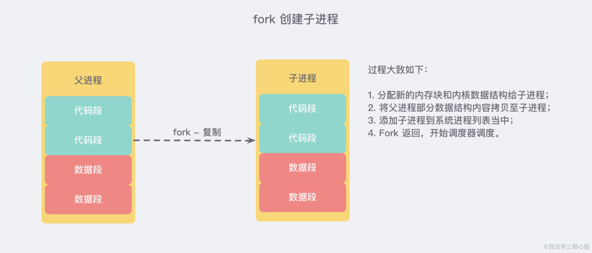

[TOC]

### Redis 持久化

#### 概述

持久化方式：RDB、AOF、混合持久化。

1. 客户端向数据库 **发送写命令** *(数据在客户端的内存中)*
2. 数据库 **接收** 到客户端的 **写请求** *(数据在服务器的内存中)*
3. 数据库 **调用系统 API** 将数据写入磁盘 *(数据在内核缓冲区中)*
4. 操作系统将 **写缓冲区** 传输到 **磁盘控控制器** *(数据在磁盘缓存中)*
5. 操作系统的磁盘控制器将数据 **写入实际的物理媒介** 中 *(数据在磁盘中)*

**注意:** 上面的过程其实是 **极度精简** 的，在实际的操作系统中，**缓存** 和 **缓冲区** 会比这 **多得多**...

#### RDB持久化

RDB 持久化是把当前进程数据生成==**快照**==保存到硬盘的过程，触发 RDB 持久化过程分为手动触发和自动触发。

##### 1. 触发机制

###### ① 手动触发

**手动触发**分别对应 save 和 bgsave 命令。

**save**：**阻塞**当前 Redis 服务器，直到 RDB 过程完成。如果数据量大可能阻塞太长，已经**废弃**，生产环境别用。
**bgsave**：Redis 进程执行 **fork** 操作创建**子进程**，RDB 持久化过程由子进程负责，完成后自动结束。**阻塞只发生在 fork 阶段，一般时间很短**，生产环境使用。

###### ② 自动触发

自动触发的场景：
 ① `save m n` 表示如果在 m 秒内数据集存在 n 次修改时，自动触发 bgsave。
 ② 如果**从节点**执行**全量复制**操作，主节点自动执行 **bgsave** 生成 RDB 文件并发送给从节点。
 ③ 执行 debug reload 命令重新加载 redis 时，也会自动触发 save 操作。
 ④ 默认情况下执行 shutdown 命令时，如果没有开启 AOF，则自动执行 bgsave。

##### 2. 流程说明

**bgsave** 是主流的触发 RDB 持久化的方式。流程如下。

- ① Redis 父进程首先判断：当前是否在执行 save 或 bgsave/bgrewriteaof（后面会详细介绍该命令）的子进程，如果在执行则 bgsave 命令**直接返回**。bgsave/bgrewriteaof 的子进程**不能同时执行**，主要是基于性能方面的考虑：两个并发的子进程同时执行大量的磁盘写操作，可能引起严重的性能问题。

- ② 父进程执行 **fork** 操作创建子进程，这个过程中**父进程是阻塞**的，Redis 不能执行来自客户端的任何命令，但这个阻塞时间**很短**。
- ③ 父进程 fork 后，bgsave 命令返回”Background saving started”信息并**不再阻塞**父进程，并可以响应其他命令。
- ④ 子进程**创建 RDB** 文件，根据**父进程内存快照生成临时快照文件**，完成后对原有文件进行**原子替换**。
- ⑤ 子进程发送信号给父进程表示完成，父进程**更新统计信息**。

> **写时复制 Copy On Write 机制**

RBD 也叫“**快照**”持久化。

操作系统多进程写时复制 **COW(Copy On Write) 机制** 十分重要。**Redis** 在持久化时会调用 `glibc` 的函数 `fork` 产生一个**子进程**，简单理解也就是基于当前进程 **复制** 了一个进程，主进程和子进程会**共享**内存里面的代码块和数据段：

所以 **快照持久化** 可以完全交给 **子进程** 来处理，**父进程** 则继续 **处理客户端请求**。**子进程** 做数据持久化，它 **不会修改现有的内存数据结构**，它只是对数据结构进行遍历读取，然后序列化写到磁盘中。但是 **父进程** 不一样，它必须持续服务客户端请求，然后对 **内存数据结构进行不间断的修改**。

这个时候就会使用操作系统的 Copy On Write 机制来进行 **数据段页面** 的**分离**。数据段是由很多操作系统的页面组合而成，当父进程对其中一个页面的数据进行**修改**时，会将**被共享的页面复 制一份分离**出来，然后 **==对这个复制的页面进行修改==**。这时 **子进程** 相应的页面是 **没有变化的**，还是进程产生时**那一瞬间**的数据。

子进程因为数据没有变化，它能看到的内存里的数据在进程产生的一瞬间就凝固了，再也不会改变，这也是为什么 **Redis** 的持久化 **叫「快照」的原因**。接下来子进程就可以非常安心的遍历数据了进行序列化写磁盘了。

##### 3. RDB 文件

RDB 文件是经过**压缩的二进制文件**，Redis 默认采用 LZF 算法对生成的 RDB 文件做压缩处理，压缩后的文件**远远小于**内存大小。

**RDB 文件保存在 dir 配置指定的目录下，文件名通过 dbfilename 配置。**

##### 4. RDB优缺点

###### ① 优点

- RDB 文件是紧凑压缩的二进制文件，消耗空间少。
- RDB 文件代办某个时间点上的数据快照。所以非常适合于备份，全量复制等场景。
- Redis 加载 RDB 文件恢复数据的速度远远快于 AOF 方式。

###### ② 缺点

- RDB 无法做到实时持久化，秒级持久化。因为 RDB 属于重量级操作，不能频繁执行。一般用于**数据冷备和复制传输**。
- RDB 是用特定的二进制格式存储，会出现多版本的格式，导致新老版本不兼容。

#### AOF持久化

由于 RDB 不适合实时持久化，所以 Redis 提供了 AOF。

**AOF 持久化**(即 Append Only File 持久化)，则是将 Redis 执行的每次写**命令记录到单独的日志文件**中，当 Redis 重启时再次执行 AOF 文件中的命令来恢复数据。与 RDB 相比，AOF 的**实时性更好**，因此已成为主流的持久化方案。

##### 1. 使用 AOF

配置开启 AOF：`appendonly yes`。

文件名配置：`appendfilename`。默认 appendonly.aof。

保存路径：`dir`。

##### 2. 工作流程

AOF 工作流程如下：命令写入、文件同步、文件重写、重启加载。

###### ① 命令写入

写入的内容直接是**文本协议格式**。这样可以提高兼容性同时避免二次处理的开销，而且可读性更好。

所有写的命令都是追加到 **aod_buf（缓冲区）**中。如果每条指令都直接写入硬盘，那开销太大了。Redis 可以提供**多种缓冲区同步策略**（下面讲），在性能和安全性方面做出平衡。

###### ② 文件同步

指令被写入 AOF 日志，而**AOF 日志**是以**文件**的形式存在的，当程序对 AOF 日志文件进行写操作时，实际上是将内容写到了内核为文件描述符分配的一个内存缓存中，然后内核会异步将脏数据刷回到磁盘的。

有多种 AOF 缓冲区同步文件策略，由 ==**appendfsync**== 参数配置，可配置值如下。

| 同步策略可配置值 |                             说明                             |
| :--------------: | :----------------------------------------------------------: |
|      always      | 命令写入 **aof_buf** 后**立即调用系统** **fsync 操作**同步到 AOF 文件，fsync 完成后线程返回。  这种情况下，每**次有写命令都要同步到 AOF** 文件，硬盘 IO 成为性能瓶颈，Redis 只能支持大约几百 TPS 写入，严重降低了 Redis 的性能 |
|        no        | 命令写入 **aof_buf** 后调用系统 **write 操作**，不对 AOF 文件做 **fsync 同步**；同步**由操作系统负责**，通常同步周期为 30 秒。文件同步的时间不可控，且缓冲区中堆积的数据会很多，数据安全性**无法保证**。 |
| ==**everysec**== | 命令写入 **aof_buf** 后调用系统 **write 操作**，write 完成后线程**返回**；**fsync 同步文件**操作由**专门的线程每秒调用一次**。它是前述两种策略的折中，是性能和数据安全性的平衡，因此是 Redis 的**默认推荐配置**。理论上来说系统宕机丢失的数据也在 **2 秒**之内（不是 1 秒）。 |

> **关于系统调用 write 与 fsync**

- **write** 操作会**触发延迟写机制**。Linux 在内核提供页缓冲区来提高硬盘 IO 性能。write 操作在**写入系统缓冲区**后**直接返回**。同步硬盘操作依赖于系统调度机制。同步文件之前，如果系统宕机，那么缓冲区内的数据丢失。
- fsync 系统调用针对单个文件操作（比如 AOF 文件），将**阻塞**直到数据写入硬盘后返回，做**强制硬盘同步**，保证数据持久化。但是开销太大了啊。

###### ③ 文件重写

Redis 服务器执行的写命令随时间越来越多，AOF 文件也会**越来越大**；过大的 AOF 文件不仅会影响服务器的正常运行，也会导致**数据恢复需要的时间过长**。

> **为什么要重写？**

- AOF 重写是指**定期重写 AOF 文件**，**减小了 AOF 文件的体积**。
- 由于重写后 AOF 执行的命令减少了，文件重写既可以减少文件占用的空间，也可以**加快加载恢复的速度**。

> **文件重写为什么能压缩 AOF 文件？**

- **过期**的数据不再写入文件。
- **无效的命令**不再写入文件：如有些数据被重复设值(set mykey v1，set mykey v2)、有些数据被删除了(sadd myset v1，del myset)等等。
- 多条命令可以**合并为一个**：如 sadd myset v1，sadd myset v2，sadd myset v3 可以合并为 sadd myset v1 v2 v3。

需要注意的是，**AOF 重写**是把 Redis **进程内的数据转化为写命令**，同步到新的 AOF 文件；**不会对旧的** AOF 文件进行任何读取、写入操作！

> **AOF 重写何时进行？触发机制？**

**①** **手动触发**：直接调用 **bgrewriteaof** 命令。该命令的执行与 bgsave 有些类似：都是 fork 子进程进行具体的工作，且都只有在 fork 时阻塞。

**② 自动触发**：根据 **auto-aof-rewrite-min-size** 和 **auto-aof-rewrite-percentage** 参数，以及 aof_current_size 和 aof_base_size 状态确定触发时机。

- auto-aof-rewrite-min-size：执行 AOF **重写时**，文件的**最小体积**，默认值为 64MB。
- auto-aof-rewrite-percentage：执行 AOF 重写时，**当前** AOF 大小(即 aof_current_size)和上一次重写时 AOF 大小(aof_base_size)的**比值**。

只有当 auto-aof-rewrite-min-size 和 auto-aof-rewrite-percentage 两个参数**同时满足**时，才会自动触发 AOF 重写，即 **bgrewriteaof** 操作。

> **重写流程如何？**

见下图。

- Redis 父进程首先判断当前是否存在**正在执行** bgsave/bgrewriteaof 的子进程，如果存在则 bgrewriteaof 命令**直接返回**；如果存在 bgsave 命令则等 bgsave 执行完成后再执行，这个主要是基于性能方面的考虑。
- 父进程执行 **fork 操作**创建**子进程**，这个过程中**父进程是阻塞**的，仅这一段时间。
- 父进程 fork 后，bgrewriteaof 命令返回“Background append only file rewrite started”信息并**不再阻塞**父进程，并可以响应其他命令。Redis 的所有写命令**依然写入 AOF 缓冲区**，并根据 appendfsync 策略同步到硬盘，保证原有 AOF 机制的正确。
- 由于 fork 操作使用**写时复制技术**，子进程只能**共享 fork 操作时**的内存数据。由于父进程**依然在响应命令**，因此 Redis 使用 **AOF 重写缓冲区**(图中的 aof_rewrite_buf)保存这部分数据，防止**新 AOF 文件生成期间丢失这部分数据**。也就是说，bgrewriteaof 执行期间，Redis 的**写命令同时追加**到 aof_buf 和 aof_rewirte_buf 两个缓冲区。缓冲区专门用于保存**在==重写期间操作数据==带来的变化**。
- 子进程根据**内存快照**，按照命令合并规则写入到**新的 AOF** 文件。子进程写完新的 AOF 文件后，向父进程发信号，父进程更新**统计信息**，具体可以通过 **info persistence** 查看。
- 父进程把 AOF **重写缓冲区（aof_rewrite_buf）**的数据写入到**新的** AOF 文件，这样就保证了新 AOF 文件所保存的数据库状态和服务器**当前状态一致**。
- 使用新的 AOF 文件**替换**老文件，完成 AOF 重写。

###### ④ 重启加载

当 AOF **开启**时，Redis 启动时会**优先载入 AOF 文件**来恢复数据；只有当 **AOF 关闭**时，才会载入 **RDB** 文件恢复数据。

**文件校验机制**：如果**加载损坏**的 AOF 文件时会**拒绝启动**，并打印日志。损坏的 AOF 文件也是可以修复的。

#### 混合持久化

重启 Redis 时，我们很少使用 `rdb` 来恢复内存状态，因为会丢失大量数据。我们通常使用 AOF 日志重放，但是重放 AOF 日志性能相对 `rdb` 来说要慢很多，这样在 Redis 实例很大的情况下，启动需要花费很长的时间。

**Redis 4.0** 为了解决这个问题，带来了一个新的持久化选项——**混合持久化**。将 `rdb` 文件的内容和增量的 AOF 日志文件存在一起。这里的 AOF 日志不再是全量的日志，而是 **自持久化开始到持久化结束** 的这段时间发生的增量 AOF 日志，通常这部分 AOF 日志很小：

于是在 Redis 重启的时候，可以先加载 `rdb` 的内容，然后再重放增量 AOF 日志就可以完全替代之前的 AOF 全量文件重放，重启效率因此大幅得到提升。

#### 持久化问题与优化

持久化阻塞主线程场景主要有：fork 阻塞和 AOF 追加阻塞。**fork 阻塞时间跟内存量和系统有关，AOF 追加阻塞说明系统硬盘资源紧张。**

##### 1. fork操作

当 Redis 做 RDB 或 AOF 重写时，必不可少的操作就是执行 **fork 系统调用来创建子进程**，但这是一个**重量级操作**。虽然 fork 创建的子进程不需要拷贝父进程的物理空间，但是会**复制父进程的空间内存页表**（页表相当于内存的索引、目录）。所以 fork 操作耗时与**进程总内存量**息息相关。**父进程**的数据空间越大，内存页表越大，fork 时复制**耗时也会越多**。

> **如何改善 fork 操作的耗时？**

- 控制 Redis 实例最大可用内存，fork 耗时与内存量成正比。线上建议一个 Redis 实例内存控制在 10GB 之内。
- 合理配置 Linux 内存分配策略，避免物理内存不足导致 fork 失败。
- 降低 fork 操作频率，如可用适当放宽 AOF 自动触发时机。

##### 2. 子进程开销

需要重点关注。

- CPU：尽量保证同一时刻只有一个子进程执行重写操作。
- 内存：避免在大量写入时做子进程重写操作，这样将导致父进程维护大量页副本，造成内存消耗。
- 硬盘：不要和其他高硬盘负载的服务部署到一起，如存储服务、消息队列服务等。

PS：子进程执行期间使用 **copy-on-write 机制（写时复制）**与父进程共享内存，避免内存消耗翻倍。

##### 3. AOF追加阻塞

AOF 持久化时 everysec 是常用的同步硬盘策略。Redis 使用另一条线程每秒执行 fsync 同步硬盘。当系统资源**繁忙**时，会造成 Redis **主线程阻塞**。

- everysec 配置**最多可能丢失 2 秒**数据，不是 1 秒。
- 如果系统 fsync 缓慢，将会导致 Redis 主线程阻塞影响效率。

#### 参考资料

- 《Redis开发与运维》