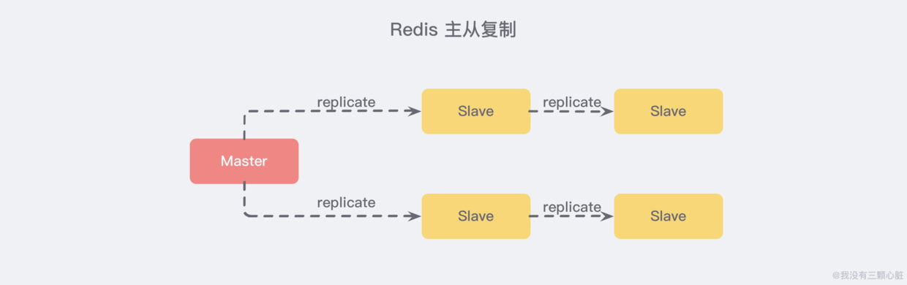
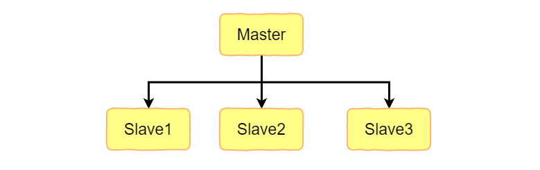
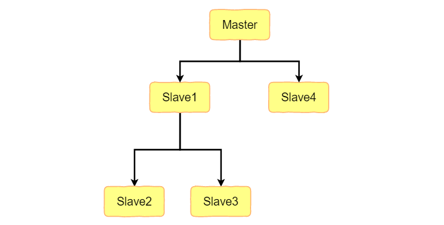
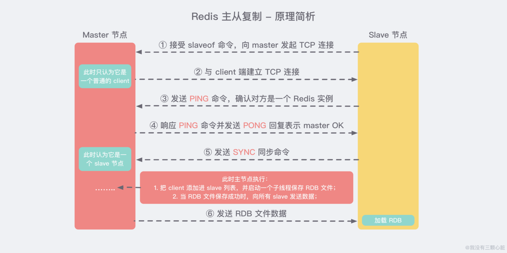
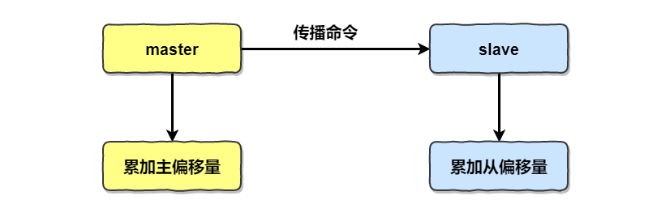
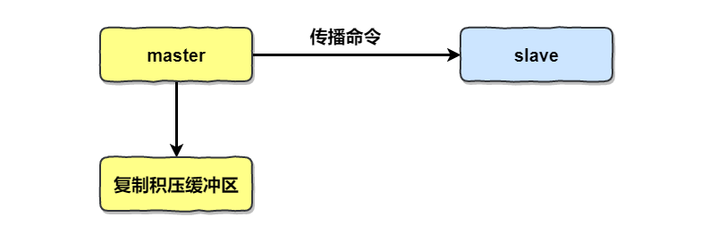
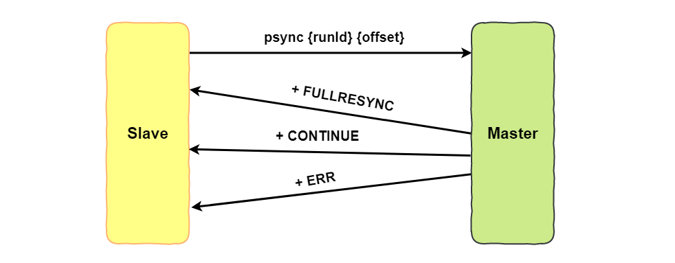
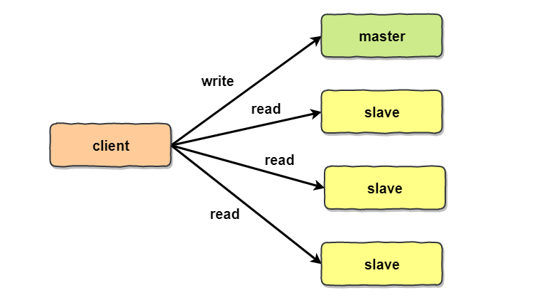

[TOC]

### Redis复制

复制能解决单点故障问题，是实现分布式系统高可用的基础。复制机制下数据集可以有多个副本，这些副本可以用于**读写分离、故障转移、实时备份**等场景。



**主从复制**，是指将一台 Redis 服务器的数据，复制到其他的 Redis 服务器。前者称为 **主节点(master)**，后者称为 **从节点(slave)**。且数据的复制是 **单向** 的，只能由主节点到从节点。Redis 主从复制支持 **主从同步** 和 **从从同步** 两种，后者是 Redis 后续版本新增的功能，以减轻主节点的同步负担。

#### 主从复制主要的作用

- **数据冗余：** 主从复制实现了数据的热备份，是持久化之外的一种数据冗余方式。
- **故障恢复：** 当主节点出现问题时，可以由从节点提供服务，实现快速的故障恢复 *(实际上是一种服务的冗余)*。
- **负载均衡：** 在主从复制的基础上，配合读写分离，可以由主节点提供写服务，由从节点提供读服务 *（即写 Redis 数据时应用连接主节点，读 Redis 数据时应用连接从节点）*，分担服务器负载。尤其是在写少读多的场景下，通过多个从节点分担读负载，可以大大提高 Redis 服务器的并发量。
- **高可用基石：** 除了上述作用以外，主从复制还是哨兵和集群能够实施的 **基础**，因此说主从复制是 Redis 高可用的基础。

#### 复制基础

参与复制的 Redis 实例分为主节点（master）和从节点（slave）。复制的数据流是单向的，只能由主节点到从节点。

默认情况下，Redis 实例都是主节点。

##### 1. 建立复制

配置方式：

- 在**配置文件**中加入 **slaveof {masterHost} {masterPort}** 随 Redis 启动生效。
- 在 Redis-server 启动命令后加入 --slaveof {masterHost} {masterPort} 生效。
- 直接使用**命令**：**slaveof {masterHost} {masterPort}** 生效。

slaveof 配置都是在**从节点发起**。

主从节点复制关系建立成功之后可以用 **info replication** 命令查看**复制相关状态**。

复制可以使用 **sync 和 fsync**，主要用**后者**，sync 只支持全量复制，主要用后者。

##### 2. 断开复制

在从节点执行 **slaveof no one** 断开主从复制关系。断开之后从节点变成主节点，但是原来同步的数据不会丢失。

**切换主节点**：如果从节点断开主从复制进而又把**另一个**节点当做主节点，则切换后从节点会**清空**之前同步的数据。

##### 3. 只读

默认情况下，从节点使用 **slave-read-only=yes** 配置为只读模式。生产环境这样做！因为对从节点的修改主节点是不知道的。


#### 复制拓扑关系

Redis 复制的拓扑关系可以支持**单层或多层**复制关系。根据复杂性可以分为一主一从、一主多从、树状主从结构。

##### 1. 一主一从结构

最简单的拓扑结构，用于主节点出现宕机时从节点提供故障转移支持。


当应用写命令并发量较高时且需要持久化时，可以只在从节点上开始 AOF，这样既保证数据安全又避免了持久化对主节点的影响。

##### 2. 一主多从结构

应用端可以利用多个从节点实现**读写分离**，对于**读占比较大**的场景，或者某些**耗时**的操作，可以把读命令发送到**从节点**来分担主节点的压力。

对于**写并发量较大**的场景，**多个从节点**会导致主节点写命令的多次发送到从节点而消耗网络带宽，增大了主节点的负担。



##### 3. 树状主从结构

引入复制中间层，可以降低主节点发送给从节点的数据量，减小主节点负担。



上图中引入中间层 slave1，减少主节点传输给从节点的消耗，而 slave1 可以继续往下复制数据给下一层的节点。


#### 复制原理

##### 1. 复制过程

复制大致有六个过程：

① **保存主节点信息**。

② **连接主节点**。从节点内部通过每秒运行的**定时任务**维护复制相关逻辑，当定时任务**发现存在新的主节点**的时候，会尝试与该节点**建立连接**。连接成功会产生日志，连接失败则会无限重连。

③ **发送 ping 命令**。从节点发送 ping 指令给主节点进行**首次通信**，用于检测网络情况和主节点是否可以处理请求。如果返回 pong 失败，则主节点会**断开连接**下一次定时任务继续**重连**。

④ **权限认证**。这发生在主节点设置了 requirepass 参数时。

⑤ **数据同步**。主从连接首次通信正常后，主节点会把持有的数据**全部发送**给从节点，这是**非常耗时**的操作。

⑥ **命令持续复制**。接下来主节点会**持续**把命令发送给从节点，保证主从数据一致性。



**最核心**的便是：**数据同步**，下面详述。

##### 2. psync

psync 命令用于实现数据同步。**psync 运行需要的核心组件如下**：

- 主从节点各自复制偏移量。
- 主节点复制积压缓冲区。
- 主节点运行 id。

###### ① 复制偏移量

参与复制的主从节点**都会**维护各自的**复制偏移量**。通过对比主从节点的复制偏移量，可以判断主从节点**数据是否一致**。

统计信息在 **info replication** 中的 **master_repl_offset** 指标中。

从节点每秒上报自己的复制偏移量给主节点。



###### ② 复制积压缓冲区

复制积压缓冲区是保存在**主节点**上的一个**固定长度的队列**，默认 1MB，当主节点在于从节点连接后创建。这时候主节点写命令的时候，**不但把命令发给从节点，还会写入到复制积压缓冲区。**



复制积压缓冲区是一个**定长的先进先出队列**（FIFO），所以能够实现**保存最近已复制数据**的功能，用于**部分复制和复制命令丢失时的数据补救**。

统计信息在 **info replication** 中的 **repl_backlog_size** 等指标中。

###### ③ 主节点运行id

每个 Redis 结点启动后会分配动态分配一个 40 位的十六进制字符串作为运行 Id，可以唯一标识 Redis 节点。

###### ④ psync使用

从节点使用 **psync** 命令完成部分**复制和全量复制**功能。

格式如下。

```mysql
psync {runId} {offset}
	runId: 从节点复制主节点的运行Id
	offset: 当前从节点已经复制的偏移量，第一次参与复制则为-1
```



主节点根据 psync 参数与自身参数情况选择进行回复。

- +**FULLRESYNC** {runId} {offset}：从节点触发全量复制。
- +**CONTINUE**：从节点触发部分复制。
- +**ERR**：主节点版本低于2.8，无法识别 psync 命令。


##### 3. 数据同步

Redis 2.8 之后使用 **psync** 命令完成主从数据同步，同步可以分为：**全量复制、部分复制**。

- **全量复制**：一般用于**初次复制**的场景，开销较大。
- **部分复制**：用于处理在主从复制中因**网络闪断**等原因造成的**数据丢失**场景，从节点再次连接主节点后，如果条件允许，主节点**补发**丢失的数据给从节点。可以避免开销过大。

###### ① 全量复制 

主从第一次建立复制时必须经历的阶段，触发全量复制的命令是 **sync（Redis2.8之前） 和 fsync（Redis2.8之后）**。

> **全量复制流程**

- 由于是第一次复制，从节点没有复制偏移量和主节点运行 Id，所以发送 **fsync ？-1**。
- 主节点判断这是全量复制，返回 +FULLRESYNC。
- 从节点接收到主节点的响应数据，即可保存运行 Id 和偏移量 offset。
- 主节点执行 **bgsave** 命令保存 **RDB 文件到本地**。
- 主节点把 RDB 文件**发送**到从节点，从节点将其作为本地数据文件。如果 RDB 文件过大，那么发送过程可能非常耗时。
- 从节点从开始接收 RDB 快照到接收完成期间，主节点仍然可以响应指令，主节点把这一时期的命令数据保存在**复制客户端缓冲区**内，等从节点加载完 RDB 文件后，主节点再把缓冲区内的数据发送到从节点，保证数据一致性。
- 从节点接收完主节点传送来的数据后会**清空自身旧数据**，然后**加载 RDB 文件**。
- 如果从节点开启了 AOF 持久化，那么加载完 RDB 后会立即执行 **bgrewriteaof** 操作进行持久化。

全量复制是一个非常耗时的操作。主要**时间开销**有：

- 主节点 bgsave 的时间。
- RBD 文件网络传输时间。
- 从节点清空数据时间。
- 从节点加载 RDB 时间。
- 可能的 AOF 重写时间。

除了**第一次**复制执行全量复制之外，其他的场景应该**避免使用全量复制**。

###### ② 部分复制

使用如下命令实现部分复制，可以优化全量复制带来的开销。如果出现网络闪断或者命令丢失等异常情况，从节点会向主节点要求补发丢失的命令数据，如果主节点的**复制积压缓冲区**内存在这部分数据则可以直接发送给从节点。大大降低了开销。

```mysql
psync {runId} {offset} 
```

> **部分复制流程**

部分复制流程如下：

- 主从节点如果出现网络中断，时间超过 repl-timeout 时就认为从节点故障并中断复制链接。
- 此时主节点依然可以响应指令，但是复制链接中断所以**无法**发送命令给从节点，不过主节点内部**存在复制积压缓冲区**，依然**可以保存最近一段时间**内的写命令数据。
- 当主从再次连接之后，两者通过**偏移量 offset** 在**复制积压缓冲区**寻找，如果 offset 在缓冲区中，则**直接根据这个偏移量补发**数据即可。

###### ③ 规避全量复制

全量复制开销极大，需要规避。这里分析一下全量复制发生的场景。

- **第一次建立复制**。不可避免，建议在**低峰**时进行。
- **节点运行 Id 不匹配**。主从复制关系建立后，从节点会保存主节点的运行 id，如果主节点故障重启，会造成 id 变化（因为是动态 Id），从节点发现 id 变化便会认为是一个**新的**节点从而进行全量复制。这种情况需要从架构上规避，如提供**故障转移**功能。当主节点发生故障之后，可以采用支持自动故障转移的**哨兵或集群**方案，让**从节点成为主节点**。
- **复制积压缓冲区不足**。在进行部分复制时，如果 offset **不在复制积压缓冲区**中，比如主从断开的时间过长，复制积压缓冲区记录的命令早就**超过**了默认的 1MB，这时候部分复制**退化**为全量复制。大流量的场景需要增大复制积压缓冲区。

##### 4. 心跳机制

主从结点在建立复制之后，它们之间维护着**长连接**并彼此发送**心跳命令**。

心跳机制：

- 主从节点都有心跳检查机制。
- 主节点默认每隔 10 秒对从节点发送 ping 命令，判断从节点的状态。
- 从节点在主线程中每隔 1 秒发送 replconf ack {offset} 命令给主节点报告自己的 offset 信息。

##### 5. 异步复制

主节点不但负责数据读写，而且还会把写命令同步给从节点。**写命令的发送**过程是**异步**完成的，也就是说主节点自身处理完读写命令后**直接返回给客户端**，并**不等待从节点复制**完成。

**由于主从复制是异步的，所以会造成从节点的数据相对主节点存在==延迟==。**具体延迟可以通过 **info replication** 中**主从节点的复制偏移量**计算出。

##### 6. demo

在 **Redis** 中，用户可以通过执行 `SLAVEOF` 命令或者设置 `slaveof` 选项，让一个服务器去复制另一个服务器，以下三种方式是 **完全等效** 的：

- **配置文件**：在从服务器的配置文件中加入：`slaveof <masterip> <masterport>`
- **启动命令**：redis-server 启动命令后加入 `--slaveof <masterip> <masterport>`
- **客户端命令**：Redis 服务器启动后，直接通过客户端执行命令：`slaveof <masterip> <masterport>`，让该 Redis 实例成为从节点。

需要注意的是：**主从复制的开启，完全是在从节点发起的，不需要我们在主节点做任何事情。**

###### 第一步：本地启动两个节点

在正确安装好 Redis 之后，我们可以使用 `redis-server --port <port>` 的方式指定创建两个不同端口的 Redis 实例，例如，下方我分别创建了一个 `6379` 和 `6380` 的两个 Redis 实例：

```bash
# 创建一个端口为 6379 的 Redis 实例
redis-server --port 6379
# 创建一个端口为 6380 的 Redis 实例
redis-server --port 6380
```

此时两个 Redis 节点启动后，都默认为 **主节点**。

###### 第二步：建立复制

我们在 `6380` 端口的节点中执行 `slaveof` 命令，使之变为从节点：

```bash
# 在 6380 端口的 Redis 实例中使用控制台
redis-cli -p 6380
# 成为本地 6379 端口实例的从节点
127.0.0.1:6380> SLAVEOF 127.0.0.1ø 6379
OK
```

###### 第三步：观察效果

下面我们来验证一下，主节点的数据是否会复制到从节点之中：

- 先在 **从节点** 中查询一个 **不存在** 的 key：

```bash
127.0.0.1:6380> GET mykey
(nil)
```

- 再在 **主节点** 中添加这个 key：

```bash
127.0.0.1:6379> SET mykey myvalue
OK
```

- 此时再从 **从节点** 中查询，会发现已经从 **主节点** 同步到 **从节点**：

```bash
127.0.0.1:6380> GET mykey
"myvalue"
```

###### 第四步：断开复制

通过 `slaveof <masterip> <masterport>` 命令建立主从复制关系以后，可以通过 `slaveof no one` 断开。需要注意的是，从节点断开复制后，**不会删除已有的数据**，只是不再接受主节点新的数据变化。

从节点执行 `slaveof no one` 之后，从节点和主节点分别打印日志如下：、

```bash
# 从节点打印日志
61496:M 17 Mar 2020 08:10:22.749 # Connection with master lost.
61496:M 17 Mar 2020 08:10:22.749 * Caching the disconnected master state.
61496:M 17 Mar 2020 08:10:22.749 * Discarding previously cached master state.
61496:M 17 Mar 2020 08:10:22.749 * MASTER MODE enabled (user request from 'id=4 addr=127.0.0.1:55096 fd=8 name= age=1664 idle=0 flags=N db=0 sub=0 psub=0 multi=-1 qbuf=34 qbuf-free=32734 obl=0 oll=0 omem=0 events=r cmd=slaveof')

# 主节点打印日志
61467:M 17 Mar 2020 08:10:22.749 # Connection with replica 127.0.0.1:6380 lost.
```


#### 开发与运维中的问题

##### 1. 读写分离

读写分离：对于**读占比较高**的场景，可以把一部分读流量分摊到**从节点**来减轻主节点的压力，同时需要**写操作永远只在主节点**进行。



当使用从节点响应读请求时，客户端可能存在**复制数据延迟、读到过期数据、从节点故障**等问题。

###### ① 数据延迟问题

Redis 复制数据的延迟是由于**异步复制的特性**决定无法改变的，延迟也取决于网络带宽和命令阻塞等情况。这会造成刚在主节点写入的数据从节点可能**读不到**。

允许短暂延迟的场景还行，不行的话可以**编写外部监控程序监听主从节点的复制偏移量，**当延迟较大时触发报警或者通知客户端别去读取延迟过高的节点。具体延迟可以通过 **info replication** 中**主从节点的复制偏移量**计算出。

当延迟字节量过高时，可以采用 Zookeeper 的监听回调机制实现客户端通知。但是这种方式成本比较高。

###### ② 读到过期数据问题

Redis 键过期删除策略有惰性删除和定时删除。

如果主节点包含了大量**会过期**的数据，可能主节点数据已经过期，但是过期的命令可能还没有来得及发到从节点，从而导致在从节点读取到过期的数据。但是 Redis 3.2 之后的版本中，从节点读数据时也会检查过期时间，已经解决了这个问题。

###### ③ 从节点故障问题

对于从节点故障问题，需要在客户端维护可用从节点列表。

做 Redis 读写分离其实维护成本挺高，建议做之前考虑使用 **Redis Cluster** 等分布式解决方案。

##### 2. 主从配置不一致问题

主从配置不一致是一个容易忽视的问题，主从节点之间有的配置可以不一致，但是**内存相关**的配置最好是一致的，如 maxmemory。

##### 3. 复制风暴问题

**复制风暴**指的是**大量从节点**对同一主节点或者同一台机器的多个主节点在**短时间内发起全量复制**的过程，这会造成主节点开销极大，需要规避。

在一主多从的架构下，如果主节点故障重启，运行 id 改变，那么就会对各个从节点发起全量复制。主节点短时间内需要生成大量 RDB 文件，传输 RDB 文件也会造成短时间内带宽消耗巨大。

解决方案：**减少**单个主节点 挂载从节点数量，或者使用加入**中间层的树状架构**来保护主节点。如果是单机多个主节点，可以把主节点部署在不同的机器上。


#### 参考资料

- 《Redis开发与运维》