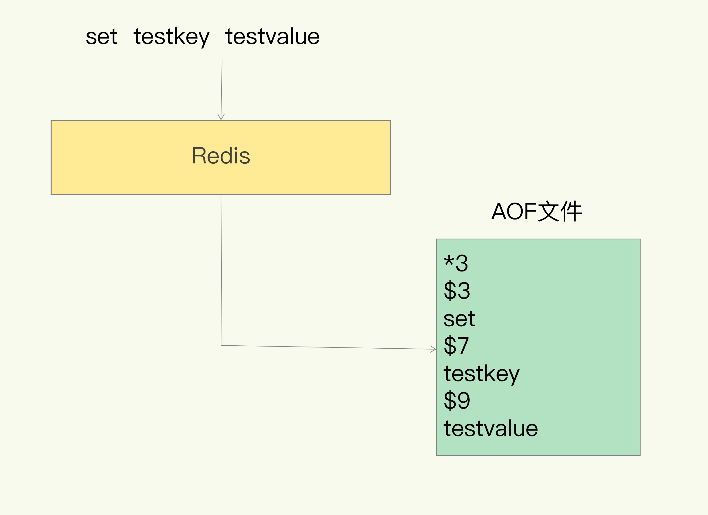
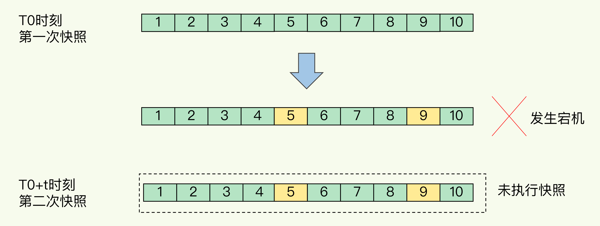
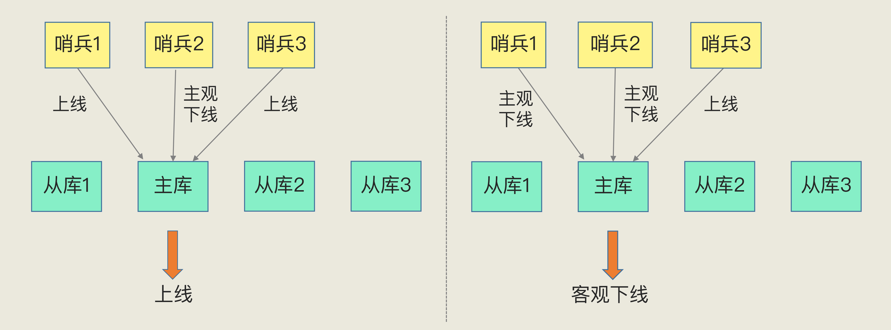
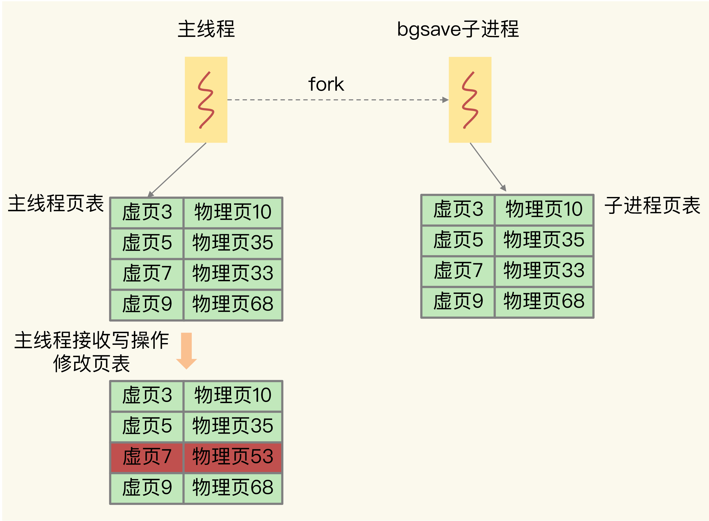

[toc]

### 01 | 基本架构：一个键值数据库包含什么？

我们知道，Redis 是典型的键值数据库，所以今天，我准备手把手地带你构建一个简单的键值数据库。为啥要这么做呢？

还记得我在开篇词说过吗？Redis 本身比较复杂，如果我们一上来就直接研究一个个具体的技术点，比如“单线程”“缓存”等，虽然可以直接学习到具体的内容，甚至立马就能解决一些小问题，但是这样学，很容易迷失在细枝末节里。

从我自己的经验来看，更好的学习方式就是先建立起“**系统观**”。这也就是说，如果我们想要深入理解和优化 Redis，就必须要对它的总体架构和关键模块有一个全局的认知，然后再深入到具体的技术点。这也是我们这门课坚持的一种讲课方式。

我相信，经过这样一个过程，我们在实践中定位和解决问题时，就会轻松很多，而且你还可以把这个学习方式迁移到其他的学习活动上。我希望你能彻底掌握这个学习思路，让自己的学习、工作效率更高。

说远了，还是回到我们今天的课程主题上。今天，在构造这个简单的键值数据库时，我们只需要关注整体架构和核心模块。这就相当于医学上在正式解剖人体之前，会先解剖一只小白鼠。我们通过剖析这个最简单的键值数据库，来迅速抓住学习和调优 Redis 的关键。

我把这个简单的键值数据库称为 SimpleKV。需要注意的是，GitHub 上也有一个名为 SimpleKV 的项目，这跟我说的 SimpleKV 不是一回事，我说的只是一个具有关键组件的键值数据库架构。

好了，你是不是已经准备好了，那我们就一起来构造 SimpleKV 吧。

开始构造 SimpleKV 时，首先就要考虑里面可以存什么样的数据，对数据可以做什么样的操作，也就是数据模型和操作接口。它们看似简单，实际上却是我们理解 Redis 经常被用于缓存、秒杀、分布式锁等场景的重要基础。

理解了数据模型，你就会明白，为什么在有些场景下，原先使用关系型数据库保存的数据，也可以用键值数据库保存。例如，用户信息（用户 ID、姓名、年龄、性别等）通常用关系型数据库保存，在这个场景下，一个用户 ID  对应一个用户信息集合，这就是键值数据库的一种数据模型，它同样能完成这一存储需求。

但是，如果你只知道数据模型，而不了解操作接口的话，可能就无法理解，为什么在有些场景中，使用键值数据库又不合适了。例如，同样是在上面的场景中，如果你要对多个用户的年龄计算均值，键值数据库就无法完成了。因为它只提供简单的操作接口，无法支持复杂的聚合计算。

那么，对于 Redis 来说，它到底能做什么，不能做什么呢？只有先搞懂它的数据模型和操作接口，我们才能真正把“这块好钢用在刀刃上”。接下来，我们就先来看可以存哪些数据。

#### 可以存哪些数据？

对于键值数据库而言，基本的数据模型是  key-value 模型。 例如，“hello”: “world”就是一个基本的 KV 对，其中，“hello”是 key，“world”是  value。SimpleKV 也不例外。在 SimpleKV 中，key 是 String 类型，而 value 是基本数据类型，例如  String、整型等。

但是，SimpleKV 毕竟是一个简单的键值数据库，对于实际生产环境中的键值数据库来说，value 类型还可以是复杂类型。

不同键值数据库支持的 key  类型一般差异不大，而 value 类型则有较大差别。我们在对键值数据库进行选型时，一个重要的考虑因素是**它支持的 value  类型**。例如，Memcached 支持的 value 类型仅为 String 类型，而 Redis 支持的 value 类型包括了  String、哈希表、列表、集合等。**Redis 能够在实际业务场景中得到广泛的应用，就是得益于支持多样化类型的 value。**

从使用的角度来说，不同 value  类型的实现，不仅可以支撑不同业务的数据需求，而且也隐含着不同数据结构在性能、空间效率等方面的差异，从而导致不同的 value  操作之间存在着差异。只有深入地理解了这背后的原理，我们才能在选择 Redis value 类型和优化 Redis 性能时，做到游刃有余.

#### 可以对数据做什么操作？

知道了数据模型，接下来，我们就要看它对数据的基本操作了。SimpleKV 是一个简单的键值数据库，因此，基本操作无外乎增删改查。

我们先来了解下 SimpleKV 需要支持的 3 种基本操作，即 PUT、GET 和 DELETE。

- PUT：新写入或更新一个 key-value 对；
- GET：根据一个 key 读取相应的 value 值；
- DELETE：根据一个 key 删除整个 key-value 对。

需要注意的是，**有些键值数据库的新写 / 更新操作叫 SET**。新写入和更新虽然是用一个操作接口，但在实际执行时，会根据 key 是否存在而执行相应的新写或更新流程。

在实际的业务场景中，我们经常会碰到这种情况：查询一个用户在一段时间内的访问记录。这种操作在键值数据库中属于 SCAN 操作，即**根据一段 key 的范围返回相应的 value 值。因此，PUT/GET/DELETE/SCAN 是一个键值数据库的基本操作集合**。

此外，实际业务场景通常还有更加丰富的需求，例如，在黑白名单应用中，需要判断某个用户是否存在。如果将该用户的 ID 作为 key，那么，可以增加 EXISTS 操作接口，用于判断某个 key  是否存在。对于一个具体的键值数据库而言，你可以通过查看操作文档，了解其详细的操作接口。

当然，当一个键值数据库的 value 类型多样化时，就需要包含相应的操作接口。例如，Redis 的 value 有列表类型，因此它的接口就要包括对列表 value 的操作。后面我也会具体介绍，不同操作对 Redis 访问效率的影响。

说到这儿呢，数据模型和操作接口我们就构造完成了，这是我们的基础工作。接下来呢，我们就要更进一步，考虑一个非常重要的设计问题：**键值对保存在内存还是外存**？

保存在内存的好处是读写很快，毕竟内存的访问速度一般都在百 ns 级别。但是，潜在的风险是一旦掉电，所有的数据都会丢失。

保存在外存，虽然可以避免数据丢失，但是受限于磁盘的慢速读写（通常在几 ms 级别），键值数据库的整体性能会被拉低。

因此，**如何进行设计选择，我们通常需要考虑键值数据库的主要应用场景**。比如，缓存场景下的数据需要能快速访问但允许丢失，那么，用于此场景的键值数据库通常采用内存保存键值数据。Memcached 和 Redis 都是属于内存键值数据库。对于 Redis 而言，缓存是非常重要的一个应用场景。后面我会重点介绍 Redis  作为缓存使用的关键机制、优势，以及常见的优化方法。

为了和 Redis 保持一致，我们的 SimpleKV 就采用内存保存键值数据。接下来，我们来了解下 SimpleKV 的基本组件。

大体来说，一个键值数据库包括了**访问框架、索引模块、操作模块和存储模块**四部分（见下图）。接下来，我们就从这四个部分入手，继续构建我们的 SimpleKV。


#### 采用什么访问模式？

访问模式通常有两种：一种是**通过函数库调用的方式供外部应用使用**，比如，上图中的 libsimplekv.so，就是以动态链接库的形式链接到我们自己的程序中，提供键值存储功能；另一种是**通过网络框架以 Socket  通信的形式对外提供键值对操作**，这种形式可以提供广泛的键值存储服务。在上图中，我们可以看到，网络框架中包括 Socket Server  和协议解析。

不同的键值数据库服务器和客户端交互的协议并不相同，我们在对键值数据库进行二次开发、新增功能时，必须要了解和掌握键值数据库的通信协议，这样才能开发出兼容的客户端。

实际的键值数据库也基本采用上述两种方式，例如，**RocksDB 以动态链接库的形式使用**，而 **Memcached 和 Redis 则是通过网络框架访问**。后面我还会给你介绍 Redis 现有的客户端和通信协议.

通过网络框架提供键值存储服务，一方面**扩大了键值数据库的受用面**，但另一方面，也给键值数据库的性能、运行模型提供了不同的设计选择，带来了一些潜在的问题。

举个例子，当客户端发送一个如下的命令后，该命令会被封装在网络包中发送给键值数据库：

```
PUT hello world
```

键值数据库网络框架接收到网络包，并按照相应的协议进行**解析**之后，就可以知道，客户端想写入一个键值对，并开始实际的写入流程。此时，我们会遇到一个系统设计上的问题，简单来说，就是网络连接的处理、网络请求的解析，以及数据存取的处理，是用一个线程、多个线程，还是多个进程来交互处理呢？该如何进行设计和取舍呢？我们一般把这个问题称为 **I/O 模型设计**。不同的 I/O 模型对键值数据库的**性能和可扩展性**会有不同的影响。

举个例子，如果一个线程既要处理网络连接、解析请求，又要完成数据存取，一旦某一步操作发生阻塞，整个线程就会阻塞住，这就降低了系统响应速度。如果我们采用不同线程处理不同操作，那么，某个线程被阻塞时，其他线程还能正常运行。但是，不同线程间如果需要访问共享资源，那又会产生线程竞争，也会影响系统效率，这又该怎么办呢？所以，这的确是个“两难”选择，需要我们进行精心的设计。

你可能经常听说 Redis 是单线程，那么，Redis 又是如何做到“单线程，高性能”的呢？后面我再和你好好聊一聊。

#### 如何定位键值对的位置？

当 SimpleKV 解析了客户端发来的请求，知道了要进行的键值对操作，此时，SimpleKV 需要查找所要操作的键值对是否存在，这依赖于键值数据库的索引模块。**索引的作用是让键值数据库根据 key 找到相应 value 的存储位置，进而执行操作。**

索引的类型有很多，常见的有哈希表、B+  树、字典树等。不同的索引结构在性能、空间消耗、并发控制等方面具有不同的特征。如果你看过其他键值数据库，就会发现，不同键值数据库采用的索引并不相同，例如，**Memcached 和 Redis** 采用哈希表作为 **key-value 索引**，而 **RocksDB 则采用跳表作为内存中 key-value 的索引**。

一般而言，内存键值数据库（例如 Redis）采用哈希表作为索引，很大一部分原因在于，其键值数据基本都是保存在**内存**中的，而内存的**高性能随机访问特性**可以很好地与哈希表 O(1) 的操作复杂度相匹配。

SimpleKV 的索引根据 key 找到  value 的存储位置即可。但是，和 SimpleKV 不同，对于 Redis 而言，很有意思的一点是，它的 value  支持多种类型，当我们通过索引找到一个 key 所对应的 value 后，仍然需要从 value  的复杂结构（例如集合和列表）中进一步找到我们实际需要的数据，这个操作的效率本身就依赖于它们的实现结构。

Redis 采用一些常见的高效索引结构作为某些 value 类型的底层数据结构，这一技术路线为 Redis 实现高性能访问提供了良好的支撑.

#### 不同操作的具体逻辑是怎样的？

SimpleKV 的索引模块负责根据 key 找到相应的 value 的存储位置。对于不同的操作来说，找到存储位置之后，需要进一步执行的操作的具体逻辑会有所差异。SimpleKV 的操作模块就实现了不同操作的具体逻辑：

- 对于 GET/SCAN 操作而言，此时根据  value 的存储位置返回 value 值即可；
- 对于 PUT 一个新的键值对数据而言，SimpleKV 需要为该键值对分配内存空间；
- 对于  DELETE 操作，SimpleKV 需要删除键值对，并释放相应的内存空间，这个过程由分配器完成。

不知道你注意到没有，对于 PUT 和 DELETE 两种操作来说，除了新写入和删除键值对，还需要分配和释放内存。这就不得不提 SimpleKV 的存储模块了。

#### 如何实现重启后快速提供服务？

SimpleKV 采用了常用的内存分配器  glibc 的 malloc 和 free，因此，SimpleKV  并不需要特别考虑内存空间的管理问题。但是，键值数据库的键值对通常大小不一，glibc  的分配器在处理随机的大小内存块分配时，表现并不好。一旦保存的键值对数据规模过大，就可能会造成较严重的内存碎片问题。

因此，分配器是键值数据库中的一个关键因素。对于以内存存储为主的 Redis 而言，这点尤为重要。Redis 的内存分配器提供了多种选择，分配效率也不一样，后面我会具体讲一讲这个问题。

SimpleKV  虽然依赖于内存保存数据，提供快速访问，但是，我也希望 SimpleKV 重启后能快速重新提供服务，所以，我在 SimpleKV  的存储模块中增加了持久化功能。

不过，鉴于磁盘管理要比内存管理复杂，SimpleKV  就直接采用了文件形式，将键值数据通过调用本地文件系统的操作接口保存在磁盘上。此时，SimpleKV  只需要考虑何时将内存中的键值数据保存到文件中，就可以了。

一种方式是，对于每一个键值对，SimpleKV 都对其进行落盘保存，这虽然让  SimpleKV 的数据更加可靠，但是，因为每次都要写盘，SimpleKV 的性能会受到很大影响。

另一种方式是，SimpleKV  只是周期性地把内存中的键值数据保存到文件中，这样可以避免频繁写盘操作的性能影响。但是，一个潜在的代价是 SimpleKV  的数据仍然有丢失的风险。

和 SimpleKV 一样，Redis 也提供了持久化功能。不过，为了适应不同的业务场景，Redis  为持久化提供了诸多的执行机制和优化改进，后面我会和你逐一介绍 Redis 在持久化机制中的关键设计考虑。

#### 小结

至此，我们构造了一个简单的键值数据库 SimpleKV。可以看到，前面两步我们是从应用的角度进行设计的，也就是应用视角；后面四步其实就是 SimpleKV 完整的内部构造，可谓是麻雀虽小，五脏俱全。

SimpleKV  包含了一个键值数据库的基本组件，对这些组件有了了解之后，后面在学习 Redis 这个丰富版的 SimpleKV  时，就会轻松很多。

为了支持更加丰富的业务场景，Redis  对这些组件或者功能进行了扩展，或者说是进行了精细优化，从而满足了功能和性能等方面的要求。


从这张对比图中，我们可以看到，从  SimpleKV 演进到 Redis，有以下几个重要变化：

- Redis 主要通过网络框架进行访问，而不再是动态库了，这也使得 Redis  可以作为一个基础性的网络服务进行访问，扩大了 Redis 的应用范围。
- Redis 数据模型中的 value  类型很丰富，因此也带来了更多的操作接口，例如面向列表的 LPUSH/LPOP，面向集合的 SADD/SREM 等。在下节课，我将和你聊聊这些  value 模型背后的数据结构和操作效率，以及它们对 Redis 性能的影响。
- Redis  的持久化模块能支持两种方式：**日志（AOF）和快照（RDB）**，这两种持久化方式具有不同的优劣势，影响到 Redis  的访问性能和可靠性。
- SimpleKV 是个简单的单机键值数据库，但是，Redis 支持高可靠集群和高可扩展集群，因此，Redis  中包含了相应的集群功能支撑模块。

通过这节课 SimpleKV  的构建，我相信你已经对键值数据库的基本结构和重要模块有了整体认知和深刻理解，这其实也是 Redis 单机版的核心基础。针对刚刚提到的几点  Redis  的重大演进，在接下来的课程中，我会依次进行重点讲解。与此同时，我还会结合实战场景，让你不仅能够理解原理，还能真正学以致用，提升实战能力。

### 02 |  数据结构：快速的Redis有哪些慢操作？

一提到  Redis，我们的脑子里马上就会出现一个词：“快。”但是你有没有想过，Redis  的快，到底是快在哪里呢？实际上，这里有一个重要的表现：它接收到一个键值对操作后，能以**微秒级别**的速度找到数据，并快速完成操作。

数据库这么多，为啥  Redis  能有这么突出的表现呢？

- 一方面，这是因为它是内存数据库，所有操作都在内存上完成，内存的访问速度本身就很快。
- 另一方面，这要归功于它的数据结构。这是因为，键值对是按一定的数据结构来组织的，操作键值对最终就是对数据结构进行增删改查操作，所以高效的数据结构是 Redis 快速处理数据的基础。

这节课，我就来和你聊聊数据结构。说到这儿，你肯定会说：“这个我知道，不就是  **String（字符串）、List（列表）、Hash（哈希）、Set（集合）和 Sorted Set（有序集合）**吗？”其实，这些只是 Redis  键值对中值的数据类型，也就是数据的保存形式。而这里，我们说的数据结构，是要去看看它们的底层实现。简单来说，底层数据结构一共有 6  种，分别是**简单动态字符串、双向链表、压缩列表、哈希表、跳表和整数数组**。它们和数据类型的对应关系如下图所示：


可以看到，String  类型的底层实现只有一种数据结构，也就是简单动态字符串。而 List、Hash、Set 和 Sorted Set  这四种数据类型，都有两种底层实现结构。通常情况下，我们会把这四种类型称为**集合类型**，它们的特点是**一个键对应了一个集合的数据**。

看到这里，其实有些问题已经值得我们去考虑了：

- 这些数据结构都是值的底层实现，键和值本身之间用什么结构组织？
- 为什么集合类型有那么多的底层结构，它们都是怎么组织数据的，都很快吗？
- 什么是简单动态字符串，和常用的字符串是一回事吗？

接下来，我就和你聊聊前两个问题。这样，你不仅可以知道 Redis“快”的基本原理，还可以借此理解 Redis 中有哪些潜在的“慢操作”，最大化 Redis 的性能优势。而关于简单动态字符串，我会在后面的课程中再和你讨论。

我们先来看看键和值之间是用什么结构组织的。

#### 键和值用什么结构组织？

为了实现从键到值的快速访问，Redis  使用了一个哈希表来保存所有键值对。

一个哈希表，其实就是一个数组，数组的每个元素称为一个**哈希桶**。所以，我们常说，一个哈希表是由多个哈希桶组成的，每个哈希桶中保存了键值对数据。

看到这里，你可能会问了：“如果值是集合类型的话，作为数组元素的哈希桶怎么来保存呢？”其实，哈希桶中的元素保存的并不是值本身，而是指向具体值的指针。这也就是说，不管值是 String，还是集合类型，哈希桶中的元素都是指向它们的指针。

在下图中，可以看到，哈希桶中的 entry  元素中保存了*key和*value指针，分别指向了实际的键和值，这样一来，即使值是一个集合，也可以通过*value指针被查找到。

因为这个哈希表保存了所有的键值对，所以，我也把它称为**全局哈希表**。哈希表的最大好处很明显，就是让我们可以用 O(1) 的时间复杂度来快速查找到键值对——我们只需要计算键的哈希值，就可以知道它所对应的哈希桶位置，然后就可以访问相应的 entry 元素。

你看，这个查找过程主要依赖于哈希计算，和数据量的多少并没有直接关系。也就是说，不管哈希表里有 10 万个键还是 100 万个键，我们只需要一次计算就能找到相应的键。

但是，如果你只是了解了哈希表的 O(1)  复杂度和快速查找特性，那么，当你往 Redis  中写入大量数据后，就可能发现操作有时候会突然变慢了。这其实是因为你忽略了一个潜在的风险点，那就是**哈希表的冲突问题和 rehash  可能带来的操作阻塞。**

#### 为什么哈希表操作变慢了？

当你往哈希表中写入更多数据时，哈希冲突是不可避免的问题。这里的哈希冲突，也就是指，两个 key 的哈希值和哈希桶计算对应关系时，正好落在了同一个哈希桶中。

毕竟，哈希桶的个数通常要少于 key 的数量，这也就是说，难免会有一些 key 的哈希值对应到了同一个哈希桶中。

Redis 解决哈希冲突的方式，就是**链式哈希**。链式哈希也很容易理解，就是指**同一个哈希桶中的多个元素用一个链表来保存，它们之间依次用指针连接。**

如下图所示：entry1、entry2 和  entry3 都需要保存在哈希桶 3 中，导致了哈希冲突。此时，entry1 元素会通过一个*next指针指向 entry2，同样，entry2 也会通过*next指针指向 entry3。这样一来，即使哈希桶 3 中的元素有 100 个，我们也可以通过 entry  元素中的指针，把它们连起来。这就形成了一个链表，也叫作哈希冲突链。

但是，这里依然存在一个问题，哈希冲突链上的元素只能通过指针逐一查找再操作。如果哈希表里写入的数据越来越多，哈希冲突可能也会越来越多，这就会导致某些哈希冲突链过长，进而导致这个链上的元素查找耗时长，效率降低。对于追求“快”的 Redis 来说，这是不太能接受的。

所以，**Redis 会对哈希表做 rehash 操作**。rehash 也就是增加现有的哈希桶数量，让逐渐增多的 entry 元素能在更多的桶之间分散保存，减少单个桶中的元素数量，从而减少单个桶中的冲突。那具体怎么做呢？

其实，为了使 rehash  操作更高效，Redis 默认使用了两个全局哈希表：哈希表 1 和哈希表 2。一开始，当你刚插入数据时，默认使用哈希表 1，此时的哈希表 2  并没有被分配空间。随着数据逐步增多，Redis 开始执行 rehash，这个过程分为三步：

1. 给哈希表 2 分配更大的空间，例如是当前哈希表 1 大小的两倍；
2. 把哈希表 1 中的数据重新映射并拷贝到哈希表 2 中；
3. 释放哈希表 1 的空间。

到此，我们就可以从哈希表 1 切换到哈希表 2，用增大的哈希表 2 保存更多数据，而原来的哈希表 1 留作下一次 rehash 扩容备用。

这个过程看似简单，但是第二步涉及大量的数据拷贝，如果一次性把哈希表 1 中的数据都迁移完，会造成 Redis 线程阻塞，无法服务其他请求。此时，Redis 就无法快速访问数据了。

为了避免这个问题，Redis 采用了**渐进式 rehash**。

简单来说就是在第二步拷贝数据时，Redis  仍然正常处理客户端请求，每处理一个请求时，从哈希表 1 中的第一个索引位置开始，顺带着将这个索引位置上的所有 entries 拷贝到哈希表 2  中；等处理下一个请求时，再顺带拷贝哈希表 1 中的下一个索引位置的 entries。如下图所示：


这样就巧妙地把一次性大量拷贝的开销，分摊到了多次处理请求的过程中，避免了耗时操作，保证了数据的快速访问。

好了，到这里，你应该就能理解，Redis 的键和值是怎么通过哈希表组织的了。对于 String 类型来说，找到哈希桶就能直接增删改查了，所以，哈希表的 O(1) 操作复杂度也就是它的复杂度了。

但是，对于集合类型来说，即使找到哈希桶了，还要在集合中再进一步操作。接下来，我们来看集合类型的操作效率又是怎样的。

#### 集合数据操作效率

和 String 类型不同，一个集合类型的值，第一步是通过全局哈希表找到对应的哈希桶位置，第二步是在集合中再增删改查。那么，集合的操作效率和哪些因素相关呢？

首先，与集合的底层数据结构有关。例如，使用哈希表实现的集合，要比使用链表实现的集合访问效率更高。

其次，操作效率和这些操作本身的执行特点有关，比如读写一个元素的操作要比读写所有元素的效率高。接下来，我们就分别聊聊集合类型的底层数据结构和操作复杂度.

#### 有哪些底层数据结构？

集合类型的底层数据结构主要有 5 种：**整数数组、双向链表、哈希表、压缩列表和跳表**。

其中，哈希表的操作特点我们刚刚已经学过了；整数数组和双向链表也很常见，它们的操作特征都是顺序读写，也就是通过数组下标或者链表的指针逐个元素访问，操作复杂度基本是 O(N)，操作效率比较低；压缩列表和跳表我们平时接触得可能不多，但它们也是 Redis  重要的数据结构，所以我来重点解释一下。

压缩列表实际上类似于一个数组，数组中的每一个元素都对应保存一个数据。和数组不同的是，压缩列表在表头有三个字段 zlbytes、zltail 和 zllen，分别表示**列表长度、列表尾的偏移量和列表中的 entry 个数**；压缩列表在表尾还有一个  zlend，表示列表结束。


在压缩列表中，如果我们**要查找定位第一个元素和最后一个元素，可以通过表头三个字段的长度直接定位，复杂度是 O(1)**。而查找其他元素时，就没有这么高效了，只能逐个查找，此时的复杂度就是 O(N) 了。

我们再来看下跳表。

有序链表只能逐一查找元素，导致操作起来非常缓慢，于是就出现了跳表。具体来说，**跳表在链表的基础上，增加了多级索引**，通过索引位置的几个跳转，实现数据的快速定位，如下图所示：


如果我们要在链表中查找 33 这个元素，只能从头开始遍历链表，查找 6 次，直到找到 33 为止。此时，复杂度是 O(N)，查找效率很低。

为了提高查找速度，我们来增加一级索引：从第一个元素开始，每两个元素选一个出来作为索引。这些索引再通过指针指向原始的链表。例如，从前两个元素中抽取元素 1 作为一级索引，从第三、四个元素中抽取元素 11 作为一级索引。此时，我们只需要 4 次查找就能定位到元素 33 了。

如果我们还想再快，可以再增加二级索引：从一级索引中，再抽取部分元素作为二级索引。例如，从一级索引中抽取 1、27、100 作为二级索引，二级索引指向一级索引。这样，我们只需要 3 次查找，就能定位到元素 33 了。

可以看到，这个查找过程就是在多级索引上跳来跳去，最后定位到元素。这也正好符合“跳”表的叫法。当数据量很大时，跳表的查找复杂度就是 O(logN)。

可以按照查找的时间复杂度给这些数据结构分下类了：


#### 不同操作的复杂度

集合类型的操作类型很多，有读写单个集合元素的，例如 HGET、HSET，也有操作多个元素的，例如 SADD，还有对整个集合进行遍历操作的，例如 SMEMBERS。这么多操作，它们的复杂度也各不相同。而复杂度的高低又是我们选择集合类型的重要依据。

我总结了一个“四句口诀”，希望能帮助你快速记住集合常见操作的复杂度。这样你在使用过程中，就可以提前规避高复杂度操作了。

- 单元素操作是基础；
- 范围操作非常耗时；
- 统计操作通常高效；
- 例外情况只有几个。

第一，**单元素操作，是指每一种集合类型对单个数据实现的增删改查操作**。例如，Hash 类型的 HGET、HSET 和 HDEL，Set 类型的 SADD、SREM、SRANDMEMBER  等。这些操作的复杂度由集合采用的数据结构决定，例如，HGET、HSET 和 HDEL 是对哈希表做操作，所以它们的复杂度都是 O(1)；Set  类型用哈希表作为底层数据结构时，它的 SADD、SREM、SRANDMEMBER 复杂度也是  O(1)。

这里，有个地方你需要注意一下，集合类型支持同时对多个元素进行增删改查，例如 Hash 类型的 HMGET 和 HMSET，Set  类型的 SADD 也支持同时增加多个元素。此时，这些操作的复杂度，就是由单个元素操作复杂度和元素个数决定的。例如，HMSET 增加 M  个元素时，复杂度就从 O(1) 变成 O(M) 了。

第二，**范围操作，是指集合类型中的遍历操作，可以返回集合中的所有数据**，比如 Hash 类型的  HGETALL 和 Set 类型的 SMEMBERS，或者返回一个范围内的部分数据，比如 List 类型的 LRANGE 和 ZSet 类型的  ZRANGE。**这类操作的复杂度一般是 O(N)，比较耗时，我们应该尽量避免。**

不过，Redis 从 2.8 版本开始提供了 SCAN  系列操作（包括 HSCAN，SSCAN 和 ZSCAN），这类操作实现了**渐进式遍历**，**每次只返回有限数量的数据**。这样一来，相比于  HGETALL、SMEMBERS 这类操作来说，就避免了一次性返回所有元素而导致的 Redis  阻塞。

第三，**统计操作，是指集合类型对集合中所有元素个数的记录**，例如 LLEN 和 SCARD。这类操作复杂度只有  O(1)，这是因为当集合类型采用压缩列表、双向链表、整数数组这些数据结构时，**这些结构中专门记录了元素的个数统计，因此可以高效地完成相关操作**。

第四，**例外情况，是指某些数据结构的特殊记录**，例如**压缩列表和双向链表都会记录表头和表尾的偏移量**。这样一来，对于 List 类型的 LPOP、RPOP、LPUSH、RPUSH  这四个操作来说，它们是**在列表的头尾增删元素，这就可以通过偏移量直接定位，所以它们的复杂度也只有 O(1)**，可以实现快速操作。小结

#### 小结

这节课，我们学习了 Redis  的底层数据结构，这既包括了 Redis  中用来保存每个键和值的全局哈希表结构，也包括了支持集合类型实现的双向链表、压缩列表、整数数组、哈希表和跳表这五大底层结构。

Redis  之所以能快速操作键值对，一方面是因为 O(1) 复杂度的哈希表被广泛使用，包括 String、Hash 和  Set，它们的操作复杂度基本由哈希表决定，另一方面，Sorted Set 也采用了 O(logN)  复杂度的跳表。不过，集合类型的范围操作，因为要遍历底层数据结构，复杂度通常是 O(N)。这里，我的建议是：**用其他命令来替代**，例如可以用 SCAN 来代替，避免在 Redis 内部产生费时的全集合遍历操作。

当然，我们不能忘了复杂度较高的 List  类型，它的两种底层实现结构：双向链表和压缩列表的操作复杂度都是 O(N)。因此，我的建议是：**因地制宜地使用 List 类型**。例如，**既然它的  POP/PUSH 效率很高，那么就将它主要用于 FIFO 队列场景，而不是作为一个可以随机读写的集合**。

Redis  数据类型丰富，每个类型的操作繁多，我们通常无法一下子记住所有操作的复杂度。所以，最好的办法就是**掌握原理，以不变应万变**。这里，你可以看到，一旦掌握了数据结构基本原理，你可以从原理上推断不同操作的复杂度，即使这个操作你不一定熟悉。这样一来，你不用死记硬背，也能快速合理地做出选择了。


### 03 | 高性能IO模型：为什么单线程Redis能那么快？

今天，我们来探讨一个很多人都很关心的问题：“为什么单线程的 Redis 能那么快？”

首先，我要和你厘清一个事实，我们通常说，Redis 是单线程，主要是指 **Redis 的网络 IO 和键值对读写是由一个线程来完成的，这也是 Redis 对外提供键值存储服务的主要流程。**但  Redis 的其他功能，比如持久化、异步删除、集群数据同步等，其实是由额外的线程执行的。

所以，**严格来说，Redis 并不是单线程**，但是我们一般把 Redis 称为单线程高性能，这样显得“酷”些。接下来，我也会把 Redis  称为单线程模式。而且，这也会促使你紧接着提问：“为什么用单线程？为什么单线程能这么快？”

要弄明白这个问题，我们就要深入地学习下 Redis  的**单线程设计机制以及多路复用机制**。之后你在调优 Redis 性能时，也能更有针对性地避免会导致 Redis  单线程阻塞的操作，例如执行复杂度高的命令。

接下来，我们就先来学习下 Redis 采用单线程的原因。

#### Redis 为什么用单线程？

要更好地理解 Redis 为什么用单线程，我们就要先了解多线程的开销。

##### 多线程的开销

日常写程序时，我们经常会听到一种说法：“使用多线程，可以增加系统吞吐率，或是可以增加系统扩展性。”的确，对于一个多线程的系统来说，在有合理的资源分配的情况下，可以增加系统中处理请求操作的资源实体，进而提升系统能够同时处理的请求数，即吞吐率。下面的左图是我们采用多线程时所期待的结果。


但是，请你注意，通常情况下，在我们采用多线程后，如果没有良好的系统设计，实际得到的结果，其实是右图所展示的那样。我们刚开始增加线程数时，系统吞吐率会增加，但是，再进一步增加线程时，系统吞吐率就增长迟缓了，有时甚至还会出现下降的情况。

为什么会出现这种情况呢？一个关键的瓶颈在于，**系统中通常会存在被多线程同时访问的共享资源，比如一个共享的数据结构**。当有多个线程要修改这个共享资源时，为了保证共享资源的正确性，就需要有额外的机制进行保证，而这个额外的机制，就会带来**额外的开销**。

拿 Redis 来说，在上节课中，我提到过，Redis 有 List 的数据类型，并提供出队（LPOP）和入队（LPUSH）操作。假设 Redis 采用多线程设计，如下图所示，现在有两个线程 A 和 B，线程 A 对一个 List 做 LPUSH 操作，并对队列长度加 1。同时，线程 B  对该 List 执行 LPOP 操作，并对队列长度减 1。为了保证队列长度的正确性，Redis 需要让线程 A 和 B 的 LPUSH 和  LPOP 串行执行，这样一来，Redis 可以无误地记录它们对 List  长度的修改。否则，我们可能就会得到错误的长度结果。这就是**多线程编程模式面临的共享资源的并发访问控制问题。**


并发访问控制一直是多线程开发中的一个难点问题，如果没有精细的设计，比如说，只是简单地采用一个粗粒度互斥锁，就会出现不理想的结果：即使增加了线程，大部分线程也在等待获取访问共享资源的互斥锁，并行变串行，系统吞吐率并没有随着线程的增加而增加。

而且，采用多线程开发一般会引入同步原语来保护共享资源的并发访问，这也会降低系统代码的易调试性和可维护性。为了避免这些问题，Redis 直接采用了单线程模式。

讲到这里，你应该已经明白了“Redis 为什么用单线程”，那么，接下来，我们就来看看，为什么单线程 Redis  能获得高性能。

#### 单线程 Redis 为什么那么快？

通常来说，单线程的处理能力要比多线程差很多，但是 Redis 却能使用单线程模型达到每秒数十万级别的处理能力，这是为什么呢？其实，这是 Redis  多方面设计选择的一个综合结果。

一方面，Redis  的**大部分操作在内存上完成**，再加上它采用了**高效的数据结构**，例如哈希表和跳表，这是它实现高性能的一个重要原因。另一方面，就是 Redis  采用了**多路复用机制**，使其在网络 IO  操作中能并发处理大量的客户端请求，实现高吞吐率。接下来，我们就重点学习下多路复用机制。

首先，我们要弄明白网络操作的基本 IO  模型和潜在的阻塞点。毕竟，Redis 采用单线程进行 IO，如果线程被阻塞了，就无法进行多路复用了。

##### 基本 IO 模型与阻塞点

你还记得我在第一节课介绍的具有网络框架的  SimpleKV 吗？以 Get 请求为例，SimpleKV 为了处理一个 Get  请求，需要**监听客户端请求**（bind/listen），**和客户端建立连接**（accept），**从 socket  中读取请求**（recv），**解析客户端发送请求**（parse），**根据请求类型读取键值数据**（get），最后给客户端返回结果，即**向 socket  中写回数据**（send）。

下图显示了这一过程，其中，bind/listen、accept、recv、parse 和 send 属于网络 IO 处理，而 get 属于键值数据操作。既然 Redis 是单线程，那么，最基本的一种实现是在一个线程中依次执行上面说的这些操作。


但是，在这里的网络 IO  操作中，有**潜在的阻塞点，分别是 accept() 和 recv()**。当 Redis  监听到一个客户端有连接请求，但一直未能成功建立起连接时，会阻塞在 accept() 函数这里，导致其他客户端无法和 Redis  建立连接。类似的，当 Redis 通过 recv() 从一个客户端读取数据时，如果数据一直没有到达，Redis 也会一直阻塞在  recv()。

这就导致 Redis 整个线程阻塞，无法处理其他客户端请求，效率很低。不过，幸运的是，socket  网络模型本身支持非阻塞模式。非阻塞模式

##### 非阻塞模式

Socket  网络模型的非阻塞模式设置，主要体现在三个关键的函数调用上，如果想要使用 socket  非阻塞模式，就必须要了解这三个函数的调用返回类型和设置模式。

在 socket  模型中，不同操作调用后会返回不同的套接字类型。**socket()** 方法会返回主动套接字，然后调用 **listen()**  方法，将主动套接字转化为监听套接字，此时，可以监听来自客户端的连接请求。最后，调用 **accept()**  方法接收到达的客户端连接，并返回已连接套接字。


针对监听套接字，我们可以设置非阻塞模式：当  Redis 调用 accept() 但一直未有连接请求到达时，Redis 线程可以返回处理其他操作，而不用一直等待。但是，你要注意的是，调用  accept() 时，已经存在监听套接字了。

虽然 Redis  线程可以不用继续等待，但是总得有机制继续在监听套接字上等待后续连接请求，并在有请求时通知  Redis。

类似的，我们也可以针对已连接套接字设置非阻塞模式：Redis 调用 recv() 后，如果已连接套接字上一直没有数据到达，Redis 线程同样可以返回处理其他操作。我们也需要有机制继续监听该已连接套接字，并在有数据达到时通知 Redis。

这样才能保证 Redis  线程，既不会像基本 IO 模型中一直在阻塞点等待，也不会导致 Redis 无法处理实际到达的连接请求或数据。到此，Linux 中的 IO  多路复用机制就要登场了。

##### 基于多路复用的高性能 I/O 模型

Linux 中的 IO  多路复用机制是指**一个线程处理多个 IO 流，就是我们经常听到的 select/epoll 机制**。简单来说，在 Redis  只运行单线程的情况下，**该机制允许内核中，同时存在多个监听套接字和已连接套接字**。内核会一直监听这些套接字上的连接请求或数据请求。一旦有请求到达，就会交给 Redis 线程处理，这就实现了一个 Redis 线程处理多个 IO 流的效果。

下图就是基于多路复用的 Redis IO  模型。图中的多个 FD 就是刚才所说的多个套接字。Redis 网络框架调用 **epoll 机制**，让内核监听这些套接字。此时，Redis  线程不会阻塞在某一个特定的监听或已连接套接字上，也就是说，不会阻塞在某一个特定的客户端请求处理上。正因为此，Redis  可以同时和多个客户端连接并处理请求，从而提升并发性。


为了在请求到达时能通知到 Redis 线程，**select/epoll 提供了基于事件的回调机制**，即针对不同事件的发生，调用相应的处理函数。

那么，回调机制是怎么工作的呢？其实，select/epoll 一旦监测到 FD 上有请求到达时，就会触发相应的事件。

这些事件会被放进一个事件队列，Redis  单线程对该事件队列不断进行处理。这样一来，Redis 无需一直轮询是否有请求实际发生，这就可以避免造成 CPU 资源浪费。同时，Redis  在对事件队列中的事件进行处理时，会调用相应的处理函数，这就实现了基于事件的回调。因为 Redis  一直在对事件队列进行处理，所以能及时响应客户端请求，提升 Redis 的响应性能。

为了方便你理解，我再以连接请求和读数据请求为例，具体解释一下。

这两个请求分别对应 Accept 事件和  Read 事件，Redis 分别对这两个事件注册 accept 和 get 回调函数。当 Linux  内核监听到有连接请求或读数据请求时，就会触发 Accept 事件和 Read 事件，此时，内核就会回调 Redis 相应的 accept 和  get  函数进行处理。

这就像病人去医院瞧病。在医生实际诊断前，每个病人（等同于请求）都需要先分诊、测体温、登记等。如果这些工作都由医生来完成，医生的工作效率就会很低。所以，医院都设置了分诊台，分诊台会一直处理这些诊断前的工作（类似于 Linux 内核监听请求），然后再转交给医生做实际诊断。这样即使一个医生（相当于 Redis  单线程），效率也能提升。

不过，需要注意的是，即使你的应用场景中部署了不同的操作系统，多路复用机制也是适用的。因为这个机制的实现有很多种，既有基于 Linux 系统下的 select 和 epoll 实现，也有基于 FreeBSD 的 kqueue 实现，以及基于 Solaris 的  evport 实现，这样，你可以根据 Redis 实际运行的操作系统，选择相应的多路复用实现。

#### 小结

今天，我们重点学习了 Redis 线程的三个问题：“Redis 真的只有单线程吗？”“为什么用单线程？”“单线程为什么这么快？”

现在，我们知道了，Redis 单线程是指它对网络 IO 和数据读写的操作采用了一个线程，而采用单线程的一个核心原因是避免多线程开发的并发控制问题。单线程的 Redis  也能获得高性能，跟多路复用的 IO 模型密切相关，因为这避免了 accept() 和 send()/recv() 潜在的网络 IO 操作阻塞点。


### 04 | AOF日志：宕机了，Redis如何避免数据丢失？

如果有人问你：“你会把 Redis  用在什么业务场景下？”我想你大概率会说：“我会把它当作缓存使用，因为它把后端数据库中的数据存储在内存中，然后直接从内存中读取数据，响应速度会非常快。”没错，这确实是 Redis 的一个普遍使用场景，但是，这里也有一个绝对不能忽略的问题：**一旦服务器宕机，内存中的数据将全部丢失。**

我们很容易想到的一个解决方案是，从后端数据库恢复这些数据，但这种方式存在两个问题：一是，需要频繁访问数据库，会给数据库带来巨大的压力；二是，这些数据是从慢速数据库中读取出来的，性能肯定比不上从 Redis 中读取，导致使用这些数据的应用程序响应变慢。所以，对 Redis  来说，实现数据的持久化，避免从后端数据库中进行恢复，是至关重要的。

目前，Redis 的持久化主要有两大机制，即 **AOF（Append Only  File）日志和 RDB 快照**。在接下来的两节课里，我们就分别学习一下吧。这节课，我们先重点学习下 AOF 日志。

#### AOF 日志是如何实现的？

说到日志，我们比较熟悉的是数据库的写前日志（Write Ahead Log, WAL），也就是说，在实际写数据前，先把修改的数据记到日志文件中，以便故障时进行恢复。不过，AOF  日志正好相反，它是**写后日志**，“写后”的意思是 **Redis 是先执行命令，把数据写入内存，然后才记录日志**，如下图所示：


那 AOF 为什么要先执行命令再记日志呢？要回答这个问题，我们要先知道 AOF 里记录了什么内容。

传统数据库的日志，例如 redo  log（重做日志），记录的是修改后的数据，而 **AOF 里记录的是 Redis 收到的每一条命令，这些命令是以文本形式保存的**。

我们以 Redis  收到“set testkey testvalue”命令后记录的日志为例，看看 AOF  日志的内容。其中，“*3”表示当前命令有三个部分，每部分都是由“$+数字”开头，后面紧跟着具体的命令、键或值。这里，“数字”表示这部分中的命令、键或值一共有多少字节。例如，“$3 set”表示这部分有 3 个字节，也就是“set”命令。



但是，为了避免额外的检查开销，Redis 在向  AOF 里面记录日志的时候，并不会先去对这些命令进行语法检查。所以，如果先记日志再执行命令的话，日志中就有可能记录了错误的命令，Redis  在使用日志恢复数据时，就可能会出错。

而写后日志这种方式，就是先让系统执行命令，只有命令能执行成功，才会被记录到日志中，否则，系统就会直接向客户端报错。所以，Redis 使用写后日志这一方式的一大好处是，可以避免出现记录错误命令的情况。

除此之外，AOF  还有一个好处：它是在命令执行后才记录日志，所以**不会阻塞当前的写操作**。

不过，AOF  也有两个潜在的风险。

首先，如果刚执行完一个命令，还没有来得及记日志就宕机了，那么这个命令和相应的数据就有丢失的风险。如果此时 Redis  是用作缓存，还可以从后端数据库重新读入数据进行恢复，但是，如果 Redis  是直接用作数据库的话，此时，因为命令没有记入日志，所以就无法用日志进行恢复了。

其次，AOF  虽然避免了对当前命令的阻塞，但可能会给下一个操作带来阻塞风险。这是因为，AOF  日志也是在主线程中执行的，如果在把日志文件写入磁盘时，磁盘写压力大，就会导致写盘很慢，进而导致后续的操作也无法执行了。仔细分析的话，你就会发现，这两个风险都是和 AOF 写回磁盘的时机相关的。这也就意味着，如果我们能够**控制一个写命令执行完后 AOF 日志写回磁盘的时机**，这两个风险就解除了。

#### 三种写回策略

其实，对于这个问题，AOF 机制给我们提供了三个选择，也就是 AOF 配置项 appendfsync 的三个可选值。

- **Always，同步写回**：每个写命令执行完，立马同步地将日志写回磁盘；
- **Everysec，每秒写回**：每个写命令执行完，只是先把日志写到 AOF 文件的内存缓冲区，每隔一秒把缓冲区中的内容写入磁盘；
- **No，操作系统控制的写回**：每个写命令执行完，只是先把日志写到 AOF  文件的内存缓冲区，由操作系统决定何时将缓冲区内容写回磁盘。

针对避免主线程阻塞和减少数据丢失问题，这三种写回策略都无法做到两全其美。我们来分析下其中的原因。

- “同步写回”可以做到基本不丢数据，但是它在每一个写命令后都有一个慢速的落盘操作，不可避免地会影响主线程性能；
- 虽然“操作系统控制的写回”在写完缓冲区后，就可以继续执行后续的命令，但是落盘的时机已经不在 Redis 手中了，只要 AOF  记录没有写回磁盘，一旦宕机对应的数据就丢失了；
- “每秒写回”采用一秒写回一次的频率，避免了“同步写回”的性能开销，虽然减少了对系统性能的影响，但是如果发生宕机，上一秒内未落盘的命令操作仍然会丢失。所以，这只能算是，在避免影响主线程性能和避免数据丢失两者间取了个折中。

我把这三种策略的写回时机，以及优缺点汇总在了一张表格里，以方便你随时查看。


到这里，我们就可以根据系统对高性能和高可靠性的要求，来选择使用哪种写回策略了。总结一下就是：想要获得高性能，就选择 No 策略；如果想要得到高可靠性保证，就选择 Always 策略；如果允许数据有一点丢失，又希望性能别受太大影响的话，那么就选择  Everysec 策略。

但是，按照系统的性能需求选定了写回策略，并不是“高枕无忧”了。毕竟，AOF  是以文件的形式在记录接收到的所有写命令。随着接收的写命令越来越多，AOF 文件会越来越大。这也就意味着，我们一定要小心 AOF  文件过大带来的性能问题。

这里的“性能问题”，主要在于以下三个方面：一是，文件系统本身对文件大小有限制，无法保存过大的文件；二是，如果文件太大，之后再往里面追加命令记录的话，效率也会变低；三是，如果发生宕机，AOF 中记录的命令要一个个被重新执行，用于故障恢复，如果日志文件太大，整个恢复过程就会非常缓慢，这就会影响到 Redis  的正常使用。

所以，我们就要采取一定的控制手段，这个时候，AOF 重写机制就登场了。

#### 日志文件太大了怎么办？

简单来说，AOF  重写机制就是在重写时，Redis 根据数据库的现状创建一个新的 AOF  文件，也就是说，读取数据库中的所有键值对，然后对每一个键值对用一条命令记录它的写入。比如说，当读取了键值对“testkey”:  “testvalue”之后，重写机制会记录 set testkey testvalue  这条命令。这样，当需要恢复时，可以重新执行该命令，实现“testkey”: “testvalue”的写入。

为什么重写机制可以把日志文件变小呢?  实际上，重写机制具有“多变一”功能。所谓的“多变一”，也就是说，旧日志文件中的多条命令，在重写后的新日志中变成了一条命令。

我们知道，AOF  文件是以追加的方式，逐一记录接收到的写命令的。当一个键值对被多条写命令反复修改时，AOF  文件会记录相应的多条命令。但是，在重写的时候，是根据这个键值对当前的最新状态，为它生成对应的写入命令。这样一来，一个键值对在重写日志中只用一条命令就行了，而且，在日志恢复时，只用执行这条命令，就可以直接完成这个键值对的写入了。

下面这张图就是一个例子：


当我们对一个列表先后做了 6  次修改操作后，列表的最后状态是[“D”, “C”, “N”]，此时，只用 LPUSH u:list “N”, “C”,  "D"这一条命令就能实现该数据的恢复，这就节省了五条命令的空间。对于被修改过成百上千次的键值对来说，重写能节省的空间当然就更大了。

不过，虽然  AOF  重写后，日志文件会缩小，但是，要把整个数据库的最新数据的操作日志都写回磁盘，仍然是一个非常耗时的过程。这时，我们就要继续关注另一个问题了：重写会不会阻塞主线程？

#### AOF 重写会阻塞吗?

和 AOF 日志由主线程写回不同，重写过程是由后台子进程 bgrewriteaof 来完成的，这也是为了避免阻塞主线程，导致数据库性能下降。

我把重写的过程总结为“**一个拷贝，两处日志**”。

“一个拷贝”就是指，每次执行重写时，主线程  fork 出后台的 bgrewriteaof 子进程。此时，fork 会把主线程的内存拷贝一份给 bgrewriteaof  子进程，这里面就包含了数据库的最新数据。然后，bgrewriteaof  子进程就可以在不影响主线程的情况下，逐一把拷贝的数据写成操作，记入重写日志。

“两处日志”又是什么呢？因为主线程未阻塞，仍然可以处理新来的操作。此时，如果有写操作，第一处日志就是指正在使用的 AOF 日志，Redis 会把这个操作写到它的缓冲区。这样一来，即使宕机了，这个 AOF  日志的操作仍然是齐全的，可以用于恢复。

而第二处日志，就是指新的 AOF  重写日志。这个操作也会被写到重写日志的缓冲区。这样，重写日志也不会丢失最新的操作。等到拷贝数据的所有操作记录重写完成后，重写日志记录的这些最新操作也会写入新的 AOF 文件，以保证数据库最新状态的记录。此时，我们就可以用新的 AOF 文件替代旧文件了。


总结来说，每次 AOF 重写时，Redis 会先执行一个内存拷贝，用于重写；然后，使用两个日志保证在重写过程中，新写入的数据不会丢失。而且，因为 Redis 采用额外的线程进行数据重写，所以，这个过程并不会阻塞主线程。

#### 小结

这节课，我向你介绍了 Redis  用于避免数据丢失的 AOF  方法。这个方法通过逐一记录操作命令，在恢复时再逐一执行命令的方式，保证了数据的可靠性。

这个方法看似“简单”，但也是充分考虑了对 Redis  性能的影响。总结来说，它提供了 AOF 日志的三种写回策略，分别是 Always、Everysec 和  No，这三种策略在可靠性上是从高到低，而在性能上则是从低到高。

此外，为了避免日志文件过大，Redis 还提供了 AOF  重写机制，直接根据数据库里数据的最新状态，生成这些数据的插入命令，作为新日志。这个过程通过后台线程完成，避免了对主线程的阻塞。

其中，三种写回策略体现了系统设计中的一个重要原则 ，即  trade-off，或者称为“取舍”，指的就是在性能和可靠性保证之间做取舍。我认为，这是做系统设计和开发的一个关键哲学，我也非常希望，你能充分地理解这个原则，并在日常开发中加以应用。

不过，你可能也注意到了，落盘时机和重写机制都是在“记日志”这一过程中发挥作用的。例如，落盘时机的选择可以避免记日志时阻塞主线程，重写可以避免日志文件过大。但是，在“用日志”的过程中，也就是使用 AOF 进行故障恢复时，我们仍然需要把所有的操作记录都运行一遍。再加上 Redis  的单线程设计，这些命令操作只能一条一条按顺序执行，这个“重放”的过程就会很慢了。

那么，有没有既能避免数据丢失，又能更快地恢复的方法呢？当然有，那就是 RDB 快照了。下节课，我们就一起学习一下，敬请期待。


### 05 | 内存快照：宕机后，Redis如何实现快速恢复？

上节课，我们学习了 Redis 避免数据丢失的 AOF 方法。这个方法的好处，是每次执行只需要记录操作命令，需要持久化的数据量不大。一般而言，只要你采用的不是 always 的持久化策略，就不会对性能造成太大影响。

但是，也正因为记录的是操作命令，而不是实际的数据，所以，用 AOF 方法进行故障恢复的时候，需要逐一把操作日志都执行一遍。如果操作日志非常多，Redis  就会恢复得很缓慢，影响到正常使用。这当然不是理想的结果。那么，还有没有既可以保证可靠性，还能在宕机时实现快速恢复的其他方法呢？

当然有了，这就是我们今天要一起学习的另一种持久化方法：内存快照。所谓内存快照，就是指内存中的数据在某一个时刻的状态记录。这就类似于照片，当你给朋友拍照时，一张照片就能把朋友一瞬间的形象完全记下来。

对 Redis  来说，它实现类似照片记录效果的方式，就是把某一时刻的状态以文件的形式写到磁盘上，也就是快照。这样一来，即使宕机，快照文件也不会丢失，数据的可靠性也就得到了保证。这个快照文件就称为 RDB 文件，其中，RDB 就是 Redis DataBase 的缩写。

和 AOF 相比，RDB  记录的是某一时刻的数据，并不是操作，所以，在做数据恢复时，我们可以直接把 RDB  文件读入内存，很快地完成恢复。听起来好像很不错，但内存快照也并不是最优选项。为什么这么说呢？

我们还要考虑两个关键问题：

- 对哪些数据做快照？这关系到快照的执行效率问题；
- 做快照时，数据还能被增删改吗？这关系到 Redis 是否被阻塞，能否同时正常处理请求。

这么说可能你还不太好理解，我还是拿拍照片来举例子。我们在拍照时，通常要关注两个问题：

- 如何取景？也就是说，我们打算把哪些人、哪些物拍到照片中；
- 在按快门前，要记着提醒朋友不要乱动，否则拍出来的照片就模糊了。

#### 给哪些内存数据做快照？

Redis  的数据都在内存中，为了提供所有数据的可靠性保证，它执行的是**全量快照**，也就是说，把内存中的所有数据都记录到磁盘中，这就类似于给 100  个人拍合影，把每一个人都拍进照片里。这样做的好处是，一次性记录了所有数据，一个都不少。

当你给一个人拍照时，只用协调一个人就够了，但是，拍 100 人的大合影，却需要协调 100  个人的位置、状态，等等，这当然会更费时费力。同样，给内存的全量数据做快照，把它们全部写入磁盘也会花费很多时间。而且，全量数据越多，RDB  文件就越大，往磁盘上写数据的时间开销就越大。

对于 Redis  而言，它的单线程模型就决定了，我们要尽量避免所有会阻塞主线程的操作，所以，针对任何操作，我们都会提一个灵魂之问：“它会阻塞主线程吗?”RDB  文件的生成是否会阻塞主线程，这就关系到是否会降低 Redis 的性能。

Redis 提供了两个命令来生成 RDB 文件，分别是 **save** 和 **bgsave**。

- save：在主线程中执行，会导致阻塞；
- bgsave：创建一个子进程，专门用于写入 RDB 文件，避免了主线程的阻塞，这也是 Redis RDB 文件生成的默认配置。

好了，这个时候，我们就可以通过 bgsave  命令来执行全量快照，这既提供了数据的可靠性保证，也避免了对 Redis  的性能影响。

接下来，我们要关注的问题就是，在对内存数据做快照时，这些数据还能“动”吗? 也就是说，这些数据还能被修改吗？  这个问题非常重要，这是因为，如果数据能被修改，那就意味着 Redis  还能正常处理写操作。否则，所有写操作都得等到快照完了才能执行，性能一下子就降低了。

#### 快照时数据能修改吗?

在给别人拍照时，一旦对方动了，那么这张照片就拍糊了，我们就需要重拍，所以我们当然希望对方保持不动。对于内存快照而言，我们也不希望数据“动”。举个例子。我们在时刻 t 给内存做快照，假设内存数据量是 4GB，磁盘的写入带宽是 0.2GB/s，简单来说，至少需要 20s（4/0.2 =  20）才能做完。如果在时刻 t+5s 时，一个还没有被写入磁盘的内存数据 A，被修改成了 A’，那么就会破坏快照的完整性，因为 A’不是时刻 t 时的状态。因此，和拍照类似，我们在做快照时也不希望数据“动”，也就是不能被修改。

但是，如果快照执行期间数据不能被修改，是会有潜在问题的。对于刚刚的例子来说，在做快照的 20s 时间里，如果这 4GB 的数据都不能被修改，Redis  就不能处理对这些数据的写操作，那无疑就会给业务服务造成巨大的影响。

你可能会想到，可以用 bgsave  避免阻塞啊。这里我就要说到一个常见的误区了，避免阻塞和正常处理写操作并不是一回事。此时，主线程的确没有阻塞，可以正常接收请求，但是，为了保证快照完整性，它只能处理读操作，因为不能修改正在执行快照的数据。

为了快照而暂停写操作，肯定是不能接受的。所以这个时候，Redis 就会借助操作系统提供的**写时复制技术（Copy-On-Write, COW）**，在执行快照的同时，正常处理写操作。

简单来说，bgsave  子进程是由主线程 fork 生成的，可以共享主线程的所有内存数据。bgsave 子进程运行后，开始读取主线程的内存数据，并把它们写入 RDB  文件。

此时，如果主线程对这些数据也都是读操作（例如图中的键值对 A），那么，主线程和 bgsave  子进程相互不影响。但是，如果主线程要修改一块数据（例如图中的键值对 C），那么，这块数据就会被复制一份，生成该数据的副本。然后，bgsave  子进程会把这个副本数据写入 RDB 文件，而在这个过程中，主线程仍然可以直接修改原来的数据。


这既保证了快照的完整性，也允许主线程同时对数据进行修改，避免了对正常业务的影响。

到这里，我们就解决了对“哪些数据做快照”以及“做快照时数据能否修改”这两大问题：Redis 会使用 bgsave  对当前内存中的所有数据做快照，这个操作是子进程在后台完成的，这就允许主线程同时可以修改数据。

现在，我们再来看另一个问题：多久做一次快照？我们在拍照的时候，还有项技术叫“连拍”，可以记录人或物连续多个瞬间的状态。那么，快照也适合“连拍”吗？

#### 可以每秒做一次快照吗？

对于快照来说，所谓“连拍”就是指连续地做快照。这样一来，快照的间隔时间变得很短，即使某一时刻发生宕机了，因为上一时刻快照刚执行，丢失的数据也不会太多。但是，这其中的快照间隔时间就很关键了。

如下图所示，我们先在 T0 时刻做了一次快照，然后又在 T0+t 时刻做了一次快照，在这期间，数据块 5 和 9 被修改了。如果在 t  这段时间内，机器宕机了，那么，只能按照 T0 时刻的快照进行恢复。此时，数据块 5 和 9 的修改值因为没有快照记录，就无法恢复了。



所以，要想尽可能恢复数据，t 值就要尽可能小，t 越小，就越像“连拍”。那么，t 值可以小到什么程度呢，比如说是不是可以每秒做一次快照？毕竟，每次快照都是由 bgsave 子进程在后台执行，也不会阻塞主线程。

这种想法其实是错误的。虽然 bgsave  执行时不阻塞主线程，但是，**如果频繁地执行全量快照，也会带来两方面的开销**。

一方面，频繁将全量数据写入磁盘，**会给磁盘带来很大压力**，多个快照竞争有限的磁盘带宽，前一个快照还没有做完，后一个又开始做了，容易造成恶性循环。

另一方面，bgsave 子进程需要通过 fork 操作从主线程创建出来。虽然，**子进程在创建后不会再阻塞主线程**，但是，**fork  这个创建过程本身会阻塞主线程**，而且主线程的内存越大，阻塞时间越长。如果频繁 fork 出 bgsave  子进程，这就会频繁阻塞主线程了。那么，有什么其他好方法吗？

此时，我们可以做**增量快照**，所谓增量快照，就是指，做了一次全量快照后，后续的快照只对修改的数据进行快照记录，这样可以避免每次全量快照的开销。

在第一次做完全量快照后，T1 和 T2  时刻如果再做快照，我们只需要将被修改的数据写入快照文件就行。但是，这么做的前提是，我们**需要记住哪些数据被修改了**。你可不要小瞧这个“记住”功能，它需要我们使用额外的元数据信息去记录哪些数据被修改了，这会带来额外的空间开销问题。如下图所示：


如果我们对每一个键值对的修改，都做个记录，那么，如果有 1 万个被修改的键值对，我们就需要有 1 万条额外的记录。而且，有的时候，键值对非常小，比如只有 32  字节，而记录它被修改的元数据信息，可能就需要 8 字节，这样的话，为了“记住”修改，引入的额外空间开销比较大。这对于内存资源宝贵的 Redis  来说，有些得不偿失。

到这里，你可以发现，虽然跟 AOF  相比，快照的恢复速度快，但是，快照的频率不好把握，如果频率太低，两次快照间一旦宕机，就可能有比较多的数据丢失。如果频率太高，又会产生额外开销，那么，还有什么方法既能利用 RDB 的快速恢复，又能以较小的开销做到尽量少丢数据呢？

Redis 4.0 中提出了一个**混合使用 AOF 日志和内存快照**的方法。简单来说，**内存快照以一定的频率执行，在两次快照之间，使用 AOF 日志记录这期间的所有命令操作。**

这样一来，快照不用很频繁地执行，这就避免了频繁  fork 对主线程的影响。而且，AOF  日志也只用记录两次快照间的操作，也就是说，不需要记录所有操作了，因此，就不会出现文件过大的情况了，也可以避免重写开销。

如下图所示，T1 和 T2 时刻的修改，用 AOF 日志记录，等到第二次做全量快照时，就可以清空 AOF 日志，因为此时的修改都已经记录到快照中了，恢复时就不再用日志了。


这个方法既能享受到 RDB 文件快速恢复的好处，又能享受到 AOF 只记录操作命令的简单优势，颇有点“鱼和熊掌可以兼得”的感觉，建议你在实践中用起来。

#### 小结

这节课，我们学习了 Redis  用于避免数据丢失的内存快照方法。这个方法的优势在于，可以快速恢复数据库，也就是只需要把 RDB 文件直接读入内存，这就避免了 AOF  需要顺序、逐一重新执行操作命令带来的低效性能问题。

不过，内存快照也有它的局限性。它拍的是一张内存的“大合影”，不可避免地会耗时耗力。虽然，Redis 设计了 bgsave 和写时复制方式，尽可能减少了内存快照对正常读写的影响，但是，频繁快照仍然是不太能接受的。而混合使用 RDB 和  AOF，正好可以取两者之长，避两者之短，以较小的性能开销保证数据可靠性和性能。

最后，关于 AOF 和 RDB  的选择问题，我想再给你提三点建议：

- 数据不能丢失时，内存快照和 AOF 的混合使用是一个很好的选择；
- 如果允许分钟级别的数据丢失，可以只使用  RDB；
- 如果只用 AOF，优先使用 everysec 的配置选项，因为它在可靠性和性能之间取了一个平衡。


### 06 | 数据同步：主从库如何实现数据一致？

我们总说的 Redis  具有高可靠性，又是什么意思呢？其实，这里有两层含义：一是**数据尽量少丢失**，二是**服务尽量少中断**。AOF 和 RDB  保证了前者，而对于后者，Redis  的做法就是**增加副本冗余量**，将一份数据同时保存在多个实例上。即使有一个实例出现了故障，需要过一段时间才能恢复，其他实例也可以对外提供服务，不会影响业务使用。

多实例保存同一份数据，听起来好像很不错，但是，我们必须要考虑一个问题：这么多副本，它们之间的数据如何保持一致呢？数据读写操作可以发给所有的实例吗？

实际上，Redis 提供了主从库模式，以保证数据副本的一致，主从库之间采用的是**读写分离**的方式。

- 读操作：主库、从库都可以接收；
- 写操作：首先到主库执行，然后，主库将写操作同步给从库。


那么，为什么要采用读写分离的方式呢？

你可以设想一下，如果在上图中，不管是主库还是从库，都能接收客户端的写操作，那么，一个直接的问题就是：如果客户端对同一个数据（例如 k1）前后修改了三次，每一次的修改请求都发送到不同的实例上，在不同的实例上执行，那么，这个数据在这三个实例上的副本就不一致了（分别是  v1、v2 和  v3）。在读取这个数据的时候，就可能读取到旧的值。

如果我们非要保持这个数据在三个实例上一致，就要涉及到加锁、实例间协商是否完成修改等一系列操作，但这会带来巨额的开销，当然是不太能接受的。

而主从库模式一旦采用了读写分离，所有数据的修改只会在主库上进行，不用协调三个实例。主库有了最新的数据后，会同步给从库，这样，主从库的数据就是一致的。

那么，主从库同步是如何完成的呢？主库数据是一次性传给从库，还是分批同步？要是主从库间的网络断连了，数据还能保持一致吗？这节课，我就和你聊聊主从库同步的原理，以及应对网络断连风险的方案。

好了，我们先来看看主从库间的第一次同步是如何进行的，这也是 Redis 实例建立主从库模式后的规定动作。

#### 主从库间如何进行第一次同步？

当我们启动多个 Redis 实例的时候，它们相互之间就可以通过 replicaof（Redis 5.0 之前使用 slaveof）命令形成主库和从库的关系，之后会按照三个阶段完成数据的第一次同步。

例如，现在有实例 1（ip：172.16.19.3）和实例 2（ip：172.16.19.5），我们在实例 2 上执行以下这个命令后，实例 2 就变成了实例 1 的从库，并从实例 1 上复制数据：

```
replicaof 172.16.19.3 6379
```

接下来，我们就要学习主从库间数据第一次同步的三个阶段了。你可以先看一下下面这张图，有个整体感知，接下来我再具体介绍。


第一阶段是主从库间建立连接、协商同步的过程，主要是为全量复制做准备。在这一步，**从库和主库建立起连接，并告诉主库即将进行同步，主库确认回复后，主从库间就可以开始同步了。**

具体来说，从库给主库发送 psync 命令，表示要进行数据同步，主库根据这个命令的参数来启动复制。psync 命令包含了**主库的 runID** 和**复制进度 offset**  两个参数。

- runID，是每个 Redis 实例启动时都会自动生成的一个随机 ID，用来唯一标记这个实例。当从库和主库第一次复制时，因为不知道主库的 runID，所以将 runID 设为“？”。
- offset，此时设为 -1，表示第一次复制。

主库收到 psync 命令后，会用 **FULLRESYNC 响应命令带上两个参数**：主库 runID 和主库目前的复制进度 offset，返回给从库。从库收到响应后，会记录下这两个参数。

这里有个地方需要注意，**FULLRESYNC 响应表示第一次复制采用的全量复制，也就是说，主库会把当前所有的数据都复制给从库。**

在第二阶段，**主库将所有数据同步给从库。从库收到数据后，在本地完成数据加载**。这个过程依赖于内存快照生成的 RDB 文件。 

具体来说，主库执行 bgsave 命令，生成  RDB 文件，接着将文件发给从库。从库接收到 RDB 文件后，会先清空当前数据库，然后加载 RDB 文件。这是因为从库在通过 replicaof 命令开始和主库同步前，可能保存了其他数据。为了避免之前数据的影响，从库需要先把当前数据库清空。

在主库将数据同步给从库的过程中，主库不会被阻塞，仍然可以正常接收请求。否则，Redis 的服务就被中断了。但是，这些请求中的写操作并没有记录到刚刚生成的 RDB 文件中。为了保证主从库的数据一致性，主库会在内存中用专门的  **replication buffer**，记录 RDB  文件生成后收到的所有写操作。

最后，也就是第三个阶段，主库会把第二阶段执行过程中新收到的写命令，再发送给从库。具体的操作是，当主库完成 RDB  文件发送后，就会把此时 replication buffer 中的修改操作发给从库，从库再重新执行这些操作。这样一来，主从库就实现同步了。

#### 主从级联模式分担全量复制时的主库压力

通过分析主从库间第一次数据同步的过程，你可以看到，一次全量复制中，对于主库来说，需要完成两个耗时的操作：**生成 RDB 文件和传输 RDB 文件。**

如果从库数量很多，而且都要和主库进行全量复制的话，就**会导致主库忙于 fork 子进程生成 RDB  文件，进行数据全量同步**。fork 这个操作会阻塞主线程处理正常请求，从而导致主库响应应用程序的请求速度变慢。此外，传输 RDB  文件也会占用主库的网络带宽，同样会给主库的资源使用带来压力。那么，有没有好的解决方法可以分担主库压力呢？

其实是有的，这就是“**主 - 从 -  从**”模式。

在刚才介绍的主从库模式中，所有的从库都是和主库连接，所有的全量复制也都是和主库进行的。现在，我们可以**通过“主 - 从 - 从”模式将主库生成 RDB 和传输 RDB 的压力，以级联的方式分散到从库上。**

简单来说，我们在部署主从集群的时候，可以手动选择一个从库（比如选择内存资源配置较高的从库），用于级联其他的从库。然后，我们可以再选择一些从库（例如三分之一的从库），在这些从库上执行如下命令，让它们和刚才所选的从库，建立起主从关系。

```
replicaof 所选从库的IP 6379
```

这样一来，这些从库就会知道，在进行同步时，不用再和主库进行交互了，只要和级联的从库进行写操作同步就行了，这就可以减轻主库上的压力，如下图所示：


好了，到这里，我们了解了主从库间通过全量复制实现数据同步的过程，以及通过“主 - 从 -  从”模式分担主库压力的方式。那么，一旦主从库完成了全量复制，它们之间就会一直维护一个网络连接，主库会通过这个连接将后续陆续收到的命令操作再同步给从库，这个过程也称为**基于长连接的命令传播**，可以避免频繁建立连接的开销。

听上去好像很简单，但不可忽视的是，这个过程中存在着风险点，最常见的就是**网络断连或阻塞**。如果网络断连，主从库之间就无法进行命令传播了，从库的数据自然也就没办法和主库保持一致了，客户端就可能从从库读到旧数据。

接下来，我们就来聊聊网络断连后的解决办法。

#### 主从库间网络断了怎么办？

在 Redis 2.8  之前，如果主从库在命令传播时出现了网络闪断，那么，从库就会和主库重新进行一次全量复制，开销非常大。

从 Redis 2.8  开始，网络断了之后，主从库会采用增量复制的方式继续同步。听名字大概就可以猜到它和全量复制的不同：全量复制是同步所有数据，而增量复制只会把主从库网络断连期间主库收到的命令，同步给从库。

那么，增量复制时，主从库之间具体是怎么保持同步的呢？这里的奥妙就在于 repl_backlog_buffer  这个缓冲区。我们先来看下它是如何用于增量命令的同步的。当主从库断连后，主库会把断连期间收到的写操作命令，写入 replication  buffer，同时也会把这些操作命令也写入 repl_backlog_buffer 这个缓冲区。

**repl_backlog_buffer 是一个环形缓冲区**，**主库会记录自己写到的位置，从库则会记录自己已经读到的位置**。

刚开始的时候，主库和从库的写读位置在一起，这算是它们的起始位置。随着主库不断接收新的写操作，它在缓冲区中的写位置会逐步偏离起始位置，我们通常用偏移量来衡量这个偏移距离的大小，对主库来说，对应的偏移量就是  master_repl_offset。主库接收的新写操作越多，这个值就会越大。同样，从库在复制完写操作命令后，它在缓冲区中的读位置也开始逐步偏移刚才的起始位置，此时，从库已复制的偏移量 slave_repl_offset 也在不断增加。正常情况下，这两个偏移量基本相等。


主从库的连接恢复之后，从库首先会给主库发送  psync 命令，并把自己当前的 slave_repl_offset 发给主库，主库会判断自己的 master_repl_offset 和  slave_repl_offset  之间的差距。

在网络断连阶段，主库可能会收到新的写操作命令，所以，一般来说，master_repl_offset 会大于  slave_repl_offset。此时，主库只用把 master_repl_offset 和 slave_repl_offset  之间的命令操作同步给从库就行。

就像刚刚示意图的中间部分，主库和从库之间相差了 put d e 和 put d f  两个操作，在增量复制时，主库只需要把它们同步给从库，就行了。

说到这里，我们再借助一张图，回顾下增量复制的流程。


不过，有一个地方我要强调一下，因为  repl_backlog_buffer  是一个环形缓冲区，所以在缓冲区写满后，主库会继续写入，此时，就会覆盖掉之前写入的操作。**如果从库的读取速度比较慢，就有可能导致从库还未读取的操作被主库新写的操作覆盖了，这会导致主从库间的数据不一致。**

因此，我们要想办法避免这一情况，一般而言，我们可以调整 **repl_backlog_size** 这个参数。这个参数和所需的缓冲空间大小有关。缓冲空间的计算公式是：缓冲空间大小 = 主库写入命令速度 *  操作大小 - 主从库间网络传输命令速度 * 操作大小。在实际应用中，考虑到可能存在一些突发的请求压力，我们通常需要把这个缓冲空间扩大一倍，即  repl_backlog_size = 缓冲空间大小 * 2，这也就是 repl_backlog_size 的最终值。

举个例子，如果主库每秒写入 2000 个操作，每个操作的大小为 2KB，网络每秒能传输 1000 个操作，那么，有 1000 个操作需要缓冲起来，这就至少需要 2MB  的缓冲空间。否则，新写的命令就会覆盖掉旧操作了。为了应对可能的突发压力，我们最终把 repl_backlog_size 设为  4MB。

这样一来，增量复制时主从库的数据不一致风险就降低了。不过，如果并发请求量非常大，连两倍的缓冲空间都存不下新操作请求的话，此时，主从库数据仍然可能不一致。

针对这种情况，一方面，你可以根据 Redis 所在服务器的内存资源再适当增加 repl_backlog_size 值，比如说设置成缓冲空间大小的 4  倍，另一方面，你可以考虑使用切片集群来分担单个主库的请求压力。

#### 小结

这节课，我们一起学习了 Redis  的主从库同步的基本原理，总结来说，有三种模式：**全量复制、基于长连接的命令传播，以及增量复制。**

全量复制虽然耗时，但是对于从库来说，如果是第一次同步，全量复制是无法避免的，所以，我给你一个小建议：**一个 Redis 实例的数据库不要太大**，一个实例大小在几 GB 级别比较合适，这样可以减少 RDB  文件生成、传输和重新加载的开销。另外，为了避免多个从库同时和主库进行全量复制，给主库过大的同步压力，我们也可以采用“主 - 从 -  从”这一级联模式，来缓解主库的压力。

长连接复制是主从库正常运行后的常规同步阶段。在这个阶段中，主从库之间通过命令传播实现同步。不过，这期间如果遇到了网络断连，增量复制就派上用场了。我特别建议你留意一下 **repl_backlog_size**  这个配置参数。如果它配置得过小，在增量复制阶段，可能会导致从库的复制进度赶不上主库，进而导致从库重新进行全量复制。所以，通过调大这个参数，可以减少从库在网络断连时全量复制的风险。

不过，主从库模式使用读写分离虽然避免了同时写多个实例带来的数据不一致问题，但是还面临主库故障的潜在风险。主库故障了从库该怎么办，数据还能保持一致吗，Redis 还能正常提供服务吗？在接下来的两节课里，我会和你具体聊聊主库故障后，保证服务可靠性的解决方案。


### 07 | 哨兵机制：主库挂了，如何不间断服务？

上节课，我们学习了主从库集群模式。在这个模式下，如果从库发生故障了，客户端可以继续向主库或其他从库发送请求，进行相关的操作，但是如果主库发生故障了，那就直接会影响到从库的同步，因为从库没有相应的主库可以进行数据复制操作了。

而且，如果客户端发送的都是读操作请求，那还可以由从库继续提供服务，这在纯读的业务场景下还能被接受。但是，一旦有写操作请求了，按照主从库模式下的读写分离要求，需要由主库来完成写操作。此时，也没有实例可以来服务客户端的写操作请求了，如下图所示：


无论是写服务中断，还是从库无法进行数据同步，都是不能接受的。所以，如果主库挂了，我们就需要运行一个新主库，比如说把一个从库切换为主库，把它当成主库。这就涉及到三个问题：

1. 主库真的挂了吗？
2. 该选择哪个从库作为主库？
3. 怎么把新主库的相关信息通知给从库和客户端呢？

这就要提到哨兵机制了。在 Redis  主从集群中，**哨兵机制是实现主从库自动切换的关键机制**，它有效地**解决了主从复制模式下故障转移**的这三个问题。

#### 哨兵机制的基本流程

哨兵其实就是一个运行在特殊模式下的 Redis 进程，主从库实例运行的同时，它也在运行。哨兵主要负责的就是三个任务：**监控、选主（选择主库）和通知**。

我们先看监控。监控是指哨兵进程在运行时，周期性地给所有的主从库发送 PING 命令，检测它们是否仍然在线运行。如果从库没有在规定时间内响应哨兵的 PING  命令，哨兵就会把它标记为“下线状态”；同样，如果主库也没有在规定时间内响应哨兵的 PING  命令，哨兵就会判定主库下线，然后开始**自动切换主库**的流程。

这个流程首先是执行哨兵的第二个任务，选主。主库挂了以后，哨兵就需要从很多个从库里，按照一定的规则选择一个从库实例，把它作为新的主库。这一步完成后，现在的集群里就有了新主库。

然后，哨兵会执行最后一个任务：通知。在执行通知任务时，哨兵会把新主库的连接信息发给其他从库，让它们执行 **replicaof** 命令，和新主库建立连接，并进行数据复制。同时，哨兵会把新主库的连接信息通知给客户端，让它们把请求操作发到新主库上。


在这三个任务中，通知任务相对来说比较简单，哨兵只需要把新主库信息发给从库和客户端，让它们和新主库建立连接就行，并不涉及决策的逻辑。但是，在监控和选主这两个任务中，哨兵需要做出两个决策：

- 在监控任务中，哨兵需要判断主库是否处于下线状态；
- 在选主任务中，哨兵也要决定选择哪个从库实例作为主库。

接下来，我们就先说说如何判断主库的下线状态。你首先要知道的是，哨兵对主库的下线判断有“主观下线”和“客观下线”两种。那么，为什么会存在两种判断呢？它们的区别和联系是什么呢？

#### 主观下线和客观下线

我先解释下什么是“主观下线”.

**哨兵进程会使用 PING 命令检测它自己和主、从库的网络连接情况，用来判断实例的状态。**如果哨兵发现主库或从库对 PING 命令的响应超时了，那么，哨兵就会先把它标记为“主观下线”。

如果检测的是从库，那么，哨兵简单地把它标记为“主观下线”就行了，因为从库的下线影响一般不太大，集群的对外服务不会间断。

但是，如果检测的是主库，那么，哨兵还不能简单地把它标记为“主观下线”，开启主从切换。因为很有可能存在这么一个情况：那就是哨兵误判了，其实主库并没有故障。可是，一旦启动了主从切换，后续的选主和通知操作都会带来额外的计算和通信开销。

为了避免这些不必要的开销，我们要特别注意误判的情况。首先，我们要知道啥叫误判。很简单，就是主库实际并没有下线，但是哨兵误以为它下线了。误判一般会发生在集群网络压力较大、网络拥塞，或者是主库本身压力较大的情况下。

一旦哨兵判断主库下线了，就会开始选择新主库，并让从库和新主库进行数据同步，这个过程本身就会有开销，例如，哨兵要花时间选出新主库，从库也需要花时间和新主库同步。而在误判的情况下，主库本身根本就不需要进行切换的，所以这个过程的开销是没有价值的。正因为这样，我们需要判断是否有误判，以及减少误判。

那怎么减少误判呢？在日常生活中，当我们要对一些重要的事情做判断的时候，经常会和家人或朋友一起商量一下，然后再做决定。

哨兵机制也是类似的，它**通常会采用多实例组成的集群模式进行部署，这也被称为哨兵集群**。引入多个哨兵实例一起来判断，就可以避免单个哨兵因为自身网络状况不好，而误判主库下线的情况。同时，多个哨兵的网络同时不稳定的概率较小，由它们一起做决策，误判率也能降低。

这节课，你只需要先理解哨兵集群在减少误判方面的作用，就行了。至于具体的运行机制，下节课我们再重点学习。

在判断主库是否下线时，不能由一个哨兵说了算，只有大多数的哨兵实例，都判断主库已经“主观下线”了，主库才会被标记为“客观下线”，这个叫法也是表明主库下线成为一个客观事实了。这个判断原则就是：**少数服从多数**。同时，这会进一步触发哨兵开始主从切换流程。

如下图所示，Redis  主从集群有一个主库、三个从库，还有三个哨兵实例。在图片的左边，哨兵 2 判断主库为“主观下线”，但哨兵 1 和 3  却判定主库是上线状态，此时，主库仍然被判断为处于上线状态。在图片的右边，哨兵 1 和 2 都判断主库为“主观下线”，此时，即使哨兵 3  仍然判断主库为上线状态，主库也被标记为“客观下线”了。



简单来说，“客观下线”的标准就是，当有 N  个哨兵实例时，最好要有 N/2 + 1  个实例判断主库为“主观下线”，才能最终判定主库为“客观下线”。这样一来，就可以减少误判的概率，也能避免误判带来的无谓的主从库切换。（当然，有多少个实例做出“主观下线”的判断才可以，可以由 Redis  管理员自行设定）。

好了，到这里，你可以看到，借助于多个哨兵实例的共同判断机制，我们就可以更准确地判断出主库是否处于下线状态。如果主库的确下线了，哨兵就要开始下一个决策过程了，即从许多从库中，选出一个从库来做新主库。

#### 如何选定新主库？

一般来说，我把哨兵选择新主库的过程称为“筛选 + 打分”。简单来说，我们在多个从库中，先按照**一定的筛选条件**，把不符合条件的从库去掉。然后，我们再按照**一定的规则**，给剩下的从库逐个打分，将得分最高的从库选为新主库，如下图所示：


在刚刚的这段话里，需要注意的是两个“一定”，现在，我们要考虑这里的“一定”具体是指什么。

首先来看筛选的条件:

一般情况下，我们肯定要先保证所选的从库仍然在线运行。不过，在选主时从库正常在线，这只能表示从库的现状良好，并不代表它就是最适合做主库的。

设想一下，如果在选主时，一个从库正常运行，我们把它选为新主库开始使用了。可是，很快它的网络出了故障，此时，我们就得重新选主了。这显然不是我们期望的结果。

所以，在选主时，**除了要检查从库的当前在线状态，还要判断它之前的网络连接状态**。如果从库总是和主库断连，而且断连次数超出了一定的阈值，我们就有理由相信，这个从库的网络状况并不是太好，就可以把这个从库筛掉了。

具体怎么判断呢？你使用配置项  down-after-milliseconds * 10。其中，**down-after-milliseconds**  是我们认定**主从库断连的最大连接超时时间**。如果在 down-after-milliseconds  毫秒内，主从节点都没有通过网络联系上，我们就可以认为主从节点断连了。如果发生断连的次数超过了 10  次，就说明这个从库的网络状况不好，不适合作为新主库。

好了，这样我们就过滤掉了不适合做主库的从库，完成了筛选工作。

接下来就要给剩余的从库打分了。我们可以分别按照三个规则依次进行三轮打分，这三个规则分别是**从库优先级、从库复制进度以及从库 ID 号**。只要在某一轮中，有从库得分最高，那么它就是主库了，选主过程到此结束。如果没有出现得分最高的从库，那么就继续进行下一轮。

**第一轮：优先级最高的从库得分高。**

用户可以通过 slave-priority  配置项，给不同的从库设置不同优先级。比如，你有两个从库，它们的内存大小不一样，你可以手动给内存大的实例设置一个高优先级。在选主时，哨兵会给优先级高的从库打高分，如果有一个从库优先级最高，那么它就是新主库了。如果从库的优先级都一样，那么哨兵开始第二轮打分。

**第二轮：和旧主库同步程度最接近的从库得分高。**

这个规则的依据是，如果选择和旧主库同步最接近的那个从库作为主库，那么，这个新主库上就有最新的数据。

> 如何判断从库和旧主库间的同步进度呢？

主从库同步时有个命令传播的过程。在这个过程中，主库会用 master_repl_offset 记录当前的最新写操作在 repl_backlog_buffer 中的位置，而从库会用 slave_repl_offset 这个值记录当前的复制进度。此时，我们想要找的从库，**它的  slave_repl_offset 需要最接近 master_repl_offset**。如果在所有从库中，有从库的  slave_repl_offset 最接近 master_repl_offset，那么它的得分就最高，可以作为新主库。

就像下图所示，旧主库的 master_repl_offset 是 1000，从库 1、2 和 3 的 slave_repl_offset 分别是 950、990 和 900，那么，从库 2 就应该被选为新主库。


当然，如果有两个从库的 slave_repl_offset 值大小是一样的（例如，从库 1 和从库 2 的 slave_repl_offset 值都是 990），我们就需要给它们进行第三轮打分了。

**第三轮：ID 号小的从库得分高。**

每个实例都会有一个 ID，这个 ID 就类似于这里的从库的编号。目前，Redis 在选主库时，有一个默认的规定：**在优先级和复制进度都相同的情况下，ID 号最小的从库得分最高，会被选为新主库。**到这里，新主库就被选出来了，“选主”这个过程就完成了。

我们再回顾下这个流程。首先，哨兵会按照在线状态、网络状态，筛选过滤掉一部分不符合要求的从库，然后，依次按照优先级、复制进度、ID 号大小再对剩余的从库进行打分，只要有得分最高的从库出现，就把它选为新主库。

#### 小结

这节课，我们一起学习了哨兵机制，它是实现  Redis  不间断服务的重要保证。具体来说，**主从集群的数据同步**，是**数据可靠**的基础保证；而在主库发生**故障**时，**自动的主从切换**是**服务不间断**的关键支撑。

Redis  的哨兵机制自动完成了以下三大功能，从而实现了主从库的自动切换，可以降低 Redis  集群的运维开销：

- 监控主库运行状态，并判断主库是否客观下线；
- 在主库客观下线后，选取新主库
- ；选出新主库后，通知从库和客户端。

为了降低误判率，在实际应用时，哨兵机制通常采用多实例的方式进行部署，多个哨兵实例通过“少数服从多数”的原则，来判断主库是否客观下线。一般来说，我们可以部署三个哨兵，如果有两个哨兵认定主库“主观下线”，就可以开始切换过程。当然，如果你希望进一步提升判断准确率，也可以再适当增加哨兵个数，比如说使用五个哨兵。

但是，使用多个哨兵实例来降低误判率，其实相当于组成了一个哨兵集群，我们会因此面临着一些新的挑战，例如：

- 哨兵集群中有实例挂了，怎么办，会影响主库状态判断和选主吗？
- 哨兵集群多数实例达成共识，判断出主库“客观下线”后，由哪个实例来执行主从切换呢？

要搞懂这些问题，就不得不提哨兵集群了，下节课，我们来具体聊聊哨兵集群的机制和问题。


### 08 | 哨兵集群：哨兵挂了，主从库还能切换吗？

如果有哨兵实例在运行时发生了故障，主从库还能正常切换吗？

实际上，一旦多个实例组成了**哨兵集群**，即使有哨兵实例出现故障挂掉了，其他哨兵还能继续协作完成主从库切换的工作，包括判定主库是不是处于下线状态，选择新主库，以及通知从库和客户端。

如果你部署过哨兵集群的话就会知道，在配置哨兵的信息时，我们只需要用到下面的这个配置项，**设置主库的 IP 和端口**，并没有配置其他哨兵的连接信息。

```
sentinel monitor <master-name> <ip> <redis-port> <quorum> 
```

这些哨兵实例既然都不知道彼此的地址，又是怎么组成集群的呢？要弄明白这个问题，我们就需要学习一下哨兵集群的组成和运行机制了。

#### 基于 pub/sub 机制的哨兵集群组成

哨兵实例之间可以相互发现，要归功于 Redis  提供的 pub/sub 机制，也就是发布 / 订阅机制。

哨兵只要和主库建立起了连接，就可以在主库上发布消息了，比如说发布它自己的连接信息（IP  和端口）。同时，它也可以从主库上订阅消息，获得其他哨兵发布的连接信息。当多个哨兵实例都在主库上做了发布和订阅操作后，它们之间就能知道彼此的 IP 地址和端口。

除了哨兵实例，我们自己编写的应用程序也可以通过 Redis 进行消息的发布和订阅。所以，为了区分不同应用的消息，Redis  会以频道的形式，对这些消息进行分门别类的管理。所谓的频道，实际上就是消息的类别。当消息类别相同时，它们就属于同一个频道。反之，就属于不同的频道。**只有订阅了同一个频道的应用，才能通过发布的消息进行信息交换。**

在主从集群中，主库上有一个名为“_ _sentinel_ _:hello”的频道，不同哨兵就是通过它来相互发现，实现互相通信的。

我来举个例子，具体说明一下。在下图中，哨兵 1  把自己的 IP（172.16.19.3）和端口（26579）发布到“__sentinel__:hello”频道上，哨兵 2 和 3  订阅了该频道。那么此时，哨兵 2 和 3 就可以从这个频道直接获取哨兵 1 的 IP 地址和端口号。

然后，哨兵 2、3 可以和哨兵 1 建立网络连接。通过这个方式，哨兵 2 和 3 也可以建立网络连接，这样一来，哨兵集群就形成了。它们相互间可以通过网络连接进行通信，比如说对主库有没有下线这件事儿进行判断和协商。


哨兵除了彼此之间建立起连接形成集群外，还需要和从库建立连接。这是因为，在哨兵的监控任务中，它需要对主从库都进行心跳判断，而且在主从库切换完成后，它还需要通知从库，让它们和新主库进行同步。

##### 哨兵是如何知道从库的 IP 地址和端口的呢？

这是由哨兵向主库发送 INFO  命令来完成的。就像下图所示，哨兵 2 给主库发送 INFO  命令，主库接受到这个命令后，就会把从库列表返回给哨兵。接着，哨兵就可以根据从库列表中的连接信息，和每个从库建立连接，并在这个连接上持续地对从库进行监控。哨兵 1 和 3 可以通过相同的方法和从库建立连接。


你看，通过 pub/sub  机制，哨兵之间可以组成集群，同时，哨兵又通过 INFO  命令，获得了从库连接信息，也能和从库建立连接，并进行监控了。

但是，哨兵不能只和主、从库连接。因为，主从库切换后，客户端也需要知道新主库的连接信息，才能向新主库发送请求操作。所以，哨兵还需要完成把新主库的信息告诉客户端这个任务。

而且，在实际使用哨兵时，我们有时会遇到这样的问题：如何在客户端通过监控了解哨兵进行主从切换的过程呢？比如说，主从切换进行到哪一步了？这其实就是要求，客户端能够获取到哨兵集群在监控、选主、切换这个过程中发生的各种事件。

此时，我们仍然可以依赖 pub/sub 机制，来帮助我们完成哨兵和客户端间的信息同步。

#### 基于 pub/sub 机制的客户端事件通知

从本质上说，哨兵就是一个运行在特定模式下的  Redis 实例，只不过它并不服务请求操作，只是完成监控、选主和通知的任务。所以，每个哨兵实例也提供 pub/sub  机制，客户端可以从哨兵订阅消息。哨兵提供的消息订阅频道有很多，不同频道包含了主从库切换过程中的不同关键事件。

频道有这么多，一下子全部学习容易丢失重点。为了减轻你的学习压力，我把重要的频道汇总在了一起，涉及几个关键事件，包括主库下线判断、新主库选定、从库重新配置。


知道了这些频道之后，你就可以**让客户端从哨兵这里订阅消息**了。具体的操作步骤是，客户端读取哨兵的配置文件后，可以获得哨兵的地址和端口，和哨兵建立网络连接。然后，我们可以在客户端执行订阅命令，来获取不同的事件消息。

举个例子，你可以执行如下命令，来订阅“所有实例进入客观下线状态的事件”：

```
SUBSCRIBE +odown
```

当然，你也可以执行如下命令，订阅所有的事件：

```
PSUBSCRIBE  *
```

当哨兵把新主库选择出来后，客户端就会看到下面的 switch-master 事件。这个事件表示主库已经切换了，新主库的 IP 地址和端口信息已经有了。这个时候，客户端就可以用这里面的新主库地址和端口进行通信了。

```bash
switch-master <master name> <oldip> <oldport> <newip> <newport>
```

有了这些事件通知，客户端不仅可以在主从切换后得到新主库的连接信息，还可以监控到主从库切换过程中发生的各个重要事件。这样，客户端就可以知道主从切换进行到哪一步了，有助于了解切换进度。

好了，有了 pub/sub  机制，哨兵和哨兵之间、哨兵和从库之间、哨兵和客户端之间就都能建立起连接了，再加上我们上节课介绍主库下线判断和选主依据，哨兵集群的监控、选主和通知三个任务就基本可以正常工作了。不过，我们还需要考虑一个问题：主库故障以后，哨兵集群有多个实例，那怎么确定由哪个哨兵来进行实际的主从切换呢？

#### 由哪个哨兵执行主从切换？

确定由哪个哨兵执行主从切换的过程，和主库“客观下线”的判断过程类似，也是一个“投票仲裁”的过程。在具体了解这个过程前，我们再来看下，判断“客观下线”的仲裁过程。

哨兵集群要判定主库“客观下线”，需要有一定数量的实例都认为该主库已经“主观下线”了。我在上节课向你介绍了判断“客观下线”的原则，接下来，我介绍下具体的判断过程。

任何一个实例只要自身判断主库“主观下线”后，就会给其他实例发送 is-master-down-by-addr 命令。接着，其他实例会根据自己和主库的连接情况，做出 Y 或 N 的响应，Y 相当于赞成票，N 相当于反对票。


一个哨兵获得了仲裁所需的赞成票数后，就可以标记主库为“客观下线”。这个所需的赞成票数是通过哨兵配置文件中的 quorum 配置项设定的。例如，现在有 5 个哨兵，quorum 配置的是 3，那么，一个哨兵需要 3  张赞成票，就可以标记主库为“客观下线”了。这 3 张赞成票包括哨兵自己的一张赞成票和另外两个哨兵的赞成票。

此时，这个哨兵就可以再给其他哨兵发送命令，表明希望由自己来执行主从切换，并让所有其他哨兵进行投票。这个投票过程称为“Leader 选举”。因为最终执行主从切换的哨兵称为 Leader，投票过程就是确定 Leader。

在投票过程中，任何一个想成为 Leader  的哨兵，要满足两个条件：第一，拿到半数以上的赞成票；第二，拿到的票数同时还需要大于等于哨兵配置文件中的 quorum 值。以 3  个哨兵为例，假设此时的 quorum 设置为 2，那么，任何一个想成为 Leader 的哨兵只要拿到 2 张赞成票，就可以了。

这么说你可能还不太好理解，我再画一张图片，展示一下 3 个哨兵、quorum 为 2 的选举过程。


在 T1 时刻，S1 判断主库为“客观下线”，它想成为 Leader，就先给自己投一张赞成票，然后分别向 S2 和 S3 发送命令，表示要成为 Leader。

在 T2 时刻，S3 判断主库为“客观下线”，它也想成为 Leader，所以也先给自己投一张赞成票，再分别向 S1 和 S2 发送命令，表示要成为 Leader。

在 T3 时刻，S1 收到了 S3 的  Leader 投票请求。因为 S1 已经给自己投了一票 Y，所以它不能再给其他哨兵投赞成票了，所以 S1 回复 N 表示不同意。同时，S2  收到了 T2 时 S3 发送的 Leader 投票请求。因为 S2 之前没有投过票，它会给第一个向它发送投票请求的哨兵回复  Y，给后续再发送投票请求的哨兵回复 N，所以，在 T3 时，S2 回复 S3，同意 S3 成为 Leader。

在 T4 时刻，S2 才收到 T1 时 S1  发送的投票命令。因为 S2 已经在 T3 时同意了 S3 的投票请求，此时，S2 给 S1 回复 N，表示不同意 S1 成为  Leader。发生这种情况，是因为 S3 和 S2 之间的网络传输正常，而 S1 和 S2 之间的网络传输可能正好拥塞了，导致投票请求传输慢了。

最后，在 T5 时刻，S1  得到的票数是来自它自己的一票 Y 和来自 S2 的一票 N。而 S3 除了自己的赞成票 Y 以外，还收到了来自 S2 的一票 Y。此时，S3  不仅获得了半数以上的 Leader 赞成票，也达到预设的 quorum 值（quorum 为 2），所以它最终成为了 Leader。接着，S3  会开始执行选主操作，而且在选定新主库后，会给其他从库和客户端通知新主库的信息。

如果 S3 没有拿到 2 票  Y，那么这轮投票就不会产生 Leader。哨兵集群会等待一段时间（也就是**哨兵故障转移超时时间的 2  倍**），再重新选举。这是因为，哨兵集群能够进行成功投票，很大程度上依赖于选举命令的正常网络传播。如果网络压力较大或有短时堵塞，就可能导致没有一个哨兵能拿到半数以上的赞成票。所以，等到网络拥塞好转之后，再进行投票选举，成功的概率就会增加。

需要注意的是，如果哨兵集群只有 2  个实例，此时，一个哨兵要想成为 Leader，必须获得 2 票，而不是 1  票。所以，如果有个哨兵挂掉了，那么，此时的集群是无法进行主从库切换的。因此，通常我们至少会配置 3  个哨兵实例。这一点很重要，你在实际应用时可不能忽略了。

#### 小结

通常，我们在解决一个系统问题的时候，会引入一个新机制，或者设计一层新功能，就像我们在这两节课学习的内容：为了**实现主从切换**，我们引入了**哨兵**；为了避免单个哨兵故障后无法进行主从切换，以及为了减少误判率，又引入了**哨兵集群**；哨兵集群又需要有一些机制来支撑它的正常运行。

这节课上，我就向你介绍了支持哨兵集群的这些关键机制，包括:

- 基于 pub/sub 机制的哨兵集群组成过程；
- 基于 INFO 命令的从库列表，这可以帮助哨兵和从库建立连接；
- 基于哨兵自身的 pub/sub 功能，这实现了客户端和哨兵之间的事件通知。

对于主从切换，当然不是哪个哨兵想执行就可以执行的，否则就乱套了。所以，这就需要哨兵集群在判断了主库“客观下线”后，经过投票仲裁，选举一个 Leader 出来，由它负责实际的主从切换，即由它来完成新主库的选择以及通知从库与客户端。

最后，我想再给你分享一个经验：**要保证所有哨兵实例的配置是一致的，尤其是主观下线的判断值  down-after-milliseconds**。我们曾经就踩过一个“坑”。当时，在我们的项目中，因为这个值在不同的哨兵实例上配置不一致，导致哨兵集群一直没有对有故障的主库形成共识，也就没有及时切换主库，最终的结果就是集群服务不稳定。所以，你一定不要忽略这条看似简单的经验。


### 09 | 切片集群：数据增多了，是该加内存还是加实例？

我曾遇到过这么一个需求：要用 Redis 保存 5000 万个键值对，每个键值对大约是 512B，为了能快速部署并对外提供服务，我们采用云主机来运行 Redis 实例，那么，该如何选择云主机的内存容量呢？

我粗略地计算了一下，这些键值对所占的内存空间大约是 25GB（5000 万 *512B）。所以，当时，我想到的第一个方案就是：选择一台 32GB 内存的云主机来部署 Redis。因为 32GB  的内存能保存所有数据，而且还留有 7GB，可以保证系统的正常运行。同时，我还采用 RDB 对数据做持久化，以确保 Redis 实例故障后，还能从 RDB 恢复数据。

但是，在使用的过程中，我发现，Redis 的响应有时会非常慢。后来，我们使用 INFO 命令查看 Redis 的 latest_fork_usec 指标值（表示最近一次 fork 的耗时），结果显示这个指标值特别高，快到秒级别了。

这跟 Redis 的持久化机制有关系。在使用  RDB 进行持久化时，Redis 会 fork 子进程来完成，fork 操作的用时和 Redis 的数据量是正相关的，而 fork  在执行时会阻塞主线程。数据量越大，fork 操作造成的主线程阻塞的时间越长。所以，在使用 RDB 对 25GB  的数据进行持久化时，数据量较大，后台运行的子进程在 fork 创建时阻塞了主线程，于是就导致 Redis 响应变慢了。

看来，第一个方案显然是不可行的，我们必须要寻找其他的方案。这个时候，我们注意到了 Redis 的切片集群。虽然组建切片集群比较麻烦，但是它可以保存大量数据，而且对 Redis 主线程的阻塞影响较小。

切片集群，也叫分片集群，就是指启动多个  Redis 实例组成一个集群，然后按照一定的规则，把收到的数据划分成多份，每一份用一个实例来保存。回到我们刚刚的场景中，如果把 25GB  的数据平均分成 5 份（当然，也可以不做均分），使用 5 个实例来保存，每个实例只需要保存 5GB 数据。如下图所示：


那么，在切片集群中，实例在为 5GB 数据生成  RDB 时，数据量就小了很多，fork 子进程一般不会给主线程带来较长时间的阻塞。采用多个实例保存数据切片后，我们既能保存 25GB  数据，又避免了 fork 子进程阻塞主线程而导致的响应突然变慢。

在实际应用 Redis  时，随着用户或业务规模的扩展，保存大量数据的情况通常是无法避免的。而切片集群，就是一个非常好的解决方案。这节课，我们就来学习一下。

#### 如何保存更多数据？

在刚刚的案例里，为了保存大量数据，我们使用了大内存云主机和切片集群两种方法。实际上，这两种方法分别对应着 Redis 应对数据量增多的两种方案：纵向扩展（scale up）和横向扩展（scale out）。

- 纵向扩展：升级单个 Redis  实例的资源配置，包括增加内存容量、增加磁盘容量、使用更高配置的 CPU。就像下图中，原来的实例内存是 8GB，硬盘是  50GB，纵向扩展后，内存增加到 24GB，磁盘增加到 150GB。
- 横向扩展：横向增加当前 Redis 实例的个数，就像下图中，原来使用 1 个 8GB 内存、50GB 磁盘的实例，现在使用三个相同配置的实例。


那么，这两种方式的优缺点分别是什么呢？

首先，纵向扩展的好处是，**实施起来简单、直接**。不过，这个方案也面临两个潜在的问题。

第一个问题是，当使用 RDB 对数据进行持久化时，如果数据量增加，需要的**内存也会增加**，**主线程 fork  子进程时就可能会阻塞**（比如刚刚的例子中的情况）。不过，如果你不要求持久化保存 Redis  数据，那么，纵向扩展会是一个不错的选择。不过，这时，你还要面对第二个问题：纵向扩展会受到**硬件和成本的限制**。这很容易理解，毕竟，把内存从 32GB 扩展到 64GB 还算容易，但是，要想扩充到  1TB，就会面临硬件容量和成本上的限制了。与纵向扩展相比，横向扩展是一个扩展性更好的方案。这是因为，要想保存更多的数据，采用这种方案的话，只用增加 Redis 的实例个数就行了，不用担心单个实例的硬件和成本限制。**在面向百万、千万级别的用户规模时，横向扩展的 Redis  切片集群会是一个非常好的选择。**

不过，在只使用单个实例的时候，数据存在哪儿，客户端访问哪儿，都是非常明确的，但是，切片集群不可避免地涉及到多个实例的分布式管理问题。要想把切片集群用起来，我们就需要解决两大问题：

- 数据切片后，在多个实例之间如何分布？
- 客户端怎么确定想要访问的数据在哪个实例上？

#### 数据切片和实例的对应分布关系

在切片集群中，数据需要分布在不同实例上，那么，数据和实例之间如何对应呢？这就和接下来我要讲的 Redis Cluster 方案有关了。不过，我们要先弄明白**切片集群和 Redis Cluster  的联系与区别**。

实际上，切片集群是一种保存大量数据的通用机制，这个机制可以有不同的实现方案。在 Redis 3.0  之前，官方并没有针对切片集群提供具体的方案。从 3.0 开始，官方提供了一个名为 Redis Cluster  的方案，用于实现切片集群。Redis Cluster 方案中就规定了数据和实例的对应规则。

具体来说，Redis Cluster  方案采用**哈希槽**（Hash Slot，接下来我会直接称之为 Slot），来**处理数据和实例之间的映射关系**。在 Redis Cluster  方案中，一个切片集群共有 **16384 个哈希槽**，这些哈希槽类似于数据分区，每个键值对都会根据它的 key，被映射到一个哈希槽中。

具体的映射过程分为两大步：首先根据键值对的  key，按照CRC16 算法计算一个 16 bit 的值；然后，再用这个 16bit 值对 16384 取模，得到 0~16383  范围内的模数，每个模数代表一个相应编号的哈希槽。关于 CRC16 算法，不是这节课的重点，你简单看下链接中的资料就可以了。

那么，这些哈希槽又是如何被映射到具体的 Redis 实例上的呢？

我们在部署 Redis Cluster 方案时，可以使用 cluster create 命令创建集群，此时，Redis 会自动把这些槽平均分布在集群实例上。例如，如果集群中有 N 个实例，那么，每个实例上的槽个数为 16384/N 个。

举个例子，假设集群中不同 Redis  实例的内存大小配置不一，如果把哈希槽均分在各个实例上，在保存相同数量的键值对时，和内存大的实例相比，内存小的实例就会有更大的容量压力。遇到这种情况时，你可以根据不同实例的资源配置情况，使用 cluster addslots 命令手动分配哈希槽。


示意图中的切片集群一共有 3 个实例，同时假设有 5 个哈希槽，我们首先可以通过下面的命令手动分配哈希槽：实例 1 保存哈希槽 0 和 1，实例 2 保存哈希槽 2 和 3，实例 3 保存哈希槽 4。

另外，我再给你一个小提醒，**在手动分配哈希槽时，需要把 16384 个槽都分配完，否则 Redis 集群无法正常工作**。

好了，通过哈希槽，切片集群就实现了**数据到哈希槽、哈希槽再到实例的分配**。但是，即使实例有了哈希槽的映射信息，客户端又是怎么知道要访问的数据在哪个实例上呢？

#### 客户端如何定位数据？

在定位键值对数据时，它所处的哈希槽是可以通过计算得到的，这个计算可以在客户端发送请求时来执行。但是，要进一步定位到实例，还需要知道哈希槽分布在哪个实例上。

一般来说，客户端和集群实例建立连接后，实例就会把哈希槽的分配信息发给客户端。但是，在集群刚刚创建的时候，每个实例只知道自己被分配了哪些哈希槽，是不知道其他实例拥有的哈希槽信息的。

那么，客户端为什么可以在访问任何一个实例时，都能获得所有的哈希槽信息呢？这是因为，Redis  实例会把自己的哈希槽信息发给和它相连接的其它实例，来完成哈希槽分配信息的扩散。当实例之间相互连接后，每个实例就有所有哈希槽的映射关系了。

客户端收到哈希槽信息后，会把哈希槽信息缓存在本地。当客户端请求键值对时，会先计算键所对应的哈希槽，然后就可以给相应的实例发送请求了。

但是，在集群中，实例和哈希槽的对应关系并不是一成不变的，最常见的变化有两个：

- 在集群中，实例有新增或删除，Redis 需要重新分配哈希槽；
- 为了负载均衡，Redis 需要把哈希槽在所有实例上重新分布一遍。

此时，实例之间还可以通过相互传递消息，获得最新的哈希槽分配信息，但是，客户端是无法主动感知这些变化的。这就会导致，它缓存的分配信息和最新的分配信息就不一致了，那该怎么办呢？

Redis Cluster  方案提供了一种**重定向机制**，所谓的“重定向”，就是指，客户端给一个实例发送数据读写操作时，这个实例上并没有相应的数据，客户端要再给一个新实例发送操作命令。

那客户端又是怎么知道重定向时的新实例的访问地址呢？当客户端把一个键值对的操作请求发给一个实例时，如果这个实例上并没有这个键值对映射的哈希槽，那么，**这个实例就会给客户端返回下面的 MOVED 命令响应结果，这个结果中就包含了新实例的访问地址**。

```
GET hello:key
(error) MOVED 13320 172.16.19.5:6379
```

其中，MOVED  命令表示，客户端请求的键值对所在的哈希槽 13320，实际是在 172.16.19.5 这个实例上。通过返回的 MOVED  命令，就相当于把哈希槽所在的新实例的信息告诉给客户端了。这样一来，客户端就可以直接和 172.16.19.5 连接，并发送操作请求了。

我画一张图来说明一下，MOVED  重定向命令的使用方法。可以看到，由于负载均衡，Slot  2 中的数据已经从实例 2 迁移到了实例 3，但是，客户端缓存仍然记录着“Slot 2 在实例 2”的信息，所以会给实例 2 发送命令。实例 2 给客户端返回一条 MOVED 命令，把 Slot  2 的最新位置（也就是在实例 3 上），返回给客户端，客户端就会再次向实例 3 发送请求，同时还会更新本地缓存，把 Slot  2 与实例的对应关系更新过来。


需要注意的是，在上图中，当客户端给实例 2  发送命令时，Slot 2 中的数据已经全部迁移到了实例 3。在实际应用时，如果 Slot 2 中的数据比较多，就可能会出现一种情况：客户端向实例 2 发送请求，但此时，Slot 2 中的数据只有一部分迁移到了实例 3，还有部分数据没有迁移。在这种迁移部分完成的情况下，客户端就会收到一条  ASK 报错信息，如下所示：

```
GET hello:key
(error) ASK 13320 172.16.19.5:6379
```

这个结果中的 ASK  命令就表示，客户端请求的键值对所在的哈希槽 13320，在 172.16.19.5 这个实例上，但是这个哈希槽正在迁移。此时，客户端需要先给  172.16.19.5 这个实例发送一个 ASKING  命令。这个命令的意思是，让这个实例允许执行客户端接下来发送的命令。然后，客户端再向这个实例发送 GET 命令，以读取数据。

看起来好像有点复杂，我再借助图片来解释一下。

在下图中，Slot 2 正在从实例 2 往实例 3 迁移，key1 和 key2 已经迁移过去，key3 和 key4 还在实例 2。客户端向实例 2 请求  key2 后，就会收到实例 2 返回的 ASK 命令。

ASK 命令表示两层含义：第一，表明 Slot 数据还在迁移中；第二，ASK  命令把客户端所请求数据的最新实例地址返回给客户端，此时，客户端需要给实例 3 发送 ASKING 命令，然后再发送操作命令。


和 MOVED 命令不同，**ASK  命令并不会更新客户端缓存的哈希槽分配信息**。所以，在上图中，如果客户端再次请求 Slot 2 中的数据，它还是会给实例 2  发送请求。这也就是说，**ASK 命令的作用只是让客户端能给新实例发送一次请求，而不像 MOVED  命令那样，会更改本地缓存，让后续所有命令都发往新实例。**

#### 小结

这节课，我们学习了切片集群在保存大量数据方面的优势，以及基于哈希槽的数据分布机制和客户端定位键值对的方法。

在应对数据量扩容时，虽然增加内存这种纵向扩展的方法简单直接，但是会造成数据库的内存过大，导致性能变慢。Redis  切片集群提供了横向扩展的模式，也就是使用多个实例，并给每个实例配置一定数量的哈希槽，数据可以通过键的哈希值映射到哈希槽，再通过哈希槽分散保存到不同的实例上。这样做的好处是扩展性好，不管有多少数据，切片集群都能应对。

另外，集群的实例增减，或者是为了实现负载均衡而进行的数据重新分布，会导致哈希槽和实例的映射关系发生变化，客户端发送请求时，会收到命令执行报错信息。了解了 MOVED 和 ASK 命令，你就不会为这类报错而头疼了。

在 Redis 3.0 之前，Redis  官方并没有提供切片集群方案，但是，其实当时业界已经有了一些切片集群的方案，例如基于客户端分区的 ShardedJedis，基于代理的  Codis、Twemproxy 等。这些方案的应用早于 Redis Cluster  方案，在支撑的集群实例规模、集群稳定性、客户端友好性方面也都有着各自的优势，我会在后面的课程中，专门和你聊聊这些方案的实现机制，以及实践经验。这样一来，当你再碰到业务发展带来的数据量巨大的难题时，就可以根据这些方案的特点，选择合适的方案实现切片集群，以应对业务需求了。

### 10 | 常见问题

#### 1.和跟 Redis 相比，SimpleKV 还缺少什么？


#### 2.整数数组和压缩列表作为底层数据结构的优势是什么？

整数数组和压缩列表的设计，充分体现了  Redis“又快又省”特点中的“省”，也就是**节省内存空间**。整数数组和压缩列表都是**在内存中分配一块地址连续的空间**，然后把集合中的元素一个接一个地放在这块空间内，非常紧凑。因为元素是挨个连续放置的，我们不用再通过额外的指针把元素串接起来，这就避免了额外指针带来的空间开销。


Redis 之所以采用不同的数据结构，其实是在性能和内存使用效率之间进行的平衡。

#### 3.Redis 基本 IO 模型中还有哪些潜在的性能瓶颈？

这个问题是希望你能进一步理解阻塞操作对 Redis 单线程性能的影响。在 Redis 基本 IO 模型中，主要是主线程在执行操作，任何耗时的操作，例如 bigkey、全量返回等操作，都是潜在的性能瓶颈。

#### 4.AOF 重写过程中有没有其他潜在的阻塞风险？

1. Redis 主线程 fork 创建  bgrewriteaof 子进程时，内核需要创建用于管理子进程的相关数据结构，这些数据结构在操作系统中通常叫作**进程控制块**（Process  Control Block，简称为 **PCB**）。内核要把主线程的 PCB  内容拷贝给子进程。这个创建和拷贝过程由内核执行，是会阻塞主线程的。而且，在拷贝过程中，子进程要拷贝父进程的页表，这个过程的耗时和 Redis  实例的内存大小有关。如果 Redis 实例内存大，页表就会大，fork 执行时间就会长，这就会给主线程带来阻塞风险。

2. bgrewriteaof  子进程会和主线程共享内存。当主线程收到新写或修改的操作时，主线程会申请新的内存空间，用来保存新写或修改的数据，如果操作的是  bigkey，也就是数据量大的集合类型数据，那么，主线程会因为申请大空间而面临阻塞风险。因为操作系统在分配内存空间时，有查找和锁的开销，这就会导致阻塞。

#### 5.AOF 重写为什么不共享使用 AOF 本身的日志？

如果都用 AOF 日志的话，主线程要写，bgrewriteaof 子进程也要写，这两者会竞争文件系统的锁，这就会对 Redis 主线程的性能造成影响。

#### 6.使用一个 2 核 CPU、4GB  内存、500GB 磁盘的云主机运行 Redis，Redis 数据库的数据量大小差不多是 2GB。当时 Redis  主要以修改操作为主，写读比例差不多在 8:2 左右，也就是说，如果有 100 个请求，80 个请求执行的是修改操作。在这个场景下，用 RDB  做持久化有什么风险吗？

**内存不足的风险**：Redis fork 一个  bgsave 子进程进行 RDB  写入，如果主线程再接收到写操作，就会采用**写时复制**。写时复制需要给写操作的数据分配新的内存空间。本问题中写的比例为  80%，那么，在持久化过程中，为了保存 80%  写操作涉及的数据，写时复制机制会在实例内存中，为这些数据再分配新内存空间，分配的内存量相当于整个实例数据量的 80%，大约是  1.6GB，这样一来，整个系统内存的使用量就接近饱和了。此时，如果实例还有大量的新 key 写入或 key  修改，云主机内存很快就会被吃光。如果云主机开启了 **Swap  机制**，就会有一部分数据被换到磁盘上，当访问磁盘上的这部分数据时，性能会急剧下降。如果云主机没有开启 Swap，会直接触发 OOM，整个  Redis 实例会面临被系统 kill 掉的风险。

**主线程和子进程竞争使用 CPU 的风险**：生成  RDB 的子进程需要 CPU 核运行，主线程本身也需要 CPU 核运行，而且，如果 Redis  还启用了后台线程，此时，主线程、子进程和后台线程都会竞争 CPU 资源。由于云主机只有 2 核 CPU，这就会影响到主线程处理请求的速度。

#### 7.为什么主从库间的复制不使用 AOF？

1. RDB 文件是二进制文件，无论是要把 RDB 写入磁盘，还是要通过网络传输 RDB，IO 效率都比记录和传输 AOF 的高。
2. 在从库端进行恢复时，用 RDB 的恢复效率要高于用 AOF。

#### 8.在主从切换过程中，客户端能否正常地进行请求操作呢？

主从集群一般是采用读写分离模式，当主库故障后，客户端仍然可以把读请求发送给从库，让从库服务。但是，对于写请求操作，客户端就无法执行了。

#### 9.如果想要应用程序不感知服务的中断，还需要哨兵或客户端再做些什么吗？

一方面，**客户端需要能缓存应用发送的写请求**。只要不是同步写操作（Redis  应用场景一般也没有同步写），写请求通常不会在应用程序的关键路径上，所以，客户端缓存写请求后，给应用程序返回一个确认就行。

另一方面，**主从切换完成后，客户端要能和新主库重新建立连接，哨兵需要提供订阅频道，让客户端能够订阅到新主库的信息**。同时，**客户端也需要能主动和哨兵通信，询问新主库的信息**。

#### 10.5 个哨兵实例的集群，quorum 值设为 2。在运行过程中，如果有 3 个哨兵实例都发生故障了，此时，Redis 主库如果有故障，还能正确地判断主库“客观下线”吗？如果可以的话，还能进行主从库自动切换吗？

因为判定主库“客观下线”的依据是，认为主库“主观下线”的哨兵个数要大于等于 quorum 值，现在还剩 2 个哨兵实例，个数正好等于 quorum  值，所以还能正常判断主库是否处于“客观下线”状态。如果一个哨兵想要执行主从切换，就要获到半数以上的哨兵投票赞成，也就是至少需要 3  个哨兵投票赞成。但是，现在只有 2 个哨兵了，所以就无法进行主从切换了。

#### 11.哨兵实例是不是越多越好呢？如果同时调大 down-after-milliseconds 值，对减少误判是不是也有好处？

哨兵实例越多，误判率会越低，但是在判定主库下线和选举 Leader  时，实例需要拿到的赞成票数也越多，等待所有哨兵投完票的时间可能也会相应增加，主从库切换的时间也会变长，客户端容易堆积较多的请求操作，可能会导致客户端请求溢出，从而造成请求丢失。如果业务层对 Redis 的操作有响应时间要求，就可能会因为新主库一直没有选定，新操作无法执行而发生超时报警。

调大 down-after-milliseconds 后，可能会导致这样的情况：主库实际已经发生故障了，但是哨兵过了很长时间才判断出来，这就会影响到 Redis 对业务的可用性。

#### 12.为什么 Redis 不直接用一个表，把键值对和实例的对应关系记录下来？

如果使用表记录键值对和实例的对应关系，一旦键值对和实例的对应关系发生了变化（例如实例有增减或者数据重新分布），就要修改表。如果是单线程操作表，那么所有操作都要串行执行，性能慢；如果是多线程操作表，就涉及到加锁开销。此外，如果数据量非常大，使用表记录键值对和实例的对应关系，需要的额外存储空间也会增加。

基于哈希槽计算时，虽然也要记录哈希槽和实例的对应关系，但是哈希槽的个数要比键值对的个数少很多，无论是修改哈希槽和实例的对应关系，还是使用额外空间存储哈希槽和实例的对应关系，都比直接记录键值对和实例的关系的开销小得多。


### 11.典型问题

一些代表性问题，包括 Redis  rehash 的时机和执行机制，主线程、子进程和后台线程的联系和区别，写时复制的底层实现原理，以及 replication buffer 和 repl_backlog_buffer 的区别。

#### 1.rehash 的触发时机和渐进式执行机制

##### (1).Redis 什么时候做 rehash？

Redis 会使用装载因子（load  factor）来判断是否需要做 rehash。装载因子的计算方式是，哈希表中所有 entry 的个数除以哈希表的哈希桶个数。Redis  会根据装载因子的两种情况，来触发 rehash 操作：

- 装载因子≥1，同时，哈希表被允许进行 rehash；
- 装载因子≥5。

在第一种情况下，如果装载因子等于  1，同时我们假设，所有键值对是平均分布在哈希表的各个桶中的，那么，此时，哈希表可以不用链式哈希，因为一个哈希桶正好保存了一个键值对。

但是，如果此时再有新的数据写入，哈希表就要使用链式哈希了，这会对查询性能产生影响。在进行 RDB 生成和 AOF 重写时，哈希表的 rehash 是被禁止的，这是为了避免对 RDB 和 AOF 重写造成影响。如果此时，Redis  没有在生成 RDB 和重写 AOF，那么，就可以进行  rehash。否则的话，再有数据写入时，哈希表就要开始使用查询较慢的链式哈希了。

在第二种情况下，也就是装载因子大于等于 5  时，就表明当前保存的数据量已经远远大于哈希桶的个数，哈希桶里会有大量的链式哈希存在，性能会受到严重影响，此时，就立马开始做  rehash。

刚刚说的是触发 rehash 的情况，如果装载因子小于 1，或者装载因子大于 1 但是小于 5，同时哈希表暂时不被允许进行  rehash（例如，实例正在生成 RDB 或者重写 AOF），此时，哈希表是不会进行 rehash 操作的。

##### (2).采用渐进式 hash 时，如果实例暂时没有收到新请求，是不是就不做 rehash 了？

其实不是的。Redis  会执行定时任务，定时任务中就包含了 rehash 操作。所谓的定时任务，就是按照一定频率（例如每 100ms/ 次）执行的任务。

在 rehash 被触发后，即使没有收到新请求，Redis 也会定时执行一次 rehash 操作，而且，每次执行时长不会超过 1ms，以免对其他任务造成影响。

#### 2.主线程、子进程和后台线程的联系与区别

如果一个进程启动后，没有再创建额外的线程，那么，这样的进程一般称为主进程或主线程。

举个例子，下面是我写的一个 C 程序片段，main 函数会直接调用一个 worker 函数，函数 worker 就是执行一个 for 循环计算。下面这个程序运行后，它自己就是一个主进程，同时也是个主线程。

```c
int counter = 0;
void *worker() {  
   for (int i=0;i<10;i++) {
      counter++;
   }  
   return NULL;
}

int main(int argc, char *argv[]) {
   worker();
}
```

和这段代码类似，Redis  启动以后，本身就是一个进程，它会接收客户端发送的请求，并处理读写操作请求。而且，接收请求和处理请求操作是 Redis 的主要工作，Redis  没有再依赖于其他线程，所以，我一般把完成这个主要工作的 Redis 进程，称为主进程或主线程。

在主线程中，我们还可以使用 fork  创建子进程，或是使用 pthread_create 创建线程。下面我先介绍下 Redis 中用 fork 创建的子进程有哪些。

- 创建 RDB  的后台子进程，同时由它负责在主从同步时传输 RDB 给从库；
- 通过无盘复制方式传输 RDB 的子进程；
- bgrewriteaof 子进程。

然后，我们再看下 Redis 使用的线程。从  4.0 版本开始，Redis 也开始使用 pthread_create  创建线程，这些线程在创建后，一般会自行执行一些任务，例如执行异步删除任务。相对于完成主要工作的主线程来说，我们一般可以称这些线程为后台线程。关于 Redis 后台线程的具体执行机制，我会在第 16 讲具体介绍。


#### 3.写时复制的底层实现机制

Redis 在使用 RDB 方式进行持久化时，会用到写时复制机制。我在第 5 节课讲写时复制的时候，着重介绍了写时复制的效果：bgsave 子进程相当于复制了原始数据，而主线程仍然可以修改原来的数据。

对 Redis 来说，主线程 fork 出  bgsave 子进程后，bgsave 子进程实际是复制了主线程的页表。这些页表中，就保存了在执行 bgsave  命令时，主线程的所有数据块在内存中的物理地址。这样一来，bgsave 子进程生成 RDB  时，就可以根据页表读取这些数据，再写入磁盘中。如果此时，主线程接收到了新写或修改操作，那么，主线程会使用写时复制机制。具体来说，写时复制就是指，主线程在有写操作时，才会把这个新写或修改后的数据写入到一个新的物理地址中，并修改自己的页表映射。

我来借助下图中的例子，具体展示一下写时复制的底层机制。bgsave 子进程复制主线程的页表以后，假如主线程需要修改虚页 7 里的数据，那么，主线程就需要新分配一个物理页（假设是物理页 53），然后把修改后的虚页 7 里的数据写到物理页 53 上，而虚页 7 里原来的数据仍然保存在物理页 33 上。这个时候，虚页 7 到物理页 33  的映射关系，仍然保留在 bgsave 子进程中。所以，bgsave 子进程可以无误地把虚页 7 的原始数据写入 RDB 文件。



#### 4.replication buffer 和 repl_backlog_buffer 的区别

在进行主从复制时，Redis 会使用 replication buffer 和 repl_backlog_buffer，有些同学可能不太清楚它们的区别，我再解释下。

总的来说，replication buffer 是主从库在进行全量复制时，主库上用于和从库连接的客户端的 buffer，而 repl_backlog_buffer 是为了支持从库增量复制，主库上用于持续保存写操作的一块专用 buffer。

Redis  主从库在进行复制时，当主库要把全量复制期间的写操作命令发给从库时，主库会先创建一个客户端，用来连接从库，然后通过这个客户端，把写操作命令发给从库。在内存中，主库上的客户端就会对应一个 buffer，这个 buffer 就被称为 replication buffer。Redis 通过 client_buffer  配置项来控制这个 buffer 的大小。主库会给每个从库建立一个客户端，所以 replication buffer  不是共享的，而是每个从库都有一个对应的客户端。

repl_backlog_buffer 是一块专用 buffer，在 Redis  服务器启动后，开始一直接收写操作命令，这是所有从库共享的。主库和从库会各自记录自己的复制进度，所以，不同的从库在进行恢复时，会把自己的复制进度（slave_repl_offset）发给主库，主库就可以和它独立同步。

