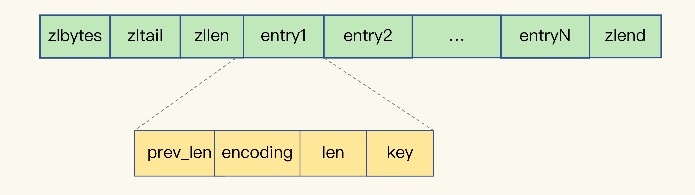
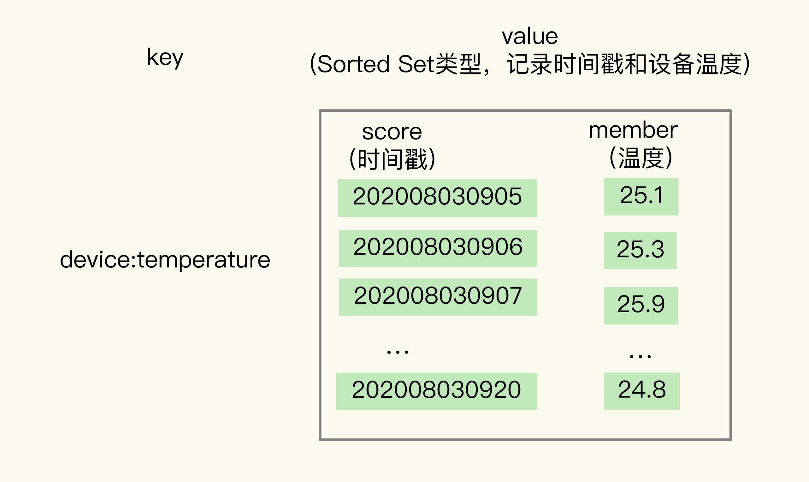
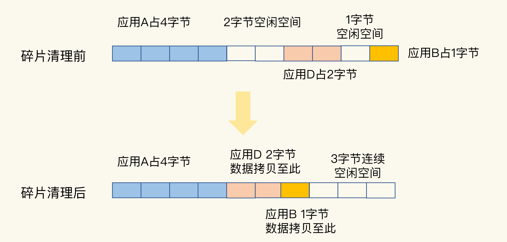
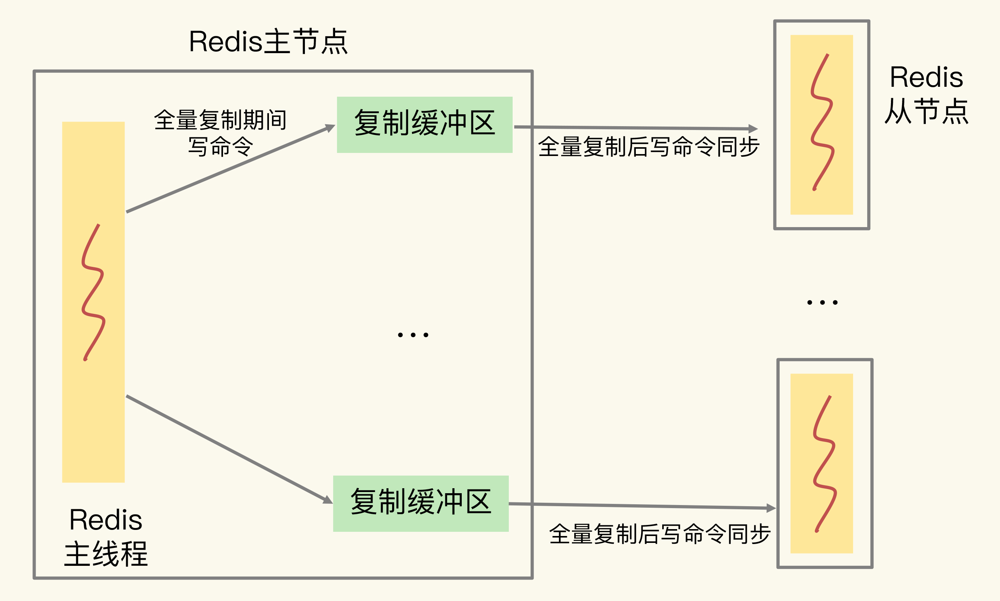
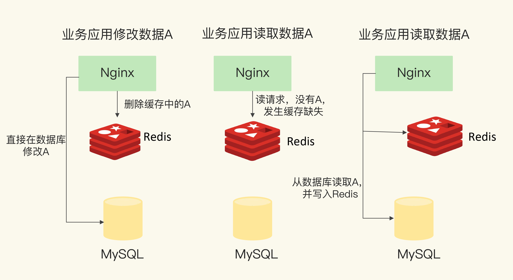
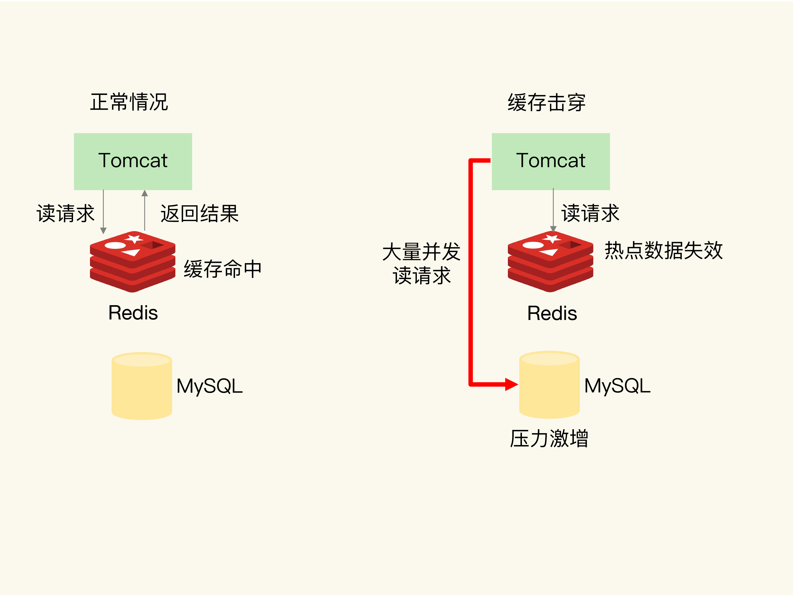
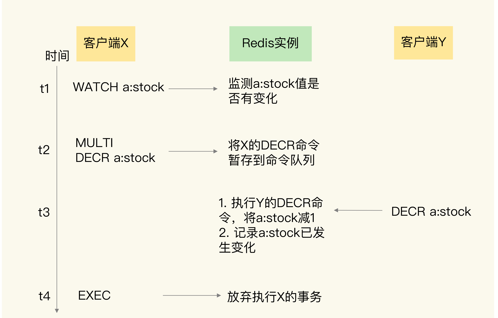
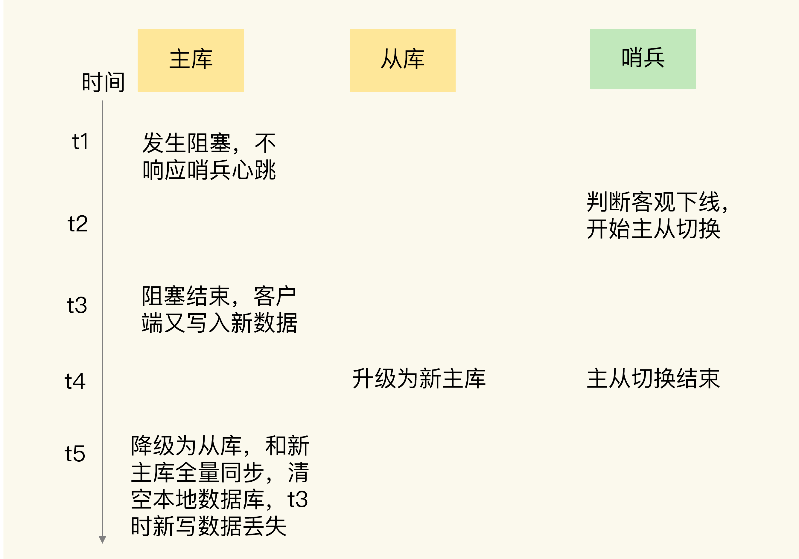
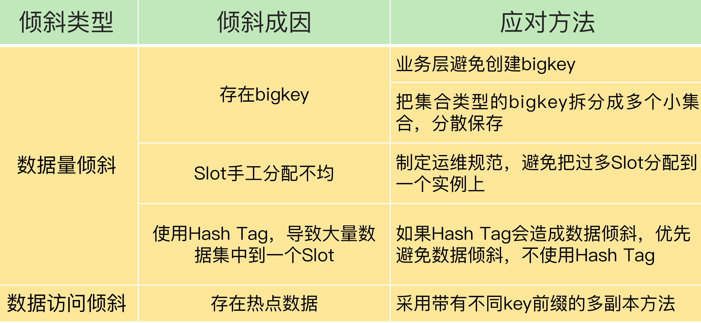

[toc]

### 11 | “万金油”的String，为什么不好用了？

从今天开始，我们就要进入“实践篇”了。接下来，我们会用 5  节课的时间学习“数据结构”。我会介绍**节省内存开销以及保存和统计海量数据的数据类型及其底层数据结构**，还会围绕典型的**应用场景**（例如地址位置查询、时间序列数据库读写和消息队列存取），跟你分享使用 Redis 的数据类型和 module 扩展功能来满足需求的具体方案。

我们先了解下 String 类型的内存空间消耗问题，以及选择节省内存开销的数据类型的解决方案。

先跟你分享一个我曾经遇到的需求。

当时，我们要开发一个图片存储系统，要求这个系统能快速地记录图片 ID 和图片在存储系统中保存时的 ID（可以直接叫作图片存储对象 ID）。同时，还要能够根据图片 ID 快速查找到图片存储对象 ID。

因为图片数量巨大，所以我们就用 10 位数来表示图片 ID 和图片存储对象 ID，例如，图片 ID 为 1101000051，它在存储系统中对应的 ID 号是 3301000051。

```
photo_id: 1101000051
photo_obj_id: 3301000051
```

可以看到，图片 ID 和图片存储对象 ID 正好一一对应，是典型的“键 - 单值”模式。所谓的“单值”，就是指键值对中的值就是一个值，而不是一个集合，这和 String 类型提供的“一个键对应一个值的数据”的保存形式刚好契合。

而且，String  类型可以保存二进制字节流，就像“万金油”一样，只要把数据转成二进制字节数组，就可以保存了。

所以，我们的第一个方案就是用 String  保存数据。我们把图片 ID 和图片存储对象 ID 分别作为键值对的 key 和 value 来保存，其中，图片存储对象 ID 用了 String 类型。

刚开始，我们保存了 1 亿张图片，大约用了 6.4GB 的内存。但是，随着图片数据量的不断增加，我们的 Redis  内存使用量也在增加，结果就遇到了大内存 Redis 实例因为生成 RDB 而响应变慢的问题。很显然，String  类型并不是一种好的选择，我们还需要进一步寻找能节省内存开销的数据类型方案。

在这个过程中，我深入地研究了 String 类型的底层结构，找到了它内存开销大的原因，对“万金油”的 String 类型有了全新的认知：**String 类型并不是适用于所有场合的，它有一个明显的短板，就是它保存数据时所消耗的内存空间较多。**

同时，我还仔细研究了集合类型的数据结构。我发现，集合类型有非常节省内存空间的底层实现结构，但是，集合类型保存的数据模式，是一个键对应一系列值，并不适合直接保存单值的键值对。所以，我们就使用二级编码的方法，实现了用集合类型保存单值键值对，Redis 实例的内存空间消耗明显下降了。

这节课，我就把在解决这个问题时学到的经验和方法分享给你，包括 String 类型的内存空间消耗在哪儿了、用什么数据结构可以节省内存，以及如何用集合类型保存单值键值对。如果你在使用 String  类型时也遇到了内存空间消耗较多的问题，就可以尝试下今天的解决方案了。接下来，我们先来看看 String 类型的内存都消耗在哪里了。

#### 为什么 String 类型内存开销大？

在刚才的案例中，我们保存了 1 亿张图片的信息，用了约 6.4GB 的内存，一个图片 ID 和图片存储对象 ID 的记录平均用了 64 字节。但问题是，一组图片 ID 及其存储对象 ID 的记录，实际只需要 16 字节就可以了。

我们来分析一下。图片 ID 和图片存储对象 ID 都是 10 位数，我们可以用两个 8 字节的 Long 类型表示这两个 ID。因为 8 字节的 Long 类型最大可以表示 2 的 64  次方的数值，所以肯定可以表示 10 位数。但是，为什么 String 类型却用了 64 字节呢？

其实，除了记录实际数据，String 类型还需要**额外的内存空间**记录**数据长度、空间使用等**信息，这些信息也叫作**元数据**。当实际保存的数据较小时，元数据的空间开销就显得比较大了，有点“喧宾夺主”的意思。

那么，String 类型具体是怎么保存数据的呢？我来解释一下。

当你保存 64 位有符号整数时，String 类型会把它保存为一个 8 字节的 Long 类型整数，这种保存方式通常也叫作 int 编码方式。

但是，当你保存的数据中包含字符时，String 类型就会用简单动态字符串（Simple Dynamic String，SDS）结构体来保存，如下图所示：


- buf：字节数组，保存实际数据。为了表示字节数组的结束，Redis 会自动在数组最后加一个“\0”，这就会额外占用 1 个字节的开销。
- len：占 4 个字节，表示 buf 的已用长度。
- alloc：也占个 4  字节，表示 buf 的实际分配长度，一般大于 len。

可以看到，在 SDS 中，buf 保存实际数据，而 len 和 alloc 本身其实是 SDS 结构体的额外开销。

另外，对于 String 类型来说，除了 SDS 的额外开销，还有一个来自于 RedisObject 结构体的开销。

因为 Redis 的数据类型有很多，而且，不同数据类型都有些相同的元数据要记录（比如最后一次访问的时间、被引用的次数等），所以，Redis 会用一个 RedisObject 结构体来统一记录这些元数据，同时指向实际数据。

一个 RedisObject 包含了 8  字节的元数据和一个 8 字节指针，这个指针再进一步指向具体数据类型的实际数据所在，例如指向 String 类型的 SDS  结构所在的内存地址，可以看一下下面的示意图。关于 RedisObject  的具体结构细节，我会在后面的课程中详细介绍，现在你只要了解它的基本结构和元数据开销就行了。


为了节省内存空间，Redis 还对 Long 类型整数和 SDS 的内存布局做了专门的设计。

一方面，当保存的是 Long 类型整数时，RedisObject 中的指针就直接赋值为整数数据了，这样就不用额外的指针再指向整数了，节省了指针的空间开销。

另一方面，当保存的是字符串数据，并且字符串小于等于 44 字节时，RedisObject 中的元数据、指针和 SDS 是一块连续的内存区域，这样就可以避免内存碎片。这种布局方式也被称为 **embstr 编码方式**。

当然，当字符串大于 44 字节时，SDS 的数据量就开始变多了，Redis 就不再把 SDS 和 RedisObject 布局在一起了，而是会给 SDS 分配独立的空间，并用指针指向 SDS 结构。这种布局方式被称为 **raw 编码模式**。


好了，知道了 RedisObject 所包含的额外元数据开销，现在，我们就可以计算 String 类型的内存使用量了。

因为 10 位数的图片 ID 和图片存储对象  ID 是 Long 类型整数，所以可以直接用 int 编码的 RedisObject 保存。每个 int 编码的 RedisObject  元数据部分占 8 字节，指针部分被直接赋值为 8 字节的整数了。此时，每个 ID 会使用 16 字节，加起来一共是 32 字节。但是，另外的  32 字节去哪儿了呢？

我在第 2 讲中说过，Redis  会使用一个**全局哈希表**保存所有键值对，哈希表的每一项是一个 dictEntry 的结构体，用来指向一个键值对。dictEntry 结构中有三个 8 字节的指针，分别指向 key、value 以及下一个 dictEntry，三个指针共 24 字节，如下图所示：


但是，这三个指针只有 24 字节，为什么会占用了 32 字节呢？这就要提到 Redis 使用的内存分配库 jemalloc 了。

jemalloc  在分配内存时，会根据我们申请的字节数 N，找一个比 N 大，但是最接近 N 的 2  的幂次数作为分配的空间，这样可以减少频繁分配的次数。

举个例子。如果你申请 6 字节空间，jemalloc 实际会分配 8 字节空间；如果你申请  24 字节空间，jemalloc 则会分配 32 字节。所以，在我们刚刚说的场景里，dictEntry 结构就占用了 32 字节。

好了，到这儿，你应该就能理解，为什么用  String 类型保存图片 ID 和图片存储对象 ID 时需要用 64 个字节了。

你看，明明有效信息只有 16 字节，使用 String  类型保存时，却需要 64 字节的内存空间，有 48 字节都没有用于保存实际的数据。我们来换算下，如果要保存的图片有 1 亿张，那么 1  亿条的图片 ID 记录就需要 6.4GB 内存空间，其中有 4.8GB  的内存空间都用来保存元数据了，额外的内存空间开销很大。那么，有没有更加节省内存的方法呢？

#### 用什么数据结构可以节省内存？

Redis 有一种底层数据结构，叫压缩列表（ziplist），这是一种非常节省内存的结构。

我们先回顾下压缩列表的构成。表头有三个字段 zlbytes、zltail 和 zllen，分别表示列表长度、列表尾的偏移量，以及列表中的 entry 个数。压缩列表尾还有一个 zlend，表示列表结束。



压缩列表之所以能节省内存，就在于它是用一系列连续的 entry 保存数据。每个 entry 的元数据包括下面几部分。

- **prev_len**，表示前一个 entry  的长度。prev_len 有两种取值情况：1 字节或 5 字节。取值 1 字节时，表示上一个 entry 的长度小于 254 字节。虽然 1  字节的值能表示的数值范围是 0 到 255，但是压缩列表中 zlend 的取值默认是 255，因此，就默认用 255  表示整个压缩列表的结束，其他表示长度的地方就不能再用 255 这个值了。所以，当上一个 entry 长度小于 254 字节时，prev_len  取值为 1 字节，否则，就取值为 5 字节。
- len：表示自身长度，4 字节；
- encoding：表示编码方式，1  字节；
- content：保存实际数据。

这些 entry 会挨个儿放置在内存中，不需要再用额外的指针进行连接，这样就可以节省指针所占用的空间。我们以保存图片存储对象 ID 为例，来分析一下压缩列表是如何节省内存空间的。

每个 entry 保存一个图片存储对象 ID（8 字节），此时，每个 entry 的 prev_len 只需要 1 个字节就行，因为每个 entry 的前一个 entry 长度都只有 8  字节，小于 254 字节。这样一来，一个图片的存储对象 ID 所占用的内存大小是 14 字节（1+4+1+8=14），实际分配 16 字节。

Redis 基于压缩列表实现了  List、Hash 和 Sorted Set 这样的集合类型，这样做的最大好处就是节省了 dictEntry 的开销。当你用 String  类型时，一个键值对就有一个 dictEntry，要用 32 字节空间。但采用集合类型时，一个 key  就对应一个集合的数据，能保存的数据多了很多，但也只用了一个 dictEntry，这样就节省了内存。

这个方案听起来很好，但还存在一个问题：在用集合类型保存键值对时，一个键对应了一个集合的数据，但是在我们的场景中，一个图片 ID 只对应一个图片的存储对象  ID，我们该怎么用集合类型呢？换句话说，在一个键对应一个值（也就是单值键值对）的情况下，我们该怎么用集合类型来保存这种单值键值对呢？

#### 如何用集合类型保存单值的键值对？

在保存单值的键值对时，可以采用基于 Hash  类型的二级编码方法。这里说的二级编码，就是把一个单值的数据拆分成两部分，前一部分作为 Hash 集合的 key，后一部分作为 Hash 集合的  value，这样一来，我们就可以把单值数据保存到 Hash 集合中了。

以图片 ID 1101000060 和图片存储对象 ID  3302000080 为例，我们可以把图片 ID 的前 7 位（1101000）作为 Hash 类型的键，把图片 ID 的最后 3  位（060）和图片存储对象 ID 分别作为 Hash 类型值中的 key 和 value。

按照这种设计方法，我在 Redis 中插入了一组图片 ID 及其存储对象 ID 的记录，并且用 info 命令查看了内存开销，我发现，增加一条记录后，内存占用只增加了 16 字节，如下所示：

```
127.0.0.1:6379> info memory
# Memory
used_memory:1039120
127.0.0.1:6379> hset 1101000 060 3302000080
(integer) 1
127.0.0.1:6379> info memory
# Memory
used_memory:1039136
```

在使用 String 类型时，每个记录需要消耗 64 字节，这种方式却只用了 16 字节，所使用的内存空间是原来的 1/4，满足了我们节省内存空间的需求。

不过，你可能也会有疑惑：“二级编码一定要把图片 ID 的前 7 位作为 Hash 类型的键，把最后 3 位作为 Hash 类型值中的 key 吗？”其实，二级编码方法中采用的 ID 长度是有讲究的。

在第 2 讲中，我介绍过 Redis Hash  类型的两种底层实现结构，分别是压缩列表和哈希表。

那么，Hash 类型底层结构什么时候使用压缩列表，什么时候使用哈希表呢？其实，Hash  类型设置了用压缩列表保存数据时的两个阈值，一旦超过了阈值，Hash 类型就会用哈希表来保存数据了。

这两个阈值分别对应以下两个配置项：

- hash-max-ziplist-entries：表示用压缩列表保存时哈希集合中的最大元素个数。
- hash-max-ziplist-value：表示用压缩列表保存时哈希集合中单个元素的最大长度。

如果我们往 Hash 集合中写入的元素个数超过了 hash-max-ziplist-entries，或者写入的单个元素大小超过了 hash-max-ziplist-value，Redis 就会自动把 Hash 类型的实现结构由压缩列表转为哈希表。

一旦从压缩列表转为了哈希表，Hash 类型就会一直用哈希表进行保存，而不会再转回压缩列表了。在节省内存空间方面，哈希表就没有压缩列表那么高效了。

**为了能充分使用压缩列表的精简内存布局，我们一般要控制保存在 Hash 集合中的元素个数**。所以，在刚才的二级编码中，我们只用图片 ID 最后 3 位作为 Hash 集合的 key，也就保证了 Hash  集合的元素个数不超过 1000，同时，我们把 hash-max-ziplist-entries 设置为 1000，这样一来，Hash  集合就可以一直使用压缩列表来节省内存空间了。

#### 小结

这节课，我们打破了对 String  的认知误区，以前，我们认为 String 是“万金油”，什么场合都适用，但是，在保存的键值对本身占用的内存空间不大时（例如这节课里提到的的图片  ID 和图片存储对象 ID），String 类型的元数据开销就占据主导了，这里面包括了 **RedisObject 结构、SDS  结构、dictEntry 结构的内存开销**。

针对这种情况，我们可以使用压缩列表保存数据。当然，使用 Hash  这种集合类型保存单值键值对的数据时，我们需要将单值数据拆分成两部分，分别作为 Hash 集合的键和值，就像刚才案例中用二级编码来表示图片  ID，希望你能把这个方法用到自己的场景中。

最后，我还想再给你提供一个小方法：如果你想知道键值对采用不同类型保存时的内存开销，可以在这个网址里[http://www.redis.cn/redis_memory/]输入你的键值对长度和使用的数据类型，这样就能知道实际消耗的内存大小了。建议你把这个小工具用起来，它可以帮助你充分地节省内存。


### 12 | 有一亿个keys要统计，应该用哪种集合？

在 Web  和移动应用的业务场景中，我们经常需要保存这样一种信息：一个 key 对应了一个数据集合。我举几个例子。

- 手机 App  中的每天的用户登录信息：一天对应一系列用户 ID 或移动设备 ID；
- 电商网站上商品的用户评论列表：一个商品对应了一系列的评论；
- 用户在手机 App 上的签到打卡信息：一天对应一系列用户的签到记录；
- 应用网站上的网页访问信息：一个网页对应一系列的访问点击。

我们知道，Redis 集合类型的特点就是一个键对应一系列的数据，所以非常适合用来存取这些数据。但是，在这些场景中，除了记录信息，我们往往还需要对集合中的数据进行统计，例如：

- 在移动应用中，需要统计每天的新增用户数和第二天的留存用户数；
- 在电商网站的商品评论中，需要统计评论列表中的最新评论；
- 在签到打卡中，需要统计一个月内连续打卡的用户数；
- 在网页访问记录中，需要统计独立访客（Unique Visitor，UV）量。

通常情况下，我们面临的用户数量以及访问量都是巨大的，比如百万、千万级别的用户数量，或者千万级别、甚至亿级别的访问信息。所以，我们必须要选择能够非常高效地统计大量数据（例如亿级）的集合类型。

**要想选择合适的集合，我们就得了解常用的集合统计模式。**这节课，我就给你介绍集合类型常见的四种统计模式，包括**聚合统计、排序统计、二值状态统计和基数统计**。我会以刚刚提到的这四个场景为例，和你聊聊在这些统计模式下，什么集合类型能够更快速地完成统计，而且还节省内存空间。掌握了今天的内容，之后再遇到集合元素统计问题时，你就能很快地选出合适的集合类型了。

#### 聚合统计

我们先来看集合元素统计的第一个场景：聚合统计。

所谓的聚合统计，就是指**统计多个集合元素的聚合结果**，包括：统计多个集合的共有元素（**交集统计**）；把两个集合相比，统计其中一个集合独有的元素（**差集统计**）；统计多个集合的所有元素（**并集统计**）。

在刚才提到的场景中，统计手机 App 每天的新增用户数和第二天的留存用户数，正好对应了聚合统计。

要完成这个统计任务，我们可以用一个集合记录所有登录过 App 的用户 ID，同时，用另一个集合记录每一天登录过 App 的用户 ID。然后，再对这两个集合做聚合统计。我们来看下具体的操作。

记录所有登录过 App 的用户 ID  还是比较简单的，我们可以直接使用 Set 类型，把 key 设置为 user:id，表示记录的是用户 ID，value 就是一个 Set  集合，里面是所有登录过 App 的用户 ID，我们可以把这个 Set 叫作累计用户 Set，如下图所示：


需要注意的是，累计用户 Set 中没有日期信息，我们是不能直接统计每天的新增用户的。所以，我们还需要把每一天登录的用户 ID，记录到一个新集合中，我们把这个集合叫作每日用户 Set，它有两个特点：

1. key 是 user:id 以及当天日期，例如 user:id:20200803；
2. value 是 Set 集合，记录当天登录的用户 ID。


在统计每天的新增用户时，我们只用计算每日用户 Set 和累计用户 Set 的差集就行。

我借助一个具体的例子来解释一下。假设我们的手机  App 在 2020 年 8 月 3 日上线，那么，8 月 3 日前是没有用户的。此时，累计用户 Set 是空集，当天登录的用户 ID  会被记录到 key 为 user:id:20200803 的 Set 中。所以，user:id:20200803 这个 Set  中的用户就是当天的新增用户。

然后，我们计算累计用户 Set 和 user:id:20200803  Set 的并集结果，结果保存在 user:id 这个累计用户 Set 中，如下所示：

```
SUNIONSTORE  user:id  user:id  user:id:20200803 
```

此时，user:id 这个累计用户 Set  中就有了 8 月 3 日的用户 ID。等到 8 月 4 日再统计时，我们把 8 月 4 日登录的用户 ID 记录到  user:id:20200804 的 Set 中。接下来，我们执行 SDIFFSTORE 命令计算累计用户 Set 和  user:id:20200804 Set 的差集，结果保存在 key 为 user:new 的 Set 中，如下所示：

```
SDIFFSTORE  user:new  user:id:20200804 user:id  
```

可以看到，这个差集中的用户 ID 在 user:id:20200804 的 Set 中存在，但是不在累计用户 Set 中。所以，user:new 这个 Set 中记录的就是 8 月 4 日的新增用户。

当要计算 8 月 4  日的留存用户时，我们只需要再计算 user:id:20200803 和 user:id:20200804 两个 Set  的交集，就可以得到同时在这两个集合中的用户 ID 了，这些就是在 8 月 3 日登录，并且在 8 月 4 日留存的用户。执行的命令如下：

```
SINTERSTORE user:id:rem user:id:20200803 user:id:20200804
```

当你需要对多个集合进行聚合计算时，Set 类型会是一个非常不错的选择。不过，我要提醒你一下，这里有一个潜在的风险。

Set  的差集、并集和交集的计算复杂度较高，在数据量较大的情况下，如果直接执行这些计算，会导致 Redis  实例阻塞。所以，我给你分享一个小建议：**可以从主从集群中选择一个从库，让它专门负责聚合计算，或者是把数据读取到客户端，在客户端来完成聚合统计，这样就可以规避阻塞主库实例和其他从库实例的风险了。**

#### 排序统计

接下来，我们再来聊一聊应对集合元素排序需求的方法。我以在电商网站上提供最新评论列表的场景为例，进行讲解。

最新评论列表包含了所有评论中的最新留言，这就**要求集合类型能对元素保序**，也就是说，集合中的元素可以按序排列，这种对元素保序的集合类型叫作有序集合。

在 Redis 常用的 4 个集合类型中（List、Hash、Set、Sorted Set），List 和 Sorted Set 就属于有序集合。

**List 是按照元素进入 List 的顺序进行排序的，而 Sorted Set 可以根据元素的权重来排序**，我们可以自己来决定每个元素的权重值。比如说，我们可以根据元素插入 Sorted Set 的时间确定权重值，先插入的元素权重小，后插入的元素权重大。

看起来好像都可以满足需求，我们该怎么选择呢?

我先说说用 List 的情况。每个商品对应一个 List，这个 List 包含了对这个商品的所有评论，而且会按照评论时间保存这些评论，每来一个新评论，就用 LPUSH 命令把它插入 List 的队头。

在只有一页评论的时候，我们可以很清晰地看到最新的评论，但是，在实际应用中，网站一般会分页显示最新的评论列表，一旦涉及到分页操作，List 就可能会出现问题了。

假设当前的评论 List 是{A, B, C, D, E, F}（其中，A 是最新的评论，以此类推，F 是最早的评论），在展示第一页的 3 个评论时，我们可以用下面的命令，得到最新的三条评论 A、B、C：

```
LRANGE product1 0 2
1) "A"
2) "B"
3) "C"
```

然后，再用下面的命令获取第二页的 3 个评论，也就是 D、E、F。

```
LRANGE product1 3 5
1) "D"
2) "E"
3) "F"
```

但是，如果在展示第二页前，又产生了一个新评论  G，评论 G 就会被 LPUSH 命令插入到评论 List 的队头，评论 List 就变成了{G, A, B, C, D, E,  F}。此时，再用刚才的命令获取第二页评论时，就会发现，评论 C 又被展示出来了，也就是 C、D、E。

```
LRANGE product1 3 5
1) "C"
2) "D"
3) "E"
```

之所以会这样，关键原因就在于，List  是通过元素在 List 中的位置来排序的，当有一个新元素插入时，原先的元素在 List 中的位置都后移了一位，比如说原来在第 1  位的元素现在排在了第 2 位。所以，对比新元素插入前后，List 相同位置上的元素就会发生变化，用 LRANGE 读取时，就会读到旧元素。

和 List 相比，Sorted Set 就不存在这个问题，因为它是根据元素的实际权重来排序和获取数据的。

我们可以按评论时间的先后给每条评论设置一个权重值，然后再把评论保存到 Sorted Set 中。Sorted Set 的 ZRANGEBYSCORE  命令就可以按权重排序后返回元素。这样的话，即使集合中的元素频繁更新，Sorted Set 也能通过 ZRANGEBYSCORE  命令准确地获取到按序排列的数据。假设越新的评论权重越大，目前最新评论的权重是 N，我们执行下面的命令时，就可以获得最新的 10 条评论：

```
ZRANGEBYSCORE comments N-9 N
```

所以，在面对需要展示最新列表、排行榜等场景时，如果数据更新频繁或者需要分页显示，建议你优先考虑使用 Sorted Set。

#### 二值状态统计

现在，我们再来分析下第三个场景：二值状态统计。这里的二值状态就是指集合元素的取值就只有 0 和 1 两种。在签到打卡的场景中，我们只用记录签到（1）或未签到（0），所以它就是非常典型的二值状态，

在签到统计时，每个用户一天的签到用 1 个  bit 位就能表示，一个月（假设是 31 天）的签到情况用 31 个 bit 位就可以，而一年的签到也只需要用 365 个 bit  位，根本不用太复杂的集合类型。这个时候，我们就可以选择 Bitmap。这是 Redis 提供的扩展数据类型。我来给你解释一下它的实现原理。

Bitmap 本身是用 String  类型作为底层数据结构实现的一种统计二值状态的数据类型。String 类型是会保存为二进制的字节数组，所以，Redis 就把字节数组的每个 bit 位利用起来，用来表示一个元素的二值状态。你可以把 Bitmap 看作是一个 bit 数组。

Bitmap 提供了 GETBIT/SETBIT  操作，使用一个偏移值 offset 对 bit 数组的某一个 bit 位进行读和写。不过，需要注意的是，Bitmap 的偏移量是从 0  开始算的，也就是说 offset 的最小值是 0。当使用 SETBIT 对一个 bit 位进行写操作时，这个 bit 位会被设置为  1。Bitmap 还提供了 BITCOUNT 操作，用来统计这个 bit 数组中所有“1”的个数。

那么，具体该怎么用 Bitmap 进行签到统计呢？我还是借助一个具体的例子来说明。

假设我们要统计 ID 3000 的用户在 2020 年 8 月份的签到情况，就可以按照下面的步骤进行操作。

第一步，执行下面的命令，记录该用户 8 月 3 号已签到。

```
SETBIT uid:sign:3000:202008 2 1 
```

第二步，检查该用户 8 月 3 日是否签到。

```
GETBIT uid:sign:3000:202008 2 
```

第三步，统计该用户在 8 月份的签到次数。

```
BITCOUNT uid:sign:3000:202008
```

这样，我们就知道该用户在 8 月份的签到情况了，是不是很简单呢？接下来，你可以再思考一个问题：如果记录了 1 亿个用户 10 天的签到情况，你有办法统计出这 10 天连续签到的用户总数吗？

在介绍具体的方法之前，我们要先知道，Bitmap 支持用 BITOP 命令对多个 Bitmap 按位做“与”“或”“异或”的操作，操作的结果会保存到一个新的 Bitmap 中。

我以按位“与”操作为例来具体解释一下。从下图中，可以看到，三个 Bitmap bm1、bm2 和 bm3，对应 bit 位做“与”操作，结果保存到了一个新的 Bitmap 中（示例中，这个结果 Bitmap 的 key 被设为“resmap”）。


回到刚刚的问题，在统计 1 亿个用户连续 10 天的签到情况时，你可以把每天的日期作为 key，每个 key 对应一个 1 亿位的 Bitmap，每一个 bit 对应一个用户当天的签到情况。

接下来，我们对 10 个 Bitmap  做“与”操作，得到的结果也是一个 Bitmap。在这个 Bitmap 中，只有 10 天都签到的用户对应的 bit 位上的值才会是  1。最后，我们可以用 BITCOUNT 统计下 Bitmap 中的 1 的个数，这就是连续签到 10 天的用户总数了。

现在，我们可以计算一下记录了 10  天签到情况后的内存开销。每天使用 1 个 1 亿位的 Bitmap，大约占 12MB 的内存（10^8/8/1024/1024），10 天的  Bitmap 的内存开销约为 120MB，内存压力不算太大。不过，在实际应用时，最好对 Bitmap 设置过期时间，让 Redis  自动删除不再需要的签到记录，以节省内存开销。

所以，如果只需要统计数据的二值状态，例如商品有没有、用户在不在等，就可以使用 Bitmap，因为它只用一个 bit 位就能表示 0 或 1。在记录海量数据时，Bitmap 能够有效地节省内存空间。

#### 基数统计

最后，我们再来看一个统计场景：基数统计。基数统计就是指统计一个集合中不重复的元素个数。对应到我们刚才介绍的场景中，就是统计网页的 UV。

网页 UV 的统计有个独特的地方，就是需要去重，一个用户一天内的多次访问只能算作一次。在 Redis 的集合类型中，Set  类型默认支持去重，所以看到有去重需求时，我们可能第一时间就会想到用 Set 类型。我

们来结合一个例子看一看用 Set 的情况。

有一个用户 user1 访问 page1 时，你把这个信息加到 Set 中：

```
SADD page1:uv user1
```

用户 1 再来访问时，Set  的去重功能就保证了不会重复记录用户 1 的访问次数，这样，用户 1 就算是一个独立访客。当你需要统计 UV 时，可以直接用 SCARD  命令，这个命令会返回一个集合中的元素个数。

但是，如果 page1 非常火爆，UV 达到了千万，这个时候，一个 Set 就要记录千万个用户  ID。对于一个搞大促的电商网站而言，这样的页面可能有成千上万个，如果每个页面都用这样的一个 Set，就会消耗很大的内存空间。

当然，你也可以用 Hash 类型记录 UV。

例如，你可以把用户 ID 作为 Hash 集合的 key，当用户访问页面时，就用 HSET 命令（用于设置 Hash 集合元素的值），对这个用户 ID 记录一个值“1”，表示一个独立访客，用户 1 访问 page1 后，我们就记录为 1 个独立访客，如下所示：

```
HSET page1:uv user1 1
```

即使用户 1 多次访问页面，重复执行这个  HSET 命令，也只会把 user1 的值设置为 1，仍然只记为 1 个独立访客。当要统计 UV 时，我们可以用 HLEN 命令统计 Hash  集合中的所有元素个数。但是，和 Set 类型相似，当页面很多时，Hash  类型也会消耗很大的内存空间。那么，有什么办法既能完成统计，还能节省内存吗？

这时候，就要用到 Redis 提供的 HyperLogLog 了。

**HyperLogLog** 是一种用于统计基数的数据集合类型，它的最大优势就在于，**当集合元素数量非常多时，它计算基数所需的空间总是固定的，而且还很小**。

在 Redis 中，每个 HyperLogLog 只需要花费 12 KB 内存，就可以计算接近 2^64 个元素的基数。你看，和元素越多就越耗费内存的 Set 和 Hash 类型相比，HyperLogLog 就非常节省空间。

在统计 UV 时，你可以用 PFADD 命令（用于向 HyperLogLog 中添加新元素）把访问页面的每个用户都添加到 HyperLogLog 中。

```
PFADD page1:uv user1 user2 user3 user4 user5
```

接下来，就可以用 PFCOUNT 命令直接获得 page1 的 UV 值了，这个命令的作用就是返回 HyperLogLog 的统计结果。

```
PFCOUNT page1:uv
```

关于 HyperLogLog 的具体实现原理，你不需要重点掌握，不会影响到你的日常使用，我就不多讲了。

不过，有一点需要你注意一下，HyperLogLog 的统计规则是**基于概率完成**的，所以它给出的统计结果是**有一定误差**的，标准误算率是 0.81%。这也就意味着，你使用 HyperLogLog 统计的 UV 是 100 万，但实际的 UV 可能是 101 万。虽然误差率不算大，但是，如果你需要精确统计结果的话，最好还是继续用 Set 或  Hash 类型。

#### 小结

这节课，我们结合统计新增用户数和留存用户数、最新评论列表、用户签到数以及网页独立访客量这 4 种典型场景，学习了集合类型的 4 种统计模式，分别是聚合统计、排序统计、二值状态统计和基数统计。为了方便你掌握，我把 Set、Sorted Set、Hash、List、Bitmap、HyperLogLog  的支持情况和优缺点汇总在了下面的表格里，希望你把这张表格保存下来，时不时地复习一下。


可以看到，Set 和 Sorted Set  都支持多种聚合统计，不过，对于差集计算来说，只有 Set 支持。Bitmap 也能做多个 Bitmap  间的聚合计算，包括与、或和异或操作。

当需要进行排序统计时，List 中的元素虽然有序，但是一旦有新元素插入，原来的元素在 List  中的位置就会移动，那么，按位置读取的排序结果可能就不准确了。而 Sorted Set  本身是按照集合元素的权重排序，可以准确地按序获取结果，所以建议你优先使用它。

如果我们记录的数据只有 0 和 1 两个值的状态，Bitmap  会是一个很好的选择，这主要归功于 Bitmap 对于一个数据只用 1 个 bit  记录，可以节省内存。

对于基数统计来说，如果集合元素量达到亿级别而且不需要精确统计时，我建议你使用 HyperLogLog。

当然，Redis  的应用场景非常多，这张表中的总结不一定能覆盖到所有场景。我建议你也试着自己画一张表，把你遇到的其他场景添加进去。长久积累下来，你一定能够更加灵活地把集合类型应用到合适的实践项目中。


### 13 | GEO是什么？还可以定义新的数据类型吗？

在第 2 讲中，我们学习了 Redis 的 **5  大基本数据类型**：**String、List、Hash、Set 和 Sorted  Set**，它们可以满足大多数的数据存储需求，但是在面对海量数据统计时，它们的内存开销很大，而且对于一些特殊的场景，它们是无法支持的。所以，Redis 还提供了 **3 种扩展数据类型**，分别是 **Bitmap、HyperLogLog 和 GEO**。前两种我在上节课已经重点介绍过了，今天，我再具体讲一讲 GEO。

另外，我还会给你介绍开发自定义的新数据类型的基本步骤。掌握了自定义数据类型的开发方法，当你面临一些复杂的场景时，就不用受基本数据类型的限制，可以直接在 Redis 中增加定制化的数据类型，来满足你的特殊需求。

接下来，我们就先来了解下扩展数据类型 GEO 的实现原理和使用方法。

#### 面向 LBS 应用的 GEO 数据类型

在日常生活中，我们越来越依赖搜索“附近的餐馆”、在打车软件上叫车，这些都离不开**基于位置信息服务（Location-Based Service，LBS）的应用**。LBS 应用访问的数据是和人或物关联的一组经纬度信息，而且要能查询相邻的经纬度范围，GEO 就非常适合应用在  LBS 服务的场景中，我们来看一下它的底层结构。

##### GEO 的底层结构

**一般来说，在设计一个数据类型的底层结构时，我们首先需要知道，要处理的数据有什么访问特点。**所以，我们需要先搞清楚位置信息到底是怎么被存取的。

我以叫车服务为例，来分析下 LBS 应用中经纬度的存取特点。

1. 每一辆网约车都有一个编号（例如  33），网约车需要将自己的经度信息（例如 116.034579）和纬度信息（例如 39.000452  ）发给叫车应用。
2. 用户在叫车的时候，叫车应用会根据用户的经纬度位置（例如经度 116.054579，纬度  39.030452），查找用户的附近车辆，并进行匹配。
3. 等把位置相近的用户和车辆匹配上以后，叫车应用就会根据车辆的编号，获取车辆的信息，并返回给用户。

可以看到，一辆车（或一个用户）对应一组经纬度，并且随着车（或用户）的位置移动，相应的经纬度也会变化。

这种数据记录模式属于一个 key（例如车  ID）对应一个 value（一组经纬度）。当有很多车辆信息要保存时，就需要有一个集合来保存一系列的 key 和 value。Hash  集合类型可以快速存取一系列的 key 和 value，正好可以用来记录一系列车辆 ID 和经纬度的对应关系，所以，我们可以把不同车辆的 ID  和它们对应的经纬度信息存在 Hash 集合中，如下图所示：


同时，Hash 类型的 HSET 操作命令，会根据 key 来设置相应的 value 值，所以，我们可以用它来快速地更新车辆变化的经纬度信息。

到这里，Hash  类型看起来是一个不错的选择。但问题是，对于一个 LBS 应用来说，**除了记录经纬度信息，还需要根据用户的经纬度信息在车辆的 Hash  集合中进行范围查询**。一旦涉及到范围查询，就意味着集合中的元素需要有序，但 Hash 类型的元素是无序的，显然不能满足我们的要求。

我们再来看看使用 **Sorted Set 类型**是不是合适。

Sorted Set 类型也支持一个 key  对应一个 value 的记录模式，其中，key 就是 Sorted Set 中的元素，而 value  则是元素的权重分数。更重要的是，Sorted Set 可以根据元素的权重分数排序，支持范围查询。这就能满足 LBS 服务中查找相邻位置的需求了。

实际上，**GEO 类型的底层数据结构就是用 Sorted Set 来实现的**。咱们还是借着叫车应用的例子来加深下理解。

用 Sorted Set 来保存车辆的经纬度信息时，Sorted Set 的元素是车辆 ID，元素的权重分数是经纬度信息，如下图所示：


这时问题来了，Sorted Set 元素的权重分数是一个浮点数（float 类型），而一组经纬度包含的是经度和纬度两个值，是没法直接保存为一个浮点数的，那具体该怎么进行保存呢？

这就要用到 GEO 类型中的 **GeoHash 编码**了。

##### GeoHash 的编码方法

为了能高效地对经纬度进行比较，Redis 采用了业界广泛使用的 GeoHash 编码方法，这个方法的基本原理就是“**二分区间，区间编码**”。

当我们要对一组经纬度进行 GeoHash 编码时，我们要先对经度和纬度分别编码，然后再把经纬度各自的编码组合成一个最终编码。

首先，我们来看下经度和纬度的单独编码过程。

对于一个地理位置信息来说，它的经度范围是[-180,180]。GeoHash 编码会把一个经度值编码成一个 N 位的二进制值，我们来对经度范围[-180,180]做 N 次的二分区操作，其中 N 可以自定义。

在进行第一次二分区时，经度范围[-180,180]会被分成两个子区间：[-180,0) 和[0,180]（我称之为左、右分区）。此时，我们可以查看一下要编码的经度值落在了左分区还是右分区。如果是落在左分区，我们就用 0  表示；如果落在右分区，就用 1 表示。这样一来，每做完一次二分区，我们就可以得到 1 位编码值。

然后，我们再对经度值所属的分区再做一次二分区，同时再次查看经度值落在了二分区后的左分区还是右分区，按照刚才的规则再做 1 位编码。当做完 N 次的二分区后，经度值就可以用一个 **N bit** 的数来表示了。

举个例子，假设我们要编码的经度值是  116.37，我们用 5 位编码值（也就是 N=5，做 5  次分区）。

我们先做第一次二分区操作，把经度区间[-180,180]分成了左分区[-180,0) 和右分区[0,180]，此时，经度值  116.37 是属于右分区[0,180]，所以，我们用 1 表示第一次二分区后的编码值。接下来，我们做第二次二分区：把经度值 116.37  所属的[0,180]区间，分成[0,90) 和[90, 180]。此时，经度值 116.37  还是属于右分区[90,180]，所以，第二次分区后的编码值仍然为 1。等到第三次对[90,180]进行二分区，经度值 116.37  落在了分区后的左分区[90, 135) 中，所以，第三次分区后的编码值就是 0。

按照这种方法，做完 5 次分区后，我们把经度值 116.37  定位在[112.5, 123.75]这个区间，并且得到了经度值的 5 位编码值，即 11010。这个编码过程如下表所示：


对纬度的编码方式，和对经度的一样，只是纬度的范围是[-90，90]，下面这张表显示了对纬度值 39.86 的编码过程。


当一组经纬度值都编完码后，我们再把它们的各自编码值组合在一起，组合的规则是：**最终编码值的偶数位上依次是经度的编码值，奇数位上依次是纬度的编码值，其中，偶数位从 0 开始，奇数位从 1 开始。**

我们刚刚计算的经纬度（116.37，39.86）的各自编码值是 11010 和 10111，组合之后，第 0 位是经度的第 0 位 1，第 1 位是纬度的第 0 位 1，第 2 位是经度的第 1 位 1，第 3 位是纬度的第 1 位 0，以此类推，就能得到最终编码值 1110011101，如下图所示：


用了 GeoHash  编码后，原来无法用一个权重分数表示的一组经纬度（116.37，39.86）就可以用 1110011101 这一个值来表示，就可以保存为  Sorted Set 的权重分数了。

当然，使用 GeoHash 编码后，我们相当于把整个地理空间划分成了一个个方格，每个方格对应了  GeoHash 中的一个分区。

举个例子。我们把经度区间[-180,180]做一次二分区，把纬度区间[-90,90]做一次二分区，就会得到 4 个分区。我们来看下它们的经度和纬度范围以及对应的 GeoHash 组合编码。

- 分区一：[-180,0) 和[-90,0)，编码 00；
- 分区二：[-180,0) 和[0,90]，编码 01；
- 分区三：[0,180]和[-90,0)，编码 10；
- 分区四：[0,180]和[0,90]，编码 11。

这 4 个分区对应了 4 个方格，每个方格覆盖了一定范围内的经纬度值，分区越多，每个方格能覆盖到的地理空间就越小，也就越精准。我们把所有方格的编码值映射到一维空间时，相邻方格的 GeoHash 编码值基本也是接近的，如下图所示：


所以，我们使用 Sorted Set  范围查询得到的相近编码值，在实际的地理空间上，也是相邻的方格，这就可以实现 LBS  应用“搜索附近的人或物”的功能了。

不过，我要提醒你一句，有的编码值虽然在大小上接近，但实际对应的方格却距离比较远。例如，我们用 4 位来做  GeoHash 编码，把经度区间[-180,180]和纬度区间[-90,90]各分成了 4 个分区，一共 16 个分区，对应了 16  个方格。编码值为 0111 和 1000 的两个方格就离得比较远，如下图所示：


所以，为了避免查询不准确问题，我们可以同时查询给定经纬度所在的方格周围的 4 个或 8 个方格。

好了，到这里，我们就知道了，GEO 类型是把经纬度所在的区间编码作为 Sorted Set  中元素的权重分数，把和经纬度相关的车辆 ID 作为 Sorted Set  中元素本身的值保存下来，这样相邻经纬度的查询就可以通过编码值的大小范围查询来实现了。接下来，我们再来聊聊具体如何操作 GEO 类型。

##### 如何操作 GEO 类型？

在使用 GEO  类型时，我们经常会用到两个命令，分别是 GEOADD 和 GEORADIUS。

- **GEOADD 命令**：用于把一组经纬度信息和相对应的一个 ID  记录到 GEO 类型集合中
- **GEORADIUS  命令**：会根据输入的经纬度位置，查找以这个经纬度为中心的一定范围内的其他元素。当然，我们可以自己定义这个范围。

我还是以叫车应用的车辆匹配场景为例，介绍下具体如何使用这两个命令。

假设车辆 ID 是 33，经纬度位置是（116.034579，39.030452），我们可以用一个 GEO 集合保存所有车辆的经纬度，集合 key 是  cars:locations。执行下面的这个命令，就可以把 ID 号为 33 的车辆的当前经纬度位置存入 GEO 集合中：

```
GEOADD cars:locations 116.034579 39.030452 33
```

当用户想要寻找自己附近的网约车时，LBS 应用就可以使用 GEORADIUS 命令。

例如，LBS 应用执行下面的命令时，Redis  会根据输入的用户的经纬度信息（116.054579，39.030452 ），查找以这个经纬度为中心的 5 公里内的车辆信息，并返回给 LBS  应用。当然， 你可以修改“5”这个参数，来返回更大或更小范围内的车辆信息。

```
GEORADIUS cars:locations 116.054579 39.030452 5 km ASC COUNT 10
```

另外，我们还可以进一步限定返回的车辆信息。

比如，我们可以使用 ASC 选项，让返回的车辆信息按照距离这个中心位置从近到远的方式来排序，以方便选择最近的车辆；还可以使用 COUNT  选项，指定返回的车辆信息的数量。毕竟，5  公里范围内的车辆可能有很多，如果返回全部信息，会占用比较多的数据带宽，这个选项可以帮助控制返回的数据量，节省带宽。

可以看到，使用 GEO  数据类型可以非常轻松地操作经纬度这种信息。

虽然我们有了 5 种基本类型和 3  种扩展数据类型，但是有些场景下，我们对数据类型会有特殊需求，例如，我们需要一个数据类型既能像 Hash 那样支持快速的单键查询，又能像  Sorted Set 那样支持范围查询，此时，我们之前学习的这些数据类型就无法满足需求了。那么，接下来，我就再向你介绍下 Redis  扩展数据类型的终极版——**自定义的数据类型**。这样，你就可以定制符合自己需求的数据类型了，不管你的应用场景怎么变化，你都不用担心没有合适的数据类型。

#### 如何自定义数据类型？

为了实现自定义数据类型，首先，我们需要了解 Redis 的**基本对象结构 RedisObject**，因为 Redis 键值对中的每一个值都是用 RedisObject 保存的。

我在第 11 讲中说过，RedisObject 包括**元数据和指针**。其中，元数据的一个功能就是用来区分不同的数据类型，指针用来指向具体的数据类型的值。所以，要想开发新数据类型，我们就先来了解下 RedisObject 的元数据和指针。

##### Redis 的基本对象结构

RedisObject 的内部组成包括了 type,、encoding,、lru 和 refcount 4 个元数据，以及 1 个*ptr指针。

- type：表示值的类型，涵盖了我们前面学习的五大基本类型；
- encoding：是值的编码方式，用来表示 Redis 中实现各个基本类型的底层数据结构，例如  SDS、压缩列表、哈希表、跳表等；
- lru：记录了这个对象最后一次被访问的时间，用于淘汰过期的键值对；
- refcount：记录了对象的引用计数；
- *ptr：是指向数据的指针。


RedisObject  结构借助*ptr指针，就可以指向不同的数据类型，例如，*ptr指向一个 SDS 或一个跳表，就表示键值对中的值是 String 类型或  Sorted Set 类型。所以，我们在定义了新的数据类型后，也只要在 RedisObject 中设置好新类型的 type 和  encoding，再用*ptr指向新类型的实现，就行了。

##### 开发一个新的数据类型

了解了 RedisObject 结构后，定义一个新的数据类型也就不难了。首先，我们需要为新数据类型定义好它的底层结构、type 和 encoding 属性值，然后再实现新数据类型的创建、释放函数和基本命令。

接下来，我以开发一个名字叫作 NewTypeObject 的新数据类型为例，来解释下具体的 4 个操作步骤。


###### 第一步：定义新数据类型的底层结构

我们用 newtype.h 文件来保存这个新类型的定义，具体定义的代码如下所示：

```c
struct NewTypeObject {
    struct NewTypeNode *head; 
    size_t len; 
}NewTypeObject;
```

其中，NewTypeNode 结构就是我们自定义的新类型的底层结构。我们为底层结构设计两个成员变量：一个是 Long 类型的 value 值，用来保存实际数据；一个是*next指针，指向下一个 NewTypeNode 结构。

```c
struct NewTypeNode {
    long value;
    struct NewTypeNode *next;
};
```

从代码中可以看到，NewTypeObject  类型的底层结构其实就是一个 Long 类型的单向链表。当然，你还可以根据自己的需求，把 NewTypeObject  的底层结构定义为其他类型。例如，如果我们想要 NewTypeObject 的查询效率比链表高，就可以把它的底层结构设计成一颗 B+ 树。

###### 第二步：在 RedisObject 的 type 属性中，增加这个新类型的定义

这个定义是在 Redis 的 server.h 文件中。比如，我们增加一个叫作 OBJ_NEWTYPE 的宏定义，用来在代码中指代 NewTypeObject 这个新类型。

```c
#define OBJ_STRING 0    /* String object. */
#define OBJ_LIST 1      /* List object. */
#define OBJ_SET 2       /* Set object. */
#define OBJ_ZSET 3      /* Sorted set object. */
…
#define OBJ_NEWTYPE 7
```

###### 第三步：开发新类型的创建和释放函数

Redis 把数据类型的创建和释放函数都定义在了 object.c 文件中。所以，我们可以在这个文件中增加 NewTypeObject 的创建函数 createNewTypeObject，如下所示：

```c
robj *createNewTypeObject(void){
   NewTypeObject *h = newtypeNew(); 
   robj *o = createObject(OBJ_NEWTYPE,h);
   return o;
}
```

newtypeNew  函数涉及到新数据类型的具体创建，而 Redis 默认会为每个数据类型定义一个单独文件，实现这个类型的创建和命令操作，例如，t_string.c 和 t_list.c 分别对应 String 和 List 类型。按照 Redis 的惯例，我们就把 newtypeNew 函数定义在名为  t_newtype.c 的文件中。

createObject 是 Redis 本身提供的 RedisObject 创建函数，它的参数是数据类型的 type 和指向数据类型实现的指针*ptr。

我们给 createObject 函数中传入了两个参数，分别是新类型的 type 值 OBJ_NEWTYPE，以及指向一个初始化过的 NewTypeObjec 的指针。这样一来，创建的 RedisObject 就能指向我们自定义的新数据类型了。

```c
robj *createObject(int type, void *ptr) {
    robj *o = zmalloc(sizeof(*o));
    o->type = type;
    o->ptr = ptr;
    ...
    return o;
}
```

对于释放函数来说，它是创建函数的反过程，是用 zfree 命令把新结构的内存空间释放掉。

###### 第四步：开发新类型的命令操作

简单来说，增加相应的命令操作的过程可以分成三小步：

1. 在 t_newtype.c 文件中增加命令操作的实现。比如说，我们定义 ntinsertCommand 函数，由它实现对 NewTypeObject 单向链表的插入操作：

    ```c
    void ntinsertCommand(client *c){
      //基于客户端传递的参数，实现在NewTypeObject链表头插入元素
    }
    ```

2.  在 server.h 文件中，声明我们已经实现的命令，以便在 server.c 文件引用这个命令，例如：

    ```c
    void ntinsertCommand(client *c)
    ```

3. 在 server.c 文件中的  redisCommandTable 里面，把新增命令和实现函数关联起来。例如，新增的 ntinsert 命令由 ntinsertCommand  函数实现，我们就可以用 ntinsert 命令给 NewTypeObject 数据类型插入元素了。

    ```c
    struct redisCommand redisCommandTable[] = { 
    ...
    {"ntinsert",ntinsertCommand,2,"m",...}
    }
    ```

此时，我们就完成了一个自定义的  NewTypeObject 数据类型，可以实现基本的命令操作了。当然，如果你还希望新的数据类型能被持久化保存，我们还需要在 Redis 的  RDB 和 AOF 模块中增加对新数据类型进行持久化保存的代码，我会在后面的加餐中再和你分享。

#### 小结

这节课，我们学习了 Redis 的扩展数据类型 GEO。GEO 可以记录经纬度形式的地理位置信息，被广泛地应用在 LBS 服务中。GEO 本身并没有设计新的底层数据结构，而是直接使用了 Sorted Set 集合类型。

GEO 类型使用 GeoHash  编码方法实现了经纬度到 Sorted Set  中元素权重分数的转换，这其中的两个关键机制就是对二维地图做区间划分，以及对区间进行编码。一组经纬度落在某个区间后，就用区间的编码值来表示，并把编码值作为 Sorted Set 元素的权重分数。这样一来，我们就可以把经纬度保存到 Sorted Set 中，利用 Sorted Set  提供的“按权重进行有序范围查找”的特性，实现 LBS 服务中频繁使用的“搜索附近”的需求。

GEO 属于 Redis  提供的扩展数据类型。扩展数据类型有两种实现途径：一种是**基于现有的数据类型**，通过数据编码或是实现新的操作的方式，来实现扩展数据类型，例如基于  Sorted Set 和 GeoHash 编码实现 GEO，以及基于 String 和位操作实现  Bitmap；另一种就是**开发自定义的数据类型**，具体的操作是增加新数据类型的定义，实现创建和释放函数，实现新数据类型支持的命令操作，建议你尝试着把今天学到的内容灵活地应用到你的工作场景中。


### 14 | 如何在Redis中保存时间序列数据？

我们现在做互联网产品的时候，都有这么一个需求：记录用户在网站或者 App 上的点击行为数据，来分析用户行为。这里的数据一般包括用户 ID、行为类型（例如浏览、登录、下单等）、行为发生的时间戳：

```
UserID, Type, TimeStamp
```

我之前做过的一个物联网项目的数据存取需求，和这个很相似。我们需要周期性地统计近万台设备的实时状态，包括设备 ID、压力、温度、湿度，以及对应的时间戳：

```
DeviceID, Pressure, Temperature, Humidity, TimeStamp
```

这些与发生时间相关的一组数据，就是**时间序列数据**。这些数据的特点是没有严格的关系模型，记录的信息可以表示成键和值的关系（例如，一个设备 ID 对应一条记录），所以，并不需要专门用关系型数据库（例如 MySQL）来保存。而 Redis  的键值数据模型，正好可以满足这里的数据存取需求。Redis 基于自身数据结构以及扩展模块，提供了两种解决方案。

这节课，我就以物联网场景中统计设备状态指标值为例，和你聊聊不同解决方案的做法和优缺点。俗话说，“知己知彼，百战百胜”，我们就先从时间序列数据的读写特点开始，看看到底应该采用什么样的数据类型来保存吧。

#### 时间序列数据的读写特点

在实际应用中，时间序列数据通常是**持续高并发写入**的，例如，需要连续记录数万个设备的实时状态值。同时，时间序列数据的写入主要就是插入新数据，而不是更新一个已存在的数据，也就是说，一个时间序列数据被记录后通常就不会变了，因为它就代表了一个设备在某个时刻的状态值（例如，一个设备在某个时刻的温度测量值，一旦记录下来，这个值本身就不会再变了）。

所以，这种数据的写入特点很简单，就是插入数据快，这就要求我们选择的数据类型，在进行数据插入时，复杂度要低，尽量不要阻塞。看到这儿，你可能第一时间会想到用 Redis 的 String、Hash 类型来保存，因为它们的插入复杂度都是 O(1)，是个不错的选择。但是，我在第 11  讲中说过，String 类型在记录小数据时（例如刚才例子中的设备温度值），元数据的内存开销比较大，不太适合保存大量数据。

那我们再看看，时间序列数据的“读”操作有什么特点。

我们在查询时间序列数据时，既有对单条记录的查询（例如查询某个设备在某一个时刻的运行状态信息，对应的就是这个设备的一条记录），也有对某个时间范围内的数据的查询（例如每天早上 8 点到 10 点的所有设备的状态信息）。

除此之外，还有一些更复杂的查询，比如对某个时间范围内的数据做聚合计算。这里的聚合计算，就是对符合查询条件的所有数据做计算，包括计算均值、最大 / 最小值、求和等。例如，我们要计算某个时间段内的设备压力的最大值，来判断是否有故障发生。

那用一个词概括时间序列数据的“读”，就是查询模式多。

弄清楚了时间序列数据的读写特点，接下来我们就看看如何在 Redis 中保存这些数据。我们来分析下：针对时间序列数据的“写要快”，Redis  的高性能写特性直接就可以满足了；而针对“查询模式多”，也就是要**支持单点查询、范围查询和聚合计算**，Redis  提供了保存时间序列数据的两种方案，分别可以**基于 Hash 和 Sorted Set 实现**，以及**基于 RedisTimeSeries 模块**实现。

#### 基于 Hash 和 Sorted Set 保存时间序列数据

Hash 和 Sorted Set 组合的方式有一个明显的好处：它们是 Redis 内在的数据类型，代码成熟和性能稳定。所以，基于这两个数据类型保存时间序列数据，系统稳定性是可以预期的。

不过，在前面学习的场景中，我们都是使用一个数据类型来存取数据，那么，**为什么保存时间序列数据，要同时使用这两种类型？这是我们要回答的第一个问题。**

关于 Hash 类型，我们都知道，它有一个特点是，可以实现对单键的快速查询。这就满足了时间序列数据的单键查询需求。我们可以把时间戳作为 Hash 集合的 key，把记录的设备状态值作为 Hash 集合的 value。

可以看下用 Hash 集合记录设备的温度值的示意图：


当我们想要查询某个时间点或者是多个时间点上的温度数据时，直接使用 HGET 命令或者 HMGET 命令，就可以分别获得 Hash 集合中的一个 key 和多个 key 的 value 值了。

举个例子。我们用 HGET 命令查询 202008030905 这个时刻的温度值，使用 HMGET 查询 202008030905、202008030907、202008030908 这三个时刻的温度值，如下所示：

```c
HGET device:temperature 202008030905
"25.1"

HMGET device:temperature 202008030905 202008030907 202008030908
1) "25.1"
2) "25.9"
3) "24.9"
```

你看，用 Hash 类型来实现单键的查询很简单。但是，Hash 类型有个短板：它并**不支持对数据进行范围查询**。

虽然时间序列数据是按时间递增顺序插入 Hash  集合中的，但 Hash 类型的底层结构是哈希表，并没有对数据进行有序索引。所以，如果要对 Hash 类型进行范围查询的话，就需要扫描 Hash  集合中的所有数据，再把这些数据取回到客户端进行排序，然后，才能在客户端得到所查询范围内的数据。显然，查询效率很低。

为了能同时支持按时间戳范围的查询，可以用 Sorted Set 来保存时间序列数据，因为它能够根据元素的权重分数来排序。我们可以把时间戳作为 Sorted Set 集合的元素分数，把时间点上记录的数据作为元素本身。

我还是以保存设备温度的时间序列数据为例，进行解释。下图显示了用 Sorted Set 集合保存的结果。



使用 Sorted Set  保存数据后，我们就可以使用 ZRANGEBYSCORE  命令，按照输入的最大时间戳和最小时间戳来查询这个时间范围内的温度值了。如下所示，我们来查询一下在 2020 年 8 月 3 日 9 点 7 分到 9 点 10 分间的所有温度值：

```c
ZRANGEBYSCORE device:temperature 202008030907 202008030910
1) "25.9"
2) "24.9"
3) "25.3"
4) "25.2"
```

现在我们知道了，同时使用 Hash 和 Sorted Set，可以满足单个时间点和一个时间范围内的数据查询需求了，但是我们又会面临一个新的问题，也就是我们要解答的**第二个问题**：**如何保证写入 Hash 和 Sorted Set 是一个原子性的操作呢？**

所谓“原子性的操作”，就是指我们执行多个写命令操作时（例如用 HSET 命令和 ZADD 命令分别把数据写入 Hash 和 Sorted Set），这些命令操作要么全部完成，要么都不完成。

只有保证了写操作的原子性，才能保证同一个时间序列数据，在 Hash 和 Sorted Set 中，要么都保存了，要么都没保存。否则，就可能出现 Hash 集合中有时间序列数据，而 Sorted Set 中没有，那么，在进行范围查询时，就没有办法满足查询需求了。

那 Redis  是怎么保证原子性操作的呢？这里就涉及到了 Redis 用来实现简单的事务的 MULTI 和 EXEC  命令。当多个命令及其参数本身无误时，MULTI 和 EXEC 命令可以保证执行这些命令时的原子性。关于 Redis  的事务支持和原子性保证的异常情况，我会在第 30 讲中向你介绍，这节课，我们只要了解一下 MULTI 和 EXEC 这两个命令的使用方法就行了。

- MULTI  命令：表示一系列原子性操作的开始。收到这个命令后，Redis  就知道，接下来再收到的命令需要放到一个内部队列中，后续一起执行，保证原子性。
- EXEC 命令：表示一系列原子性操作的结束。一旦 Redis  收到了这个命令，就表示所有要保证原子性的命令操作都已经发送完成了。此时，Redis 开始执行刚才放到内部队列中的所有命令操作。

你可以看下下面这张示意图，命令 1 到命令 N 是在 MULTI 命令后、EXEC 命令前发送的，它们会被一起执行，保证原子性。


以保存设备状态信息的需求为例，我们执行下面的代码，把设备在 2020 年 8 月 3 日 9 时 5 分的温度，分别用 HSET 命令和 ZADD 命令写入 Hash 集合和 Sorted Set 集合。

```c
127.0.0.1:6379> MULTI
OK

127.0.0.1:6379> HSET device:temperature 202008030911 26.8
QUEUED

127.0.0.1:6379> ZADD device:temperature 202008030911 26.8
QUEUED

127.0.0.1:6379> EXEC
1) (integer) 1
2) (integer) 1
```

可以看到，首先，Redis 收到了客户端执行的  MULTI 命令。然后，客户端再执行 HSET 和 ZADD 命令后，Redis  返回的结果为“QUEUED”，表示这两个命令暂时入队，先不执行；执行了 EXEC 命令后，HSET 命令和 ZADD  命令才真正执行，并返回成功结果（结果值为 1）。

到这里，我们就解决了时间序列数据的单点查询、范围查询问题，并使用 MUTLI 和 EXEC 命令保证了 Redis 能原子性地把数据保存到 Hash 和 Sorted Set 中。接下来，我们需要继续解决**第三个问题：如何对时间序列数据进行聚合计算？**

聚合计算一般被用来**周期性地统计时间窗口内的数据汇总状态**，**在实时监控与预警等场景下会频繁执行**。

因为 Sorted Set  只支持范围查询，无法直接进行聚合计算，所以，我们只能先把时间范围内的数据取回到客户端，然后在客户端自行完成聚合计算。这个方法虽然能完成聚合计算，但是会带来一定的潜在风险，也就是大量数据在 Redis 实例和客户端间频繁传输，这会和其他操作命令竞争网络资源，导致其他操作变慢。

在我们这个物联网项目中，就需要每 3 分钟统计一下各个设备的温度状态，一旦设备温度超出了设定的阈值，就要进行报警。这是一个典型的聚合计算场景，我们可以来看看这个过程中的数据体量。

假设我们需要每 3  分钟计算一次的所有设备各指标的最大值，每个设备每 15 秒记录一个指标值，1 分钟就会记录 4 个值，3 分钟就会有 12  个值。我们要统计的设备指标数量有 33 个，所以，单个设备每 3 分钟记录的指标数据有将近 400 个（33 * 12 =  396），而设备总数量有 1 万台，这样一来，每 3 分钟就有将近 400 万条（396 * 1 万 = 396 万）数据需要在客户端和  Redis 实例间进行传输。

为了避免客户端和 Redis  实例间频繁的大量数据传输，我们可以使用 RedisTimeSeries 来保存时间序列数据。

RedisTimeSeries 支持直接在  Redis 实例上进行聚合计算。还是以刚才每 3 分钟算一次最大值为例。在 Redis  实例上直接聚合计算，那么，对于单个设备的一个指标值来说，每 3 分钟记录的 12 条数据可以聚合计算成一个值，单个设备每 3 分钟也就只有 33 个聚合值需要传输，1 万台设备也只有 33 万条数据。数据量大约是在客户端做聚合计算的十分之一，很显然，可以减少大量数据传输对 Redis  实例网络的性能影响。

所以，如果我们只需要进行单个时间点查询或是对某个时间范围查询的话，适合使用 Hash 和 Sorted Set 的组合，它们都是 Redis  的内在数据结构，性能好，稳定性高。但是，如果我们需要进行大量的聚合计算，同时网络带宽条件不是太好时，Hash 和 Sorted Set  的组合就不太适合了。此时，使用 RedisTimeSeries 就更加合适一些。

#### 基于 RedisTimeSeries 模块保存时间序列数据

RedisTimeSeries 是 Redis 的一个扩展模块。它专门面向时间序列数据提供了数据类型和访问接口，并且**支持在 Redis 实例上直接对数据进行按时间范围的聚合计算**。

因为 RedisTimeSeries 不属于 Redis 的内建功能模块，在使用时，我们需要先把它的源码单独编译成动态链接库 redistimeseries.so，再使用 loadmodule 命令进行加载，如下所示：

```c
loadmodule redistimeseries.so
```

当用于时间序列数据存取时，RedisTimeSeries 的操作主要有 5 个：

- 用 TS.CREATE 命令创建时间序列数据集合；
- 用 TS.ADD 命令插入数据；
- 用 TS.GET 命令读取最新数据；
- 用 TS.MGET 命令按标签过滤查询数据集合；
- 用 TS.RANGE 支持聚合计算的范围查询。

下面，我来介绍一下如何使用这 5 个操作。

##### 1.用 TS.CREATE 命令创建一个时间序列数据集合

在 TS.CREATE  命令中，我们需要设置时间序列数据集合的 key  和数据的过期时间（以毫秒为单位）。此外，我们还可以为数据集合设置标签，来表示数据集合的属性。

例如，我们执行下面的命令，创建一个 key 为  device:temperature、数据有效期为 600s 的时间序列数据集合。也就是说，这个集合中的数据创建了 600s  后，就会被自动删除。最后，我们给这个集合设置了一个标签属性{device_id:1}，表明这个数据集合中记录的是属于设备 ID 号为 1  的数据。

```c
TS.CREATE device:temperature RETENTION 600000 LABELS device_id 1
OK
```

##### 2.用 TS.ADD 命令插入数据，用 TS.GET 命令读取最新数据

我们可以用 TS.ADD 命令往时间序列集合中插入数据，包括时间戳和具体的数值，并使用 TS.GET 命令读取数据集合中的最新一条数据。

例如，我们执行下列 TS.ADD 命令时，就往 device:temperature 集合中插入了一条数据，记录的是设备在 2020 年 8 月 3 日 9 时 5 分的设备温度；再执行 TS.GET 命令时，就会把刚刚插入的最新数据读取出来。

```c
TS.ADD device:temperature 1596416700 25.1
1596416700

TS.GET device:temperature 
25.1
```

##### 3. 用 TS.MGET 命令按标签过滤查询数据集合

在保存多个设备的时间序列数据时，我们通常会把不同设备的数据保存到不同集合中。此时，我们就可以使用 TS.MGET 命令，按照标签查询部分集合中的最新数据。在使用 TS.CREATE  创建数据集合时，我们可以给集合设置标签属性。当我们进行查询时，就可以在查询条件中对集合标签属性进行匹配，最后的查询结果里只返回匹配上的集合中的最新数据。

举个例子。假设我们一共用 4 个集合为 4  个设备保存时间序列数据，设备的 ID 号是 1、2、3、4，我们在创建数据集合时，把 device_id  设置为每个集合的标签。此时，我们就可以使用下列 TS.MGET 命令，以及 FILTER 设置（这个配置项用来设置集合标签的过滤条件），查询  device_id 不等于 2 的所有其他设备的数据集合，并返回各自集合中的最新的一条数据。

```c
TS.MGET FILTER device_id!=2 
1) 1) "device:temperature:1"
   2) (empty list or set)
   3) 1) (integer) 1596417000
      2) "25.3"
2) 1) "device:temperature:3"
   2) (empty list or set)
   3) 1) (integer) 1596417000
      2) "29.5"
3) 1) "device:temperature:4"
   2) (empty list or set)
   3) 1) (integer) 1596417000
      2) "30.1"
```

##### 4. 用 TS.RANGE 支持需要聚合计算的范围查询

最后，在对时间序列数据进行聚合计算时，我们可以使用 TS.RANGE 命令指定要查询的数据的时间范围，同时用 AGGREGATION 参数指定要执行的聚合计算类型。RedisTimeSeries 支持的聚合计算类型很丰富，包括求均值（avg）、求最大 / 最小值（max/min），求和（sum）等。

例如，在执行下列命令时，我们就可以按照每 180s 的时间窗口，对 2020 年 8 月 3 日 9 时 5 分和 2020 年 8 月 3 日 9 时 12 分这段时间内的数据进行均值计算了。

```c
TS.RANGE device:temperature 1596416700 1596417120 AGGREGATION avg 180000
1) 1) (integer) 1596416700
   2) "25.6"
2) 1) (integer) 1596416880
   2) "25.8"
3) 1) (integer) 1596417060
   2) "26.1"
```

与使用 Hash 和 Sorted Set  来保存时间序列数据相比，RedisTimeSeries 是专门为时间序列数据访问设计的扩展模块，能支持在 Redis  实例上直接进行聚合计算，以及按标签属性过滤查询数据集合，当我们需要频繁进行聚合计算，以及从大量集合中筛选出特定设备或用户的数据集合时，RedisTimeSeries 就可以发挥优势了。

#### 小结

在这节课，我们一起学习了如何用 Redis 保存时间序列数据。时间序列数据的写入特点是要能快速写入，而查询的特点有三个：

- 点查询，根据一个时间戳，查询相应时间的数据；
- 范围查询，查询起始和截止时间戳范围内的数据；
- 聚合计算，针对起始和截止时间戳范围内的所有数据进行计算，例如求最大 / 最小值，求均值等。

关于快速写入的要求，Redis 的高性能写特性足以应对了；而针对多样化的查询需求，Redis 提供了两种方案。

第一种方案是，组合使用 Redis 内置的  Hash 和 Sorted Set 类型，把数据同时保存在 Hash 集合和 Sorted Set 集合中。这种方案既可以利用 Hash  类型实现对单键的快速查询，还能利用 Sorted Set  实现对范围查询的高效支持，一下子满足了时间序列数据的两大查询需求。

不过，第一种方案也有两个不足：一个是，在执行聚合计算时，我们需要把数据读取到客户端再进行聚合，当有大量数据要聚合时，数据传输开销大；另一个是，所有的数据会在两个数据类型中各保存一份，内存开销不小。不过，我们可以通过设置适当的数据过期时间，释放内存，减小内存压力。

我们学习的第二种实现方案是使用 RedisTimeSeries 模块。这是专门为存取时间序列数据而设计的扩展模块。和第一种方案相比，RedisTimeSeries  能支持直接在 Redis 实例上进行多种数据聚合计算，避免了大量数据在实例和客户端间传输。不过，RedisTimeSeries  的**底层数据结构使用了链表**，它的范围查询的复杂度是 O(N) 级别的，同时，它的 TS.GET 查询只能返回最新的数据，没有办法像第一种方案的  Hash 类型一样，可以返回任一时间点的数据。

所以，组合使用 Hash 和 Sorted  Set，或者使用 RedisTimeSeries，在支持时间序列数据存取上各有优劣势。我给你的建议是：

- 如果你的部署环境中网络带宽高、Redis  实例内存大，可以优先考虑第一种方案；
- 如果你的部署环境中网络、内存资源有限，而且数据量大，聚合计算频繁，需要按数据集合属性查询，可以优先考虑第二种方案。


### 15 | 消息队列的考验：Redis有哪些解决方案？

现在的互联网应用基本上都是采用分布式系统架构进行设计的，而很多分布式系统必备的一个基础软件就是消息队列。

消息队列要能支持组件通信消息的快速读写，而 Redis 本身支持数据的高速访问，正好可以满足消息队列的读写性能需求。不过，除了性能，消息队列还有其他的要求，所以，很多人都很关心一个问题：“Redis 适合做消息队列吗？”

其实，这个问题的背后，隐含着两方面的核心问题：

- 消息队列的消息存取需求是什么？
- Redis 如何实现消息队列的需求？

这节课，我们就来聊一聊消息队列的特征和  Redis 提供的消息队列方案。只有把这两方面的知识和实践经验串连起来，才能彻底理解基于 Redis  实现消息队列的技术实践。以后当你需要为分布式系统组件做消息队列选型时，就可以根据组件通信量和消息通信速度的要求，选择出适合的 Redis  消息队列方案了。

我们先来看下第一个问题：消息队列的消息读取有什么样的需求？

#### 消息队列的消息存取需求

我先介绍一下消息队列存取消息的过程。在分布式系统中，当两个组件要基于消息队列进行通信时，一个组件会把要处理的数据以消息的形式传递给消息队列，然后，这个组件就可以继续执行其他操作了；远端的另一个组件从消息队列中把消息读取出来，再在本地进行处理。

为了方便你理解，我还是借助一个例子来解释一下。

假设组件 1  需要对采集到的数据进行求和计算，并写入数据库，但是，消息到达的速度很快，组件 1  没有办法及时地既做采集，又做计算，并且写入数据库。所以，我们可以使用基于消息队列的通信，让组件 1 把数据 x 和 y 保存为 JSON  格式的消息，再发到消息队列，这样它就可以继续接收新的数据了。组件 2 则异步地从消息队列中把数据读取出来，在服务器 2  上进行求和计算后，再写入数据库。这个过程如下图所示：


我们一般把消息队列中发送消息的组件称为生产者（例子中的组件 1），把接收消息的组件称为消费者（例子中的组件 2），下图展示了一个通用的消息队列的架构模型：


在使用消息队列时，消费者可以异步读取生产者消息，然后再进行处理。这样一来，即使生产者发送消息的速度远远超过了消费者处理消息的速度，生产者已经发送的消息也可以缓存在消息队列中，避免阻塞生产者，这是消息队列作为分布式组件通信的一大优势。

不过，**消息队列在存取消息时，必须要满足三个需求，分别是消息保序、处理重复的消息和保证消息可靠性**。

##### 需求一：消息保序

虽然消费者是异步处理消息，但是，消费者仍然需要按照生产者发送消息的顺序来处理消息，避免后发送的消息被先处理了。对于要求消息保序的场景来说，一旦出现这种消息被乱序处理的情况，就可能会导致业务逻辑被错误执行，从而给业务方造成损失。

我们来看一个更新商品库存的场景。

假设生产者负责接收库存更新请求，消费者负责实际更新库存，现有库存量是 10。生产者先后发送了消息 1 和消息 2，消息 1 要把商品 X 的库存记录更新为 5，消息 2 是把商品 X 库存更新为 3。如果消息 1 和 2 在消息队列中无法保序，出现消息 2 早于消息 1 被处理的情况，那么，很显然，库存更新就出错了。这是业务应用无法接受的。

面对这种情况，你可能会想到一种解决方案：不要把更新后的库存量作为生产者发送的消息，而是**把库存扣除值作为消息的内容**。这样一来，消息 1 是扣减库存量 5，消息 2 是扣减库存量 2。如果消息 1 和消息 2 之间没有库存查询请求的话，即使消费者先处理消息 2，再处理消息  1，这个方案也能够保证最终的库存量是正确的，也就是库存量为 3。

但是，我们还需要考虑这样一种情况：假如消费者收到了这样三条消息：消息 1 是扣减库存量 5，消息 2 是读取库存量，消息 3 是扣减库存量 2，此时，如果消费者先处理了消息 3（把库存量扣减  2），那么库存量就变成了 8。然后，消费者处理了消息 2，读取当前的库存量是 8，这就会出现库存量查询不正确的情况。从业务应用层面看，消息  1、2、3 应该是顺序执行的，所以，消息 2 查询到的应该是扣减了 5 以后的库存量，而不是扣减了 2  以后的库存量。所以，用库存扣除值作为消息的方案，在消息中同时包含读写操作的场景下，会带来数据读取错误的问题。而且，这个方案还会面临一个问题，那就是重复消息处理。

##### 需求二：重复消息处理

消费者从消息队列读取消息时，有时会因为网络堵塞而出现消息重传的情况。此时，消费者可能会收到多条重复的消息。对于重复的消息，消费者如果多次处理的话，就可能造成一个业务逻辑被多次执行，如果业务逻辑正好是要修改数据，那就会出现数据被多次修改的问题了。

还是以库存更新为例，假设消费者收到了一次消息 1，要扣减库存量 5，然后又收到了一次消息 1，那么，如果消费者无法识别这两条消息实际是一条相同消息的话，就会执行两次扣减库存量 5  的操作，此时，库存量就不对了。这当然也是无法接受的。

##### 需求三：消息可靠性保证

另外，消费者在处理消息的时候，还可能出现因为故障或宕机导致消息没有处理完成的情况。此时，消息队列需要能提供消息可靠性的保证，也就是说，当消费者重启后，可以重新读取消息再次进行处理，否则，就会出现消息漏处理的问题了。

Redis 的 List 和 Streams 两种数据类型，就可以满足消息队列的这三个需求。我们先来了解下基于 List 的消息队列实现方法。

#### 基于 List 的消息队列解决方案

List 本身就是按先进先出的顺序对数据进行存取的，所以，如果使用 List 作为消息队列保存消息的话，就已经能满足消息保序的需求了。

具体来说，生产者可以使用 LPUSH  命令把要发送的消息依次写入 List，而消费者则可以使用 RPOP 命令，从 List  的另一端按照消息的写入顺序，依次读取消息并进行处理。

如下图所示，生产者先用 LPUSH 写入了两条库存消息，分别是 5 和  3，表示要把库存更新为 5 和 3；消费者则用 RPOP 把两条消息依次读出，然后进行相应的处理。


不过，在消费者读取数据时，有一个潜在的性能风险点。

在生产者往 List 中写入数据时，List 并不会主动地通知消费者有新消息写入，如果消费者想要及时处理消息，就需要在程序中不停地调用 RPOP  命令（比如使用一个 while(1) 循环）。如果有新消息写入，RPOP 命令就会返回结果，否则，RPOP  命令返回空值，再继续循环。

所以，即使没有新消息写入 List，消费者也要不停地调用 RPOP 命令，这就会导致消费者程序的 CPU  一直消耗在执行 RPOP 命令上，带来不必要的性能损失。

为了解决这个问题，Redis 提供了 BRPOP 命令。**BRPOP 命令也称为阻塞式读取，客户端在没有读到队列数据时，自动阻塞，直到有新的数据写入队列，再开始读取新数据**。和消费者程序自己不停地调用 RPOP 命令相比，这种方式能节省 CPU 开销。

消息保序的问题解决了，接下来，我们还需要考虑解决重复消息处理的问题，这里其实有一个要求：**消费者程序本身能对重复消息进行判断。**

一方面，消息队列要能给每一个消息提供全局唯一的 ID 号；另一方面，消费者程序要把已经处理过的消息的 ID 号记录下来。

当收到一条消息后，消费者程序就可以对比收到的消息 ID 和记录的已处理过的消息  ID，来判断当前收到的消息有没有经过处理。如果已经处理过，那么，消费者程序就不再进行处理了。这种处理特性也称为幂等性，幂等性就是指，对于同一条消息，消费者收到一次的处理结果和收到多次的处理结果是一致的。

不过，List 本身是不会为每个消息生成 ID 号的，所以，消息的全局唯一 ID 号就需要生产者程序在发送消息前自行生成。生成之后，我们在用 LPUSH 命令把消息插入 List 时，需要在消息中包含这个全局唯一 ID。

例如，我们执行以下命令，就把一条全局 ID 为 101030001、库存量为 5 的消息插入了消息队列：

```c
LPUSH mq "101030001:stock:5"
(integer) 1
```

最后，我们再来看下，List 类型是如何保证**消息可靠性**的。

当消费者程序从 List 中读取一条消息后，List 就不会再留存这条消息了。所以，如果消费者程序在处理消息的过程出现了故障或宕机，就会导致消息没有处理完成，那么，消费者程序再次启动后，就没法再次从 List 中读取消息了。

为了留存消息，List 类型提供了  **BRPOPLPUSH 命令**，这个命令的作用是**让消费者程序从一个 List 中读取消息，同时，Redis 会把这个消息再插入到另一个  List（可以叫作备份 List）留存**。这样一来，如果消费者程序读了消息但没能正常处理，等它重启后，就可以从备份 List  中重新读取消息并进行处理了。

我画了一张示意图，展示了使用 BRPOPLPUSH 命令留存消息，以及消费者再次读取消息的过程，你可以看下。


生产者先用 LPUSH  把消息“5”“3”插入到消息队列 mq 中。消费者程序使用 BRPOPLPUSH 命令读取消息“5”，同时，消息“5”还会被 Redis 插入到 mqback 队列中。如果消费者程序处理消息“5”时宕机了，等它重启后，可以从 mqback 中再次读取消息“5”，继续处理。

好了，到这里，你可以看到，基于 List  类型，我们可以满足分布式组件对消息队列的三大需求。但是，在用 List  做消息队列时，我们还可能遇到过一个问题：**生产者消息发送很快，而消费者处理消息的速度比较慢，这就导致 List 中的消息越积越多，给 Redis  的内存带来很大压力。**

这个时候，我们希望启动多个消费者程序组成一个消费组，一起分担处理 List 中的消息。但是，List 类型并不支持消费组的实现。那么，还有没有更合适的解决方案呢？这就要说到 Redis 从 5.0 版本开始提供的 Streams 数据类型了。

和 List 相比，Streams 同样能够满足消息队列的三大需求。而且，它还支持消费组形式的消息读取。接下来，我们就来了解下 Streams 的使用方法。

#### 基于 Streams 的消息队列解决方案

Streams 是 Redis 专门为消息队列设计的数据类型，它提供了丰富的消息队列操作命令。

- **XADD**：插入消息，保证有序，可以自动生成全局唯一 ID；
- **XREAD**：用于读取消息，可以按 ID 读取数据；
- **XREADGROUP**：按消费组形式读取消息；
- **XPENDING 和  XACK**：XPENDING 命令可以用来查询每个消费组内所有消费者已读取但尚未确认的消息，而 XACK 命令用于向消息队列确认消息处理已完成。

首先，我们来学习下 Streams 类型存取消息的操作 XADD。

XADD 命令可以往消息队列中插入新消息，消息的格式是键 - 值对形式。对于插入的每一条消息，Streams 可以自动为其生成一个全局唯一的 ID。

比如说，我们执行下面的命令，就可以往名称为  mqstream 的消息队列中插入一条消息，消息的键是 repo，值是 5。其中，消息队列名称后面的*，表示让 Redis  为插入的数据自动生成一个全局唯一的 ID，例如“1599203861727-0”。当然，我们也可以不用*，直接在消息队列名称后自行设定一个 ID 号，只要保证这个 ID 号是全局唯一的就行。不过，相比自行设定 ID 号，使用*会更加方便高效。

```c
XADD mqstream * repo 5
"1599203861727-0"
```

可以看到，消息的全局唯一 ID  由两部分组成，第一部分“1599203861727”是数据插入时，以毫秒为单位计算的当前服务器时间，第二部分表示插入消息在当前毫秒内的消息序号，这是从 0 开始编号的。例如，“1599203861727-0”就表示在“1599203861727”毫秒内的第 1 条消息。

当消费者需要读取消息时，可以直接使用 XREAD 命令从消息队列中读取。

XREAD 在读取消息时，可以指定一个消息 ID，并从这个消息 ID 的下一条消息开始进行读取。

例如，我们可以执行下面的命令，从 ID 号为 1599203861727-0 的消息开始，读取后续的所有消息（示例中一共 3 条）。

```c
XREAD BLOCK 100 STREAMS  mqstream 1599203861727-0
1) 1) "mqstream"
   2) 1) 1) "1599274912765-0"
         2) 1) "repo"
            2) "3"
      2) 1) "1599274925823-0"
         2) 1) "repo"
            2) "2"
      3) 1) "1599274927910-0"
         2) 1) "repo"
            2) "1"
```

另外，消费者也可以在调用 XRAED 时设定  block 配置项，实现类似于 BRPOP 的阻塞读取操作。当消息队列中没有消息时，一旦设置了 block 配置项，XREAD  就会阻塞，阻塞的时长可以在 block  配置项进行设置。

举个例子，我们来看一下下面的命令，其中，命令最后的“$”符号表示读取最新的消息，同时，我们设置了 block 10000  的配置项，10000 的单位是毫秒，表明 XREAD 在读取最新消息时，如果没有消息到来，XREAD 将阻塞 10000 毫秒（即 10  秒），然后再返回。下面命令中的 XREAD 执行后，消息队列 mqstream 中一直没有消息，所以，XREAD 在 10  秒后返回空值（nil）。

```c
XREAD block 10000 streams mqstream $
(nil)
(10.00s)
```

刚刚讲到的这些操作是 List 也支持的，接下来，我们再来学习下 Streams 特有的功能。

Streams 本身可以使用 XGROUP  创建消费组，创建消费组之后，Streams 可以使用 XREADGROUP  命令让消费组内的消费者读取消息，例如，我们执行下面的命令，创建一个名为 group1 的消费组，这个消费组消费的消息队列是 mqstream。

```c
XGROUP create mqstream group1 0
OK
```

然后，我们再执行一段命令，让 group1  消费组里的消费者 consumer1 从 mqstream  中读取所有消息，其中，**命令最后的参数“>”，表示从第一条尚未被消费的消息开始读取**。因为在 consumer1 读取消息前，group1  中没有其他消费者读取过消息，所以，consumer1 就得到 mqstream 消息队列中的所有消息了（一共 4 条）。

```c
XREADGROUP group group1 consumer1 streams mqstream >
1) 1) "mqstream"
   2) 1) 1) "1599203861727-0"
         2) 1) "repo"
            2) "5"
      2) 1) "1599274912765-0"
         2) 1) "repo"
            2) "3"
      3) 1) "1599274925823-0"
         2) 1) "repo"
            2) "2"
      4) 1) "1599274927910-0"
         2) 1) "repo"
            2) "1"
```

需要注意的是，消息队列中的消息一旦被消费组里的一个消费者读取了，就不能再被该消费组内的其他消费者读取了。比如说，我们执行完刚才的 XREADGROUP 命令后，再执行下面的命令，让 group1 内的 consumer2 读取消息时，consumer2  读到的就是空值，因为消息已经被 consumer1 读取完了，如下所示：

```c
XREADGROUP group group1 consumer2  streams mqstream 0
1) 1) "mqstream"
   2) (empty list or set)
```

使用消费组的目的是让组内的多个消费者共同分担读取消息，所以，我们通常会让每个消费者读取部分消息，从而实现消息读取负载在多个消费者间是均衡分布的。例如，我们执行下列命令，让 group2 中的 consumer1、2、3 各自读取一条消息。

```c
XREADGROUP group group2 consumer1 count 1 streams mqstream >
1) 1) "mqstream"
   2) 1) 1) "1599203861727-0"
         2) 1) "repo"
            2) "5"

XREADGROUP group group2 consumer2 count 1 streams mqstream >
1) 1) "mqstream"
   2) 1) 1) "1599274912765-0"
         2) 1) "repo"
            2) "3"

XREADGROUP group group2 consumer3 count 1 streams mqstream >
1) 1) "mqstream"
   2) 1) 1) "1599274925823-0"
         2) 1) "repo"
            2) "2"
```

为了保证消费者在发生故障或宕机再次重启后，仍然可以读取未处理完的消息，Streams 会自动使用内部队列（也称为 PENDING List）留存消费组里每个消费者读取的消息，直到消费者使用 XACK 命令通知  Streams“消息已经处理完成”。如果消费者没有成功处理消息，它就不会给 Streams 发送 XACK  命令，消息仍然会留存。此时，消费者可以在重启后，用 XPENDING 命令查看已读取、但尚未确认处理完成的消息。

例如，我们来查看一下 group2 中各个消费者已读取、但尚未确认的消息个数。其中，XPENDING 返回结果的第二、三行分别表示 group2 中所有消费者读取的消息最小 ID 和最大 ID。

```c
XPENDING mqstream group2
1) (integer) 3
2) "1599203861727-0"
3) "1599274925823-0"
4) 1) 1) "consumer1"
      2) "1"
   2) 1) "consumer2"
      2) "1"
   3) 1) "consumer3"
      2) "1"
```

如果我们还需要进一步查看某个消费者具体读取了哪些数据，可以执行下面的命令：

```c
XPENDING mqstream group2 - + 10 consumer2
1) 1) "1599274912765-0"
   2) "consumer2"
   3) (integer) 513336
   4) (integer) 1
```

可以看到，consumer2 已读取的消息的 ID 是 1599274912765-0。

一旦消息 1599274912765-0 被  consumer2 处理了，consumer2 就可以使用 XACK 命令通知 Streams，然后这条消息就会被删除。当我们再使用  XPENDING 命令查看时，就可以看到，consumer2 已经没有已读取、但尚未确认处理的消息了。

```c
XACK mqstream group2 1599274912765-0
(integer) 1
XPENDING mqstream group2 - + 10 consumer2
(empty list or set)
```

现在，我们就知道了用 Streams 实现消息队列的方法，我还想再强调下，Streams 是 Redis 5.0 专门针对消息队列场景设计的数据类型，如果你的 Redis 是 5.0 及 5.0 以后的版本，就可以考虑把 Streams 用作消息队列了。

#### 小结

这节课，我们学习了分布式系统组件使用消息队列时的三大需求：**消息保序、重复消息处理和消息可靠性保证**，这三大需求可以进一步转换为对消息队列的三大要求：**消息数据有序存取，消息数据具有全局唯一编号，以及消息数据在消费完成后被删除**。

我画了一张表格，汇总了用 List 和 Streams 实现消息队列的特点和区别。当然，在实践的过程中，你也可以根据新的积累，进一步补充和完善这张表。


其实，关于 Redis  是否适合做消息队列，业界一直是有争论的。很多人认为，要使用消息队列，就应该采用 Kafka、RabbitMQ 这些专门面向消息队列场景的软件，而 Redis 更加适合做缓存。

根据这些年做 Redis 研发工作的经验，我的看法是：Redis 是一个非常轻量级的键值数据库，部署一个  Redis 实例就是启动一个进程，部署 Redis 集群，也就是部署多个 Redis 实例。而 Kafka、RabbitMQ  部署时，涉及额外的组件，例如 Kafka 的运行就需要再部署 ZooKeeper。相比 Redis 来说，Kafka 和 RabbitMQ  一般被认为是重量级的消息队列。

所以，关于是否用 Redis  做消息队列的问题，不能一概而论，我们需要考虑业务层面的数据体量，以及对性能、可靠性、可扩展性的需求。如果分布式系统中的组件消息通信量不大，那么，Redis 只需要使用有限的内存空间就能满足消息存储的需求，而且，Redis 的高性能特性能支持快速的消息读写，不失为消息队列的一个好的解决方案。


### 16 | 异步机制：如何避免单线程模型的阻塞？

Redis  之所以被广泛应用，很重要的一个原因就是它支持高性能访问。也正因为这样，我们必须要重视所有可能影响 Redis  性能的因素（例如命令操作、系统配置、关键机制、硬件配置等），不仅要知道具体的机制，尽可能避免性能异常的情况出现，还要提前准备好应对异常的方案。

所以，从这节课开始，我会用 6 节课的时间介绍影响 Redis 性能的 5 大方面的潜在因素，分别是：

- Redis 内部的阻塞式操作；
- CPU 核和 NUMA 架构的影响；
- Redis 关键系统配置；
- Redis 内存碎片；
- Redis 缓冲区。

这节课，我们就先学习了解下 Redis 内部的阻塞式操作以及应对的方法。

在第 3 讲中，我们学习过，**Redis 的网络  IO 和键值对读写是由主线程完成的**。那么，如果在主线程上执行的操作消耗的时间太长，就会引起主线程阻塞。但是，Redis  既有服务客户端请求的键值对增删改查操作，也有保证可靠性的持久化操作，还有进行主从复制时的数据同步操作，等等。操作这么多，究竟哪些会引起阻塞呢？别着急，接下来，我就带你分门别类地梳理下这些操作，并且找出阻塞式操作。

#### Redis 实例有哪些阻塞点？

Redis 实例在运行时，要和许多对象进行交互，这些不同的交互就会涉及不同的操作，下面我们来看看和 Redis 实例交互的对象，以及交互时会发生的操作。

- 客户端：网络  IO，键值对增删改查操作，数据库操作；
- 磁盘：生成 RDB 快照，记录 AOF 日志，AOF 日志重写；
- 主从节点：主库生成、传输 RDB  文件，从库接收 RDB 文件、清空数据库、加载 RDB 文件；
- 切片集群实例：向其他实例传输哈希槽信息，数据迁移。

为了帮助你理解，我再画一张图来展示下这 4 类交互对象和具体的操作之间的关系。


接下来，我们来逐个分析下在这些交互对象中，有哪些操作会引起阻塞。

##### 1. 和客户端交互时的阻塞点

网络 IO 有时候会比较慢，但是 Redis  使用了 IO 多路复用机制，避免了主线程一直处在等待网络连接或请求到来的状态，所以，网络 IO 不是导致 Redis  阻塞的因素。

键值对的增删改查操作是 Redis 和客户端交互的主要部分，也是 Redis  主线程执行的主要任务。所以，复杂度高的增删改查操作肯定会阻塞 Redis。

那么，怎么判断操作复杂度是不是高呢？这里有一个最基本的标准，就是**看操作的复杂度是否为 O(N)**。

Redis 中涉及集合的操作复杂度通常为 O(N)，我们要在使用时重视起来。例如集合元素全量查询操作 HGETALL、SMEMBERS，以及集合的聚合统计操作，例如求交、并和差集。这些操作可以作为 Redis 的**第一个阻塞点：集合全量查询和聚合操作**。

除此之外，**集合自身的删除操作同样也有潜在的阻塞风险**。你可能会认为，删除操作很简单，直接把数据删除就好了，为什么还会阻塞主线程呢？

其实，删除操作的本质是要释放键值对占用的内存空间。你可不要小瞧内存的释放过程。释放内存只是第一步，为了更加高效地管理内存空间，在应用程序释放内存时，操作系统需要把释放掉的内存块插入一个空闲内存块的链表，以便后续进行管理和再分配。这个过程本身需要一定时间，而且会阻塞当前释放内存的应用程序，所以，如果一下子释放了大量内存，空闲内存块链表操作时间就会增加，相应地就会造成 Redis 主线程的阻塞。

那么，什么时候会释放大量内存呢？其实就是在删除大量键值对数据的时候，最典型的就是删除包含了大量元素的集合，也称为 **bigkey 删除。**为了让你对 bigkey 的删除性能有一个直观的印象，我测试了不同元素数量的集合在进行删除操作时所消耗的时间，如下表所示：


从这张表里，我们可以得出三个结论：

1. 当元素数量从 10 万增加到 100 万时，4  大集合类型的删除时间的增长幅度从 5 倍上升到了近 20 倍；
2. 集合元素越大，删除所花费的时间就越长；
3. 当删除有 100  万个元素的集合时，最大的删除时间绝对值已经达到了 1.98s（Hash 类型）。Redis 的响应时间一般在微秒级别，所以，一个操作达到了近  2s，不可避免地会阻塞主线程。

经过刚刚的分析，很显然，**bigkey  删除操作就是 Redis 的第二个阻塞点。**删除操作对 Redis  实例性能的负面影响很大，而且在实际业务开发时容易被忽略，所以一定要重视它。

既然频繁删除键值对都是潜在的阻塞点了，那么，在 Redis  的数据库级别操作中，清空数据库（例如 FLUSHDB 和 FLUSHALL  操作）必然也是一个潜在的阻塞风险，因为它涉及到删除和释放所有的键值对。所以，这就是 **Redis 的第三个阻塞点：清空数据库**。

##### 2. 和磁盘交互时的阻塞点

我之所以把 Redis 与磁盘的交互单独列为一类，主要是因为磁盘 IO 一般都是比较费时费力的，需要重点关注。

幸运的是，Redis 开发者早已认识到磁盘 IO 会带来阻塞，所以就把 Redis 进一步设计为采用子进程的方式生成 RDB 快照文件，以及执行 AOF  日志重写操作。这样一来，这两个操作由子进程负责执行，慢速的磁盘 IO 就不会阻塞主线程了。

但是，Redis 直接记录 AOF  日志时，会根据不同的写回策略对数据做落盘保存。一个同步写磁盘的操作的耗时大约是 1～2ms，如果有大量的写操作需要记录在 AOF  日志中，并同步写回的话，就会阻塞主线程了。这就得到了 Redis 的**第四个阻塞点：AOF 日志同步写。**

##### 3. 主从节点交互时的阻塞点

在主从集群中，主库需要生成 RDB  文件，并传输给从库。主库在复制的过程中，创建和传输 RDB 文件都是由子进程来完成的，不会阻塞主线程。但是，对于从库来说，它在接收了 RDB  文件后，需要使用 FLUSHDB 命令清空当前数据库，这就正好撞上了刚才我们分析的**第三个阻塞点。**

此外，从库在清空当前数据库后，还需要把 RDB 文件加载到内存，这个过程的快慢和 RDB 文件的大小密切相关，RDB 文件越大，加载过程越慢，所以，**加载 RDB 文件就成为了 Redis 的第五个阻塞点**。

##### 4. 切片集群实例交互时的阻塞点

最后，当我们部署 Redis 切片集群时，每个  Redis  实例上分配的哈希槽信息需要在不同实例间进行传递，同时，当需要进行负载均衡或者有实例增删时，数据会在不同的实例间进行迁移。不过，哈希槽的信息量不大，而数据迁移是渐进式执行的，所以，一般来说，这两类操作对 Redis 主线程的阻塞风险不大。

不过，如果你使用了 Redis Cluster 方案，而且同时正好迁移的是 bigkey  的话，就会造成主线程的阻塞，因为 Redis Cluster 使用了同步迁移。我将在第 33  讲中向你介绍不同切片集群方案对数据迁移造成的阻塞的解决方法，这里你只需要知道，**当没有 bigkey  时，切片集群的各实例在进行交互时不会阻塞主线程，就可以了**。

好了，你现在已经了解了 Redis 的各种关键操作，以及其中的阻塞式操作，我们来总结下刚刚找到的**五个阻塞点：**

- 集合全量查询和聚合操作；
- bigkey 删除；
- 清空数据库；
- AOF 日志同步写；
- 从库加载 RDB 文件。

如果在主线程中执行这些操作，必然会导致主线程长时间无法服务其他请求。**为了避免阻塞式操作，Redis 提供了异步线程机制**。所谓的异步线程机制，就是指，Redis  会启动一些子线程，然后把一些任务交给这些子线程，让它们在后台完成，而不再由主线程来执行这些任务。使用异步线程机制执行操作，可以避免阻塞主线程。

不过，这个时候，问题来了：这五大阻塞式操作都可以被异步执行吗？

#### 哪些阻塞点可以异步执行？

在分析阻塞式操作的异步执行的可行性之前，我们先来了解下异步执行对操作的要求。

如果一个操作能被异步执行，就意味着，它并不是 Redis 主线程的关键路径上的操作。我再解释下关键路径上的操作是啥。这就是说，客户端把请求发送给 Redis 后，等着 Redis 返回数据结果的操作。

这么说可能有点抽象，我画一张图片来解释下。


主线程接收到操作 1 后，因为操作 1  并不用给客户端返回具体的数据，所以，主线程可以把它交给后台子线程来完成，同时只要给客户端返回一个“OK”结果就行。在子线程执行操作 1  的时候，客户端又向 Redis 实例发送了操作 2，而此时，客户端是需要使用操作 2 返回的数据结果的，如果操作 2  不返回结果，那么，客户端将一直处于等待状态。

在这个例子中，操作 1 就不算关键路径上的操作，因为它不用给客户端返回具体数据，所以可以由后台子线程异步执行。而操作 2 需要把结果返回给客户端，它就是关键路径上的操作，所以主线程必须立即把这个操作执行完。

对于 Redis 来说，**读操作是典型的关键路径操作**，因为客户端发送了读操作之后，就会等待读取的数据返回，以便进行后续的数据处理。而 Redis 的第一个阻塞点“集合全量查询和聚合操作”都涉及到了读操作，所以，它们是不能进行异步操作了。

我们再来看看删除操作。删除操作并不需要给客户端返回具体的数据结果，所以不算是关键路径操作。而我们刚才总结的第二个阻塞点“bigkey  删除”，和第三个阻塞点“清空数据库”，都是对数据做删除，并不在关键路径上。因此，我们可以使用后台子线程来异步执行删除操作。

对于第四个阻塞点“AOF 日志同步写”来说，为了保证数据可靠性，Redis 实例需要保证 AOF  日志中的操作记录已经落盘，这个操作虽然需要实例等待，但它并不会返回具体的数据结果给实例。所以，我们也可以启动一个子线程来执行 AOF  日志的同步写，而不用让主线程等待 AOF 日志的写完成。

最后，我们再来看下“从库加载 RDB  文件”这个阻塞点。从库要想对客户端提供数据存取服务，就必须把 RDB  文件加载完成。所以，这个操作也属于关键路径上的操作，我们必须让从库的主线程来执行。

对于 Redis  的五大阻塞点来说，除了“集合全量查询和聚合操作”和“从库加载 RDB 文件”，其他三个阻塞点涉及的操作都不在关键路径上，所以，我们可以使用  Redis 的异步子线程机制来实现 bigkey 删除，清空数据库，以及 AOF 日志同步写。

那么，Redis  实现的异步子线程机制具体是怎么执行呢？

#### 异步的子线程机制

Redis 主线程启动后，会使用操作系统提供的 pthread_create 函数创建 3 个子线程，分别由它们负责 AOF 日志写操作、键值对删除以及文件关闭的异步执行。

主线程通过一个链表形式的任务队列和子线程进行交互。当收到键值对删除和清空数据库的操作时，主线程会把这个操作封装成一个任务，放入到任务队列中，然后给客户端返回一个完成信息，表明删除已经完成。

但实际上，这个时候删除还没有执行，等到后台子线程从任务队列中读取任务后，才开始实际删除键值对，并释放相应的内存空间。因此，我们把这种异步删除也称为惰性删除（lazy free）。此时，删除或清空操作不会阻塞主线程，这就避免了对主线程的性能影响。

和惰性删除类似，当 AOF 日志配置成 everysec 选项后，主线程会把 AOF 写日志操作封装成一个任务，也放到任务队列中。后台子线程读取任务后，开始自行写入 AOF 日志，这样主线程就不用一直等待 AOF 日志写完了。

下面这张图展示了 Redis 中的异步子线程执行机制，你可以再看下，加深印象。


这里有个地方需要你注意一下，异步的键值对删除和数据库清空操作是 Redis 4.0 后提供的功能，Redis  也提供了新的命令来执行这两个操作。

- 键值对删除：当你的集合类型中有大量元素（例如有百万级别或千万级别元素）需要删除时，我建议你使用 UNLINK  命令。
- 清空数据库：可以在 FLUSHDB 和 FLUSHALL 命令后加上 ASYNC 选项，这样就可以让后台子线程异步地清空数据库，如下所示：

```c
FLUSHDB ASYNC
FLUSHALL AYSNC
```

#### 小结

这节课，我们学习了 Redis 实例运行时的 **4 大类交互对象：客户端、磁盘、主从库实例、切片集群实例**。基于这 4 大类交互对象，我们梳理了会导致 Redis 性能受损的 **5  大阻塞点，包括集合全量查询和聚合操作、bigkey 删除、清空数据库、AOF 日志同步写，以及从库加载 RDB 文件**。

在这 5  大阻塞点中，**bigkey 删除、清空数据库、AOF 日志同步写不属于关键路径操作**，可以使用**异步子线程机制**来完成。Redis  在运行时会创建三个子线程，主线程会通过一个任务队列和三个子线程进行交互。子线程会根据任务的具体类型，来执行相应的异步操作。

不过，异步删除操作是 Redis 4.0  以后才有的功能，如果你使用的是 4.0 之前的版本，当你遇到 bigkey 删除时，我给你个小建议：先使用集合类型提供的 SCAN  命令读取数据，然后再进行删除。因为用 SCAN 命令可以每次只读取一部分数据并进行删除，这样可以避免一次性删除大量 key 给主线程带来的阻塞。

例如，对于 Hash 类型的 bigkey  删除，你可以使用 HSCAN 命令，每次从 Hash 集合中获取一部分键值对（例如 200 个），再使用 HDEL  删除这些键值对，这样就可以把删除压力分摊到多次操作中，那么，每次删除操作的耗时就不会太长，也就不会阻塞主线程了。

最后，我想再提一下，集合全量查询和聚合操作、从库加载 RDB 文件是在关键路径上，无法使用异步操作来完成。对于这两个阻塞点，我也给你两个小建议。

- **集合全量查询和聚合操作**：可以使用 SCAN 命令，分批读取数据，再在客户端进行聚合计算；
- **从库加载 RDB 文件**：把主库的数据量大小控制在 2~4GB 左右，以保证 RDB 文件能以较快的速度加载。


### 17 | 为什么CPU结构也会影响Redis的性能？

很多人都认为 Redis 和 CPU 的关系很简单，就是 Redis 的线程在 CPU 上运行，CPU 快，Redis 处理请求的速度也很快。

这种认知其实是片面的。CPU 的多核架构以及多  CPU 架构，也会影响到 Redis 的性能。如果不了解 CPU 对 Redis 的影响，在对 Redis  的性能进行调优时，就可能会遗漏一些调优方法，不能把 Redis 的性能发挥到极限。

今天，我们就来学习下目前主流服务器的 CPU 架构，以及基于  CPU 多核架构和多 CPU 架构优化 Redis 性能的方法。

#### 主流的 CPU 架构

要了解 CPU 对 Redis  具体有什么影响，我们得先了解一下 CPU 架构。

一个 CPU  处理器中一般有多个运行核心，我们把一个运行核心称为一个物理核，每个物理核都可以运行应用程序。每个物理核都拥有私有的一级缓存（Level 1  cache，简称 L1 cache），包括一级指令缓存和一级数据缓存，以及私有的二级缓存（Level 2 cache，简称 L2 cache）。

这里提到了一个概念，就是物理核的私有缓存。它其实是指缓存空间只能被当前的这个物理核使用，其他的物理核无法对这个核的缓存空间进行数据存取。我们来看一下 CPU 物理核的架构。


因为 L1 和 L2  缓存是每个物理核私有的，所以，当数据或指令保存在 L1、L2 缓存时，物理核访问它们的延迟不超过 10 纳秒，速度非常快。那么，如果 Redis 把要运行的指令或存取的数据保存在 L1 和 L2 缓存的话，就能高速地访问这些指令和数据。

但是，这些 L1 和 L2  缓存的大小受限于处理器的制造技术，一般只有 KB 级别，存不下太多的数据。如果 L1、L2  缓存中没有所需的数据，应用程序就需要访问内存来获取数据。而应用程序的访存延迟一般在百纳秒级别，是访问 L1、L2 缓存的延迟的近 10  倍，不可避免地会对性能造成影响。

所以，不同的物理核还会**共享一个共同的三级缓存**（Level 3 cache，简称为 L3 cache）。L3 缓存能够使用的存储资源比较多，所以一般比较大，能达到几 MB 到几十  MB，这就能让应用程序缓存更多的数据。当 L1、L2 缓存中没有数据缓存时，可以访问 L3，尽可能避免访问内存。

另外，现在主流的 CPU 处理器中，每个物理核通常都会运行两个超线程，也叫作逻辑核。同一个物理核的逻辑核会共享使用 L1、L2 缓存。

为了方便你理解，我用一张图展示一下物理核和逻辑核，以及一级、二级缓存的关系。


在主流的服务器上，一个 CPU 处理器会有 10 到 20 多个物理核。同时，为了提升服务器的处理能力，服务器上通常还会有多个 CPU 处理器（也称为多 CPU  Socket），每个处理器有自己的物理核（包括 L1、L2 缓存），L3 缓存，以及连接的内存，同时，不同处理器间通过总线连接。

下图显示的就是多 CPU Socket 的架构，图中有两个 Socket，每个 Socket 有两个物理核。


**在多 CPU  架构上，应用程序可以在不同的处理器上运行**。在刚才的图中，Redis 可以先在 Socket  1 上运行一段时间，然后再被调度到 Socket  2 上运行。

但是，有个地方需要你注意一下：如果应用程序先在一个 Socket 上运行，并且把数据保存到了内存，然后被调度到另一个 Socket 上运行，此时，应用程序再进行内存访问时，就需要访问之前 Socket 上连接的内存，这种访问属于**远端内存访问。和访问 Socket  直接连接的内存相比，远端内存访问会增加应用程序的延迟。**

在多 CPU 架构下，一个应用程序访问所在 Socket 的本地内存和访问远端内存的延迟并不一致，所以，我们也把这个架构称为**非统一内存访问架构**（Non-Uniform Memory Access，NUMA 架构）。

到这里，我们就知道了主流的 CPU 多核架构和多 CPU 架构，我们来简单总结下 CPU 架构对应用程序运行的影响。

- L1、L2 缓存中的指令和数据的访问速度很快，所以，充分利用 L1、L2  缓存，可以有效缩短应用程序的执行时间；
- 在 NUMA 架构下，如果应用程序从一个 Socket 上调度到另一个 Socket  上，就可能会出现远端内存访问的情况，这会直接增加应用程序的执行时间。

接下来，我们就先来了解下 CPU 多核是如何影响 Redis 性能的。

#### CPU 多核对 Redis 性能的影响

在一个 CPU 核上运行时，应用程序需要记录自身使用的软硬件资源信息（例如栈指针、CPU 核的寄存器值等），我们把这些信息称为运行时信息。同时，应用程序访问最频繁的指令和数据还会被缓存到 L1、L2 缓存上，以便提升执行速度。

但是，在多核 CPU 的场景下，一旦应用程序需要在一个新的 CPU 核上运行，那么，运行时信息就需要重新加载到新的 CPU 核上。而且，新的 CPU 核的 L1、L2 缓存也需要重新加载数据和指令，这会导致程序的运行时间增加。

说到这儿，我想跟你分享一个我曾经在多核 CPU 环境下对 Redis 性能进行调优的案例。希望借助这个案例，帮你全方位地了解到多核 CPU 对 Redis 的性能的影响。

当时，我们的项目需求是要对 Redis 的 99% 尾延迟进行优化，要求 GET 尾延迟小于 300 微秒，PUT 尾延迟小于 500 微秒。

可能有同学不太清楚 99%  尾延迟是啥，我先解释一下。我们把所有请求的处理延迟从小到大排个序，**99% 的请求延迟小于的值就是 99% 尾延迟**。比如说，我们有 1000  个请求，假设按请求延迟从小到大排序后，第 991 个请求的延迟实测值是 1ms，而前 990 个请求的延迟都小于 1ms，所以，这里的 99%  尾延迟就是 1ms。

刚开始的时候，我们使用 GET/PUT 复杂度为 O(1) 的 String 类型进行数据存取，同时关闭了 RDB 和 AOF，而且，Redis 实例中没有保存集合类型的其他数据，也就没有 bigkey 操作，避免了可能导致延迟增加的许多情况。

但是，即使这样，我们在一台有 24 个 CPU 核的服务器上运行 Redis 实例，GET 和 PUT 的 99% 尾延迟分别是 504 微秒和 1175 微秒，明显大于我们设定的目标。

后来，我们仔细检测了 Redis  实例运行时的服务器 CPU 的状态指标值，这才发现，CPU 的 context switch 次数比较多。context switch  是指线程的上下文切换，这里的上下文就是线程的运行时信息。在 CPU 多核的环境中，一个线程先在一个 CPU 核上运行，之后又切换到另一个 CPU 核上运行，这时就会发生 context switch。

当 context switch  发生后，Redis 主线程的运行时信息需要被重新加载到另一个 CPU 核上，而且，此时，另一个 CPU 核上的 L1、L2 缓存中，并没有  Redis 实例之前运行时频繁访问的指令和数据，所以，这些指令和数据都需要重新从 L3  缓存，甚至是内存中加载。这个重新加载的过程是需要花费一定时间的。而且，Redis  实例需要等待这个重新加载的过程完成后，才能开始处理请求，所以，这也会导致一些请求的处理时间增加。

如果在 CPU 多核场景下，Redis  实例被频繁调度到不同 CPU 核上运行的话，那么，对 Redis  实例的请求处理时间影响就更大了。**每调度一次，一些请求就会受到运行时信息、指令和数据重新加载过程的影响，这就会导致某些请求的延迟明显高于其他请求**。分析到这里，我们就知道了刚刚的例子中 99% 尾延迟的值始终降不下来的原因。

所以，我们要避免 Redis 总是在不同 CPU 核上来回调度执行。于是，我们尝试着把 Redis 实例和 CPU 核绑定了，让一个 Redis 实例固定运行在一个 CPU 核上。我们可以使用 **taskset 命令**把一个程序绑定在一个核上运行。比如说，我们执行下面的命令，就把 Redis 实例绑在了 0  号核上，其中，“-c”选项用于设置要绑定的核编号。

```c
taskset -c 0 ./redis-server
```

绑定以后，我们进行了测试。我们发现，Redis 实例的 GET 和 PUT 的 99% 尾延迟一下子就分别降到了 260 微秒和 482 微秒，达到了我们期望的目标。

我们来看一下绑核前后的 Redis 的 99% 尾延迟。


可以看到，**在 CPU 多核的环境下，通过绑定 Redis 实例和 CPU 核，可以有效降低 Redis 的尾延迟**。当然，**绑核不仅对降低尾延迟有好处，同样也能降低平均延迟、提升吞吐率**，进而提升 Redis 性能。

接下来，我们再来看看多 CPU 架构，也就是 NUMA 架构，对 Redis 性能的影响。

#### CPU 的 NUMA 架构对 Redis 性能的影响

在实际应用 Redis 时，我经常看到一种做法，为了提升 Redis 的网络性能，把操作系统的网络中断处理程序和 CPU 核绑定。这个做法可以避免网络中断处理程序在不同核上来回调度执行，的确能有效提升 Redis 的网络处理性能。

但是，网络中断程序是要和 Redis 实例进行网络数据交互的，一旦把网络中断程序绑核后，我们就需要注意 Redis 实例是绑在哪个核上了，这会关系到 Redis 访问网络数据的效率高低。

我们先来看下 Redis  实例和网络中断程序的数据交互：网络中断处理程序从网卡硬件中读取数据，并把数据写入到操作系统内核维护的一块内存缓冲区。内核会通过 epoll  机制触发事件，通知 Redis 实例，Redis 实例再把数据从内核的内存缓冲区拷贝到自己的内存空间，如下图所示：


那么，在 CPU 的 NUMA  架构下，当网络中断处理程序、Redis 实例分别和 CPU 核绑定后，就会有一个潜在的风险：**如果网络中断处理程序和 Redis 实例各自所绑的  CPU 核不在同一个 CPU Socket 上，那么，Redis 实例读取网络数据时，就需要跨 CPU Socket  访问内存，这个过程会花费较多时间。**

这么说可能有点抽象，我再借助一张图来解释下。


可以看到，图中的网络中断处理程序被绑在了 CPU Socket 1 的某个核上，而 Redis 实例则被绑在了 CPU Socket  2 上。此时，网络中断处理程序读取到的网络数据，被保存在 CPU Socket  1 的本地内存中，当 Redis 实例要访问网络数据时，就需要 Socket 2 通过总线把内存访问命令发送到  Socket 1 上，进行远程访问，时间开销比较大。

我们曾经做过测试，和访问 CPU Socket  本地内存相比，跨 CPU Socket 的内存访问延迟增加了 18%，这自然会导致 Redis 处理请求的延迟增加。

所以，为了避免 Redis 跨 CPU Socket 访问网络数据，我们最好把网络中断程序和 Redis 实例绑在同一个 CPU Socket 上，这样一来，Redis  实例就可以直接从本地内存读取网络数据了，如下图所示：


不过，需要注意的是，**在 CPU 的 NUMA  架构下，对 CPU 核的编号规则，并不是先把一个 CPU Socket 中的所有逻辑核编完，再对下一个 CPU Socket  中的逻辑核编码，而是先给每个 CPU Socket 中每个物理核的第一个逻辑核依次编号，再给每个 CPU Socket  中的物理核的第二个逻辑核依次编号。**

我给你举个例子。假设有 2 个 CPU Socket，每个 Socket 上有 6 个物理核，每个物理核又有 2 个逻辑核，总共 24 个逻辑核。我们可以执行 **lscpu** 命令，查看到这些核的编号：

```c
lscpu

Architecture: x86_64
...
NUMA node0 CPU(s): 0-5,12-17
NUMA node1 CPU(s): 6-11,18-23
...
```

可以看到，NUMA node0 的 CPU  核编号是 0 到 5、12 到 17。其中，0 到 5 是 node0 上的 6 个物理核中的第一个逻辑核的编号，12 到 17  是相应物理核中的第二个逻辑核编号。NUMA node1 的 CPU 核编号规则和 node0 一样。

所以，在绑核时，我们一定要注意，不能想当然地认为第一个 Socket 上的 12 个逻辑核的编号就是 0 到 11。否则，网络中断程序和 Redis 实例就可能绑在了不同的 CPU Socket 上。

比如说，如果我们把网络中断程序和 Redis 实例分别绑到编号为 1 和 7 的 CPU 核上，此时，它们仍然是在 2 个 CPU Socket 上，Redis 实例仍然需要跨 Socket 读取网络数据。

**所以，你一定要注意 NUMA 架构下 CPU 核的编号方法，这样才不会绑错核。**

我们先简单地总结下刚刚学习的内容。在 CPU  多核的场景下，用 taskset 命令把 Redis 实例和一个核绑定，可以减少 Redis  实例在不同核上被来回调度执行的开销，避免较高的尾延迟；在多 CPU 的 NUMA 架构下，如果你对网络中断程序做了绑核操作，建议你同时把  Redis 实例和网络中断程序绑在同一个 CPU Socket 的不同核上，这样可以避免 Redis 跨 Socket  访问内存中的网络数据的时间开销。

不过，“硬币都是有两面的”，绑核也存在一定的风险。接下来，我们就来了解下它的潜在风险点和解决方案。

#### 绑核的风险和解决方案

Redis 除了主线程以外，还有用于 RDB 生成和 AOF 重写的子进程（可以回顾看下第 4 讲和第 5 讲）。此外，我们还在第 16 讲学习了 Redis 的后台线程。

当我们把 Redis 实例绑到一个 CPU  逻辑核上时，就会导致**子进程、后台线程和 Redis 主线程竞争 CPU 资源**，一旦子进程或后台线程占用 CPU 时，**主线程就会被阻塞，导致  Redis 请求延迟增加**。

针对这种情况，我来给你介绍两种解决方案，分别是**一个 Redis 实例对应绑一个物理核和优化 Redis 源码**。

##### 方案一：一个 Redis 实例对应绑一个物理核

在给 Redis 实例绑核时，我们不要把一个实例和一个逻辑核绑定，而要和一个物理核绑定，也就是说，把一个物理核的 2 个逻辑核都用上。

我们还是以刚才的 NUMA 架构为例，NUMA  node0 的 CPU 核编号是 0 到 5、12 到 17。其中，编号 0 和 12、1 和 13、2 和 14 等都是表示一个物理核的 2  个逻辑核。所以，在绑核时，我们使用属于同一个物理核的 2 个逻辑核进行绑核操作。例如，我们执行下面的命令，就把 Redis 实例绑定到了逻辑核 0 和 12 上，而这两个核正好都属于物理核 1。

```c
taskset -c 0,12 ./redis-server
```

和只绑一个逻辑核相比，把 Redis  实例和物理核绑定，可以让主线程、子进程、后台线程共享使用 2 个逻辑核，可以在一定程度上缓解 CPU 资源竞争。但是，因为只用了 2  个逻辑核，它们相互之间的 CPU 竞争仍然还会存在。如果你还想进一步减少 CPU 竞争，我再给你介绍一种方案。

##### 方案二：优化 Redis 源码

这个方案就是通过修改 Redis 源码，把子进程和后台线程绑到不同的 CPU 核上。

如果你对 Redis 的源码不太熟悉，也没关系，因为这是通过编程实现绑核的一个通用做法。学会了这个方案，你可以在熟悉了源码之后把它用上，也可以应用在其他需要绑核的场景中。

接下来，我先介绍一下通用的做法，然后，再具体说说可以把这个做法对应到 Redis 的哪部分源码中。

通过编程实现绑核时，要用到操作系统提供的 1 个数据结构 cpu_set_t 和 3 个函数  CPU_ZERO、CPU_SET 和 sched_setaffinity，我先来解释下它们。

- cpu_set_t  数据结构：是一个位图，每一位用来表示服务器上的一个 CPU 逻辑核。
- CPU_ZERO 函数：以 cpu_set_t  结构的位图为输入参数，把位图中所有的位设置为 0。
- CPU_SET 函数：以 CPU 逻辑核编号和 cpu_set_t  位图为参数，把位图中和输入的逻辑核编号对应的位设置为 1。
- sched_setaffinity 函数：以进程 / 线程 ID 号和  cpu_set_t 为参数，检查 cpu_set_t 中哪一位为 1，就把输入的 ID 号所代表的进程 / 线程绑在对应的逻辑核上。

那么，怎么在编程时把这三个函数结合起来实现绑核呢？很简单，我们分四步走就行。

- 第一步：创建一个 cpu_set_t 结构的位图变量；
- 第二步：使用 CPU_ZERO 函数，把 cpu_set_t 结构的位图所有的位都设置为  0；
- 第三步：根据要绑定的逻辑核编号，使用 CPU_SET 函数，把 cpu_set_t 结构的位图相应位设置为 1；
- 第四步：使用  sched_setaffinity 函数，把程序绑定在 cpu_set_t 结构位图中为 1 的逻辑核上。

下面，我就具体介绍下，分别把后台线程、子进程绑到不同的核上的做法。

先说后台线程。为了让你更好地理解编程实现绑核，你可以看下这段示例代码，它实现了为线程绑核的操作：

```c
//线程函数
void worker(int bind_cpu){
    cpu_set_t cpuset;  //创建位图变量
    CPU_ZERO(&cpu_set); //位图变量所有位设置0
    CPU_SET(bind_cpu, &cpuset); //根据输入的bind_cpu编号，把位图对应为设置为1
    sched_setaffinity(0, sizeof(cpuset), &cpuset); //把程序绑定在cpu_set_t结构位图中为1的逻辑核

    //实际线程函数工作
}

int main(){
    pthread_t pthread1
    //把创建的pthread1绑在编号为3的逻辑核上
    pthread_create(&pthread1, NULL, (void *)worker, 3);
}
```

对于 Redis 来说，它是在 bio.c  文件中的 bioProcessBackgroundJobs 函数中创建了后台线程。bioProcessBackgroundJobs  函数类似于刚刚的例子中的 worker  函数，在这个函数中实现绑核四步操作，就可以把后台线程绑到和主线程不同的核上了。

和给线程绑核类似，当我们使用 fork  创建子进程时，也可以把刚刚说的四步操作实现在 fork 后的子进程代码中，示例代码如下：

```c
int main(){
   //用fork创建一个子进程
   pid_t p = fork();
   if(p < 0){
      printf(" fork error\n");
   }
   //子进程代码部分
   else if(!p){
      cpu_set_t cpuset;  //创建位图变量
      CPU_ZERO(&cpu_set); //位图变量所有位设置0
      CPU_SET(3, &cpuset); //把位图的第3位设置为1
      sched_setaffinity(0, sizeof(cpuset), &cpuset);  //把程序绑定在3号逻辑核
      //实际子进程工作
      exit(0);
   }
   ...
}
```

对于 Redis 来说，生成 RDB 和 AOF 日志重写的子进程分别是下面两个文件的函数中实现的。

- rdb.c 文件：rdbSaveBackground 函数；
- aof.c 文件：rewriteAppendOnlyFileBackground 函数。

这两个函数中都调用了 fork  创建子进程，所以，我们可以在子进程代码部分加上绑核的四步操作。

使用源码优化方案，我们既可以实现 Redis  实例绑核，避免切换核带来的性能影响，还可以让子进程、后台线程和主线程不在同一个核上运行，避免了它们之间的 CPU 资源竞争。相比使用  taskset 绑核来说，这个方案可以进一步降低绑核的风险。

#### 小结

这节课，我们学习了 CPU 架构对 Redis  性能的影响。首先，我们了解了目前主流的多核 CPU 架构，以及 NUMA 架构。

在多核 CPU 架构下，Redis  如果在不同的核上运行，就需要频繁地进行上下文切换，这个过程会增加 Redis 的执行时间，客户端也会观察到较高的尾延迟了。所以，建议你在  Redis 运行时，把实例和某个核绑定，这样，就能重复利用核上的 L1、L2 缓存，可以降低响应延迟。

为了提升 Redis  的网络性能，我们有时还会把网络中断处理程序和 CPU 核绑定。在这种情况下，如果服务器使用的是 NUMA 架构，Redis  实例一旦被调度到和中断处理程序不在同一个 CPU Socket，就要跨 CPU Socket 访问网络数据，这就会降低 Redis  的性能。所以，我建议你把 Redis 实例和网络中断处理程序绑在同一个 CPU Socket 下的不同核上，这样可以提升 Redis  的运行性能。

虽然绑核可以帮助 Redis 降低请求执行时间，但是，除了主线程，Redis 还有用于 RDB 和 AOF 重写的子进程，以及  4.0 版本之后提供的用于惰性删除的后台线程。当 Redis 实例和一个逻辑核绑定后，这些子进程和后台线程会和主线程竞争 CPU 资源，也会对  Redis 性能造成影响。所以，我给了你两个建议：

- 如果你不想修改 Redis 代码，可以把按一个  Redis 实例一个物理核方式进行绑定，这样，Redis 的主线程、子进程和后台线程可以共享使用一个物理核上的两个逻辑核。
- 如果你很熟悉  Redis 的源码，就可以在源码中增加绑核操作，把子进程和后台线程绑到不同的核上，这样可以避免对主线程的 CPU 资源竞争。不过，如果你不熟悉  Redis 源码，也不用太担心，Redis 6.0 出来后，可以支持 CPU 核绑定的配置操作了，我将在第 38 讲中向你介绍 Redis  6.0 的最新特性。

Redis 的低延迟是我们永恒的追求目标，而多核 CPU 和 NUMA 架构已经成为了目前服务器的主流配置，所以，希望你能掌握绑核优化方案，并把它应用到实践中。


### 18 | 波动的响应延迟：如何应对变慢的Redis？（上）

在 Redis 的实际部署应用中，有一个非常严重的问题，那就是 Redis 突然变慢了。一旦出现这个问题，不仅会直接影响用户的使用体验，还可能会影响到“旁人”，也就是和 Redis 在同一个业务系统中的其他系统，比如说数据库。

举个小例子，在秒杀场景下，一旦 Redis  变慢了，大量的用户下单请求就会被拖慢，也就是说，用户提交了下单申请，却没有收到任何响应，这会给用户带来非常糟糕的使用体验，甚至可能会导致用户流失。而且，在实际生产环境中，Redis 往往是业务系统中的一个环节（例如作为缓存或是作为数据库）。一旦 Redis  上的请求延迟增加，就可能引起业务系统中的一串儿“连锁反应”。

我借助一个包含了 Redis 的业务逻辑的小例子，简单地给你解释一下。

应用服务器（App  Server）要完成一个事务性操作，包括在 MySQL 上执行一个写事务，在 Redis  上插入一个标记位，并通过一个第三方服务给用户发送一条完成消息。

这三个操作都需要保证事务原子性，所以，如果此时 Redis 的延迟增加，就会拖累  App Server 端整个事务的执行。这个事务一直完成不了，又会导致 MySQL 上写事务占用的资源无法释放，进而导致访问 MySQL  的其他请求被阻塞。很明显，Redis 变慢会带来严重的连锁反应。


我相信，不少人遇到过这个问题，那具体该怎么解决呢？

这个时候，切忌“病急乱投医”。如果没有一套行之有效的应对方案，大多数时候我们只能各种尝试，做无用功。在前面的第 16 讲、第 17 讲中，我们学习了会导致 Redis 变慢的潜在阻塞点以及相应的解决方案，即异步线程机制和 CPU  绑核。除此之外，还有一些因素会导致 Redis 变慢。

接下来的两节课，我再向你介绍一下如何系统性地应对 Redis  变慢这个问题。我会从问题认定、系统性排查和应对方案这 3 个方面给你具体讲解。学完这两节课以后，你一定能够有章法地解决 Redis 变慢的问题。

#### Redis 真的变慢了吗？

在实际解决问题之前，我们首先要弄清楚，如何判断 Redis 是不是真的变慢了。一个最直接的方法，就是**查看 Redis 的响应延迟**.

大部分时候，Redis  延迟很低，但是在某些时刻，有些 Redis 实例会出现很高的响应延迟，甚至能达到几秒到十几秒，不过持续时间不长，这也叫延迟“毛刺”。当你发现  Redis 命令的执行时间突然就增长到了几秒，基本就可以认定 Redis 变慢了。

这种方法是看 Redis  延迟的绝对值，但是，在不同的软硬件环境下，Redis 本身的绝对性能并不相同。比如，在我的环境中，当延迟为 1ms 时，我判定 Redis  变慢了，但是你的硬件配置高，那么，在你的运行环境下，可能延迟是 0.2ms 的时候，你就可以认定 Redis 变慢了。

所以，这里我就要说第二个方法了，也就是**基于当前环境下的 Redis 基线性能做判断**。所谓的基线性能呢，也就是一个系统在低压力、无干扰下的基本性能，这个性能只由当前的软硬件配置决定。

你可能会问，具体怎么确定基线性能呢？有什么好方法吗？

实际上，从 2.8.7  版本开始，redis-cli 命令提供了–intrinsic-latency 选项，可以用来监测和统计测试期间内的最大延迟，这个延迟可以作为  Redis 的基线性能。其中，测试时长可以用–intrinsic-latency  选项的参数来指定。

举个例子，比如说，我们运行下面的命令，该命令会打印 120 秒内监测到的最大延迟。可以看到，这里的最大延迟是 119  微秒，也就是基线性能为 119 微秒。一般情况下，运行 120 秒就足够监测到最大延迟了，所以，我们可以把参数设置为 120。

```c
./redis-cli --intrinsic-latency 120
Max latency so far: 17 microseconds.
Max latency so far: 44 microseconds.
Max latency so far: 94 microseconds.
Max latency so far: 110 microseconds.
Max latency so far: 119 microseconds.

36481658 total runs (avg latency: 3.2893 microseconds / 3289.32 nanoseconds per run).
Worst run took 36x longer than the average latency.
```

需要注意的是，基线性能和当前的操作系统、硬件配置相关。因此，我们可以把它和 Redis 运行时的延迟结合起来，再进一步判断 Redis 性能是否变慢了。

一般来说，你要把运行时延迟和基线性能进行对比，如果你观察到的  Redis 运行时延迟是其基线性能的 2 倍及以上，就可以认定 Redis 变慢了。

判断基线性能这一点，对于在虚拟化环境下运行的 Redis  来说，非常重要。这是因为，在虚拟化环境（例如虚拟机或容器）中，由于增加了虚拟化软件层，与物理机相比，虚拟机或容器本身就会引入一定的性能开销，所以基线性能会高一些。下面的测试结果，显示的就是某一个虚拟机上运行 Redis 时测的基线性能。

```c
$ ./redis-cli --intrinsic-latency 120
Max latency so far: 692 microseconds.
Max latency so far: 915 microseconds.
Max latency so far: 2193 microseconds.
Max latency so far: 9343 microseconds.
Max latency so far: 9871 microseconds.
```

可以看到，由于虚拟化软件本身的开销，此时的基线性能已经达到了 9.871ms。如果该 Redis 实例的运行时延迟为 10ms，这并不能算作性能变慢，因为此时，运行时延迟只比基线性能增加了  1.3%。如果你不了解基线性能，一看到较高的运行时延迟，就很有可能误判 Redis 变慢了。

不过，我们通常是通过客户端和网络访问 Redis 服务，为了避免网络对基线性能的影响，刚刚说的这个命令需要在服务器端直接运行，这也就是说，**我们只考虑服务器端软硬件环境的影响**。

如果你想了解网络对 Redis 性能的影响，一个简单的方法是用 iPerf 这样的工具，测量从 Redis  客户端到服务器端的网络延迟。如果这个延迟有几十毫秒甚至是几百毫秒，就说明，Redis  运行的网络环境中很可能有大流量的其他应用程序在运行，导致网络拥塞了。这个时候，你就需要协调网络运维，调整网络的流量分配了。

#### 如何应对 Redis 变慢？

经过了上一步之后，你已经能够确定 Redis  是否变慢了。一旦发现变慢了，接下来，就要开始查找原因并解决这个问题了，这其实是一个很有意思的诊断过程。

此时的你就像一名医生，而 Redis  则是一位病人。在给病人看病时，你要知道人体的机制，还要知道可能对身体造成影响的外部因素，比如不健康的食物、不好的情绪等，然后要拍  CT、心电图等找出病因，最后再确定治疗方案。

在诊断“Redis 变慢”这个病症时，同样也是这样。你要基于自己对 Redis 本身的工作原理的理解，并且结合和它交互的操作系统、存储以及网络等外部系统关键机制，再借助一些辅助工具来定位原因，并制定行之有效的解决方案。

医生诊断一般都是有章可循的。同样，Redis  的性能诊断也有章可依，这就是影响 Redis 的关键因素。下面这张图你应该有印象，这是我们在第一节课画的 Redis  架构图。你可以重点关注下我在图上新增的红色模块，也就是 **Redis 自身的操作特性、文件系统和操作系统**，它们是影响 Redis 性能的三大要素。


接下来，我将从这三大要素入手，结合实际的应用场景，依次给你介绍从不同要素出发排查和解决问题的实践经验。这节课我先给你介绍 Redis 的自身操作特性的影响，下节课我们再重点研究操作系统和文件系统的影响。

#### Redis 自身操作特性的影响

首先，我们来学习下 Redis 提供的键值对命令操作对延迟性能的影响。我重点介绍两类关键操作：慢查询命令和过期 key 操作。

##### 1. 慢查询命令

慢查询命令，就是指在 Redis 中执行速度慢的命令，这会导致 Redis 延迟增加。Redis 提供的命令操作很多，并不是所有命令都慢，这和命令操作的复杂度有关。所以，我们必须要知道 Redis 的不同命令的复杂度。

比如说，Value 类型为 String  时，GET/SET 操作主要就是操作 Redis 的哈希表索引。这个操作复杂度基本是固定的，即 O(1)。但是，当 Value 类型为 Set  时，SORT、SUNION/SMEMBERS 操作复杂度分别为 O(N+M*log(M)) 和 O(N)。其中，N 为 Set 中的元素个数，M 为 SORT 操作返回的元素个数。这个复杂度就增加了很多。Redis  官方文档中对每个命令的复杂度都有介绍，当你需要了解某个命令的复杂度时，可以直接查询。

那该怎么应对这个问题呢？在这儿，我就要给你排查建议和解决方法了，这也是今天的第一个方法。

当你发现 Redis 性能变慢时，可以通过 Redis 日志，或者是 latency monitor 工具，查询变慢的请求，根据请求对应的具体命令以及官方文档，确认下是否采用了复杂度高的慢查询命令。

如果的确有大量的慢查询命令，有两种处理方式：

- **用其他高效命令代替**。比如说，如果你需要返回一个  SET 中的所有成员时，不要使用 SMEMBERS 命令，而是要使用 SSCAN  多次迭代返回，避免一次返回大量数据，造成线程阻塞。
- **当你需要执行排序、交集、并集操作时，可以在客户端完成，而不要用  SORT、SUNION、SINTER 这些命令，以免拖慢 Redis 实例。**

当然，如果业务逻辑就是要求使用慢查询命令，那你得考虑采用性能更好的 CPU，更快地完成查询命令，避免慢查询的影响。

还有一个比较容易忽略的慢查询命令，就是 KEYS。它用于返回和输入模式匹配的所有  key，例如，以下命令返回所有包含“name”字符串的 keys。

```c
redis> KEYS *name*
1) "lastname"
2) "firstname"
```

**因为 KEYS 命令需要遍历存储的键值对，所以操作延时高**。如果你不了解它的实现而使用了它，就会导致 Redis 性能变慢。所以，**KEYS 命令一般不被建议用于生产环境中**。

##### 2. 过期 key 操作

接下来，我们来看过期 key 的自动删除机制。它是 Redis 用来回收内存空间的常用机制，应用广泛，本身就会引起 Redis 操作阻塞，导致性能变慢，所以，你必须要知道该机制对性能的影响。

Redis 键值对的 key 可以设置过期时间。默认情况下，Redis 每 100 毫秒会删除一些过期 key，具体的算法如下：

- 采样 ACTIVE_EXPIRE_CYCLE_LOOKUPS_PER_LOOP 个数的 key，并将其中过期的 key 全部删除；
- 如果超过 25% 的 key 过期了，则重复删除的过程，直到过期 key 的比例降至 25% 以下。

ACTIVE_EXPIRE_CYCLE_LOOKUPS_PER_LOOP 是 Redis 的一个参数，默认是 20，那么，一秒内基本有 200 个过期 key 会被删除。这一策略对清除过期  key、释放内存空间很有帮助。如果每秒钟删除 200 个过期 key，并不会对 Redis 造成太大影响。

但是，如果触发了上面这个算法的第二条，Redis 就会一直删除以释放内存空间。注意，**删除操作是阻塞的**（**Redis 4.0 后可以用异步线程机制来减少阻塞影响**）。所以，一旦该条件触发，Redis 的线程就会一直执行删除，这样一来，就没办法正常服务其他的键值操作了，就会进一步引起其他键值操作的延迟增加，Redis 就会变慢。

那么，算法的第二条是怎么被触发的呢？其中一个重要来源，就是**频繁使用带有相同时间参数的 EXPIREAT 命令设置过期 key**，这就会导致，在同一秒内有大量的 key 同时过期。

现在，我就要给出第二条排查建议和解决方法了。

你要检查业务代码在使用 EXPIREAT 命令设置 key 过期时间时，是否使用了相同的 UNIX 时间戳，有没有使用 EXPIRE 命令给批量的 key  设置相同的过期秒数。因为，这都会造成大量 key  在同一时间过期，导致性能变慢。

遇到这种情况时，千万不要嫌麻烦，你首先要根据实际业务的使用需求，决定 EXPIREAT 和 EXPIRE  的过期时间参数。其次，如果一批 key 的确是同时过期，你还可以在 EXPIREAT 和 EXPIRE  的过期时间参数上，加上一个一定大小范围内的随机数，这样，既保证了 key 在一个邻近时间范围内被删除，又避免了同时过期造成的压力。

#### 小结

这节课，我首先给你介绍了 Redis  性能变慢带来的重要影响，希望你能充分重视这个问题。我重点介绍了判断 Redis  变慢的方法，**一个是看响应延迟，一个是看基线性能**。同时，我还给了你两种排查和解决 Redis  变慢这个问题的方法：

1. 从慢查询命令开始排查，并且根据业务需求替换慢查询命令；
2. 排查过期 key  的时间设置，并根据实际使用需求，设置不同的过期时间。

性能诊断通常是一件困难的事，所以我们一定不能毫无目标地“乱找”。这节课给你介绍的内容，就是排查和解决 Redis 性能变慢的章法，你一定要按照章法逐一排查，这样才可能尽快地找出原因。

当然，要真正把 Redis 用好，除了要了解 Redis  本身的原理，还要了解和 Redis 交互的各底层系统的关键机制，包括操作系统和文件系统。通常情况下，一些难以排查的问题是 Redis  的用法或设置和底层系统的工作机制不协调导致的。下节课，我会着重给你介绍文件系统、操作系统对 Redis  性能的影响，以及相应的排查方法和解决方案。


### 19 | 波动的响应延迟：如何应对变慢的Redis？（下）

上节课，我介绍了判断 Redis  变慢的两种方法，分别是响应延迟和基线性能。除此之外，我还给你分享了从 Redis  的自身命令操作层面排查和解决问题的两种方案。

但是，如果在排查时，你发现 Redis 没有执行大量的慢查询命令，也没有同时删除大量过期  keys，那么，我们是不是就束手无策了呢？

当然不是！我还有很多“锦囊妙计”，准备在这节课分享给你呢！如果上节课的方法不管用，那就说明，你要关注影响性能的其他机制了，也就是文件系统和操作系统。

Redis 会持久化保存数据到磁盘，这个过程要依赖文件系统来完成，所以，文件系统将数据写回磁盘的机制，会直接影响到 Redis 持久化的效率。而且，在持久化的过程中，Redis 也还在接收其他请求，持久化的效率高低又会影响到 Redis 处理请求的性能。

另一方面，Redis 是内存数据库，内存操作非常频繁，所以，操作系统的内存机制会直接影响到 Redis 的处理效率。比如说，如果 Redis 的内存不够用了，操作系统会启动 swap 机制，这就会直接拖慢 Redis。

那么，接下来，我再从这两个层面，继续给你介绍，如何进一步解决 Redis 变慢的问题。


#### 文件系统：AOF 模式

你可能会问，Redis  是个内存数据库，为什么它的性能还和文件系统有关呢？

我在前面讲过，为了保证数据可靠性，Redis 会采用 AOF 日志或 RDB  快照。其中，AOF 日志提供了三种日志写回策略：no、everysec、always。这三种**写回策略依赖文件系统的两个系统调用完成**，也就是  write 和 fsync。

write 只要把日志记录写到内核缓冲区，就可以返回了，并不需要等待日志实际写回到磁盘；而 fsync 需要把日志记录写回到磁盘后才能返回，时间较长。下面这张表展示了三种写回策略所执行的系统调用。


当写回策略配置为 everysec 和  always 时，Redis 需要调用 fsync 把日志写回磁盘。但是，这两种写回策略的具体执行情况还不太一样。

在使用 everysec  时，Redis 允许丢失一秒的操作记录，所以，Redis 主线程并不需要确保每个操作记录日志都写回磁盘。而且，fsync  的执行时间很长，如果是在 Redis 主线程中执行 fsync，就容易阻塞主线程。所以，当写回策略配置为 everysec 时，Redis  会使用后台的子线程异步完成 fsync 的操作。

而对于 always 策略来说，Redis  需要确保每个操作记录日志都写回磁盘，如果用后台子线程异步完成，主线程就无法及时地知道每个操作是否已经完成了，这就不符合 always  策略的要求了。所以，always 策略并不使用后台子线程来执行。

另外，在使用 AOF 日志时，为了避免日志文件不断增大，Redis 会执行  AOF 重写，生成体量缩小的新的 AOF 日志文件。AOF 重写本身需要的时间很长，也容易阻塞 Redis 主线程，所以，Redis  使用子进程来进行 AOF 重写。

但是，这里有一个潜在的风险点：AOF 重写会对磁盘进行大量 IO 操作，同时，fsync 又需要等到数据写到磁盘后才能返回，所以，**当 AOF 重写的压力比较大时，就会导致 fsync 被阻塞**。虽然 fsync 是由后台子线程负责执行的，但是，主线程会监控 fsync 的执行进度。

当主线程使用后台子线程执行了一次 fsync，需要再次把新接收的操作记录写回磁盘时，如果主线程发现上一次的 fsync 还没有执行完，那么它就会阻塞。所以，如果后台子线程执行的 fsync 频繁阻塞的话（比如 AOF 重写占用了大量的磁盘 IO 带宽），主线程也会阻塞，导致 Redis 性能变慢。

为了帮助你理解，我再画一张图来展示下在磁盘压力小和压力大的时候，fsync 后台子线程和主线程受到的影响。


好了，说到这里，你已经了解了，由于 fsync  后台子线程和 AOF 重写子进程的存在，主 IO 线程一般不会被阻塞。但是，如果在重写日志时，AOF 重写子进程的写入量比较大，fsync  线程也会被阻塞，进而阻塞主线程，导致延迟增加。现在，我来给出排查和解决建议。

首先，你可以检查下 Redis 配置文件中的 appendfsync 配置项，该配置项的取值表明了 Redis 实例使用的是哪种 AOF 日志写回策略，如下所示：


如果 AOF 写回策略使用了 everysec 或 always 配置，请先确认下业务方对数据可靠性的要求，明确是否需要每一秒或每一个操作都记日志。有的业务方不了解 Redis AOF  机制，很可能就直接使用数据可靠性最高等级的 always 配置了。其实，在有些场景中（例如 Redis  用于缓存），数据丢了还可以从后端数据库中获取，并不需要很高的数据可靠性。

如果业务应用对延迟非常敏感，但同时允许一定量的数据丢失，那么，可以把配置项 no-appendfsync-on-rewrite 设置为 yes，如下所示：

```c
no-appendfsync-on-rewrite yes
```

这个配置项设置为 yes 时，表示在 AOF  重写时，不进行 fsync 操作。也就是说，Redis 实例把写命令写到内存后，不调用后台线程进行 fsync  操作，就可以直接返回了。当然，如果此时实例发生宕机，就会导致数据丢失。反之，如果这个配置项设置为 no（也是默认配置），在 AOF  重写时，Redis 实例仍然会调用后台线程进行 fsync 操作，这就会给实例带来阻塞。

如果的确需要高性能，同时也需要高可靠数据保证，我建议你考虑**采用高速的固态硬盘作为 AOF 日志的写入设备**。

高速固态盘的带宽和并发度比传统的机械硬盘的要高出 10 倍及以上。在 AOF 重写和 fsync  后台线程同时执行时，固态硬盘可以提供较为充足的磁盘 IO 资源，让 AOF 重写和 fsync 后台线程的磁盘 IO 资源竞争减少，从而降低对  Redis 的性能影响。

#### 操作系统：swap

如果 Redis 的 AOF 日志配置只是  no，或者就没有采用 AOF 模式，那么，还会有什么问题导致性能变慢吗？

接下来，我就再说一个潜在的瓶颈：**操作系统的内存 swap**。

内存 swap 是操作系统里将内存数据在内存和磁盘间来回换入和换出的机制，涉及到磁盘的读写，所以，一旦触发  swap，无论是被换入数据的进程，还是被换出数据的进程，其性能都会受到慢速磁盘读写的影响。

Redis  是内存数据库，内存使用量大，如果没有控制好内存的使用量，或者和其他内存需求大的应用一起运行了，就可能受到 swap  的影响，而导致性能变慢。

这一点对于 Redis 内存数据库而言，显得更为重要：正常情况下，Redis 的操作是直接通过访问内存就能完成，一旦  swap 被触发了，Redis 的请求操作需要等到磁盘数据读写完成才行。而且，和我刚才说的 AOF 日志文件读写使用 fsync  线程不同，**swap 触发后影响的是 Redis 主 IO 线程，这会极大地增加 Redis  的响应时间**。

说到这儿，我想给你分享一个我曾经遇到过的因为 swap 而导致性能降低的例子。

在正常情况下，我们运行的一个实例完成 5000 万个  GET 请求时需要 300s，但是，有一次，这个实例完成 5000 万 GET 请求，花了将近 4 个小时的时间。经过问题复现，我们发现，当时  Redis 处理请求用了近 4 小时的情况下，该实例所在的机器已经发生了 swap。从 300s 到 4 个小时，延迟增加了将近 48  倍，可以看到 swap 对性能造成的严重影响。

那么，什么时候会触发 swap 呢？

通常，触发  swap 的原因主要是**物理机器内存不足**，对于 Redis 而言，有两种常见的情况：

- Redis  实例自身使用了大量的内存，导致物理机器的可用内存不足；
- 和 Redis  实例在同一台机器上运行的其他进程，在进行大量的文件读写操作。文件读写本身会占用系统内存，这会导致分配给 Redis 实例的内存量变少，进而触发  Redis 发生 swap。

针对这个问题，我也给你提供一个解决思路：**增加机器的内存或者使用 Redis 集群**。

操作系统本身会在后台记录每个进程的 swap 使用情况，即有多少数据量发生了 swap。你可以先通过下面的命令查看 Redis 的进程号，这里是 5332。

```shell
$ redis-cli info | grep process_id
process_id: 5332
```

然后，进入 Redis 所在机器的 /proc 目录下的该进程目录中：

```shell
$ cd /proc/5332
```

最后，运行下面的命令，查看该 Redis 进程的使用情况。在这儿，我只截取了部分结果：

```c
$cat smaps | egrep '^(Swap|Size)'
Size: 584 kB
Swap: 0 kB
Size: 4 kB
Swap: 4 kB
Size: 4 kB
Swap: 0 kB
Size: 462044 kB
Swap: 462008 kB
Size: 21392 kB
Swap: 0 kB
```

每一行 Size 表示的是 Redis  实例所用的一块内存大小，而 Size 下方的 Swap 和它相对应，表示这块 Size  大小的内存区域有多少已经被换出到磁盘上了。如果这两个值相等，就表示这块内存区域已经完全被换出到磁盘了。

作为内存数据库，Redis  本身会使用很多大小不一的内存块，所以，你可以看到有很多 Size 行，有的很小，就是 4KB，而有的很大，例如  462044KB。**不同内存块被换出到磁盘上的大小也不一样**，例如刚刚的结果中的第一个 4KB 内存块，它下方的 Swap 也是  4KB，这表示这个内存块已经被换出了；另外，462044KB 这个内存块也被换出了 462008KB，差不多有 462MB。

这里有个重要的地方，我得提醒你一下，当出现百 MB，甚至 GB 级别的 swap 大小时，就表明，此时，Redis 实例的内存压力很大，很有可能会变慢。所以，swap 的大小是排查 Redis 性能变慢是否由 swap 引起的重要指标。

一旦发生内存 swap，最直接的解决方法就是**增加机器内存**。如果该实例在一个 Redis 切片集群中，可以增加 Redis 集群的实例个数，来分摊每个实例服务的数据量，进而减少每个实例所需的内存量。

当然，如果 Redis  实例和其他操作大量文件的程序（例如数据分析程序）共享机器，你可以将 Redis  实例迁移到单独的机器上运行，以满足它的内存需求量。如果该实例正好是 Redis  主从集群中的主库，而从库的内存很大，也可以考虑进行主从切换，把大内存的从库变成主库，由它来处理客户端请求。

#### 操作系统：内存大页

除了内存  swap，还有一个和内存相关的因素，即内存大页机制（Transparent Huge Page, THP），也会影响 Redis  性能。

Linux 内核从 2.6.38 开始支持内存大页机制，该机制支持 2MB 大小的内存页分配，而常规的内存页分配是按 4KB  的粒度来执行的。

很多人都觉得：“Redis 是内存数据库，内存大页不正好可以满足 Redis  的需求吗？而且在分配相同的内存量时，内存大页还能减少分配次数，不也是对 Redis 友好吗?”

其实，系统的设计通常是一个取舍过程，我们称之为 trade-off。很多机制通常都是优势和劣势并存的。Redis 使用内存大页就是一个典型的例子。

虽然内存大页可以给 Redis  带来内存分配方面的收益，但是，不要忘了，Redis  为了提供数据可靠性保证，需要将数据做持久化保存。这个写入过程由额外的线程执行，所以，此时，Redis  主线程仍然可以接收客户端写请求。客户端的写请求可能会修改正在进行持久化的数据。在这一过程中，Redis  就会采用写时复制机制，也就是说，一旦有数据要被修改，Redis  并不会直接修改内存中的数据，而是将这些数据拷贝一份，然后再进行修改。

如果采用了内存大页，那么，即使客户端请求只修改 100B 的数据，Redis 也需要拷贝 2MB 的大页。相反，如果是常规内存页机制，只用拷贝  4KB。两者相比，你可以看到，**当客户端请求修改或新写入数据较多时，内存大页机制将导致大量的拷贝，这就会影响 Redis  正常的访存操作，最终导致性能变慢。**

那该怎么办呢？很简单，关闭内存大页，就行了。

首先，我们要先排查下内存大页。方法是：在 Redis 实例运行的机器上执行如下命令:

```shell
cat /sys/kernel/mm/transparent_hugepage/enabled
```

如果执行结果是 always，就表明内存大页机制被启动了；如果是 never，就表示，内存大页机制被禁止。

在实际生产环境中部署时，我建议你不要使用内存大页机制，操作也很简单，只需要执行下面的命令就可以了：

```shell
echo never /sys/kernel/mm/transparent_hugepage/enabled
```

#### 小结

这节课，我从文件系统和操作系统两个维度，给你介绍了应对 Redis 变慢的方法。

为了方便你应用，我给你梳理了一个包含 9 个检查点的 Checklist，希望你在遇到 Redis 性能变慢时，按照这些步骤逐一检查，高效地解决问题。

1. 获取 Redis  实例在当前环境下的基线性能。
2. 是否用了慢查询命令？如果是的话，就使用其他命令替代慢查询命令，或者把聚合计算命令放在客户端做。
3. 是否对过期 key  设置了相同的过期时间？对于批量删除的 key，可以在每个 key 的过期时间上加一个随机数，避免同时删除。
4. 是否存在 bigkey？ 对于  bigkey 的删除操作，如果你的 Redis 是 4.0 及以上的版本，可以直接利用异步线程机制减少主线程阻塞；如果是 Redis 4.0  以前的版本，可以使用 SCAN 命令迭代删除；对于 bigkey 的集合查询和聚合操作，可以使用 SCAN 命令在客户端完成。
5. Redis AOF 配置级别是什么？业务层面是否的确需要这一可靠性级别？如果我们需要高性能，同时也允许数据丢失，可以将配置项  no-appendfsync-on-rewrite 设置为 yes，避免 AOF 重写和 fsync 竞争磁盘 IO 资源，导致 Redis  延迟增加。当然， 如果既需要高性能又需要高可靠性，最好使用高速固态盘作为 AOF 日志的写入盘。
6. Redis 实例的内存使用是否过大？发生  swap 了吗？如果是的话，就增加机器内存，或者是使用 Redis 集群，分摊单机 Redis 的键值对数量和内存压力。同时，要避免出现  Redis 和其他内存需求大的应用共享机器的情况。
7. 在 Redis  实例的运行环境中，是否启用了透明大页机制？如果是的话，直接关闭内存大页机制就行了。
8. 是否运行了 Redis  主从集群？如果是的话，把主库实例的数据量大小控制在 2~4GB，以免主从复制时，从库因加载大的 RDB 文件而阻塞。
9. 是否使用了多核 CPU 或  NUMA 架构的机器运行 Redis 实例？使用多核 CPU 时，可以给 Redis 实例绑定物理核；使用 NUMA 架构时，注意把 Redis 实例和网络中断处理程序运行在同一个 CPU Socket 上。

实际上，影响系统性能的因素还有很多，这两节课给你讲的都是应对最常见问题的解决方案。

如果你遇到了一些特殊情况，也不要慌，我再给你分享一个小技巧：仔细检查下有没有恼人的“邻居”，具体点说，就是 Redis 所在的机器上有没有一些其他占内存、磁盘 IO 和网络 IO  的程序，比如说数据库程序或者数据采集程序。如果有的话，我建议你将这些程序迁移到其他机器上运行。

为了保证 Redis 高性能，我们需要给  Redis 充足的计算、内存和 IO 资源，给它提供一个“安静”的环境。


### 20 | 删除数据后，为什么内存占用率还是很高？

在使用 Redis 时，我们经常会遇到这样一个问题：明明做了数据删除，数据量已经不大了，为什么使用 top 命令查看时，还会发现 Redis 占用了很多内存呢？

实际上，这是因为，当数据删除后，Redis  释放的内存空间会由内存分配器管理，并不会立即返回给操作系统。所以，操作系统仍然会记录着给 Redis  分配了大量内存。

但是，这往往会伴随一个潜在的风险点：Redis  释放的内存空间可能并不是连续的，那么，这些不连续的内存空间很有可能处于一种闲置的状态。这就会导致一个问题：虽然有空闲空间，Redis  却无法用来保存数据，不仅会减少 Redis 能够实际保存的数据量，还会降低 Redis 运行机器的成本回报率。

打个形象的比喻。我们可以把 Redis  的内存空间比作高铁上的车厢座位数。如果高铁的车厢座位数很多，但运送的乘客数很少，那么，高铁运行一次的效率低，成本高，性价比就会降低，Redis  也是一样。如果你正好租用了一台 16GB 内存的云主机运行 Redis，但是却只保存了 8GB  的数据，那么，你租用这台云主机的成本回报率也会降低一半，这个结果肯定不是你想要的。

所以，这节课，我就和你聊聊 Redis  的内存空间存储效率问题，探索一下，为什么数据已经删除了，但内存却闲置着没有用，以及相应的解决方案。

#### 什么是内存碎片？

通常情况下，内存空间闲置，往往是因为操作系统发生了较为严重的内存碎片。

那么，什么是内存碎片呢？为了方便你理解，我还是借助高铁的车厢座位来进行解释。假设一个车厢的座位总共有 60 个，现在已经卖了 57 张票，你和 2  个小伙伴要乘坐高铁出门旅行，刚好需要三张票。不过，你们想要坐在一起，这样可以在路上聊天。但是，在选座位时，你们却发现，已经买不到连续的座位了。于是，你们只好换了一趟车。这样一来，你们需要改变出行时间，而且这趟车就空置了三个座位。

其实，这趟车的空座位是和你们的人数相匹配的，只是这些空座位是分散的，如下图所示：


我们可以把这些分散的空座位叫作“车厢座位碎片”，知道了这一点，操作系统的内存碎片就很容易理解了。虽然操作系统的剩余内存空间总量足够，但是，应用申请的是一块连续地址空间的 N 字节，但在剩余的内存空间中，没有大小为 N 字节的连续空间了，那么，这些剩余空间就是内存碎片（比如上图中的“空闲 2 字节”和“空闲 1  字节”，就是这样的碎片）。

那么，Redis 中的内存碎片是什么原因导致的呢？接下来，我带你来具体看一看。我们只有了解了内存碎片的成因，才能对症下药，把 Redis 占用的内存空间充分利用起来，增加存储的数据量。

#### 内存碎片是如何形成的？

其实，内存碎片的形成有内因和外因两个层面的原因。简单来说，内因是操作系统的内存分配机制，外因是 Redis 的负载特征。

##### 内因：内存分配器的分配策略

内存分配器的分配策略就决定了操作系统无法做到“按需分配”。这是因为，内存分配器一般是按固定大小来分配内存，而不是完全按照应用程序申请的内存空间大小给程序分配。

Redis 可以使用 libc、jemalloc、tcmalloc 多种内存分配器来分配内存，默认使用 jemalloc。接下来，我就以 jemalloc 为例，来具体解释一下。其他分配器也存在类似的问题。

jemalloc  的分配策略之一，是按照一系列固定的大小划分内存空间，例如 8 字节、16 字节、32 字节、48 字节，…, 2KB、4KB、8KB  等。当程序申请的内存最接近某个固定值时，jemalloc 会给它分配相应大小的空间。

这样的分配方式本身是为了减少分配次数。例如，Redis  申请一个 20 字节的空间保存数据，jemalloc 就会分配 32 字节，此时，如果应用还要写入 10 字节的数据，Redis  就不用再向操作系统申请空间了，因为刚才分配的 32 字节已经够用了，这就避免了一次分配操作。

但是，如果 Redis  每次向分配器申请的内存空间大小不一样，这种分配方式就会有形成碎片的风险，而这正好来源于 Redis 的外因了。

##### 外因：键值对大小不一样和删改操作

Redis 通常作为共用的缓存系统或键值数据库对外提供服务，所以，不同业务应用的数据都可能保存在 Redis 中，这就会带来不同大小的键值对。这样一来，Redis 申请内存空间分配时，本身就会有大小不一的空间需求。这是第一个外因。

但是咱们刚刚讲过，内存分配器只能按固定大小分配内存，所以，分配的内存空间一般都会比申请的空间大一些，不会完全一致，这本身就会造成一定的碎片，降低内存空间存储效率。

比如说，应用 A 保存 6 字节数据，jemalloc 按分配策略分配 8 字节。如果应用 A 不再保存新数据，那么，这里多出来的 2  字节空间就是内存碎片了，如下图所示：


第二个外因是，这些键值对会被修改和删除，这会导致空间的扩容和释放。具体来说，一方面，如果修改后的键值对变大或变小了，就需要占用额外的空间或者释放不用的空间。另一方面，删除的键值对就不再需要内存空间了，此时，就会把空间释放出来，形成空闲空间。我画了下面这张图来帮助你理解。


一开始，应用 A、B、C、D 分别保存了  3、1、2、4 字节的数据，并占据了相应的内存空间。然后，应用 D 删除了 1 个字节，这个 1 字节的内存空间就空出来了。紧接着，应用 A  修改了数据，从 3 字节变成了 4 字节。为了保持 A 数据的空间连续性，操作系统就需要把 B 的数据拷贝到别的空间，比如拷贝到 D  刚刚释放的空间中。此时，应用 C 和 D 也分别删除了 2 字节和 1 字节的数据，整个内存空间上就分别出现了 2 字节和 1  字节的空闲碎片。如果应用 E 想要一个 3 字节的连续空间，显然是不能得到满足的。因为，虽然空间总量够，但却是碎片空间，并不是连续的。

好了，到这里，我们就知道了造成内存碎片的内外因素，其中，**内存分配器策略是内因，而 Redis 的负载属于外因，包括了大小不一的键值对和键值对修改删除带来的内存空间变化。**

大量内存碎片的存在，会造成 Redis  的内存实际利用率变低，接下来，我们就要来解决这个问题了。不过，在解决问题前，我们要先判断 Redis 运行过程中是否存在内存碎片。

#### 如何判断是否有内存碎片？

Redis 是内存数据库，内存利用率的高低直接关系到 Redis 运行效率的高低。为了让用户能监控到实时的内存使用情况，Redis 自身提供了 INFO 命令，可以用来查询内存使用的详细信息，命令如下：

```c
INFO memory
# Memory
used_memory:1073741736
used_memory_human:1024.00M
used_memory_rss:1997159792
used_memory_rss_human:1.86G
…
mem_fragmentation_ratio:1.86
```

这里有一个 mem_fragmentation_ratio 的指标，它表示的就是 Redis 当前的内存碎片率。那么，这个碎片率是怎么计算的呢？其实，就是上面的命令中的两个指标 used_memory_rss 和 used_memory 相除的结果。

```c
mem_fragmentation_ratio = used_memory_rss/ used_memory
```

used_memory_rss  是操作系统实际分配给 Redis 的物理内存空间，里面就包含了碎片；而 used_memory 是 Redis  为了保存数据实际申请使用的空间。

我简单举个例子。例如，Redis 申请使用了 100 字节（used_memory），操作系统实际分配了 128 字节（used_memory_rss），此时，mem_fragmentation_ratio 就是  1.28。

那么，知道了这个指标，我们该如何使用呢？在这儿，我提供一些经验阈值：

- mem_fragmentation_ratio 大于 1 但小于  1.5。这种情况是合理的。这是因为，刚才我介绍的那些因素是难以避免的。毕竟，内因的内存分配器是一定要使用的，分配策略都是通用的，不会轻易修改；而外因由 Redis 负载决定，也无法限制。所以，存在内存碎片也是正常的。
- mem_fragmentation_ratio 大于 1.5  。这表明内存碎片率已经超过了 50%。一般情况下，这个时候，我们就需要采取一些措施来降低内存碎片率了。

#### 如何清理内存碎片？

当 Redis  发生内存碎片后，一个“简单粗暴”的方法就是**重启 Redis 实例**。当然，这并不是一个“优雅”的方法，毕竟，重启 Redis 会带来两个后果：

- 如果 Redis 中的数据没有持久化，那么，数据就会丢失；
- 即使 Redis 数据持久化了，我们还需要通过 AOF 或 RDB  进行恢复，恢复时长取决于 AOF 或 RDB 的大小，如果只有一个 Redis 实例，恢复阶段无法提供服务。

所以，还有什么其他好办法吗?

幸运的是，从 4.0-RC3 版本以后，Redis 自身提供了一种内存碎片自动清理的方法，我们先来看这个方法的基本机制。

内存碎片清理，简单来说，就是“搬家让位，合并空间”。

我还以刚才的高铁车厢选座为例，来解释一下。你和小伙伴不想耽误时间，所以直接买了座位不在一起的三张票。但是，上车后，你和小伙伴通过和别人调换座位，又坐到了一起。

这么一说，碎片清理的机制就很容易理解了。当有数据把一块连续的内存空间分割成好几块不连续的空间时，操作系统就会把数据拷贝到别处。此时，数据拷贝需要能把这些数据原来占用的空间都空出来，把原本不连续的内存空间变成连续的空间。否则，如果数据拷贝后，并没有形成连续的内存空间，这就不能算是清理了。

我画一张图来解释一下。



在进行碎片清理前，这段 10 字节的空间中分别有 1 个 2 字节和 1 个 1 字节的空闲空间，只是这两个空间并不连续。操作系统在清理碎片时，会先把应用 D 的数据拷贝到 2  字节的空闲空间中，并释放 D 原先所占的空间。然后，再把 B 的数据拷贝到 D 原来的空间中。这样一来，这段 10  字节空间的最后三个字节就是一块连续空间了。到这里，碎片清理结束。

不过，需要注意的是：**碎片清理是有代价的**，操作系统需要把多份数据拷贝到新位置，把原有空间释放出来，这会带来时间开销。因为 Redis 是单线程，在数据拷贝时，Redis 只能等着，这就导致 Redis  无法及时处理请求，性能就会降低。而且，有的时候，数据拷贝还需要注意顺序，就像刚刚说的清理内存碎片的例子，操作系统需要先拷贝 D，并释放 D  的空间后，才能拷贝 B。这种对顺序性的要求，会进一步增加 Redis 的等待时间，导致性能降低。

那么，有什么办法可以尽量缓解这个问题吗？这就要提到，Redis 专门为自动内存碎片清理功机制设置的参数了。我们可以通过设置参数，来控制碎片清理的开始和结束时机，以及占用的 CPU 比例，从而减少碎片清理对 Redis 本身请求处理的性能影响。

首先，Redis 需要启用自动内存碎片清理，可以把 activedefrag 配置项设置为 yes，命令如下：

```c
config set activedefrag yes
```

这个命令只是启用了自动清理功能，但是，具体什么时候清理，会受到下面这两个参数的控制。这两个参数分别设置了触发内存清理的一个条件，如果同时满足这两个条件，就开始清理。在清理的过程中，只要有一个条件不满足了，就停止自动清理。

- active-defrag-ignore-bytes 100mb：表示内存碎片的字节数达到 100MB 时，开始清理；
- active-defrag-threshold-lower  10：表示内存碎片空间占操作系统分配给 Redis 的总空间比例达到 10% 时，开始清理。

为了尽可能减少碎片清理对 Redis  正常请求处理的影响，自动内存碎片清理功能在执行时，还会监控清理操作占用的 CPU 时间，而且还设置了两个参数，分别用于控制清理操作占用的 CPU 时间比例的上、下限，既保证清理工作能正常进行，又避免了降低 Redis  性能。这两个参数具体如下：

- active-defrag-cycle-min 25： 表示自动清理过程所用 CPU 时间的比例不低于  25%，保证清理能正常开展；
- active-defrag-cycle-max 75：表示自动清理过程所用 CPU 时间的比例不高于  75%，一旦超过，就停止清理，从而避免在清理时，大量的内存拷贝阻塞 Redis，导致响应延迟升高。

自动内存碎片清理机制在控制碎片清理启停的时机上，既考虑了碎片的空间占比、对 Redis 内存使用效率的影响，还考虑了清理机制本身的 CPU 时间占比、对 Redis 性能的影响。而且，清理机制还提供了 4  个参数，让我们可以根据实际应用中的数据量需求和性能要求灵活使用，建议你在实践中好好地把这个机制用起来。

#### 小结

这节课，我和你一起了解了 Redis  的内存空间效率问题，这里面的一个关键技术点就是要识别和处理内存碎片。简单来说，就是“三个一”：

- info memory  命令是一个好工具，可以帮助你查看碎片率的情况；
- 碎片率阈值是一个好经验，可以帮忙你有效地判断是否要进行碎片清理了；
- 内存碎片自动清理是一个好方法，可以避免因为碎片导致 Redis 的内存实际利用率降低，提升成本收益率。

内存碎片并不可怕，我们要做的就是了解它，重视它，并借用高效的方法解决它。

最后，我再给你提供一个小贴士：**内存碎片自动清理涉及内存拷贝**，这对 Redis 而言，是个潜在的风险。如果你在实践过程中遇到 Redis 性能变慢，记得通过日志看下是否正在进行碎片清理。如果 Redis  的确正在清理碎片，那么，我建议你**调小 active-defrag-cycle-max 的值**，以减轻对正常请求处理的影响。


### 21 | 缓冲区：一个可能引发“惨案”的地方

缓冲区的功能其实很简单，主要就是用一块内存空间来**暂时存放命令数据**，以免出现因为数据和命令的处理速度慢于发送速度而导致的数据丢失和性能问题。但因为缓冲区的内存空间有限，如果往里面写入数据的速度持续地大于从里面读取数据的速度，就会导致缓冲区需要越来越多的内存来暂存数据。当缓冲区占用的内存超出了设定的上限阈值时，就会出现缓冲区溢出。

如果发生了溢出，就会丢数据了。那是不是不给缓冲区的大小设置上限，就可以了呢？显然不是，随着累积的数据越来越多，缓冲区占用内存空间越来越大，一旦耗尽了 Redis 实例所在机器的可用内存，就会导致 Redis 实例崩溃。

所以毫不夸张地说，缓冲区是用来避免请求或数据丢失的惨案的，但也只有用对了，才能真正起到“避免”的作用。

我们知道，Redis 是典型的 client-server 架构，所有的操作命令都需要通过客户端发送给服务器端。所以，缓冲区在 Redis  中的一个主要应用场景，就是在客户端和服务器端之间进行通信时，用来暂存客户端发送的命令数据，或者是服务器端返回给客户端的数据结果。此外，缓冲区的另一个主要应用场景，是在主从节点间进行数据同步时，用来暂存主节点接收的写命令和数据。

这节课，我们就分别聊聊服务器端和客户端、主从集群间的缓冲区溢出问题，以及应对方案。

#### 客户端输入和输出缓冲区

我们先来看看服务器端和客户端之间的缓冲区。

为了避免客户端和服务器端的请求发送和处理速度不匹配，服务器端给每个连接的客户端都设置了一个输入缓冲区和输出缓冲区，我们称之为客户端输入缓冲区和输出缓冲区。

输入缓冲区会先把客户端发送过来的命令暂存起来，Redis 主线程再从输入缓冲区中读取命令，进行处理。当 Redis  主线程处理完数据后，会把结果写入到输出缓冲区，再通过输出缓冲区返回给客户端，如下图所示：


下面，我们就分别学习下输入缓冲区和输出缓冲区发生溢出的情况，以及相应的应对方案.

#### 如何应对输入缓冲区溢出？

我们前面已经分析过了，输入缓冲区就是用来暂存客户端发送的请求命令的，所以可能导致溢出的情况主要是下面两种：

- 写入了 bigkey，比如一下子写入了多个百万级别的集合类型数据；
- 服务器端处理请求的速度过慢，例如，Redis 主线程出现了间歇性阻塞，无法及时处理正常发送的请求，导致客户端发送的请求在缓冲区越积越多。

接下来，我们就从**如何查看输入缓冲区的内存使用情况，以及如何避免溢出**这两个问题出发，来继续学习吧。

要查看和服务器端相连的每个客户端对输入缓冲区的使用情况，我们可以**使用 CLIENT LIST 命令**：

```c
CLIENT LIST
id=5 addr=127.0.0.1:50487 fd=9 name= age=4 idle=0 flags=N db=0 sub=0 psub=0 multi=-1 qbuf=26 qbuf-free=32742 obl=0 oll=0 omem=0 events=r cmd=client
```

CLIENT 命令返回的信息虽然很多，但我们只需要重点关注两类信息就可以了。

一类是与服务器端连接的客户端的信息。这个案例展示的是一个客户端的输入缓冲区情况，如果有多个客户端，输出结果中的 addr 会显示不同客户端的 IP 和端口号。

另一类是与输入缓冲区相关的三个参数：

- cmd，表示客户端最新执行的命令。这个例子中执行的是 CLIENT 命令。
- qbuf，表示输入缓冲区已经使用的大小。这个例子中的 CLIENT 命令已使用了 26  字节大小的缓冲区。
- qbuf-free，表示输入缓冲区尚未使用的大小。这个例子中的 CLIENT 命令还可以使用 32742  字节的缓冲区。qbuf 和 qbuf-free 的总和就是，Redis 服务器端当前为已连接的这个客户端分配的缓冲区总大小。这个例子中总共分配了 26 + 32742 = 32768 字节，也就是 32KB 的缓冲区。

有了 CLIENT LIST  命令，我们就可以通过输出结果来判断客户端输入缓冲区的内存占用情况了。如果 qbuf 很大，而同时 qbuf-free  很小，就要引起注意了，因为这时候输入缓冲区已经占用了很多内存，而且没有什么空闲空间了。此时，客户端再写入大量命令的话，就会引起客户端输入缓冲区溢出，Redis 的处理办法就是把客户端连接关闭，结果就是业务程序无法进行数据存取了。

通常情况下，Redis  服务器端不止服务一个客户端，当多个客户端连接占用的内存总量，超过了 Redis 的 maxmemory 配置项时（例如 4GB），就会触发  Redis 进行数据淘汰。一旦数据被淘汰出  Redis，再要访问这部分数据，就需要去后端数据库读取，这就降低了业务应用的访问性能。此外，更糟糕的是，如果使用多个客户端，导致 Redis  内存占用过大，也会导致内存溢出（out-of-memory）问题，进而会引起 Redis 崩溃，给业务应用造成严重影响。

所以，我们必须得想办法避免输入缓冲区溢出。我们可以从两个角度去考虑如何避免，**一是把缓冲区调大，二是从数据命令的发送和处理速度入手**。

我们先看看，到底有没有办法通过参数调整输入缓冲区的大小呢？答案是没有。

Redis 的客户端输入缓冲区大小的上限阈值，在代码中就设定为了 1GB。也就是说，Redis 服务器端允许为每个客户端最多暂存 1GB  的命令和数据。1GB  的大小，对于一般的生产环境已经是比较合适的了。一方面，这个大小对于处理绝大部分客户端的请求已经够用了；另一方面，如果再大的话，Redis  就有可能因为客户端占用了过多的内存资源而崩溃。

所以，Redis  并没有提供参数让我们调节客户端输入缓冲区的大小。如果要避免输入缓冲区溢出，那我们就**只能从数据命令的发送和处理速度入手**，也就是前面提到的**避免客户端写入 bigkey，以及避免 Redis 主线程阻塞**。

接下来，我们再来看看输出缓冲区的溢出问题。

#### 如何应对输出缓冲区溢出？

Redis 的输出缓冲区暂存的是 Redis  主线程要返回给客户端的数据。一般来说，主线程返回给客户端的数据，既有简单且大小固定的 OK 响应（例如，执行 SET  命令）或报错信息，也有大小不固定的、包含具体数据的执行结果（例如，执行 HGET 命令）。因此，Redis  为每个客户端设置的输出缓冲区也包括两部分：一部分，是一个大小为 16KB 的固定缓冲空间，用来暂存 OK  响应和出错信息；另一部分，是一个可以动态增加的缓冲空间，用来暂存大小可变的响应结果。

**那什么情况下会发生输出缓冲区溢出呢**？ 我为你总结了三种：

- 服务器端返回 bigkey 的大量结果；
- 执行了 MONITOR 命令；
- 缓冲区大小设置得不合理。

其中，bigkey 原本就会占用大量的内存空间，所以服务器端返回的结果包含 bigkey，必然会影响输出缓冲区。接下来，我们就重点看下，执行 MONITOR 命令和设置缓冲区大小这两种情况吧。

MONITOR 命令是用来监测 Redis 执行的。执行这个命令之后，就会持续输出监测到的各个命令操作，如下所示：

```c
MONITOR
OK
1600617456.437129 [0 127.0.0.1:50487] "COMMAND"
1600617477.289667 [0 127.0.0.1:50487] "info" "memory"
```

到这里，你有没有看出什么问题呢？MONITOR  的输出结果会持续占用输出缓冲区，并越占越多，最后的结果就是发生溢出。所以，我要给你一个小建议：**MONITOR  命令主要用在调试环境中，不要在线上生产环境中持续使用 MONITOR**。当然，如果在线上环境中偶尔使用 MONITOR 检查 Redis  的命令执行情况，是没问题的。

**接下来，我们看下输出缓冲区大小设置的问题**。和输入缓冲区不同，我们可以通过 client-output-buffer-limit 配置项，来设置缓冲区的大小。具体设置的内容包括两方面：

- 设置缓冲区大小的上限阈值；
- 设置输出缓冲区持续写入数据的数量上限阈值，和持续写入数据的时间的上限阈值。

在具体使用  client-output-buffer-limit 来设置缓冲区大小的时候，我们需要先区分下客户端的类型。

对于和 Redis  实例进行交互的应用程序来说，主要使用两类客户端和 Redis 服务器端交互，分别是常规和 Redis  服务器端进行读写命令交互的普通客户端，以及订阅了 Redis 频道的订阅客户端。此外，在 Redis  主从集群中，主节点上也有一类客户端（**从节点客户端**）用来和从节点进行数据同步，我会在介绍主从集群中的缓冲区时，向你具体介绍。

当我们给普通客户端设置缓冲区大小时，通常可以在 Redis 配置文件中进行这样的设置：

```c
client-output-buffer-limit normal 0 0 0
```

其中，normal  表示当前设置的是普通客户端，第 1 个 0 设置的是缓冲区大小限制，第 2 个 0 和第 3 个 0  分别表示缓冲区持续写入量限制和持续写入时间限制。

对于**普通客户端**来说，它每发送完一个请求，会等到请求结果返回后，再发送下一个请求，这种发送方式称为**阻塞式发送**。在这种情况下，如果不是读取体量特别大的 bigkey，服务器端的输出缓冲区一般不会被阻塞的。

所以，我们通常把普通客户端的缓冲区大小限制，以及持续写入量限制、持续写入时间限制都设置为 0，也就是不做限制。

对于订阅客户端来说，一旦订阅的 Redis  频道有消息了，服务器端都会通过输出缓冲区把消息发给客户端。所以，**订阅客户端和服务器间的消息发送方式，不属于阻塞式发送**。不过，如果频道消息较多的话，也会占用较多的输出缓冲区空间。

因此，我们会给订阅客户端设置缓冲区大小限制、缓冲区持续写入量限制，以及持续写入时间限制，可以在 Redis 配置文件中这样设置：

```c
client-output-buffer-limit pubsub 8mb 2mb 60
```

其中，pubsub  参数表示当前是对订阅客户端进行设置；8mb 表示输出缓冲区的大小上限为 8MB，一旦实际占用的缓冲区大小要超过  8MB，服务器端就会直接关闭客户端的连接；2mb 和 60 表示，如果连续 60 秒内对输出缓冲区的写入量超过 2MB  的话，服务器端也会关闭客户端连接。

好了，我们来总结下如何应对输出缓冲区溢出：

- 避免 bigkey 操作返回大量数据结果；
- 避免在线上环境中持续使用 MONITOR 命令。
- 使用 client-output-buffer-limit 设置合理的缓冲区大小上限，或是缓冲区连续写入时间和写入量上限。

以上就是关于客户端缓冲区，我们要重点掌握的内容了。我们继续看看在主从集群间使用缓冲区，需要注意什么问题。

#### 主从集群中的缓冲区

主从集群间的数据复制包括全量复制和增量复制两种。全量复制是同步所有数据，而增量复制只会把主从库网络断连期间主库收到的命令，同步给从库。无论在哪种形式的复制中，为了保证主从节点的数据一致，都会用到缓冲区。但是，这两种复制场景下的缓冲区，在溢出影响和大小设置方面并不一样。所以，我们分别来学习下吧。

##### 复制缓冲区的溢出问题

在全量复制过程中，主节点在向从节点传输 RDB 文件的同时，会继续接收客户端发送的写命令请求。这些写命令就会先保存在复制缓冲区中，等 RDB 文件传输完成后，再发送给从节点去执行。主节点上会为每个从节点都维护一个复制缓冲区，来保证主从节点间的数据同步。



所以，如果在全量复制时，从节点接收和加载 RDB 较慢，同时主节点接收到了大量的写命令，写命令在复制缓冲区中就会越积越多，最终导致溢出。其实，主节点上的复制缓冲区，本质上也是一个用于和从节点连接的客户端（我们称之为从节点客户端），使用的输出缓冲区。复制缓冲区一旦发生溢出，主节点也会直接关闭和从节点进行复制操作的连接，导致全量复制失败。那如何避免复制缓冲区发生溢出呢？

一方面，我们可以控制主节点保存的数据量大小。按通常的使用经验，我们会把主节点的数据量控制在 2~4GB，这样可以让全量同步执行得更快些，避免复制缓冲区累积过多命令。

另一方面，我们可以使用 client-output-buffer-limit 配置项，来设置合理的复制缓冲区大小。设置的依据，就是主节点的数据量大小、主节点的写负载压力和主节点本身的内存大小。

我们通过一个具体的例子，来学习下具体怎么设置。在主节点执行如下命令：

```c
config set client-output-buffer-limit slave 512mb 128mb 60
```

其中，slave 参数表明该配置项是针对复制缓冲区的。512mb 代表将缓冲区大小的上限设置为 512MB；128mb 和 60 代表的设置是，如果连续 60 秒内的写入量超过 128MB 的话，也会触发缓冲区溢出。

我们再继续看看这个设置对我们有啥用。假设一条写命令数据是 1KB，那么，复制缓冲区可以累积 512K 条（512MB/1KB = 512K）写命令。同时，主节点在全量复制期间，可以承受的写命令速率上限是 2000 条 /s（128MB/1KB/60 约等于 2000）。

这样一来，我们就得到了一种方法：在实际应用中设置复制缓冲区的大小时，可以**根据写命令数据的大小和应用的实际负载情况**（也就是**写命令速率**），来粗略估计**缓冲区中会累积的写命令数据量**；然后，**再和所设置的复制缓冲区大小进行比较**，判断设置的缓冲区大小是否足够支撑累积的写命令数据量。

##### 复制积压缓冲区的溢出问题

接下来，我们再来看下增量复制时使用的缓冲区，这个缓冲区称为复制积压缓冲区。

主节点在把接收到的写命令同步给从节点时，同时会把这些写命令写入复制积压缓冲区。一旦从节点发生网络闪断，再次和主节点恢复连接后，从节点就会从复制积压缓冲区中，读取断连期间主节点接收到的写命令，进而进行增量同步，如下图所示：


看到这里你是不是感觉有些熟悉？没错，我们在第 6 讲时已经学过复制积压缓冲区了，只不过我当时告诉你的是它的英文名字 repl_backlog_buffer。所以这一讲，我们从缓冲区溢出的角度再来回顾下两个重点：复制积压缓冲区溢出的影响，以及如何应对复制积压缓冲区的溢出问题。

首先，复制积压缓冲区是一个大小有限的环形缓冲区。当主节点把复制积压缓冲区写满后，会**覆盖**缓冲区中的旧命令数据。如果从节点还没有同步这些旧命令数据，就会造成主从节点间**重新开始执行全量复制**。其次，为了应对复制积压缓冲区的溢出问题，我们可以调整复制积压缓冲区的大小，也就是设置 repl_backlog_size 这个参数的值。具体的调整依据，你可以再看下第 6 讲中提供的 repl_backlog_size 大小的计算依据。

#### 小结

这节课，我们一起学习了 Redis  中使用的缓冲区。使用缓冲区以后，当命令数据的接收方处理速度跟不上发送方的发送速度时，缓冲区可以避免命令数据的丢失。

按照缓冲区的用途，例如是用于客户端通信还是用于主从节点复制，我把缓冲区分成了**客户端的输入和输出缓冲区**，以及**主从集群中主节点上的复制缓冲区和复制积压缓冲区**。这样学习的好处是，你可以很清楚 Redis  中到底有哪些地方使用了缓冲区，那么在排查问题的时候，就可以快速找到方向——从客户端和服务器端的通信过程以及主从节点的复制过程中分析原因。

现在，从缓冲区溢出对 Redis  的影响的角度，我再把这四个缓冲区分成两类做个总结。

- 缓冲区溢出导致网络连接关闭：普通客户端、订阅客户端，以及从节点客户端，它们使用的缓冲区，本质上都是 Redis  客户端和服务器端之间，或是主从节点之间为了传输命令数据而维护的。这些缓冲区一旦发生溢出，处理机制都是直接把客户端和服务器端的连接，或是主从节点间的连接关闭。网络连接关闭造成的直接影响，就是业务程序无法读写  Redis，或者是主从节点全量同步失败，需要重新执行。
- 缓冲区溢出导致命令数据丢失：主节点上的复制积压缓冲区属于环形缓冲区，一旦发生溢出，新写入的命令数据就会覆盖旧的命令数据，导致旧命令数据的丢失，进而导致主从节点重新进行全量复制。

从本质上看，**缓冲区溢出，无非就是三个原因**：**命令数据发送过快过大；命令数据处理较慢；缓冲区空间过小**。明白了这个，我们就可以有针对性地拿出应对策略了。

- 针对命令数据发送过快过大的问题，对于**普通客户端**来说可以**避免 bigkey**，而对于**复制缓冲区**来说，就是**避免过大的 RDB 文件**。针
- 对命令数据处理较慢的问题，解决方案就是**减少 Redis 主线程上的阻塞操作**，例如使用**异步**的删除操作。
- 针对缓冲区空间过小的问题，解决方案就是使用 client-output-buffer-limit 配置项**设置合理的输出缓冲区、复制缓冲区和复制积压缓冲区大小**。当然，我们不要忘了，**输入缓冲区的大小默认是固定的**，我们无法通过配置来修改它，除非直接去修改 Redis 源码。

有了上面这些应对方法，我相信你在实际应用时，就可以避免缓冲区溢出带来的命令数据丢失、Redis 崩溃的这些“惨案”了。


### 22 | 第11～21讲常见问题

#### 常见问题

**1.除了 String 类型和 Hash 类型，还有什么类型适合保存第 11 讲中所说的图片吗？**

答案：除了 String 和 Hash，我们还可以使用 **Sorted Set 类型**进行保存。Sorted Set 的元素有 member 值和 score 值，可以像 Hash 那样，使用二级编码进行保存。具体做法是，把图片 ID 的前 7 位作为 Sorted Set 的 key，把图片 ID 的后 3 位作为 member 值，图片存储对象 ID 作为 score 值。

Sorted Set 中**元素较少**时，Redis 会使用**压缩列表**进行存储，可以节省内存空间。不过，和 Hash 不一样，Sorted Set 插入数据时，需要按 score 值的大小排序。当底层结构是压缩列表时，Sorted Set 的插入性能就比不上 Hash。所以，在我们这节课描述的场景中，Sorted Set 类型虽然可以用来保存，但并不是最优选项。

**2.在第 12 讲中介绍了 4 种典型的统计模式，分别是聚合统计、排序统计、二值状态统计和基数统计，以及它们各自适合的集合类型。你还遇到过其他的统计场景吗？用的是什么集合类型呢？**

答案：有一种场景：他们曾使用 List+Lua 统计最近 200 个客户的触达率。具体做法是，每个 List 元素表示一个客户，元素值为 0，代表触达；元素值为 1，就代表未触达。在进行统计时，应用程序会把代表客户的元素写入队列中。当需要统计触达率时，就使用 LRANGE key 0 -1 取出全部元素，计算 0 的比例，这个比例就是触达率。这个例子需要获取全部元素，不过数据量只有 200 个，不算大，所以，使用 List，在实际应用中也是可以接受的。但是，如果数据量很大，又有其他查询需求的话（例如查询单个元素的触达情况），List 的操作复杂度较高，就不合适了，可以考虑使用 Hash 类型。

这个例子需要获取全部元素，不过数据量只有 200 个，不算大，所以，使用 List，在实际应用中也是可以接受的。但是，如果数据量很大，又有其他查询需求的话（例如查询单个元素的触达情况），List 的操作复杂度较高，就不合适了，可以考虑使用 Hash 类型。

**3.你在日常的实践过程中，还用过 Redis 的其他数据类型吗？**

答案：除了我们课程上介绍的 5 大基本数据类型，以及 HyperLogLog、Bitmap、GEO，Redis 还有一种数据类型，叫作布隆过滤器。它的查询效率很高，经常会用在缓存场景中，可以用来判断数据是否存在缓存中。我会在后面（第 25 讲）具体地介绍一下它。

**4.在用 Sorted Set 保存时间序列数据时，如果把时间戳作为 score，把实际的数据作为 member，这样保存数据有没有潜在的风险？另外，如果你是 Redis 的开发维护者，你会把聚合计算也设计为 Sorted Set 的一个内在功能吗？**

答案：Sorted Set 和 Set 一样，都会对集合中的元素进行去重，也就是说，如果我们往集合中插入的 member 值，和之前已经存在的 member 值一样，那么，原来 member 的 score 就会被新写入的 member 的 score 覆盖。相同 member 的值，在 Sorted Set 中只会保留一个。

对于时间序列数据来说，这种去重的特性是会带来数据丢失风险的。毕竟，某一时间段内的多个时间序列数据的值可能是相同的。如果我们往 Sorted Set 中写入的数据是在不同时刻产生的，但是写入的时刻不同，Sorted Set 中只会保存一份最近时刻的数据。这样一来，其他时刻的数据就都没有保存下来。

举个例子，在记录物联网设备的温度时，一个设备一个上午的温度值可能都是 26。在 Sorted Set 中，我们把温度值作为 member，把时间戳作为 score。我们用 ZADD 命令把上午不同时刻的温度值写入 Sorted Set。由于 member 值一样，所以只会把 score 更新为最新时间戳，最后只有一个最新时间戳（例如上午 12 点）下的温度值。这肯定是无法满足保存多个时刻数据的需求的。

关于是否把聚合计算作为 Sorted Set 的内在功能，考虑到 Redis 的读写功能是由单线程执行，在进行数据读写时，本身就会消耗较多的 CPU 资源，如果再在 Sorted Set 中实现聚合计算，就会进一步增加 CPU 的资源消耗，影响到 Redis 的正常数据读取。所以，如果我是 Redis 的开发维护者，除非对 Redis 的线程模型做修改，比如说在 Redis 中使用额外的线程池做聚合计算，否则，我不会把聚合计算作为 Redis 的内在功能实现的。

**5.如果一个生产者发送给消息队列的消息，需要被多个消费者进行读取和处理（例如，一个消息是一条从业务系统采集的数据，既要被消费者 1 读取并进行实时计算，也要被消费者 2 读取并留存到分布式文件系统 HDFS 中，以便后续进行历史查询），你会使用 Redis 的什么数据类型来解决这个问题呢？**

答案：有同学提到，可以使用 Streams 数据类型的消费组，同时消费生产者的数据，这是可以的。但是，有个地方需要注意，如果只是使用一个消费组的话，消费组内的多个消费者在消费消息时是互斥的，换句话说，在一个消费组内，一个消息只能被一个消费者消费。我们希望消息既要被消费者 1 读取，也要被消费者 2 读取，是一个多消费者的需求。所以，如果使用消费组模式，需要让消费者 1 和消费者 2 属于不同的消费组，这样它们就能同时消费了。

另外，Redis 基于字典和链表数据结构，实现了发布和订阅功能，这个功能可以实现一个消息被多个消费者消费使用，可以满足问题中的场景需求。

**6.Redis 的写操作（例如 SET、HSET、SADD 等）是在关键路径上吗？**

答案：Redis 本身是内存数据库，所以，写操作都需要在内存上完成执行后才能返回，这就意味着，如果这些写操作处理的是大数据集，例如 1 万个数据，那么，主线程需要等这 1 万个数据都写完，才能继续执行后面的命令。所以说，Redis 的写操作也是在关键路径上的。

这个问题是希望你把面向内存和面向磁盘的写操作区分开。当一个写操作需要把数据写到磁盘时，一般来说，写操作只要把数据写到操作系统的内核缓冲区就行。不过，如果我们执行了同步写操作，那就必须要等到数据写回磁盘。所以，面向磁盘的写操作一般不会在关键路径上。

我看到有同学说，根据写操作命令的返回值来决定是否在关键路径上，如果返回值是 OK，或者客户端不关心是否写成功，那么，此时的写操作就不算在关键路径上。

这个思路不错，不过，需要注意的是，客户端经常会阻塞等待发送的命令返回结果，在上一个命令还没有返回结果前，客户端会一直等待，直到返回结果后，才会发送下一个命令。此时，即使我们不关心返回结果，客户端也要等到写操作执行完成才行。所以，在不关心写操作返回结果的场景下，可以对 Redis 客户端做异步改造。具体点说，就是使用异步线程发送这些不关心返回结果的命令，而不是在 Redis 客户端中等待这些命令的结果。

**7.在一台有两个 CPU Socket（每个 Socket 8 个物理核）的服务器上，我们部署了一个有着 8 个实例的 Redis 切片集群（8 个实例都为主节点，没有主备关系），现在有两个方案：1.在同一个 CPU Socket 上运行 8 个实例，并和 8 个 CPU 核绑定；2.在两个 CPU Socket 上各运行 4 个实例，并和相应 Socket 上的核绑定。如果不考虑网络数据读取的影响，你会选择哪个方案呢？**

答案：建议使用第二个方案，主要有两方面的原因。

1. 同一个 CPU Socket 上的进程，会共享 L3 缓存。如果把 8 个实例都部署在同一个 Socket 上，它们会竞争 L3 缓存，这就会导致它们的 L3 缓存命中率降低，影响访问性能。
2. 同一个 CPU Socket 上的进程，会使用同一个 Socket 上的内存空间。8 个实例共享同一个 Socket 上的内存空间，肯定会竞争内存资源。如果有实例保存的数据量大，其他实例能用到的内存空间可能就不够了，此时，其他实例就会跨 Socket 申请内存，进而造成跨 Socket 访问内存，造成实例的性能降低。

另外，在切片集群中，不同实例间通过网络进行消息通信和数据迁移，并不会使用共享内存空间进行跨实例的数据访问。所以，即使把不同的实例部署到不同的 Socket 上，它们之间也不会发生跨 Socket 内存的访问，不会受跨 Socket 内存访问的负面影响。

**8.在 Redis 中，还有哪些命令可以代替 KEYS 命令，实现对键值对的 key 的模糊查询呢？这些命令的复杂度会导致 Redis 变慢吗？**

答案：Redis 提供的 SCAN 命令，以及针对集合类型数据提供的 SSCAN、HSCAN 等，可以根据执行时设定的数量参数，返回指定数量的数据，这就可以避免像 KEYS 命令一样同时返回所有匹配的数据，不会导致 Redis 变慢。以 HSCAN 为例，我们可以执行下面的命令，从 user 这个 Hash 集合中返回 key 前缀以 103 开头的 100 个键值对。

```c
HSCAN user 0  match "103*" 100
```

**9.你遇到过 Redis 变慢的情况吗？如果有的话，你是怎么解决的呢？**

答案：

1. 使用复杂度过高的命令或一次查询全量数据；
2. 操作 bigkey；
3. 大量 key 集中过期；
4. 内存达到 maxmemory；
5. 客户端使用短连接和 Redis 相连；
6. 当 Redis 实例的数据量大时，无论是生成 RDB，还是 AOF 重写，都会导致 fork 耗时严重；
7. AOF 的写回策略为 always，导致每个操作都要同步刷回磁盘；
8. Redis 实例运行机器的内存不足，导致 swap 发生，Redis 需要到 swap 分区读取数据；
9. 进程绑定 CPU 不合理；
10. Redis 实例运行机器上开启了透明内存大页机制；
11. 网卡压力过大。

**10.我们可以使用 mem_fragmentation_ratio 来判断 Redis 当前的内存碎片率是否严重，我给出的经验阈值都是大于 1 的。我想请你思考一下，如果 mem_fragmentation_ratio 小于 1，Redis 的内存使用是什么情况呢？会对 Redis 的性能和内存空间利用率造成什么影响呢？**

答案：如果 mem_fragmentation_ratio 小于 1，就表明，操作系统分配给 Redis 的内存空间已经小于 Redis 所申请的空间大小了，此时，运行 Redis 实例的服务器上的内存已经不够用了，可能已经发生 swap 了。这样一来，Redis 的读写性能也会受到影响，因为 Redis 实例需要在磁盘上的 swap 分区中读写数据，速度较慢。

**11.在和 Redis 实例交互时，应用程序中使用的客户端需要使用缓冲区吗？如果使用的话，对 Redis 的性能和内存使用会有影响吗？**

答案：应用程序中使用的 Redis 客户端，需要把要发送的请求暂存在缓冲区。这有两方面的好处。

一方面，可以在客户端控制发送速率，避免把过多的请求一下子全部发到 Redis 实例，导致实例因压力过大而性能下降。不过，客户端缓冲区不会太大，所以，对 Redis 实例的内存使用没有什么影响。

另一方面，在应用 Redis 主从集群时，主从节点进行故障切换是需要一定时间的，此时，主节点无法服务外来请求。如果客户端有缓冲区暂存请求，那么，客户端仍然可以正常接收业务应用的请求，这就可以避免直接给应用返回无法服务的错误。

#### 代表性问题

在前面的课程中，我重点介绍了避免 Redis 变慢的方法。慢查询命令的执行时间和 bigkey 操作的耗时都很长，会阻塞 Redis。很多同学学完之后，知道了要尽量避免 Redis 阻塞，但是还不太清楚，具体应该如何排查阻塞的命令和 bigkey 呢。所以，接下来，我就再重点解释一下，**如何排查慢查询命令，以及如何排查 bigkey**。

##### 1.如何使用慢查询日志和 latency monitor 排查执行慢的操作？

在第 18 讲中，我提到，可以使用 Redis  日志（慢查询日志）和 latency monitor 来排查执行较慢的命令操作，那么，我们该如何使用慢查询日志和 latency monitor 呢？

Redis 的慢查询日志记录了执行时间超过一定阈值的命令操作。当我们发现 Redis  响应变慢、请求延迟增加时，就可以在慢查询日志中进行查找，确定究竟是哪些命令执行时间很长。

在使用慢查询日志前，我们需要设置两个参数。

- **slowlog-log-slower-than**：这个参数表示，慢查询日志对执行时间大于多少微秒的命令进行记录。
- **slowlog-max-len**：这个参数表示，慢查询日志最多能记录多少条命令记录。慢查询日志的底层实现是一个具有预定大小的先进先出队列，一旦记录的命令数量超过了队列长度，最先记录的命令操作就会被删除。这个值默认是 128。但是，如果慢查询命令较多的话，日志里就存不下了；如果这个值太大了，又会占用一定的内存空间。所以，一般建议设置为 1000 左右，这样既可以多记录些慢查询命令，方便排查，也可以避免内存开销。

设置好参数后，慢查询日志就会把执行时间超过  slowlog-log-slower-than 阈值的命令操作记录在日志中。

我们可以使用 SLOWLOG GET  命令，来查看慢查询日志中记录的命令操作，例如，我们执行如下命令，可以查看最近的一条慢查询的日志信息。

```c
SLOWLOG GET 1
1) 1) (integer) 33           //每条日志的唯一ID编号
   2) (integer) 1600990583   //命令执行时的时间戳
   3) (integer) 20906        //命令执行的时长，单位是微秒
   4) 1) "keys"               //具体的执行命令和参数
      2) "abc*"
   5) "127.0.0.1:54793"      //客户端的IP和端口号
   6) ""                     //客户端的名称，此处为空
```

可以看到，KEYS "abc*"这条命令的执行时间是 20906 微秒，大约 20 毫秒，的确是一条执行较慢的命令操作。如果我们想查看更多的慢日志，只要把 SLOWLOG GET 后面的数字参数改为想查看的日志条数，就可以了。

好了，有了慢查询日志后，我们就可以快速确认，究竟是哪些命令的执行时间比较长，然后可以反馈给业务部门，让业务开发人员避免在应用 Redis 的过程中使用这些命令，或是减少操作的数据量，从而降低命令的执行复杂度。

除了慢查询日志以外，Redis 从 2.8.13 版本开始，还提供了 latency monitor 监控工具，这个工具可以用来监控 Redis 运行过程中的峰值延迟情况。

和慢查询日志的设置相类似，要使用 latency monitor，首先要设置命令执行时长的阈值。当一个命令的实际执行时长超过该阈值时，就会被 latency monitor 监控到。比如，我们可以把 latency monitor 监控的命令执行时长阈值设为 1000 微秒，如下所示：

```c
config set latency-monitor-threshold 1000
```

设置好了 latency monitor 的参数后，我们可以使用 latency latest 命令，查看最新和最大的超过阈值的延迟情况，如下所示：

```c
latency latest
1) 1) "command"
   2) (integer) 1600991500    //命令执行的时间戳
   3) (integer) 2500           //最近的超过阈值的延迟
   4) (integer) 10100          //最大的超过阈值的延迟
```

##### 2.如何排查 Redis 的 bigkey？

在应用 Redis 时，我们要尽量避免 bigkey 的使用，这是因为，Redis 主线程在操作 bigkey 时，会被阻塞。那么，一旦业务应用中使用了 bigkey，我们该如何进行排查呢？

Redis 可以在执行 redis-cli 命令时带上–bigkeys 选项，进而对整个数据库中的键值对大小情况进行统计分析，比如说，统计每种数据类型的键值对个数以及平均大小。此外，这个命令执行后，会输出每种数据类型中最大的 bigkey 的信息，对于 String 类型来说，会输出最大 bigkey 的字节长度，对于集合类型来说，会输出最大 bigkey 的元素个数，如下所示：

```c
./redis-cli  --bigkeys

-------- summary -------
Sampled 32 keys in the keyspace!
Total key length in bytes is 184 (avg len 5.75)

//统计每种数据类型中元素个数最多的bigkey
Biggest   list found 'product1' has 8 items
Biggest   hash found 'dtemp' has 5 fields
Biggest string found 'page2' has 28 bytes
Biggest stream found 'mqstream' has 4 entries
Biggest    set found 'userid' has 5 members
Biggest   zset found 'device:temperature' has 6 members

//统计每种数据类型的总键值个数，占所有键值个数的比例，以及平均大小
4 lists with 15 items (12.50% of keys, avg size 3.75)
5 hashs with 14 fields (15.62% of keys, avg size 2.80)
10 strings with 68 bytes (31.25% of keys, avg size 6.80)
1 streams with 4 entries (03.12% of keys, avg size 4.00)
7 sets with 19 members (21.88% of keys, avg size 2.71)
5 zsets with 17 members (15.62% of keys, avg size 3.40)
```

不过，在使用–bigkeys 选项时，有一个地方需要注意一下。这个工具是通过扫描数据库来查找 bigkey 的，所以，在执行的过程中，会对 Redis 实例的性能产生影响。如果你在使用主从集群，我建议你在从节点上执行该命令。因为主节点上执行时，会阻塞主节点。如果没有从节点，那么，我给你两个小建议：第一个建议是，在 Redis 实例业务压力的低峰阶段进行扫描查询，以免影响到实例的正常运行；第二个建议是，可以使用 -i 参数控制扫描间隔，避免长时间扫描降低 Redis 实例的性能。例如，我们执行如下命令时，redis-cli 会每扫描 100 次暂停 100 毫秒（0.1 秒）。

```c
./redis-cli  --bigkeys -i 0.1
```

当然，使用 Redis 自带的–bigkeys 选项排查 bigkey，有两个不足的地方：

1. 这个方法**只能返回每种类型中最大的那个 bigkey**，**无法得到大小排在前 N 位的 bigkey**；
2. 对于集合类型来说，这个方法**只统计集合元素个数的多少，而不是实际占用的内存量**。但是，一个集合中的元素个数多，并不一定占用的内存就多。因为，有可能每个元素占用的内存很小，这样的话，即使元素个数有很多，总内存开销也不大。

所以，如果我们想统计每个数据类型中占用内存最多的前 N 个 bigkey，可以自己开发一个程序，来进行统计。

我给你提供一个基本的开发思路：使用 SCAN 命令对数据库扫描，然后用 TYPE 命令获取返回的每一个 key 的类型。接下来，对于 String 类型，可以直接使用 STRLEN 命令获取字符串的长度，也就是占用的内存空间字节数。

对于集合类型来说，有两种方法可以获得它占用的内存大小。

如果你能够预先从业务层知道集合元素的平均大小，那么，可以使用下面的命令获取集合元素的个数，然后乘以集合元素的平均大小，这样就能获得集合占用的内存大小了。

- List 类型：LLEN 命令；
- Hash 类型：HLEN 命令；
- Set 类型：SCARD 命令；
- Sorted Set 类型：ZCARD 命令；

如果你不能提前知道写入集合的元素大小，可以使用 MEMORY USAGE 命令（需要 Redis 4.0 及以上版本），查询一个键值对占用的内存空间。例如，执行以下命令，可以获得 key 为 user:info 这个集合类型占用的内存空间大小。

```c
MEMORY USAGE user:info
(integer) 315663239
```

这样一来，你就可以在开发的程序中，把每一种数据类型中的占用内存空间大小排在前 N 位的 key 统计出来，这也就是每个数据类型中的前 N 个 bigkey。


### 23 | 旁路缓存：Redis是如何工作的？

我们知道，Redis 提供了高性能的数据存取功能，所以广泛应用在缓存场景中，既能有效地提升业务应用的响应速度，还可以避免把高并发大压力的请求发送到数据库层。

但是，如果 Redis 做缓存时出现了问题，比如说缓存失效，那么，大量请求就会直接积压到数据库层，必然会给数据库带来巨大的压力，很可能会导致数据库宕机或是故障，那么，业务应用就没有办法存取数据、响应用户请求了。这种生产事故，肯定不是我们希望看到的。

正因为 Redis 用作缓存的普遍性以及它在业务应用中的重要作用，所以，我们需要系统地掌握缓存的一系列内容，包括工作原理、替换策略、异常处理和扩展机制。具体来说，我们需要解决四个关键问题：

- Redis 缓存具体是怎么工作的？
- Redis  缓存如果满了，该怎么办？
- 为什么会有缓存一致性、缓存穿透、缓存雪崩、缓存击穿等异常，该如何应对？
- Redis  的内存毕竟有限，如果用快速的固态硬盘来保存数据，可以增加缓存的数据量，那么，Redis 缓存可以使用快速固态硬盘吗？

这节课，我们来了解下缓存的特征和 Redis 适用于缓存的天然优势，以及 Redis 缓存的具体工作机制。

#### 缓存的特征

要想弄明白 Redis 为什么适合用作缓存，我们得清楚缓存都有什么特征。

首先，你要知道，一个系统中的不同层之间的访问速度不一样，所以我们才需要缓存，这样就可以把一些需要频繁访问的数据放在缓存中，以加快它们的访问速度。

为了让你能更好地理解，我以计算机系统为例，来解释一下。下图是计算机系统中的三层存储结构，以及它们各自的常用容量和访问性能。最上面是处理器，中间是内存，最下面是磁盘。


从图上可以看到，CPU、内存和磁盘这三层的访问速度从几十 ns 到 100ns，再到几 ms，性能的差异很大。

想象一下，如果每次 CPU 处理数据时，都要从 ms 级别的慢速磁盘中读取数据，然后再进行处理，那么，CPU 只能等磁盘的数据传输完成。这样一来，高速的 CPU 就被慢速的磁盘拖累了，整个计算机系统的运行速度会变得非常慢。

所以，计算机系统中，默认有两种缓存：

- **CPU 里面的末级缓存，即 LLC**，用来缓存内存中的数据，避免每次从内存中存取数据；
- **内存中的高速页缓存，即 page cache**，用来缓存磁盘中的数据，避免每次从磁盘中存取数据。


跟内存相比，LLC 的访问速度更快，而跟磁盘相比，内存的访问是更快的。所以，我们可以看出来缓存的**第一个特征**：在一个层次化的系统中，**缓存一定是一个快速子系统**，数据存在缓存中时，能**避免每次从慢速子系统中存取数据**。对应到互联网应用来说，Redis 就是快速子系统，而数据库就是慢速子系统了。

知道了这一点，你就能理解，为什么我们必须想尽办法让 Redis 提供高性能的访问，因为，如果访问速度很慢，Redis 作为缓存的价值就不大了。

我们再看一下刚才的计算机分层结构。LLC 的大小是 MB 级别，page cache 的大小是 GB 级别，而磁盘的大小是 TB 级别。这其实包含了**缓存的第二个特征：缓存系统的容量大小总是小于后端慢速系统的，我们不可能把所有数据都放在缓存系统中**。

这个很有意思，它表明，缓存的容量终究是有限的，缓存中的数据量也是有限的，肯定是没法时刻都满足访问需求的。所以，缓存和后端慢速系统之间，必然存在数据写回和再读取的交互过程。简单来说，**缓存中的数据需要按一定规则淘汰出去，写回后端系统，而新的数据又要从后端系统中读取进来，写入缓存**。

说到这儿，你肯定会想到，Redis 本身是支持按一定规则淘汰数据的，相当于实现了缓存的数据淘汰，其实，这也是 Redis 适合用作缓存的一个重要原因。

好了，我们现在了解了缓存的两个重要特征，那么，接下来，我们就来学习下，缓存是怎么处理请求的。实际上，业务应用在访问 Redis 缓存中的数据时，数据不一定存在，因此，处理的方式也不同。

#### Redis 缓存处理请求的两种情况

把 Redis 用作缓存时，我们会把 Redis 部署在数据库的前端，业务应用在访问数据时，会先查询 Redis 中是否保存了相应的数据。此时，根据数据是否存在缓存中，会有两种情况。

- 缓存命中：Redis 中有相应数据，就直接读取 Redis，性能非常快。
- 缓存缺失：Redis 中没有保存相应数据，就从后端数据库中读取数据，性能就会变慢。而且，一旦发生缓存缺失，为了让后续请求能从缓存中读取到数据，我们需要把缺失的数据写入 Redis，这个过程叫作缓存更新。缓存更新操作会涉及到保证缓存和数据库之间的数据一致性问题，关于这一点，我会在第 25 讲中再具体介绍。

我画了一张图，清晰地展示了发生缓存命中或缺失时，应用读取数据的情况，你可以看下这张图片。


假设我们在一个 Web 应用中，使用 Redis 作为缓存。用户请求发送给 Tomcat，Tomcat 负责处理业务逻辑。如果要访问数据，就需要从 MySQL 中读写数据。那么，我们可以把 Redis 部署在 MySQL 前端。如果访问的数据在 Redis 中，此时缓存命中，Tomcat 可以直接从 Redis 中读取数据，加速应用的访问。否则，Tomcat 就需要从慢速的数据库中读取数据了。

到这里，你可能已经发现了，使用 Redis 缓存时，我们基本有三个操作：

- 应用读取数据时，需要先读取 Redis；
- 发生缓存缺失时，需要从数据库读取数据；
- 发生缓存缺失时，还需要更新缓存。

那么，这些操作具体是由谁来做的呢？这和 Redis 缓存的使用方式相关。接下来，我就来和你聊聊 Redis 作为旁路缓存的使用操作方式。

#### Redis 作为旁路缓存的使用操作

Redis 是一个独立的系统软件，和业务应用程序是两个软件，当我们部署了 Redis 实例后，它只会被动地等待客户端发送请求，然后再进行处理。所以，如果应用程序想要使用 Redis 缓存，我们就要在程序中增加相应的缓存操作代码。所以，我们也把 Redis 称为旁路缓存，也就是说，读取缓存、读取数据库和更新缓存的操作都需要在应用程序中来完成。

这和我刚才讲的计算机系统中的 LLC 和 page cache 不一样。你可以回想下，平时在开发程序时，我们是没有专门在代码中显式地创建 LLC 或 page cache 的实例的，也没有显式调用过它们的 GET 接口。这是因为，我们在构建计算机硬件系统时，已经把 LLC 和 page cache 放在了应用程序的数据访问路径上，应用程序访问数据时直接就能用上缓存。

那么，使用 Redis 缓存时，具体来说，我们需要在应用程序中增加三方面的代码：

- 当应用程序需要读取数据时，我们需要在代码中显式调用 Redis 的 GET 操作接口，进行查询；
- 如果缓存缺失了，应用程序需要再和数据库连接，从数据库中读取数据；
- 当缓存中的数据需要更新时，我们也需要在应用程序中显式地调用 SET 操作接口，把更新的数据写入缓存。

那么，代码应该怎么加呢？我给你展示一段 Web 应用中使用 Redis 缓存的伪代码示例。

```c
String cacheKey = “productid_11010003”;
String cacheValue = redisCache.get(cacheKey)；
//缓存命中
if ( cacheValue != NULL)
   return cacheValue;
//缓存缺失
else
   cacheValue = getProductFromDB();
   redisCache.put(cacheValue)  //缓存更新
```

可以看到，为了使用缓存，Web 应用程序需要有一个表示缓存系统的实例对象 redisCache，还需要主动调用 Redis 的 GET 接口，并且要处理缓存命中和缓存缺失时的逻辑，例如在缓存缺失时，需要更新缓存。

了解了这一点，我们在使用 Redis 缓存时，有一个地方就需要注意了：因为需要新增程序代码来使用缓存，所以，Redis 并不适用于那些无法获得源码的应用，例如一些很早之前开发的应用程序，它们的源码已经没有再维护了，或者是第三方供应商开发的应用，没有提供源码，所以，我们就没有办法在这些应用中进行缓存操作。

在使用旁路缓存时，我们需要在应用程序中增加操作代码，增加了使用 Redis 缓存的额外工作量，但是，也正因为 Redis 是旁路缓存，是一个独立的系统，我们可以单独对 Redis 缓存进行扩容或性能优化。而且，只要保持操作接口不变，我们在应用程序中增加的代码就不用再修改了。

好了，到这里，我们知道了，通过在应用程序中加入 Redis 的操作代码，我们可以让应用程序使用 Redis 缓存数据了。不过，除了从 Redis 缓存中查询、读取数据以外，应用程序还可能会对数据进行修改，这时，我们既可以在缓存中修改，也可以在后端数据库中进行修改，我们该怎么选择呢？

其实，这就涉及到了 Redis 缓存的两种类型：只读缓存和读写缓存。只读缓存能加速读请求，而读写缓存可以同时加速读写请求。而且，读写缓存又有两种数据写回策略，可以让我们根据业务需求，在保证性能和保证数据可靠性之间进行选择。所以，接下来，我们来具体了解下 Redis 的缓存类型和相应的写回策略。

#### 缓存的类型

按照 Redis 缓存是否接受写请求，我们可以把它分成只读缓存和读写缓存。先来了解下只读缓存。

##### 只读缓存

当 Redis 用作只读缓存时，应用要读取数据的话，会先调用 Redis GET 接口，查询数据是否存在。而所有的数据写请求，会直接发往后端的数据库，在数据库中增删改。对于删改的数据来说，如果 Redis 已经缓存了相应的数据，应用需要把这些缓存的数据删除，Redis 中就没有这些数据了。

当应用再次读取这些数据时，会发生缓存缺失，应用会把这些数据从数据库中读出来，并写到缓存中。这样一来，这些数据后续再被读取时，就可以直接从缓存中获取了，能起到加速访问的效果。

我给你举个例子。假设业务应用要修改数据 A，此时，数据 A 在 Redis 中也缓存了，那么，应用会先直接在数据库里修改 A，并把 Redis 中的 A 删除。等到应用需要读取数据 A 时，会发生缓存缺失，此时，应用从数据库中读取 A，并写入 Redis，以便后续请求从缓存中直接读取，如下图所示：



只读缓存直接在数据库中更新数据的好处是，所有最新的数据都在数据库中，而数据库是提供数据可靠性保障的，这些数据不会有丢失的风险。当我们需要缓存图片、短视频这些用户只读的数据时，就可以使用只读缓存这个类型了。

##### 读写缓存

知道了只读缓存，读写缓存也就很容易理解了。

对于读写缓存来说，除了读请求会发送到缓存进行处理（直接在缓存中查询数据是否存在)，所有的写请求也会发送到缓存，在缓存中直接对数据进行增删改操作。此时，得益于 Redis 的高性能访问特性，数据的增删改操作可以在缓存中快速完成，处理结果也会快速返回给业务应用，这就可以提升业务应用的响应速度。

但是，和只读缓存不一样的是，在使用读写缓存时，最新的数据是在 Redis 中，而 Redis 是内存数据库，一旦出现掉电或宕机，内存中的数据就会丢失。这也就是说，应用的最新数据可能会丢失，给应用业务带来风险。

所以，根据业务应用对数据可靠性和缓存性能的不同要求，我们会有同步直写和异步写回两种策略。其中，同步直写策略优先保证数据可靠性，而异步写回策略优先提供快速响应。学习了解这两种策略，可以帮助我们根据业务需求，做出正确的设计选择。

接下来，我们来具体看下这两种策略。

同步直写是指，写请求发给缓存的同时，也会发给后端数据库进行处理，等到缓存和数据库都写完数据，才给客户端返回。这样，即使缓存宕机或发生故障，最新的数据仍然保存在数据库中，这就提供了数据可靠性保证。

不过，同步直写会降低缓存的访问性能。这是因为缓存中处理写请求的速度是很快的，而数据库处理写请求的速度较慢。即使缓存很快地处理了写请求，也需要等待数据库处理完所有的写请求，才能给应用返回结果，这就增加了缓存的响应延迟。

而异步写回策略，则是优先考虑了响应延迟。此时，所有写请求都先在缓存中处理。等到这些增改的数据要被从缓存中淘汰出来时，缓存将它们写回后端数据库。这样一来，处理这些数据的操作是在缓存中进行的，很快就能完成。只不过，如果发生了掉电，而它们还没有被写回数据库，就会有丢失的风险了。

为了便于你理解，我也画了下面这张图，你可以看下。


关于是选择只读缓存，还是读写缓存，主要看我们对写请求是否有加速的需求。

- 如果需要对写请求进行加速，我们选择读写缓存；
- 如果写请求很少，或者是只需要提升读请求的响应速度的话，我们选择只读缓存。

举个例子，在商品大促的场景中，商品的库存信息会一直被修改。如果每次修改都需到数据库中处理，就会拖慢整个应用，此时，我们通常会选择读写缓存的模式。而在短视频 App 的场景中，虽然视频的属性有很多，但是，一般确定后，修改并不频繁，此时，在数据库中进行修改对缓存影响不大，所以只读缓存模式是一个合适的选择。

#### 小结

今天，我们学习了缓存的两个特征，分别是在分层系统中，数据暂存在快速子系统中有助于加速访问；缓存容量有限，缓存写满时，数据需要被淘汰。而 Redis 天然就具有高性能访问和数据淘汰机制，正好符合缓存的这两个特征的要求，所以非常适合用作缓存。

另外，我们还学习了 Redis 作为旁路缓存的特性，旁路缓存就意味着需要在应用程序中新增缓存逻辑处理的代码。当然，如果是无法修改源码的应用场景，就不能使用 Redis 做缓存了。

Redis 做缓存时，还有两种模式，分别是只读缓存和读写缓存。其中，读写缓存还提供了同步直写和异步写回这两种模式，同步直写模式侧重于保证数据可靠性，而异步写回模式则侧重于提供低延迟访问，我们要根据实际的业务场景需求来进行选择。

这节课，虽然我提到了 Redis 有数据淘汰机制，但是并没有展开讲具体的淘汰策略。那么，Redis 究竟是怎么淘汰数据的呢？我会在下节课给你具体介绍。


### 24 | 替换策略：缓存满了怎么办？

Redis 缓存使用内存来保存数据，避免业务应用从后端数据库中读取数据，可以提升应用的响应速度。那么，如果我们把所有要访问的数据都放入缓存，是不是一个很好的设计选择呢？其实，这样做的性价比反而不高。

举个例子吧。MySQL 中有 1TB 的数据，如果我们使用 Redis 把这 1TB 的数据都缓存起来，虽然应用都能在内存中访问数据了，但是，这样配置并不合理，因为性价比很低。一方面，1TB 内存的价格大约是 3.5 万元，而 1TB 磁盘的价格大约是 1000 元。另一方面，数据访问都是有局部性的，也就是我们通常所说的“八二原理”，80% 的请求实际只访问了 20% 的数据。所以，用 1TB 的内存做缓存，并没有必要。

为了保证较高的性价比，缓存的空间容量必然要小于后端数据库的数据总量。不过，内存大小毕竟有限，随着要缓存的数据量越来越大，有限的缓存空间不可避免地会被写满。此时，该怎么办呢？

解决这个问题就涉及到缓存系统的一个重要机制，即**缓存数据的淘汰机制**。简单来说，数据淘汰机制包括两步：第一，根据一定的策略，筛选出对应用访问来说“不重要”的数据；第二，将这些数据从缓存中删除，为新来的数据腾出空间.

这节课上，我就来和你聊聊缓存满了之后的数据淘汰机制。通常，我们也把它叫作缓存替换机制，同时还会讲到一系列选择淘汰数据的具体策略。了解了数据淘汰机制和相应策略，我们才可以选择合理的 Redis 配置，提高缓存命中率，提升应用的访问性能。

不过，在学习淘汰策略之前，我们首先要知道设置缓存容量的依据和方法。毕竟，在实际使用缓存时，我们需要决定用多大的空间来缓存数据。

#### 设置多大的缓存容量合适？

缓存容量设置得是否合理，会直接影响到使用缓存的性价比。我们通常希望以最小的代价去获得最大的收益，所以，把昂贵的内存资源用在关键地方就非常重要了。

就像我刚才说的，实际应用中的数据访问是具有局部性的。下面有一张图，图里有红、蓝两条线，显示了不同比例数据贡献的访问量情况。蓝线代表了“八二原理”表示的数据局部性，而红线则表示在当前应用负载下，数据局部性的变化。

我们先看看蓝线。它表示的就是“**八二原理**”，有 20% 的数据贡献了 80% 的访问了，而剩余的数据虽然体量很大，但只贡献了 20% 的访问量。这 80% 的数据在访问量上就形成了一条长长的尾巴，我们也称为“长尾效应”。


所以，如果按照“八二原理”来设置缓存空间容量，也就是把缓存空间容量设置为总数据量的 20% 的话，就有可能拦截到 80% 的访问。

为什么说是“有可能”呢？这是因为，“八二原理”是对大量实际应用的数据访问情况做了统计后，得出的一个统计学意义上的数据量和访问量的比例。具体到某一个应用来说，数据访问的规律会和具体的业务场景有关。对于最常被访问的 20% 的数据来说，它们贡献的访问量，既有可能超过 80%，也有可能不到 80%。

我们再通过一个电商商品的场景，来说明下“有可能”这件事儿。一方面，在商品促销时，热门商品的信息可能只占到总商品数据信息量的 5%，而这些商品信息承载的可能是超过 90% 的访问请求。这时，我们只要缓存这 5% 的数据，就能获得很好的性能收益。另一方面，如果业务应用要对所有商品信息进行查询统计，这时候，即使按照“八二原理”缓存了 20% 的商品数据，也不能获得很好的访问性能，因为 80% 的数据仍然需要从后端数据库中获取。

接下来，我们再看看数据访问局部性示意图中的红线。近年来，有些研究人员专门对互联网应用（例如视频播放网站）中，用户请求访问内容的分布情况做过分析，得到了这张图中的红线。

在这条红线上，80% 的数据贡献的访问量，超过了传统的长尾效应中 80% 数据能贡献的访问量。原因在于，用户的个性化需求越来越多，在一个业务应用中，不同用户访问的内容可能差别很大，所以，用户请求的数据和它们贡献的访问量比例，不再具备长尾效应中的“八二原理”分布特征了。也就是说，20% 的数据可能贡献不了 80% 的访问，而剩余的 80% 数据反而贡献了更多的访问量，我们称之为重尾效应。

正是因为 20% 的数据不一定能贡献 80% 的访问量，我们不能简单地按照“总数据量的 20%”来设置缓存最大空间容量。在实践过程中，我看到过的缓存容量占总数据量的比例，从 5% 到 40% 的都有。这个容量规划不能一概而论，是需要结合**应用数据实际访问特征和成本开销来综合考虑的**。

这其实也是我一直在和你分享的经验，系统的设计选择是一个权衡的过程：大容量缓存是能带来性能加速的收益，但是成本也会更高，而小容量缓存不一定就起不到加速访问的效果。一般来说，**我会建议把缓存容量设置为总数据量的 15% 到 30%，兼顾访问性能和内存空间开销**。

对于 Redis 来说，一旦确定了缓存最大容量，比如 4GB，你就可以使用下面这个命令来设定缓存的大小了：

```c
CONFIG SET maxmemory 4gb
```

不过，**缓存被写满是不可避免的**。即使你精挑细选，确定了缓存容量，还是要面对缓存写满时的替换操作。缓存替换需要解决两个问题：决定淘汰哪些数据，如何处理那些被淘汰的数据。

接下来，我们就来学习下，Redis 中的数据淘汰策略。

#### Redis 缓存有哪些淘汰策略？

Redis 4.0 之前一共实现了 6 种内存淘汰策略，在 4.0 之后，又增加了 2 种策略。我们可以按照是否会进行数据淘汰把它们分成两类：

- 不进行数据淘汰的策略，只有 noeviction 这一种。
- 会进行淘汰的 7 种其他策略。

会进行淘汰的 7 种策略，我们可以再进一步根据淘汰候选数据集的范围把它们分成两类：

- 在设置了过期时间的数据中进行淘汰，包括 volatile-random、volatile-ttl、volatile-lru、volatile-lfu（Redis  4.0 后新增）四种。
- 在所有数据范围内进行淘汰，包括 allkeys-lru、allkeys-random、allkeys-lfu（Redis 4.0 后新增）三种。

我把这 8 种策略的分类，画到了一张图里：


下面我就来具体解释下各个策略。

**默认**情况下，Redis 在使用的内存空间超过 maxmemory 值时，并**不会淘汰数据**，也就是设定的 **noeviction 策略**。对应到 Redis 缓存，也就是指，一旦缓存被写满了，再有写请求来时，Redis 不再提供服务，而是直接返回错误。Redis 用作缓存时，实际的数据集通常都是大于缓存容量的，总会有新的数据要写入缓存，这个策略本身不淘汰数据，也就不会腾出新的缓存空间，我们不把它用在 Redis 缓存中。

我们再分析下 volatile-random、volatile-ttl、volatile-lru 和 volatile-lfu 这四种淘汰策略。它们筛选的候选数据范围，被限制在已经设置了过期时间的键值对上。也正因为此，即使缓存没有写满，这些数据如果过期了，也会被删除。

例如，我们使用 EXPIRE 命令对一批键值对设置了过期时间后，无论是这些键值对的过期时间是快到了，还是 Redis 的内存使用量达到了 maxmemory 阈值，Redis 都会进一步按照 volatile-ttl、volatile-random、volatile-lru、volatile-lfu 这四种策略的具体筛选规则进行淘汰。

- volatile-ttl 在筛选时，会针对设置了过期时间的键值对，根据过期时间的先后进行删除，越早过期的越先被删除。
- volatile-random 就像它的名称一样，在设置了过期时间的键值对中，进行随机删除。
- volatile-lru 会使用 LRU 算法筛选设置了过期时间的键值对。
- volatile-lfu 会使用 LFU 算法选择设置了过期时间的键值对。

可以看到，volatile-ttl 和 volatile-random 筛选规则比较简单，而 volatile-lru 因为涉及了 LRU 算法，所以我会在分析 allkeys-lru 策略时再详细解释。volatile-lfu 使用了 LFU 算法，我会在第 26 讲中具体解释，现在你只需要知道，它是在 LRU 算法的基础上，同时考虑了数据的访问时效性和数据的访问次数，可以看作是对淘汰策略的优化。

相对于 volatile-ttl、volatile-random、volatile-lru、volatile-lfu 这四种策略淘汰的是设置了过期时间的数据，allkeys-lru、allkeys-random、allkeys-lfu 这三种淘汰策略的备选淘汰数据范围，就扩大到了所有键值对，无论这些键值对是否设置了过期时间。它们筛选数据进行淘汰的规则是：

- allkeys-random 策略，从所有键值对中随机选择并删除数据；
- allkeys-lru 策略，使用 LRU 算法在所有数据中进行筛选。
- allkeys-lfu 策略，使用 LFU 算法在所有数据中进行筛选。

这也就是说，如果一个键值对被删除策略选中了，即使它的过期时间还没到，也需要被删除。当然，如果它的过期时间到了但未被策略选中，同样也会被删除。

接下来，我们就看看 volatile-lru 和 allkeys-lru 策略都用到的 LRU 算法吧。LRU 算法工作机制并不复杂，我们一起学习下。

LRU 算法的全称是 Least Recently Used，从名字上就可以看出，这是按照最近最少使用的原则来筛选数据，最不常用的数据会被筛选出来，而最近频繁使用的数据会留在缓存中。

那具体是怎么筛选的呢？LRU 会把所有的数据组织成一个链表，链表的头和尾分别表示 MRU 端和 LRU 端，分别代表最近最常使用的数据和最近最不常用的数据。我们看一个例子。


我们现在有数据 6、3、9、20、5。如果数据 20 和 3 被先后访问，它们都会从现有的链表位置移到 MRU 端，而链表中在它们之前的数据则相应地往后移一位。因为，LRU 算法选择删除数据时，都是从 LRU 端开始，所以把刚刚被访问的数据移到 MRU 端，就可以让它们尽可能地留在缓存中。

如果有一个新数据 15 要被写入缓存，但此时已经没有缓存空间了，也就是链表没有空余位置了，那么，LRU 算法做两件事：

1. 数据 15 是刚被访问的，所以它会被放到 MRU 端；
2. 算法把 LRU 端的数据 5 从缓存中删除，相应的链表中就没有数据 5 的记录了。

其实，LRU 算法背后的想法非常朴素：它认为刚刚被访问的数据，肯定还会被再次访问，所以就把它放在 MRU 端；长久不访问的数据，肯定就不会再被访问了，所以就让它逐渐后移到 LRU 端，在缓存满时，就优先删除它。

不过，LRU 算法在实际实现时，需要用链表管理所有的缓存数据，这会**带来额外的空间开销**。而且，当有数据被访问时，需要在链表上把该数据移动到 MRU 端，如果有大量数据被访问，就会带来很多链表移动操作，会很耗时，进而会降低 Redis 缓存性能。

所以，在 Redis 中，LRU 算法被做了简化，以减轻数据淘汰对缓存性能的影响。具体来说，Redis 默认会记录每个数据的最近一次访问的时间戳（由键值对数据结构 RedisObject 中的 lru 字段记录）。然后，Redis 在决定淘汰的数据时，第一次会随机选出 N 个数据，把它们作为一个候选集合。接下来，Redis 会比较这 N 个数据的 lru 字段，把 lru 字段值最小的数据从缓存中淘汰出去。

Redis 提供了一个配置参数 maxmemory-samples，这个参数就是 Redis 选出的数据个数 N。例如，我们执行如下命令，可以让 Redis 选出 100 个数据作为候选数据集：

```c
CONFIG SET maxmemory-samples 100
```

当需要再次淘汰数据时，Redis 需要挑选数据进入第一次淘汰时创建的候选集合。这儿的挑选标准是：**能进入候选集合的数据的 lru 字段值必须小于候选集合中最小的 lru 值**。当有新数据进入候选数据集后，如果候选数据集中的数据个数达到了 maxmemory-samples，Redis 就把候选数据集中 lru 字段值最小的数据淘汰出去。

这样一来，Redis 缓存不用为所有的数据维护一个大链表，也不用在每次数据访问时都移动链表项，提升了缓存的性能。

好了，到这里，我们就学完了除了使用 LFU 算法以外的 5 种缓存淘汰策略，我再给你三个使用建议。

- 优先使用 allkeys-lru 策略。这样，可以充分利用 LRU 这一经典缓存算法的优势，把最近最常访问的数据留在缓存中，提升应用的访问性能。如果你的业务数据中有明显的冷热数据区分，我建议你使用 allkeys-lru 策略。
- 如果业务应用中的数据访问频率相差不大，没有明显的冷热数据区分，建议使用 allkeys-random 策略，随机选择淘汰的数据就行。
- 如果你的业务中有置顶的需求，比如置顶新闻、置顶视频，那么，可以使用 volatile-lru 策略，同时不给这些置顶数据设置过期时间。这样一来，这些需要置顶的数据一直不会被删除，而其他数据会在过期时根据 LRU 规则进行筛选。

一旦被淘汰的数据被选定后，Redis 怎么处理这些数据呢？这就要说到缓存替换时的具体操作了。

#### 如何处理被淘汰的数据？

一般来说，一旦被淘汰的数据选定后，如果这个数据是干净数据，那么我们就直接删除；如果这个数据是脏数据，我们需要把它写回数据库，如下图所示：


那怎么判断一个数据到底是干净的还是脏的呢？

干净数据和脏数据的区别就在于，和最初从后端数据库里读取时的值相比，有没有被修改过。干净数据一直没有被修改，所以后端数据库里的数据也是最新值。在替换时，它可以被直接删除。

而脏数据就是曾经被修改过的，已经和后端数据库中保存的数据不一致了。此时，如果不把脏数据写回到数据库中，这个数据的最新值就丢失了，就会影响应用的正常使用。

这么一来，缓存替换既腾出了缓存空间，用来缓存新的数据，同时，将脏数据写回数据库，也保证了最新数据不会丢失。

不过，对于 Redis 来说，它决定了被淘汰的数据后，会把它们删除。即使淘汰的数据是脏数据，Redis 也不会把它们写回数据库。所以，我们在使用 Redis 缓存时，如果数据被修改了，需要在数据修改时就将它写回数据库。否则，这个脏数据被淘汰时，会被 Redis 删除，而数据库里也没有最新的数据了。

#### 小结

在这节课上，我围绕着“缓存满了该怎么办”这一问题，向你介绍了缓存替换时的数据淘汰策略，以及被淘汰数据的处理方法。

Redis 4.0 版本以后一共提供了 8 种数据淘汰策略，从淘汰数据的候选集范围来看，我们有两种候选范围：一种是所有数据都是候选集，一种是设置了过期时间的数据是候选集。另外，无论是面向哪种候选数据集进行淘汰数据选择，我们都有三种策略，分别是随机选择，根据 LRU 算法选择，以及根据 LFU 算法选择。当然，当面向设置了过期时间的数据集选择淘汰数据时，我们还可以根据数据离过期时间的远近来决定。

一般来说，缓存系统对于选定的被淘汰数据，会根据其是干净数据还是脏数据，选择直接删除还是写回数据库。但是，在 Redis 中，被淘汰数据无论干净与否都会被删除，所以，这是我们在使用 Redis 缓存时要特别注意的：当数据修改成为脏数据时，需要在数据库中也把数据修改过来。

选择哪种缓存策略是值得我们多加琢磨的，它在筛选数据方面是否能筛选出可能被再次访问的数据，直接决定了缓存效率的高与低。

很简单的一个对比，如果我们使用随机策略，刚筛选出来的要被删除的数据可能正好又被访问了，此时应用就只能花费几毫秒从数据库中读取数据了。而如果使用 LRU 策略，被筛选出来的数据往往是经过时间验证了，如果在一段时间内一直没有访问，本身被再次访问的概率也很低了。

所以，我给你的建议是，先根据是否有始终会被频繁访问的数据（例如置顶消息），来选择淘汰数据的候选集，也就是决定是针对所有数据进行淘汰，还是针对设置了过期时间的数据进行淘汰。候选数据集范围选定后，建议优先使用 LRU 算法，也就是，allkeys-lru 或 volatile-lru 策略。

当然，设置缓存容量的大小也很重要，我的建议是：结合实际应用的数据总量、热数据的体量，以及成本预算，把缓存空间大小设置在总数据量的 15% 到 30% 这个区间就可以。


### 25 | 缓存异常（上）：如何解决缓存和数据库的数据不一致问题？

在实际应用 Redis 缓存时，我们经常会遇到一些异常问题，概括来说有 4 个方面：缓存中的数据和数据库中的不一致；缓存雪崩；缓存击穿和缓存穿透。

只要我们使用 Redis 缓存，就必然会面对缓存和数据库间的一致性保证问题，这也算是 Redis 缓存应用中的“必答题”了。最重要的是，如果数据不一致，那么业务应用从缓存中读取的数据就不是最新数据，这会导致严重的错误。比如说，我们把电商商品的库存信息缓存在 Redis 中，如果库存信息不对，那么业务层下单操作就可能出错，这当然是不能接受的。所以，这节课我就重点和你聊聊这个问题。关于缓存雪崩、穿透和击穿等问题，我会在下一节课向你介绍。

接下来，我们就来看看，缓存和数据库之间的数据不一致是怎么引起的。

#### 缓存和数据库的数据不一致是如何发生的？

首先，我们得清楚“数据的一致性”具体是啥意思。其实，这里的“一致性”包含了两种情况：

- 缓存中有数据，那么，缓存的数据值需要和数据库中的值相同；
- 缓存中本身没有数据，那么，数据库中的值必须是最新值。

不符合这两种情况的，就属于缓存和数据库的数据不一致问题了。不过，当缓存的读写模式不同时，缓存数据不一致的发生情况不一样，我们的应对方法也会有所不同，所以，我们先按照缓存读写模式，来分别了解下不同模式下的缓存不一致情况。我在第 23 讲中讲过，根据是否接收写请求，我们可以把缓存分成读写缓存和只读缓存。

对于读写缓存来说，如果要对数据进行增删改，就需要在缓存中进行，同时还要根据采取的写回策略，决定是否同步写回到数据库中。

- **同步直写策略**：写缓存时，也同步写数据库，缓存和数据库中的数据一致；
- **异步写回策略**：写缓存时不同步写数据库，等到数据从缓存中淘汰时，再写回数据库。使用这种策略时，如果数据还没有写回数据库，缓存就发生了故障，那么，此时，数据库就没有最新的数据了。

所以，对于读写缓存来说，要想保证缓存和数据库中的数据一致，就要采用同步直写策略。不过，需要注意的是，如果采用这种策略，就需要同时更新缓存和数据库。所以，我们要在业务应用中使用事务机制，来保证缓存和数据库的更新具有原子性，也就是说，两者要不一起更新，要不都不更新，返回错误信息，进行重试。否则，我们就无法实现同步直写。

当然，在有些场景下，我们对数据一致性的要求可能不是那么高，比如说缓存的是电商商品的非关键属性或者短视频的创建或修改时间等，那么，我们可以使用异步写回策略。

下面我们再来说说只读缓存。对于只读缓存来说，如果有数据新增，会直接写入数据库；而有数据删改时，就需要把只读缓存中的数据标记为无效。这样一来，应用后续再访问这些增删改的数据时，因为缓存中没有相应的数据，就会发生缓存缺失。此时，应用再从数据库中把数据读入缓存，这样后续再访问数据时，就能够直接从缓存中读取了。

接下来，我以 Tomcat 向 MySQL 中写入和删改数据为例，来给你解释一下，数据的增删改操作具体是如何进行的，如下图所示：


从图中可以看到，Tomcat 上运行的应用，无论是新增（Insert 操作）、修改（Update 操作）、还是删除（Delete 操作）数据 X，都会直接在数据库中增改删。当然，如果应用执行的是修改或删除操作，还会删除缓存的数据 X。

那么，这个过程中会不会出现数据不一致的情况呢？考虑到新增数据和删改数据的情况不一样，所以我们分开来看。

##### 1. 新增数据

如果是新增数据，数据会直接写到数据库中，不用对缓存做任何操作，此时，缓存中本身就没有新增数据，而数据库中是最新值，这种情况符合我们刚刚所说的一致性的第 2 种情况，所以，此时，缓存和数据库的数据是一致的。

##### 2. 删改数据

如果发生删改操作，应用既要更新数据库，也要在缓存中删除数据。这两个操作如果无法保证原子性，也就是说，要不都完成，要不都没完成，此时，就会出现数据不一致问题了。这个问题比较复杂，我们来分析一下。

我们假设应用先删除缓存，再更新数据库，如果缓存删除成功，但是数据库更新失败，那么，应用再访问数据时，缓存中没有数据，就会发生缓存缺失。然后，应用再访问数据库，但是数据库中的值为旧值，应用就访问到旧值了。

我来举个例子说明一下，可以先看看下面的图片。


应用要把数据 X 的值从 10 更新为 3，先在 Redis 缓存中删除了 X 的缓存值，但是更新数据库却失败了。如果此时有其他并发的请求访问 X，会发现 Redis 中缓存缺失，紧接着，请求就会访问数据库，读到的却是旧值 10。

你可能会问，如果我们先更新数据库，再删除缓存中的值，是不是就可以解决这个问题呢？我们再来分析下。

如果应用先完成了数据库的更新，但是，在删除缓存时失败了，那么，数据库中的值是新值，而缓存中的是旧值，这肯定是不一致的。这个时候，如果有其他的并发请求来访问数据，按照正常的缓存访问流程，就会先在缓存中查询，但此时，就会读到旧值了。

我还是借助一个例子来说明一下。


应用要把数据 X 的值从 10 更新为 3，先成功更新了数据库，然后在 Redis 缓存中删除 X 的缓存，但是这个操作却失败了，这个时候，数据库中 X 的新值为 3，Redis 中的 X 的缓存值为 10，这肯定是不一致的。如果刚好此时有其他客户端也发送请求访问 X，会先在 Redis 中查询，该客户端会发现缓存命中，但是读到的却是旧值 10。

好了，到这里，我们可以看到，在更新数据库和删除缓存值的过程中，无论这两个操作的执行顺序谁先谁后，只要有一个操作失败了，就会导致客户端读取到旧值。我画了下面这张表，总结了刚刚所说的这两种情况。


问题发生的原因我们知道了，那该怎么解决呢？

#### 如何解决数据不一致问题？

首先，我给你介绍一种方法：**重试机制**。

具体来说，可以把要删除的缓存值或者是要更新的数据库值暂存到消息队列中（例如使用 Kafka 消息队列）。当应用没有能够成功地删除缓存值或者是更新数据库值时，可以从消息队列中重新读取这些值，然后再次进行删除或更新。

如果能够成功地删除或更新，我们就要把这些值从消息队列中去除，以免重复操作，此时，我们也可以保证数据库和缓存的数据一致了。否则的话，我们还需要再次进行重试。如果重试超过的一定次数，还是没有成功，我们就需要向业务层发送报错信息了。

下图显示了先更新数据库，再删除缓存值时，如果缓存删除失败，再次重试后删除成功的情况，你可以看下。


刚刚说的是在更新数据库和删除缓存值的过程中，其中一个操作失败的情况，实际上，即使这两个操作第一次执行时都没有失败，当有大量并发请求时，应用还是有可能读到不一致的数据。

同样，我们按照不同的删除和更新顺序，分成两种情况来看。在这两种情况下，我们的解决方法也有所不同。

##### 情况一：先删除缓存，再更新数据库。

假设线程 A 删除缓存值后，还没有来得及更新数据库（比如说有网络延迟），线程 B 就开始读取数据了，那么这个时候，线程 B 会发现缓存缺失，就只能去数据库读取。这会带来两个问题：

1. 线程 B 读取到了旧值；
2. 线程 B 是在缓存缺失的情况下读取的数据库，所以，它还会把旧值写入缓存，这可能会导致其他线程从缓存中读到旧值。

等到线程 B 从数据库读取完数据、更新了缓存后，线程 A 才开始更新数据库，此时，缓存中的数据是旧值，而数据库中的是最新值，两者就不一致了。

我用一张表来汇总下这种情况。


这该怎么办呢？我来给你提供一种解决方案。

**在线程 A 更新完数据库值以后，我们可以让它先 sleep 一小段时间，再进行一次缓存删除操作。**

之所以要加上 sleep 的这段时间，就是为了让线程 B 能够先从数据库读取数据，再把缺失的数据写入缓存，然后，线程 A 再进行删除。所以，线程 A sleep 的时间，就需要大于线程 B 读取数据再写入缓存的时间。这个时间怎么确定呢？建议你在业务程序运行的时候，统计下线程读数据和写缓存的操作时间，以此为基础来进行估算。

这样一来，其它线程读取数据时，会发现缓存缺失，所以会从数据库中读取最新值。因为这个方案会在第一次删除缓存值后，延迟一段时间再次进行删除，所以我们也把它叫做“延迟双删”。

下面的这段伪代码就是“延迟双删”方案的示例，你可以看下。

```c
redis.delKey(X)
db.update(X)
Thread.sleep(N)
redis.delKey(X)
```

##### 情况二：先更新数据库值，再删除缓存值。

如果线程 A 删除了数据库中的值，但还没来得及删除缓存值，线程 B 就开始读取数据了，那么此时，线程 B 查询缓存时，发现缓存命中，就会直接从缓存中读取旧值。不过，在这种情况下，如果其他线程并发读缓存的请求不多，那么，就不会有很多请求读取到旧值。而且，线程 A 一般也会很快删除缓存值，这样一来，其他线程再次读取时，就会发生缓存缺失，进而从数据库中读取最新值。所以，这种情况对业务的影响较小。

我再画一张表，带你总结下先更新数据库、再删除缓存值的情况。


好了，到这里，我们了解到了，缓存和数据库的数据不一致一般是由两个原因导致的，我给你提供了相应的解决方案。

- 删除缓存值或更新数据库失败而导致数据不一致，你可以使用重试机制确保删除或更新操作成功。
- 在删除缓存值、更新数据库的这两步操作中，有其他线程的并发读操作，导致其他线程读取到旧值，应对方案是延迟双删。

#### 小结

在这节课，我们学习了在使用 Redis 缓存时，最常遇见的一个问题，也就是缓存和数据库不一致的问题。针对这个问题，我们可以分成读写缓存和只读缓存两种情况进行分析。

对于读写缓存来说，如果我们采用同步写回策略，那么可以保证缓存和数据库中的数据一致。只读缓存的情况比较复杂，我总结了一张表，以便于你更加清晰地了解数据不一致的问题原因、现象和应对方案。


希望你能把我总结的这张表格放入到你的学习笔记中，时不时复习一下。

最后，我还想再多说几句。在大多数业务场景下，我们会把 Redis 作为只读缓存使用。针对只读缓存来说，我们既可以先删除缓存值再更新数据库，也可以先更新数据库再删除缓存。我的建议是，**优先使用先更新数据库再删除缓存**的方法，原因主要有两个：

1. 先删除缓存值再更新数据库，有可能导致请求因缓存缺失而访问数据库，给数据库带来压力；
2. 如果业务应用中读取数据库和写缓存的时间不好估算，那么，延迟双删中的等待时间就不好设置。

不过，当使用先更新数据库再删除缓存时，也有个地方需要注意，如果业务层要求必须读取一致的数据，那么，我们就需要在更新数据库时，先在 Redis 缓存客户端暂存并发读请求，等数据库更新完、缓存值删除后，再读取数据，从而保证数据一致性。


### 26 | 缓存异常（下）：如何解决缓存雪崩、击穿、穿透难题？

上节课，我们学习了缓存和数据库的数据不一致问题和应对方法。除了**数据不一致**问题，我们常常还会面临缓存异常的三个问题，分别是**缓存雪崩、缓存击穿和缓存穿透**。这三个问题一旦发生，会导致大量的请求积压到数据库层。如果请求的并发量很大，就会导致数据库宕机或是故障，这就是很严重的生产事故了。

这节课，我就来和你聊聊这三个问题的表现、诱发原因以及解决方法。俗话说，知己知彼，百战不殆。了解了问题的成因，我们就能够在应用 Redis 缓存时，进行合理的缓存设置，以及相应的业务应用前端设置，提前做好准备。接下来，我们就先看下缓存雪崩的问题和应对方案。

#### 缓存雪崩

缓存雪崩是指大量的应用请求无法在 Redis 缓存中进行处理，紧接着，应用将大量请求发送到数据库层，导致数据库层的压力激增。

缓存雪崩一般是由两个原因导致的，应对方案也有所不同，我们一个个来看。第一个原因是：**缓存中有大量数据同时过期**，**导致大量请求无法得到处理**。

具体来说，当数据保存在缓存中，并且设置了过期时间时，如果在某一个时刻，大量数据同时过期，此时，应用再访问这些数据的话，就会发生缓存缺失。紧接着，应用就会把请求发送给数据库，从数据库中读取数据。如果应用的并发请求量很大，那么数据库的压力也就很大，这会进一步影响到数据库的其他正常业务请求处理。我们来看一个简单的例子，如下图所示：


针对大量数据同时失效带来的缓存雪崩问题，我给你提供两种解决方案。

首先，我们可以**避免给大量的数据设置相同的过期时间**。如果业务层的确要求有些数据同时失效，你可以在用 EXPIRE 命令给每个数据设置过期时间时，**给这些数据的过期时间增加一个较小的随机数**（例如，随机增加 1~3 分钟），这样一来，不同数据的过期时间有所差别，但差别又不会太大，既避免了大量数据同时过期，同时也保证了这些数据基本在相近的时间失效，仍然能满足业务需求。

除了微调过期时间，我们还可以通过**服务降级**，来应对缓存雪崩。

所谓的服务降级，是指发生缓存雪崩时，针对不同的数据采取不同的处理方式。

- 当业务应用访问的是**非核心数据**（例如电商商品属性）时，暂时停止从缓存中查询这些数据，而是**直接返回预定义信息、空值或是错误信息**；
- 当业务应用访问的是**核心数据**（例如电商商品库存）时，仍然允许查询缓存，如果缓存缺失，也可以继续通过数据库读取。

这样一来，只有部分过期数据的请求会发送到数据库，数据库的压力就没有那么大了。下面这张图显示的是服务降级时数据请求的执行情况，你可以看下。


**除了大量数据同时失效会导致缓存雪崩，还有一种情况也会发生缓存雪崩，那就是，Redis 缓存实例发生故障宕机了，无法处理请求，这就会导致大量请求一下子积压到数据库层，从而发生缓存雪崩。**

一般来说，一个 Redis 实例可以支持数万级别的请求处理吞吐量，而单个数据库可能只能支持数千级别的请求处理吞吐量，它们两个的处理能力可能相差了近十倍。由于缓存雪崩，Redis 缓存失效，所以，数据库就可能要承受近十倍的请求压力，从而因为压力过大而崩溃。

此时，因为 Redis 实例发生了宕机，我们需要通过其他方法来应对缓存雪崩了。我给你提供两个建议。

**第一个建议，是在业务系统中实现服务熔断或请求限流机制。**

所谓的**服务熔断**，是指在发生缓存雪崩时，为了防止引发连锁的数据库雪崩，甚至是整个系统的崩溃，我们暂停业务应用对缓存系统的接口访问。再具体点说，就是业务应用调用缓存接口时，缓存客户端并不把请求发给 Redis 缓存实例，而是直接返回，等到 Redis 缓存实例重新恢复服务后，再允许应用请求发送到缓存系统。

这样一来，我们就避免了大量请求因缓存缺失，而积压到数据库系统，保证了数据库系统的正常运行。

在业务系统运行时，我们可以监测 Redis 缓存所在机器和数据库所在机器的负载指标，例如每秒请求数、CPU 利用率、内存利用率等。如果我们发现 Redis 缓存实例宕机了，而数据库所在机器的负载压力突然增加（例如每秒请求数激增），此时，就发生缓存雪崩了。大量请求被发送到数据库进行处理。我们可以启动服务熔断机制，暂停业务应用对缓存服务的访问，从而降低对数据库的访问压力，如下图所示：


服务熔断虽然可以保证数据库的正常运行，但是暂停了整个缓存系统的访问，对业务应用的影响范围大。为了尽可能减少这种影响，我们也可以进行**请求限流**。这里说的请求限流，就是指，我们在业务系统的请求入口前端控制每秒进入系统的请求数，避免过多的请求被发送到数据库。我

给你举个例子。假设业务系统正常运行时，请求入口前端允许每秒进入系统的请求是 1 万个，其中，9000 个请求都能在缓存系统中进行处理，只有 1000 个请求会被应用发送到数据库进行处理。

一旦发生了缓存雪崩，数据库的每秒请求数突然增加到每秒 1 万个，此时，我们就可以启动请求限流机制，在请求入口前端只允许每秒进入系统的请求数为 1000 个，再多的请求就会在入口前端被直接拒绝服务。所以，使用了请求限流，就可以避免大量并发请求压力传递到数据库层。


使用服务熔断或是请求限流机制，来应对 Redis 实例宕机导致的缓存雪崩问题，是属于“事后诸葛亮”，也就是已经发生缓存雪崩了，我们使用这两个机制，来降低雪崩对数据库和整个业务系统的影响。

**我给你的第二个建议就是事前预防。**

通过主从节点的方式构建 Redis 缓存高可靠集群。如果 Redis 缓存的主节点故障宕机了，**从节点还可以切换成为主节点**，继续提供缓存服务，避免了由于缓存实例宕机而导致的缓存雪崩问题。缓存雪崩是发生在大量数据同时失效的场景下，而接下来我要向你介绍的缓存击穿，是发生在某个热点数据失效的场景下。和缓存雪崩相比，缓存击穿失效的数据数量要小很多，应对方法也不一样，我们来看下。

#### 缓存击穿

缓存击穿是指，针对某个访问非常频繁的热点数据的请求，无法在缓存中进行处理，紧接着，访问该数据的大量请求，一下子都发送到了后端数据库，导致了数据库压力激增，会影响数据库处理其他请求。缓存击穿的情况，经常发生在热点数据过期失效时，如下图所示：



为了避免缓存击穿给数据库带来的激增压力，我们的解决方法也比较直接，**对于访问特别频繁的热点数据，我们就不设置过期时间了**。这样一来，对热点数据的访问请求，都可以在缓存中进行处理，而 Redis 数万级别的高吞吐量可以很好地应对大量的并发请求访问。

好了，到这里，你了解了缓存雪崩和缓存击穿问题，以及它们的应对方案。当发生缓存雪崩或击穿时，数据库中还是保存了应用要访问的数据。接下来，我向你介绍的缓存穿透问题，和雪崩、击穿问题不一样，缓存穿透发生时，数据也不在数据库中，这会同时给缓存和数据库带来访问压力，那该怎么办呢？我们来具体看下。

#### 缓存穿透

缓存穿透是指要访问的数据既不在 Redis 缓存中，也不在数据库中，导致请求在访问缓存时，发生缓存缺失，再去访问数据库时，发现数据库中也没有要访问的数据。此时，应用也无法从数据库中读取数据再写入缓存，来服务后续请求，这样一来，缓存也就成了“摆设”，如果应用持续有大量请求访问数据，就会同时给缓存和数据库带来巨大压力，如下图所示：


那么，缓存穿透会发生在什么时候呢？一般来说，有两种情况。

- 业务层误操作：缓存中的数据和数据库中的数据被误删除了，所以缓存和数据库中都没有数据；
- 恶意攻击：专门访问数据库中没有的数据。

为了避免缓存穿透的影响，我来给你提供三种应对方案。

**第一种方案是，缓存空值或缺省值。**

一旦发生缓存穿透，我们就可以针对查询的数据，在 Redis 中缓存一个空值或是和业务层协商确定的缺省值（例如，库存的缺省值可以设为 0）。紧接着，应用发送的后续请求再进行查询时，就可以直接从 Redis 中读取空值或缺省值，返回给业务应用了，避免了把大量请求发送给数据库处理，保持了数据库的正常运行。

**第二种方案是，使用布隆过滤器快速判断数据是否存在，避免从数据库中查询数据是否存在，减轻数据库压力。**

我们先来看下，布隆过滤器是如何工作的。

布隆过滤器由一个初值都为 0 的 bit 数组和 N 个哈希函数组成，可以用来快速判断某个数据是否存在。当我们想标记某个数据存在时（例如，数据已被写入数据库），布隆过滤器会通过三个操作完成标记：

- 首先，使用 N 个哈希函数，分别计算这个数据的哈希值，得到 N 个哈希值
- 。然后，我们把这 N 个哈希值对 bit 数组的长度取模，得到每个哈希值在数组中的对应位置。
- 最后，我们把对应位置的 bit 位设置为 1，这就完成了在布隆过滤器中标记数据的操作。

如果数据不存在（例如，数据库里没有写入数据），我们也就没有用布隆过滤器标记过数据，那么，bit 数组对应 bit 位的值仍然为 0。

当需要查询某个数据时，我们就执行刚刚说的计算过程，先得到这个数据在 bit 数组中对应的 N 个位置。紧接着，我们查看 bit 数组中这 N 个位置上的 bit 值。只要这 N 个 bit 值有一个不为 1，这就表明布隆过滤器没有对该数据做过标记，所以，查询的数据一定没有在数据库中保存。为了便于你理解，我画了一张图，你可以看下。


图中布隆过滤器是一个包含 10 个 bit 位的数组，使用了 3 个哈希函数，当在布隆过滤器中标记数据 X 时，X 会被计算 3 次哈希值，并对 10 取模，取模结果分别是 1、3、7。所以，bit 数组的第 1、3、7 位被设置为 1。当应用想要查询 X 时，只要查看数组的第 1、3、7 位是否为 1，只要有一个为 0，那么，X 就肯定不在数据库中。

正是基于布隆过滤器的快速检测特性，我们可以在把数据写入数据库时，使用布隆过滤器做个标记。当缓存缺失后，应用查询数据库时，可以通过查询布隆过滤器快速判断数据是否存在。如果不存在，就不用再去数据库中查询了。这样一来，即使发生缓存穿透了，大量请求只会查询 Redis 和布隆过滤器，而不会积压到数据库，也就不会影响数据库的正常运行。布隆过滤器可以使用 Redis 实现，本身就能承担较大的并发访问压力。

最后一种方案是，在请求入口的**前端进行请求检测**。缓存穿透的一个原因是有大量的恶意请求访问不存在的数据，所以，一个有效的应对方案是在请求入口前端，对业务系统接收到的请求进行合法性检测，把恶意的请求（例如请求参数不合理、请求参数是非法值、请求字段不存在）直接过滤掉，不让它们访问后端缓存和数据库。这样一来，也就不会出现缓存穿透问题了。

跟缓存雪崩、缓存击穿这两类问题相比，缓存穿透的影响更大一些，希望你能重点关注一下。从预防的角度来说，我们需要避免误删除数据库和缓存中的数据；从应对角度来说，我们可以在业务系统中使用缓存空值或缺省值、使用布隆过滤器，以及进行恶意请求检测等方法。

#### 小结

这节课，我们学习了缓存雪崩、击穿和穿透这三类异常问题。从问题成因来看，缓存雪崩和击穿主要是因为数据不在缓存中了，而缓存穿透则是因为数据既不在缓存中，也不在数据库中。所以，缓存雪崩或击穿时，一旦数据库中的数据被再次写入到缓存后，应用又可以在缓存中快速访问数据了，数据库的压力也会相应地降低下来，而缓存穿透发生时，Redis 缓存和数据库会同时持续承受请求压力。

为了方便你掌握，我把这三大问题的原因和应对方案总结到了一张表格，你可以再复习一下。


所以，我给你的建议是，尽量使用预防式方案：

- 针对缓存雪崩，合理地设置数据过期时间，以及搭建高可靠缓存集群；
- 针对缓存击穿，在缓存访问非常频繁的热点数据时，不要设置过期时间；
- 针对缓存穿透，提前在入口前端实现恶意请求检测，或者规范数据库的数据删除操作，避免误删除。


### 27 | 缓存被污染了，该怎么办？

我们应用 Redis 缓存时，如果能缓存会被反复访问的数据，那就能加速业务应用的访问。但是，如果发生了缓存污染，那么，缓存对业务应用的加速作用就减少了。

那什么是缓存污染呢？在一些场景下，有些数据被访问的次数非常少，甚至只会被访问一次。当这些数据服务完访问请求后，如果还继续留存在缓存中的话，就只会白白占用缓存空间。这种情况，就是缓存污染。

当缓存污染不严重时，只有少量数据占据缓存空间，此时，对缓存系统的影响不大。但是，缓存污染一旦变得严重后，就会有大量不再访问的数据滞留在缓存中。如果这时数据占满了缓存空间，我们再往缓存中写入新数据时，就需要先把这些数据逐步淘汰出缓存，这就会引入额外的操作时间开销，进而会影响应用的性能。

今天，我们就来看看如何解决缓存污染问题。

#### 如何解决缓存污染问题？

要解决缓存污染，我们也能很容易想到解决方案，那就是得把不会再被访问的数据筛选出来并淘汰掉。这样就不用等到缓存被写满以后，再逐一淘汰旧数据之后，才能写入新数据了。而哪些数据能留存在缓存中，是由缓存的淘汰策略决定的。

到这里，你还记得咱们在第 24 讲一起学习的 8 种数据淘汰策略吗？它们分别是 noeviction、volatile-random、volatile-ttl、volatile-lru、volatile-lfu、allkeys-lru、allkeys-random 和 allkeys-lfu 策略。

在这 8 种策略中，noeviction 策略是不会进行数据淘汰的。所以，它肯定不能用来解决缓存污染问题。其他的 7 种策略，都会按照一定的规则来淘汰数据。这里有个关键词是“一定的规则”，那么问题来了，不同的规则对于解决缓存污染问题，是否都有效呢？接下来，我们就一一分析下。

因为 LRU 算法是我们在缓存数据淘汰策略中广泛应用的算法，所以我们先分析其他策略，然后单独分析淘汰策略使用 LRU 算法的情况，最后再学习下 LFU 算法用于淘汰策略时，对缓存污染的应对措施。使用 LRU 算法和 LFU 算法的策略各有两种（volatile-lru 和 allkeys-lru，以及 volatile-lfu 和 allkeys-lfu），为了便于理解，接下来我会统一把它们叫作 LRU 策略和 LFU 策略。

首先，我们看下 **volatile-random** 和 **allkeys-random** 这两种策略。它们都是采用**随机挑选数据**的方式，来筛选即将被淘汰的数据。

既然是随机挑选，那么 Redis 就不会根据数据的访问情况来筛选数据。如果被淘汰的数据又被访问了，就会发生缓存缺失。也就是说，应用需要到后端数据库中访问这些数据，降低了应用的请求响应速度。所以，volatile-random 和 allkeys-random 策略，在避免缓存污染这个问题上的效果非常有限。

我给你举个例子吧。如下图所示，假设我们配置 Redis 缓存使用 allkeys-random 淘汰策略，当缓存写满时，allkeys-random 策略随机选择了数据 20 进行淘汰。不巧的是，数据 20 紧接着又被访问了，此时，Redis 就会发生了缓存缺失。


我们继续看 **volatile-ttl** 策略是否能有效应对缓存污染。volatile-ttl 针对的是设置了过期时间的数据，把这些数据中剩余存活时间最短的筛选出来并淘汰掉。

虽然 volatile-ttl 策略不再是随机选择淘汰数据了，但是剩余存活时间并不能直接反映数据再次访问的情况。所以，按照 volatile-ttl 策略淘汰数据，和按随机方式淘汰数据类似，也可能出现数据被淘汰后，被再次访问导致的缓存缺失问题。

这时，你可能会想到一种例外的情况：业务应用在给数据设置过期时间的时候，就明确知道数据被再次访问的情况，并根据访问情况设置过期时间。此时，Redis 按照数据的剩余最短存活时间进行筛选，是可以把不会再被访问的数据筛选出来的，进而避免缓存污染。例如，业务部门知道数据被访问的时长就是一个小时，并把数据的过期时间设置为一个小时后。这样一来，被淘汰的数据的确是不会再被访问了。

讲到这里，我们先小结下。除了在明确知道数据被再次访问的情况下，volatile-ttl 可以有效避免缓存污染。在其他情况下，volatile-random、allkeys-random、volatile-ttl 这三种策略并不能应对缓存污染问题。

接下来，我们再分别分析下 LRU 策略，以及 Redis 4.0 后实现的 LFU 策略。LRU 策略会按照数据访问的时效性，来筛选即将被淘汰的数据，应用非常广泛。在第 24 讲，我们已经学习了 Redis 是如何实现 LRU 策略的，所以接下来我们就重点看下它在解决缓存污染问题上的效果。

#### LRU 缓存策略

我们先复习下 LRU 策略的核心思想：如果一个数据刚刚被访问，那么这个数据肯定是热数据，还会被再次访问。

按照这个核心思想，Redis 中的 LRU 策略，会在每个数据对应的 RedisObject 结构体中设置一个 lru 字段，用来记录数据的访问时间戳。在进行数据淘汰时，LRU 策略会在候选数据集中淘汰掉 lru 字段值最小的数据（也就是访问时间最久的数据）。

所以，在数据被频繁访问的业务场景中，LRU 策略的确能有效留存访问时间最近的数据。而且，因为留存的这些数据还会被再次访问，所以又可以提升业务应用的访问速度。

但是，也正是**因为只看数据的访问时间，使用 LRU 策略在处理扫描式单次查询操作时，无法解决缓存污染**。所谓的扫描式单次查询操作，就是指应用对大量的数据进行一次全体读取，每个数据都会被读取，而且只会被读取一次。此时，因为这些被查询的数据刚刚被访问过，所以 lru 字段值都很大。

在使用 LRU 策略淘汰数据时，这些数据会留存在缓存中很长一段时间，造成缓存污染。如果查询的数据量很大，这些数据占满了缓存空间，却又不会服务新的缓存请求，此时，再有新数据要写入缓存的话，还是需要先把这些旧数据替换出缓存才行，这会影响缓存的性能。

为了方便你理解，我给你举个例子。如下图所示，数据 6 被访问后，被写入 Redis 缓存。但是，在此之后，数据 6 一直没有被再次访问，这就导致数据 6 滞留在缓存中，造成了污染。


所以，对于采用了 LRU 策略的 Redis 缓存来说，扫描式单次查询会造成缓存污染。为了应对这类缓存污染问题，Redis 从 4.0 版本开始增加了 LFU 淘汰策略。

与 LRU 策略相比，LFU 策略中会从两个维度来筛选并淘汰数据：一是，数据访问的时效性（访问时间离当前时间的远近）；二是，数据的被访问次数。

那 Redis 的 LFU 策略是怎么实现的，又是如何解决缓存污染问题的呢？我们来看一下。

#### LFU 缓存策略的优化

LFU 缓存策略是在 LRU 策略基础上，为每个数据增加了一个计数器，来统计这个数据的访问次数。当使用 LFU 策略筛选淘汰数据时，首先会根据数据的访问次数进行筛选，把访问次数最低的数据淘汰出缓存。如果两个数据的访问次数相同，LFU 策略再比较这两个数据的访问时效性，把距离上一次访问时间更久的数据淘汰出缓存。

和那些被频繁访问的数据相比，扫描式单次查询的数据因为不会被再次访问，所以它们的访问次数不会再增加。因此，LFU 策略会优先把这些访问次数低的数据淘汰出缓存。这样一来，LFU 策略就可以避免这些数据对缓存造成污染了。

那么，LFU 策略具体又是如何实现的呢？既然 LFU 策略是在 LRU 策略上做的优化，那它们的实现必定有些关系。所以，我们就再复习下第 24 讲学习过的 LRU 策略的实现。

为了避免操作链表的开销，Redis 在实现 LRU 策略时使用了两个近似方法：

- Redis 是用 RedisObject 结构来保存数据的，RedisObject 结构中设置了一个 lru 字段，用来记录数据的访问时间戳；
- Redis 并没有为所有的数据维护一个全局的链表，而是通过随机采样方式，选取一定数量（例如 10 个）的数据放入候选集合，后续在候选集合中根据 lru 字段值的大小进行筛选。

在此基础上，**Redis 在实现 LFU 策略的时候，只是把原来 24bit 大小的 lru 字段，又进一步拆分成了两部分**。

1. ldt 值：lru 字段的前 16bit，表示数据的访问时间戳；
2. counter 值：lru 字段的后 8bit，表示数据的访问次数。

在实际应用中，一个数据可能会被访问成千上万次。如果每被访问一次，counter 值就加 1 的话，那么，只要访问次数超过了 255，数据的 counter 值就一样了。在进行数据淘汰时，LFU 策略就无法很好地区分并筛选这些数据，反而还可能会把不怎么访问的数据留存在了缓存中。

我们一起来看个例子。

假设第一个数据 A 的累计访问次数是 256，访问时间戳是 202010010909，所以它的 counter 值为 255，而第二个数据 B 的累计访问次数是 1024，访问时间戳是 202010010810。如果 counter 值只能记录到 255，那么数据 B 的 counter 值也是 255。

此时，缓存写满了，Redis 使用 LFU 策略进行淘汰。数据 A 和 B 的 counter 值都是 255，LFU 策略再比较 A 和 B 的访问时间戳，发现数据 B 的上一次访问时间早于 A，就会把 B 淘汰掉。但其实数据 B 的访问次数远大于数据 A，很可能会被再次访问。这样一来，使用 LFU 策略来淘汰数据就不合适了。

的确，Redis 也注意到了这个问题。因此，在**实现 LFU 策略时，Redis 并没有采用数据每被访问一次，就给对应的 counter 值加 1 的计数规则，而是采用了一个更优化的计数规则。**

简单来说，LFU 策略实现的计数规则是：每当数据被访问一次时，首先，用计数器当前的值乘以配置项 lfu_log_factor 再加 1，再取其倒数，得到一个 p 值；然后，把这个 p 值和一个取值范围在（0，1）间的随机数 r 值比大小，只有 p 值大于 r 值时，计数器才加 1。

下面这段 Redis 的部分源码，显示了 LFU 策略增加计数器值的计算逻辑。其中，baseval 是计数器当前的值。计数器的初始值默认是 5（由代码中的 LFU_INIT_VAL 常量设置），而不是 0，这样可以避免数据刚被写入缓存，就因为访问次数少而被立即淘汰。

```
double r = (double)rand()/RAND_MAX;
...
double p = 1.0/(baseval*server.lfu_log_factor+1);
if (r < p) counter++;   
```

使用了这种计算规则后，我们可以通过设置不同的 lfu_log_factor 配置项，来控制计数器值增加的速度，避免 counter 值很快就到 255 了。

为了更进一步说明 LFU 策略计数器递增的效果，你可以看下下面这张表。这是 Redis官网上提供的一张表，它记录了当 lfu_log_factor 取不同值时，在不同的实际访问次数情况下，计数器的值是如何变化的。


可以看到，当 lfu_log_factor 取值为 1 时，实际访问次数为 100K 后，counter 值就达到 255 了，无法再区分实际访问次数更多的数据了。而当 lfu_log_factor 取值为 100 时，当实际访问次数为 10M 时，counter 值才达到 255，此时，实际访问次数小于 10M 的不同数据都可以通过 counter 值区分出来。

正是因为使用了非线性递增的计数器方法，即使缓存数据的访问次数成千上万，LFU 策略也可以有效地区分不同的访问次数，从而进行合理的数据筛选。从刚才的表中，我们可以看到，当 lfu_log_factor 取值为 10 时，百、千、十万级别的访问次数对应的 counter 值已经有明显的区分了，所以，我们在应用 LFU 策略时，一般可以将 lfu_log_factor 取值为 10。

前面我们也提到了，应用负载的情况是很复杂的。在一些场景下，有些数据在短时间内被大量访问后就不会再被访问了。那么再按照访问次数来筛选的话，这些数据会被留存在缓存中，但不会提升缓存命中率。为此，Redis 在实现 LFU 策略时，还设计了一个 counter 值的衰减机制。 

简单来说，LFU 策略使用衰减因子配置项 lfu_decay_time 来控制访问次数的衰减。LFU 策略会计算当前时间和数据最近一次访问时间的差值，并把这个差值换算成以分钟为单位。然后，LFU 策略再把这个差值除以 lfu_decay_time 值，所得的结果就是数据 counter 要衰减的值。

简单举个例子，假设 lfu_decay_time 取值为 1，如果数据在 N 分钟内没有被访问，那么它的访问次数就要减 N。如果 lfu_decay_time 取值更大，那么相应的衰减值会变小，衰减效果也会减弱。所以，如果业务应用中有短时高频访问的数据的话，建议把 lfu_decay_time 值设置为 1，这样一来，LFU 策略在它们不再被访问后，会较快地衰减它们的访问次数，尽早把它们从缓存中淘汰出去，避免缓存污染。

#### 小结

今天这节课，我们学习的是“如何解决缓存污染”这个问题。

缓存污染问题指的是留存在缓存中的数据，实际不会被再次访问了，但是又占据了缓存空间。如果这样的数据体量很大，甚至占满了缓存，每次有新数据写入缓存时，还需要把这些数据逐步淘汰出缓存，就会增加缓存操作的时间开销。

因此，要解决缓存污染问题，最关键的技术点就是能识别出这些只访问一次或是访问次数很少的数据，在淘汰数据时，优先把它们筛选出来并淘汰掉。因为 noviction 策略不涉及数据淘汰，所以这节课，我们就从能否有效解决缓存污染这个维度，分析了 Redis 的其他 7 种数据淘汰策略。

volatile-random 和 allkeys-random 是随机选择数据进行淘汰，无法把不再访问的数据筛选出来，可能会造成缓存污染。如果业务层明确知道数据的访问时长，可以给数据设置合理的过期时间，再设置 Redis 缓存使用 volatile-ttl 策略。当缓存写满时，剩余存活时间最短的数据就会被淘汰出缓存，避免滞留在缓存中，造成污染。

当我们使用 LRU 策略时，由于 LRU 策略只考虑数据的访问时效，对于只访问一次的数据来说，LRU 策略无法很快将其筛选出来。而 LFU 策略在 LRU 策略基础上进行了优化，在筛选数据时，首先会筛选并淘汰访问次数少的数据，然后针对访问次数相同的数据，再筛选并淘汰访问时间最久远的数据。

在具体实现上，相对于 LRU 策略，Redis 只是把原来 24bit 大小的 lru 字段，又进一步拆分成了 16bit 的 ldt 和 8bit 的 counter，分别用来表示数据的访问时间戳和访问次数。为了避开 8bit 最大只能记录 255 的限制，LFU 策略设计使用非线性增长的计数器来表示数据的访问次数。

在实际业务应用中，LRU 和 LFU 两个策略都有应用。LRU 和 LFU 两个策略关注的数据访问特征各有侧重，LRU 策略更加关注数据的时效性，而 LFU 策略更加关注数据的访问频次。通常情况下，实际应用的负载具有较好的时间局部性，所以 LRU 策略的应用会更加广泛。但是，在扫描式查询的应用场景中，LFU 策略就可以很好地应对缓存污染问题了，建议你优先使用。

此外，如果业务应用中有短时高频访问的数据，除了 LFU 策略本身会对数据的访问次数进行自动衰减以外，我再给你个小建议：你可以优先使用 volatile-lfu 策略，并根据这些数据的访问时限设置它们的过期时间，以免它们留存在缓存中造成污染。


### 28 | Pika: 如何基于SSD实现大容量Redis？

我们在应用 Redis 时，随着业务数据的增加（比如说电商业务中，随着用户规模和商品数量的增加），就需要 Redis 能保存更多的数据。你可能会想到使用 Redis 切片集群，把数据分散保存到多个实例上。但是这样做的话，会有一个问题，如果要保存的数据总量很大，但是每个实例保存的数据量较小的话，就会导致集群的实例规模增加，这会让集群的运维管理变得复杂，增加开销。

你可能又会说，我们可以通过增加 Redis 单实例的内存容量，形成大内存实例，每个实例可以保存更多的数据，这样一来，在保存相同的数据总量时，所需要的大内存实例的个数就会减少，就可以节省开销。

这是一个好主意，但这也并不是完美的方案：基于大内存的大容量实例在实例恢复、主从同步过程中会引起一系列潜在问题，例如恢复时间增长、主从切换开销大、缓冲区易溢出。

那怎么办呢？我推荐你使用固态硬盘（Solid State Drive，SSD）。它的成本很低（每 GB 的成本约是内存的十分之一），而且容量大，读写速度快，我们可以基于 SSD 来实现大容量的 Redis 实例。360 公司 DBA 和基础架构组联合开发的 **Pika键值数据库**，正好实现了这一需求。

Pika 在刚开始设计的时候，就有两个目标：一是，单实例可以保存大容量数据，同时避免了实例恢复和主从同步时的潜在问题；二是，和 Redis 数据类型保持兼容，可以支持使用 Redis 的应用平滑地迁移到 Pika 上。所以，如果你一直在使用 Redis，并且想使用 SSD 来扩展单实例容量，Pika 就是一个很好的选择。

这节课，我就和你聊聊 Pika。在介绍 Pika 前，我先给你具体解释下基于大内存实现大容量 Redis 实例的潜在问题。只有知道了这些问题，我们才能选择更合适的方案。另外呢，我还会带你一步步分析下 Pika 是如何实现刚刚我们所说的两个设计目标，解决这些问题的。

#### 大内存 Redis 实例的潜在问题

Redis 使用内存保存数据，内存容量增加后，就会带来两方面的潜在问题，分别是，内存快照 RDB 生成和恢复效率低，以及主从节点全量同步时长增加、缓冲区易溢出。

我来一一解释下，我们先看内存快照 RDB 受到的影响。内存大小和内存快照 RDB 的关系是非常直接的：实例内存容量大，RDB 文件也会相应增大，那么，RDB 文件生成时的 fork 时长就会增加，这就会导致 Redis 实例阻塞。而且，RDB 文件增大后，使用 RDB 进行恢复的时长也会增加，会导致 Redis 较长时间无法对外提供服务。

接下来我们再来看下主从同步受到的影响，主从节点间的同步的第一步就是要做全量同步。全量同步是主节点生成 RDB 文件，并传给从节点，从节点再进行加载。试想一下，如果 RDB 文件很大，肯定会导致全量同步的时长增加，效率不高，而且还可能会导致复制缓冲区溢出。一旦缓冲区溢出了，主从节点间就会又开始全量同步，影响业务应用的正常使用。如果我们增加复制缓冲区的容量，这又会消耗宝贵的内存资源。

此外，如果主库发生了故障，进行主从切换后，其他从库都需要和新主库进行一次全量同步。如果 RDB 文件很大，也会导致主从切换的过程耗时增加，同样会影响业务的可用性。

那么，Pika 是如何解决这两方面的问题呢？这就要提到 Pika 中的关键模块 RocksDB、binlog 机制和 Nemo 了，这些模块都是 Pika 架构中的重要组成部分。所以，接下来，我们就来先看下 Pika 的整体架构。

#### Pika 的整体架构

Pika 键值数据库的整体架构中包括了五部分，分别是网络框架、Pika 线程模块、Nemo 存储模块、RocksDB 和 binlog 机制，如下图所示：


这五个部分分别实现了不同的功能，下面我一个个来介绍下。

首先，网络框架主要负责底层网络请求的接收和发送。Pika 的网络框架是对操作系统底层的网络函数进行了封装。Pika 在进行网络通信时，可以直接调用网络框架封装好的函数。

其次，Pika 线程模块采用了多线程模型来具体处理客户端请求，包括一个请求分发线程（DispatchThread）、一组工作线程（WorkerThread）以及一个线程池（ThreadPool）。

请求分发线程专门监听网络端口，一旦接收到客户端的连接请求后，就和客户端建立连接，并把连接交由工作线程处理。工作线程负责接收客户端连接上发送的具体命令请求，并把命令请求封装成 Task，再交给线程池中的线程，由这些线程进行实际的数据存取处理，如下图所示：


在实际应用 Pika 的时候，我们可以通过增加工作线程数和线程池中的线程数，来提升 Pika 的请求处理吞吐率，进而满足业务层对数据处理性能的需求。

Nemo 模块很容易理解，它实现了 Pika 和 Redis 的数据类型兼容。这样一来，当我们把 Redis 服务迁移到 Pika 时，不用修改业务应用中操作 Redis 的代码，而且还可以继续应用运维 Redis 的经验，这使得 Pika 的学习成本就较低。Nemo 模块对数据类型的具体转换机制是我们要重点关心的，下面我会具体介绍。最后，我们再来看看 RocksDB 提供的基于 SSD 保存数据的功能。它使得 Pika 可以不用大容量的内存，就能保存更多数据，还避免了使用内存快照。而且，Pika 使用 binlog 机制记录写命令，用于主从节点的命令同步，避免了刚刚所说的大内存实例在主从同步过程中的潜在问题。

接下来，我们就来具体了解下，Pika 是如何使用 RocksDB 和 binlog 机制的。

#### Pika 如何基于 SSD 保存更多数据？

为了把数据保存到 SSD，Pika 使用了业界广泛应用的**持久化键值数据库RocksDB**。RocksDB 本身的实现机制较为复杂，你不需要全部弄明白，你只要记住 RocksDB 的基本数据读写机制，对于学习了解 Pika 来说，就已经足够了。下面我来解释下这个基本读写机制。

下面我结合一张图片，来给你具体介绍下 RocksDB 写入数据的基本流程。


当 Pika 需要保存数据时，RocksDB 会使用两小块内存空间（Memtable1 和 Memtable2）来交替缓存写入的数据。Memtable 的大小可以设置，一个 Memtable 的大小一般为几 MB 或几十 MB。当有数据要写入 RocksDB 时，RocksDB 会先把数据写入到 Memtable1。等到 Memtable1 写满后，RocksDB 再把数据以文件的形式，快速写入底层的 SSD。同时，RocksDB 会使用 Memtable2 来代替 Memtable1，缓存新写入的数据。等到 Memtable1 的数据都写入 SSD 了，RocksDB 会在 Memtable2 写满后，再用 Memtable1 缓存新写入的数据。

这么一分析你就知道了，RocksDB 会先用 Memtable 缓存数据，再将数据快速写入 SSD，即使数据量再大，所有数据也都能保存到 SSD 中。而且，Memtable 本身容量不大，即使 RocksDB 使用了两个 Memtable，也不会占用过多的内存，这样一来，Pika 在保存大容量数据时，也不用占据太大的内存空间了。

当 Pika 需要读取数据的时候，RocksDB 会先在 Memtable 中查询是否有要读取的数据。这是因为，最新的数据都是先写入到 Memtable 中的。如果 Memtable 中没有要读取的数据，RocksDB 会再查询保存在 SSD 上的数据文件，如下图所示：


到这里，你就了解了，当使用了 RocksDB 保存数据后，Pika 就可以把大量数据保存到大容量的 SSD 上了，实现了大容量实例。不过，我刚才向你介绍过，当使用大内存实例保存大量数据时，Redis 会面临 RDB 生成和恢复的效率问题，以及主从同步时的效率和缓冲区溢出问题。那么，当 Pika 保存大量数据时，还会面临相同的问题吗？

其实不会了，我们来分析一下。

一方面，Pika 基于 RocksDB 保存了数据文件，直接读取数据文件就能恢复，不需要再通过内存快照进行恢复了。而且，Pika 从库在进行全量同步时，可以直接从主库拷贝数据文件，不需要使用内存快照，这样一来，Pika 就避免了大内存快照生成效率低的问题。

另一方面，Pika 使用了 binlog 机制实现增量命令同步，既节省了内存，还避免了缓冲区溢出的问题。binlog 是保存在 SSD 上的文件，Pika 接收到写命令后，在把数据写入 Memtable 时，也会把命令操作写到 binlog 文件中。和 Redis 类似，当全量同步结束后，从库会从 binlog 中把尚未同步的命令读取过来，这样就可以和主库的数据保持一致。当进行增量同步时，从库也是把自己已经复制的偏移量发给主库，主库把尚未同步的命令发给从库，来保持主从库的数据一致。

不过，和 Redis 使用缓冲区相比，使用 binlog 好处是非常明显的：binlog 是保存在 SSD 上的文件，文件大小不像缓冲区，会受到内存容量的较多限制。而且，当 binlog 文件增大后，还可以通过轮替操作，生成新的 binlog 文件，再把旧的 binlog 文件独立保存。这样一来，即使 Pika 实例保存了大量的数据，在同步过程中也不会出现缓冲区溢出的问题了。

现在，我们先简单小结下。Pika 使用 RocksDB 把大量数据保存到了 SSD，同时避免了内存快照的生成和恢复问题。而且，Pika 使用 binlog 机制进行主从同步，避免大内存时的影响，Pika 的第一个设计目标就实现了。

接下来，我们再来看 Pika 是如何实现第二个设计目标的，也就是如何和 Redis 兼容。毕竟，如果不兼容的话，原来使用 Redis 的业务就无法平滑迁移到 Pika 上使用了，也就没办法利用 Pika 保存大容量数据的优势了。

#### Pika 如何实现 Redis 数据类型兼容？

Pika 的底层存储使用了 RocksDB 来保存数据，但是，RocksDB 只提供了单值的键值对类型，RocksDB 键值对中的值就是单个值，而 Redis 键值对中的值还可以是集合类型。

对于 Redis 的 String 类型来说，它本身就是单值的键值对，我们直接用 RocksDB 保存就行。但是，对于集合类型来说，我们就无法直接把集合保存为单值的键值对，而是需要进行转换操作。

为了保持和 Redis 的兼容性，Pika 的 Nemo 模块就负责把 Redis 的集合类型转换成单值的键值对。简单来说，我们可以把 Redis 的集合类型分成两类：

- 一类是 List 和 Set 类型，它们的集合中也只有单值；
- 另一类是 Hash 和 Sorted Set 类型，它们的集合中的元素是成对的，其中，Hash 集合元素是 field-value 类型，而 Sorted Set 集合元素是 member-score 类型。

Nemo 模块通过转换操作，把这 4 种集合类型的元素表示为单值的键值对。具体怎么转换呢？下面我们来分别看下每种类型的转换。

首先我们来看 List 类型。在 Pika 中，List 集合的 key 被嵌入到了单值键值对的键当中，用 key 字段表示；而 List 集合的元素值，则被嵌入到单值键值对的值当中，用 value 字段表示。因为 List 集合中的元素是有序的，所以，Nemo 模块还在单值键值对的 key 后面增加了 sequence 字段，表示当前元素在 List 中的顺序，同时，还在 value 的前面增加了 previous sequence 和 next sequence 这两个字段，分别表示当前元素的前一个元素和后一个元素。

此外，在单值键值对的 key 前面，Nemo 模块还增加了一个值“l”，表示当前数据是 List 类型，以及增加了一个 1 字节的 size 字段，表示 List 集合 key 的大小。在单值键值对的 value 后面，Nemo 模块还增加了 version 和 ttl 字段，分别表示当前数据的版本号和剩余存活时间（用来支持过期 key 功能），如下图所示：


我们再来看看 Set 集合。

Set 集合的 key 和元素 member 值，都被嵌入到了 Pika 单值键值对的键当中，分别用 key 和 member 字段表示。同时，和 List 集合类似，单值键值对的 key 前面有值“s”，用来表示数据是 Set 类型，同时还有 size 字段，用来表示 key 的大小。Pika 单值键值对的值只保存了数据的版本信息和剩余存活时间，如下图所示：


对于 Hash 类型来说，Hash 集合的 key 被嵌入到单值键值对的键当中，用 key 字段表示，而 Hash 集合元素的 field 也被嵌入到单值键值对的键当中，紧接着 key 字段，用 field 字段表示。Hash 集合元素的 value 则是嵌入到单值键值对的值当中，并且也带有版本信息和剩余存活时间，如下图所示：


最后，对于 Sorted Set 类型来说，该类型是需要能够按照集合元素的 score 值排序的，而 RocksDB 只支持按照单值键值对的键来排序。所以，Nemo 模块在转换数据时，就把 Sorted Set 集合 key、元素的 score 和 member 值都嵌入到了单值键值对的键当中，此时，单值键值对中的值只保存了数据的版本信息和剩余存活时间，如下图所示：


采用了上面的转换方式之后，Pika 不仅能兼容支持 Redis 的数据类型，而且还保留了这些数据类型的特征，例如 List 的元素保序、Sorted Set 的元素按 score 排序。了解了 Pika 的转换机制后，你就会明白，如果你有业务应用计划从使用 Redis 切换到使用 Pika，就不用担心面临因为操作接口不兼容而要修改业务应用的问题了。

经过刚刚的分析，我们可以知道，Pika 能够基于 SSD 保存大容量数据，而且和 Redis 兼容，这是它的两个优势。接下来，我们再来看看，跟 Redis 相比，Pika 的其他优势，以及潜在的不足。当在实际应用 Pika 时，Pika 的不足之处是你需要特别注意的地方，这些可能都需要你进行系统配置或参数上的调优。

#### Pika 的其他优势与不足

跟 Redis 相比，Pika 最大的特点就是使用了 SSD 来保存数据，这个特点能带来的最直接好处就是，Pika 单实例能保存更多的数据了，实现了实例数据扩容。

除此之外，Pika 使用 SSD 来保存数据，还有额外的两个优势。

首先，**实例重启快**。Pika 的数据在写入数据库时，是会保存到 SSD 上的。当 Pika 实例重启时，可以直接从 SSD 上的数据文件中读取数据，不需要像 Redis 一样，从 RDB 文件全部重新加载数据或是从 AOF 文件中全部回放操作，这极大地提高了 Pika 实例的重启速度，可以快速处理业务应用请求。

另外，主从库重新执行全量同步的风险低。Pika 通过 binlog 机制实现写命令的增量同步，不再受内存缓冲区大小的限制，所以，即使在数据量很大导致主从库同步耗时很长的情况下，Pika 也不用担心缓冲区溢出而触发的主从库重新全量同步。

但是，就像我在前面的课程中和你说的，“硬币都是有正反两面的”，Pika 也有自身的一些不足。

虽然它保持了 Redis 操作接口，也能实现数据库扩容，但是，当把数据保存到 SSD 上后，会降低数据的访问性能。这是因为，数据操作毕竟不能在内存中直接执行了，而是要在底层的 SSD 中进行存取，这肯定会影响，Pika 的性能。而且，我们还需要把 binlog 机制记录的写命令同步到 SSD 上，这会降低 Pika 的写性能。

不过，Pika 的多线程模型，可以同时使用多个线程进行数据读写，这在一定程度上弥补了从 SSD 存取数据造成的性能损失。当然，你也可以使用高配的 SSD 来提升访问性能，进而减少读写 SSD 对 Pika 性能的影响。

为了帮助你更直观地了解 Pika 的性能情况，我再给你提供一张表，这是 Pika官网上提供的测试数据。


这些数据是在 Pika 3.2 版本中，String 和 Hash 类型在多线程情况下的基本操作性能结果。从表中可以看到，在不写 binlog 时，Pika 的 SET/GET、HSET/HGET 的性能都能达到 200K OPS 以上，而一旦增加了写 binlog 操作，SET 和 HSET 操作性能大约下降了 41%，只有约 120K OPS。

所以，我们在使用 Pika 时，需要在单实例扩容的必要性和可能的性能损失间做个权衡。如果保存大容量数据是我们的首要需求，那么，Pika 是一个不错的解决方案。

#### 小结

这节课，我们学习了基于 SSD 给 Redis 单实例进行扩容的技术方案 Pika。跟 Redis 相比，Pika 的好处非常明显：既支持 Redis 操作接口，又能支持保存大容量的数据。如果你原来就在应用 Redis，现在想进行扩容，那么，Pika 无疑是一个很好的选择，无论是代码迁移还是运维管理，Pika 基本不需要额外的工作量。

不过，Pika 毕竟是把数据保存到了 SSD 上，数据访问要读写 SSD，所以，读写性能要弱于 Redis。针对这一点，我给你提供两个降低读写 SSD 对 Pika 的性能影响的小建议：

1. 利用 Pika 的多线程模型，增加线程数量，提升 Pika 的并发请求处理能力；
2. 为 Pika 配置高配的 SSD，提升 SSD 自身的访问性能。

最后，我想再给你一个小提示。Pika 本身提供了很多工具，可以帮助我们把 Redis 数据迁移到 Pika，或者是把 Redis 请求转发给 Pika。比如说，我们使用 aof_to_pika 命令，并且指定 Redis 的 AOF 文件以及 Pika 的连接信息，就可以把 Redis 数据迁移到 Pika 中了，如下所示：

```c
aof_to_pika -i [Redis AOF文件] -h [Pika IP] -p [Pika port] -a [认证信息]
```

关于这些工具的信息，你都可以直接在 Pika 的GitHub上找到。而且，Pika 本身也还在迭代开发中，我也建议你多去看看 GitHub，进一步地了解它。这样，你就可以获得 Pika 的最新进展，也能更好地把它应用到你的业务实践中。


### 29 | 无锁的原子操作：Redis如何应对并发访问？

我们在使用 Redis 时，不可避免地会遇到并发访问的问题，比如说如果多个用户同时下单，就会对缓存在 Redis 中的商品库存并发更新。一旦有了并发写操作，数据就会被修改，如果我们没有对并发写请求做好控制，就可能导致数据被改错，影响到业务的正常使用（例如库存数据错误，导致下单异常）。为了保证并发访问的正确性，Redis 提供了两种方法，分别是**加锁和原子操作**。

加锁是一种常用的方法，在读取数据前，客户端需要先获得锁，否则就无法进行操作。当一个客户端获得锁后，就会一直持有这把锁，直到客户端完成数据更新，才释放这把锁。

看上去好像是一种很好的方案，但是，其实这里会有两个问题：一个是，如果加锁操作多，会降低系统的并发访问性能；第二个是，Redis 客户端要加锁时，需要用到分布式锁，而分布式锁实现复杂，需要用额外的存储系统来提供加解锁操作，我会在下节课向你介绍。

**原子操作是另一种提供并发访问控制的方法。**原子操作是指执行过程保持原子性的操作，而且原子操作执行时并不需要再加锁，实现了无锁操作。这样一来，既能保证并发控制，还能减少对系统并发性能的影响。

这节课，我就来和你聊聊 Redis 中的原子操作。原子操作的目标是实现并发访问控制，那么当有并发访问请求时，我们具体需要控制什么呢？接下来，我就先向你介绍下并发控制的内容。

#### 并发访问中需要对什么进行控制？

我们说的并发访问控制，是指对多个客户端访问操作同一份数据的过程进行控制，以保证任何一个客户端发送的操作在 Redis 实例上执行时具有互斥性。例如，客户端 A 的访问操作在执行时，客户端 B 的操作不能执行，需要等到 A 的操作结束后，才能执行。

并发访问控制对应的操作主要是数据修改操作。当客户端需要修改数据时，基本流程分成两步：

1. 客户端先把数据读取到本地，在本地进行修改；
2. 客户端修改完数据后，再写回 Redis。

我们把这个流程叫做“**读取 - 修改 - 写回**”操作（Read-Modify-Write，简称为 RMW 操作）。当有多个客户端对同一份数据执行 RMW 操作的话，我们就需要让 RMW 操作涉及的代码以原子性方式执行。访问同一份数据的 RMW 操作代码，就叫做**临界区代码**。

不过，当有多个客户端并发执行临界区代码时，就会存在一些潜在问题，接下来，我用一个多客户端更新商品库存的例子来解释一下。

我们先看下临界区代码。假设客户端要对商品库存执行扣减 1 的操作，伪代码如下所示：

```c
current = GET(id)
current--
SET(id, current)
```

可以看到，客户端首先会根据商品 id，从 Redis 中读取商品当前的库存值 current（对应 Read)，然后，客户端对库存值减 1（对应 Modify），再把库存值写回 Redis（对应 Write）。当有多个客户端执行这段代码时，这就是一份临界区代码。

如果我们对临界区代码的执行没有控制机制，就会出现数据更新错误。在刚才的例子中，假设现在有两个客户端 A 和 B，同时执行刚才的临界区代码，就会出现错误，你可以看下下面这张图。


可以看到，客户端 A 在 t1 时读取库存值 10 并扣减 1，在 t2 时，客户端 A 还没有把扣减后的库存值 9 写回 Redis，而在此时，客户端 B 读到库存值 10，也扣减了 1，B 记录的库存值也为 9 了。等到 t3 时，A 往 Redis 写回了库存值 9，而到 t4 时，B 也写回了库存值 9。

如果按正确的逻辑处理，客户端 A 和 B 对库存值各做了一次扣减，库存值应该为 8。所以，这里的库存值明显更新错了。

出现这个现象的原因是，临界区代码中的客户端读取数据、更新数据、再写回数据涉及了三个操作，而这三个操作在执行时并不具有互斥性，多个客户端基于相同的初始值进行修改，而不是基于前一个客户端修改后的值再修改。

为了保证数据并发修改的正确性，我们可以**用锁把并行操作变成串行操作**，串行操作就具有互斥性。一个客户端持有锁后，其他客户端只能等到锁释放，才能拿锁再进行修改。

下面的伪代码显示了使用锁来控制临界区代码的执行情况，你可以看下。

```c
LOCK()
current = GET(id)
current--
SET(id, current)
UNLOCK()
```

虽然加锁保证了互斥性，但是**加锁也会导致系统并发性能降低**。

如下图所示，当客户端 A 加锁执行操作时，客户端 B、C 就需要等待。A 释放锁后，假设 B 拿到锁，那么 C 还需要继续等待，所以，t1 时段内只有 A 能访问共享数据，t2 时段内只有 B 能访问共享数据，系统的并发性能当然就下降了。


和加锁类似，原子操作也能实现并发控制，但是原子操作对系统并发性能的影响较小，接下来，我们就来了解下 Redis 中的原子操作。

#### Redis 的两种原子操作方法

为了实现并发控制要求的临界区代码互斥执行，Redis 的原子操作采用了两种方法：

1. 把多个操作在 Redis 中实现成一个操作，也就是**单命令操作**；
2. 把多个操作写到一个 Lua 脚本中，**以原子性方式执行单个 Lua 脚本**。

我们先来看下 Redis 本身的单命令操作。

Redis 是使用单线程来串行处理客户端的请求操作命令的，所以，当 Redis 执行某个命令操作时，其他命令是无法执行的，这相当于命令操作是互斥执行的。当然，Redis 的快照生成、AOF 重写这些操作，可以使用后台线程或者是子进程执行，也就是和主线程的操作并行执行。不过，这些操作只是读取数据，不会修改数据，所以，我们并不需要对它们做并发控制。

你可能也注意到了，虽然 Redis 的单个命令操作可以原子性地执行，但是在实际应用中，数据修改时可能包含多个操作，至少包括读数据、数据增减、写回数据三个操作，这显然就不是单个命令操作了，那该怎么办呢？

别担心，Redis 提供了 **INCR/DECR** 命令，把这三个操作转变为一个原子操作了。INCR/DECR 命令可以对数据进行增值 / 减值操作，而且它们本身就是单个命令操作，Redis 在执行它们时，本身就具有互斥性。

比如说，在刚才的库存扣减例子中，客户端可以使用下面的代码，直接完成对商品 id 的库存值减 1 操作。即使有多个客户端执行下面的代码，也不用担心出现库存值扣减错误的问题。

```c
DECR id 
```

所以，如果我们执行的 RMW 操作是对数据进行增减值的话，Redis 提供的原子操作 INCR 和 DECR 可以直接帮助我们进行并发控制。

但是，如果我们要执行的操作不是简单地增减数据，而是有更加复杂的判断逻辑或者是其他操作，那么，Redis 的单命令操作已经无法保证多个操作的互斥执行了。所以，这个时候，我们需要使用第二个方法，也就是 **Lua 脚本**。

Redis 会把整个 Lua 脚本作为一个整体执行，在执行的过程中不会被其他命令打断，从而保证了 Lua 脚本中操作的原子性。如果我们有多个操作要执行，但是又无法用 INCR/DECR 这种命令操作来实现，就可以把这些要执行的操作编写到一个 Lua 脚本中。然后，我们可以使用 Redis 的 EVAL 命令来执行脚本。这样一来，这些操作在执行时就具有了互斥性。

```c
//获取ip对应的访问次数
current = GET(ip)
//如果超过访问次数超过20次，则报错
IF current != NULL AND current > 20 THEN
    ERROR "exceed 20 accesses per second"
ELSE
    //如果访问次数不足20次，增加一次访问计数
    value = INCR(ip)
    //如果是第一次访问，将键值对的过期时间设置为60s后
    IF value == 1 THEN
        EXPIRE(ip,60)
    END
    //执行其他操作
    DO THINGS
END
```

可以看到，在这个例子中，我们已经使用了 INCR 来原子性地增加计数。但是，客户端限流的逻辑不只有计数，还包括**访问次数判断和过期时间设置**。

对于这些操作，我们同样需要保证它们的原子性。否则，如果客户端使用多线程访问，访问次数初始值为 0，第一个线程执行了 INCR(ip) 操作后，第二个线程紧接着也执行了 INCR(ip)，此时，ip 对应的访问次数就被增加到了 2，我们就无法再对这个 ip 设置过期时间了。这样就会导致，这个 ip 对应的客户端访问次数达到 20 次之后，就无法再进行访问了。即使过了 60s，也不能再继续访问，显然不符合业务要求。

所以，这个例子中的操作无法用 Redis 单个命令来实现，此时，我们就可以使用 Lua 脚本来保证并发控制。我们可以把访问次数加 1、判断访问次数是否为 1，以及设置过期时间这三个操作写入一个 Lua 脚本，如下所示：

```c
local current
current = redis.call("incr",KEYS[1])
if tonumber(current) == 1 then
    redis.call("expire",KEYS[1],60)
end
```

假设我们编写的脚本名称为 lua.script，我们接着就可以使用 Redis 客户端，带上 eval 选项，来执行该脚本。脚本所需的参数将通过以下命令中的 keys 和 args 进行传递。

```c
redis-cli  --eval lua.script  keys , args
```

这样一来，访问次数加 1、判断访问次数是否为 1，以及设置过期时间这三个操作就可以原子性地执行了。即使客户端有多个线程同时执行这个脚本，Redis 也会依次串行执行脚本代码，避免了并发操作带来的数据错误。

#### 小结

在并发访问时，并发的 RMW 操作会导致数据错误，所以需要进行并发控制。所谓并发控制，就是要保证临界区代码的互斥执行。

Redis 提供了两种原子操作的方法来实现并发控制，分别是单命令操作和 Lua 脚本。因为原子操作本身不会对太多的资源限制访问，可以维持较高的系统并发性能。

但是，单命令原子操作的适用范围较小，并不是所有的 RMW 操作都能转变成单命令的原子操作（例如 INCR/DECR 命令只能在读取数据后做原子增减），当我们需要对读取的数据做更多判断，或者是我们对数据的修改不是简单的增减时，单命令操作就不适用了。

而 Redis 的 Lua 脚本可以包含多个操作，这些操作都会以原子性的方式执行，绕开了单命令操作的限制。不过，如果把很多操作都放在 Lua 脚本中原子执行，会导致 Redis 执行脚本的时间增加，同样也会降低 Redis 的并发性能。所以，我给你一个小建议：**在编写 Lua 脚本时，你要避免把不需要做并发控制的操作写入脚本中**。

当然，加锁也能实现临界区代码的互斥执行，只是如果有多个客户端加锁时，就需要分布式锁的支持了。所以，下节课，我就来和你聊聊分布式锁的实现。


### 30 | 如何使用Redis实现分布式锁？

上节课，我提到，在应对并发问题时，除了原子操作，Redis 客户端还可以通过加锁的方式，来控制并发写操作对共享数据的修改，从而保证数据的正确性。

但是，Redis 属于分布式系统，当有多个客户端需要争抢锁时，我们必须要保证，**这把锁不能是某个客户端本地的锁**。否则的话，其它客户端是无法访问这把锁的，当然也就不能获取这把锁了。

所以，在分布式系统中，当有多个客户端需要获取锁时，我们需要分布式锁。此时，锁是保存在一个共享存储系统中的，可以被多个客户端共享访问和获取。

Redis 本身可以被多个客户端共享访问，正好就是一个共享存储系统，可以用来保存分布式锁。而且 Redis 的读写性能高，可以应对高并发的锁操作场景。所以，这节课，我就来和你聊聊如何基于 Redis 实现分布式锁。

我们日常在写程序的时候，经常会用到单机上的锁，你应该也比较熟悉了。而分布式锁和单机上的锁既有相似性，但也因为分布式锁是用在分布式场景中，所以又具有一些特殊的要求。

所以，接下来，我就先带你对比下分布式锁和单机上的锁，找出它们的联系与区别，这样就可以加深你对分布式锁的概念和实现要求的理解。

#### 单机上的锁和分布式锁的联系与区别

我们先来看下单机上的锁。

对于在单机上运行的多线程程序来说，锁本身可以用一个变量表示。

- 变量值为 0 时，表示没有线程获取锁；
- 变量值为 1 时，表示已经有线程获取到锁了。

我们通常说的线程调用加锁和释放锁的操作，到底是啥意思呢？我来解释一下。实际上，一个线程调用加锁操作，其实就是检查锁变量值是否为 0。如果是 0，就把锁的变量值设置为 1，表示获取到锁，如果不是 0，就返回错误信息，表示加锁失败，已经有别的线程获取到锁了。而一个线程调用释放锁操作，其实就是将锁变量的值置为 0，以便其它线程可以来获取锁。

我用一段代码来展示下加锁和释放锁的操作，其中，lock 为锁变量。

```c
acquire_lock(){
  if lock == 0
     lock = 1
     return 1
  else
     return 0
} 

release_lock(){
  lock = 0
  return 1
}
```

和单机上的锁类似，分布式锁同样可以**用一个变量来实现**。客户端加锁和释放锁的操作逻辑，也和单机上的加锁和释放锁操作逻辑一致：**加锁时同样需要判断锁变量的值，根据锁变量值来判断能否加锁成功；释放锁时需要把锁变量值设置为 0，表明客户端不再持有锁。**

但是，和线程在单机上操作锁不同的是，在分布式场景下，**锁变量需要由一个共享存储系统来维护**，只有这样，多个客户端才可以通过访问共享存储系统来访问锁变量。相应的，**加锁和释放锁的操作就变成了读取、判断和设置共享存储系统中的锁变量值**。

这样一来，我们就可以得出实现分布式锁的两个要求。

- 要求一：分布式锁的加锁和释放锁的过程，涉及多个操作。所以，在实现分布式锁时，我们需要保证这些**锁操作的原子性**；
- 要求二：共享存储系统保存了锁变量，如果共享存储系统发生故障或宕机，那么客户端也就无法进行锁操作了。在实现分布式锁时，我们需要考虑**保证共享存储系统的可靠性，进而保证锁的可靠性**。

好了，知道了具体的要求，接下来，我们就来学习下 Redis 是怎么实现分布式锁的。

其实，我们既可以基于单个 Redis 节点来实现，也可以使用多个 Redis 节点实现。在这两种情况下，锁的可靠性是不一样的。我们先来看基于单个 Redis 节点的实现方法。

#### 基于单个 Redis 节点实现分布式锁

作为分布式锁实现过程中的共享存储系统，Redis  可以使用键值对来保存锁变量，再接收和处理不同客户端发送的加锁和释放锁的操作请求。那么，键值对的键和值具体是怎么定的呢？

我们要赋予锁变量一个变量名，把这个变量名作为键值对的键，而锁变量的值，则是键值对的值，这样一来，Redis 就能保存锁变量了，客户端也就可以通过 Redis 的命令操作来实现锁操作。

为了帮助你理解，我画了一张图片，它展示 Redis 使用键值对保存锁变量，以及两个客户端同时请求加锁的操作过程。


可以看到，Redis 可以使用一个键值对 lock_key:0 来保存锁变量，其中，键是 lock_key，也是锁变量的名称，锁变量的初始值是 0。

我们再来分析下加锁操作。

在图中，客户端 A 和 C 同时请求加锁。因为 Redis 使用单线程处理请求，所以，即使客户端 A 和 C 同时把加锁请求发给了 Redis，Redis 也会串行处理它们的请求。

我们假设 Redis 先处理客户端 A  的请求，读取 lock_key 的值，发现 lock_key 为 0，所以，Redis 就把 lock_key 的 value 置为  1，表示已经加锁了。紧接着，Redis 处理客户端 C 的请求，此时，Redis 会发现 lock_key 的值已经为 1  了，所以就返回加锁失败的信息。

刚刚说的是加锁的操作，那释放锁该怎么操作呢？其实，释放锁就是直接把锁变量值设置为 0。

我还是借助一张图片来解释一下。这张图片展示了客户端 A 请求释放锁的过程。当客户端 A 持有锁时，锁变量 lock_key 的值为 1。客户端 A 执行释放锁操作后，Redis 将 lock_key 的值置为 0，表明已经没有客户端持有锁了。


因为加锁包含了三个操作（**读取锁变量、判断锁变量值以及把锁变量值设置为 1**），而这三个操作在执行时需要保证原子性。那怎么保证原子性呢？

上节课，我们学过，要想保证操作的原子性，有两种通用的方法，分别是使用 Redis 的单命令操作和使用 Lua 脚本。那么，在分布式加锁场景下，该怎么应用这两个方法呢？

我们先来看下，Redis 可以用哪些单命令操作实现加锁操作。

首先是 SETNX 命令，它用于设置键值对的值。具体来说，就是这个命令在执行时会判断键值对是否存在，如果不存在，就设置键值对的值，如果存在，就不做任何设置。

举个例子，如果执行下面的命令时，key 不存在，那么 key 会被创建，并且值会被设置为 value；如果 key 已经存在，SETNX 不做任何赋值操作。

```c
SETNX key value
```

对于释放锁操作来说，我们可以在执行完业务逻辑后，使用 DEL 命令删除锁变量。不过，你不用担心锁变量被删除后，其他客户端无法请求加锁了。因为 SETNX  命令在执行时，如果要设置的键值对（也就是锁变量）不存在，SETNX  命令会先创建键值对，然后设置它的值。所以，释放锁之后，再有客户端请求加锁时，SETNX  命令会创建保存锁变量的键值对，并设置锁变量的值，完成加锁。

总结来说，我们就可以用 SETNX 和 DEL 命令组合来实现加锁和释放锁操作。下面的伪代码示例显示了锁操作的过程，你可以看下。

```c
// 加锁
SETNX lock_key 1
// 业务逻辑
DO THINGS
// 释放锁
DEL lock_key
```

不过，使用 SETNX 和 DEL 命令组合实现分布锁，**存在两个潜在的风险**。

第一个风险是，假如某个客户端在执行了 SETNX 命令、加锁之后，紧接着却在操作共享数据时发生了异常，结果一直**没有执行最后的 DEL  命令释放锁**。因此，锁就一直被这个客户端持有，其它客户端无法拿到锁，也无法访问共享数据和执行后续操作，这会给业务应用带来影响。

针对这个问题，一个有效的解决方法是，**给锁变量设置一个过期时间**。这样一来，即使持有锁的客户端发生了异常，无法主动地释放锁，Redis 也会根据锁变量的过期时间，在锁变量过期后，把它删除。其它客户端在锁变量过期后，就可以重新请求加锁，这就不会出现无法加锁的问题了。

我们再来看第二个风险。如果客户端 A 执行了  SETNX 命令加锁后，假设客户端 B 执行了 DEL 命令释放锁，此时，客户端 A 的**锁就被误释放了**。如果客户端 C  正好也在申请加锁，就可以成功获得锁，进而开始操作共享数据。这样一来，客户端 A 和 C  同时在对共享数据进行操作，数据就会被修改错误，这也是业务层不能接受的。

为了应对这个问题，我们需要**能区分来自不同客户端的锁操作**，具体咋做呢？其实，我们可以在锁变量的值上想想办法。

在使用 SETNX  命令进行加锁的方法中，我们通过把锁变量值设置为 1 或 0，表示是否加锁成功。1 和 0  只有两种状态，无法表示究竟是哪个客户端进行的锁操作。所以，我们在加锁操作时，可以让每个客户端给锁变量设置一个唯一值，这里的唯一值就可以用来标识当前操作的客户端。在释放锁操作时，客户端需要判断，当前锁变量的值是否和自己的唯一标识相等，只有在相等的情况下，才能释放锁。这样一来，就不会出现误释放锁的问题了。

知道了解决方案，那么，在 Redis 中，具体是怎么实现的呢？我们再来了解下。

在查看具体的代码前，我要先带你学习下 Redis 的 SET 命令。

我们刚刚在说 SETNX  命令的时候提到，对于不存在的键值对，它会先创建再设置值（也就是“不存在即设置”），为了能达到和 SETNX 命令一样的效果，Redis 给  SET 命令提供了类似的选项 NX，用来实现“不存在即设置”。如果使用了 NX 选项，SET  命令只有在键值对不存在时，才会进行设置，否则不做赋值操作。此外，SET 命令在执行时还可以带上 EX 或 PX 选项，用来设置键值对的过期时间。

举个例子，执行下面的命令时，只有 key  不存在时，SET 才会创建 key，并对 key 进行赋值。另外，**key 的存活时间由 seconds 或者 milliseconds  选项值来决定**。

```c
SET key value [EX seconds | PX milliseconds]  [NX]
```

有了 SET 命令的 NX 和 EX/PX 选项后，我们就可以用下面的命令来实现加锁操作了。

```c
// 加锁, unique_value作为客户端唯一性的标识
SET lock_key unique_value NX PX 10000
```

其中，unique_value 是客户端的唯一标识，可以用一个随机生成的字符串来表示，PX 10000 则表示 lock_key 会在 10s 后过期，以免客户端在这期间发生异常而无法释放锁。

因为在加锁操作中，每个客户端都使用了一个唯一标识，所以在释放锁操作时，我们需要判断锁变量的值，是否等于执行释放锁操作的客户端的唯一标识，如下所示：

```c
//释放锁 比较unique_value是否相等，避免误释放
if redis.call("get",KEYS[1]) == ARGV[1] then
    return redis.call("del",KEYS[1])
else
    return 0
end
```

这是使用 Lua 脚本（unlock.script）实现的释放锁操作的伪代码，其中，KEYS[1]表示 lock_key，ARGV[1]是当前客户端的唯一标识，这两个值都是我们在执行 Lua 脚本时作为参数传入的。

最后，我们执行下面的命令，就可以完成锁释放操作了。

```c
redis-cli  --eval  unlock.script lock_key , unique_value 
```

你可能也注意到了，在释放锁操作中，我们使用了  Lua 脚本，这是因为，释放锁操作的逻辑也包含了读取锁变量、判断值、删除锁变量的多个操作，而 Redis 在执行 Lua  脚本时，可以以原子性的方式执行，从而保证了锁释放操作的原子性。

好了，到这里，你了解了如何**使用 SET 命令和 Lua 脚本在 Redis  单节点上实现分布式锁**。但是，我们现在只用了一个 Redis 实例来保存锁变量，如果这个 Redis  实例发生故障宕机了，那么锁变量就没有了。此时，客户端也无法进行锁操作了，这就会影响到业务的正常执行。所以，我们在实现分布式锁时，还需要保证锁的可靠性。那怎么提高呢？这就要提到基于多个 Redis 节点实现分布式锁的方式了。

#### 基于多个 Redis 节点实现高可靠的分布式锁

当我们要实现高可靠的分布式锁时，就不能只依赖单个的命令操作了，我们需要按照一定的步骤和规则进行加解锁操作，否则，就可能会出现锁无法工作的情况。“一定的步骤和规则”是指啥呢？其实就是分布式锁的算法。

为了避免 Redis 实例故障而导致的锁无法工作的问题，Redis 的开发者 Antirez 提出了**分布式锁算法 Redlock**。

Redlock  算法的基本思路，是**让客户端和多个独立的 Redis  实例依次请求加锁，如果客户端能够和半数以上的实例成功地完成加锁操作，那么我们就认为，客户端成功地获得分布式锁了，否则加锁失败**。这样一来，即使有单个 Redis 实例发生故障，因为锁变量在其它实例上也有保存，所以，客户端仍然可以正常地进行锁操作，锁变量并不会丢失。

我们来具体看下  Redlock 算法的执行步骤。Redlock 算法的实现需要有 N 个独立的 Redis 实例。接下来，我们可以分成 3 步来完成加锁操作。

**第一步是，客户端获取当前时间。**

**第二步是，客户端按顺序依次向 N 个 Redis 实例执行加锁操作。**

这里的加锁操作和在单实例上执行的加锁操作一样，使用 SET 命令，带上 NX，EX/PX 选项，以及带上客户端的唯一标识。当然，如果某个 Redis  实例发生故障了，为了保证在这种情况下，Redlock 算法能够继续运行，我们需要给加锁操作设置一个超时时间。

如果客户端在和一个 Redis  实例请求加锁时，一直到超时都没有成功，那么此时，客户端会和下一个 Redis  实例继续请求加锁。**加锁操作的超时时间需要远远地小于锁的有效时间，一般也就是设置为几十毫秒**。

**第三步是，一旦客户端完成了和所有 Redis 实例的加锁操作，客户端就要计算整个加锁过程的总耗时。**

客户端只有在满足下面的这两个条件时，才能认为是加锁成功。

- 条件一：客户端从**超过半数**（大于等于 N/2+1）的 Redis 实例上成功获取到了锁；
- 条件二：客户端**获取锁的总耗时没有超过锁的有效时间**。

在满足了这两个条件后，我们需要重新计算这把锁的有效时间，计算的结果是锁的**最初有效时间减去客户端为获取锁的总耗时**。如果锁的有效时间已经来不及完成共享数据的操作了，我们可以释放锁，以免出现还没完成数据操作，锁就过期了的情况。

当然，如果客户端在和所有实例执行完加锁操作后，没能同时满足这两个条件，那么，客户端向所有 Redis 节点发起释放锁的操作。

在 Redlock 算法中，释放锁的操作和在单实例上释放锁的操作一样，只要执行释放锁的 Lua 脚本就可以了。这样一来，只要 N 个 Redis 实例中的半数以上实例能正常工作，就能保证分布式锁的正常工作了。

所以，在实际的业务应用中，如果你想要提升分布式锁的可靠性，就可以通过 Redlock 算法来实现。

#### 小结

**分布式锁是由共享存储系统维护的变量**，多个客户端可以向共享存储系统发送命令进行加锁或释放锁操作。Redis 作为一个共享存储系统，可以用来实现分布式锁。

在基于单个 Redis 实例实现分布式锁时，对于加锁操作，我们需要满足三个条件。

1. 加锁包括了读取锁变量、检查锁变量值和设置锁变量值三个操作，但需要以原子操作的方式完成，所以，我们使用 SET 命令带上 NX 选项来实现加锁；
2. 锁变量需要设置过期时间，以免客户端拿到锁后发生异常，导致锁一直无法释放，所以，我们在 SET  命令执行时加上 EX/PX 选项，设置其过期时间；
3. 锁变量的值需要能区分来自不同客户端的加锁操作，以免在释放锁时，出现误释放操作，所以，我们使用  SET 命令设置锁变量值时，每个客户端设置的值是一个唯一值，用于标识客户端。

和加锁类似，释放锁也包含了读取锁变量值、判断锁变量值和删除锁变量三个操作，不过，我们无法使用单个命令来实现，所以，我们可以采用 Lua 脚本执行释放锁操作，通过 Redis 原子性地执行 Lua 脚本，来保证释放锁操作的原子性。

不过，基于单个 Redis  实例实现分布式锁时，会面临实例异常或崩溃的情况，这会导致实例无法提供锁操作，正因为此，Redis 也提供了 Redlock  算法，用来实现基于多个实例的分布式锁。这样一来，锁变量由多个实例维护，即使有实例发生了故障，锁变量仍然是存在的，客户端还是可以完成锁操作。Redlock 算法是实现高可靠分布式锁的一种有效解决方案，你可以在实际应用中把它用起来。


### 31 | 事务机制：Redis能实现ACID属性吗？

事务是数据库的一个重要功能。所谓的事务，就是指对数据进行读写的一系列操作。事务在执行时，会提供专门的属性保证，包括**原子性（Atomicity）、一致性（Consistency）、隔离性（Isolation）和持久性（Durability）**，也就是 ACID 属性。这些属性既包括了对事务执行结果的要求，也有对数据库在事务执行前后的数据状态变化的要求。

那么，Redis 可以完全保证 ACID 属性吗？毕竟，如果有些属性在一些场景下不能保证的话，很可能会导致数据出错，所以，我们必须要掌握 Redis  对这些属性的支持情况，并且提前准备应对策略。

接下来，我们就先了解 ACID 属性对事务执行的具体要求，有了这个知识基础后，我们才能准确地判断  Redis 的事务机制能否保证 ACID 属性。

#### 事务 ACID 属性的要求

首先来看原子性。原子性的要求很明确，就是一个事务中的多个操作必须都完成，或者都不完成。业务应用使用事务时，原子性也是最被看重的一个属性。

我给你举个例子。假如用户在一个订单中购买了两个商品 A 和 B，那么，数据库就需要把这两个商品的库存都进行扣减。如果只扣减了一个商品的库存，那么，这个订单完成后，另一个商品的库存肯定就错了。

第二个属性是一致性。这个很容易理解，就是指数据库中的数据在事务执行前后是一致的。

第三个属性是隔离性。它要求数据库在执行一个事务时，其它操作无法存取到正在执行事务访问的数据。

我还是借助用户下单的例子给你解释下。假设商品 A 和 B 的现有库存分别是 5 和 10，用户 X 对 A、B 下单的数量分别是 3、6。如果事务不具备隔离性，在用户 X  下单事务执行的过程中，用户 Y 一下子也购买了 5 件 B，这和 X 购买的 6 件 B 累加后，就超过 B  的总库存值了，这就不符合业务要求了。

最后一个属性是持久性。数据库执行事务后，数据的修改要被持久化保存下来。当数据库重启后，数据的值需要是被修改后的值。

了解了 ACID 属性的具体要求后，我们再来看下 Redis 是如何实现事务机制的。

#### Redis 如何实现事务？

事务的执行过程包含三个步骤，Redis 提供了 MULTI、EXEC 两个命令来完成这三个步骤。下面我们来分析下。

第一步，客户端要使用一个命令显式地表示一个事务的开启。在 Redis 中，这个命令就是 MULTI。

第二步，客户端把事务中本身要执行的具体操作（例如增删改数据）发送给服务器端。这些操作就是 Redis 本身提供的数据读写命令，例如 GET、SET 等。不过，这些命令虽然被客户端发送到了服务器端，但 Redis  实例只是把这些命令暂存到一个命令队列中，并不会立即执行。

第三步，客户端向服务器端发送提交事务的命令，让数据库实际执行第二步中发送的具体操作。Redis 提供的 EXEC 命令就是执行事务提交的。当服务器端收到 EXEC 命令后，才会实际执行命令队列中的所有命令。

下面的代码就显示了使用 MULTI 和 EXEC 执行一个事务的过程，你可以看下。

```c
#开启事务
127.0.0.1:6379> MULTI
OK
#将a:stock减1，
127.0.0.1:6379> DECR a:stock
QUEUED
#将b:stock减1
127.0.0.1:6379> DECR b:stock
QUEUED
#实际执行事务
127.0.0.1:6379> EXEC
1) (integer) 4
2) (integer) 9
```

我们假设 a:stock、b:stock 两个键的初始值是 5 和 10。在 MULTI 命令后执行的两个 DECR 命令，是把 a:stock、b:stock 两个键的值分别减 1，它们执行后的返回结果都是 QUEUED，这就表示，这些操作都被暂存到了命令队列，还没有实际执行。等到执行了 EXEC.

好了，通过使用 MULTI 和 EXEC 命令，我们可以实现多个操作的共同执行，但是这符合事务要求的 ACID 属性吗？接下来，我们就来具体分析下。

#### Redis 的事务机制能保证哪些属性？

原子性是事务操作最重要的一个属性，所以，我们先来分析下 Redis 事务机制能否保证原子性。

##### 原子性

如果事务正常执行，没有发生任何错误，那么，MULTI 和 EXEC 配合使用，就可以保证多个操作都完成。但是，如果事务执行发生错误了，原子性还能保证吗？我们需要分三种情况来看。

第一种情况是，**在执行 EXEC 命令前，客户端发送的操作命令本身就有错误**（比如语法错误，使用了不存在的命令），在命令入队时就被 Redis 实例判断出来了。

对于这种情况，在命令入队时，Redis 就会报错并且记录下这个错误。此时，我们还能继续提交命令操作。等到执行了 EXEC 命令之后，Redis 就会拒绝执行所有提交的命令操作，返回事务失败的结果。这样一来，事务中的所有命令都不会再被执行了，保证了原子性。

我们来看一个因为事务操作入队时发生错误，而导致事务失败的小例子。

```c
#开启事务
127.0.0.1:6379> MULTI
OK
#发送事务中的第一个操作，但是Redis不支持该命令，返回报错信息
127.0.0.1:6379> PUT a:stock 5
(error) ERR unknown command `PUT`, with args beginning with: `a:stock`, `5`, 
#发送事务中的第二个操作，这个操作是正确的命令，Redis把该命令入队
127.0.0.1:6379> DECR b:stock
QUEUED
#实际执行事务，但是之前命令有错误，所以Redis拒绝执行
127.0.0.1:6379> EXEC
(error) EXECABORT Transaction discarded because of previous errors.
```

在这个例子中，事务里包含了一个 Redis 本身就不支持的 PUT 命令，所以，在 PUT 命令入队时，Redis 就报错了。虽然，事务里还有一个正确的 DECR 命令，但是，在最后执行 EXEC 命令后，整个事务被放弃执行了。

我们再来看第二种情况。

和第一种情况不同的是，**事务操作入队时，命令和操作的数据类型不匹配，但 Redis 实例没有检查出错误**。但是，在执行完 EXEC 命令以后，Redis 实际执行这些事务操作时，就会报错。不过，需要注意的是，虽然  Redis 会对错误命令报错，但还是会把正确的命令执行完。在这种情况下，事务的原子性就无法得到保证了。

举个小例子。事务中的 LPOP 命令对 String 类型数据进行操作，入队时没有报错，但是，在 EXEC 执行时报错了。LPOP 命令本身没有执行成功，但是事务中的 DECR 命令却成功执行了。

```c
#开启事务
127.0.0.1:6379> MULTI
OK
#发送事务中的第一个操作，LPOP命令操作的数据类型不匹配，此时并不报错
127.0.0.1:6379> LPOP a:stock
QUEUED
#发送事务中的第二个操作
127.0.0.1:6379> DECR b:stock
QUEUED
#实际执行事务，事务第一个操作执行报错
127.0.0.1:6379> EXEC
1) (error) WRONGTYPE Operation against a key holding the wrong kind of value
2) (integer) 8
```

看到这里，你可能有个疑问，传统数据库（例如  MySQL）在执行事务时，会提供回滚机制，当事务执行发生错误时，事务中的所有操作都会撤销，已经修改的数据也会被恢复到事务执行前的状态，那么，在刚才的例子中，如果命令实际执行时报错了，是不是可以用回滚机制恢复原来的数据呢？

其实，**Redis 中并没有提供回滚机制**。虽然 **Redis 提供了 DISCARD 命令，但是，这个命令只能用来主动放弃事务执行，把暂存的命令队列清空，起不到回滚的效果。**

DISCARD 命令具体怎么用呢？我们来看下下面的代码。

```c
#读取a:stock的值4
127.0.0.1:6379> GET a:stock
"4"
#开启事务
127.0.0.1:6379> MULTI 
OK
#发送事务的第一个操作，对a:stock减1
127.0.0.1:6379> DECR a:stock
QUEUED
#执行DISCARD命令，主动放弃事务
127.0.0.1:6379> DISCARD
OK
#再次读取a:stock的值，值没有被修改
127.0.0.1:6379> GET a:stock
"4"
```

这个例子中，a:stock 键的值一开始为 4，然后，我们执行一个事务，想对 a:stock 的值减 1。但是，在事务的最后，我们执行的是 DISCARD 命令，所以事务就被放弃了。我们再次查看 a:stock 的值，会发现仍然为 4。

最后，我们再来看下第三种情况：**在执行事务的 EXEC 命令时，Redis 实例发生了故障，导致事务执行失败**。

导致事务执行失败。在这种情况下，如果 Redis 开启了 AOF 日志，那么，只会有部分的事务操作被记录到 AOF 日志中。我们需要使用 redis-check-aof 工具检查 AOF 日志文件，这个工具可以把未完成的事务操作从 AOF 文件中去除。这样一来，我们使用 AOF 恢复实例后，事务操作不会再被执行，从而保证了原子性。

当然，如果 AOF 日志并没有开启，那么实例重启后，数据也都没法恢复了，此时，也就谈不上原子性了。

好了，到这里，你了解了 Redis 对事务原子性属性的保证情况，我们来简单小结下：

- 命令入队时就报错，会放弃事务执行，保证原子性；
- 命令入队时没报错，实际执行时报错，不保证原子性；
- EXEC 命令执行时实例故障，如果开启了 AOF 日志，可以保证原子性。

接下来，我们再来学习下一致性属性的保证情况。

##### 一致性

一致性事务的一致性保证会受到错误命令、实例故障的影响。所以，我们按照命令出错和实例故障的发生时机，分成三种情况来看。

**情况一：命令入队时就报错**

在这种情况下，事务本身就会被放弃执行，所以可以保证数据库的一致性。

**情况二：命令入队时没报错，实际执行时报错**

在这种情况下，有错误的命令不会被执行，正确的命令可以正常执行，也不会改变数据库的一致性。

**情况三：EXEC 命令执行时实例发生故障**

在这种情况下，实例故障后会进行重启，这就和数据恢复的方式有关了，我们要根据实例是否开启了 RDB 或 AOF 来分情况讨论下。

如果我们没有开启 RDB 或 AOF，那么，实例故障重启后，数据都没有了，数据库是一致的。

如果我们使用了 RDB 快照，因为 RDB 快照不会在事务执行时执行，所以，事务命令操作的结果不会被保存到 RDB 快照中，使用 RDB 快照进行恢复时，数据库里的数据也是一致的。

如果我们使用了 AOF  日志，而事务操作还没有被记录到 AOF 日志时，实例就发生了故障，那么，使用 AOF 日志恢复的数据库数据是一致的。如果只有部分操作被记录到了  AOF 日志，我们可以使用 redis-check-aof 清除事务中已经完成的操作，数据库恢复后也是一致的。

所以，总结来说，在命令执行错误或 Redis 发生故障的情况下，Redis 事务机制对一致性属性是有保证的。接下来，我们再继续分析下隔离性。

##### 隔离性

事务的隔离性保证，会受到和事务一起执行的并发操作的影响。而事务执行又可以分成命令入队（EXEC 命令执行前）和命令实际执行（EXEC 命令执行后）两个阶段，所以，我们就针对这两个阶段，分成两种情况来分析：

1. **并发操作在 EXEC 命令前执行**，此时，隔离性的保证**要使用 WATCH 机制来实现**，否则隔离性无法保证；
2. **并发操作在 EXEC 命令后执行，此时，隔离性可以保证**。

我们先来看第一种情况。一个事务的 EXEC 命令还没有执行时，事务的命令操作是暂存在命令队列中的。此时，如果有其它的并发操作，我们就需要看事务是否使用了 WATCH 机制。

**WATCH  机制的作用是，在事务执行前，监控一个或多个键的值变化情况，当事务调用 EXEC 命令执行时，WATCH  机制会先检查监控的键是否被其它客户端修改了**。如果修改了，就放弃事务执行，避免事务的隔离性被破坏。然后，客户端可以再次执行事务，此时，如果没有并发修改事务数据的操作了，事务就能正常执行，隔离性也得到了保证。

WATCH 机制的具体实现是由 WATCH 命令实现的，我给你举个例子，你可以看下下面的图，进一步理解下 WATCH 命令的使用。



我来给你具体解释下图中的内容。

在 t1 时，客户端 X 向实例发送了 WATCH 命令。实例收到 WATCH 命令后，开始监测 a:stock 的值的变化情况。

紧接着，在 t2 时，客户端 X 把 MULTI 命令和 DECR 命令发送给实例，实例把 DECR 命令暂存入命令队列。

在 t3 时，客户端 Y 也给实例发送了一个 DECR 命令，要修改 a:stock 的值，实例收到命令后就直接执行了。

等到 t4 时，实例收到客户端 X 发送的 EXEC 命令，但是，实例的 WATCH 机制发现 a:stock 已经被修改了，就会放弃事务执行。这样一来，事务的隔离性就可以得到保证了。

当然，如果没有使用 WATCH 机制，在  EXEC 命令前执行的并发操作是会对数据进行读写的。而且，在执行 EXEC 命令的时候，事务要操作的数据已经改变了，在这种情况下，Redis  并没有做到让事务对其它操作隔离，隔离性也就没有得到保障。下面这张图显示了没有 WATCH 机制时的情况，你可以看下。


在 t2 时刻，客户端 X 发送的 EXEC  命令还没有执行，但是客户端 Y 的 DECR 命令就执行了，此时，a:stock 的值会被修改，这就无法保证 X  发起的事务的隔离性了。

刚刚说的是并发操作在 EXEC 命令前执行的情况，下面我再来说一说第二种情况：**并发操作在 EXEC  命令之后被服务器端接收并执行**。

因为 Redis 是用单线程执行命令，而且，EXEC 命令执行后，Redis 会保证先把命令队列中的所有命令执行完。所以，在这种情况下，并发操作不会破坏事务的隔离性，如下图所示：


最后，我们来分析一下 Redis 事务的持久性属性保证情况。

##### 持久性

因为 Redis  是内存数据库，所以，数据是否持久化保存完全取决于 Redis 的持久化配置模式。

如果 Redis 没有使用 RDB 或  AOF，那么事务的持久化属性肯定得不到保证。如果 Redis 使用了 RDB 模式，那么，在一个事务执行后，而下一次的 RDB  快照还未执行前，如果发生了实例宕机，这种情况下，事务修改的数据也是不能保证持久化的。

如果 Redis 采用了 AOF 模式，因为 AOF 模式的三种配置选项 no、everysec 和 always 都会存在数据丢失的情况，所以，事务的持久性属性也还是得不到保证。

所以，不管 Redis 采用什么持久化模式，事务的持久性属性是得不到保证的。

#### 小结

在这节课上，我们学习了 Redis 中的事务实现。Redis 通过 MULTI、EXEC、DISCARD 和 WATCH 四个命令来支持事务机制，这 4 个命令的作用，我总结在下面的表中，你可以再看下。


事务的 ACID  属性是我们使用事务进行正确操作的基本要求。通过这节课的分析，我们了解到了，Redis  的事务机制可以保证一致性和隔离性，但是无法保证持久性。不过，因为 Redis  本身是内存数据库，持久性并不是一个必须的属性，我们更加关注的还是原子性、一致性和隔离性这三个属性。

原子性的情况比较复杂，只有当事务中使用的命令语法有误时，原子性得不到保证，在其它情况下，事务都可以原子性执行。

所以，我给你一个小建议：**严格按照 Redis 的命令规范进行程序开发，并且通过 code review 确保命令的正确性**。这样一来，Redis 的事务机制就能被应用在实践中，保证多操作的正确执行。


### 32 | Redis主从同步与故障切换，有哪些坑？

Redis  的主从同步机制不仅可以让从库服务更多的读请求，分担主库的压力，而且还能在主库发生故障时，进行主从库切换，提供高可靠服务。

不过，在实际使用主从机制的时候，我们很容易踩到一些坑。这节课，我就向你介绍 3 个坑，分别是主从数据不一致、读到过期数据，以及配置项设置得不合理从而导致服务挂掉。

一旦踩到这些坑，业务应用不仅会读到错误数据，而且很可能会导致 Redis 无法正常使用，我们必须要全面地掌握这些坑的成因，提前准备一套规避方案。不过，即使不小心掉进了陷阱里，也不要担心，我还会给你介绍相应的解决方案。

好了，话不多说，下面我们先来看看第一个坑：主从数据不一致。

#### 主从数据不一致

主从数据不一致，就是指客户端从从库中读取到的值和主库中的最新值并不一致。

举个例子，假设主从库之前保存的用户年龄值是 19，但是主库接收到了修改命令，已经把这个数据更新为 20 了，但是，从库中的值仍然是  19。那么，如果客户端从从库中读取用户年龄值，就会读到旧值。

那为啥会出现这个坑呢？其实这是因为**主从库间的命令复制是异步进行的**。

具体来说，在主从库命令传播阶段，主库收到新的写命令后，会发送给从库。但是，主库并不会等到从库实际执行完命令后，再把结果返回给客户端，而是主库自己在本地执行完命令后，就会向客户端返回结果了。如果从库还没有执行主库同步过来的命令，主从库间的数据就不一致了。

那在什么情况下，从库会滞后执行同步命令呢？其实，这里主要有两个原因。

一方面，**主从库间的网络可能会有传输延迟**，所以从库不能及时地收到主库发送的命令，从库上执行同步命令的时间就会被延后。

另一方面，即使从库及时收到了主库的命令，但是，也可能会因为正在处理其它复杂度高的命令（例如集合操作命令）而**阻塞**。此时，从库需要处理完当前的命令，才能执行主库发送的命令操作，这就会造成主从数据不一致。而在主库命令被滞后处理的这段时间内，主库本身可能又执行了新的写操作。这样一来，主从库间的数据不一致程度就会进一步加剧。

那么，我们该怎么应对呢？我给你提供两种方法。

首先，**在硬件环境配置方面，我们要尽量保证主从库间的网络连接状况良好**。例如，我们要避免把主从库部署在不同的机房，或者是避免把网络通信密集的应用（例如数据分析应用）和 Redis 主从库部署在一起。

另外，**我们还可以开发一个外部程序来监控主从库间的复制进度**。

另外，我们还可以开发一个外部程序来监控主从库间的复制进度。因为 Redis 的 INFO replication 命令可以查看主库接收写命令的进度信息（master_repl_offset）和从库复制写命令的进度信息（slave_repl_offset），所以，我们就可以开发一个监控程序，先用 INFO replication 命令查到主、从库的进度，然后，我们用 master_repl_offset 减去 slave_repl_offset，这样就能得到从库和主库间的复制进度差值了。

如果某个从库的进度差值大于我们预设的阈值，我们可以让客户端不再和这个从库连接进行数据读取，这样就可以减少读到不一致数据的情况。不过，为了避免出现客户端和所有从库都不能连接的情况，我们需要把复制进度差值的阈值设置得大一些。

我们在应用 Redis 时，可以周期性地运行这个流程来监测主从库间的不一致情况。为了帮助你更好地理解这个方法，我画了一张流程图，你可以看下。


当然，监控程序可以一直监控着从库的复制进度，当从库的复制进度又赶上主库时，我们就允许客户端再次跟这些从库连接。

除了主从数据不一致以外，我们有时还会在从库中读到过期的数据，这是怎么回事呢？接下来，我们就来详细分析一下。

#### 读取过期数据

我们在使用 Redis 主从集群时，有时会读到过期数据。例如，数据 X 的过期时间是 202010240900，但是客户端在 202010240910 时，仍然可以从从库中读到数据 X。**一个数据过期后，应该是被删除的，客户端不能再读取到该数据，但是，Redis 为什么还能在从库中读到过期的数据呢？**

其实，这是由 Redis 的过期数据删除策略引起的。我来给你具体解释下。

**Redis 同时使用了两种策略来删除过期的数据，分别是惰性删除策略和定期删除策略。**

先说惰性删除策略。当一个数据的过期时间到了以后，并不会立即删除数据，而是等到再有请求来读写这个数据时，对数据进行检查，如果发现数据已经过期了，再删除这个数据。

这个策略的好处是**尽量减少删除操作对 CPU  资源的使用，对于用不到的数据，就不再浪费时间进行检查和删除了**。但是，这个策略会导致大量已经过期的数据留存在内存中，**占用较多的内存资源**。所以，Redis 在使用这个策略的同时，还使用了第二种策略：定期删除策略。

定期删除策略是指，Redis 每隔一段时间（默认 100ms），就会**随机**选出一定数量的数据，检查它们是否过期，并把其中过期的数据删除，这样就可以及时释放一些内存。

清楚了这两个删除策略，我们再来看看它们为什么会导致读取到过期数据。

首先，虽然定期删除策略可以释放一些内存，但是，Redis 为了避免过多删除操作对性能产生影响，每次随机检查数据的数量并不多。如果过期数据很多，并且一直没有再被访问的话，这些数据就会留存在 Redis  实例中。业务应用之所以会读到过期数据，这些留存数据就是一个重要因素。

其次，惰性删除策略实现后，数据只有被再次访问时，才会被实际删除。如果客户端从主库上读取留存的过期数据，主库会触发删除操作，此时，客户端并不会读到过期数据。但是，从库本身不会执行删除操作，如果客户端在从库中访问留存的过期数据，从库并不会触发数据删除。那么，从库会给客户端返回过期数据吗？

这就和你使用的 Redis  版本有关了。**如果你使用的是 Redis 3.2 之前的版本，那么，从库在服务读请求时，并不会判断数据是否过期，而是会返回过期数据。**在 3.2  版本后，Redis  做了改进，如果读取的数据已经过期了，从库虽然不会删除，但是会返回空值，这就避免了客户端读到过期数据。所以，**在应用主从集群时，尽量使用 Redis 3.2 及以上版本**。

你可能会问，只要使用了 Redis 3.2 后的版本，就不会读到过期数据了吗？其实还是会的。

为啥会这样呢？这跟 Redis  用于设置过期时间的命令有关系，有些命令给数据设置的过期时间在从库上可能会被延后，导致应该过期的数据又在从库上被读取到了，我来给你具体解释下。

我先给你介绍下这些命令。设置数据过期时间的命令一共有 4 个，我们可以把它们分成两类：

- **EXPIRE 和 PEXPIRE**：它们给数据设置的是**从命令执行时开始计算的存活时间**；
- **EXPIREAT 和 PEXPIREAT：它们会直接把数据的过期时间设置为具体的一个时间点**。

这 4 个命令的参数和含义如下表所示：


为了方便你理解，我给你举两个例子。

第一个例子是使用 EXPIRE 命令，当执行下面的命令时，我们就把 testkey 的过期时间设置为 60s 后。

```c
EXPIRE testkey 60
```

第二个例子是使用 EXPIREAT 命令，例如，我们执行下面的命令，就可以让 testkey 在 2020 年 10 月 24 日上午 9 点过期，命令中的 1603501200 就是以秒数时间戳表示的 10 月 24 日上午 9 点。

```c
EXPIREAT testkey 1603501200
```

好了，知道了这些命令，下面我们来看看这些命令如何导致读到过期数据。

当主从库全量同步时，如果主库接收到了一条  EXPIRE  命令，那么，主库会直接执行这条命令。这条命令会在全量同步完成后，发给从库执行。而从库在执行时，就会在当前时间的基础上加上数据的存活时间，这样一来，**从库上数据的过期时间就会比主库上延后了**。

这么说可能不太好理解，我再给你举个例子。

假设当前时间是 2020 年 10 月 24  日上午 9 点，主从库正在同步，主库收到了一条命令：EXPIRE testkey 60，这就表示，testkey 的过期时间就是 24 日上午 9 点 1 分，主库直接执行了这条命令。

但是，主从库全量同步花费了 2 分钟才完成。等从库开始执行这条命令时，时间已经是 9 点 2 分了。而  EXPIRE 命令是把 testkey 的过期时间设置为当前时间的 60s 后，也就是 9 点 3 分。如果客户端在 9 点 2 分 30  秒时在从库上读取 testkey，仍然可以读到 testkey 的值。但是，testkey 实际上已经过期了。

为了避免这种情况，我给你的建议是，**在业务应用中使用 EXPIREAT/PEXPIREAT 命令，把数据的过期时间设置为具体的时间点，避免读到过期数据。**

好了，我们先简单地总结下刚刚学过的这两个典型的坑。

- 主从数据不一致。Redis  采用的是**异步复制**，所以无法实现强一致性保证（主从数据时时刻刻保持一致），数据不一致是难以避免的。我给你提供了应对方法：保证良好网络环境，以及使用程序监控从库复制进度，一旦从库复制进度超过阈值，不让客户端连接从库。
- 对于读到过期数据，这是可以提前规避的，一个方法是，使用 Redis 3.2 及以上版本；另外，你也可以使用 EXPIREAT/PEXPIREAT  命令设置过期时间，避免从库上的数据过期时间滞后。不过，这里有个地方需要注意下，因为 EXPIREAT/PEXPIREAT  设置的是时间点，所以，主从节点上的时钟要保持一致，具体的做法是，让主从节点和相同的 NTP 服务器（时间服务器）进行时钟同步。

除了同步过程中有坑以外，主从故障切换时，也会因为配置不合理而踩坑。接下来，我向你介绍两个服务挂掉的情况，都是由不合理配置项引起的。

#### 不合理配置项导致的服务挂掉

这里涉及到的配置项有两个，分别是 **protected-mode** 和 **cluster-node-timeout**。

##### 1.protected-mode 配置项

这个配置项的作用是**限定哨兵实例能否被其他服务器访问**。当这个配置项设置为 yes 时，哨兵实例只能在部署的服务器本地进行访问。当设置为 no 时，其他服务器也可以访问这个哨兵实例。

正因为这样，**如果  protected-mode 被设置为  yes，而其余哨兵实例部署在其它服务器，那么，这些哨兵实例间就无法通信。当主库故障时，哨兵无法判断主库下线，也无法进行主从切换，最终 Redis 服务不可用**。

所以，我们在应用主从集群时，要注意将  protected-mode 配置项设置为 no，并且**将 bind 配置项设置为其它哨兵实例的 IP 地址**。这样一来，只有在 bind 中设置了 IP  地址的哨兵，才可以访问当前实例，既保证了实例间能够通信进行主从切换，也保证了哨兵的安全性。

我们来看一个简单的小例子。如果设置了下面的配置项，那么，部署在 192.168.10.3/4/5 这三台服务器上的哨兵实例就可以相互通信，执行主从切换。

```c
protected-mode no
bind 192.168.10.3 192.168.10.4 192.168.10.5
```

##### 2.cluster-node-timeout 配置项

**这个配置项设置了 Redis Cluster 中实例响应心跳消息的超时时间。**

当我们在 Redis Cluster  集群中为每个实例配置了“一主一从”模式时，如果主实例发生故障，从实例会切换为主实例，受网络延迟和切换操作执行的影响，切换时间可能较长，就会导致实例的心跳超时（超出 cluster-node-timeout）。实例超时后，就会被 Redis Cluster 判断为异常。而 Redis Cluster  正常运行的条件就是，有半数以上的实例都能正常运行。

所以，如果执行主从切换的实例超过半数，而主从切换时间又过长的话，就可能有半数以上的实例心跳超时，从而可能导致整个集群挂掉。所以，**我建议你将 cluster-node-timeout 调大些（例如 10 到 20 秒）**。

#### 小结

这节课，我们学习了 Redis 主从库同步时可能出现的 3 个坑，分别是主从数据不一致、读取到过期数据和不合理配置项导致服务挂掉。

为了方便你掌握，我把这些坑的成因和解决方法汇总在下面的这张表中，你可以再回顾下。


最后，关于主从库数据不一致的问题，我还想再给你提一个小建议：Redis 中的 slave-serve-stale-data 配置项设置了从库能否处理数据读写命令，你可以把它设置为 no。这样一来，从库只能服务  INFO、SLAVEOF 命令，这就可以避免在从库中读到不一致的数据了。

不过，你要注意下这个配置项和 slave-read-only  的区别，slave-read-only 是设置从库能否处理写命令，slave-read-only 设置为 yes  时，从库只能处理读请求，无法处理写请求，你可不要搞混了。


### 33 | 脑裂：一次奇怪的数据丢失

在使用主从集群时，我曾遇到过这样一个问题：我们的主从集群有 1 个主库、5 个从库和 3  个哨兵实例，在使用的过程中，我们发现客户端发送的一些数据丢失了，这直接影响到了业务层的数据可靠性。

通过一系列的问题排查，我们才知道，这其实是主从集群中的脑裂问题导致的。

所谓的脑裂，就是指在主从集群中，同时有两个主节点，它们都能接收写请求。而脑裂最直接的影响，就是客户端不知道应该往哪个主节点写入数据，结果就是不同的客户端会往不同的主节点上写入数据。而且，严重的话，脑裂会进一步导致数据丢失。

那么，主从集群中为什么会发生脑裂？脑裂为什么又会导致数据丢失呢？我们该如何避免脑裂的发生呢？这节课，我就结合我遇见的这个真实问题，带你一起分析和定位问题，帮助你掌握脑裂的成因、后果和应对方法。

#### 为什么会发生脑裂？

刚才我提到，我最初发现的问题是，在主从集群中，客户端发送的数据丢失了。所以，我们首先要弄明白，为什么数据会丢失？是不是数据同步出了问题？

##### 第一步：确认是不是数据同步出现了问题

在主从集群中发生数据丢失，最常见的原因就是**主库的数据还没有同步到从库，结果主库发生了故障，等从库升级为主库后，未同步的数据就丢失了。**

如下图所示，新写入主库的数据 a:1、b:3，就因为在主库故障前未同步到从库而丢失了。


如果是这种情况的数据丢失，我们可以通过比对主从库上的复制进度差值来进行判断，也就是计算 master_repl_offset 和 slave_repl_offset 的差值。如果从库上的 slave_repl_offset  小于原主库的 master_repl_offset，那么，我们就可以认定数据丢失是由数据同步未完成导致的。

我们在部署主从集群时，也监测了主库上的  master_repl_offset，以及从库上的 slave_repl_offset。但是，当我们发现数据丢失后，我们检查了新主库升级前的  slave_repl_offset，以及原主库的  master_repl_offset，它们是一致的，也就是说，这个升级为新主库的从库，在升级时已经和原主库的数据保持一致了。那么，为什么还会出现客户端发送的数据丢失呢？

分析到这里，我们的第一个设想就被推翻了。这时，我们想到，所有的数据操作都是从客户端发送给 Redis 实例的，那么，是不是可以从客户端操作日志中发现问题呢？紧接着，我们就把目光转到了客户端。

##### 第二步：排查客户端的操作日志，发现脑裂现象

在排查客户端的操作日志时，我们发现，在主从切换后的一段时间内，有一个客户端仍然在和原主库通信，并没有和升级的新主库进行交互。这就相当于主从集群中同时有了两个主库。根据这个迹象，我们就想到了在分布式主从集群发生故障时会出现的一个问题：脑裂。

但是，不同客户端给两个主库发送数据写操作，按道理来说，只会导致新数据会分布在不同的主库上，并不会造成数据丢失。那么，为什么我们的数据仍然丢失了呢？

到这里，我们的排查思路又一次中断了。不过，在分析问题时，我们一直认为“从原理出发是追本溯源的好方法”。脑裂是发生在主从切换的过程中，我们猜测，肯定是漏掉了主从集群切换过程中的某个环节，所以，我们把研究的焦点投向了主从切换的执行过程。

##### 第三步：发现是原主库假故障导致的脑裂

我们是采用哨兵机制进行主从切换的，当主从切换发生时，一定是有超过预设数量（quorum  配置项）的哨兵实例和主库的心跳都超时了，才会把主库判断为客观下线，然后，哨兵开始执行切换操作。哨兵切换完成后，客户端会和新主库进行通信，发送请求操作。

但是，在切换过程中，既然客户端仍然和原主库通信，这就表明，原主库并没有真的发生故障（例如主库进程挂掉）。我们猜测，主库是由于某些原因无法处理请求，也没有响应哨兵的心跳，才被哨兵错误地判断为客观下线的。结果，在被判断下线之后，原主库又重新开始处理请求了，而此时，哨兵还没有完成主从切换，客户端仍然可以和原主库通信，客户端发送的写操作就会在原主库上写入数据了。

为了验证原主库只是“假故障”，我们也查看了原主库所在服务器的资源使用监控记录。

的确，我们看到原主库所在的机器有一段时间的  CPU 利用率突然特别高，这是我们在机器上部署的一个数据采集程序导致的。因为这个程序基本把机器的 CPU 都用满了，导致 Redis  主库无法响应心跳了，在这个期间内，哨兵就把主库判断为客观下线，开始主从切换了。不过，这个数据采集程序很快恢复正常，CPU  的使用率也降下来了。此时，原主库又开始正常服务请求了。

正因为原主库并没有真的发生故障，我们在客户端操作日志中就看到了和原主库的通信记录。等到从库被升级为新主库后，主从集群里就有两个主库了，到这里，我们就把脑裂发生的原因摸清楚了。

为了帮助你加深理解，我再画一张图，展示一下脑裂的发生过程。


弄清楚了脑裂发生的原因后，我们又结合主从切换的原理过程进行了分析，很快就找到数据丢失的原因了。

#### 为什么脑裂会导致数据丢失？

主从切换后，从库一旦升级为新主库，哨兵就会让原主库执行 slave of 命令，和新主库重新进行全量同步。而在全量同步执行的最后阶段，原主库需要清空本地的数据，加载新主库发送的 RDB 文件，这样一来，原主库在主从切换期间保存的新写数据就丢失了。

下面这张图直观地展示了原主库数据丢失的过程。



到这里，我们就完全弄明白了这个问题的发生过程和原因。

在主从切换的过程中，如果原主库只是“假故障”，它会触发哨兵启动主从切换，一旦等它从假故障中恢复后，又开始处理请求，这样一来，就会和新主库同时存在，形成脑裂。等到哨兵让原主库和新主库做全量同步后，原主库在切换期间保存的数据就丢失了。

看到这里，你肯定会很关心，我们该怎么应对脑裂造成的数据丢失问题呢？

#### 如何应对脑裂问题？

刚刚说了，主从集群中的数据丢失事件，归根结底是因为发生了脑裂。所以，我们必须要找到应对脑裂问题的策略。

既然问题是出在原主库发生假故障后仍然能接收请求上，我们就开始在主从集群机制的配置项中查找是否有限制主库接收请求的设置。

通过查找，我们发现，Redis 已经提供了两个配置项来限制主库的请求处理，分别是 min-slaves-to-write 和 min-slaves-max-lag。

- **min-slaves-to-write**：这个配置项设置了**主库能进行数据同步的最少从库数量**；
- **min-slaves-max-lag**：这个配置项设置了主从库间进行数据复制时，**从库给主库发送 ACK 消息的最大延迟（以秒为单位）**。

有了这两个配置项后，我们就可以轻松地应对脑裂问题了。具体咋做呢？

我们可以把  min-slaves-to-write 和 min-slaves-max-lag 这两个配置项搭配起来使用，分别给它们设置一定的阈值，假设为 N 和 T。这两个配置项组合后的要求是，主库连接的从库中至少有 N 个从库，和主库进行数据复制时的 ACK 消息延迟不能超过 T  秒，否则，主库就不会再接收客户端的请求了。

即使原主库是假故障，它在假故障期间也无法响应哨兵心跳，也不能和从库进行同步，自然也就无法和从库进行 ACK 确认了。这样一来，min-slaves-to-write 和 min-slaves-max-lag  的组合要求就无法得到满足，原主库就会被限制接收客户端请求，客户端也就不能在原主库中写入新数据了。

等到新主库上线时，就只有新主库能接收和处理客户端请求，此时，新写的数据会被直接写到新主库中。而原主库会被哨兵降为从库，即使它的数据被清空了，也不会有新数据丢失。

我再来给你举个例子。

假设我们将  min-slaves-to-write 设置为 1，把 min-slaves-max-lag 设置为 12s，把哨兵的  down-after-milliseconds 设置为 10s，主库因为某些原因卡住了  15s，导致哨兵判断主库客观下线，开始进行主从切换。同时，因为原主库卡住了 15s，没有一个从库能和原主库在 12s  内进行数据复制，原主库也无法接收客户端请求了。这样一来，主从切换完成后，也只有新主库能接收请求，不会发生脑裂，也就不会发生数据丢失的问题了。

#### 小结

这节课，我们学习了主从切换时可能遇到的脑裂问题。脑裂是指在主从集群中，同时有两个主库都能接收写请求。在 Redis 的主从切换过程中，如果发生了脑裂，客户端数据就会写入到原主库，如果原主库被降为从库，这些新写入的数据就丢失了。

脑裂发生的原因主要是原主库发生了假故障，我们来总结下假故障的两个原因。

1. 和主库部署在同一台服务器上的其他程序临时占用了大量资源（例如 CPU 资源），导致主库资源使用受限，短时间内无法响应心跳。其它程序不再使用资源时，主库又恢复正常。
2. 主库自身遇到了阻塞的情况，例如，处理  bigkey 或是发生内存 swap（你可以复习下第 19  讲中总结的导致实例阻塞的原因），短时间内无法响应心跳，等主库阻塞解除后，又恢复正常的请求处理了。

为了应对脑裂，你可以在主从集群部署时，通过合理地配置参数 min-slaves-to-write 和  min-slaves-max-lag，来预防脑裂的发生。

在实际应用中，可能会因为网络暂时拥塞导致从库暂时和主库的 ACK  消息超时。在这种情况下，并不是主库假故障，我们也不用禁止主库接收请求。

所以，我给你的建议是，假设从库有 K 个，可以将 min-slaves-to-write 设置为 K/2+1（如果 K 等于 1，就设为 1），将 min-slaves-max-lag  设置为十几秒（例如 10～20s），在这个配置下，如果有一半以上的从库和主库进行的 ACK  消息延迟超过十几秒，我们就禁止主库接收客户端写请求。

这样一来，我们可以避免脑裂带来数据丢失的情况，而且，也不会因为只有少数几个从库因为网络阻塞连不上主库，就禁止主库接收请求，增加了系统的鲁棒性。


### 34 | 第23~33讲常见问题

#### 常见问题

**Redis 的只读缓存和使用直写策略的读写缓存，都会把数据同步写到后端数据库中，你觉得它们有什么区别吗？**

答案：主要的区别在于，当有缓存数据被修改时，在只读缓存中，业务应用会直接修改数据库，并把缓存中的数据标记为无效；而在读写缓存中，业务应用需要同时修改缓存和数据库。

我把这两类缓存的优劣势汇总在一张表中，如下所示：


**Redis 缓存在处理脏数据时，不仅会修改数据，还会把它写回数据库。我们在前面学过 Redis 的只读缓存模式和两种读写缓存模式（带同步直写的读写模式，带异步写回的读写模式）），请你思考下，Redis 缓存对应哪一种或哪几种模式？**

答案：如果我们在使用 Redis 缓存时，需要把脏数据写回数据库，这就意味着，Redis 中缓存的数据可以直接被修改，这就对应了读写缓存模式。更进一步分析的话，脏数据是在被替换出缓存时写回后端数据库的，这就对应了带有异步写回策略的读写缓存模式。

**在只读缓存中对数据进行删改时，需要在缓存中删除相应的缓存值。如果在这个过程中，我们不是删除缓存值，而是直接更新缓存的值，你觉得，和删除缓存值相比，直接更新缓存值有什么好处和不足吗？**

答案：如果我们直接在缓存中更新缓存值，等到下次数据再被访问时，业务应用可以直接从缓存中读取数据，这是它的一大好处。不足之处在于，当有数据更新操作时，我们要保证缓存和数据库中的数据是一致的，这就可以采用我在第 25 讲中介绍的重试或延时双删方法。不过，这样就需要在业务应用中增加额外代码，有一定的开销。

**在讲到缓存雪崩时，我提到，可以采用服务熔断、服务降级、请求限流三种方法来应对。请你思考下，这三个方法可以用来应对缓存穿透问题吗？**

答案：关于这个问题，@徐培同学回答得特别好，他看到了缓存穿透的本质，也理解了穿透和缓存雪崩、击穿场景的区别，我再来回答一下这个问题。

缓存穿透这个问题的本质是查询了 Redis 和数据库中没有的数据，而服务熔断、服务降级和请求限流的方法，本质上是为了解决 Redis  实例没有起到缓存层作用的问题，缓存雪崩和缓存击穿都属于这类问题。

在缓存穿透的场景下，业务应用是要从 Redis 和数据库中读取不存在的数据，此时，如果没有人工介入，Redis 是无法发挥缓存作用的。

一个可行的办法就是事前拦截，不让这种查询 Redis 和数据库中都没有的数据的请求发送到数据库层。

使用布隆过滤器也是一个方法，布隆过滤器在判别数据不存在时，是不会误判的，而且判断速度非常快，一旦判断数据不存在，就立即给客户端返回结果。使用布隆过滤器的好处是既降低了对 Redis  的查询压力，也避免了对数据库的无效访问。

另外，这里，有个地方需要注意下，对于缓存雪崩和击穿问题来说，服务熔断、服务降级和请求限流这三种方法属于有损方法，会降低业务吞吐量、拖慢系统响应、降低用户体验。不过，采用这些方法后，随着数据慢慢地重新填充回 Redis，Redis 还是可以逐步恢复缓存层作用的。

**使用了 LFU 策略后，缓存还会被污染吗？**

答案：在 Redis 中，我们使用了 LFU  策略后，还是有可能发生缓存污染的。

在一些极端情况下，LFU  策略使用的计数器可能会在短时间内达到一个很大值，而计数器的衰减配置项设置得较大，导致计数器值衰减很慢，在这种情况下，数据就可能在缓存中长期驻留。例如，一个数据在短时间内被高频访问，即使我们使用了 LFU 策略，这个数据也有可能滞留在缓存中，造成污染。

**这节课，我向你介绍的是使用 SSD 作为内存容量的扩展，增加 Redis 实例的数据保存量，我想请你来聊一聊，我们可以使用机械硬盘来作为实例容量扩展吗？有什么好处或不足吗？**

答案：这道题有不少同学（例如  @Lemon、@Kaito）都分析得不错，我再来总结下使用机械硬盘的优劣势。

从容量维度来看，机械硬盘的性价比更高，机械硬盘每 GB 的成本大约在 0.1 元左右，而 SSD 每 GB 的成本大约是 0.4~0.6 元左右。

从性能角度来看，机械硬盘（例如 SAS 盘）的延迟大约在  3~5ms，而企业级 SSD 的读延迟大约是 60~80us，写延迟在  20us。缓存的负载特征一般是小粒度数据、高并发请求，要求访问延迟低。所以，如果使用机械硬盘作为 Pika  底层存储设备的话，缓存的访问性能就会降低。

所以，我的建议是，如果业务应用需要缓存大容量数据，但是对缓存的性能要求不高，就可以使用机械硬盘，否则最好是用 SSD。

**Redis 在执行 Lua  脚本时，是可以保证原子性的，那么，在课程里举的 Lua 脚本例子（lua.script）中，你觉得是否需要把读取客户端 ip 的访问次数，也就是 GET(ip)，以及判断访问次数是否超过 20 的判断逻辑，也加到 Lua 脚本中吗？代码如下所示：**

```c
local current
current = redis.call("incr",KEYS[1])
if tonumber(current) == 1 then
    redis.call("expire",KEYS[1],60)
end
```

答案：在这个例子中，要保证原子性的操作有三个，分别是 INCR、判断访问次数是否为 1 和设置过期时间。而对于获取 IP 以及判断访问次数是否超过 20  这两个操作来说，它们只是读操作，即使客户端有多个线程并发执行这两个操作，也不会改变任何值，所以并不需要保证原子性，我们也就不用把它们放到 Lua 脚本中了。

**在课程里，我提到，我们可以使用 SET 命令带上 NX 和 EX/PX 选项进行加锁操作，那么，我们是否可以用下面的方式来实现加锁操作呢？**

```c
// 加锁
SETNX lock_key unique_value
EXPIRE lock_key 10S
// 业务逻辑
DO THINGS
```

答案：如果使用这个方法实现加锁的话，SETNX 和 EXPIRE  两个命令虽然分别完成了对锁变量进行原子判断和值设置，以及设置锁变量的过期时间的操作，但是这两个操作一起执行时，并没有保证原子性。

如果在执行了  SETNX  命令后，客户端发生了故障，但锁变量还没有设置过期时间，就无法在实例上释放了，这就会导致别的客户端无法执行加锁操作。所以，我们不能使用这个方法进行加锁。

**在执行事务时，如果 Redis 实例发生故障，而 Redis 使用的是 RDB 机制，那么，事务的原子性还能得到保证吗？**

答案：当 Redis 采用 RDB  机制保证数据可靠性时，Redis 会按照一定的周期执行内存快照。

一个事务在执行过程中，事务操作对数据所做的修改并不会实时地记录到 RDB  中，而且，Redis 也不会创建 RDB 快照。我们可以根据故障发生的时机以及 RDB 是否生成，分成三种情况来讨论事务的原子性保证。

1. 务在执行到一半时，实例发生了故障，在这种情况下，上一次 RDB 快照中不会包含事务所做的修改，而下一次 RDB  快照还没有执行。所以，实例恢复后，事务修改的数据会丢失，事务的原子性能得到保证。
2. 假设事务执行完成后，RDB  快照已经生成了，如果实例发生了故障，事务修改的数据可以从 RDB 中恢复，事务的原子性也就得到了保证。
3. 假设事务执行已经完成，但是 RDB  快照还没有生成，如果实例发生了故障，那么，事务修改的数据就会全部丢失，也就谈不上原子性了。

**在主从集群中，我们把 slave-read-only 设置为 no，让从库也能直接删除数据，以此来避免读到过期数据。你觉得，这是一个好方法吗？**

答案：这道题目的重点是，假设从库也能直接删除过期数据的话（也就是执行写操作），是不是一个好方法？其实，我是想借助这道题目提醒你，主从复制中的增删改操作都需要在主库执行，即使从库能做删除，也不要在从库删除，否则会导致数据不一致。

例如，主从库上都有 a:stock 的键，客户端 A 给主库发送一个 SET 命令，修改 a:stock 的值，客户端 B 给从库发送了一个 SET 命令，也修改 a:stock 的值，此时，相同键的值就不一样了。所以，如果从库具备执行写操作的功能，就会导致主从数据不一致。

即使从库可以删除过期数据，也还会有不一致的风险，有两种情况。第一种情况是，对于已经设置了过期时间的 key，主库在 key 快要过期时，使用 expire 命令重置了过期时间，例如，一个 key 原本设置为 10s 后过期，在还剩 1s  就要过期时，主库又用 expire 命令将 key 的过期时间设置为 60s 后。但是，expire  命令从主库传输到从库时，由于网络延迟导致从库没有及时收到 expire 命令（比如延后了 3s 从库才收到 expire  命令），所以，从库按照原定的过期时间删除了过期 key，这就导致主从数据不一致了。

第二种情况是，主从库的时钟不同步，导致主从库删除时间不一致。

另外，当 slave-read-only 设置为 no 时，如果在从库上写入的数据设置了过期时间，Redis 4.0 前的版本不会删除过期数据，而 Redis 4.0  及以上版本会在数据过期后删除。但是，对于主库同步过来的带有过期时间的数据，从库仍然不会主动进行删除。

**假设我们将  min-slaves-to-write 设置为 1，min-slaves-max-lag 设置为 15s，哨兵的  down-after-milliseconds 设置为 10s，哨兵主从切换需要 5s，而主库因为某些原因卡住了  12s。此时，还会发生脑裂吗？主从切换完成后，数据会丢失吗？**

答案：主库卡住了 12s，超过了哨兵的  down-after-milliseconds 10s 阈值，所以，哨兵会把主库判断为客观下线，开始进行主从切换。因为主从切换需要  5s，在主从切换过程中，原主库恢复正常。min-slaves-max-lag 设置的是 15s，而原主库在卡住 12s  后就恢复正常了，所以没有被禁止接收请求，客户端在原主库恢复后，又可以发送请求给原主库。一旦在主从切换之后有新主库上线，就会出现脑裂。如果原主库在恢复正常后到降级为从库前的这段时间内，接收了写操作请求，那么，这些数据就会丢失了。

#### 典型问题

在第 23 讲中，我们学习了 Redis 缓存的工作原理，我提到了 Redis 是旁路缓存，而且可以分成只读模式和读写模式。我看到留言区有一些共性问题：如何理解 Redis 属于旁路缓存？Redis 通常会使用哪种模式？现在，我来解释下这两个问题。

##### 如何理解把 Redis 称为旁路缓存？

有同学提到，平时看到的旁路缓存是指，写请求的处理方式是直接更新数据库，并删除缓存数据；而读请求的处理方式是查询缓存，如果缓存缺失，就读取数据库，并把数据写入缓存。那么，课程中说的“Redis 属于旁路缓存”是这个意思吗？

其实，这位同学说的是典型的只读缓存的特点。而我把 Redis 称为旁路缓存，更多的是从“业务应用程序如何使用  Redis 缓存”这个角度来说的。**业务应用在使用 Redis 缓存时，需要在业务代码中显式地增加缓存的操作逻辑**。

例如，一个基本的缓存操作就是，一旦发生缓存缺失，业务应用需要自行去读取数据库，而不是缓存自身去从数据库中读取数据再返回。

为了便于你理解，我们再来看下和旁路缓存相对应的、计算机系统中的 CPU 缓存和 page cache。这两种缓存默认就在应用程序访问内存和磁盘的路径上，我们写的应用程序都能直接使用这两种缓存。

接使用这两种缓存。我之所以强调 Redis 是一个旁路缓存，也是希望你能够记住，在使用 Redis 缓存时，我们需要修改业务代码。

##### 使用 Redis 缓存时，应该用哪种模式？

我提到，通用的缓存模式有三种：**只读缓存模式、采用同步直写策略的读写缓存模式、采用异步写回策略的读写缓存模式。**

一般情况下，我们会把 Redis  缓存用作只读缓存。只读缓存涉及的操作，包括查询缓存、缓存缺失时读数据库和回填，数据更新时删除缓存数据，这些操作都可以加到业务应用中。而且，当数据更新时，缓存直接删除数据，缓存和数据库的数据一致性较为容易保证。

当然，有时我们也会把 Redis  用作读写缓存，同时采用同步直写策略。在这种情况下，缓存涉及的操作也都可以加到业务应用中。而且，和只读缓存相比有一个好处，就是数据修改后的最新值可以直接从缓存中读取。

对于采用异步写回策略的读写缓存模式来说，缓存系统需要能在脏数据被淘汰时，自行把数据写回数据库，但是，Redis 是无法实现这一点的，所以我们使用 Redis 缓存时，并不采用这个模式。


### 35 | Codis VS Redis Cluster：我该选择哪一个集群方案？

Redis 的切片集群使用多个实例保存数据，能够很好地应对大数据量的场景。在第 8 讲中，我们学习了 Redis 官方提供的切片集群方案 Redis Cluster，这为你掌握切片集群打下了基础。今天，我再来带你进阶一下，我们来学习下 Redis Cluster 方案正式发布前，业界已经广泛使用的 Codis。

我会具体讲解 Codis 的关键技术实现原理，同时将 Codis 和 Redis Cluster 进行对比，帮你选出最佳的集群方案。好了，话不多说，我们先来学习下 Codis 的整体架构和流程。

#### Codis 的整体架构和基本流程

Codis 集群中包含了 4 类关键组件。

- codis server：这是进行了二次开发的  Redis 实例，其中增加了额外的数据结构，支持数据迁移操作，主要负责处理具体的数据读写请求。
- codis  proxy：接收客户端请求，并把请求转发给 codis server。
- Zookeeper 集群：保存集群元数据，例如数据位置信息和 codis  proxy 信息。
- codis dashboard 和 codis fe：共同组成了集群管理工具。其中，codis dashboard  负责执行集群管理工作，包括增删 codis server、codis proxy 和进行数据迁移。而 codis fe 负责提供  dashboard 的 Web 操作界面，便于我们直接在 Web 界面上进行集群管理。

我用一张图来展示下 Codis 集群的架构和关键组件。


我来给你具体解释一下 Codis  是如何处理请求的。

首先，为了让集群能接收并处理请求，我们要先使用 codis dashboard 设置 codis server 和 codis proxy 的访问地址，完成设置后，codis server 和 codis proxy 才会开始接收连接。

然后，当客户端要读写数据时，客户端直接和  codis proxy 建立连接。你可能会担心，既然客户端连接的是 proxy，是不是需要修改客户端，才能访问  proxy？其实，你不用担心，codis proxy 本身支持 Redis 的 RESP 交互协议，所以，客户端访问 codis  proxy  时，和访问原生的 Redis 实例没有什么区别，这样一来，原本连接单实例的客户端就可以轻松地和 Codis 集群建立起连接了。

最后，codis proxy  接收到请求，就会查询请求数据和 codis server 的映射关系，并把请求转发给相应的 codis server 进行处理。当 codis  server 处理完请求后，会把结果返回给 codis proxy，proxy 再把数据返回给客户端。

我来用一张图展示这个处理流程：


好了，了解了 Codis 集群架构和基本流程后，接下来，我就围绕影响切片集群使用效果的 4 方面技术因素：数据分布、集群扩容和数据迁移、客户端兼容性、可靠性保证，来和你聊聊它们的具体设计选择和原理，帮你掌握 Codis 的具体用法。

#### Codis 的关键技术原理

一旦我们使用了切片集群，面临的第一个问题就是，数据是怎么在多个实例上分布的。

##### 数据如何在集群里分布？

在 Codis 集群中，一个数据应该保存在哪个 codis server 上，这是通过逻辑槽（Slot）映射来完成的，具体来说，总共分成两步。

第一步，Codis 集群一共有 1024 个 Slot，编号依次是 0 到 1023。我们可以把这些 Slot 手动分配给 codis server，每个 server 上包含一部分 Slot。当然，我们也可以让 codis dashboard 进行自动分配，例如，dashboard 把 1024 个 Slot 在所有 server 上均分。

第二步，当客户端要读写数据时，会使用 CRC32 算法计算数据 key 的哈希值，并把这个哈希值对 1024 取模。而取模后的值，则对应 Slot 的编号。此时，根据第一步分配的 Slot 和 server 对应关系，我们就可以知道数据保存在哪个 server 上了。

我来举个例子。下图显示的就是数据、Slot 和 codis server 的映射保存关系。其中，Slot 0 和 1 被分配到了 server1，Slot 2 分配到 server2，Slot 1022 和 1023 被分配到 server8。当客户端访问 key 1 和 key 2 时，这两个数据的 CRC32 值对 1024 取模后，分别是 1 和 1022。因此，它们会被保存在 Slot  1 和 Slot  1022 上，而 Slot  1 和 Slot  1022 已经被分配到 codis server 1 和 8 上了。这样一来，key 1 和 key 2 的保存位置就很清楚了。


数据 key 和 Slot 的映射关系是客户端在读写数据前直接通过 CRC32 计算得到的，而 Slot 和 codis server 的映射关系是通过分配完成的，所以就需要用一个存储系统保存下来，否则，如果集群有故障了，映射关系就会丢失。

我们把 Slot 和 codis server 的映射关系称为数据路由表（简称路由表）。我们在 codis dashboard 上分配好路由表后，dashboard 会把路由表发送给 codis proxy，同时，dashboard 也会把路由表保存在 Zookeeper 中。codis-proxy 会把路由表缓存在本地，当它接收到客户端请求后，直接查询本地的路由表，就可以完成正确的请求转发了。

你可以看下这张图，它显示了路由表的分配和使用过程。


在数据分布的实现方法上，Codis 和 Redis Cluster 很相似，都采用了 key 映射到 Slot、Slot 再分配到实例上的机制。

但是，这里有一个明显的区别，我来解释一下。

Codis 中的路由表是我们通过 codis dashboard 分配和修改的，并被保存在 Zookeeper 集群中。一旦数据位置发生变化（例如有实例增减），路由表被修改了，codis dashbaord 就会把修改后的路由表发送给 codis proxy，proxy 就可以根据最新的路由信息转发请求了。

在 Redis Cluster 中，数据路由表是通过每个实例相互间的通信传递的，最后会在每个实例上保存一份。当数据路由信息发生变化时，就需要在所有实例间通过网络消息进行传递。所以，如果实例数量较多的话，就会消耗较多的集群网络资源。

数据分布解决了新数据写入时该保存在哪个 server 的问题，但是，当业务数据增加后，如果集群中的现有实例不足以保存所有数据，我们就需要对集群进行扩容。接下来，我们再来学习下 Codis 针对集群扩容的关键技术设计。

##### 集群扩容和数据迁移如何进行?

Codis 集群扩容包括了两方面：增加 codis server 和增加 codis proxy。

我们先来看增加 codis server，这个过程主要涉及到两步操作：

1. 启动新的 codis server，将它加入集群；
2. 把部分数据迁移到新的 server。
3. 第一步和第二步就是单个数据的迁移过程。Codis 会不断重复这个迁移过程，直到要迁移的 Slot 中的数据全部迁移完成。

我画了下面这张图，显示了数据迁移的流程，你可以看下加深理解。


针对刚才介绍的单个数据的迁移过程，Codis 实现了两种迁移模式，分别是同步迁移和异步迁移，我们来具体看下。

同步迁移是指，在数据从源 server 发送给目的 server 的过程中，源 server 是阻塞的，无法处理新的请求操作。这种模式很容易实现，但是迁移过程中会涉及多个操作（包括数据在源 server 序列化、网络传输、在目的 server 反序列化，以及在源 server 删除），如果迁移的数据是一个 bigkey，源 server 就会阻塞较长时间，无法及时处理用户请求。

为了避免数据迁移阻塞源 server，Codis 实现的第二种迁移模式就是异步迁移。异步迁移的关键特点有两个。

第一个特点是，当源 server 把数据发送给目的 server 后，就可以处理其他请求操作了，不用等到目的 server 的命令执行完。而目的 server 会在收到数据并反序列化保存到本地后，给源 server 发送一个 ACK 消息，表明迁移完成。此时，源 server 在本地把刚才迁移的数据删除。

在这个过程中，迁移的数据会被设置为只读，所以，源 server 上的数据不会被修改，自然也就不会出现“和目的 server 上的数据不一致”的问题了。

第二个特点是，对于 bigkey，异步迁移采用了拆分指令的方式进行迁移。具体来说就是，对 bigkey 中每个元素，用一条指令进行迁移，而不是把整个 bigkey 进行序列化后再整体传输。这种化整为零的方式，就避免了 bigkey 迁移时，因为要序列化大量数据而阻塞源 server 的问题。

此外，当 bigkey 迁移了一部分数据后，如果 Codis 发生故障，就会导致 bigkey 的一部分元素在源 server，而另一部分元素在目的 server，这就破坏了迁移的原子性。

所以，Codis 会在目标 server 上，给 bigkey 的元素设置一个临时过期时间。如果迁移过程中发生故障，那么，目标 server 上的 key 会在过期后被删除，不会影响迁移的原子性。当正常完成迁移后，bigkey 元素的临时过期时间会被删除。

我给你举个例子，假如我们要迁移一个有 1 万个元素的 List 类型数据，当使用异步迁移时，源 server 就会给目的 server 传输 1 万条 RPUSH 命令，每条命令对应了 List 中一个元素的插入。在目的 server 上，这 1 万条命令再被依次执行，就可以完成数据迁移。

这里，有个地方需要你注意下，为了提升迁移的效率，Codis 在异步迁移 Slot 时，允许每次迁移多个 key。**你可以通过异步迁移命令 SLOTSMGRTTAGSLOT-ASYNC 的参数 numkeys 设置每次迁移的 key 数量。**

刚刚我们学习的是 codis server 的扩容和数据迁移机制，其实，在 Codis 集群中，除了增加 codis server，有时还需要增加 codis proxy。

因为在 Codis 集群中，客户端是和 codis proxy 直接连接的，所以，当客户端增加时，一个 proxy 无法支撑大量的请求操作，此时，我们就需要增加 proxy。

增加 proxy 比较容易，我们直接启动 proxy，再通过 codis dashboard 把 proxy 加入集群就行。

群就行。此时，codis proxy 的访问连接信息都会保存在 Zookeeper 上。所以，当新增了 proxy 后，Zookeeper 上会有最新的访问列表，客户端也就可以从 Zookeeper 上读取 proxy 访问列表，把请求发送给新增的 proxy。这样一来，客户端的访问压力就可以在多个 proxy 上分担处理了，如下图所示：


好了，到这里，我们就了解了 Codis 集群中的数据分布、集群扩容和数据迁移的方法，这都是切片集群中的关键机制。

不过，因为集群提供的功能和单实例提供的功能不同，所以，我们在应用集群时，不仅要关注切片集群中的关键机制，还需要关注客户端的使用。这里就有一个问题了：业务应用采用的客户端能否直接和集群交互呢？接下来，我们就来聊下这个问题。

##### 集群客户端需要重新开发吗?

使用 Redis 单实例时，客户端只要符合 RESP 协议，就可以和实例进行交互和读写数据。但是，在使用切片集群时，有些功能是和单实例不一样的，比如集群中的数据迁移操作，在单实例上是没有的，而且迁移过程中，数据访问请求可能要被重定向（例如 Redis Cluster 中的 MOVE 命令）。

所以，客户端需要增加和集群功能相关的命令操作的支持。如果原来使用单实例客户端，想要扩容使用集群，就需要使用新客户端，这对于业务应用的兼容性来说，并不是特别友好。

Codis 集群在设计时，就充分考虑了对现有单实例客户端的兼容性。

Codis 使用 codis  proxy 直接和客户端连接，codis proxy 是和单实例客户端兼容的。而和集群相关的管理工作（例如请求转发、数据迁移等），都由 codis proxy、codis dashboard 这些组件来完成，不需要客户端参与。

这样一来，业务应用使用 Codis 集群时，就不用修改客户端了，可以复用和单实例连接的客户端，既能利用集群读写大容量数据，又避免了修改客户端增加复杂的操作逻辑，保证了业务代码的稳定性和兼容性。

最后，我们再来看下集群可靠性的问题。可靠性是实际业务应用的一个核心要求。**对于一个分布式系统来说，它的可靠性和系统中的组件个数有关：组件越多，潜在的风险点也就越多。**和 Redis Cluster 只包含 Redis 实例不一样，Codis 集群包含的组件有 4 类。那你就会问了，这么多组件会降低 Codis 集群的可靠性吗？

##### 怎么保证集群可靠性？

我们来分别看下 Codis 不同组件的可靠性保证方法。

首先是 codis server。

codis server 其实就是 Redis 实例，只不过增加了和集群操作相关的命令。Redis 的主从复制机制和哨兵机制在 codis server 上都是可以使用的，所以，Codis 就使用主从集群来保证 codis server 的可靠性。简单来说就是，Codis 给每个 server 配置从库，并使用哨兵机制进行监控，当发生故障时，主从库可以进行切换，从而保证了 server 的可靠性。

在这种配置情况下，每个 server 就成为了一个 server group，每个 group 中是一主多从的 server。数据分布使用的 Slot，也是按照 group 的粒度进行分配的。同时，codis proxy 在转发请求时，也是按照数据所在的 Slot 和 group 的对应关系，把写请求发到相应 group 的主库，读请求发到 group 中的主库或从库上。

下图展示的是配置了 server group 的 Codis 集群架构。在 Codis 集群中，我们通过部署 server group 和哨兵集群，实现 codis server 的主从切换，提升集群可靠性。


因为 codis proxy 和 Zookeeper 这两个组件是搭配在一起使用的，所以，接下来，我们再来看下这两个组件的可靠性。

在 Codis 集群设计时，proxy 上的信息源头都是来自 Zookeeper（例如路由表）。而 Zookeeper 集群使用多个实例来保存数据，只要有超过半数的 Zookeeper 实例可以正常工作， Zookeeper 集群就可以提供服务，也可以保证这些数据的可靠性。

所以，codis proxy 使用 Zookeeper 集群保存路由表，可以充分利用 Zookeeper 的高可靠性保证来确保 codis proxy 的可靠性，不用再做额外的工作了。当 codis proxy 发生故障后，直接重启 proxy 就行。重启后的 proxy，可以通过 codis dashboard 从 Zookeeper 集群上获取路由表，然后，就可以接收客户端请求进行转发了。这样的设计，也降低了 Codis 集群本身的开发复杂度。

对于 codis dashboard 和 codis fe 来说，它们主要提供配置管理和管理员手工操作，负载压力不大，所以，它们的可靠性可以不用额外进行保证了。

##### 切片集群方案选择建议

到这里，Codis 和 Redis Cluster 这两种切片集群方案我们就学完了，我把它们的区别总结在了一张表里，你可以对比看下。


最后，在实际应用的时候，对于这两种方案，我们该怎么选择呢？我再给你提 4 条建议。

1. 从稳定性和成熟度来看，Codis  应用得比较早，在业界已经有了成熟的生产部署。虽然 Codis 引入了 proxy 和 Zookeeper，增加了集群复杂度，但是，proxy  的无状态设计和 Zookeeper 自身的稳定性，也给 Codis 的稳定使用提供了保证。而 Redis Cluster 的推出时间晚于  Codis，相对来说，成熟度要弱于 Codis，如果你想选择一个成熟稳定的方案，Codis  更加合适些。
2. 从业务应用客户端兼容性来看，连接单实例的客户端可以直接连接 codis proxy，而原本连接单实例的客户端要想连接 Redis  Cluster 的话，就需要开发新功能。所以，如果你的业务应用中大量使用了单实例的客户端，而现在想应用切片集群的话，建议你选择  Codis，这样可以避免修改业务应用中的客户端。
3. 从使用 Redis 新命令和新特性来看，Codis server 是基于开源的 Redis  3.2.8 开发的，所以，Codis 并不支持 Redis 后续的开源版本中的新增命令和数据类型。另外，Codis 并没有实现开源 Redis  版本的所有命令，比如 BITOP、BLPOP、BRPOP，以及和与事务相关的 MUTLI、EXEC 等命令。Codis  官网上列出了不被支持的命令列表，你在使用时记得去核查一下。所以，如果你想使用开源 Redis 版本的新特性，Redis Cluster  是一个合适的选择。
4. 从数据迁移性能维度来看，Codis  能支持异步迁移，异步迁移对集群处理正常请求的性能影响要比使用同步迁移的小。所以，如果你在应用集群时，数据迁移比较频繁的话，Codis  是个更合适的选择。

#### 小结

这节课，我们学习了 Redis 切片集群的 Codis 方案。Codis 集群包含 codis server、codis proxy、Zookeeper、codis dashboard 和 codis fe 这四大类组件。我们再来回顾下它们的主要功能。

- codis proxy 和 codis server 负责处理数据读写请求，其中，codis proxy 和客户端连接，接收请求，并转发请求给 codis server，而 codis server 负责具体处理请求。
- codis dashboard 和 codis fe 负责集群管理，其中，codis dashboard 执行管理操作，而 codis fe 提供 Web 管理界面。
- Zookeeper 集群负责保存集群的所有元数据信息，包括路由表、proxy 实例信息等。这里，有个地方需要你注意，除了使用 Zookeeper，Codis 还可以使用 etcd 或本地文件系统保存元数据信息。

关于 Codis 和 Redis Cluster 的选型考虑，我从稳定性成熟度、客户端兼容性、Redis 新特性使用以及数据迁移性能四个方面给你提供了建议，希望能帮助到你。

最后，我再给你提供一个 Codis 使用上的小建议：当你有多条业务线要使用 Codis 时，可以启动多个 codis dashboard，每个 dashboard 管理一部分 codis server，同时，再用一个 dashboard 对应负责一个业务线的集群管理，这样，就可以做到用一个 Codis 集群实现多条业务线的隔离管理了。


### 36 | Redis支撑秒杀场景的关键技术和实践都有哪些？

秒杀是一个非常典型的活动场景，比如，在双 11、618 等电商促销活动中，都会有秒杀场景。秒杀场景的业务特点是**限时限量**，业务系统要处理瞬时的大量高并发请求，而 Redis 就经常被用来支撑秒杀活动。

不过，秒杀场景包含了多个环节，可以分成秒杀前、秒杀中和秒杀后三个阶段，每个阶段的请求处理需求并不相同，Redis 并不能支撑秒杀场景的每一个环节。

那么，Redis 具体是在秒杀场景的哪个环节起到支撑作用的呢？又是如何支持的呢？清楚了这个问题，我们才能知道在秒杀场景中，如何使用 Redis 来支撑高并发压力，并且做好秒杀场景的应对方案。

接下来，我们先来了解下秒杀场景的负载特征。

#### 秒杀场景的负载特征对支撑系统的要求

秒杀活动售卖的商品通常价格非常优惠，会吸引大量用户进行抢购。但是，商品库存量却远远小于购买该商品的用户数，而且会限定用户只能在一定的时间段内购买。这就给秒杀系统带来两个明显的负载特征，相应的，也对支撑系统提出了要求，我们来分析下。

**第一个特征是瞬时并发访问量非常高。**

第一个特征是瞬时并发访问量非常高。一般数据库每秒只能支撑千级别的并发请求，而 Redis 的并发处理能力（每秒处理请求数）能达到万级别，甚至更高。所以，**当有大量并发请求涌入秒杀系统时，我们就需要使用 Redis 先拦截大部分请求，避免大量请求直接发送给数据库，把数据库压垮。**

**第二个特征是读多写少，而且读操作是简单的查询操作。**

在秒杀场景下，用户需要先查验商品是否还有库存（也就是根据商品 ID 查询该商品的库存还有多少），只有库存有余量时，秒杀系统才能进行库存扣减和下单操作。

库存查验操作是典型的键值对查询，而 Redis 对键值对查询的高效支持，正好和这个操作的要求相匹配。

不过，秒杀活动中只有少部分用户能成功下单，所以，商品库存查询操作（读操作）要远多于库存扣减和下单操作（写操作）。

当然，实际秒杀场景通常有多个环节，刚才介绍的用户查验库存只是其中的一个环节。那么，Redis 具体可以在整个秒杀场景中哪些环节发挥作用呢？这就要说到秒杀活动的整体流程了，我们来分析下。

#### Redis 可以在秒杀场景的哪些环节发挥作用？

我们一般可以把秒杀活动分成三个阶段。在每一个阶段，Redis 所发挥的作用也不一样。

第一阶段是**秒杀活动前**。

在这个阶段，用户会不断刷新商品详情页，这会导致详情页的瞬时请求量剧增。这个阶段的应对方案，一般是尽量**把商品详情页的页面元素静态化，然后使用 CDN 或是浏览器把这些静态化的元素缓存起来。**这样一来，秒杀前的大量请求可以直接由 CDN 或是浏览器缓存服务，不会到达服务器端了，这就减轻了服务器端的压力。

在这个阶段，有 CDN 和浏览器缓存服务请求就足够了，我们还不需要使用 Redis。

第二阶段是**秒杀活动开始**。

此时，大量用户点击商品详情页上的秒杀按钮，会产生大量的并发请求查询库存。一旦某个请求查询到有库存，紧接着系统就会进行库存扣减。然后，系统会生成实际订单，并进行后续处理，例如订单支付和物流服务。如果请求查不到库存，就会返回。用户通常会继续点击秒杀按钮，继续查询库存。

简单来说，这个阶段的操作就是三个：**库存查验、库存扣减和订单处理**。因为每个秒杀请求都会查询库存，而请求只有查到有库存余量后，后续的库存扣减和订单处理才会被执行。所以，这个阶段中最大的并发压力都在库存查验操作上。

为了支撑大量高并发的库存查验请求，我们需要在这个环节使用 Redis 保存库存量，这样一来，请求可以直接从 Redis 中读取库存并进行查验。

那么，库存扣减和订单处理是否都可以交给后端的数据库来执行呢?

其实，订单处理可以在数据库中执行，但库存扣减操作，不能交给后端数据库处理。

在数据库中处理订单的原因比较简单，我先说下。

订单处理会涉及支付、商品出库、物流等多个关联操作，这些操作本身涉及数据库中的多张数据表，要保证处理的事务性，需要在数据库中完成。而且，订单处理时的请求压力已经不大了，数据库可以支撑这些订单处理请求。

那为啥库存扣减操作不能在数据库执行呢？这是因为，一旦请求查到有库存，就意味着发送该请求的用户获得了商品的购买资格，用户就会下单了。同时，商品的库存余量也需要减少一个。如果我们把库存扣减的操作放到数据库执行，会带来两个问题。

1. **额外的开销**。Redis  中保存了库存量，而库存量的最新值又是数据库在维护，所以数据库更新后，还需要和 Redis  进行同步，这个过程增加了额外的操作逻辑，也带来了额外的开销。
2. **下单量超过实际库存量，出现超售**。由于数据库的处理速度较慢，不能及时更新库存余量，这就会导致大量库存查验的请求读取到旧的库存值，并进行下单。此时，就会出现下单数量大于实际的库存量，导致出现超售，这就不符合业务层的要求了。

所以，我们就需要直接在 Redis 中进行库存扣减。具体的操作是，当库存查验完成后，一旦库存有余量，我们就立即在 Redis 中扣减库存。而且，为了避免请求查询到旧的库存值，**库存查验和库存扣减这两个操作需要保证原子性**。

第三阶段就是**秒杀活动结束后**。

在这个阶段，可能还会有部分用户刷新商品详情页，尝试等待有其他用户退单。而已经成功下单的用户会刷新订单详情，跟踪订单的进展。不过，这个阶段中的用户请求量已经下降很多了，服务器端一般都能支撑，我们就不重点讨论了。

好了，我们先来总结下秒杀场景对 Redis 的需求。

秒杀场景分成秒杀前、秒杀中和秒杀后三个阶段。秒杀开始前后，高并发压力没有那么大，我们不需要使用 Redis，但在秒杀进行中，需要查验和扣减商品库存，库存查验面临大量的高并发请求，而库存扣减又需要和库存查验一起执行，以保证原子性。这就是秒杀对 Redis 的需求。

下图显示了在秒杀场景中需要 Redis 参与的两个环节：


了解需求后，我们使用 Redis 来支撑秒杀场景的方法就比较清晰了。接下来，我向你介绍两种方法。

#### Redis 的哪些方法可以支撑秒杀场景？

秒杀场景对 Redis 操作的根本要求有两个。

1. **支持高并发**。这个很简单，Redis 本身高速处理请求的特性就可以支持高并发。而且，如果有多个秒杀商品，我们也可以使用切片集群，用不同的实例保存不同商品的库存，这样就避免，使用单个实例导致所有的秒杀请求都集中在一个实例上的问题了。不过，需要注意的是，当使用切片集群时，我们要先用 CRC 算法计算不同秒杀商品 key 对应的 Slot，然后，我们在分配 Slot 和实例对应关系时，才能把不同秒杀商品对应的 Slot 分配到不同实例上保存。
2. **保证库存查验和库存扣减原子性执行**。针对这条要求，我们就可以使用 Redis 的原子操作或是分布式锁这两个功能特性来支撑了。

我们先来看下 Redis 是如何基于原子操作来支撑秒杀场景的。

##### 基于原子操作支撑秒杀场景

在秒杀场景中，一个商品的库存对应了两个信息，分别是总库存量和已秒杀量。这种数据模型正好是一个 key（商品 ID）对应了两个属性（总库存量和已秒杀量），所以，我们可以使用一个 Hash 类型的键值对来保存库存的这两个信息，如下所示：

```c
key: itemID
value: {total: N, ordered: M}
```

其中，itemID 是商品的编号，total 是总库存量，ordered 是已秒杀量。

因为库存查验和库存扣减这两个操作要保证一起执行，**一个直接的方法就是使用 Redis 的原子操作**。

我们在第 29 讲中学习过，原子操作可以是 Redis 自身提供的原子命令，也可以是 Lua 脚本。因为库存查验和库存扣减是两个操作，无法用一条命令来完成，所以，我们就需要使用 Lua 脚本原子性地执行这两个操作。

那怎么在 Lua 脚本中实现这两个操作呢？我给你提供一段 Lua 脚本写的伪代码，它显示了这两个操作的实现。

```c
#获取商品库存信息            
local counts = redis.call("HMGET", KEYS[1], "total", "ordered");
#将总库存转换为数值
local total = tonumber(counts[1])
#将已被秒杀的库存转换为数值
local ordered = tonumber(counts[2])  
#如果当前请求的库存量加上已被秒杀的库存量仍然小于总库存量，就可以更新库存         
if ordered + k <= total then
    #更新已秒杀的库存量
    redis.call("HINCRBY",KEYS[1],"ordered",k)                              return k;  
end               
return 0
```

有了 Lua 脚本后，我们就可以在 Redis 客户端，使用 EVAL 命令来执行这个脚本了。

最后，客户端会根据脚本的返回值，来确定秒杀是成功还是失败了。如果返回值是 k，就是成功了；如果是 0，就是失败。

到这里，我们学习了如何使用原子性的 Lua 脚本来实现库存查验和库存扣减。其实，要想保证库存查验和扣减这两个操作的原子性，我们还有另一种方法，就是**使用分布式锁来保证多个客户端能互斥执行这两个操作**。接下来，我们就来看下如何使用分布式锁来支撑秒杀场景。

##### 基于分布式锁来支撑秒杀场景

**使用分布式锁来支撑秒杀场景的具体做法是，先让客户端向 Redis 申请分布式锁，只有拿到锁的客户端才能执行库存查验和库存扣减。**这样一来，大量的秒杀请求就会在争夺分布式锁时被过滤掉。而且，库存查验和扣减也不用使用原子操作了，因为多个并发客户端只有一个客户端能够拿到锁，已经保证了客户端并发访问的互斥性。

你可以看下下面的伪代码，它显示了使用分布式锁来执行库存查验和扣减的过程。

```c
//使用商品ID作为key
key = itemID
//使用客户端唯一标识作为value
val = clientUniqueID
//申请分布式锁，Timeout是超时时间
lock =acquireLock(key, val, Timeout)
//当拿到锁后，才能进行库存查验和扣减
if(lock == True) {
   //库存查验和扣减
   availStock = DECR(key, k)
   //库存已经扣减完了，释放锁，返回秒杀失败
   if (availStock < 0) {
      releaseLock(key, val)
      return error
   }
   //库存扣减成功，释放锁
   else{
     releaseLock(key, val)
     //订单处理
   }
}
//没有拿到锁，直接返回
else
   return
```

需要提醒你的是，在使用分布式锁时，客户端需要先向 Redis 请求锁，只有请求到了锁，才能进行库存查验等操作，这样一来，客户端在争抢分布式锁时，大部分秒杀请求本身就会因为抢不到锁而被拦截。

所以，我给你一个小建议，**我们可以使用切片集群中的不同实例来分别保存分布式锁和商品库存信息**。使用这种保存方式后，秒杀请求会首先访问保存分布式锁的实例。如果客户端没有拿到锁，这些客户端就不会查询商品库存，这就可以减轻保存库存信息的实例的压力了。

#### 小结

这节课，我们学习了 Redis 在秒杀场景中的具体应用。秒杀场景有 2 个负载特征，分别是瞬时高并发请求和读多写少。Redis 良好的高并发处理能力，以及高效的键值对读写特性，正好可以满足秒杀场景的需求。

在秒杀场景中，我们可以通过前端 CDN 和浏览器缓存拦截大量秒杀前的请求。在实际秒杀活动进行时，库存查验和库存扣减是承受巨大并发请求压力的两个操作，同时，这两个操作的执行需要保证原子性。Redis 的原子操作、分布式锁这两个功能特性可以有效地来支撑秒杀场景的需求。

当然，对于秒杀场景来说，只用 Redis 是不够的。秒杀系统是一个系统性工程，Redis 实现了对库存查验和扣减这个环节的支撑，除此之外，还有 4 个环节需要我们处理好。

1. 前端静态页面的设计。秒杀页面上能静态化处理的页面元素，我们都要尽量静态化，这样可以充分利用 CDN 或浏览器缓存服务秒杀开始前的请求。
2. 请求拦截和流控。在秒杀系统的接入层，对恶意请求进行拦截，避免对系统的恶意攻击，例如使用黑名单禁止恶意 IP 进行访问。如果 Redis  实例的访问压力过大，为了避免实例崩溃，我们也需要在接入层进行限流，控制进入秒杀系统的请求数量。
3. 库存信息过期时间处理。Redis  中保存的库存信息其实是数据库的缓存，为了避免缓存击穿问题，我们不要给库存信息设置过期时间。
4. 数据库订单异常处理。如果数据库没能成功处理订单，可以增加订单重试功能，保证订单最终能被成功处理。

最后，我也再给你一个小建议：秒杀活动带来的请求流量巨大，我们需要把秒杀商品的库存信息用单独的实例保存，而不要和日常业务系统的数据保存在同一个实例上，这样可以避免干扰业务系统的正常运行。


### 37 | 数据分布优化：如何应对数据倾斜？

在切片集群中，数据会按照一定的分布规则分散到不同的实例上保存。比如，在使用 Redis Cluster 或 Codis 时，数据都会先按照 CRC 算法的计算值对 Slot（逻辑槽）取模，同时，所有的 Slot 又会由运维管理员分配到不同的实例上。这样，数据就被保存到相应的实例上了。虽然这种方法实现起来比较简单，但是很容易导致一个问题：**数据倾斜**。

数据倾斜有两类。

- **数据量倾斜**：在某些情况下，实例上的数据分布不均衡，某个实例上的数据特别多。
- **数据访问倾斜**：虽然每个集群实例上的数据量相差不大，但是某个实例上的数据是热点数据，被访问得非常频繁。

如果发生了数据倾斜，那么保存了大量数据，或者是保存了热点数据的实例的处理压力就会增大，速度变慢，甚至还可能会引起这个实例的内存资源耗尽，从而崩溃。这是我们在应用切片集群时要避免的。

今天这节课，我就来和你聊聊，这两种数据倾斜是怎么发生的，我们又该怎么应对。

#### 数据量倾斜的成因和应对方法

首先，我们来看数据量倾斜的成因和应对方案。

当数据量倾斜发生时，数据在切片集群的多个实例上分布不均衡，大量数据集中到了一个或几个实例上，如下图所示：


那么，数据量倾斜是怎么产生的呢？这主要有三个原因，分别是某个实例上保存了 bigkey、Slot 分配不均衡以及 Hash Tag。接下来，我们就一个一个来分析，同时我还会给你讲解相应的解决方案。

##### bigkey 导致倾斜

第一个原因是，某个实例上正好保存了 bigkey。bigkey 的 value 值很大（String 类型），或者是 bigkey 保存了大量集合元素（集合类型），会导致这个实例的数据量增加，内存资源消耗也相应增加。

而且，bigkey 的操作一般都会造成实例 IO 线程阻塞，如果 bigkey 的访问量比较大，就会影响到这个实例上的其它请求被处理的速度。

其实，bigkey 已经是我们课程中反复提到的一个关键点了。为了避免 bigkey 造成的数据倾斜，一个根本的应对方法是，**我们在业务层生成数据时，要尽量避免把过多的数据保存在同一个键值对中。**

此外，**如果 bigkey 正好是集合类型，我们还有一个方法，就是把 bigkey 拆分成很多个小的集合类型数据，分散保存在不同的实例上。**

我给你举个例子。假设 Hash 类型集合 user:info 保存了 100 万个用户的信息，是一个 bigkey。那么，我们就可以按照用户 ID 的范围，把这个集合拆分成 10 个小集合，每个小集合只保存 10 万个用户的信息（例如小集合 1 保存的是 ID 从 1 到 10 万的用户信息，小集合 2 保存的是 ID 从 10 万零 1 到 20 万的用户）。这样一来，我们就可以把一个 bigkey 化整为零、分散保存了，避免了 bigkey 给单个切片实例带来的访问压力。

需要注意的是，当 bigkey 访问量较大时，也会造成数据访问倾斜，我一会儿再给你讲具体怎么应对。

##### Slot 分配不均衡导致倾斜

如果集群运维人员没有均衡地分配 Slot，就会有大量的数据被分配到同一个 Slot 中，而同一个 Slot 只会在一个实例上分布，这就会导致，大量数据被集中到一个实例上，造成数据倾斜。

我以 Redis Cluster 为例，来介绍下 Slot 分配不均衡的情况。

Redis Cluster 一共有 16384 个 Slot，假设集群一共有 5 个实例，其中，实例 1 的硬件配置较高，运维人员在给实例分配 Slot 时，就可能会给实例 1 多分配些 Slot，把实例 1 的资源充分利用起来。

但是，我们其实并不知道数据和 Slot 的对应关系，这种做法就可能会导致大量数据正好被映射到实例 1 上的 Slot，造成数据倾斜，给实例 1 带来访问压力。

为了应对这个问题，我们可以通过运维规范，在分配之前，我们就要避免把过多的 Slot 分配到同一个实例。如果是已经分配好 Slot 的集群，我们可以先查看 Slot 和实例的具体分配关系，从而判断是否有过多的 Slot 集中到了同一个实例。如果有的话，就将部分 Slot 迁移到其它实例，从而避免数据倾斜。

不同集群上查看 Slot 分配情况的方式不同：如果是 Redis Cluster，就用 CLUSTER SLOTS 命令；如果是 Codis，就可以在 codis dashboard 上查看。

比如说，我们执行 CLUSTER SLOTS 命令查看 Slot 分配情况。命令返回结果显示，Slot 0 到 Slot 4095 被分配到了实例 192.168.10.3 上，而 Slot 12288 到 Slot 16383 被分配到了实例 192.168.10.5 上。

```c
127.0.0.1:6379> cluster slots
1) 1) (integer) 0
   2) (integer) 4095
   3) 1) "192.168.10.3"
      2) (integer) 6379
2) 1) (integer) 12288
   2) (integer) 16383
   3) 1) "192.168.10.5"
      2) (integer) 6379
```

如果某一个实例上有太多的 Slot，我们就可以使用迁移命令把这些 Slot 迁移到其它实例上。在 Redis Cluster 中，我们可以使用 3 个命令完成 Slot 迁移。

1. CLUSTER SETSLOT：使用不同的选项进行三种设置，分别是设置 Slot 要迁入的目标实例，Slot 要迁出的源实例，以及 Slot 所属的实例。
2. CLUSTER GETKEYSINSLOT：获取某个 Slot 中一定数量的 key。
3. MIGRATE：把一个 key 从源实例实际迁移到目标实例。

我来借助一个例子，带你了解下这三个命令怎么用。

假设我们要把 Slot 300 从源实例（ID 为 3）迁移到目标实例（ID 为 5），那要怎么做呢？实际上，我们可以分成 5 步。

第 1 步，我们先在目标实例 5 上执行下面的命令，将 Slot 300 的源实例设置为实例 3，表示要从实例 3 上迁入 Slot 300。

```c
CLUSTER SETSLOT 300 IMPORTING 3
```

第 2 步，在源实例 3 上，我们把 Slot 300 的目标实例设置为 5，这表示，Slot 300 要迁出到实例 5 上，如下所示：

```c
CLUSTER SETSLOT 300 MIGRATING 5
```

第 3 步，从 Slot 300 中获取 100 个 key。因为 Slot 中的 key 数量可能很多，所以我们需要在客户端上多次执行下面的这条命令，分批次获得并迁移 key。

```c
CLUSTER GETKEYSINSLOT 300 100
```

第 4 步，我们把刚才获取的 100 个 key 中的 key1 迁移到目标实例 5 上（IP 为 192.168.10.5），同时把要迁入的数据库设置为 0 号数据库，把迁移的超时时间设置为 timeout。我们重复执行 MIGRATE 命令，把 100 个 key 都迁移完。

```c
MIGRATE 192.168.10.5 6379 key1 0 timeout
```

最后，我们重复执行第 3 和第 4 步，直到 Slot 中的所有 key 都迁移完成。

从 Redis 3.0.6 开始，你也可以使用 KEYS 选项，一次迁移多个 key（key1、2、3），这样可以提升迁移效率。

```c
MIGRATE 192.168.10.5 6379 "" 0 timeout KEYS key1 key2 key3
```

对于 Codis 来说，我们可以执行下面的命令进行数据迁移。其中，我们把 dashboard 组件的连接地址设置为 ADDR，并且把 Slot 300 迁移到编号为 6 的 codis server group 上。

```c
codis-admin --dashboard=ADDR -slot-action --create --sid=300 --gid=6
```

除了 bigkey 和 Slot 分配不均衡会导致数据量倾斜，还有一个导致倾斜的原因，就是使用了 Hash Tag 进行数据切片。

##### Hash Tag 导致倾斜

Hash Tag 是指加在键值对 key 中的一对花括号{}。这对括号会把 key 的一部分括起来，客户端在计算 key 的 CRC16 值时，只对 Hash Tag 花括号中的 key 内容进行计算。如果没用 Hash Tag 的话，客户端计算整个 key 的 CRC16 的值。

举个例子，假设 key 是 user:profile:3231，我们把其中的 3231 作为 Hash Tag，此时，key 就变成了 user:profile:{3231}。当客户端计算这个 key 的 CRC16 值时，就只会计算 3231 的 CRC16 值。否则，客户端会计算整个“user:profile:3231”的 CRC16 值。

使用 Hash Tag 的好处是，如果不同 key 的 Hash Tag 内容都是一样的，那么，这些 key 对应的数据会被映射到同一个 Slot 中，同时会被分配到同一个实例上。

下面这张表就显示了使用 Hash Tag 后，数据被映射到相同 Slot 的情况，你可以看下。


其中，user:profile:{3231}和 user:order:{3231}的 Hash Tag 一样，都是 3231，它们的 CRC16 计算值对 16384 取模后的值也是一样的，所以就对应映射到了相同的 Slot 1024 中。user:profile:{5328}和 user:order:{5328}也是相同的映射结果。

那么，Hash Tag 一般用在什么场景呢？其实，它主要是用在 Redis Cluster 和 Codis 中，支持事务操作和范围查询。因为 Redis Cluster 和 Codis 本身并不支持跨实例的事务操作和范围查询，当业务应用有这些需求时，就只能先把这些数据读取到业务层进行事务处理，或者是逐个查询每个实例，得到范围查询的结果。

这样操作起来非常麻烦，所以，我们可以使用 Hash Tag 把要执行事务操作或是范围查询的数据映射到同一个实例上，这样就能很轻松地实现事务或范围查询了。

但是，使用 Hash Tag 的潜在问题，就是大量的数据可能被集中到一个实例上，导致数据倾斜，集群中的负载不均衡。那么，该怎么应对这种问题呢？我们就需要在范围查询、事务执行的需求和数据倾斜带来的访问压力之间，进行取舍了。

我的建议是，如果使用 Hash Tag 进行切片的数据会带来较大的访问压力，就优先考虑避免数据倾斜，最好不要使用 Hash Tag 进行数据切片。因为事务和范围查询都还可以放在客户端来执行，而数据倾斜会导致实例不稳定，造成服务不可用。

好了，到这里，我们完整地了解了数据量倾斜的原因以及应对方法。接下来，我们再来看数据访问倾斜的原因和应对方法。

#### 数据访问倾斜的成因和应对方法

发生数据访问倾斜的根本原因，就是实例上存在热点数据（比如新闻应用中的热点新闻内容、电商促销活动中的热门商品信息，等等）。

一旦热点数据被存在了某个实例中，那么，这个实例的请求访问量就会远高于其它实例，面临巨大的访问压力，如下图所示：


那么，我们该如何应对呢？

和数据量倾斜不同，热点数据通常是一个或几个数据，所以，直接重新分配 Slot 并不能解决热点数据的问题。

通常来说，热点数据以服务读操作为主，在这种情况下，我们可以采用**热点数据多副本**的方法来应对。

这个方法的具体做法是，我们把热点数据复制多份，在每一个数据副本的 key 中增加一个随机前缀，让它和其它副本数据不会被映射到同一个 Slot 中。这样一来，热点数据既有多个副本可以同时服务请求，同时，这些副本数据的 key 又不一样，会被映射到不同的 Slot 中。在给这些 Slot 分配实例时，我们也要注意把它们分配到不同的实例上，那么，热点数据的访问压力就被分散到不同的实例上了。

这里，有个地方需要注意下，**热点数据多副本方法只能针对只读的热点数据**。如果热点数据是有读有写的话，就不适合采用多副本方法了，因为要保证多副本间的数据一致性，会带来额外的开销。

对于有读有写的热点数据，我们就要给实例本身增加资源了，例如使用配置更高的机器，来应对大量的访问压力。

#### 小结

这节课，我向你介绍了数据倾斜的两种情况：数据量倾斜和数据访问倾斜。造成数据量倾斜的原因主要有三个：

1. 数据中有 bigkey，导致某个实例的数据量增加；
2. Slot 手工分配不均，导致某个或某些实例上有大量数据；
3. 使用了 Hash Tag，导致数据集中到某些实例上。

而数据访问倾斜的主要原因就是有热点数据存在，导致大量访问请求集中到了热点数据所在的实例上。

为了应对数据倾斜问题，我给你介绍了四个方法，也分别对应了造成数据倾斜的四个原因。我把它们总结在下表中，你可以看下。



当然，如果已经发生了数据倾斜，我们可以通过数据迁移来缓解数据倾斜的影响。Redis Cluster 和 Codis 集群都提供了查看 Slot 分配和手工迁移 Slot 的命令，你可以把它们应用起来。

最后，关于集群的实例资源配置，我再给你一个小建议：在构建切片集群时，尽量使用大小配置相同的实例（例如实例内存配置保持相同），这样可以避免因实例资源不均衡而在不同实例上分配不同数量的 Slot。


### 38 | 通信开销：限制Redis Cluster规模的关键因素

Redis Cluster 能保存的数据量以及支撑的吞吐量，跟集群的实例规模密切相关。Redis 官方给出了 Redis Cluster 的规模上限，就是一个集群运行 1000 个实例。

那么，你可能会问，为什么要限定集群规模呢？其实，这里的一个关键因素就是，**实例间的通信开销会随着实例规模增加而增大**，在集群超过一定规模时（比如 800 节点），集群吞吐量反而会下降。所以，集群的实际规模会受到限制。

今天这节课，我们就来聊聊，集群实例间的通信开销是如何影响 Redis Cluster 规模的，以及如何降低实例间的通信开销。掌握了今天的内容，你就可以通过合理的配置来扩大 Redis Cluster 的规模，同时保持高吞吐量。

#### 实例通信方法和对集群规模的影响

Redis Cluster 在运行时，每个实例上都会保存 Slot 和实例的对应关系（也就是 Slot 映射表），以及自身的状态信息。

为了让集群中的每个实例都知道其它所有实例的状态信息，实例之间会按照一定的规则进行通信。这个规则就是 Gossip 协议。

Gossip 协议的工作原理可以概括成两点。

一是，每个实例之间会按照一定的频率，从集群中随机挑选一些实例，把 PING 消息发送给挑选出来的实例，用来检测这些实例是否在线，并交换彼此的状态信息。PING 消息中封装了发送消息的实例自身的状态信息、部分其它实例的状态信息，以及 Slot 映射表。

二是，一个实例在接收到 PING 消息后，会给发送 PING 消息的实例，发送一个 PONG 消息。PONG 消息包含的内容和 PING 消息一样。

下图显示了两个实例间进行 PING、PONG 消息传递的情况。


Gossip 协议可以保证在一段时间后，集群中的每一个实例都能获得其它所有实例的状态信息。

这样一来，即使有新节点加入、节点故障、Slot 变更等事件发生，实例间也可以通过 PING、PONG 消息的传递，完成集群状态在每个实例上的同步。

经过刚刚的分析，我们可以很直观地看到，实例间使用 Gossip 协议进行通信时，通信开销受到通信消息大小和通信频率这两方面的影响，消息越大、频率越高，相应的通信开销也就越大。如果想要实现高效的通信，可以从这两方面入手去调优。接下来，我们就来具体分析下这两方面的实际情况。

首先，我们来看实例通信的消息大小。

##### Gossip 消息大小

Redis 实例发送的 PING 消息的消息体是由 clusterMsgDataGossip 结构体组成的，这个结构体的定义如下所示：

```c
typedef struct {
    char nodename[CLUSTER_NAMELEN];  //40字节
    uint32_t ping_sent; //4字节
    uint32_t pong_received; //4字节
    char ip[NET_IP_STR_LEN]; //46字节
    uint16_t port;  //2字节
    uint16_t cport;  //2字节
    uint16_t flags;  //2字节
    uint32_t notused1; //4字节
} clusterMsgDataGossip;
```

其中，CLUSTER_NAMELEN 和 NET_IP_STR_LEN 的值分别是 40 和 46，分别表示，nodename 和 ip 这两个字节数组的长度是 40 字节和 46 字节，我们再把结构体中其它信息的大小加起来，就可以得到一个 Gossip 消息的大小了，即 104 字节。

每个实例在发送一个 Gossip 消息时，除了会传递自身的状态信息，默认还会传递集群十分之一实例的状态信息。

所以，对于一个包含了 1000 个实例的集群来说，每个实例发送一个 PING 消息时，会包含 100 个实例的状态信息，总的数据量是 10400 字节，再加上发送实例自身的信息，一个 Gossip 消息大约是 10KB。

此外，为了让 Slot 映射表能够在不同实例间传播，PING 消息中还带有一个长度为 16,384 bit 的 Bitmap，这个 Bitmap 的每一位对应了一个 Slot，如果某一位为 1，就表示这个 Slot 属于当前实例。这个 Bitmap 大小换算成字节后，是 2KB。我们把实例状态信息和 Slot 分配信息相加，就可以得到一个 PING 消息的大小了，大约是 12KB。

PONG 消息和 PING 消息的内容一样，所以，它的大小大约是 12KB。每个实例发送了 PING 消息后，还会收到返回的 PONG 消息，两个消息加起来有 24KB。

虽然从绝对值上来看，24KB 并不算很大，但是，如果实例正常处理的单个请求只有几 KB 的话，那么，实例为了维护集群状态一致传输的 PING/PONG 消息，就要比单个业务请求大了。而且，每个实例都会给其它实例发送 PING/PONG 消息。随着集群规模增加，这些心跳消息的数量也会越多，会占据一部分集群的网络通信带宽，进而会降低集群服务正常客户端请求的吞吐量。

除了心跳消息大小会影响到通信开销，如果实例间通信非常频繁，也会导致集群网络带宽被频繁占用。那么，Redis Cluster 中实例的通信频率是什么样的呢？

##### 实例间通信频率

Redis Cluster 的实例启动后，默认会每秒从本地的实例列表中随机选出 5 个实例，再从这 5 个实例中找出一个最久没有通信的实例，把 PING 消息发送给该实例。这是实例周期性发送 PING 消息的基本做法。

但是，这里有一个问题：实例选出来的这个最久没有通信的实例，毕竟是从随机选出的 5 个实例中挑选的，这并不能保证这个实例就一定是整个集群中最久没有通信的实例。

所以，这有可能会出现，**有些实例一直没有被发送 PING 消息，导致它们维护的集群状态已经过期了**。

为了避免这种情况，Redis Cluster 的实例会按照每 100ms 一次的频率，扫描本地的实例列表，如果发现有实例最近一次接收 PONG 消息的时间，已经大于配置项 cluster-node-timeout 的一半了（cluster-node-timeout/2），就会立刻给该实例发送 PING 消息，更新这个实例上的集群状态信息。

当集群规模扩大之后，因为网络拥塞或是不同服务器间的流量竞争，会导致实例间的网络通信延迟增加。如果有部分实例无法收到其它实例发送的 PONG 消息，就会引起实例之间频繁地发送 PING 消息，这又会对集群网络通信带来额外的开销了。

我们来总结下单实例每秒会发送的 PING 消息数量，如下所示：

> PING 消息发送数量 = 1 + 10 * 实例数（最近一次接收 PONG 消息的时间超出 cluster-node-timeout/2）

其中，1 是指单实例常规按照每 1 秒发送一个 PING 消息，10 是指每 1 秒内实例会执行 10 次检查，每次检查后会给 PONG 消息超时的实例发送消息。

我来借助一个例子，带你分析一下在这种通信频率下，PING 消息占用集群带宽的情况。

假设单个实例检测发现，每 100 毫秒有 10 个实例的 PONG 消息接收超时，那么，这个实例每秒就会发送 101 个 PING 消息，约占 1.2MB/s 带宽。如果集群中有 30 个实例按照这种频率发送消息，就会占用 36MB/s 带宽，这就会挤占集群中用于服务正常请求的带宽。

所以，我们要想办法降低实例间的通信开销，那该怎么做呢？

#### 如何降低实例间的通信开销？

为了降低实例间的通信开销，从原理上说，我们可以减小实例传输的消息大小（PING/PONG 消息、Slot 分配信息），但是，因为集群实例依赖 PING、PONG 消息和 Slot 分配信息，来维持集群状态的统一，一旦减小了传递的消息大小，就会导致实例间的通信信息减少，不利于集群维护，所以，我们不能采用这种方式。

那么，我们能不能降低实例间发送消息的频率呢？我们先来分析一下。

经过刚才的学习，我们现在知道，实例间发送消息的频率有两个。

- 每个实例每 1 秒发送一条 PING 消息。这个频率不算高，如果再降低该频率的话，集群中各实例的状态可能就没办法及时传播了。
- 每个实例每 100 毫秒会做一次检测，给 PONG 消息接收超过 cluster-node-timeout/2 的节点发送 PING 消息。实例按照每 100 毫秒进行检测的频率，是 Redis 实例默认的周期性检查任务的统一频率，我们一般不需要修改它。

那么，就只有 cluster-node-timeout 这个配置项可以修改了。

配置项 cluster-node-timeout 定义了集群实例被判断为故障的心跳超时时间，默认是 15 秒。如果 cluster-node-timeout 值比较小，那么，在大规模集群中，就会比较频繁地出现 PONG 消息接收超时的情况，从而导致实例每秒要执行 10 次“给 PONG 消息超时的实例发送 PING 消息”这个操作。

所以，为了避免过多的心跳消息挤占集群带宽，我们可以调大 cluster-node-timeout 值，比如说调大到 20 秒或 25 秒。这样一来， PONG 消息接收超时的情况就会有所缓解，单实例也不用频繁地每秒执行 10 次心跳发送操作了。

当然，我们也不要把 cluster-node-timeout 调得太大，否则，如果实例真的发生了故障，我们就需要等待 cluster-node-timeout 时长后，才能检测出这个故障，这又会导致实际的故障恢复时间被延长，会影响到集群服务的正常使用。

为了验证调整 cluster-node-timeout 值后，是否能减少心跳消息占用的集群网络带宽，我给你提个小建议：**你可以在调整 cluster-node-timeout 值的前后，使用 tcpdump 命令抓取实例发送心跳信息网络包的情况。**

例如，执行下面的命令后，我们可以抓取到 192.168.10.3 机器上的实例从 16379 端口发送的心跳网络包，并把网络包的内容保存到 r1.cap 文件中：

```c
tcpdump host 192.168.10.3 port 16379 -i 网卡名 -w /tmp/r1.cap
```

通过分析网络包的数量和大小，就可以判断调整 cluster-node-timeout 值前后，心跳消息占用的带宽情况了。

#### 小结

这节课，我向你介绍了 Redis Cluster 实例间以 Gossip 协议进行通信的机制。Redis Cluster 运行时，各实例间需要通过 PING、PONG 消息进行信息交换，这些心跳消息包含了当前实例和部分其它实例的状态信息，以及 Slot 分配信息。这种通信机制有助于 Redis Cluster 中的所有实例都拥有完整的集群状态信息。

但是，随着集群规模的增加，实例间的通信量也会增加。如果我们盲目地对 Redis Cluster 进行扩容，就可能会遇到集群性能变慢的情况。这是因为，集群中大规模的实例间心跳消息会挤占集群处理正常请求的带宽。而且，有些实例可能因为网络拥塞导致无法及时收到 PONG 消息，每个实例在运行时会周期性地（每秒 10 次）检测是否有这种情况发生，一旦发生，就会立即给这些 PONG 消息超时的实例发送心跳消息。集群规模越大，网络拥塞的概率就越高，相应的，PONG 消息超时的发生概率就越高，这就会导致集群中有大量的心跳消息，影响集群服务正常请求。

最后，我也给你一个小建议，虽然我们可以通过调整 cluster-node-timeout 配置项减少心跳消息的占用带宽情况，但是，在实际应用中，如果不是特别需要大容量集群，我建议你把 Redis Cluster 的规模控制在 400~500 个实例。

假设单个实例每秒能支撑 8 万请求操作（8 万 QPS），每个主实例配置 1 个从实例，那么，400~ 500 个实例可支持 1600 万~2000 万 QPS（200/250 个主实例 *8 万 QPS=1600/2000 万 QPS），这个吞吐量性能可以满足不少业务应用的需求。