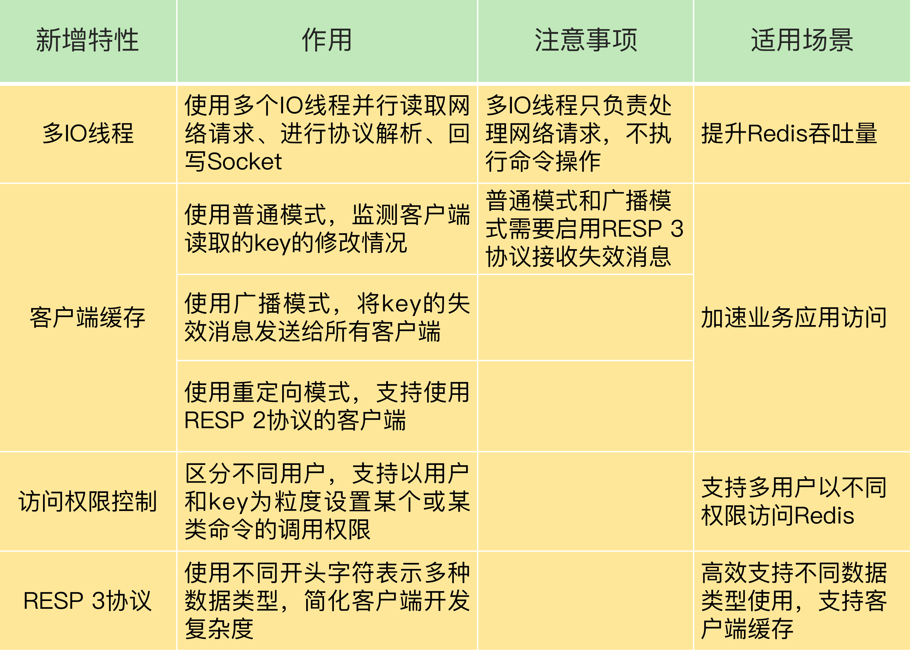

[toc]

### 39 | Redis 6.0的新特性：多线程、客户端缓存与安全

Redis 官方在2020年 5 月份正式推出了 6.0 版本，这个版本中有很多的新特性。所以，6.0 刚刚推出，就受到了业界的广泛关注。

所以，在课程的最后，我特意安排了这节课，想来和你聊聊 Redis 6.0 中的几个关键新特性，分别是面向网络处理的多 IO 线程、客户端缓存、细粒度的权限控制，以及 RESP 3 协议的使用。

其中，面向网络处理的多 IO 线程可以提高网络请求处理的速度，而客户端缓存可以让应用直接在客户端本地读取数据，这两个特性可以提升 Redis 的性能。除此之外，细粒度权限控制让 Redis 可以按照命令粒度控制不同用户的访问权限，加强了 Redis 的安全保护。RESP 3 协议则增强客户端的功能，可以让应用更加方便地使用 Redis 的不同数据类型。

只有详细掌握了这些特性的原理，你才能更好地判断是否使用 6.0 版本。如果你已经在使用 6.0 了，也可以看看怎么才能用得更好，少踩坑。

首先，我们来了解下 6.0 版本中新出的多线程特性。

#### 从单线程处理网络请求到多线程处理

**在 Redis 6.0 中，非常受关注的第一个新特性就是多线程**。这是因为，Redis 一直被大家熟知的就是它的单线程架构，虽然有些命令操作可以用后台线程或子进程执行（比如数据删除、快照生成、AOF 重写），但是，从网络 IO 处理到实际的读写命令处理，都是由单个线程完成的。

随着网络硬件的性能提升，Redis 的性能瓶颈有时会出现在网络 IO 的处理上，也就是说，**单个主线程处理网络请求的速度跟不上底层网络硬件的速度**。

为了应对这个问题，一般有两种方法。

第一种方法是，**用用户态网络协议栈（例如 DPDK）取代内核网络协议栈**，让网络请求的处理不用在内核里执行，直接在用户态完成处理就行。

对于高性能的 Redis 来说，避免频繁让内核进行网络请求处理，可以很好地提升请求处理效率。但是，这个方法要求在 Redis 的整体架构中，添加对用户态网络协议栈的支持，需要修改 Redis 源码中和网络相关的部分（例如修改所有的网络收发请求函数），这会**带来很多开发工作量**。而且新增代码还可能引入新 Bug，导致系统不稳定。所以，Redis 6.0 中并没有采用这个方法。

第二种方法就是采用**多个 IO 线程来处理网络请求**，提高网络请求处理的并行度。Redis 6.0 就是采用的这种方法。

但是，Redis 的多 IO 线程只是用来处理网络请求的，对于读写命令，Redis 仍然使用单线程来处理。这是因为，Redis 处理请求时，网络处理经常是瓶颈，通过多个 IO 线程并行处理网络操作，可以提升实例的整体处理性能。而继续使用单线程执行命令操作，就不用为了保证 Lua 脚本、事务的原子性，额外开发多线程互斥机制了。这样一来，Redis 线程模型实现就简单了。

我们来看下，在 Redis 6.0 中，主线程和 IO 线程具体是怎么协作完成请求处理的。掌握了具体原理，你才能真正地会用多线程。为了方便你理解，我们可以把主线程和多 IO 线程的协作分成四个阶段。

**阶段一：服务端和客户端建立 Socket 连接，并分配处理线程**

首先，主线程负责接收建立连接请求。当有客户端请求和实例建立 Socket 连接时，主线程会创建和客户端的连接，并把 Socket 放入全局等待队列中。紧接着，主线程通过轮询方法把 Socket 连接分配给 IO 线程。

**阶段二：IO 线程读取并解析请求**

主线程一旦把 Socket 分配给 IO 线程，就会进入阻塞状态，等待 IO 线程完成客户端请求读取和解析。因为有多个 IO 线程在并行处理，所以，这个过程很快就可以完成。

**阶段三：主线程执行请求操作**

等到 IO 线程解析完请求，主线程还是会以单线程的方式执行这些命令操作。下面这张图显示了刚才介绍的这三个阶段，你可以看下，加深理解。


**阶段四：IO 线程回写 Socket 和主线程清空全局队列**

当主线程执行完请求操作后，会把需要返回的结果写入缓冲区，然后，主线程会阻塞等待 IO 线程把这些结果回写到 Socket 中，并返回给客户端。

和 IO 线程读取和解析请求一样，IO 线程回写 Socket 时，也是有多个线程在并发执行，所以回写 Socket 的速度也很快。等到 IO 线程回写 Socket 完毕，主线程会清空全局队列，等待客户端的后续请求。

我也画了一张图，展示了这个阶段主线程和 IO 线程的操作，你可以看下。


了解了 Redis 主线程和多线程的协作方式，我们该怎么启用多线程呢？在 Redis 6.0 中，多线程机制**默认是关闭**的，如果需要使用多线程功能，需要在 redis.conf 中完成两个设置。

**1. 设置 io-thread-do-reads 配置项为 yes，表示启用多线程。**

```c
io-threads-do-reads yes
```

**2.设置线程个数。**一般来说，**线程个数要小于 Redis 实例所在机器的 CPU 核个数**，例如，对于一个 8 核的机器来说，Redis 官方建议配置 6 个 IO 线程。

```c
io-threads  6
```

如果你在实际应用中，发现 Redis 实例的 CPU 开销不大，吞吐量却没有提升，可以考虑使用 Redis 6.0 的多线程机制，加速网络处理，进而提升实例的吞吐量。

#### 实现服务端协助的客户端缓存

和之前的版本相比，Redis 6.0 新增了一个重要的特性，就是实现了服务端协助的客户端缓存功能，也称为**跟踪（Tracking）功能**。有了这个功能，业务应用中的 Redis 客户端就可以把读取的数据缓存在业务应用本地了，应用就可以直接在本地快速读取数据了。

不过，当把数据缓存在客户端本地时，我们会面临一个问题：**如果数据被修改了或是失效了，如何通知客户端对缓存的数据做失效处理？**

6.0 实现的 Tracking 功能实现了两种模式，来解决这个问题。

**第一种模式是普通模式**。在这个模式下，实例会在服务端记录客户端读取过的 key，并监测 key 是否有修改。一旦 key 的值发生变化，服务端会给客户端发送 invalidate 消息，通知客户端缓存失效了。

在使用普通模式时，有一点你需要注意一下，服务端对于记录的 key 只会报告一次 invalidate 消息，也就是说，服务端在给客户端发送过一次 invalidate 消息后，如果 key 再被修改，此时，服务端就不会再次给客户端发送 invalidate 消息。

只有当客户端再次执行读命令时，服务端才会再次监测被读取的 key，并在 key 修改时发送 invalidate 消息。这样设计的考虑是节省有限的内存空间。毕竟，如果客户端不再访问这个 key 了，而服务端仍然记录 key 的修改情况，就会浪费内存资源。

我们可以通过执行下面的命令，打开或关闭普通模式下的 Tracking 功能。

```c
CLIENT TRACKING ON|OFF
```

**第二种模式是广播模式**。在这个模式下，服务端会给客户端广播所有 key 的失效情况，不过，这样做了之后，如果 key 被频繁修改，服务端会发送大量的失效广播消息，这就会消耗大量的网络带宽资源。

所以，在实际应用时，我们会让客户端注册希望跟踪的 key 的前缀，当带有注册前缀的 key 被修改时，服务端会把失效消息广播给所有注册的客户端。**和普通模式不同，在广播模式下，即使客户端还没有读取过 key，但只要它注册了要跟踪的 key，服务端都会把 key 失效消息通知给这个客户端。**

```c
CLIENT TRACKING ON BCAST PREFIX user
```

这种监测带有前缀的 key 的广播模式，和我们对 key 的命名规范非常匹配。我们在实际应用时，会给同一业务下的 key 设置相同的业务名前缀，所以，我们就可以非常方便地使用广播模式。

不过，刚才介绍的普通模式和广播模式，需要客户端使用 RESP 3 协议，RESP 3 协议是 6.0 新启用的通信协议，一会儿我会给你具体介绍。

对于使用 RESP 2 协议的客户端来说，就需要使用另一种模式，也就是重定向模式（redirect）。在重定向模式下，想要获得失效消息通知的客户端，就需要执行订阅命令 SUBSCRIBE，专门订阅用于发送失效消息的频道 _redis_:invalidate。同时，再使用另外一个客户端，执行 CLIENT TRACKING 命令，设置服务端将失效消息转发给使用 RESP 2 协议的客户端。

我再给你举个例子，带你了解下如何让使用 RESP 2 协议的客户端也能接受失效消息。假设客户端 B 想要获取失效消息，但是客户端 B 只支持 RESP 2 协议，客户端 A 支持 RESP 3 协议。我们可以分别在客户端 B 和 A 上执行 SUBSCRIBE 和 CLIENT TRACKING，如下所示：

```c
//客户端B执行，客户端B的ID号是303
SUBSCRIBE _redis_:invalidate

//客户端A执行
CLIENT TRACKING ON BCAST REDIRECT 303
```

这样设置以后，如果有键值对被修改了，客户端 B 就可以通过 _redis_:invalidate 频道，获得失效消息了。

好了，了解了 6.0 版本中的客户端缓存特性后，我们再来了解下第三个关键特性，也就是实例的访问权限控制列表功能（Access Control List，ACL），这个特性可以有效地提升 Redis 的使用安全性。

#### 从简单的基于密码访问到细粒度的权限控制

从简单的基于密码访问到细粒度的权限控制在 Redis 6.0 版本之前，要想实现实例的安全访问，只能通过设置密码来控制，例如，客户端连接实例前需要输入密码。

此外，对于一些高风险的命令（例如 KEYS、FLUSHDB、FLUSHALL 等），在 Redis 6.0 之前，我们也只能通过 rename-command 来重新命名这些命令，避免客户端直接调用。

Redis 6.0 提供了更加细粒度的访问权限控制，这主要有两方面的体现。

**首先，6.0 版本支持创建不同用户来使用 Redis**。在 6.0 版本前，所有客户端可以使用同一个密码进行登录使用，但是没有用户的概念，而在 6.0 中，我们可以使用 ACL SETUSER 命令创建用户。例如，我们可以执行下面的命令，创建并启用一个用户 normaluser，把它的密码设置为“abc”：

```c
ACL SETUSER normaluser on > abc
```

**另外，6.0 版本还支持以用户为粒度设置命令操作的访问权限**。我把具体操作列在了下表中，你可以看下，其中，加号（+）和减号（-）就分别表示给用户赋予或撤销命令的调用权限。


为了便于你理解，我给你举个例子。假设我们要设置用户 normaluser 只能调用 Hash 类型的命令操作，而不能调用 String 类型的命令操作，我们可以执行如下命令：

```c
ACL SETUSER normaluser +@hash -@string
```

除了设置某个命令或某类命令的访问控制权限，6.0 版本还支持以 key 为粒度设置访问权限。

具体的做法是使用波浪号“~”和 key 的前缀来表示控制访问的 key。例如，我们执行下面命令，就可以设置用户 normaluser 只能对以“user:”为前缀的 key 进行命令操作：

```c
ACL SETUSER normaluser ~user:* +@all
```

好了，到这里，你了解了，Redis 6.0 可以设置不同用户来访问实例，而且可以基于用户和 key 的粒度，设置某个用户对某些 key 允许或禁止执行的命令操作。

这样一来，我们在有多用户的 Redis 应用场景下，就可以非常方便和灵活地为不同用户设置不同级别的命令操作权限了，这对于提供安全的 Redis 访问非常有帮助。

#### 启用 RESP 3 协议

Redis 6.0 实现了 RESP 3 通信协议，而之前都是使用的 RESP 2。在 RESP 2 中，客户端和服务器端的通信内容都是以字节数组形式进行编码的，客户端需要根据操作的命令或是数据类型自行对传输的数据进行解码，增加了客户端开发复杂度。

而 RESP 3 直接支持多种数据类型的区分编码，包括空值、浮点数、布尔值、有序的字典集合、无序的集合等。

所谓区分编码，就是指直接通过不同的开头字符，区分不同的数据类型，这样一来，客户端就可以直接通过判断传递消息的开头字符，来实现数据转换操作了，提升了客户端的效率。除此之外，RESP 3 协议还可以支持客户端以普通模式和广播模式实现客户端缓存。

#### 小结

这节课，我向你介绍了 Redis 6.0 的新特性，我把这些新特性总结在了一张表里，你可以再回顾巩固下。



最后，我也再给你一个小建议：因为 Redis 6.0 是刚刚推出的，新的功能特性还需要在实际应用中进行部署和验证，所以，如果你想试用 Redis 6.0，可以尝试先在非核心业务上使用 Redis 6.0，一方面可以验证新特性带来的性能或功能优势，另一方面，也可以避免因为新特性不稳定而导致核心业务受到影响。


### 40 | Redis的下一步：基于NVM内存的实践

这几年呢，新型非易失存储（Non-Volatile Memory，NVM）器件发展得非常快。NVM 器件具有容量大、性能快、能持久化保存数据的特性，这些刚好就是 Redis 追求的目标。同时，NVM 器件像 DRAM 一样，可以让软件以字节粒度进行寻址访问，所以，在实际应用中，NVM 可以作为内存来使用，我们称为 NVM 内存。

你肯定会想到，Redis 作为内存键值数据库，如果能和 NVM 内存结合起来使用，就可以充分享受到这些特性。我认为，Redis 发展的下一步，就可以基于 NVM 内存来实现大容量实例，或者是实现快速持久化数据和恢复。这节课，我就带你了解下这个新趋势。

接下来，我们先来学习下 NVM 内存的特性，以及软件使用 NVM 内存的两种模式。在不同的使用模式下，软件能用到的 NVM 特性是不一样的，所以，掌握这部分知识，可以帮助我们更好地根据业务需求选择适合的模式。

#### NVM 内存的特性与使用模式

Redis 是基于 DRAM 内存的键值数据库，而跟传统的 DRAM 内存相比，NVM 有三个显著的特点。

首先，**NVM 内存最大的优势是可以直接持久化保存数据**。也就是说，数据保存在 NVM 内存上后，即使发生了宕机或是掉电，数据仍然存在 NVM 内存上。但如果数据是保存在 DRAM 上，那么，掉电后数据就会丢失。

其次，**NVM 内存的访问速度接近 DRAM 的速度**。我实际测试过 NVM 内存的访问速度，结果显示，它的读延迟大约是 200~300ns，而写延迟大约是 100ns。在读写带宽方面，单根 NVM 内存条的写带宽大约是 1~2GB/s，而读带宽约是 5~6GB/s。当软件系统把数据保存在 NVM 内存上时，系统仍然可以快速地存取数据。

最后，**NVM 内存的容量很大**。这是因为，NVM 器件的密度大，单个 NVM 的存储单元可以保存更多数据。例如，单根 NVM 内存条就能达到 128GB 的容量，最大可以达到 512GB，而单根 DRAM 内存条通常是 16GB 或 32GB。所以，我们可以很轻松地用 NVM 内存构建 TB 级别的内存。

总结来说，NVM 内存的特点可以用三句话概括：

- 能持久化保存数据；
- 读写速度和 DRAM 接近；
- 容量大。

现在，业界已经有了实际的 NVM 内存产品，就是 Intel 在 2019 年 4 月份时推出的 Optane AEP 内存条（简称 AEP 内存）。我们在应用 AEP 内存时，需要注意的是，AEP 内存给软件提供了两种使用模式，分别对应着使用了 NVM 的容量大和持久化保存数据两个特性，我们来学习下这两种模式。

**第一种是 Memory 模式。**

这种模式是把 NVM 内存作为大容量内存来使用的，也就是说，只使用 NVM 容量大和性能高的特性，没有启用数据持久化的功能。

例如，我们可以在一台服务器上安装 6 根 NVM 内存条，每根 512GB，这样我们就可以在单台服务器上获得 3TB 的内存容量了。

在 Memory 模式下，服务器上仍然需要配置 DRAM 内存，但是，DRAM 内存是被 CPU 用作 AEP 内存的缓存，DRAM 的空间对应用软件不可见。换句话说，**软件系统能使用到的内存空间，就是 AEP 内存条的空间容量**。

**第二种是 App Direct 模式。**

这种模式启用了 NVM 持久化数据的功能。在这种模式下，应用软件把数据写到 AEP 内存上时，数据就直接持久化保存下来了。所以，使用了 App Direct 模式的 AEP 内存，也叫做持久化内存（Persistent Memory，PM）。

现在呢，我们知道了 AEP 内存的两种使用模式，那 Redis 是怎么用的呢？我来给你具体解释一下。

#### 基于 NVM 内存的 Redis 实践

当 AEP 内存使用 Memory 模式时，应用软件就可以利用它的大容量特性来保存大量数据，Redis 也就可以给上层业务应用提供大容量的实例了。而且，在 Memory 模式下，Redis 可以像在 DRAM 内存上运行一样，直接在 AEP 内存上运行，不用修改代码。

不过，有个地方需要注意下：在 Memory 模式下，AEP 内存的访问延迟会比 DRAM 高一点。我刚刚提到过，NVM 的读延迟大约是 200~300ns，而写延迟大约是 100ns。所以，在 Memory 模式下运行 Redis 实例，实例读性能会有所降低，我们就需要在保存大量数据和读性能较慢两者之间做个取舍。

那么，当我们使用 App Direct 模式，把 AEP 内存用作 PM 时，Redis 又该如何利用 PM 快速持久化数据的特性呢？这就和 Redis 的数据可靠性保证需求和现有机制有关了，我们来具体分析下。

为了保证数据可靠性，Redis 设计了 RDB 和 AOF 两种机制，把数据持久化保存到硬盘上。但是，无论是 RDB 还是 AOF，都需要把数据或命令操作以文件的形式写到硬盘上。对于 RDB 来说，虽然 Redis 实例可以通过子进程生成 RDB 文件，但是，实例主线程 fork 子进程时，仍然会阻塞主线程。而且，RDB 文件的生成需要经过文件系统，文件本身会有一定的操作开销。

对于 AOF 日志来说，虽然 Redis 提供了 always、everysec 和 no 三个选项，其中，always 选项以 fsync 的方式落盘保存数据，虽然保证了数据的可靠性，但是面临性能损失的风险。everysec 选项避免了每个操作都要实时落盘，改为后台每秒定期落盘。在这种情况下，Redis 的写性能得到了改善，但是，应用会面临秒级数据丢失的风险。

此外，当我们使用 RDB 文件或 AOF 文件对 Redis 进行恢复时，需要把 RDB 文件加载到内存中，或者是回放 AOF 中的日志操作。这个恢复过程的效率受到 RDB 文件大小和 AOF 文件中的日志操作多少的影响。

所以，在前面的课程里，我也经常提醒你，不要让单个 Redis 实例过大，否则会导致 RDB 文件过大。在主从集群应用中，过大的 RDB 文件就会导致低效的主从同步。

我们先简单小结下现在 Redis 在涉及持久化操作时的问题：

- RDB 文件创建时的 fork 操作会阻塞主线程；
- AOF 文件记录日志时，需要在数据可靠性和写性能之间取得平衡；
- 使用 RDB 或 AOF 恢复数据时，恢复效率受 RDB 和 AOF 大小的限制。

但是，如果我们使用持久化内存，就可以充分利用 PM 快速持久化的特点，来避免 RDB 和 AOF 的操作。因为 PM 支持内存访问，而 Redis 的操作都是内存操作，那么，我们就可以把 Redis 直接运行在 PM 上。同时，数据本身就可以在 PM 上持久化保存了，我们就不再需要额外的 RDB 或 AOF 日志机制来保证数据可靠性了。

那么，当使用 PM 来支持 Redis 的持久化操作时，我们具体该如何实现呢？

我先介绍下 PM 的使用方法。

当服务器中部署了 PM 后，我们可以在操作系统的 /dev 目录下看到一个 PM 设备，如下所示：

```c
/dev/pmem0
```

然后，我们需要使用 ext4-dax 文件系统来格式化这个设备：

```c
mkfs.ext4 /dev/pmem0
```

接着，我们把这个格式化好的设备，挂载到服务器上的一个目录下：

```c
mount -o dax /dev/pmem0  /mnt/pmem0
```

此时，我们就可以在这个目录下创建文件了。创建好了以后，再把这些文件通过内存映射（mmap）的方式映射到 Redis 的进程空间。这样一来，我们就可以把 Redis 接收到的数据直接保存到映射的内存空间上了，而这块内存空间是由 PM 提供的。所以，数据写入这块空间时，就可以直接被持久化保存了。

而且，如果要修改或删除数据，PM 本身也支持以字节粒度进行数据访问，所以，Redis 可以直接在 PM 上修改或删除数据。

如果发生了实例故障，Redis 宕机了，因为数据本身已经持久化保存在 PM 上了，所以我们可以直接使用 PM 上的数据进行实例恢复，而不用再像现在的 Redis 那样，通过加载 RDB 文件或是重放 AOF 日志操作来恢复了，可以实现快速的故障恢复。

当然，因为 PM 的读写速度比 DRAM 慢，所以，**如果使用 PM 来运行 Redis，需要评估下 PM 提供的访问延迟和访问带宽，是否能满足业务层的需求。**

我给你举个例子，带你看下如何评估 PM 带宽对 Redis 业务的支撑。

我给你举个例子，带你看下如何评估 PM 带宽对 Redis 业务的支撑。

假设业务层需要支持 1 百万 QPS，平均每个请求的大小是 2KB，那么，就需要机器能支持 2GB/s 的带宽（1 百万请求操作每秒 * 2KB 每请求 = 2GB/s）。如果这些请求正好是写操作的话，那么，单根 PM 的写带宽可能不太够用了。

这个时候，我们就可以在一台服务器上使用多根 PM 内存条，来支撑高带宽的需求。当然，我们也可以使用切片集群，把数据分散保存到多个实例，分担访问压力。

好了，到这里，我们就掌握了用 PM 将 Redis 数据直接持久化保存在内存上的方法。现在，我们既可以在单个实例上使用大容量的 PM 保存更多的业务数据了，同时，也可以在实例故障后，直接使用 PM 上保存的数据进行故障恢复。

#### 小结

这节课我向你介绍了 NVM 的三大特点：性能高、容量大、数据可以持久化保存。软件系统可以像访问传统 DRAM 内存一样，访问 NVM 内存。目前，Intel 已经推出了 NVM 内存产品 Optane AEP。

这款 NVM 内存产品给软件提供了两种使用模式，分别是 Memory 模式和 App Direct 模式。在 Memory 模式时，Redis 可以利用 NVM 容量大的特点，实现大容量实例，保存更多数据。在使用 App Direct 模式时，Redis 可以直接在持久化内存上进行数据读写，在这种情况下，Redis 不用再使用 RDB 或 AOF 文件了，数据在机器掉电后也不会丢失。而且，实例可以直接使用持久化内存上的数据进行恢复，恢复速度特别快。

NVM 内存是近年来存储设备领域中一个非常大的变化，它既能持久化保存数据，还能像内存一样快速访问，这必然会给当前基于 DRAM 和硬盘的系统软件优化带来新的机遇。现在，很多互联网大厂已经开始使用 NVM 内存了，希望你能够关注这个重要趋势，为未来的发展做好准备。


### 41 |  第35～40讲课后思考题答案及常见问题答疑

今天是我们最后一节答疑课，我会带你一起分析一下第 35～40 讲的课后思考题。同时，我还会讲解两个典型问题，分别是原子操作使用问题，以及 Redis 和其他键值数据库的对比情况。

#### 典型问题

**1.假设 Codis 集群中保存的 80% 的键值对都是 Hash 类型，每个 Hash 集合的元素数量在 10 万~20 万个，每个集合元素的大小是 2KB。你觉得，迁移这样的 Hash 集合数据，会对 Codis 的性能造成影响吗？**

答案：其实影响不大。虽然一个 Hash 集合数据的总数据量有 200MB ~ 400MB（2KB * 0.1M ≈ 200MB 到 2KB * 0.2M  ≈ 400MB），但是 Codis 支持异步、分批迁移数据，所以，Codis 可以把集合中的元素分多个批次进行迁移，每批次迁移的数据量不大，所以，不会给源实例造成太大影响。

**2.假设一个商品的库存量是 800，我们使用一个包含了 4 个实例的切片集群来服务秒杀请求，我们让每个实例各自维护库存量 200，把客户端的秒杀请求分发到不同的实例上进行处理，你觉得这是一个好方法吗？**

答案：这个方法是不是能达到一个好的效果，主要取决于，客户端请求能不能均匀地分发到每个实例上。如果可以的话，那么，每个实例都可以帮着分担一部分压力，避免压垮单个实例。

在保存商品库存时，key 一般就是商品的 ID，所以，客户端在秒杀场景中查询同一个商品的库存时，会向集群请求相同的 key，集群就需要把客户端对同一个 key 的请求均匀地分发到多个实例上。

为了解决这个问题，客户端和实例间就需要有代理层来完成请求的转发。例如，在 Codis 中，codis proxy 负责转发请求，那么，如果我们让 codis proxy 收到请求后，按轮询的方式把请求分发到不同实例上（可以对 Codis 进行修改，增加转发规则），就可以利用多实例来分担请求压力了。

如果没有代理层的话，客户端会根据 key 和 Slot 的映射关系，以及 Slot 和实例的分配关系，直接把请求发给保存 key 的唯一实例了。在这种情况下，请求压力就无法由多个实例进行分担了。题目中描述的这个方法也就不能达到好的效果了。

**3.当有数据访问倾斜时，如果热点数据突然过期了，假设 Redis 中的数据是缓存，数据的最终值是保存在后端数据库中的，这样会发生什么问题吗?**

答案：在这种情况下，会发生缓存击穿的问题，也就是热点数据突然失效，导致大量访问请求被发送到数据库，给数据库带来巨大压力。

我们可以采用第 26 讲中介绍的方法，不给热点数据设置过期时间，这样可以避免过期带来的击穿问题。

除此之外，我们最好在数据库的接入层增加流控机制，一旦监测到有大流量请求访问数据库，立刻开启限流，这样做也是为了避免数据库被大流量压力压垮。因为数据库一旦宕机，就会对整个业务应用带来严重影响。所以，我们宁可在请求接入数据库时，就直接拒接请求访问。

**4. 如果我们采用跟 Codis 保存 Slot 分配信息相类似的方法，把集群实例状态信息和 Slot 分配信息保存在第三方的存储系统上（例如 Zookeeper），这种方法会对集群规模产生什么影响吗？**

答案：假设我们将 Zookeeper 作为第三方存储系统，保存集群实例状态信息和 Slot 分配信息，那么，实例只需要和 Zookeeper 通信交互信息，实例之间就不需要发送大量的心跳消息来同步集群状态了。这种做法可以减少实例之间用于心跳的网络通信量，有助于实现大规模集群。而且，网络带宽可以集中用在服务客户端请求上。

不过，在这种情况下，实例获取或更新集群状态信息时，都需要和 Zookeeper 交互，Zookeeper 的网络通信带宽需求会增加。所以，采用这种方法的时候，需要给 Zookeeper 保证一定的网络带宽，避免 Zookeeper 受限于带宽而无法和实例快速通信。

**5.你觉得，Redis 6.0 的哪个或哪些新特性会对你有帮助呢？**

答案：这个要根据你们的具体需求来定。从提升性能的角度上来说，Redis 6.0 中的多 IO 线程特性可以缓解 Redis 的网络请求处理压力。通过多线程增加处理网络请求的能力，可以进一步提升实例的整体性能。业界已经有人评测过，跟 6.0 之前的单线程 Redis 相比，6.0 的多线程性能的确有提升。所以，这个特性对业务应用会有比较大的帮助。

另外，基于用户的命令粒度 ACL 控制机制也非常有用。当 Redis 以云化的方式对外提供服务时，就会面临多租户（比如多用户或多个微服务）的应用场景。有了 ACL 新特性，我们就可以安全地支持多租户共享访问 Redis 服务了。

**6.你觉得，有了持久化内存后，还需要 Redis 主从集群吗？**

答案：持久化内存虽然可以快速恢复数据，但是，除了提供主从故障切换以外，主从集群还可以实现读写分离。所以，我们可以通过增加从实例，让多个从实例共同分担大量的读请求，这样可以提升 Redis 的读性能。而提升读性能并不是持久化内存能提供的，所以，如果业务层对读性能有高要求时，我们还是需要主从集群的。

#### 常见问题

接下来，我结合最近收到的一些问题，来和你聊一聊，在进行原子操作开发时，局部变量和全局共享变量导致的差异问题，以及 Redis 和另外两种常见的键值数据库 Memcached、RocksDB 的优劣势对比。

##### 关于原子操作的使用疑问

在第 29 讲中，我在介绍原子操作时，提到了一个多线程限流的例子，借助它来解释如何使用原子操作。我们再来回顾下这个例子的代码：

```c
//获取ip对应的访问次数
current = GET(ip)
//如果超过访问次数超过20次，则报错
IF current != NULL AND current > 20 THEN
    ERROR "exceed 20 accesses per second"
ELSE
    //如果访问次数不足20次，增加一次访问计数
    value = INCR(ip)
    //如果是第一次访问，将键值对的过期时间设置为60s后
    IF value == 1 THEN
        EXPIRE(ip,60)
    END
    //执行其他操作
    DO THINGS
END
```

在分析这个例子的时候，我提到：“第一个线程执行了 INCR(ip) 操作后，第二个线程紧接着也执行了 INCR(ip)，此时，ip 对应的访问次数就被增加到了 2，我们就不能再对这个 ip 设置过期时间了。”

有同学认为，value 是线程中的局部变量，所以两个线程在执行时，每个线程会各自判断 value 是否等于 1。判断完 value 值后，就可以设置 ip 的过期时间了。因为 Redis 本身执行 INCR 可以保证原子性，所以，客户端线程使用局部变量获取 ip 次数并进行判断时，是可以实现原子性保证的。

我再进一步解释下这个例子中使用 Lua 脚本保证原子性的原因。

在这个例子中，value 其实是一个在多线程之间共享的全局变量，所以，多线程在访问这个变量时，就可能会出现一种情况：一个线程执行了 INCR(ip) 后，第二个线程也执行了 INCR(ip)，等到第一个线程再继续执行时，就会发生 ip 对应的访问次数变成 2 的情况。而设置过期时间的条件是 ip 访问次数等于 1，这就无法设置过期时间了。在这种情况下，我们就需要用 Lua 脚本保证计数增加和计数判断操作的原子性。

##### Redis 和 Memcached、RocksDB 的对比

Memcached 和 RocksDB 分别是典型的内存键值数据库和硬盘键值数据库，应用得也非常广泛。和 Redis 相比，它们有什么优势和不足呢？是否可以替代 Redis 呢？我们来聊一聊这个问题。

###### Redis 和 Memcached 的比较

和 Redis 相似，Memcached 也经常被当做缓存来使用。不过，**Memcached 有一个明显的优势**，就是它的**集群规模可以很大**。Memcached 集群并不是像 Redis Cluster 或 Codis 那样，使用 Slot 映射来分配数据和实例的对应保存关系，而是使用一致性哈希算法把数据分散保存到多个实例上，而一致性哈希的优势就是可以支持大规模的集群。所以，如果我们需要部署大规模缓存集群，Memcached 会是一个不错的选择。

不过，在使用 Memcached 时，有个地方需要注意，**Memcached 支持的数据类型比 Redis 少很多**。Memcached **只支持 String 类型的键值对**，而 Redis 可以支持包括 String 在内的多种数据类型，当业务应用有丰富的数据类型要保存的话，使用 Memcached 作为替换方案的优势就没有了。

如果你既需要保存多种数据类型，又希望有一定的集群规模保存大量数据，那么，Redis 仍然是一个不错的方案。

我把 Redis 和 Memcached 的对比情况总结在了一张表里，你可以看下。


###### Redis 和 RocksDB 的比较

和 Redis 不同，**RocksDB 可以把数据直接保存到硬盘上**。这样一来，单个 RocksDB 可以保存的数据量要比 Redis 多很多，而且数据都能持久化保存下来。

除此之外，RocksDB 还能支持表结构（即列族结构），而 Redis 的基本数据模型就是键值对。所以，如果你需要一个大容量的持久化键值数据库，并且能按照一定表结构保存数据，RocksDB 是一个不错的替代方案。

不过，RocksDB 毕竟是要把数据写入底层硬盘进行保存的，而且在进行数据查询时，如果 RocksDB 要读取的数据没有在内存中缓存，那么，RocksDB 就需要到硬盘上的文件中进行查找，这会拖慢 RocksDB 的读写延迟，降低带宽。

在性能方面，RocksDB 是比不上 Redis 的。而且，RocksDB 只是一个动态链接库，并没有像 Redis 那样提供了客户端 - 服务器端访问模式，以及主从集群和切片集群的功能。所以，我们在使用 RocksDB 替代 Redis 时，需要结合业务需求重点考虑替换的可行性。

我把 Redis 和 RocksDB 的对比情况总结了下，如下表所示：


#### 总结

集群是实际业务应用中很重要的一个需求，在课程的最后，我还想再给你提一个小建议。集群部署和运维涉及的工作量非常大，所以，我们一定要重视集群方案的选择。

**集群的可扩展性是我们评估集群方案的一个重要维度**，你一定要关注，集群中元数据是用 Slot 映射表，还是一致性哈希维护的。如果是 Slot 映射表，那么，是用中心化的第三方存储系统来保存，还是由各个实例来扩散保存，这也是需要考虑清楚的。Redis Cluster、Codis 和 Memcached 采用的方式各不相同。

- Redis Cluster：使用 Slot 映射表并由实例扩散保存。
- Codis：使用 Slot 映射表并由第三方存储系统保存。
- Memcached：使用一致性哈希。

从可扩展性来看，Memcached 优于 Codis，Codis 优于 Redis Cluster。所以，如果实际业务需要大规模集群，建议你优先选择 Codis 或者是基于一致性哈希的 Redis 切片集群方案。