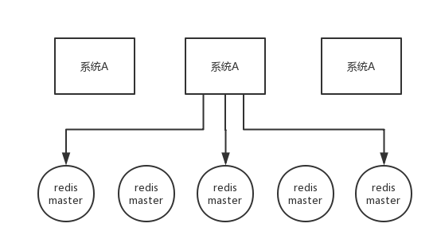

[TOC]

### 一、基础

#### 系统性能评价

##### 1. 性能指标

###### (1) 响应时间

指某个请求从**发出到接收到响应**消耗的时间。在对响应时间进行测试时，通常采用重复请求的方式，然后计算平均响应时间。

###### (2) 吞吐量

指系统在**单位时间**内可以处理的**请求数量**，通常使用**每秒的请求数**来衡量。

###### (3) 并发用户数

指系统能**同时处理的并发用户请求**数量。在没有并发存在的系统中，请求被**顺序执行**，此时**响应时间为吞吐量的倒数**。例如系统支持的吞吐量为 100 req/s，那么平均响应时间应该为 0.01s。

目前的大型系统都支持多线程来处理并发请求，多线程能够提高吞吐量以及缩短响应时间，主要有两个原因：

- 多 CPU
- IO 等待时间

使用 **IO 多路复用**等方式，系统在等待一个 IO 操作完成的这段时间内不需要被阻塞，可以去处理其它请求。通过将这个等待时间利用起来，使得 **CPU 利用率**大大提高。并发用户数不是越高越好，因为如果并发用户数太高，系统来不及处理这么多的请求，会使得过多的请求需要等待，那么响应时间就会大大提高。

##### 2. 性能优化

###### (1) 集群

将多台服务器组成**集群**，使用**负载均衡**将请求转发到集群中，避免单一服务器的负载压力过大导致性能降低。

###### (2) 缓存

**缓存**能够提高性能的原因如下：

- 缓存数据通常位于**内存等介质**中，这种介质对于**读操作**特别快；
- 缓存数据可以位于**靠近用户的地理位置**上；
- 可以将计算结果进行缓存，从而**避免重复计算**。

###### (3) 异步

某些流程可以将操作转换为消息，将消息发送到**消息队列**之后立即返回，之后这个操作会被**异步处理**。

#### 系统特性

##### 1. 伸缩性

指不断向集群中**添加服务器**来缓解不断上升的用户**并发访问压力和不断增长的数据存储需求**。

###### (1) 伸缩性与性能

如果系统存在**性能问题**，那么单个用户的请求总是很慢的；如果系统存在**伸缩性问题**，那么**单个**用户的**请求可能会很快**，但是在**并发数很高**的情况下系统会**很慢**。

###### (2) 实现伸缩性

应用服务器只要**不具有状态**，那么就可以很容易地通过负载均衡器向集群中添加新的服务器。

**关系型数据库**的伸缩性通过 **Sharding** 来实现，将**数据按一定的规则分布到不同的节点**上，从而解决单台存储服务器的存储空间限制。对于**非关系型数据库**，它们天生就是为海量数据而诞生，对伸缩性的支持特别好。

##### 2. 扩展性

指的是添加**新功能**时对现有系统的其它应用无影响，这就要求不同应用具备**低耦合**的特点。

实现可扩展主要有两种方式：

- 使用**消息队列**进行解耦，应用之间通过消息传递进行通信；
- 使用**分布式服务**将业务和可复用的服务分离开来，业务使用分布式服务框架调用可复用的服务。新增的产品可以通过调用可复用的服务来实现业务逻辑，对其它产品没有影响。

##### 3. 可用性

###### (1) 冗余

保证**高可用**的主要手段是使用**冗余**，当某个服务器故障时就请求其它服务器。

**应用服务器**的冗余比较容易实现，只要**保证应用服务器不具有状态**，那么某个应用服务器故障时，负载均衡器将该应用服务器原先的用户请求转发到另一个应用服务器上，不会对用户有任何影响。

**存储服务器**的冗余需要使用**主从复制**来实现，当主服务器故障时，需要提升从服务器为主服务器，这个过程称为**切换**。

###### (2) 监控

对 CPU、内存、磁盘、网络等系统负载信息进行监控，当某个信息达到一定阈值时通知运维人员，从而在系统发生故障之前及时发现问题。

###### (3) 服务降级

**服务降级**是系统为了应对大量的请求，**主动关闭部分功能**，从而**保证核心功能**可用。

##### 4. 安全性

要求系统在应对各种攻击手段时能够有可靠的应对措施。


#### CAP理论

分布式系统不可能同时满足**一致性**（C：Consistency）、**可用性**（A：Availability）和**分区容忍性**（P：Partition Tolerance），最多只能同时满足**其中两项**。


##### 1. 一致性Consistency

**一致性**指的是**多个数据副本**是否能**保持一致**的特性，在一致性的条件下，系统在执行数据更新操作之后能够从一致性状态转移到另一个一致性状态。

对系统的一个数据**更新成功**之后，如果所有用户都能够**读取到最新的值**，该系统就被认为具有**强一致性**。

##### 2. 可用性Availability

**可用性**指分布式系统在面对**各种异常**时可以提供正常服务的能力，可以用系统可用时间占总时间的比值来衡量，4 个 9 的可用性表示系统 99.99% 的时间是可用的。

在可用性条件下，要求系统提供的**服务一直处于可用的状态**，对于用户的每一个操作请求总是能够在有限的时间内返回结果。

##### 3. 分区容忍性Partion Tolerance

**网络分区**指分布式系统中的节点被**划分为多个区域**，每个区域**内部可以通信**，但是区域之间无法通信。

在分区容忍性条件下，分布式系统在**遇到任何网络分区故障**的时候，**仍然需要能对外提供一致性和可用性的服务**，除非是整个网络环境都发生了故障。

##### 4. 权衡

在分布式系统中，分区容忍性**必不可少**，因为需要总是假设网络是不可靠的。因此，CAP 理论实际上是要在**可用性和一致性**之间做权衡。

**当发生网络分区（P）的时候，如果要继续服务，那么强一致性和可用性只能 2 选 1。也就是说当网络分区之后 P 是前提，决定了 P 之后才有 C 和 A 的选择。也就是说分区容错性（Partition tolerance）是必须要实现的。**

在多个节点之间进行数据同步时：

- 为了保证一致性（**CP**），不能访问未同步完成的节点，也就失去了部分可用性。
- 为了保证可用性（**AP**），允许读取所有节点的数据，但是数据可能不一致。


#### BASE理论

BASE 是**基本可用**（Basically Available）、**软状态**（Soft State）和**最终一致性**（Eventually Consistent）三个短语的缩写。

BASE 理论是对 CAP 中**一致性和可用性权衡**的结果，它的核心思想是：**即使无法做到强一致性，但每个应用都可以根据自身业务特点，采用适当的方式来使系统达到最终一致性**。

也就是牺牲数据的**一致性**来满足系统的**高可用性**，系统中一部分数据不可用或者不一致时，仍需要保持系统整体“主要可用”。

##### 1. 基本可用

指分布式系统在出现故障的时候，保证**核心可用**，允许**损失部分可用性**。

例如，电商在做促销时，为了保证**购物系统的稳定性**，部分消费者可能会被引导到一个**降级的页面**。

##### 2. 软状态

**软状态**指允许系统中的数据存在**中间状态**，并认为该中间状态**不会影响系统整体可用性**，即允许系统不同节点的**数据副本之间进行同步的过程存在一定时延**。

##### 3. 最终一致性

**最终一致性**强调的是系统中所有的数据副本，在经过一段时间的同步后，**最终能达到一致的状态**。

**ACID** 要求**强一致性**，通常运用在**传统的数据库系统**上。而 **BASE** 要求最终一致性，通过牺牲强一致性来达到可用性，通常运用在**大型分布式系统**中。

在实际的分布式场景中，不同业务单元和组件对一致性的要求是不同的，因此 ACID 和 BASE 往往会**结合在一起使用**。

##### 4. 应用

针对**数据库**领域，BASE 思想的主要实现是对**业务数据进行拆分**，让不同的数据分布在不同的机器上，以提升系统的可用性，当前主要有以下两种做法：

- 按**功能划分**数据库。
- **分片**（如开源的 Mycat、Amoeba 等）。

由于拆分后会涉及**分布式事务**问题，所以 eBay 在该 BASE 论文中提到了如何用最终一致性的思路来实现高性能的分布式事务。


#### 负载均衡

集群中的应用服务器（节点）通常被设计成无状态，用户可以请求任何一个节点。

负载均衡器会根据集群中每个节点的负载情况，将用户请求转发到合适的节点上。

负载均衡器可以用来实现高可用以及伸缩性：

- 高可用：当某个节点故障时，负载均衡器会将用户请求转发到另外的节点上，从而保证所有服务持续可用；
- 伸缩性：根据系统整体负载情况，可以很容易地添加或移除节点。

负载均衡器运行过程包含两个部分：

1. 根据负载均衡算法得到转发的节点；
2. 进行转发。

##### 1. 负载均衡算法

###### (1) 轮询算法

**轮询算法把每个请求轮流发送到每个服务器上**。

下图中，一共有 6 个客户端产生了 6 个请求，这 6 个请求按 (1, 2, 3, 4, 5, 6) 的顺序发送。(1, 3, 5) 的请求会被发送到服务器 1，(2, 4, 6) 的请求会被发送到服务器 2。


该算法比较适合每个服务器的**性能差不多**的场景，如果有性能存在差异的情况下，那么性能较差的服务器可能无法承担过大的负载（下图的 Server 2）。


###### (2) 加权轮询算法

加权轮询是在轮询的基础上，根据服务器的性能差异，为**服务器赋予一定的权值**，性能高的服务器分配更高的权值。

例如下图中，服务器 1 被赋予的权值为 5，服务器 2 被赋予的权值为 1，那么 (1, 2, 3, 4, 5) 请求会被发送到服务器 1，(6) 请求会被发送到服务器 2。


###### (3) 最少连接算法

由于每个请求的连接时间不一样，使用轮询或者加权轮询算法的话，可能会让一台服务器当前连接数过大，而另一台服务器的连接过小，造成**负载不均衡**。

例如下图中，(1, 3, 5) 请求会被发送到服务器 1，但是 (1, 3) 很快就断开连接，此时只有 (5) 请求连接服务器 1；(2, 4, 6) 请求被发送到服务器 2，只有 (2) 的连接断开，此时 (6, 4) 请求连接服务器 2。该系统继续运行时，服务器 2 会承担过大的负载。


**最少连接算法就是将请求发送给当前最少连接数的服务器上**。

例如下图中，服务器 1 当前连接数最小，那么新到来的请求 6 就会被发送到服务器 1 上。


###### (4) 加权最少连接算法

在最少连接的基础上，根据服务器的性能为每台服务器分配**权重**，再根据权重计算出每台服务器能处理的连接数。

###### (5) 随机算法

把请求**随机发送到服务器**上。和轮询算法类似，该算法比较适合服务器**性能差不多**的场景。


###### (6) 源地址哈希算法

源地址哈希通过对**客户端 IP 计算哈希值**之后，再对**服务器数量取模**得到目标服务器的序号。

可以保证同一 IP 的客户端的请求会转发到同一台服务器上，用来实现会话**粘滞（Sticky Session）**。


##### 2. 转发实现

###### (1) HTTP重定向

HTTP 重定向负载均衡服务器使用某种负载均衡算法计算得到服务器的 IP 地址之后，将该地址写入 **HTTP 重定向报文**中，状态码为 **302**。客户端收到重定向报文之后，需要重新向服务器发起请求。

**缺点**：需要两次请求，因此访问延迟比较高；HTTP 负载均衡器处理能力有限，会限制集群的规模。该负载均衡转发的缺点比较明显，实际场景中**很少使用它**。


###### (2) DNS域名解析

在 **DNS 解析域名的同时使用负载均衡算法计算服务器 IP 地址**。

**优点**：DNS 能够根据地理位置进行域名解析，返回离用户最近的服务器 IP 地址。

**缺点**：由于 DNS 具有多级结构，每一级的域名记录都可能被缓存，当下线一台服务器需要修改 DNS 记录时，需要过很长一段时间才能生效。

大型网站基本使用了 DNS 做为**第一级负载均衡**手段，然后在内部使用其它方式做第二级负载均衡。也就是说，域名解析的结果为内部的负载均衡服务器 IP 地址。


###### (3) 反向代理服务器

**反向代理服务器**位于源服务器**前面**，用户的请求需要**先经过反向代理服务器**才能到达源服务器。反向代理可以用来**进行缓存、日志记录**等，同时也可以用来做为**负载均衡服务器**。

在这种负载均衡转发方式下，客户端不直接请求源服务器，因此源服务器不需要外部 IP 地址，而反向代理需要配置内部和外部两套 IP 地址。

**优点**：与其它功能集成在一起，部署简单。

**缺点**：**所有请求和响应**都需要经过反向代理服务器，它可能会成为性能瓶颈。

###### (4) 网络层

在操作系统内核进程获取网络数据包，根据负载均衡算法计算源服务器的 IP 地址，并修改请求数据包的目的 IP 地址，最后进行转发。

源服务器返回的响应也需要经过负载均衡服务器，通常是让负载均衡服务器同时作为集群的网关服务器来实现。

**优点**：在内核进程中进行处理，性能比较高。

**缺点**：和反向代理一样，所有的请求和响应都经过负载均衡服务器，会成为性能瓶颈。

###### (5) 链路层

在链路层根据**负载均衡算法**计算源服务器的 **MAC** 地址，并修改请求数据包的目的 MAC 地址，并进行转发。

通过配置源服务器的虚拟 IP 地址和负载均衡服务器的 IP 地址一致，从而不需要修改 IP 地址就可以进行转发。也正因为 IP 地址一样，所以源服务器的响应不需要转发回负载均衡服务器，可以直接转发给客户端，避免了负载均衡服务器的成为瓶颈。

这是一种三角传输模式，被称为**直接路由**。对于提供下载和视频服务的网站来说，直接路由避免了大量的网络传输数据经过负载均衡服务器。

这是目前大型网站使用最广负载均衡转发方式，在 Linux 平台可以使用的负载均衡服务器为 LVS（Linux Virtual Server）。

参考：

- [Comparing Load Balancing Algorithms](http://www.jscape.com/blog/load-balancing-algorithms)
- [Redirection and Load Balancing](http://slideplayer.com/slide/6599069/#)


####  分布式锁

##### 1. 概述

在**单机**场景下，可以使用语言的**内置锁**来实现进程同步。但是在**分布式场景**下，需要同步的进程可能位于不同的节点上，那么就需要使用**分布式锁**。引入分布式锁来解决**分布式应用之间访问共享资源的并发问题**。**锁的本质**：**同一时间只允许一个用户操作**。

**阻塞锁**通常使用**互斥量**来实现：

- 互斥量为 0 表示有其它进程在使用锁，此时处于锁定状态。
- 互斥量为 1 表示未锁定状态。

1 和 0 可以用一个**整型值**表示，也可以用**某个数据是否存在**表示。

##### 2. 数据库唯一索引

**获得锁**时向表中**插入一条记录**，**释放锁时删除这条记录**。**唯一索引**可以保证该记录只被插入一次，那么就可以用这个记录是否存在来**判断是否存于锁定状态**。

存在以下几个问题：

- 锁**没有失效时间**，解锁失败的话其它进程无法再获得该锁。
- 只能是**非阻塞锁**，插入失败直接就报错了，无法重试。
- **不可重入**，已经获得锁的进程也必须重新获取锁。

MySQL 本身有自带的悲观锁 **for update** 关键字，也可以自己实现悲观/乐观锁来达到目的。

##### 3. Redis的SETNX指令

###### (1) 概述

由于 Redis 是**单线程**，所以命令会以**串行**的方式执行，并且本身提供了像 SETNX(set if not exists) 这样的指令，本身具有互斥性。

使用 **SETNX**（set if not exist）指令插入一个键值对，如果 **Key 已经存在**，那么会返回 **False**，否则**插入成功并返回 True**。

SETNX 指令和数据库的**唯一索引类似**，保证了只存在一个 Key 的键值对，那么可以**用一个 Key 的键值对是否存在来判断是否存于锁定状态**。

EXPIRE 指令可以为一个键值对设置一个**过期时间**，从而避免了数据库唯一索引实现方式中**释放锁失败**的问题。

###### (2) SETNX源码分析

分布式锁类似于 "**占坑**"，而 **SETNX(SET if not exists)** 指令就是这样的一个操作，**只允许被一个客户端占有**。

来看看**源码(t_string.c/setGenericCommand)** ：

```c
// SET/ SETEX/ SETTEX/ SETNX 最底层实现
void setGenericCommand(client *c, int flags, robj *key, robj *val, robj *expire, int unit, robj *ok_reply, robj *abort_reply) {
    /* initialized to avoid any harmness warning */
    long long milliseconds = 0; 
    // 如果定义了key的过期时间则保存到上面定义的变量中
    // 如果过期时间设置错误则返回错误信息
    if (expire) {
        if (getLongLongFromObjectOrReply(c, expire, &milliseconds, NULL) != C_OK)
            return;
        if (milliseconds <= 0) {
            addReplyErrorFormat(c,"invalid expire time in %s",c->cmd->name);
            return;
        }
        if (unit == UNIT_SECONDS) milliseconds *= 1000;
    }

    // lookupKeyWrite 函数是为执行写操作而取出 key 的值对象
    // 这里的判断条件是：
    // 1.如果设置了 NX(不存在)，并且在数据库中找到了 key 值
    // 2.或者设置了 XX(存在)，并且在数据库中没有找到该 key
    // => 那么回复 abort_reply 给客户端
    if ((flags & OBJ_SET_NX && lookupKeyWrite(c->db,key) != NULL) ||
        (flags & OBJ_SET_XX && lookupKeyWrite(c->db,key) == NULL)) {
        addReply(c, abort_reply ? abort_reply : shared.null[c->resp]);
        return;
    }
    // 在当前的数据库中设置键为key值为value的数据
    genericSetKey(c->db,key,val,flags & OBJ_SET_KEEPTTL);
    // 服务器每修改一个key后都会修改dirty值
    server.dirty++;
    if (expire) setExpire(c,c->db,key,mstime()+milliseconds);
    notifyKeyspaceEvent(NOTIFY_STRING,"set",key,c->db->id);
    if (expire) notifyKeyspaceEvent(NOTIFY_GENERIC, "expire",key,c->db->id);
    addReply(c, ok_reply ? ok_reply : shared.ok);
}
```

就像上面介绍的那样，其实在**之前版本**的 Redis 中，由于 **SETNX** 和 **EXPIRE** 并不是 **原子指令**，所以在一起执行**会出现问题**。

也许你会想到使用 Redis 事务来解决，但在这里不行，因为 `EXPIRE` 命令**依赖**于 `SETNX` 的执行结果，而事务中没有 `if-else` 的分支逻辑，如果 `SETNX` 没有抢到锁，`EXPIRE` 就不应该执行。

为了解决这个疑难问题，Redis 开源社区涌现了许多分**布式锁的 library**，为了治理这个乱象，后来在 Redis 2.8 的版本中，**加入了 SET 指令的扩展参数，使得 SETNX 可以和 EXPIRE 指令一起执行了**：

```bash
> SET lock:test true ex 5 nx
OK
... do something critical ...
> del lock:test
```

只需要符合 **SET key value [EX seconds | PX milliseconds] [NX | XX] [KEEPTTL]** 这样的格式就好了。

另外，官方文档也在 SETNX 文档中提到了这样一种思路：**把 SETNX 对应 key 的 value 设置为 <current Unix time + lock timeout + 1>**，这样在其他客户端访问时就能够自己判断是否能够获取下一个 value 为上述格式的锁了。

###### (3) 代码实现

下面用 **Jedis** 来模拟实现以下，关键代码如下：

```java
private static final String LOCK_SUCCESS = "OK";
private static final Long RELEASE_SUCCESS = 1L;
private static final String SET_IF_NOT_EXIST = "NX";
private static final String SET_WITH_EXPIRE_TIME = "PX";

@Override
public String acquire() {
    try {
        // 获取锁的超时时间，超过这个时间则放弃获取锁
        long end = System.currentTimeMillis() + acquireTimeout;
        // 随机生成一个value
        String requireToken = UUID.randomUUID().toString();
        while (System.currentTimeMillis() < end) {
            String result = jedis
                .set(lockKey, requireToken, SET_IF_NOT_EXIST, SET_WITH_EXPIRE_TIME, expireTime);
            if (LOCK_SUCCESS.equals(result)) {
                return requireToken;
            }
            try {
                Thread.sleep(100);
            } catch (InterruptedException e) {
                Thread.currentThread().interrupt();
            }
        }
    } catch (Exception e) {
        log.error("acquire lock due to error", e);
    }

    return null;
}

@Override
public boolean release(String identify) {
    if (identify == null) {
        return false;
    }

    String script = "if redis.call('get', KEYS[1]) == ARGV[1] then return redis.call('del', KEYS[1]) else return 0 end";
    Object result = new Object();
    try {
        result = jedis.eval(script, Collections.singletonList(lockKey),
                            Collections.singletonList(identify));
        if (RELEASE_SUCCESS.equals(result)) {
            log.info("release lock success, requestToken:{}", identify);
            return true;
        }
    } catch (Exception e) {
        log.error("release lock due to error", e);
    } finally {
        if (jedis != null) {
            jedis.close();
        }
    }

    log.info("release lock failed, requestToken:{}, result:{}", identify, result);
    return false;
}
```

在 Redis 里使用 **SET key value [EX seconds] [PX milliseconds] NX** 创建一个 key，这样就算**加锁**。其中：

- **NX**：表示**只有 key 不存在**的时候才会设置**成功**，如果此时 Redis 中存在这个 key，那么设置失败，返回 nil。
- **EX seconds**：设置 **key 的过期时间**，精确到**秒级**。意思是 seconds 秒后**锁自动释放**，别人创建的时候如果发现已经有了就不能加锁了。
- **PX milliseconds**：同样是设置 key 的**过期时间**，精确到**毫秒级**。

比如执行以下命令：

```r
SET resource_name my_random_value PX 30000 NX
```

**释放锁就是删除 key** ，但是一般可以用 lua 脚本删除，判断 value 一样才删除：

``` lua
-- 删除锁的时候，找到key对应的value，跟自己传过去的value做比较，如果一样才删除
if redis.call("get",KEYS[1]) == ARGV[1] then
    return redis.call("del",KEYS[1])
else
    return 0
end
```

为啥要用 random_value **随机值**呢？因为如果某个客户端获取到了锁，但是阻塞了很长时间才执行完，比如超过了 30s，此时可能已经自动释放锁了，此时可能别的客户端已经获取到了这个锁，要是这个时候直接删除 key 的话会有问题，所以得用随机值加上面的 lua 脚本来释放锁。

但是这样是肯定不行的。因为如果是普通的 Redis 单实例，那就是**单点故障**。或者是 Redis 普通主从，那 Redis 主从异步复制，如果主节点挂了（key 就没有了），key 还没同步到从节点，此时从节点切换为主节点，别人就可以 set key，从而拿到锁。

###### (4) 问题1：锁超时

假设有两平行的服务 A B，其中 A 服务在 **获取锁之后** 由于未知神秘力量突然 **挂了**，那么 B 服务就永远无法获取到锁了：


所以需要额外设置一个**超时时间**，来保证服务的**可用性**。

但是另一个问题随即而来：**如果在加锁和释放锁之间的业务逻辑执行得太长，以至于超出了锁的超时限制**，也会出现问题。因为这时候第一个线程持有锁过期了，而临界区的逻辑还没有执行完，与此同时第二个线程就提前拥有了这把锁，导致临界区的代码不能得到严格的串行执行。

为了避免这个问题，**Redis 分布式锁==不要用于较长时间的任务==**。如果真的偶尔出现了问题，造成的数据小错乱可能就需要人工的干预。

有一个稍微安全一点的方案是 **将锁的 value 值设置为一个随机数**，释放锁时**先匹配随机数是否一致**，然后**再删除 key**，这是为了 **确保当前线程占有的锁不会被其他线程释放**，除非这个锁是因为过期了而被服务器自动释放的。

**但是匹配 value 和删除 key 在 Redis 中并不是一个原子性的操作**，也没有类似保证原子性的指令，所以可能需要使用像 Lua 这样的脚本来处理了，因为 **Lua 脚本可以 保证多个指令的原子性执行**。

> **延伸的讨论：GC可能引发的安全问题**

Martin Kleppmann 曾与 Redis 之父 Antirez 就 Redis 实现分布式锁的安全性问题进行过深入的讨论，其中有一个问题就涉及到 **GC**。在 GC 的时候会发生 **STW(Stop-The-World)**，这本身是为了保障垃圾回收器的正常执行，但可能会引发如下的问题：


服务 A 获取了锁并设置了超时时间，但是**服务 A 出现了 STW 且时间较长，导致了分布式锁进行了超时释放**，在这个期间服务 B 获取到了锁，待服务 A STW 结束之后又恢复了锁，这就导致了 **服务 A 和服务 B 同时获取到了锁**，这个时候分布式锁就不安全了。

不仅仅局限于 Redis，Zookeeper 和 MySQL 有同样的问题。

###### (5) 问题2：单点/多点问题

如果 Redis 采用**单机部署模式**，那就意味着当 Redis 故障了，就会导致整个服务不可用。

而如果采用**主从模式**部署，想象一个这样的场景：服务 A 申请到**一把锁**之后，如果作为主机的 Redis 宕机了，那么服务 B 在申请锁的时候就会从**从机那里获取到这把锁**，为了解决这个问题，Redis 作者提出了一种 **RedLock 红锁** 的算法 (Redission 同 Jedis)：

```java
// 三个 Redis 集群
RLock lock1 = redissionInstance1.getLock("lock1");
RLock lock2 = redissionInstance2.getLock("lock2");
RLock lock3 = redissionInstance3.getLock("lock3");

RedissionRedLock lock = new RedissionLock(lock1, lock2, lock2);
lock.lock();
// do something....
lock.unlock();
```

##### 4. Redis的RedLock算法

###### (1) 概述

Redis 官方站这篇文章提出了一种权威的基于 Redis 实现分布式锁的方式名叫 ***Redlock***，此种方式比原先的单节点的方法更安全。是 Redis 官方支持的**分布式锁算法**。

它可以保证以下特性：

- **安全特性**：互斥访问，即永远只有一个 client 能拿到锁。
- **避免死锁**：最终 client 都可能拿到锁，不会出现死锁的情况，即使原本锁住某资源的 client crash 了或者出现了网络分区。
- **容错性**：只要大部分 Redis **节点存活**就可以正常提供服务。

###### (2) 算法流程

算法很易懂，起 **5 个 master 节点**，分布在不同的机房尽量保证可用性。为了**获得锁**，client 会进行如下操作：

1. 获取当前**时间戳**，单位是毫秒。
2. 跟上面类似，轮流尝试在**每个 master 节点上创建锁**，过期时间较短，一般就几十毫秒。
3. 尝试在**大多数节点**上建立一个锁，比如 5 个节点就要求是 3 个节点 `n / 2 + 1` 。
4. 客户端计算**建立好锁的时间**，如果**建立锁的时间小于超时时间，就算建立成功**了。
5. 要是锁建立失败了，那么就**依次删除之前建立过的锁**。
6. 只要别人建立了一把分布式锁，就得**不断轮询去尝试获取锁**。



使用了**多个 Redis 实例**来实现分布式锁，这是为了保证在发生 Redis **单点故障**时仍然可用。

###### (3) 失败重试

如果一个客户端**申请锁失败**了，那么它需要稍等一会再重试，避免多个客户端同时申请锁的情况，最好的情况是一个 client 需要**几乎同时向 5 个 master 发起锁申请**。另外就是如果 client 申请锁失败了它需要尽快在它曾经申请到锁的 master 上执行 **unlock 操作**，便于其他 client 获得这把锁，避免这些锁过期造成的时间浪费，当然如果这时候网络分区使得 client 无法联系上这些 master，那么这种浪费就是不得不付出的代价了。

###### (4) 释放锁

放锁操作很简单，就是依次释放所有节点上的锁就行了。

###### (5) 崩溃恢复和fsync

如果节点没有持久化机制，client 从 5 个 master 中的 3 个处获得了锁，然后其中一个重启了，这是注意 **整个环境中又出现了 3 个 master 可供另一个 client 申请同一把锁！** 违反了互斥性。如果开启了 AOF 持久化那么情况会稍微好转一些，因为 Redis 的过期机制是语义层面实现的，所以在 server 挂了的时候时间依旧在流逝，重启之后锁状态不会受到污染。但是考虑断电之后呢，AOF 部分命令没来得及刷回磁盘直接丢失了，除非配置刷盘策略为 fsnyc = **always**，但这会降低性能。

解决这个问题的方法是，当一个**节点重启**之后，规定**在 max TTL 期间它是不可用**的，这样它就不会干扰原本已经申请到的锁，等到它 crash 前的那部分锁都过期了，环境不存在历史锁了，那么再把这个节点加进来正常工作。

###### (6) 性能

Martin 认为 Redlock 实在**不是**一个好的选择，对于需求性能的分布式锁应用**它太重了且成本高**；对于需求正确性的应用来说它不够安全。因为它对高危的时钟或者说其他上述列举的情况进行了不可靠的假设，如果**应用只需要高性能的分布式锁不要求多高的正确性，那么单节点 Redis 够了**；如果应用想要保住**正确性**，那么不建议 Redlock，建议使用一个**合适的一致性协调系统**，例如 Zookeeper，且保证存在 fencing token。

##### 5. Zookeeper的有序节点

###### (1) Zookeeper抽象模型

Zookeeper 提供了一种**树形结构**的命名空间，/app1/p_1 节点的父节点为 /app1。


###### (2) 节点类型

- **永久节点**：不会因为会话结束或者超时而消失。
- **临时节点**：如果会话结束或者超时就会消失。
- **有序节点**：会在节点名的后面加一个**数字后缀**，并且是**有序**的，例如生成的有序节点为 /lock/node-0000000000，它的下一个有序节点则为 /lock/node-0000000001，以此类推。

###### (3) 监听器

为一个**节点注册监听器**，在节点**状态发生改变**时，会给客户端**发送消息**。

###### (4) 分布式锁实现

- 创建一个**锁目录 /lock**。
- 当一个客户端需要获取锁时，在 /lock 下**创建临时的且有序的子节点**。
- 客户端获取 /lock 下的**子节点列表**，判断自己创建的**子节点是否为当前子节点列表中序号最小的子节点**，如果是则认为**获得锁**；否则**监听自己的前一个子节点**，获得子节点的变更通知后重复此步骤直至获得锁。
- 执行业务代码，完成后，**删除对应的子节点**。

###### (5) 会话超时

如果一个已经获得**锁的会话超时**了，因为创建的是临时节点，所以该会话对应的临时节点会被删除，其它会话就可以获得锁了。可以看到，Zookeeper 分布式锁**不会出现数据库的唯一索引实现的分布式锁释放锁失败问题**。

###### (6) 羊群效应

一个节点**未获得锁**，只需要**监听自己的前一个子节点**，这是因为如果监听所有的子节点，那么任意一个子节点状态改变，其它所有子节点**都会收到通知**（羊群效应），而我们只希望它的后一个子节点收到通知。

###### (7) 代码实现demo

zk 分布式锁，其实可以做的比较简单，就是**某个节点尝试创建临时 znode**，此时创建成功了就**获取了这个锁**；这个时候别的客户端来创建锁会失败，只能**注册个监听器**监听这个锁。释放锁就是删除这个 znode，一旦释放掉就会通知客户端，然后有一个等待着的客户端就可以再次重新加锁。

``` java
public class ZooKeeperSession {

    private static CountDownLatch connectedSemaphore = new CountDownLatch(1);

    private ZooKeeper zookeeper;
    private CountDownLatch latch;

    public ZooKeeperSession() {
        try {
            this.zookeeper = new ZooKeeper("192.168.31.187:2181, 						192.168.31.19:2181, 192.168.31.227:2181", 
                                           50000, new ZooKeeperWatcher());
            try {
                connectedSemaphore.await();
            } catch (InterruptedException e) {
                e.printStackTrace();
            }
            System.out.println("ZooKeeper session established.");
        } catch (Exception e) {
            e.printStackTrace();
        }
    }

    // 获取分布式锁
    public Boolean acquireDistributedLock(Long productId) {
        String path = "/product-lock-" + productId;

        try {
            zookeeper.create(path, "".getBytes(), Ids.OPEN_ACL_UNSAFE, CreateMode.EPHEMERAL);
            return true;
        } catch (Exception e) {
            while (true) {
                try {
                    // 相当于是给node注册一个监听器，去看这个监听器是否存在
                    Stat stat = zk.exists(path, true);
                    if (stat != null) {
                        this.latch = new CountDownLatch(1);
                        this.latch.await(waitTime, TimeUnit.MILLISECONDS);
                        this.latch = null;
                    }
                    zookeeper.create(path, "".getBytes(), Ids.OPEN_ACL_UNSAFE, CreateMode.EPHEMERAL);
                    return true;
                } catch (Exception ee) {
                    continue;
                }
            }
        }
        return true;
    }

    // 释放掉一个分布式锁
    public void releaseDistributedLock(Long productId) {
        String path = "/product-lock-" + productId;
        try {
            zookeeper.delete(path, -1);
            System.out.println("release the lock for product[id=" + productId + "]");
        } catch (Exception e) {
            e.printStackTrace();
        }
    }

    // 建立zksession的watcher
    private class ZooKeeperWatcher implements Watcher {

        public void process(WatchedEvent event) {
            System.out.println("Receive watched event: " + event.getState());

            if (KeeperState.SyncConnected == event.getState()) {
                connectedSemaphore.countDown();
            }
            if (this.latch != null) {
                this.latch.countDown();
            }
        }
    }

    // 封装单例的静态内部类
    private static class Singleton {

        private static ZooKeeperSession instance;

        static {
            instance = new ZooKeeperSession();
        }

        public static ZooKeeperSession getInstance() {
            return instance;
        }
    }

    // 获取单例
    public static ZooKeeperSession getInstance() {
        return Singleton.getInstance();
    }

    // 初始化单例的便捷方法
    public static void init() {
        getInstance();
    }
}
```

也可以采用另一种方式，创建**临时顺序节点**：

如果有一把锁，被**多个人**给竞争，此时**多个人会排队**，第一个拿到**锁的人会执行**，然后释放锁；后面的每个人都会去监听**排在自己前面**的那个人**创建的 node 上**，一旦某个人释放了锁，排在自己后面的人就会**被 ZooKeeper 给通知**，一旦被通知了之后，就 ok 了，自己就获取到了锁，就可以执行代码了。

``` java
public class ZooKeeperDistributedLock implements Watcher {

    private ZooKeeper zk;
    private String locksRoot = "/locks";
    private String productId;
    private String waitNode;
    private String lockNode;
    private CountDownLatch latch;
    private CountDownLatch connectedLatch = new CountDownLatch(1);
    private int sessionTimeout = 30000;

    public ZooKeeperDistributedLock(String productId) {
        this.productId = productId;
        try {
            String address = "192.168.31.187:2181,
                192.168.31.19:2181,192.168.31.227:2181";
                zk = new ZooKeeper(address, sessionTimeout, this);
            connectedLatch.await();
        } catch (IOException e) {
            throw new LockException(e);
        } catch (KeeperException e) {
            throw new LockException(e);
        } catch (InterruptedException e) {
            throw new LockException(e);
        }
    }

    public void process(WatchedEvent event) {
        if (event.getState() == KeeperState.SyncConnected) {
            connectedLatch.countDown();
            return;
        }

        if (this.latch != null) {
            this.latch.countDown();
        }
    }

    public void acquireDistributedLock() {
        try {
            if (this.tryLock()) {
                return;
            } else {
                waitForLock(waitNode, sessionTimeout);
            }
        } catch (KeeperException e) {
            throw new LockException(e);
        } catch (InterruptedException e) {
            throw new LockException(e);
        }
    }

    public boolean tryLock() {
        try {
            // 传入进去的locksRoot + “/” + productId
            // 假设productId代表了一个商品id，比如说1
            // locksRoot = locks
            // /locks/10000000000，/locks/10000000001，/locks/10000000002
            lockNode = zk.create(locksRoot + "/" + productId, new byte[0], ZooDefs.Ids.OPEN_ACL_UNSAFE, CreateMode.EPHEMERAL_SEQUENTIAL);

            // 看看刚创建的节点是不是最小的节点
            // locks：10000000000，10000000001，10000000002
            List<String> locks = zk.getChildren(locksRoot, false);
            Collections.sort(locks);
            if(lockNode.equals(locksRoot+"/"+ locks.get(0))){
                // 如果是最小的节点,则表示取得锁
                return true;
            }
            // 如果不是最小的节点，找到比自己小1的节点
            int previousLockIndex = -1;
            for(int i = 0; i < locks.size(); i++) {
                if(lockNode.equals(locksRoot + “/” + locks.get(i))) {
                    previousLockIndex = i - 1;
                    break;
                }
            }
            this.waitNode = locks.get(previousLockIndex);
        } catch (KeeperException e) {
            throw new LockException(e);
        } catch (InterruptedException e) {
            throw new LockException(e);
        }
        return false;
    }

    private boolean waitForLock(String waitNode, long waitTime) throws InterruptedException, KeeperException {
        Stat stat = zk.exists(locksRoot + "/" + waitNode, true);
        if (stat != null) {
            this.latch = new CountDownLatch(1);
            this.latch.await(waitTime, TimeUnit.MILLISECONDS);
            this.latch = null;
        }
        return true;
    }

    public void unlock() {
        try {
            // 删除/locks/10000000000节点
            // 删除/locks/10000000001节点
            System.out.println("unlock " + lockNode);
            zk.delete(lockNode, -1);
            lockNode = null;
            zk.close();
        } catch (InterruptedException e) {
            e.printStackTrace();
        } catch (KeeperException e) {
            e.printStackTrace();
        }
    }

    public class LockException extends RuntimeException {
        private static final long serialVersionUID = 1L;

        public LockException(String e) {
            super(e);
        }

        public LockException(Exception e) {
            super(e);
        }
    }
}
```

##### 6. Redis分布式锁和zk分布式锁的对比

* Redis 分布式锁，其实**需要自己不断去尝试获取锁**，比较消耗性能。
* zk 分布式锁，**获取不到锁，注册个监听器即可**，不需要不断主动尝试获取锁，性能开销较小。
* 另外一点就是，如果是 Redis 获取锁的那个客户端 出现 bug 挂了，那么只能等待超时时间之后才能释放锁；而 zk 的话，因为创建的是临时 znode，只要客户端挂了，znode 就没了，此时就**自动释放锁**。Redis 分布式锁确实挺麻烦的，遍历上锁，计算时间等等，而 zk 的分布式锁语义清晰实现简单。

总体来说 zk 的分布式锁比 Redis 的分布式锁牢靠、而且模型简单易用。


#### 分布式ID

随着业务发展，数据量将越来越大，需要对数据进行分表，而分表后如果每个表中的数据都会按自己的节奏进行常见的自增，很有可能出现 ID 冲突。这时就需要一个单独的**机制来负责生成唯一 ID**，生成出来的ID也可以叫做**分布式ID**，或**全局ID**。下面来分析各个生成分布式 ID 的机制。


生成分布式 ID 的思想大致两种：

- **自增思想**：数据库自增 ID、数据库多主模式、号段模式、Redis等。
- **雪花算法思想**。

##### 1. UUID

不适合作为主键，因为太长了，并且无序不可读，查询效率低。比较适合用于生成唯一的名字的标示比如文件的名字。UUID 太长了、占用空间大，**作为主键性能太差**了；更重要的是，UUID 不具有有序性，会导致 B+ 树索引在写的时候有过多的随机写操作（连续的 ID 可以产生部分顺序写），还有，由于在写的时候不能产生有顺序的 append 操作，而需要进行 insert 操作，将会读取整个 B+ 树节点到内存，在插入这条记录后会将整个节点写回磁盘，这种操作在记录占用空间比较大的情况下，性能下降明显。

##### 2. 数据库自增ID

基于数据库的自增 ID 需要**单独使用一个数据库实例**，在这个实例中新建一个单独的表，表结构如下：

```sql
CREATE DATABASE `SEQID`;

CREATE TABLE SEQID.SEQUENCE_ID (
    id bigint(20) unsigned NOT NULL auto_increment, 
    stub char(10) NOT NULL default '',
    PRIMARY KEY (id),
    UNIQUE KEY stub (stub)
) ENGINE = MyISAM;
```

可以使用下面的语句**生成并获取到一个自增 ID**。

```sql
begin;
replace into SEQUENCE_ID (stub) VALUES ('anyword');
select last_insert_id();
commit;
```

stub 字段在这里并没有什么特殊的意义，只是为了方便的去插入数据，只有能插入数据才能产生自增 id。而对于插入用的是 replace，replace 会先看是否存在 stub 指定值一样的数据，如果存在则先 delete 再 insert，如果不存在则直接 insert。

这种生成分布式 ID 的机制，需要一个单独的 MySQL 实例，虽然可行，但是基于性能与可靠性来考虑的话都不够，**业务系统每次需要一个 ID 时，都需要请求数据库获取，性能低，并且如果此数据库实例下线了，那么将影响所有的业务系统。**

##### 3. 数据库多主模式

为了解决上述的**数据库可靠性问题**，可以使用数据库多主模式分布式 ID 生成方案。

如果两个数据库组成一个**主从模式**集群，正常情况下可以解决数据库**可靠性问题**，但是如果主库挂掉后，数据没有及时同步到从库，这个时候会出现 **ID 重复**的现象。可以使用**双主模式**集群，也就是两个 MySQL 实例都能**单独的生产自增 ID**，这样能够提高效率，但是如果不经过其他改造的话，这两个 MySQL 实例很可能会生成同样的 ID。需要单独给每个MySQL 实例**配置不同的起始值和自增步长**。

第一台 MySQL 实例配置：

```mysql
set @@auto_increment_offset = 1;     # 起始值
set @@auto_increment_increment = 2;  # 步长
```

第二台 MySQL 实例配置：

```mysql
set @@auto_increment_offset = 2;     # 起始值
set @@auto_increment_increment = 2;  # 步长
```

经过上面的配置后，这两个 MySQL 实例生成的 id 序列如下： 

- MySQL1：1，3，5，7，9....
- MySQL2：2，4，6，8，10...

对于这种生成分布式 ID 的方案，需要单独新增一个生成分布式 ID 应用，比如 DistributIdService，该应用提供**一个接口供业务应用获取 ID**，业务应用需要一个 ID 时，通过 **RPC 方式**请求 DistributIdService，DistributIdService 随机去上面的两个 MySQL 实例中去获取 ID。

实行这种方案后，就算其中某一台 MySQL 实例下线了，也不会影响 DistributIdService，DistributIdService 仍然可以利用另外一台 MySQL 来生成 ID。

但是这种方案的**扩展性不太好**，如果两台 MySQL 实例不够用，需要新增 MySQL 实例来提高性能时，这时就会比较麻烦。

为了解决上面的问题，以及能够进一步提高 DistributIdService 的性能，如果使用下面的生成分布式 ID 机制。

##### 4. 号段模式

可以使用号段的方式来获取自增 ID，号段可以理解成**批量获取**，比如 DistributIdService 从数据库**获取 ID 时**，如果能批量获取多个 ID 并**缓存在本地**的话，那样将大大提供业务应用获取 ID 的效率。

比如 DistributIdService 每次从数据库获取 ID 时，就获取一个**号段**，比如 (1,1000]，这个范围表示了 1000 个 ID，业务应用在请求 DistributIdServic e提供 ID 时，DistributIdService 只需要在本地**从 1 开始自增并返回即可**，而不需要每次都请求数据库，一直到本地自增到 1000 时，也就是**当前号段已经被用完**时，才去数据库重新获取下一号段。

所以需要对数据库表进行改动，如下：

```mysql
CREATE TABLE id_generator (
    id int(10) NOT NULL,
    current_max_id bigint(20) NOT NULL COMMENT '当前最大id',
    increment_step int(10) NOT NULL COMMENT '号段的长度',
    PRIMARY KEY (`id`)
) ENGINE=InnoDB DEFAULT CHARSET=utf8;
```

这个数据库表用来记录**自增步长**以及**当前自增 ID 的最大值**（也就是当前已经被申请的号段的最后一个值），因为自增逻辑被移到 DistributIdService 中去了，所以数据库**不需要这部分逻辑**了。

这种方案**不再强依赖数据库**，就算数据库不可用，那么 DistributIdService 也能继续支撑一段时间。但是如果 DistributIdService 重启，会丢失一段 ID，导致 **ID 空洞**。

为了提高 DistributIdService 的高可用，需要做一个集群，业务在请求 DistributIdService 集群获取 ID 时，会随机的选择某一个 DistributIdService 节点进行获取，对每一个 DistributIdService 节点来说，数据库连接的是**同一个数据库**，那么可能会产生多个 DistributIdService 节点同时请求数据库获取号段，那么这个时候需要利用**乐观锁**来进行控制，比如在数据库表中增加一个 version 字段，在获取号段时使用如下 SQL：

```sql
update id_generator set current_max_id=#{newMaxId}, version=version+1 where version = #{version}
```

因为 newMaxId 是 DistributIdService 中根据 **oldMaxId+步长** 算出来的，只要上面的 update 更新成功了就表示**号段获取成功**了。

为了提供数据库层的高可用，需要对**数据库使用多主模式进行部**署，对于每个数据库来说要保证生成的号段不重复，这就需要利用最开始的思路，再在刚刚的数据库表中增加起始值和步长，比如如果现在是两台 MySQL，那么 MySQL1 将生成号段（1,1001]，自增的时候序列为1，3，4，5，7.... ，MySQL2 将生成号段（2,1002]，自增的时候序列为2，4，6，8，10...

更详细的可以参考滴滴开源的TinyId：[github.com/didi/tinyid…](https://github.com/didi/tinyid/wiki/tinyid原理介绍)

在 **TinyId** 中还增加了一步来提高效率，在上面的实现中，ID 自增的逻辑是在 DistributIdService 中实现的，而实际上可以**把自增的逻辑转移到业务应用本地**，这样对于业务应用来说只需要获取号段，每次自增时**不再需要请求调用** DistributIdService 了。

##### 5. Redis生成ID

使用 Redis 来生成分布式 ID 其实和利用 MySQL 自增 ID 类似，可以利用 Redis 中的 **incr 命令**来实现**原子性的自增与返回**，比如：

```shell
$ 127.0.0.1:6379> set seq_id 1     // 初始化自增ID为1
OK
$ 127.0.0.1:6379> incr seq_id      // 增加1，并返回
(integer) 2
$ 127.0.0.1:6379> incr seq_id      // 增加1，并返回
(integer) 3
```

使用 Redis 的效率是非常高的，但是要考虑**持久化**的问题。Redis 支持 RDB 和 AOF 两种持久化的方式。

RDB 持久化相当于**打一个快照**进行持久化，如果打完快照后，连续自增了几次，还没来得及做下一次快照持久化，这个时候 Redis 挂掉了，重启 Redis 后会**出现 ID 重复**。

AOF 持久化相当于对每条写命令进行持久化，如果 Redis 挂掉了，**不会出现 ID 重复的现象**，但是会由于 incr 命令过多而导致重启恢复数据时间过长。

##### 6. 雪花算法

###### (1) 概述

可以换个角度来对分布式 ID 进行思考，只要能让负责生成分布式ID的每台机器在每毫秒内生成不一样的ID就行了。

Snowflake 是 twitter 开源的分布式 ID 生成算法，所以它和上面的三种生成分布式 ID 机制不太一样，它**不依赖数据库**。

**核心思想是**：分布式 ID 固定是一个 **long 型数字**，一个 long 型占 8 个字节，也就是 **64 个 bit**，原始 snowflake 算法中对于 bit 的分配如下图：


- **第一个 bit 位**：是标识部分，在 Java 中由于 long 的最高位是符号位，正数是 0，负数是 1，一般生成的 ID 为正数，所以不使用且固定为 0。
- **时间戳部分**：占 41 bit，这个是**毫秒级的时间**，一般实现上不会存储当前的时间戳，而是时间戳的差值（当前时间 - 固定的开始时间），这样可以使**产生的 ID 从更小值**开始；41 位的时间戳可以使用 69 年，(1L << 41) / (1000L * 60 * 60 * 24 * 365) = 69年。
- **工作机器 id**：占 10bit，这里比较灵活，比如，可以使用前 5 位作为数据中心机房标识，后 5 位作为单机房机器标识，可以部署 1024 个节点。
- **序列号部分**：占 12bit，支持**同一毫秒内**同一个节点可以生成 4096 个 ID。

根据这个算法的逻辑，只需要将这个算法用 Java 语言实现出来，封装为一个**工具方法**，那么各个业务应用可以直接使用该工具方法来获取分布式 ID，只需保证**每个业务应用有自己的工作机器 id 即可**，而不需要单独去搭建一个获取分布式 ID 的应用。

一个 github 上用 Java 实现的版本：[链接](https://github.com/beyondfengyu/SnowFlake)

```java
public class SnowFlake {

    /**
     * 起始的时间戳
     */
    private final static long START_STMP = 1480166465631L;

    /**
     * 每一部分占用的位数
     */
    private final static long SEQUENCE_BIT = 12; // 序列号占用的位数
    private final static long MACHINE_BIT = 5;   // 机器标识占用的位数
    private final static long DATACENTER_BIT = 5;// 数据中心占用的位数

    /**
     * 每一部分的最大值
     */
    private final static long MAX_DATACENTER_NUM = -1L ^ (-1L << DATACENTER_BIT);
    private final static long MAX_MACHINE_NUM = -1L ^ (-1L << MACHINE_BIT);
    private final static long MAX_SEQUENCE = -1L ^ (-1L << SEQUENCE_BIT);

    /**
     * 每一部分向左的位移
     */
    private final static long MACHINE_LEFT = SEQUENCE_BIT;
    private final static long DATACENTER_LEFT = SEQUENCE_BIT + MACHINE_BIT;
    private final static long TIMESTMP_LEFT = DATACENTER_LEFT + DATACENTER_BIT;

    private long datacenterId;  // 数据中心
    private long machineId;     // 机器标识
    private long sequence = 0L; // 序列号
    private long lastStmp = -1L;// 上一次时间戳

    public SnowFlake(long datacenterId, long machineId) {
        if (datacenterId > MAX_DATACENTER_NUM || datacenterId < 0) {
            throw new IllegalArgumentException("datacenterId can't be greater than MAX_DATACENTER_NUM or less than 0");
        }
        if (machineId > MAX_MACHINE_NUM || machineId < 0) {
            throw new IllegalArgumentException("machineId can't be greater than MAX_MACHINE_NUM or less than 0");
        }
        this.datacenterId = datacenterId;
        this.machineId = machineId;
    }

    /**
     * 产生下一个ID
     */
    public synchronized long nextId() {
        long currStmp = getNewstmp();
        if (currStmp < lastStmp) {
            throw new RuntimeException("Clock moved backwards.  Refusing to generate id");
        }

        if (currStmp == lastStmp) {
            // 相同毫秒内，序列号自增
            sequence = (sequence + 1) & MAX_SEQUENCE;
            // 同一毫秒的序列数已经达到最大
            if (sequence == 0L) {
                currStmp = getNextMill();
            }
        } else {
            // 不同毫秒内，序列号置为0
            sequence = 0L;
        }

        lastStmp = currStmp;

        return (currStmp - START_STMP) << TIMESTMP_LEFT // 时间戳部分
            | datacenterId << DATACENTER_LEFT       	// 数据中心部分
            | machineId << MACHINE_LEFT             	// 机器标识部分
            | sequence;                             	// 序列号部分
    }

    private long getNextMill() {
        long mill = getNewstmp();
        while (mill <= lastStmp) {
            mill = getNewstmp();
        }
        return mill;
    }

    private long getNewstmp() {
        return System.currentTimeMillis();
    }

    public static void main(String[] args) {
        SnowFlake snowFlake = new SnowFlake(2, 3);

        for (int i = 0; i < (1 << 12); i++) {
            System.out.println(snowFlake.nextId());
        }

    }
}
```

许多大厂其实并没有直接使用 snowflake，而是进行了**改造**，因为 snowflake 算法中**最难实践的就是工作机器 id**，原始的雪花算法需要**人工去为每台机器去指定一个机器 id**，并配置在某个地方从而让算法从此处获取机器 id。但是在大厂里，机器是很多的，人力成本太大且容易出错，所以许多都进行了改造。

###### (2) 百度(uid-generator)

**uid-generator** 使用的就是 snowflake，只是在生产机器 id，也叫做 workId 时有所不同。

uid-generator 中的 workId 是由 **uid-generator** 自动生成的，并且考虑到了应用部署在 docker 上的情况，在 uid-generator 中用户可以自己去定义 **workId 的生成策略**，默认提供的策略是：**应用启动时由数据库分配**。说的简单一点就是：应用在启动时会往数据库表(uid-generator 需要新增一个 WORKER_NODE 表)中去**插入一条数据**，数据插入成功后返回的该数据对应的自增唯一 id 就是该机器的 workId，而数据由 host，port 组成。

对于 uid-generator 中的 workId，占用了 22 个 bit 位，时间占用了 28 个 bit 位，序列化占用了 13 个 bit 位，需要注意的是，和原始的 snowflake **不太一样**，时间的单位是秒，而不是毫秒，workId 也不一样，同一个应用每重启一次就会**消费一个 workId**。具体可参考[github.com/baidu/uid-g…](https://github.com/baidu/uid-generator/blob/master/README.zh_cn.md)

###### (3) 美团(Leaf)

美团的 Leaf 也是一个分布式 ID 生成框架。它非常全面，即**支持号段模式**，也支持 snowflake 模式。号段模式这里就不介绍了，和上面的分析类似。

Leaf 中的 snowflake 模式和原始 snowflake 算法的不同点，也**主要在 workId 的生成**，Leaf 中 workId 是基于**ZooKeeper 的顺序 Id 来生成的**，每个应用在使用 Leaf-snowflake 时，在启动时都会都在 Zookeeper 中生成一个**顺序Id**，**相当于一台机器对应一个顺序节点**，也就是一个 workId。

github地址：[Leaf](https://github.com/Meituan-Dianping/Leaf)

总得来说，上面两种都是自动生成 workId，以让**系统更加稳定以及减少人工成功**。


### 二、一致性算法

早在 1900 年就诞生了著名的 **Paxos经典算法** （**Zookeeper 就采用了 Paxos 算法的近亲兄弟 Zab 算法**），但由于 Paxos 算法非常难以理解、实现、排错。所以不断有人尝试优化这一算法，直到 2013 年才有了重大突破：斯坦福的Diego Ongaro、John Ousterhout以易懂性为目标设计了新的一致性算法：**Raft算法** ，到现在有十多种语言实现的 Raft 算法框架，较为出名的有以 Go 语言实现的Etcd，它的功能类似于 Zookeeper，但采用了更为主流的 Rest 接口。


#### 2PC（两阶段提交）

两阶段提交是一种保证**分布式系统数据一致性**的协议，现在很多**数据库都是采用的两阶段提交协议**来完成 **分布式事务** 的处理。PC 是 phase-commit 的缩写，即**阶段提交**。

在两阶段提交中，主要涉及到两个角色，分别是**协调者和参与者**。

**第一阶段**：当要执行一个分布式事务的时候，**事务发起者首先向协调者发起事务请求**，然后协调者会给所有参与者发送 **prepare 请求**（其中包括事务内容）告诉参与者需要执行事务了，如果能执行事务内容那么就**先执行但不提交**，执行后请回复协调者。然后参与者收到 prepare 消息后会开**始执行事务（但不提交）**，并将 **Undo 和 Redo 信息记入事务日志**中，之后参与者就**向协调者反馈是否准备**好了。

**第二阶段**：第二阶段主要是**协调者根据参与者反馈的情况来决定接下来是否可以进行事务的提交操作**，即提交事务或者回滚事务。比如这个时候 所有的参与者 **都返回了准备好了的消息**，这个时候就进行事务的提交，协调者此时会给所有的参与者发送 **Commit 请求**，当参与者收到 Commit 请求的时候会执行前面执行的事务的 **提交操作** ，提交完毕之后将给协调者发送**提交成功的响应**。而如果在第一阶段有参与者**执行事务失败**，那么此时协调者将会给所有参与者发送 **回滚事务的 rollback 请求**，所有参与者收到之后将会 **回滚它在第一阶段所做的事务处理** ，然后再将处理情况返回给协调者，最终协调者收到响应后便给事务发起者返回处理失败的结果。


事实上 2PC 只解决了各个事务的**原子性问题**，随之也带来了很多的问题。

* **单点故障问题**：如果协调者挂了那么整个系统都处于不可用的状态了。
* **阻塞问题**：即当协调者发送 prepare 请求，参与者收到之后如果能处理那么它将会进行事务的处理但并不提交，这个时候会一直占用着资源不释放，如果此时协调者挂了，那么这些资源都不会再释放了，这会极大影响性能。
* **数据不一致问题**：比如当第二阶段，协调者只发送了一部分的 commit 请求就挂了，那么也就意味着，收到消息的参与者会进行事务的提交，而后面没收到的则不会进行事务提交，那么这时候就会产生数据不一致性问题。


### 3PC（三阶段提交）

因为 2PC 存在的一系列问题，比如单点，容错机制缺陷等等，从而产生了 **3PC（三阶段提交）** 。这三个阶段就是：

1. **CanCommit 阶段**：**协调者**向所有参与者发送 **CanCommit 请求**，参与者收到请求后会根据自身情况查看**是否能执行事务**，如果可以则返回 YES 响应并进入**预备状态**，否则返回 NO 。
2. **PreCommit 阶段**：协调者根据参与者返回的响应来**决定是否可以进行下面的 PreCommit 操作**。如果上面参与者返回的都是 YES，那么**协调者将向所有参与者发送 PreCommit 预提交请求**，参与者收到预提交请求后，会进行**事务的执行**操作，并将 **Undo 和 Redo 信息写入事务日志**中 ，最后如果参与者顺利执行了事务则给协调者**返回成功的响应**。如果在第一阶段协调者收到了 任何一个 NO 的信息，或者 在一定时间内 并没有收到全部的参与者的响应，那么就会**中断事务**，它会向所有参与者发送**中断请求**（abort），参与者收到中断请求之后会立即中断事务，或者在一定时间内没有收到协调者的请求，它也会中断事务。
3. **DoCommit 阶段**：这个阶段其实和 2PC 的第二阶段差不多，如果协调者收到了所有参与者在 PreCommit 阶段的 **YES 响应**，那么协调者将会给所有参与者发送 **DoCommit 请求**，参与者收到 DoCommit 请求后则会进行事务的提交工作，完成后则会给协调者返回响应，协调者收到所有参与者返回的事务提交成功的响应之后则完成事务。若协调者在 PreCommit 阶段 收到了任何一个 NO 或者在一定时间内没有收到所有参与者的响应 ，那么就会进行中断请求的发送，参与者收到中断请求后则会 通过上面记录的**回滚日志 来进行事务的回滚操作**，并向协调者反馈回滚状况，协调者收到参与者返回的消息后，中断事务。


上图是 3PC 在成功的环境下的流程图，可以看到 3PC 在很多地方进行了**超时中断的处理**，比如协调者在指定时间内为收到全部的确认消息则进行事务中断的处理，这样能 **减少同步阻塞**的时间 。还有需要注意的是，3PC 在 DoCommit 阶段参与者如未收到协调者发送的提交事务的请求，**它会在一定时间内进行事务的提交**。为什么这么做呢？是因为这个时候肯定保证了在第一阶段所有的协调者全部返回了可以执行事务的响应，这个时候**有理由相信其他系统都能进行事务的执行和提交**，所以不管协调者有没有发消息给参与者，进入第三阶段参与者都会进行事务的提交操作。

总之，3PC 通过一系列的**超时机制很好的缓解了阻塞问题**，但是最重要的**一致性并没有得到根本的解决**，比如在 PreCommit 阶段，当一个参与者收到了请求之后其他参与者和协调者挂了或者出现了网络分区，这个时候收到消息的参与者都会进行事务提交，这就会出现数据不一致性问题。

所以，要解决一致性问题还需要靠 **Paxos 算法** 。


#### Paxos算法

##### 1. 概述

Paxos 算法是 Lamport 宗师提出的一种**基于消息传递的分布式一致性算法**，获得 2013 年图灵奖。最初的描述使用希腊的一个小岛 Paxos 作为比喻，描述了 **Paxos 小岛中通过决议的流程**，并以此命名这个算法。自 Paxos 问世以来就持续垄断了分布式一致性算法，Paxos 这个名词几乎等同于分布式一致性。然而，Paxos 的最大特点就是难，**不仅难以理解，更难以实现**。

Paxos 算法是基于**消息传递且具有高度容错特性的一致性算法**，是目前公认的解决分布式一致性问题最有效的算法之一，**其解决的问题就是在分布式系统中如何就某个值（决议）达成一致** 。

Paxos 算法解决的问题正是**分布式一致性问**题，即一个分布式系统中的**各个进程如何就某个值（决议）达成一致**。它用于达成共识性问题，即对多个节点产生的值，该算法能**保证只选出唯一一个值**。

Paxos 算法运行在**允许宕机故障的异步系统**中，**不要求可靠的消息传递**，可容忍消息丢失、延迟、乱序以及重复。它利用大多数 (Majority) 机制保证了 2F+1 的容错能力，**即 2F+1个 节点的系统最多允许 F 个节点同时出现故障**。

一个或多个**提议进程 (Proposer)** 可以发起**提案 (Proposal)**，Paxos 算法使所有提案中的某一个提案，在**所有进程中达成一致**。系统中的多数派同时认可该提案，即达成了一致。最多只针对一个确定的提案达成一致。

主要有三类节点：

- **提议者**（Proposer）：提议一个值。
- **接受者**（Acceptor）：对每个提议进行投票。
- **最终决策学习者**（Learner）：被告知投票的结果，不参与投票过程。

在多副本状态机中，每个副本同时具有 Proposer、Acceptor、Learner **三种角色**。


##### 2. 执行过程

Paxos 算法通过一个决议分为**两个阶段**（Learn 阶段之前决议已经**形成**）。规定一个提议包含两个字段：[n, v]，其中 n 为序号（具有唯一性），v 为提议值。

1. **第一阶段**：**Prepare 阶段**。Proposer 向 Acceptors 发出 Prepare 请求，Acceptors 针对收到的 **Prepare 请求**进行 **Promise 承诺**。
2. **第二阶段**：**Accept 阶段**。Proposer 收到多数 Acceptors 承诺的 Promise 后，向 Acceptors 发出 **Propose 请求**，Acceptors 针对收到的 Propose 请求进行 **Accept 处理**。
3. **第三阶段**：**Learn 阶段**。Proposer 在收到多数 Acceptors 的 Accept 之后，标志着**本次 Accept 成功**，决议形成，将形成的决议发送**给所有 Learners**。


Paxos算法流程中的每条消息描述如下：

- **Prepare**: Proposer 生成**全局唯一且递增的 Proposal ID** (可使用时间戳加 Server ID)，向所有 Acceptors 发送 Prepare 请求，这里无需携带提案内容，只携带 Proposal ID 即可。
- **Promise**: Acceptors 收到 Prepare 请求后，做出“两个承诺，一个应答”。

###### 1. Prepare阶段

下图演示了两个 Proposer 和三个 Acceptor 的系统中运行该算法的**初始过程**，每个 Proposer 都会向所有 **Acceptor 发送 Prepare 请求**。


当 **Acceptor** 接收到一个 **Prepare 请求**，包含的提议为 **[n1, v1]**，并且之前还未接收过 Prepare 请求，那么发送一个 **Prepare 响应**，设置当前接收到的提议为 [n1, v1]，并且保证以后**不会再接受序号小于 n1 的提议**。

如下图，Acceptor X 在收到 **[n=2, v=8]** 的 Prepare 请求时，由于之前没有接收过提议，因此就发送一个 [no previous] 的 Prepare 响应，设置当前接收到的提议为 [n=2, v=8]，并且保证以后不会再接受小于 2 的提议。其它的 Acceptor 类似。


如果 Acceptor 接收到一个 Prepare 请求，包含的提议为 [n2, v2]，并且之前已经接收过提议 [n1, v1]。如果 n1 > n2，那么就丢弃该提议请求；否则，发送 Prepare 响应，该 Prepare 响应包含之前已经接收过的提议 [n1, v1]，设置当前接收到的提议为 [n2, v2]，并且保证以后**不会再接受序号小于 n2 的提议**。

如下图，Acceptor Z 收到 Proposer A 发来的 [n=2, v=8] 的 Prepare 请求，由于之前已经接收过 [n=4, v=5] 的提议，并且 n > 2，因此就抛弃该提议请求；Acceptor X 收到 Proposer B 发来的 [n=4, v=5] 的 Prepare 请求，因为之前接收到的提议为 [n=2, v=8]，并且 2 <= 4，因此就发送 [n=2, v=8] 的 Prepare 响应，设置当前接收到的提议为 [n=4, v=5]，并且保证以后不会再接受序号小于 4 的提议。Acceptor Y 类似。


###### 2. Accept阶段

当一个 Proposer 接收到超过一半 Acceptor 的 Prepare 响应时，就可以发送 Accept 请求。

Proposer A 接收到两个 Prepare 响应之后，就发送 [n=2, v=8] Accept 请求。该 Accept 请求会被所有 Acceptor 丢弃，因为此时所有 Acceptor 都保证不接受序号小于 4 的提议。

Proposer B 过后也收到了两个 Prepare 响应，因此也开始发送 Accept 请求。需要注意的是，Accept 请求的 v 需要取它收到的最大提议编号对应的 v 值，也就是 8。因此它发送 [n=4, v=8] 的 Accept 请求。


###### 3. Learn阶段

Acceptor **接收到 Accept 请求时**，如果序号大于等于该 Acceptor 承诺的最小序号，那么就**发送 Learn 提议给所有的 Learner**。当 Learner 发现有大多数的 Acceptor 接收了某个提议，那么该提议的**提议值就被 Paxos 选择出来**。


##### 3. 约束条件

###### (1) 正确性

指**只有一个提议值会生效**。因为 Paxos 协议要求每个生效的提议被多数 Acceptor 接收，并且 Acceptor 不会接受两个不同的提议，因此可以保证正确性。

###### (2) 可终止性

指最后**总会有一个提议生效**。Paxos 协议能够让 Proposer 发送的提议朝着能被大多数 Acceptor 接受的那个提议靠拢，因此能够保证可终止性。

##### 4. Paxos算法的死循环问题

其实就有点类似于两个人吵架，小明说我是对的，小红说我才是对的，两个人据理力争的谁也不让谁。

比如说，此时提案者 P1 提出一个方案 **M1**，完成了 **Prepare 阶段**的工作，这个时候 acceptor 则批准了 M1，但是此时提案者 P2 同时也提出了一个方案 M2，它也完成了 Prepare 阶段的工作。然后 P1 的方案已经不能在第二阶段被批准了（因为 acceptor 已经批准了比 M1 更大的 M2），所以 P1 自增方案变为 M3 重新进入 Prepare 阶段，然后 acceptor ，又批准了新的 M3 方案，它又不能批准 M2 了，这个时候 M2 又自增进入 Prepare 阶段。

就这样无休无止的永远提案下去，这就是 Paxos 算法的死循环问题。


#### Raft算法

Raft 是一个通俗易懂，更**容易落地**的分布式协议。

##### 1. 节点的状态

每个节点有**三个状态**，他们会在这三个状态之间进行变换。**客户端只能从主节点写数据，从节点里读数据**。


##### 2. 流程分析

###### (1) 选主流程

初始是 **Follwer 状态节点**，等 100-300MS 没有收到 LEADER 节点的心跳就**变候选人**。候选人给大家发选票，候选人获得大多数节点的选票就变成了 LEADER 节点。


###### (2) **日志复制流程**

每次改变数据**先记录日志**，**日志未提交不能改节点的数值**。然后 LEADER 会复制数据给其他 follower 节点，并等大多数节点写日志成功再提交数据。


###### (3) **选举超时**

每个节点随机等 150 到 300MS，如果时间到了就开始发选票，因为有的节点等的时间短，所以它会先发选票，从而当选成主节点。但是如果两个候选人获得的票一样多，它们之间就要打加时赛，这个时候又会重新随机等 150 到 300MS，然后发选票，直到获得最多票当选成主节点。


###### (4) **心跳超时**

每个节点会记录主节点是谁，并且和主节点之间维持一个心跳超时时间，如果没有收到主节点回复，从节点就要重新选举候选人节点。


###### (5) **集群中断**

当集群之间的部分节点失去通讯时，主节点的日志不能复制给多个从节点就不能进行提交。


###### (6) 集群恢复

当集群恢复之后，原来的主节点发现自己不是选票最多的节点，就会变成**从节点**，并回滚自己的日志，最后主节点会同步日志给从节点，保持主从数据的一致性。


### 三、分布式事务

**分布式事务**就是指事务的参与者、支持事务的服务器、资源服务器以及事务管理器分别位于不同的分布式系统的**不同节点之上**。简单的说，就是一次大的操作由不同的小操作组成，这些小的操作分布在不同的服务器上，且属于不同的应用，分布式事务需要保证这些小操作要么全部成功，要么全部失败。本质上来说，**分布式事务就是为了保证不同数据库的数据一致性**。

#### 概述

##### 1. 引入

普通数据库事务的几个特性：原子性(Atomicity )、一致性( Consistency )、隔离性或独立性 ( Isolation)和持久性(Durabilily)，简称 **ACID**。当**单个数据库**的性能产生瓶颈的时候，可能会对**数据库进行分区**，这里所说的分区指的是**物理分区**，分区之后可能不同的库就处于不同的服务器上了，这个时候单个数据库的 ACID 已经**不能适应**这种情况了，而在这种 ACID 的集群环境下，再想保证集群的 ACID 几乎是很难达到，分布式下追求集群的 ACID 会导致系统性能变得很差，这时就需要引入一个**新的理论**原则来适应这种集群的情况，就是 **CAP 定理**。分布式系统往往追求的是**可用性**，它的重要程序**比一致性要高**，那么如何实现高可用性呢？ 就是 **BASE 理论**，它是用来对 CAP 定理进行进一步扩充的。

BASE 理论是对 CAP 中的**一致性和可用性进行一个权衡**的结果，理论的核心思想就是：**无法做到强一致，但每个应用都可以根据自身的业务特点，采用适当的方式来使系统达到最终一致性**（Eventual consistency）。

因为**分布式系统的核心就是处理各种异常情况，这也是分布式系统复杂的地方**，因为分布式的网络环境很复杂，这种“断电”故障要比单机多很多，这些异常可能有 **机器宕机、网络异常、消息丢失、消息乱序、数据错误、不可靠的TCP、存储数据丢失、其他异常**等。

分布式所需要解决的是在分布式系统中，整个调用链中，所有服务的数据处理要么都成功要么都失败，即所有服务的**原子性问题** 。

##### 2. 分布式事务的应用场景

###### (1) 支付

最经典的场景就是支付了，一笔支付，是对买家账户进行扣款，同时对卖家账户进行加钱，这些操作**必须在一个事务**里执行，要么全部成功，要么全部失败。而对于买家账户属于买家中心，对应的是**买家数据库**，而卖家账户属于卖家中心，对应的是**卖家数据库**，对不同数据库的操作必然需要引入分布式事务。

###### (2) 在线下单

买家在电商平台下单，往往会涉及到两个动作，一个是**扣库存**，第二个是**更新订单状态**，库存和订单一般属于不同的数据库，需要使用分布式事务保证数据一致性。

在分布式系统中，要实现分布式事务，**解决方案**有下面几种。

#### 两阶段提交2PC

**两阶段提交**（Two-phase Commit，2PC），通过**引入协调者**（Coordinator）来协调参与者的行为，并最终决定这些参与者**是否要真正执行事务**。

和上一节中提到的**数据库 XA 事务**一样，两阶段提交就是使用 **XA 协议**的原理。**2PC 基于 XA 协议的两阶段提交**。

##### 1. 运行过程

**XA 是一个分布式事务协议**，由 Tuxedo 提出。XA 中大致分为两部分：**事务管理器和本地资源管理器**。其中本地资源管理器往往由**数据库**实现，比如 Oracle、DB2 这些商业数据库都**实现了 XA 接口**，而事务管理器作为全局的**调度者**，负责各个本地资源的提交和回滚。XA 实现分布式事务的原理如下：


###### (1) 准备阶段

**协调者**询问**参与者事务是否执行成功**，参与者发回事务执行结果。


###### (2) 提交阶段

如果事务在**每个参与者上都执行成功**，事务协调者**发送通知让参与者提交事务**；否则，协调者发送通知让**所有参与者回滚事务**。

需要注意的是，在准备阶段，参与者**执行了事务**，但是**还未提交**。只有在提交阶段接收到协调者发来的通知后，**才进行提交或者回滚**。


##### 2. 存在的问题

**两阶段提交**这种解决方案属于**牺牲了一部分可用性来换取的一致性**。

**(1) 同步阻塞**：所有事务参与者在等待其它参与者响应的时候都处于**同步阻塞**状态，无法进行其它操作。

**(2) 协调者单点故障问题**：**协调者**在 2PC 中起到非常大的作用，发生故障将会造成很大影响。特别是在阶段二发生故障，所有参与者会**一直等待**，无法完成其它操作。

**(3) 数据不一致**：在阶段二，如果协调者只发送了部分 Commit 消息，此时**网络发生异常**，那么只有部分参与者接收到 Commit 消息，也就是说只有部分参与者提交了事务，使得系统数据不一致。

**(4) 太过保守**：任意一个节点失败就会导致整个**事务失败**，没有完善的容错机制。

如果 CAP 定理是对的，那么它**一定会影响到可用性**。如果说系统的**可用性**代表的是执行某项操作相关所有组件的可用性的和。那么在两阶段提交的过程中，可用性就代表了涉及到的每一个数据库中可用性的和。假设**两阶段提交**的过程中每一个数据库都具有 99.9% 的可用性，那么如果两阶段提交涉及到两个数据库，这个结果就是 99.8%。根据系统可用性计算公式，假设每个月 43200 分钟，99.9% 的可用性就是 43157 分钟, 99.8% 的可用性就是 43114 分钟，相当于每个月的宕机时间**增加了 43 分钟**。

总的来说，XA 协议**比较简单**，而且一旦商业**数据库实现了 XA 协议**，使用分布式事务的成本也比较低。但是，XA 也有致命的缺点，那就是**性能不理**想，特别是在交易下单链路，往往并发量很高，XA 无法满足高并发场景。XA 目前在商业数据库支持的比较理想，在 MySQL 数据库中支持的不太理想，MySQL 的 XA 实现，**没有记录 prepare 阶段日志**，主备切换回导致主库与备库数据不一致。许多 NoSQL 也没有支持 XA，这让 XA 的**应用场景变得非常狭隘**。


#### 基于消息中间件的2PC

**消息事务+最终一致性**。

所谓的消息事务就是**基于消息中间件**的**两阶段提交**，本质上是对消息中间件的一种特殊利用，它是将**本地事务和发消息放在了一个分布式事务**里，保证要么本地操作成功成功并且对外发消息成功，要么两者都失败，开源的 RocketMQ 就支持这一特性，但是市面上一些主流的 MQ 都是不支持事务消息的，比如 **RabbitMQ 和 Kafka 都不支持**。

以阿里的 RocketMQ 中间件为例，其思路大致为：

- 第一阶段 **Prepared** 消息，会拿到**消息的地址**。
- 第二阶段**执行本地事务**，第三阶段通过第一阶段拿到的地址去访问消息，并修改状态。

也就是说在业务方法内要想消息队列提交两次请求，一次发送消息和一次确认消息。如果确认消息发送失败了 RocketMQ 会定期扫描消息集群中的事务消息，这时候发现了 Prepared 消息，它会向消息发送者确认，所以生产方需要实现一个 check 接口，RocketMQ 会根据发送端设置的策略来决定是回滚还是继续发送确认消息。这样就保证了消息发送与本地事务同时成功或同时失败。

具体原理如下：


过程如下：

- A 系统向消息中间件发送一条**预备消息**。
- 消息中间件**保存预备消息并返回成功**。
- A **执行本地事务**。
- A 发送**提交消息**给消息中间件。

通过以上 4 步完成了一个**消息事务**。对于以上的 4 个步骤，每个步骤都可能产生错误，下面一一分析：

- 步骤一出错，则整个事务失败，不会执行 A 的本地操作。
- 步骤二出错，则整个事务失败，不会执行 A 的本地操作。
- 步骤三出错，这时候需要**回滚预备消息**，怎么回滚？答案是 A 系统实现一个消息中间件的回调接口，消息中间件会去不断执行回调接口，检查 A 事务执行是否执行成功，如果失败则回滚预备消息。
- 步骤四出错，这时候 A 的**本地事务是成功**的，那么消息中间件要回滚 A 吗？答案是不需要，其实通过回调接口，消息中间件能够检查到 A 执行成功了，这时候其实不需要 A 发提交消息了，消息中间件可以自己对消息进行提交，从而完成整个消息事务。

**基于消息中间件的两阶段提交往往用在高并发场景**下，将一个分布式事务拆成一个**消息事务**（A 系统的本地操作+发消息）+ B 系统的本地操作，其中 B 系统的操作由消息驱动，只要消息事务成功，那么 A 操作一定成功，消息也一定发出来了，这时候 B 会收到消息去执行本地操作，如果本地操作失败，消息会重投，直到 B 操作成功，这样就变相地实现了 A 与 B 的分布式事务。原理如下：


虽然上面的方案能够完成 A 和 B 的操作，但是 A 和 B 并不是严格一致的，而是**最终一致**的，在**这里牺牲了一致性，换了性能的大幅度提升**。当然，这种做法也是有风险的，如果 B 一直执行不成功，那么一致性会被破坏，具体要不要玩，还是得看业务能够承担多少风险。


#### 补偿事务TCC

所谓的 TCC 编程模式，也是**两阶段提交的一个变种**。TCC 提供了一个编程框架，将整个业务逻辑分为三块：**Try、Confirm 和 Cancel 三个操作**。以在线下单为例，Try 阶段会去扣库存，Confirm 阶段则是去更新订单状态，如果更新订单失败，则进入 Cancel 阶段，会去恢复库存。总之，TCC 就是**通过代码人为实现了两阶段提交，不同的业务场景所写的代码都不一样，复杂度也不一样**，因此这种模式并不能很好地被**复用**。

TCC 其实就是采用的**补偿机制**，其核心思想是：**针对每个操作，都要注册一个与其对应的确认和补偿（撤销）操作**。它分为三个阶段：

- **Try 阶段**主要是对业务系统做检测及资源预留。
- **Confirm 阶段**主要是对业务系统做确认提交，Try 阶段执行成功并开始执行 Confirm 阶段时，默认 Confirm 阶段是不会出错的。即：只要 Try 成功，Confirm 一定成功。
- **Cancel 阶段**主要是在业务执行错误，需要回滚的状态下执行的业务取消，预留资源释放。

举个例子，假入 Bob 要向 Smith 转账，思路大概是：有一个本地方法，里面依次调用。

- 首先在 Try 阶段，要先调用远程接口把 Smith 和 Bob 的钱给冻结起来。
- 在 Confirm 阶段，执行远程调用的转账的操作，转账成功进行解冻。
- 如果第 2 步执行成功，那么转账成功，如果第二步执行失败，则调用远程冻结接口对应的解冻方法 (Cancel)。


TCC 在 2, 3 步中都有可能失败。TCC 属于应用层的一种**补偿方式**，所以**需要程序员在实现的时候多写很多补偿的代码**，在一些场景中，一些业务流程可能用 TCC 不太好定义及处理。


#### 本地消息表(异步确保)

本地消息表与业务数据表处于**同一个数据库**中，这样就能利用**本地事务**来保证在对这两个表的操作满足事务特性，并且使用了**消息队列来保证最终一致性**。

本地消息表这种实现方式应该是**业界使用最多**的，其核心思想是**将分布式事务拆分成本地事务进行处理**，这种思路是来源于 **ebay**。

1. 在分布式事务操作的**一方完成写业务数据的操作之后向本地消息表发送一个消息**，本地事务能保证这个消息一定会被**写入本地消息表**中。
2. 之后将**本地消息表中的消息转发到消息队列**中，如果转发成功则将**消息从本地消息表中删除**，否则继续重新转发。
3. 在分布式事务操作的**另一方从消息队列中读取一个消息，并执行消息中的操作**。


**基本思路就是**：消息**生产方**，需要**额外建一个消息表**，**并记录消息发送状态**。消息表和业务数据要在一个事务里提交，也就是说他们要在**一个数据库里面**。然后消息会经过 MQ 发送到消息的消费方，如果消息发送失败，会进行重试发送。

**消息消费方**需要处理这个消息，并完成自己的业务逻辑。此时如果**本地事务处理成功**，表明已经处理成功了，如果处理失败，那么就会重试执行。如果是上面的业务失败，可以给生产方发送一个**业务补偿消息**，通知生产方进行回滚等操作。

生产方和消费方**定时扫描本地消息表**，把还没处理完成的消息或者失败的消息再发送一遍。如果有靠谱的自动对账补账逻辑，这种方案还是非常实用的。

这种方案遵循 **BASE 理论**，采用的是**最终一致性**，笔者认为是这几种方案里面比较适合实际业务场景的，即不会出现像 2PC 那样复杂的实现(当调用链很长的时候，2PC 的可用性是非常低的)，也不会像 TCC 那样可能出现确认或者回滚不了的情况。

**优点：** 一种非常经典的实现，避免了分布式事务，实现了最终一致性。在 .NET 中 有现成的解决方案。

**缺点：** **消息表**会耦合到业务系统中，如果没有封装好的解决方案，会有很多杂活需要处理。

#### 总结

分布式事务，本质上是对多个数据库的事务进行统一控制，按照控制力度可以分为：不控制、部分控制和完全控制。不控制就是不引入分布式事务，部分控制就是各种变种的两阶段提交，包括上面提到的消息事务+最终一致性、TCC 模式，而完全控制就是完全实现两阶段提交。部分控制的好处是并发量和性能很好，缺点是数据一致性减弱了，完全控制则是牺牲了性能，保障了一致性，具体用哪种方式，最终还是取决于业务场景。

**选用经验**：对于特别严格的场景（比如涉及**金钱操作**），可以 **TCC 来保证强一致性**；然后其他的一些场景可以基于阿里的 RocketMQ 来实现分布式事务。


#### 参考资料

- 大型网站技术架构：核心原理与案例分析
- [Paxos、Raft分布式一致性最佳实践](https://www.zhihu.com/column/paxos)