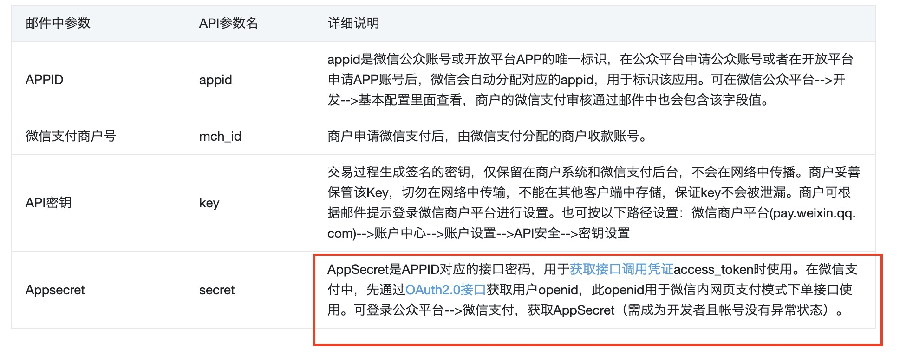
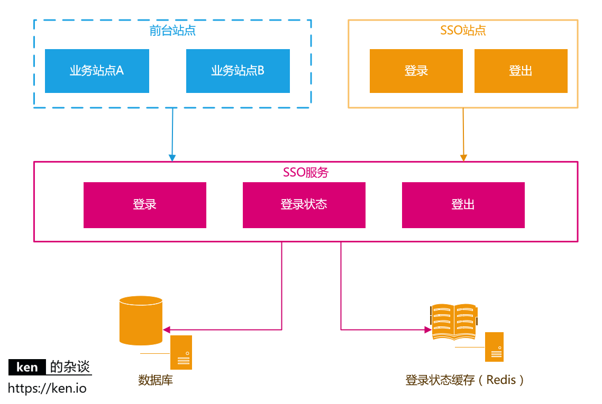
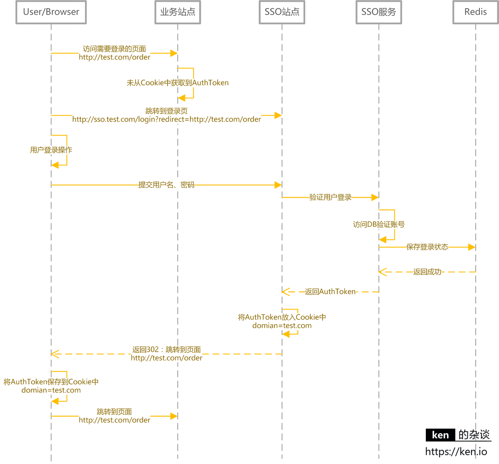
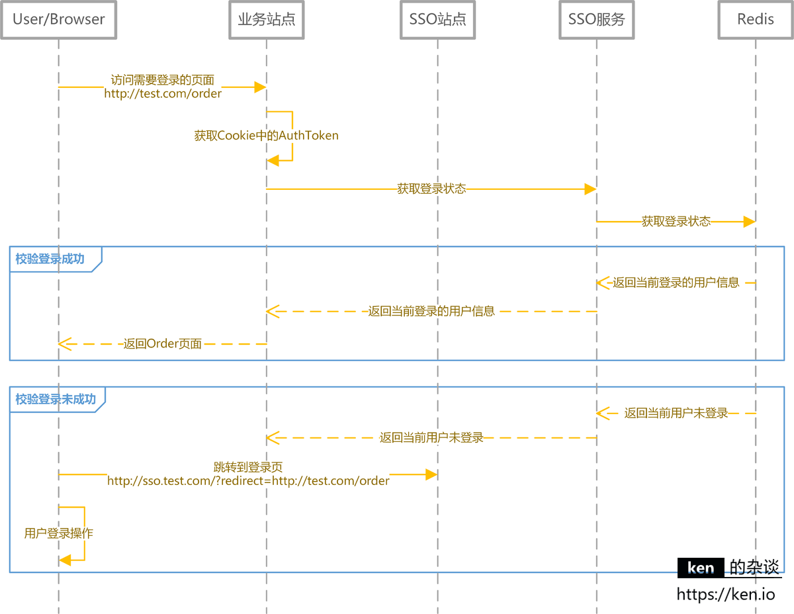
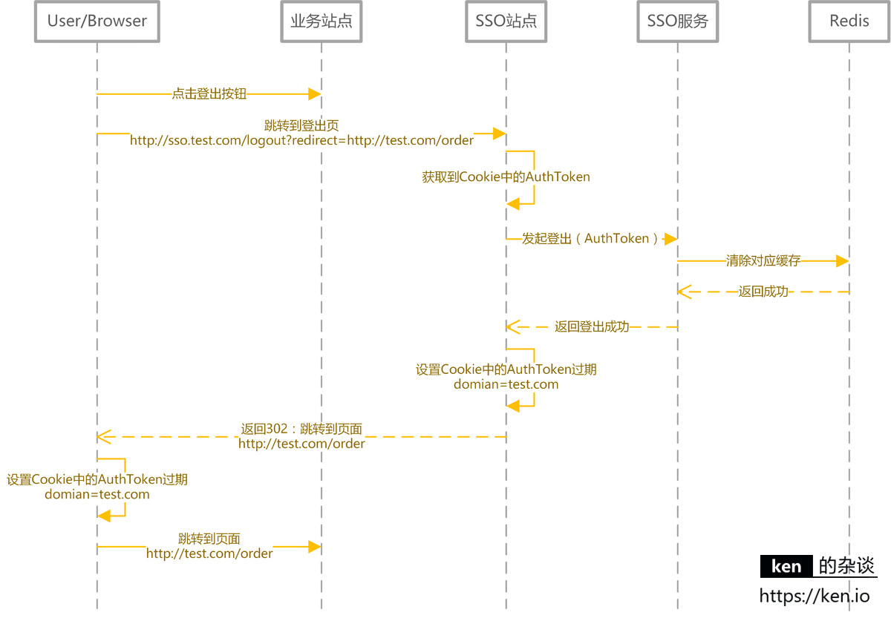
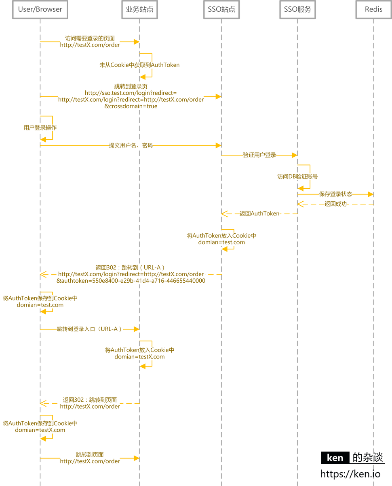
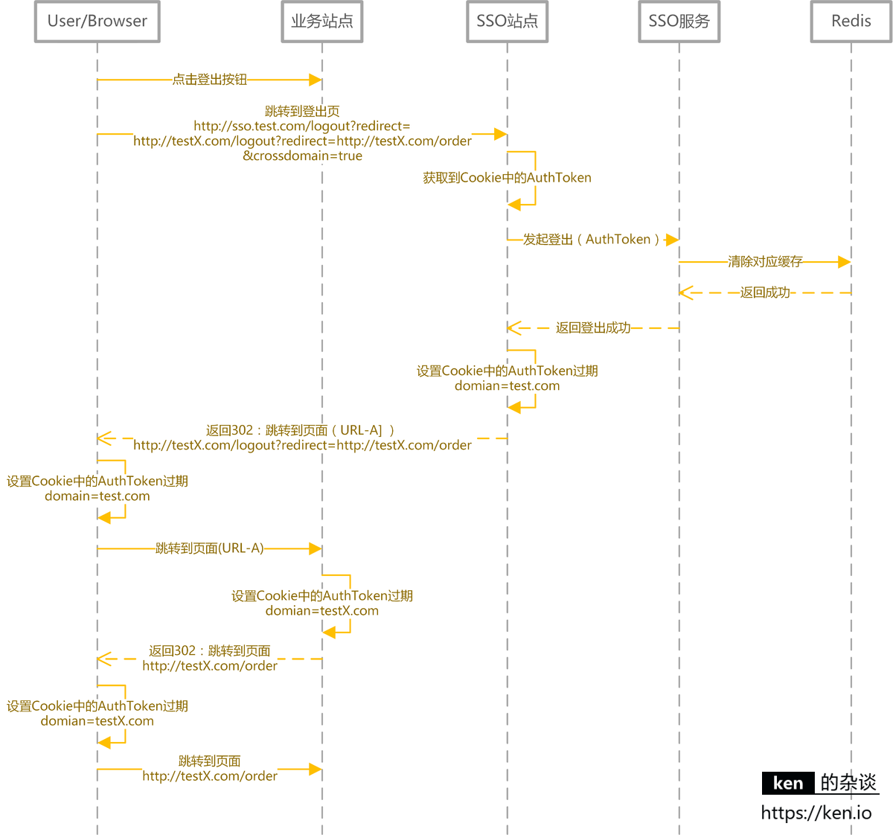
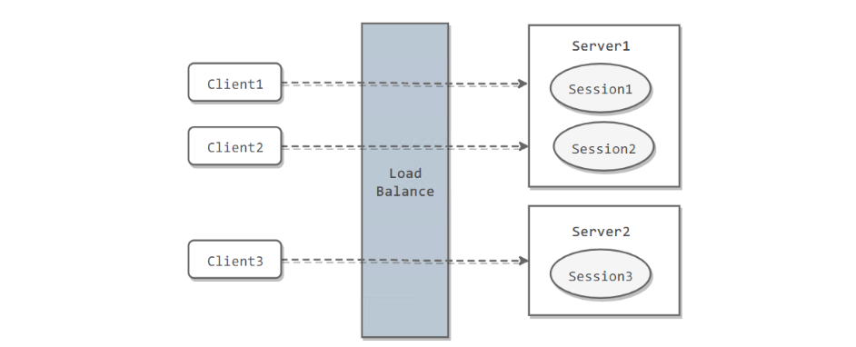
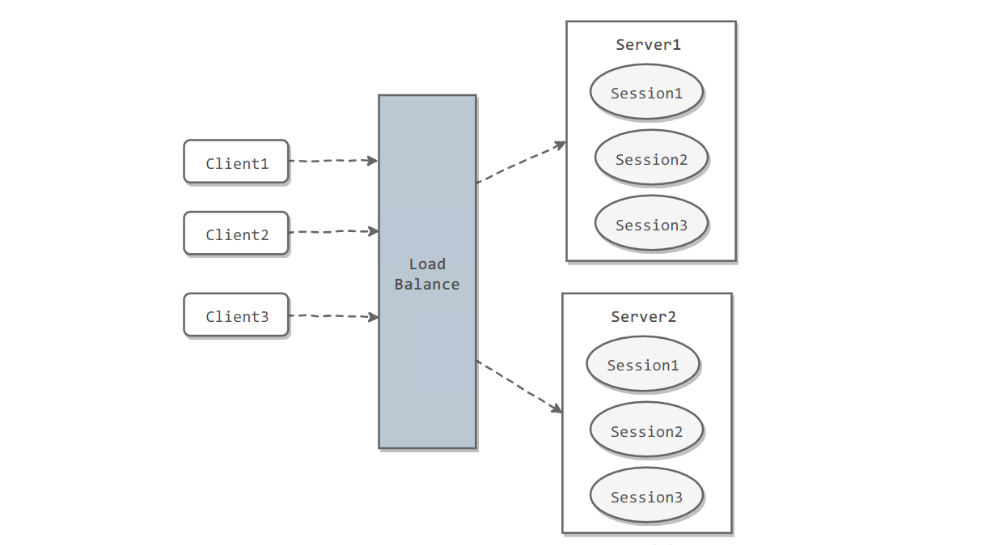
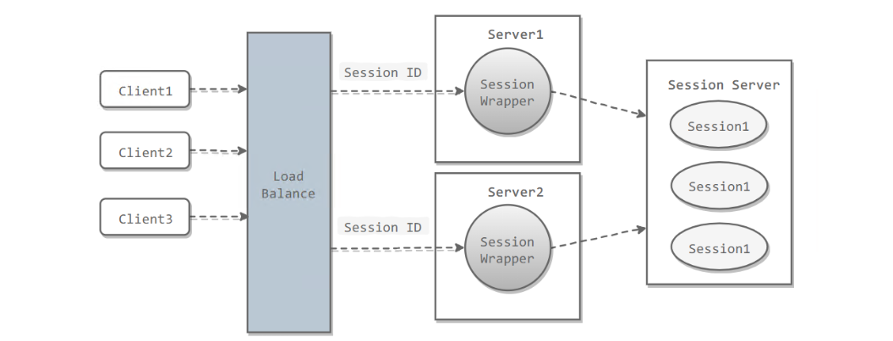

[TOC]

### 系统认证与授权

#### 认证与授权

##### 1. 基本概念

这两个一般在我们的系统中被**结合**在一起使用，目的就是为了保护系统的安全性。

**认证(Authentication)** 是**验证用户身份的凭据**（例如用户名/用户 ID 和密码），通过这个凭据，系统得以知道存在这个用户。所以 **Authentication** 被称为身份/用户验证。

**授权(Authorization)** 发生在 **Authentication（认证）** 之后。授权就是控制访问系统的权限。比如有些特定资源只能具有特定权限的人才能访问比如 admin，有些对系统资源操作比如删除、添加、更新只能特定人才具有。

#### Cookie与Session

Cookie 和 Session 都是用来**跟踪浏览器用户身份**的会话方式，但是两者的应用场景不太一样。

##### 1. Cookie

###### (1) 概述

Cookies 是某些网站为了辨别用户身份而储存在**用户本地终端**上的数据（通常经过加密）。简单来说： **Cookie 存放在==客户端==，一般用来保存用户信息**。

###### (2) Cookie使用场景

1. 在 Cookie 中保存已经**登录过的用户信息**，下次访问网站的时候页面可以自动帮你登录的一些基本信息给填了。除此之外，Cookie 还能保存用户首选项，主题和其他设置信息。
2. 因为 HTTP 协议是无状态的，所以可以使用 Cookie **保存 session 或者 token** ，向后端发送请求的时候**带上 Cookie**，这样后端就能取到 session 或者 token，这样就能记录用户当前的状态了。
3. Cookie 还可以用来**记录和分析用户行为**。比如网购时服务器想要获取用户在某个页面的停留状态或者商品浏览记录，一种常用的实现方式就是将这些信息存放到 Cookie 中。

###### (3) 服务端使用Cookie

**1) 设置 cookie 返回给客户端**

```java
@GetMapping("/user")
public String setCookie(HttpServletResponse response) {
    // 创建一个cookie
    Cookie cookie = new Cookie("username", "Jack");
    //设置cookie过期时间
    cookie.setMaxAge(7 * 24 * 60 * 60); // expires in 7 days
    //添加到response中
    response.addCookie(cookie);
    return "Username is changed!";
}
```

**2) 使用 @CookieValue 注解获取特定的 cookie 的值**

```java
@GetMapping("/")
public String readCookie(@CookieValue(value = "username", defaultValue = "Atta") String username) {
    return "Username in Cookie: " + username;
}
```

**3) 读取所有的 Cookie 值**

可以从 **HttpServletRequest** 对象中获取全部的 Cookie 值。

```java
@GetMapping("/all-cookies")
public String readAllCookies(HttpServletRequest request) {

    Cookie[] cookies = request.getCookies();
    if (cookies != null) {
        return Arrays.stream(cookies)
            .map(c -> c.getName() + "=" + c.getValue())
            .collect(Collectors.joining(", "));
    }
    return "No cookies";
}
```

##### 2. Session

**Session 的主要作用就是通过服务端记录用户的状态。** 典型的场景是**购物车**，当要添加商品到购物车的时候，系统不知道是哪个用户操作的，因为 HTTP 协议是无状态的。服务端给特定的用户创建**特定的 Session 之后**就可以标识这个用户并且跟踪这个用户了。

**如何使用 Session 进行身份验证？**

一般通过 **SessionID** 来实现用户的验证，SessionID 一般会选择存放在 **Redis** 中。举个例子：用户成功登陆系统，然后返回给客户端具有 **SessionID 的 Cookie**，当用户向后端发起请求的时候会把 SessionID 带上，这样后端就知道用户的身份状态了。关于这种认证方式更详细的过程如下：

1. 用户向服务器发送用户名和密码用于登陆系统。
2. 服务器验证通过后，服务器为用户**创建一个 Session**，并将 Session 信息**存储**起来。
3. 服务器向用户返回一个 **SessionID**，**写入用户的 Cookie**。
4. 当用户保持登录状态时，Cookie 将与**每个后续请求**一起被发送出去。
5. 服务器可以将存储在 Cookie 上的 Session ID 与存储在内存中或者数据库中的 Session 信息进行**比较**，以验证用户的身份，返回给用户客户端响应信息的时候会附带用户当前的状态。

使用 Session 的时候需要注意：

1. 依赖 Session 的关键业务一定要**确保客户端开启了 Cookie**。
2. 注意 Session 的**过期时**间。

##### 3. Cookie与Session区别

**Cookie** 数据保存在**客户端**(浏览器端)，**Session** 数据保存在**服务器端**。相对来说 Session 安全性更高。如果使用 Cookie 的一些敏感信息不要写入 Cookie 中，最好能将 Cookie 信息加密然后使用到的时候再去服务器端解密。

##### 4. Spring Session

Spring Session 提供了一种**跨多个应用程序**或实例管理用户会话信息的机制。如果想详细了解可以查看下面几篇很不错的文章：

- [Getting Started with Spring Session](https://codeboje.de/spring-session-tutorial/)
- [Guide to Spring Session](https://www.baeldung.com/spring-session)
- [Sticky Sessions with Spring Session & Redis](https://medium.com/@gvnix/sticky-sessions-with-spring-session-redis-bdc6f7438cc3)

##### 5. 面试题

> **如果没有Cookie的话Session还能用吗？**

这是一道经典的面试题！一般是通过 **Cookie 来保存 SessionID** ，假如使用了 Cookie 保存 SessionID 的方案的话， 如果客户端**禁用了 Cookie**，那么 Seesion 就**无法**正常工作。

但是并不是没有 Cookie 之后就不能用 Session 了，比如**可以将 SessionID 放在请求的 URL 里面。** 。

```http
https://baidu.com?session_id=xxx
```

这种方案的安全性和用户体验感较低。也可以对  SessionID 进行一次加密之后再传入后端。

> **为什么Cookie无法防止CSRF攻击，而token可以？**

**CSRF（Cross Site Request Forgery）**一般被翻译为 **跨站请求伪造** 。那么什么是 **跨站请求伪造** 呢？说简单用你的身份去发送一些对你不友好的请求。举个简单的例子：

小壮登录了某网上银行，他来到了网上银行的**帖子区**，看到一个帖子下面有一个链接写着“科学理财，年盈利率过万”，小壮好奇的点开了这个链接，结果发现自己的账户少了 10000 元。原来黑客在链接中藏了一个**请求**，这个请求直接利用小壮的身份给银行发送了一个转账请求,也就是通过 **Cookie** 向银行发出请求。

```xml
<a src=http://www.mybank.com/Transfer?bankId=11&money=10000>科学理财，年盈利率过万</>
```

上面也提到进行 Session 认证的时候，一般使用 Cookie 来存储 SessionId，当登陆之后后端生成一个 SessionId 放在 **Cookie** 中返回给客户端，服务端通过 Redis 或者其他存储工具记录保存着这个 SessionId，客户端登录以后每次请求都会**带上这个 SessionId**，服务端通过这个 SessionId 来标示你这个人。如果别人通过 cookie 拿到了 sessionId 后就可以冒充用户的身份访问系统了。

Session 认证中 **Cookie 中的 SessionId 是由浏览器**发送到服务端的，借助这个特性，攻击者就可以通过**让用户误点攻击链接**，达到攻击效果。

但是使用 **token** 的话就不会存在这个问题，在登录成功获得 token 之后，一般**会选择存放在 local storage** 中。然后在前端通过**某些方式**会给每个发到后端的请求**加上这个 token**，这样就不会出现 CSRF 漏洞的问题。因为即使用户点击了非法链接发送了请求到服务端，这个**非法请求是不会携带 token** 的，所以这个请求将是**非法**的。

**==需要注意的是不论是 Cookie 还是 token 都无法避免跨站脚本攻击==（Cross Site Scripting）XSS。跨站脚本攻击（Cross Site Scripting）缩写为 CSS 但这会与层叠样式表（Cascading Style Sheets，CSS）的缩写混淆。因此，有人将跨站脚本攻击缩写为XSS。**XSS 中攻击者会用各种方式将**恶意代码**注入到其他用户的页面中，就可以通过**脚本**盗用信息，使用脚本的话 cookie 和 token 都可能被盗用。

推荐阅读：

1. [如何防止CSRF攻击？—美团技术团队](https://tech.meituan.com/2018/10/11/fe-security-csrf.html)


#### Token与JWT

##### 1. 概述

可以使用 Session 来鉴别用户的身份，Session  信息需要保存一份在服务器端。这种方式会带来一些麻烦，比如需要保证保存  Session  信息服务器的可用性、**不适合移动端**（依赖 Cookie）等等。

使用 **Token** 可以不需要服务端存放 Session 信息就能实现身份验证。**JWT （JSON Web Token）** 就是这种方式的实现，通过这种方式服务器端就不需要保存 Session 数据了，**只用在客户端保存服务端返回给客户的 Token** 就可以了，扩展性得到提升。

**JWT 本质上就一段==签名的 JSON 格式==的数据。由于它是带有签名的，因此接收者便可以验证它的真实性。**

JWT 由 3 部分构成：

1. **Header**（头部）：描述 JWT 的元数据。定义了生成**签名**的算法以及 Token 的类型。
2. **Payload**（负载）：用来存放实际**需要传递**的数据。
3. **Signature**（签名）：服务器通过 Payload、Header 和一个密钥(secret) 使用 Header 里面指定的签名算法（默认是 HMAC SHA256）生成。

在基于 Token 进行身份验证的的应用程序中，服务器通过 Payload、Header 和一个密钥(secret)创建**令牌（Token）**并将 Token 发送给客户端，客户端将 Token **保存在 Cookie 或者 localStorage 里面**，以后客户端发出的所有请求都会**携带**这个令牌 token。客户端可以把 token 放在 **Cookie** 里面**自动发送**，但是这样**不能跨域**，所以更好的做法是**放在 HTTP  Header** 的  **Authorization** 字段中：**Authorization: Bearer Token**。

详细流程如下：

1. 用户向服务器发送用户名和密码用于登陆系统。
2. 身份验证服务响应并返回了**签名的 JWT**，里面包含了用户信息。
3. 用户以后每次向后端发请求都在 **Header 中带上 JWT**。
4. 服务端检查 JWT 并从中获取用户相关信息并进行**验证**。


推荐阅读：

- [JWT (JSON Web Tokens) Are Better Than Session Cookies](https://dzone.com/articles/jwtjson-web-tokens-are-better-than-session-cookies)
- [JSON Web Tokens (JWT) 与 Sessions](https://juejin.im/entry/577b7b56a3413100618c2938)
- [JSON Web Token 入门教程](https://www.ruanyifeng.com/blog/2018/07/json_web_token-tutorial.html)
- [彻底理解Cookie，Session，Token](https://mp.weixin.qq.com/s?__biz=Mzg2OTA0Njk0OA==&mid=2247485603&idx=1&sn=c8d324f44d6102e7b44554733da10bb7&chksm=cea24768f9d5ce7efe7291ddabce02b68db34073c7e7d9a7dc9a7f01c5a80cebe33ac75248df&token=844918801&lang=zh_CN#rd)

##### 2. Token认证的优势

 相比于 Session 认证的方式来说，使用 token 进行身份认证主要有下面三个优势：

###### (1) 无状态

token 自身包含了**身份验证**所需要的所有信息，使得服务器**不需要存储 Session 信息**，这显然增加了系统的可用性和伸缩性，大大减轻了服务端的压力。但是也正是由于 token 的无状态，也导致了它最大的缺点：当后端在 token 有效期内废弃一个 token 或者更改它的权限的话，**不会立即生效**，一般需要等到有效期过后才可以。另外当用户 Logout 的话，token 也还有效。除非在后端增加额外的处理逻辑。 

###### (2) 可以避免CSRF攻击

**CSRF**一般被翻译为 **跨站请求伪造**，那为什么使用 token 不会存在这种问题呢？

token 一般会选择存放在客户端的 **LocalStorage** 中，这样就不会出现 CSRF 漏洞问题。因为即使有个用户点击了非法链接发送了请求到服务端，这个非法请求是**不会**携带 token 的，所以这个请求将是非法的。

但是这样会存在 XSS 攻击中被盗的风险，为了避免 XSS 攻击，可以选择将 token 存储在标记为 **httpOnly** 的 cookie 中，但是这样又导致了必须自己提供 CSRF 保护。

具体采用上面哪种方式存储 token 呢，**大部分**情况下存放在 **LocaStorage** 下都是比较好的选择，某些情况下可能需要存放在标记为 httpOnly 的cookie 中会更好。

###### (3) 适合移动端应用

使用 Session 进行身份认证的话，需要保存一份信息在**服务器端**，而且这种方式会**依赖到 Cookie**（需要 Cookie 保存 SessionId），所以**不适合移动端**。但是，使用 token 进行身份认证就不会存在这种问题，因为只要 token 可以被客户端存储就能够使用，而且 token 还可以跨语言使用。

###### (4) 单点登录友好

使用 Session 进行身份认证的话，实现单点登录，需要把用户的 Session 信息保存在**一台电脑**上，并且还会遇到常见的 **Cookie 跨域**的问题。但是使用 token 进行认证的话， token 被**保存在客户端**，不会存在这些问题。

Token 本身由 OAuth 系列引入后才大规模普及的。主要目的是支持 SSO，也就是**单点登录**，这是 oauth 系列最主要的需求。OAuth用 token 作为**唯一的凭证**，使用它的第三方服务器可以在验证完 token 后建立自己的 session（既可以用传统 session，也可以用 token 作为 Redis 中的 key），而把用户身份认证工作完全委托给 OAuth，因此分工比较清晰，成了大量商家共享用户资源来建立自己生态圈的首选。而传统的 session 管理方式就很难实现这些了。

##### Token认证常见问题以及解决办法

###### (1) 注销登录等场景下token还有效

也就是注销登录之后，token 依然有效的问题，与之**类似**的具体相关场景有：

1. 退出登录。
2. 修改密码。
3. 服务端修改了某个用户具有的权限或者角色。
4. 用户的帐户被删除/暂停。
5. 用户由管理员注销；

这个问题**不存在于 Session 认证方式**中，因为在 Session 认证中，遇到这种情况的话服务端**删除对应的 Session 记录即可**。但是，使用 token 认证的方式就不好解决了。token 一旦派发出去，如果后端不增加其他逻辑的话，它在**失效之前都是有效**的。那么如何解决这个问题呢？大致有下面几种方案：

- **将 token 存入内存数据库**：将 token 存入 DB 中，如 Redis。如果需要让某个 **token 失效**就直接从 redis 中**删除这个 token 即可**。但是这样会导致每次使用 token 发送请求都要先从 DB 中查询 token 是否存在的步骤，而且违背了 JWT 的**无状态原则**。
- **黑名单机制**：和上面的方式类似，使用内存数据库比如 Redis 维护一个**黑名单**，如果想让某个 token 失效的话就直接将这个 token 加入到 **黑名单** 即可。然后，每次使用 token 进行请求的话都会先判断这个 token **是否存在于黑名单**中。
- **修改密钥 (Secret)** : 为每个用户都创建一个**专属密钥**，如果想让某个 token 失效，直接修改**对应用户的密钥**即可。但是这样相比于前两种引入内存数据库带来了危害更大，比如：1. 如果服务是**分布式**的，则每次发出新的 token 时都必须在**多台机器同步密钥**。为此需要将必须将机密存储在数据库或其他外部服务中，这样和 Session 认证就没太大区别了。2. 如果用户同时在两个浏览器打开系统，或者在手机端也打开了系统，如果它从一个地方将账号退出，那么其他地方**都要**重新进行登录，这是不可取的。
- **保持令牌的有效期限短并经常轮换** ：很简单的一种方式。但是，会导致用户登录状态不会被持久记录，而且需要用户**经常登录**。京东招聘的官网就是这样，很难受。

对于**修改密码后** token 还有效问题的解决还是比较容易的，一种比较好的方式：**使用用户的密码的哈希值对 token 进行签名。因此，如果密码更改，则任何先前的令牌将自动无法验证。**

###### (2) token续签问题

token 有效期一般都建议设置的不太长，那么 token 过期后如何认证，如何**实现动态刷新 token**，避免用户经常需要重新登录？

先来看看在 Session 认证中一般的做法：假如 session 的有效期 30 分钟，如果 30 分钟内用户有访问，就把 session 有效期被延长 30 分钟。那 token 续签怎么做？

- **类似于 Session 认证中的做法**：这种方案满足于大部分场景。假设服务端给的 token 有效期设置为 30 分钟，服务端每次进行**校验时**，如果发现 token 的有效期马上快过期了，服务端就**重新生成 token 给客户端**。客户端每次请求都检查新旧 token，如果**不一致**，则**更新**本地的 token。这种做法的问题是仅仅在**快过期**的时候请求才会更新 token，对客户端不是很友好。
- **每次请求都返回新 token**：这种方案的的思路很简单，但是服务端**开销会比较大**。
- **token 有效期设置到半夜** ：这是一种折衷的方案，保证了大部分用户白天可以正常登录，适用于对安全性要求不高的系统。
- **用户登录返回两个 token** ：第一个是 **acessToken** ，它的**过期时间 token 本身的过期时间比如半个小时**，另外一个是 **refreshToken** 它的过期时间**更长一点**比如为 1 天。客户端登录后，将 accessToken 和 refreshToken 保存在**本地**，每次访问将 accessToken 传给服务端。服务端校验 accessToken 的**有效性**，如果**过期**的话，就将 **refreshToken** 传给服务端。如果有效，服务端就生成**新的 accessToken 给客户端**。否则，客户端就重新登录即可。该方案的不足是：1. 需要客户端来**配合**；2. 用户注销的时候需要同时**保证两个 token 都无效**；3. 重新请求获取 token  的过程中会有**短暂 token 不可用**的情况（可以通过在客户端设置定时器，当 accessToken 快过期的时候，提前去通过 refreshToken 获取新的 accessToken）。


#### OAuth2.0

OAuth 是一个行业的**标准授权协议**，主要用来**授权第三方应用获取有限的权限**。而 OAuth2.0 是对 OAuth1.0 的完全重新设计，OAuth2.0 更快，更容易实现。

OAuth2.0 就是一种**授权机制**，它的最终目的是**为第三方应用颁发一个有时效性的令牌 token**，使得第三方应用能够**通过该令牌获取相关的资源**。

OAuth 2.0 比较常用的场景就是**第三方登录**，当网站需要**第三方登录**的时候（如用微信登录）一般就是使用的 OAuth 2.0 协议。现在 OAuth2.0 也常见于**支付场景（微信支付、支付宝支付）和开发平台（微信开放平台、阿里开放平台等等）**。

微信支付账户相关参数：



**推荐阅读：**

- [OAuth 2.0 的一个简单解释](http://www.ruanyifeng.com/blog/2019/04/oauth_design.html)
- [10 分钟理解什么是 OAuth 2.0 协议](https://deepzz.com/post/what-is-oauth2-protocol.html)
- [OAuth 2.0 的四种方式](http://www.ruanyifeng.com/blog/2019/04/oauth-grant-types.html)
- [GitHub OAuth 第三方登录示例教程](http://www.ruanyifeng.com/blog/2019/04/github-oauth.html)


#### 单点登录SSO

##### 1. 概述

SSO(Single Sign On) 即**单点登录**，指的是用户**登陆多个子系统的其中一个就有权访问与其相关的其他系统**。比如登陆京东金融之后，京东超市、京东家电等子系统都是登录状态。

###### (1) SSO与OAuth2.0的区别

OAuth 是一个行业的标准**授权协议**，主要用来**授权第三方应用获取有限的权限**。而 SSO 解决的是一个公司的**多个相关的自系统的之间的登陆问题**比如京东旗下相关子系统京东金融、京东超市、京东家电等等。

###### (2) 单点登录系统的好处

1. **用户角度**：用户能够做到一次登录多次使用，非常友好。
2. **系统管理员角度**：系统只需维护一个统一的账号中心。
3. **新系统开发角度**：新系统开发时只需对接统一的账号中心，简化开发流程。

###### (3) 核心功能

单点登录的核心功能有：

- 单点登录
- 单点登出
- 支持跨域单点登录
- 支持跨域单点登出

##### 2. SSO系统设计与实现

###### (1) 核心应用与依赖



|  应用/模块/对象   |                  说明                   |
| :---------------: | :-------------------------------------: |
|   **前台站点**    |           需要**登录**的站点            |
|   SSO 站点-登录   |           提供**登录的页面**            |
|   SSO 站点-登出   |         提供**注销登录**的入口          |
|   SSO 服务-登录   |            提供**登录服务**             |
| SSO 服务-登录状态 | 提供**登录状态校验/登录信息查询**的服务 |
|   SSO 服务-登出   |       提供用户**注销登录**的服务        |
|      数据库       |          **存储用户账户信息**           |
|       缓存        | 存储用户的**登录信息，通常使用 Redis**  |

###### (2) 用户登录状态的存储与校验

常见的 Web 框架对于 Session 的实现都是生成一个 **SessionId** 存储在浏览器 **Cookie** 中。然后将 Session 内容存储在服务器端**内存**中。用户**登录成功**之后，生成 **AuthToken** 交给**客户端**保存。如果是浏览器，就保存在 **Cookie** 中。如果是移动端就保存在**本地缓存**中。这里探讨基于 Web 站点的 SSO。
用户在浏览**需要登录**的页面时，客户端将 **AuthToken** 提交给 **SSO 服务校验登录状态/获取用户登录信息**。对于登录信息的存储，建议采用 Redis，使用 Redis **集群**来存储登录信息，既可以保证高可用，又可以拓展性。同时也可以让 SSO 服务满足负载均衡/可伸缩的需求。

|     对象      |                             说明                             |
| :-----------: | :----------------------------------------------------------: |
| **AuthToken** | 直接使用 UUID/GUID 即可，如果有验证 AuthToken 合法性需求，可以将 UserName +时间戳加密生成，服务端解密之后验证合法性 |
| **登录信息**  |            通常是将 UserId，UserName **缓存**起来            |

###### (3) 用户登录/登录校验

**登录时序图**如下所示。



按照上图，用户登录后 Authtoken 保存在 **Cookie** 中。 domian= test. com。浏览器会将 domain 设置成 .test.com，这样访问**所有 *.test.com 的 web 站点**，都会将 **Authtoken** 携带到服务器端。然后**通过 SSO 服务**，完成对用户状态的校验/用户登录信息的获取。

**登录信息获取/登录状态校验**流程：



###### (4) 用户登出

用户**登出**时要做的事情很简单：

1. 服务端**清除缓存（Redis）中的登录状态**。
2. 客户端**清除存储**的 AuthToken。

**登出时序图**



###### (5) 跨域登录/登出

前面提到过，核心思路是**客户端存储 AuthToken**，服务器端通过 **Redis** 存储登录信息。由于客户端是将 AuthToken 存储在 Cookie 中的。所以**跨域要解决的**问题，就是如何解决 Cookie 的跨域读写问题。

**Cookie 是不能跨域的** ，比如一个解决跨域的核心思路就是：

- 登录完成之后通过**回调**的方式，将 AuthToken 传递给**主域名之外**的站点，该站点自行将 AuthToken 保存在**当前域下的 Cookie** 中。
- 登出完成之后通过**回调**的方式，调用**非主域名站点**的登出页面，完成设置 Cookie 中的 AuthToken 过期的操作。
- 跨域登录（主域名已登录）。


- **跨域登录（主域名未登录）**



- **跨域登出**



###### (6) 说明

上述设计的方案更多是提供实现思路。如果涉及到 APP 用户登录等情况，在访问 SSO 服务时，增加对 APP 的**签名验证**就好了。如果有无线网关，验证签名不是问题。此外时序图中并没有包含所有场景，参考的 ken.io 只列举了核心/主要场景。


#### 分布式Session

> **集群部署时的分布式Session如何实现？**

分布式系统中最大的问题就是**分布式事务**、**接口幂等性**、**分布式锁**，还有最后一个就是**分布式 Session**。分布式系统下那么多的服务，Session 状态如何维护？

其实方法很多，但是常见常用的是以下几种：

##### 1. 集群下的Session管理

一个用户的 Session 信息如果存储在一个**服务器**上，那么当负载均衡器把用户的下一个请求转发到另一个服务器，由于服务器没有用户的 Session 信息，那么该用户就需要重新进行登录等操作。

###### (1) Sticky Session

需要配置**负载均衡器**，使得**一个用户的所有请求都路由到同一个服务器**，这样就可以把用户的 Session 存放在该服务器中。

**缺点**：当服务器宕机时，将丢失该服务器上的所有 Session。



###### (2) Session复制

在服务器之间进行 **Session 同步**操作，每个服务器都有**所有用户的 Session 信**息，因此用户可以向任何一个服务器进行请求。

缺点：**占用过多内存**；同步过程占用网络带宽以及服务器处理器时间。



###### (3) Session服务器

使用一个**单独的服务器存储 Session 数据**，可以使用传统的 MySQL，也使用 **Redis** 或者 Memcached 这种内存型数据库。

**优点**：为了使得大型网站具有伸缩性，集群中的应用服务器通常需要保持无状态，那么应用服务器不能存储用户的会话信息。Session Server 将用户的会话信息单独进行存储，从而保证了应用服务器的无状态。

**缺点**：需要去实现存取 Session 的代码。



##### 2. Tomcat+Redis

这个方式挺方便，就是跟之前一样使用 Session 的代码，也是基于 Tomcat 原生的 Session 支持即可，区别就是使用 **Tomcat  RedisSessionManager**，让所有部署的 **Tomcat 都将 Session 数据存储到 Redis 即可**。

在 Tomcat 的配置文件中配置：

``` xml
<Valve className="com.orangefunction.
                  tomcat.redissessions.RedisSessionHandlerValve" />

<Manager className="com.orangefunction
                    .tomcat.redissessions.RedisSessionManager"
         host="{redis.host}"
         port="{redis.port}"
         database="{redis.dbnum}"
         maxInactiveInterval="60"/>
```

然后指定 Redis 的 host 和 port 就行了。还可以用下面这种方式基于 **Redis 哨兵**支持的 **Redis 高可用集群**来保存 Session 数据。

```xml
<Valve className="com.orangefunction
                  .tomcat.redissessions.RedisSessionHandlerValve" />
<Manager className="com.orangefunction
                    .tomcat.redissessions.RedisSessionManager"
         sentinelMaster="mymaster"
         sentinels="<sentinel1-ip>:26379,
                    <sentinel2-ip>:26379,
                    <sentinel3-ip>:26379"
         maxInactiveInterval="60"/>
```

##### 3. Spring Session+Redis

虽然 Tomcat + Redis 的方式好用，但是会**严重依赖于 Web 容器**，不好将代码移植到其他 Web 容器上去（比如 Jetty），尤其是更换技术栈就更难受了。

所以现在也有基于 Java 一站式解决方案，也就是 **Spring**。Spring 全家桶里面啥都有，Spirng Cloud 做微服务，Spring Boot 做脚手架，所以用 **Spring Session** 是一个很好的选择。

在 pom.xml 中配置：

``` xml
<dependency>
    <groupId>org.springframework.session</groupId>
    <artifactId>spring-session-data-redis</artifactId>
    <version>1.2.1.RELEASE</version>
</dependency>
<dependency>
    <groupId>redis.clients</groupId>
    <artifactId>jedis</artifactId>
    <version>2.8.1</version>
</dependency>
```

在 Spring 配置文件中配置：

``` xml
<bean id="redisHttpSessionConfiguration"
      class="org.springframework.session.data.redis.config
             .annotation.web.http.RedisHttpSessionConfiguration">
    <property name="maxInactiveIntervalInSeconds" value="600"/>
</bean>

<bean id="jedisPoolConfig" class="redis.clients.jedis.
                                  JedisPoolConfig">
    <property name="maxTotal" value="100" />
    <property name="maxIdle" value="10" />
</bean>

<bean id="jedisConnectionFactory"
      class="org.springframework.data.redis.connection
             .jedis.JedisConnectionFactory" 
      destroy-method="destroy">
    <property name="hostName" value="${redis_hostname}"/>
    <property name="port" value="${redis_port}"/>
    <property name="password" value="${redis_pwd}" />
    <property name="timeout" value="3000"/>
    <property name="usePool" value="true"/>
    <property name="poolConfig" ref="jedisPoolConfig"/>
</bean>
```

在 **web.xml** 中配置：

``` xml
<filter>
    <filter-name>springSessionRepositoryFilter</filter-name>
    <filter-class>org.springframework.web.filter.DelegatingFilterProxy</filter-class>
</filter>
<filter-mapping>
    <filter-name>springSessionRepositoryFilter</filter-name>
    <url-pattern>/*</url-pattern>
</filter-mapping>
```

示例代码：

``` java
@RestController
@RequestMapping("/test")
public class TestController {

    @RequestMapping("/putIntoSession")
    public String putIntoSession(HttpServletRequest request, String username) {
        request.getSession().setAttribute("name", "leo");
        return "ok";
    }

    @RequestMapping("/getFromSession")
    public String getFromSession(HttpServletRequest request, Model model){
        String name = request.getSession().getAttribute("name");
        return name;
    }
}
```

给 Spring Session **配置基于 Redis 来存储 Session 数据**，然后配置了一个 **Spring Session 的过滤器**，这样的话，**Session 相关操作都会交给 Spring Session 了**。接着在代码中就可以使用原生的 Session 操作，就是**直接基于 Spring Session** 从 Redis 中获取数据了。

总结一下，实现分布式的会话有很多种方式，Tomcat + Redis 早期比较常用，但是会重耦合到 Tomcat 中；现在通过 Spring Session 来实现还是比较香的。

##### 4. 弃用Session

使用 **JWT Token** 储存用户身份，然后再从数据库或者 cache 中获取其他的信息。这样无论请求分配到哪个服务器都无所谓。


#### 参考资料

- https://medium.com/@sherryhsu/session-vs-token-based-authentication-11a6c5ac45e4
- https://www.varonis.com/blog/what-is-oauth/
- https://tools.ietf.org/html/rfc6749
- 【服务器端使用cookie】https://attacomsian.com/blog/cookies-spring-boot
- [JWT 超详细分析](https://learnku.com/articles/17883?order_by=vote_count&)
- https://medium.com/devgorilla/how-to-log-out-when-using-jwt-a8c7823e8a6
- https://medium.com/@agungsantoso/csrf-protection-with-json-web-tokens-83e0f2fcbcc
- [Invalidating JSON Web Tokens](https://stackoverflow.com/questions/21978658/invalidating-json-web-tokens)
- [Session Management using Spring Session with JDBC DataStore](https://sivalabs.in/2018/02/session-management-using-spring-session-jdbc-datastore/)