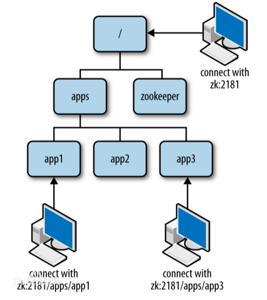

[TOC]

### Zookeeper

#### Zookeeper概述

##### 1. 概述

项目从单体到**分布式**转变之后，将会产生**多个节点之间协同**的问题。如：

1. 每天的定时任务由谁哪个节点来执行？
2. RPC 调用时的**服务发现**?
3. 如何保证并发请求的**幂等**？
4. ....

这些问题可以统一归纳为**多节点协调问题**，如果靠节点自身进行协调这是非常不可靠的，性能上也不可取。应该由一个**独立的服务做协调工作**，它必须可靠，而且保证性能。

ZooKeeper 是用于分布式应用程序的协调服务。它公开了一组简单的 API，**分布式应用程序可以基于这些 API 用于同步，节点状态、配置等信息、服务注册等信息**。

Zookeeper 虽然是个大管家，但是它不会直接发号施令，而是**只是对各个客户的行为做记录**，不然的话，Zookeeper 就成了一个中心化的结点，其可靠性依然有问题。

ZooKeeper 是一个开源的**分布式协调服务**，ZooKeeper 已成为 Hadoop，HBase 和其他分布式框架使用的有组织服务的标准。 例如 Apache HBase 使用 ZooKeeper 跟踪分布式数据的状态。**ZooKeeper 的设计目标是将那些复杂且容易出错的分布式一致性服务封装起来，构成一个高效可靠的原语集，并以一系列简单易用的接口提供给用户使用。**

**ZooKeeper 是一个典型的分布式数据一致性解决方案，分布式应用程序可以基于 ZooKeeper 实现诸如数据发布/订阅、负载均衡、命名服务、分布式协调/通知、集群管理、Master 选举、分布式锁和分布式队列等功能。**

**ZooKeeper 是高性能的。 在“读”多于“写”的应用程序中尤其地高性能，因为“写”会导致所有的服务器间同步状态。**（“读”多于“写”是协调服务的典型场景。）

其一致性是通过基于 **Paxos** 算法的 **ZAB 协议**完成的。

分布式系统需要考虑 CAP 定理，Zookeeper 保证了 **CP**（数据一致性）。

##### 2. Zookeeper特点

- **顺序一致性：** 从**同一客户端**发起的事务请求，最终将会严格地**按照顺序**被应用到 ZooKeeper 中去。
- **原子性：** 所有事务请求的处理结果在整个集群中所有机器上的应用情况是一致的，也就是说，要么整个集群中所有的机器都成功应用了某一个事务，要么都没有应用。
- **单一系统映像 ：** 无论客户端连到哪一个 ZooKeeper 服务器上，其看到的服务端数据模型都是一致的。
- **可靠性：** 一旦一次更改请求被应用，更改的结果就会被持久化，直到被下一次更改覆盖。
- **实时性**：一旦服务端成功的应用了一个事物，那客户端立刻能看到变更后的状态。

##### 3. Zookeeper使用场景

可以用在 名字服务、配置管理、集群管理、集群选举、分布式锁、队列管理、消息订阅 等场景。


#### 部署与常规配置

Zookeeper 基于 Java 开发，下载后只要有对应 JVM 环境即可运行。其**默认的端口号是 2181**。

##### 1. 基本部署

3.5 版本可以用于生产。基于 3.4 它包含以下新功能：动态重新配置、本地会议、新节点类型：容器，TTL、原子广播协议的 SSL 支持、删除观察者的能力、多线程提交处理器、升级到 Netty 4.1、Maven 构建。

文件说明：

* apache-zookeeper-xxx-tar.gz 代表**源代码**。
* apache-zookeeper-xxx-bin.tar.gz **运行版本。**

下载地址：[https://zookeeper.apache.org/releases.html#download](https://zookeeper.apache.org/releases.html#download)

具体部署流程：

```bash
# 下载
wget https://mirrors.tuna.tsinghua.edu.cn/apache/zookeeper/current/apache-zookeeper-3.5.5-bin.tar.gz
# 解压
tar -zxvf apache-zookeeper-3.5.5-bin.tar.gz
# 拷贝默认配置
cd  {zookeeper_home}/conf 
cp zoo_sample.cfg zoo.cfg
# 启动
{zookeeper_home}/bin/zkServer.sh
```

##### 2. 常规配置文件说明

```bash
# zookeeper时间配置中的基本单位 (毫秒)这里是2秒
tickTime=2000
# 允许follower初始化连接到leader最大时长，它表示tickTime时间倍数 即:initLimit*tickTime，这里10秒
initLimit=10
# 允许follower与leader数据同步最大时长,它表示tickTime时间倍数，这里5秒
syncLimit=5
# zookeper数据存储目录
dataDir=/tmp/zookeeper
# 对客户端提供的端口号
clientPort=2181
# 单个客户端与zookeeper最大并发连接数
maxClientCnxns=60
# 保存的数据快照数量，之外的将会被清除
autopurge.snapRetainCount=3
# 自动触发清除任务时间间隔，小时为单位。默认为0，表示不自动清除。
autopurge.purgeInterval=1
```

##### 3. 客户端命令

**基本命令列表**：

- **close **： 关闭当前会话。
- **connect host:port **：重新连接指定 Zookeepe r服务。
- **create [-s] [-e] [-c] [-t ttl] path [data] [acl]**：创建节点。
- **delete [-v version] path**：删除节点，(不能存在子节点）。
- **deleteall path**： 删除路径及所有子节点。
- **setquota -n|-b val path**：设置节点限额。-n 子节点数，-b 字节数。
- **listquota path**：查看节点限额。
- **delquota [-n|-b] path**：删除节点限额。
- **get [-s] [-w] path**：查看节点数据。-s 包含节点状态，-w 添加监听。
- **ls [-s] [-w] [-R] path**：列出子节点。-s 状态，-R 递归查看所有子节点，-w 添加监听。
- **printwatches on|off**：是否打印监听事件。
- **quit **：退出客户端。
- **history **：查看执行的历史记录。
- **redo cmdno**：重复 执行命令，history 中命令编号确定。
- **删除指定监听**：set [-s] [-v version] path data。
- **setAcl [-s] [-v version] [-R] path acl**：为节点设置 ACL 权限。
- **stat [-w] path**：查看节点状态。 -w 添加监听。
- **sync path**：强制同步节点。

**node 数据的增删改查**：

```bash
# 列出子节点 
ls /
#创建节点
create /luban "luban is good man"
# 查看节点
get /luban
# 创建子节点 
create /luban/sex "man"
# 删除节点
delete /luban/sex
# 删除所有节点包括子节点
deleteall /luban
# 修改节点
set /tuling "woman"
```

#### Zookeeper节点

##### 1. znode节点

Zookeeper 中数据基本单元叫**节点**，节点之下可包含**子节点**，最后以**树级方式**程现。每个节点拥有**唯一的路径** path。客户端基于 **PATH 上传节点数据**，Zookeeper 收到后会实时通知**对该路径**进行监听的客户端。**所有数据都是结点**。



zookeeper 中节点叫 znode 存储结构上跟**文件系统**类似，以**树级结构**进行存储。不同之外在于 znode **没有目录**的概念，不能执行类似 cd 之类的命令。znode 结构包含如下：

* **path**：唯一路径。增删改查都是基于 PATH。
* **childNode**：子节点。
* **stat**：状态属性。
* **type**：节点类型。
* **data**：数据内容。

##### 2. 节点类型

|         类型          |                描述                |
| :-------------------: | :--------------------------------: |
|      PERSISTENT       |            **持久节点**            |
| PERSISTENT_SEQUENTIAL |          **持久序号节点**          |
|       EPHEMERAL       |   **临时节点**(不可在拥有子节点)   |
| EPHEMERAL_SEQUENTIAL  | **临时序号节点**(不可在拥有子节点) |

###### (1) PERSISTENT（持久节点）

**持久化**保存的节点，也是**默认**创建的。

```bash
# 默认创建的就是持久节点
create /test "test"
```

###### (2) EPHEMERAL（临时节点）

**临时节点**会在客户端会话**断开**后**自动删除**。适用于**心跳，服务发现等场景**。创建时添加参数 **-e** 即可。这可以用于判断客户端是否还在连接，如果已经断开连接，那么节点就不在了。**==临时节点下面不能包含子结点==**，所以临时节点**只能做叶子节点**。

```bash
# 创建临时节点， 断开会话 在连接将会自动删除
create -e /temp "test"
```

###### (3) PERSISTENT_SEQUENTIAL(持久序号节点)

创建时 Zookeeper 会在**路径**上加上**序号作为后缀**。非常适合用于**分布式锁、分布式选举**等场景。创建时添加 **-s** 参数即可。

```bash
# 创建序号节点
create -s /test
# 返回创建的实际路径：加了序号
Created /test0000000001

# 再次创建一个
create -s /test
# 返回创建的实际路径2，序号递增了
Created /test0000000002
```

###### (4) EPHEMERAL_SEQUENTIAL（临时序号节点）

与持久序号节点类似，不同之处在于EPHEMERAL_SEQUENTIAL是**临时的会在会话断开后删除**。创建时添加 **-e -s**。

```bash
create -e -s /temp/seq
```

##### 3. 节点属性

节点状态中包含了很多节点的**属性**比如 czxid 、mzxid 等等，在 zookeeper 中是使用 **Stat 类**来维护的。

```bash
# 查看节点属性
stat /temp
```

其属性说明如下表：

```bash
# 创建节点的事务ID，不会改变
cZxid = 0x385
# 创建时间
ctime = Tue Sep 24 17:26:28 CST 2019
# 修改节点的事务ID，会改变
mZxid = 0x385 
# 最后修改时间
mtime = Tue Sep 24 17:26:28 CST 2019
# 子节点变更的事务ID，也会改变，但是只记录子结点的增删动作，修改数据不会
pZxid = 0x385
# 对此znode的子节点进行的更改次数（不包括子节点），只在子结点增删时变更
cversion = 0
# 数据版本变更次数
dataVersion = 2
# 权限版本变更次数
aclVersion = 0
# 临时节点所属会话ID
ephemeralOwner = 0x0
# 数据长度
dataLength = 17
# 子节点数(不包括子子节点)
numChildren = 3
```

##### 4. 节点的监听

客户添加 **==-w 参数==**可**实时监听节点与子节点的变化，并且实时收到通知**。非常适用保障**分布式情况下的==数据一致性==**。其使用方式如下：

|           命令           |                   描述                    |
| :----------------------: | :---------------------------------------: |
|      **ls -w path**      |      监听**子节点**的变化（增，删）       |
|     **get -w path**      |          监听**节点数据**的变化           |
|     **stat -w path**     |          监听**节点属性**的变化           |
| **printwatches on\|off** | 触发监听后，是否**打印**监听事件(默认 on) |

监听是**一次性**的，收到监听之后需要**重新设置监听**才行。

##### 5. acl权限设置

**ACL** 全称为 Access Control List（**访问控制列表**），用于**控制资源的访问权限**。ZooKeeper 使用 **ACL** 来控制对其 znode 的访问。基于 **scheme​ : id : ​permission** 的方式进行**权限控制**。scheme 表示授权模式、id 模式对应值、permission 即具体的增删改权限位。

**scheme: 认证模型**

|    方案    |                             描述                             |
| :--------: | :----------------------------------------------------------: |
| **world**  |   **开放模式**，world 表示全世界都可以访问（这是默认设置）   |
|   **ip**   |               **ip 模式**，限定客户端 IP 防问                |
|  **auth**  |    **用户密码**认证模式，只有在会话中添加了认证才可以防问    |
| **digest** | 与 **auth** 类似，区别在于 auth 用明文密码，而 digest 用 sha-1+base64 加密后的密码。在**实际使用中digest 更常见。** |

**permission 权限位**：类似于 UNIX 文件系统的权限控制。Zookeeper 定义了如下 5 种权限。其中尤其需要注意的是， CREATE 和 DELETE 这两种权限都是针对**子节点**的权限控制。

| 权限位 |    权限    |                 描述                 |
| :----: | :--------: | :----------------------------------: |
|   c    | **CREATE** |          可以**创建**子节点          |
|   d    | **DELETE** |  可以**删除**子节点（仅下一级节点）  |
|   r    |  **READ**  | 可以**读取**节点数据及显示子节点列表 |
|   w    | **WRITE**  |         可以**设置**节点数据         |
|   a    | **ADMIN**  |   可以**设置节点访问控制列表权限**   |

**acl 相关命令**

|    命令    |         使用方式          |     描述      |
| :--------: | :-----------------------: | :-----------: |
| **getAcl** |      getAcl \<path>       | 读取 ACL 权限 |
| **setAcl** |   setAcl \<path> \<acl>   | 设置 ACL 权限 |
|  addauth   | addauth \<scheme> \<auth> | 添加认证用户  |

**world 权限示例**：语法

```bash
> setAcl \<path> world:anyone:<权限位>
```

注：world 模式中 **anyone** 是唯一的值，表示**所有人**。

- 查看**默认节点权限**：

```bash
# 创建一个节点
create -e /testAcl
# 查看节点权限
getAcl /testAcl
# 返回的默认权限表示 ，所有人拥有所有权限。
'world,'anyone: cdrwa
```

- 修改默认权限为读**写**：

```bash
# 设置为rw权限 
setAcl /testAcl world:anyone:rw
# 可以正常读
get /testAcl
# 无法正常创建子节点
create -e /testAcl/t "hi"
# 返回没有权限的异常
Authentication is not valid : /testAcl/t
```

**IP 权限示例** 语法： 

```bash
setAcl <path> ip:<ip地址|地址段>:<权限位>
```

**auth 模式示例** 语法： 

```bash
1. setAcl <path> auth:<用户名>:<密码>:<权限位>
2. addauth digest <用户名>:<密码>
```

**digest 权限示例** 语法： 

```bash
1. setAcl <path> digest :<用户名>:<密钥>:<权限位>
2. addauth digest <用户名>:<密码>
```

注1：密钥可以通过 sha1 与 base64 组合加密码生成，可通过以下命令生成：

```bash
echo -n <用户名>:<密码> | openssl dgst -binary -sha1 | openssl base64
```

注2：为节点设置 digest 权限后，访问前必须执行 addauth，当前会话才可以防问。

- 设置 digest 权限：

```bash
# 先sha1加密，然后base64加密
echo -n luban:123456 | openssl dgst -binary -sha1 | openssl base64
# 返回生成的密钥
2Rz3ZtRZEs5RILjmwuXW/wT13Tk=
# 设置digest权限（附上密钥）
setAcl /luban digest:luban:2Rz3ZtRZEs5RILjmwuXW/wT13Tk=:cdrw
```

- 查看节点将显示没有权限：

```bash
# 查看节点
get /luban
# 显示没有权限访问
org.apache.zookeeper.KeeperException$NoAuthException: KeeperErrorCode = NoAuth for /luban
```

- 给当前会话添加认证后在次查看：

```bash
#给当前会话添加权限帐户
addauth digest luban:123456
#在次查看
get /luban
#获得返回结果
luban is good man
```

ACL 的特殊说明：权限仅对当前节点有效，不会让子节点继承。如限制了 IP 防问 A 节点，但不妨碍该 IP 防问 A 的子节点  **/A/B**。

##### 6. 版本

Zookeeper 的每个 ZNode 上都会存储数据，对应于每个 ZNode，Zookeeper 都会为其维护一个叫作 **Stat** 的数据结构，Stat 中记录了这个 ZNode 的**三个数据版本**，分别是 **version**（当前 ZNode 的版本）、**cversion**（当前 ZNode 子节点的版本）和 **aversion**（当前 ZNode 的 **ACL 版本**）。

##### 7. 结点状态

- **LOOKING**：寻找 Leader 状态，处于该状态需要**进入选举流程**。
- **LEADING**：领导者状态，处于该状态的节点说明是角色已经是 Leader。
- **FOLLOWING**：跟随者状态，表示 Leader 已经选举出来，当前节点角色是 Follower。
- **OBSERVER**：观察者状态，表明当前节点角色是 Observer，Observer 节点不参与投票，只负责同步 Leader 状态。


#### 客户端

zookeeper 提供了 Java 与 C 两种语言的客户端。依赖：

```xml
<dependency>
    <groupId>org.apache.zookeeper</groupId>
    <artifactId>zookeeper</artifactId>
    <version>3.5.5</version>
</dependency>
```

**初始连接：**

常规的客户端类是 org.apache.zookeeper.**ZooKeeper**，实例化该类之后将会**自动与集群建立连接**。构造参数说明如下：

|      参数名称      |     类型     |                             说明                             |
| :----------------: | :----------: | :----------------------------------------------------------: |
| **connectString**  |    String    | 连接串，包括 **ip+端口** ,集群模式下用逗号隔开  192.168.0.149:2181,192.168.0.150:2181 |
| **sessionTimeout** |   **int **   | 会话**超时时间**，该值不能超过服务端所设置的  minSessionTimeout 和maxSessionTimeout |
|    **watcher**     |   Watcher    |            会话监听器，**服务端事件将会触该监听**            |
|     sessionId      |  **long **   |                        自定义会话 ID                         |
|   sessionPasswd    |  **byte**[]  |                         会话**密码**                         |
|   canBeReadOnly    | **boolean ** |                    该连接是否为**只读**的                    |
|    hostProvider    | HostProvider | 服务端地址提供者，指示客户端如何选择某个服务来调用，默认采用StaticHostProvider 实现 |

#####  1. 创建、查看节点

**创建节点**：通过 org.apache.zookeeper.ZooKeeper#create() 即可**创建节点**，其参数说明如下：

|  参数名称  |      类型      |   说明   |
| :--------: | :------------: | :------: |
|  **path**  |     String     |   路径   |
|  **data**  |     byte[]     |   数据   |
|  **acl**   |   List\<ACL>   | 权限参数 |
| createMode |   CreateMode   |          |
|     cb     | StringCallback |          |
|    ctx     |     Object     |          |

**查看节点**：通过 org.apache.zookeeper.ZooKeeper#**getData**() 即可**查看节点**，其参数说明如下：

| 参数名称 |     类型     | 说明 |
| :------: | :----------: | :--: |
|   path   |    String    |      |
|  watch   | **boolean ** |      |
| watcher  |   Watcher    |      |
|    cb    | DataCallback |      |
|   ctx    |    Object    |      |

**查看子节点**：通过 org.apache.zookeeper.ZooKeeper#**getChildren**() 即可获取**子节点**，其参数说明如下：

| 参数名称 |       类型        | 说明 |
| :------: | :---------------: | :--- |
|   path   |      String       |      |
|  watch   |   **boolean **    |      |
| watcher  |      Watcher      |      |
|    cb    | Children2Callback |      |
|   ctx    |      Object       |      |

##### 2. 监听节点

在 **getData**() 与 **getChildren**() 两个方法中可分别设置**监听数据变化和子节点变化**。通过**设置 watch 为 true**，当前事件触发时会调用 zookeeper() 构建函数中 **Watcher.process()** 方法。也可以添加 watcher 参数来实现**自定义监听**。一般采用后者。

注意：所有的监听都是**一次性的，如果要持续监听需要触发后在添加一次监听**。

##### 3. 设置节点ACL权限

ACL 权限由客户端中的 org.apache.zookeeper.data.**ACL 类**表示，类结构如下：

- ACL 
- Id：scheme（对应权限模式scheme），id（对应模式中的 id 值）。
- perms：对应权限位 permission。

关于权限位的表示方式：每个**权限位**都是一个**唯一数字**，将其**组合**生成一个全新的数字即可。

```java
@InterfaceAudience.Public
public interface Perms {
    int READ = 1 << 0;
    int WRITE = 1 << 1;
    int CREATE = 1 << 2;
    int DELETE = 1 << 3;
    int ADMIN = 1 << 4;
    int ALL = READ | WRITE | CREATE | DELETE | ADMIN;
}
```

##### 4. 第三方客户端ZkClient

**zkClient** 是在 zookeeper 客户端基础之上**封装**的，使用上更加**友好**。主要变化如下：

* 可以设置持久监听，或删除某个监听。
* 可以插入对象，自动进行序列化和反序列化。
* 简化了基本的增删改查操作。

##### 5. 会话Session

Session 指的是 ZooKeeper  **服务器与客户端**会话。在 ZooKeeper 中，一个客户端连接是指客户端和服务器之间的一个 **TCP 长连接**。客户端启动的时候，首先会与服务器建立一个 TCP 连接，从第一次连接建立开始，客户端会话的生命周期也开始了。通过这个连接，客户端能够通过**心跳检测**与服务器保持有效的会话，也能够向 Zookeeper 服务器发送请求并接受响应，同时还能够通过该**连接接收来自服务器的 Watch 事件通知**。 Session 的 sessionTimeout 值用来设置一个客户端会话的**超时时间**。当由于服务器压力太大、网络故障或是客户端主动断开连接等各种原因导致客户端连接断开时，只要在 sessionTimeout 规定的时间内能够重新连接上集群中任意一台服务器，那么之前创建的会话仍然有效。

在为客户端创建会话之前，服务端首先会为每个客户端都分配一个 **sessionID**。由于 sessionID 是 Zookeeper 会话的一个重要标识，许多与会话相关的运行机制都是基于这个 sessionID 的，因此，无论是哪台服务器为客户端分配的 sessionID，都务必保证**全局唯一**。

在 zookeeper 中，会话还有对应的事件，比如 CONNECTION_LOSS 连接丢失事件 、SESSION_MOVED 会话转移事件 、SESSION_EXPIRED 会话超时失效事件 。

##### 6. Watcher

Watcher（事件监听器），是 Zookeeper 中的一个很重要的特性。Zookeeper 允许用户在**指定节点上注册一些Watcher**，并且在一些特定事件触发的时候，ZooKeeper 服务端会将事件通知到感兴趣的客户端上去，该机制是 Zookeeper 实现**分布式协调服务的重要特性**。


#### Zookeeper集群

Zookeeper 集群的目的是为了保证系统的性能承载更多的客户端连接设专门提供的机制。通过集群可以实现以下功能：

* **读写分离**：提高**承载**，为更多的**客户端提供连接**，并保障性能。
* **主从自动切换**：提高服务**容错性**，部分节点故障不会影响整个服务集群，高可用。

**半数以上运行机制**：集群至少需要**三台**服务器，并且强烈建议使用**奇数**个服务器。因为 Zookeeper 通过判断**大多数节点的存活**来判断整个服务是否可用。比如 3 个节点，挂掉了 2 个表示整个集群挂掉，而用偶数 4 个，挂掉了 2 个也表示其并不是大部分存活，因此也会挂掉。

##### 1. 集群角色

Zookeeper 集群**没有选择传统的  Master/Slave 概念**，而是总共有**三种角色**，分别是 **leader（主节点）follower(子节点) observer（次级子节点）**。


|     角色     |                             描述                             |
| :----------: | :----------------------------------------------------------: |
|  **leader**  | **主节点**，又名领导者。用于**写入数据**，通过**选举**产生，如果宕机将会**选举新的主节点**。 |
| **follower** | **子节点**，又名**追随者**。用于实现**数据的读取**。同时他也是主节点的**备选**节点，并用拥有**投票权**。 |
| **observer** | **次级子节点**，又名**观察者**。可以实现**读取数据**，与 fllower 区别在于**没有投票权**，**不能选为主节点**。并且在计算集群**可用状态时不会**将 observer 计算入内。 |

ZooKeeper 集群中的所有机器通过一个 **Leader** 选举过程来选定一台称为 "Leader" 的机器，Leader 既可以为客户端提供写服务又能提供读服务。除了 Leader 外，Follower 和  Observer 都只能提供读服务。Follower 和  Observer 唯一的区别在于 Observer 机器不参与 Leader 的选举过程，也不参与写操作的“**过半写成功**”策略，因此 Observer 机器可以在不影响写性能的情况下提升集群的读性能。

可以看到这就是一种**读写分离**的架构。

**observer 配置：**只要在集群配置中加上 observer 后缀即可，示例如下：

```bash
server.3=127.0.0.1:2889:3889:observer
```

**当 Leader 服务器出现网络中断、崩溃退出与重启等异常情况时，ZAB 协议就会进人恢复模式并选举产生新的Leader服务器。这个过程大致是这样的：**

1. **Leader election（选举阶段）**：节点在一开始都处于选举阶段，只要有一个节点得到超半数节点的票数，它就可以当选准 leader。
2. **Discovery（发现阶段）**：在这个阶段，followers 跟准 leader 进行通信，同步 followers 最近接收的事务提议。
3. **Synchronization（同步阶段）**:同步阶段主要是利用 leader 前一阶段获得的最新提议历史，同步集群中所有的副本。同步完成之后
    准 leader 才会成为真正的 leader。
4. **Broadcast（广播阶段）**：到了这个阶段，Zookeeper 集群才能正式对外提供事务服务，并且 leader 可以进行消息广播。同时如果有新的节点加入，还需要对新节点进行同步。

##### 2. 集群部署

配置语法：

```
server.<节点ID>=<ip>:<数据同步端口>:<选举端口>
```

* **节点 ID：**服务 id 手动指定 1 至 125 之间的数字，并写到对应服务节点的 **{dataDir}/myid** 文件中。
* **IP 地址：**节点的远程 IP 地址，可以相同。但生产环境就不能这么做，因为在同一台机器就无法达到容错的目的。这种称作为**伪集群**。
* **数据同步端口：**主从**同时数据复制端口**，（做伪集群时端口号不能重复）。
* **远举端口：**主从节点**选举端口**，（做伪集群时端口号不能重复）。

配置文件示例：

```bash
tickTime=2000
dataDir=/var/lib/zookeeper/
clientPort=2181
initLimit=5
syncLimit=2
# 以下为集群配置，必须配置在所有节点的zoo.cfg文件中
server.1=zoo1:2888:3888
server.2=zoo2:2888:3888
server.3=zoo3:2888:3888
```

**集群配置流程：**

- 分别创建 3 个 data 目录用于存储各节点数据。

```bash
mkdir data
mkdir data/1
mkdir data/3
mkdir data/3
```

- 创建 myid 文件，并分别写入 id 号 1,2,3。

```bash
echo 1 > data/1/myid
echo 3 > data/3/myid
echo 2 > data/2/myid
```

- 编写配置文件。

**conf/zoo1.cfg**

```bash
tickTime=2000
initLimit=10
syncLimit=5
dataDir=data/1
clientPort=2181
# 集群配置
server.1=127.0.0.1:2887:3887
server.2=127.0.0.1:2888:3888
server.3=127.0.0.1:2889:3889
```

**conf/zoo2.cfg**

```bash
tickTime=2000
initLimit=10
syncLimit=5
dataDir=data/2
clientPort=2182
# 集群配置
server.1=127.0.0.1:2887:3887
server.2=127.0.0.1:2888:3888
server.3=127.0.0.1:2889:3889
```

**conf/zoo3.cfg**

```bash
tickTime=2000
initLimit=10
syncLimit=5
dataDir=data/3
clientPort=2183
# 集群配置
server.1=127.0.0.1:2887:3887
server.2=127.0.0.1:2888:3888
server.3=127.0.0.1:2889:3889
```

- 分别启动结点，启动时分别选择配置文件启动。如果当前只有一个启动，整个集群是不可用的，只有启动超过一半才行。

```bash
./bin/zkServer.sh start conf/zoo1.cfg
./bin/zkServer.sh start conf/zoo2.cfg
./bin/zkServer.sh start conf/zoo3.cfg
```

- 分别查看状态。

```bash
./bin/zkServer.sh status conf/zoo1.cfg
Mode: follower
./bin/zkServer.sh status conf/zoo2.cfg
Mode: leader
./bin/zkServer.sh status conf/zoo3.cfg
Mode: follower
```

- 分别连接指定节点：zkCli.sh 后加参数 **-server** 表示连接指定 IP 与端口。

```bash
./bin/zkCli.sh -server 127.0.0.1:2181
./bin/zkCli.sh -server 127.0.0.1:2182
./bin/zkCli.sh -server 127.0.0.1:2183
```

- 任意节点中**创建数据**，查看其它节点已经同步成功。

注意： -server 参数后**同时连接多个服务节点**，并用逗号隔开 127.0.0.1:2181, 127.0.0.1:2182。

##### 3. 选举机制

通过 **./bin/zkServer.sh status <zoo配置文件>** 命令可以查看到**节点状态**。

```bash
./bin/zkServer.sh status conf/zoo1.cfg
Mode: follower
./bin/zkServer.sh status conf/zoo2.cfg
Mode: leader
./bin/zkServer.sh status conf/zoo3.cfg
Mode: follower
```

可以发现中间的 **2182** 是 **leader** 状态。其选举机制如下图：


**投票机制说明：**

- **第一轮投票**全部投给**自己**。
- **第二轮投票**给 **myid** 比自己**大的**相邻节点。
- 如果得票**超过半数，选举结束**。

**选举触发：**当集群中的服务器出现已下两种情况时会进行 Leader 的选举。

1. 服务节点**初始化启动**。
2. **半数以上**的节点**无法和 Leader 建立连接**。

**当节点初始起动时**会在集群中寻找 Leader 节点，如果找到则与 Leader 建立连接，其自身状态变化 **follower** 或**observer。**如果没有找到 Leader，当前节点状态将变化 **LOOKING**，进入选举流程。

在集群运行其间如果有 follower 或 observer 节点宕机只要**不超过半数**并不会影响整个集群服务的正常运行。但如果 **leader 宕机**，将**暂停**对外服务，**所有 follower 将进入 LOOKING 状态，进入选举流程**。

**Leader 选举**可以分为**两个不同的阶**段，第一个是提到的 **Leader 宕机**需要重新选举，第二则是当 **Zookeeper 启动时需要进行系统的 Leader 初始化选举**。

(1) 先来介绍一下是如何进行**初始化选举**的。

假设集群中有 3 台机器，那也就意味着需要**两台以上同意（超过半数）**。比如这个时候启动了 server1 ，它会首先 投票给自己 ，投票内容为服务器的 **myid 和 ZXID** ，因为初始化所以 ZXID 都为 0，此时 server1 发出的投票为 (1, 0)。但此时 server1 的投票仅为 1，所以**不能作为 Leader** ，此时还在选举阶段所以整个集群处于 **Looking 状态**。

接着 **server2 启动**了，它首先也会将投票选给**自己**(2, 0)，并将投票信息**广播出去**（server1也会，只是它那时没有其他的服务器了），server1 在收到 server2 的投票信息后**会将投票信息与自己的作比较**。首先它会比较 ZXID ，ZXID 大的优先为 Leader，如果相同则比较 myid，**myid 大的优先作为 Leader**。所以此时server1 发现 server2 更适合做 Leader，它就会将自己的投票信息更改为 (2, 0) 然后再广播出去，之后 server2  收到之后发现和自己的一样无需做更改，并且自己的 投票**已经超过半数** ，则确定 **server2 为 Leader**，server1 也会将自己服务器设置为 Following 变为 Follower。整个服务器就从 Looking 变为了正常状态。

当 **server3 启动**发现集群没有处于 **Looking** 状态时，它会**直接以 Follower 的身份**加入集群。

(2) 再来介绍 leader 宕机是如何进行选举的。

还是前面三个 server 的例子，如果在整个集群运行的过程中 server2 挂了，那么整个集群会如何重新选举 Leader 呢？其实和初始化选举差不多。

首先毫无疑问的是**剩下的两个 Follower 会将自己的状态 从 Following 变为 Looking 状态** ，然后每个 server 会向初始化投票一样首先给自己投票（这不过这里的 zxid 可能不是 0 了，这里为了方便随便取个数字）。

假设 server1 给**自己投票**为(1, 99)，然后**广播给其他 server**，server3 首先也会给自己投票(3,95)，然后也广播给其他 server。server1 和 server3 此时会收到彼此的投票信息，和一开始选举一样，他们也会比较自己的投票和收到的投票（zxid 大的优先，如果相同那么就 myid 大的优先）。这个时候 server1 收到了 server3 的投票发现没自己的合适故不变，server3 收到 server1 的投票结果后发现比自己的合适于是更改投票为 (1, 99) 然后广播出去，最后 server1 收到了发现自己的投票已经超过半数就把自己设为 **Leader**，server3 也随之变为 Follower。

##### 4. 数据同步机制

Zookeeper 的数据同步是为了保证各节点中的**数据一致性**，同步时涉及两个流程，一个是正常的客户端数据提交，另一个是集群某个节点宕机在恢复后的数据同步。

**客户端写入请求：**写入请求的大至流程是，leader 接收客户端**写请求**，并**同步给各个子节点**。如下图：


但实际情况要复杂的多，比如 client 它并不知道哪个节点是 leader 有可能写的请求会发给 follower ，由 follower 再**转发**给 leader 进行**同步**处理。


客户端**写入流程**说明：

1. client 向 zk 中的 server 发送写请求，如果该 server 不是 leader，则会将该写请求转发给 leader，leader 将请求事务以 **proposal** 形式分发给 follower；
2. 当 follower 收到 leader 的 proposal 时，根据接收的**先后顺序**处理 proposal；
3. 当 leader 收到 follower 针对某个 proposal **过半的 ack 后**，则发起**事务提交**，重新发起一个 **commit** 的 proposal；
4. follower 收到 commit 的 proposal 后，**记录事务提交**，并把数据更新到**内存数据库**；
5. 当写成功后，反馈给 client。

**服务节点初始化同步：**

在集群运行过程当中如果有一个 follower 节点宕机，由于宕机节点没过半，集群仍然能正常服务。当 leader 收到新的客户端请求，此时无法同步给宕机的节点。造成数据不一致。为了解决这个问题，当**节点启动**时，第一件事情就是找当前的 Leader，比对数据是否一致。不一至则开始**同步**，同步完成之后在进行对外提供服务。

如何比对 Leader 的数据**版本**呢，这里通过 **ZXID 事务 ID** 来确认。比 Leader 低就需要同步。

**ZXID：**ZXID 是一个长度 64 位的数字，其中低 32 位是按照数字递增，**任何数据的变更**都会导致低 32 位的数字简单加 1。高 32 位是 leader 周期编号，每当选举出一个新的 leader 时，新的 leader 就从本地事务日志中取出 ZXID，然后解析出高 32 位的周期编号，进行**加 1**，再将**低 32 位的全部设置为 0**。这样就保证了每次**新选举的 leader 后**，保证了 ZXID 的**唯一性而且是保证递增**的。 

**思考题：**如果 leader 节点宕机，在恢复后它还能被选为 leader 吗？

##### 5. 四字运维命令

ZooKeeper 响应少量命令。每个命令由**四个字母**组成。可通过 telnet 或 nc 向 ZooKeeper 发出命令。
这些命令默认是**关闭**的，需要配置 4lw.commands.whitelist 来打开，可打开部分或全部示例如下：

```bash
# 打开指定命令
4lw.commands.whitelist=stat, ruok, conf, isro
# 打开全部
4lw.commands.whitelist=*
```

安装 Netcat 工具，已使用 nc 命令 

```bash
# 安装Netcat工具
yum install -y nc
# 查看服务器及客户端连接状态
echo stat | nc localhost 2181
```

**命令列表**

下面的命令有的版本可能是没有的。

1. **conf**：打印有关服务配置的详细信息。
2. 缺点：列出了连接到该服务器的所有客户端的完整连接/会话详细信息。包括有关已接收/已发送的数据包数量，会话 ID，操作等待时间，最后执行的操作等信息。
3. **crst**：重置所有连接的连接/会话统计信息。
4. **dump**：列出未完成的会话和临时节点。这仅适用于领导者。
5. **envi**：打印有关服务环境的详细信息。
6. **ruok**：测试服务器是否以非错误状态运行。如果服务器正在运行，它将以 imok 响应。否则，它将完全不响应。响应“ imok”不一定表示服务器已加入仲裁，只是服务器进程处于活动状态并绑定到指定的客户端端口。使用 "stat" 获取有关状态仲裁和客户端连接信息的详细信息。
7. **srst**：重置服务器统计信息。
8. **srvr**：列出服务器的完整详细信息。
9. **stat**：列出服务器和连接的客户端的简要详细信息。
10. **wchs**：列出有关服务器监视的简要信息。
11. **wchc**：按会话列出有关服务器监视的详细信息。这将输出具有相关监视（路径）的会话（连接）列表。请注意，根据手表的数量，此操作可能会很昂贵（即影响服务器性能），请小心使用。
12. **dirs**：以字节为单位显示快照和日志文件的总大小。
13. **wchp**：按路径列出有关服务器监视的详细信息。这将输出具有关联会话的路径（znode）列表。请注意，根据手表的数量，此操作可能会很昂贵（即影响服务器性能），请小心使用。
14. **mntr**：输出可用于监视集群运行状况的变量列表。


#### ZAB协议

##### 1. 概述

**Paxos 算法**应该可以说是  ZooKeeper 的灵魂了。但是 ZooKeeper 并**没有完全采用 Paxos算法** ，而是**使用 ZAB 协议**作为其**保证数据一致性的核心算法**。ZAB 协议并不像 Paxos 算法那样，是一种通用的分布式一致性算法，它是一种**特别为 Zookeeper 设计的崩溃可恢复的原子消息广播算法**。

ZAB（ZooKeeper Atomic Broadcast 原子广播） 协议是为 ZooKeeper **专门设计**的一种**支持崩溃恢复的原子广播协议**。 在 ZooKeeper 中，主要**依赖 ZAB 协议来实现分布式数据一致性**，基于该协议，ZooKeeper 实现了一种**主备模式**的系统架构来保持集群中各个副本之间的数据一致性。

##### 3. ZAB中的三种角色

ZAB 中三个主要的角色，**Leader 领导者、Follower 跟随者、Observer 观察者**。其实就是集群中结点的角色。

* **Leader** ：集群中 唯一的**写请求**处理者 ，能够发起投票（投票也是为了进行写请求）。
* **Follower**：能够接收客户端的请求，如果是**读请求**则可以自己处理，如果是写请求则要转发给 Leader 。在选举过程中会参与投票，**有选举权和被选举权** 。
* **Observer** ：就是**没有选举权和被选举权的 Follower** 。

##### 3. ZAB协议的两种基本模式

ZAB 协议包括**两种基本**的模式，分别是**崩溃恢复和消息广播**。

###### (1) 消息广播模式

只有 Leader 能处理写请求，Follower 和 Observer 也需要同步更新数据，需要 **Leader 将写请求 广播 出去**，让 Leader 问问 **Followers 是否同意更新**，如果超过**半数以上的同意**那么就进行 **Follower 和 Observer 的更新**（和 Paxos 一样）。


这两个 Queue 哪冒出来的？答案是 **ZAB 需要让 Follower 和 Observer 保证顺序性**。何为顺序性，比如现在有一个写请求 A，此时 Leader 将请求 **A 广播**出去，因为只需要**半数同意**就行，所以可能这个时候有一个 Follower F1 因为网络原因**没有收到**，而 Leader 又广播了一个请求 B，因为网络原因，F1 竟然**先收到了请求 B 然后才收到了请求 A**，这个时候请求处理的顺序不同就会导致数据的不同，从而产生数据不一致问题 。所以在 **Leader 这端**，它为每个其他的 zkServer 准备了一个 **队列** ，采用**先进先出**的方式发送消息。由于协议是 通过 **TCP 来进行网络通信**的，保证了消息的**发送顺序性，接受顺序性也得到了保证**。

除此之外，在 ZAB 中还定义了一个 **全局单调递增的事务 ID 即 ZXID** ，它是一个 64 位 long 型，其中高 32 位表示  epoch 年代，低 32 位表示**事务 id**。epoch 是会**根据 Leader 的变化而变化**的，当一个 Leader 挂了，新的 Leader 上位的时候，年代（epoch）就变了。而低 32 位可以简单理解为**递增的事务 id**。

定义这个的原因也是为了顺序性，每个 proposal 在 Leader 中生成后需要 通过其 ZXID 来进行排序 ，才能得到处理。

**当集群中已经有过半的 Follower 服务器完成了和 Leader 服务器的状态同步，那么整个服务框架就可以进人消息广播模式了。** 当一台同样遵守 ZAB 协议的服务器启动后加人到集群中时，如果此时集群中已经存在一个 Leader 服务器在负责进行消息广播，那么新加入的服务器就会自觉地进人数据恢复模式：找到 Leader 所在的服务器，并与其进行数据同步，然后一起参与到消息广播流程中去。ZooKeeper 设计成**只允许唯一的一个 Leader 服务器**来进行事务请求的处理。 Leader 服务器在接收到客户端的事务请求后，会生成对应的事务提案并发起一轮广播协议；而如果集群中的其他机器接收到客户端的事务请求，那么这些非 Leader 服务器会首先将这个事务请求转发给 Leader 服务器。

###### (2) 崩溃恢复模式

当整个服务框架在启动过程中，或是当 Leader 服务器出现网络中断、崩溃退出与重启等异常情况时，ZAB 协议就会进人**恢复模式并选举**产生新的 Leader 服务器。当选举产生了新的 Leader 服务器，同时集群中已经有**过半**的机器与该 Leader 服务器完成了状态同步之后，ZAB 协议就会退出恢复模式。**所谓的状态同步是指数据同步，用来保证集群中存在过半的机器能够和 Leader 服务器的数据状态保持一致**。

其实主要就是 **当集群中有机器挂了，我们整个集群如何保证数据一致性？**

如果只是 Follower 挂了，而且挂的没超过半数的时候，因为一开始讲了在 Leader 中会维护队列，所以不用担心后面的数据没接收到导致数据不一致性。

如果 **Leader 挂了**那就麻烦了，肯定需要先**暂停服务变为 Looking 状态**然后进行 **Leader 的重新选举**，但这个就要分为两种情况了，分别是 确保**已经被 Leader 提交的提案最终能够被所有的 Follower 提交 和 跳过那些已经被丢弃的提案** 。

确保已经被 Leader 提交的提案最终能够被所有的 Follower 提交是什么意思呢？

假设 Leader (server2) 发送 commit 请求（忘了请看上面的消息广播模式），他发送给了 server3，然后要发给 server1 的时候突然挂了。这个时候重新选举的时候如果把 server1 作为 Leader 的话，那么肯定会产生数据不一致性，因为 server3 肯定会提交刚刚 server2 发送的 commit 请求的提案，而 server1 根本没收到所以会丢弃。


那怎么解决呢？

这个时候 server1 已经不可能成为 Leader 了，因为 server1 和 server3 进行投票选举的时候会比较 ZXID ，而此时 server3 的 ZXID 肯定比 server1 的大了。(不理解可以看前面的选举算法)

那么跳过那些已经被丢弃的提案又是什么意思呢？

假设 Leader (server2) 此时同意了提案N1，自身提交了这个事务并且要发送给所有 Follower 要 commit 的请求，却在这个时候挂了，此时肯定要重新进行 Leader 的选举，比如说此时选 server1 为 Leader （这无所谓）。但是过了一会，这个 挂掉的 Leader 又重新恢复了 ，此时它肯定会作为 Follower 的身份进入集群中，需要注意的是刚刚 server2 已经同意提交了提案 N1，但其他 server 并没有收到它的 commit 信息，所以其他 server 不可能再提交这个提案 N1 了，这样就会出现数据不一致性问题了，所以 该提案 N1 最终需要被抛弃掉 。


### Zookeeper典型使用场景

ZooKeeper 可以作为 Dubbo 的**注册中心**，也可以作为 solr 集群的管理工具。

#### 分布式集群管理

实现对集群中各个机器的状态管理。

##### 1. 分布式集群管理的需求

1. 主动查看线上服务节点数量。
2. 查看服务节点**资源使用情况**。
3. 服务**离线**通知。
4. 服务资源（CPU、内存、硬盘）**超出阀值**通知。

##### 2. 架构设计


 **节点结构：**服务器当做根结点：

```
monitor-manger       		// 根节点
```

其他服务结点为**临时序号结点**：

```
server00001 :<json> 		// 服务节点 1
server00002 :<json> 		// 服务节点 2
server........n :<json>	    // 服务节点 n
```

**服务器节点的状态信息**：

    1. ip
    2. cpu
    3. memory
    4. disk

##### 3. 功能实现

**数据生成与上报：**创建临时节点，服务器上线。定时变更节点状态信息。

**主动查询：**实时查询 Zookeeper 获取集群节点的状态信息。

**被动通知：**监听根节点下子节点的变化情况,如果 CPU 等硬件资源低于警告位则发出警报。

客户端代码：

```java
import com.fasterxml.jackson.core.JsonProcessingException;
import com.fasterxml.jackson.databind.ObjectMapper;
import com.tuling.os.CPUMonitorCalc;
import com.tuling.os.OsBean;
import org.I0Itec.zkclient.IZkChildListener;
import org.I0Itec.zkclient.ZkClient;
import java.io.IOException;
import java.lang.instrument.Instrumentation;
import java.lang.management.ManagementFactory;
import java.lang.management.MemoryUsage;
import java.net.InetAddress;
import java.net.UnknownHostException;
import java.util.ArrayList;
import java.util.List;
import java.util.stream.Collectors;

public class Agent {

    private String server = "192.168.0.149:2181";
    ZkClient zkClient;
    private static Agent instance;
    private static final String rootPath = "/tuling-manger";
    private static final String servicePath = rootPath + "/service";
    private String nodePath;
    private Thread stateThread;
    List<OsBean> list = new ArrayList<>();

    public static void premain(String args, Instrumentation instrumentation) {
        instance = new Agent();
        if (args != null) {
            instance.server = args;
        }
        instance.init();
    }

    // 初始化连接
    public void init() {
        // 创建客户端
        zkClient = new ZkClient(server, 5000, 10000);
        System.out.println("zk连接成功" + server);
        // 创建根结点
        buildRoot();
        // 创建结点
        createServerNode();
        // 定时任务实时更新
        stateThread = new Thread(() -> {
            while (true) {
                updateServerNode();
                try {
                    Thread.sleep(5000);
                } catch (InterruptedException e) {
                    e.printStackTrace();
                }
            }
        }, "zk_stateThread");
        stateThread.setDaemon(true);
        stateThread.start();
    }

    // 构建根节点
    public void buildRoot() {
        if (!zkClient.exists(rootPath)) {
            zkClient.createPersistent(rootPath);
        }
    }

    // 生成服务节点
    public void createServerNode() {
        nodePath = zkClient.createEphemeralSequential(servicePath, getOsInfo());
        System.out.println("创建节点:" + nodePath);
    }

    // 监听服务节点状态改变
    public void updateServerNode() {
        zkClient.writeData(nodePath, getOsInfo());
    }

    // 更新服务节点状态
    public String getOsInfo() {
        OsBean bean = new OsBean();
        bean.lastUpdateTime = System.currentTimeMillis();
        bean.ip = getLocalIp();
        bean.cpu = CPUMonitorCalc.getInstance().getProcessCpu();
        MemoryUsage memoryUsag = ManagementFactory.getMemoryMXBean().getHeapMemoryUsage();
        bean.usableMemorySize = memoryUsag.getUsed() / 1024 / 1024;
        bean.usableMemorySize = memoryUsag.getMax() / 1024 / 1024;
        ObjectMapper mapper = new ObjectMapper();
        try {
            return mapper.writeValueAsString(bean);
        } catch (JsonProcessingException e) {
            throw new RuntimeException(e);
        }
    }

    // 更新结点
    public void updateNode(String path, Object data) {
        if (zkClient.exists(path)) {
            zkClient.writeData(path, data);
        } else {
            zkClient.createEphemeral(path, data);
        }
    }

	// 获取本地IP地址
    public static String getLocalIp() {
        InetAddress addr = null;
        try {
            addr = InetAddress.getLocalHost();
        } catch (UnknownHostException e) {
            throw new RuntimeException(e);
        }
        return addr.getHostAddress();
    }

}
```


#### 分布式注册中心

**Zookeeper 一个最常用的使用场景就是用于担任服务生产者和服务消费者的注册中心(提供发布订阅服务)。** 服务生产者将自己提供的服务注册到 Zookeeper 中心，服务的消费者在进行服务调用的时候先到 Zookeeper 中查找服务，获取到服务生产者的详细信息之后，再去调用服务生产者的内容与数据。在 Dubbo架构中 Zookeeper 就担任了注册中心这一角色。

在单体式服务中，通常是由多个客户端去调用一个服务，只要在客户端中配置唯一服务节点地址即可，当升级到分布式后，服务节点变多，像阿里一线大厂服务节点更是上万之多，这么多节点不可能手动配置在客户端，这里就需要一个**中间服务**，专门用于**帮助客户端发现服务节点**，就是**服务发现**。


一个完整的注册中心涵盖以下功能特性：

* **服务注册：**服务端**上线时**将自提供的服务提交给注册中心。
* **服务注销：**通知客户端服务端**下线**。
* **服务订阅**：动态实时接收服务**变更消息**。
* **可靠性**：注册服务本身是**集群**的，数据**冗余存储**。避免单点故障，及数据丢失。
* **容错性**：当服务提供者出现宕机，断电等极端情况时，注册中心能够**动态感知**并通知客户端服务提供者的状态。

##### 1. Dubbo中Zookeeper的使用

Dubbo 是一个基于 JAVA 的 **RCP** 框架，其中必不可少的**注册中心**可基于**多种第三方组件**实现，但其官方推荐的还是 Zookeeper 做为**注册中心服务**。


##### 2. Dubbo Zookeeper注册中心存储结构


**节点说明**

|  **类别**   |   **属性**   |                           **说明**                           |
| :---------: | :----------: | :----------------------------------------------------------: |
|  **Root**   | **持久节点** |                  根节点名称，默认是 "dubbo"                  |
| **Service** | **持久节点** |                 **服务名称**，完整的服务类名                 |
|  **type**   | **持久节点** | 可选值：**providers**(提供者)、**consumers**（消费者）、**configurators**(动态配置)、**routers** |
|   **URL**   | **临时节点** |       url 名称：包含服务提供者的 IP 端口及配置等信息。       |

**流程说明**

1. 服务**提供者**启动时：向 /dubbo/com.foo.BarService/providers 目录下写入自己的 **URL 地址**。
2. 服务**消费者**启动时：**订阅** /dubbo/com.foo.BarService/providers 目录下的提供者 **URL 地址**。并向 /dubbo/com.foo.BarService/consumers 目录下写入**自己的 URL 地址**。
3. **监控中心**启动时：订阅 /dubbo/com.foo.BarService 目录下的**所有提供者和消费者 URL 地址**。

##### 3. 示例演示

服务端代码：

```java
import com.alibaba.dubbo.config.ApplicationConfig;
import com.alibaba.dubbo.config.ProtocolConfig;
import com.alibaba.dubbo.config.RegistryConfig;
import com.alibaba.dubbo.config.ServiceConfig;

import java.io.IOException;

public class Server {
    public void openServer(int port) {
        // 构建应用
        ApplicationConfig config = new ApplicationConfig();
        config.setName("simple-app");

        // 通信协议
        ProtocolConfig protocolConfig = new ProtocolConfig("dubbo", port);
        protocolConfig.setThreads(200);

        ServiceConfig<UserService> serviceConfig = new ServiceConfig();
        serviceConfig.setApplication(config);
        serviceConfig.setProtocol(protocolConfig);
        serviceConfig.setRegistry(new RegistryConfig("zookeeper://192.168.0.149:2181"));
        serviceConfig.setInterface(UserService.class);
        UserServiceImpl ref = new UserServiceImpl();
        serviceConfig.setRef(ref);
        //开始提供服务  开张做生意
        serviceConfig.export();
        System.out.println("服务已开启!端口:"+serviceConfig.getExportedUrls().get(0).getPort());
        ref.setPort(serviceConfig.getExportedUrls().get(0).getPort());
    }

    public static void main(String[] args) throws IOException {
        new Server().openServer(-1);
        System.in.read();
    }
}
```

客户端代码：

```java
import com.alibaba.dubbo.config.ApplicationConfig;
import com.alibaba.dubbo.config.ReferenceConfig;
import com.alibaba.dubbo.config.RegistryConfig;

import java.io.IOException;

public class Client {
    
    UserService service;

    // URL远程服务的调用地址
    public UserService buildService(String url) {
        ApplicationConfig config = new ApplicationConfig("young-app");
        // 构建一个引用对象
        ReferenceConfig<UserService> referenceConfig = new ReferenceConfig<>();
        referenceConfig.setApplication(config);
        referenceConfig.setInterface(UserService.class);
        referenceConfig.setRegistry(new RegistryConfig("zookeeper://192.168.0.149:2181"));
        referenceConfig.setTimeout(5000);
        // 透明化
        this.service = referenceConfig.get();
        return service;
    }

    static int i = 0;

    public static void main(String[] args) throws IOException {
        Client client1 = new Client();
        client1.buildService("");
        String cmd;
        while (!(cmd = read()).equals("exit")) {
            UserVo u = client1.service.getUser(Integer.parseInt(cmd));
            System.out.println(u);
        }
    }
    private static String read() throws IOException {
        byte[] b = new byte[1024];
        int size = System.in.read(b);
        return new String(b, 0, size).trim();
    }
}
```

查询 zk 实际存储内容：

```bash
/dubbo
/dubbo/com.tuling.zk.dubbo.UserService
/dubbo/com.tuling.zk.dubbo.UserService/configurators	# 配置
/dubbo/com.tuling.zk.dubbo.UserService/routers	# 路由

/dubbo/com.tuling.zk.dubbo.UserService/providers	# 提供者
/dubbo/com.tuling.zk.dubbo.UserService/providers/dubbo://192.168.0.132:20880/com.tuling.zk.dubbo.UserService?anyhost=true&application=simple-app&dubbo=2.6.2&generic=false&interface=com.tuling.zk.dubbo.UserService&methods=getUser&pid=11128&side=provider&threads=200&timestamp=1570518302772
/dubbo/com.tuling.zk.dubbo.UserService/providers/dubbo://192.168.0.132:20881/com.tuling.zk.dubbo.UserService?anyhost=true&application=simple-app&dubbo=2.6.2&generic=false&interface=com.tuling.zk.dubbo.UserService&methods=getUser&pid=12956&side=provider&threads=200&timestamp=1570518532382
/dubbo/com.tuling.zk.dubbo.UserService/providers/dubbo://192.168.0.132:20882/com.tuling.zk.dubbo.UserService?anyhost=true&application=simple-app&dubbo=2.6.2&generic=false&interface=com.tuling.zk.dubbo.UserService&methods=getUser&pid=2116&side=provider&threads=200&timestamp=1570518537021

/dubbo/com.tuling.zk.dubbo.UserService/consumers	# 消费者
/dubbo/com.tuling.zk.dubbo.UserService/consumers/consumer://192.168.0.132/com.tuling.zk.dubbo.UserService?application=young-app&category=consumers&check=false&dubbo=2.6.2&interface=com.tuling.zk.dubbo.UserService&methods=getUser&pid=9200&side=consumer&timeout=5000&timestamp=1570518819628
```


#### 分布式锁

##### 1. 锁的的基本概念

通过锁可以实现在多个线程或多个进程间在争抢资源时，能够合理的分配置资源的所有权。在单体应用中我们可以通过 synchronized 或 ReentrantLock 来实现锁。但在分布式系统中，仅仅是加 synchronized 是不够的，需要借助第三组件来实现。比如一些简单的做法是使用 **关系型数据行级锁**来实现不同进程之间的互斥，但大型分布式系统的**性能瓶颈**往往集中在数据库操作上。为了提高性能得采用如 Redis、Zookeeper 之内的组件实现**分布式锁**。

**共享锁：**也称作**读锁**，当一方获得共享锁之后，其它方也可以获得共享锁。但其**只允许读取**。在共享锁全部释放之前，其它方**不能获得写锁**。

**排它锁：**也称作读写锁，获得排它锁后，可以进行数据的读写。在其释放之前，其它方**不能获得任何锁**。

##### 2. 锁的获取

某银行帐户，可以同时进行帐户信息的读取，但读取其间不能修改帐户数据。其帐户 ID 为：888。

* 获得**读锁**流程：


1、基于资源 ID 创建**临时序号读锁节点**。

```bash
/lock/888.R0000000002 Read
```

2、获取 /lock 下所有**子节点**，判断其**最小的节点是否为读锁**，如果是则**获锁成功**。
3、最小节点不是读锁，则**阻塞等待**。添加 lock/ **子节点变更监听**。
4、当节点变更**监听触发**，执行第 2 步。

**数据结构：**


* **获得写锁**流程：

1、基于资源 ID 创建临时序号**写锁节点**。

```bash
/lock/888.R0000000002 Write 
```

2、获取 /lock 下所有**子节点**，判断其最小的节点**是否为自己**，如果是则获锁成功。
3、最小节点**不是自己**，则阻塞等待。添加 lock/ 子节点**变更监听**。
4、当节点变更监听触发，执行第 2 步。

* **释放锁**流程：

读取完毕后，手动删除临时节点，如果获锁期间宕机，则会在会话失效后自动删除。

##### 3. 羊群效应

在等待锁获得期间，**所有等待节点都在监听 Lock 节点**，一但 lock 节点变更所有等待节点**都会被触发**，然后在同时反查 Lock 子节点。如果等待队列过大会使 Zookeeper 承受非常大的流量压力。


为了改善这种情况，可以采用**监听链表**的方式，每个等待队列**只监听前一个节点**，如果前一个节点释放锁的时候，才会被触发通知。这样就形成了一个**监听链表**。


#### 大数据系统高可用

这个应该是很常见的，比如 hadoop、hdfs、yarn 等很多大数据系统，都选择**基于 Zookeeper 来开发 HA 高可用机制**，就是一个**重要进程一般会做主备**两个，主进程挂了立马通过 Zookeeper 感知到切换到**备用进程**。


#### 参考资料

- https://cwiki.apache.org/confluence/display/ZOOKEEPER/ProjectDescription
- https://cwiki.apache.org/confluence/display/ZOOKEEPER/Index
- https://www.cnblogs.com/raphael5200/p/5285583.html
- https://zhuanlan.zhihu.com/p/30024403
- [10分钟看懂！基于Zookeeper的分布式锁](https://blog.csdn.net/qiangcuo6087/article/details/79067136)
- [图解 Paxos 一致性协议](http://codemacro.com/2014/10/15/explain-poxos/)
- [Zookeeper ZAB 协议分析](https://dbaplus.cn/news-141-1875-1.html)


