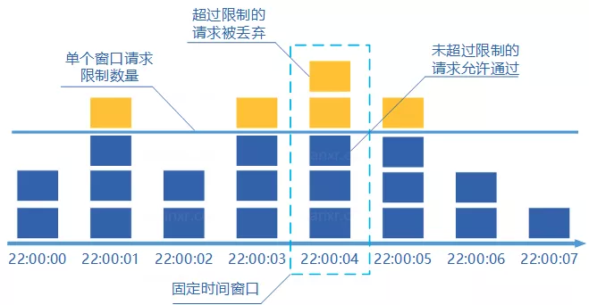
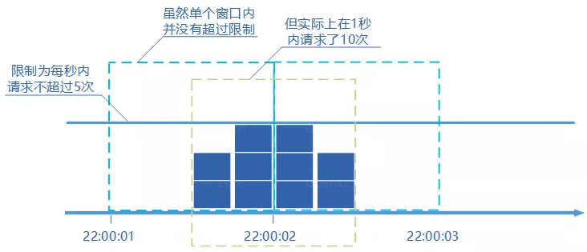
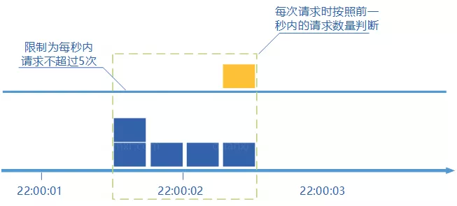
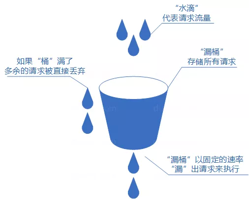
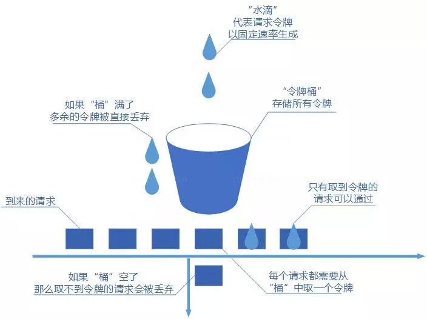

[TOC]

### 限流

#### 基础

限流可以认为**服务降级**的一种，限流就是**限制系统的输入和输出流量已达到保护系统的目的**。一般来说系统的吞吐量是可以被测算的，为了保证系统的稳定运行，一旦达到的需要限制的阈值，就需要限制流量并采取一些措施以完成限制流量的目的。比如：**延迟处理，拒绝处理，或者部分拒绝处理**等等。

限流可以应对：

- 热点业务带来的突发请求。
- 调用方 bug 导致的突发请求。
- 恶意攻击请求。

#### 限流方法

实现限流有很多办法，在程序中时通常是根据**每秒处理的事务数** (Transactionpersecond) 来衡量接口的流量。

##### 1. 固定窗口计数器算法

###### (1) 概述

固定窗口计数器算法概念如下：

- 将时间划分为**多个窗口**。
- 在每个窗口内每有一次请求就将**计数器加一**。
- 如果计数器超过了限制数量，则本窗口内所有的请求都被丢弃，当时间到达下一个窗口时，计数器**重置**。



固定窗口计数器是最为简单的算法，但这个算法有时会让通过请求量允许为限制的两倍。考虑如下情况：限制 1 秒内最多通过 5 个请求，在第一个窗口的**最后半秒内通过了 5 个请求**，第二个窗口的前半秒内又**通过了 5 个请求**。这样看来就是在 1 秒内通过了 **10 个请求**。


这种限流算法**无法保证限流速率**，因而无法保证突然激增的流量。比如我们限制一个接口一分钟只能访问 10 次的话，前半分钟一个请求没有接收，后半分钟接收了10个请求。

###### (2) 代码实现

**控制单位时间内的请求数量**。

``` java
import java.util.concurrent.atomic.AtomicInteger;

public class Counter {
    /**
     * 最大访问数量
     */
    private final int limit = 10;
    /**
     * 访问时间差
     */
    private final long timeout = 1000;
    /**
     * 请求时间
     */
    private long time;
    /**
     * 当前计数器
     */
    private AtomicInteger reqCount = new AtomicInteger(0);

    public boolean limit() {
        long now = System.currentTimeMillis();
        if (now < time + timeout) {
            // 单位时间内
            reqCount.addAndGet(1);
            return reqCount.get() <= limit;
        } else {
            // 超出单位时间
            time = now;
            reqCount = new AtomicInteger(0);
            return true;
        }
    }
}
```

不足：**请求量是不知道的**。假设在 00:01 时发生一个请求，在 00:01-00:58 之间不发送请求，在 00:59 时发送**剩下的所有请求 n-1** (n 为限流请求数量)，再下一分钟的 00:01 发送 n 个请求，这样在 2 秒钟内请求到达了 2n - 1 个。

##### 2. 滑动窗口计数器算法

###### (1) 概述

滑动窗口是对计数器方式的改进, 增加一个**时间粒度的度量单位**。把一分钟分成若干等分(6份，每份 10 秒)，在每一份上设置独立计数器，在 00:00-00:09 之间发生请求计数器累加 1。当等分数量越大限流统计就越详细。



滑动窗口计数器算法概念如下：

- 将时间划分为**多个区间**。
- 在每个区间内每有一次请求就将计数器加一维持一个时间窗口，占据多个区间。
- 每经过一个区间的时间，则抛弃最老的一个区间，并纳入最新的一个区间。
- 如果当前窗口内区间的请求计数总和超过了限制数量，则本窗口内所有的请求都被丢弃。

滑动窗口计数器是通过将窗口再细分，并且**按照时间"滑动"**，这种算法避免了固定窗口计数器带来的双倍突发请求，但时间区间的精度越高，算法所需的空间容量就越大。

###### (2) 代码实现

``` java
import java.util.Iterator;
import java.util.Random;
import java.util.concurrent.ConcurrentLinkedQueue;
import java.util.stream.IntStream;

public class TimeWindow {
    private ConcurrentLinkedQueue<Long> queue = new ConcurrentLinkedQueue<Long>();

    /**
     * 间隔秒数
     */
    private int seconds;

    /**
     * 最大限流
     */
    private int max;

    public TimeWindow(int max, int seconds) {
        this.seconds = seconds;
        this.max = max;

        /**
         * 永续线程执行清理queue 任务
         */
        new Thread(() -> {
            while (true) {
                try {
                    // 等待 间隔秒数-1 执行清理操作
                    Thread.sleep((seconds - 1) * 1000L);
                } catch (InterruptedException e) {
                    e.printStackTrace();
                }
                clean();
            }
        }).start();

    }

    public static void main(String[] args) throws Exception {

        final TimeWindow timeWindow = new TimeWindow(10, 1);

        // 测试3个线程
        IntStream.range(0, 3).forEach((i) -> {
            new Thread(() -> {
                while (true) {
                    try {
                        Thread.sleep(new Random().nextInt(20) * 100);
                    } catch (InterruptedException e) {
                        e.printStackTrace();
                    }
                    timeWindow.take();
                }
            }).start();
        });
    }

    /**
     * 获取令牌，并且添加时间
     */
    public void take() {
        long start = System.currentTimeMillis();
        try {
            int size = sizeOfValid();
            if (size > max) {
                System.err.println("超限");
            }
            synchronized (queue) {
                if (sizeOfValid() > max) {
                    System.err.println("超限");
                    System.err.println("queue中有 " + queue.size() 
                                       + " 最大数量 " + max);
                }
                this.queue.offer(System.currentTimeMillis());
            }
            System.out.println("queue中有 " + queue.size() + " 最大数量 " + max);
        }
    }

    public int sizeOfValid() {
        Iterator<Long> it = queue.iterator();
        Long ms = System.currentTimeMillis() - seconds * 1000;
        int count = 0;
        while (it.hasNext()) {
            long t = it.next();
            if (t > ms) {
                // 在当前的统计时间范围内
                count++;
            }
        }
        return count;
    }

    /**
     * 清理过期的时间
     */
    public void clean() {
        Long c = System.currentTimeMillis() - seconds * 1000;
        Long tl = null;
        while ((tl = queue.peek()) != null && tl < c) {
            System.out.println("清理数据");
            queue.poll();
        }
    }
}
```

##### 3. 漏桶算法

###### (1) 概述

漏桶算法概念如下：

- 将每个**请求**视作"**水滴**"放入"漏桶"进行存储。
- “漏桶"以**固定速率向外"漏"出请求来执行**，如果"漏桶"空了则停止"漏水”。
- 如果"漏桶"满了则多余的"水滴"会被**直接丢弃**。

漏桶算法多使用**队列实**现，服务的请求会存到队列中，服务的提供方则按照**固定的速率从队列中**取出请求并执行，过多的请求则放在队列中排队或直接拒绝。



漏桶算法的缺陷也很明显，当短时间内有**大量的突发请求**时，即便此时服务器没有任何负载，**每个请求也都得在队列中等待一段时间才能被响应**。

###### (2) 代码实现

``` java
public class LeakBucket {
    /**
     * 时间
     */
    private long time;
    /**
     * 总量
     */
    private Double total;
    /**
     * 水流出去的速度
     */
    private Double rate;
    /**
     * 当前总量
     */
    private Double nowSize;

    public boolean limit() {
        long now = System.currentTimeMillis();
        nowSize = Math.max(0, (nowSize - (now - time) * rate));
        time = now;
        if ((nowSize + 1) < total) {
            nowSize++;
            return true;
        } else {
            return false;
        }
    }
}
```

##### 4. 令牌桶算法

###### (1) 概述

规定固定容量的桶，**token 以固定速度往桶内填充**，当桶满时 token 不会被继续放入，每过来一个请求把 token 从桶中移除，如果桶中没有 token 则不能请求。



令牌桶算法概念如下：

- **令牌以固定速率生成**。
- 生成的令牌放入令牌桶**中存放**，如果令牌桶满了则多余的**令牌会直接丢弃**，当请求到达时，会尝试从令牌桶中**取令牌**，取到了令牌的请求可以执行。
- 如果桶空了，那么尝试取令牌的请求会被**直接丢弃**。

令牌桶算法既能够将所有的请求**平均分布到时间区间内**，又能接受服务器能够承受范围内的突发请求，因此是目前使用**较为广泛的一种限流算法**。

###### (2) 代码实现

``` java
public class TokenBucket {
    /**
     * 时间
     */
    private long time;
    /**
     * 总量
     */
    private Double total;
    /**
     * token 放入速度
     */
    private Double rate;
    /**
     * 当前总量
     */
    private Double nowSize;

    public boolean limit() {
        long now = System.currentTimeMillis();
        nowSize = Math.min(total, nowSize + (now - time) * rate);
        time = now;
        if (nowSize < 1) {
            // 桶里没有token
            return false;
        } else {
            // 存在token
            nowSize -= 1;
            return true;
        }
    }
}
```

此外，Google 的开源项目 guava 提供了 **RateLimiter 类**，实现了**单点的令牌桶限流**。


#### 框架

##### 1. Spring cloud gateway

* Spring cloud gateway 默认使用 Redis 进行限流。

``` xml
<dependency>
    <groupId>org.springframework.cloud</groupId>
    <artifactId>spring-cloud-starter-gateway</artifactId>
</dependency>
<dependency>
    <groupId>org.springframework.boot</groupId>
    <artifactId>spring-boot-starter-data-redis-reactive</artifactId>
</dependency>
```

``` yaml
spring:
  cloud:
    gateway:
      routes:
      - id: requestratelimiter_route
        uri: lb://pigx-upms
        order: 10000
        predicates:
        - Path=/admin/**
        filters:
        - name: RequestRateLimiter
          args:
            redis-rate-limiter.replenishRate: 1  # 令牌桶的容积
            redis-rate-limiter.burstCapacity: 3  # 流速 每秒
            key-resolver: "#{@remoteAddrKeyResolver}" #SPEL表达式去的对应的bean
        - StripPrefix=1
```

``` java
@Bean
KeyResolver remoteAddrKeyResolver() {
    return exchange -> Mono.just(exchange.getRequest().getRemoteAddress().getHostName());
}
```

##### 2. Sentinel

**通过配置来控制每个 url 的流量**。

``` xml
<dependency>
    <groupId>com.alibaba.cloud</groupId>
    <artifactId>spring-cloud-starter-alibaba-sentinel</artifactId>
</dependency>
```

``` yaml
spring:
  cloud:
    nacos:
      discovery:
        server-addr: localhost:8848
    sentinel:
      transport:
        dashboard: localhost:8080
        port: 8720
      datasource:
        ds:
          nacos:
            server-addr: localhost:8848
            dataId: spring-cloud-sentinel-nacos
            groupId: DEFAULT_GROUP
            rule-type: flow
            namespace: xxxxxxxx
```

配置内容在 nacos 上进行编辑。

``` json
[
    {
        "resource": "/hello",
        "limitApp": "default",
        "grade": 1,
        "count": 1,
        "strategy": 0,
        "controlBehavior": 0,
        "clusterMode": false
    }
]
```

* **resource**：资源名，即限流规则的作用对象。
* **limitApp**：流控针对的调用来源，若为 default 则不区分调用来源。
* **grade**：限流阈值类型，QPS 或线程数模式，0代表根据并发数量来限流，1代表根据QPS来进行流量控制。
* **count**：限流阈值。
* **strategy**：判断的根据是资源自身，还是根据其它关联资源 (refResource)，还是根据链路入口。
* **controlBehavior**：流控效果（直接拒绝 / 排队等待 / 慢启动模式）。
* **clusterMode**：是否为**集群模式**。


