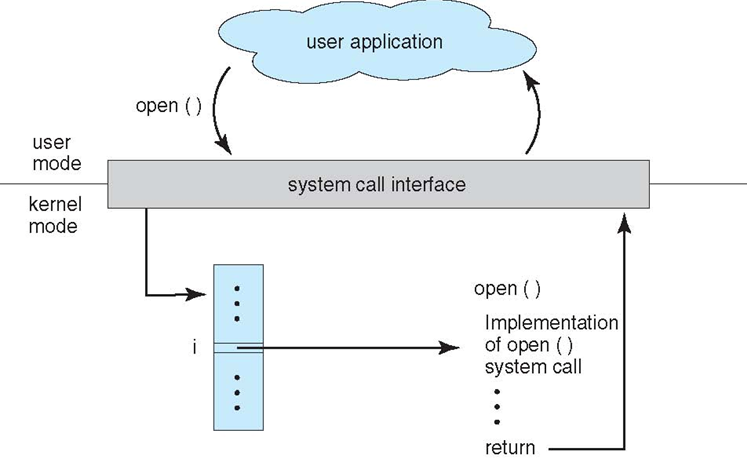
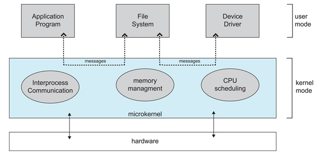

[TOC]

### 操作系统概述

#### 什么是OS？

1. **操作系统是什么概念操作系统（Operating System，简称 OS）是管理计算机硬件与软件资源的程序，是计算机系统的内核与基石；**
2. **操作系统本质上是运行在计算机上的软件程序 ；**
3. **操作系统为用户提供一个与系统交互的操作界面 ；**
4. **操作系统分内核与外壳（我们可以把外壳理解成围绕着内核的应用程序，而内核就是能操作硬件的程序）。**

关于内核多插一嘴：内核负责管理系统的进程、内存、设备驱动程序、文件和网络系统等等，决定着系统的性能和稳定性。是连接应用程序和硬件的桥梁。内核就是操作系统背后黑盒的核心。

#### 基本特征

##### 1. 并发

并发是指宏观上在一段时间内能同时运行多个程序，而并行则指同一时刻能运行多个指令。

并行需要硬件支持，如多流水线、多核处理器或者分布式计算系统。

操作系统通过引入进程和线程，使得程序能够并发运行。

##### 2. 共享

共享是指系统中的资源可以被多个并发进程共同使用。

有两种共享方式：**互斥共享和同时共享**。

互斥共享的资源称为临界资源，例如打印机等，在同一时间只允许一个进程访问，需要用同步机制来实现对临界资源的访问。

##### 3. 虚拟

虚拟技术把一个物理实体转换为**多个逻辑实体**。

主要有两种虚拟技术：**时分复用技术**和**空分复用技术**。

多个进程能在同一个处理器上并发执行使用了时分复用技术，让每个进程轮流占有处理器，每次只执行一小个时间片并快速切换。

**虚拟内存**使用了空分复用技术，它将物理内存抽象为地址空间，每个进程都有各自的地址空间。地址空间的页被映射到物理内存，地址空间的页并不需要全部在物理内存中，当使用到一个没有在物理内存的页时，执行**页面置换算法**，将该页置换到内存中。

##### 4. 异步

异步指进程不是一次性执行完毕，而是走走停停，以不可知的速度向前推进。

#### 基本功能

##### 1. 进程管理

进程控制、进程同步、进程通信、死锁处理、处理机调度等。

##### 2. 内存管理

内存分配、地址映射、内存保护与共享、虚拟内存等。

##### 3. 文件管理

文件存储空间的管理、目录管理、文件读写管理和保护等。

##### 4. 设备管理

完成用户的 I/O 请求，方便用户使用各种设备，并提高设备的利用率。

主要包括缓冲管理、设备分配、设备处理、虛拟设备等。

#### 系统调用

##### 1. 用户态与系统态

根据进程访问资源的特点，我们可以把**进程**在系统上的运行分为**两个级别**：

1. **用户态(user mode)** ：用户态运行的进程或可以直接读取**用户程序**的数据。
2. **系统态(kernel mode)**：可以简单的理解系统态运行的进程或程序几乎可以访问计算机的任何资源，不受限制。

为什么需要两个？

在 CPU 的所有指令中，有些指令是非常危险的，如果使用不当，将会造成系统崩溃等后果。

为了避免这种情况发生，CPU 将指令划分为**特权级(内核态)指令**和**非特权级(用户态)指令。**

**对于那些危险的指令只允许内核及其相关模块调用，对于那些不会造成危险的指令，就允许用户应用程序调用。**

* 内核态(核心态,特权态): **内核态是操作系统内核运行的模式。**
    内核态控制计算机的硬件资源，如硬件设备，文件系统等等，并为上层应用程序提供执行环境。

* 用户态: **用户态是用户应用程序运行的状态。**
    应用程序必须依托于内核态运行,因此用户态的态的操作权限比内核态是要低的，
    如磁盘，文件等，访问操作都是受限的。
* 系统调用: 系统调用是操作系统为应用程序提供能够访问到内核态的资源的接口。

我们运行的**程序基本都是运行在用户态**，如果我们调用操作系统提供的系统态级别的子功能咋办呢？那就需要**系统调用**了！

也就是说在我们运行的用户程序中，凡是与系统态级别的资源有关的操作（如文件管理、进程控制、内存管理等)，都必须通过系统调用方式向操作系统提出服务请求，并由操作系统代为完成。

**用户态切换到内核态的几种方式**

* **系统调用**: 系统调用是用户态主动要求切换到内核态的一种方式，
    用户应用程序通过操作系统调用内核为上层应用程序开放的接口来执行程序。
* **异常**: 当 CPU 在执行用户态的应用程序时，发生了某些不可知的异常。
    于是当前用户态的应用进程切换到处理此异常的内核的程序中去。
* **硬件设备的中断**: 当硬件设备完成用户请求后，会向 CPU 发出相应的中断信号，
    这时 CPU 会暂停执行下一条即将要执行的指令，转而去执行与中断信号对应的应用程序，
    如果先前执行的指令是用户态下程序的指令，那么这个转换过程也是用户态到内核态的转换。

##### 2. 系统调用

如果一个进程在**用户态**需要使用**内核态的功能**，就进行系统调用从而**陷入内核**，由操作系统代为完成。

这些系统调用按功能大致可分为如下几类：

- **设备管理**。完成设备的请求或释放，以及设备启动等功能。
- **文件管理**。完成文件的读、写、创建及删除等功能。
- **进程控制**。完成进程的创建、撤销、阻塞及唤醒等功能。
- **进程通信**。完成进程之间的消息传递或信号传递等功能。
- **内存管理**。完成内存的分配、回收以及获取作业占用内存区大小及地址等功能。

Linux 的系统调用主要有以下这些：

|     Task     | Commands                               |
| :----------: | -------------------------------------- |
| **进程控制** | **fork**(); **exit**(); **wait**();    |
| **进程通信** | **pipe**(); **shmget**(); mmap();      |
| **文件操作** | **open**(); **read**(); **write**();   |
| **设备操作** | ioctl(); **read**(); write();          |
| **信息维护** | **getpid**(); alarm(); **sleep**();    |
|   **安全**   | **chmod**(); **umask**(); **chown**(); |

#### 大内核和微内核

##### 1. 大内核

大内核是将操作系统功能作为一个紧密结合的整体放到内核。

由于各模块共享信息，因此有很高的性能。

##### 2. 微内核

由于操作系统不断复杂，因此将一部分操作系统功能移出内核，从而降低内核的复杂性。移出的部分根据分层的原则划分成**若干服务**，相互独立。

在微内核结构下，操作系统被划分成小的、定义良好的**模块**，只有微内核这一个模块运行在内核态，其余模块运行在**用户态**。

因为需要频繁地在用户态和核心态之间进行**切换**，所以会有一定的性能损失。

#### 中断分类

##### 1. 外中断

由 CPU 执行指令以外的事件引起，如 I/O 完成中断，表示设备输入/输出处理已经完成，处理器能够发送下一个输入/输出请求。此外还有时钟中断、控制台中断等。

##### 2. 异常

由 CPU 执行指令的内部事件引起，如非法操作码、地址越界、算术溢出等。

##### 3. 陷入

在用户程序中使用系统调用。

