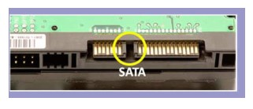
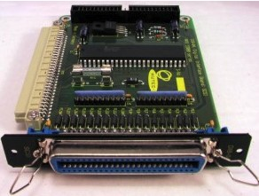
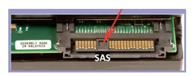
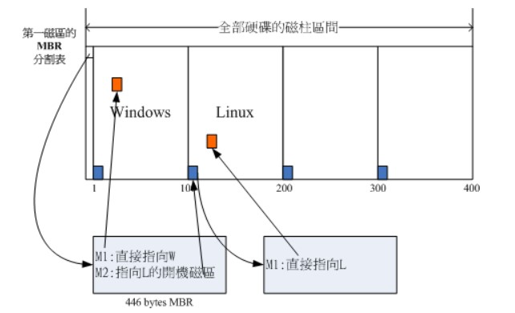

[TOC]

### Linux基础与硬件

#### 磁盘接口

##### 1. IDE

IDE（ATA）全称 Advanced Technology Attachment，接口速度最大为 133MB/s，因为并口线的抗干扰性太差，且排线占用空间较大，不利电脑内部散热，已逐渐被 **SATA** 所取代。


##### 2. SATA

SATA 全称 Serial ATA，也就是使用中断，抗干扰性强，且对数据线的长度要求比 ATA 低很多，支持热插拔等功能。SATA-II 的接口速度为 300MiB/s，而新的 SATA-III 标准可达到 600MiB/s 的传输速度。SATA 的数据线也比 ATA 的细得多，有利于机箱内的空气流通，整理线材也比较方便。



##### 3. SCSI

**SCSI** 全称是 Small Computer System Interface（小型机系统接口），经历多代的发展，从早期的 SCSI-II 到目前的 Ultra320 SCSI 以及 Fiber-Channel（光纤通道），接口型式也多种多样。SCSI 硬盘广为工作站以及个人电脑以及服务器所使用，因此会使用较为先进的技术，如碟片转速 15000rpm 的高转速，且传输时 CPU 占用率较低，但是单价也比相同容量的 ATA 及 SATA 硬盘更加昂贵。



##### 4. SAS

SAS（Serial Attached SCSI）是新一代的 SCSI 技术，和 SATA 硬盘相同，都是采取序列式技术以获得更高的传输速度，可达到 6Gb/s。此外也通过缩小连接线改善系统内部空间等。




#### 磁盘的文件名

Linux 中每个**硬件**都被当做**一个文件**，包括磁盘。**磁盘以磁盘接口类型进行命名**，常见磁盘的文件名如下：

- **IDE 磁盘：/dev/hd[a-d]**
- **SATA/SCSI/SAS 磁盘：/dev/sd[a-p]**

其中文件名后面的序号的确定与系统检测到磁盘的顺序有关，而与磁盘所插入的插槽位置无关。


#### 分区表

磁盘分区表主要有两种格式，一种是限制较多的 MBR 分区表，一种是较新且限制较少的 GPT 分区表。

##### 1. MBR

MBR 中，**第一个扇区**最重要，里面有主要**开机记录**（Master boot record, MBR）及**分区表**（partition table），其中主要开机记录占 446 bytes，分区表占 64 bytes。

分区表只有 64 bytes，最多只能存储 **4 个分区**，这 4 个分区为**主分区（Primary）和扩展分区（Extended）**。其中**扩展分区只有一个**，它使用其它扇区来记录额外的分区表，因此通过扩展分区可以分出更多分区，这些分区称为**逻辑分区**。

Linux 也把分区当成**文件**，分区文件的命名方式为：磁盘文件名 + 编号，例如 /dev/sda1。注意，逻辑分区的编号**从 5 开始**。

##### 2. GPT

不同的磁盘有不同的**扇区**大小，例如 512 bytes 和最新磁盘的 4 k。GPT 为了兼容所有磁盘，在定义扇区上使用**逻辑区块地址**（Logical Block Address, LBA），LBA 默认大小为 512 bytes。

GPT 第 1 个区块记录了**主要开机记录**（MBR），紧接着是 **33 个区块记录分区信息**，并把最后的 33 个区块用于对分区信息进行备份。这 33 个区块第一个为 GPT 表头纪录，这个部份纪录了分区表本身的位置与大小和备份分区的位置，同时放置了分区表的校验码 (CRC32)，操作系统可以根据这个校验码来判断 GPT 是否正确。若有错误，可以使用备份分区进行恢复。

GPT **没有扩展分区**概念，都是**主分区**，每个 LBA 可以分 4 个分区，因此总共可以分 4 * 32 = **128 个分区**。

MBR 不支持 2.2 TB 以上的硬盘，GPT 则最多支持到 2<sup>33</sup> TB = 8 ZB。


#### 开机检测程序

##### 1. BIOS

BIOS（Basic Input/Output System，基本输入输出系统），它是一个**固件**（嵌入在硬件中的软件），BIOS 程序存放在断电后内容不会丢失的只读内存中。


BIOS 是开机的时候计算机执行的第一个程序，这个程序知道可以开机的磁盘，并读取磁盘第一个扇区的主要开机记录（MBR），由主要开机记录（MBR）执行其中的开机管理程序，这个开机管理程序会加载**操作系统的核心文件**。

主要开机记录（MBR）中的开机管理程序提供以下功能：选单、载入核心文件以及转交其它开机管理程序。转交这个功能可以用来实现多重引导，只需要将另一个操作系统的开机管理程序安装在其它分区的启动扇区上，在启动开机管理程序时，就可以通过选单选择启动当前的操作系统或者转交给其它开机管理程序从而启动另一个操作系统。

下图中，第一扇区的主要开机记录（MBR）中的开机管理程序提供了**两个选单：M1、M2**，M1 指向了 Windows 操作系统，而 M2 指向其它分区的启动扇区，里面包含了另外一个开机管理程序，提供了一个指向 Linux 的选单。



安装**多重引导**，最好先安装 Windows 再安装 Linux。因为安装 Windows 时会**覆盖掉主要开机记录（MBR）**，而 Linux 可以选择将开机管理程序安装在主要开机记录（MBR）或者其它分区的启动扇区，并且可以设置开机管理程序的选单。

##### 2. UEFI

BIOS 不可以读取 GPT 分区表，而 **UEFI 可以**。


#### 求助

##### 1. --help

指令的基本用法与选项介绍。

##### 2. man

man 是 manual 的缩写，将指令的具体信息显示出来。

当执行 `man date` 时，有 DATE(1) 出现，其中的数字代表指令的类型，常用的数字及其类型如下：

| 代号 | 类型                                            |
| :--: | ----------------------------------------------- |
|  1   | 用户在 shell 环境中可以操作的指令或者可执行文件 |
|  5   | 配置文件                                        |
|  8   | 系统管理员可以使用的管理指令                    |

##### 3. info

info 与 man 类似，但是 info 将文档分成一个个页面，每个页面可以进行跳转。

##### 4. doc

/usr/share/doc 存放着软件的一整套说明文件。

---

#### 关机

##### 1. who

在关机前需要先使用 who 命令查看有没有其它用户在线。

##### 2. sync

为了**加快对磁盘文件的读写速度**，位于内存中的文件数据不会立即同步到磁盘上，因此关机之前需要先进行 **sync 同步**操作。

##### 3. shutdown

```html
# shutdown [-krhc] 时间 [信息]
-k ： 不会关机，只是发送警告信息，通知所有在线的用户
-r ： 将系统的服务停掉后就重新启动
-h ： 将系统的服务停掉后就立即关机
-c ： 取消已经在进行的 shutdown 指令内容
```

---

#### 包管理工具

**RPM** 和 **DPKG** 为最常见的两类软件包管理工具：

- RPM 全称为 Redhat Package Manager，最早由 Red Hat 公司制定实施，随后被 GNU 开源操作系统接受并成为很多 Linux 系统 (RHEL) 的既定软件标准。
- 与 RPM 竞争的是基于 Debian 操作系统 (Ubuntu) 的 DEB 软件包管理工具 DPKG，全称为 **Debian Package**，功能方面与 RPM 相似。

YUM 基于 RPM，具有依赖管理和软件升级功能。

----

#### 发行版

Linux 发行版是 Linux 内核及各种应用软件的集成版本。

| 基于的包管理工具 | 商业发行版 |   社区发行版    |
| :--------------: | :--------: | :-------------: |
|       RPM        |  Red Hat   | Fedora / CentOS |
|       DPKG       |   Ubuntu   |     Debian      |

---

#### VIM 三个模式

- 一般指令模式（Command mode）：VIM 的默认模式，可以用于移动游标查看内容；
- 编辑模式（Insert mode）：按下 "i" 等按键之后进入，可以对文本进行编辑；
- 指令列模式（Bottom-line mode）：按下 ":" 按键之后进入，用于保存退出等操作。


在指令列模式下，有以下命令用于离开或者保存文件。

| 命令 |                             作用                             |
| :--: | :----------------------------------------------------------: |
|  :w  |                           写入磁盘                           |
| :w!  | 当文件为只读时，强制写入磁盘。到底能不能写入，与用户对该文件的权限有关 |
|  :q  |                             离开                             |
| :q!  |                        强制离开不保存                        |
| :wq  |                      **写入磁盘后离开**                      |
| :wq! |                      强制写入磁盘后离开                      |

----

#### GNU

GNU 计划，译为革奴计划，它的目标是创建一套完全自由的操作系统，称为 GNU，其内容软件完全以 **GPL** 方式发布。其中 GPL 全称为 GNU 通用公共许可协议，包含了以下内容：

- 以任何目的运行此程序的自由；
- 再复制的自由；
- 改进此程序，并公开发布改进的自由。


