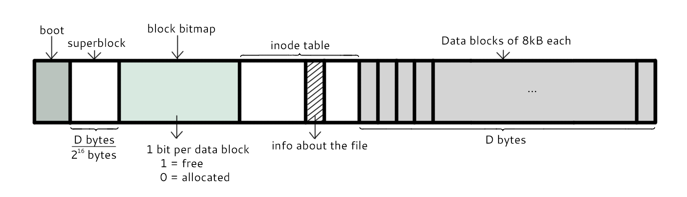
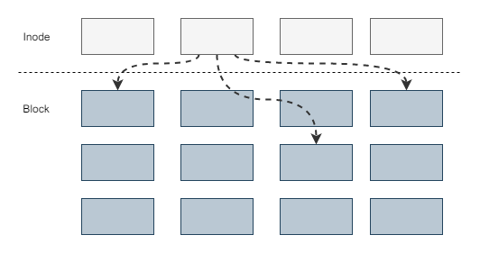
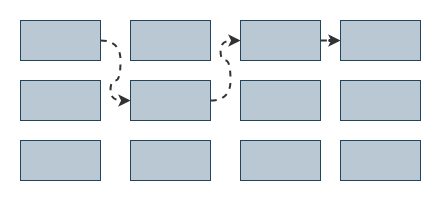
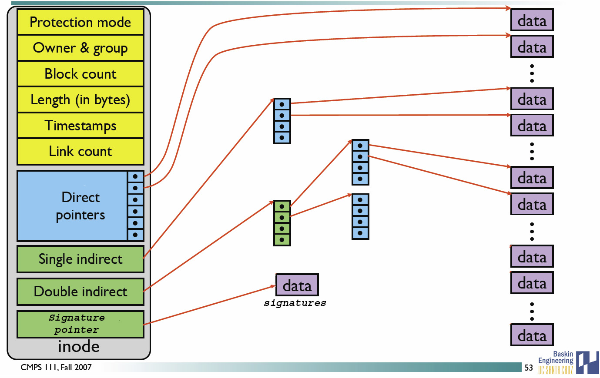
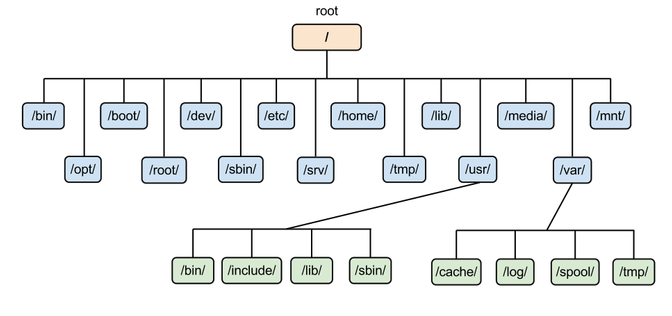
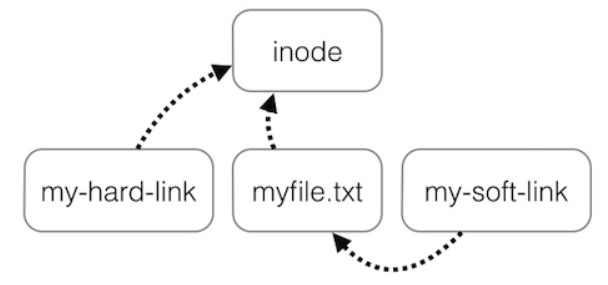
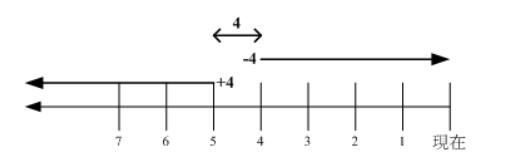

[TOC]

### Linux文件系统与文件

#### 文件系统

**在Linux操作系统中，所有被操作系统管理的资源，例如网络接口卡、磁盘驱动器、打印机、输入输出设备、普通文件或是目录都被看作是一个文件。**

也就是说在LINUX系统中有一个重要的概念：**一切都是文件**。其实这是UNIX哲学的一个体现，而Linux是重写UNIX而来，所以这个概念也就传承了下来。在UNIX系统中，把一切资源都看作是文件，包括硬件设备。UNIX系统把每个硬件都看成是一个文件，通常称为设备文件，这样用户就可以用读写文件的方式实现对硬件的访问。

##### 1. 分区与文件系统 

对分区进行格式化是为了在**分区上建立文件系统**。一个分区通常只能格式化为一个文件系统，但是**磁盘阵列**等技术可以将一个分区格式化为**多个**文件系统。

##### 2. 组成

最主要的几个组成部分如下：

- **==inode==**：一个**文件**占用一个 inode，记录文件的**属性**，同时记录此文件的**内容所在的 block 编号**；
- **==block==**：记录文件的**内容**，文件太大时，会占用多个 block。

除此之外还包括：

- **==superblock==**：记录文件系统的**整体信息**，包括 inode 和 block 的总量、使用量、剩余量，以及文件系统的格式与相关信息等；
- **block bitmap**：记录 block 是否被使用的位域。

下面的图甚妙。



##### 3. 文件读取

对于 ==Ext2== 文件系统，当要读取一个文件的内容时，先在 **inode** 中去查找文件内容所在的所有 **block**，然后把所有 block 的内容读出来。



而对于 ==FAT== 文件系统，它**没有 inode**，每个 block 中存储着**下一个 block** 的编号，链式存储 block 编号。



##### 4. 磁盘碎片

指一个文件内容所在的 block 过于**分散**，导致磁盘磁头移动距离过大，从而降低磁盘读写性能。


#### block

在 **Ext2** 文件系统中所支持的 block 大小有 **1K，2K 及 4K** 三种，不同的大小限制了单个文件和文件系统的最大大小。

|     大小     | 1KB  |  2KB  | 4KB  |
| :----------: | :--: | :---: | :--: |
| 最大单一文件 | 16GB | 256GB | 2TB  |
| 最大文件系统 | 2TB  |  8TB  | 16TB |

一个 block 只能被**一个文件**所使用，未使用的部分直接浪费了。因此如果需要存储大量的小文件，那么最好选用比较小的 block。


#### inode

文件存储在硬盘上，硬盘的最小存储单位是扇区(Sector),每个扇区存储 512 字节(0.5kb)。操作系统读取硬盘的数据时，不会一个扇区一个扇区的读取，这样做效率较低，而是**一次读取多个扇区，即一次读取一个块(block)。块由多个扇区组成，是文件读取的最小单位，块的最常见的大小是 4kb，约为 8 个连续的扇区组成。文件数据存储在块中**。

但还需要一个空间来存储文件的**元信息 metadata**，如文件拥有者，创建时间，权限，大小等。这种**存储文件元信息的区域就叫 inode，译为索引节点。 每个文件都有一个 inode，存储文件的元信息。**

**使用 stat 命令可以查看文件的 inode 信息。每个 inode 都有一个号码，Linux/Unix 操作系统不使用文件名来区分文件，而是使用 inode 号码区分不同的文件。**

inode 具体包含以下信息（文件的属性）：

- **权限** (read/write/excute)；
- 拥有者与群组 (owner/group)；
- 容量；
- 建立或状态改变的时间 (ctime)；
- 最近一次的读取时间 (atime)；
- 最近修改的时间 (mtime)；
- 定义文件特性的旗标 (flag)，如 SetUID...；
- 该文件真正内容的**指向** (pointer)。

inode 具有以下特点：

- 每个 inode 大小均**固定为 128 bytes** (新的 ext4 与 xfs 可设定到 256 bytes)；
- **每个文件**都仅会占用一个 **inode**。

inode 中记录了文件内容所在的 block 编号，但是每个 block 非常小，一个大文件随便都需要几十万的 block。而一个 inode 大小有限，无法直接引用这么多 block 编号。因此引入了**间接、双间接、三间接引用**。间接引用是指，让 inode 记录的引用 **block 块记录引用信息**。




#### 目录

建立一个**目录**时，会分配一个 **inode** 与**至少一个 block**。**block 记录**的内容是目录下所有**文件的 inode 编号以及文件名**。

可以看出**文件的 inode 本身不记录文件名**，**文件名**记录在**目录**中，因此新增文件、删除文件、更改文件名这些操作与**目录的 w 权限**有关。


#### 日志

如果突然断电，那么文件系统会发生错误，例如断电前只修改了 block bitmap，而还没有将数据真正写入 block 中。

ext3/ext4 文件系统引入了**日志功能**，可以利用日志来修复文件系统。


#### 挂载

挂载利用**目录**作为**文件系统的进入点**，也就是说，进入**目录**之后就可以读取**文件系统**的数据。


#### 目录配置


为了使不同 **Linux 发行版本**的目录结构保持一致性，Filesystem Hierarchy Standard (FHS) 规定了 Linux 的目录结构。最基础的三个目录如下：

- ==/== (root, 根目录)
- ==/usr== (unix software resource)：所有系统**默认软件**都会安装到这个目录；
- ==/var== (variable)：存放系统或程序运行过程中的**数据文件**。



**常见目录说明：**

- **/bin：** 存放**二进制可执行文件**(ls、cat、mkdir等)，常用命令一般都在这里；
- **/etc：**  存放**系统管理和配置文件**；
- **/home：**  存放所有**用户文件**的根目录，是用户主目录的基点，比如用户 user 的主目录就是 /home/user，可以用~user 表示；
- **/usr ：** 用于存放**系统应用程序**；
- **/opt：** **额外安装的可选应用程序包**所放置的位置。一般情况下，我们可以把 tomcat 等都安装到这里；
- **/proc：**  虚拟文件系统目录，是系统内存的映射。可直接访问这个目录来获取系统信息；
- **/root：**  超级用户（系统管理员）的主目录（特权阶级^o^）；
- **/sbin:**  存放二进制可执行文件，只有root才能访问。这里存放的是系统管理员使用的系统级别的管理命令和程序。如ifconfig等；
- **/dev：** 用于存放设备文件；
- **/mnt：** 系统管理员安装临时文件系统的安装点，系统提供这个目录是让用户临时挂载其他的文件系统；
- **/boot：**  存放用于系统引导时使用的各种文件；
- **/lib ：**      存放着和系统运行相关的库文件 ；
- **/tmp：** 用于存放各种临时文件，是公用的临时文件存储点；
- **/var：** 用于存放运行时需要改变数据的文件，也是某些大文件的溢出区，比方说各种服务的日志文件（系统启动日志等。）等；
- **/lost+found：**  这个目录平时是空的，系统非正常关机而留下“无家可归”的文件（windows下叫什么.chk）就在这里。


#### 文件类型

Linux支持很多文件类型，其中非常重要的文件类型有：普通文件，目录文件，链接文件，设备文件，管道文件，Socket 套接字文件等。

**普通文件**: 普通文件是指txt,html,pdf等等的这样应用层面的文件类型，用户可以根据访问权限对普通文件进行访问，修改和删除。

**目录文件**: 目录也是一种文件，打开目录实际上是打开目录文件。目录文件包含了它目录下的所有文件名以及指向这些文件的指针。

**链接文件**: 链接文件分为符号链接(软链接)文件和硬链接文件

- 硬链接(Hard Link):硬链接的文件拥有相同的inode，因为操作系统是靠inode来区分文件的，2个inode相同的文件，就代表它们是一个文件。删除一个文件并不会对其他拥有相同inode的文件产生影响，只有当inode相同的所有文件被删除了，这个文件才会被删除。换言之，你建立一个文件的硬链接，这个文件和硬链接它们的inode是相同的,无论你删除的是硬链接还是源文件，都不会对彼此造成影响,除非你把硬链接和源文件都删除，这个文件才被删除。
- 符号链接(软链接)(Symbolic Link): 符号链接类似于Windows上的快捷方式，它保存了源文件的路径。当符号链接被删除时，并不会影响源文件。但是当源文件被删除时，符号链接就找不到源文件了。

**设备文件**：设备文件分为块设备文件和字符设备文件,设备文件一般存于 **/dev** 目录下。**字符设备与块设备最根本的区别就是它们是否可以被随机访问。**

- 字符设备文件: **字符设备是依照先后顺序被存取数据的设备，通常不支持随机存取，
    此类设备可以按字节/字符来读取数据，** 如键盘，串口等等。

- 块设备文件: **块设备是可以被随机存取数据的设备，应用程序可以访问块设备上任何一块位置。
    块设备以块的方式读取数据，在windows下也称为簇，块设备不支持字符的方式寻址。**
    如硬盘，软盘，光碟等等。

**管道文件**: 管道文件一般用于进程间通信，使用mkfifo命令可以创建一个管道文件。

**Socket 套接字文件**: 套接字文件被用于网络进程之间的通信，既可以使2台不同的机器进行通信，也可以用于本机的Socket网络程序。

#### 文件属性

用户分为三种：文件拥有者、群组以及其它人，对不同的用户有不同的文件权限。

使用 ls 查看一个文件时，会显示一个文件的信息，例如 

```shell
drwxr-xr-x 3 root root 17 May 6 00:14 .config
```

对这个信息的解释如下：

- drwxr-xr-x：文件**类型以及权限**，第 1 位为文件**类型字段**，后 9 位为文件**权限字段**
- 3：**链接数**
- root：文件**拥有者**
- root：所属**群组**
- 17：文件大小
- May 6 00:14：文件最后被修改的时间
- .config：文件名

常见的文件类型及其含义有：

- d：**目录**
- -：**文件**
- l：链接文件

9 位的文件权限字段中，每 3 个为一组，共 3 组，每一组分别代表对**文件拥有者、所属群组以及其它人**的文件权限。一组权限中的 3 位分别为 **r、w、x** 权限，表示可读、可写、可执行。

文件时间有以下三种：

- modification time (mtime)：文件的内容更新就会更新；
- status time (ctime)：文件的状态（权限、属性）更新就会更新；
- access time (atime)：读取文件时就会更新。

---

#### 链接

```shell
# ln [-sf] source_filename dist_filename
-s ：默认是 hard link，加 -s 为 symbolic link
-f ：如果目标文件存在时，先删除目标文件
```



##### 1. 实体链接（硬链接）

在目录下创建一个条目，记录着文件名与 inode 编号，这个 inode 就是**源文件的 inode**。

**删除任意一个**条目，文件还是**存在**，只要**引用数量不为 0**。

有以下限制：**不能跨越文件系统、不能对目录进行链接**。

```bash
# ln /etc/crontab .
# ll -i /etc/crontab crontab
34474855 -rw-r--r--. 2 root root 451 Jun 10 2014 crontab
34474855 -rw-r--r--. 2 root root 451 Jun 10 2014 /etc/crontab
```

##### 2. 符号链接（软链接）

符号链接文件保存着**源文件所在的绝对路径**，在读取时会定位到**源文件**上，可以理解为 **Windows 的快捷方式。**

当**源文件**被删除了，链接文件就**打不开**了。

因为记录的是**路径**，所以可以为**==目录==建立链接**。

```bash
# ll -i /etc/crontab /root/crontab2
34474855 -rw-r--r--. 2 root root 451 Jun 10 2014 /etc/crontab
53745909 lrwxrwxrwx. 1 root root 12 Jun 23 22:31 /root/crontab2 -> /etc/crontab
```

---

#### 文件权限

##### 1. 修改权限

可以将一组权限用数字来表示，此时一组权限的 3 个位当做二进制数字的位，从左到右每个位的权值为 4、2、1，即每个权限对应的**数字权值为 r : 4、w : 2、x : 1**。

```bash
# chmod [-R] xyz dirname/filename
```

示例：将 .bashrc 文件的权限修改为 **-rwxr-xr--。**

```bash
# chmod 754 .bashrc
```

也可以使用**符号**来设定权限。

```bash
# chmod [ugoa]  [+-=] [rwx] dirname/filename
- u：拥有者
- g：所属群组
- o：其他人
- a：所有人
- +：添加权限
- -：移除权限
- =：设定权限
```

示例：为 .bashrc 文件的所有用户添加写权限。

```bash
# chmod a+w .bashrc
```

 对**文件和目录**而言，读写执行表示**不同的意义**。

 **对于文件：**

| 权限名称 |         可执行操作          |
| :------: | :-------------------------: |
|    r     | 可以使用 cat 查看文件的内容 |
|    w     |     可以修改文件的内容      |
|    x     |  可以将其运行为二进制文件   |

 对于目录：

| 权限名称 |        可执行操作        |
| :------: | :----------------------: |
|    r     |    可以查看目录下列表    |
|    w     | 可以创建和删除目录下文件 |
|    x     | 可以使用 **cd** 进入目录 |

需要注意的是超级用户可以无视普通用户的权限，即使文件目录权限是 000，依旧可以访问**。**
在 linux 中的每个用户必须属于一个组，不能独立于组外。在 linux 中每个文件有所有者、所在组、其它组的概念。

##### 2. 文件默认权限

- **文件**默认权限：文件**默认没有可执行权限**，因此为 **666**，也就是 ==-rw-rw-rw-== 。
- **目录**默认权限：目录必须要能够进入，也就是必须拥有可执行权限，因此为 **777** ，也就是 ==drwxrwxrwx==。

可以通过 **umask** 设置或者查看文件的**默认权限**，通常以掩码的形式来表示，例如 002 表示其它用户的权限去除了一个 2 的权限，也就是写权限，因此建立新文件时默认的权限为 -rw-rw-r--。

##### 3. 目录的权限

**文件名不是存储在一个文件的内容中，而是存储在一个文件所在的目录中**。因此，拥有文件的 **w 权限并不能对文件名进行修改**。文件名是存放在目录的 block 中的，所以要新增、删除、修改文件名需要**目录的 w 权限**。

==目录存储文件列表，一个目录的权限也就是对其**文件列表**的权限==。

因此，目录的 **r 权限**表示可以读取文件列表；

**w 权限**表示可以**修改**文件列表，就是添加、删除文件、对文件名**进行修改**；

**x 权限**可以让该目录成为工作目录（表示可以进入这个目录），x **权限是 r 和 w 权限**的**基础**，如果这个目录都不能进，也就没办法读取文件列表以及对文件列表进行修改了。

---

#### 文件与目录的基本操作

##### 1. ls

列出文件或者目录的信息，目录的信息就是其中包含的文件。

```shell
# ls [-aAdfFhilnrRSt] file|dir
-a ：列出全部的文件
-d ：仅列出目录本身
-l ：以长数据串行列出，包含文件的属性与权限等等数据
```

##### 2. cd

更换当前目录。

```shell
cd [相对路径或绝对路径]
cd # 进入home目录
```

##### 3. mkdir

创建目录。

```shell
# mkdir [-mp] 目录名称
-m ：配置目录权限
-p ：递归创建目录
```

##### 4. rmdir

删除目录，目录**必须为空**。

```bash
rmdir [-p] 目录名称
-p ：递归删除目录
```

##### 5. touch

更新**文件时间**或者**建立新文件**。

```bash
# touch [-acdmt] filename
-a ： 更新 atime
-c ： 更新 ctime，若该文件不存在则不建立新文件
-m ： 更新 mtime
-d ： 后面可以接更新日期而不使用当前日期，也可以使用 --date="日期或时间"
-t ： 后面可以接更新时间而不使用当前时间，格式为[YYYYMMDDhhmm]
```

##### 6. cp

**复制文件**。

如果源文件有两个以上，则目的文件一定要是**目录**才行。

```bash
cp [-adfilprsu] source destination
-a ：相当于 -dr --preserve=all 的意思，至于 dr 请参考下列说明
-d ：若来源文件为链接文件，则复制链接文件属性而非文件本身
-i ：若目标文件已经存在时，在覆盖前会先询问
-p ：连同文件的属性一起复制过去
-r ：递归持续复制
-u ：destination 比 source 旧才更新 destination，或 destination 不存在的情况下才复制
--preserve=all ：除了 -p 的权限相关参数外，还加入 SELinux 的属性, links, xattr 等也复制了
```

-r 代表递归拷贝。

##### 7. rm

**删除**文件。

```bash
# rm [-fir] 文件或目录
-r ：递归删除
```

##### 8. mv

**移动**文件。

```bash
# mv [-fiu] source destination
# mv [options] source1 source2 source3 .... directory
-f ： force 强制的意思，如果目标文件已经存在，不会询问而直接覆盖
```

----

#### 获取文件内容

##### 1. cat

取得文件内容。

```bash
# cat [-AbEnTv] filename
-n ：打印出行号，连同空白行也会有行号，-b 不会
```

##### 2. tac

是 cat 的**反向操作**，从最后一行开始打印。

##### 3. more

和 cat 不同的是它可以**一页一页**查看文件内容，比较适合大文件的查看。

##### 4. less

和 more 类似，但是多了一个向前翻页的功能。

##### 5. head

取得文件**前几行**。

```bash
# head [-n number] filename
-n ：后面接数字，代表显示几行的意思
```

##### 6. tail

是 head 的反向操作，只是取得是**后几行**。

##### 7. od

以字符或者十六进制的形式显示二进制文件。

----

#### 指令与文件搜索

##### 1. which

**指令搜索**。

```bash
# which [-a] command
-a ：将所有指令列出，而不是只列第一个
```

##### 2. whereis

**文件搜索**。速度比较快，因为它只搜索**几个特定的目录**。

```bash
# whereis [-bmsu] dirname/filename
```

##### 3. locate

**文件搜索**。可以用关键字或者正则表达式进行搜索。

locate 使用 /var/lib/mlocate/ 这个数据库来进行搜索，它存储在内存中，并且每天**更新一次**，所以无法用 locate 搜索新建的文件。可以使用 updatedb 来立即更新数据库。

```bash
# locate [-ir] keyword
-r：正则表达式
```

##### 4. find

**文件搜索**。可以使用文件的属性和权限进行搜索。

```bash
# find [basedir] [option]
example: find . -name "shadow*"
```

**① 与时间有关的选项** 

```bash
-mtime  n ：列出在 n 天前的那一天修改过内容的文件
-mtime +n ：列出在 n 天之前 (不含 n 天本身) 修改过内容的文件
-mtime -n ：列出在 n 天之内 (含 n 天本身) 修改过内容的文件
-newer file ： 列出比 file 更新的文件
```

+4、4 和 -4 的指示的时间范围如下：



**② 与文件拥有者和所属群组有关的选项** 

```bash
-uid n
-gid n
-user name
-group name
-nouser ：搜索拥有者不存在 /etc/passwd 的文件
-nogroup：搜索所属群组不存在于 /etc/group 的文件
```

**③ 与文件权限和名称有关的选项** 

```bash
-name filename
-size [+-]SIZE：搜寻比 SIZE 还要大 (+) 或小 (-) 的文件。这个 SIZE 的规格有：c: 代表 byte，k: 代表 1024bytes。所以，要找比 50KB 还要大的文件，就是 -size +50k
-type TYPE
-perm mode  ：搜索权限等于 mode 的文件
-perm -mode ：搜索权限包含 mode 的文件
-perm /mode ：搜索权限包含任一 mode 的文件
```


