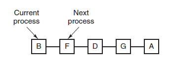
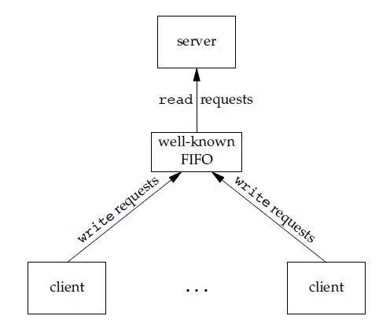
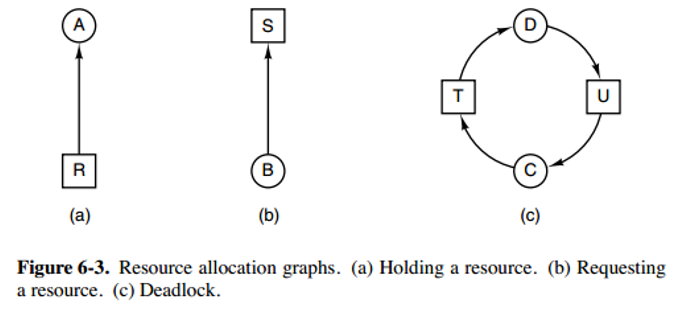

[TOC]

### 进程管理

#### 进程与线程

##### 1. 进程

进程是==资源分配==的基本单位。

下图显示了 4 个程序创建了 4 个进程，这 4 个进程可以并发地执行。


##### 2. 线程

线程是==独立调度==的基本单位。

一个进程中可以有多个线程，它们**共享**进程资源。 

QQ 和浏览器是两个进程，浏览器进程里面有很多线程，例如 HTTP 请求线程、事件响应线程、渲染线程等等，线程的并发执行使得在浏览器中点击一个新链接从而发起 HTTP 请求时，浏览器还可以响应用户的其它事件。

线程可以分为**用户级线程和内核线程**。


##### 3. 进程与线程区别

###### **① 拥有资源**

**进程是资源分配的基本单位**，但是线程**不拥有**资源，线程可以访问隶属进程的资源。

###### ② 调度

**线程是独立调度的基本单位**，在同一进程中，线程的切换不会引起进程切换，从一个进程中的线程切换到另一个进程中的线程时，会引起进程切换。

###### ③ 系统开销

**进程在创建、撤销、切换时的开销远大于线程。**

由于创建或撤销进程时，系统都要为之分配或回收资源，如内存空间、I/O 设备等，所付出的开销远大于创建或撤销线程时的开销。类似地，在进行进程切换时，涉及当前执行进程 CPU 环境的保存及新调度进程 CPU 环境的设置，而**线程切换**时只需保存和设置少量寄存器内容，**开销很小**。

###### ④ 通信方面

线程间可以通过**直接读写同一进程**中的**数据**进行通信，但是**进程通信需要借助 IPC**（Inter-Process Communication，进程间通信）。

###### ⑤ 其他

每个线程都有一个程序计数器（记录要执行的下一条指令）、一组寄存器（保存当前线程的工作变量）、堆栈（记录执行历史）。


#### 进程描述符

##### 1. 进程控制块

**进程控制块** (Process Control Block, PCB) 描述进程的**基本信息和运行状态**，所谓的创建进程和撤销进程，都是指对 PCB 的操作。

一个简化版本的进程控制块如下。


采用C语言的 task_struct 表示，包含用于表示进程的所有必要信息。在 Linux 内核中，所有活动进程的标识都采用 task_struct 的双向链表。内核采用一个指针即 current， 用于指向当前系统正在执行的进程。


#### 进程状态

##### 1. 五状态模型


- 就绪状态（ready）：等待被调度
- 运行状态（running）
- 阻塞状态（waiting）：等待资源

应该注意以下内容：

- 只有就绪态和运行态可以**相互转换**，其它的都是单向转换。就绪状态的进程通过调度算法从而获得 CPU 时间，转为运行状态；而运行状态的进程，在分配给它的 CPU 时间片用完之后就会转为就绪状态，等待下一次调度。
- 阻塞状态是缺少需要的资源从而由运行状态转换而来，但是该资源不包括 CPU 时间，缺少 CPU 时间会从运行态转换为就绪态。

##### 2. 进程创建

当一个新进程被创建时，操作系统需要在**进程列表**中为它创建一个与其他进程格式相同的**数据结构**用于记录和管理它的状态。

通常有四种事件会导致进程的创建

|               事件               |                             说明                             |
| :------------------------------: | :----------------------------------------------------------: |
|        **新的批处理**作业        | 通常位于磁带或者磁盘中的批处理作业控制流程被提供给操作系统。当操作系统准备接纳新工作时，它将读取下一个作业控制命令 |
|           **交互登陆**           |                      终端用户登录到系统                      |
| 操作系统因为提供一项服务而被创建 | 操作系统可以创建一个进程，代表用户程序执行的一个功能，使用户无需等待(如控制打印机的进程) |
|       由现有的进程**派生**       | 基于模块化的考虑，或者为了开发并行性，用户程序可以指示创建多个进程 |

当操作系统为另一个进程显式的请求创建一个新进程时，这个动作被称为**进程派生**。当一个进程派生另一个进程的时候，前一个称作**父进程**，被派生的叫做**子进程**。在大多数情况下，父子进程间需要进行通信和合作。

##### 3. 进程结束

进程结束的典型原因如下：


#### 进程调度算法

不同环境的调度算法**目标不同**，因此需要针对不同环境来讨论调度算法。

##### 1. 批处理系统

**批处理系统**没有太多的用户操作，在该系统中，调度算法目标是**保证吞吐量和周转时间**（从**提交到终止**的时间）。

###### ① 先来先服务first-come first-serverd（FCFS）

按照请求的顺序进行调度。

有利于长作业，但不利于短作业，因为短作业必须一直等待前面的长作业执行完毕才能执行，而长作业又需要执行很长时间，造成了短作业等待时间过长。

###### ② 短作业优先shortest job first（SJF）

按估计运行时间**最短**的顺序进行调度。

长作业有可能会饿死，处于一直等待短作业执行完毕的状态。因为如果一直有短作业到来，那么长作业永远得不到调度。

###### ③ 最短剩余时间优先shortest remaining time next（SRTN）

按估计剩余时间最短的顺序进行调度。

##### 2. 交互式系统

交互式系统有大量的用户交互操作，在该系统中调度算法的目标是**快速地进行响应**。

###### ① 时间片轮转算法

将所有就绪进程按 **FCFS** (先来先服务)的原则排成一个队列，每次调度时，把 CPU 时间分配给**队首进程**，该进程可以执行一个时间片。当时间片用完时，由计时器发出时钟**中断**，调度程序便停止该进程的执行，并将它送往就绪队列的末尾，同时继续把 CPU 时间分配给队首的进程。

时间片轮转算法的效率和**时间片的大小**有很大关系：

- 因为进程切换都要保存进程的信息并且载入新进程的信息，如果时间片太小，会导致进程切换得太频繁，在进程切换上就会花过多时间。
- 而如果时间片过长，那么实时性就不能得到保证。



###### ② 优先级调度算法

为每个进程分配一个**优先级**，按优先级进行调度。

为了防止低优先级的进程永远等不到调度，可以随着时间的推移增加等待进程的优先级。

###### ③ 多级反馈队列算法

一个进程需要执行 100 个时间片，如果采用时间片轮转调度算法，那么需要**交换 100 次**。

多级队列是为这种需要**连续执行多个时间片**的进程考虑，它设置了**多个队列**，每个队列时间片大小都不同，例如 1, 2, 4, 8 ,..。进程在第一个队列没执行完，就会被移到**下一个队列**。这种方式下，之前的进程只需要交换 7 次。

每个**队列优先权**也不同，最上面的优先权最高。因此只有上一个队列没有进程在排队，才能调度当前队列上的进程。

可以将这种调度算法看成是**时间片轮转调度算法和优先级调度算法**的**==结合==**。


UNIX 操作系统采取的便是这种调度算法。

##### 3. 实时操作系统

实时系统要求一个请求在一个确定时间内得到响应。比如 **UCOSII**？

分为硬实时和软实时，前者必须满足绝对的截止时间，后者可以容忍一定的超时。


#### 进程同步

进程同步即控制多个进程按一定**顺序**执行。

##### 1. 临界区

对**临界资源**进行访问的那段代码称为**临界区**。

为了**互斥访问临界资源**，每个进程在进入临界区之前，需要先进行**检查**。

```html
// entry section
// critical section;
// exit section
```

##### 2. 同步与互斥

- 同步：多个进程按一定顺序执行；
- 互斥：多个进程在同一时刻只有**一个进程**能进入临界区。

##### 3. 信号量

**信号量**（Semaphore）是一个整型变量，可以对其执行 **down 和 up** 操作，也就是常见的 **P 和 V** 操作。

-  **down**  : 如果信号量大于 0 ，执行 -1 操作；如果信号量等于 0，进程睡眠，等待信号量大于 0；
-  **up** ：对信号量执行 +1 操作，唤醒睡眠的进程让其完成 down 操作。

down 和 up 操作需要被设计成原语，不可分割，通常的做法是在执行这些操作的时候屏蔽中断。

如果信号量的取值**只能为 0 或者 1**，那么就成为了  **互斥量（Mutex）** ，0 表示临界区已经加锁，1 表示临界区解锁。

```c
typedef int semaphore;
semaphore mutex = 1;
void P1() {
    down(&mutex);
    // 临界区
    up(&mutex);
}

void P2() {
    down(&mutex);
    // 临界区
    up(&mutex);
}
```

**使用==信号量==实现生产者-消费者问题**

问题描述：使用一个**缓冲区**来保存物品，只有缓冲区没有满，生产者才可以放入物品；只有缓冲区不为空，消费者才可以拿走物品。

因为缓冲区属于**临界资源**，因此需要使用一个**互斥量 mutex** 来控制对缓冲区的互斥访问。

为了同步生产者和消费者的行为，需要记录缓冲区中物品的数量。**数量可以使用信号量**来进行统计，这里需要使用两个信号量：empty 记录空缓冲区的数量，full 记录满缓冲区的数量。其中，empty 信号量是在生产者进程中使用，当 empty 不为 0 时，生产者才可以放入物品；full 信号量是在消费者进程中使用，当 full 信号量不为 0 时，消费者才可以取走物品。

注意，**不能先对缓冲区进行加锁，再测试信号量**。也就是说，不能先执行 down(mutex) 再执行 down(empty)。如果这么做了，那么可能会出现这种情况：生产者对缓冲区加锁后，执行 down(empty) 操作，发现 empty = 0，此时生产者睡眠。消费者不能进入临界区，因为生产者对缓冲区加锁了，消费者就无法执行 up(empty) 操作，empty 永远都为 0，导致生产者永远等待下，不会释放锁，消费者因此也会永远等待下去。

```c
#define N 100
typedef int semaphore;	// semaphore 信号量
semaphore mutex = 1;
semaphore empty = N;
semaphore full = 0;

void producer() {
    while(TRUE) {
        int item = produce_item();
        down(&empty);
        down(&mutex);
        insert_item(item);
        up(&mutex);
        up(&full);
    }
}

void consumer() {
    while(TRUE) {
        down(&full);
        down(&mutex);
        int item = remove_item();
        consume_item(item);
        up(&mutex);
        up(&empty);
    }
}
```

##### 4. 管程

使用**信号量**机制实现的生产者消费者问题需要客户端代码做很多控制，而管程把控制的代码独立出来，不仅不容易出错，也使得客户端代码调用更容易。

**c 语言不支持管程**，下面的示例代码使用了类 Pascal 语言来描述管程。示例代码的管程提供了 insert() 和 remove() 方法，客户端代码通过调用这两个方法来解决生产者-消费者问题。

```pascal
monitor ProducerConsumer
    integer i;
    condition c;

    procedure insert();
    begin
        // ...
    end;

    procedure remove();
    begin
        // ...
    end;
end monitor;
```

管程有一个重要特性：**在一个时刻只能有一个进程使用管程**。进程在无法继续执行的时候不能一直占用管程，否则其它进程永远不能使用管程。

管程引入了  **条件变量**  以及相关的操作：**wait()** 和 **signal()** 来实现同步操作。对条件变量执行 wait() 操作会导致调用进程阻塞，把管程让出来给另一个进程持有。signal() 操作用于唤醒被阻塞的进程。

**使用==管程==实现生产者-消费者问题**

```pascal
// 管程
monitor ProducerConsumer
    condition full, empty;
    integer count := 0;
    condition c;

    procedure insert(item: integer);
    begin
        if count = N then wait(full);
        insert_item(item);
        count := count + 1;
        if count = 1 then signal(empty);
    end;

    function remove: integer;
    begin
        if count = 0 then wait(empty);
        remove = remove_item;
        count := count - 1;
        if count = N -1 then signal(full);
    end;
end monitor;

// 生产者客户端
procedure producer
begin
    while true do
    begin
        item = produce_item;
        ProducerConsumer.insert(item);
    end
end;

// 消费者客户端
procedure consumer
begin
    while true do
    begin
        item = ProducerConsumer.remove;
        consume_item(item);
    end
end;
```

##### 5. 经典同步问题

生产者和消费者问题前面已经讨论过了。

###### ① 读者-写者问题

允许多个进程**同时**对数据进行**读操作**，但是**不允许读和写以及写和写操作同时发生**。

一个整型变量 count 记录在对数据进行读操作的进程数量，一个互斥量 count_mutex 用于对 count 加锁，一个互斥量 data_mutex 用于对读写的数据加锁。

```c
typedef int semaphore;
semaphore count_mutex = 1;
semaphore data_mutex = 1;
int count = 0;

void reader() {
    while(TRUE) {
        down(&count_mutex);
        count++;
        if(count == 1) down(&data_mutex); // 第一个读者需要对数据进行加锁，防止写进程访问
        up(&count_mutex);
        read();
        down(&count_mutex);
        count--;
        if(count == 0) up(&data_mutex);
        up(&count_mutex);
    }
}

void writer() {
    while(TRUE) {
        down(&data_mutex);
        write();
        up(&data_mutex);
    }
}
```

以下内容由 [@Bandi Yugandhar](https://github.com/yugandharbandi) 提供。

The first case may result Writer to starve. This case favous Writers i.e no writer, once added to the queue, shall be kept waiting longer than absolutely necessary(only when there are readers that entered the queue before the writer).

```source-c
int readcount, writecount;                   //(initial value = 0)
semaphore rmutex, wmutex, readLock, resource; //(initial value = 1)

//READER
void reader() {
<ENTRY Section>
 down(&readLock);                 //  reader is trying to enter
 down(&rmutex);                  //   lock to increase readcount
  readcount++;                 
  if (readcount == 1)          
   down(&resource);              //if you are the first reader then lock  the resource
 up(&rmutex);                  //release  for other readers
 up(&readLock);                 //Done with trying to access the resource

<CRITICAL Section>
//reading is performed

<EXIT Section>
 down(&rmutex);                  //reserve exit section - avoids race condition with readers
 readcount--;                       //indicate you're leaving
  if (readcount == 0)          //checks if you are last reader leaving
   up(&resource);              //if last, you must release the locked resource
 up(&rmutex);                  //release exit section for other readers
}

//WRITER
void writer() {
  <ENTRY Section>
  down(&wmutex);                  //reserve entry section for writers - avoids race conditions
  writecount++;                //report yourself as a writer entering
  if (writecount == 1)         //checks if you're first writer
   down(&readLock);               //if you're first, then you must lock the readers out. Prevent them from trying to enter CS
  up(&wmutex);                  //release entry section

<CRITICAL Section>
 down(&resource);                //reserve the resource for yourself - prevents other writers from simultaneously editing the shared resource
  //writing is performed
 up(&resource);                //release file

<EXIT Section>
  down(&wmutex);                  //reserve exit section
  writecount--;                //indicate you're leaving
  if (writecount == 0)         //checks if you're the last writer
   up(&readLock);               //if you're last writer, you must unlock the readers. Allows them to try enter CS for reading
  up(&wmutex);                  //release exit section
}
```

We can observe that every reader is forced to acquire ReadLock. On the otherhand, writers doesn’t need to lock individually. Once the first writer locks the ReadLock, it will be released only when there is no writer left in the queue.

From the both cases we observed that either reader or writer has to starve. Below solutionadds the constraint that no thread shall be allowed to starve; that is, the operation of obtaining a lock on the shared data will always terminate in a bounded amount of time.

```source-c
int readCount;                  // init to 0; number of readers currently accessing resource

// all semaphores initialised to 1
Semaphore resourceAccess;       // controls access (read/write) to the resource
Semaphore readCountAccess;      // for syncing changes to shared variable readCount
Semaphore serviceQueue;         // FAIRNESS: preserves ordering of requests (signaling must be FIFO)

void writer()
{ 
    down(&serviceQueue);           // wait in line to be servicexs
    // <ENTER>
    down(&resourceAccess);         // request exclusive access to resource
    // </ENTER>
    up(&serviceQueue);           // let next in line be serviced

    // <WRITE>
    writeResource();            // writing is performed
    // </WRITE>

    // <EXIT>
    up(&resourceAccess);         // release resource access for next reader/writer
    // </EXIT>
}

void reader()
{ 
    down(&serviceQueue);           // wait in line to be serviced
    down(&readCountAccess);        // request exclusive access to readCount
    // <ENTER>
    if (readCount == 0)         // if there are no readers already reading:
        down(&resourceAccess);     // request resource access for readers (writers blocked)
    readCount++;                // update count of active readers
    // </ENTER>
    up(&serviceQueue);           // let next in line be serviced
    up(&readCountAccess);        // release access to readCount

    // <READ>
    readResource();             // reading is performed
    // </READ>

    down(&readCountAccess);        // request exclusive access to readCount
    // <EXIT>
    readCount--;                // update count of active readers
    if (readCount == 0)         // if there are no readers left:
        up(&resourceAccess);     // release resource access for all
    // </EXIT>
    up(&readCountAccess);        // release access to readCount
}

```

###### ② 哲学家进餐问题


五个哲学家围着一张圆桌，每个哲学家面前放着食物。哲学家的生活有两种交替活动：吃饭以及思考。当一个哲学家吃饭时，需要先拿起自己左右两边的两根筷子，并且**一次只能拿起一根筷子**。

下面是一种错误的解法，考虑到如果所有哲学家同时拿起左手边的筷子，那么就无法拿起右手边的筷子，造成**死锁**。

```c
#define N 5

void philosopher(int i) {
    while(TRUE) {
        think();
        take(i);       // 拿起左边的筷子
        take((i+1)%N); // 拿起右边的筷子
        eat();
        put(i);
        put((i+1)%N);
    }
}
```

为了防止死锁的发生，可以设置**两个条件**：

- 必须**同时拿起左右两根**筷子；
- 只有在**两个邻居都没有进餐**的情况下才允许进餐。

```c
#define N 5
#define LEFT (i + N - 1) % N // 左邻居
#define RIGHT (i + 1) % N    // 右邻居
#define THINKING 0
#define HUNGRY   1
#define EATING   2
typedef int semaphore;
int state[N];                // 跟踪每个哲学家的状态
semaphore mutex = 1;         // 临界区的互斥
semaphore s[N];              // 每个哲学家一个信号量

void philosopher(int i) {
    while(TRUE) {
        think();
        take_two(i);
        eat();
        put_two(i);
    }
}

void take_two(int i) {
    down(&mutex);
    state[i] = HUNGRY;
    test(i);
    up(&mutex);
    down(&s[i]);
}

void put_two(i) {
    down(&mutex);
    state[i] = THINKING;
    test(LEFT);
    test(RIGHT);
    up(&mutex);
}

void test(i) {         // 尝试拿起两把筷子
    if(state[i] == HUNGRY && state[LEFT] != EATING && state[RIGHT] !=EATING) {
        state[i] = EATING;
        up(&s[i]);
    }
}
```


#### 线程同步

线程同步是两个或多个共享关键资源的线程的并发执行。应该同步线程以避免关键的资源使用冲突。操作系统一般有下面三种线程同步的方式：

1. **互斥量(Mutex)**：采用互斥对象机制，只有拥有互斥对象的线程才有访问公共资源的权限。因为互斥对象只有一个，所以可以保证公共资源不会被多个线程同时访问。比如 Java 中的 synchronized 关键词和各种 Lock 都是这种机制。
1. **信号量(Semphares)** ：它允许同一时刻多个线程访问同一资源，但是需要控制同一时刻访问此资源的最大线程数量
1. **事件(Event)** :Wait/Notify：通过通知操作的方式来保持多线程同步，还可以方便的实现多线程优先级的比较操作


#### 进程间通信

IPC 即进程间通信。

进程同步与进程通信很容易混淆，它们的区别在于：

- 进程同步：**控制多个进程按一定顺序执行**；
- 进程通信：**进程间传输信息**。

进程通信是一种手段，而进程同步是一种目的。也可以说，为了能够达到进程同步的目的，需要让进程进行通信，传输一些进程同步所需要的信息。

##### 1. 管道

管道是通过调用 ==pipe== 函数创建的，**fd[0] 用于读，fd[1] 用于写**。

```c
#include <unistd.h>
int pipe(int fd[2]);
```

管道可用于**具有亲缘关系进程间**的通信，允许一个进程和另一个与它有共同祖先的进程之间进行通信。它具有以下限制：

- 只支持**半双工**通信（单向交替传输）；
- **只能**在**父子进程**中使用。


##### 2. 命名管道

也称为命名**管道**，**去除了管道只能在父子进程**中使用的限制。命名管道克服了管道没有名字的限制，因此，除具有管道所具有的功能外，它还允许**无亲缘关系进程间**的通信。命名管道在文件系统中有对应的文件名。命名管道通过命令 mkfifo 或系统调用 mkfifo 来创建。

```c
#include <sys/stat.h>
int mkfifo(const char *path, mode_t mode);
int mkfifoat(int fd, const char *path, mode_t mode);
```

FIFO 常用于**客户-服务器**应用程序中，FIFO 用作**汇聚点**，在客户进程和服务器进程之间传递数据。



##### 3. 消息队列

消息队列是消息的链表，具有特定的格式，存放在内存中并由消息队列标识符标识。管道和消息队列的通信数据都是先进先出的原则。与管道（无名管道：只存在于内存中的文件；命名管道：存在于实际的磁盘介质或者文件系统）不同的是消息队列存放在内核中，只有在内核重启(即，操作系统重启)或者显示地删除一个消息队列时，该消息队列才会被真正的删除。消息队列可以实现消息的随机查询，消息不一定要以先进先出的次序读取，也可以按消息的类型读取。比 FIFO 更有优势。**消息队列克服了信号承载信息量少，管道只能承载无格式字节流以及缓冲区大小受限等缺点。**

相比于 FIFO，消息队列具有以下优点：

- 消息队列可以**独立于**读写进程存在，从而避免了 FIFO 中同步管道的打开和关闭时可能产生的困难；
- 避免了 FIFO 的**同步阻塞**问题，不需要进程自己提供同步方法；
- 读进程可以根据消息类型**选择地接收**消息，而不像 FIFO 那样只能默认地接收。

##### 4. 信号量

它是一个**计数器**，用于为多个进程提供对**共享数据对象**的访问。信号量的意图在于**进程间同步**。这种通信方式主要用于解决与同步相关的问题并避免竞争条件。主要作为进程间以及同一进程不同线程之间的同步手段。

##### 5. 共享内存

允许多个进程共享一个给定的**存储区**，不同进程可以及时看到对方进程中对共享内存中数据的更新。因为数据**不需要**在进程之间**复制**，所以这是**最快**的一种 IPC。这种方式需要依靠某种同步操作，如互斥锁和信号量等。

需要使用**信号量**用来**同步对共享存储的访问**。

多个进程可以将同一个文件映射到它们的地址空间从而实现共享内存。另外 XSI 共享内存不是使用文件，而是使用内存的匿名段。

##### 6. 套接字

与其它通信机制不同的是，它可用于**不同主机**之间的进程通信。套接字是支持 TCP/IP 的网络通信的基本操作单元，可以看做是不同主机之间的进程进行双向通信的端点，简单的说就是通信的两方的一种约定，用套接字中的相关函数来完成通信过程。


#### 死锁

##### 1. 必要条件



发生死锁的必要条件：

- **互斥**：每个资源要么已经分配给了一个进程，要么就是可用的。
- **占有和等待**：已经得到了某个资源的进程可以**再请求新**的资源。
- **不可抢占**：已经分配给一个进程的资源**不能强制性地被抢占**，它只能被占有它的进程**显式地释放**。
- **环路等待**：有两个或者两个以上的**进程组成一条环路**，该环路中的每个进程都在等待下一个进程所占有的资源。

##### 2. 处理方法

处理死锁主要有以下四种方法：

- **鸵鸟策略**
- **死锁检测与死锁恢复**
- **死锁预防**
- **死锁避免**

##### 3. 鸵鸟策略

把头埋在沙子里，假装根本没发生问题。

因为解决死锁问题的代价很高，因此鸵鸟策略这种**不采取任务措施**的方案会获得更高的性能。

当发生死锁时不会对用户造成多大影响，或发生死锁的概率很低，可以采用鸵鸟策略。

大多数操作系统，包括 Unix，Linux 和 Windows，处理死锁问题的办法仅仅是**忽略它**。

##### 4. 死锁检测与死锁恢复

不试图阻止死锁，而是当**检测到死锁发生时**，采取措施进行**恢复**。

###### ① 每种类型一个资源的死锁检测


上图为资源分配图，其中方框表示**资源**，圆圈表示**进程**。资源指向进程表示该资源已经分配给该进程，进程指向资源表示进程请求获取该资源。

图 a 可以抽取出环，如图 b，它满足了**环路等待**条件，因此会发生死锁。

每种类型一个资源的死锁检测算法是通过==检测有向图是否存在环==来实现，从一个节点出发进行深度优先搜索，对访问过的节点进行标记，如果访问了已经标记的节点，就表示有向图存在环，也就是检测到死锁的发生。

###### ② 每种类型多个资源的死锁检测


上图中，有三个进程四个资源，每个数据代表的含义如下：

- E 向量：资源总量
- A 向量：资源剩余量
- C 矩阵：每个进程所拥有的资源数量，每一行都代表一个进程拥有资源的数量
- R 矩阵：每个进程请求的资源数量

进程 P<sub>1</sub> 和 P<sub>2</sub> 所请求的资源都得不到满足，只有进程 P<sub>3</sub> 可以，让 P<sub>3</sub> 执行，之后释放 P<sub>3</sub> 拥有的资源，此时 A = (2 2 2 0)。P<sub>2</sub> 可以执行，执行后释放 P<sub>2</sub> 拥有的资源，A = (4 2 2 1) 。P<sub>1</sub> 也可以执行。所有进程都可以顺利执行，没有死锁。

算法总结如下：

每个进程最开始时都不被标记，执行过程有可能被标记。当算法结束时，**任何没有被标记的进程都是死锁进程**。

1. 寻找一个没有标记的进程 P<sub>i</sub>，它所请求的资源小于等于 A。
2. 如果找到了这样一个进程，那么将 C 矩阵的第 i 行向量加到 A 中，标记该进程，并转回 1。
3. 如果没有这样一个进程，算法终止。

##### 5. 死锁恢复

- 利用**抢占**恢复
- 利用**回滚**恢复
- 通过**杀死进程**恢复

##### 6. 死锁预防

在程序运行之前预防发生死锁。就是破坏死锁发生的四个**必要环节**就行。

###### ① 破坏互斥条件

例如假脱机打印机技术允许若干个进程同时输出，唯一真正请求物理打印机的进程是打印机守护进程。

###### ② 破坏占有和等待条件

一种实现方式是规定所有进程在**开始执行前请求所需要的全部资源**。

###### ③ 破坏不可抢占条件

###### ④ 破坏环路等待

给资源**统一编号**，进程只能**按编号顺序**来请求资源。

##### 7. 死锁避免

在程序**运行时**避免发生死锁。

###### ① 安全状态


图 a 的第二列 Has 表示已拥有的资源数，第三列 Max 表示总共需要的资源数，Free 表示还有可以使用的资源数。从图 a 开始出发，先让 B 拥有所需的所有资源（图 b），运行结束后释放 B，此时 Free 变为 5（图 c）；接着以同样的方式运行 C 和 A，使所有进程都能成功运行，因此可以称图 a 所示的状态是安全的。

定义：如果没有死锁发生，并且即使所有进程突然请求对资源的最大需求，也仍然存在某种调度次序能够使得每一个进程运行完毕，则称该状态是安全的。

安全状态的检测与死锁的检测类似，因为安全状态必须要求不能发生死锁。下面的银行家算法与死锁检测算法非常类似，可以结合着做参考对比。

###### ② 单个资源的银行家算法

一个小城镇的银行家，他向一群客户分别承诺了一定的贷款额度，算法要做的是判断对请求的满足是否会进入不安全状态，如果是，就拒绝请求；否则予以分配。


上图 c 为不安全状态，因此算法会拒绝之前的请求，从而避免进入图 c 中的状态。

###### ③ 多个资源的银行家算法


上图中有五个进程，四个资源。左边的图表示已经分配的资源，右边的图表示还需要分配的资源。最右边的 E、P 以及 A 分别表示：总资源、已分配资源以及可用资源，注意这三个为向量，而不是具体数值，例如 A=(1020)，表示 4 个资源分别还剩下 1/0/2/0。

检查一个状态是否安全的算法如下：

- 查找右边的矩阵是否存在一行小于等于向量 A。如果不存在这样的行，那么系统将会发生死锁，状态是不安全的。
- 假若找到这样一行，将该进程标记为终止，并将其已分配资源加到 A 中。
- 重复以上两步，直到所有进程都标记为终止，则状态时安全的。

如果一个状态不是安全的，需要拒绝进入这个状态。


