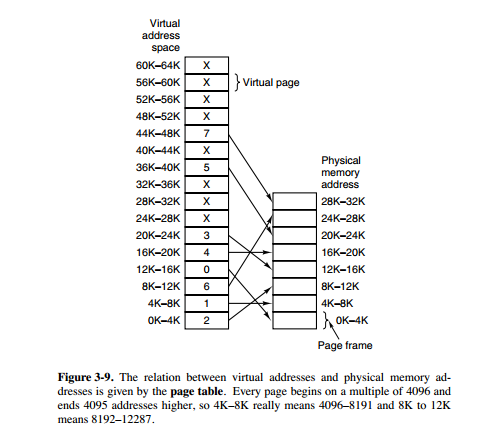
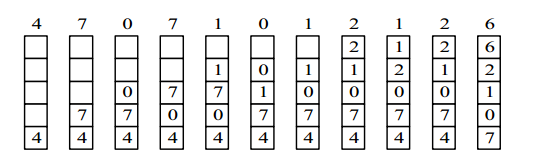
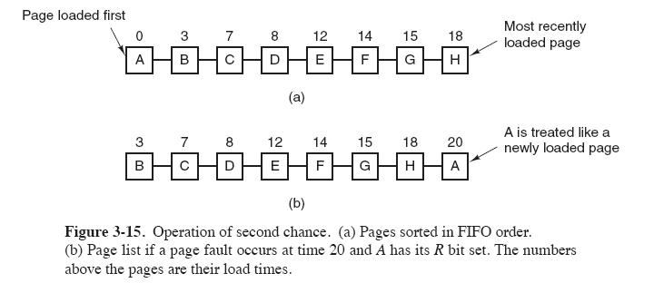
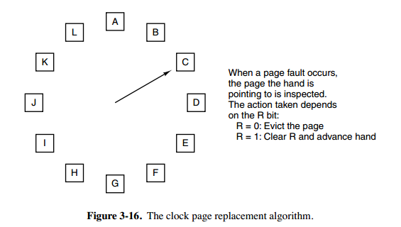
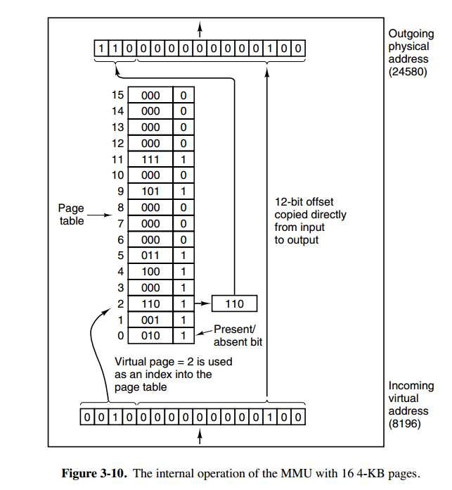
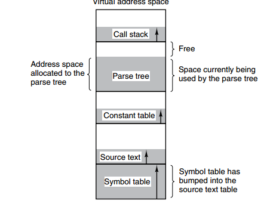
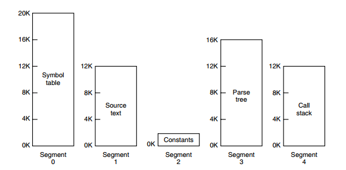

[TOC]

### 内存管理

操作系统的内存管理主要负责**内存的分配与回收**（malloc 函数：申请内存，free 函数：释放内存），另外地址转换也就是将逻辑地址转换成相应的物理地址等功能也是操作系统内存管理做的事情。

#### 内存管理机制

简单分为**连续分配管理方式**和**非连续分配管理方式**这两种。连续分配管理方式是指为一个用户程序分配一个连续的内存空间，常见的如 **块式管理** 。同样地，非连续分配管理方式允许一个程序使用的内存分布在离散或者说不相邻的内存中，常见的如**页式管理** 和 **段式管理**。

1. **块式管理** ： 远古时代的计算机操系统的内存管理方式。将内存分为几个固定大小的块，每个块中只包含一个进程。如果程序运行需要内存的话，操作系统就分配给它一块，如果程序运行只需要很小的空间的话，分配的这块内存很大一部分几乎被浪费了。这些在每个块中未被利用的空间，我们称之为碎片。
2. **页式管理** ：把主存分为大小相等且固定的一页一页的形式，页较小，相对相比于块式管理的划分力度更大，提高了内存利用率，减少了碎片。页式管理通过页表对应逻辑地址和物理地址。
3. **段式管理** ： 页式管理虽然提高了内存利用率，但是页式管理其中的页实际并无任何实际意义。 段式管理把主存分为一段段的，每一段的空间又要比一页的空间小很多 。但是，最重要的是段是有实际意义的，每个段定义了一组逻辑信息，例如,有主程序段 MAIN、子程序段 X、数据段 D 及栈段 S 等。 段式管理通过段表对应逻辑地址和物理地址。
4. **段页式管理机制** 。段页式管理机制**结合**了段式管理和页式管理的优点。简单来说段页式管理机制就是把主存先分成若干段，每个段又分成若干页，也就是说 **段页式管理机制** 中段与段之间以及段的内部的都是离散的。


#### 逻辑地址与虚拟地址

**编程**一般只有可能和**逻辑地址**打交道，比如在 C 语言中，指针里面存储的数值就可以理解成为内存里的一个**地址**，这个地址也就是我们说的**逻辑地址**，**逻辑地址由操作系统决定**。

**物理地址**指的是**真实物理内存中地址**，更具体一点来说就是**内存地址寄存器中的地址**。物理地址是内存单元真正的地址。

> **CPU 寻址了解吗?为什么需要虚拟地址空间?**

现代处理器使用的是一种称为 **虚拟寻址(Virtual Addressing)** 的寻址方式。**使用虚拟寻址，CPU 需要将虚拟地址翻译成物理地址，这样才能访问到真实的物理内存。** 实际上完成虚拟地址转换为物理地址转换的硬件是 CPU 中含有一个被称为 **内存管理单元（Memory Management Unit, MMU）** 的硬件。如下图所示：


**为什么要有虚拟地址空间呢？**

先从没有虚拟地址空间的时候说起吧！没有虚拟地址空间的时候，**程序都是直接访问和操作的都是物理内存** 。但是这样有什么问题呢？

1. 用户程序可以访问任意内存，寻址内存的每个字节，这样就很容易（有意或者无意）破坏操作系统，造成操作系统崩溃。
2. 想要同时运行多个程序特别困难，比如你想同时运行一个微信和一个 QQ 音乐都不行。为什么呢？举个简单的例子：微信在运行的时候给内存地址 1xxx 赋值后，QQ 音乐也同样给内存地址 1xxx 赋值，那么 QQ 音乐对内存的赋值就会覆盖微信之前所赋的值，这就造成了微信这个程序就会崩溃。

**总结来说：如果直接把物理地址暴露出来的话会带来严重问题，比如可能对操作系统造成伤害以及给同时运行多个程序造成困难。**

通过虚拟地址访问内存有以下**优势**：

- 程序可以使用一系列相邻的虚拟地址来访问物理内存中不相邻的大内存缓冲区。
- 程序可以使用一系列虚拟地址来访问大于可用物理内存的内存缓冲区。当物理内存的供应量变小时，内存管理器会将物理内存页（通常大小为 4 KB）保存到磁盘文件。数据或代码页会根据需要在物理内存与磁盘之间移动。
- 不同进程使用的虚拟地址彼此隔离。一个进程中的代码无法更改正在由另一进程或操作系统使用的物理内存。


#### 虚拟内存

##### 1. 什么是虚拟内存?

虚拟内存：Virtual Memory。

这个在我们平时使用电脑特别是 Windows 系统的时候太常见了。很多时候我们使用点开了**很多占内存**的软件，这些软件占用的内存可能已经远远超出了我们电脑本身具有的物理内存。**为什么可以这样呢？** 正是因为 **虚拟内存** 的存在，通过 **虚拟内存** 可以让程序可以**拥有超过系统物理内存大小的可用内存空间**。另外，**虚拟内存为每个进程提供了一个一致的、私有的地址空间，它让每个进程产生了一种自己在独享主存的错觉（每个进程拥有一片连续完整的内存空间）**。这样会更加有效地管理内存并减少出错。

**虚拟内存**是计算机系统**内存管理**的一种技术，我们可以手动设置自己电脑的虚拟内存。不要单纯认为虚拟内存只是“使用硬盘空间来扩展内存“的技术。**虚拟内存的重要意义是它定义了一个连续的虚拟地址空间**，并且 **把内存扩展到硬盘空间**。推荐阅读：[《虚拟内存的那点事儿》](https://juejin.im/post/59f8691b51882534af254317)。

维基百科中有几句话是这样介绍虚拟内存的。

**虚拟内存** 使得应用程序认为它拥有连续的可用的内存（一个连续完整的地址空间），而实际上，它通常是被分隔成多个物理内存碎片，还有部分暂时存储在外部磁盘存储器上，在需要时进行数据交换。与没有使用虚拟内存技术的系统相比，使用这种技术的系统使得大型程序的编写变得更容易，对真正的物理内存（例如 RAM）的使用也更有效率。目前，大多数操作系统都使用了虚拟内存，如 Windows 家族的“虚拟内存”；Linux 的“交换空间”等。

几个概念：

**物理内存RAM(Random Access Memory 随机存储器)**：

物理内存是计算机的实际内存大小，它直接与CPU交换数据，也被称为主存。

**虚拟内存(Virtual Memory)**：

**虚拟内存是操作系统为了更高效率使用物理内存的一种概念，它是对物理内存的抽象。**
windows上的虚拟内存和Linux上的swap交换空间都是虚拟内存的一种实现技术。

**Swap交换空间**：

简单理解: 当某个应用程序所需的内存空间不够了，那么系统会判断当前物理内存是否还有足够的空闲可以分配给应用程序。
如果有，则应用程序直接进入内存运行；如果没有，系统就根据某种算法(如:LRU)挂起一个进程，将挂起的进程交换到虚拟内存Swap中等待，并将应用程序调入内存执行。虚拟内存是被虚拟出来的，可以使用硬盘(不仅仅是硬盘)来作为虚拟内存。

这就是为什么当我们运行一个所需内存比我们计算机内存还大的程序时，仍然可以正常运行，并感受不到内存的限制的原因。

##### 2. 局部性原理

要想更好地理解虚拟内存技术，必须要知道计算机中著名的**局部性原理**。另外，局部性原理既适用于程序结构，也适用于数据结构，是非常重要的一个概念。

局部性原理是虚拟内存技术的基础，正是因为程序运行具有局部性原理，才可以**只装入部分程序到内存**就开始运行。

> 以下内容摘自《计算机操作系统教程》 第 4 章存储器管理。

早在 1968 年的时候，就有人指出我们的程序在执行的时候往往呈现局部性规律，也就是说在某个较短的时间段内，程序执行局限于某一小部分，程序访问的存储空间也局限于某个区域。

局部性原理表现在以下两个方面：

1. **时间局部性** ：如果程序中的某条指令一旦执行，不久以后该指令可能再次执行；如果某数据被访问过，不久以后该数据可能再次被访问。产生时间局部性的典型原因，是由于在程序中存在着大量的循环操作。
2. **空间局部性** ：一旦程序访问了某个存储单元，在不久之后，其附近的存储单元也将被访问，即程序在一段时间内所访问的地址，可能集中在一定的范围之内，这是因为指令通常是顺序存放、顺序执行的，数据也一般是以向量、数组、表等形式簇聚存储的。

时间局部性是通过将近来使用的指令和数据保存到高速缓存存储器中，并使用高速缓存的层次结构实现。空间局部性通常是使用较大的高速缓存，并将预取机制集成到高速缓存控制逻辑中实现。虚拟内存技术实际上就是建立了 “内存一外存”的两级存储器的结构，利用局部性原理实现髙速缓存。

##### 3. 虚拟存储器

都说了虚拟内存了。再讲讲**虚拟存储器**吧！

基于局部性原理，在程序装入时，可以将程序的一部分装入内存，而将其他部分留在外存，就可以启动程序执行。由于外存往往比内存大很多，所以我们运行的软件的内存大小实际上是可以比计算机系统实际的内存大小大的。在程序执行过程中，当所访问的信息不在内存时，由操作系统将所需要的部分调入内存，然后继续执行程序。另一方面，操作系统将内存中暂时不使用的内容换到外存上，从而腾出空间存放将要调入内存的信息。这样，计算机好像为用户提供了一个比实际内存大的多的存储器——**虚拟存储器**。

实际上，我觉得虚拟内存同样是一种**时间换空间**的策略，你用 CPU 的计算时间，页的调入调出花费的时间，换来了一个虚拟的更大的空间来支持程序的运行。不得不感叹，程序世界几乎不是时间换空间就是空间换时间。

##### 4. 虚拟内存的技术实现

**虚拟内存技术的实现呢？**

**虚拟内存的实现需要建立在离散分配的内存管理方式的基础上。** 虚拟内存的实现有以下三种方式：

1. **请求分页存储管理** ：建立在分页管理之上，为了支持虚拟存储器功能而增加了**请求调页功能和页面置换**功能。请求分页是目前最常用的一种实现虚拟存储器的方法。请求分页存储管理系统中，在作业开始运行之前，仅装入当前要执行的部分段即可运行。假如在作业运行的过程中发现要访问的页面不在内存，则由处理器通知操作系统按照对应的**页面置换算法**将相应的页面调入到主存，同时操作系统也可以将暂时不用的页面置换到外存中。
2. **请求分段存储管理** ：建立在分段存储管理之上，增加了**请求调段功能、分段置换**功能。请求分段储存管理方式就如同请求分页储存管理方式一样，在作业开始运行之前，仅装入当前要执行的部分段即可运行；在执行过程中，可使用请求调入中断动态装入要访问但又不在内存的程序段；当内存空间已满，而又需要装入新的段时，根据置换功能适当调出某个段，以便腾出空间而装入新的段。
3. **请求段页式存储管理**

**这里多说一下？很多人容易搞混请求分页与分页存储管理，两者有何不同呢？**

请求分页存储管理建立在分页管理之上。他们的根本区别是是否将程序全部所需的全部地址空间都装入主存，这也是请求分页存储管理可以提供虚拟内存的原因，我们在上面已经分析过了。

它们之间的根本区别在于是否将一作业的全部地址空间同时装入主存。**请求分页存储管理不要求将作业全部地址空间同时装入主存**。基于这一点，请求分页存储管理可以提供虚存，而分页存储管理却不能提供虚存。

不管是上面那种实现方式，我们一般都需要：

1. 一定容量的**内存和外存**：在载入程序的时候，只需要将程序的一部分装入内存，而将其他部分留在外存，然后程序就可以执行了；
2. **缺页中断**：如果**需执行的指令或访问的数据尚未在内存**（称为**缺页或缺段**），则由处理器通知操作系统将相应的页面或段**调入到内存**，然后继续执行程序；
3. **虚拟地址空间** ：逻辑地址到物理地址的变换。

虚拟内存的目的是为了让物理内存扩充成更大的**逻辑内存**，从而让程序获得更多的**可用内存**。

为了更好的管理内存，操作系统将内存抽象成**地址空间**。每个程序拥有自己的地址空间，这个地址空间被分割成多个块，**每一块称为一页**。这些**页被映射到物理内存**，但不需要映射到连续的物理内存，也不需要所有页都必须在物理内存中。当程序引用到不在物理内存中的页时，由硬件执行必要的映射，将缺失的部分装入物理内存并重新执行失败的指令。

从上面的描述中可以看出，**虚拟内存允许程序不用将地址空间中的每一页都映射到物理内存**，也就是说一个程序不需要全部调入内存就可以运行，这使得有限的内存运行大程序成为可能。例如有一台计算机可以产生 16 位地址，那么一个程序的地址空间范围是 0\~64K。该计算机只有 32KB 的物理内存，虚拟内存技术允许该计算机运行一个 64K 大小的程序。



##### 5. 页面置换算法

虚拟内存管理很重要的一个概念就是页面置换算法。

**为何进行页面置换？**

在程序运行过程中，如果要访问的页面**不在内存中**，就发生**缺页中断**，从而需要将该页**调入内存**中。**缺页中断** 就是要访问的**页**不在主存，需要操作系统将其调入主存后再进行访问。 在这个时候，被内存映射的文件实际上成了一个分页交换文件。

此时如果内存已无空闲空间，系统必须从**内存中**调出一个**页面到磁盘对换区**中，以便为即将调入的页面让出空间。

用来**选择淘汰哪一页**的规则叫做**页面置换算法**，我们可以把页面置换算法看成是**淘汰页面的规则**。

**页面置换算法**和缓存淘汰策略类似，可以将内存看成磁盘的缓存。在缓存系统中，缓存的大小有限，当有新的缓存到达时，需要淘汰一部分已经存在的缓存，这样才有空间存放新的缓存数据。

==页面置换算法的主要目标是使页面**置换频率最低**==（也可以说**缺页率最低**）。

以下是常见的页面置换算法。

###### ① 最佳算法OPT

> OPT, Optimal replacement algorithm

所选择的被换出的页面将是**最长时间内不再被访问**，通常可以保证获得**最低的缺页率**。

是一种**理论上的算法**，因为无法知道一个页面多长时间不再被访问。

举例：一个系统为某进程分配了三个物理块，并有如下页面引用序列：

```html
7，0，1，2，0，3，0，4，2，3，0，3，2，1，2，0，1，7，0，1
```

开始运行时，先将 7, 0, 1 三个页面装入内存。当进程要访问页面 2 时，产生缺页中断，会将页面 7 换出，因为页面 7 再次被访问的时间最长。

###### ② 最近最久未使用算法LRU

> LRU, Least Recently Used

虽然无法知道将来要使用的页面情况，但是可以知道过去使用页面的情况。LRU 将**最近最久未使用**的页面换出。

为了实现 LRU，需要在内存中维护一个所有页面的**==链表==**。当一个页面被访问时，将这个页面移到链表表头。这样就能保证**链表表尾的页面**是最近最久未访问的。

因为**每次访问**都需要**更新链表**，因此这种方式实现的 LRU **代价很高**。

```html
4，7，0，7，1，0，1，2，1，2，6
```



###### ③ 最近未使用算法NRU

> NRU, Not Recently Used

每个页面都有**两个状态位**：R 与 M，当页面被**访问**时设置页面的 **R = 1**，当页面被**修改**时设置 **M = 1**。其中 R 位会**定时被清零**。可以将页面分成以下**四类**：

- R=0，M=0
- R=0，M=1
- R=1，M=0
- R=1，M=1

当发生缺页中断时，NRU 算法随机地从**类编号最小**的**非空类**中挑选一个页面将它换出。

NRU **优先换出已经被修改的脏页面**（R=0，M=1），而**不是被频繁使用的干净页面**（R=1，M=0）。

###### ④ 先进先出算法FIFO

> FIFO, First In First Out

选择换出的页面是**最先进入**的页面。

该算法会将那些经常被访问的页面也被换出，从而使缺页率升高。

###### ⑤ 第二次机会算法

FIFO 算法可能会把经常使用的页面置换出去，为了避免这一问题，对该算法做一个简单的修改：

当页面被访问 (读或写) 时设置该页面的 R 位为 1。需要替换的时候，检查最老页面的 R 位。如果 R 位是 0，那么这个页面既老又没有被使用，可以立刻置换掉；如果是 1，就将 R 位清 0，并把该页面放到链表的尾端，修改它的装入时间使它就像刚装入的一样，然后继续从链表的头部开始搜索。



###### ⑥ 时钟

> Clock

第二次机会算法需要在**链表**中移动页面，降低了效率。时钟算法使用**环形链表**将页面连接起来，再使用一个**指针**指向最老的页面。




#### 分页

##### 1. 分页系统地址映射

**内存管理单元（MMU）**管理着地址空间和物理内存的转换，其中的**页表（Page table）**存储着**页（程序地址空间）和页框（物理内存空间）**的映射表。

一个**虚拟地址**分成两个部分，一部分存储**页面号**，一部分存储**偏移量**。

下图的页表存放着 16 个页，这 16 个页需要用 4 个比特位来进行索引定位。例如对于虚拟地址（0010 000000000100），前 4 位是存储页面号 2，读取表项内容为（110 1），页表项最后一位表示是否存在于内存中，1 表示存在。后 12 位存储偏移量。这个页对应的页框的地址为 （110 000000000100）。



##### 2.快表与多级页表

页表管理机制中有两个很重要的概念：快表和多级页表，这两个东西分别解决了页表管理中很重要的两个问题：

1. 虚拟地址到物理地址的转换要快。
2. 解决虚拟地址空间大，页表也会很大的问题。

###### ① 快表

为了解决**虚拟地址到物理地址的转换速度**，操作系统在 **页表方案** 基础之上引入了 **快表** 来加速虚拟地址到物理地址的转换。我们可以把块表理解为一种特殊的**高速缓冲存储器（Cache）**，其中的内容是页表的一部分或者全部内容。作为页表的 Cache，它的作用与页表相似，但是提高了访问速率。由于采用页表做地址转换，读写内存数据时 CPU 要访问两次主存。有了快表，有时只要访问一次高速缓冲存储器，一次主存，这样可加速查找并提高指令执行速度。

使用快表之后的地址转换流程是这样的：

1. 根据虚拟地址中的页号查快表；
2. 如果该页在快表中，直接从快表中读取相应的物理地址；
3. 如果该页不在快表中，就访问内存中的页表，再从页表中得到物理地址，同时将页表中的该映射表项添加到快表中；
4. 当快表填满后，又要登记新页时，就按照一定的淘汰策略淘汰掉快表中的一个页。

看完了之后你会发现快表和我们平时经常在我们开发的系统使用的缓存（比如 Redis）很像，的确是这样的，操作系统中的很多思想、很多经典的算法，你都可以在我们日常开发使用的各种工具或者框架中找到它们的影子。

###### ② 多级页表

引入多级页表的主要目的是为了避免把全部页表一直放在内存中占用过多空间，特别是那些根本就不需要的页表就不需要保留在内存中。多级页表属于**时间换空间**的典型场景，具体可以查看下面这篇文章

- 多级页表如何节约内存：[https://www.polarxiong.com/archives/多级页表如何节约内存.html](https://www.polarxiong.com/archives/多级页表如何节约内存.html)

###### ③ 总结

为了提高**内存的空间性能**，提出了**多级页表**的概念；但是提到空间性能是以浪费时间性能为基础的，因此为了补充损失的时间性能，提出了快表（即 TLB）的概念。 不论是快表还是多级页表实际上都利用到了程序的局部性原理，局部性原理在后面的虚拟内存这部分会介绍到。


#### 分段

**虚拟内存**采用的是**分页技术**，也就是将地址空间划分成**固定大小的页**，每一页再与**内存进行映射**。

下图为一个编译器在编译过程中建立的多个表，有 4 个表是动态增长的，如果使用分页系统的一维地址空间，动态增长的特点会导致**覆盖问题**的出现。



**分段**的做法是把**每个表分成段**，一个段构成一个**独立的地址空间**。每个段的长度可以**不同**，并且可以**动态增长**。




#### 段页式

程序的地址空间划分成多个拥有独立地址空间的段，每个段上的地址空间划分成大小相同的页。这样既拥有分段系统的**共享和保护**，又拥有分页系统的**虚拟内存**功能。


#### 分页与分段的比较

- 对程序员的透明性：分页透明，但是分段需要程序员显式划分每个段。

- 地址空间的维度：分页是**一维**地址空间，分段是**二维**的。

- 大小是否可以改变：页的大小**不可变**，段的大小可以**动态改变**。

- 出现的原因：**分页**主要用于**实现虚拟内存**，从而获得更大的地址空间；**分段**主要是为了使**程序和数据**可以被划分为**逻辑上独立的地址空间**并且有助于**共享和保护**。

**共同点** ：

- 分页机制和分段机制都是为了**提高内存利用率，减少内存碎片**。
- 页和段都是**离散存储**的，所以两者都是离散分配内存的方式。但是，每个页和段中的**内存是连续**的。

**区别** ：

- 页的大小是固定的，由操作系统决定；而段的大小不固定，取决于我们当前运行的程序。
- 分页仅仅是为了满足操作系统内存管理的需求，而段是逻辑信息的单位，在程序中可以体现为代码段，数据段，能够更好满足用户的需要。


#### 参考资料

- 《计算机操作系统—汤小丹》第四版
- [《深入理解计算机系统》](https://book.douban.com/subject/1230413/)
- [https://zh.wikipedia.org/wiki/输入输出内存管理单元](https://zh.wikipedia.org/wiki/输入输出内存管理单元)
- [https://baike.baidu.com/item/快表/19781679](https://baike.baidu.com/item/快表/19781679)
- https://www.jianshu.com/p/1d47ed0b46d5
- <https://www.studytonight.com/operating-system>
- <https://www.geeksforgeeks.org/interprocess-communication-methods/>
- <https://juejin.im/post/59f8691b51882534af254317>


