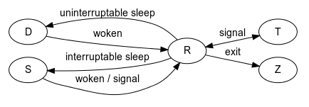

# 1. 操作系统概述
## 1.1 基本概念
操作系统（Operating System，简称 OS）是管理计算机硬件与软件资源的程序，是计算机系统的内核与基石。
- 操作系统本质上是运行在计算机上的软件程序
- 为用户提供一个与系统交互的操作界面
- 分内核与外壳（我们可以把外壳理解成围绕着内核的应用程序，而内核就是能操作硬件的程序）
- 内核负责管理系统的进程、内存、设备驱动程序、文件和网络系统等等，决定着系统的性能和稳定性。是连接应用程序和硬件的桥梁。内核就是操作系统背后黑盒的核心。

## 1.2 基本特征
### 1.2.1 并发
- 并发是指宏观上在一段时间内能同时运行多个程序，而并行则指同一时刻能运行多个指令。
- 并行需要硬件支持，如多流水线、多核处理器或者分布式计算系统。
- 操作系统通过引入进程和线程，使得程序能够并发运行。
### 1.2.2 共享
共享是指系统中的资源可以被多个并发进程共同使用。

两种共享方式：**互斥共享和同时共享**。互斥共享的资源称为临界资源，例如打印机等，在同一时间只允许一个进程访问，需要用同步机制来实现对临界资源的访问。
### 1.2.3 虚拟
虚拟技术把一个物理实体转换为**多个逻辑实体**。主要有两种虚拟技术：时分复用技术和空分复用技术。
- 多个进程能在同一个处理器上并发执行使用了时分复用技术，让每个进程轮流占有处理器，每次只执行一小个时间片并快速切换。
- 虚拟内存使用了空分复用技术，它将物理内存抽象为地址空间，每个进程都有各自的地址空间。地址空间的页被映射到物理内存，地址空间的页并不需要全部在物理内存中，当使用到一个没有在物理内存的页时，执行页面置换算法，将该页置换到内存中。
### 1.2.4 异步
异步指进程不是一次性执行完毕，而是走走停停，以不可知的速度向前推进。

## 1.3 基本功能
### 1.3.1 进程管理
进程控制、进程同步、进程通信、死锁处理、处理机调度等。
### 1.3.2 内存管理
内存分配、地址映射、内存保护与共享、虚拟内存等。
### 1.3.3 文件管理
文件存储空间的管理、目录管理、文件读写管理和保护等。
### 1.3.4 设备管理
完成用户的 I/O 请求，方便用户使用各种设备，并提高设备的利用率。

主要包括缓冲管理、设备分配、设备处理、虛拟设备等。

## 1.4 大内核和微内核
### 1.4.1 大内核
大内核是将操作系统功能作为一个紧密结合的整体放到内核。由于各模块共享信息，因此有很高的性能。
### 1.4.2 微内核
由于操作系统不断复杂，因此将一部分操作系统功能移出内核，从而降低内核的复杂性。移出的部分根据分层的原则划分成若干服务，相互独立。在微内核结构下，操作系统被划分成小的、定义良好的模块，只有微内核这一个模块运行在内核态，其余模块运行在用户态。因为需要频繁地在用户态和核心态之间进行切换，所以会有一定的性能损失。

## 1.5 系统调用
### 1.5.1 用户态与系统态
根据进程访问资源的特点，我们可以把**进程**在系统上的运行分为**两个级别**：
1. 用户态(user mode)：用户态运行的进程或可以直接读取**用户程序**的数据。
2. 系统态(kernel mode)：可以简单的理解系统态运行的进程或程序几乎可以访问计算机的任何资源，不受限制。

> 为什么需要用户态和内核态？
在 CPU 的所有指令中，有些指令是非常危险的，如果使用不当，将会造成系统崩溃等后果。
为了避免这种情况发生，CPU 将指令划分为**特权级(内核态)指令**和**非特权级(用户态)指令。**
对于那些危险的指令只允许内核及其相关模块调用，对于那些不会造成危险的指令，就允许用户应用程序调用。

> 用户态切换到内核态的几种方式?
- 系统调用:系统调用是用户态主动要求切换到内核态的一种方式，用户应用程序通过操作系统调用内核为上层应用程序开放的接口来执行程序。
- 异常:当 CPU 在执行用户态的应用程序时，发生了某些不可知的**异常**。于是当前用户态的应用进程切换到处理此异常的**内核程序**中去。
- 硬件设备的中断:当**硬件设备完成用户请求**后，会向 CPU 发出相应的中断信号，这时 CPU 会暂停执行下一条即将要执行的指令，转而去执行与中断信号对应的应用程序，如果先前执行的指令是用户态下程序的指令，那么这个转换过程也是用户态到内核台的转换。

### 1.5.2 系统调用
一般运行的**程序基本都是运行在用户态**，如果需要进行与**内核态级别的资源有关的操作**（如**文件管理、进程控制、内存管理**等)，就需要通过**系统调用**方式向操作系统提出服务请求，从而**陷入内核**，并由操作系统代为完成。所以**系统调用就是操作系统为应用程序提供能够访问到内核态的资源的接口**。

这些**系统调用**按功能大致可分为如下几类：
- **设备管理**:完成设备的请求或释放，以及设备启动等功能。
- **文件管理**:完成文件的读、写、创建及删除等功能。
- **进程控制**:完成进程的创建、撤销、阻塞及唤醒等功能。
- **进程通信**:完成进程之间的消息传递或信号传递等功能。
- **内存管理**:完成内存的分配、回收以及获取作业占用内存区大小及地址等功能。

Linux 的系统调用主要有以下这些：

|     Task     |                Commands                |
| :----------: | :------------------------------------: |
| **进程控制** |  **fork**(); **exit**(); **wait**();   |
| **进程通信** |   **pipe**(); **shmget**(); mmap();    |
| **文件操作** |  **open**(); **read**(); **write**();  |
| **设备操作** |     ioctl(); **read**(); write();      |
| **信息维护** |  **getpid**(); alarm(); **sleep**();   |
| **安全相关** | **chmod**(); **umask**(); **chown**(); |

## 1.6 操作系统中断
### 1.6.1 中断分类
#### 1. 外中断
由 CPU 执行指令以外的事件引起，如 I/O 完成中断，表示设备输入/输出处理已经完成，处理器能够发送下一个输入/输出请求。此外还有时钟中断、控制台中断等。
#### 2. 异常
由 CPU 执行指令的内部事件引起，如非法操作码、地址越界、算术溢出等。
#### 3. 陷入
在用户程序中使用**系统调用**。

# 2. 进程管理
## 2.1 进程与线程
### 2.1.1 进程
进程是**资源分配**的基本单位。
### 2.1.2 线程
线程是**独立调度**的基本单位。一个进程中可以有多个线程，它们**共享**进程资源。线程可以分为**用户级线程和内核线程**。
### 2.1.3 进程与线程区别
#### 1. 资源与调度
- **进程是资源分配的基本单位**，但是线程**不拥有**资源，线程可以访问隶属进程的资源。
- **线程是独立调度的基本单位**，在**同一进程**中，线程的切换**不会引起进程切换**，从一个进程中的线程切换到另一个进程中的线程时，会引起进程切换。
- **进程有自己独立的地址空间**，每启动一个进程，系统都会为其分配地址空间，建立数据表来维护代码段、堆栈段和数据段；**线程没有独立的地址空间**，它使用相同的地址空间共享数据。
#### 2. 系统开销
**进程在创建、撤销、切换时的开销远大于线程**。由于创建或撤销进程时，系统都要为之分配或回收资源，如内存空间、I/O 设备等，所付出的开销**远大于**创建或撤销线程时的开销。类似地，在进行进程切换时，涉及当前执行进程 CPU 环境的保存及新调度进程 CPU 环境的设置，而**线程切换**时只需保存和设置少量**寄存器**内容，**开销很小**。
#### 3. 通信方面
线程间可以通过**直接读写同一进程**中的**数据**进行通信，但是**进程通信需要借助 IPC**（Inter-Process Communication，进程间通信）。
#### 4. 其他
每个**线程**都有一个**程序计数器**（记录要执行的下一条指令）、一组寄存器（保存当前线程的工作变量）、堆栈（记录执行历史）。

## 2.2 进程描述符
### 2.2.1 进程控制块
**进程控制块** (Process Control Block, PCB) 描述进程的**基本信息和运行状态**，所谓的创建进程和撤销进程，都是指对 PCB 的操作。一个简化版本的进程控制块如下。


## 2.3 进程状态
### 2.3.1 五状态模型

- **就绪状态**（ready）：等待被调度
- **运行状态**（running）
- 阻塞状态（waiting）：等待资源

应该注意:
- 只有**就绪态和运行态**可以**相互转换**，其它的都是**单向转换**。就绪状态的进程通过调度算法从而获得 CPU 时间，转为运行状态；而运行状态的进程，在分配给它的 CPU 时间片用完之后就会转为就绪状态，等待下一次调度。
- 阻塞状态是缺少需要的资源从而由运行状态转换而来，但是该资源不包括 CPU 时间，缺少 CPU 时间会从运行态转换为就绪态。
### 2.3.2 进程创建
当一个新进程被创建时，操作系统需要在**进程列表**中为它创建一个与其他进程格式相同的**数据结构**用于记录和管理它的状态。通常有四种事件会导致进程的创建：
|               事件               |                             说明                             |
| :------------------------------: | :----------------------------------------------------------: |
|        **新的批处理**作业        | 通常位于磁带或者磁盘中的批处理作业控制流程被提供给操作系统。当操作系统准备接纳新工作时，它将读取下一个作业控制命令 |
|           **交互登陆**           |                      终端用户登录到系统                      |
| 操作系统因为提供一项服务而被创建 | 操作系统可以创建一个进程，代表用户程序执行的一个功能，使用户无需等待(如控制打印机的进程) |
|       由现有的进程**派生**       | 基于模块化的考虑，或者为了开发并行性，用户程序可以指示创建多个进程 |

当操作系统为另一个进程显式的请求创建一个新进程时，这个动作被称为**进程派生**。当一个进程派生另一个进程的时候，前一个称作**父进程**，被派生的叫做**子进程**。在大多数情况下，父子进程间需要进行通信和合作。
### 2.3.3 进程结束
进程结束的典型原因如下。


## 2.4 进程调度算法
**不同操作系统**的调度算法**目标不同**，因此需要针对**不同系统环境**来讨论调度算法。
### 2.4.1 批处理系统
批处理系统没有太多的用户操作，在该系统中，调度算法目标是**保证吞吐量和周转时间**（从提交到终止的时间）。
#### 1. 先来先服务first-come first-serverd（FCFS）
按照**请求的顺序**进行调度。有利于长作业，但不利于短作业，因为短作业必须一直等待前面的长作业执行完毕才能执行，而长作业又需要执行很长时间，可能造成**短作业等待时间过长**。
#### 2. 短作业优先shortest job first（SJF）
按估计运行时间**最短**的顺序进行调度。长作业有可能会饿死，处于一直等待短作业执行完毕的状态。因为如果一直有短作业到来，那么长作业永远得不到调度。
#### 3. 最短剩余时间优先shortest remaining time next（SRTN）
按估计**剩余时间最短**的顺序进行调度。

### 2.4.2 交互式系统
交互式系统有**大量的用户交互操作**，在该系统中调度算法的目标是**快速地进行响应**。
#### 1. 时间片轮转算法
将所有就绪进程按 **FCFS** (**先来先服务**)的原则排成一个**队列**，每次调度时，把 CPU 时间分配给**队首进程**，该进程可以执行一个**时间片**。当时间片用完时，由计时器发出时钟**中断**，调度程序便**停止**该进程的执行，并将它送往**就绪队列的末尾**，同时继续把 CPU 时间分配给**队首**的进程。

时间片轮转算法的效率和**时间片的大小**有很大关系：
- 因为**进程切换**都要**保存进程的信息**并且载入新进程的信息，如果时间片太小，会导致**进程切换得太频繁**，在进程切换上就会花过多时间。
- 而如果**时间片过长**，那么**实时性**就不能得到保证。

#### 2. 优先级调度算法
为**每个进程**分配一个**优先级**，按优先级进行调度。为了防止低优先级的进程**永远等不到调度**，可以随着**时间的推移增加等待进程的优先级**。
#### 3. 多级反馈队列算法
一个进程需要执行 **100** 个时间片，如果采用**时间片轮转调度**算法，那么需要**交换 100 次**。

**多级队列**是为这种需要**连续执行多个时间片**的进程考虑，它设置了**多个队列**，**每个队列时间片大小都不同**，例如 **1, 2, 4, 8** ,..。进程在**第一个队列没执行完**，就会被移到**下一个队列**。这种方式下，之前的进程只需要交换 7 次。

**新就绪**的进程总是进入**最高优先级队列的队尾**，并按 FCFS 原则等待调度；当轮到该进程执行时，若它能在规定的时间片内**完成**，便可准备撤离系统，否则将其转入**第二级队列末尾**，再同样按 FCFS 原则等待调度；如果它在第二级队列上运行一个时间片后**仍未完成**，再依次将它转入第**三级队列**，……，如此下去，当一个长作业从第一级队列降到最后一级队列时，便在该队列中**采取 RR 算法**运行。

每个**队列优先权**也不同，最**上面的优先权最高**。因此只有**上一个队列没有进程在排队**，才能调度**当前队列**上的进程。可以将这种调度算法看成是**时间片轮转调度算法和优先级调度算法**的**结合**。**UNIX** 操作系统采取的便是这种调度算法。


### 2.4.3 实时操作系统
实时系统要求一个请求在一个确定时间内得到响应。比如**UCOSII**。分为硬实时和软实时，前者必须满足绝对的截止时间，后者可以容忍一定的超时。

## 2.5 进程同步
进程同步即控制**多个进程**按一定**顺序**执行。
### 2.5.1 临界区
对**临界资源**进行访问的那段代码称为**临界区**。为了**互斥访问临界资源**，每个进程在进入临界区之前，需要先进行**检查**。
### 2.5.2 同步与互斥
- **同步**：多个进程按一定**顺序**执行。
- **互斥**：多个进程在同一时刻只有**一个进程**能进入临界区。
### 2.5.3 信号量
**信号量**（Semaphore）是一个**整型变量**，可以对其执行**down 和 up**操作，也就是常见的**P和V**操作。
- **down**  : 如果信号量**大于 0** ，执行 -1 操作；如果信号量**等于 0**，进程**睡眠**，等待信号量大于 0；
- **up** ：对信号量执行 +1 操作，唤醒睡眠的进程让其完成 down 操作。

down 和 up 操作需要被设计成**原语**，不可分割，通常的做法是在执行这些操作的时候屏蔽中断。如果信号量的取值**只能为 0 或者 1**，那么就成为了**互斥量（Mutex）**，**0 表示临界区已经加锁，1 表示临界区解锁**。

**使用信号量实现生产者-消费者问题**

问题描述：使用一个**缓冲区**来保存物品，只有缓冲区没有满，生产者才可以放入物品；只有缓冲区不为空，消费者才可以拿走物品。

因为缓冲区属于**临界资源**，因此需要使用一个**互斥量 mutex** 来控制对缓冲区的互斥访问。为了同步生产者和消费者的行为，需要记录缓冲区中物品的数量。数量可以使用信号量来进行统计，这里需要使用两个信号量：empty 记录空缓冲区的数量，full 记录满缓冲区的数量。其中，empty 信号量是在生产者进程中使用，当 empty 不为 0 时，生产者才可以放入物品；full 信号量是在消费者进程中使用，当 full 信号量不为 0 时，消费者才可以取走物品。

注意，**不能先对缓冲区进行加锁，再测试信号量**。也就是说，不能先执行 down(mutex) 再执行 down(empty)。如果这么做了，那么可能会出现这种情况：生产者对缓冲区加锁后，执行 down(empty) 操作，发现 empty = 0，此时生产者睡眠。消费者不能进入临界区，因为生产者对缓冲区加锁了，消费者就无法执行 up(empty) 操作，empty 永远都为 0，导致生产者永远等待下，不会释放锁，消费者因此也会**永远等待**下去。

### 2.5.4 管程
使用**信号量**机制实现的**生产者消费者**问题需要客户端代码做很多控制，而**管程把控制的代码独立出来**，不仅不容易出错，也使得客户端代码调用更容易。(**c 语言不支持管程**)

管程有一个重要特性：**在一个时刻只能有一个进程使用管程**。进程在无法继续执行的时候**不能一直占用管程**，否则其它进程永远不能使用管程。管程引入了 **条件变量** 以及相关的操作：**wait()** 和 **signal()** 来实现同步操作。对条件变量执行 wait() 操作会导致调用进程阻塞，把管程让出来给另一个进程持有。signal() 操作用于唤醒被阻塞的进程。

### 2.5.5 经典同步问题
#### 1. 读者-写者问题
允许多个进程**同时**对数据进行**读操作**，但是**不允许读和写以及写和写操作同时发生**。
#### 2. 哲学家进餐问题
五个哲学家围着一张圆桌，每个哲学家面前放着食物。哲学家的生活有两种交替活动：吃饭以及思考。当一个哲学家吃饭时，需要先拿起自己左右两边的两根筷子，并且**一次只能拿起一根筷子**。

为了防止死锁的发生，可以设置**两个条件**：
- 必须**同时拿起左右两根**筷子；
- 只有在**两个邻居都没有进餐**的情况下才允许进餐。

## 2.6 线程同步
**线程同步**是两个或多个共享关键资源的**线程的并发执行**。应该同步线程以避免关键的资源使用冲突。操作系统一般有下面三种线程同步的方式：
1.  **信号量(Semphares)** ：它允许同一时刻**多个线程**访问**同一资源**，但是需要控制同一时刻**访问此资源的最大线程数量**。就像 JDK 中的 Semphare 类。
2.  **互斥量(Mutex)**：采用**互斥对象机制**，只有拥有互斥对象的线程才有访问公共资源的权限。因为互斥对象只有一个，所以可以保证公共资源不会被多个线程同时访问。比如 Java 中的 **synchronized** 关键词和各种 **Lock** 都是这种机制。互斥量是信号量的一种**特殊形式**。
3. **事件(Event)** : **Wait/Notify 机制**，通过通知操作的方式来保持多线程同步，还可以方便的实现多线程优先级的比较操作。

## 2.7 进程间通信
IPC 即进程间通信。进程同步与进程通信很容易混淆，它们的区别在于：
- **进程同步**：**控制多个进程按一定顺序执行**。
- **进程通信**：**进程间传输信息**。

进程通信是一种手段，而进程同步是一种目的。也可以说，为了能够达到进程同步的目的，需要让进程进行通信，传输一些进程同步所需要的信息。
### 2.7.1 普通管道
管道是通过调用**pipe**函数创建的，**fd[0] 用于读，fd[1] 用于写**。

管道可用于**具有亲缘关系进程间**的通信，允许一个进程和另一个与它有**共同祖先的进程**之间进行通信。它具有以下限制：
- 只支持**半双工**通信
- 只能在**父子进程**中使用

### 2.7.2 命名管道
没有了管道只能在父子进程中使用的限制。命名管道克服了管道**没有名字**的限制，因此除具有管道所具有的功能外，它还允许**无亲缘关系进程间**的通信。命名管道在文件系统中有对应的**文件名**。命名管道通过命令 **mkfifo** 或系统调用 **mkfifo** 来创建。

FIFO 常用于**客户-服务器**应用程序中，FIFO 用作**汇聚点**，在客户进程和服务器进程之间传递数据。
### 2.7.3 消息队列
**消息队列**是消息的**链表**，具有特定的格式，存放在内存中并由**消息队列标识符**标识。管道和消息队列的通信数据都是先进先出的原则。与管道（**无名管道**：只存在于内存中的文件；**命名管道**：存在于实际的磁盘介质或者文件系统）不同的是**消息队列存放在内核**中，只有在**内核重启**(即，操作系统重启)或者显示地删除一个消息队列时，该消息队列才会被真正的删除。消息队列可以实现消息的随机查询，消息不一定要以先进先出的次序读取，也可以按消息的类型读取。比 FIFO 更有优势。**消息队列克服了信号承载信息量少，管道只能承载无格式字节流以及缓冲区大小受限等缺点**。

相比于 FIFO，消息队列具有以下优点：
- 消息队列可以**独立于**读写进程存在，从而避免了 FIFO 中同步管道的打开和关闭时可能产生的困难。
- 避免了 FIFO 的**同步阻塞**问题，不需要进程自己提供同步方法。
- 读进程可以根据消息类型有**选择地接收**消息，而不像 FIFO 那样只能默认地接收。

### 2.7.4 信号量
它是一个**计数器**，用于为**多个进程**提供对**共享数据对象**的访问。信号量的意图在于**进程间同步**。这种通信方式主要用于解决与同步相关的问题并避免竞争条件。主要作为进程间以及同一进程不同线程之间的同步手段。

### 2.7.5 共享内存
**允许多个进程共享**一个给定的**存储区**，不同进程可以及时看到对方进程中对**共享内存中数据的更新**。因为数据**不需要**在进程之间**复制**，所以这是**最快**的一种 IPC。这种方式需要依靠某种同步操作，如**互斥锁和信号量**等。

多个进程可以将同一个文件映射到它们的**地址空间从而实现共享内存**。另外 XSI 共享内存不是使用文件，而是使用内存的匿名段。

### 2.7.6 套接字
套接字可用于**不同主机**之间的**进程通信**。套接字是支持 TCP/IP 的网络通信的基本操作单元，可以看做是不同主机之间的进程进行双向通信的端点，简单的说就是通信的两方的一种约定，用套接字中的相关函数来完成通信过程。

## 2.8 死锁
### 2.8.1 必要条件
发生死锁的四个必要条件：
- **互斥条件**：一个资源只能被**一个进程使用**。
- **不可抢占条件**：已经分配给一个进程的资源**不能强制性地被抢占**，只有**线程自己把资源释放**了。
- **占有和等待条件**：已经得到了某个资源的**进程**可以**再请求新**的资源。
- **环路等待条件**：有两个或者两个以上的**进程组成一条环路**，该环路中的每个进程都在**等待**下一个进程所占有的资源。

### 2.8.2 死锁处理方法
- **死锁预防**
- **鸵鸟策略**
- **死锁检测**
- **死锁恢复**
- **死锁避免**

### 2.8.3 死锁预防
在程序运行之前**预防发生死锁**。就是破坏死锁发生的四个**必要环节**就行。
#### 1. 破坏互斥条件
例如脱机打印机技术允许若干个进程同时输出，唯一真正请求物理打印机的进程是打印机守护进程。
#### 2. 破坏占有和等待条件
一种实现方式是规定所有进程在**开始执行前请求所需要的全部资源**。
#### 3. 破坏不可抢占条件
#### 4. 破坏环路等待
给资源**统一编号**，进程只能**按编号顺序**来请求资源。

### 2.8.4 鸵鸟策略
把头埋在沙子里，**假装根本没发生问题**。因为解决死锁问题的代价很高，因此鸵鸟策略这种**不采取任务措施**的方案会获得更高的性能。当发生死锁时不会对用户造成多大影响，或发生死锁的概率很低，可以采用鸵鸟策略。大多数操作系统，包括 Unix，Linux 和 Windows，处理死锁问题的办法仅仅是**忽略它**。

### 2.8.5 死锁检测
不试图阻止死锁，而是当**检测到死锁发生时**，采取措施进行**恢复**。
#### 1. 每种类型一个资源的死锁检测
每种类型一个资源的死锁检测算法是通过**检测有向图是否存在环**来实现，从一个节点出发进行深度优先搜索，对访问过的节点进行标记，如果访问了已经标记的节点，就表示有向图存在环，也就是检测到死锁的发生。
#### 2. 每种类型多个资源的死锁检测
每个进程**最开始时都不被标记**，执行过程有可能被标记。当算法结束时，**任何没有被标记的进程都是死锁进程**。

- E 向量：资源总量。
- A 向量：资源剩余量。
- C 矩阵：每个进程所拥有的资源数量，每一行都代表一个进程拥有资源的数量。
- R 矩阵：每个进程请求的资源数量。

1. 寻找一个没有标记的进程 P<sub>i</sub>，它所请求的资源小于等于 A。
2. 如果找到了这样一个进程，那么将 C 矩阵的第 i 行向量加到 A 中，标记该进程，并转回 1。
3. 如果没有这样一个进程，算法终止。

### 2.8.6 死锁恢复
- 利用**抢占**恢复。
- 利用**回滚**恢复。
- 通过**杀死进程**恢复。

### 2.8.7 死锁避免
在程序**运行时**避免发生死锁。
#### 1. 安全状态
如果没有死锁发生，并且即使所有进程突然请求对资源的最大需求，也仍然存在某种调度次序能够使得每一个进程运行完毕，则称该状态是安全的。

安全状态的检测与死锁的检测类似，因为安全状态必须要求不能发生死锁。下面的银行家算法与死锁检测算法非常类似，可以结合着做参考对比。
#### 2. 单个资源的银行家算法
一个小城镇的银行家，他向一群客户分别承诺了一定的贷款额度，算法要做的是判断对请求的满足是否会进入不安全状态，如果是，就拒绝请求；否则予以分配。
#### 3. 多个资源的银行家算法
检查一个状态是否安全的算法如下：
- 查找右边的矩阵是否存在一行小于等于向量 A。如果不存在这样的行，那么系统将会发生死锁，状态是不安全的。
- 假若找到这样一行，将该进程标记为终止，并将其已分配资源加到 A 中。
- 重复以上两步，直到所有进程都标记为终止，则状态时安全的。

如果一个状态不是安全的，需要拒绝进入这个状态。

# 3. 内存管理
操作系统的**内存管理**主要负责**内存的分配与回收**（malloc 函数：申请内存，free 函数：释放内存），另外还负责**地址转换**（将**逻辑地址转换成相应的物理地址**）。
## 3.1 内存管理机制
简单分为**连续分配管理方式**和**非连续分配管理方式**这两种。连续分配管理方式是指为一个用户程序分配一个**连续的内存空间**，常见的如**块式管理**（远古时代）。同样地，非连续分配管理方式允许一个程序使用的**内存分布在离散或者说不相邻的内存中**，常见的如**页式管理**和**段式管理**。
- **块式管理** ：远古时代的计算机操系统的内存管理方式。将内存分为几个**固定大小**的块，每个块中只包含一个进程。如果程序运行需要内存的话，操作系统就分配给它一块，如果程序运行只需要很小的空间的话，分配的这块内存很大一部分几乎被浪费了。这些在每个块中未被利用的空间被称为**内存碎片**。
- **页式管理** ：把**主存**分为大小相等且**固定的一页一页**的形式，页较小，相对相比于块式管理的划分力度更大，提高了内存利用率，**减少了碎片**。**页式管理通过页表对应逻辑地址和物理地址**。
- **段式管理** ： 页式管理虽然提高了内存利用率，但是页式管理其中的页实际并无任何实际意义。 段式管理把**主存分为一段段的**。但是最重要的是**段是有实际意义**的，**每个段定义了一组逻辑信息**，例如，有主程序段 MAIN、子程序段 X、数据段 D 及栈段 S 等。 段式管理通过段表对应逻辑地址和物理地址。
- **段页式管理机制** 。段页式管理机制**结合**了段式管理和页式管理的优点。简单来说段页式管理机制就是把**主存先分成若干段，每个段又分成若干页**，也就是说**段页式管理机制**中段与段之间以及段的内部的都是离散的。

## 3.2 逻辑地址与虚拟地址
### 3.2.1 概述
- **虚拟地址/逻辑地址**：指的是由程序产生的**由段选择符和段内偏移地址**两个部分组成的地址。为什么叫它虚拟地址？因为这两部分组成的地址**并没有直接访问物理内存**，而是要通过**分段地址**的变换机构处理或**映射后**才会对应到相应的物理内存地址。**逻辑地址**：指由**程序**产生的与**段相关的偏移地址部分**。不过有些资料是**直接把逻辑地址当成虚拟地址**，两者并没有明确的界限。
- **线性地址**：指的是**虚拟地址到物理地址变换之间的中间层**，是处理器可寻址的内存空间（称为线性地址空间）中的地址。程序代码会产生逻辑地址，或者说是段中的偏移地址，加上相应段的基地址就生成了一个线性地址。如果启用了分页机制，那么线性地址可以再经过变换产生物理地址。若是没有采用分页机制，那么线性地址就是物理地址。
- **物理地址**：指的是现在 CPU 外部地址总线上的寻址物理内存的地址信号，是地址变换的**最终结果**。

**编程**一般只有可能和**逻辑地址**打交道，比如在 C 语言中，指针里面存储的数值就可以理解成为内存里的一个**地址**，这个地址也就是**逻辑地址**，**逻辑地址由操作系统决定**。

**物理地址**指的是**真实物理内存中地址**，更具体一点来说就是**内存地址寄存器中的地址**。物理地址是内存单元**真正**的地址。

> **CPU寻址了解吗?为什么需要虚拟地址空间?**
现代处理器使用的是一种称为**虚拟寻址(Virtual Addressing)** 的寻址方式。**使用虚拟寻址，CPU 需要将虚拟地址翻译成物理地址，这样才能访问到真实的物理内存**。实际上完成虚拟地址转换为物理地址转换的硬件是 CPU 中含有一个被称为 **内存管理单元（Memory Management Unit, MMU）** 的硬件。
  > **为什么要有虚拟地址空间呢？**
  先从**没有**虚拟地址空间的时候说起吧！没有虚拟地址空间的时候，**程序都是直接访问和操作的都是物理内存** 。但是这样有什么问题？
  1. 用户程序可以访问**内存的任意地址**，这样就很容易（有意或者无意）破坏操作系统，造成**操作系统崩溃**。
  2. 想要**同时运行多个程序**特别困难，比如想同时运行一个微信和一个 QQ 音乐都不行。为什么呢？举个简单的例子：微信在运行的时候给**内存地址 1xxx** 赋值后，QQ 音乐也同样给**内存地址 1xxx** 赋值，那么 QQ 音乐对内存的赋值就会覆盖微信之前所赋的值，这就造成了微信这个程序就会崩溃。
  3. 总结来说：如果直接把物理地址暴露出来的话会带来严重问题，比如可能对操作系统造成伤害以及给同时运行多个程序造成困难。

  > 通过**虚拟地址访问内存**有以下**优势**：
  - **不同进程**使用的虚拟地址**彼此隔离**。一个进程中的代码无法更改正在由另一进程或操作系统使用的物理内存。这样也保障了操作系统的安全性。
  - 程序可以使用一系列**相邻的虚拟地址来访问物理内存**中不相邻的大内存缓冲区。
  - 程序可以使用一系列**虚拟地址**来访问**大于可用物理内存的内存缓冲区**。当物理内存的供应量变小时，内存管理器会将物理内存页（通常大小为 4 KB）保存到**磁盘文件**。数据或代码页会根据需要在物理内存与磁盘之间移动。

## 3.3 虚拟内存
### 3.3.1 什么是虚拟内存?
**虚拟内存**是计算机系统**内存管理**的一种技术，可以手动设置自己电脑的虚拟内存。**虚拟内存** 使得**应用程序**认为它**拥有连续的可用的内存**（一个连续完整的地址空间），而实际上，它通常是被**分隔成多个物理内存碎片**，还有部分**暂时存储在外部磁盘存储器上**，在需要时进行**数据交换**。与没有使用虚拟内存技术的系统相比，使用这种技术的系统使得大型程序的编写变得更容易，对真正的物理内存（例如 RAM）的使用也更有效率。目前，大多数操作系统都使用了虚拟内存，如 Windows 系统的“**虚拟内存**”；Linux 系统的“**交换空间**”等。所以虚拟内存技术可以让程序可以**拥有超过系统物理内存大小的可用内存空间**。另外，**虚拟内存为每个进程提供了一个一致的、私有的地址空间，它让每个进程产生了一种自己在独享主存的错觉（每个进程拥有一片连续完整的内存空间）**。

**虚拟内存**的目的是为了让物理内存扩充成更大的**逻辑内存**，从而让程序获得更多的**可用内存**。为了更好的管理内存，操作系统将**内存**抽象成**地址空间**。每个程序拥有自己的**地址空间**，这个地址空间被分割成多个块，**每一块称为一页**。这些**页被映射到物理内存**，但**不需要映射到连续的物理内存，也不需要所有页都必须在物理内存中**。当程序引用到不在物理内存中的页时，由**硬件执行必要的映射**，将缺失的部分装入物理内存并重新执行失败的指令。

**虚拟内存允许程序不用将地址空间中的每一页都映射到物理内存**，也就是说一个程序不需要全部调入内存就可以运行，这使得有限的内存运行大程序成为可能。例如有一台计算机可以产生 16 位地址，那么一个程序的地址空间范围是 0\~64K。该计算机只有 32KB 的物理内存，虚拟内存技术允许该计算机运行一个 64K 大小的程序。

- **物理内存RAM(Random Access Memory)**：物理内存是计算机的**实际内存大小**，它直接与 CPU 交换数据，也被称为**主存**。
- **虚拟内存(Virtual Memory)**：**虚拟内存是操作系统为了更高效率使用物理内存的一种概念，它是对物理内存的抽象**。 Windows 上的**虚拟内存**和 Linux 上的 **swap 交换空间**都是虚拟内存的一种**实现技术**。
- **Swap 交换空间**：就是当某个应用程序所需的**内存空间**不够了，那么系统会判断当前物理内存是否还有足够的空闲可以分配给应用程序。如果有，则应用程序直接进入**内存运行**；如果没有，系统就根据某种算法(如：LRU)挂起一个进程，将**挂起的进程交换到虚拟内存 Swap 中等待**，并将应用程序调入内存执行。**虚拟内存是被虚拟**出来的，可以使用硬盘(**不仅仅是硬盘**)来作为虚拟内存。这就是为什么可以**正常运行一个所需内存比计算机内存还大的程序**，并感受不到内存的限制的原因。

### 3.3.2 局部性原理
局部性原理是虚拟内存技术的**基础**，正是因为程序运行具有局部性原理，才可以**只装入部分程序到内存**就开始运行。程序在执行的时候往往**呈现局部性规律**，也就是说在某个较短的时间段内，程序**执行局限于某一小部分**，程序访问的存储空间也局限于某个区域。局部性原理**表现**在以下两个方面：
- **时间局部性** ：如果程序中的某条**指令一旦执行**，不久以后该指令可能**再次执行**；如果某数据被访问过，不久以后该数据可能再次被访问。产生时间局部性的典型原因，是由于在程序中存在着大量的**循环操作**。时间局部性是通过将近来使用的**指令和数据保存到高速缓存存储器**中，并使用高速缓存的层次结构实现。
- **空间局部性** ：一旦程序访问了某个存储单元，在不久之后，其附近的存储单元也将被访问，即程序在一段时间内所访问的地址，可能集中在一定的范围之内，这是因为指令通常是顺序存放、顺序执行的，数据也一般是以向量、数组、表等形式簇聚存储的。**空间局部性**通常是使用**较大的高速缓存**，并将预取机制集成到高速缓存控制逻辑中实现。

虚拟内存技术实际上就是建立了 "**内存一外存**" 的**两级存储器**的结构，利用**局部性原理实现髙速缓存**。

### 3.3.3 虚拟存储器
基于**局部性原理**，在程序装入时，可以将程序的**一部分装入内存**，而将其他部分留在外存，就可以启动程序执行。由于外存往往比内存大很多，所以运行的软件的内存大小实际上是可以比计算机系统实际的内存大的。在程序执行过程中，当所访问的信息不在内存时，由操作系统将所需要的部分调入内存，然后继续执行程序。另一方面，操作系统将内存中暂时不使用的内容换到外存上，从而腾出空间存放将要调入内存的信息。这样，计算机好像为用户提供了一个比实际内存大的多的存储器：**虚拟存储器**。

实际上虚拟内存同样是一种**时间换空间**的策略，用 CPU 的计算时间与页的调入调出花费的时间，换来了一个虚拟的更大的空间来支持程序的运行。
### 3.3.4 虚拟内存的技术实现
**虚拟内存的实现需要建立在离散分配的内存管理方式的基础上**。虚拟内存的**实现**有以下三种方式：
1. **请求分页存储管理** ：建立在**分页管理**之上，为了支持虚拟存储器功能而增加了**请求调页功能、页面置换功能**。请求分页是目前最常用的一种实现虚拟存储器的方法。请求**分页存储管理系统**中，在作业开始运行之前，仅装入当前要执行的**部分段**即可运行。假如在作业运行的过程中发现要访问的**页面不在内存**，则由处理器通知操作系统按照对应的**页面置换算法**将相应的页面调入到主存，同时操作系统也可以将暂时不用的**页面置换到外存**中。
2. **请求分段存储管理** ：建立在**分段存储管理**之上，增加了**请求调段功能、分段置换功能**。请求分段储存管理方式就如同请求分页储存管理方式一样，在作业开始运行之前，仅装入当前要执行的部分段即可运行；在执行过程中，可使用请求调入中断动态装入要访问但又不在内存的程序段；当内存空间已满，而又需要装入新的段时，根据置换功能适当调出某个段，以便腾出空间而装入新的段。
3. **请求段页式存储管理**。

不管是上面那种实现方式，一般都需要：
1. 一定容量的**内存和外存**：在载入程序的时候，只需要将程序的一部分装入内存，而将其他部分留在外存，然后程序就可以执行了；
2. **缺页中断**：如果**需执行的指令或访问的数据尚未在内存**（称为缺页或缺段），则由**处理器**通知**操作系统**将相应的页面或段**调入到内存**，然后继续执行程序；
3. **虚拟地址空间** ：**逻辑地址到物理地址的变换**。

> **请求分页与分页存储管理有何不同？**     
**请求分页存储管理**建立在**分页管理**之上。他们的根本区别是是否将程序全部所需的**全部地址空间都装入主存**，这也是请求分页存储管理可以提供虚拟内存的原因。基于这一点，**请求分页存储管理可以提供虚存**，而**分页存储管理**却**不能提供虚存**

### 3.3.5 页面置换算法
**虚拟内存管理**很重要的一个概念就是**页面置换算法**。
> **为何进行页面置换？**     
在程序运行过程中，如果要访问的页面**不在内存中**，就发生**缺页中断**，从而需要将该页**调入内存**中。**缺页中断**就是要访问的**页**不在主存，需要操作系统将其调入主存后再进行访问。 在这个时候，被内存映射的文件实际上成了一个分页交换文件。此时如果内存已无空闲空间，系统必须从**内存中**调出一个**页面到磁盘对换区**中，以便为即将调入的页面让出空间。      
用来**选择淘汰哪一页**的规则叫做**页面置换算法**，就算是淘汰页面的规则。**页面置换算法**和缓存淘汰策略类似，可以将内存看成磁盘的缓存。在缓存系统中，缓存的大小有限，当有新的缓存到达时，需要淘汰一部分已经存在的缓存，这样才有空间存放新的缓存数据。页面置换算法的主要目标是使页面**置换频率最低**（也可以说**缺页率最低**）。

以下是常见的页面置换算法:
1. 最佳算法OPT
OPT 算法(Optimal replacement algorithm)，所选择的被换出的页面将是**最长时间内不再被访问**，通常可以保证获得**最低的缺页率**。是一种**理论上的算法**，因为无法知道一个页面多长时间不再被访问。
2. 最近最久未使用算法LRU
LRU 算法（Least Recently Used），虽然无法知道将来要使用的页面情况，但是可以知道**过去使用页面**的情况。LRU 将**最近最久未使用**的页面换出。为了实现 LRU，需要在内存中维护一个所有页面的**双向链表**。当一个页面被访问时，将这个页面移到链表表头。这样就能保证**链表表尾的页面**是最近最久未访问的。因为**每次访问**都需要**更新链表**，因此这种方式实现的 LRU**代价较高**。
3. 最近未使用算法NRU
NRU算法（Not Recently Used）, 每个页面都有**两个状态位****R 与 M**，当页面被**访问**时设置页面的 **R = 1**，当页面被**修改**时设置 **M = 1**。其中 R 位会**定时被清零**。可以将页面分成以下**四类**：
- R=0，M=0
- R=0，M=1
- R=1，M=0
- R=1，M=1

当发生缺页中断时，NRU 算法随机地从**类编号最小**的**非空类**中挑选一个页面将它换出。NRU **优先换出已经被修改的脏页面**（R=0，M=1），而**不是被频繁使用的干净页面**（R=1，M=0）。
4. 先进先出算法FIFO
FIFO 算法（ First In First Out），选择换出的页面是**最先进入**的页面。该算法会将那些**经常被访问**的页面也可能被换出，从而使缺页率升高。
5. 第二次机会算法
**FIFO 算法**可能会把经常使用的页面置换出去，为了避免这一问题，对该算法做一个简单的**修改**：当页面被访问 (读或写) 时设置该页面的 **R 位为 1**。需要替换的时候，检查**最老页面的 R 位**。如果 R 位是 0，那么这个页面既老又没有被使用，可以立刻置换掉；如果**是 1，就将 R 位清 0**，并把该页面放到链表的**尾端**，修改它的装入时间使它就像刚装入的一样，然后继续从链表的头部开始搜索。
6. 时钟算法
Clock 算法，第二次机会算法需要在**链表**中移动页面，降低了效率。时钟算法使用**环形链表**将页面连接起来，再使用一个**指针**指向最老的页面。

## 3.4 分页
### 3.4.1 分页系统地址映射
**内存管理单元（MMU）**管理着**地址空间和物理内存**的转换，其中的**页表（Page table）**存储着**页（程序地址空间）和页框（物理内存空间）**的映射表。**虚拟内存**采用的是**分页技术**，也就是将地址空间划分成**固定大小的页**，每一页再与**内存进行映射**。一个**虚拟地址**分成两个部分，一部分存储**页面号**，一部分存储**偏移量**。
### 3.4.2 快表与多级页表
页表管理机制中有两个很重要的概念：**快表和多级页表**，这两个东西分别解决了页表管理中很重要的两个问题：
1. 虚拟地址到物理地址的**转换要快**。
2. 解决**虚拟地址空间大**，页表也会很大的问题。

#### 1. 快表
为了解决**虚拟地址到物理地址的转换速度**，操作系统在**页表方案**基础之上引入了**快表**来加速虚拟地址到物理地址的转换。可以把快表理解为一种特殊的**高速缓冲存储器（Cache）** ，其中的**内容是页表的一部分或者全部内容**。作为页表的 Cache，它的作用与页表相似，但是提高了访问速率。由于采用页表做地址转换，读写内存数据时 CPU 要访问两次主存。有了快表，有时只要访问一次高速缓冲存储器，一次主存，这样可加速查找并提高指令执行速度。快表与平时系统中的缓存（比如 Redis）很像。

使用快表之后的地址转换流程是这样的：
1. 根据虚拟地址中的页号查快表；
2. 如果该页在快表中，直接从快表中读取相应的物理地址；
3. 如果该页不在快表中，就访问内存中的页表，再从页表中得到物理地址，同时将页表中的该映射表项添加到快表中；
4. 当快表填满后，又要登记新页时，就按照一定的淘汰策略淘汰掉快表中的一个页。

#### 2. 多级页表
引入**多级页表**的主要目的是为了避免把全部页表一直放在内存中**占用过多空间**，特别是那些根本就不需要的页表就不需要保留在内存中。多级页表属于**时间换空间**的典型场景，具体可以查看下面这篇文章
- 多级页表如何节约内存：[https://www.polarxiong.com/archives/多级页表如何节约内存.html](https://www.polarxiong.com/archives/多级页表如何节约内存.html)

#### 3. 总结
为了提高**内存的空间性能**，提出了**多级页表**的概念；但是提到空间性能是以浪费时间性能为基础的，因此为了补充损失的时间性能，提出了快表（即 TLB）的概念。 不论是快表还是多级页表实际上都利用到了程序的局部性原理，局部性原理在后面的虚拟内存这部分会介绍到。

## 3.5 分段
**虚拟内存**采用的是**分页技术**，也就是将地址空间划分成**固定大小的页**，每一页再与**内存进行映射**。**分段**的做法是把**每个表分成段**，一个段构成一个**独立的地址空间**。每个段的长度可以**不同**，并且可以**动态增长**。

## 3.6 段页式
**程序的地址空间**划分成多个拥有**独立地址空间的段，**每个**段上的地址空间划分成大小相同的页**。这样既拥有分段系统的**共享和保护**，又拥有分页系统的**虚拟内存**功能。

## 3.7 分页与分段的比较
- 对程序员的透明性：分页透明，但是分段需要程序员显式划分每个段。
- 地址空间的维度：分页是**一维**地址空间，分段是**二维**的。
- 大小是否可以改变：页的大小**不可变**，段的大小可以**动态改变**。
- 出现的原因：**分页**主要用于**实现虚拟内存**，从而获得更大的地址空间；**分段**主要是为了使**程序和数据**可以被划分为**逻辑上独立的地址空间**并且有助于**共享和保护**。

### **共同点** ：
- 分页机制和分段机制都是为了**提高内存利用率，较少内存碎片**。
- 页和段都是**离散存储**的，所以两者都是离散分配内存的方式。但是，每个页和段中的**内存是连续**的。

### **区别** ：
- 页的大小是固定的，由操作系统决定；而段的大小不固定，取决于我们当前运行的程序。
- 分页仅仅是为了满足操作系统内存管理的需求，而段是逻辑信息的单位，在程序中可以体现为代码段，数据段，能够更好满足用户的需要。

# 4. IO管理与磁盘调度
## 4.1 磁盘调度算法
读写一个**磁盘块**的时间的影响因素有：
- **旋转时间**（主轴转动盘面，使得磁头移动到适当的扇区上）。
- **寻道时间**（制动手臂移动，使得磁头移动到适当的磁道上）。
- **实际的数据传输时间。**

其中寻道时间最长，因此磁盘调度的**主要目标是使磁盘的平均寻道时间最短**。

### 4.1.1 先来先服务算法
FCFS 算法（First Come First Served），按照**磁盘请求的顺序**进行调度。优点是公平和简单。缺点也很明显，因为**未对寻道做任何优化**，使平均寻道时间可能较长。

### 4.1.2 最短寻道时间优先算法
SSTF 算法（Shortest Seek Time First），优先调度与**当前磁头所在磁道距离最近的磁道**。虽然平均寻道时间比较低，但是**不够公平**。如果新到达的磁道请求总是比一个在等待的磁道请求近，那么在等待的磁道请求会一直等待下去，也就是出现饥饿现象。具体来说，两端的磁道请求更容易出现饥饿现象。

### 4.1.3 电梯算法
SCAN 算法，**电梯总是保持一个方向运行**，直到该方向**没有请求为止**，然后**改变运行方向**。电梯算法（扫描算法）和电梯的运行过程类似，总是按一个方向来进行磁盘调度，直到该方向上没有未完成的磁盘请求，然后改变方向。因为考虑了移动方向，因此**所有的磁盘请求都会被满足**，解决了 SSTF 的饥饿问题。

# 5. 编译原理
## 5.1 编译系统
在 Unix 系统上，由编译器把**源文件**转换为**目标文件**。
- **预处理阶段**：处理以**# 开头**的预处理命令；
- **编译阶段**：翻译成**汇编文件**；
- **汇编阶段**：将汇编文件翻译成可重定位**目标文件**；
- **链接阶段**：将可重定位目标文件和 printf.o 等单独预编译好的**目标文件进行合并**，得到最终的**可执行目标文件**。

## 5.2 静态链接
静态链接器以一组**可重定位目标文件为输入**，生成一个**完全链接的可执行目标文件**作为输出。链接器主要完成以下两个任务：
- **符号解析**：每个**符号对应于一个函数、一个全局变量或一个静态变量**，符号解析的目的是将每个符号引用与一个符号定义**关联**起来。
- **重定位**：链接器通过把**每个符号定义与一个内存位置**关联起来，然后修改所有对这些符号的引用，使得它们指向这个内存位置。

## 5.3 动态链接
**静态库**有以下两个问题：
- 当静态库**更新**时那么整个程序都要重新进行链接。
- 对于 printf 这种标准函数库，如果每个程序都要有代码，这会**极大浪费资源**。

**共享库**是为了解决静态库的这两个问题而设计的，在 **Linux 系统**中通常用 **.so** 后缀来表示，**Windows 系统**上它们被称为 **DLL**。它具有以下特点：
- 在给定的文件系统中一个库**只有一个文件**，所有引用该库的可执行目标文件**都共享这个文件**，它不会被复制到引用它的可执行文件中。
- 在内存中，一个共享库的 .text 节（已编译程序的机器代码）的一个**副本**可以被不同的正在运行的**进程共享**。

# 6. Linux基础
## 6.1 磁盘接口
### 6.1.1 IDE
IDE（ATA）全称 Advanced Technology Attachment，接口速度最大为 133MB/s，因为并口线的抗干扰性太差，且排线占用空间较大，不利电脑内部散热，已逐渐被 **SATA** 所取代。
### 6.1.2 SATA
SATA 全称 Serial ATA，也就是使用中断，抗干扰性强，且对数据线的长度要求比 ATA 低很多，支持热插拔等功能。SATA-II 的接口速度为 300MiB/s，而新的 SATA-III 标准可达到 600MiB/s 的传输速度。SATA 的数据线也比 ATA 的细得多，有利于机箱内的空气流通，整理线材也比较方便。
### 6.1.3 SCSI
**SCSI** 全称是 Small Computer System Interface（小型机系统接口），经历多代的发展，从早期的 SCSI-II 到目前的 Ultra320 SCSI 以及 Fiber-Channel（光纤通道），接口型式也多种多样。SCSI 硬盘广为工作站以及个人电脑以及服务器所使用，因此会使用较为先进的技术，如碟片转速 15000rpm 的高转速，且传输时 CPU 占用率较低，但是单价也比相同容量的 ATA 及 SATA 硬盘更加昂贵。
### 6.1.4 SAS
SAS（Serial Attached SCSI）是新一代的 SCSI 技术，和 SATA 硬盘相同，都是采取序列式技术以获得更高的传输速度，可达到 6Gb/s。此外也通过缩小连接线改善系统内部空间等。

## 6.2 磁盘的文件名
- **IDE 磁盘：/dev/hd[a-d]**
- **SATA/SCSI/SAS 磁盘：/dev/sd[a-p]**

这里文件名后面的序号的确定与**系统检测**到磁盘的顺序有关，而与磁盘所插入的插槽位置无关。

## 6.3 分区表
**磁盘分区表**主要有两种格式，一种是限制较多的 **MBR 分区表**，一种是较新且限制较少的 **GPT 分区表**。
### 6.3.1 MBR
MBR 中，**第一个扇区**最重要，里面有**主要开机记录**（Master boot record, MBR）及**分区表**（partition table），其中主要开机记录占 446 bytes，分区表占 64 bytes。

**分区表**只有 **64 bytes**，最多只能存储 **4 个分区**，这 4 个分区为**主分区（Primary）和扩展分区（Extended）**。其中**扩展分区只有一个**，它使用其它扇区来记录额外的分区表，因此通过扩展分区可以分出更多分区，这些分区称为**逻辑分区**。

Linux 也把分区当成**文件**，分区文件的命名方式为：磁盘文件名 + 编号，例如 /dev/sda1。注意，**逻辑分区**的编号**从 5 开始**。
### 6.3.2 GPT
不同的**磁盘**有不同的**扇区**大小，例如 512 bytes 和最新磁盘的 4 k。GPT 为了**兼容所有磁盘**，在定义扇区上使用**逻辑区块地址**（Logical Block Address, **LBA**），LBA 默认大小为 **512 bytes**。

GPT 第 1 个区块记录了**主要开机记录**（MBR），紧接着是 **33 个区块记录分区信息**，并把最后的 33 个区块用于对**分区信息**进行备份。这 33 个区块第一个为 GPT 表头纪录，这个部份纪录了分区表本身的位置与大小和备份分区的位置，同时放置了分区表的校验码 (CRC32)，操作系统可以根据这个校验码来判断 GPT 是否正确。若有错误，可以使用备份分区进行恢复。

GPT **没有扩展分区**概念，都是**主分区**，每个 LBA 可以分 **4 个分区**，因此总共可以分 4 * 32 = **128 个分区**。**MBR** 不支持 **2.2 TB 以上**的硬盘，GPT 则最多支持到 **2<sup>33</sup> TB = 8 ZB**。

## 6.4 开机检测程序
### 6.4.1 BIOS
**BIOS**（Basic Input/Output System，基本输入输出系统），它是一个**固件**（嵌入在硬件中的软件），BIOS 程序存放在断电后内容不会丢失的**只读内存**中。

BIOS 是开机的时候计算机执行的**第一个程序**，这个程序知道可以开机的磁盘，并读取磁盘**第一个扇区的主要开机记录（MBR）**，由主要开机记录（MBR）执行其中的开机管理程序，这个开机管理程序会加载**操作系统的内核文件**。

主要开机记录（MBR）中的开机管理程序提供以下功能：**选单、载入核心文件以及转交其它开机管理程序**。转交这个功能可以用来实现**多重引导**，只需要将另一个操作系统的开机管理程序安装在其它分区的启动扇区上，在启动开机管理程序时，就可以通过选单选择启动当前的操作系统或者转交给其它开机管理程序从而启动另一个操作系统。

安装**多重引导**，最好先安装 Windows 再安装 Linux。因为安装 Windows 时会**覆盖掉主要开机记录MBR**而 Linux 可以选择将开机管理程序安装在主要开机记录（MBR）或者其它分区的启动扇区，并且可以设置开机管理程序的选单。       

### 6.4.2 UEFI
BIOS **不可以读取 GPT 分区表**，而 **UEFI 可以**。

## 6.5 其他
### 6.5.1 帮助
#### 1. --help
指令的基本用法与选项介绍。
#### 2. man
man 是 manual 的缩写，将指令的具体信息显示出来。

当执行 `man date` 时，有 DATE(1) 出现，其中的数字代表指令的类型，常用的数字及其类型如下：

| 代号 |                      类型                       |
| :--: | :---------------------------------------------: |
|  1   | 用户在 shell 环境中可以操作的指令或者可执行文件 |
|  5   |                    配置文件                     |
|  8   |          系统管理员可以使用的管理指令           |

#### 3. info
info 与 man 类似，但是 info 将文档分成一个个页面，每个页面可以进行跳转。
#### 4. doc
/usr/share/doc 存放着软件的一整套说明文件。

### 6.5.2 关机
#### 1. who
在关机前需要先使用 who 命令查看有没有其它用户在线。
#### 2. sync
为了**加快对磁盘文件的读写速度**，位于内存中的文件数据不会立即同步到磁盘上，因此关机之前需要先进行**sync同步**操作。
#### 3. shutdown
```html
# shutdown [-krhc] 时间 [信息]
-k ： 不会关机，只是发送警告信息，通知所有在线的用户
-r ： 将系统的服务停掉后就重新启动
-h ： 将系统的服务停掉后就立即关机
-c ： 取消已经在进行的 shutdown 指令内容
```

### 6.5.3 包管理工具
**RPM** 和 **DPKG** 为最常见的两类软件包管理工具：
- RPM 全称为 Redhat Package Manager，最早由 Red Hat 公司制定实施，随后被 GNU 开源操作系统接受并成为很多 Linux 系统 (RHEL) 的既定软件标准。
- 与 RPM 竞争的是基于 Debian 操作系统 (Ubuntu) 的 DEB 软件包管理工具 DPKG，全称为 **Debian Package**，功能方面与 RPM 相似。

**YUM 基于 RPM**，具有依赖管理和软件升级功能。

### 6.5.4 发行版
Linux 发行版是 Linux 内核及各种应用软件的集成版本。

| 基于的包管理工具 | 商业发行版  |     社区发行版      |
| :--------------: | :---------: | :-----------------: |
|     **RPM**      | **Red Hat** | **Fedora / CentOS** |
|     **DPKG**     | **Ubuntu**  |     **Debian**      |

### 6.5.5 GNU
GNU 计划，译为革奴计划，它的目标是创建一套完全自由的操作系统，称为 GNU，其内容软件完全以 **GPL** 方式发布。其中 GPL 全称为 GNU 通用公共许可协议，包含了以下内容：
- 以任何目的运行此程序的自由；
- 再复制的自由；
- 改进此程序，并公开发布改进的自由。

# 7. Linux文件系统与文件
**在 Linux 系统中，所有被操作系统管理的资源，例如网络接口卡、磁盘驱动器、打印机、输入输出设备、普通文件或是目录都被看作是一个文件**。用户就可以用**读写文件的方式实现对硬件的访问**。

## 7.1 文件系统
### 7.1.1 分区与文件系统
对分区进行**格式化**是为了在**分区上建立文件系统**。一个分区通常只能格式化为一个文件系统，但是**磁盘阵列**等技术可以将一个分区格式化为**多个**文件系统。
### 7.1.2 组成
- **inode**: 一个**文件**占用一个 **inode**，记录文件的**属性**，同时记录此文件的**实际内容所在的 block 编号**；
- **block**：实际记录文件的**内容**，文件太大时，会占用**多个 block**。
- **superblock**：记录文件系统的**整体信息**，包括 inode 和 block 的总量、使用量、剩余量，以及文件系统的格式与相关信息等；
- **block bitmap**：记录 block **是否被使用的位域**。

#### 1. block
在 **Ext2 文件系统**中所支持的 **block** 大小有 **1K，2K 及 4K** 三种，不同的大小限制了**单个文件和文件系统**的最大大小。
|     大小     | 1KB  |  2KB  | 4KB  |
| :----------: | :--: | :---: | :--: |
| 最大单一文件 | 16GB | 256GB | 2TB  |
| 最大文件系统 | 2TB  |  8TB  | 16TB |

一个 block 只能被**一个文件**所使用，未使用的部分直接浪费了。因此如果需要存储大量的小文件，那么最好选用比较小的 block。
#### 2. inode
文件存储在硬盘上，硬盘的最小存储单位是**扇区**(Sector)，每个扇区存储 512 字节(0.5 kb)。操作系统读取硬盘的数据时，不会一个扇区一个扇区的读取，这样做效率较低，而是**一次读取多个扇区，即一次读取一个块(block)。块由多个扇区组成，是文件读取的最小单位，块的最常见的大小是 4kb，约为 8 个连续的扇区组成。文件实际数据存储在块中**。

但还需要一个空间来存储文件的**元信息 metadata**，如文件拥有者，创建时间，权限，大小等。这种**存储文件元信息的区域就叫 inode，译为索引节点。 每个文件都有一个 inode，存储文件的元信息。**

**使用 stat 命令可以查看文件的 inode 信息。每个 inode 都有一个号码，Linux/Unix 操作系统不使用文件名来区分文件，而是使用inode号码区分不同的文件**。

inode 具体包含以下信息（文件的**属性**）：
- **权限** (read/write/excute)；
- 拥有者与群组 (owner/group)；
- **容量**；
- 建立或状态改变的时间 (ctime)；
- 最近一次的读取时间 (atime)；
- 最近修改的时间 (mtime)；
- 定义文件特性的旗标 (flag)，如 SetUID...；
- 该文件真正内容的**指向** (pointer)。

inode 具有以下特点：
- 每个 inode 大小均**固定为 128 bytes** (新的 ext4 与 xfs 可设定到 256 bytes)；
- **每个文件**都仅会占用一个 **inode**。

inode 中记录了**文件内容所在的 block 编号**，但是每个 block 非常小，一个大文件**随便都需要几十万的 block**。而一个 inode 大小有限，无法直接引用这么多 block 编号。因此引入了**间接、双间接、三间接引用**。间接引用是指，让 inode 记录的引用 **block 块记录引用信息**。

#### 3. 文件读取
对于**Ext2**文件系统，当要读取一个文件的内容时，先在 **inode** 中去查找文件内容所在的所有 **block**，然后把所有 block 的内容读出来。

而对于**FAT**文件系统，它**没有 inode**，**每个 block** 中存储着**下一个 block** 的编号，链式存储 block 编号。

#### 4. 磁盘碎片
指一个文件内容所在的 block 过于**分散**，导致磁盘磁头移动距离过大，从而降低磁盘读写性能。
#### 5. 日志
如果突然断电，那么文件系统会发生错误，例如断电前只修改了 block bitmap，而还没有将数据真正写入 block 中。

ext3/ext4 文件系统引入了**日志功能**，可以利用日志来修复文件系统。

## 7.2 目录
### 7.2.1 概述
建立一个**目录**时，会分配一个 **inode** 与**至少一个 block**。**block 记录**的内容是目录下所有**文件的 inode 编号以及文件名**。

可以看出**文件的 inode 本身不记录文件名**，文件名记录在**目录**中，因此新增文件、删除文件、更改文件名这些操作与**目录的 w 权限**有关。

### 7.2.2 挂载
挂载利用**目录**作为**文件系统的进入点**，也就是说，进入**目录**之后就可以读取**文件系统**的数据。

### 7.2.3 目录结构
为了使不同 Linux 发行版本的目录结构保持一致性，Filesystem Hierarchy Standard (FHS) 规定了 Linux 的目录结构。最基础的三个目录如下：
- **/**(root, 根目录)
- **/usr**(unix software resource)：所有系统**默认软件**都会安装到这个目录；
- **/var**(variable)：存放系统或程序运行过程中的**数据文件**。

**常见目录说明**：
- **/bin**：存放**二进制可执行文件**(ls、cat、mkdir等)，常用命令一般都在这里。
- **/etc**：存放**系统管理和配置文件**。
- **/home**：存放所有**用户文件**的根目录，是用户主目录的基点，比如用户 user 的主目录就是 /home/user，可以用~user 表示。
- **/usr**：**用于存放**系统应用程序**。
- **/opt**：**额外安装的可选应用程序包** 所放置的位置。一般情况下，可以把 Tomcat 等都安装到这里。
- **/proc**：虚拟文件系统目录，是系统内存的映射。可直接访问这个目录来获取系统信息。
- **/root**：超级用户（系统管理员）的主目录。
- **/sbin**: 存放二进制可执行文件，只有 root 才能访问。这里存放的是系统管理员使用的系统级别的管理命令和程序。如 ifconfig 等。
- **/dev**：用于存放设备文件。
- **/mnt**：系统管理员安装临时文件系统的安装点，系统提供这个目录是让用户临时挂载其他的文件系统。
- **/boot**：存放用于系统引导时使用的各种文件。
- **/lib**：存放着和系统运行相关的库文件。
- **/tmp**：用于存放各种临时文件，是公用的临时文件存储点。
- **/var**：用于存放运行时需要改变数据的文件，也是某些大文件的溢出区，比方说各种服务的日志文件（系统启动日志等）等。
- **/lost+found**：这个目录平时是空的，系统非正常关机而留下“无家可归”的文件（windows下叫什么.chk）就在这里。

## 7.3 文件
### 7.3.1 文件类型
Linux 支持很多文件类型，其中非常重要的文件类型有：普通文件，目录文件，链接文件，设备文件，管道文件，Socket 套接字文件等。
#### 1. 普通文件
普通文件是指 txt,html,pdf 等等的这样应用层面的文件类型，用户可以根据访问权限对普通文件进行访问，修改和删除。
#### 2. 目录文件
**目录**也是一种**文件**，打开目录实际上是打开目录文件。目录文件包含了它目录下的所有文件名以及指向这些文件的指针。
#### 3. 链接文件
- 硬链接(Hard Link)：
- 符号链接(软链接)(Symbolic Link)：
#### 4. 设备文件
设备文件分为块设备文件和字符设备文件,设备文件一般存于 **/dev** 目录下。**字符设备与块设备最根本的区别就是它们是否可以被随机访问**。
- **字符设备文件**：字符设备是依照先后顺序被存取数据的设备，通常不支持随机存取，此类设备可以按字节/字符来读取数据， 如键盘，串口等等。
- **块设备文件**：块设备是可以被随机存取数据的设备，应用程序可以访问块设备上任何一块位置。块设备以块的方式读取数据，在 windows 下也称为簇，块设备不支持字符的方式寻址。如硬盘，软盘，光碟等等。
#### 5. 管道文件
管道文件一般用于**进程间通信**，使用 **mkfifo** 命令可以创建一个管道文件。
#### 6. Socket套接字文件
套接字文件被用于**网络进程**之间的通信，既可以使两台不同的机器进行通信，也可以用于本机的 Socket 网络程序。

### 7.3.2 链接
链接文件，分为**软连接和硬连接**。
```
# ln [-sf] source_filename dist_filename
-s ：默认是 hard link，加 -s 为 symbolic link
-f ：如果目标文件存在时，先删除目标文件
```
#### 1. 实体链接(硬链接)
在目录下创建一个**条目**，记录着文件名与 inode 编号，这个 inode 就是**源文件的 inode**。**删除任意一个**条目，文件还是**存在**，只要**引用数量不为 0**。

**硬链接的文件拥有相同的 inode**，因为操作系统是**靠 inode 来区分文件**的，2 个 inode 相同的文件，就代表它们**是一个文件**。删除一个文件并不会对其他拥有相同 inode 的文件产生影响，只有当 inode 相同的**所有文件被删除**了，也就是把硬链接和源文件都删除，这个文件才会被删除。

硬链接的限制：**不能跨越文件系统、不能对目录进行链接**。
```bash
# ln /etc/crontab .
# ll -i /etc/crontab crontab
34474855 -rw-r--r--. 2 root root 451 Jun 10 2014 crontab
34474855 -rw-r--r--. 2 root root 451 Jun 10 2014 /etc/crontab
# 这里这两个文件其实指向的是同一个文件，只有都删掉才能完全删除文件
```
#### 2. 符号链接(软链接)
符号链接文件保存着**源文件所在的绝对路径**，在读取时会定位到**源文件**上，可以理解为**Windows 的快捷方式**。

当符号链接被删除时，并不会影响源文件。当**源文件**被删除了，链接文件就**打不开**了。

因为记录的是**路径**，所以可以为**目录建立链接**。

### 7.3.3 文件属性
用户分为三种：**文件拥有者、群组以及其它人**，对不同的用户有不同的文件权限。
使用 **ll** 查看一个文件时，会显示一个文件的信息，例如：
```shell
drwxr-xr-x 3 root root 17 May 6 00:14 .config
```
- **drwxr-xr-x**：文件**类型以及权限**，第 1 位为文件**类型字段**，后 9 位为文件**权限字段**。
- 3：**链接数**。
- root：文件**拥有者**。
- root：所属**群组**。
- 17：文件大小。
- May 6 00:14：文件最后被修改的时间。
- .config：文件名。

常见的文件类型及其含义有：
- **d**：**目录**
- **-**：**文件**
- **l**：**链接文件**

文件时间有以下三种：
- modification time (mtime)：文件的内容更新就会更新；
- status time (ctime)：文件的状态（权限、属性）更新就会更新；
- access time (atime)：读取文件时就会更新。

### 7.3.4 文件权限
#### 1. 修改权限
文件权限可以用一组数字来表示，此时一组权限的 3 个位当做二进制数字的位，从左到右每个位的权值为 4、2、1，即每个权限对应的**数字权值为 r : 4、w : 2、x : 1**。

使用**chmod 指令**修改权限或者**增删**权限：
```bash
# chmod [-R] xyz dirname/filename
```

示例：将 .bashrc 文件的权限修改为``-rwxr-xr--``。这里就是用**数字**代表权限。
```bash
# chmod 754 .bashrc
```
也可以使用**符号**来设定权限。
```bash
# chmod [ugoa]  [+-=] [rwx] dirname/filename
- u：拥有者
- g：所属群组
- o：其他人
- a：所有人
- +：添加权限
- -：移除权限
- =：设定权限
```
示例：为 .bashrc 文件的所有用户**添加**写权限:
```bash
# chmod a+w .bashrc
```
对**文件和目录**而言，读写执行表示**不同的意义**。

 **对于文件**：
|   权限名称    |           可执行操作            |
| :-----------: | :-----------------------------: |
|  **r**（读）  | 可以使用 cat **查看文件的内容** |
|  **w**（写）  |     可以**修改文件的内容**      |
| **x**（执行） | 可以将其作为二进制文件**运行**  |

**对于目录需要特别理解**：
|   权限名称    |          可执行操作          |
| :-----------: | :--------------------------: |
|  **r**（读）  |    可以**查看目录下列表**    |
|  **w**（写）  | 可以**创建和删除目录下文件** |
| **x**（执行） |   **可以使用 cd 进入目录**   |

超级用户可以无视普通用户的权限，即使文件目录权限是 000，**依旧可以访问**。
在 linux 中的每个用户必须属于一个组，不能独立于组外。在 linux 中每个文件有所有者、所在组、其它组的概念。

#### 2. 文件默认权限
- **文件**默认权限：文件**默认没有可执行权限**，因此为**666**，也就是**-rw-rw-rw-** 。
- **目录**默认权限：目录必须要能够**进入**，也就是必须拥有**可执行权限**，因此为**777**，也就是**drwxrwxrwx**。

可以通过**umask**设置或者查看文件的**默认权限**，通常以掩码的形式来表示，例如 002 表示其它用户的权限去除了一个 2 的权限，也就是写权限，因此建立新文件时默认的权限为 -rw-rw-r--。

#### 3. 目录的权限
**文件名不是存储在一个文件的内容中，而是存储在一个文件所在的目录中**。因此，拥有文件的**w 权限并不能对文件名进行修改**。文件名是存放在**目录的 block 中**的，所以要新增、删除、修改文件名需要**目录的 w 权限**。

目录存储文件列表，一个目录的权限也就是对其**文件列表**的权限.
- **r 权限** 表示可以读取目录的文件列表。
- **w 权限** 表示可以**修改**文件列表，就是添加、删除文件、对文件名**进行修改**。
- **x 权限** 可以让该目录成为工作目录（表示可以进入这个目录），**x权限是 r 和 w 权限**的**基础**，如果这个目录都不能进，也就没办法读取文件列表以及对文件列表进行修改了。

## 7.4 文件与目录常见指令
### 7.4.1 基本操作
#### 1. ls
列出文件或者目录的信息，目录的信息就是其中包含的文件。
```shell
# ls [-aAdfFhilnrRSt] file|dir
-a ：列出全部的文件
-d ：仅列出目录本身
-l ：以长数据串行列出，包含文件的属性与权限等等数据
```
#### 2. cd
更换当前目录。
```shell
cd [相对路径或绝对路径]
cd # 进入/home目录
```
#### 3. mkdir
创建目录。
```shell
# mkdir [-mp] 目录名称
-m ：配置目录权限
-p ：递归创建目录
```

#### 4. rmdir
**删除**目录，目录**必须为空**。
```bash
rmdir [-p] 目录名称
-p ：递归删除目录
```

#### 5. touch
更新**文件时间**或者**建立新文件**。
```bash
# touch [-acdmt] filename
-a ： 更新 atime
-c ： 更新 ctime，若该文件不存在则不建立新文件
-m ： 更新 mtime
-d ： 后面可以接更新日期而不使用当前日期，也可以使用 --date="日期或时间"
-t ： 后面可以接更新时间而不使用当前时间，格式为[YYYYMMDDhhmm]
```

#### 6. cp
**复制文件**。如果源文件有**两个**以上，则**目的文件**一定要是**目录**才行。
```bash
cp [-adfilprsu] source destination
-a ：相当于 -dr --preserve=all 的意思，至于 dr 请参考下列说明
-d ：若来源文件为链接文件，则复制链接文件属性而非文件本身
-i ：若目标文件已经存在时，在覆盖前会先询问
-p ：连同文件的属性一起复制过去
-r ：递归持续复制
-u ：destination 比 source 旧才更新 destination，或 destination 不存在的情况下才复制
--preserve=all ：除了 -p 的权限相关参数外，还加入 SELinux 的属性, links, xattr 等也复制了
```
**-r** 代表**递归拷贝**。

#### 7. rm
删除文件。
```bash
# rm [-fir] 文件或目录
-r ：递归删除
```
递归删除：
```bash
# rm -rf folder
```

#### 8. mv
移动文件。
```bash
# mv [-fiu] source destination
# mv [options] source1 source2 source3 .... directory
-f ： force 强制的意思，如果目标文件已经存在，不会询问而直接覆盖
```

### 7.4.2 获取文件内容
#### 1. cat
取得文件内容。
```bash
# cat [-AbEnTv] filename
-n ：打印出行号，连同空白行也会有行号，-b 不会
```
#### 2. tac
是 cat 的**反向操作**，从**最后一行**开始打印。
#### 3. more
和 cat 不同的是它可以**一页一页**查看文件内容，比较适合**大文件**的查看。
#### 4. less
和 more 类似，但是多了一个**向前翻页**的功能。
#### 5. head
取得文件**前几行**。
```bash
# head [-n number] filename
-n ：后面接数字，代表显示几行的意思
```
#### 6. tail
是 head 的反向操作，只是取得是**后几行**。
#### 7. od
以字符或者十六进制的形式显示二进制文件。

### 7.4.3 指令与文件搜索
#### 1. which
**指令搜索**。
```bash
# which [-a] command
-a ：将所有指令列出，而不是只列第一个
```
#### 2. whereis
**文件搜索**。速度比较快，因为它只搜索**几个特定的目录**。
```bash
# whereis [-bmsu] dirname/filename
```
#### 3. locate
**文件搜索**。可以用关键字或者正则表达式进行搜索。

locate 使用 /var/lib/mlocate/ 这个数据库来进行搜索，它存储在内存中，并且每天**更新一次**，所以无法用 locate 搜索新建的文件。可以使用 updatedb 来立即更新数据库。
```bash
# locate [-ir] keyword
-r：正则表达式
```
#### 4. find
**文件搜索**。可以使用文件的属性和权限进行搜索。
```bash
# find [basedir] [option]
example: find . -name "shadow*"
```
##### (1) 与时间有关的选项
```bash
-mtime  n ：列出在 n 天前的那一天修改过内容的文件
-mtime +n ：列出在 n 天之前 (不含 n 天本身) 修改过内容的文件
-mtime -n ：列出在 n 天之内 (含 n 天本身) 修改过内容的文件
-newer file ： 列出比 file 更新的文件
```
##### (2) 与文件拥有者和所属群组有关的选项
```bash
-uid n
-gid n
-user name
-group name
-nouser ：搜索拥有者不存在 /etc/passwd 的文件
-nogroup：搜索所属群组不存在于 /etc/group 的文件
```
##### (3) 与文件权限和名称有关的选项
```bash
-name filename
-size [+-]SIZE：搜寻比 SIZE 还要大 (+) 或小 (-) 的文件。这个 SIZE 的规格有：c: 代表 byte，k: 代表 1024bytes。所以，要找比 50KB 还要大的文件，就是 -size +50k
-type TYPE
-perm mode  ：搜索权限等于 mode 的文件
-perm -mode ：搜索权限包含 mode 的文件
-perm /mode ：搜索权限包含任一 mode 的文件
```

# 8. Shell
可以通过 Shell 请求**内核**提供服务，**Bash** 正是 Shell 的一种。
## 8.1 基础
### 8.1.1 echo命令
用于**字符串的输出**。可以使用 echo 实现更复杂的输出格式控制。
```bash
$ echo "It is a test"
这里的双引号完全可以省略，以下命令与上面实例效果一致
$ echo It is a test
```
打印变量变量值：
```bash
#!/bin/sh
read name
echo "$name It is a test"
```
结果重定向**至文件**。
```bash
echo "It is a test" > myfile
```
### 8.1.2 历史命令
#### 1. 历史命令查看
使用**history 命令**。历史命令默认存在**~/.bash_history 文件**中
#### 2. 历史命令重复调用
- 使用上下箭头调用。
- 使用**"!n" 重复执行第 n 条**历史命令（history 命令结果中每个命令都有一个**编号**）。
- 使用**"!!" 重复执行上一条**历史命令。
- 使用**"!字符串"** 重复执行最后一条以该字符串开头的命令。
#### 3. 命令与文件补全
**命令补全**是按照 **PATH** 环境变量所定义的路径查找命令的，而**文件补全**是按照文件**位置**查找文件的。
#### 4. 命令别名
命令格式：
```bash
$ alias # 查询已有别名
$ alias 别名='原命令'
```
查看系统已有别名:
```bash
[nano@localhost ~]$ alias
alias egrep='egrep --color=auto'
alias fgrep='fgrep --color=auto'
alias grep='grep --color=auto'
alias l.='ls -d .* --color=auto'
alias ll='ls -l --color=auto'
alias ls='ls --color=auto'
alias which='alias | /usr/bin/which --tty-only --read-alias --show-dot --show-tilde'
```
命令别名的优先级**高于**命令本身。bash 中别名是**临时**的，**永久生效**需要把别名写入环境变量配置文件 **~/.bashrc** 中。
#### 5. 快捷键
- Tab：命令和文件名补全
- Ctrl+C：中断正在运行的程序
- Ctrl+D：结束键盘输入（End Of File，EOF）
- Ctrl+E：光标移动到**命令行结尾**
- Ctrl+L：**清屏**
- Ctrl+U：删除或剪切光标**之前**的命令
- Ctrl+K：删除或剪切光标**之后**的命令
- Ctrl+S：**暂停屏幕输出**
- Ctrl+Q：**恢复屏幕输出**
#### 6. 指令搜索与执行顺序
命令的搜索与执行的顺序如下：
- 以**绝对或相对路径**来执行指令，例如 /bin/ls 或者 ./ls ；
- 由**别名找到该指令**来执行；
- 由**Bash 内置的指令**来执行；
- 按**\$PATH 变量指定的搜索路径的**顺序找到第一个指令来执行。
#### 7. 多命令顺序执行
当需要一次执行**多个命令**的时候，命令之间需要用**连接符**连接，不同的连接符有不同的效果。
##### (1) 符号 ;
格式：**命令1 ; 命令2**

**没有任何逻辑关系的连接符**。当多个命令用分号连接时，各命令之间的执行成功与否彼此没有任何影响，都会一条一条执行下去。前面执行出错后面也会执行。
##### (2) 符号 &&
格式：**命令1 && 命令2**

**逻辑与**，当用此连接符连接多个命令时，前面的命令执行**成功**，**才会执行后面的命令**，前面的命令执行失败，后面的命令不会执行。

Bash 的**预定义变量 "$?"** 表示**上一条指令的执行结果**，值为 0 表示**执行正确**，非 0 表示**执行错误**。
##### (3) 符号 ||
格式：**命令1 || 命令2**

**逻辑或**，当用此连接符连接多个命令时，前面的**命令执行成功**，则**后面的命令不会执行**。前面的命令执行**失败**，后面的命令**才会**执行。

判断一个命令是否正确执行：
```bash
$ 命令 && echo "yes" || echo "no"
```
##### 符号 |
**管道符**，当用此连接符连接多个命令时，前面命令执行的**正确输出**，会交给后面的命令**继续处理**。若前面的命令**执行失败**，则**会报错**，若后面的命令无法处理前面命令的输出，也会报错。

例子：
```bash
ls | grep *.txt
```
#### 8. Shell脚本
##### (1) 概述
第一行应该是
```bash
#!/bin/bash
```
##### (2) 脚本运行
- 赋予执行权限，直接运行。
```bash
$ chmod 755 hello.sh	# 增加执行权限
$ /root/sh/hello.sh		# 绝对路径运行
$ ./hello.sh			# 当前目录相对路径运行
```
- 通过 Bash 调用运行脚本。
```bash
$ bash hello.sh
```

#### 9. sudo
sudo 允许一般用户使用 root 可执行的命令，不过只有在 /etc/sudoers 配置文件中添加的用户才能使用该指令。
#### 10. 管道符
管道是将一个命令的**标准输出作为另一个命令的标准输入**，在数据需要经过多个步骤的处理之后才能得到想要的内容时就可以使用**管道**。在命令之间使用**| 分隔**各个管道命令。
```bash
$ ls -al /etc | less
```
#### 11. 通配符
|  符号   |                   含义                   |
| :-----: | :--------------------------------------: |
|  **?**  |           匹配**任意一个字符**           |
|  *****  |       匹配 **0 个或任意多个字符**        |
| **[]**  |       匹配**括号中的任意一个字符**       |
| **[-]** | 匹配括号中的任意一个字符，**- 代表范围** |
| **[^]** | 逻辑非，匹配**不在括号中**的任意一个字符 |

例子：
```bash
$ rm -rf *
$ ls ?abc
$ ls [0-9]*
$ ls [^0-9]*
```
#### 12. Bash中的特殊符号
|  符号   |                             含义                             |
| :-----: | :----------------------------------------------------------: |
|   ''    | 单引号，在单引号中所有的特殊符号**都没有了特殊的意义**。就是一个**普通字符串**了。 |
| **""**  | **双引号**，在双引号中 "$"、"`" 和 "\\"，分别表示"调用变量的值"、"引用命令"、**"转移符"的含义** |
|   ``    | 反引号，反引号括起来的内容是**系统命令**，在 bash 中会优先执行，和 $() 效果一样，不过反引号容易看错 |
| **$()** |                       引用**系统命令**                       |
|   ()    |    用于一串命令执行时，() 中的命令会在**子 shell 中执行**    |
|   {}    | 用于**一串命令**执行时，{} 中的命令会在**当前 shell 中**执行，也可以用于变量变形与替换 |
|  **$**  | 用于**调用变量的值**，如需要调用变量 name 的值时，需要用 **$name** 的方式得到变量的值 |

#### 13. Vim
Vim 三个模式：
- 一般指令模式（Command mode）：VIM 的**默认模式**，可以用于移动游标查看内容；
- 编辑模式（Insert mode）：按下**"i" 等按键**之后进入，可以对文本进行**编辑**；
- 指令列模式（Bottom-line mode）：按下**":" 按键**之后进入，用于**保存退出**等操作。

在**指令列模式下，有以下命令用于离开或者保存文件。**
|   命令   |                             作用                             |
| :------: | :----------------------------------------------------------: |
|  **:w**  |                           写入磁盘                           |
| **:w!**  | 当文件为只读时，强制写入磁盘。到底能不能写入，与用户对该文件的权限有关 |
|  **:q**  |                           **离开**                           |
| **:q!**  |                      **强制离开不保存**                      |
| **:wq**  |                      **写入磁盘后离开**                      |
| **:wq!** |                      强制写入磁盘后离开                      |

## 8.3 变量操作
### 8.3.1 概述
对一个变量**赋值**直接使用**=** 号。对**变量取用**需要在**变量前加上 $** ，也可以用**\${}** 的形式。**输出变量**可使用**echo** 命令
```bash
$ x=abc
$ echo $x
$ echo ${x}
```
变量内容如果有**空格**，必须使用**双引号或者单引号**。
- **双引号**内的特殊字符可以**保留原本特性**，例如 x="lang is \$LANG"，则 x 的值为 lang is zh_TW.UTF-8；
- **单引号**内的特殊字符就是**特殊字符本身**，例如 x='lang is \$LANG'，则 x 的值为 lang is \$LANG。

可以使用 **\`指令\`** 或者 **$(指令)** 的方式将指令的**执行结果赋值给变量**。例如 version= $(uname -r)，则 version 的值为 4.15.0-22-generic。

可以使用**export** 命令将自定义变量转成**环境变量**，环境变量可以在**子程序**中使用，所谓子程序就是由当前 Bash 而产生的子 Bash。

Bash 的变量可以声明为**数组和整数数字**。注意数字类型没有浮点数。如果不进行声明，默认是字符串类型。**变量的声明使用 declare 命令**：
```bash
$ declare [-aixr] variable
-a ： 定义为数组类型
-i ： 定义为整数类型
-x ： 定义为环境变量
-r ： 定义为 readonly 类型
```
使用 [ ] 来对数组进行**索引操作**：
```bash
$ array[1]=a
$ array[2]=b
$ echo ${array[1]}
```
如果需要增加变量值，可以进行**变量叠加**。
```
#!/bin/bash
count=0

#每次累加1
count=$((${count} + 1))
```
### 8.3.2 变量类型
主要有四种变量类型:
#### 1. 用户自定义变量
对一个变量**赋值**直接使用 =。但是等号左右**不能有空格**。自定义变量仅在当前 Shell 生效。

使用**$ 变量名**提取变量内容。

**删除**自定义变量可以用 **unset 命令**。
#### 2. 环境变量
可以使用 export 命令将自定义命令变为环境变量。环境变量可在当前 Shell 和所有子 Shell 生效。
系统默认的环境变量如下：
```bash
XDG_SESSION_ID=217
HOSTNAME=localhost.localdomain
SELINUX_ROLE_REQUESTED=
TERM=xterm
SHELL=/bin/bash
HISTSIZE=1000
SSH_CLIENT=172.20.29.112 57239 22
SELINUX_USE_CURRENT_RANGE=
SSH_TTY=/dev/pts/0
USER=nano
LS_COLORS=rs= # 颜色，删掉了很长
MAIL=/var/spool/mail/nano
PATH=/usr/local/bin:/usr/bin:/usr/local/sbin:/usr/sbin:/home/nano/.local/bin:/home/nano/bin		# 系统命令查找路径
PWD=/home/nano	# 当前目录
LANG=en_US.UTF-8
SELINUX_LEVEL_REQUESTED=
HISTCONTROL=ignoredups
SHLVL=1
HOME=/home/nano
LOGNAME=nano
SSH_CONNECTION=172.20.29.112 57239 172.20.29.103 22
LESSOPEN=||/usr/bin/lesspipe.sh %s
XDG_RUNTIME_DIR=/run/user/1000
_=/usr/bin/env
```
重要的环境变量有:
##### **① PATH 变量：系统查找命令的路径**
可以在环境变量 PATH 中声明**可执行文件的路径**，路径之间用 **:** 分隔。

输出 PATH 变量：
```bash
[nano@localhost ~]$ echo $PATH
/usr/local/bin:/usr/bin:/usr/local/sbin:/usr/sbin:/home/nano/.local/bin:/home/nano/bin
```
可以将自己的 sh 文件加入到上述目录中，或者使用变量叠加的方式将 sh 文件的路径加到 PATH 中，即可通过文件名执行。
```bash
PATH="$PATH":/my/sh
```
但是这样只是临时生效，永久生效需要写入**环境变量配置文件**中。
##### ② PS1 变量：命令提示符设置
##### ③ LANG 语系变量

#### 3. 位置参数变量
主要是向脚本中传递数据，变量名不能自定义，变量作用是**固定**的。
|  变量  |                             含义                             |
| :----: | :----------------------------------------------------------: |
| **$n** | **\$0 代表命令本身**，​\$1-9 代表接受的第 **1-9 个参数**，10 以上需要用 {} 括起来，比如 ${10} 代表接收的第 10 个参数 |
| **$*** |      代表接收**所有的参数**，将所有参数看作**一个整体**      |
| **$@** |          代表接收的所有参数，将每个**参数区别对待**          |
| **$#** |                    代表脚本接收的参数个数                    |

例子：
```bash
[root@localhost sh]$ vi param_test.sh
[root@localhost sh]$ cat param_test.sh   # 脚本内容如下
#!/bin/bash
echo $0
echo $1
echo $2
echo $#
[root@localhost sh]$ sh param_test.sh xx yy	# 给脚本传入参数
param_test.sh
xx
yy
2

[root@localhost sh]$ vi param_test2.sh
[root@localhost sh]$ cat param_test2.sh	# 第二个脚本内容如下
#!/bin/bash
for x in "$*"
　　do
　　　　echo $x
　　done

for y in "$@"
　　do
　　　　echo $y
　　done
[root@localhost sh]$ sh param_test2.sh 1 2 3 # 给第二个脚本传入参数
1 2 3
1
2
3
```
#### 4. 预定义变量
常见预定义变量：
|  变量  |                             含义                             |
| :----: | :----------------------------------------------------------: |
| **$$** |                   当前进程给脚本的 PID 号                    |
| **$!** |               后台运行的最后一个进程的 PID 号                |
| **$?** | 用于返回上一条命令是**否成功执行**。如果**成功**执行，将返回**数字 0**，否则返回非零数字（通常情况下都返回数字1）。 |

### 8.3.3 变量查看
- set 命令可以查看系统中的**所有变量**（含环境变量）。
- env 命令查看系统**环境变量**（仅环境变量）。
### 8.3.4 环境变量配置文件
**使配置文件生效：source 配置文件** 或 **. 配置文件** 。

环境变量配置文件中主要是定义对系统的操作环境生效的默认环境变量，比如：PATH, PS1, HOSTNAME 等。
```bash
/etc/profile
/etc/profile.d/*.sh
 ~/.bash_profile
 ~/.bashrc
/etc/bashrc
```
上面一共 5 个配置文件，在 /etc 目录下的三个文件如果改变，所有用户都要生效，另外 2 个只对当前用户生效。

这些配置文件按照一定的**流程**进行加载调用，进而对**不同的变量**进行设置。

销时生效的环境变量配置文件：`~/.bash_logout`，默认是空的。

历史命令的配置文件：`~/.bash_history`。

远程终端登录信息：/etc/issue.net，但是这个文件中的默认不生效，由 ssh 的配置文件 /etc/ssh/sshd_config，加入Banner /etc/issue.net行，重启SSH服务才能生效。

## 8.4 数据流重定向
重定向指的是**使用文件**代替标准输入、标准输出和标准错误输出。
|           类型            | 代码  |     运算符     |
| :-----------------------: | :---: | :------------: |
|   标准**输入** (stdin)    | **0** |  **< 或 <<**   |
|   标准**输出** (stdout)   | **1** | **&gt; 或 >>** |
| 标准**错误输出** (stderr) | **2** | **2> 或 2>>**  |

使用**一个箭头**表示以**覆盖**的方式重定向，而有**两个箭头**的表示以**追加**的方式重定向。

可以将不需要的标准输出以及标准错误输出重定向到 **/dev/null**，相当于扔进垃圾箱。

如果需要将标准输出以及标准错误输出**同时重定向到一个文件**，需要将某个输出转换为另一个输出，例如 **2>&1** 表示将标准错误输出转换为标准输出。
```bash
$ find /home -name .bashrc > list 2>&1
```

## 8.5 提取与转换指令
### 8.5.1 grep命令
g/re/p（globally search a regular expression and print)，使用**正则表示式**进行**全局查找**并打印。
```bash
$ grep [-acinv] [--color=auto] 搜寻字符串 filename
-c ： 统计个数
-i ： 忽略大小写
-n ： 输出行号
-v ： 反向选择，也就是显示出没有 搜寻字符串 内容的那一行
--color=auto ：找到的关键字加颜色显示
```
示例：把含有**the 字符串**的行提取出来（注意默认会有 --color=auto 选项，因此以下内容在 Linux 中有颜色显示 the 字符串）
```
$ grep -n 'the' regular_express.txt
8:I can't finish the test.
12:the symbol '*' is represented as start.
15:You are the best is mean you are the no. 1.
16:The world Happy is the same with "glad".
18:google is the best tools for search keyword
```
因为 { } 在 shell 是有特殊意义的，因此必须要使用**转义字符**进行转义。
```
$ grep -n 'go\{2,5\}g' regular_express.txt
```

### 8.5.2 cut命令
**cut** 对数据进行**切分**，取出想要的部分。切分过程**一行一行**地进行。
```bash
$ cut
-d ：分隔符
-f ：经过 -d 分隔后，使用 -f n 取出第 n 个区间
-c ：以字符为单位取出区间
```
示例 1：last 显示登入者的信息，取出用户名。
```
$ last
root pts/1 192.168.201.101 Sat Feb 7 12:35 still logged in
root pts/1 192.168.201.101 Fri Feb 6 12:13 - 18:46 (06:33)
root pts/1 192.168.201.254 Thu Feb 5 22:37 - 23:53 (01:16)

$ last | cut -d ' ' -f 1
```
示例 2：将 export 输出的信息，取出第 12 字符以后的所有字符串。
```bash
$ export
declare -x HISTCONTROL="ignoredups"
declare -x HISTSIZE="1000"
declare -x HOME="/home/dmtsai"
declare -x HOSTNAME="study.centos.vbird"
.....(其他省略).....

$ export | cut -c 12-
```
**cut 命令**不能很好的识别**空格符**，如果需要，用 awk。
### 8.5.3 字符转换指令
**tr** 用来删除**一行中的字符**，或者对字符进行**替换**。
```bash
$ tr [-ds] SET1 ...
-d ： 删除行中SET1这个字符串
```
示例，将 last 输出的信息**所有小写转换为大写**。
```bash
$ last | tr '[a-z]' '[A-Z]'
```
**col**  将 tab 字符转为空格字符。
```bash
$ col [-xb]
-x ： 将 tab 键转换成对等的空格键
```
**expand**  将 tab 转换一定数量的空格，默认是 8 个。
```bash
$ expand [-t] file
-t ：tab 转为空格的数量
```
**join**  将有相同数据的那一行**合并**在一起。
```bash
$ join [-ti12] file1 file2
-t ：分隔符，默认为空格
-i ：忽略大小写的差异
-1 ：第一个文件所用的比较字段
-2 ：第二个文件所用的比较字段
```
**paste**  直接将两行粘贴在一起。

```bash
$ paste [-d] file1 file2
-d ：分隔符，默认为 tab
```
### 8.5.4 awk命令
awk 每次处理**一行**，处理的最小单位是**字段**，每个字段的命名方式为：**\$n**，n 为**字段号**，从 1 开始，**\$0 表示一整行**。

示例：首先取出最近五个登录用户的用户名和 IP
```bash
$ last -n 5
dmtsai pts/0 192.168.1.100 Tue Jul 14 17:32 still logged in
dmtsai pts/0 192.168.1.100 Thu Jul 9 23:36 - 02:58 (03:22)
dmtsai pts/0 192.168.1.100 Thu Jul 9 17:23 - 23:36 (06:12)
dmtsai pts/0 192.168.1.100 Thu Jul 9 08:02 - 08:17 (00:14)
dmtsai tty1 Fri May 29 11:55 - 12:11 (00:15)
```
```
$ last -n 5 | awk '{print $1 "\t" $3}'
```
可以根据字段的某些条件进行匹配，例如匹配字段小于某个值的那一行数据:
```
$ awk '条件类型 1 {动作 1} 条件类型 2 {动作 2} ...' filename
```
示例：/etc/passwd 文件第三个字段为 UID，对 UID 小于 10 的数据进行处理。
```
$ cat /etc/passwd | awk 'BEGIN {FS=":"} $3 < 10 {print $1 "\t " $3}'
root 0
bin 1
daemon 2
```
**awk 变量：**
| 变量名称 |                 代表意义                 |
| :------: | :--------------------------------------: |
|  **NF**  |         每一行拥有的**字段总数**         |
|  **NR**  |       目前所处理的是**第几行**数据       |
|  **FS**  | 用户定义的**分隔字符**，默认是**空格键** |

示例：显示正在处理的行号以及每一行有多少字段：
```bash
$ last -n 5 | awk '{print $1 "\t lines: " NR "\t columns: " NF}'
dmtsai lines: 1 columns: 10
dmtsai lines: 2 columns: 10
dmtsai lines: 3 columns: 10
dmtsai lines: 4 columns: 10
dmtsai lines: 5 columns: 9
```

### 8.5.5 sed命令
sed 是一种**流编编器**，它是**文本处理**中的工具，能够完美的配合正则表达式便用，功物能不同凡响。sed 主要是用来将数据进行**选取、替换、删除、新增**的命令。sed 会根据脚本命令来处理文本文件中的数据，这些命令要么从命令行中输入，要么存储在一个文本文件中，此命令**执行数据的顺序**如下：
1. 每次仅读取一行内容；
2. 根据提供的规则命令匹配并修改数据。注意，sed 默认不会直接修改源文件数据，而是会将数据复制到缓冲区中，修改也仅限于缓冲区中的数据；
3. 将执行结果输出

当一行数据匹配完成后，它会继续读取**下一行**数据，并重复这个过程，直到将文件中所有数据处理完毕。

sed 命令的基本格式如下：
```bash
[root@localhost ~]$ sed [选项] [脚本命令] 文件名
```
该命令常用的选项及含义，如下表所示。
|      选项       |                             含义                             |
| :-------------: | :----------------------------------------------------------: |
|   -e 脚本命令   |        该选项会将其后跟的脚本命令添加到已有的命令中。        |
| -f 脚本命令文件 |      该选项会将其后文件中的脚本命令添加到已有的命令中。      |
|       -n        | 默认情况下，sed 会在所有的脚本指定执行完毕后，会自动输出处理后的内容，而该选项会屏蔽启动输出，需使用 print 命令来完成输出。 |

## 8.6 排序指令
**sort** 用于排序。
```bash
$ sort [-fbMnrtuk] [file or stdin]
-f ：忽略大小写
-b ：忽略最前面的空格
-M ：以月份的名字来排序，例如 JAN，DEC
-n ：使用数字
-r ：反向排序
-u ：相当于 unique，重复的内容只出现一次
-t ：分隔符，默认为 tab
-k ：指定排序的区间
```
示例：/etc/passwd 文件内容以 **:** 来分隔，要求以第三列进行排序。
```bash
$ cat /etc/passwd | sort -t ':' -k 3
root:x:0:0:root:/root:/bin/bash
dmtsai:x:1000:1000:dmtsai:/home/dmtsai:/bin/bash
alex:x:1001:1002::/home/alex:/bin/bash
arod:x:1002:1003::/home/arod:/bin/bash
```
**uniq** 可以将重复的数据只取一个。
```bash
$ uniq [-ic]
-i ：忽略大小写
-c ：进行计数
```
示例：取得每个人的登录总次数
```
$ last | cut -d ' ' -f 1 | sort | uniq -c
1
6 (unknown
47 dmtsai
4 reboot
7 root
1 wtmp
```

## 8.7 条件判断test指令
**test 命令**在 shell 脚本中经常以中括号 **[]** 的形式出现，而且在脚本中使用字母来表示比符号表示更专业，出错率更低。
|       测试标志       |                           代表意义                           |
| :------------------: | :----------------------------------------------------------: |
| **文件名、文件类型** |                                                              |
|          -e          |                       该文件名是否存在                       |
|          -f          |                  该文件名是否存在且为 file                   |
|          -d          |                   该文件名是否存在且为目录                   |
|          -b          |                该文件名是否存在且为一个 block                |
|          -c          |        该文件名是否存在且为一个 character device 设备        |
|          -S          |             该文件名是否存在且为一个 socket 文件             |
|          -p          |          该文件名是否存在且为一个 FIFO（pipe）文件           |
|          -L          |               该文件名是否存在且为一个连接文件               |
|   **文件权限检测**   |                                                              |
|          -r          |              检测文件名是否存在且具有“可读”权限              |
|          -w          |              检测文件名是否存在且具有“可写”权限              |
|          -x          |             检测文件名是否存在且具有“可执行”权限             |
|          -u          |              检测文件名是否存在且具有“SUID”权限              |
|          -g          |              检测文件名是否存在且具有“SGID”权限              |
|          -k          |           检测文件名是否存在且具有“Sticky bit”权限           |
|          -s          |              检测文件名是否存在且为“非空白文件”              |
|  **两个文件的比较**  |                                                              |
|         -nt          |           （newer than）判断 file1 是否比 file2 新           |
|         -ot          |           （older than）判断 file 是否比 file2 旧            |
|         -ef          | 判断 file1 与 file2 是否为同一个文件，可用在判断 hard link 上 |
|  **数字之间的判定**  |                                                              |
|         -eq          |                            equal                             |
|         -ne          |                          not equal                           |
|         -gt          |                         greater than                         |
|         -lt          |                          less than                           |
|         -ge          |                    greater than or equal                     |
|         -le          |                      less than or equal                      |
| **判断字符串的数据** |                                                              |
|    test -z string    |             判断字符串是否为 0，若为空返回 true              |
|    test -n string    |             判断字符串是否为 0，若为空返回 false             |
|   test str1 = str2   |          判断 str1 是否等于 str2，若相等，返回 true          |
|  test str1 != str2   |         判断 str1 是否等于 str2，若相等，返回 false          |
|  **多重条件的判断**  |                                                              |
|        **-a**        | 两个条件同时成立，eg：test -r file a test -x file，同时成立返回 true |
|        **-o**        | 任何一个条件成立，eg：test -r file o test -x file，同时成立返回 true |
|        **!**         |  反向状态，如 test！-x file，当 file 不具有 x 时，返回 true  |

## 8.8 压缩与打包
### 8.8.1 压缩文件名
Linux 底下有很多压缩文件名，常见的如下：
|   扩展名   |                 压缩程序                 |
| :--------: | :--------------------------------------: |
|    \*.Z    |                 compress                 |
|   \*.zip   |                   zip                    |
|   \*.gz    |                 **gzip**                 |
|   \*.bz2   |                  bzip2                   |
|   \*.xz    |                    xz                    |
|   \*.tar   | tar 程序**打包**的数据，**没有经过压缩** |
| \*.tar.gz  | **tar 程序打包的文件，经过 gzip 的压缩** |
| \*.tar.bz2 |  tar 程序打包的文件，经过 bzip2 的压缩   |
| \*.tar.xz  |    tar 程序打包的文件，经过 xz 的压缩    |

### 8.8.2 压缩指令
#### 1. gzip
gzip 是 Linux 使用最广的压缩指令，可以解开 compress、zip 与 gzip 所压缩的文件。经过 gzip 压缩过，源文件就**不存在**了。有 9 个不同的**压缩等级**可以使用。可以使用 **zcat、zmore、zless** 来读取压缩文件的内容。
```bash
$ gzip [-cdtv#] filename
-c ：将压缩的数据输出到屏幕上
-d ：解压缩
-t ：检验压缩文件是否出错
-v ：显示压缩比等信息
-# ： # 为数字的意思，代表压缩等级，数字越大压缩比越高，默认为 6
```
#### 2. zip2
提供比 gzip 更高的压缩比。查看命令：bzcat、bzmore、bzless、bzgrep。
```bash
$ bzip2 [-cdkzv#] filename
-k ：保留源文件
```
#### 3. xz
提供比 bzip2 更佳的**压缩比**。可以看到，**gzip、bzip2、xz 的压缩比不断优化**。不过要注意的是，压缩比越高，压缩的时间也越长。查看命令：xzcat、xzmore、xzless、xzgrep。
```bash
$ xz [-dtlkc#] filename
```
### 8.8.3 打包
压缩指令只能对一个文件进行**压缩**，而打包能够将**多个文件**打包成**一个大文件**。tar 不仅可以用于打包，也可以使用 gzip、bzip2、xz 将打包文件进行压缩。
```bash
$ tar [-z|-j|-J] [cv] [-f 新建的 tar 文件] filename...  # 打包压缩
$ tar [-z|-j|-J] [tv] [-f 已有的 tar 文件]              # 查看
$ tar [-z|-j|-J] [xv] [-f 已有的 tar 文件] [-C 目录]     # 解压缩
-z ：使用 zip；
-j ：使用 bzip2；
-J ：使用 xz；
-c ：新建打包文件；
-t ：查看打包文件里面有哪些文件；
-x ：解打包或解压缩的功能；
-v ：在压缩/解压缩的过程中，显示正在处理的文件名；
-f : filename：要处理的文件；
-C 目录 ： 在特定目录解压缩。
```
| 使用方式 |                         命令                          |
| :------: | :---------------------------------------------------: |
| 打包压缩 | tar -jcv -f filename.tar.bz2 要被压缩的文件或目录名称 |
|  查 看   |             tar -jtv -f filename.tar.bz2              |
|  解压缩  |    tar -jxv -f filename.tar.bz2 -C 要解压缩的目录     |

## 8.9 其他命令
### 8.9.1 双向输出重定向
输出重定向会将输出内容重定向到文件中，而**tee**不仅能够完成这个功能，还能保留屏幕上的输出。也就是说，使用 tee 指令，一个输出会同时传送到文件和屏幕上。
```bash
$ tee [-a] file
```
### 8.9.2 分区指令
**split** 将一个**文件划分成多个文件**。
```bash
$ split [-bl] file PREFIX
-b ：以大小来进行分区，可加单位，例如 b, k, m 等
-l ：以行数来进行分区。
- PREFIX ：分区文件的前导名称
```
### 8.9.3 printf
用于格式化输出。它不属于管道命令，在给 printf 传数据时需要使用 $( ) 形式。
```bash
$ printf '%10s %5i %5i %5i %8.2f \n' $(cat printf.txt)
    DmTsai    80    60    92    77.33
     VBird    75    55    80    70.00
       Ken    60    90    70    73.33
```

# 9. Linux系统管理
## 9.1 Linux启动
### 9.1.1 Linux启动流程分析
大体过程如下:
- 内核的引导。
- 运行 init 进程。
- 系统初始化。
- 建立终端。
- 用户登录系统。

#### 1. 内核引导
当计算机打开电源后，首先是 **BIOS 开机自检**，按照 BIOS 中设置的启动设备（通常是硬盘）来启动。自检完成后从 **MBR（主引导记录）** 中读取 **BootLoader**（启动引导程序），Linux 中最常见的 BootLoader 就是 **GRUB**。

之后 BootLoader 会**加载操作系统内核**。操作系统接管硬件以后，首先**读入 /boot 目录下的内核文件**。
#### 2. 运行init
内核加载完毕，会完成**硬件检测和驱动程序加载**。完成之后则会运行**第一个进程**，也就是 **/sbin/init** 进程。**init 进程**是系统所有进程的**起点**，可以把它比拟成系统所有进程的老祖宗，没有这个进程系统中任何进程都不会启动。

init 进程首先是需要**读取配置文件 /etc/inittab**。配置文件就各种调用进行设置。
#### 3. 系统初始化
许多程序需要**开机启动**。它们在 Windows 叫做"**服务**"（service），在 Linux 就叫做"**守护进程**"（daemon）。init 进程的一大任务，就是去运行这些**开机启动的进程**。

Linux 允许为**不同的场合**，分配不同的开机启动程序，这就叫做"**运行级别**"（runlevel）。也就是说，启动时根据"运行级别" 确定要运行哪些程序。比如 Apache 用作服务器时需要启动 ，用作桌面就不需要。

Linux 系统有 7 个运行级别(runlevel)：
- 运行级别 0：系统停机状态，系统默认运行级别不能设为 0，否则不能正常启动。
- 运行级别 1：单用户工作状态，root 权限，用于系统维护，禁止远程登陆。
- 运行级别 2：多用户状态(没有 NFS)。
- 运行级别 3：完全的多用户状态(有 NFS)，登陆后进入控制台命令行模式。
- 运行级别 4：系统未使用，保留。
- 运行级别 5：X11 控制台，登陆后进入图形 GUI 模式。
- 运行级别 6：系统正常关闭并重启，默认运行级别不能设为 6，否则不能正常启动。

在 **init 的配置文件**中有这么一行： **si::sysinit:/etc/rc.d/rc.sysinit**，也就是调用执行了 **/etc/rc.d/rc.sysinit**，而 **rc.sysinit** 是一个 bash shell 的脚本，它主要是**完成一些系统初始化**的工作， rc.sysinit 是每一个运行级别都要首先运行的重要脚本。它主要完成的工作有：激活交换分区，检查磁盘，加载硬件模块以及其它一些需要优先执行任务。
```
l5:5:wait:/etc/rc.d/rc 5
```
这一行表示以 **5 为**参数运行 **/etc/rc.d/rc**，/etc/rc.d/rc 是一个 Shell 脚本，它接受 5 作为参数，去执行 /etc/rc.d/rc5.d/ 目录下的**所有的 rc 启动脚本**，/etc/rc.d/rc5.d/ 目录中的这些启动脚本实际上都是一些**连接文件**，而不是真正的 rc 启动脚本，真正的 rc 启动脚本实际上都是放在 **/etc/rc.d/init.d/** 目录下。

而这些 rc 启动脚本有着类似的用法，它们一般能接受 start、stop、restart、status 等参数。/etc/rc.d/rc5.d/ 中的 rc 启动脚本通常是 K 或 S 开头的连接文件，对于以 S 开头的启动脚本，将以 start 参数来运行。而如果发现存在相应的脚本也存在 K 打头的连接，而且已经处于运行态了(以 /var/lock/subsys/ 下的文件作为标志)，则将首先以 stop 为参数停止这些已经启动了的守护进程，然后再重新运行。

这样做是为了保证是当 **init** 改变运行级别时，所有相关的**守护进程都将重启**。

至于在每个运行级中将运行哪些守护进程，用户可以通过 chkconfig 或 setup 中的 "System Services" 来自行设定。

#### 4. 建立终端
**rc** 执行完毕后，**返回 init**，这时**基本系统环境已经设置好了**，各种**守护进程也已经启动**了。

init 接下来会打开 **6 个终端**，以便用户登录系统。在 inittab 中的以下 6 行就是定义了 6 个终端：
```
1:2345:respawn:/sbin/mingetty tty1
2:2345:respawn:/sbin/mingetty tty2
3:2345:respawn:/sbin/mingetty tty3
4:2345:respawn:/sbin/mingetty tty4
5:2345:respawn:/sbin/mingetty tty5
6:2345:respawn:/sbin/mingetty tty6
```

### 9.1.2 应用开机自启
比如开机自启 Zookeeper：
1. 新建一个**脚本** zookeeper。
2. 为新建的脚本 zookeeper 添加**可执行权限**，命令是：**chmod +x zookeeper**。
3. 把 zookeeper 这个**脚本添加到开机启动项里面**，命令是：**chkconfig --add  zookeeper**。
4. 查看是否添加成功，命令是：**chkconfig --list**。

## 9.2 Linux进程管理
### 9.2.1 查看进程
#### 1. ps
查看某个时间点的**进程信息**。
示例一：查看自己的进程：
```sh
# ps -l
```
示例二：查看系统所有进程：
```sh
[nano@localhost ~]$ ps -aux
USER        PID %CPU %MEM    VSZ   RSS TTY      STAT START   TIME COMMAND
root          1  0.0  0.0 128116  6664 ?        Ss   May14   0:08 /usr/lib/systemd/systemd --system --deserialize 18
root          2  0.0  0.0      0     0 ?        S    May14   0:00 [kthreadd]
root          3  0.0  0.0      0     0 ?        S    May14   0:00 [ksoftirqd/0]
root          5  0.0  0.0      0     0 ?        S<   May14   0:00 [kworker/0:0H]
root          7  0.0  0.0      0     0 ?        S    May14   0:03 [migration/0]
root          8  0.0  0.0      0     0 ?        S    May14   0:00 [rcu_bh]
root          9  0.0  0.0      0     0 ?        S    May14   5:05 [rcu_sched]
root         10  0.0  0.0      0     0 ?        S<   May14   0:00 [lru-add-drain]
root         11  0.0  0.0      0     0 ?        S    May14   0:03 [watchdog/0]
root         12  0.0  0.0      0     0 ?        S    May14   0:03 [watchdog/1]
root         13  0.0  0.0      0     0 ?        S    May14   0:02 [migration/1]
root         14  0.0  0.0      0     0 ?        S    May14   0:04 [ksoftirqd/1]
root         16  0.0  0.0      0     0 ?        S<   May14   0:00 [kworker/1:0H]
root         18  0.0  0.0      0     0 ?        S    May14   0:00 [kdevtmpfs]
root         19  0.0  0.0      0     0 ?        S<   May14   0:00 [netns]
```
示例三：查看**特定的进程**
```
# ps aux | grep threadx
```

#### 2. pstree
查看**进程树**。
示例：查看所有进程树。
```sh
# pstree -A
```

#### 3. top
**实时显示进程信息**。包含任务队列信息、进程信息、CPU 信息、物理内存信息、交换分区信息。

示例：两秒钟刷新一次
```sh
$ top -d 2
```
指定查看某个进程：
```basic
$ top -p 14253
```

#### 4. netstat
查看**占用端口的进程**。

示例：查看特定端口的进程，比如查看 MySQL 开没有。
```sh
# netstat -anp | grep 3306
```

### 9.2.2 进程状态


| 状态 |                             说明                             |
| :--: | :----------------------------------------------------------: |
|  R   |              running or runnable (on run queue)              |
|  D   |             uninterruptible sleep (usually I/O)              |
|  S   |    interruptible sleep (waiting for an event to complete)    |
|  Z   |       zombie (terminated but not reaped by its parent)       |
|  T   | stopped (either by a job control signal or because it is being traced) |

### 9.2.3 关闭进程
#### 1. kill命令
关掉进程。命令格式：
```bash
$ kill [信号] PID
```
进程信息常用 1, 9，15。只能识别**进程号**。
#### 2. killall命令
关掉进程。使用**进程名**杀死进程。

### 9.2.4 进程优先级
表示进程优先级的参数有 **Priority 和 Nice**。
```
[nano@localhost ~]$ ps -el
F S   UID    PID   PPID  C PRI  NI ADDR SZ WCHAN  TTY          TIME CMD
4 S     0      1      0  0  80   0 - 32029 ep_pol ?        00:00:08 systemd
1 S     0      2      0  0  80   0 -     0 kthrea ?        00:00:00 kthreadd
1 S     0      3      2  0  80   0 -     0 smpboo ?        00:00:00 ksoftirqd/0
1 S     0      5      2  0  60 -20 -     0 worker ?        00:00:00 kworker/0:0H
```
这里 **PRI** 和 **NI** 就是这两个参数。数值越小优先级越高，PRI 是内核动态调整的，普通用户只能调整 NI 值，且只能增大。仅 root 用户可以将 NI 值设为**负值**。

nice 命令可以给新执行的命令直接赋予 NI 值，但是不能修改已经存在进程的 NI 值。

关闭 Apache 服务并重启设置优先级为 5。
```
$ service http stop
$ nice -n -5 service httpd start
```
**renice** 命令可以给已经存在的进程设置优先级。
```
renice -10 12345
```

### 9.2.5 父进程与子进程
#### 1. SIGCHLD
当一个**子进程**改变了它的状态时（停止运行，继续运行或者退出），有两件事会发生在**父进程**中：
- 得到 **SIGCHLD** 信号。
- **waitpid**() 或者 **wait**() 调用会**返回**。

其中**子进程发送的 SIGCHLD 信号**包含了子进程的信息，比如进程 ID、进程状态、进程使用 CPU 的时间等。

#### 2. wait()
```
pid_t wait(int *status)
```
父进程调用 **wait() 会一直阻塞**，直到收到一个子进程**退出的 SIGCHLD 信号**，之后 **wait**() 函数会**销毁子进程**并返回。

如果成功，返回被收集的子进程的**进程 ID**；如果调用进程没有子进程，调用就会失败，此时返回 -1，同时 errno 被置为 ECHILD。

参数 status 用来保存被收集的子进程退出时的一些状态，如果对这个子进程是如何死掉的毫不在意，只想把这个子进程消灭掉，可以设置这个参数为 NULL。

#### 3. waitpid()
```
pid_t waitpid(pid_t pid, int *status, int options)
```
作用和 wait() 完全相同，但是多了两个**可由用户控制的参数 pid 和 options**。

pid 参数指示一个**子进程的 ID**，表示只关心这个子进程退出的 SIGCHLD 信号。如果 pid=-1 时，那么和 wait() 作用相同，都是关心所有子进程退出的 SIGCHLD 信号。

options 参数主要有 WNOHANG 和 WUNTRACED 两个选项，WNOHANG 可以使 waitpid() 调用变成非阻塞的，也就是说它会立即返回，父进程可以继续执行其它任务。

#### 4. 孤儿进程
一个**父进程**退出，而它的一个或多个子进程还在运行，那么这些**子进程将成为孤儿进程**。孤儿进程将被 **init 进程**（进程号为 1）所**收养**，并由 **init 进程对它们完成状态收集工作**。由于孤儿进程会被 init 进程收养，所以孤儿进程不会对系统造成危害。

#### 5. 僵尸进程
一个**子进程**的进程描述符在**子进程退出时不会释放**，只有当**父进程通过 wait() 或 waitpid() 获取了子进程信息后才会释放**。如果子进程**退出**，而父进程并没有调用 wait() 或 waitpid()，那么子进程的**进程描述符**仍然保存在系统中，这种进程称之为僵尸进程。

僵尸进程通过 **ps 命令**显示出来的状态为 **Z（zombie）**。系统所能使用的**进程号**是有限的，如果产生大量僵尸进程，将因为没有可用的进程号而导致系统不能产生新的进程。

要**消灭**系统中大量的僵尸进程，只需要将其**父进程**杀死，此时僵尸进程就会变成**孤儿进程**，从而被 **init 进程所收养**，这样 init 进程就会释放所有的僵尸进程所占有的资源，从而结束僵尸进程。

## 9.3 Linux系统资源管理
### 9.3.1 资源查看
#### 1. vmstat命令
用于**监控系统资源**，可以监控**CPU 使用、进程状态、内存使用**等信息。
```bash
[nano@localhost ~]$ vmstat
procs -----------memory---------- ---swap-- -----io---- -system-- ------cpu-----
 r  b   swpd   free   buff  cache   si   so    bi    bo   in   cs us sy id wa st
 1  0      0 4216980   4172 1987016    0    0     0     1    2    4  0  0 100  0  0
```
#### 2. free命令
查看**内存使用**状态。free 命令是一个快速查看**内存使用情况**的方法，它是对 **/proc/meminfo** 收集到的信息的一个概述。这个命令用于显示系统**当前内存的使用情况，包括已用内存、可用内存和交换内存的情况**。

默认情况下 free 会以字节为单位输出内存的使用量。
```bash
[nano@localhost ~]$ free
              total        used        free      shared  buff/cache   available
Mem:        7990076     1781780     4217136      192428     1991160     5730212
Swap:       2519036           0     2519036
```
如果想以其他**单位**输出内存的使用量，需要加一个选项，**-g** 为GB，**-m** 为MB，**-k** 为KB，**-b** 为字节。
```shell
$ free -g
             total       used       free     shared    buffers     cached
Mem:             3          1          1          0          0          0
-/+ buffers/cache:          0          2
Swap:            3          0          3
```
使用 **-t** 选项查看所有**内存的汇总**，使用这个选项会在输出中加一个汇总行。
```shell
[nano@localhost ~]$ free -t
              total        used        free      shared  buff/cache   available
Mem:        7990076     1782028     4216824      192428     1991224     5729960
Swap:       2519036           0     2519036
Total:     10509112     1782028     6735860
```
#### 3. 查看CPU信息
**CPU** 主要信息保存在 **/proc/cpuinfo** 这个文件中。查看就行。
```bash
[nano@localhost ~]$ cat /proc/cpuinfo
processor	: 0
vendor_id	: GenuineIntel
cpu family	: 6
model		: 85
model name	: Intel(R) Xeon(R) Gold 6136 CPU @ 3.00GHz
stepping	: 4
microcode	: 0x2000069
cpu MHz		: 2992.968
cache size	: 25344 KB
physical id	: 0
siblings	: 2
core id		: 0
cpu cores	: 2
apicid		: 0
initial apicid	: 0
fpu		: yes
fpu_exception	: yes
cpuid level	: 22
wp		: yes
flags		: fpu vme de pse tsc msr pae mce cx8 apic sep mtrr pge mca cmov pat pse36 clflush mmx fxsr sse sse2 ss ht syscall nx pdpe1gb rdtscp lm constant_tsc arch_perfmon nopl xtopology tsc_reliable nonstop_tsc eagerfpu pni pclmulqdq ssse3 fma cx16 pcid sse4_1 sse4_2 x2apic movbe popcnt tsc_deadline_timer aes xsave avx f16c rdrand hypervisor lahf_lm abm 3dnowprefetch invpcid_single ssbd ibrs ibpb stibp fsgsbase tsc_adjust bmi1 avx2 smep bmi2 invpcid rdseed adx smap xsaveopt arat md_clear spec_ctrl intel_stibp flush_l1d arch_capabilities
bogomips	: 5985.93
clflush size	: 64
cache_alignment	: 64
address sizes	: 42 bits physical, 48 bits virtual
power management:

processor	: 1
vendor_id	: GenuineIntel
cpu family	: 6
model		: 85
model name	: Intel(R) Xeon(R) Gold 6136 CPU @ 3.00GHz
stepping	: 4
microcode	: 0x2000069
cpu MHz		: 2992.968
cache size	: 25344 KB
physical id	: 0
siblings	: 2
core id		: 1
cpu cores	: 2
apicid		: 1
initial apicid	: 1
fpu		: yes
fpu_exception	: yes
cpuid level	: 22
wp		: yes
flags		: fpu vme de pse tsc msr pae mce cx8 apic sep mtrr pge mca cmov pat pse36 clflush mmx fxsr sse sse2 ss ht syscall nx pdpe1gb rdtscp lm constant_tsc arch_perfmon nopl xtopology tsc_reliable nonstop_tsc eagerfpu pni pclmulqdq ssse3 fma cx16 pcid sse4_1 sse4_2 x2apic movbe popcnt tsc_deadline_timer aes xsave avx f16c rdrand hypervisor lahf_lm abm 3dnowprefetch invpcid_single ssbd ibrs ibpb stibp fsgsbase tsc_adjust bmi1 avx2 smep bmi2 invpcid rdseed adx smap xsaveopt arat md_clear spec_ctrl intel_stibp flush_l1d arch_capabilities
bogomips	: 5985.93
clflush size	: 64
cache_alignment	: 64
address sizes	: 42 bits physical, 48 bits virtual
power management:
```
**top 命令** 也可以看 CPU 状态信息。

**dstat 命令** 每秒 CPU 使用率情况获取，一秒刷新一次。

```
[root@localhost nano]# dstat
You did not select any stats, using -cdngy by default.
----total-cpu-usage---- -dsk/total- -net/total- ---paging-- ---system--
usr sys idl wai hiq siq| read  writ| recv  send|  in   out | int   csw
  0   0 100   0   0   0| 195B 1626B|   0     0 |   0     0 | 310   457
  0   0 100   0   0   0|   0     0 | 540B  842B|   0     0 | 312   472
  0   1  99   0   0   0|   0     0 |2020B  362B|   0     0 | 330   465
  1   0 100   0   0   0|   0     0 |2986B  822B|   0     0 | 346   529
  1   1  99   0   0   0|   0     0 |1880B  362B|   0     0 | 401   594
  0   1 100   0   0   0|   0     0 |1564B  362B|   0     0 | 323   446
  1   0  99   0   0   0|   0     0 | 628B  362B|   0     0 | 305   438
  0   1 100   0   0   0|   0     0 | 658B  494B|   0     0 | 302   456
  1   1  99   0   0   0|   0     0 | 556B  362B|   0     0 | 304   449
  0   0 100   0   0   0|   0     0 |1910B  822B|   0     0 | 357   566
  0   0  99   0   0   0|   0     0 |1844B  362B|   0     0 | 327   463
  0   1  99   0   0   0|   0     0 |2127B  362B|   0     0 | 334   474
  0   0 100   0   0   0|   0     0 |1036B  362B|   0     0 | 286   426
  1   1  99   0   0   0|   0     0 |1752B  362B|   0     0 | 325   460
  0   1  99   0   0   0|   0     0 | 956B  362B|   0     0 | 365   560
  0   0  99   0   0   0|   0     0 |1950B  822B|   0     0 | 311   481
  0   0 100   0   0   0|   0     0 | 780B  362B|   0     0 | 291   440
```

## 9.4 Linux网络管理
### 9.4.1 基础命令
- 查看当前系统的**网卡**信息：**ifconfig**。
- 查看与某台机器的连接情况：ping。
- 查看当前系统的**端口**使用：**netstat -an**。

### 9.4.2 限制IP访问
Linux 下最直接限制 IP 访问的方式有两种：
#### 1. hosts.allow和hosts.deny
**使用 hosts.allow 和 hosts.deny 来设置 IP 白名单和黑名单，/etc/ 目录下**。优先级为先检查 hosts.deny，再检查hosts.allow，后者设定可越过前者限制。**冒号前面**是**服务进程名称**，通常系统进程在 **/etc/inetd.conf** 中指定，比如in.ftpd，in.telnetd，in.sshd。

其中 IP**地址范围**的写法有若干中，主要的三种是：   
- 网络地址-子网掩码方式：216.64.87.0/255.255.255.0。
- 设置地址范围：216.64.（即以 216.64 打头的 IP 地址）。
- 缩略子网掩码方式：216.64.87.0/255.255.255.0 -- 216.64.87.0/24。

设置好后，要重新启动。
```bash
$ /etc/rc.d/init.d/xinetd restart  
$ /etc/rc.d/init.d/network restart
```

下面是设置例子：
- 限制所有的 ssh，除非从 216.64.87.0 - 127 上来:  
```bash
hosts.deny:   
in.sshd:ALL   
hosts.allow:   
in.sshd:216.64.87.0/255.255.255.128  
```
- 封掉 216.64.87.0 - 127 的 telnet:
```bash
hosts.deny   
in.sshd:216.64.87.0/255.255.255.128
```
- 限制所有人的 TCP 连接，除非从 216.64.87.0 - 127 访问:
```bash
hosts.deny   
ALL:ALL   
hosts.allow   
ALL:216.64.87.0/255.255.255.128  
```
- 限制 216.64.87.0 - 127 对所有服务的访问。
```bash
hosts.deny   
ALL:216.64.87.0/255.255.255.128  
```

#### 2. iptables命令
iptables 是**防火墙**相关的命令，可以用来**限制 IP 登录**。

## 9.5 Linux定时任务crontab
crontab 命令常见于 Unix 和类 Unix 的操作系统之中，用于**设置周期性被执行的指令**。该命令从标准输入设备读取指令，并将其存放于 **crontab 文件**中，以供之后读取和执行。通常 crontab 储存的指令被**守护进程激活**，crond 常常在**后台运行**。这类作业一般称为 cron jobs。

### 9.5.1 crontab文件
crontab 文件包含送交 cron 守护进程的一**系列作业和指令**。每个用户可以拥有自己的 crontab 文件；同时，操作系统保存一个**针对整个系统的 crontab 文件**，该文件通常存放于 **/etc** 或者 /etc 之下的子目录中，而这个文件只能由系统管理员来修改。

crontab 文件的**每一行**均遵守特定的格式，由**空格或 tab 分隔为数个领域**，每个领域可以放置单一或多个数值。 **cron 服务**是 Linux 的内置服务，但**它不会开机自动启动**，可以用以下命令启动和停止服务：
```shell
/sbin/service crond start
/sbin/service crond stop
/sbin/service crond restart
/sbin/service crond reload
```
要把 cron 设为开机自动启动，需要在 **/etc/rc.d/rc.local** 脚本中加入 **/sbin/service crond start**。
```bash
[nano@localhost ~]$ crontab -l  # 查看当前用户的crontab
[nano@localhost ~]$ crontab -e  # 编辑crontab
[nano@localhost ~]$ crontab -r  # 删除crontab
```

### 9.5.2 操作符号


在一个区域里填写**多个数值**的方法：
- 逗号（','）分开的值，例如：“1, 3, 4, 7, 8”。
- 连词符（'-'）指定值的**范围**，例如：“1-6”。
- 星号（'\*'）代表**任何可能的值**。例如，在“小时域”里的星号等于是“每一个小时”。
- 某些 cron 程序的扩展版本也支持斜线（'/'）操作符，用于表示**跳过某些给定的数**。例如，“/3”在小时域中等于“0, 3, 6, 9, 12, 15, 18, 21”等被 3 整除的数。

### 9.5.3 时间设置
前 5 个域称之**分时日月周**，方便记忆。
```
# 文件格式说明
#  ——分钟（0 - 59）
# |  ——小时（0 - 23）
# | |  ——日（1 - 31）
# | | |  ——月（1 - 12）
# | | | |  ——星期（0 - 7，星期日=0或7）
# | | | | |
# * * * * * 被执行的命令
```
从**第六个域起**，指明要执行的命令。

### 9.5.4 例子
- 每 1 分钟执行一次 command：
```shell
* * * * * command
```
- 每小时的第 3 和第 15 分钟执行：
```shell
3,15 * * * * command
```
- 在上午 8 点到 11 点的第 3 和第 15 分钟执行：
```shell
3,15 8-11 * * * command
```
- 每隔两天的上午 8 点到 11 点的第 3 和第 15 分钟执行：
```shell
3,15 8-11 */2 * * command
```
