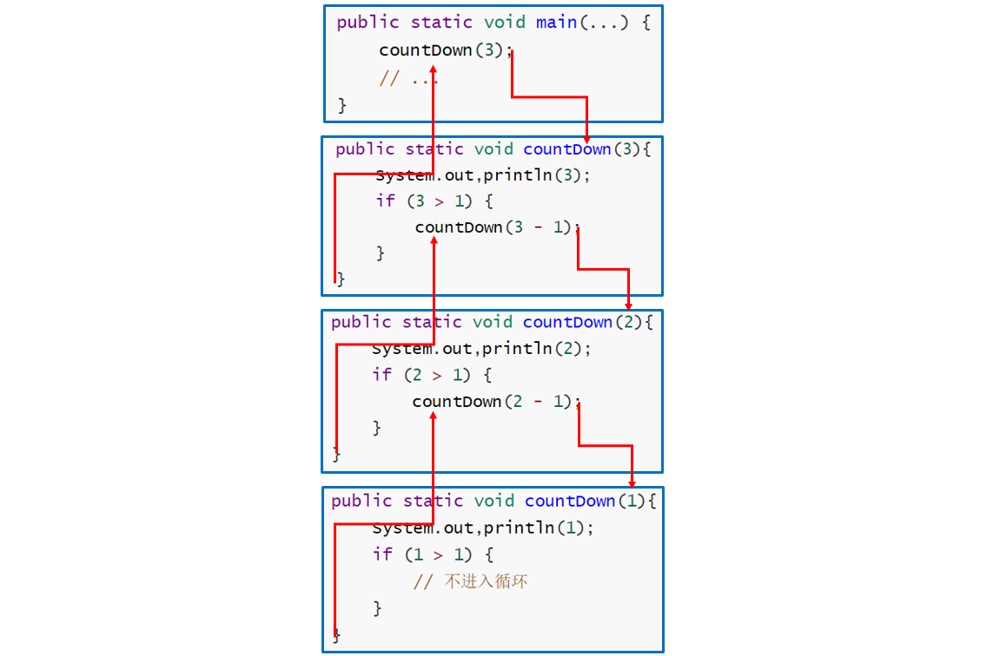

[TOC]


### 基础算法

#### 数学模型

#####  1. 近似

N<sup>3</sup>/6-N<sup>2</sup>/2+N/3 \~ N<sup>3</sup>/6。使用 \~f(N) 来表示所有随着 N 的增大除以 f(N) 的结果趋近于 1 的函数。

#####  2. 增长数量级

N<sup>3</sup>/6-N<sup>2</sup>/2+N/3 的增长数量级为 O(N<sup>3</sup>)。增长数量级将算法与它的具体实现隔离开来，一个算法的增长数量级为 O(N<sup>3</sup>) 与它是否用 Java 实现，是否运行于特定计算机上无关。

#####  3. 内循环

执行最频繁的指令决定了程序执行的总时间，把这些指令称为程序的内循环。

#####  4. 成本模型

使用成本模型来评估算法，例如数组的访问次数就是一种成本模型。


#### 时间复杂度分析

##### 1. 大O表示法

对于一般的**对数函数**，不管基数是什么，结论都一样，通常增长率函数中用到的对数的底**都是 2**.

一般来说，计算机算法是问题规模 n 的函数 **f(n)**，算法的时间复杂度也因此记做：

```
T(n) = O(f(n))
```

算法执行时间的增长率与 f(n) 的增长率正相关，称作渐近时间复杂度（Asymptotic Time Complexity），简称时间复杂度。

常见的**大 O** 运行时间：

- **O(log n)** 也叫**对数时间**，这样是算法包括二分查找法。

- **O(n)** 也叫**线性时间**，这样的算法包括简单查找。

- **O(n*log n)** 这样是算法包括快速排序（快）。

- **O(n2)** 这样的算法包括选择排序（慢）。

- **O(n!)** 这样的算法包括旅行商问题的解决方案（慢）。

其他表示法：

- **大O** 表示法分析得到算法**最大**的时间需求。
- **大Ω** 表示法分析得到算法**最小**的时间需求。
- **大Θ** 表示法分析得到的是位于上下界之间的复杂度，是最好的，但是大O用的最多。

##### 2. 算法分析注意事项

- **大常数**：在求近似时，如果低级项的常数系数很大，那么近似的结果是错误的。
- **缓存**：计算机系统会使用缓存技术来组织内存，访问数组相邻的元素会比访问不相邻的元素快很多。

- **对最坏情况下的性能的保证**：在核反应堆、心脏起搏器或者刹车控制器中的软件，最坏情况下的性能是十分重要的。
- **随机化算法**：通过打乱输入，去除算法对输入的依赖。
- **均摊分析**：将所有操作的总成本除于操作总数来将成本均摊。例如对一个空栈进行 N 次连续的 push() 调用需要访问数组的次数为 N + 4 + 8 + 16 +...+ 2N = 5N - 4（N 是向数组写入元素的次数，其余都是调整数组大小时进行复制需要的访问数组次数），均摊后访问数组的平均次数为常数。

##### 2. 分析例子

以下两层循环，内循环常数时间执行 O(1) 复杂度，外循环 O(n) 复杂度，**整体 O(n) 复杂度**。

```go
for i := 1; i < n; i++{
    for  i := 1; i < 5; i++{	
        sum = sum + 1
    }
}
```


#### 递归

调用**自己**的方法称为递归方法，递归是将一个问题分成==**同样的但更小的子问题**==的求解过程。需要设置**递归终止条件**，递归一般更消耗内存。无限递归可能发生栈溢出。

##### 1. 基础递归

递归的两个法则：

- **基准情形**：必须总要有某些基准的情形，它们不用递归就能求解。
- **不断推进**：对于那些要递归求解的情形，递归调用必须总能够朝着一个**基准情形**推进。

```go
func countDown(integer int){
    fmt.println(integer);
    if integer > 1 {
        countDown(integer - 1);
    }
}
```

其执行过程如下：



##### 2. 尾递归

当递归方法执行的**最后一个动作**是**递归调用**时就是**尾递归**。例如：

```go
func countDown(integer int){
    fmt.println(integer)
    if integer > 1 {
        countDown(integer - 1)//递归方法的最后一个动作
    }
}
```

尾递归可以很容易转化成为**迭代**算法。如下。

```go
func countDown(integer int){
    for integer >= 1 {
        fmt.println(integer)
        integer --
    }
}
```

如果必须节省**内存空间**，可以考虑用**迭代替换递归**。

