[TOC]

### 基本数据结构

#### 结构与存储

##### 1. 线性结构与非线性结构

###### (1) 线性结构

线性结构作为最常用的数据结构，其特点是数据元素之间存在**一对一**的线性关系。线性结构有两种不同的存储结构，即**顺序存储结构和链式存储结构**。顺序存储的线性表称为顺序表，顺序表中的存储元素是连续的。链式存储的线性表称为链表，链表中的存储元素不一定是连续的，元素节点中存放数据元素以及相邻元素的地址信息。

线性结构见的有：**组队列、链表和栈**。

###### (2) 非线性结构

非线性结构包括：二维数组，多维数组，广义表，树结构，图结构。

##### 2. 存储方式的分析

###### (1) 数组存储

优点：通过下标方式访问元素，速度快。**对于有序数组**，还可使用二分查找提高检索速度。
缺点：如果要检索具体某个值，或者插入值(按一定顺序)**会整体移动**，效率较低。可能还涉及到数组扩容，这中间的数据复制开销较大。

###### (2) 链式存储

优点：在一定程度上对数组存储方式有优化 (比如：插入一个数值节点，只需要将插入节点，链接到链表中即可，
删除效率也很好)。

缺点：在进行检索查找时，效率仍然较低，比如(检索某个值，需要从头节点开始遍历) 。

###### (3) 树存储

能提高数据**存储，读取**的效率,  比如利用 **二叉排序树**(Binary Sort Tree)，既可以保证数据的检索速度，同时也可以保证数据的插入，删除，修改的速度。


#### 数组

##### 1. 稀疏数组

应用场景：记录一个**棋盘**。或者**地图**等，如下所示。


因为该二维数组的很多值是**默认值 0**, 因此记录了很多没有意义的数据，考虑使用稀疏数组。

当一个数组中**大部分元素为０**，或者为同一个值的数组时，可以使用稀疏数组来保存该数组。

稀疏数组的处理方法是:

- 记录数组一共有**几行几列**，有多少个**不同的值**；
- 把具有不同值的元素的行列及值记录在一个小规模的数组中，从而缩小程序的规模。
- 行不确定，但是列是三列的动态数组。

**转化举例**


上述数组 0 较多，使用稀疏数组表示，该数组第 0 个元素记录原始数组的行数、列数和有效数据数。后面的值就是记录有效的位置和数据值。


#### 线性表

##### 1. 概述

**线性表**存储方式分为**==顺序存储和链式存储==**。顺序存储使用数组进行存储。链式存储使用链表进行存储。

对比表格如下：

|                |             顺序表             |                    链式表                    |
| :------------: | :----------------------------: | :------------------------------------------: |
|  **存储方式**  |            **数组**            |                   **链表**                   |
| **地址连续性** |      内存地址**连续**存储      | 节点的地址不是连续的，是通过**指针**连起来的 |
|    **查找**    |       方便。直接内存寻址       |             不方便。需要遍历链表             |
|    **插入**    | 不方便。后面的元素需要整体后移 |              方便。修改指针即可              |
|    **删除**    | 不方便。后面的元素需要整体前移 |              方便。修改指针即可              |

**使用**：当线性表中的元素个数变化较大或者根本不知道有多大时，最好用单链表结构，这样可以不需要考虑存储空间的大小问题。而如果事先知道线性表的大致长度，用顺序存储结构效率会高很多。

##### 2. 数组实现线性表

元素的存储空间是**连续**的。在内存中是以顺序存储，内存划分的**区域是连续**的。如下图。


**插入元素**：在**指定的位置**添加元素时，需要把**后面的元素整体移动**，效率不高。位置编号越大， 插入时所需要移动的元素越少，时间越快。当加入的元素**超过容量之后也需要扩展数组**，并把原来的数组内容进行**复制**，这里也是效率不高。如插入 11 需要将 10 和 2 整体后移再插入。


**删除元素**：删除指定位置的元素之后，也需要把后面的元素**整体往前移动补空位**。如下图删除 3 之后，需要把后面的数据整体前移。


**缺点**就是**添、删**的时候比较麻烦，特别是添和改的时候要**移动数组**，数组容易越界。可能出现数组存储满的情况，需要进行**扩容并复制**。

#####  3. 单向链表

元素在内存中**不一定**是连续存储的。如下图所示。

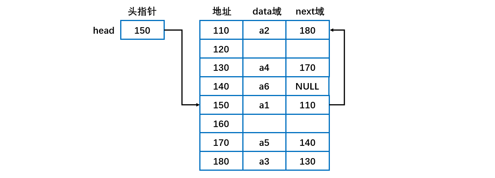

链表是以**结点**方式来存储数据，每个结点包含 **data 域， next 域**，用于指向下一个结点。链表中的节点不一定是连续存储的。如上图头结点指针 head 指向 150 地址的 a1 元素。

##### 4. 双向链表

单向链表**查找的方向只能是一个方向**，而双向链表可以向前或者向后查找。单向链表**不能自我删除**，需要靠**辅助节点** ，而双向链表，则可以**自我删除**，所以前面我们单链表删除节点时，总是需要先找到 temp, temp 是待删除节点的前一个节点。双向链表维护了一个 next 指向下一个结点，维护了一个 pre 指向上一个结点。因此添加删除操作等需要**同时操作 next 和 pre** ，不要遗忘了。

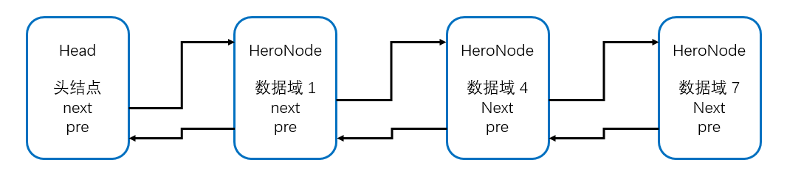

#### 栈

##### 1. 概述

- 栈的操作端通常被称为**栈顶**，另一端被称为**栈底**。所有添加都位于**栈顶**。栈顶是最新的数据。删除也是先删除栈顶。**后进先出**（LIFO）结构。
- 基本操作：**入栈**（push）：增加元素；**出栈**（pop）：删除元素；**查看**（peak）：获取栈顶但不删除。
- 顺序存储的栈称为**顺序栈**；链式存储的栈称为**链式栈**。
- 栈的常见应用：十进制转 N 进制、行编辑器、校验括号是否匹配、中缀表达式转后缀表达式、表达式求值等。

栈的抽象接口如下：

```go
type Stack struct{
    values    []interface{}
    valueType reflect.Type
}
```

##### 2. 栈的实现

###### (1) 栈的数组实现

使用可变大小数组实现栈，容量不够时可以自动**扩容**。使用数组实现栈则数组的第一个位置是**栈底**，数组**最后占用**的位置才指向**栈顶**，否则压栈会整体**移动**元素位置。

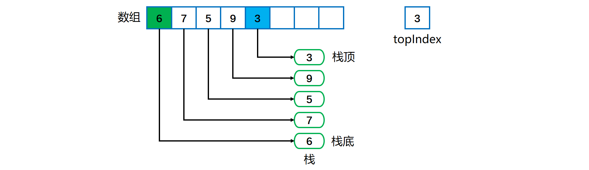

弹栈操作可以将所有的元素依次弹栈即可。可以看看 **ArrayDeque** 的源码。这里给个demo。

```go
// stack 栈
package Algorithm

import (
    "errors"
    "reflect"
)

// 栈定义
type Stack struct {
    values    []interface{}
    valueType reflect.Type
}

// 构造栈
func NewStack(valueType reflect.Type) *Stack {
    return &Stack{values: make([]interface{}, 0), valueType: valueType}
}

// 判断值是否符合栈类型
func (stack *Stack) isAcceptableValue(value interface{}) bool {
    if value == nil || reflect.TypeOf(value) != stack.valueType {
        return false
    }
    return true
}

// 入栈
func (stack *Stack) Push(v interface{}) bool {
    if !stack.isAcceptableValue(v) {
        return false
    }
    stack.values = append(stack.values, v)
    return true
}

// 出栈
func (stack *Stack) Pop() (interface{}, error) {
    if stack == nil || len(stack.values) == 0 {
        return nil, errors.New("stack empty")
    }
    v := stack.values[len(stack.values)-1]
    stack.values = stack.values[:len(stack.values)-1]
    return v, nil
}

// 获取栈顶元素
func (stack *Stack) Top() (interface{}, error) {
    if stack == nil || len(stack.values) == 0 {
        return nil, errors.New("stack empty")
    }
    return stack.values[len(stack.values)-1], nil
}

// 获取栈内元素个数
func (stack *Stack) Len() int {
    return len(stack.values)
}

// 判断栈是否为空
func (stack *Stack) Empty() bool {
    if stack == nil || len(stack.values) == 0 {
        return true
    }
    return false
}

// 获取栈内元素类型
func (stack *Stack) ValueType() reflect.Type {
    return stack.valueType
}
```

###### (2) 栈的链式实现

需要使用链表的**头插法或尾插法**来实现，因为**头插法**中最后压入栈的元素在**链表的开头**，它的 next 指针指向前一个压入栈的元素，在弹出元素时就可以通过 **next** 指针遍历到前一个压入栈的元素从而让这个元素成为新的栈顶元素。

使用单链表实现栈，则**首节点**应该指向**栈顶**元素。

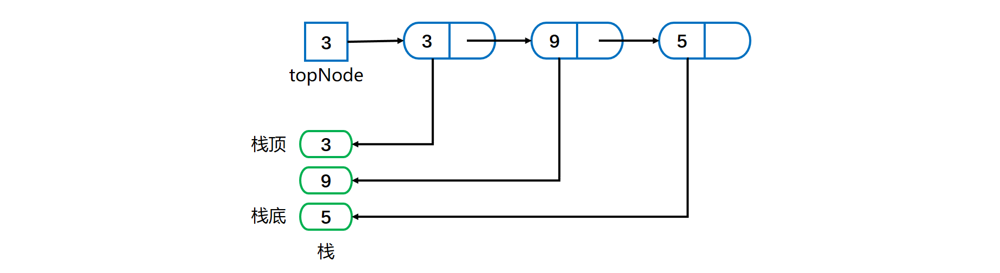

==**压栈**==操作就是分配一个新结点，使之指向目前的栈链，如下图所示。

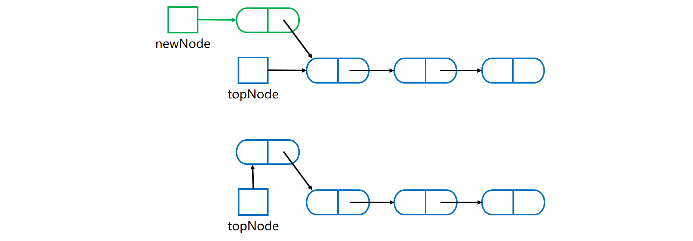

a) 构造**新结点**并指向栈顶结点；

b) 头指针指向**栈顶新节点**。

**==弹栈==**操作就是将**首节点的引用赋给 topNode**，从而出栈。故将 topNode 指向链中的第二个结点。如下图所示。

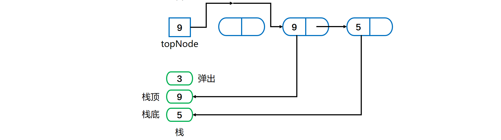

可以参考 LinkedList 的源码实现。

单链表一般使用头插法，而双链表则头插法和尾插法都可。

```go
type Elem int

// Node 元素节点结构
type Node struct {
    data Elem
    next *Node
}

// StackLink 栈
type StackLink struct {
    top    *Node // 栈顶元素
    length int
}

// InitStack 初始化一个栈，栈先进后出
func (s *StackLink) InitStack() {
    s.top = nil
}

// Push 添加一个栈元素
func (s *StackLink) Push(data Elem) {
    // 创造一个节点
    node := new(Node)
    node.data = data
    node.next = s.top
    s.top = node
    s.length++
}

// Pop 弹出一个元素
func (s *StackLink) Pop(e *Elem) error {
    if s.Empty() {
        return errors.New("empty stack")
    }

    *e = s.top.data
    node := s.top
    s.top = node.next
    s.length--

    return nil
}

// Empty 是否为空栈
func (s *StackLink) Empty() bool {
    return s.top == nil
}

// Length 栈的元素个数
func (s *StackLink) Length() int {
    return s.length
}
```


#### 队列

##### 1. 概述

- 先进先出 **FIFO** 结构。添加元素在**后端**，出队列在**前端**。

##### 2. 队列的实现

###### (1) 队列的数组实现

使用**数组**来存放队列，维护一个 **frontIndex** 和 **backIndex** 来指示**队头队尾**。

使用==**带一个不用位置的循环数组**==来实现队列。即该数组中始终有一个位置**空缺**， 可以将其放在**队尾**。此时判断队列的**空与满有不同的条件**。所以存储对象的数组应比设定的大小**多 1**。

下图是队列**满与空**流程图。

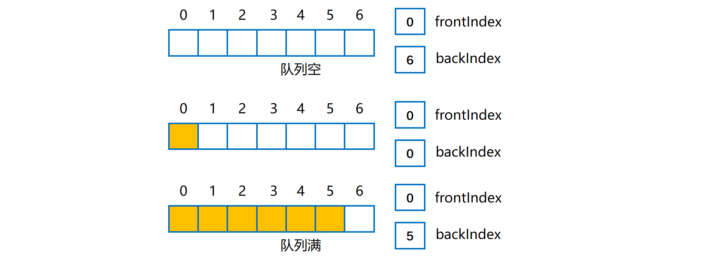

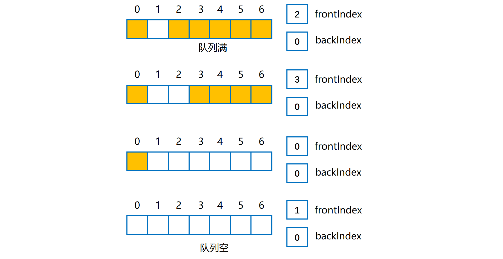

队列**满**时：（公式源自《数据结构与抽象 Java 版》）

```java
frontIndex == (backIndex + 2) % queue.length
6 == (4 + 2)% 7    
```

队列**空**时：

```java
frontIndex == (backIndex + 1) % queue.length
```

**入队**即在**队列后端**添加元素，数组是**循环**的，需要使用 **==%==** 来确定索引位置。

**出队**过程即把 frontIndex 指向**下一个**元素。

**数组扩容**：容量不足实现**扩容**时，与之前的数组扩容有所差距如下图。将原来的循环队列**全都复制到新队列的开始**处。

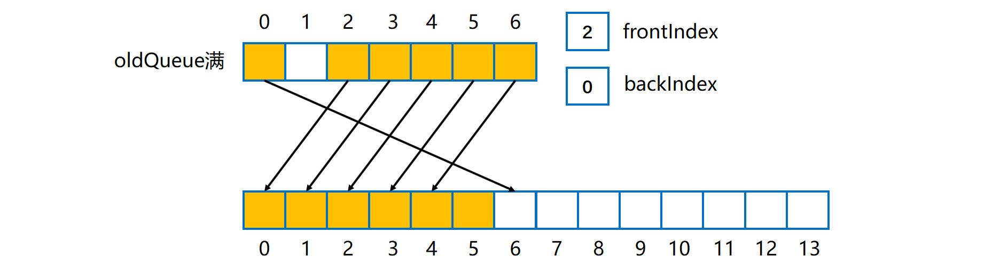

###### (2) 队列的链式实现

队列的两端在**链的两端**。队列的**前端**放在链的**开头**，队列的**后端**放在链的**链尾**。**firstNode** 指向队列前端，**lastNode** 指向队列后端，如下图所示。当队列为**空**时两个**都为 null**。


**入队**是添加新结点到后端，需要判断链是否为**空**！如果是空链，则添加元素之后如下，即 firstNode 和 lastNode 均指向新结点。

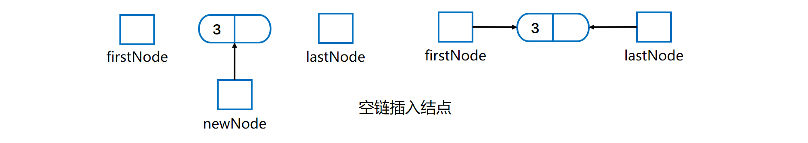

如果是一般结点**入队**，则链中最后一个结点和 lastNode 指向新结点，如下。

- **最后一个结点**指向新结点；
- **lastNode** 指向新结点。

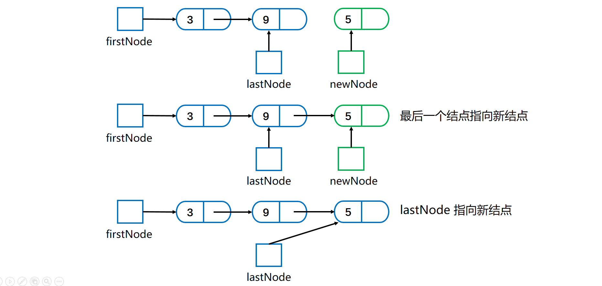

如果有多个结点，**出队**将 firstNode 指向链的第二个结点。如果队列中**仅有一个节点**，则出队之后为空。如下所示。

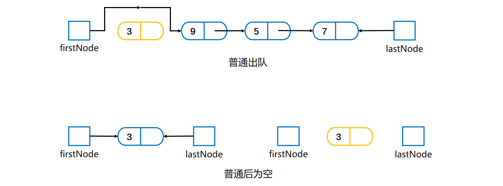

###### (3) 队列的循环链式实现

循环链中最后一个结点指向**第一个**结点。每个结点的 **nextNode** 域**不会为 null**。如下图有指向最后结点的外部引用的循环链。

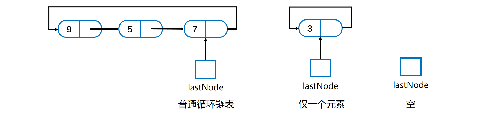

只需要**一个 lastNode** 数据域即可，它属于**链尾**，使用 

```java
lastNode.getNextNode();
```

 就可以获取到**链头**。

##### 3. 双端队列（deque）

能在队列的**前端和后端**进行添加、删除与获取操作。行为上类似于**双端栈**。

##### 4. 优先级队列（Priority Queue）

根据**优先级**组织队列中的对象。对象优先级通过 **compareTo()** 方法确定。需要按项的优先级对项进行排序。Java中有对应的类库：**PriorityQueue** 类。重点是**堆**实现。

##### 5. Golang队列实现

```go
//定义每个节点Node结构体
type node struct {
	value interface{}
	prev *node
	next *node
}
//定义链表结构
type LinkedQueue struct {
	head *node
	tail *node
	size int
}
//获取队列大小
func (queue *LinkedQueue) Size() int {
	return queue.size
}
/*
Peek操作只需要获取队列队头的元素即可，不用删除。返回类型是任意类型，用接口实现即可。另外如果head指针域为nil，则需要用panic抛出异常，一切ok的话，返回队头节点的数值即可：
*/
func (queue *LinkedQueue) Peek() interface{} {
	if queue.head == nil {
		panic("Empty queue.")
	}
	return queue.head.value
}
/*
添加操作在队列中是比较重要的操作，也要区分队尾节点是否为nil，根据是否为nil，执行不同的连接操作，最后队列的size要加1，为了不浪费内存新增节点的指针变量要置nil：
*/
func (queue *LinkedQueue) Add(value interface{}) {
	new_node := &node{value, queue.tail, nil}
	if queue.tail == nil {
		queue.head = new_node
		queue.tail = new_node
	} else {
		queue.tail.next = new_node
		queue.tail = new_node
	}
	queue.size++
	new_node = nil
}
/*
队列的删除操作也是很简单，无非是节点的断开操作。在此之前，需要判断链表的状态即是否为nil？而后移除的队列最前端的节点，先用一个新的变量节点保存队列前面的节点，进行一系列操作之后，至nil，并将长度减少即可。
*/
func (queue *LinkedQueue) Remove() {
	if queue.head == nil {
		panic("Empty queue.")
	}
	first_node := queue.head
	queue.head = first_node.next
	first_node.next = nil
	first_node.value = nil
	queue.size--
	first_node = nil
}
```


#### 符号表

符号表是一种**存储键值对**的数据结构，支持两种操作：**插入**，即将一组新的键值存存入表中；**快速查找**，即根据特定的键得到相应的值。符号表的主要目的就是将**一个键和一个值**联系起来。

符号表分为**有序和无序**两种，有序符号表主要指支持 min()、max() 等根据键的**大小关系**来实现的操作，有序符号表保证的是**键**的有序性，比较的是键。

符号表有**多种实现**方式。**树或者散列表**等都可以。散列表的查找算法也可以基于前一节的基础查找算法，只需要有适当改变即可。

##### 1. 基础实现

###### (1) map + slice切片实现无序符号表

空间换时间的玩法， 实质是map 负责存k v， slice负责维护k的有序索引位置(查找key采用的是**二分法**)，实现后赠改删时间负责度是 **O(log2n)** 。

**优化**：实际上主要就是在slice上维护k位置时的增改删费操作，这时候我们可根据具体应用在二分查找上下点文章。 例如可能所存的数据结构频繁操作的节点只有前面一部分，这时候我们可以加个逻辑，操作时slice时先二分查找 slice子集（例如头部热点），这样可能很多增改删操作在第一时间就解决了，整体性能会有很大提升， 最好根据应用场景来具体分析解决。

```go
package Order_Map

func findIndexByBinarySearch(s []int, k int) (int, bool) {
    lo, hi := 0, len(s)
    var m int
    max := len(s)

    if max == 0 {
        return 0, false
    }

    res := false
    for lo <= hi {
        m = (lo + hi) >> 1
        if m == 0 && s[0] > k {
            return 0, res
        }

        if m == max-1 && s[max-1] < k {
            return m + 1, res
        }

        if s[m] < k && s[m+1] > k {
            return m + 1, res
        }

        if s[m] > k && s[m-1] < k {
            return m, res
        }

        if s[m] < k {
            lo = m + 1
        } else if s[m] > k {
            hi = m - 1
        } else {
            return m, true
        }
    }

    return -1, false
}

type Int_Map struct {
    dataMap  map[int]interface{}
    keyArray []int
}

func NewIntMap(cap int) *Int_Map {
    return &Int_Map{
        dataMap:  make(map[int]interface{}),
        keyArray: make([]int, 0, cap),
    }
}

func (m *Int_Map) Exists(key int) bool {
    _, exists := m.dataMap[key]
    return exists
}

func (m *Int_Map) Insert(key int, data interface{}) bool {
    m.dataMap[key] = data
    index, res := findIndexByBinarySearch(m.keyArray, key)
    if index == -1 {
        return false
    }
    
    if res == true { //存在则直接返回
        return true
    }

    if len(m.keyArray) == 0 {
        m.keyArray = append(m.keyArray, key)
        return true
    }

    //追加末尾
    if index >= len(m.keyArray) {
        m.keyArray = append(m.keyArray[0:], []int{key}...)
    } else if index == 0 { //追加头部
        m.keyArray = append([]int{key}, m.keyArray[:len(m.keyArray)]...)
    } else { //插入
        rear := append([]int{}, m.keyArray[index:]...)
        m.keyArray = append(m.keyArray[0:index], key)
        m.keyArray = append(m.keyArray, rear...)
    }

    return true
}

func (m *Int_Map) Erase(key int) {
    if !m.Exists(key) {
        return
    }

    index, res := findIndexByBinarySearch(m.keyArray, key)
    
    if res == false {
        return
    }

    delete(m.dataMap, key)

    if index == 0 {
        m.keyArray = m.keyArray[1:]
    } else if index == len(m.keyArray) {
        m.keyArray = m.keyArray[:len(m.keyArray)-2]
    } else {
        m.keyArray = append(m.keyArray[:index], m.keyArray[index+1:]...)
    }
}

func (m *Int_Map) Size() int {
    return len(m.keyArray)
}

func (m *Int_Map) GetByOrderIndex(index int) (int, interface{}, bool) {
    if index < 0 || index >= len(m.keyArray) {
        return -1, nil, false
    }

    key := m.keyArray[index]
    return key, m.dataMap[key], true
}
```


##### 2. 其他实现

其他实现参考**二叉查找树、红黑树、散列表**等。

##### 3. 符号表算法比较

|             算法             | 插入 | 查找 | 是否有序 |
| :--------------------------: | :--: | :--: | :------: |
|   **链表实现**的无序符号表   |  N   |  N   |    是    |
| **二分查找实现**的有序符号表 |  N   | logN |    是    |
|        **二叉查找树**        | logN | logN |    是    |
|        **2-3 查找树**        | logN | logN |    是    |
|    **拉链法**实现的散列表    | N/M  | N/M  |    否    |
|  **线性探测法**实现的散列表  |  1   |  1   |    否    |

**无序**时应当优先考虑**散列表**，当需要**有序**性操作时使用**红黑树**。

符号表的各种实现方式优缺点对比。

|         数据结构         |                          优点                          |                          缺点                          |
| :----------------------: | :----------------------------------------------------: | :----------------------------------------------------: |
|   **链表**（顺序查找）   |                     适用于小型问题                     |                   对大型符号表效率低                   |
| **有序数组**（二分查找） | 最优的**查找效率和空间**需求，能够进行有序性相关的操作 |                  **插入**操作很**慢**                  |
|        **散列表**        |         能够快速的**查找和插入**常见类型的数据         | **无法进行有序性**相关的操作，链接与空节点需要额外空间 |
|      **二叉查找树**      |         实现简单，能够进行**有序性**的相关操作         |          没有性能上界的保证，链接需要额外空间          |
|    **平衡二叉查找树**    |   最优的**查找和插入**效率，能够进行有序性相关的操作   |                   链接需要额外的空间                   |

##### 4. 符号表实现

- **红黑树**。
- **拉链法的散列表。**
- Golang Map


#### 散列表

散列表是**符号表**的一种实现方式。散列表类似于数组，可以把散列表的散列值看成数组的索引值。访问散列表和访问数组元素一样快速，它可以在常数时间内实现**查找和插入**操作。由于无法通过散列值知道键的大小关系，因此散列表**无法实现有序性**操作。

散列表（Hash table，也叫哈希表），是根据**键值(Key value)** 而直接进行访问的数据结构。也就是说它通过把**键值映射到表中一个位置**来访问记录，以加快查找的速度。这个**映射函数叫做==散列函数==**，存放记录的数组叫做散列表。

##### 1. 散列函数

###### (1) 定义

每个**关键字**被映射到从 **0 到 TableSize - 1** 这个范围的某个数，并被放到合适的单元中，这个映射就是**==散列函数==**。

对于一个大小为 **M** 的散列表，散列函数能够把任意键转换为 **[0, M - 1]** 内的正整数，该正整数即为 **hash** 值。

我们需要寻找一个散列函数，该函数要在单元之间**均匀的分配**关键字。

散列函数应该满足以下**三个条件**：

- **一致性**：相等的键应当有相等的 hash 值，两个键相等表示调用 equals() 返回的值相等。
- **高效性**：计算应当简便，有必要的话可以把 hash 值缓存起来，在调用 hash 函数时直接返回。
- **均匀性**：所有键的 hash 值应当均匀地分布到 [0, M-1] 之间，如果不能满足这个条件，有可能产生很多冲突，从而导致散列表的性能下降。

###### (2) 常见散列函数

**除留余数法（取模）**可以将整数散列到 [0, M-1] 之间，例如一个正整数 k，计算 k % M 既可得到一个 [0, M-1] 之间的 hash 值。注意 **M 最好是一个素数**，否则无法利用键包含的所有信息。例如 M 为 10<sup>k</sup>，那么只能利用键的后 k 位。

对于其它数，可以将其**转换成整数**的形式，然后利用除留余数法。例如对于**浮点数**，可以将其的**二进制形式**转换成整数。

对于**多部分组合**的类型，每个部分都需要计算 hash 值，这些 hash 值都具有同等重要的地位。为了达到这个目的，可以将该类型看成 R 进制的整数，每个部分都具有不同的**权值**。

例如，字符串的散列函数实现如下：

```go
hash := 0;
for i := 0; i < s.length(); i++
    hash = (R * hash + s.charAt(i)) % M;
```

再比如，拥有**多个成员**的自定义类的哈希函数如下：

```go
hash := (((day * R + month) % M) * R + year) % M;
```

R 通常取 **31**。

Java 中的 **hashCode**() 实现了哈希函数，但是默认使用对象的**内存地址值**。在使用 hashCode() 时，应当结合除留余数法来使用。因为**内存地址是 32 位整数**，我们只需要 **31 位**的非负整数，因此应当屏蔽符号位之后再使用除留余数法。

```java
int hash = (x.hashCode() & 0x7fffffff) % M;
```

##### 2. 散列冲突

当两个关键字散列到**同一个值**的时候，就产生了散列冲突。散列表存在**==冲突==**，也就是两个**不同的键可能有相同的 hash 值**。解决散列冲突的简单方法有：**拉链法和开放定址法**。

######  (1) 拉链法

拉链法使用**数组 + 链表**来存储 hash 值相同的键，从而解决冲突（比如 HashMap 类）。**查找**需要分两步，首先查找 Key 所在的**链表**（对应的数据槽），然后在链表中**顺序查找**。对于 N 个键，M 条链表 (N > M)，如果哈希函数能够满足均匀性的条件，每条链表的**长度趋向于 N/M**，因此未命中的查找和插入操作所需要的比较次数为 \~N/M。

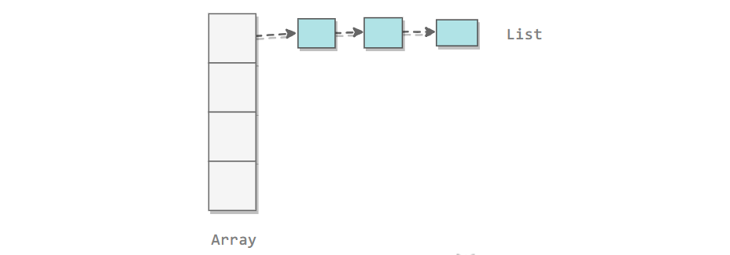

这个详细可看 **HashMap** 的源码。

###### (2) 开放地址法

线性探测法使用**空位**来解决冲突，当冲突发生时，**向前探测一个空位**来存储冲突的键。

更常见的是，单元 h~0~(x), h~1~(x), ....  相继被试选，其中

***h ~i~ (x) = (hash(x) + f ~i~ (x) ) mod TableSize, 且 f(0) = 0*。**

**函数 f  是解决冲突解决方法（冲突函数）**。此时**所有的数据都需要放入表**内，所以**需要的表比拉链法散列需要的表更大**。把这样的表叫做**探测散列表**。

使用线性探测法，数组的大小 M 应当**大于键的个数 N**（M>N)。

<div align="center">  </div><br>

现考察三种具体的冲突解决方案。**线性探测法、平方探测法、双散列法。**

> **线性探测法**

线性探测法中典型的情形是**冲突函数 f 为一次函数**：

```
f(i) = i
```

这相当于相继**逐个探测单元**（必要时可以回绕）以查找出一个**空**单元。

存在的**问题**：有时候占据的单元会形成一些**区块**，其结果成为==**一次聚集**==，就是说散列到**区块**中的任何关键字都需要**多次尝试**才能解决冲突。

**代码实现**

```java
public class LinearProbingHashST<Key, Value> implements UnorderedST<Key, Value> {

    private int N = 0;
    private int M = 16;
    private Key[] keys;
    private Value[] values;

    public LinearProbingHashST() {
        init();
    }

    public LinearProbingHashST(int M) {
        this.M = M;
        init();
    }

    private void init() {
        keys = (Key[]) new Object[M];
        values = (Value[]) new Object[M];
    }

    private int hash(Key key) {
        return (key.hashCode() & 0x7fffffff) % M;
    }
}
```

**查找**

```java
public Value get(Key key) {
    for (int i = hash(key); keys[i] != null; i = (i + 1) % M)
        if (keys[i].equals(key))
            return values[i];

    return null;
}
```

**插入**

```java
public void put(Key key, Value value) {
    resize();
    putInternal(key, value);
}

private void putInternal(Key key, Value value) {
    int i;
    for (i = hash(key); keys[i] != null; i = (i + 1) % M)
        if (keys[i].equals(key)) {
            values[i] = value;
            return;
        }

    keys[i] = key;
    values[i] = value;
    N++;
}
```

**删除**

删除操作应当将右侧所有相邻的键值对**重新**插入散列表中。

```java
public void delete(Key key) {
    int i = hash(key);
    while (keys[i] != null && !key.equals(keys[i]))
        i = (i + 1) % M;

    // 不存在，直接返回
    if (keys[i] == null)
        return;

    keys[i] = null;
    values[i] = null;

    // 将之后相连的键值对重新插入
    i = (i + 1) % M;
    while (keys[i] != null) {
        Key keyToRedo = keys[i];
        Value valToRedo = values[i];
        keys[i] = null;
        values[i] = null;
        N--;
        putInternal(keyToRedo, valToRedo);
        i = (i + 1) % M;
    }
    N--;
    resize();
}
```

**调整数组大小**

线性探测法的成本取决于连续条目的长度，连续条目也叫**聚簇**。当聚簇很长时，在查找和插入时也需要进行**很多次探测**。**装填因子**的选取很重要。

**α = N/M**，把 α 称为**使用率**。理论证明，当 α 小于 1/2 时探测的预计次数只在 1.5 到 2.5 之间。为了保证散列表的性能，应当调整数组的大小，使得 **α 在 [1/4, 1/2]** 之间。

```java
private void resize() {
    if (N >= M / 2)
        resize(2 * M);
    else if (N <= M / 8)
        resize(M / 2);
}

private void resize(int cap) {
    LinearProbingHashST<Key, Value> t = new LinearProbingHashST<Key, Value>(cap);
    for (int i = 0; i < M; i++)
        if (keys[i] != null)
            t.putInternal(keys[i], values[i]);

    keys = t.keys;
    values = t.values;
    M = t.M;
}
```

> **平方探测法**

平方探测是**消除**线性探测中**一次聚集**问题的散列冲突解决方法。

平方探测就是**冲突函数为二次**的探测方法。典型的情形是：

```
f(i) = i * i
```

**定理**：如果使用**平方探测**，且表的大小是**素数**，那么当表至少有**一半是空**的时候，**总能够**插入一个新的元素。即使表被填充的位置仅仅比**一半多一个**，那么插入都**可能失败**。

平方探测也可能产生**二次聚集**问题。

> **双散列法**

双散列法冲突函数一般的选择是：

```
f(i) = i * hash2(x)
```

这个公式是说将第二个散列函数应用到 x 并在距离 **hash~2~(x)**,  **2 hash~2~(x)....** 等处进行探测。

##### 3. 再散列

如果散列表装的太满，那么再插入新元素的时候可能消耗时间很长，而且可能失败。解决方法是建立另一个大约 2 倍大的表，然后扫描整个原始散列表，**重新计算元素的新散列值**并装入到新的散列表中。这个操作就是**再散列**。

再散列显然开销较大。

**再散列策略**

- 散列表到一半满就再散列。
- 当插入元素失败才再散列（比较极端）。
- **途中策略**：当散列表达到一个**装填因子**时进行再散列（较好）。

##### 4. 高级散列

介绍几个高级一定的散列表。

###### (1) 完美散列

**完美散列的定义**：在关键字集不再变化的情况下，运用某种散列技术，将所有的关键字存入散列表中，可以在最坏运行时间为 O(1) 的情况下完成对散列表的查找工作，这种散列方法就是**完美散列**。

我们期望最坏的情况下，查找的时间函数也是 O(1) — **完美散列**。

使用**二级散列表**可以实现完美散列。每个二级散列表将用一个**不同的散列函数**进行构造，直到没有冲突为止。

###### (2) 布谷鸟散列

CuckooHash（布谷鸟散列）是为了解决**哈希冲突问题**而提出，利用较少的计算换取较大的**空间**。

假设有 N 个项，分别维护**两个**超过半空的表，且有**两个独立的散列函数**，可以把每个项分配到每个表的一个位置。布谷鸟散列保持不变的是一个项总是会被存储在这两个位置之一。

**算法描述**

使用 hashA、hashB 计算对应的 key 位置：

1、两个位置均为空，则任选一个插入；
2、两个位置中一个为空，则插入到空的那个位置
3、两个位置均不为空，则踢出一个位置后插入，被踢出的对调用该算法，再执行该算法找其另一个位置，循环直到插入成功。
4、如果被踢出的次数达到一定的阈值，则认为 hash 表已满，并进行再哈希 rehash。

布谷鸟散列通常被实现成一张巨大的表，且带有**两个（或多个）可以探测整表的散列函数**。

具体实现参考：https://www.jianshu.com/p/68220564f341

###### (6) 跳房子散列

线性探测法是在散列位置的相邻点开始探测，这会引起很多问题，于是各种优化版本例如平方探测、双散列等被提出来改进其中的聚集问题。但是探测相邻位置和第二次散列相比，显然探测相邻位置更有优势，所以线性探测仍然是实用的，甚至是最佳选择。

跳房子散列的思路：**用事先确定的，对计算机底层体系结构而言最优的一个常数**，给探测序列的最大长度加个上界。这样做可以给出常数级的最坏查询时间，并且与**布谷鸟散列**一样，查询可以并行化，以同时检查可用位置 的有限集。

 **要点：**

 a）依然是线性探测。

 b）探测长度 *i* 有个上限。

 c）上限是提前定好的，跟计算机底层体系结构有关系。

 但是布谷鸟散列和跳房子散列还处于实验室状态，能否在实际中代替线性探测法或者平方探测法，还有待验证。


#### 优先级队列与堆

##### 1. 概述

**优先级队列**有多种实现方法，对比如下表。

|  数据结构  |  插入元素  | 删除最大元素 |
| :--------: | :--------: | :----------: |
|  有序数组  |     N      |      1       |
|  无序数组  |     1      |      N       |
| **二叉堆** | ***logN*** |  ***logN***  |
| 理想情况1  |     1      |      1       |

用堆实现优先队列比较香。

##### 2. 二叉堆

###### (1) 存储特点

**根结点**是堆有序的二叉树中的最大结点或最小结点。**堆中**某个节点的值总是**大于等于**其子节点的值，并且堆是**==一颗完全二叉树==**。堆可以用==**数组**==来表示，这是因为**堆是完全二叉树**，而**完全二叉树**很容易就存储在**数组**中。这里**不使用数组索引为 0** 的位置，可以清晰地描述节点的**位置关系**。位置 **k** 的节点的父节点位置为 **k / 2**，而它的两个子节点的位置分别为 **2k 和 2k+1**。

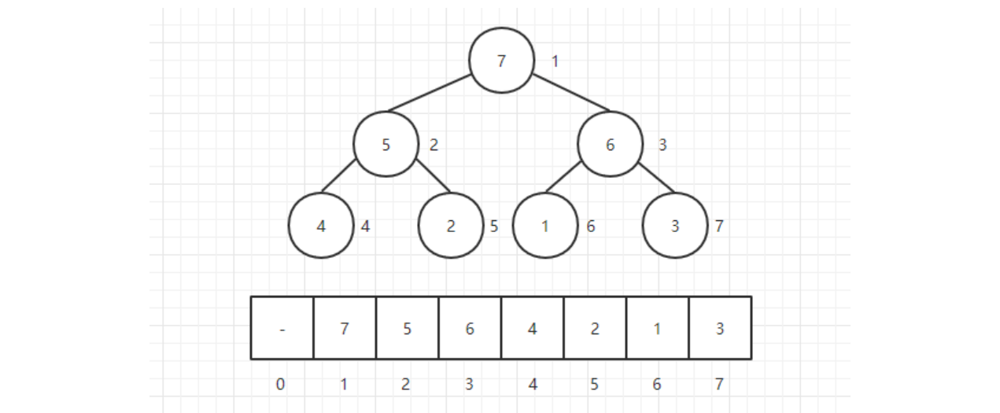

因为**堆**在形式上是一颗**完全二叉树**，用数组来存储它**不会浪费**任何空间。**注意：**这里是把下标为 **0** 的地方**空出来**了的，主要是为了方便理解，如果 0 不空出来只需要在计算的时候把 i 值往右偏移一个位置就行了。

|     结点     |    位置     |
| :----------: | :---------: |
| **当前结点** |  **a[i]**   |
|  **父结点**  | **a[i/2]**  |
| **左子结点** |  **a[2i]**  |
| **右子结点** | **a[2i+1]** |

注意父节点位置这里是**整数除**，**2 和 3 除以 2 都为 1**。

###### (2) 基本属性与操作

以下是**二叉堆类**的基本属性与基本操作。

```java
/**
 * 二叉堆
 */
public class BinaryHeap<AnyType extends Comparable<? super AnyType>> {

    // 默认容量
    private static final int DEFAULT_CAPACITY = 10;

    // 当前堆中的元素个数
    private int currentSize;

    // 存放堆元素的数组
    private AnyType[] dataArray;

    // 构造器
    public BinaryHeap() {
        this(DEFAULT_CAPACITY);
    }

    // 构造器
    public BinaryHeap(int capacity) {
        currentSize = 0;
        dataArray = (AnyType[]) new Comparable[ capacity + 1 ];
    }

    /**
     * 数组扩容
     */
    private void enlargeArray(int newSize) {
        AnyType[] old = dataArray;
        dataArray = (AnyType[]) new Comparable[newSize];
        for(int i = 0; i < old.length; i++) {
            dataArray[i] = old[i];
        }
    }

    // 返回二叉堆最小值
    public AnyType findMin() {
        if( isEmpty() ) {
            throw new RuntimeException( );
        }
        // 当前构造的最小堆，数组第一个元素就是最小值 注意索引0是不用的
        return dataArray[1];
    }

    // 判断是否为空
    public boolean isEmpty() {
        return currentSize == 0;
    }

    // 清空二叉堆
    public void makeEmpty() {
        currentSize = 0;
    }

    /**
     * 测试用
     */
    public static void main( String [ ] args ) {
        int numItems = 10000;
        // 构造一个堆
        BinaryHeap<Integer> h = new BinaryHeap<>();
        int i = 37;
        // 将元素加入堆
        for(i = 37; i != 0; i = (i + 37) % numItems) {
            h.insert(i);
        }
        for(i = 1; i < numItems; i++) {
            if(h.deleteMin() != i) {
                System.out.println("Oops! " + i);
            }
        }
    }
}
```

###### (3) 插入元素

当**插入**一个元素到堆中时，它可能**不满足堆**的性质，在这种情况下，需要**调整堆中元素的位置使之重新变成堆**，这个过程称为**堆化**（**heapify**）；在最大堆中，要堆化一个元素，需要**找到它的父亲结点**，如果不满足堆的基本性质则**交换两个元素的位置**，重复该过程直到每个结点都满足堆的性质为止。

在堆的**==下一个可用位置（也就是存放元素数组的下一个位置）创建一个空穴==**，否则该堆将不是完全树。将**待插入的元素**与**空穴的父结点**进行比较，如果比父节点小就交换空穴与父节点位置，空穴**==上浮==**，循环此过程。实现时就是将**新元素**放到**==数组末尾==**，然后**==上浮==**到合适的位置。

下面在该堆中插入一个新的元素 **26**：在二叉堆的下一个可用位置放置一个**空穴**，该空穴值假定为 26，但是**不赋值**，可以**==减少比较与交换操作==**。

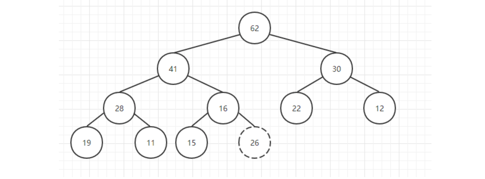

通过二叉堆的**索引**公式可以找到新插入元素的**父亲结点**，然后**比较它们的大小**，如果新元素更大则交换两个元素的位置，这个操作就相当于把该元素**==上浮==**了一下。如下图中 26 与 16 交换位， 26 上浮。

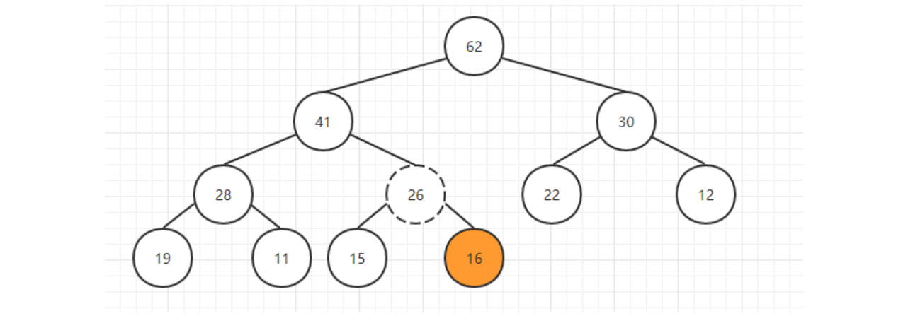

重复该操作直到 26 到了一个**满足堆条件的位置**，此时就完成了插入的操作，下图插入 26 完成。

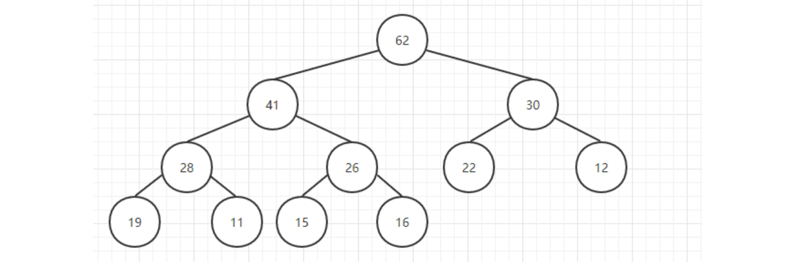

**插入元素**代码实现如下（下面的代码是插入元素到小顶堆中）。

```java
public void insert(AnyType newNode) {
    // 先检查数组容量是否需要扩容
    if(currentSize == dataArray.length - 1) {
        enlargeArray(dataArray.length * 2 + 1);
    }
    
    // 空穴位置是当前元素数量＋1
    int hole = ++currentSize;

    // 不断将插入元素与空穴的父节点进行比较
    for(dataArray[0] = newNode; newNode.compareTo(dataArray[hole / 2]) < 0; hole /= 2) {
        // 交换空穴与其父节点位置 空穴上浮
        dataArray[hole] = dataArray[hole / 2];
    }
    // 最后才将插入值赋给空穴处 可以减少每次的交换操作
    dataArray[hole] = newNode;
}
```

###### (4) 删除顶部元素

取出堆中的**堆顶元素**就是用**最后一个元素替换掉栈顶元素**，然后把最后一个元素删除掉，这样一来元素的总个数也满足条件，然后只需要把**栈顶元素依次往下调整**就好了，这个操作就叫做 **sink（下沉）**。

**操作**也是将**堆顶元素置换为空穴**，然后将空穴的**两个儿子中较小者**与其交换位置，直到下沉到对应位置。但是可能遇到**只有一个子结点**的情况，此时一种解决方法是始终保证算法把每一个结点都**看成有两个子结点**。为了实施这种解法，当堆的大小为偶数时在每个**下沉开始处**，可将其值**大于堆中任何元素的标记**放到堆的**终端后面**的位置上。也就是假想有一个大于或者小于任何元素的结点此时正在堆的**最后一个位置**上。

从数组**顶端删除最大**的元素，并将数组的**最后一个元素放到顶端**，并让这个元素**==下沉到合适==**的位置。

例如删除堆顶元素 62。

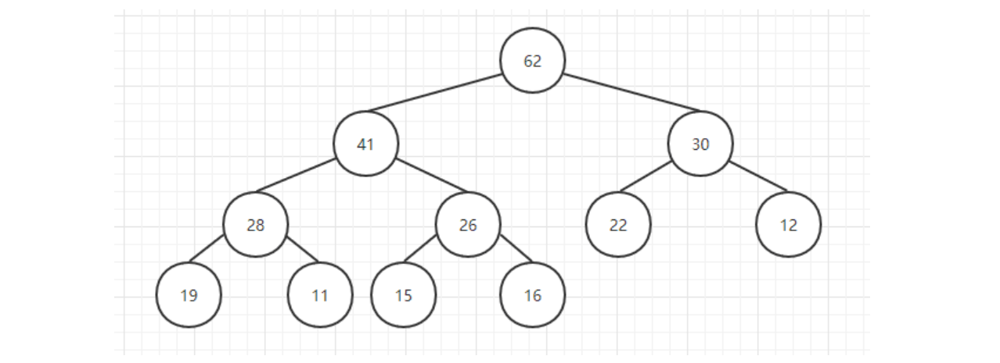

用数组最后的一个元素**==替换==**掉堆顶元素，然后删除最后一个元素并返回堆顶元素：

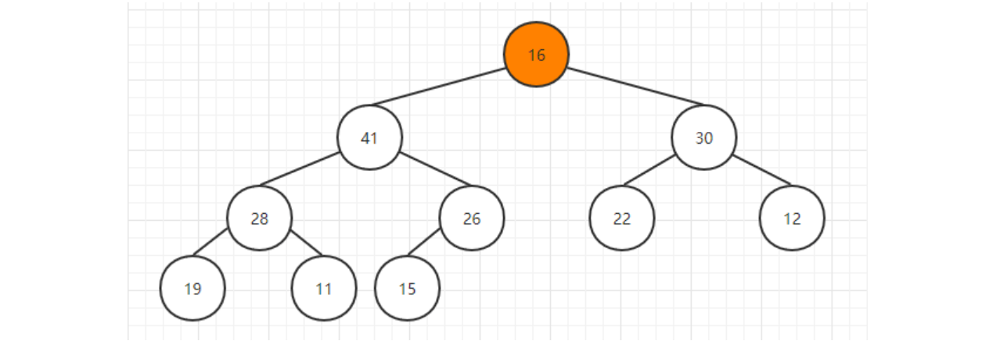

然后比较其孩子结点的大小：

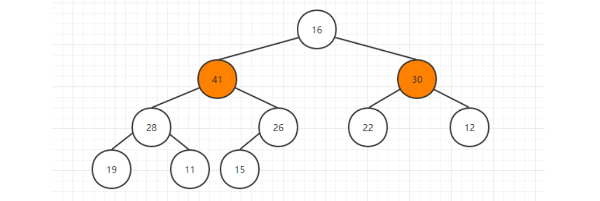

如果**不满足堆**的条件，那么就跟**孩子结点中较大**的一个交换位置：41 ＞ 30，所以16 与 41 **交换**位置。

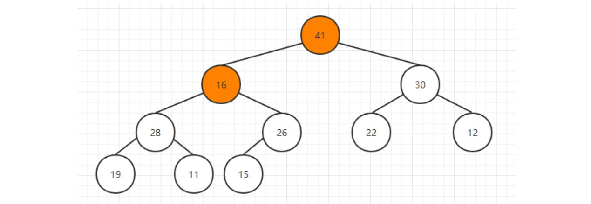

重复该步骤，直到 16 到达合适的位置：

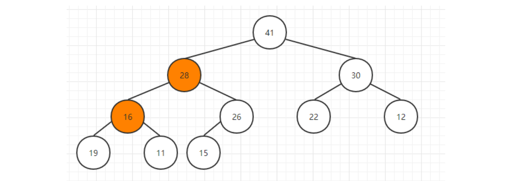

**完成**取出堆顶元素的操作：


代码实现如下（下面的代码是移除小顶堆的最小值代码）：

```java
/**
 * 删除最小值 
 */
public AnyType deleteMin() {
    // 判空
    if(isEmpty()) {
        throw new RuntimeException( );
    }
	// 找到堆顶的元素
    AnyType minItem = findMin();
    // 交换堆顶元素与最后一个元素
    dataArray[1] = dataArray[currentSize--];
    // 执行下沉操作 
    sink(1);
    // 返回堆顶的元素
    return minItem;
}

/**
 * 下沉操作
 *
 * @param hole 空穴
 */
private void sink(int hole) {
    int child;
    AnyType tmp = dataArray[hole];
    for( ; hole * 2 <= currentSize; hole = child) {
        child = hole * 2;
        if(child != currentSize && dataArray[child + 1].compareTo(dataArray[child]) < 0 ) {
            child++;
        }
        if(dataArray[child].compareTo(tmp) < 0) {
            dataArray[hole] = dataArray[child];
        } else {
            break;
        }
    }
    dataArray[hole] = tmp;
}
```

###### (5) 根据数组构造堆

下列的代码是根据数组**构造**小顶堆。就是**不断对每个元素**执行 **sink下沉**操作。

```java
/**
 * 通过给定的任意数组构造一个小顶堆
 */
public BinaryHeap(AnyType[] items) {
    currentSize = items.length;
    dataArray = (AnyType[]) new Comparable[(currentSize + 2) * 11 / 10];
    // 默认从1索引开始，第0个位置不管
    int i = 1;
    for(AnyType item : items) {
        dataArray[i++] = item;
    }
    // 构建堆
    buildHeap();
}

/**
 * 构建堆
 */
private void buildHeap() {
    for(int i = currentSize / 2; i > 0; i--) {
        // 执行下沉操作
        sink(i);
    }
}
```

##### 3. Java中的PriorityQueue

在 Java 中也实现了自己的优先队列`java.util.PriorityQueue`，默认为**最小堆**，与上述相比有一些函数名不一样，底层还是维护了一个 **Object 类型的数组**，另外如果想要把最小堆变成**最大堆**可以给 PriorityQueue 传入自己的**比较器**，例如：

```java
// 默认为最小堆
PriorityQueue<Integer> pq = new PriorityQueue<>();
pq.add(5);
pq.add(2);
pq.add(1);
pq.add(10);
pq.add(3);

while (!pq.isEmpty()) {
    System.out.println(pq.poll() + ", ");
}
System.out.println();
System.out.println("————————————————————————");

// 使用Lambda表达式传入自己的比较器转换成最大堆
PriorityQueue<Integer> pq2 = new PriorityQueue<>((a, b) -> b - a);
pq2.add(5);
pq2.add(2);
pq2.add(1);
pq2.add(10);
pq2.add(3);

while (!pq2.isEmpty()) {
    System.out.println(pq2.poll() + ", ");
}
```

##### 4. 优先级队列的应用

应用很多：

- 数据压缩：赫夫曼编码算法；
- 最短路径算法：Dijkstra 算法；
- 最小生成树算法：Prim 算法；
- 事件驱动仿真：顾客排队算法；
- 选择问题：查找第 k 个最小元素；

###### (1) 动态数据排序找前 K 个值

在某些数据处理的例子中，总数据量太大，无法排序（甚至无法全部装进内存）。例如，需要从十亿个元素中选出**最大的十个**，你真的想把一个 **10 亿规模**的数组排序（或者是**无限的数据流**）吗？但有了优先队列，你只用一个能存储**十个元素的队列**即可。具体做法是让元素一个个输入，只要优先队列的个数大于 10，就不断删除最小元素，最后优先队列长度不大于 10 时停止删除，只剩 10 个自然就是所有元素中最大的 10 个了。很多情况我们会收集一些元素，处理当前键值最大（或最小）的元素，然后再收集更多的元素，再处理当前最大的（或最小的）元素，这可以看成我们按照事件的优先级顺序来处理，生活中很多任务都是有优先级高低之分的，所以优先队列可以高效地处理这些情况。

###### (2) 找中值

可以维护两个堆，一个大顶堆、一个小顶堆，用于找很多数或者无界数的中值。

##### 5. 左式堆

设计一种堆结构像二叉堆那样高效的支持合并操作而且**只使用一个数组**似乎很困难。原因在于，**合并**似乎需要把一个数组拷贝到另一个数组中去，对于相同大小的堆，这将花费O(N)。正因为如此，所有**支持高效合并**的高级数据结构都需要使用指针。

像二叉堆那样，**左式堆**也有结构性和堆序性。不仅如此，左式堆也是二叉树，它和二叉堆之间的唯一区别在于：**左式堆不是理想平衡的，而实际上是趋向于非常不平衡**。
把任意节点 X 的**零路径长**(null path length, **NPL**) NPL(X) 定义为从 X 到一个**没有两个儿子**的节点的**最短路径**长。因此，具有 0 个或 1 个儿子的节点的 NPL 值为 0，而 NPL(NULL) = -1。注意，任意节点的零路径长比它的各个儿子节点的最小值多 1。

左式堆的性质是：对于堆中的每一个节点 X，**左儿子的零路径长至少与右儿子的零路径长一样大**。这个性质使左式堆明显更偏重于**使树向左增加深度**，左式堆的名称也由此而来。

##### 6. 斜堆

斜堆是左式堆的自调节形式，实现起来较为简单。斜堆是具有堆序的二叉树，但不存在对树的结构限制。


#### **参考资料**

- https://www.jianshu.com/p/68220564f341


