[TOC]

### 进阶数据结构

#### 布隆过滤器

##### 1. 概述

布隆过滤器（Bloom Filter）可以把它看作由**二进制向量（或者说位数组）和一系列随机映射函数（哈希函数）两部分组成的数据结构**。相比于 List、Map 、Set 等数据结构，它占用空间更少并且效率更高，但是缺点是其返回的结果是概率性的，而不是非常准确的。理论情况下添加到集合中的元素越多，误报的可能性就越大。并且，存放在布隆过滤器的数据不容易删除。


**位数组**中的每个元素都只**占用 1 bit** ，并且每个元素**只能是 0 或者 1**。这样申请一个 100w 个元素的位数组只占用  1000000Bit / 8 = 125000 Byte = 125000/1024 kb ≈ **122kb** 的空间。

总结：**一个名叫 Bloom 的人提出了一种来检索元素是否在给定大集合中的数据结构，这种数据结构是高效且性能很好的，但缺点是具有一定的错误识别率和删除难度。并且，理论情况下，添加到集合中的元素越多，误报的可能性就越大。**

##### 2. 布隆过滤器原理

**当一个元素加入布隆过滤器中的时候，会进行如下操作：**

1. 使用布隆过滤器中的**哈希函数**对元素值进行计算，得到**哈希值**（有**几个哈希函数得到几个哈希值**），一般都有多个哈希函数。
2. 根据得到的哈希值，在位**数组中把对应下标的值置为 1**。

**当需要判断一个元素是否存在于布隆过滤器的时候，会进行如下操作：**

1. 对给定元素再次使用上述的**多个哈希函数**进行**相同的哈希计算**；
2. 得到值之后判断位数组中的**每个元素是否都为 1**，如果**存在一个值不为 1**，说明该元素**肯定不在**布隆过滤器中。如果全部为 1，大概率认为是命中的，当然也存在一定的**误判几率**。

举个简单的例子：

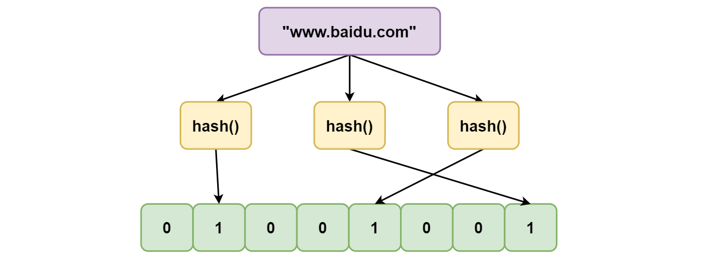

如图所示，当字符串存储要加入到布隆过滤器中时，该字符串首先由**多个哈希函数生成不同的哈希值**，然后在对应的位数组的下表的元素设置**为 1**（当位数组初始化时 ，所有位置均为 0）。当第二次存储相同字符串时，因为先前的对应位置已设置为1，所以很容易知道此值已经存在（**去重**非常方便）。

如果需要判断某个字符串是否在布隆过滤器中时，只需要对给定字符串再次进行相同的哈希计算，得到值之后判断位数组中的每个元素是否都为 1，如果值都为 1，那么说明这个值在布隆过滤器中，如果存在一个值不为 1，说明该元素不在布隆过滤器中。

**不同的字符串可能哈希出来的位置相同，这种情况我们可以适当增加位数组大小或者调整我们的哈希函数。**

综上可以有：**布隆过滤器说某个元素存在，小概率会误判。布隆过滤器说某个元素不在，那么这个元素一定不在。**

##### 3. 布隆过滤器使用场景

1. **大数据判断是否存在**：比如判断一个数字是否在于包含大量数字的数字集中（数字集很大，5亿以上！）、 防止缓存穿透（判断请求的数据是否有效避免直接绕过缓存请求数据库）等等、邮箱的垃圾邮件过滤、黑名单功能等等。
2. **去重**：比如爬给定网址的时候对已经爬取过的 URL 去重。
3. **解决缓存穿透**：经常会把一些热点数据放在 Redis 中当作缓存，例如产品详情。 通常一个请求过来之后我们会先查询缓存，而不用直接读取数据库，这是提升性能最简单也是最普遍的做法，但是 **如果一直请求一个不存在的缓存**，那么此时一定不存在缓存，那就会有 **大量请求直接打到数据库** 上，造成 **缓存穿透**，布隆过滤器也可以用来解决此类问题。
4. **爬虫/ 邮箱等系统的过滤**：平时不知道你有没有注意到有一些正常的邮件也会被放进垃圾邮件目录中，这就是使用布隆过滤器 **误判** 导致的。
5. 垃圾邮件过滤
6. 防止缓存击穿
7. 比特币交易查询
8. 爬虫的URL过滤
9. IP黑名单
10. 查询加速【比如基于KV结构的数据】
11. 集合元素重复的判断

##### 4. Golang实现布隆过滤器

需要：

1. 一个合适大小的位数组保存数据。
2. 几个不同的**哈希函数。**
3. 添加元素到位数组（布隆过滤器）的方法实现。
4. 判断给定元素是否存在于位数组（布隆过滤器）的方法实现。

**开源包简单演示：**

```go
package main
import (
   "fmt"
   "github.com/willf/bitset"
   "math/rand"
)

func main() {
   Foo()
   bar()
}

func Foo() {
   var b bitset.BitSet // 定义一个BitSet对象

   b.Set(1).Set(2).Set(3) //添加3个元素
   if b.Test(2) {
      fmt.Println("2已经存在")
   }
   fmt.Println("总数：", b.Count())

   b.Clear(2)
   if !b.Test(2) {
      fmt.Println("2不存在")
   }
   fmt.Println("总数：", b.Count())
}

func bar() {
   fmt.Printf("Hello from BitSet!\n")
   var b bitset.BitSet
   // play some Go Fish
   for i := 0; i < 100; i++ {
      card1 := uint(rand.Intn(52))
      card2 := uint(rand.Intn(52))
      b.Set(card1)
      if b.Test(card2) {
         fmt.Println("Go Fish!")
      }
      b.Clear(card1)
   }

   // Chaining
   b.Set(10).Set(11)

   for i, e := b.NextSet(0); e; i, e = b.NextSet(i + 1) {
      fmt.Println("The following bit is set:", i)
   }
   // 交集
   if b.Intersection(bitset.New(100).Set(10)).Count() == 1 {
      fmt.Println("Intersection works.")
   } else {
      fmt.Println("Intersection doesn't work???")
   }
}
```

**封装的方法：**

```go
//----------------------------------------------------------------------------
// @ Copyright (C) free license,without warranty of any kind .
// @ Author: hollson <hollson@live.com>
// @ Date: 2019-12-06
// @ Version: 1.0.0
//------------------------------------------------------------------------------
package bloomx
import "github.com/willf/bitset"

const DEFAULT_SIZE = 2<<24
var seeds = []uint{7, 11, 13, 31, 37, 61}

type BloomFilter struct {
   Set *bitset.BitSet
   Funcs [6]SimpleHash
}

func NewBloomFilter() *BloomFilter {
   bf := new(BloomFilter)
   for i:=0;i< len(bf.Funcs);i++{
      bf.Funcs[i] = SimpleHash{DEFAULT_SIZE,seeds[i]}
   }
   bf.Set = bitset.New(DEFAULT_SIZE)
   return bf
}

func (bf BloomFilter) Add(value string){
   for _,f:=range(bf.Funcs){
      bf.Set.Set(f.hash(value))
   }
}

func (bf BloomFilter) Contains(value string) bool {
   if value == "" {
      return false
   }
   ret := true
   for _,f:=range(bf.Funcs){
      ret = ret && bf.Set.Test(f.hash(value))
   }
   return ret
}

type SimpleHash struct{
   Cap uint
   Seed uint
}

func (s SimpleHash) hash(value string) uint{
   var result uint = 0
   for i:=0;i< len(value);i++{
      result = result*s.Seed+uint(value[i])
   }
   return (s.Cap-1)&result
}
```

**测试：**

```go
func main() {
   filter := bloomx.NewBloomFilter()
   fmt.Println(filter.Funcs[1].Seed)
   str1 := "hello,bloom filter!"
   filter.Add(str1)
   str2 := "A happy day"
   filter.Add(str2)
   str3 := "Greate wall"
   filter.Add(str3)

   fmt.Println(filter.Set.Count())
   fmt.Println(filter.Contains(str1))
   fmt.Println(filter.Contains(str2))
   fmt.Println(filter.Contains(str3))
   fmt.Println(filter.Contains("blockchain technology"))
}
```

##### 5. 基于Guava的布隆过滤器

**Guava** 中布隆过滤器的实现算是比较权威的，所以实际项目中可以直接用。引入 Guava 的依赖：

```xml
<dependency>
    <groupId>com.google.guava</groupId>
    <artifactId>guava</artifactId>
    <version>28.0-jre</version>
</dependency>
```

实际使用如下：创建一个最多存放**最多 1500 个整数**的布隆过滤器，并且设置可以**容忍误判的概率为百分之（0.01）**。

```java
// 创建布隆过滤器对象
BloomFilter<Integer> filter = BloomFilter.create(
    Funnels.integerFunnel(),
    1500,
    0.01);
// 判断指定元素是否存在
System.out.println(filter.mightContain(1));
System.out.println(filter.mightContain(2));
// 将元素添加进布隆过滤器
filter.put(1);
filter.put(2);
System.out.println(filter.mightContain(1));
System.out.println(filter.mightContain(2));
```

在示例中，当 **mightContain**() 方法返回 true 时，该元素有 **99％** 的概率在过滤器中，当过滤器返回 false 时，可以**100％** 确定该元素**不存在**于过滤器中。

Guava 提供的布隆过滤器的实现是很不错的，但是它有一个**重大的缺点**就是**只能单机使用**（另外容量扩展也不容易），而现在互联网一般都是**分布式**的场景。为了解决这个问题，就需要用到 Redis 中的布隆过滤器了。

##### 6. Redis中的布隆过滤器

Redis 中的布隆过滤器有两个基本指令，**bf.add** 添加元素，**bf.exists** 查询元素是否存在，它的用法和 **set** 集合的 sadd 和 sismember 差不多。注意 **bf.add** 只能一次添加一个元素，如果想要一次添加多个，就需要用到 **bf.madd** 指令。同样如果需要一次查询多个元素是否存在，就需要用到 **bf.mexists** 指令。

```bash
127.0.0.1:6379> bf.add codehole user1
(integer) 1
127.0.0.1:6379> bf.add codehole user2
(integer) 1
127.0.0.1:6379> bf.add codehole user3
(integer) 1
127.0.0.1:6379> bf.exists codehole user1
(integer) 1
127.0.0.1:6379> bf.exists codehole user2
(integer) 1
127.0.0.1:6379> bf.exists codehole user3
(integer) 1
127.0.0.1:6379> bf.exists codehole user4
(integer) 0
127.0.0.1:6379> bf.madd codehole user4 user5 user6
1) (integer) 1
2) (integer) 1
3) (integer) 1
127.0.0.1:6379> bf.mexists codehole user4 user5 user6 user7
1) (integer) 1
2) (integer) 1
3) (integer) 1
4) (integer) 0
```

上面的布隆过过滤器只是**默认参数**的布隆过滤器，它在第一次 add 的时候**自动创建**。Redis 也提供了可以自定义参数的布隆过滤器，只需要在 add 之前使用 **bf.reserve 指令显式创建**就好了。如果对应的 key 已经存在，bf.reserve 会报错。

bf.reserve 有三个参数，分别是 **key、error_rate (错误率) 和 initial_size**：

- **`error_rate` 越低，需要的空间越大**，对于不需要过于精确的场合，设置稍大一些也没有关系，比如推送系统，只会让一小部分的内容被过滤掉，整体的观看体验还是不会受到很大影响的；
- **`initial_size` 表示预计放入的元素数量**，当实际数量超过这个值时，误判率就会提升，所以需要提前设置一个较大的数值避免超出导致误判率升高；

如果不适用 bf.reserve，默认的 error_rate 是 0.01，默认的 initial_size 是 100。


#### 跳表SkipList

##### 1. 基本原理

**跳表**是一种**升维优化**的体现，采用了**空间换时间**的做法来提升速度，具体实现是通过添加**多级索引**实现。

先来看一个普通的链表结构：

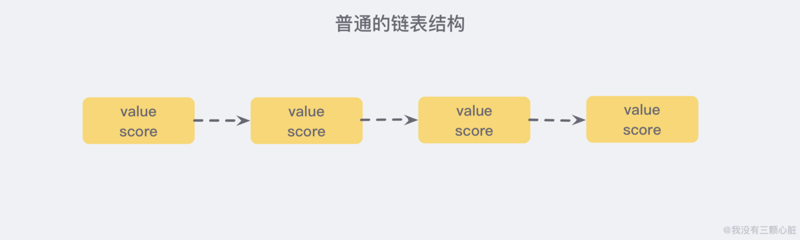

如果需要这个链表按照 score 值进行排序，这就意味着当需要添加新的元素时，需要**定位到插入点**，这样才可以继续保证链表是有序的，而这只能逐一遍历进行，而**不能用高效的二分法**。

如果每相邻两个节点之间就增加一个指针，让指针指向下一个节点，如下图：

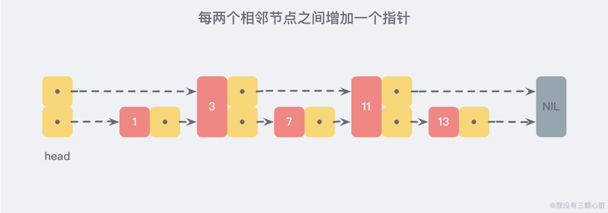

这样所有新增的指针连成了一个**新的链表**，但它包含的数据却只有原来的**一半** （图中的为 3，11）。

现在查找数据时可以根据这条新的链表查找，如果碰到比待查找数据大的节点时，再回到原来的链表中进行查找，比如查找 7，查找的路径则是沿着下图中标注出的红色指针所指向的方向进行的：

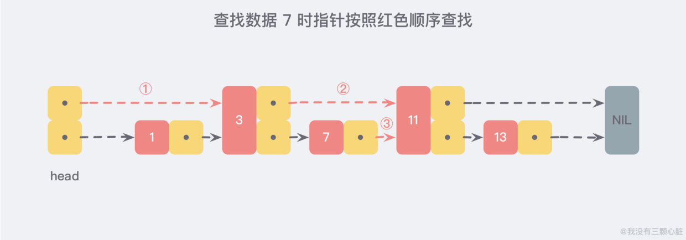

通过新增加的指针查找，不再需要与链表上的每一个节点逐一进行比较，这样改进之后需要比较的节点数大概只有原来的一半。利用同样的方式可以在新产生的链表上，继续为每两个相邻的节点增加一个指针，从而产生**第三层链表**：

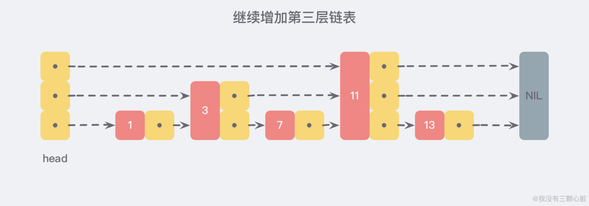

在这个新的三层链表结构中**查找 13**，那么沿着最上层链表首先比较的是 11，发现 11 比 13 小，于是就知道只需要到 11 后面继续查找，**从而一下跳过了 11 前面的所有节点。**

当**链表足够长**，这样的多层链表结构可以**跳过很多下层节点**，从而加快查找的效率。

##### 2. 存在的问题及结点插入优化

**跳跃表 skiplist** 就是受到这种多层链表结构的启发而设计出来的。按照上面生成链表的方式，上面每一层链表的节点个数，是下面一层的节点个数的**一半**，这样查找过程就非常类似于一个**二分查找**，使得查找的时间复杂度可以降低到 **O(logn)**。

但是这种方法在**插入数据**的时候有很大的问题。新插入一个节点之后，就会**打乱上下相邻两层链表**上节点个数严格的 2:1 的对应关系。如果要**维持这种对应关系**，就必须把新插入的节点后面的**所有节点 （也包括新插入的节点） 重新进行调整**，这会让时间复杂度重新蜕化成 O(n)。**删除数据**也有同样的问题。

**skiplist** 为了避免这一问题，它**不要求**上下相邻两层链表之间的节点**个数有严格的对应关系**，而是 **为每个节点随机出一个层数(level)**。比如一个节点随机出的层数是 3，那么就把它链入到第 1 层到第 3 层这三层链表中。为了表达清楚，下图展示了如何通过一步步的插入操作从而形成一个 skiplist 的过程：

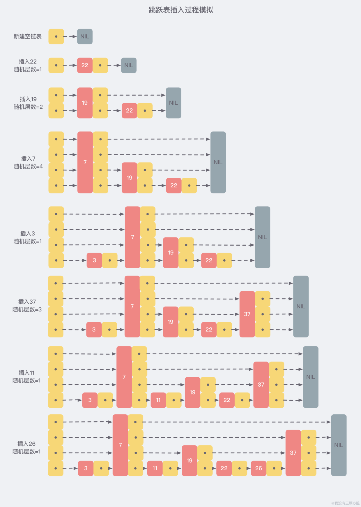

从上面的创建和插入的过程中可以看出，**每一个节点的层数（level）是随机出来的**，而且新插入一个节点并不会影响到其他节点的层数，因此**插入操作只需要修改节点前后的指针，而不需要对多个节点都进行调整**，这就降低了插入操作的复杂度。

现在假设从刚才创建的这个结构中查找 23 这个不存在的数，那么查找路径会如下图：

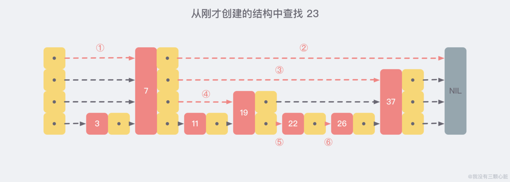

##### 3. 应用场景

**Redis** 中的 **Zset 数据结构**的底层实现。ZSet 结构同时包含一个**字典**和一个**跳跃表**，跳跃表按 score 从小到大保存所有集合元素。字典保存着从 member 到 score 的映射。这两种结构通过**指针共享相同元素**的 member 和 score，不会浪费额外内存。


#### 并查集UnionFind

##### 1. 概述

并查集，在一些有 **N 个元素**的**集合应用问题**中，通常是在开始时让**每个元素**构成一个**单元素的集合**，然后按一定**顺序将属于同一组**的元素所在的**集合合并**，其间要**反复查找一个元素在哪个集合**中。

用于解决**动态连通性问题**，能动态连接两个点，并且**判断两个点是否连通**。

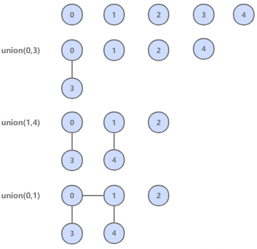

|                方法                 |             描述              |
| :---------------------------------: | :---------------------------: |
|            **UF**(int N)            | **构造**一个大小为 N 的并查集 |
|    void **union**(int p, int q)     |     **连接 p 和 q 节点**      |
|         int **find**(int p)         | **查找 p 所在的连通分量编号** |
| boolean **connected**(int p, int q) | 判断 p 和 q 节点**是否连通**  |

##### 2. 抽象类

```java
public abstract class UF {

    protected int[] id;

    public UF(int N) {
        id = new int[N];
        for (int i = 0; i < N; i++) {
            id[i] = i;
        }
    }
	// 直接判断两个点是否在一个集合中
    public boolean connected(int p, int q) {
        return find(p) == find(q);
    }

    public abstract int find(int p);

    public abstract void union(int p, int q);
}
```

有不同的**==实现方式==**，性能也有所不同。

##### 3. Quick Find

可以快速进行 **find** 操作，也就是可以**快速判断两个节点是否连通**。

需要保证**同一连通分量的所有节点**的 **id 值**相等。

但是 **union 操作代价却很高**，需要将其中一个连通分量中的所有节点 id 值都**修改**为另一个节点的 id 值。

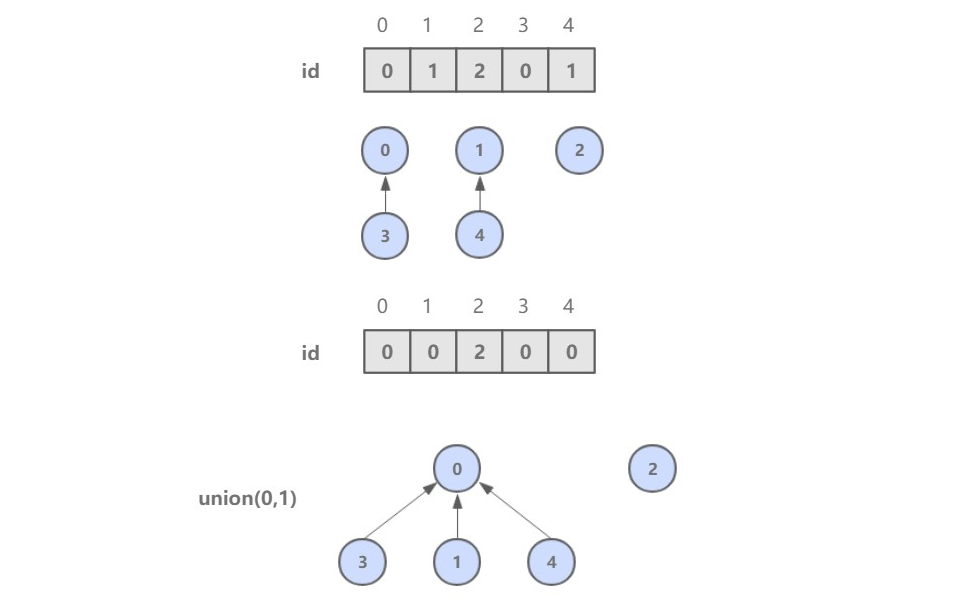

```java
public class QuickFindUF extends UF {

    public QuickFindUF(int N) {
        super(N);
    }

    @Override
    public int find(int p) {
        return id[p];
    }

    @Override
    public void union(int p, int q) {
        int pID = find(p);
        int qID = find(q);
        if (pID == qID) {
            return;
        }
        for (int i = 0; i < id.length; i++) {
            if (id[i] == pID) {
                id[i] = qID;
            }
        }
    }
}
```

##### 4. Quick Union

可以快速进行 union 操作，只需要**修改一个节点的 id 值**即可。

但是 **find 操作开销很大**，因为同一个连通分量的节点 id 值不同，id 值只是用来指向另一个节点。因此需要一直向上查找操作，直到找到最上层的节点。

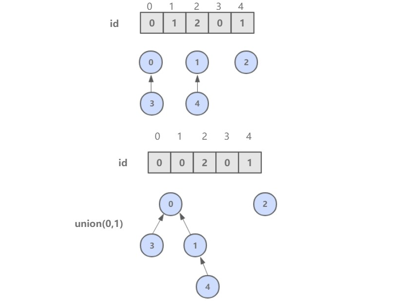

```java
public class QuickUnionUF extends UF {

    public QuickUnionUF(int N) {
        super(N);
    }

    @Override
    public int find(int p) {
        while (p != id[p]) {
            p = id[p];
        }
        return p;
    }

    @Override
    public void union(int p, int q) {
        int pRoot = find(p);
        int qRoot = find(q);

        if (pRoot != qRoot) {
            id[pRoot] = qRoot;
        }
    }
}
```

这种方法可以**快速进行 union 操作**，但是 **find 操作和树高**成正比，最坏的情况下树的高度为节点的数目。

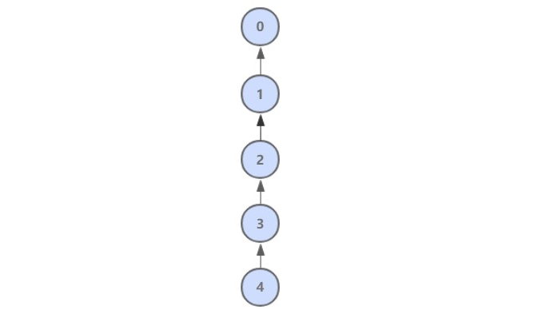

##### 5. 加权Quick Union

为了解决 quick-union 的**树通常会很高**的问题，加权 quick-union 在 union 操作时会让**较小的树连接较大的树上面**。理论研究证明，加权 quick-union 算法构造的树深度最多**不超过 logN**。


```java
public class WeightedQuickUnionUF extends UF {

    // 保存节点的数量信息
    private int[] sz;

    public WeightedQuickUnionUF(int N) {
        super(N);
        this.sz = new int[N];
        for (int i = 0; i < N; i++) {
            this.sz[i] = 1;
        }
    }

    @Override
    public int find(int p) {
        while (p != id[p]) {
            p = id[p];
        }
        return p;
    }

    @Override
    public void union(int p, int q) {

        int i = find(p);
        int j = find(q);

        if (i == j) return;

        if (sz[i] < sz[j]) {
            id[i] = j;
            sz[j] += sz[i];
        } else {
            id[j] = i;
            sz[i] += sz[j];
        }
    }
}
```

##### 6. 路径压缩的加权 Quick Union

在检查节点的同时将**它们直接链接到根节点**，只需要在 find 中添加一个**循环**即可。

##### 7. 比较

|              算法              |   union    |    find    |
| :----------------------------: | :--------: | :--------: |
|         **Quick Find**         |     N      |     1      |
|        **Quick Union**         |    树高    |    树高    |
|      **加权 Quick Union**      |    logN    |    logN    |
| **路径压缩的加权 Quick Union** | 非常接近 1 | 非常接近 1 |


