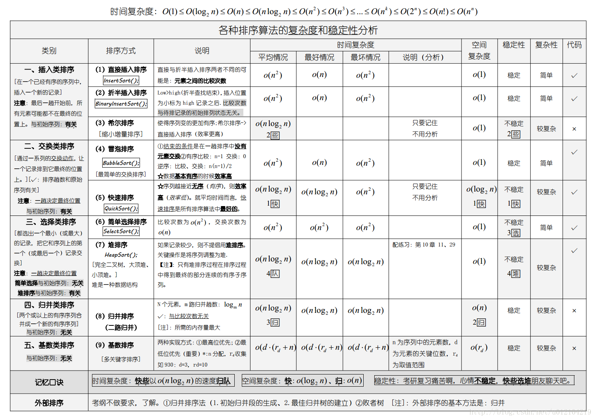
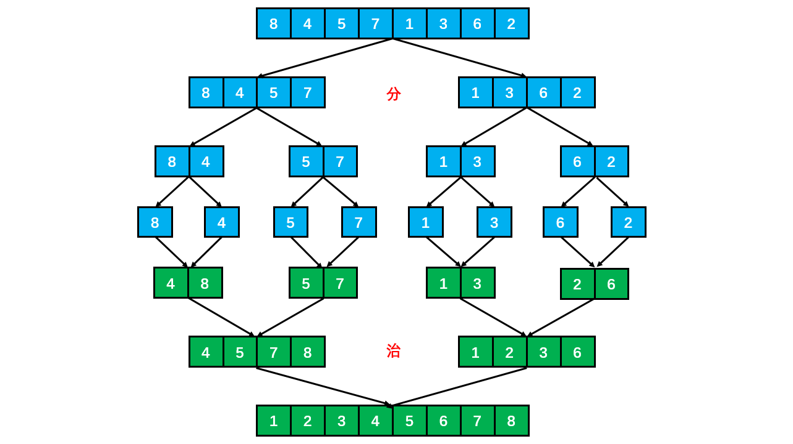
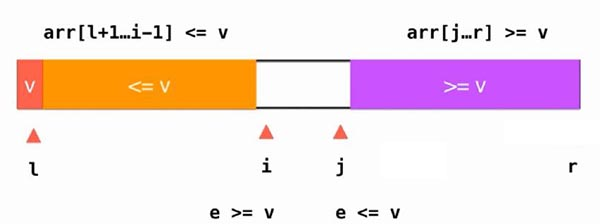
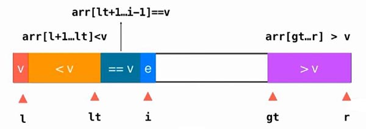
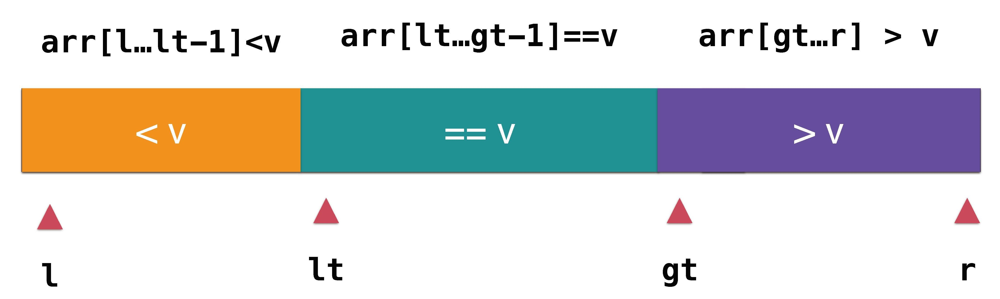

[TOC]

### 排序

#### 基础

##### 1. 概述

**待排序**的元素需要实现 Java 的 **Comparable 接口**，该接口有 **compareTo()** 方法，可以用它来判断两个元素的大小关系。约定都是**基于比较**的排序。

排序算法的成本模型是==**比较和交换的次数**==。

##### 2. 相关术语

- **稳定**：如果 a 原本在 b 前面，**而 a = b**，排序之后 **a 仍然在 b 的前面**；如果排序算法不改变**相等对象**的相对次序，则成为**稳定的**。
- **不稳定**：如果 a 原本在 b 的前面，而 a = b，排序之后 a 可能会出现在 b 的后面，则这是不稳定的。
- **内排序**：所有排序操作都在**内存**中完成。
- **外排序**：由于数据太大，因此把数据放在磁盘中，而排序通过磁盘和内存的数据传输才能进行。
- 时间复杂度：一个算法执行所耗费的时间。
- 空间复杂度：运行完一个程序所需内存的大小。
- **原地排序**：不占用额外内存。
- 非原地排序：占用额外内存。

##### 3. 相关定理

- N 个互异数的数组的平均逆序数是 **N(N - 1) / 4**。
- 通过**交换相邻元素**进行排序的任何算法平均都需要 **Ω(N^2^)** 时间。
- 只使用**元素间比较**的任何排序算法均需要 **Ω(N log N)** 次比较。
- 对任何基于**比较**的算法，找**最小元**都必须至少用 **N - 1 次**比较。 
- 平均来说，基于**切分**的选择算法的运行时间是**线性**级别的。
- **快速排序是最快的通用排序算法**。---《算法第 4 版》

##### 4. 排序算法总结

**排序算法的比较**

|         算法         | 稳定性 |          时间复杂度          | 空间复杂度 |           备注           |
| :------------------: | :----: | :--------------------------: | :--------: | :----------------------: |
|     **选择排序**     |   ×    |        N<sup>2</sup>         |     1      |                          |
|     **冒泡排序**     |   √    |        N<sup>2</sup>         |     1      |                          |
|     **插入排序**     |   √    |      N \~ N<sup>2</sup>      |     1      | 时间复杂度和初始顺序有关 |
|     **希尔排序**     | **×**  | N 的若干倍乘于递增序列的长度 |     1      |      改进版插入排序      |
|     **快速排序**     | **×**  |            NlogN             |    logN    |                          |
| **三向切分快速排序** |   ×    |          N \~ NlogN          |    logN    |   适用于有大量重复主键   |
|     **归并排序**     |   √    |            NlogN             |     N      |                          |
|      **堆排序**      | **×**  |            NlogN             |     1      |    无法利用局部性原理    |
|     **基数排序**     |   √    |             N*k              |            |        空间换时间        |

**原地排序**：选择排序、插入排序、希尔排序、快速排序、三向快速排序、堆排序。

**非原地排序**：归并排序。

 

快速排序是最快的通用排序算法，它的内循环的指令很少，而且它还能利用缓存，因为它总是顺序地访问数据。它的运行时间近似为 \~cNlogN，这里的 c 比其它线性对数级别的排序算法都要小。

使用三向切分快速排序，实际应用中可能出现的某些分布的输入能够达到线性级别，而其它排序算法仍然需要线性对数时间。

##### 5.**Go的排序算法实现**

sort包提供了排序切片和用户自定义数据集以及相关功能的函数。

sort包主要针对[]int、[]float64、[]string、以及其他自定义切片的排序。

**接口**

```go
func Interface interface
```

**结构体**

```go
type IntSlice struct
type Float64Slice
type StringSlice
```

**函数**

```go
func Ints(a []int)
func IntsAreSorted(a []int) bool
func SearchInts(a []int, x int) int
func Float64s(a []float64)
func Float64sAreSorted(a []float64) bool
func SearchFloat64s(a []float64, x float64) int
func SearchFloat64s(a []flaot64, x float64) bool
func Strings(a []string)
func StringsAreSorted(a []string) bool
func SearchStrings(a []string, x string) int
func Sort(data Interface)
func Stable(data Interface)
func Reverse(data Interface) Interface
func ISSorted(data Interface) bool
func Search(n int, f func(int) bool) int
```

**接口  type Interface**

```go
type Interface interface {
    Len() int           // Len方法返回集合中的元素个数
    Less(i, j int) bool // i>j，该方法返回索引i的元素是否比索引j的元素小、
    Swap(i, j int)      // 交换i, j的值
}
```

```go
package main

import (
    "fmt"
    "sort"
)

type NewInts []uint

func (n NewInts) Len() int {
    return len(n)
}

func (n NewInts) Less(i, j int) bool {
    fmt.Println(i, j, n[i] < n[j], n)
    return n[i] < n[j]
}

func (n NewInts) Swap(i, j int) {
    n[i], n[j] = n[j], n[i]
}

func main() {
    n := []uint{1,3,2}
    sort.Sort(NewInts(n))
    fmt.Println(n)
}

/*
输出：
1 0 false [1 3 2]
2 1 true [1 3 2]
1 0 false [1 2 3]
[1 2 3]
 */
```


#### 选择排序

从**未排序**的数组中**选择最小元素**，将它与数组的**第一个元素交换位置**。再从数组剩下的元素中选择出最小的元素，将它与数组的第二个元素交换位置。不断进行这样的操作，直到将整个数组排序。

选择排序需要 \~**N<sup>2</sup>/2 次比较和 \~N 次**交换，它的运行时间与输入无关，这个特点使得**它对一个已经排序的数组也需要这么多的比较和交换操作。**


```go
func selectionSort(arr []int) []int {
        length := len(arr)
        for i := 0; i < length-1; i++ {
                min := i
                for j := i + 1; j < length; j++ {
                        if arr[min] > arr[j] {
                                min = j
                        }
                }
                arr[i], arr[min] = arr[min], arr[i]
        }
        return arr
}
```

需要 O(n^2^) 次比较和 O(n) 次交换。**平均**时间复杂度是 O(n^2^)。最优时，**最坏时和平均时都是O(n^2^)**。

表现**最稳定**的排序算法之一，因为无论什么数据进去都是 O(n2) 的时间复杂度，所以用到它的时候，数据**规模越小越好**。唯一的好处可能就是不占用额外的内存空间了吧。理论上讲，选择排序可能也是平时排序一般人想到的最多的排序方法了吧。


#### 冒泡排序

从左到右**不断交换相邻逆序**的元素，在一轮的循环之后，可以让未排序的最大元素**上浮到右侧**。在一轮循环中，如果没有发生交换，那么说明数组已经是**有序**的，此时可以直接退出。


通过从左到右不断交换相邻逆序的相邻元素，在一轮的交换之后，可以让**未排序的元素上浮到右侧**。


```go
func bubbleSort(arr []int) []int {
        length := len(arr)
        for i := 0; i < length; i++ {
                for j := 0; j < length-1-i; j++ {
                        if arr[j] > arr[j+1] {
                                arr[j], arr[j+1] = arr[j+1], arr[j]
                        }
                }
        }
        return arr
}
```

平均复杂度为 O(N^2)，如果是**有序数组**，那么最好时间复杂度为 O(N)，最坏就是顺序是反着的，此时复杂度为 O(N^2)。 

 

#### 插入排序

每次都将当前元素插入到**左侧已经排序**的数组中，使得**插入之后**左侧数组**依然有序**。

对于数组 {3, 5, 2, 4, 1}，它具有以下**逆序**：(3, 2), (3, 1), (5, 2), (5, 4), (5, 1), (2, 1), (4, 1)，插入排序每次**只能交换相邻元素**，令**逆序数量减少 1**，因此插入排序需要**==交换的次数为逆序数量==**。

插入排序的时间复杂度取决于数组的**初始顺序**，如果数组已经部分**有序**了，那么逆序较少，需要的交换次数也就较少，时间复杂度较低。

- **平均**情况下插入排序需要 \~N<sup>2</sup>/4 比较以及 \~N<sup>2</sup>/4 次交换；
- **最坏**情况下需要 \~N<sup>2</sup>/2 比较以及 \~N<sup>2</sup>/2 次交换，最坏的情况是数组是**倒序**的；
- **最好**情况下需要 N-1 次比较和 0 次交换，最好的情况就是数组已经**有序**了。

插入排序的效率**最优**时是 **O(n)**，**最坏时是 O(n^2^)**，数组越接近有序，需要做的工作越少。


第 j 元素是通过不断**向左比较并交换**来实现插入过程：当第 j 元素小于第 j - 1 元素，就将它们的位置**交换**，然后令 j 指针向左移动一个位置，不断进行以上操作。


上述是插入排序流程。分成了**有序和无序两部分**，在比较时，需要将有序部分数组**右移**，为插入**腾出空间**。当 10 插入到 6 和 11 之间 时，需要将 6 往右移动才有空间给 10。

```go
func insertionSort(arr []int) []int {
        for i := range arr {
                preIndex := i - 1
                current := arr[i]
                for preIndex >= 0 && arr[preIndex] > current {
                        arr[preIndex+1] = arr[preIndex]
                        preIndex -= 1
                }
                arr[preIndex+1] = current
        }
        return arr
}
```


#### 希尔排序

##### 1. 概述

对于简单插入排序的问题：数组 arr = {2, 3, 4, 5, 6, 1} 这时需要插入的**数 1**(最小), 这样的过程是：

```java
{2,3,4,5,6,6}
{2,3,4,5,5,6}
{2,3,4,4,5,6}
{2,3,3,4,5,6}
{2,2,3,4,5,6}
{1,2,3,4,5,6}
```

当需要插入的数是较小的数时，**后移的次数明显增多**，对效率有影响，插入排序有**多少个逆序对**，就需要交换多少次。

**希尔排序**也是一种**直接插入**排序，只是是对直接插入排序算法的**优化。**

对于**大规模**的数组，插入排序很慢，因为它只能交换**相邻**的元素，每次**只能将逆序数量减少 1**。希尔排序的出现就是为了解决插入排序的这种局限性，它通过**==交换不相邻的元素==，每次可以将逆序数量减少大于 1**。希尔排序也是一种**插入排序**，它是简单插入排序经过改进之后的一个更高效的版本，也称为==**缩小增量排序**==。

**希尔排序使用==插入排序==对==间隔 h 的序列进行排序==。通过不断==减小 h，最后令 h = 1==，就可以使得整个数组是有序的**。

##### 2. 增量序列

来看下希尔排序的基本步骤，**选择增量 gap = length / 2，缩小增量继续以 gap = gap / 2 的方式**，这种增量选择可以用一个**序列**来表示：

```java
n/2, (n/2)/2, ..., 1
```

这称为**增量序列**。

希尔排序的**增量序列**的选择与证明是个数学难题，上述的增量序列也是希尔建议的增量，称为**希尔增量**，但其实这个增量序列**不是最优**的。可以证明采用希尔增量时**最坏情况**下运行时间是 **O(n^2^)**。

采用其他的增量序列还可能降低最坏运行时间。Hibbard 提出一个**不同的增量序列**，形如：

```java
1, 3, 7, ..., 2^k-1 
```

可以证明采用 Hibbard 增量时**最坏情况**下运行时间是 **O(n^1.5^)**。

##### 3. 过程图解

初始增量步长 **gap = length / 2**，意味着整个数组被分为 **5 组**，如下图颜色分别对应。然后在**各自组内进行插入排序**。第二次 gap = 5 / 2 = 2，所以数组被分为 **2 组**，如颜色对应所示，再对两组分别进行**直接插入排序**，使得整体更加有序，最后再缩小增量 gap = 2 / 2 = 1，此时**再次进行插入排序**就**很快**了。


在希尔排序的理解时，我们倾向于对于**每一个分组**，逐组进行处理，但在代码实现中可以不用这么按部就班地处理完一组再调转回来处理下一组（这样还得加个 for 循环去处理分组）比如 [5, 4, 3, 2, 1, 0] ，首次增量设 gap = length / 2 = 3,则为 3 组 [5, 2] [4, 1] [3, 0]，实现时**不用**循环按组处理，可以从第 gap 个元素开始，逐个**跨组处理**。同时在插入数据时，可以采用元素交换法寻找最终位置，也可以采用数组元素移动法寻觅。

##### 4. 代码实现

希尔排序时， 对**有序序列**在插入时**采用移位法**，并测试排序速度，发现快了许多。合理可用。

```go
func shellSort(arr []int) []int {
	length := len(arr)
	gap := 1
	for gap < length/3 {//寻找合适的间隔gap
		gap = gap*3 + 1
	}
	for gap >= 1 {
		//将数组变为间隔h个元素有序
		for i := gap; i < length; i++ {
			//原方案交换排序
			//for j := i; j >= gap && arr[j] < arr[j - gap]; j -= gap{
			//   arr[j], arr[j - gap] = arr[j - gap], arr[j]
			//}
			temp := arr[i]
			j := i - gap
			for j >= 0 && arr[j] > temp {
				arr[j+gap] = arr[j]
				j -= gap
			}
			arr[j+gap] = temp
		}
		gap = gap / 3
	}
	return arr
}
```

希尔排序的运行时间**达不到**平方级别，使用递增序列 1, 4, 13, 40, ...  的希尔排序所需要的比较次数不会超过 N 的若干倍乘于递增序列的长度。

**希尔排序的效率**

调整间隔能改善其效率，一般是**避免间隔 gap 是偶数值**。因为当 gap 是偶数时的比较会在增量是 gap / 2 的下一题排序中**重复**。在此种情况下，当 gap 为偶数时，只需将其加 1 。即可将最坏情形改进为 **O(n^1.5^)**。

一般**增量序列**时，最佳复杂度 O(**nlogn**)，平均情况 **O(nlogn)**。

##### 5. 优化

> 如何优化希尔排序？

- 优化**增量序列**。采用其他的增量序列还可能降低最坏运行时间。
- 因为是基于**插入排序**的，所以可以使用其插入排序及其优化中给出的优化方案。即：进行了预处理操作，并在内循环中，总是将**较大的元素向右移动**。原方案是交换。


#### 归并排序

##### 1. 概述

**归并排序**的思想是将数组分成**两部分**，分别进行排序，然后归并起来。基本操作就是**合并两个已排序的数组**，由于两个数组是已经排序的，所以若将**输出放到==第三个==数组**中，则该算法可以通过对输入数据**一趟排序**完成。

归并排序是一种**分治**策略。



将两个**数组合并**起来的步骤如下图所示，即维护**两个指针**分别指向两个有序的数组，然后分别比较两者的值，**值小的拷贝到辅助数组**里面，并将此索引进行移动，直到某一边全部移动完毕，然后把**剩余的没有复制完成的全部拷贝**到辅助数组（如下图中 1 2 3 6 全部拷贝到辅助数组中后，左边还剩下 7、8），最后把辅助数组**拷贝到原数组**即可。


维护**两个指针**分别比较，然后将较小的项复制到**第三个数组**中， 因此需要额外的**辅助数组**，会消耗额外**内存**空间。

一般使用递归归并排序，逐层排序。真正的排序发生在**合并步骤**而不是递归调用的步骤。8 个数据会 merge 7 次，80000 个数据会 merge 8000 - 1 = 79999 次。


##### 2. 代码实现

以下是归并排序的算法，类似于**树的后序遍历**，即**先处理左右**再进行数据 **merge**。

```go
func mergeSort(arr []int) []int {
        length := len(arr)
        if length < 2 {
                return arr
        }
        middle := length / 2
        left := arr[0:middle]
        right := arr[middle:]
        return merge(mergeSort(left), mergeSort(right))
}

func merge(left []int, right []int) []int {
        var result []int
        for len(left) != 0 && len(right) != 0 {
                if left[0] <= right[0] {
                        result = append(result, left[0])
                        left = left[1:]
                } else {
                        result = append(result, right[0])
                        right = right[1:]
                }
        }

        for len(left) != 0 {
                result = append(result, left[0])
                left = left[1:]
        }

        for len(right) != 0 {
                result = append(result, right[0])
                right = right[1:]
        }

        return result
}
```

##### 3. **归并排序效率**

归并排序在**所有情形下**都是 **==O(NlogN)==** 的，其缺点是需要**临时辅助数组**进行**合并**。归并排序是**稳定**的。merge 过程是不管是否有序的。归并排序的运行时间严重依赖于比较元素和在数组中移动位置的相对开销，这些开销是与**编程语言**相关的。归并排序是一种渐进最优的基于比较排序的算法。

> 如何优化归并排序？

对于**小规模**的子数组可以采用**插入排序**。


#### **快速排序**

##### 1. 概述

快排是对冒泡排序的改进，也是一种**分治**的递归算法。快速排序是一种**原地排序**算法。归并排序将数组分为**两个子数组**分别排序，并将有序的子数组归并使得整个数组排序。而快速排序通过一个==**切分枢轴元**（pivot）==将数组分为两个子数组，==左子数组**小于等于**切分元素==，右子数组大于等于切分元素，将这两个子数组排序也就将整个数组排序了。它的平均运行时间是 ==***O(N log N)***==。最坏情形是***O(N^2^)***。

pivot 十分重要，直接影响排序的**时间**。可以选取**左端、右端以及中间三个元素**，并取其**中值**作为枢轴元。称为**三数中值分割法**。一种较为安全的做法是**随机选取**枢轴元，可以用下面的方式随机选：

```java
pivot = left + (int) (Math.random() * (right - left + 1))
```

##### 2. 算法实现

过程如下图所示。


代码实现有几种版本，下面的版本中 pivot 值在最**前面**（**面试用这个即可**）：

```go
func quickSort(arr []int) []int {
	return _quicksort(arr, 0, len(arr) - 1)
}

func _quicksort(arr []int, left, right int) []int {
	if left < right{
		partitionIndex := partition(arr, left, right) //此时index左右分别是小于大于arr[index]的
		_quicksort(arr, left, partitionIndex - 1)
		_quicksort(arr, partitionIndex + 1, right)
	}
	return arr
}

//返回定好的index
func partition(arr []int, left, right int) int {
	pivot := left
	index := pivot + 1 //表示当前确定位置的下标

	for i := index; i <= right; i++{
		if arr[i] < arr[pivot]{
			arr[i], arr[index] = arr[index], arr[i]
			index += 1
		}
	}
	arr[pivot] , arr[index - 1] = arr[index - 1], arr[pivot]

	return index - 1
}

func findN(arr []int, left, right, N int) int {

		index := partition(arr, left, right)
		if N - 1 == index{
			return arr[index]
		}else if N - 1 > index{
			return findN(arr, index + 1, right, N)
		}else{
			return findN(arr, left, index - 1, N)
		}

		return -1
}
```

双路快排



```
i，j均指向当前要判定的元素e
左边的情况：
1）若arr[i]<v，直接i++
2）若arr[i]>=v，去判定右边的情况，若arr[j]>v，直接j--
3）直到arr[i]>=v且arr[j]<=v时，交换arr[i],arr[j]的值，之后i++，j--，直到i>j结束判定

这样即使arr[i]=arr[j]，也会进行一次交换，因此相同的值会较平均的分配在左右两边，
减轻分区时的不平衡性，最后左区间是<=v，右区间是>=v
```

```go
func Partition3(arr []int, l, r int) int {
	v := arr[l]

	//  arr[l+1...j] <= v ; arr[j+1...i] >= v
	leftI := l + 1
	rightI := r
	for {
		switch {
		case leftI > rightI:
			// 能通过这步,说明索引不合法,不合法则说明遍历结束
			arr[l], arr[rightI] = arr[rightI], v
			return rightI
		// 判定左边
		case arr[leftI] < v:
			leftI++
			// 判定右边
		case arr[rightI] > v:
			rightI--
		default:
			// 以上3点都不成立,说明arr[leftI]>=v,arr[rightI]<=v,两者需要交换
			arr[leftI], arr[rightI] = arr[rightI], arr[leftI]
			leftI++
			rightI--
		}
	}
}
```

三路快排

```
3路快排的思路是将区间分为3部分，左边小于v，中间等于v，右边大于v，之后中间不再判定，
再分别对左边，右边进行分区，直至排序结束，如下图示：
分3种情况，e为待判定元素：
1）e==v，i++
2）e<v，交换arr[lt+1]，arr[i]位置，之后lt++，i++
3）e>v，交换arr[i]，arr[gt+1]位置，之后gt--
4）最后交换arr[l]，arr[lt]位置
```



```go
func sortThreeWays(arr []int, l, r int) (lt, gt int) {
	v := arr[l]

	lt = l     // arr[l+1...lt] < v
	gt = r + 1 // arr[gt...r] > v
	i := l + 1 // arr[lt+1...i) == v 半开半闭
	for {
		switch {
		case i >= gt:
			// 这步未执行前,lt都是指向最后一个小于v的值,
			// 执行交换后,lt指向从左到右第一个等于v的值
			arr[l], arr[lt] = arr[lt], v
			return lt, gt
		case arr[i] == v:
			i++
		case arr[i] < v:
			lt++
			arr[i], arr[lt] = arr[lt], arr[i]
			i++
		default:
			gt--
			arr[i], arr[gt] = arr[gt], arr[i]
		}
	}
}
```

##### 3. 性能分析

快速排序是**原地排序**，**不需要辅助数组，但是==递归调用==需要辅助栈**。快速排序**最好情况**下是每次都正好将数组**对半分**，这样递归调用**次数才是最少**的。这种情况下比较次数为 C<sub>N</sub>=2C<sub>N/2</sub>+N，复杂度为 **O(NlogN)**。可以证明**平均情况**也是 **O(NlogN)**。

**最坏情况**下，第一次从最小的元素切分，第二次从第二小的元素切分，如此这般。因此**最坏**的情况下需要比较 N<sup>2</sup>/2，此时复杂度是 **O(N^2^)**。为了防止数组最开始就是有序的，在**进行快速排序时需要随机打乱数组**。

综上：平均 **O(NlogN)**，最好 **O(NlogN)**，最坏 **O(N^2^)**。

##### 4. 快速排序算法改进

**1. 切换到插入排序**

因为快速排序在小数组中也会递归调用自己，对于**小数组（小于 20 项），插入排序比快速排序的性能更好**，因此在**小数组**中可以切换到插入排序。

**2. 三数取中**

最好的情况下是每次都能取数组的**中位数**作为切分元素，但是计算中位数的代价很高。一种折中方法是取第一项、中间项和最后一项 3 个元素，并将大小居中的元素作为切分元素。

**3. 三向切分**

对于有**大量重复元素**的数组，可以将数组切分为**三部分**，分别对应**小于、等于和大于切分元素**。**三向切分快速排序**对于有**大量重复元素**的随机数组可以在线性时间内完成排序。



以下是左神算法班版本，pivot 值在最后面。实现过程图解参考：https://blog.csdn.net/u010452388/article/details/81218540

##### 5. 快排应用

###### (1) 基于切分的快速选择算法

**求一个数组的第 k 大元素，可以使用堆排序，也可以使用基于快排思想的快速选择算法**。

快速排序的 partitionSort() 方法，会返回一个整数 j 使得 a[l .. j - 1] **小于等于 a[j]**，且 a[j + 1 .. h] **大于等于 a[j]**，此时 a[j] 就是数组的**第 j 大元素**。可以利用这个特性**找出数组**的**第 k 个元素**。

该算法是**线性级别**的，假设每次能将数组二分，那么比较的总次数为 (N+N/2+N/4+..)，直到找到第 k 个元素，这个和显然小于 2N。


#### 堆排序

##### 1. 概述

堆排序是利用**堆**这种数据结构而设计的一种排序算法，堆排序是一种**选择排序，**它的**最坏，最好，平均时间复杂度均为**O(NlogN)**，它也是**不稳定排序。堆排序能同时最优的利用时间和空间。

堆是具有以下性质的**==完全二叉树==**：每个结点的值都大于或等于其左右孩子结点的值，称为**大顶堆**。**注意** : 没有要求结点的左孩子的值和右孩子的值的大小关系。每个结点的值都小于或等于其左右孩子结点的值，称为**小顶堆**。一般**升序**采用**大顶堆**，**降序**采用**小顶堆**。

##### 2. 算法实现

**堆排序基本思想**：将待排序序列构造成一个**大顶堆**。此时整个序列的**最大值**就是堆顶的**根节点**。将堆顶元素与**末尾元素进行交换**，此时**末尾**就为**最大值**。然后将剩余 n - 1 个元素**重新构造成一个堆**，这样会得到 n - 1 个元素的**最大值**，再将当前堆顶的最大值与**第 n - 1 个元素的末尾值**进行交换。**如此反复执行**，便能得到一个有序序列。把**最大元素**和当前堆中数组的**最后一个元素**交换位置，并且**不删除它**，那么就可以得到一个**从尾到头的递减**序列，从正向来看就是一个递增序列，这就是**堆排序**。

###### (1) 构建堆

**无序数组**建立堆最直接的方法是从**左到右遍历数组**进行**上浮**操作。**==一个更高效的方法是从右至左进行下沉操作==**，如果一个节点的两个节点都**已经是堆有序**，那么进行下沉操作可以使得这个节点为根节点的堆有序。叶子节点不需要进行下沉操作，可以忽略叶子节点的元素，因此只需要**遍历一半**的元素即可。构建完后的堆**不是完全有序**的，此时需要再进行进一步的排序。

<div align="center">  </div><br>

###### (2) 交换堆顶元素与最后一个元素

将构造好的堆的堆顶与最后一个元素进行交换。**交换之后**需要进行**下沉**操作维持堆的**有序状态**。

<div align="center">  </div><br>

整体代码如下所示：

```go
func heapSort(arr []int) []int {
        arrLen := len(arr)
        buildMaxHeap(arr, arrLen)
        for i := arrLen - 1; i >= 0; i-- {
                swap(arr, 0, i)
                arrLen -= 1
                heapify(arr, 0, arrLen)
        }
        return arr
}

func buildMaxHeap(arr []int, arrLen int) {
        for i := arrLen / 2; i >= 0; i-- {
                heapify(arr, i, arrLen)
        }
}

func heapify(arr []int, i, arrLen int) {
        left := 2*i + 1
        right := 2*i + 2
        largest := i
        if left < arrLen && arr[left] > arr[largest] {
                largest = left
        }
        if right < arrLen && arr[right] > arr[largest] {
                largest = right
        }
        if largest != i {
                swap(arr, i, largest)
                heapify(arr, largest, arrLen)
        }
}

func swap(arr []int, i, j int) {
        arr[i], arr[j] = arr[j], arr[i]
}
```

##### 3. 效率分析

一个堆的高度为 **logN**，因此在堆中插入元素和删除最大元素的**复杂度都为 logN**。对于**堆排序**，由于要对 **N 个节点**进行**下沉操作**，因此复杂度为 **NlogN**。堆排序是一种**原地排序**，没有利用额外的空间。

现代操作系统**很少**使用堆排序，因为它无法利用局部性原理进行缓存，也就是数组元素很少和相邻的元素进行比较和交换。


#### 非比较排序

计数排序，基数排序，桶排序等属于**非比较排序**算法，平均时间复杂度都是 **O(n)**。这些排序因为其待排序**元素本身**就含有了**定位特征**，因而不需要比较就可以确定其前后位置，从而可以突破比较排序算法时间复杂度 O(nlgn) 的理论下限。

这三种排序算法都利用了**桶的概念**，但对桶的使用方法上有明显差异：

- **计数排序**：每个桶只存储**单一键值**。
- **桶排序**：每个桶存储**一定范围**的数值。
- **基数排序**：根据键值的**每位数字**来分配桶。

##### 1. 计数排序

计数排序需要**占用大量空间**，它仅适用于**数据比较集中**的情况。比如 [0 \~ 100]，[10000 ~ 19999] 这样的数据。

假设有[1, 2, 3, 1, 0, 4] 这六个数，这里面最大的值为 4，那么创建一个**长度为 4 的数组**，每个元素默认为 **0**，每个位置相当于一个**计数器君**。然后遍历数组，在数字对应的位置处的**计数器 + 1** 即可。然后将计数用的数组中数的个数按序取出即可。

**实现：**

```go
func countingSort(arr []int, maxValue int) []int {
        bucketLen := maxValue + 1
        bucket := make([]int, bucketLen) // 初始为0的数组

        sortedIndex := 0
        length := len(arr)

        for i := 0; i < length; i++ {
                bucket[arr[i]] += 1
        }

        for j := 0; j < bucketLen; j++ {
                for bucket[j] > 0 {
                        arr[sortedIndex] = j
                        sortedIndex += 1
                        bucket[j] -= 1
                }
        }

        return arr
}
```


##### 2. 桶排序

桶排序与计数排序很相似，不过现在的**桶不单计数**，是实实在在地**放入元素**。举个例子，学校要对所有老师按年龄进行排序，这么多老师很难操作，那么先让他们**按年龄段进行分组**，20－30 岁的一组，30－40 岁一组，50－60 岁一组，然后**组内再排序**。这样效率就大大提高了。桶排序也是于这种思想。

操作步骤：

1. **确认范围**，亦即求取原数组的最大值与最小值。
2. 确认需要**多少个桶**（这个通常作为参数传入，不能大于原数组长度），然后最大值减最小值，除以桶的数量，但得每个桶最多能放多个元素，我们称这个数为桶的**最大容量**。
3. 遍历原数组的所有元素，除以这个最大容量，就能得到它要放入的桶的编号了。在放入时可以使用插入排序，也可以在合并时才使用快速排序。
4. 对**所有桶进行遍历**，如果桶内的元素已经排好序，直接一个个取出来，放到结果数组就行了。

```go
/*
桶内排序
 */
func sortInBucket(bucket []int) {//此处实现插入排序方式，其实可以用任意其他排序方式
	length := len(bucket)
	if length == 1 {return}

	for i := 1; i < length; i++ {
		backup := bucket[i]
		j := i -1;
		//将选出的被排数比较后插入左边有序区
		for  j >= 0 && backup < bucket[j] {//注意j >= 0必须在前边，否则会数组越界
			bucket[j+1] = bucket[j]//移动有序数组
			j -- //反向移动下标
		}
		bucket[j + 1] = backup //插队插入移动后的空位
	}
}
/*
获取数组最大值
 */
func getMaxInArr(arr []int) int{
	max := arr[0]
	for i := 1; i < len(arr); i++ {
		if arr[i] > max{ max = arr[i]}
	}
	return max
}
/*
桶排序
 */
func Sort(arr []int) []int {
	//桶数
	num := len(arr)
	//k（数组最大值）
	max := getMaxInArr(arr)
	//二维切片
	buckets := make([][]int, num)

	//分配入桶
	index := 0
	for i := 0; i < num; i++ {
		index = arr[i] * (num-1) /max//分配桶index = value * (n-1) /k
		
		buckets[index] = append(buckets[index], arr[i])
	}
	//桶内排序
	tmpPos := 0
	for i := 0; i < num; i++ {
		bucketLen := len(buckets[i])
		if bucketLen > 0{
			sortInBucket(buckets[i])

			copy(arr[tmpPos:], buckets[i])
			
			tmpPos += bucketLen
		}
	}

	return arr
}
```


##### 3. 基数排序

###### (1) 概述

基数排序是一种非比较型的整数排序算法。其基本原理是，按照**整数的每个位数分组**。在分组过程中，对于不足位的数据用 0 补位。

基数排序按照对**位数分组的顺序**的不同，可以分为 **LSD**（Least significant digit）基数排序和 **MSD**（Most significant digit）基数排序。

LSD 基数排序，是按照**从低位到高位**的顺序进行分组排序。MSD 基数排序，是按照从**高位到低位**的顺序进行分组排序。上述两种方式不仅仅是对位数分组顺序不同，其实现原理也是不同的。

- 基数排序是**线性时间**的排序。但是使用情况比较特殊。

- **不作为**通用排序算法。
- 负数的数组最好不要使用基数排序。
- 整数排序需要 10 个桶，字母排序需要 27 个桶。
- 基数排序是使用**空间换时间**的经典算法，基数排序所需要的**内存比较大**。如果排序的数据量较大，可能造成**内存溢出**。

比如排序：

```java
arr = {53, 3, 542, 748, 14, 241}
```

将其看成字符串进行排序，小于 100 的前面补 0 占位。

从个位到十位再到百位排序，每一位可能情况有 0-9 共 10 种情况，因此需要十个桶，将对应的数字放到对应的桶里面，桶里面是**有序**的。重排之后将桶里面的数据再次按照十位分入不同的桶中。最后按照百位分入桶中。最后实现排列。


代码如下

```go
/**
 * 基数排序
 * @author cz
 *// 基数排序
func BaseSort(data []int) []int {
	if len(data) < 2 {
		return data
	}
	max := data[0]
	dataLen := len(data)
	for i := 1; i < dataLen; i++ {
		if data[i] > max {
			max = data[i]
		}
	}
	// 计算最大值的位数
	maxDigit := 0
	for max > 0 {
		max = max/10
		maxDigit++
	}
	// 定义每一轮的除数，1,10,100...
	divisor := 1;
	// 定义了10个桶，为了防止每一位都一样所以将每个桶的长度设为最大,与原数组大小相同
	bucket := [10][20]int{{0}}
	// 统计每个桶中实际存放的元素个数
	count := [10]int{0}
	// 获取元素中对应位上的数字，即装入那个桶
	var digit int
	// 经过maxDigit+1次装通操作，排序完成
	for i := 1; i <= maxDigit; i++ {
		for j := 0; j < dataLen; j++ {
			tmp := data[j]
			digit = (tmp / divisor) % 10
			bucket[digit][count[digit]] = tmp
			count[digit]++
		}
		// 被排序数组的下标
		k := 0
		// 从0到9号桶按照顺序取出
		for b := 0; b < 10; b++ {
			if count[b] == 0 {
				continue
			}
			for c := 0; c < count[b]; c++ {
				data[k] = bucket[b][c]
				k++
			}
			count[b] = 0
		}
		divisor = divisor * 10
	}
	return data
 }
```

###### (2) 字符串使用基数排序实现字典排序

此外，基数排序不局限于数字，可以稍作变换，就能应用于字符串的字典排序中。我们先来一个简单的例子，只对都是小写字母的字符串数组进行排序。

小写字母一共 26 个，考虑到长度不一样的情况，需要对够短的字符串进行补充，这时补上什么好呢？不能直接上0，而是补空白。然后根据字母与数字的对应关系，弄 **27 个桶**，**空字符串对应 0**，a 对应 1，b 对应 2.... 字典排序是从左边开始比较， 因此需要用到 MST 基数排序。


#### **参考资料**

- 《算法 第四版》
- 《数据结构与算法分析》
- https://www.cnblogs.com/wmyskxz/p/9301021.html

