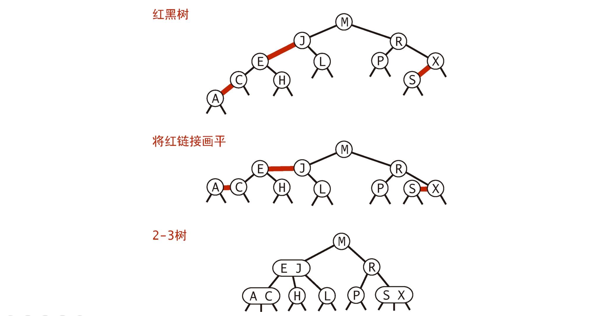

[TOC]

### Tree

#### 概述

令人头秃的树家族概览。树的种类有很多，接触较多的树有二叉树、平衡二叉树、二叉查找树、B 树、B+ 树、哈夫曼树、B* 树、红黑树和 trie 树等。


##### 1. 基本术语

树 (Tree) 是 n (n ≥ 0) 个结点的有限集 T，并且当 n＞0 时满足下列条件：

- 有且仅有一个特定的称为**根** (Root) 的结点；
- 当 n＞1时，其余结点可以划分为 m(m＞0) 个互不相交的有限集 T1、T2 、…、Tm，每个集 Ti (1≤ i ≤ m)均为树，且称为树 T 的**子树 ** (SubTree)。

特别地，不含任何结点(即 n＝0)的树，称为**空树**。


- **结点：**存储数据元素和指向子树的链接，由数据元素和构造数据元素之间关系的引用组成。
- **孩子结点：**树中一个结点的子树的根结点称为这个结点的孩子结点，如图中的 A 的孩子结点有B、C、D。
- **父结点：**树中某个结点有孩子结点(即该结点的度不为 0)，该结点称为它孩子结点的父结点，也叫前驱结点。父结点和孩子结点是相互的，如图中，A 的孩子结点是 B、C、D，则 B、C、D 的父结点是 A。
- **兄弟结点：**具有相同双亲结点(即同一个前驱)的结点称为兄弟结点，如图中 B、C、D 为兄弟结点。
- **结点的度：**结点所有**子树的个数**称为该结点的**度**，如图中 A 的度为 3，B 的度为 2。
- **树的度：**树中所有结点的度的最大值称为**树的度**，如图的度为 3。
- **叶子结点：**度为 0 的结点称为**叶子结点**。如图中的 K、L、F、G、M、I、J。
- **分支结点：**度不为 0 的结点称为分支结点。如图中的 A、B、C、D、E、H。
- **结点的层次：**从根结点到树中某结点所经路径的分支数称为该结点的层次。根结点的层次一般为 1(也可以自己定义为 0)，这样，其它结点的层次是其双亲结点的层次加 1。
- **树的深度：**树中所有结点的层次的最大值称为该树的**深度**(也就是最下面那个结点的层次)。
- **有序树和无序树：**树中任意一个结点的各子树按从左到右是有序的，称为有序树，否则称为无序树。
- **数据元素：**具有相同特性的数据元素的集合。
- **结构关系：**树中数据元素间的结构关系由树的定义确定。

- **森林**：由 m 棵不相交的树组成的集合，叫做森林。

##### 2. **二叉树**

- **二叉树**：每个结点**最多两个子节点**的树为二叉树。
- **满二叉树**：如果二叉树的叶子结点都在**最后一层**，并且结点总数 = 2 ^ n - 1 （n 为层数），则此为**满二叉树**。
- **完全二叉树**：如果二叉树除了最后一层之外均为满的，且最后一层的子节点**从左到右**排列，此成为**完全二叉树**。


#### BST搜索二叉树

##### 1. 概述

搜索二叉树也可以称为**二叉查找树**。对于二叉排序树的任何一个**非叶子节点**，要求**左子节点的值比当前节点的值小，右子节点的值比当前节点的值大**。即**每个节点的值都==大于等于==其==左子树==中的==所有==节点的值而==小于等于右子树==的==所有==节点的值。**

**特别说明**：如果有相同的值，可以将该节点放在左子节点或右子节点。


##### 2. 代码实现

###### (1) 基本数据结构与结点类

```java
public class BST<Key extends Comparable<Key>, Value> implements OrderedST<Key, Value> {

    protected Node root;

    protected class Node {
        Key key;
        Value val;
        Node left;
        Node right;
        // 以该节点为根的子树节点总数
        int N;
        // 红黑树中使用
        boolean color;

        Node(Key key, Value val, int N) {
            this.key = key;
            this.val = val;
            this.N = N;
        }
    }

    @Override
    public int size() {
        return size(root);
    }

    private int size(Node x) {
        if (x == null)
            return 0;
        return x.N;
    }

    protected void recalculateSize(Node x) {
        x.N = size(x.left) + size(x.right) + 1;
    }
}
```

###### (2) get

- 如果树是空的，则查找未命中；
- 如果被查找的键和根节点的键相等，查找命中；
- 否则**递归**地在子树中查找：如果被查找的键较小就在左子树中查找，较大就在右子树中查找。

```java
@Override
public Value get(Key key) {
    return get(root, key);
}

private Value get(Node x, Key key) {
    // Base case
    if (x == null) return null;
    int cmp = key.compareTo(x.key);
    if (cmp == 0) return x.val;
    else if (cmp < 0) return get(x.left, key);
    else return get(x.right, key);
}
```

###### (3) getMin()

最小值在最左边，最大值在最右边。从**根**开始并且只要有**左子结点**就**递归往左**进行查找，**终止点**就是**最小**的元素。如果往**右**递归就是寻找**最大**值。可以有**递归或者迭代**方式实现。下列的代码使用**递归查找最小值**。获取最大值类似。也可以用迭代实现。

```java
@Override
public Key min() {
    return min(root).key;
}

private Node min(Node x) {
    if (x == null) return null;
    if (x.left == null) return x;
    return min(x.left);
}
```

###### (4) put()

当插入的键不存在于树中，需要创建一个**新节点**，并且更新上层节点的链接指向该节点，使得该节点正确地链接到树中。如果结点已存在则不管了，或者更新值。以下使用**递归**方式插入结点。

```java
@Override
public void put(Key key, Value value) {
    root = put(root, key, value);
}

private Node put(Node x, Key key, Value value) {
    // Base case
    if (x == null) return new Node(key, value, 1);
    int cmp = key.compareTo(x.key);
    if (cmp == 0) x.val = value;
    else if (cmp < 0) x.left = put(x.left, key, value);
    else x.right = put(x.right, key, value);
    recalculateSize(x);
    return x;
}
```

###### (5) delete()

如果待删除的节点只有一个子树，  那么只需要让指向待删除节点的链接指向唯一的子树即可；否则，让右子树的最小节点替换该节点。


```java
public void delete(Key key) {
    root = delete(root, key);
}
private Node delete(Node x, Key key) {
    // Base case
    if (x == null) return null;
    int cmp = key.compareTo(x.key);
    // 寻找目标结点
    if (cmp < 0) x.left = delete(x.left, key);
    else if (cmp > 0) x.right = delete(x.right, key);
    // 找到目标结点
    else {
        // 只有一个子结点
        if (x.right == null) return x.left;
        if (x.left == null) return x.right;
        Node t = x;
        x = min(t.right);
        x.right = deleteMin(t.right);
        x.left = t.left;
    }
    recalculateSize(x);
    return x;
}
```

##### 3. 结构分析

**BST** 有一个重要性质，就是它的==**中序遍历**结果**递增**==排序。

二叉查找树的算法运行时间取决于**树的形状**，而树的形状又取决于键被插入的**先后顺序**。

如果插入的结点不合理，那么这个 BST 树会变得**不平衡**，甚至**退化成为链表**。因此使用**平衡树**可以把深度控制在一定范围之内。二叉查找树所有操作在最坏的情况下所需要的时间都和树的高度成正比。最好的情况下树是完全平衡的，每条空链接和根节点的距离都为 **logN**。


在最坏的情况下，**树的高度为 N**。退化成一个**链表**。


解决方案在下一节：**平衡二叉树 AVL 树。**


####  AVL平衡二叉树

平衡二叉树的常见**实现方法**有**红黑树、AVL**、替罪羊树、Treap、伸展树等。

##### 1. 结构概述

如果按照 **{1, 2, 3, 4, 5}** 的顺序构造一颗二叉排序树( BST )。左子树全部为**空**，从形式上看就会退化为一个**单链表**。


这种情况下就很尴尬。

**解决方案：平衡二叉树(AVL) 。**

平衡二叉树也叫**平衡二叉搜索树**（Self-balancing binary search tree）又被称为 **AVL 树**， 可以保证**查询效率较高**。实现 AVL 树的要点为：每次**新增/删除**节点后 **判断平衡性** 然后通过**调整**使整棵树重新平衡。

**判断平衡性**：每次新增/删除节点后，刷新受到影响的节点的高度，即可通过任一节点的左右子树高度差判断其平衡性具有以下特点：它是一棵空树或它的**左右两个子树的高度差的绝对值不超过 1**，并且**左右两个子树都是一棵平衡二叉树**。

##### 2. 原理图示

AVL 树大部分操作都和 BST 树相同, 只有在**插入删除**结点时, 有可能造成 AVL 树**失去平衡**, 而且只有那些在被插入/删除结点到根节点的路径上的结点有可能出现失衡, 因为只有那些结点的子树结构发生了变化。

4 种不平衡情况如下：

**(1) 左子树的左子树插入结点 (左左)**：**右旋**（单旋转）


**(2) 右子树的右子树插入节点 (右右)：左旋**（单旋转）


**(3) 左子树的右子树插入节点 (左右)：先左旋，再右旋**（双旋转）


**(4) 右子树的左子树插入节点 (右左)：先右旋，再左旋**（双旋转）


#### 2-3树

##### 1. 概述

2-3 查找树引入了 **2 节点和 3 节点**，目的是为了让**树平衡**。一颗完美平衡的 2-3 查找树的**所有空链接到根节点**的距离应该是**相同**的。


2-3 树是**最简单的 B 树**结构，具有如下特点：

- 2-3 树的所有**叶子节点**都在**==同一层==**。(只要是 B 树都满足这个条件)
- 2-3 树是由**二节点和三节点**构成的树。
- 有**两个子节点**的节点叫**二节点**，二节点要么**没有**子节点，要么有**两个**子节点.
- 有**三个子节点**的节点叫**三节点**，三节点要么**没有**子节点，要么有**三个**子节点.
- 2-3 树中结点的顺序**也要满足排序树**的特点，即左边的结点的值**大于**根结点的值，根结点的值**小于**右结点的值。

##### 2. 构造过程

插入操作和 BST 的插入操作有很大区别，BST 的插入操作是先进行一次未命中的查找，然后再将节点插入到对应的空链接上。但是 2-3 查找树如果也这么做的话，那么就会破坏了平衡性。**它是将新节点插入到叶子节点上**。

根据**叶子节点的类型**不同，有不同的处理方式：

- 如果插入到 **2- 节点**上，那么直接将新节点和原来的节点**组成 3- 节点**即可。


- 如果是插入到 **3- 节点**上，就会产生一个**临时 4- 节点**时，需要将 4- 节点**分裂成 3- 个 2- 节点**，并将**中间的** 2- 节点**移到上层节点**中。如果上移操作继续产生临时 4- 节点则一直进行**分裂上移**，直到不存在临时 4- 节点。


所以整个**插入过程**中树是**==由下往上==**生长的。

2-3 树的插入操作，首先一定是在**叶子节点**，另外如果 2-3 树中已存在当前插入的 key，则更新值， 下面就在这两点的前提下，进行 2-3 树插入流程的分析：

- 如果待插入的节点只有 1 个 key，则直接插入即可；
- 如果待插入的节点有 2 个 key，则对节点进行分裂，即 2 个 key 加上待插入的 key，这 3 个 key 分裂成 1 个key 跟两个子节点，然后将分裂之后的 3 个 key 中的父节点看作向上层插入的 key，然后重复（1）、（2）步骤，直到满足 2-3 树的定义性质。

如下图所示，插入“7”，而此时节点 “5” 只有一个key，则直接插入即可，形成节点 “**5 7**”。


此时如果再插入“6”，而节点 “5 7” 已经有 2 个 key 了，所以需要先进行**分裂**。


“5 7” 节点与新插入的 “6” 分裂之后，如下图所示。


此时需要将 “6” **向父节点插入**，而父节点 “13 30” 又包含 2 个 key，则需要**再次分裂**，即如下图所示，“13 30” 与 “6” 分裂成父节点为 “13”，子节点为 “6” 跟 “30”。


再将节点 “13” 看作**向父节点插入**，而此时父节点 “50” 只有一个key，则将 “13” 与 “50” 直接**合并**即可，如下图所示，完成节点的插入调整。


##### 3. 性质

2-3 查找树插入操作的变换都是**局部**的，除了相关的节点和链接之外**不必修改**或者检查树的其它部分，而这些**局部变换不会影响树的全局有序性和平衡性**。

2-3 查找树的查找和插入操作复杂度和插入顺序无关，在最坏的情况下**查找和插入操作**访问的节点必然不超过 **logN** 个，含有 10 亿个节点的 2-3 查找树最多只需要访问 **30 个节点**就能进行任意的查找和插入操作。

2-3 树是一棵自平衡的**多路查找树**，它并不是一棵二叉树，具有如下性质：

- 每个节点有 **1 个或 2 个 key**，对应的子节点为 2 个子节点（称为 **2- 结点**）或 3 个子节点（称为 **3- 结点**）；
- 所有**叶子节点到根节点的长度一致**；
- 每个节点的 key 从左到右保持了**从小到大的顺序**，两个 key 之间的子树中所有的 key 一定大于它的父节点的左 key，小于父节点的右 key。

如下图所示。


因为 2-3 树是一棵自平衡的多路查找树，所以构建跟维系一棵 2-3 树，就比二叉平衡树要**复杂的多**了。


#### 2-3-4树

2-3-4 树只是在 2-3 树的基础上进行了扩展。2-3-4 树也是一棵自平衡的**多路查找树**，具有如下性质：

- 任一节点只能是 1 个或 2 个或 3 个 key，对应的子节点为 2 个子节点或 3 个子节点或 4 个子节点；
- 所有**叶子**节点到**根节点的长度一致**；
- 每个节点的 key 从左到右保持了**从小到大**的顺序，两个 key 之间的子树中所有的 key 一定大于它的父节点的左 key，小于父节点的右 key，对于 3 个 key 的节点，两两 key 之间也是如此。

如下图所示。


2-3-4 树插入节点跟删除节点的处理，实际上跟 2-3 树**很像**，特别是插入节点，基本上跟 2-3 树是一模一样，只是**分裂的条件由 2 个 key 变成了 3 个 key而已**，即，

- 如果待插入的节点不是 3 个 key，则直接插入即可；
- 如果待插入的节点有 3 个 key，则对节点进行**分裂**，即 3 个 key 加上待插入的 key，这 4 个 key 分裂成 1 个key 跟 2 个子节点，然后将分裂之后的 4 个 key 中的父节点看作**向上层插入**的 key，然后重复 (1) (2) 步骤，直到满足 2-3-4 树的定义性质。


#### 红黑树

##### 1. 红黑树与2-3树的关系

红黑树也是**二叉查找树**，二叉查找树这一数据结构并不难，而红黑树之所以难是难在它是**自平衡**的二叉查找树，在进行插入和删除等可能会破坏树的平衡的操作时，需要**重新自处理达到平衡状态**。**2-3 树**不太好写代码，所以红黑树借鉴了 2-3 树的思想对其进行了转换，**方便编码**。

红黑树背后的思想是用**标准的二叉查找树**（完全由 **2- 结点**构成）和一些**额外的信息**（替换 3- 结点）来**表示 2-3 树**。

如下图中上半部分示一个 2-3 树的 3- 结点，改变成红黑树如下。


将树中的**连接**分成两种：

- **红链接**：将**两个 2- 结点连接起来构成一个 3- 结点**。

- **黑链接**：2-3 树中的**普通结点**。

可以将 **3- 结点**视为一条**==左斜的红色==**链接。

一种**等价**的定义：

- **红链接**均为**左连接**。
- **没有**任何一个结点**同时和两条红链接**相连。
- 该树是**完美黑色平衡**的，即任意**空链接**到**根节点路径上的黑链接数量相同**。

如果将**红链接**链接的结点**合并**，得到的就是一颗 2-3 树。**红黑树既是 2-3 树，又是二叉查找树。**如果把红链接**画平**，即可明显看出任意**空链接**到**根节点路径上的黑链接数量相同**，放平后红黑树就是 2-3 树。如下图所示。


红黑树与 **2-3** 树的一一对应关系如下图。




##### 2. 红黑树特点

下图为典型的红黑树。


红黑树的特点如下：

1. **根节点**必为**黑色**。
2. **叶子节点都为黑色**，且为 null。
3. 连接**红色节点**的两个子节点都为**黑色**（红黑树**不会出现相邻的红色节点**）。
4. 从任意节点出发，到其**每个叶子节点的路径中包含相同数量的黑色节点**（由于是 2-3 树，所以叶子节点都在**同一层**）。
5. 新插入的结点为**红色**。
6. **红链接**均为**左连接**。

##### 3. 颜色表示

由于红黑树是二叉树，为了表示 2-3 树，所以需要一些额外的信息，因此在红黑树节点中加入了一个**表示颜色的布尔变量**。这里的一个关键是**一个节点的颜色**指的是**指向这个节点的==链接的颜色==**。


**结点类**如下。

```java
private static final boolean RED = true;	// 定义RED为true
private static final boolean BLACK = false;
private Node root;
// 结点类
private class Node{
    // 键
    Key key;
    // 值
    Value value;
    // 这棵树的总结点数
    int N;
    // 左右子树
    Node left, right;
    // 父节点指向它的链接的颜色 
    boolean color; 

    Node(Key key, Value value,int N,boolean color){
        this.key = key;
        this.value = value;
        this.N = N;
        this.color = color;
    }
}
private boolean isRed(Node x){
    if (x==null) return false;
    return x.color == RED;
}
```

##### 4. 旋转

**旋转**是一项非常重要的操作。在**不改变树的有序性**的情况下，将某个**红链接从左链接变成右链接**，或者从右链接变成左链接，这在处理一些情况比如对应于 2-3 树中向 3 节点**插入元素**的时候，**更新整个树**是很有用的。

**红黑树自平衡基本操作**：头结点往左偏就是左旋，头结点往右偏就是右旋。

1. **变色**：在不违反上述红黑树规则特点情况下，将红黑树某个 node 节点颜色**由红变黑**，或者**由黑变红**。
2. **左旋**：**逆时针**旋转两个节点，让一个节点被其右子节点取代，而该节点成为右子节点的左子节点。
3. **右旋**：**顺时针**旋转两个节点，让一个节点被其左子节点取代，而该节点成为左子节点的右子节点。

旋转操作会**改变红链接的指向**。

###### (1) **左旋转**

因为合法的**红链接**都为**左链接**，如果出现右链接为红链接，那么就需要进行**左旋**转操作。

下面是左旋转 h 的右链接。


###### (2) 右旋转

进行**右旋转**是为了转换两个连续的**左红链接**。下面是**右旋转** h 的左链接。


###### (3) 颜色转换

一个 **4-** 节点在红黑树中表现为**一个节点的左右子节点都是红色**的。**分裂 4- 节点**除了需要将子节点的**颜色由红变黑**之外，同时需要将**父节点的颜色由黑变红**，从 **2-3 树**的角度看就是将**中间节点移到上层节点**。


**flipColors**() 的操作。


可以看出这个函数就对应于 2-3 树中将**中间元素插入父节点**的操作，因为它把原来的**==两条红链接变成黑链接==**，相当于**分裂**成了两个 2 节点，而**中间元素**因为颜色是**红**的，所以就加入了父节点。

**注意：根节点都是==黑色==的**。

##### 5. 查找

红黑树的查找算法和二叉查找树的查找算法是完全一样的，对于查找算法来说，红黑树中节点或者说链接的**颜色是没有用到**的，但是没有关系，虽然红黑树只是黑链接平衡，但是即使**不考虑颜色**的查找，整个树也不会出现像二叉树里面那种最极端的情况，所以性能依然是有保障的。

##### 6. 插入

红黑树的插入的算法是比较**复杂**的，对于 2-3 树来说相对较简单，但是在具体实现的时候，每个 3 节点中是有着具体结构的，那么我们在插入后就要**调节**这些具体的结构，才能实现 2-3 树中的功能。

###### (1) 向单个2-节点插入新键

在 2-3 树中向 2- 节点插入非常简单，直接**合并**成一个 3- 节点就行。但是具体实现时，因为相对于父节点可能有大有小，那么在插入的时候就可能在父节点的**左边或者右边**，而**红链接只能是左链接**，那么当在**右边插入**的时候，**就需要进行旋转操作将右链接变成左链接**。

过程如下：


###### (2) 向树底部的2-节点插入新键

跟上述的过程类似，如果是在右边插入新键那么需要进行**旋转**操作，让红链接到**左边**。


###### (3) 向3-节点插入新键

向 3- 节点插入就更加复杂了，因为此时不仅有插入方向的问题，还有**父节点也是红色**的问题，要调整几个节点的结构，实现 2-3 树中将中间节点插入到父节点的操作。这里主要分三种情况。

**I 新键大于原树两个键**

如果插入后一个节点的两个子节点都是红色的，那么我们通过 **flipColors**() 可以很容易的实现 2-3 树中将中间节点插入父节点，两边节点独立成两个 2 节点，同时保持有序性（这里默认中间节点是黑色的，因为默认在插入之前整个树是有序的，这个可以通过正确的插入来保证）。

**II 新键小于原树两个键**

第二种情况下，需要先将第一个红链接进行右旋转，这样就变成了第一种情况，可以按照情况1 处理。

**III 新键介于原树两个键之间**

第三种情况下，需要先将下面的红链接进行左旋转就变成了第二种情况，然后就可以按照第二种情况处理。

如下图所示。


红黑树的插入代码

```java
@Override
public void put(Key key, Value value) {
    root = put(root, key, value);
    root.color = BLACK;
}

private Node put(Node x, Key key, Value value) {
    if (x == null) {
        Node node = new Node(key, value, 1);
        node.color = RED;
        return node;
    }
    int cmp = key.compareTo(x.key);
    if (cmp == 0)
        x.val = value;
    else if (cmp < 0)
        x.left = put(x.left, key, value);
    else
        x.right = put(x.right, key, value);

    if (isRed(x.right) && !isRed(x.left))
        x = rotateLeft(x);
    if (isRed(x.left) && isRed(x.left.left))
        x = rotateRight(x);
    if (isRed(x.left) && isRed(x.right))
        flipColors(x);

    recalculateSize(x);
    return x;
}
```

可以看到该插入操作和二叉查找树的插入操作**类似**，只是在最后加入了**旋转和颜色变换操作**即可。

**根节点一定为黑色**，因为根节点没有上层节点，也就没有上层节点的左链接指向根节点。**flipColors**() 有可能会使得根节点的颜色变为红色，每当根节点由红色变成黑色时树的**黑链接高度加 1**.

这里面值得注意的一点就是那三行 if 条件句，因为是放在**递归**语句之后的，所以是相当于沿着树往下走到底或者找到相等值，处理完再返回的时候运行的，可以看到这三句刚好可以将**情况三处理**完成，同时也容易检验，这个语句是完全可以兼容前两种情况。所以不断再返回根节点的过程运行这三句，相当于 2-3 树中把可能的多余节点移到根节点的过程。最后树是平衡的。


插入操作总结：

- **如果==右子==节点是==红色==的而==左子节点是黑色==的，进行==左旋转==。**
- **如果左子节点是红色的且它的左子节点是红色的，进行右旋转。**
- **如果==左右子节点均为红色==，进行==颜色转换==。**

如下图所示。


##### 7. 删除操作

删除比较麻烦，我们先考虑删除**最小值**，当我们删除一个 **3- 节点**中的元素的时候倒还好，直接删除之后留下了一个 2- 节点，树的平衡性没有发生变化。但是直接删除 **2- 节点**会造成树的高度的变化。所以，我们还是要处理一下，从上往下进行变换，最终的目标就是保证在删除的时候当前节点不只是一个 2- 节点。

###### (1) 删除最小值

最小值在**最左边**，我们沿着左边下去的时候需要合并三个 2 节点形成一个 4- 节点，或者右边是三节点的话从右边节点**“借”**一个形成一个 3- 节点或者 4- 节点，这样就能保证当前节点大于 2- 节点。


代码如下

```java
private Node moveRedLeft(Node h){ // 这个函数是用来处理2节点的
    flipColors(h); // 把上面的节点"拉下来"，形成一个大节点
    if (isRed(h.right.left)){//
        h.right = rotateRight(h.right);
        h = rotateLeft(h);
        flipColors(h); // 注意！！！《算法4》书中这一章的习题中的代码缺少这一行，这一行代表借了一个节点之后，再还一个给父节点。否则我们就连着兄弟节点一起变成一个大节点了。
    }
    return h;
}
public void delMin(){
    if (!isRed(root.left) && !isRed(root.right))
        root.color = RED;
    root = delMin(root);
    if (!isEmpty()) root.color = BLACK;
}
private Node delMin(Node h) {
    if (h.left == null) return null;
    // 意味着h的左子节点为一个2节点
    if (!isRed(h.left) && !isRed(h.left.left)) {
        h= moveRedLeft(h);
    }
    h.left= delMin(h.left);
    return balance(h);
}
```

##### 8. 红黑树的性能

一颗大小为 N 的红黑树的高度**不会**超过 **2logN**。**最坏**的情况下是它所对应的 **2-3 树**，构成最左边的路径节点全部都是 3 节点而其余都是 2 节点。

红黑树大多数的操作所需要的时间都是**对数级别**的。


#### 多路查找树

在二叉树中，每个节点有数据项，最多有两个子节点。如果允许每个节点可以有更多的数据项和更多的子节点，就是**多叉树**（multiway tree）。2 - 3 树，2 - 3 - 4 树就是**多叉树**，多叉树通过重新组织节点，**减少树的高度**，能对二叉树进行优化。


#### B-Tree

##### 1. 概述

B-Tree 就是常说的 **B 树**，一定不要读成 B 减树。B-Tree 是为**磁盘**等外存储设备设计的一种**平衡查找树**。

B 树这种数据结构常常用于实现**数据库索引**，因为它的**查找效率**比较高。**B 树**通过重新组织节点，**降低树的高度**，并且减少 IO 读写次数来提升效率。

文件系统及数据库系统利用了**磁盘预读原理**，将一个节点的大小设为**等于一个页**(页得大小通常为 4k)，这样每个节点只需要一次 I/O 就可以**完全载入**。将树的度 M 设置为 1024，在 600 亿个元素中最多只需要 **4 次 I/O** 操作就可以读取到想要的元素, B 树广泛应用于**文件存储系统以及数据库系统**中。系统从磁盘读取数据到**内存**时是以磁盘**块**（block）为基本单位的，位于同一个磁盘块中的数据会被一次性读取出来，而不是需要什么取什么。


B-Tree 结构的数据可以让系统高效的找到数据所在的磁盘块。为了描述 B-Tree，首先定义一条记录为一个二元组 [key, data] ，key 为记录的键值，对应表中的**主键值**，data 为一行记录中除主键外的**数据**。对于不同的记录，key 值互不相同。

##### 2. B树特性

一棵 **M 阶**的 B-Tree 有如下特性： 

1. 每个节点**最多有 M** 个孩子。 
2. 除了根节点和叶子节点外，其它每个节点**至少**有 Ceil(M/2) 个孩子。 
3. 若根节点不是叶子节点，则**至少有 2 个**孩子 。
4. 所有**叶子节点**都在**同一层**，且不包含其它关键字信息 。
5. 每个非终端节点包含 N 个关键字信息（P0, P1, … Pn,  k1, … kn） 。
6. 关键字的个数 N 满足：ceil(M/2)-1 <= N <= M - 1 。
7. ki(i = 1, … N)为关键字，且关键字升序排序。 
8. Pi(i = 1, … N)为指向子树根节点的指针。P(i - 1)指向的子树的所有节点关键字均小于 ki，但都大于 k( i - 1)。

说明：

- B 树的阶：节点的**最多子节点**个数。比如 2-3 树的阶是 3，2-3-4 树的阶是 4。
- B- 树的搜索，从根结点开始，对结点内的关键字（有序）序列进行**二分查找**，如果命中则结束，否则进入查询关键字所属范围的**儿子结点**；重复，直到所对应的儿子指针为空，或已经是叶子结点。
- 关键字集合分布在**整颗树**中, 即叶子节点和非叶子节点**都存放数据**。
- 搜索有可能在非叶子结点结束。
- 其搜索性能等价于在关键字**全集内**做**一次二分查找**。

##### 2. B-Tree图示

B-Tree 中的每个节点根据实际情况可以包含大量的**关键字信息和分支**，如下图所示为一个 3 阶的 B-Tree（注：图中的 “磁盘块” 应修改为 “**页**”，因为 InnoDB 存储引擎中默认每个页的大小为 **16KB**，而**磁盘块默认为 4KB**，而 B-/B+ 树==**一个节点应该是一个页**==）：


每个**节点**占用一个**盘**块的磁盘空间，一个节点上有两个升序排序的关键字和三个指向子树根节点的指针，指针存储的是**子节点**所在磁盘块的地址。两个关键词划分成的**三个范围域**对应三个指针指向的子树的数据的**范围域**。以根节点为例，关键字为 17 和 35，P1 指针指向的子树的数据范围为小于 17，P2 指针指向的子树的数据范围为17~35，P3 指针指向的子树的数据范围为大于 35。

**模拟查找关键字 29 的过程：**

- 根据根节点找到**磁盘块 1**，读入内存。【磁盘 I/O 操作第 1 次】
    比较关键字 29 在区间（17,35），找到磁盘块 1 的指针 P2。
- 根据 P2 指针找到**磁盘块 3**，读入内存。【磁盘 I/O 操作第 2 次】
    比较关键字 29 在区间（26,30），找到磁盘块 3 的指针 P2。
- 根据 P2 指针找到**磁盘块 8**，读入内存。【磁盘 I/O 操作第 3 次】
    在磁盘块 8 中的关键字列表中找到关键字 29。

分析上面过程，发现需要 3 次磁盘 I/O 操作，和 3 次内存查找操作。由于内存中的关键字是一个有序表结构，可以利用**二分法**查找提高效率。而 **3 次磁盘 I/O** 操作是影响整个 B-Tree 查找效率的**决定因素**。B-Tree 相对于 AVLTree 缩减了节点个数，使每次磁盘 I/O 取到内存的数据都发挥了作用，从而**提高了查询效率**。

下图是另一个 B-Tree 图示。


**操作图示**

B 树的**插入及平衡化**操作和 2-3 树很相似，下面是往 B 树中依次插入下列数据的过程。

```java
6 10 4 14 5 11 15 3 2 12 1 7 8 8 6 3 6 21 5 15 15 6 32 23 45 65 7 8 6 5 4
```


**插入或者删除元素**都会导致节点发生**裂变反应**，有时候会非常麻烦，但正因为如此才让 B 树能够始终保持多路平衡，这也是 B 树自身的一个优势：**自平衡**；B 树主要应用于==**文件系统**==以及部分数据库索引，如 MongoDB，大部分关系型数据库**索引**则是使用 **B+ 树**实现。


#### B+Tree

##### 1. 概述

B+Tree 是在 B-Tree 基础上的一种**优化**，使其更适合实现**外存储索引**结构，==**InnoDB 存储引擎就是用 B+Tree 实现其索引结构。**==

从上一节中的 **B-Tree** 结构图中可以看到**每个节点中不仅包含数据的 key 值，还有 data 值**。而每一个页的存储空间是有限的，如果 data 数据较大时将会导致每个节点（即一个页）能存储的 key 的数量很小，当存储的**数据量很大**时同样会导致 B-Tree 的深度较大，增大查询时的磁盘I/O次数，进而影响查询效率。

在 **B+Tree** 中，所有**==数据记录==节点都是按照键值大小顺序存放在==同一层的叶子节点==上，而==非叶子节点上只存储 key 值==信息**，这样可以大大**加大每个节点存储的 ==key 值数量==**，降低 B+Tree 的**高度**。

B+Tree 相对于 B-Tree 有几点不同：

- B+Tree **非叶子节点只存储键值**信息。
- B+Tree 所有叶子节点之间都有一个**链指针**。
- B+Tree **数据记录都存放在叶子节点**中。

**特性：**

1. 有 n 棵子树的非叶子结点中含有 n 个关键字（ B 树是 n - 1 个），这些关键字**不保存数据**，只用来**索引**，所有**数据都保存在叶子节点**（B 树是**每个关键字都保存数据**）。
2. 所有的叶子结点中包含了全部关键字的信息，及指向含这些**关键字记录的指针**，且叶子结点本身依关键字的大小自小而大顺序链接。
3. 所有的**非叶子结点**可以看成是**索引部分**，结点中仅含其子树中的最大（或最小）关键字。
4. 通常在 B+ 树上有**两个头指针**，一个指向**根结点**，一个指向**关键字最小的叶子结点**。
5. 同一个数字会在不同节点中重复出现，**根节点**的最大元素就是 B+ 树的**最大元素**。

将上一节中的 B-Tree 优化，由于 B+Tree 的非叶子节点只存储键值信息，假设每个磁盘块能**存储 4 个键值**及指针信息，则变成 B+Tree 后其结构如下图所示：


通常在 B+Tree 上有**两个头指针**，一个指向**根节点**，另一个指向**关键字最小的叶子节点**，而且**所有叶子节点**（即数据节点）之间是一种==**链式环结构**==。因此可以对 B+Tree 进行**两种查找运算**：一种是对于**主键的==范围查找和分页查找==**，另一种是从**根节点开始进行随机查找**。

下图是 B+Tree 的另一个图示。


说明：

- B+ 树元素**自底向上**插入。

- B+ 树的搜索与 B 树也基本相同，**区别是 B+ 树只有达到叶子结点才命中**（B 树可以在非叶子结点命中），其性能也等价于在关键字全集做一次**二分**查找。
- 所有**关键字**都出现在**叶子结点**的链表中（即**数据只能在叶子节点**【也叫稠密索引】），且链表中的关键字(数据)恰好是**有序**的。
- B+ 树的特点是能够**保持数据稳定有序**，其插入与修改拥有较稳定的对数时间复杂度。 
- **不可能**在非叶子结点命中。
- 非叶子结点相当于是叶子结点的索引（稀疏索引），叶子结点相当于是存储（关键字）数据的数据层。
- B 树和 B+ 树各有自己的应用场景，不能说 B+ 树完全比 B 树好，反之亦然。

##### 2. B+Tree与数据库

**B+树有一个最大的好处，方便扫库，B树必须用中序遍历的方法按序扫库**，而 B+ 树直接从**叶子结点**挨个扫一遍就完了。 

**B+树支持 range-query (区间查询)非常方便，而B树不支持**。这是数据库选用 B+ 树的最主要原因。 

可能上面例子中只有 22 条数据记录，看不出 B+Tree 的优点，下面做一个推算：

InnoDB 存储引擎中**页的大小为 16KB**，一般表的**主键类型**为 INT（占用 4 个字节）或 BIGINT（占用 8 个字节），指针类型也一般为 4 或 8个字节，也就是说一个**页**（B+Tree中的一个节点）中大概存储 16KB/(8B+8B) = 1K 个**键值**（因为是估值，为方便计算，这里的 K 取值为10^3^）。也就是说一个深度为 3 的 B+Tree 索引可以维护 10^3 * 10^3 * 10^3 = 10 亿条记录。

InnoDB 存储引擎中有**页（Page）**的概念，**页是其磁盘管理的最小单位**。InnoDB 存储引擎中默认每个页的大小为 16KB，可通过参数 **innodb_page_size** 将页的大小设置为 4K、8K、16K，在 MySQL 中可通过如下命令查看页的大小：

```mysql
 mysql> show variables like 'innodb_page_size';
```

而系统一个磁盘块的存储空间往往没有这么大，因此 InnoDB 每次申请磁盘空间时都会是**==若干==地址连续磁盘块来达到页的大小 16KB**。InnoDB 在把磁盘数据读入到磁盘时会以**页**为基本单位，在查询数据时如果一个页中的每条数据都能有助于定位数据记录的位置，这将会**减少磁盘 I/O 次数**，提高查询效率。

实际情况中每个节点可能不能填充满，因此在数据库中，B+Tree 的高度一般都在 **2 ~ 4 层**。MySQL 的 InnoDB 存储引擎在设计时是将**根节点常驻内存**的，也就是说查找**某一键值的行记录时最多只需要 1~3 次磁盘 I/O** 操作。

数据库中的 B+Tree 索引可以分为**聚集索引**（clustered index）和**辅助索引**（secondary index）。上面的 B+Tree 示例图在数据库中的实现即为**聚集索引**，聚集索引的 B+Tree 中的**叶子节点**存放的是**整张表的行记录数据**。辅助索引与聚集索引的区别在于**辅助索引的叶子节点并不包含行记录的全部数据**，而是**存储相应行数据的聚集索引键**，即主键。当通过**辅助索引**来查询数据时，InnoDB 存储引擎会**遍历辅助索引找到主键**，然后再**通过主键在聚集索引**中找到完整的行记录数据。


#### B* 树

B* 树是 **B+ 树**的变体，在 B* 树的**非根和非叶子结点**再增加**指向兄弟**的指针。

- B* 树定义了非叶子结点关键字个数至少为 (2/3) * M，即块的最低使用率为 2 / 3，而 B+ 树的块的最低使用率为B+ 树的1/2。

- B* 树分配新结点的概率比 B+ 树要低，**空间使用率更高**。


#### 其他树

##### 1. 伸展树

伸展树，或者叫**自适应查找树**，是一种用于保存有序集合的简单高效的数据结构。伸展树实质上是一个**二叉查找树**。允许查找，插入，删除，删除最小，删除最大，分割，合并等许多操作，这些操作的时间复杂度为O(logN)。由于伸展树可以适应需求序列，因此他们的性能在实际应用中更优秀。
伸展树支持所有的二叉树操作。伸展树不保证最坏情况下的时间复杂度为O(logN)。伸展树的时间复杂度边界是均摊的。尽管一个单独的操作可能很耗时，但对于一个任意的操作序列，时间复杂度可以保证为O(logN)。

伸展树**无需**时刻都**严格**地**保持全树的平衡**，但却能够在任何足够长的真实操作序列中，保持分摊意义上的高效率。伸展树也不需要对基本的二叉树节点结构，做任何附加的要求或改动，更不需要记录平衡因子或高度之类的额外信息，故适用范围更广。

其中最为典型的，就是所谓的“**数据局部性**”(data locality)，这包括两个方面的含义:

- **刚刚被访问过**的元素，极有可能在不久之后再次被访问到
- 将被访问的下一元素，极有可能就处于不久之前被访问过的某个元素的附近

伸展树的基本想法是：当一个结点被**访问**后，它就要经过一些列 AVL 树的**旋转**被推到**根**上。

**当访问路径长而导致超出正常查找时间的时候，这些旋转将对未来的操作有益。当访问耗时很少的时候，这些旋转则不那么有益甚至有害。**

##### 2. 线索二叉树

二叉树可以使用两种存储结构：**顺序存储和二叉链表**。在使用二叉链表的存储结构的过程中，会存在大量的**空指针**域，为了充分利用这些空指针域，引申出了“**线索二叉树**”。

- 这种加上了线索的二叉链表称为线索链表，相应的二叉树称为**线索二叉树**(Threaded BinaryTree)。根据线索性质的不同，线索二叉树可分为**前序**线索二叉树、**中序**线索二叉树和**后序**线索二叉树三种。

- 一个结点的前一个结点，称为**前驱**结点。一个结点的后一个结点，称为**后继**结点。


通过观察上面的二叉链表，存在着若干个没有指向的**空指针域**。对于一个有 n 个节点的二叉链表，每个节点有指向左右节点的 2 个指针域，整个二叉链表存在 2n 个指针域。而 n 个节点的二叉链表有 n - 1 条分支线，那么空指针域的个数 = 2n - (n-1) = **n + 1个空指针域**，从存储空间的角度来看，这 n + 1个空指针域浪费了内存资源。 

从另外一个角度来分析，如果我们想知道按**中序方式**遍历二叉链表时 B 节点的前驱节点或者后继节点时，必须要按中序方式遍历二叉链表才能够知道结果，每次需要结果时都需要进行一次遍历，是否可以考虑**提前存储这种前驱和后继的关系**来提高时间效率呢？ 
综合以上两方面的分析，可以通过充分利用二叉链表中的空指针域，存放节点在某种遍历方式下的前驱和后继节点的指针。**我们把这种指向前驱和后继的指针成为线索，加上线索的二叉链表成为线索链表，对应的二叉树就成为“线索二叉树(Threaded Binary Tree)”** 。

**线索二叉树构造过程**

此处对二叉树进行中序遍历，遍历的结果为

```
H D I B E A F C G
```

将所有的节点**右子节点**为空的指针域指向它的后继节点。如下图： 

具体参考：

https://blog.csdn.net/jisuanjiguoba/article/details/81092812

线索化二叉树后**不能再使用之前基础**的二叉树遍历方式。这时需要使用新的方式遍历线索化二叉树，各个节点可以通过线型方式遍历，因此无需使用递归方式，这样也提高了遍历的效率。 遍历的次序应当和中序遍历保持一致。


#### **参考资料**

- https://blog.csdn.net/jisuanjiguoba/article/details/81092812

- https://blog.csdn.net/qq_21993785/article/details/80576642

- B-Tree与二叉查找树的对比 http://m.elecfans.com/article/662237.html

    ​    