[TOC]

### 图

#### 基础

##### 1. 概述

图是一种数据结构，其中结点可以具有零个或多个相邻元素。需要表示多对多的关系时就需要用图。

一系列点以及把它们连起来的边就构成了一幅图，图是现实生活中许多东西的抽象比如地图或者电路图，在数学中也有图论这一分支专门研究图的性质。

##### 2. 基本术语

- **顶点（V）**：结点也可以称为**顶点**。

- **边（E）**：两个结点之间的连接称为**边**。

- **度数**：某一个顶点的度数即为依附于它的**边的总数**。
- **路径**：由边顺序连接起来的一系列顶点。
- **环**：该路径上的任意一个顶点都可以沿着这条路径回到原来的顶点。
- **连通图**：如果从任意一个顶点都存在一条路径到达另一个任意定点，那么这幅图是连通图。

特殊的情况自环和平行边如下图所示。


树是一幅**无环连通图**。互不相连的树组成的集合成为**森林**。

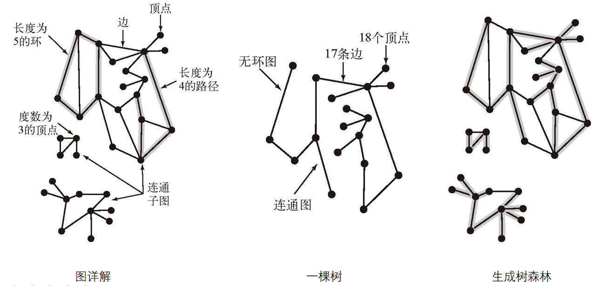

##### 3. 图的表示

图的表示方式主要有两种：二维数组表示（邻接矩阵）、链表表示（邻接表）。

###### (1) 邻接矩阵

**邻接矩阵**是表示图形中**顶点之间相邻关系**的矩阵，对于 N 个顶点的图而言，矩阵是的 row 和 col 表示的是 1....n 个点。

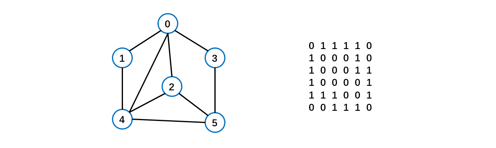

邻接矩阵需要为**每个顶点都分配 N 个边的空间**，其实有很多边都是不存在,会造成空间的一定**损失**。对于**稀疏图**会造成较大的空间浪费。对于**稠密图**则非常适合。

######  (2) 邻接表

**邻接表**的实现只关心**存在的边**，不关心不存在的边。因此没有空间浪费，适合**稀疏图**。邻接表由==**数组 + 链表**==组成。

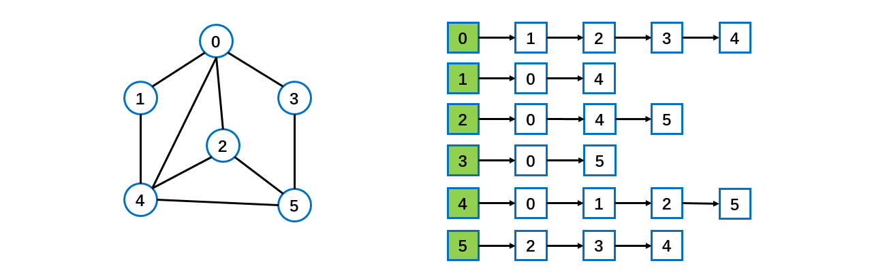

标号为 0 的结点的相关联的结点为 1 2 3 4。
标号为 1 的结点的相关联结点为 0 4。
标号为 2 的结点相关联的结点为 0 4 5。


#### 无向图

##### 1. 概述

**无向图**就是**图中的边是没有方向**的。

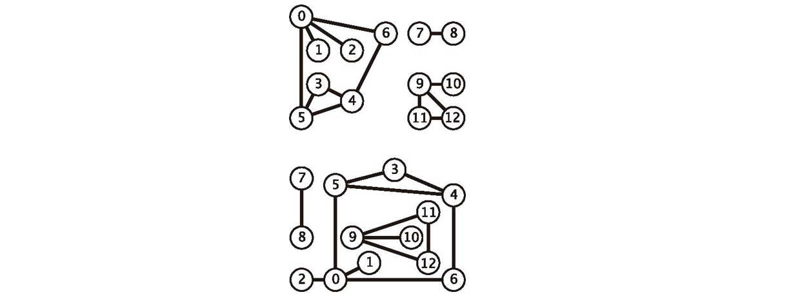

##### 2. 无向图的表示

以下图为例。


显然，这个无向图有 13 个点。

- 0 可以通往 1, 2, 5, 6；

- 6 可以通往 0, 4 ; 

- 5 可以通往0, 3, 4。

即 0 的邻居点有 1, 2, 5 ,6；而 6 的邻居点有 0, 4。

目前有两种主流的表示方法：**邻接矩阵（Adjacency-matrix）和邻接列表（Adjacency-list）。**

###### (1) 邻接矩阵

如果两个点**相邻**，则**用 1 表示，否则用 0**。例如 1 是 0 的邻居点，所以 0 和 1 相交对应的格子为 1。

从这个图可以看出，如果每个点不是与大量的其它点互为邻居，则会有很多 0 出现。如果点的数量庞大，矩阵将十分巨大，且有很多空间浪费（0 占据的格子）。邻接矩阵在**稠密图**中较为适合。

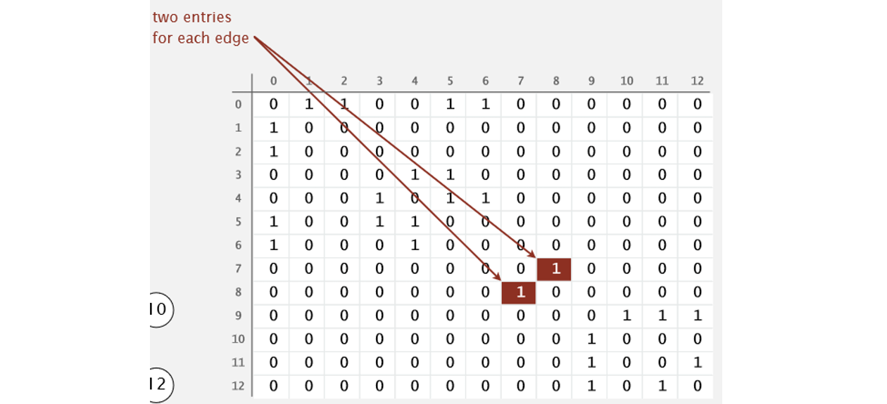

###### (2) 邻接表数组

就是用一个**数组**把所有点装起来，每个位置是由**对应点的所有邻居点形成的数组**。使用邻接表可以只保留**有效信息**，从而大大减少空间的需求。

如 **adj[0] = 6, 2, 1, 5** (0 可以通往 1, 2, 5, 6);

**adj[6] = 0, 4**（6 可以通往 0, 4）。

这个列表比较适合每个点只与少量其它点相邻的情况。即适用于**稀疏图**的情况。

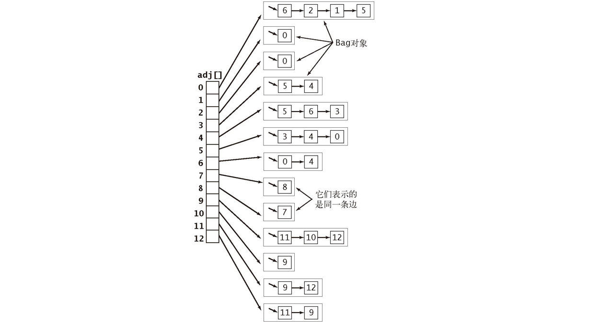

在上述的数据结构中**每条边会出现两次**。性能特点如下：

1. 使用的空间和 **V + E** 成正比。

2. **添加一条边**所需的时间为**常数**。
3. 遍历顶点 V 所有的相邻顶点所需的时间和 V 的**度数**成正比。

可以根据实际情况进行选择用**列表还是矩阵。**

通过创建一个矩阵或者列表，程序可以知道这个无向图有哪些点和点与点之间的联系。

##### 3. 基础结构代码实现

这里使用**邻接矩阵**的方式。

**图类**如下。

```java
public class Graph {
    // 存放结点的HashMap
    public HashMap<Integer, Node> nodes;
    // 存放边的Set
    public HashSet<Edge> edges;

    public Graph() {
        nodes = new HashMap<>();
        edges = new HashSet<>();
    }
}
```

**结点类**如下。

```java
public class Node {
    // 结点值
    public int value;
    // 入度
    public int in;
    // 出度
    public int out;
    // 邻接结点的List表
    public ArrayList<Node> nexts;
    // 边的list
    public ArrayList<Edge> edges;
	
    public Node(int value) {
        this.value = value;
        in = 0;
        out = 0;
        nexts = new ArrayList<>();
        edges = new ArrayList<>();
    }
}
```

**边类**如下。

```java
public class Edge {
    // 权重
	public int weight;
    // From结点
	public Node from;
    // To结点
	public Node to;

	public Edge(int weight, Node from, Node to) {
		this.weight = weight;
		this.from = from;
		this.to = to;
	}
}
```

对于常见的给定的图结构，都是可以转化为上述的结构。比如传入一个**邻接矩阵**转为上述给定的图结构。

```java
// matrix 所有的边
// N*3 的矩阵
// [weight, from节点上面的值，to节点上面的值]
public static Graph createGraph(Integer[][] matrix) {
    Graph graph = new Graph();
    // matrix[0][0], matrix[0][1]  matrix[0][2] 一次读取矩阵一行
    for (int i = 0; i < matrix.length; i++) { 
        // 构造数据
        Integer from = matrix[i][0];
        Integer to = matrix[i][1];
        Integer weight = matrix[i][2];
        // 如果from是新节点则创建并放入图中
        if (!graph.nodes.containsKey(from)) {
            graph.nodes.put(from, new Node(from));
        }
        // 如果to是新节点则创建并放入图中
        if (!graph.nodes.containsKey(to)) {
            graph.nodes.put(to, new Node(to));
        }
        // 构造边
        Node fromNode = graph.nodes.get(from);
        Node toNode = graph.nodes.get(to);
        Edge newEdge = new Edge(weight, fromNode, toNode);
        // 添加next节点
        fromNode.nexts.add(toNode);
        // 设置入度和出度
        fromNode.out++;
        toNode.in++;
        fromNode.edges.add(newEdge);
        graph.edges.add(newEdge);
    }
    return graph;
}
```

**图经常也需要遍历所有数据**，并且它最好能够反映节点之间的相关信息，所以就有了两个很重要的搜索方法，**深度优先和广度优先搜索**，下面先介绍深度优先搜索。

##### 4. 深度优先搜索（DFS）

**深度优先搜索**(DepthFirstSearch) 的主要特征就是，假设一个顶点有不少相邻顶点，当搜索到该顶点，对于它的相邻顶点并不是现在就对所有都进行搜索，而是对一个顶点继续往后搜索，**直到某个顶点**，他周围的相邻顶点**都已经被访问过**了，这时他就可以**返回**，对它来的那个顶点的其余顶点进行搜索。

简单来说就是，在访问一个顶点时：

- 将它**标记为已访问**。
- 递归地访问它的所有**没有被标记过**的邻居顶点。

一路走到尽头，然后返回上一个分支，走另一条路到尽头，再返回，再走其他路，直到全部走完为止。

**深度优先搜索**的实现可以利用**递归**很简单地实现。

````java
public static void dfs(Node node) {
    // Base case
    if (node == null) return;
    // 使用一个栈用于遍历
    Stack<Node> stack = new Stack<>();
    // 使用一个Set保存已经访问过的结点
    HashSet<Node> visitedSet = new HashSet<>();
    // 将头结点如栈和Set
    stack.add(node);
    visitedSet.add(node);
    // 打印头结点代表已经访问
    System.out.println(node.value);
    // 栈不为空持续遍历
    while (!stack.isEmpty()) {
        // 从栈弹出一个结点
        Node cur = stack.pop();
        // 遍历当前弹出结点的nexts链表
        for (Node next : cur.nexts) {
            // 如果这个结点没有遍历过则压栈
            if (!visitedSet.contains(next)) {
                // 注意把cur结点再次压栈
                stack.push(cur);
                stack.push(next);
                visitedSet.add(next);
                // 打印当前结点
                System.out.println(next.value);
                break;
            }
        }
    }
}
````

这里用的是一个 Set 保存**被访问的结点**，算法 4 中的代码使用一个 **boolean[] 数组标识某个顶点是否被访问过**，这在以后与图相关的算法中很常见，因为必须直到哪些顶点被访问过了。

过程如下面的图：

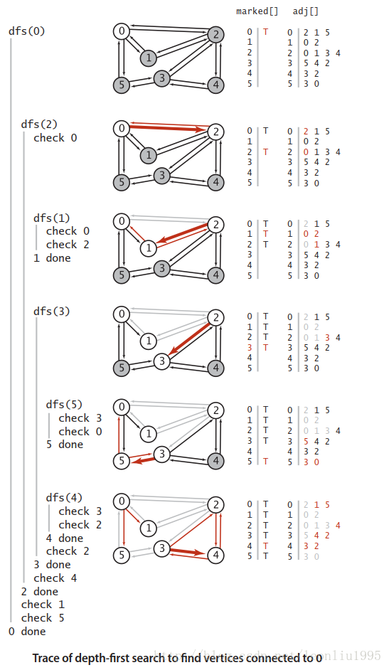

##### 5. 广度优先搜索（BFS）

广度优先搜索（BreadthFirstSearch）相对于深度优先搜索侧重点不一样，深度优先好比是一个人走迷宫，一次只能选定一条路走下去，而广度优先搜索好比是**一次能够有任意多个人**，一次就走到和一个顶点相连的所有未访问过的顶点，然后再从这些顶点出发，继续这个过程。

具体实现的时候我们使用**先进先出队列**来实现这个过程：

1. 首先将**起点加入队列**，然后**将其出队**，把和起点相连的**顶点加入队列**;
2. 将**队首**元素 V **出队**并标记它；
3. 将和 V 相连的**未标记**的元素加入队列，然后继续执行步骤 2 直到队列**为空**。

广度优先搜索的一个重要作用就是它**能够找出最短路径**，这个很好理解，因为广度优先搜索相当于每次从一个起点开始向所有可能的方向走一步，那么第一次到达目的地的这个路径一定是最短的，而到达了之后由于这个点已经被访问过而不会再被访问，这个路径就不会被更改了。

下面是利用广度优先进行路径搜索的代码：即从给定的 **Node** 出发进行 BFS。就类似于二叉树的**层序**遍历，只不过多了一个已访问数组。

```java
public static void bfs(Node node) {
    // Base case
    if (node == null) return;
    // 使用队列进行遍历
    Queue<Node> queue = new LinkedList<>();
    // 使用Set存储已经遍历的结点
    HashSet<Node> visitedSet = new HashSet<>();
    // 加入头结点
    queue.add(node);
    visitedSet.add(node);
    while (!queue.isEmpty()) {
        // 弹出一个结点
        Node cur = queue.poll();
        // 处理数据
        System.out.println(cur.value);
        // 迭代处理各个没有遍历的结点
        for (Node next : cur.nexts) {
            // 如果没有遍历过则加入队列中
            if (!visitedSet.contains(next)) {
                visitedSet.add(next);
                queue.add(next);
            }
        }
    }
}
```

##### 6. 连通分量

无向图的连通分量（或者仅分量）是一个子图，**其中任何两个顶点通过路径相互连接**，并且在超图中不连接顶点。例如，图中显示的图形有三个连接的组件。没有边缘的顶点本身就是一个连通的组件。自身连接的图形只有一个连接组件，由整个图组成。

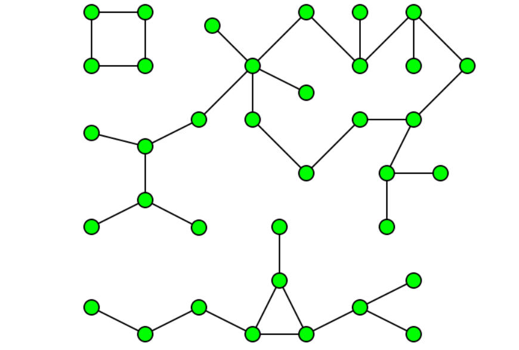

在有向图的数学理论中，如果每个顶点都可以从其他顶点到达，则图被称为**强连通或不连通**。任意有向图的强连通分量或连通分量形成一个划分成本身强连接的子图。可以在线性时间内（即Θ（V + E））测试图的强连通性，或者查找其强连通分量。

无向图 G 的极大连通子图称为 G 的连通分量（Connected）。任何连通图的连通分量都只有一个，即使是其本身，非连通的无向图有多个连通分量。

一个图可能是**不连通**的，那么找出图中**有几个连通分量**，找出两个顶点是否位于同一个连通分量都可以用深度优先搜索或者广度优先搜索完成，但是**深度优先搜索 DFS 实现起来更简单**。

先看代码实现（基于**算法 4**）：

```java
public class CC {
    private boolean[] marked;
    private int[] id;
    private int count;

    public CC (Graph G){
        marked = new boolean[G.V()];
        id = new int[G.V()];
        for(int s = 0; s < G.V(); s++){
            if (!marked[s]){
                dfs(G, s);
                count++;
            }
        }
    }

    private void dfs(Graph G, int v){
        marked[v] =true;
        id[v] = count;
        for(int w : G.adj(v))
            if(!marked[w])
                dfs(G, w);
    }

    public boolean connected(int v, int w){
        return id[v] == id[w];
    }

    public int id(int v){
        return id[v];
    }
    public int count(){
        return count;
    }
}
```

代码中维护了**两个数组**，一个是常见的 **marked[]** 数组，用来表示是否被访问过，另一个是 **id[]** 数组，用来判定每个顶点**属于哪个连通分量**。
在构造函数中我们使用了**深度优先搜索函数 dfs**，对于一个顶点来说， **dfs()** 会遍历这个顶点**所在的连通分量所有的顶点**才会返回，接着执行下一语句也就是 count++ 刚好可以给**下一个连通分量**使用，而这些语句外围的 for 循环则可以保证会遍历所有顶点，这样就能找出所有连通分量并将它们**区分**开来。

- 深度优先搜索的预处理时间使用的时间和空间和 V+E 成正比且可以在常数时间内处理关于图的连通性的查询。

如下图有**三个**联通分量。其 id 值分别为 0, 1, 2。

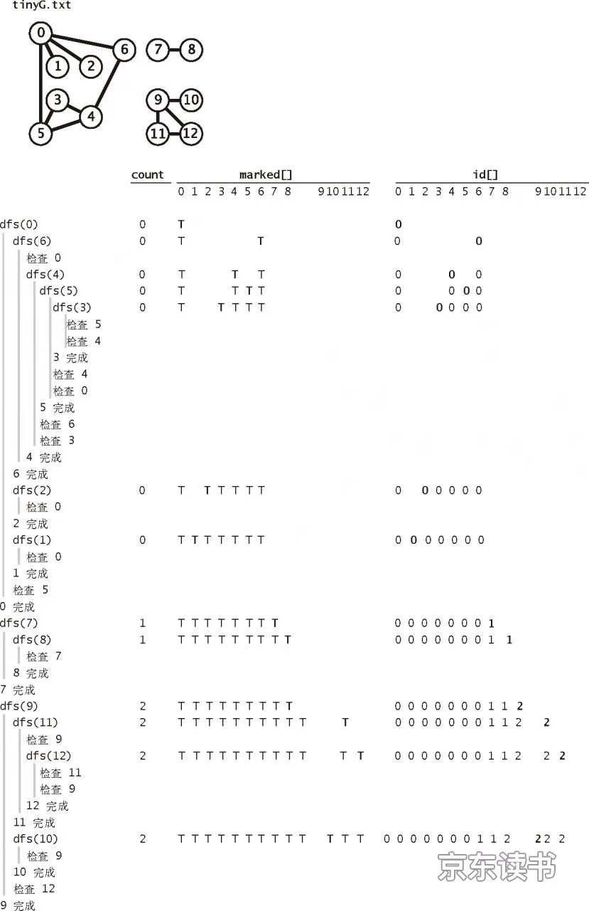

##### 7. 检测是否为无环图

检测无环图的代码有点难以理解，首先代码如下（基于算法 4）：

```java
public class Cycle {
    private boolean[] marked;
    private boolean hasCycle;

    public Cycle(Graph G){
        marked = new boolean[G.V()];
        for(int s=0;s<G.V();s++)
            if (!marked[s])
                dfs(G,s,s);
    }

    private void dfs(Graph G, int v, int u){
        marked[v] = true;
        for(int w: G.adj(v)){
            if (!marked[w])
                dfs(G, w, v); // 可以看出第二个函数表示该顶点的上一个顶点
            else if (w != u) hasCycle = true;
        }
    }
    public boolean hasCycle(){
        return hasCycle;
    }   
}
```

这里有两个关键，一个是为什么要将深度优先搜索函数 dfs() 设计成有两个参数的，观察 for 语句里面的**递归用法**，就知道了，第二个参数**代表当前顶点的上一个顶点是哪一个**。然而这有什么用？这里需要知道一点**连通无环图就是一颗树**，然后我们以叶节点为例，考虑深度优先搜索进行到这里的情况，假设叶节点为 w ，它的上一个节点为 v，那么我们首先调用了 dfs(G, w, v)，然后是 marked[w] = true; 节点 w 被访问，然后进入 for 循环，这时候 w 的相邻节点只有 v，if 循环被跳过，在 else 语句里面 v==v 那么 hasCycle 就不会被置为 false，所以综上，这样设计成两个参数就是因为在无向图里面两个顶点互相相邻，那么就一定会有子顶点会访问到父顶点的情况，这时候访问到的已经被访问的顶点就是上一个顶点，而如果图**里面有环**那么显而易见，这个被访问过的顶点并不是上一个顶点，这样就能够检测出环了。


#### 有向图

##### 1. 概述

简单的来说有向图就是**连接带方向**的图。有向图的例子在现实生活中也很多，比如在一段时间内银行间的现金流动，或者在某些地方的一些道路是单向的啊，那么这些现金流以及单向的道路就要用带方向的边来描述，这时有向图就有了用武之地。一个有向图的例子如下：

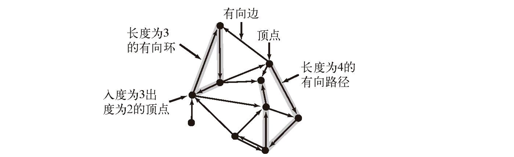

有向图该怎么实现呢？对于无向图可以使用邻接表来实现，这种表达方式非常高效，并且略加思考就可以发现，**邻接表完全可以直接套用在有向图上**。假设要添加一条 v->w 的边，只要每次调用 **add**() 函数的时候只在 adj[v] 所指向的 Bag 添加 w 即可，这么看来无向图可以看作是有向图的特殊情况，即凡是有边相连的两个顶点一定有两个互相来回的边，所以对于无向图，在添加一条边的时候需要在两个顶点都添加一条边。每条边**只会出现一次**。

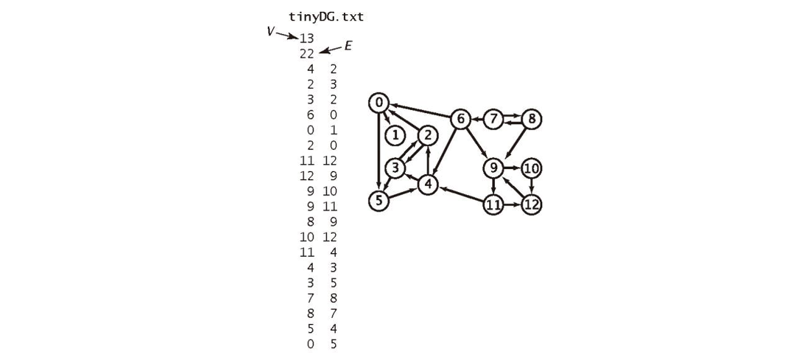

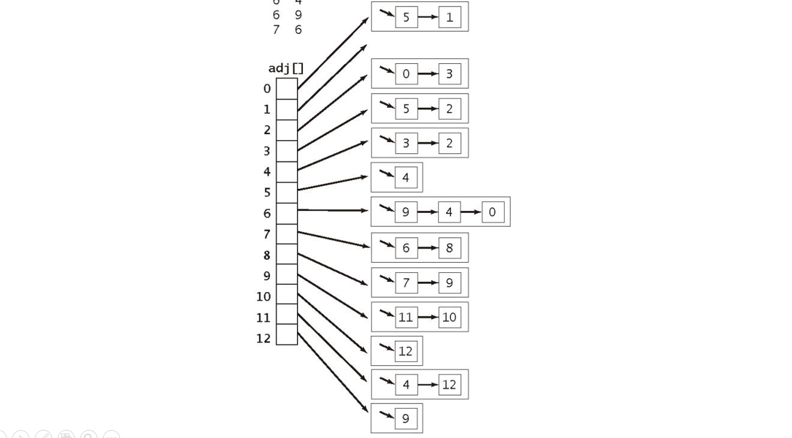

下面给出有向图的实现：

```java
public class Digraph {
    private final int V; // number of vertex
    private  int E;      // number of edge
    private Bag<Integer>[] adj;  //adjacent list

    public Digraph(int V){
        this.V  = V;
        this.E = 0;
        adj = (Bag<Integer>[]) new Bag[V];
        for (int v=0;v<V;v++){
            adj[v] = new Bag<Integer>();
        }

    }

    public Digraph(In in){
        this(in.readInt());
        int E = in.readInt();
        for(int i=0;i<E;i++){
            int v = in.readInt();
            int w = in.readInt();
            addEdge(v,w);
        }
    }

    public int V(){return V;}
    public int E(){return E;}

    public void addEdge(int v,int w){
        // 只需要添加一次边即可
        adj[v].add(w);
        E++;
    }

    public Iterable<Integer> adj(int v){
        return adj[v];
    }

    public Digraph reverse(){
        Digraph  R= new Digraph(V);
        for (int v = 0;v<V;v++)
            for (int w:adj(v))
                R.addEdge(w, v);
        return R;
    }
}
```

可以看出有向图 Digraph 的实现中多了一个 reverse() 函数，这是将**所有边全部反向**，这个函数在后面会有作用。

##### 2. 可达性

对于有向图我们依然有**搜索**的需要，并且我们依然可以使用深度优先以及广度优先搜索，首先可以解决的问题是**可达性，从一个或一组顶点出发能否到达一点**，使用深度优先或者广度优先都可以实现，然后还能找到一个路径，同时利用广度优先还能找出最短路径，这些问题的解决方式**和无向图基本没有差别**，只是将 Graph 替换为 Digraph 就行，所以不再详述。

##### 3. 有向无环图DAG

**DAG**（Directed Acyclic Graph）即为**有向无环图**，就是没有有向的环路的有向图，这在现实生活中也很常见，比如一些具有优先级的任务流程。

对 DAG 有一些处理算法，不过在那之前，先来看看**怎么判断一副有向图是否为 DAG**。

其实很简单，首先**只要有一个有向环，这个图就不是 DAG**，所以只要检测出一个**有向环**，就可以返回了，不用再找下去了。第二这里使用**深度优先搜索**，深度优先沿着一条路径一直找下的特性刚好符合这里的要求，广度优先搜索是没有用的，那么什么时候判断存在一个有向环呢就是在走的时候碰到了还没有返回的顶点，用一个布尔数组 onStack 为每一个顶点保存一个是否还处于堆栈上没有返回的标志，这样，一旦在深度优先搜索的时候碰到了一个还在栈上的顶点，那么就能够确认这个有向图含有有向环，即不是 DAG。代码如下（基于算法 4）：

```java
public class DirectedCycle {
    private boolean[] marked;
    private int[] edgeTo;
    private Stack<Integer> cycle;
    private boolean[] onStack;

    public DirectedCycle(Digraph G){
        onStack = new boolean[G.V()];
        edgeTo = new int[G.V()];
        marked = new boolean[G.V()];
        for(int v = 0; v < G.V(); v++){
            if (!marked[v]) dfs(G,v);
        }
    }

    private void dfs(Digraph G, int v){
        onStack[v] =true;
        marked[v] = true;
        for(int w : G.adj(v)){
            if (this.hasCycle()) return;
            else if (!marked[w]){
                edgeTo[w] = v;
                dfs(G, w);
            }
            else if(onStack[w]){
                cycle = new Stack<Integer>();
                for(int x = v; x != v; x = edgeTo[x])
                    cycle.push(x);
                cycle.push(w);
                cycle.push(v);
            }
        }
        // 这里要注意没有这句话，在沿着路经返回的时候会不断往cycle栈里面压入数据
        onStack[v] = false;
    }

    public boolean hasCycle(){
        return cycle != null;
    }

    public Iterable<Integer> cycle(){
        return cycle();
    }

}
```

代码最后能够返回一个**路径**。

##### 4. 拓扑排序

下面先介绍一个概念**拓扑排序：给定一副有向图，将所有的顶点排序，使得所有的有向边均从排在前面的元素指向排在后面的元素**，拓扑排序有着很多应用，比如**任务调度，课程安排，类之间的继承**等等。

排成之后的效果如下图:

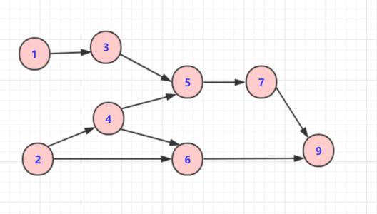

**当且仅当一幅==有向图是无环图==时它才能进行拓扑排序**。

这是显然的，存在环的话无论怎么排都不可能让图中的左右边都朝着同一方向。应该利用上面的方法判断是否有环，然后再进行全面的搜索，但是我们可以以一定的顺序将遍历完成后的结果保存在一个数据结构中，下面是三种**典型的排序**：

- **前序**：在递归调用前将顶点加入队列。
- **后序**：在递归调用后将顶点加入队列。
- **逆后序**：在归调用后将顶点压入栈。

这实现起来也很简单，只需要在深度优先搜索的代码中加入相应的对数据结构的处理。

```java
// 有向图中基于深度优先搜索的顶点排序
public class DepthFirstOrder {
    private boolean[] marked;
    // 所有顶点的前序排序
    private Queue<Integer> pre;
    // 所有顶点的后序排序
    private Queue<Integer> post;
    // 所有顶点的逆后序排序
    private Stack<Integer> reversePost;

    public DepthFirstOrder(Digraph G){
        pre = new Queue<Integer>();
        post = new Queue<Integer>();
        reversePost = new Stack<Integer>();
        marked = new boolean[G.V()];

        for(int v =0 ;v<G.V();v++)
            if(!marked[v]) dfs(G,v);
    }

    private void dfs(Digraph G, int v){
        pre.enqueue(v);

        for(int w:G.adj(v))
            if (!marked[w]) dfs(G,  w);

        post.enqueue(v);
        reversePost.push(v);

    }

    public Iterable<Integer> pre(){
        return pre();
    }
    public Iterable<Integer> post(){
        return post();
    }
    public Iterable<Integer> reversePost(){
        return reversePost;
    }
}
```

代码中，pre(), post(), reversePost() 分别能够**返回顶点的前序，后序以及逆后序**。

现在我们已经很容易就能够实现拓扑排序了，因为有一个定理：

**==一幅有向无环图的拓扑排序即为所有顶点的逆后序排序。==**

实现代码如下（基于**自定义**图结构）：整个过程看**注释**就行了。

```java
/*
 * 拓扑排序
 * @param graph 图
 * 必须是有向无环图才可以
 */
public static List<Node> sortedTopology(Graph graph) {
    // key：某一个node
    // value：剩余的入度
    HashMap<Node, Integer> inMap = new HashMap<>();
    // 入度为0的点，才能进这个队列
    Queue<Node> zeroInQueue = new LinkedList<>();
    // 遍历图的所有节点得到inMap和zeroInQueue
    for (Node node : graph.nodes.values()) {
        // 初始时所有的节点的剩余入度就是其原始入度
        inMap.put(node, node.in);
        // 如果某节点入度为0则加入队列
        if (node.in == 0) {
            zeroInQueue.add(node);
        }
    }
    // 存放拓扑排序的结果，依次加入result
    List<Node> sortResultList = new ArrayList<>();
    // 从入度为0的节点开始排序
    while (!zeroInQueue.isEmpty()) {
        // 弹出一个入度为0的结点并加入结果队列
        Node cur = zeroInQueue.poll();
        sortResultList.add(cur);
        // 遍历这个结点的邻居
        for (Node next : cur.nexts) {
            // 变量之后将邻居的剩余入度减1
            inMap.put(next, inMap.get(next) - 1);
            // 当某个结点的剩余入度为0时则放入0入度队列中
            if (inMap.get(next) == 0) {
                zeroInQueue.add(next);
            }
        }
    }
    // 返回排序结果
    return sortResultList;
}
```

解决任务调度类问题的步骤：

- 指明**任务和优先级**条件。
- 不断检测并去除有向图中的**所有环**，以确保存在**可行**方案。
- 使用**拓扑排序**解决调度问题。

##### 5. Kosaraju算法

Kosaraju 算法是用来**找出有向图强连通分量**的，前面的一些方法在这里也有一些作用，不过在那之前先介绍清楚几个概念。

- **强连通**：对于两个顶点 v 和 w，分别存在一条从 v 到 w 和从 w 到 v 的有向路径，即两个顶点是**互相可达**的。那么称这两个顶点是强连通的。
- **强连通分量**：是有向图 G 的一个子集，它的**所有顶点**都互相是强连通的。

下图含有  5 个强连通分量。


**两个顶点是强连通的当且仅当它们都在一个==普通的有向环==中**。

**Kosaraju 算法可以给出有向图中有几个强连通分量以及两个顶点是否在一个强连通分量里面。**

算法的**步骤**主要是：对有向图 G 的**反向图** G^R^ 进行**==拓扑排序==**，**然后根据这个顺序使用==深度优先==处理有向图 G，然后每一次递归所经过的顶点都在一个强连通分量里面。**

下面给出一个比较直观的证明：首先对于每一个强连通分量为了直观起见，我们将其视作一个**点**，那么我们的目标就是找出这个收缩过之后的图有几个顶点，联系之前的无向图的连通分量的算法，我们希望每个节点返回一次。这该怎么达到呢？这时**拓扑排序**就派上用场了，我们先对图求反，再对其做拓扑排序，这时候得到的结果，我们不考虑强连通分量中的点，在强连通分量之间就是完全的拓扑排序的反序，按照这个顺序在 G 中进行深度优先搜索，我们就会每次搜索完强连通分量内的点，然后无法到达其他连通分量，就只能返回，达到了我们前面说的对每个强连通分量缩成的节点每次都返回一次。
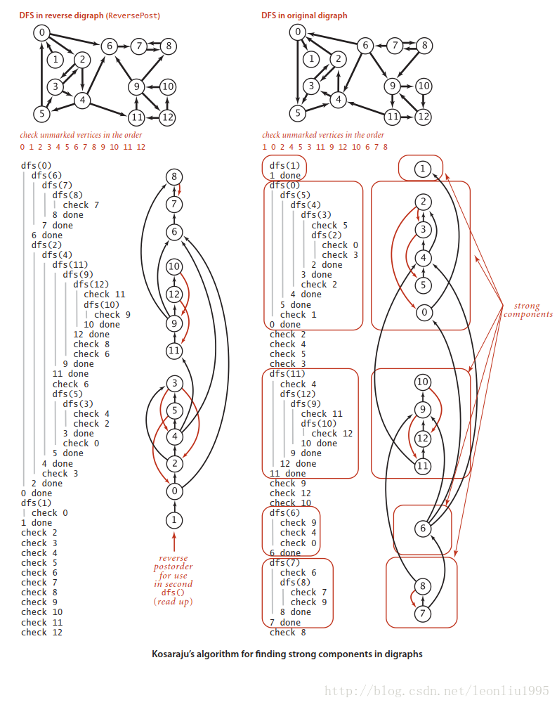

上图是《算法4》中的一个例子，右边的图中，每一个方框内都是一个**强连通分量**，然后可以发现，按照反向图的逆后序进行深度优先搜索的话，强联通分量之间的边都是逆着的，这就完成了上面所说的每个收缩后的节点返回一次的目的。

最后说一点可能不对的想法，在思考证明方法的过程中我想到一种情况，我们第一次搜索反向图是为了得到缩点之后的连通分量之间的边是逆着的图，但是好像单纯对原图搜索，取其后序好像也行，但是实验之后发现结果不对，但是百思不得其解，后来找了个小例子发现了一个可能性，关键在于强连通分量之间是可达的，这个道理好像是显而易见的，但是应该就是这种方法行不通的原因，举个极端例子，在某个顶点出发是完全有可能一次就遍历整个图，并且第一个完成遍历的顶点就和它相连，那么当我们按照后序第二次遍历的时候就会一下子遍历整个图，那么最后我们就会只得到一个连通分量，这显然是不对的。

下面是计算强连通分量的 Kosaraju 算法代码的实现（基于算法 4）：

```java
public class KosarajuSCC {
    private boolean[] marked;
    private int[] id;
    private int count;

    public KosarajuSCC(MyDigraph G){
        marked = new boolean[G.V()];
        id = new int[G.V()];
        DepthFirstOrder order = new DepthFirstOrder(G.reverse());
        for(int s:order.reversePost())
            if(!marked[s]){
                dfs(G,s);
                count++;
            }
    }

    private void dfs(MyDigraph G, int v){
        marked[v] =true;
        id[v] =count;
        for(int w:G.adj(v))
            if(!marked[w])
                dfs(G, w);
    }

    public boolean stronglyConnected(int v, int w){
        return id[v] == id[w];
    }

    public int id(int v){
        return id[v];
    }
    public int count(){
        return count;
    }
}
```

Kosaraju 算法的预处理所需的时间和空间与 V+E 成正比且支持**常数时间**的**有向图强连通性**的查询。


#### 最小生成树

##### 1. 概述

在前面我们了解到了无向图和加权有向图，类似的我们给无向图的每一条边加上**权重**，就得到了加权无向图，加权无向图在现实中也有许多应用，在这一篇，我们讨论对它的一个重要的处理，就是找出图中（本篇中默认为**加权无向图**）的最小生成树。

**最小生成树：图的生成树是它的一棵含有所有顶点的无环连通子图。加权图的最小生成树（MST）是它的一棵权值之和最小的生成树**。

*默认权值是不相同的，否则会产生不唯一的最小生成树*。

最小生成树算法有**很多应用**，比如顶点是城市，边是城市之间的航线，那么最小生成树可以看作覆盖这些城市做需要的**最短总航线**，下面我们先来看基本的实现原理。

##### 2. 切分定理

- 切分：将图的**顶点集**分为两个非空并且没有交集的集合。下图即切分为**白色和灰色**两部分的顶点。
- **横切边**：链接两个属于不同集合的顶点的边。（下图的红色边）

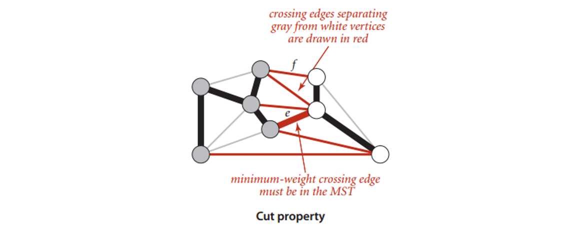

**切分定理**：在一副加权图中，给定**任意的切分**，**它的横切边中的==权重最小者==必然属于图中的最小生成树**。

==**权重最小的横切边必然属于最小生成树。**==

##### 3. 最小生成树的贪心算法

贪心思想：**使用切分定理找到最小生成树的一条边，==不断重复==直到找到最小生成树的所有边。**

贪心算法是所有最小生成树算法的基础，基本原理就是从**一个点**开始，以已经找到的最小生成树的顶点，和其他顶点作为一个切分，**找出权重最小的横切边**，加入最小生成树，不断进行下去，直到包含了所有顶点。

过程如下：

将含有 V 个顶点的任意加权连通图中**属于**最小生成树的**边标记为黑色**。

1. 初始状态下所有**边均为灰色**，找到一种切分，它产生的横切边**均不为黑色**。
2. 将它**权重最小**的横切边标记为**黑色**。
3. 反复，直到标记了 **V-1 条黑色**边为止。

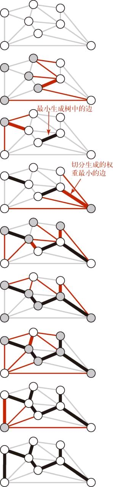

##### 4. Prim算法

这里介绍的 Prim 算法和下面将要介绍的 Kruskal 算法基本原理都是上面说的**贪心算法**，可以发现算法实现的关键就是**找出横切边**。

下面是从算法 4 上截取的一幅图：

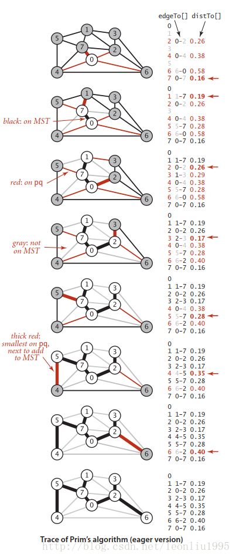

可以大致看下算法的运行过程，首先将 0 加入优先队列，之后将其弹出，插入和 0 相邻的顶点，图中左边显示了 edgeTo[] 和 distTo[]，红色的值代表当前阶段在优先队列中的边，也就是图示中细红色的边。再看第 6 步，原本是 0-4 这条边连接在生成树上的，但是当树生长到 5 节点的时候，发现 5-4 的权重更低，所以就更改了 4 连到树上的边。最后还有一点需要注意，树内的顶点是不能连接的，否则就会**形成环**，所以在生长的过程中不能连接 marked[] 为 true 的节点。

下面是基于自定义结构的 Prim 算法得到最小生成树。

```java
// 结点权重比较器
public static class EdgeComparator implements Comparator<Edge> {
    @Override
    public int compare(Edge o1, Edge o2) {
        return o1.weight - o2.weight;
    }

}
// 使用Prim算法获取最小生成树的边集合
public static Set<Edge> primMST(Graph graph) {
    // 解锁的边进入小根堆
    PriorityQueue<Edge> priorityQueue = new PriorityQueue<>(new EdgeComparator());
    HashSet<Node> set = new HashSet<>();
    // 依次挑选的的边在result里
    Set<Edge> result = new HashSet<>();
    // 随便挑了一个点
    for (Node node : graph.nodes.values()) {
        // node是开始点
        if (!set.contains(node)) {
            // 不在集合的点就加入set
            set.add(node);
            // 将这个点所有相连的边解锁，加入优先级队列
            for (Edge edge : node.edges) {
                priorityQueue.add(edge);
            }

            while (!priorityQueue.isEmpty()) {
                // 弹出解锁的边中，权重最小的边
                Edge edge = priorityQueue.poll();
                // 获取这个边的to结点
                Node toNode = edge.to;
                // 不含有的时候，就是新的点
                if (!set.contains(toNode)) {
                    // 记录已经遍历
                    set.add(toNode);
                    // 含有新的结点的且是权重小的边则加入结果集
                    result.add(edge);
                    // 将to结点的全部边加入优先级队列中
                    for (Edge nextEdge : toNode.edges) {
                        priorityQueue.add(nextEdge);
                    }
                }
            }
        }
        // break;
    }
    return result;
}
```

**使用 Prim 算法获取最小生成树的路径之和。**

```java
// 请保证graph是连通图
// graph[i][j]表示点i到点j的距离，如果是系统最大值代表无路
// 返回值是最小连通图的路径之和
public static int prim(int[][] graph) {
    int size = graph.length;
    int[] distances = new int[size];
    boolean[] visit = new boolean[size];
    visit[0] = true;
    for (int i = 0; i < size; i++) {
        distances[i] = graph[0][i];
    }
    int sum = 0;
    for (int i = 1; i < size; i++) {
        int minPath = Integer.MAX_VALUE;
        int minIndex = -1;
        for (int j = 0; j < size; j++) {
            if (!visit[j] && distances[j] < minPath) {
                minPath = distances[j];
                minIndex = j;
            }
        }
        if (minIndex == -1) {
            return sum;
        }
        visit[minIndex] = true;
        sum += minPath;
        for (int j = 0; j < size; j++) {
            if (!visit[j] && distances[j] > graph[minIndex][j]) {
                distances[j] = graph[minIndex][j];
            }
        }
    }
    return sum;
}
```

##### 5. Kruskal算法

Prim 算法是从**一个顶点开始**不断地生长，Kruskal 算法却不是这样，其基本想法是，**对所有边的权重进行排序，然后从小到大，不断地将最小的边加入优先队列**，这里又用到了优先队列。到最后所有的边连在一起形成一整棵树的时候，算法就可以停止。但是要注意的是，**即使我们得到了一个权重最小的边，也不一定能加入到树中，新加入的边不能让已有的边形成环**，因为生成树肯定是没有环的。

《算法4》中又使用了一种数据结构 **UnionFind**，可以用来**快速查找节点之间是否连通**，本质上还是树，查找的时候从叶结点不断上溯到根节点，以根节点为**连通分量的区分标志**。具体的结构不再详述，感兴趣的可查找其他资料。

Kruskal 算法构造最小生成树的时候也是一条边一条边的构造，**不同的是它寻找的边会连接一片森林中的两棵树**。我们从一片由 V 颗单节点的树构成的森林开始，不断将两棵树合并（用可以找到的最短边）直到只剩下一棵树，这就是最小生成树。

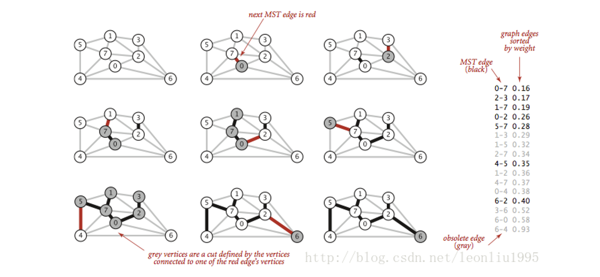

看着上面的图就会发现过程很好理解，**右边是按照权重排序好的边**，黑色的是插入树的边，灰色的是插入时会形成环的，所以没有插入的边，这样的边直接**略过**，最后只要总的**边数达到 V-1** 就行了。

基于自定义数据结构实现的代码如下：基于并查集和优先队列实现。

```java
// Union-Find Set
public static class UnionFind {
    // key 某一个节点， value key节点往上的节点
    private HashMap<Node, Node> fatherMap;
    // key 某一个集合的代表节点, value key所在集合的节点个数
    private HashMap<Node, Integer> sizeMap;

    public UnionFind() {
        fatherMap = new HashMap<Node, Node>();
        sizeMap = new HashMap<Node, Integer>();
    }

    public void makeSets(Collection<Node> nodes) {
        fatherMap.clear();
        sizeMap.clear();
        for (Node node : nodes) {
            fatherMap.put(node, node);
            sizeMap.put(node, 1);
        }
    }

    private Node findFather(Node n) {
        Stack<Node> path = new Stack<>();
        while(n != fatherMap.get(n)) {
            path.add(n);
            n = fatherMap.get(n);
        }
        while(!path.isEmpty()) {
            fatherMap.put(path.pop(), n);
        }
        return n;
    }

    public boolean isSameSet(Node a, Node b) {
        return findFather(a) == findFather(b);
    }

    public void union(Node a, Node b) {
        if (a == null || b == null) {
            return;
        }
        Node aDai = findFather(a);
        Node bDai = findFather(b);
        if (aDai != bDai) {
            int aSetSize = sizeMap.get(aDai);
            int bSetSize = sizeMap.get(bDai);
            if (aSetSize <= bSetSize) {
                fatherMap.put(aDai, bDai);
                sizeMap.put(bDai, aSetSize + bSetSize);
                sizeMap.remove(aDai);
            } else {
                fatherMap.put(bDai, aDai);
                sizeMap.put(aDai, aSetSize + bSetSize);
                sizeMap.remove(bDai);
            }
        }
    }
}

// 权重比较器
public static class EdgeComparator implements Comparator<Edge> {
    @Override
    public int compare(Edge o1, Edge o2) {
        return o1.weight - o2.weight;
    }

}
// K算法生成最小生成树
public static Set<Edge> kruskalMST(Graph graph) {
    // 并查集
    UnionFind unionFind = new UnionFind();
    unionFind.makeSets(graph.nodes.values());
    // 优先级队列
    PriorityQueue<Edge> priorityQueue = new PriorityQueue<>(new EdgeComparator());
    for (Edge edge : graph.edges) { // M 条边
        priorityQueue.add(edge);    // O(logM)
    }
    Set<Edge> result = new HashSet<>();
    while (!priorityQueue.isEmpty()) {    // M 条边
        Edge edge = priorityQueue.poll(); // O(logM)
        if (!unionFind.isSameSet(edge.from, edge.to)) { // O(1)
            result.add(edge);
            unionFind.union(edge.from, edge.to);
        }
    }
    return result;
}
```

面试一般讲讲算法原理就行了。

##### 6. 算法对比

对于时间成本上面介绍的即使 Prim 算法的速度最坏情况下可以达到 **ElogV**，因为它维护的是一个**关于顶点的优先队列**，所以一次最坏速度为 logV，算法进行过程中需要 V 次插入，V 次删除最小值，以及最坏情况下 E 次改变权重，而每次改变权重都需要重新使堆有序，也就是又一次logV，所以总共的最坏速度为ElogV。
对于 Kruskal 算法就要慢一些对于最坏情况下速度为 ElogE，主要是因为它维护了一个所有边的优先队列，那每次对优先队列操作成本为 logV，而最坏情况下需要遍历所有边才能够得到我们需要的 V-1 条，其他的 UnionFound 的操作因为是对顶点进行的，所以乘的是 logV，量级上比较小，所以忽略。

**Kruskal 算法一般还是要比 Prim 算法慢**，因为在处理每条边时除了两种算法都需要完成的优先队列操作之外，Kruskal 算法还需要进行一次 **union**() 操作。

**Kruskal 算法和 Prim 算法==都不能处理有向图==**。


#### 最短路径算法

##### 1. 最短路径树SPT

最短路径：在一幅**加权有向图**中,从顶点 s 到顶点 t 的**最短路径**是所有从 s 到 t 的路径中的**权重最小**者。

重点是**单点最短路径**，**最短路径树(SPT)**包含了顶点 s 到所有可达的顶点的最短路径。

给定一幅加权有向图和一个起点 s，以 s 为起点的**一颗最短路径树**是图的一幅子图。

从一个顶点 s 到其他所有顶点的最短路径的集合其实本质是**一颗树（无环）**。因为如果最短路径中存在环的话，那么从 s 到环中任意一个顶点的距离就不是唯一的，也就不存在最短的定义了。

因此我们**本质是要得到一颗最短路径树**。

1）最短路径的**边**。使用一个父链接数组 edgeTo[]。edgeTo[v] 的**值**为树中连接 v 和它的**父节点**的边（也是从 s 到 v 的最短路径上的最后一条边）

2）到达起点的**距离**。用一个 distTo[] 数组来保存距离。distTo[v] 表示从 s 到 v 的**最短路径的长度**。

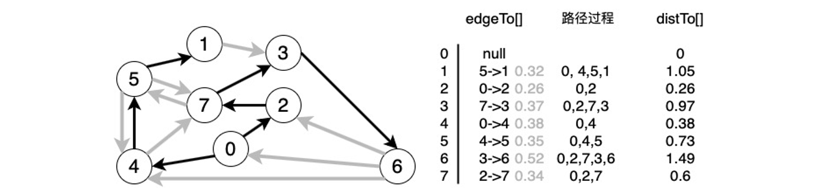

 上图表示的是从 0 出发的**最短路径树**。

##### 2. 最短路径基本原理

对于一幅加权有向图，从**源点**开始到所有顶点的所有最短路径构成了一个**最短路径树**。我们在算法中维护了两个关键的数据结构, **edgeTo[]** 代表在最短路径树中指向每个顶点的边， **distTo[]** 代表从源到某个顶点的“距离”也就是所经过的最短路径边的**权重之和**。

下面介绍一种关键的技术：“**松弛**”，可以参考下图：
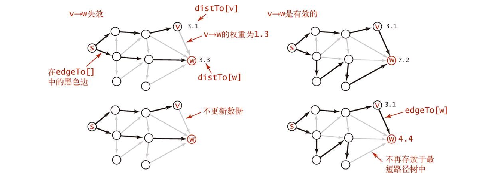

**松弛**就相当于放松一条边时将橡皮筋转移到一条更短的路径上，从而**缓解了橡皮筋的压力**。

所谓**松弛**就是对于一条边 **v->w**，此时 w 到源点的最短路径为 distTo[w]，这个值不管是不是真的，目前来看是最优值，然后现在如果 **distTo[v] + e.weight() > distTo[w]** 那么就证明 v->w 这条边一定不可能在最短路径树里面，那么这条边就**可以不用管**了。等于的话我们没必要管它。
如果相反，**dist[w] > distTo[v] + e.weoght()**, 那么就证明我们**找到了从源点到达 w 顶点的一条更短路径**，那么就可以**更新** edgeTo[w] 和 distTo[w]，以上两种情况分别对应于上图左右两种情况。

**最短路径的最优性条件**：当且仅当对于从 v 到 w 的任意一条边 e，这些值**都满足 **

```java
distTo[w] <= distTo[v]+e.weight()
```

时，他们是最短路径。具体的证明在此处略过，证明它并不难。

##### 3. Dijkstra算法

其实 Dijkstra 算法和 Prim 算法很相似，Prim 算法是在**横切边中找到权重最小的边加入最小生成树**，Dijkstra 算法也可以说是在横切边中找权重最小的边。两个算法也都维护了一个**索引优先队列**，不过一个是**存储边的权值**，一个**存储从源点到该点的路径长度**。 所以两个算法完全可以类比，同时加深理解。
对于 **Dijkstra 索引优先队列** pq 代表**在最小路径树之外的还需要进行放松**（这里用的为 relax() 函数）**的边**，每次从 pq 中删除路径长度最小的顶点，其实**删除就意味着顶点加入最小路径树**，因为它**不参与**之后的比较了。然后将该顶点相连的所有边进行放松，这一步可能会改变某些已经放松过的顶点的路径值，但是这没有关系，首先对于这样的顶点和它相邻的顶点，以前的放松让它满足 

```java
distTo[w] <= distTo[v] + e.weight()
```

这一次的放松只会让 distTo[w] 更小，那么不等式还是满足的。就这样不断 delMin()，**当索引优先队列为空的时候，所有的边都松弛过了，同时是所有顶点都在最小路径树中了**。
下面是代码实现（基于自定义结构）：

```java
public static HashMap<Node, Integer> dijkstra1(Node head) {
    // 从head出发到所有点的最小距离
    // key : 从head出发到达key
    // value : 从head出发到达key的最小距离
    // 如果在表中，没有T的记录，含义是从head出发到T这个点的距离为正无穷
    HashMap<Node, Integer> distanceMap = new HashMap<>();
    distanceMap.put(head, 0);
    // 已经求过距离的节点，存在selectedNodes中，以后再也不碰
    HashSet<Node> selectedNodes = new HashSet<>();
    Node minNode = getMinDistanceAndUnselectedNode(distanceMap, selectedNodes);
    while (minNode != null) {
        int distance = distanceMap.get(minNode);
        for (Edge edge : minNode.edges) {
            Node toNode = edge.to;
            if (!distanceMap.containsKey(toNode)) {
                distanceMap.put(toNode, distance + edge.weight);
            } else {
                distanceMap.put(edge.to, Math.min(distanceMap.get(toNode), distance + edge.weight));
            }
        }
        selectedNodes.add(minNode);
        minNode = getMinDistanceAndUnselectedNode(distanceMap, selectedNodes);
    }
    return distanceMap;
}

public static Node getMinDistanceAndUnselectedNode(HashMap<Node, Integer> distanceMap, HashSet<Node> touchedNodes) {
    Node minNode = null;
    int minDistance = Integer.MAX_VALUE;
    for (Entry<Node, Integer> entry : distanceMap.entrySet()) {
        Node node = entry.getKey();
        int distance = entry.getValue();
        if (!touchedNodes.contains(node) && distance < minDistance) {
            minNode = node;
            minDistance = distance;
        }
    }
    return minNode;
}
```

基于自定义结构的另一种实现方式。

```java
// 改进后的dijkstra算法
// 从head出发，所有head能到达的节点，生成到达每个节点的最小路径记录并返回
public static HashMap<Node, Integer> dijkstra2(Node head, int size) {
    NodeHeap nodeHeap = new NodeHeap(size);
    nodeHeap.addOrUpdateOrIgnore(head, 0);
    HashMap<Node, Integer> result = new HashMap<>();
    while (!nodeHeap.isEmpty()) {
        NodeRecord record = nodeHeap.pop();
        Node cur = record.node;
        int distance = record.distance;
        for (Edge edge : cur.edges) {
            nodeHeap.addOrUpdateOrIgnore(edge.to, edge.weight + distance);
        }
        result.put(cur, distance);
    }
    return result;
}

public static class NodeHeap {
    private Node[] nodes; // 实际的堆结构
    // key 某一个node， value 上面数组中的位置
    private HashMap<Node, Integer> heapIndexMap;
    // key 某一个节点， value 从源节点出发到该节点的目前最小距离
    private HashMap<Node, Integer> distanceMap;
    private int size; // 堆上有多少个点

    public NodeHeap(int size) {
        nodes = new Node[size];
        heapIndexMap = new HashMap<>();
        distanceMap = new HashMap<>();
        size = 0;
    }

    public boolean isEmpty() {
        return size == 0;
    }

    // 有一个点叫node，现在发现了一个从源节点出发到达node的距离为distance
    // 判断要不要更新，如果需要的话，就更新
    public void addOrUpdateOrIgnore(Node node, int distance) {
        if (inHeap(node)) {
            distanceMap.put(node, Math.min(distanceMap.get(node), distance));
            insertHeapify(node, heapIndexMap.get(node));
        }
        if (!isEntered(node)) {
            nodes[size] = node;
            heapIndexMap.put(node, size);
            distanceMap.put(node, distance);
            insertHeapify(node, size++);
        }
    }

    public NodeRecord pop() {
        NodeRecord nodeRecord = new NodeRecord(nodes[0], distanceMap.get(nodes[0]));
        swap(0, size - 1);
        heapIndexMap.put(nodes[size - 1], -1);
        distanceMap.remove(nodes[size - 1]);
        // free C++同学还要把原本堆顶节点析构，对java同学不必
        nodes[size - 1] = null;
        heapify(0, --size);
        return nodeRecord;
    }

    private void insertHeapify(Node node, int index) {
        while (distanceMap.get(nodes[index]) < distanceMap.get(nodes[(index - 1) / 2])) {
            swap(index, (index - 1) / 2);
            index = (index - 1) / 2;
        }
    }

    private void heapify(int index, int size) {
        int left = index * 2 + 1;
        while (left < size) {
            int smallest = left + 1 < size && distanceMap.get(nodes[left + 1]) < distanceMap.get(nodes[left])
                ? left + 1
                : left;
            smallest = distanceMap.get(nodes[smallest]) < distanceMap.get(nodes[index]) ? smallest : index;
            if (smallest == index) {
                break;
            }
            swap(smallest, index);
            index = smallest;
            left = index * 2 + 1;
        }
    }

    private boolean isEntered(Node node) {
        return heapIndexMap.containsKey(node);
    }

    private boolean inHeap(Node node) {
        return isEntered(node) && heapIndexMap.get(node) != -1;
    }

    private void swap(int index1, int index2) {
        heapIndexMap.put(nodes[index1], index2);
        heapIndexMap.put(nodes[index2], index1);
        Node tmp = nodes[index1];
        nodes[index1] = nodes[index2];
        nodes[index2] = tmp;
    }
}

public static class NodeRecord {
    public Node node;
    public int distance;

    public NodeRecord(Node node, int distance) {
        this.node = node;
        this.distance = distance;
    }
}
```

可以看到代码都和 Prim 很像，时间成本也是相同的都是 ElogV。

Prim 算法和 Dijkstra 算法都会用**添加边**的方式构造一棵树：**Prim 算法每次添加的都是==离树最近的非树顶点==，Dijkstra 算法每次添加的都是==离起点最近的非树顶点==。**

**Dijkstra 算法能够解决==边权重非负==的==加权有向图==的==单起点最短路径==问题。**

但是 Dijkstra 算法**默认边的权重非负**，对于**有负权重**的边，他是**不能**给出合理的最短路径的，这时候就要用上另一个算法 Bellman-Ford 算法。

##### 4. 无环加权有向图中的最短路径算法

###### (1) 最短路径

如果加权有向图是**无环**的，那么可以使用一种比 Dijkstra 算法更快的算法来找最短路径。

无环加权有向图的算法的核心在于**依照有向图的拓扑排序来松弛每条边**。而拓扑排序又保证了每条边只会被放松一次，因此这是一种最优的最短路径搜索方法。

算法思想：

**首先将 distTo[s] 初始化为 0，其他的 distTo[] 元素初始化为无穷大，然后一个一个按照==拓扑顺序==放松所有顶点。**

**按照==拓扑顺序放松顶点==，就能在与 E+V 成正比的时间内解决无环加权有向图的单点最短路径问题。**

无环加权有向图的最短路径算法如下。

```java
// 无环加权有向图的最短路径算法
public class AcyclicSP{
    private double[] distTo;
    private DirectedEdge[] edgeTo;

    public AcyclicSP(EdgeWeightedDigraph G, int s){
        distTo = new double[G.V()];
        edgeTo = new DirectedEdge[G.V()];
        for(int v =0 ;v<G.V(); v++)
            distTo[v] = Double.POSITIVE_INFINITY;

        distTo[s] = 0.0;
        // 实现拓扑排序
        Topological top = new Topological(G); 
        for(int v:top.order())
            relax(G, v);
    }

    // 放松顶点
    public void relax(EdgeWeightedDigraph G, int v){
        for(DirectedEdge e: G.adj(v))
        {
            int w = e.to();
            if(distTo[w] > distTo[v] + e.weight())
            {
                distTo[w] = distTo[v] + e.weight();
                edgeTo[w] = e;
            }
        }
    }
    
    public double hasPathTo(int v)
        
    public boolean distTo(int v)
        
    public Iterable<DirecedEdge> pathTo(int v)   
}
```

在**已知加权图是无环**的情况下，这是找出最短路径的**最好的方法**。

###### (2) 最长路径

**任务调度问题**的**关键路径**方法可将问题规约为寻找无环加权有向图的**最长路径问题**。

相对最后期限限制下的并行任务调度问题是一个加权有向图中的**最短路径问题**（可能存在环和负权重边）。

##### 5.  Bellman-Ford算法

###### (1) 理解负权重

负权重的出现其实不只体现在数学上，在实际应用中其实非常实用。以任务调度为例。

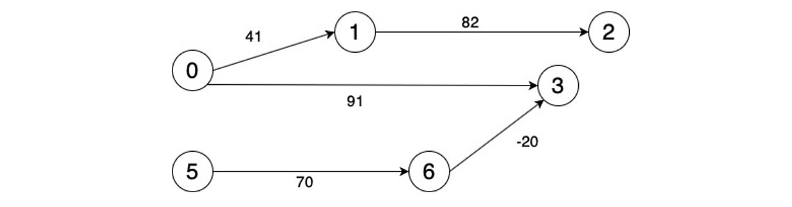

以上图为例。边的权重指的是任务需要的**时间**。例如任务 0 需要 41 个时间单位才能完成，任务 0 完成后才能开始任务 1，任务 1 需要 82 个时间单位，然后才能开始任务 2...

而 6 指向 3 的路径权重为 -20，这是指 6 号任务需要在 3 号任务开始后的 20 个时间单位内开始，或者说 3 号任务不能早于 6 号任务的 20 个时间单位。

###### (2) Bellman-Ford算法

Bellman-Ford算法：**在任意含有 V 个顶点的加权有向图中给定起点 s，从 s 无法到达任何负权重环，然后将 distTo[s] 初始化为 0，其他初始化为无穷大，以==任意顺序==放松所有边，重复 V 轮**。

这种算法**比较慢**，所需**时间与 EV** 成正比，**空间与 V** 成正比，实际中很浪费。因为每一轮算法都会**放松** E 条边，重复 V 轮。

还有一个重要的问题是如果存在负权重环（就是环的所有边的权重加起来为负），那么经过该环的所有顶点的最短路径都是无意义的，所以算法还需要能够**检测负权重环**，不过这里的算法和检测无环图部分的思想是一样的，这里就不再赘述。
代码如下

```java
public class BellmanFordSP {
    private double[] distTo;
    private DirectedEdge[] edgeTo;
    private boolean[] onQ;
    private Queue<Integer> queue;
    private int cost;
    private Iterable<DirectedEdge> cycle;

    public BellmanFordSP(EdgeWeightedDigraph G, int s){
        distTo = new double[G.V()];
        edgeTo = new DirectedEdge[G.V()];
        onQ = new boolean[G.V()];
        queue = new Queue<Integer>();
        for (int v=0;v<G.V();v++)
            distTo[v] = Double.POSITIVE_INFINITY;
        distTo[s] = 0.0;

        queue.enqueue(s);
        onQ[s] = true;
        while(!queue.isEmpty() && !hasNegativeCycle()){
            int v = queue.dequeue();
            onQ [v] =false;
            relax(G, v);
        }

    }

    private void relax(EdgeWeightedDigraph G, int v){
        for (DirectedEdge e:G.adj(v)){
            int w = e.to();
            if(distTo[w] > distTo[v]+e.weight()){
                distTo[w] = distTo[v]+e.weight();
                edgeTo[w] = e;
                if(!onQ[w]){
                    queue.enqueue(w);
                    onQ[w] = true;
                }
            }
            if(cost++ % G.V() ==0){
                findNegativeCycle();
                if (hasNegativeCycle()) return ;
            }
        }
    }

    public double distTo(int v){
        return distTo[v];
    }
    public boolean hasPathTo(int v){
        return distTo[v]<Double.POSITIVE_INFINITY;
    }

    public Iterable<DirectedEdge> pathTo(int v){
        if (!hasPathTo(v)) return null;
        Stack<DirectedEdge> path =new  Stack<DirectedEdge>();
        for (DirectedEdge edge = edgeTo[v];edge !=null;edge  =edgeTo[edge.from()])
            path.push(edge);
        return path;

    }

    private  void findNegativeCycle(){
        int V = edgeTo.length;
        EdgeWeightedDigraph spt=new EdgeWeightedDigraph(V);
        for (int v = 0;v<V; v++)
            if (edgeTo[v] !=null)
                spt.addEdge(edgeTo[v]);
        EdgeWeightedDirectedCycle finderCycle = new EdgeWeightedDirectedCycle(spt);
        cycle =finderCycle.cycle(); 
    }

    public boolean hasNegativeCycle(){
        return cycle != null;
    }

    public Iterable<DirectedEdge> nagativeCycle(){
        return cycle;
    }

}
```

上面的代码是**基于队列**的，从其中关键的循环部分

```java
while(!queue.isEmpty() && !hasNegativeCycle())
```

 可以看出，首先要**一直运行到队列为空**，队列什么时候会有顶点入队？当有顶点的 distTo[] 值被改变的时候，所以当算法运行结束的时候，**所有顶点的路径长都已经是最小值**，不能再改了。另一种情况是，我们的算法运行了 **V 轮**之后，如果**有负权重环**的话，**队列一定是非空**的，所以我们**每隔 V 轮检测一下是不是遇到了负权重环，如果遇到了就退出**。

可以看出 Bellman-Ford 其实和 Dijstra 也有一些相似之处。

下面的代码就是在加权有向图中检测环的代码

```java
public class EdgeWeightedDirectedCycle {
    private boolean[] marked;
    private DirectedEdge[] edgeTo;
    private boolean[] onStack;
    private Stack<DirectedEdge> cycle;

    public EdgeWeightedDirectedCycle(EdgeWeightedDigraph G){
        marked = new boolean[G.V()];
        onStack = new boolean[G.V()];
        edgeTo = new DirectedEdge[G.V()];
        for (int v = 0;v<G.V();v++)
            if (!marked[v]) dfs(G, v);
    }

    private void dfs(EdgeWeightedDigraph G, int v){
        onStack[v] = true;
        marked[v] = true;
        for (DirectedEdge e:G.adj(v)){
            int w = e.to();
            if(cycle !=null) return ;

            else if(!marked[w]){
                edgeTo[w] = e;
                dfs(G, w);
            }
            else if(onStack[w]){
                cycle = new Stack<DirectedEdge>();
                DirectedEdge f = e;
                while(f.from() !=w){
                    cycle.push(f);
                    f = edgeTo[f.from()];
                }
                cycle.push(f);
                return ;
            }
        }
        onStack[v] =false;
    }

    public boolean hasCycle(){
        return cycle!= null;
    }

    public Iterable<DirectedEdge> cycle(){
        return cycle;
    }

}

```

综上，**基于队列**的 Bellman-Ford 算法要比原始版快得多基本是  O(V+E) 的，但是最坏情况也有O(VE)，可是它的适用范围要大得多，**可以存在负权重环，还可以检测出负权重环**。

**套汇问题**等价于加权有向图中的负权重环的检测问题。

##### 6. 最短路径算法总结

|           算法            |            局限            | 一般情况 | 最坏情况 | 所需空间 |             优势             |
| :-----------------------: | :------------------------: | :------: | :------: | :------: | :--------------------------: |
| Dijkstra 算法（即时版本） |      边的权重必须为正      |  ElogV   |  ElogV   |    V     |    最坏情况下性能依然可以    |
|         拓扑排序          | **只适用于无环加权有向图** |  E + V   |  E + V   |    V     | 是**无环图**中的**最优**算法 |
|     Bellman-Ford 算法     |      不能存在负权重环      |  E + V   |    EV    |    V     |         适用领域广泛         |


#### **参考资料**

- https://www.cnblogs.com/mcomco/p/10298021.html
- https://blog.csdn.net/leonliu1995/article/details/78509599
- https://blog.csdn.net/leonliu1995/article/details/78634015
- https://blog.csdn.net/leonliu1995/article/details/78701997