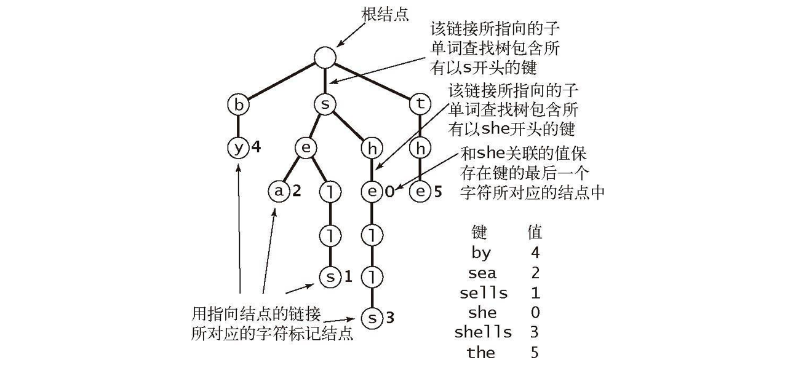
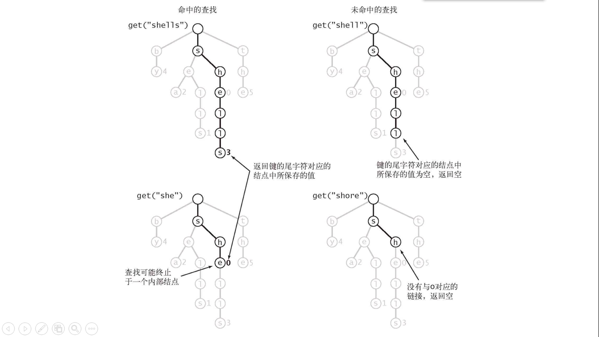
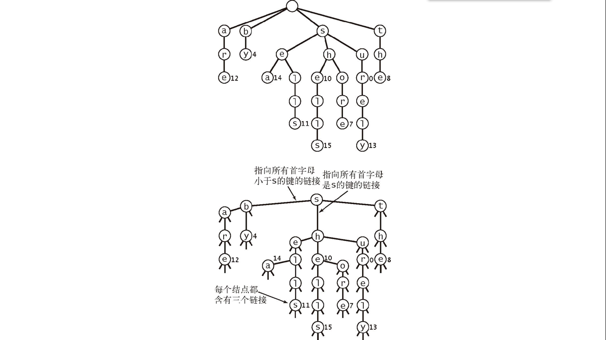
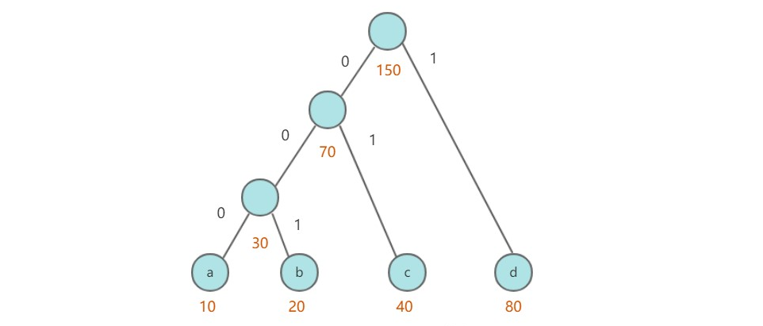
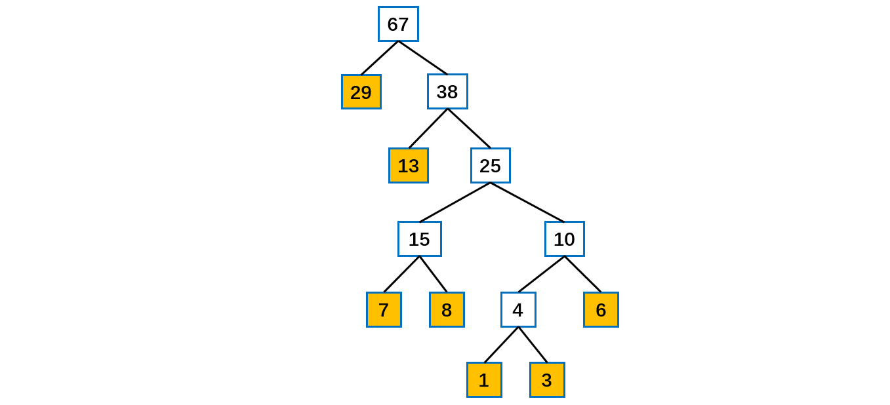

### 字符串算法

#### 字符串排序

假定给定一个字符串数组，要求将该字符串数组排序。

规定字符串中的字符全集**基数为 R**，即字符串中的每个字符都是**字母表**中某一个字符，其索引为 [0, R)。

##### 1. 键索引计数法

适用性：用于**小整数键**的算法。

假定给定的字符串数组为**单个字符数组**，假定基数 256 即每个字符在字母表中的索引在 0-255 之间，类似于计数排序思想，使用 count 数组来统计字母表中**每个字符出现的次数**，将每个字符出现的**次数进行加和**，得到每个字符在字符总数中的索引，然后遍历待排序字符数组，找到每个字符所在的起始索引，将字符数组写入到 **aux** 临时数组中，然后将 aux 数组回写到 a 中，完成排序。

```java
private static int R = 256; // 基数
// 键索引计数法
// 排序小整数键
// 假定待排序的字符串键值为0-R-1中的任意整数，每个字符串对应一个整数，现在按照字符串的键值来排序
// 类似于计数排序
public static void keyIndexCount(char[] a) {
    // 计数数组
    int[] count = new int[R + 1];
    int N = a.length;
    char[] aux = new char[N];
    // count[0]=0  计算每个索引处字符串的个数
    for (int i = 0; i < N; i++) {
        count[a[i] + 1]++;
    }
    // 计算索引为r的字符串在全部数据中起始位置
    for (int r = 1; r < R + 1; r++) {
        count[r] = count[r - 1] + count[r];
    }
    // 将字符串防止到aux合适位置中
    for (int i = 0; i < N; i++) {
        aux[count[a[i]]++] = a[i];
    }
    // 将aux回写到a中 完成排序
    for (int i = 0; i < N; i++) {
        a[i] = aux[i];
    }
}

public static void main(String[] args) {
    char[] nums = {2, 3, 4, 1, 2, 4, 3, 1, 2, 2, 1};
    keyIndexCount(nums);
}
```

##### 2. 低位优先LSD

适用于**长度相同**的**字符串数组**进行排序。

**从右往左**依次进行比较，假定字符串长度为 W，则从右往左进行 **W 次键索引计数排序**，最终得到有序的字符串数组。

```java
// 低位优先排序方式  从右往左开始依次利用键索引计数法来进行排序
// 适用于所有字符串长度相等
public static void lsd(String[] ss) {
    int W = ss[0].length();
    int N = ss.length;
    String[] aux = new String[N];
    System.out.println("origin = " + Arrays.toString(ss));
    for (int i = W - 1; i >= 0; i--) {
        int[] count = new int[R + 1];
        for (int j = 0; j < N; j++) {
            count[ss[j].charAt(i) + 1]++;
        }
        for (int r = 1; r < R + 1; r++) {
            count[r] = count[r - 1] + count[r];
        }
        for (int j = 0; j < N; j++) {
            aux[count[ss[j].charAt(i)]++] = ss[j];
        }
        for (int j = 0; j < N; j++) {
            ss[j] = aux[j];
        }
        System.out.println("i = " + i + " " + Arrays.toString(ss));
    }
}
```

##### 3. 高位优先MSD

高位优先提供对于**变长字符串数组**进行排序，**从左往右**进行比较，对于**第一位首先使用键索引计数排序**，将字符串数组按照第一位有序排列，由于第一位是有序的，因此按照第一位是否相同，可以划分为**多个小数组**，每个小数组第一位都是相同的，因此**递归**对于下一位进行排序，直到所有小数组都已有序。

由于字符串是**变长**的，长度不一，构造一个函数 **charAt**(s, d) 返回字符串 s 中索引 d 所在的索引位置，如果 d 大于字符串长度，则返回 -1，将该值加一作为 count 数组索引，即此时 count 数组应该分配 R+2 个空间。

对于每一次递归调用都需要分配 int[R+2]，当**小数组较多时，会占用大量的空间**，因此当**数字较小时，不要再递归排序**，而是改为插入排序，由于前 d 位此时已经相等，因此从字符串数组每个字符串的 d 位开始进行插入排序，比较规则使用 String 默认 compareTo 方法。

对于第 d 位键索引排序完毕后，按照第 d+1 位，此时会按照基数 R 来产生小数组递归调用，易得会产生**大量的空数组**；

**当字符串数组相同或者有大量相同前缀时，此时递归深度与字符串长度相同，效率低下。**

```java
// 高位优先  通用型排序
// 大量小数组
// 等值键   递归深度与键长度相同  效率低
// 额外空间
public static void msd(String[] ss) {
    int N = ss.length;
    aux = new String[N];
    sort(ss, 0, N - 1, 0);
}

// 对于字符串数组从索引lo-hi利用字符串的第d位字符键值索引来排序
private static void sort(String[] ss, int lo, int hi, int d) {
    // 如果是小数组则执行插入排序
    if (hi <= lo + M) {
        insertSort(ss, lo, hi, d);
        return;
    }
    // 利用第d位字符键索引排序
    // 由于每次递归调用都需要新建new int[R+2]，因此当切割成大量小数组时，耗费空间太大
    // 当字符串数组完全相同或者前缀相同太多时，该算法效率下降
    int[] count = new int[R + 2];
    for (int i = lo; i <= hi; i++) {
        System.out.println(charAt(ss[i], d));
        count[charAt(ss[i], d) + 2]++;
    }
    for (int r = 1; r < R + 2; r++) {
        count[r] = count[r - 1] + count[r];
    }
    for (int i = lo; i <= hi; i++) {
        aux[count[charAt(ss[i], d) + 1]++] = ss[i];
    }
    for (int i = lo; i <= hi; i++) {
        ss[i] = aux[i - lo];
    }
    // 对于第d+1位，根据分成的子数组进行递归排序
    // 这里会切分产生大量空数组
    for (int i = 0; i < R; i++) {
        sort(ss, lo + count[i], lo + count[i + 1] - 1, d + 1);
    }
}

// 对于字符串数组从第d位开始插入排序
private static void insertSort(String[] ss, int lo, int hi, int d) {
    for (int i = lo; i <= hi; i++) {
        for (int j = i; j > lo && less(ss[j], ss[j - 1], d); j--) {
            exch(ss, j, j - 1);
        }
    }
}

private static void exch(String[] ss, int j, int i) {
    String s = ss[i];
    ss[i] = ss[j];
    ss[j] = s;
}

private static boolean less(String s1, String s2, int d) {
    return s1.substring(d).compareTo(s2.substring(d)) < 0;
}

// 获取字符串s中第d位的索引，如果不存在则返回-1，然后将该值+1得到>=0值作为该字符在count数组中的索引
private static int charAt(String s, int d) {
    if (d < s.length())
        return s.charAt(d);
    return -1;
}
```

##### 4. 三向字符串快速排序

由于 MSD 每次都会切换产生 R 个小数组，**大量为空数组**，切分效率不高，因此进行**改进**，使用三向字符串快速排序，即对于第 d 位比较，以第 d 位 v 作为**基准**，首先将字符串数组进行交换调整，分为三部分 **小于v，等于v，大于v**，即每次产生 **3 向切分**。

```java
// 三向字符串快速排序
public static void quick3String(String[] ss) {
    quick3Sort(ss, 0, ss.length - 1, 0);
}

private static void quick3Sort(String[] ss, int lo, int hi, int d) {
    if (hi <= lo) return;
    int lt = lo;
    int gt = hi;
    int i = lo + 1;
    // 以ss[lo]第d字符作为基准，将ss[lo,hi]进行交换调整，使得对于d位字符有ss[lo,lt-1]<v  ss[lt,gt]=v  ss[gt+1t,hi]>v
    int v = charAt(ss[lo], d);
    // System.out.println(lo + " " + hi);
    while (i <= gt) {
        int t = charAt(ss[i], d);
        if (t < v) exch(ss, lt++, i++);
        else if (t > v) exch(ss, i, gt--);
        else i++;
    }
    // 对于小于v部分递归排序
    quick3Sort(ss, lo, lt - 1, d);
    // 对于等于v部分 由于第d位已经相等，从d+1位开始排序
    if (v >= 0)
        quick3Sort(ss, lt, gt, d + 1);
    // 对于大于v部分递归排序
    quick3Sort(ss, gt + 1, hi, d);
}
```


#### 单词查找树

##### 1. 概述

在进行**文法分析**的时候，通常需要检测一个单词**是否在我们的单词列表**里。为了提高查找和定位的速度，通常都要画出与单词列表所对应的单词查找树，其特点如下：

- **根节点不包含字母**，除根节点外每一个节点都仅包含一个英文字母；
- 从根节点到某一节点，路径上经过的字母依次连起来所构成的字母序列，称为该节点对应的**单词**。单词列表中的每个词，都是该单词查找树某个节点所对应的单词；
- 在满足上述条件下，该单词查找树的节点数最少。

单词**列表**对应的单词查找树。



单词查找树的查找



值为**空**的结点表示符号表中**没有对应的键**。

##### 2. 单词查找树的性质

- 单词查找树中查找一个键或者插入一个键时，访问数组的次数最多为键的长度加 1。

- 查找未命中的成本与键的**长度无关**。
- 一颗单子查找树中的**链接总数**在 RN 到 RNw 之间，其中 w 为键的平均长度。R 为字母表字母个数。

##### 3. 三向单词查找树

三向单词查找树（TST）中每个结点都包含一个字符、三条链接和一个值。这**三条链接**分别对应着当前字母**小于、等于、大于**结点字母的所有键。跟二叉查找树类似。

如下图所示。



性质：

- 所需空间远小于一般单词查找树。

- 由 N 个平均长度为 w 的字符串构造的三向单词查找树中的链接总数在 **3N 到 3Nw** 之间。

- 适用于**非随机**的键。


#### KMP算法

谈到字符串问题，不得不提的就是 KMP 算法，它是用来解决字符串**查找**的问题，可以在**一个字符串（S）中查找一个子串（W）出现的位置**。KMP 算法把字符匹配的**时间复杂度缩小到 O(m+n)** ,而**空间复杂度也只有 O(m)**。因为“暴力搜索”的方法会**反复回溯主串**，导致效率低下，而 KMP 算法可以利用已经部分匹配这个有效信息，保持主串上的指针不回溯，通过修改子串的指针，让模式串尽量地移动到有效的位置。

KMP 是一个解决模式串在**文本串是否出现过**，如果出现过，最早出现的位置的经典算法。就是寻找**子串**。

Knuth-Morris-Pratt 字符串查找算法，简称为 “KMP算法”，常用于在一个文本串 S 内查找一个模式串 P 的出现位置。
KMP 方法算法就利用之前判断过信息，通过一个 **next** 数组，保存模式串中前后**最长公共子序列**的长度，每次**回溯**时，通过  **next 数组找到前面匹配过的位置**，省去了大量的计算时间。

```java
/**
 * 找到match子串在origin中的下标
 * @param origin 最长字符串
 * @param match 待寻找的子串
 * @return 子串位置 没有返回-1
 */
public static int getIndexOf(String origin, String match) {
    // Base case
    if (origin == null || match == null || match.length() < 1 || origin.length() < match.length()) {
        return -1;
    }
    // 由字符串获取char数组
    char[] originStr = origin.toCharArray();
    char[] matchStr = match.toCharArray();
    // 两个字符串的比对位置
    int originIndex = 0;
    int matchIndex = 0;
    // 找到待匹配子串的最长前缀数组
    int[] nextArr = getNextArray(matchStr); 	// O (M)
    // O(N)
    // 循环保证不能越界
    while (originIndex < originStr.length && matchIndex < matchStr.length) {
        // 如果两个比对位置相等
        if (originStr[originIndex] == matchStr[matchIndex]) {
            // 比对指针同时后移
            originIndex++;
            matchIndex++;
            // 说明比对子串已经到了第一个位置（人为规定第一个字符的最长前缀为-1）
        } else if (nextArr[matchIndex] == -1) { // str2中比对的位置已经无法往前跳了
            // 原始字符串对比指针往下移动一个
            originIndex++;
            // 表示原始字符串的对比位置不动 match串的对比位置往前跳
        } else {
            // 跳的位置为最长前缀数组的大小值
            matchIndex = nextArr[matchIndex];
        }
    }
    // i1 越界  或者  i2越界了
    return matchIndex == matchStr.length ? originIndex - matchIndex : -1;
}

/**
 * 得到待匹配match子串的最长前缀数组
 *
 * @param ms 待匹配子串字符数组
 * @return 最长前缀数组
 */
public static int[] getNextArray(char[] ms) {
    // 仅一个则返回-1
    if (ms.length == 1) {
        return new int[] { -1 };
    }
    int[] next = new int[ms.length];
    // 人为定义第一个为-1
    next[0] = -1;
    //  人为定义第二个为0
    next[1] = 0;
    int index = 2; // next数组的位置
    // cn指拿哪个位置的字符和i-1的字符比 初始时为0
    int cn = 0;
    while (index < next.length) {
        // 如果对的上说明比前一个多一个
        if (ms[index - 1] == ms[cn]) {
            // index++准备求下一个位置信息
            next[index++] = ++cn;
            // cn往前跳
        } else if (cn > 0) { // 当前跳到cn位置的字符，和i-1位置的字符配不上
            cn = next[cn];
        } else {
            // 表示cn没法往前跳了，这个位置的最长前缀为0
            next[index++] = 0;
        }
    }
    return next;
}

public static void main(String[] args) {
    String str = "abcabcababaccc";
    String match = "cc";
    System.out.println(getIndexOf(str, match));
}
```

具体算法细节请参考：

- **字符串匹配的KMP算法:** http://www.ruanyifeng.com/blog/2013/05/Knuth%E2%80%93Morris%E2%80%93Pratt_algorithm.html
- **从头到尾彻底理解KMP:** https://blog.csdn.net/v_july_v/article/details/7041827
- **如何更好的理解和掌握 KMP 算法?:** https://www.zhihu.com/question/21923021
- **KMP 算法详细解析:**  https://blog.sengxian.com/algorithms/kmp
- **图解 KMP 算法:** http://blog.jobbole.com/76611/
- **汪都能听懂的KMP字符串匹配算法【双语字幕】:** https://www.bilibili.com/video/av3246487/?from=search&seid=17173603269940723925
- **KMP字符串匹配算法1:** https://www.bilibili.com/video/av11866460?from=search&seid=12730654434238709250


#### 赫夫曼编码

##### 1. 概述

赫夫曼编码也翻译为哈夫曼编码(Huffman Coding)，又称霍夫曼编码，是一种**编码方式**, 属于一种程序算法。赫夫曼编码是赫哈夫曼树在电讯**通信**中的经典的应用之一。赫夫曼编码广泛地用于**数据文件压缩**，可以进行字符串压缩，也可以进行文件压缩。其压缩率通常在 20%～90% 之间。赫夫曼码是**可变字长编码**(VLC)的一种。Huffman于1952年提出一种编码方法，称之为最佳编码。

##### 2. 编码原理

根据**数据**出现的**频率**对数据进行**编码**，从而**压缩原始数据**。

例如对于一个文本文件，其中各种**字符**出现的次数如下：

- a : 10
- b : 20
- c : 40
- d : 80

可以将每种字符转换成**二进制编码**，例如将 a 转换为 00，b 转换为 01，c 转换为 10，d 转换为 11。这是最简单的一种编码方式，没有考虑各个字符的**权值**（出现频率）。而哈夫曼编码采用了**贪心策略**，使**==出现频率最高的字符的编码最短==**，从而保证整体的编码长度最短。

如下的字符串共 40 个字符(包括空格)  

```
i like like like java do you like a java  
```

对应的 ASCII 码

```java
105 32 108 105 107 101 32 108 105 107 101 32 108 105 107 101 32 106 97 118 97 32 100 111 32 121 111 117 32 108 105 107 101 32 97 32 106 97 118 97
```

对应的二进制

```java
01101001 00100000 01101100 01101001 01101011 01100101 00100000 01101100 01101001 01101011 01100101 00100000 01101100 01101001 01101011 01100101 00100000 01101010 01100001 01110110 01100001 00100000 01100100 01101111 00100000 01111001 01101111 01110101 00100000 01101100 01101001 01101011 01100101 00100000 01100001 00100000 01101010 01100001 01110110 01100001 
```

按照二进制来传递信息，总的长度是  **359**   (包括空格)。还有一种变长编码。

对于赫夫曼编码方式，统计各个字符出现的次数如下：

```java
d:1 y:1 u:1 j:2  v:2  o:2  l:4  k:4  e:4 i:5  a:5  (空格):9  // 各个字符对应的个数
```

按照上面字符出现的次数构建一颗赫夫曼树, **次数作为==权值==**。构造步骤如上述的赫夫曼树构造步骤。

根据赫夫曼树，给各个字符编码，规定编码**向左的路径为 0，向右的路径为 1**，得到的**路径编码**如下：

```java
o: 1000   u: 10010  d: 100110  y: 100111  i: 101
a: 110    k: 1110   e: 1111    j: 0000    v: 0001
l: 001    (空格): 01
```

这是一个**前缀编码**，即每个编码都**不会是另一个编码的前缀**。

按照上面的赫夫曼编码，上述字符串对应的编码如下：

```java
1010100110111101111010011011110111101001101111011110100001100001110011001111000011001111000100100100110111101111011100100001100001110
```

长度变为 **133**。原来长度是  359 , 压缩了  (359 - 133) / 359 = 62.9%

此编码满足前缀编码, 即字符的编码都不能是其他字符编码的前缀。**不会造成匹配的多义性**。赫夫曼编码是**无损压缩**。

注意，赫夫曼树根据排序方法不同，也可能不太一样，**这样对应的赫夫曼编码也不完全一样**，但是 WPL 是一样的，都是最小的。比如有多个字符出现权值相同的情况，这时候如何处理这里权值相同的字符的排列方式就会产生形状不同的霍夫曼树，此时产生的编码可能不一样，但是其长度应该是一样的。

##### 3. 霍夫曼树

###### (1) 概述

给定 n 个权值作为 n 个叶子结点，构造一棵二叉树，若该树的**带权路径长度( wpl)** 达到最小，称这样的二叉树为**最优二叉树**。

==赫夫曼树是**带权路径长度最短**的树，权值**较大**的结点**离根较近**。==

路径和路径长度：在一棵树中，从一个结点往下可以达到的孩子或孙子结点之间的通路，称为路径。通路中分支的数目称为路径长度。若规定根结点的层数为 1，则从根结点到第L层结点的路径长度为 L - 1。

**结点的权及带权路径长度：若将树中结点赋给一个有着某种含义的数值，则这个数值称为该结点的权。**结点的**带权路径长度**为：从根结点到该结点之间的路径长度与该结点的权的乘积。

**树的带权路径长度：**树的带权路径长度规定为所有==**叶子结点**==的带权路径长度**之和**，记为 **WPL**(Weighted
Path Length) , **权值越大的结点离根结点越近**的二叉树才是最优二叉树。

WPL 最小的二叉树就是**赫夫曼树**。

###### (2) 代码实现

首先**生成**一颗哈夫曼树，每次生成过程中选取**频率最少的两个节点**，生成一个新节点作为它们的**父节点**，并且新节点的**频率为两个节点的和**。选取频率最少的原因是，生成过程使得先选取的节点位于树的**更低层**，那么需要的编码长度更长，频率更少可以使得总编码长度更少。

生成编码时，从根节点出发，向**左遍历则添加二进制位 0**，向**右则添加二进制位 1**，直到遍历到**叶子节点**，**叶子节点代表的字符的编码就是这个路径编码。**



```java
public class Huffman {

    private class Node implements Comparable<Node> {
        char ch;
        int freq;
        boolean isLeaf;
        Node left, right;

        public Node(char ch, int freq) {
            this.ch = ch;
            this.freq = freq;
            isLeaf = true;
        }

        public Node(Node left, Node right, int freq) {
            this.left = left;
            this.right = right;
            this.freq = freq;
            isLeaf = false;
        }

        @Override
        public int compareTo(Node o) {
            return this.freq - o.freq;
        }
    }
	// 编码
    public Map<Character, String> encode(Map<Character, Integer> frequencyForChar) {
        // 优先级队列
        PriorityQueue<Node> priorityQueue = new PriorityQueue<>();
        for (Character c : frequencyForChar.keySet()) {
            priorityQueue.add(new Node(c, frequencyForChar.get(c)));
        }
        while (priorityQueue.size() != 1) {
            Node node1 = priorityQueue.poll();
            Node node2 = priorityQueue.poll();
            priorityQueue.add(new Node(node1, node2, node1.freq + node2.freq));
        }
        return encode(priorityQueue.poll());
    }

    private Map<Character, String> encode(Node root) {
        Map<Character, String> encodingForChar = new HashMap<>();
        encode(root, "", encodingForChar);
        return encodingForChar;
    }

    private void encode(Node node, String encoding, Map<Character, String> encodingForChar) {
        if (node.isLeaf) {
            encodingForChar.put(node.ch, encoding);
            return;
        }
        encode(node.left, encoding + '0', encodingForChar);
        encode(node.right, encoding + '1', encodingForChar);
    }
}
```

##### 4. 数组构造霍夫曼树

**给定一个数组，要求转为一棵赫夫曼树**。

给定数组如下，先排序得到**有序**数组。数组值代表**权值**。

```java
{13, 7, 8, 3, 29, 6, 1}
{1, 3, 6, 7, 8, 13, 29}
```

构成赫夫曼树的步骤：

- 从小到大进行排序, 将每一个数据，每个数据都是一个**节点** ， 每个节点可以看成是一颗最简单的二叉树。
- 取出根节点**权值最小**的**两颗**二叉树。
- 组成一颗**新的二叉树**, 该新的二叉树的根节点的**权值**是前面两颗二叉树根节点**权值的和** 。
- 再将这颗新的二叉树，以**根节点的权值大小再次排序**， 不断重复  1-2-3-4 的步骤，直到数列中，所有的数据都被处理，就得到一颗赫夫曼树。



上图中黄色结点是**子结点**，即为给定数组中的值，**由下往上不断构造**。由此得到赫夫曼树。


#### 参考资料

- KMP算法：https://www.cnblogs.com/imzhr/p/9613963.html


