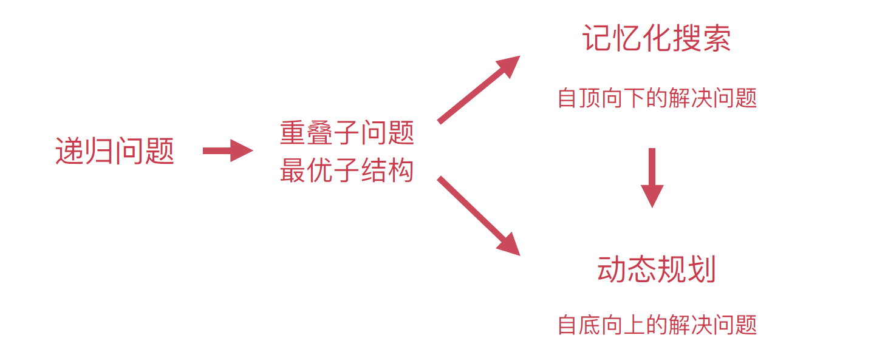
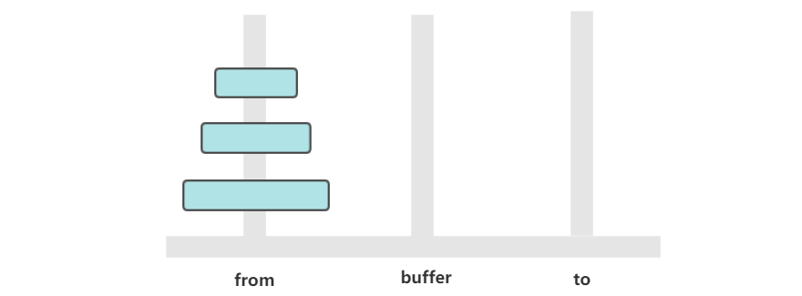
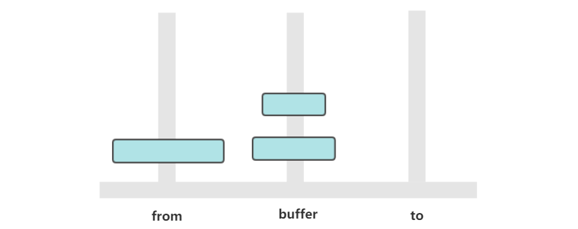
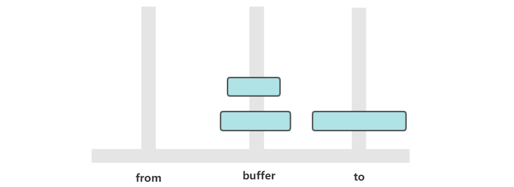
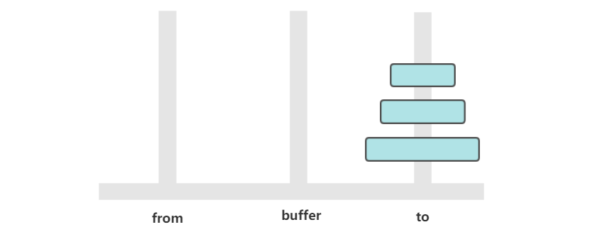

[TOC]

### 算法设计

#### 动态规划

##### 1. 概述

动态规划(**Dynamic** **Programming**)算法的核心思想是：将大问题划分为小问题进行解决，从而一步步获取最优解的处理算法。

动态规划算法与分治算法类似，其基本思想也是将待求解问题分解成若干个子问题，先求解子问题，然后从这些子问题的解得到原问题的解。

与分治法不同的是，适合于用**动态规划**求解的问题，经分解得到子问题往往不是互相独立的。 ( **即下一个子阶段的求解是建立在上一个子阶段的解的基础上，进行进一步的求解** )，上述的分治法往往没有关系。

动态规划可以通过==**填表**==的方式来逐步推进，得到最优解。

递归和动态规划都是将原问题拆成多个子问题然后求解，他们之间最本质的区别是，动态规划保存了子问题的解，避免重复计算。 



动态规划一般可分为 4 类：

1. 线性动规
2. 区域动规
3. 树形动规
4. 背包动规

##### 2. 动态规划问题的特点

###### (1) 最优子结构

可以通过**子问题的最优解**，推导出当前问题的最优解。

###### (2) 无后效性

现在的最优解和以后要发生的事**没有关系**。

###### (3) 重复子问题

每个问题的最优解反反复复都是同样的解法，就是找当前的最优子结构。


#### 贪心算法

贪婪算法(贪心算法)是指在对问题进行求解时，在每一步选择中都采取最好或者最优(即最有利)的选择，从而希望能够导致结果是最好或者最优的算法。

贪婪算法所得到的结果**不一定是最优**的结果(有时候会是最优解)，但是都是相对近似(接近)最优解的结果。

贪心只是一种**思想**，这种思想很多都源于生活。


#### 分治算法

##### 1. 概述

字面上的解释是 **“分而治之”**，就是把一个复杂的问题**分成两个或更多的相同或相似的子问题**，再把子问题分成更小的子问题……直到最后子问题可以简单的直接求解，原问题的解即子问题的解的**合并**。这个技巧是很多高效算法的基础，如排序算法(快速排序，归并排序)，傅立叶变换(快速傅立叶变换)……

分治算法可以求解的一些经典问题：

- **二分搜索**
- 大整数乘法
- 棋盘覆盖
- **归并排序**
- **快速排序**
- 线性时间选
- 最接近点对问题
- 循环赛日程表
- 汉诺塔

分治法在每一层递归上都有三个步骤：

1)、**分解**：将原问题分解为若干个规模较小，相互独立，与原问题形式相同的子问题

2)、**解决**：若子问题规模较小而容易被解决则**直接解**，否则**递归地解**各个子问题

3)、**合并**：将各个子问题的解合并为原问题的解。

```java
if |P| ≤ n0
   then return(ADHOC(P))
// 将P分解为较小的子问题 P1 ,P2 ,…,Pk
for i←1 to k
do yi ← Divide-and-Conquer(Pi)   // 递归解决Pi
T ← MERGE(y1,y2,…,yk)   // 合并子问题
return(T)
```

其中 |P| 表示问题 P 的规模；n0 为一阈值，表示当问题 P 的规模不超过 n0 时，问题已容易直接解出，不必再继续分解。ADHOC(P) 是该分治法中的基本子算法，用于直接解小规模的问题 P。因此，当 P 的规模不超过 n0 时直接用算法 ADHOC(P) 求解。算法 MERGE(y1,y2,…,yk) 是该分治法中的**合并**子算法，用于将 P 的子问题 P1, P2 ,…,Pk 的相应的解 y1,y2,…,yk 合并为 P 的解。

##### 2. 汉诺塔



有三个柱子，分别为 from、buffer、to。需要将 from 上的圆盘全部移动到 to 上，并且要保证小圆盘始终在大圆盘上。

这是一个经典的递归问题，分为三步求解：

① 将 n-1 个圆盘从 from -> buffer



② 将 **1 个**圆盘从 from -> to



③ 将 **n-1 个**圆盘从 buffer -> to



如果只有**一个**圆盘，那么只需要进行**一次移动**操作。

如果我们有 n ≥ 2 的情况，我们总是可以看做是两个盘。 1.最下边的盘。2.上面所有的盘看成一个盘。

从上面的讨论可以知道，a<sub>n</sub> = 2 * a<sub>n-1</sub> + 1，显然 a<sub>n</sub> = 2<sup>n</sup> - 1，n 个圆盘需要移动 2<sup>n</sup> - 1 次。

```java
public class Hanoi {
    public static void move(int num, String from, String buffer, String to) {
        if (num == 1) {
            System.out.println("from " + from + " to " + to);
            return;
        } else {
            // num ≥ 2 的情况，我们总是可以看做是两个盘。1.最下边的盘。2.上面所有的盘看成一个盘
            // 把上面的n-1个盘移动到buffer
            move(num - 1, from, to, buffer);
            // 把最下面的盘从from移动到to
            move(1, from, buffer, to);
            // 把buffer的所有盘移动到to
            move(num - 1, buffer, from, to);
        }
    }

    public static void main(String[] args) {
        Hanoi.move(3, "H1", "H2", "H3");
    }
}
```

```html
from H1 to H3
from H1 to H2
from H3 to H2
from H1 to H3
from H2 to H1
from H2 to H3
from H1 to H3
```

