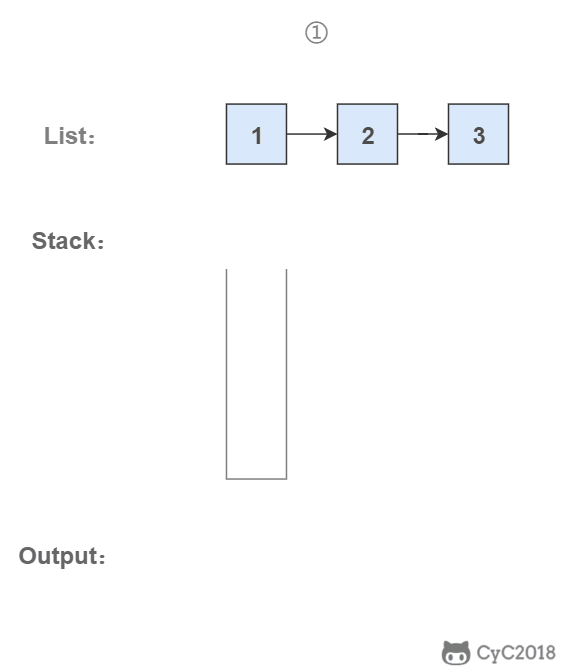
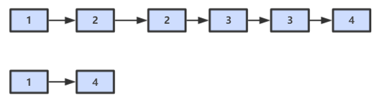
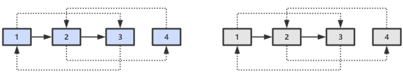

[TOC]

## 剑指Offer题解

#### 小总结

- **无序**的数据可以先变成**有序**。没准复杂度更低。
- 注重**临界值**判断。
- 一定要对**输入值**进行判断，输入范围，输入格式，输入类型等。
- 一定要注意输入输出的数据**超过存储范围**的情况。
- 遇到**字母对比**的，一定要跟面试官确定一下**大小写的情况**。


#### 3. 数组中重复的数字【简单】

[NowCoder](https://www.nowcoder.com/practice/623a5ac0ea5b4e5f95552655361ae0a8?tpId=13&tqId=11203&tPage=1&rp=1&ru=/ta/coding-interviews&qru=/ta/coding-interviews/question-ranking)

##### 1. 题目描述

在一个**长度为 n** 的数组里的所有数字都在 **0 到 n-1** 的范围内。数组中某些数字是**重复**的，但不知道有几个数字是重复的，也不知道每个数字重复几次。请找出数组中**任意一个重复**的数字。

```html
Input:
{2, 3, 1, 0, 2, 5}

Output:
2
```

##### 2. 解题思路

这个题就是**数组大小和数的范围**都给了。

要求时间复杂度 **O(N)**，空间复杂度 **O(1)**。因此**不能使用排序**的方法，也不能使用额外的标记数组。

对于这种数组元素在 **[0, n - 1] 范围**内的问题，可以将**值为 i 的元素调整到第 i 个位置上进行求解**。**如果当前位置的值不等于索引则不断进行交换，如果交换之后已经存在，说明重复了**。

以 (2, 3, 1, 0, 2, 5) 为例，**遍历**到位置 4 时，该位置上的数为 2，但是第 2 个位置上已经有一个 2 的值了，因此可以知道 2 重复：


```java
public int findRepeatNumber(int[] nums) {
    // Base case
    if (nums == null || nums.length <= 0) return -1;
    // 遍历一次数组
    for (int i = 0; i < nums.length; i++) {
        // 如果当前位置不等于索引则不断进行交换
        while (nums[i] != i) {
            // 如果目标索引处已经有了元素则说明重复
            if (nums[i] == nums[nums[i]]) {
                return nums[i];
            }
            // 否则进行交换
            swap(nums, i, nums[i]);
        }
    }
    return -1;
}

private void swap(int[] nums, int i, int j) {
    int t = nums[i];
    nums[i] = nums[j];
    nums[j] = t;
}
```

----

#### 4. 二维数组中的查找【简单】

[NowCoder](https://www.nowcoder.com/practice/abc3fe2ce8e146608e868a70efebf62e?tpId=13&tqId=11154&tPage=1&rp=1&ru=/ta/coding-interviews&qru=/ta/coding-interviews/question-ranking)

##### 1. 题目描述

给定一个二维数组，其每一行**从左到右递增排序**，**从上到下也是递增排序**。给定一个数，判断这个数是否在该二维数组中。

```html
Consider the following matrix:
[
  [1,   4,  7, 11, 15],
  [2,   5,  8, 12, 19],
  [3,   6,  9, 16, 22],
  [10, 13, 14, 17, 24],
  [18, 21, 23, 26, 30]
]

Given target = 5, return true.
Given target = 20, return false.
```

##### 2. 解题思路

要求时间复杂度 **O(M + N)**，空间复杂度 **O(1)**。其中 M 为行数，N 为 列数。

该二维数组中的一个数，**小于它的数一定在其左边**，大于它的数一定在**其下边**。因此，从**右上角开始查找**，就可以根据 target 和当前元素的大小关系来缩小查找区间，当前元素的查找区间为左下角的所有元素 。


```java
public boolean findNumberIn2DArray(int[][] matrix, int target) {
    // Base case
    if(matrix == null || matrix.length == 0 || matrix[0].length == 0) return false;
    // 从右上角开始遍历
    int row = 0;
    int col = matrix[0].length - 1;
    // 维护别超出范围
    while((row <= matrix.length - 1) && (col >= 0)) {
        if(target == matrix[row][col]) {
            return true;
        } else if(target < matrix[row][col]) {
            col--;
        } else {
            row++;
        }
    }
    return false;
}
```

----

#### 5. 替换空格【简单】

[NowCoder](https://www.nowcoder.com/practice/4060ac7e3e404ad1a894ef3e17650423?tpId=13&tqId=11155&tPage=1&rp=1&ru=/ta/coding-interviews&qru=/ta/coding-interviews/question-ranking)

##### 1. 题目描述


将一个字符串中的空格**替换**成 "%20"。

```java
Input:
"A B"

Output:
"A%20B"
```

##### 2. 解题思路

在**字符串尾部**填充任意字符，使得字符串的**长度等于替换之后的长度**。因为一个空格要替换成**三个字符**（%20），因此当遍历到**一个空格**时，需要在尾部填充**两个任意字符**。令 P1 指向字符串原来的**末尾位置**，P2 指向字符串**现在的末尾位置。**P1 和 P2 **从后向前遍历**，当 P1 遍历到一个空格时，就需要令 P2 指向的位置**依次填充 02%**（注意是逆序的），否则就填充上 P1 指向字符的值。

**从后向前遍历**是为了在改变 P2 所指向的内容时，不会影响到 P1 遍历原来字符串的内容。


emmm，这里用一个 **StringBuilder** 来进行最终答案的记录。

```java
public String replaceSpace2(String str) {
    StringBuilder res = new StringBuilder();
    for (int i = 0; i < str.length(); i++) {
        if (str.charAt(i) == ' ') {
            res.append("%20");
        } else {
            res.append(str.charAt(i));
        }
    }
    return res.toString();
}
```

方法2：

```java
public String replaceSpace(String str) {
    int length = str.length();
    // 直接初始化一个原始长度3倍的数组
    char[] array = new char[length * 3];
    // 记录最后需要多少个字符
    int size = 0;
    for (int i = 0; i < length; i++) {
        char c = str.charAt(i);
        if (c == ' ') {
            array[size++] = '%';
            array[size++] = '2';
            array[size++] = '0';
        } else {
            array[size++] = c;
        }
    }
    return new String(array, 0, size);
}
```

----

#### 6. 从尾到头打印链表【简单】

[NowCoder](https://www.nowcoder.com/practice/d0267f7f55b3412ba93bd35cfa8e8035?tpId=13&tqId=11156&tPage=1&rp=1&ru=/ta/coding-interviews&qru=/ta/coding-interviews/question-ranking)

##### 1. 题目描述

从**尾到头**反过来打印出每个结点的值。


##### 2. 解题思路

###### (1) 使用递归

要逆序打印链表 1->2->3（3, 2, 1)，可以**先逆序打印链表** 2->3(3,2)，最后再打印第一个节点 1。而链表 2->3 可以看成一个新的链表，要逆序打印该链表可以继续使用求解函数，也就是在求解函数中调用自己，这就是递归函数。

```java
ArrayList<Integer> resList = new ArrayList<Integer>();

public ArrayList<Integer> reversePrint(ListNode head) {
    // 递归打印
    process(head);
    return resList;
}
void process(ListNode head) {
    if(head == null) return;
    process(head.next);
    resList.add(head.val);
}
```

###### (2) 使用头插法

使用**头插法**可以得到一个**逆序的链表**。头结点和第一个节点的区别：

- **头结点**是在头插法中使用的一个额外节点，这个**节点不存储值；**
- **第一个节点**就是链表的第一个真正存储值的节点。

这个图不错啊。就是**整一个 dummy 结点**，然后把新的结点依次插入到 dummy 与头结点之间。**面试靠这个**就行了，力扣试了一下双百。


```java
public ListNode reverseList(ListNode head) {
    // null或只有一个结点的情况
    if(head == null || head.next == null) {
        return head;
    }
    // 引入dummy结点
    ListNode dummy = new ListNode(0);
    // 使用一个cur表示当前正在反转的结点
    ListNode cur = head;
    // head一直后移
    head = head.next;
    // 先把链表第一个结点放到dummy后面当做反转后的最后一个结点
    dummy.next = cur;
    cur.next = null;
    // 下面就是不断遍历了
    while(head != null) {
        // cur指向头结点
        cur = head;
        // 移动头结点
        head = head.next;
        // 将cur结点插入到dummy结点之后形成新的链表
        cur.next = dummy.next;
        dummy.next = cur;
    }
    return dummy.next;
}
```

###### (3) 使用栈

栈具有**后进先出**的特点，在遍历链表时将值按顺序放入栈中，最后**出栈**的顺序即为**逆序**。但是使用了**额外**空间。



```java
public ArrayList<Integer> printListFromTailToHead(ListNode listNode) {
    Stack<Integer> stack = new Stack<>();
    while (listNode != null) {
        stack.add(listNode.val);
        listNode = listNode.next;
    }
    ArrayList<Integer> ret = new ArrayList<>();
    while (!stack.isEmpty())
        ret.add(stack.pop());
    return ret;
}
```

----

#### 7. 重建二叉树【中等】

[NowCoder](https://www.nowcoder.com/practice/8a19cbe657394eeaac2f6ea9b0f6fcf6?tpId=13&tqId=11157&tPage=1&rp=1&ru=/ta/coding-interviews&qru=/ta/coding-interviews/question-ranking)

##### 1. 题目描述

根据二叉树的**前序遍历和中序遍历的结果**，**重建**出该二叉树。假设输入的前序遍历和中序遍历的结果中都**不含重复**的数字。


##### 2. 解题思路

**前序遍历**的第一个值为**根节点的值**，使用这个值将**中序遍历结果分成两部分**，左部分为树的**左子树中序遍历结果**，右部分为树的**右子树中序遍历的结果。**需要一个 **Map 缓存中序遍历数组每个值对应的索引**，这样找索引比较方便。

记住这个图，对一些**选择题**都是OK的。


```java
// 缓存中序遍历数组每个值对应的索引
HashMap<Integer, Integer> dict = new HashMap<>();

int[] po;

public TreeNode buildTree(int[] preOrder, int[] inOrder) {
    // 前序遍历数组
    po = preOrder;
    // 将中序遍历的结果放入Map并记录其索引位置
    for(int i = 0; i < inOrder.length; i++) {
        dict.put(inOrder[i], i);
    }
    // 第一个根结点就是前序数组的0位置
    return process(0, 0, inOrder.length - 1);
}

TreeNode process(int preRoot, int inLeft, int inRight) {
    // Base case
    if(inLeft > inRight) return null;
    // 构造根结点：就是前序数组的第一个元素
    TreeNode root = new TreeNode(po[preRoot]);
    // 从字典中找到根结点的索引位置
    int rootIndex = dict.get(po[preRoot]);
    // 递归构造左右子树
    root.left = process(preRoot + 1, inLeft, rootIndex - 1);
    root.right = process(preRoot + rootIndex - inLeft + 1, rootIndex + 1, inRight);
    return root;
}
```

还有一种**直接使用列表**的解法：

```java
public TreeNode buildTree2(int[] preorder, int[] inorder) {

    // 下面四行代码其实就是把数组转换成list
    List<Integer> pre = new ArrayList<>();
    for (int i : preorder) pre.add(i);
    List<Integer> in = new ArrayList<>();
    for (int i : inorder) in.add(i);

    // 其实这个函数就这一行
    return process(pre, in);
}

TreeNode process(List<Integer> pre, List<Integer> in) {
    // 递归停止条件，就是遍历完了列表
    if (pre.size() == 0) return null;

    // 前序遍历的第一个元素就是root
    int val = pre.get(0);
    TreeNode root = new TreeNode(val);

    // 从中序遍历里面找到root的位置，就把中序遍历分成两部分了
    int rootIndex = in.indexOf(root.val);

    //别问 问就是递归
    root.left = process(pre.subList(1, 1 + rootIndex), in.subList(0, rootIndex));
    root.right = process(pre.subList(1 + rootIndex, pre.size()), in.subList(1 + rootIndex, in.size()));
    return root;
}
```

---

#### 8. 二叉树的下一个结点

[NowCoder](https://www.nowcoder.com/practice/9023a0c988684a53960365b889ceaf5e?tpId=13&tqId=11210&tPage=1&rp=1&ru=/ta/coding-interviews&qru=/ta/coding-interviews/question-ranking)

##### 1. 题目描述

给定一个**二叉树**和其中的**一个结点**，请找出**中序遍历**顺序的**下一个结点**并且返回。注意，树中的结点不仅包含左右子结点，同时包含**指向父结点**的指针。

```java
private static class Node {
    int val;
    Node left = null;
    Node right = null;
    Node next = null;

    Node(int val) {
        this.val = val;
    }
}
```

##### 2. 解题思路

可以直接用中序遍历找一波，但是这样估计就白给了。由于有**指向父节点**的指针，所以是可以利用的。

① 如果一个节点的**右子树不为空**，那么该节点的**下一个节点是右子树的最左节点**；


② 否则，**向上找第一个==左链接==指向的树包含该节点的祖先节点**。


```java
public Node GetNext(Node pNode) {
    // 如果右子树不为空
    if (pNode.right != null) {
        // 找右子树最左的节点并返回
        Node node = pNode.right;
        while (node.left != null) {
            node = node.left;
        }
        return node;

        // 否则向上找第一个左链接指向的树包含该节点的祖先节点
    } else {
        // 这里是排除当前节点是最后一个节点的情况
        while (pNode.next != null) {
            // 得到父节点
            Node parent = pNode.next;
            // 如果当前节点是其父节点的左节点就是找到了
            if (parent.left == pNode)
                return parent;
            // 否则继续向父节点查找
            pNode = pNode.next;
        }
    }
    // 没找到说明是最后一个节点，返回null
    return null;
}
```

---

#### 9. 用两个栈实现队列【简单】

[NowCoder](https://www.nowcoder.com/practice/54275ddae22f475981afa2244dd448c6?tpId=13&tqId=11158&tPage=1&rp=1&ru=/ta/coding-interviews&qru=/ta/coding-interviews/question-ranking)

##### 题目描述

用两个**栈**来实现一个**队列**，完成队列的 **Push** 和 **Pop** 操作。

##### 解题思路

**in 栈**用来处理**入栈（push）**操作，**out 栈**用来处理**出栈（pop）**操作。一个元素进入 in 栈之后，**出栈的顺序被反转**。当**元素要出栈时，需要先进入 out 栈**，此时元素出栈顺序再一次被反转，因此出栈顺序就和最开始入栈顺序是相同的，先进入的元素先退出，这就是队列的顺序。


**这里一个栈用于 push，一个栈用于 pop，当 pop 时，如果 pop 栈为空，则把 push 栈的全部元素搬到 pop 中之后再 pop，如果是 push 操作，则一直往 push 栈压入即可。**

```java
Stack<Integer> pushStack = new Stack<>();
Stack<Integer> popStack = new Stack<>();

// 压栈操作一直往in栈压入进行累计
public void push(int node) {
    pushStack.push(node);
}

// 弹栈操作则从out栈取，如果没有就把in栈的全部搬到out栈中
public int pop() throws Exception {
    // 如果为空
    if (popStack.isEmpty()) {
        while (!pushStack.isEmpty()) {
            popStack.push(pushStack.pop());
        }
    }
    // 都为空抛异常
    if (popStack.isEmpty())
        throw new Exception("queue is empty");
    return popStack.pop();
}
```

---

#### 10.1 斐波那契数列

[NowCoder](https://www.nowcoder.com/practice/c6c7742f5ba7442aada113136ddea0c3?tpId=13&tqId=11160&tPage=1&rp=1&ru=/ta/coding-interviews&qru=/ta/coding-interviews/question-ranking)

##### 题目描述

求斐波那契数列的**第 n 项**，n <= 39。


##### 解题思路

如果使用**递归**求解，会**重复计算**一些子问题。例如，计算 f(4) 需要计算 f(3) 和 f(2)，计算 f(3) 需要计算 f(2) 和 f(1)，可以看到 f(2) 被**重复计算**了。


递归是将一个问题划分成**多个子问题**求解，动态规划也是如此，但是**动态规划**会把子问题的**解缓存**起来，从而避免重复求解子问题。

```java
public int Fibonacci(int n) {
    // Base case
    if (n <= 1)
        return n;
    int[] fib = new int[n + 1];
    // 初始化
    fib[1] = 1;
    // 自底向上计算即可
    for (int i = 2; i <= n; i++)
        fib[i] = fib[i - 1] + fib[i - 2];
    return fib[n];
}
```

考虑到第 i 项只与第 **i - 1** 和第 **i - 2** 项有关，因此**只需要存储前两项**的值就能求解第 i 项，从而将**空间复杂度**由 O(N) 降低为 O(1)。

```java
public int Fibonacci(int n) {
    if (n <= 1) {
        return n;
    }
    // 两个指针，一个前一个后
    int back = 0, front = 1;
    // 存放最终结果
    int fibAns = 0;
    for (int i = 2; i <= n; i++) {
        fibAns = back + front;
        back = front;
        front = fibAns;
    }
    return fibAns;
}
```

由于待求解的 n 小于 40，因此可以将前 40 项的结果**先进行计算**，之后就能以 **O(1)** 时间复杂度得到第 n 项的值。

```java
public class Solution {

    private int[] fib = new int[40];
	// 预先计算并缓存
    public Solution() {
        fib[1] = 1;
        for (int i = 2; i < fib.length; i++)
            fib[i] = fib[i - 1] + fib[i - 2];
    }

    public int Fibonacci(int n) {
        return fib[n];
    }
}
```

上面的解法，当 n 过大时，可能造成数值范围溢出，可以采用下面的代码：

```java
public int fib2(int n) {
    int a = 0, b = 1, sum;
    for(int i = 0; i < n; i++){
        sum = (a + b) % 1000000007;
        a = b;
        b = sum;
    }
    return a;
}
```

因为 **1000000007 这个数字是 10 位的最小质数**，如果数字太大溢出了，**需要将计算结果 % 1000000007才能保证得出的结果在 int 范围中**。

#### 10.2 矩形覆盖

[NowCoder](https://www.nowcoder.com/practice/72a5a919508a4251859fb2cfb987a0e6?tpId=13&tqId=11163&tPage=1&rp=1&ru=/ta/coding-interviews&qru=/ta/coding-interviews/question-ranking)

##### 题目描述

可以用 2 \* 1 的小矩形**横着或者竖着**去覆盖更大的矩形。请问用 n 个 2\*1 的小矩形无重叠地覆盖一个 **2\*n 的大矩形**，总共有**多少种方法**？


##### 解题思路

当 n 为 1 时，只有**一种覆盖**方法：


当 n 为 2 时，有**两种覆盖**方法：


要覆盖 2\*n 的大矩形，可以**先覆盖 2\*1 的矩形**，再**覆盖 2\*(n-1)** 的矩形；或者**先覆盖 2\*2** 的矩形，再覆盖 **2\*(n-2)** 的矩形。而覆盖 **2\*(n-1) 和 2\*(n-2) 的矩形可以看成子问题**。该问题的递推公式如下：


其实这个解就类似于前面的裴波那契的解法，**一毛一样**。

```java
public int RectCover(int n) {
    // Base case
    if (n <= 2) {
        return n;
    }
    // 
    int back = 1, front = 2;
    int result = 0;
    for (int i = 3; i <= n; i++) {
        result = back + front;
        back = front;
        front = result;
    }
    return result;
}
```

#### 10.3 跳台阶

[NowCoder](https://www.nowcoder.com/practice/8c82a5b80378478f9484d87d1c5f12a4?tpId=13&tqId=11161&tPage=1&rp=1&ru=/ta/coding-interviews&qru=/ta/coding-interviews/question-ranking)

##### 题目描述

一只青蛙一次可以跳上 **1 级台阶**，也可以跳上 **2 级**。求该青蛙跳上一个 **n 级的台阶总共有多少种跳法**。


##### 解题思路

当 **n = 1** 时，只有**一种**跳法：


当 **n = 2** 时，有**两种**跳法：


跳 n 阶台阶，可以**先跳 1 阶台阶**，**再跳 n-1** 阶台阶；或者**先跳 2 阶**台阶，再跳 **n-2 阶**台阶。而 n-1 和 n-2 阶台阶的跳法可以看成**子问题**，该问题的递推公式为：


也可也看成是裴波那契的类型的题目。

```java
public int JumpFloor(int n) {
    if (n <= 2) {
        return n;
    }
    int back = 1, front = 2;
    int result = 1;
    // 滚动计算
    for (int i = 2; i < n; i++) {
        result = back + front;
        back = front;
        front = result;
    }
    return result;
}
```

这里也是当 n 过大范围会溢出，可以用下面的代码：

````java
public int numWays(int n) {
    int a = 1, b = 1, sum;
    for(int i = 0; i < n; i++){
        sum = (a + b) % 1000000007;
        a = b;
        b = sum;
    }
    return a;
}
````

----

#### 10.4 变态跳台阶

[NowCoder](https://www.nowcoder.com/practice/22243d016f6b47f2a6928b4313c85387?tpId=13&tqId=11162&tPage=1&rp=1&ru=/ta/coding-interviews&qru=/ta/coding-interviews/question-ranking)

##### 题目描述

一只青蛙一次可以跳上 1 级台阶，也可以跳上 2 级... 它也**可以跳上 n 级**。求该青蛙跳上一个 n 级的台阶总共有多少种跳法。


##### 解题思路

###### (1) 动态规划

```java
public int JumpFloorII(int target) {
    int[] dp = new int[target];
    Arrays.fill(dp, 1);
    for (int i = 1; i < target; i++)
        for (int j = 0; j < i; j++)
            dp[i] += dp[j];
    return dp[target - 1];
}
```

###### (2) 数学推导

跳上 n-1 级台阶，可以从 n-2 级跳 1 级上去，也可以从 **n-3 级**跳 2 级上去...，那么

```java
f(n-1) = f(n-2) + f(n-3) + ... + f(0)
```

同样，跳上 n 级台阶，可以从 n-1 级跳 1 级上去，也可以从 n-2 级跳 2 级上去... ，那么

```java
f(n) = f(n-1) + f(n-2) + ... + f(0)
```

综上可得

```java
f(n) - f(n-1) = f(n-1)
```

即：

```java
f(n) = 2*f(n-1)
```

所以 f(n) 是一个等比数列

```java
public int JumpFloorII(int target) {
    return (int) Math.pow(2, target - 1);
}
```

---

#### 11. 旋转数组的最小数字【简单】

[NowCoder](https://www.nowcoder.com/practice/9f3231a991af4f55b95579b44b7a01ba?tpId=13&tqId=11159&tPage=1&rp=1&ru=/ta/coding-interviews&qru=/ta/coding-interviews/question-ranking)

##### 题目描述

把一个数组**最开始**的**若干个元素**搬到**数组的末尾**，我们称之为**数组的旋转**。输入一个**非递减排序**的数组的一个**旋转**，输出旋转数组的**最小元素**。


##### 解题思路

由于是已经排序的数组进行旋转，将旋转数组**对半分**可以得到一个**包含最小元素**的新旋转数组，以及一个**非递减排序**的数组。新的旋转数组的数组元素是原数组的**一半**，从而将问题规模**减少了一半**，这种**折半性质**的算法的时间复杂度为 O(logN)（为了方便，这里将 log<sub>2</sub>N 写为 logN）。


此时问题的关键在于**确定对半分得到的两个数组哪一个是旋转数组，哪一个是非递减数组**。我们很容易知道**非递减数组**的第一个元素一定**小于等于最后一个元素**。

通过修改**二分查找算法**进行求解（l 代表 low，m 代表 mid，h 代表 high）：

- 当 nums[m] <= nums[h] 时，表示 [m, h] 区间内的数组是**非递减数组**，[l, m] 区间内的数组是旋转数组，此时令 h = m；
- 否则 [m + 1, h] 区间内的数组是旋转数组，令 l = m + 1。

```java
public int minNumberInRotateArray(int[] nums) {

    if (nums.length == 0) return 0;
    // 维护两个索引
    int low = 0, high = nums.length - 1;
    // 二分查找搜索
    while (low < high) {
        // 取中值
        int mid = low + (high - low) / 2;
        // 如果中值小于等于右索引的值，说明右边是非递减的
        if (nums[mid] <= nums[high]) {
            // 目标在左边，此时更新右索引到中间
            high = mid;
        } else {	// 说明左边是非递减的
            // 目标值在右边，更新左索引到中间
            low = mid + 1;
        }
    }
    // 指针相遇，返回这个值
    return nums[low];
}
```

注意：如果数组**元素允许重复**，会出现一个特殊的情况：**nums[l] == nums[m] == nums[h]**，此时无法确定解在哪个区间，需要**切换到顺序查找**。例如对于数组 {1, 1, 1, 0, 1}，l、m 和 h 指向的数都为 1，此时**无法知道最小数字 0 在哪个区间**。

```java
public int minNumberInRotateArray2(int[] nums) {
    if (nums.length == 0) return 0;
    int left = 0, right = nums.length - 1;
    while (left < right) {
        int mid = left + (right - left) / 2;
        // 左右中值都一样
        if (nums[left] == nums[mid] && nums[mid] == nums[right]) {
            // 此时从左到右顺序查找
            return minNumber(nums, left, right);
            // 中间小于右边
        } else if (nums[mid] <= nums[right]) {
            right = mid;
            // 中间小于左边
        } else {
            left = mid + 1;
        }
    }
    return nums[left];
}

private int minNumber(int[] nums, int left, int right) {
    for (int i = left; i < right; i++) {
        if (nums[i] > nums[i + 1]) {
            return nums[i + 1];
        }
    }
    return nums[left];
}
```

再来一种**允许重复**的简便写法：

```java
public int minArray(int[] nums) {
    int left = 0, right = nums.length - 1;
    // 整体二分模板
    while (left < right) {
        // 找中值
        int mid = (left + right) / 2;
        if (nums[mid] > nums[right]) {
            left = mid + 1;
        } else if (nums[mid] < nums[right]) {
            right = mid;
        } else {
            right--;
        }
    }
    return nums[left];
}
```

----

#### 12. 矩阵中的路径【中等】

[NowCoder](https://www.nowcoder.com/practice/c61c6999eecb4b8f88a98f66b273a3cc?tpId=13&tqId=11218&tPage=1&rp=1&ru=/ta/coding-interviews&qru=/ta/coding-interviews/question-ranking)

##### 题目描述

判断在一个**矩阵中**是否存在一条包**含某字符串所有字符的路径**。路径可以从矩阵中的任意一个格子开始，每一步可以在矩阵中向**上下左右**移动一个格子。如果一条路径经过了矩阵中的某一个格子，则该路径**不能**再进入该格子。

例如下面的矩阵包含了一条 **bfce** 路径。


##### 解题思路

使用**回溯法（backtracking）**进行求解，它是一种**暴力搜索方法**，通过搜索**所有可能**的结果来求解问题。回溯法在一次搜索结束时需要**进行回溯（回退）**，将**这一次搜索过程中设置的状态进行清除**，从而开始一次**新的搜索过程**。

例如下图示例中，从 f 开始，下一步有 4 种搜索可能，如果先搜索 b，需要将 b 标记为**已经使用**，防止重复使用。在**这一次搜索**结束之后，需要将 b 的**已经使用状态清除**，并搜索 c。


这里用了一个一位数组用于表示被访问的位置，也可以用二维数组，一维数组是做了坐标转换。

```java
char[][] matrix;
char[] word;
public boolean exist(char[][] matrix, String word) {
    this.matrix = matrix;
    this.word = word.toCharArray();
    for(int i = 0; i < matrix.length; i++) {
        for(int j = 0; j < matrix[0].length; j++) {
            // 以矩阵每个位置为开头进行dfs查询
            if(dfs(i, j, 0)) return true;
        }
    }
    return false;
}

// 以某个位置开始进行DFS搜索
boolean dfs(int i, int j, int walkLen) {
    // Base case: 数组越界直接退出
    if(i >= matrix.length || i < 0 || j >= matrix[0].length || j < 0) return false;
    // 当前位置与目标位置的字符不对应，直接返回
    if(matrix[i][j] != word[walkLen]) return false;
    // 到这里，说明每个字符都是对应的，且已经遍历的步长已经等于目标单词的长度了
    if(walkLen == word.length - 1) return true;
    // 这里是将访问过的位置修改成一个不可能出现的字符，用于标记已经访问，也可以单独使用一个visited数组进行
    char tmp = matrix[i][j];
    matrix[i][j] = '/';
    // 往四个方向增加搜索，同时已经搜索的步长+1
    boolean res = dfs(i + 1, j, walkLen + 1)
        || dfs(i - 1, j, walkLen + 1)
        || dfs(i, j + 1, walkLen + 1)
        || dfs(i , j - 1, walkLen + 1);
    // 撤消修改
    matrix[i][j] = tmp;
    return res;
}
```

#### 13. 机器人的运动范围【中等】

[NowCoder](https://www.nowcoder.com/practice/6e5207314b5241fb83f2329e89fdecc8?tpId=13&tqId=11219&tPage=1&rp=1&ru=/ta/coding-interviews&qru=/ta/coding-interviews/question-ranking)

##### 题目描述

地上有一个 **m 行和 n 列**的**方格**。一个机器人从坐标 **(0, 0)** 的格子开始移动，每一次只能向左右上下四个方向**移动一**格，但是**不能进入行坐标和列坐标**的数位**之和大于 k** 的格子。

例如，当 k 为 18 时，机器人能够进入方格 (35, 37)，因为 **3+5+3+7=18**。但是它不能进入方格 (35, 38)，因为 3+5+3+8=19。请问该机器人能够达到**多少个格子**？

##### 解题思路

使用深度优先搜索（Depth First Search，DFS）方法进行求解。回溯是**深度优先搜索**的一种**特例**，它在一次搜索过程中需要**设置一些**本次搜索过程的**局部状态**，并在本次搜索结束之后**清除状态**。而普通的深度优先搜索并不需要使用这些局部状态，虽然还是有可能设置一些全局状态。

```java
// 全局计数器
private int counter = 0;
private int rows;
private int cols;
private int digitSum;
private boolean[][] visited;

public int movingCount(int rows, int cols, int digitSum) {
    this.rows = rows; this.cols = cols; this.digitSum = digitSum;
    // 标记是否已经访问
    visited = new boolean[rows][cols];
    // DFS
    dfs(0, 0);
    return counter;
}

private void dfs(int row, int col) {
    // Base case 如果遇到越界或者已经访问的就退出
    if (row < 0 || row >= rows || col < 0 || col >= cols || visited[row][col])
        return;
    // 标记已经访问的位置
    visited[row][col] = true;
    // 计算这个位置的数字是否符合标准
    if (getSum(row, col) > digitSum) return;
    // 合格计数器++
    counter++;
    // 继续DFS
    dfs(row + 1, col);
    dfs(row - 1, col);
    dfs(row, col + 1);
    dfs(row, col - 1);
}
// 求一个位置的各位之和
private int getSum(int i, int j) {
    int res = 0;
    int a = i;
    while(a != 0) {
        res = res + a % 10;
        a = a / 10;
    }
    a = j;
    while(a != 0) {
        res = res + a % 10;
        a = a / 10;
    }
    return res;
}
```

----

#### 14. 剪绳子【简单】

[Leetcode](https://leetcode.com/problems/integer-break/description/)

##### 题目描述

把一根绳子剪成**多段**，并且使得每段的**长度乘积最大。**

```html
n = 2
return 1 (2 = 1 + 1)

n = 10
return 36 (10 = 3 + 3 + 4)
```

##### 解题思路

###### (1) 贪心

尽可能多**剪长度为 3** 的绳子，并且**不允许有长度为 1** 的绳子出现。如果出现了，就从**已经切好长度为 3 的绳子中拿出一段与长度为 1 的绳子重新组合，把它们切成两段长度为 2 的绳子。**

**部分面试官会要求证明**：当 **n >= 5** 时，**3(n - 3) - n = 2n - 9 > 0**，且 **2(n - 2) - n = n - 4 > 0**。因此在 n >= 5 的情况下，将绳子剪成一段**为 2 或者 3**，得到的乘积会更大。又因为 3(n - 3) - 2(n - 2) = n - 5 >= 0，所以剪成一段长度为 3 比长度为 2 得到的乘积更大。

```java
public int cutRope(int target) {
    if(target == 2) {
        return 1;
    } else if (target == 3) {
        return 2;
    } else if(target == 4) {
        return 4;
    }
    // 判断可以分成几个3米
    int counter = target / 3;
    // 判断最后剩下1米还是2米
    int left = target % 3;
    int res = 1;
    for(int i = 0; i < counter; i++) {
        res = res * 3;
    }
    if(left <= 1) {
        return res;
    }

    if(left == 2) {
        return res * 2;
    }
    return res;
}
```

###### (2) 动态规划

定义长度为 n 的绳子剪切后的**最大乘积为 f(n)**，剪了一刀后，**f(n) = max(f(i) * f(n - i))**。假设 **n 为 10**，第一刀之后分为了 4-6，而 6 也可能再分成 2-4（6 的最大是 3-3，但过程中还是要比较 2-4 这种情况的），而上一步 4-6 中也需要求长度为 4 的问题的最大值，可见，各个子问题之间是有**重叠**的，所以可以**先计算小问题**，存储下每个小问题的结果，逐步往上，求得大问题的最优解。

第一步：定义dp[n]的值的含义为：数字n的乘积最大值

```java
n=2:  1+1  -->1*1=1;   				dp[2]=1;
n=3:  2+1  -->2*1=2;   				dp[3]=2;
n=4:  2+2  -->2*2=4;   				dp[4]=4;
n=5:  3+2  -->3*2=6;   				dp[5]=6;
```

貌似看不出规律，别急再多写几个

```java
n=6:  3+3  -->3*3=4;                 dp[6]=9;
n=7:  4+3  -->4*3=12;-->dp[4]*3=12   dp[7]=12;
n=8:  5+3  -->6*3=12;-->dp[5]*3=18   dp[8]=18;
n=9:  6+3  -->9*3=12;-->dp[6]*3=27   dp[9]=27;
n=10: 7+3  -->12*3=36;-->dp[7]*3=12   dp[10]=36;
```

第二步：找到递推的规律：

通过上述分析，规律明显在n=7以后为

```java
if(n>=7)
	dp[n] = dp[n-3]*3;
```

第三步：找初始值：

初始值在第二步找规律已经找到了

```java
n=2:  1+1  -->1*1=1;   				dp[2]=1;
n=3:  2+1  -->2*1=2;   				dp[3]=2;
n=4:  2+2  -->2*2=4;   				dp[4]=4;
n=5:  3+2  -->3*2=6;   				dp[5]=6;
n=6:  3+3  -->3*3=4;                dp[6]=9;
```

通过以上分析，就直接可以写代码了：

```java
public int integerBreak(int n) {
    int[] dp = new int[n + 1];
    dp[1] = 1;
    for (int i = 2; i <= n; i++)
        for (int j = 1; j < i; j++)
            dp[i] = Math.max(dp[i], Math.max(j * (i - j), dp[j] * (i - j)));
    return dp[n];
}
```

或者：

```java
public int cuttingRope3(int n) {
    // 1.创建数组-设置对应的含义,dp[n]为长度为 n 时候，最大的乘积 我们只需求出dp[n]
    int[] dp = new int[n + 7];
    // 2.确定初始值
    dp[0] = 0;
    dp[1] = 0;
    dp[2] = 1;
    dp[3] = 2;
    dp[4] = 4;
    dp[5] = 6;
    dp[6] = 9;
    if (n <= 6) {
        return dp[n];
    }
    // 3.找到递推关系
    for (int i = 7; i <= n; i++) {
        dp[i] = dp[i - 3] * 3;
    }
    return dp[n];
}
```

这个题的变形就是结果过大超出范围，需要取模表示结果。

```java
public int cuttingRope4(int n) {
    if (n <= 3) return n - 1;
    int b = n % 3, mod = 1000000007;
    long rem = 1, x = 3;
    for (int a = n / 3 - 1; a > 0; a /= 2) {
        if (a % 2 == 1) rem = (rem * x) % mod;
        x = (x * x) % mod;
    }
    if (b == 0) return (int) (rem * 3 % mod);
    if (b == 1) return (int) (rem * 4 % mod);
    return (int) (rem * 6 % mod);
}
```

----

#### 15. 二进制中1的个数【简单】

[NowCoder](https://www.nowcoder.com/practice/8ee967e43c2c4ec193b040ea7fbb10b8?tpId=13&tqId=11164&tPage=1&rp=1&ru=/ta/coding-interviews&qru=/ta/coding-interviews/question-ranking)

##### 题目描述

输入一个**整数**，输出该数**二进制**表示中 1 的个数。

###### (1) n&(n-1)

该**位运算**去除 n 的位级表示中**最低的那一位**。

```
n       : 10110100
n-1     : 10110011
n&(n-1) : 10110000
```

所以不断通过这个运算，最终可以将 n 变为 0。时间复杂度：O(M)，其中 M 表示 **1 的个数**。


```java
public int NumberOf1(int n) {
    int cnt = 0;
    while (n != 0) {
        cnt++;
        n &= (n - 1);
    }
    return cnt;
}
```

###### (2) Integer.bitCount()

```java
public int NumberOf1(int n) {
    return Integer.bitCount(n);
}
```

###### (3) 右移法

记住这个，面试可用。

```java
public int hammingWeight(int num) {
    int res = 0;
    while(num != 0) {
        // 和1相与，结果为1则说明个位为1
        if((num & 1) == 1) res++;
        // 右移直到为0
        num = num >>> 1;
    }
    return res;
}
```

----

#### 16. 数值的整数次方【中等】

[NowCoder](https://www.nowcoder.com/practice/1a834e5e3e1a4b7ba251417554e07c00?tpId=13&tqId=11165&tPage=1&rp=1&ru=/ta/coding-interviews&qru=/ta/coding-interviews/question-ranking)

##### 题目描述

给定一个 **double 类型的浮点数** base 和 int 类型的整数 exponent，求 base 的 exponent 次方。

##### 解题思路

###### (1) 递归法

下面的讨论中 x 代表 **base**，n 代表 **exponent**。

这里有一个递推公式，需要根据幂的奇偶情况看。


因为 (x\*x)<sup>n/2</sup> 可以通过递归求解，并且每次**递归 n 都减小一半**，因此整个算法的时间复杂度为 O(logN)。

```java
public double Power(double base, int exponent) {
    if (exponent == 0)
        return 1;
    // 如果次方为1，返回原数
    if (exponent == 1)
        return base;
    // 用于记录是否是负次幂
    boolean isNegative = false;
    // 先将负的幂转为正，后面最后再处理
    if (exponent < 0) {
        exponent = -exponent;
        isNegative = true;
    }
    // 递归求答案
    double pow = Power(base * base, exponent / 2);
    // 如果是奇数的情况，那还需要再次乘一波
    if (exponent % 2 != 0)
        pow = pow * base;
    // 处理负幂的情况
    return isNegative ? 1 / pow : pow;
}
```

###### (2) 快速幂

直接看解法：

```java
public double myPow(double base, int power) {
    if (base == 0) return 0;
    long b = power;
    double res = 1.0;
    if (b < 0) {
        base = 1 / base;
        b = -b;
    }
    while (b > 0) {
        if ((b & 1) == 1) res *= base;
        base *= base;
        b >>= 1;
    }
    return res;
}
```

----

#### 17. 打印从1到最大的n位数

##### 题目描述

输入**数字 n**，按**顺序打印**出从 1 到**最大的 n 位**十进制数。比如输入 3，则打印出 1、2、3 一直到**最大的 3 位数**即 999。

##### 解题思路

由于 **n 可能会非常大**，因此**不能直接用 int 表示数字，而是用 char 数组进行存储。**

使用**回溯法**得到所有的数。

```java
public void print1ToMaxOfNDigits(int n) {
    if (n <= 0) return;
    // 初始化一个num数组用于存放每一位
    char[] number = new char[n];
    // 初始digit为0
    print1ToMaxOfNDigits(number, 0);
}

private void print1ToMaxOfNDigits(char[] number, int digit) {
    // 如果digit已经等于位数长度就打印出来
    if (digit == number.length) {
        // 打印出满足条件的数
        printNumber(number);
        return;
    }
    // 递归打印
    for (int i = 0; i < 10; i++) {
        number[digit] = (char) (i + '0');
        print1ToMaxOfNDigits(number, digit + 1);
    }
}

private void printNumber(char[] number) {
    int index = 0;
    while (index < number.length && number[index] == '0')
        index++;
    while (index < number.length)
        System.out.print(number[index++]);
    System.out.println();
}
```

----

#### 18.1 在O(1)时间内删除链表节点

##### 解题思路

① 如果该节点**不是尾节点**，那么可以直接将**下一个节点的值赋给该节点**，然后令该节点指向下下个节点，**再删除下一个节点**，时间复杂度为 O(1)。


② 否则，就需要**先遍历链表**，找到节点的**前一个节点**，然后让前一个节点指向 null，时间复杂度为 **O(N)**。


综上，如果**进行 N 次**操作，那么大约需要**操作节点的次数为 N-1+N=2N-1**，其中 N-1 表示 N-1 个不是尾节点的每个节点以 O(1) 的时间复杂度操作节点的总次数，N 表示 1 个尾节点以 O(N) 的时间复杂度操作节点的总次数。(2N-1)/N \~ 2，因此该算法的**平均时间复杂度为 O(1)**。

其实就是大部分情况下是 O(1)，仅删除尾部是 O(N)。

```java
public ListNode deleteNode(ListNode head, ListNode tobeDelete) {
    if (head == null || tobeDelete == null) return null;

    // 需要删除的是头结点
    if (head == tobeDelete) {
        return head.next;
    }
    // 要删除的节点不是尾节点
    if (tobeDelete.next != null) {
        // 找到待删结点的下一个结点
        ListNode next = tobeDelete.next;
        // 将下一个结点的值赋给被删的结点
        tobeDelete.val = next.val;
        // 覆盖下一个结点即可
        tobeDelete.next = next.next;

        // 现在说明删除的结点是尾结点
    } else {
        // 持续变量找到尾结点
        ListNode cur = head;
        while (cur.next != tobeDelete)
            cur = cur.next;
        cur.next = null;
    }
    return head;
}
```

----

#### 18.2 删除链表中重复的结点

[NowCoder](https://www.nowcoder.com/practice/fc533c45b73a41b0b44ccba763f866ef?tpId=13&tqId=11209&tPage=1&rp=1&ru=/ta/coding-interviews&qru=/ta/coding-interviews/question-ranking)

##### 题目描述

在一个排序的链表中，**存在重复**的结点，请删除该链表中**重复的结点**，**重复的结点不保留**，返回链表头指针。 例如，链表1->2->3->3->4->4 处理后为 **1->2**。



##### 解题描述

```java
public ListNode deleteDuplication(ListNode pHead) {
    // 递归到了链表尾部
    if (pHead == null || pHead.next == null) return pHead;
    // 下一个结点
    ListNode next = pHead.next;
    // 说明重复则删除
    if (pHead.val == next.val) {
        while (next != null && pHead.val == next.val) {
            next = next.next;
        }
        // 递归删除
        return deleteDuplication(next);
        
        // 说明没有重复
    } else {
        // 当前结点的下一个就是递归返回的头结点
        pHead.next = deleteDuplication(pHead.next);
        return pHead;
    }
}
```

#### 19. 正则表达式匹配【困难】

[NowCoder](https://www.nowcoder.com/practice/45327ae22b7b413ea21df13ee7d6429c?tpId=13&tqId=11205&tPage=1&rp=1&ru=/ta/coding-interviews&qru=/ta/coding-interviews/question-ranking)

##### 题目描述

请实现一个函数用来**匹配包括 '.' 和 '\*' 的正则表达式**。模式中的字符 '.' 表示**任意一个字符**，而 '\*' 表示它**前面**的字符可以**出现任意次（包含 0 次）**。

在本题中，匹配是指字符串的所有字符匹配**整个模式**。例如，字符串 "aaa" 与模式 "a.a" 和 "ab\*ac\*a" 匹配，但是与 "aa.a" 和 "ab\*a" 均不匹配。

##### 解题思路

应该注意到，**'.'** 是用来当做**一个**任意字符，而 **'\*'** 是用来**重复前面**的字符。这两个的作用不同，不能把 '.' 的作用和 '\*' 进行类比，从而把它当成重复前面字符一次。

```java
public boolean match(char[] str, char[] pattern) {

    int m = str.length, n = pattern.length;
    boolean[][] dp = new boolean[m + 1][n + 1];

    dp[0][0] = true;
    for (int i = 1; i <= n; i++)
        if (pattern[i - 1] == '*')
            dp[0][i] = dp[0][i - 2];

    for (int i = 1; i <= m; i++)
        for (int j = 1; j <= n; j++)
            if (str[i - 1] == pattern[j - 1] || pattern[j - 1] == '.')
                dp[i][j] = dp[i - 1][j - 1];
    else if (pattern[j - 1] == '*')
        if (pattern[j - 2] == str[i - 1] || pattern[j - 2] == '.') {
            dp[i][j] |= dp[i][j - 1]; // a* counts as single a
            dp[i][j] |= dp[i - 1][j]; // a* counts as multiple a
            dp[i][j] |= dp[i][j - 2]; // a* counts as empty
        } else
            dp[i][j] = dp[i][j - 2];   // a* only counts as empty

    return dp[m][n];
}
```

---

#### 20. 表示数值的字符串

[NowCoder](https://www.nowcoder.com/practice/6f8c901d091949a5837e24bb82a731f2?tpId=13&tqId=11206&tPage=1&rp=1&ru=/ta/coding-interviews&qru=/ta/coding-interviews/question-ranking)

##### 题目描述

```
true

"+100"
"5e2"
"-123"
"3.1416"
"-1E-16"
```

```
false

"12e"
"1a3.14"
"1.2.3"
"+-5"
"12e+4.3"
```

##### 解题思路

使用**正则表达式**进行匹配。

```html
[]  ： 字符集合
()  ： 分组
?   ： 重复 0 ~ 1 次
+   ： 重复 1 ~ n 次
*   ： 重复 0 ~ n 次
.   ： 任意字符
\\. ： 转义后的 .
\\d ： 数字
```

```java
public boolean isNumeric(char[] str) {
    if (str == null || str.length == 0)
        return false;
    return new String(str).matches("[+-]?\\d*(\\.\\d+)?([eE][+-]?\\d+)?");
}
```

普通的方法：

```java
public boolean isNumber(String s) {
    if (s == null || s.length() == 0) return false;
    // 标记是否遇到数位、小数点、‘e’或'E'
    boolean isNum = false, isDot = false, isCharE = false;
    // 转为字符数组，遍历判断每个字符
    char[] str = s.trim().toCharArray();
    for (int i = 0; i < str.length; i++) {
        // 判断当前字符是否为 0~9 的数位
        if (str[i] >= '0' && str[i] <= '9') {
            isNum = true;
            // 遇到小数点
        } else if (str[i] == '.') {
            // 小数点之前可以没有整数，但是不能重复出现小数点、或出现‘e’、'E'
            if (isDot || isCharE) return false;
            // 标记已经遇到小数点
            isDot = true;
            // 遇到‘e’或'E'
        } else if (str[i] == 'e' || str[i] == 'E') {
            // ‘e’或'E'前面必须有整数，且前面不能重复出现‘e’或'E'
            if (!isNum || isCharE) return false;
            // 标记已经遇到‘e’或'E'
            isCharE = true;
            // 重置isNum，因为‘e’或'E'之后也必须接上整数，防止出现 123e或者123e+的非法情况
            isNum = false;
        } else if (str[i] == '-' || str[i] == '+') {
            if (i != 0 && str[i - 1] != 'e' && str[i - 1] != 'E')
                // 正负号只可能出现在第一个位置，或者出现在‘e’或'E'的后面一个位置
                return false;
            // 其它情况均为不合法字符
        } else return false; 
    }
    return isNum;
}
```

----

#### 21. 调整数组顺序使奇数位于偶数前面【简单】

[NowCoder](https://www.nowcoder.com/practice/beb5aa231adc45b2a5dcc5b62c93f593?tpId=13&tqId=11166&tPage=1&rp=1&ru=/ta/coding-interviews&qru=/ta/coding-interviews/question-ranking)

##### 题目描述

需要保证奇数和奇数，偶数和偶数之间的**相对位置不变**，这和书本不太一样。


##### 解题思路

###### (1) 双指针法

```java
public int[] exchange(int[] nums) {
    // 双指针
    int left = 0, right = nums.length - 1;
    // 两指针相遇
    while (left < right) {
        // 保证索引不越界的情况下从左找到一个偶数
        while (left < right && (nums[left] & 1) == 1) left++;
        // 保证索引不越界的情况下从右向左找到一个基数
        while (left < right && (nums[right] & 1) == 0) right--;
        swap(nums, left, right);
    }
    return nums;
}

private void swap(int[] nums, int left, int right) {
    int tmp = nums[left];
    nums[left] = nums[right];
    nums[right] = tmp;
}
```

#### 22. 链表中倒数第K个结点

[NowCoder](https://www.nowcoder.com/practice/529d3ae5a407492994ad2a246518148a?tpId=13&tqId=11167&tPage=1&rp=1&ru=/ta/coding-interviews&qru=/ta/coding-interviews/question-ranking)

##### 解题思路

可以先计算链表长度，然后计算其**正向数**的个数。

这里用**==双指针法==**。设链表的长度为 N。设置**两个指针 P1 和 P2**，先让 P1 **移动 K 个节点**，则还有 **N - K** 个节点可以移动。此时让 P1 和 P2 同时移动，可以知道当 P1 移动到**链表结尾**时，P2 移动到第 N - K 个节点处，该位置就是倒数第 K 个节点。


```java
public ListNode FindKthToTail(ListNode head, int k) {
    // Base case
    if (head == null)
        return null;
    ListNode P1 = head;
    while (P1 != null && k-- > 0)
        P1 = P1.next;
    if (k > 0)
        return null;
    ListNode P2 = head;
    while (P1 != null) {
        P1 = P1.next;
        P2 = P2.next;
    }
    return P2;
}
```

----

#### 23. 链表中环的入口结点

[NowCoder](https://www.nowcoder.com/practice/253d2c59ec3e4bc68da16833f79a38e4?tpId=13&tqId=11208&tPage=1&rp=1&ru=/ta/coding-interviews&qru=/ta/coding-interviews/question-ranking)

##### 题目描述

一个链表中包含环，请找出该链表的环的入口结点。要求**不能使用额外的空间**。

##### 解题思路

使用**双指针**，一个指针 **fast** 每次移动**两个节点**，一个指针 **slow** 每次移动**一个节点**。因为存在环，所以两个指针必定相遇在环中的某个节点上。假设相遇点在下图的 **z1** 位置，此时 fast 移动的节点数为 **x+2y+z**，slow 为 **x+y**，由于 fast 速度比 slow 快一倍，因此 **x+2y+z=2(x+y)**，得到 **x=z**（这个证明过程记一下，有的面试官会叫证明）。

在相遇点，slow 要到环的入口点还需要**移动 z 个节点**，如果让 fast 重新**从头开始移动**，并且速度变为每次移动一个节点，那么它到环入口点**还需要移动 x 个节点**。在上面已经推导出 x=z，因此 fast 和 slow 将在**环入口点相遇**。


注意这里的编码，**==用 do while 结构==**可以让两个指针从头开始执行，否则需要一来就让两个指针错开。

```java
public ListNode EntryNodeOfLoop(ListNode head) {
    // Base case
    if (head == null || head.next == null) return null;
    // 两个指针
    ListNode slow = head, fast = head;
    // 快慢指针不相同则各自移动
    do {
        fast = fast.next.next;
        slow = slow.next;
    } while (slow != fast);
    // 此时快慢指针相遇,然后快指针重置到head
    fast = head;
    // 当两个指针不同时各自移动一步
    while (slow != fast) {
        slow = slow.next;
        fast = fast.next;
    }
    return slow;
}
```

----

#### 24. 反转链表

[NowCoder](https://www.nowcoder.com/practice/75e878df47f24fdc9dc3e400ec6058ca?tpId=13&tqId=11168&tPage=1&rp=1&ru=/ta/coding-interviews&qru=/ta/coding-interviews/question-ranking)

##### 解题思路

###### 递归

```java
public ListNode ReverseList(ListNode head) {
    if (head == null || head.next == null)
        return head;
    ListNode next = head.next;
    head.next = null;
    ListNode newHead = ReverseList(next);
    next.next = head;
    return newHead;
}
```

###### 迭代

使用**头插法**。具体参考前面逆序打印链表的题目。

```java
public ListNode reverseList(ListNode head) {
    // null或只有一个结点的情况
    if(head == null || head.next == null) {
        return head;
    }
    // 引入dummy结点
    ListNode dummy = new ListNode(0);
    // 使用一个cur表示当前正在反转的结点
    ListNode cur = head;
    // head一直后移
    head = head.next;
    // 先把链表第一个结点放到dummy后面当做反转后的最后一个结点
    dummy.next = cur;
    cur.next = null;
    // 下面就是不断遍历了
    while(head != null) {
        // cur指向头结点
        cur = head;
        // 移动头结点
        head = head.next;
        // 将cur结点插入到dummy结点之后形成新的链表
        cur.next = dummy.next;
        dummy.next = cur;
    }
    return dummy.next;
}
```

#### 25. 合并两个排序的链表

[NowCoder](https://www.nowcoder.com/practice/d8b6b4358f774294a89de2a6ac4d9337?tpId=13&tqId=11169&tPage=1&rp=1&ru=/ta/coding-interviews&qru=/ta/coding-interviews/question-ranking)

##### 题目描述


##### 解题思路

###### 递归

```java
public ListNode Merge(ListNode list1, ListNode list2) {
    // Base case
    if (list1 == null) return list2;
    if (list2 == null) return list1;
    // 根据两个节点的值进行不同的递归操作
    if (list1.value <= list2.value) {
        // 需要设置list1的下一个节点并返回
        list1.next = Merge(list1.next, list2);
        return list1;
    } else {
        list2.next = Merge(list1, list2.next);
        return list2;
    }
}
```

###### 迭代

```java
public ListNode Merge2(ListNode list1, ListNode list2) {
    // 引入dummy节点
    ListNode dummy = new ListNode(-1);
    // cur指针代表当前合并的节点
    ListNode cur = dummy;
    // 两个都不为null才能合并
    while (list1 != null && list2 != null) {
        // 说明list1的节点是需要合并的
        if (list1.value <= list2.value) {
            // 合并到cur后面
            cur.next = list1;
            // list1移动一个
            list1 = list1.next;
        } else {
            cur.next = list2;
            list2 = list2.next;
        }
        // 移动cur指针
        cur = cur.next;
    }
    // 到这里说明其中一个或者两个链表都为null了
    if (list1 != null)
        cur.next = list1;
    if (list2 != null)
        cur.next = list2;
    return dummy.next;
}
```

#### 26. 树的子结构

[NowCoder](https://www.nowcoder.com/practice/6e196c44c7004d15b1610b9afca8bd88?tpId=13&tqId=11170&tPage=1&rp=1&ru=/ta/coding-interviews&qru=/ta/coding-interviews/question-ranking)

##### 题目描述

输入两棵二叉树 A，B，判断 B 是不是 A 的**子结构**。（ps：我们约定空树不是任意一个树的子结构）


##### 解题思路

```java
public boolean HasSubtree(TreeNode root1, TreeNode root2) {
    if (root1 == null || root2 == null) return false;
    return isSubtreeWithRoot(root1, root2) || HasSubtree(root1.left, root2) || HasSubtree(root1.right, root2);
}

private boolean isSubtreeWithRoot(TreeNode root1, TreeNode root2) {
    if (root2 == null) return true;
    if (root1 == null) return false;
    if (root1.val != root2.val) return false;
    return isSubtreeWithRoot(root1.left, root2.left) && isSubtreeWithRoot(root1.right, root2.right);
}
```

---

#### 27. 二叉树的镜像

[NowCoder](https://www.nowcoder.com/practice/564f4c26aa584921bc75623e48ca3011?tpId=13&tqId=11171&tPage=1&rp=1&ru=/ta/coding-interviews&qru=/ta/coding-interviews/question-ranking)

##### 题目描述

操作给定的二叉树，将其变换为**源二叉树的镜像**。


##### 解题思路

直接递归就行了，**从上到下不断交换两个节点**，类似前序遍历的框架。

```java
public void Mirror(TreeNode root) {
	// base case
    if(root == null) {
        return;
    }
    // 直接交换两个节点
    if(root != null) {
        TreeNode temp = root.left;
        root.left = root.right;
        root.right = temp;
    }
    // 递归
    Mirror(root.left);
    Mirror(root.right);
}
```

---

#### 28 对称的二叉树

[NowCoder](https://www.nowcoder.com/practice/ff05d44dfdb04e1d83bdbdab320efbcb?tpId=13&tqId=11211&tPage=1&rp=1&ru=/ta/coding-interviews&qru=/ta/coding-interviews/question-ranking)

##### 题目描述

请实现一个函数，用来判断**一棵二叉树是不是对称**的。注意，如果一个二叉树同此二叉树的**镜像是同样**的，定义其为对称的。


##### 解题思路

这里就是需要分别对比不同的位置是否是对称的，递归结果的综合才是结果。

```java
boolean isSymmetrical(TreeNode pRoot) {
    // Base case
    if (pRoot == null) return true;
    // 对比根结点的左右子结点是否相同
    return isSymmetrical(pRoot.left, pRoot.right);
}

boolean isSymmetrical(TreeNode t1, TreeNode t2) {
    if (t1 == null && t2 == null) return true;
    if (t1 == null || t2 == null) return false;
    // 值不同
    if (t1.val != t2.val) return false;
    // 递归对比对称位置是否对称
    return isSymmetrical(t1.left, t2.right) && isSymmetrical(t1.right, t2.left);
}
```

#### 29. 顺时针打印矩阵

[NowCoder](https://www.nowcoder.com/practice/9b4c81a02cd34f76be2659fa0d54342a?tpId=13&tqId=11172&tPage=1&rp=1&ru=/ta/coding-interviews&qru=/ta/coding-interviews/question-ranking)

##### 题目描述

下图的矩阵顺时针打印结果为：1, 2, 3, 4, 8, 12, 16, 15, 14, 13, 9, 5, 6, 7, 11, 10


##### 解题思路

其实就是**一次打印一圈**。

```java
public ArrayList<Integer> printMatrix(int[][] matrix) {
    ArrayList<Integer> res = new ArrayList<>();
    // 四个变量分别指示这个矩阵的范围
    int row1 = 0, row2 = matrix.length - 1, col1 = 0, col2 = matrix[0].length - 1;
    // 结束条件就是打印到最内圈了
    while (row1 <= row2 && col1 <= col2) {
        // 下面就是依次打印一圈，注意边界控制就行
        for (int i = col1; i <= col2; i++)
            res.add(matrix[row1][i]);
        for (int i = row1 + 1; i <= row2; i++)
            res.add(matrix[i][col2]);
        if (row1 != row2)
            for (int i = col2 - 1; i >= col1; i--)
                res.add(matrix[row2][i]);
        if (col1 != col2)
            for (int i = row2 - 1; i > row1; i--)
                res.add(matrix[i][col1]);
        // 然后缩圈继续打印	
        row1++; row2--; col1++; col2--;
    }
    return res;
}
```

#### 30. 包含min函数的栈

[NowCoder](https://www.nowcoder.com/practice/4c776177d2c04c2494f2555c9fcc1e49?tpId=13&tqId=11173&tPage=1&rp=1&ru=/ta/coding-interviews&qru=/ta/coding-interviews/question-ranking)

##### 题目描述

定义**栈**的数据结构，请在该类型中实现一个能够**得到栈最小元素的 min 函数**。

##### 解题思路

```java
private Stack<Integer> dataStack = new Stack<>();
private Stack<Integer> minStack = new Stack<>();

public void push(int node) {
    dataStack.push(node);
    minStack.push(minStack.isEmpty() ? node : Math.min(minStack.peek(), node));
}

public void pop() {
    if(dataStack.top() == minStack.top())
            minStack.pop();
    dataStack.pop();
}

public int top() {
    return dataStack.peek();
}

public int min() {
    return minStack.peek();
}
```

#### 31. 栈的压入、弹出序列

[NowCoder](https://www.nowcoder.com/practice/d77d11405cc7470d82554cb392585106?tpId=13&tqId=11174&tPage=1&rp=1&ru=/ta/coding-interviews&qru=/ta/coding-interviews/question-ranking)

##### 题目描述

输入**两个整数序列**，第一个序列表示**栈的压入顺序**，请判断第二个序列是否为该**栈的弹出顺序**。假设压入栈的所有数字均不相等。

例如序列 1, 2, 3, 4, 5 是某栈的**压入**顺序，序列 4, 5, 3, 2, 1 是该压栈序列对应的一个弹出序列，但 4,3,5,1,2 就不可能是该压栈序列的弹出序列。

##### 解题思路

**使用一个栈来模拟压入弹出操作**。

**不断按照压入顺序压入模拟栈中，每次都与弹出序列进行对比**，如果相同，则**弹出模拟栈顶**的元素，最后只需看看栈是否为空，如果是合适的顺序，那么**模拟栈肯定为空**。

```java
public boolean IsPopOrder(int[] pushSequence, int[] popSequence) {

    // 求长度
    int n = pushSequence.length;
    Stack<Integer> stack = new Stack<>();

    for (int pushIndex = 0, popIndex = 0; pushIndex < n; pushIndex++) {
        // 不断压栈
        stack.push(pushSequence[pushIndex]);

        // 如果当前栈顶就是弹出绪论的值，就弹出栈中元素 并增加弹出索引
        while (popIndex < n && !stack.isEmpty() && stack.peek() == popSequence[popIndex]) {
            stack.pop();
            popIndex++;
        }
    }
    return stack.isEmpty();
}
```

#### 32.1 从上往下打印二叉树

[NowCoder](https://www.nowcoder.com/practice/7fe2212963db4790b57431d9ed259701?tpId=13&tqId=11175&tPage=1&rp=1&ru=/ta/coding-interviews&qru=/ta/coding-interviews/question-ranking)

##### 题目描述

从上往下打印出二叉树的每个节点，同层节点**从左至右**打印。

例如，以下二叉树层次遍历的结果为：1,2,3,4,5,6,7


##### 解题思路

使用**队列**来进行**层次遍历**。

不需要使用两个队列分别存储当前层的节点和下一层的节点，因为在开始遍历一层的节点时，当前队列中的节点数就是当前层的节点数，只要控制遍历这么多节点数，就能保证这次遍历的都是当前层的节点。

这个就是**标准层序遍历**的模板题目。

```java
public ArrayList<Integer> PrintFromTopToBottom(TreeNode root) {

    if(root == null) {
        return new ArrayList<>();
    }

    Queue<TreeNode> queue = new LinkedList<>();
    ArrayList<Integer> resList = new ArrayList<>();
    queue.add(root);
    while (!queue.isEmpty()) {

        TreeNode node = queue.poll();
        resList.add(node.value);
        if (node.left != null) {
            queue.add(node.left);
        }
        if (node.right != null) {
            queue.add(node.right);
        }
    }
    return resList;
}
```

#### 32.2 把二叉树打印成多行

[NowCoder](https://www.nowcoder.com/practice/445c44d982d04483b04a54f298796288?tpId=13&tqId=11213&tPage=1&rp=1&ru=/ta/coding-interviews&qru=/ta/coding-interviews/question-ranking)

##### 题目描述

和上题几乎一样。只是需要分层处理。

##### 解题思路

```java
public ArrayList<ArrayList<Integer>> Print(TreeNode root) {

    if (root == null) {
        return new ArrayList<>();
    }

    Queue<TreeNode> queue = new LinkedList<>();
    ArrayList<ArrayList<Integer>> resList = new ArrayList<>();
    queue.add(root);
    while (!queue.isEmpty()) {
        // 求这一层的结点个数
        int len = queue.size();
        ArrayList levelList = new ArrayList();
        // 下面一次处理一层
        for (int i = 0; i < len; i++) {
            TreeNode node = queue.poll();
            levelList.add(node.value);
            if (node.left != null) {
                queue.add(node.left);
            }
            if (node.right != null) {
                queue.add(node.right);
            }
        }
        // 处理完一层
        resList.add(levelList);
    }
    return resList;
}
```

#### 32.3 按之字形顺序打印二叉树

[NowCoder](https://www.nowcoder.com/practice/91b69814117f4e8097390d107d2efbe0?tpId=13&tqId=11212&tPage=1&rp=1&ru=/ta/coding-interviews&qru=/ta/coding-interviews/question-ranking)

##### 题目描述

请实现一个函数按照之字形打印二叉树，即第一行按照从左到右的顺序打印，第二层按照从右至左的顺序打印，第三行按照从左到右的顺序打印，其他行以此类推。

##### 解题思路

```java
public ArrayList<ArrayList<Integer>> Print(TreeNode root) {

    if (root == null) {
        return new ArrayList<>();
    }

    Queue<TreeNode> queue = new LinkedList<>();
    ArrayList<ArrayList<Integer>> resList = new ArrayList<>();
    queue.add(root);
    // 维护一个层数计数器
    int level = 0;
    while (!queue.isEmpty()) {
        int len = queue.size();
        level++;
        ArrayList levelList = new ArrayList();
        for (int i = 0; i < len; i++) {
            TreeNode node = queue.poll();
            levelList.add(node.value);
            if (node.left != null) {
                queue.add(node.left);
            }
            if (node.right != null) {
                queue.add(node.right);
            }
        }
        // 如果当前是偶数层则逆序
        if(level % 2 == 0) {
            Collections.reverse(levelList);
        }
        resList.add(levelList);
    }
    return resList;
}
```

#### 33. 二叉搜索树的后序遍历序列

[NowCoder](https://www.nowcoder.com/practice/a861533d45854474ac791d90e447bafd?tpId=13&tqId=11176&tPage=1&rp=1&ru=/ta/coding-interviews&qru=/ta/coding-interviews/question-ranking)

##### 题目描述

输入一个**整数数组**，判断该数组是不是某**二叉搜索树**的**后序遍历**的结果。假设输入的数组的任意两个数字都互不相同。

例如，下图是后序遍历序列 1, 3, 2 所对应的**二叉搜索树**。


##### 解题思路

```java
public boolean VerifySquenceOfBST(int[] sequence) {
    if (sequence == null || sequence.length == 0)
        return false;
    return verify(sequence, 0, sequence.length - 1);
}

private boolean verify(int[] sequence, int first, int last) {
    if (last - first <= 1)
        return true;
    int rootVal = sequence[last];
    int cutIndex = first;
    while (cutIndex < last && sequence[cutIndex] <= rootVal)
        cutIndex++;
    for (int i = cutIndex; i < last; i++)
        if (sequence[i] < rootVal)
            return false;
    return verify(sequence, first, cutIndex - 1) && verify(sequence, cutIndex, last - 1);
}
```

#### 34. 二叉树中和为某一值的路径

[NowCoder](https://www.nowcoder.com/practice/b736e784e3e34731af99065031301bca?tpId=13&tqId=11177&tPage=1&rp=1&ru=/ta/coding-interviews&qru=/ta/coding-interviews/question-ranking)

##### 题目描述

输入一颗**二叉树**和一个整数，打印出二叉树中**结点值的和为输入整数的所有路径**。路径定义为从树的**根结点开始往下**一直到**叶结点**所经过的结点形成一条路径。

下图的二叉树有两条和为 22 的路径：10, 5, 7 和 10, 12。


##### 解题思路

递归计算，**先序遍历**模板。注意这里必须是到**叶子节点**停止。

```java
private ArrayList<ArrayList<Integer>> resList = new ArrayList<>();

public ArrayList<ArrayList<Integer>> FindPath(TreeNode root, int target) {
    // 回溯找结果
    process(root, target, new ArrayList<>());
    return resList;
}
// 回溯法
private void process(TreeNode node, int target, ArrayList<Integer> path) {
    // Base case
    if (node == null) return;
    // 当前的值加入路径
    path.add(node.value);
    // 将目标值减去当前的node值
    target = target - node.value;
    // 当前的值刚好为0且当前节点为叶子节点则认为找到一条
    if (target == 0 && node.left == null && node.right == null) {
        // 将路径加入结果集
        resList.add(new ArrayList<>(path));
    } else {
        // 不是就递归左右计算
        process(node.left, target, path);
        process(node.right, target, path);
    }
    path.remove(path.size() - 1);
}
```

#### 35. 复杂链表的复制

[NowCoder](https://www.nowcoder.com/practice/f836b2c43afc4b35ad6adc41ec941dba?tpId=13&tqId=11178&tPage=1&rp=1&ru=/ta/coding-interviews&qru=/ta/coding-interviews/question-ranking)

##### 题目描述

输入一个**复杂链表**（每个节点中有节点值，以及两个指针，一个指向**下一个节点**，另一个**特殊指针**指向**任意一个**节点），返回结果为复制后复杂链表的 head。

```java
public class RandomListNode {
    int label;
    RandomListNode next = null;
    RandomListNode random = null;
	
    RandomListNode(int label) {
        this.label = label;
    }
}
```


##### 解题思路

第一步，在**每个节点的后面插入复制**的节点。


第二步，对**复制节点的 random 链接进行赋值**。


第三步，**拆分**。



```java
public Node copyRandomList(Node pHead) {
    if (pHead == null) return null;
    // 挨着插入新节点
    Node cur = pHead;
    while (cur != null) {
        Node newNode = new Node(cur.val);
        // 将新节点插入原始链表中
        newNode.next = cur.next;
        cur.next = newNode;
        cur = newNode.next;
    }
    // 建立random链接
    cur = pHead;
    while (cur != null) {
        Node newNode = cur.next;
        if (cur.random != null)
            newNode.random = cur.random.next;
        cur = newNode.next;
    }
    // 拆分
    cur = pHead;
    Node cloneHead = pHead.next;
    while (cur.next != null) {
        Node next = cur.next;
        cur.next = next.next;
        cur = next;
    }
    return cloneHead;
}
```

#### 36. 二叉搜索树与双向链表

[NowCoder](https://www.nowcoder.com/practice/947f6eb80d944a84850b0538bf0ec3a5?tpId=13&tqId=11179&tPage=1&rp=1&ru=/ta/coding-interviews&qru=/ta/coding-interviews/question-ranking)

##### 题目描述

输入一棵**二叉搜索树**，将该二叉搜索树转换成一个**排序的双向链表**。要求**不能创建任何新的结点**，只能调整树中**结点指针**的指向。


##### 解题思路

```java
private TreeNode pre = null;
private TreeNode head = null;

public TreeNode Convert(TreeNode root) {
    inOrder(root);
    return head;
}

private void inOrder(TreeNode node) {
    if (node == null)
        return;
    inOrder(node.left);
    node.left = pre;
    if (pre != null)
        pre.right = node;
    pre = node;
    if (head == null)
        head = node;
    inOrder(node.right);
}
```

#### 37. 序列化二叉树

[NowCoder](https://www.nowcoder.com/practice/cf7e25aa97c04cc1a68c8f040e71fb84?tpId=13&tqId=11214&tPage=1&rp=1&ru=/ta/coding-interviews&qru=/ta/coding-interviews/question-ranking)

##### 题目描述

请实现两个函数，分别用来**序列化和反序列化二叉树**。

##### 解题思路

需要用 **# 来表示 null** 节点，防止不同的位置的节点出现歧义。

```java
private String deserializeStr;

// 前序遍历方式序列化
public String Serialize(TreeNode root) {
    if (root == null)
        return "#";
    return root.value + " " + Serialize(root.left) + " " + Serialize(root.right);
}

public TreeNode Deserialize(String str) {
    deserializeStr = str;
    return Deserialize();
}

// 反序列化为二叉树
private TreeNode Deserialize() {
    // Base case
    if (deserializeStr.length() == 0) return null;
    // 找到下一个结点的值
    int index = deserializeStr.indexOf(" ");
    String nodeString = index == -1 ? deserializeStr : deserializeStr.substring(0, index);
    // 更新原始的反序列化字符串
    deserializeStr = index == -1 ? "" : deserializeStr.substring(index + 1);
    // 如果是#代表是null值
    if (nodeString.equals("#")) return null;
    int val = Integer.parseInt(nodeString);
    TreeNode t = new TreeNode(val);
    // 递归解析左右子结点
    t.left = Deserialize();
    t.right = Deserialize();
    // 然后返回自己
    return t;
}
```

#### 38. 字符串的排列

[NowCoder](https://www.nowcoder.com/practice/fe6b651b66ae47d7acce78ffdd9a96c7?tpId=13&tqId=11180&tPage=1&rp=1&ru=/ta/coding-interviews&qru=/ta/coding-interviews/question-ranking)

##### 题目描述

输入一个字符串，按**字典序**打印出该字符串中**字符的所有排列**。例如输入字符串 abc，则打印出由字符 a, b, c 所能排列出来的所有字符串 abc, acb, bac, bca, cab 和 cba。

##### 解题思路

```java
private ArrayList<String> resList = new ArrayList<>();

public ArrayList<String> Permutation(String str) {
    // Base case
    if (str.length() == 0) return resList;
    // 得到所有的字符数组
    char[] chars = str.toCharArray();
    // 排个序(不排也可)
    Arrays.sort(chars);
    // 回溯得到结果 初始化一个Boolean数组用于标记是否已经遍历过
    backtracking(chars, new boolean[chars.length], new StringBuilder());
    return resList;
}

// 回溯法找答案
private void backtracking(char[] chars, boolean[] hasUsed, StringBuilder s) {
    // Base case
    if (s.length() == chars.length) {
        // 这时候刚好全部涵盖
        resList.add(s.toString());
        return;
    }
    // 以每个字符为开头进行回溯
    for (int i = 0; i < chars.length; i++) {
        // 如果该索引位置已经使用就继续
        if (hasUsed[i]) continue;
        /* 保证不重复 */
        if (i != 0 && chars[i] == chars[i - 1] && !hasUsed[i - 1]) continue;
        // 记录这个位置已经访问
        hasUsed[i] = true;
        // 加入字符串末尾
        s.append(chars[i]);
        // 回溯
        backtracking(chars, hasUsed, s);
        // 这一步？？？
        s.deleteCharAt(s.length() - 1);
        // 清除标记
        hasUsed[i] = false;
    }
}
```

#### 39. 数组中出现次数超过一半的数字

[NowCoder](https://www.nowcoder.com/practice/e8a1b01a2df14cb2b228b30ee6a92163?tpId=13&tqId=11181&tPage=1&rp=1&ru=/ta/coding-interviews&qru=/ta/coding-interviews/question-ranking)

##### 题目

数组中**有一个数字**出现的次数超过数组**长度的一半**，请找出这个数字。例如输入一个长度为 9 的数组 {1,2,3,2,2,2,5,4,2}。由于数字 2 在数组中出现了 5 次，超过数组长度的一半，因此输出 2。如果**不存在**则输出 0。

##### 解题思路

**多数投票问题**，可以利用 Boyer-Moore Majority Vote Algorithm 来解决这个问题，使得时间复杂度为 O(N)。

使用 **cnt** 来统计一个元素出现的**次数**，当遍历到的元素和统计元素相等时，令 **cnt++**，**否则令 cnt--**。如果前面查找了 i 个元素，且 cnt == 0，说明**前 i 个元素没有 majority**，或者**有 majority**，但是出现的次数少于 i / 2 ，因为如果多于 i / 2 的话 cnt 就一定不会为 0 。此时剩下的 **n - i** 个元素中，majority 的**数目依然多于 (n - i) / 2**，因此继续查找就能找出 majority。

```java
public int MoreThanHalfNum_Solution(int[] nums) {
    // 假设第一个数字为最多的数
    int majority = nums[0];
    // 遍历一波cnt初始值为1
    int cnt = 1;
    for (int i = 1; i < nums.length; i++) {
        // 如果当前索引处值等于majority则计数器++，否则--
        if(nums[i] == majority) {
            cnt++;
        } else {
            cnt--;
        }
        // 如果遇到计数器为0则更新majority的值并重置cnt为1
        if (cnt == 0) {
            majority = nums[i];
            cnt = 1;
        }
    }
    // 置0
    cnt = 0;
    // 遍历求majority数值的个数
    for (int val : nums)
        if (val == majority)
            cnt++;
    return cnt > nums.length / 2 ? majority : 0;
}
```

#### 40. 最小的K个数

[NowCoder](https://www.nowcoder.com/practice/6a296eb82cf844ca8539b57c23e6e9bf?tpId=13&tqId=11182&tPage=1&rp=1&ru=/ta/coding-interviews&qru=/ta/coding-interviews/question-ranking)

##### 题目

输入n个整数，找出其中最小的K个数。例如输入 4,5,1,6,2,7,3,8 这 8 个数字，则最小的 4 个数字是 **1,2,3,4**。

##### 解题思路

###### 快速选择

- 复杂度：O(N) + O(1)
- 只有当**允许修改数组**元素时才可以使用

快速排序的 **partition**() 方法，会返回一个**整数 j** 使得 **a[l..j-1] 小于等于 a[j]**，且 **a[j+1..h] 大于等于 a[j]**，此时 a[j] 就是**数组的第 j 大元素**。可以利用这个特性找出**数组的第 K 个元素**，这种找**第 K 个元素的算法称为快速选择算法**。

```java
public ArrayList<Integer> GetLeastNumbers_Solution(int[] nums, int k) {
    ArrayList<Integer> ret = new ArrayList<>();
    if (k > nums.length || k <= 0)
        return ret;
    findKthSmallest(nums, k - 1);
    /* findKthSmallest会改变数组，使得前k个数都是最小的k个数 */
    for (int i = 0; i < k; i++)
        ret.add(nums[i]);
    return ret;
}

public void findKthSmallest(int[] nums, int k) {
    int l = 0, h = nums.length - 1;
    while (l < h) {
        int j = partition(nums, l, h);
        if (j == k)
            break;
        if (j > k)
            h = j - 1;
        else
            l = j + 1;
    }
}

private int partition(int[] nums, int l, int h) {
    int p = nums[l];     /* 切分元素 */
    int i = l, j = h + 1;
    while (true) {
        while (i != h && nums[++i] < p) ;
        while (j != l && nums[--j] > p) ;
        if (i >= j)
            break;
        swap(nums, i, j);
    }
    swap(nums, l, j);
    return j;
}

private void swap(int[] nums, int i, int j) {
    int t = nums[i];
    nums[i] = nums[j];
    nums[j] = t;
}
```

###### 大小为K的最小堆

- 复杂度：O(NlogK) + O(K)
- 特别适合处理**海量数据** 

应该使用大顶堆来维护最小堆，而不能直接创建一个小顶堆并设置一个大小，企图让小顶堆中的元素都是最小元素。维护一个大小为 K 的最小堆过程如下：在添加一个元素之后，如果大顶堆的大小大于 K，那么需要将大顶堆的堆顶元素去除。

```java
public ArrayList<Integer> GetLeastNumbers_Solution(int[] nums, int k) {

    if (k > nums.length || k <= 0)
        return new ArrayList<>();
    // 构造小顶堆
    PriorityQueue<Integer> queue = new PriorityQueue(k, Comparator.reverseOrder());
    // 持续加入元素
    for (int i = 0; i < nums.length; i++) {
        queue.add(nums[i]);
    }
    ArrayList<Integer> resList = new ArrayList();
    while (k-- >= 0) {
        resList.add((Integer) queue.poll());
    }
    return resList;
}
```


#### 41.1 数据流中的中位数

[NowCoder](https://www.nowcoder.com/practice/9be0172896bd43948f8a32fb954e1be1?tpId=13&tqId=11216&tPage=1&rp=1&ru=/ta/coding-interviews&qru=/ta/coding-interviews/question-ranking)

##### 题目描述

如何得到一个**数据流**中的中位数？如果从数据流中读出奇数个数值，那么中位数就是所有数值排序之后位于**中间**的数值。如果从数据流中读出偶数个数值，那么中位数就是所有数值排序之后中间两个数的**平均值**。

##### 解题思路

```java
/*大顶堆，存储左半边元素*/
private PriorityQueue<Integer> leftHeap = new PriorityQueue<>(Comparator.reverseOrder());
/*小顶堆，存储右半边元素，并且右半边元素都大于左半边*/
private PriorityQueue<Integer> rightHeap = new PriorityQueue<>();
// 当前数据流读入的元素个数
private int counter = 0;

public void Insert(Integer val) {
    // 插入要保证两个堆处于平衡状态
    if (counter % 2 == 0) {
        /* N为偶数的情况下插入到右半边。因为右半边元素都要大于左半边，
		 * 但是新插入的元素不一定比左半边元素来的大，因此需要先将元素插入左半边，
		 *然后利用左半边为大顶堆的特点，取出堆顶元素即为最大元素，此时插入右半边 */
        leftHeap.add(val);
        int max = leftHeap.poll();
        rightHeap.add(max);
    } else {
        rightHeap.add(val);
        int min = rightHeap.poll();
        leftHeap.add(min);
    }
    counter++;
}

public Double GetMedian() {
    if (counter % 2 == 0)
        return (leftHeap.peek() + rightHeap.peek()) / 2.0;
    else
        return (double) rightHeap.peek();
}
```

#### 41.2 字符流中第一个不重复的字符

[NowCoder](https://www.nowcoder.com/practice/00de97733b8e4f97a3fb5c680ee10720?tpId=13&tqId=11207&tPage=1&rp=1&ru=/ta/coding-interviews&qru=/ta/coding-interviews/question-ranking)

##### 题目描述

请实现一个函数用来找出**字符流中第一个只出现一次**的字符。例如，当从字符流中只读出前两个字符 "go" 时，第一个只出现一次的字符是 "g"。当从该字符流中读出前六个字符“google" 时，第一个**只出现一次的字符是 "l"**。

##### 解题思路

```java
private int[] cnts = new int[256];
private Queue<Character> queue = new LinkedList<>();

public void Insert(char ch) {
    // 这个字符对应位置的计数器++
    cnts[ch]++;
    // 字符加入Queue中
    queue.add(ch);
    // 队列不为空且这个字符对应的个数大于1
    while (!queue.isEmpty() && cnts[queue.peek()] > 1) {
        // 弹出队头元素
        queue.poll();
    }
}

public char FirstAppearingOnce() {
    return queue.isEmpty() ? '#' : queue.peek();
}
```

也可以用一个LinkedHashMap 来**维护插入顺序**，如果有遇到过的字符就++。

```java
// 计数器Map
private Map<Character, Integer> countMap = new LinkedHashMap();

public char FirstAppearingOnce2() {
    // 遍历发现第一个只出现一次的字符
    for (Map.Entry entry : countMap.entrySet()) {
        if ((Integer) entry.getValue() == 1) {
            return (char)entry.getKey();
        }
    }
    // 没找到
    return '#';
}

public void Insert1(char ch) {
    // 如果已经有则计数器++
    if(countMap.containsKey(ch)) {
        countMap.put(ch, countMap.get(ch) + 1);
    } else {
        countMap.put(ch, 1);
    }
}
```

#### 42. 连续子数组的最大和

[NowCoder](https://www.nowcoder.com/practice/459bd355da1549fa8a49e350bf3df484?tpId=13&tqId=11183&tPage=1&rp=1&ru=/ta/coding-interviews&qru=/ta/coding-interviews/question-ranking)

##### 题目描述

{6, -3, -2, 7, -15, 1, 2, 2}，连续子数组的**最大和为 8**（从第 0 个开始，到第 3 个为止）。

##### 解题思路

```java
public int FindGreatestSumOfSubArray(int[] nums) {
    if (nums == null || nums.length == 0)
        return 0;
    int greatestSum = Integer.MIN_VALUE;
    int sum = 0;
    for (int val : nums) {
        sum = sum <= 0 ? val : sum + val;
        greatestSum = Math.max(greatestSum, sum);
    }
    return greatestSum;
}
```

动态规划法

```java
max(dp[i]) = getMax(max(dp[i - 1]) + arr[i], arr[i])
```

dp[i] 就是**以数组下标为 i 的数做为结尾**的最大子序列和。求 dp[i] 的时候是不是有两种可能，要么就是像上面的 dp[4]一样，dp[3] 求出来是 1 了，再加上自己 array[4] 是最大的，那么还有一种可能就是说如果 dp[3] 我求出来是-100，那如果我也是dp[3]+array[4]的话是-93，这时候 dp[3] 反而是累赘，最大就是自己（因为前面定义了必须以i为结尾，也就说必须以7结尾）。

```java
public int FindGreatestSumOfSubArray2(int[] nums) {
    // max就是上面的dp[i]
    int max = nums[0];
    // 因为这个dp[i]老是变，所以需要res保存一下
    int res = nums[0];
    for (int i = 1; i < nums.length; i++) {
        // 最大值要么是当前元素自己或者加上自己之后的结果
        max = Math.max(max + nums[i], nums[i]);
        // 更新结果
        res = Math.max(res, max);
    }
    return res;
}
```

#### 43. 从1到n整数中1出现的次数

[NowCoder](https://www.nowcoder.com/practice/bd7f978302044eee894445e244c7eee6?tpId=13&tqId=11184&tPage=1&rp=1&ru=/ta/coding-interviews&qru=/ta/coding-interviews/question-ranking)

##### 题目

1 ~ 13中包含 1 的数字有 1、10、11、12、13 因此共出现 6 次。求出任意**非负整数区间中1出现的次数**（从1 到 n 中 1出现的次数）。

##### 解题思路

这个是个什么解法啊。。不太懂。。

```java
public int NumberOf1Between1AndN_Solution(int n) {
    int cnt = 0;
    for (int m = 1; m <= n; m *= 10) {
        int a = n / m, b = n % m;
        cnt += (a + 8) / 10 * m + (a % 10 == 1 ? b + 1 : 0);
    }
    return cnt;
}
```

#### 44. 数字序列中的某一位数字

##### 题目描述

[Leetcode : 233. Number of Digit One](https://leetcode.com/problems/number-of-digit-one/discuss/64381/4+-lines-O(log-n)-C++JavaPython)

数字以 0123456789101112131415... 的格式序列化到一个**字符串**中，求这个字符串的**第 index 位**。  

##### 解题思路

```java
public int getDigitAtIndex(int index) {
    if (index < 0)
        return -1;
    int place = 1;  // 1 表示个位，2 表示 十位...
    while (true) {
        int amount = getAmountOfPlace(place);
        int totalAmount = amount * place;
        if (index < totalAmount)
            return getDigitAtIndex(index, place);
        index -= totalAmount;
        place++;
    }
}

/**
 * place位数的数字组成的字符串长度
 * 10, 90, 900, ...
 */
private int getAmountOfPlace(int place) {
    if (place == 1)
        return 10;
    return (int) Math.pow(10, place - 1) * 9;
}

/**
 * place位数的起始数字
 * 0, 10, 100, ...
 */
private int getBeginNumberOfPlace(int place) {
    if (place == 1)
        return 0;
    return (int) Math.pow(10, place - 1);
}

/**
 * 在 place位数组成的字符串中，第index个数
 */
private int getDigitAtIndex(int index, int place) {
    int beginNumber = getBeginNumberOfPlace(place);
    int shiftNumber = index / place;
    String number = (beginNumber + shiftNumber) + "";
    int count = index % place;
    return number.charAt(count) - '0';
}
```

#### 45. 把数组排成最小的数

[NowCoder](https://www.nowcoder.com/practice/8fecd3f8ba334add803bf2a06af1b993?tpId=13&tqId=11185&tPage=1&rp=1&ru=/ta/coding-interviews&qru=/ta/coding-interviews/question-ranking)

##### 题目描述

输入一个**正整数数组**，把数组里所有数字拼接起来**排成一个数**，打印能拼接出的所有数字中**最小**的一个。例如输入数组 {3，32，321}，则打印出这三个数字能排成的最小数字为 321323。

##### 解题思路

可以看成是一个**排序问题**，在比较两个字符串 S1 和 S2 的大小时，应该比较的是 **S1+S2 和 S2+S1** 的大小，如果 S1+S2 < S2+S1，那么应该把 S1 排在**前面**，否则应该把 S2 排在前面。

```java
public String PrintMinNumber(int[] numbers) {
    // Base case
    if (numbers == null || numbers.length == 0) return "";
    int n = numbers.length;
    // 将数字转换为字符串
    String[] nums = new String[n];
    for (int i = 0; i < n; i++)
        nums[i] = numbers[i] + "";
    // 排序
    Arrays.sort(nums, (s1, s2) -> (s1 + s2).compareTo(s2 + s1));
    StringBuilder res = new StringBuilder();
    for (String str : nums)
        res.append(str);
    return res.toString();
}
```

#### 46. 把数字翻译成字符串

[Leetcode](https://leetcode.com/problems/decode-ways/description/)

##### 题目描述

给定一个数字，按照如下规则翻译成字符串：**1 翻译成“a”**，2 翻译成“b”... **26 翻译成“z”**。一个数字有多种翻译可能，例如 12258 一共有 5 种，分别是 abbeh，lbeh，aveh，abyh，lyh。实现一个函数，用来计算一个数字**有多少种不同**的翻译方法。

##### 解题思路

```java
public int numDecodings(String s) {
    if (s == null || s.length() == 0)
        return 0;
    int n = s.length();
    int[] dp = new int[n + 1];
    dp[0] = 1;
    dp[1] = s.charAt(0) == '0' ? 0 : 1;
    for (int i = 2; i <= n; i++) {
        int one = Integer.valueOf(s.substring(i - 1, i));
        if (one != 0)
            dp[i] += dp[i - 1];
        if (s.charAt(i - 2) == '0')
            continue;
        int two = Integer.valueOf(s.substring(i - 2, i));
        if (two <= 26)
            dp[i] += dp[i - 2];
    }
    return dp[n];
}
```


#### 47. 礼物的最大价值

[NowCoder](https://www.nowcoder.com/questionTerminal/72a99e28381a407991f2c96d8cb238ab)

##### 题目描述

在一个 **m \* n** 的棋盘的每一个格都**放有一个礼物**，每个礼物都有一定**价值**（大于 0）。从**左上角**开始拿礼物，每次**向右或向下**移动一格，直到**右下角**结束。给定一个棋盘，求拿到**礼物的最大价值**。例如，对于如下棋盘

```java
1    10   3    8
12   2    9    6
5    7    4    11
3    7    16   5
```

礼物的最大价值为 1+12+5+7+7+16+5=53。

##### 解题思路

应该用**动态规划**求解，而不是深度优先搜索，深度优先搜索**过于复杂**，不是最优解。

利用**循环的动态规划**实现，使用辅助**二维数组**。定义 f(i, j) 表示到达坐标为 (i, j) 的格子时能拿到的礼物**总和的最大值**；有两种路径到达 (i, j)：（i - 1, j）或者（i, j - 1）；则有

```java
f(i, j) = max(f(i - 1, j), f(i, j - 1)) + gift[i, j]；
```

这里用的是二维的 dp 数组。

```java
public static int getMaxValue1(int[][] array) {
    // Base case
    if (array == null || array.length == 0) return 0;

    int rows = array.length; 		// 行数
    int cols = array[0].length; 	// 列数
    // dp[m][n]表示到这个坐标最大的礼物值之和
    int[][] dp = new int[rows][cols];
    // 初始化第一行和第一列
    dp[0][0] = array[0][0];
    for (int i = 1; i < cols; i++) {
        dp[0][i] = array[0][i] + dp[0][i - 1];
    }
    for (int j = 1; j < rows; j++) {
        dp[j][0] = array[j][0] + dp[j - 1][0];
    }
    // 然后递推即可
    for (int i = 1; i < rows; i++) {
        for (int j = 1; j < cols; j++) {
            dp[i][j] = Math.max(dp[i - 1][j], dp[i][j - 1]) + array[i][j];
        }
    }
    // 返回mn位置处的值
    return dp[rows - 1][cols - 1];
}
```

还可以优化成**一维**的 dp 数组。坐标 (i, j) 的最大礼物价值**仅仅取决于坐标为 (i - 1, j) 和 (i, j - 1) 两个格子**；因此第 i - 2 行以上的最大价值没有必要保存下来。使用一维数组保存：(0, 0)…(0, j - 1)保存的是 **(i, 0)…(i, j - 1) 的最大价值**；(0, j)…(0, cols - 1) 保存的是 (i - 1, j)…(i - 1, cols - 1) 的最大价值。

```java
public static int getMaxValue2(int[][] arr) {
    if (arr == null || arr.length == 0) return 0;

    int rows = arr.length;
    int cols = arr[0].length;

    int[] maxValue = new int[cols];
    for (int i = 0; i < rows; i++) {
        for (int j = 0; j < cols; j++) {
            int left = 0;
            int up = 0;
            if (i > 0)
                up = maxValue[j];
            if (j > 0)
                left = maxValue[j - 1];
            maxValue[j] = Math.max(up, left) + arr[i][j];
        }
    }
    return maxValue[cols - 1];
}
```

#### 48. 最长不含重复字符的子字符串

##### 题目描述

输入一个**字符串**（只包含 a\~z 的字符），求其**最长不含重复字符的子字符串的长度**。例如对于 arabcacfr，最长不含重复字符的**子字符串为 acfr**，长度为 4。

##### 解题思路

###### 动态规划

详细解答见这里：https://leetcode-cn.com/problems/zui-chang-bu-han-zhong-fu-zi-fu-de-zi-zi-fu-chuan-lcof/solution/mian-shi-ti-48-zui-chang-bu-han-zhong-fu-zi-fu-d-9/

**动态规划 + 线性遍历法**：也就是遍历到一个位置，然后每个位置都往前去找与当前位置相同的元素，然后对比间隔大小。

```java
public int lengthOfLongestSubstring(String s) {
    // 存放结果
    int res = 0, tmp = 0;
    // 遍历一次
    for (int j = 0; j < s.length(); j++) {
        // 从j的前一个元素开始找
        int i = j - 1;
        // 线性查找,直到找到与j位置相同的索引i或者找到开始处
        while (i >= 0 && s.charAt(i) != s.charAt(j)) i--;
        // 滚动更新temp，dp[j - 1] -> dp[j]
        tmp = tmp < j - i ? tmp + 1 : j - i;
        // 更新res，max(dp[j - 1], dp[j])
        res = Math.max(res, tmp);
    }
    return res;
}
```

**双指针 + 哈希表法**：使用一个 Map 记录已经遍历过的元素的索引，然后滚动更新。面试用这个就行。动画图解见上述的网址。

```java
public int lengthOfLongestSubstring2(String s) {
    // 记录字符位置的map
    Map<Character, Integer> dic = new HashMap<>();
    // i表示当前索引的位置的前面一个相同元素的索引位置
    int i = -1, res = 0;
    // 遍历字符串
    for (int j = 0; j < s.length(); j++) {
        // 如果map已经存在这个元素，则更新左指针i
        if (dic.containsKey(s.charAt(j)))
            i = Math.max(i, dic.get(s.charAt(j)));
        // 一直更新当前元素哈希表记录
        dic.put(s.charAt(j), j);
        // 滚动更新最大的结果
        res = Math.max(res, j - i);
    }
    return res;
}
```

#### 49. 丑数

[NowCoder](https://www.nowcoder.com/practice/6aa9e04fc3794f68acf8778237ba065b?tpId=13&tqId=11186&tPage=1&rp=1&ru=/ta/coding-interviews&qru=/ta/coding-interviews/question-ranking)

##### 题目描述

把只包含因子 **2、3 和 5** 的数称作**丑数**（Ugly Number）。例如 6、8 都是丑数，但 14 不是，因为它包含因子 7。习惯上我们把 **1 当做是第一个丑数**。求按从小到大的顺序的第 N 个丑数。

##### 解题思路

**定义三个指针 p2, p3, p5，p2 指向的数字永远乘 2，p3 指向的数字永远乘 3，p5 指向的数字永远乘 5。**
初始化所有指针都指向**第一个丑数**，即 1。

我们从 **2dp[p2], 3dp[p3], 5dp[p5] 选取最小的一个数字**，作为**新的丑数**。这边新的丑数就是 2dp[p2]=2*1=2，然后p2++。此时 p3 和 p5 指向第 1 个丑数，p2 指向第 2 个丑数。然后重复上一步。

这里基于的一个事实是，**丑数数列是递增**的，当 p5 指针在当前位置时，后面的数乘以 5 必然比前面的数乘以 5 大，所以下一个丑数必然是**先考虑前面的数乘以 5**。p2, p3 同理，所以**才可以使用指针**。

```java
public int nthUglyNumber(int n) {
    int p2 = 0, p3 = 0, p5 = 0;
    int[] dp = new int[n];
    dp[0] = 1;
    for (int i = 1; i < n; i++) {
        dp[i] = Math.min(dp[p2] * 2, Math.min(dp[p3] * 3, dp[p5] * 5));
        if (dp[i] == dp[p2] * 2) p2++;
        if (dp[i] == dp[p3] * 3) p3++;
        if (dp[i] == dp[p5] * 5) p5++;
    }
    return dp[n - 1];
}
```

#### 50. 第一个只出现一次的字符位置

[NowCoder](https://www.nowcoder.com/practice/1c82e8cf713b4bbeb2a5b31cf5b0417c?tpId=13&tqId=11187&tPage=1&rp=1&ru=/ta/coding-interviews&qru=/ta/coding-interviews/question-ranking)

##### 题目描述

在一个**字符串**中找到**第一个只出现一次**的字符，并返回**它的位置**。

```
Input: abacc
Output: b
```

##### 解题思路

直接使用 **LinkedHashMap** 统计字符个数及其顺序。

```java
public char firstUniqChar(String s) {
    Map<Character, Boolean> dic = new LinkedHashMap<>();
    char[] sc = s.toCharArray();
    for(char c : sc)
        dic.put(c, !dic.containsKey(c));
    for(Map.Entry<Character, Boolean> d : dic.entrySet()){
        if(d.getValue()) return d.getKey();
    }
    return ' ';
}
```

```java
public char firstUniqChar(String s) {

    Map<Character, Integer> map = new LinkedHashMap<>();
    char[] chars = s.toCharArray();
    for(char c : chars) {
        if(map.containsKey(c)) {
            map.put(c, map.get(c) + 1);
        } else {
            map.put(c, 1);
        }
    }
    for (Map.Entry entry : map.entrySet()) {	
        if ((Integer)entry.getValue() == 1) {
            return (char)entry.getKey();
        }
    }
    return ' ';
}
```

最直观的解法是使用 HashMap 对出现**次数进行统计**，但是考虑到要统计的**字符范围有限**，因此可以使用**整型数组**代替 **HashMap**，从而将空间复杂度由 O(N) 降低为 O(1)。

```java
public int FirstNotRepeatingChar(String str) {
    int[] cnts = new int[256];
    for (int i = 0; i < str.length(); i++)
        cnts[str.charAt(i)]++;
    for (int i = 0; i < str.length(); i++)
        if (cnts[str.charAt(i)] == 1)
            return i;
    return -1;
}
```

以上实现的空间复杂度还不是最优的。考虑到只需要找到只出现一次的字符，那么需要统计的次数信息只有 **0, 1, 更大**，使用**两个比特位**就能存储这些信息。

```java
public int FirstNotRepeatingChar2(String str) {
    BitSet bs1 = new BitSet(256);
    BitSet bs2 = new BitSet(256);
    for (char c : str.toCharArray()) {
        if (!bs1.get(c) && !bs2.get(c))
            bs1.set(c);     // 0 0 -> 0 1
        else if (bs1.get(c) && !bs2.get(c))
            bs2.set(c);     // 0 1 -> 1 1
    }
    for (int i = 0; i < str.length(); i++) {
        char c = str.charAt(i);
        if (bs1.get(c) && !bs2.get(c))  // 0 1
            return i;
    }
    return -1;
}
```

#### 51. 数组中的逆序对[困难]

[NowCoder](https://www.nowcoder.com/practice/96bd6684e04a44eb80e6a68efc0ec6c5?tpId=13&tqId=11188&tPage=1&rp=1&ru=/ta/coding-interviews&qru=/ta/coding-interviews/question-ranking)

##### 题目描述

在**数组中的两个数字**，如果**前面一个数字大于后面的数字**，则这两个数字组成一个**逆序对**。输入一个数组，求出这个数组中的**逆序对的总数**。

##### 解题思路

```java
private long cnt = 0;
private int[] tmp;  // 在这里声明辅助数组，而不是在 merge() 递归函数中声明

public int InversePairs(int[] nums) {
    tmp = new int[nums.length];
    mergeSort(nums, 0, nums.length - 1);
    return (int) (cnt % 1000000007);
}

private void mergeSort(int[] nums, int l, int h) {
    if (h - l < 1)
        return;
    int m = l + (h - l) / 2;
    mergeSort(nums, l, m);
    mergeSort(nums, m + 1, h);
    merge(nums, l, m, h);
}

private void merge(int[] nums, int l, int m, int h) {
    int i = l, j = m + 1, k = l;
    while (i <= m || j <= h) {
        if (i > m)
            tmp[k] = nums[j++];
        else if (j > h)
            tmp[k] = nums[i++];
        else if (nums[i] < nums[j])
            tmp[k] = nums[i++];
        else {
            tmp[k] = nums[j++];
            // nums[i] >= nums[j]，说明 nums[i...mid] 都大于 nums[j]
            this.cnt += m - i + 1;  
        }
        k++;
    }
    for (k = l; k <= h; k++)
        nums[k] = tmp[k];
}
```

#### 52. 两个链表的第一个公共结点

[NowCoder](https://www.nowcoder.com/practice/6ab1d9a29e88450685099d45c9e31e46?tpId=13&tqId=11189&tPage=1&rp=1&ru=/ta/coding-interviews&qru=/ta/coding-interviews/question-ranking)

##### 题目描述


##### 解题思路

第一种做法是求两个链表的**长度**，然后让一个**先走差值的步数**，之后再**一起走**即可相遇。

设 A 的长度为 **a + c**，B 的长度为 **b + c**，其中 c 为尾部**公共部分长度**，可知 **a + c + b = b + c + a**。

**当访问链表 A 的指针访问到链表尾部时**，**令它从链表 B 的头部重新开始访问链表 B**；同样地，当访问链表 B 的指针访问到链表尾部时，令它从链表 A 的头部重新开始访问链表 A。**这样就能控制访问 A 和 B 两个链表的指针能同时访问到交点。**

这个解法在两个指针**都指向另外一个链表后**，它们已经在“**同一起跑线**”，所以两个指针同时移动一位，当他们为同一结点时 while 循环结束，返回交结点。

```java
public ListNode FindFirstCommonNode(ListNode head1, ListNode head2) {
    ListNode l1 = head1, l2 = head2;
    while (l1 != l2) {
        l1 = (l1 == null) ? head2 : l1.next;
        l2 = (l2 == null) ? head1 : l2.next;
    }
    return l1;
}
```

#### 53. 数字在排序数组中出现的次数

[NowCoder](https://www.nowcoder.com/practice/70610bf967994b22bb1c26f9ae901fa2?tpId=13&tqId=11190&tPage=1&rp=1&ru=/ta/coding-interviews&qru=/ta/coding-interviews/question-ranking)

##### 题目描述

统计一个数字在**排序数组**中出现的次数。

```html
Input:
nums = 1, 2, 3, 3, 3, 3, 4, 6
K = 3

Output:
4
```

##### 解题思路

这里不能直接遍历，这样就炸了。。

应该用**二分法**。

###### 方法1

因为参数是整形，可以用**二分查找 k-0.5、k+0.5 两数应该插入的位置，相减即次数**。

```java
public int search(int[] nums, int target) {
    // 用二分查找k-0.5、k+0.5两数应该插入的位置，相减即次数
    return binarySearch(nums, target + 0.5) - binarySearch(nums, target - 0.5);
}

private int binarySearch(int[] nums, double target) {
    int left = 0, right = nums.length - 1;
    // 迭代二分
    while (left <= right) {
        int mid = (right + left) >>> 1;
        if (nums[mid] < target) {
            left = mid + 1;
        } else if (nums[mid] > target) {
            right = mid - 1;
        }
    }
    return left;
}
```

###### 方法2

**二分查找左右边界**。

```java
public int search2(int[] nums, int target) {
    return rightBound(nums, target) - leftBound(nums, target) + 1;
}

// 第一次出现的下标或者第一个比target大的下标
private int leftBound(int[] nums, int target) {
    int left = 0, right = nums.length - 1;
    while (left <= right) {
        int mid = (left + right) >>> 1;
        if (nums[mid] < target) {
            left = mid + 1;
        } else if (nums[mid] >= target) {
            right = mid - 1;
        }
    }
    return left;
}

// 最后一次出现的下标或者第一个比target小的下标
private int rightBound(int[] nums, int target) {
    int left = 0, right = nums.length - 1;
    while (left <= right) {
        int mid = (left + right) >>> 1;
        if (nums[mid] <= target) {
            left = mid + 1;
        } else if (nums[mid] > target) {
            right = mid - 1;
        }
    }
    return right;
}
```

#### 53-II 0～n-1中缺失的数字

##### 1. 题目

一个长度为 n-1 的递增排序数组中的所有数字都是**唯一**的，并且每个数字都在范围 **0～n-1** 之内。在范围 0～n-1 内的 n 个数字中**有且只有一个数字不在该数组中**，请找出这个数字。

**示例 1:**

```
输入: [0,1,3]
输出: 2
```

**示例 2:**

```
输入: [0,1,2,3,4,5,6,7,9]
输出: 8
```

链接：https://leetcode-cn.com/problems/que-shi-de-shu-zi-lcof

##### 2. 题解

用二分法！！！排序数组中的搜索问题，首先想到 **二分法** 解决。

```java
public int missingNumber(int[] nums) {
    int low = 0, high = nums.length - 1;
    while(low <= high) {
        int mid = (low + high) / 2;
        if(nums[mid] == mid) {
            low = mid + 1;
        } else {
            high = mid - 1;
        }
    }
    return low;
}
```


#### 54. 二叉查找树的第K个结点

[NowCoder](https://www.nowcoder.com/practice/ef068f602dde4d28aab2b210e859150a?tpId=13&tqId=11215&tPage=1&rp=1&ru=/ta/coding-interviews&qru=/ta/coding-interviews/question-ranking)

##### 1. 题目

给定一颗二叉搜索树，找到其中**第 K 大**的结点。

##### 解题思路

利用二叉查找树**中序遍历**有序的特点。

```java
int res, k;
public int kthLargest(TreeNode root, int k) {
    this.k = k;
    inOrder(root);
    return res;
}
// 中序遍历模板
void inOrder(TreeNode root) {
    // Base case
    if(root == null) {
        return;
    }
    inOrder(root.right);
    if(k == 0) {
        return;
    }
    if(--k == 0) {
        res = root.value;
    }
    inOrder(root.left);
}
```

#### 55.1 二叉树的深度

[NowCoder](https://www.nowcoder.com/practice/435fb86331474282a3499955f0a41e8b?tpId=13&tqId=11191&tPage=1&rp=1&ru=/ta/coding-interviews&qru=/ta/coding-interviews/question-ranking)

##### 题目描述

从**根结点到叶结点**依次经过的结点（含根、叶结点）形成树的一条路径，**最长路径的长度为树的深度**。


##### 解题思路

```java
public int maxDepth(TreeNode root) {
    if(root == null) {
        return 0;
    }
    return Math.max(maxDepth(root.left), maxDepth(root.right)) + 1;
}
```


#### 55.2 平衡二叉树

[NowCoder](https://www.nowcoder.com/practice/8b3b95850edb4115918ecebdf1b4d222?tpId=13&tqId=11192&tPage=1&rp=1&ru=/ta/coding-interviews&qru=/ta/coding-interviews/question-ranking)

##### 题目描述

平衡二叉树左右子树**高度差不超过 1**。


##### 解题思路

树形 dp 的套路。

```java
private boolean balance = true;

public boolean isBalanced(TreeNode root) {
    process(root);
    return balance;
}

private int process(TreeNode root) {
    if(root == null) {
        return 0;
    }
    int leftHeight = process(root.left);
    int rightHeight = process(root.right);
    if(Math.abs(leftHeight - rightHeight) > 1) {
        balance = false;
    }
    return Math.max(leftHeight, rightHeight) + 1;
}
```

#### 56. 数组中只出现一次的数字

[NowCoder](https://www.nowcoder.com/practice/e02fdb54d7524710a7d664d082bb7811?tpId=13&tqId=11193&tPage=1&rp=1&ru=/ta/coding-interviews&qru=/ta/coding-interviews/question-ranking)

##### 题目描述

一个**整型数组**里**除了两个数字之外**，其他的数字都**出现了两次**，**找出这两个数**。

##### 解题思路

两个不相等的元素在**位级**表示上必定会有**一位存在不同**，将**数组的所有元素异或得到的结果为不存在重复的两个元素异或的结果**。

**diff &= -diff** 得到出 diff 最右侧不为 0 的位，也就是不存在重复的两个元素在位级表示上最右侧不同的那一位，利用这一位就可以将两个元素区分开来。

```java
public void FindNumsAppearOnce(int[] nums, int num1[], int num2[]) {
    int diff = 0;
    for (int num : nums)
        diff ^= num;
    diff &= -diff;
    for (int num : nums) {
        if ((num & diff) == 0)
            num1[0] ^= num;
        else
            num2[0] ^= num;
    }
}
```

#### 57.1 和为S的两个数字

[NowCoder](https://www.nowcoder.com/practice/390da4f7a00f44bea7c2f3d19491311b?tpId=13&tqId=11195&tPage=1&rp=1&ru=/ta/coding-interviews&qru=/ta/coding-interviews/question-ranking)

##### 题目描述

输入一个**递增排序**的**数组**和一个数字 **S**，在数组中查找两个数，使得他们的**和正好是 S**。如果有多对数字的和等于 S，输出两个数的**乘积最小**的。

##### 解题思路

使用**双指针**，一个指针指向**元素较小**的值，一个指针指向**元素较大**的值。指向较小元素的指针**从头向尾遍历**，指向较大元素的指针从尾向头遍历。

- 如果两个指针指向元素的和 sum == target，那么**得到要求**的结果；
- 如果 sum > target，移动**较大**的元素，使 **sum 变小**一些；
- 如果 sum < target，移动**较小**的元素，使 **sum 变大**一些。

```java
public int[] twoSum(int[] nums, int target) {
    // 双指针
    int low = 0, high = nums.length - 1;
    while(low < high) {
        // 求和
        int sum = nums[low] + nums[high];
        // 如果sum较小
        if(sum < target) {
            // 增加low指针
            low++;
        } else if(sum > target) {
            high--;
        } else {
            // 找到
            return new int[] { nums[low], nums[high] };
        }
    }
    return new int[0];
}
```


#### 57.2 和为S的连续正数序列

[NowCoder](https://www.nowcoder.com/practice/c451a3fd84b64cb19485dad758a55ebe?tpId=13&tqId=11194&tPage=1&rp=1&ru=/ta/coding-interviews&qru=/ta/coding-interviews/question-ranking)

##### 题目描述

输出所有和为 S 的连续正数序列。

例如和为 100 的连续序列有：

```
[9, 10, 11, 12, 13, 14, 15, 16]
[18, 19, 20, 21, 22]。
```

##### 解题思路

```java
public ArrayList<ArrayList<Integer>> FindContinuousSequence(int sum) {
    ArrayList<ArrayList<Integer>> ret = new ArrayList<>();
    int start = 1, end = 2;
    int curSum = 3;
    while (end < sum) {
        if (curSum > sum) {
            curSum -= start;
            start++;
        } else if (curSum < sum) {
            end++;
            curSum += end;
        } else {
            ArrayList<Integer> list = new ArrayList<>();
            for (int i = start; i <= end; i++)
                list.add(i);
            ret.add(list);
            curSum -= start;
            start++;
            end++;
            curSum += end;
        }
    }
    return ret;
}
```


#### 58.1 翻转单词顺序列

[NowCoder](https://www.nowcoder.com/practice/3194a4f4cf814f63919d0790578d51f3?tpId=13&tqId=11197&tPage=1&rp=1&ru=/ta/coding-interviews&qru=/ta/coding-interviews/question-ranking)

##### 题目描述

```html
Input:
"I am a student."

Output:
"student. a am I"
```

##### 解题思路

题目应该有一个**隐含条件**，就是**不能用额外的空间**。虽然 Java 的题目输入参数为 String 类型，需要先创建一个字符数组使得空间复杂度为 O(N)，但是正确的参数类型应该和原书一样，为字符数组，并且只能使用该字符数组的空间。**任何使用了额外空间的解法在面试时都会大打折扣**，包括递归解法。

正确的解法应该是和书上一样，**先旋转每个单词**，再旋转整个字符串。

```java
public String ReverseSentence(String str) {
    int n = str.length();
    char[] chars = str.toCharArray();
    int i = 0, j = 0;
    while (j <= n) {
        if (j == n || chars[j] == ' ') {
            reverse(chars, i, j - 1);
            i = j + 1;
        }
        j++;
    }
    reverse(chars, 0, n - 1);
    return new String(chars);
}

private void reverse(char[] c, int i, int j) {
    while (i < j)
        swap(c, i++, j--);
}

private void swap(char[] c, int i, int j) {
    char t = c[i];
    c[i] = c[j];
    c[j] = t;
}
```

另一种解法

```java
public String reverseWords(String s) {

    if(s == null || s.length() == 0) {
        return s;
    }

    String[] val = s.split(" ");
    StringBuilder res = new StringBuilder();
    for(int i = val.length - 1; i >= 0; i--) {
        if(!" ".equals(val[i]) && !"".equals(val[i])) {
            res.append(val[i].trim()).append(" ");
        }

    }
    return res.toString().trim();
}
```

#### 58.2 左旋转字符串

[NowCoder](https://www.nowcoder.com/practice/12d959b108cb42b1ab72cef4d36af5ec?tpId=13&tqId=11196&tPage=1&rp=1&ru=/ta/coding-interviews&qru=/ta/coding-interviews/question-ranking)

##### 题目描述

字符串的左旋转操作是把字符串前面的若干个字符转移到字符串的尾部。请定义一个函数实现字符串左旋转操作的功能。比如，输入字符串"abcdefg"和数字2，该函数将返回左旋转两位得到的结果"cdefgab"。

```html
Input:
S="abcXYZdef"
K=3

Output:
"XYZdefabc"
```

**1 <= k < s.length <= 10000**

##### 解题思路

先将 "abc" 和 "XYZdef" 分别翻转，得到 "cbafedZYX"，然后再把整个字符串翻转得到 "XYZdefabc"。

```java
public String LeftRotateString(String str, int n) {
    if (n >= str.length())
        return str;
    char[] chars = str.toCharArray();
    reverse(chars, 0, n - 1);
    reverse(chars, n, chars.length - 1);
    reverse(chars, 0, chars.length - 1);
    return new String(chars);
}

private void reverse(char[] chars, int i, int j) {
    while (i < j)
        swap(chars, i++, j--);
}

private void swap(char[] chars, int i, int j) {
    char t = chars[i];
    chars[i] = chars[j];
    chars[j] = t;
}
```

另一种简单的做法。。。

```java
public String reverseLeftWords(String s, int n) {
    return s.substring(n) + s.substring(0, n);
}
```

#### 59. 滑动窗口的最大值

[NowCoder](https://www.nowcoder.com/practice/1624bc35a45c42c0bc17d17fa0cba788?tpId=13&tqId=11217&tPage=1&rp=1&ru=/ta/coding-interviews&qru=/ta/coding-interviews/question-ranking)

##### 题目描述

给定一个数组和滑动窗口的大小，找出所有滑动窗口里数值的最大值。

例如，如果输入数组 {2, 3, 4, 2, 6, 2, 5, 1} 及滑动窗口的大小 3，那么一共存在 6 个滑动窗口，他们的最大值分别为 {4, 4, 6, 6, 6, 5}。

##### 解题思路

###### (1) 基于堆

**基于堆**实现。

```java
public int[] maxSlidingWindow(int[] nums, int k) {
    if(nums == null || nums.length == 0 || k < 1) {
        return new int[]{};
    }

    ArrayList<Integer> resList = new ArrayList<>();
    // 大顶堆
    PriorityQueue<Integer> heap = new PriorityQueue<>((o1, o2) -> o2 - o1);
    // 先将K个元素加入堆中
    for (int i = 0; i < k; i++)
        heap.add(nums[i]);
    // 此时第一个元素就是当前最大值
    resList.add(heap.peek());
    // 维护一个大小为size的大顶堆
    for (int i = 0, j = i + k; j < nums.length; i++, j++) {
        // 不断取出窗口的左边界并加入右边界
        heap.remove(nums[i]);
        heap.add(nums[j]);
        // 每次滑动一个都得到一个值
        resList.add(heap.peek());
    }
    // 列表转为数组
    int[] res = new int[resList.size()];
    for (int i = 0; i < res.length; i++) {
        res[i] = resList.get(i);
    }
    return  res;
}
```

###### (2) 基于单调队列实现

先看什么是**单调的双向队列**，双向队列大家都知道，既能在头部进行插入、删除操作，也能在尾部进行插入删除操作，而所谓的单调，就是**人为规定从队列的头部到尾部，所存储的元素是依次递减（或依次递增**）的。如下所示：

```
头部                      尾部
 --------------------------
|  5   3   2   1   0  -1   |
 --------------------------
  由大     →       到小
```

维护一个单调的双向队列，窗口在**每次滑动**的时候，就从**队列头部取当前窗口中的最大值**，每次窗口新进来一个元素的时候，我就将它与队列中的元素进行大小比较：

- 如果刚刚进来的元素比队列的**尾部元素大**，那么先将队列尾部的**元素弹出**，然后把刚刚进来的元素添到队列的**尾部**；
- 如果刚刚进来的元素**比队列的尾部元素小**，那么把刚刚进来的**元素直接添到队列的尾部即可**。

```java
public int[] maxSlidingWindow(int[] nums, int k) {
    // Base case
    if (nums == null || k < 1 || nums.length < k) {
        return new int[0];
    }

    int index = 0;
    // 构造一个结果数组
    int[] res = new int[nums.length - k + 1];
    // 单调队列
    LinkedList<Integer> queue = new LinkedList<>();

    for (int i = 0; i < nums.length; i++) {
        // 在队列不为空的情况下，如果队列尾部的元素要比当前的元素小，或等于当前的元素
        // 那么为了维持从大到小的原则，必须让尾部元素弹出
        while (!queue.isEmpty() && nums[queue.peekLast()] <= nums[i]) {
            queue.pollLast();
        }
        // 不走while的话，说明正常在队列尾部添加元素
        queue.addLast(i);
        // 如果滑动窗口已经略过了队列中头部的元素，则将头部元素弹出
        if (queue.peekFirst() == (i - k)) {
            queue.pollFirst();
        }
        // 看看窗口有没有形成，只有形成了大小为k的窗口才能收集窗口内的最大值
        if (i >= (k - 1)) {
            res[index++] = nums[queue.peekFirst()];
        }
    }
    return res;
}
```

#### 60. n个骰子的点数

[Lintcode](https://www.lintcode.com/en/problem/dices-sum/)

##### 题目描述

把 n 个骰子仍在地上，求**点数和为 s 的概率**。


##### 解题思路

###### 动态规划

使用一个**二维数组 dp 存储点数出现的次数**，其中 **dp\[i][j]** 表示**前 i 个骰子产生点数 j 的次数**。

空间复杂度：O(N<sup>2</sup>)

```java
public List<Map.Entry<Integer, Double>> dicesSum(int n) {
    final int face = 6;
    final int pointNum = face * n;
    long[][] dp = new long[n + 1][pointNum + 1];

    for (int i = 1; i <= face; i++)
        dp[1][i] = 1;

    for (int i = 2; i <= n; i++)
        for (int j = i; j <= pointNum; j++)     /* 使用 i 个骰子最小点数为 i */
            for (int k = 1; k <= face && k <= j; k++)
                dp[i][j] += dp[i - 1][j - k];

    final double totalNum = Math.pow(6, n);
    List<Map.Entry<Integer, Double>> ret = new ArrayList<>();
    for (int i = n; i <= pointNum; i++)
        ret.add(new AbstractMap.SimpleEntry<>(i, dp[n][i] / totalNum));

    return ret;
}
```

###### 动态规划 + 旋转数组

空间复杂度：O(N)

```java
public List<Map.Entry<Integer, Double>> dicesSum(int n) {
    final int face = 6;
    final int pointNum = face * n;
    long[][] dp = new long[2][pointNum + 1];

    for (int i = 1; i <= face; i++)
        dp[0][i] = 1;
	// 旋转标记
    int flag = 1;                                     
    for (int i = 2; i <= n; i++, flag = 1 - flag) {
        for (int j = 0; j <= pointNum; j++)
            // 旋转数组清零
            dp[flag][j] = 0;                          

        for (int j = i; j <= pointNum; j++)
            for (int k = 1; k <= face && k <= j; k++)
                dp[flag][j] += dp[1 - flag][j - k];
    }

    final double totalNum = Math.pow(6, n);
    List<Map.Entry<Integer, Double>> ret = new ArrayList<>();
    for (int i = n; i <= pointNum; i++)
        ret.add(new AbstractMap.SimpleEntry<>(i, dp[1 - flag][i] / totalNum));

    return ret;
}
```


#### 61. 扑克牌顺子

[NowCoder](https://www.nowcoder.com/practice/762836f4d43d43ca9deb273b3de8e1f4?tpId=13&tqId=11198&tPage=1&rp=1&ru=/ta/coding-interviews&qru=/ta/coding-interviews/question-ranking)

##### 题目描述

**五张牌**，其中大小鬼为**癞子**，牌面为 0。判断这五张牌是否能组成**顺子**。


##### 解题思路

首先统计癞子牌的张数，然后排序，然后遍历看实际需要多少个癞子牌才能达标。

```java
public boolean isStraight(int[] nums) {
    // Base case
    if (nums.length < 5) return false;
    // 先排个序
    Arrays.sort(nums);
    // 统计癞子数量
    int king = 0;
    for (int num : nums) {
        if (num == 0) {
            king++;
        }
    }
    // 记录需要的King牌数量
    int need = 0;
    // 使用癞子去补全不连续的顺子
    for (int i = king; i < nums.length - 1; i++) {
        // 如果前后相同，肯定不行
        if (nums[i + 1] == nums[i]) {
            return false;
        }
        // 如果前后不一致则计算需要多少个King才能补齐
        need = need + (nums[i + 1] - nums[i] - 1);
    }
    // 最后判断king数量是否超标
    return king >= need;
}
```


#### 62. 圆圈中最后剩下的数

[NowCoder](https://www.nowcoder.com/practice/f78a359491e64a50bce2d89cff857eb6?tpId=13&tqId=11199&tPage=1&rp=1&ru=/ta/coding-interviews&qru=/ta/coding-interviews/question-ranking)

##### 题目描述

让小朋友们围成一个**大圈**。然后，随机指定一个**数 m**，让编号**为 0 的小朋友开始报数**。每次喊到 **m-1** 的那个小朋友要出列唱首歌，然后可以在礼品箱中任意的挑选礼物，并且不再回到圈中，从他的下一个小朋友开始，继续 **0...m-1 报数** .... 这样下去 .... 直到剩下最后一个小朋友，可以不用表演。

##### 解题思路

###### 递归法

**约瑟夫环**，圆圈长度为 **n 的解**可以看成长度为 **n-1 的解**再加上报数的**长度 m**。因为是圆圈，所以最后需要对 **n 取余**。

```java
public int lastRemaining(int n, int m) {
    if (n == 0)     /* 特殊输入的处理 */
        return -1;
    if (n == 1)     /* 递归返回条件 */
        return 0;
    return (lastRemaining(n - 1, m) + m) % n;
}
```

###### 模拟链表法

通过模拟**链表删除**的方式进行。这个方便理解，面试用就行了吧。。

```java
public int lastRemaining(int n, int m) {
    // 构造一个链表
    ArrayList<Integer> list = new ArrayList<>();
    // 将数字加到链表中
    for (int i = 0; i < n; i++) list.add(i);

    int index = 0;
    // 不断移除一个元素直到只剩下一个元素
    while (list.size() > 1) {
        // index +=m-1;
        // while(index>list.size()-1) index = index-list.size();
        // 上面两步等价于下面
        // 用需要报的数对当前链表长度取模
        index = (index + m - 1) % list.size();
        // 去掉这个位置的元素
        list.remove(index);
    }
    return list.get(0);
}
```

#### 63. 股票的最大利润

[Leetcode](https://leetcode.com/problems/best-time-to-buy-and-sell-stock/description/)

##### 题目描述

可以有一次买入和一次卖出，买入必须在前。求最大收益。


##### 解题思路

使用贪心策略，假设第 i 轮进行卖出操作，买入操作价格应该在 i 之前并且价格最低。

```java
public int maxProfit(int[] prices) {
    // Base case
    if (prices == null || prices.length == 0) return 0;
    // 截至目前的最小价格
    int soFarMin = prices[0];
    // 最大利润
    int maxProfit = 0;
    for (int i = 1; i < prices.length; i++) {
        // 不断更新最小的价格
        soFarMin = Math.min(soFarMin, prices[i]);
        // 用目前的价格减去截止目前最小的价格就是今天能够获得的最大利润
        int todayProfit = prices[i] - soFarMin;
        // 对比更新历史最大利润
        maxProfit = Math.max(maxProfit, todayProfit);
    }
    return maxProfit;
}
```


#### 64. 求1+2+3+...+n

[NowCoder](https://www.nowcoder.com/practice/7a0da8fc483247ff8800059e12d7caf1?tpId=13&tqId=11200&tPage=1&rp=1&ru=/ta/coding-interviews&qru=/ta/coding-interviews/question-ranking)

##### 题目描述

要求不能使用乘除法、for、while、if、else、switch、case 等关键字及条件判断语句 A ? B : C。

##### 解题思路

###### 递归法

由于有诸多限制，列举出来发现只有**加减法，赋值，位运算符以及逻辑运算符**可用了。使用**递归解法**最重要的是指定**返回条件**，但是本题无法直接使用 if 语句来指定返回条件。

**条件与 && 具有短路原则**，即在第一个条件语句为 false 的情况下不会去执行第二个条件语句。利用这一特性，将递归的返回条件取非然后作为 && 的第一个条件语句，递归的主体转换为第二个条件语句，那么**当递归的返回条件为 true 的情况下就不会执行递归的主体部分，递归返回**。

本题的递归返回条件为 n <= 0，取非后就是 n > 0；递归的主体部分为 sum += sumNums(n - 1)，转换为条件语句后就是 (sum += sumNums(n - 1)) > 0。

```java
public int sumNums(int n) {
    int sum = n;
    boolean flag = (n > 0) && ((sum += sumNums(n - 1)) > 0);
    return sum;
}
```

#### 65. 不用加减乘除做加法

[NowCoder](https://www.nowcoder.com/practice/59ac416b4b944300b617d4f7f111b215?tpId=13&tqId=11201&tPage=1&rp=1&ru=/ta/coding-interviews&qru=/ta/coding-interviews/question-ranking)

##### 题目描述

写一个函数，求两个整数之和，要求不得使用 +、-、\*、/ 四则运算符号。

##### 解题思路

**a ^ b 表示没有考虑进位的情况下两数的和**，**(a & b) << 1 就是进位**。

**递归**会**终止**的原因是 (a & b) << 1 最**右边会多一个 0**，那么继续递归，进位最右边的 0 会**慢慢增多**，**最后进位会变为 0，递归终止**。

下面是递归写法。

```java
public int add(int a, int b) {
    return b == 0 ? a : add(a ^ b, (a & b) << 1);
}
```

下面是**迭代写法**。

```java
public int add(int a, int b) {
    // 当进位为0时退出
    while(b != 0) { 
        // c = 进位
        int c = (a & b) << 1; 
        // a = 非进位和
        a ^= b;
        // b = 进位
        b = c; 
    }
    return a;
}
```

#### 66. 构建乘积数组

[NowCoder](https://www.nowcoder.com/practice/94a4d381a68b47b7a8bed86f2975db46?tpId=13&tqId=11204&tPage=1&rp=1&ru=/ta/coding-interviews&qru=/ta/coding-interviews/question-ranking)

##### 题目描述

给定一个**数组 A[0, 1,..., n-1]**，请构建一个数组 B[0, 1,..., n-1]，其中 B 中的元素 **B[i]=A[0]\*A[1]\*...\*A[i-1]\*A[i+1]\*...\*A[n-1]**。要求不能使用除法。


**输入输出**

```java
输入: [1,2,3,4,5]
输出: [120,60,40,30,24]
```

##### 解题思路

```java
public int[] constructArr(int[] a) {
    // Base case
    if(a.length == 0) return new int[0];

    int[] res = new int[a.length];
    // 初始化
    res[0] = 1;
    int temp = 1;
    // 计算下三角
    for(int i = 1; i < a.length; i++) {
        res[i] = res[i - 1] * a[i - 1];
    }
    // 计算上三角
    for(int i = a.length - 2; i >= 0; i--) {
        temp = temp * a[i + 1];
        res[i] = res[i] * temp;
    }
    return res;
}
```

#### 67. 把字符串转换成整数

[NowCoder](https://www.nowcoder.com/practice/1277c681251b4372bdef344468e4f26e?tpId=13&tqId=11202&tPage=1&rp=1&ru=/ta/coding-interviews&qru=/ta/coding-interviews/question-ranking)

##### 题目描述

将一个字符串转换成**一个整数**，字符串不是一个合法的数值则**返回 0**，要求不能使用字符串转换整数的库函数。

```html
Iuput:
+2147483647
1a33

Output:
2147483647
0
```

##### 解题思路

这个就是主要处理各种边界情况，注意编码。

```java
public int strToInt(String str) {
    // 去掉开头为空格的情况
    str = str.trim();
    if (str.length() == 0) {
        return 0;
    }
    // 存放结果
    int res = 0;
    // 负数标志位
    int negativeFlag = 1;
    // 如果是+号或者-号开头的情况
    if (str.charAt(0) == '+' || str.charAt(0) == '-') {
        if (str.charAt(0) == '-') {
            negativeFlag = -1;
        }
        // 如果是负数则取正数的部分
        str = str.substring(1);
    }
    for (int i = 0; i < str.length(); i++) {
        if (str.charAt(i) >= '0' && str.charAt(i) <= '9') {
            // 得到当前位置的数字
            int temp = str.charAt(i) - '0';
            // 这是说明超标了
            if (res > Integer.MAX_VALUE / 10 
                || (res == Integer.MAX_VALUE / 10 && temp > 7)) {
                // 返回超标的统一结果
                return negativeFlag == 1 ? Integer.MAX_VALUE : Integer.MIN_VALUE;
            }
            // 否则继续累积结果
            res = res * 10 + temp;
        } else {
            // 出现非法字符直接退出
            break;
        }
    }
    // 计算结果与负数标志位合并
    return res * negativeFlag;
}
```

----

#### 68. 树中两个节点的最低公共祖先

#### 解题思路

##### 二叉查找树

[Leetcode : 235. Lowest Common Ancestor of a Binary Search Tree](https://leetcode.com/problems/lowest-common-ancestor-of-a-binary-search-tree/description/)

**二叉查找树**中，两个节点 p, q 的公共祖先 root 满足 root.val >= p.val && root.val <= q.val。


```java
public TreeNode lowestCommonAncestor(TreeNode root, TreeNode p, TreeNode q) {
    // Base case
    if (root == null) {
        return null;
    }
    // 两个值都小于当前节点 继续往左边找
    if (root.val > p.val && root.val > q.val) {
        return lowestCommonAncestor(root.left, p, q);
    }
    // 两个值都大于当节点值 继续往右边找
    if (root.val < p.val && root.val < q.val) {
        return lowestCommonAncestor(root.right, p, q);
    }
    // 一个小一个大则算找到了
    return root;
}
```

##### 普通二叉树

[Leetcode : 236. Lowest Common Ancestor of a Binary Tree](https://leetcode.com/problems/lowest-common-ancestor-of-a-binary-tree/description/)

在**左右子树中查找是否存在 p 或者 q**，如果 p 和 q 分别在两个子树中，那么就说明**根节点就是最低公共祖先**。


递归的图示过程参考：https://leetcode-cn.com/problems/er-cha-shu-de-zui-jin-gong-gong-zu-xian-lcof/solution/mian-shi-ti-68-ii-er-cha-shu-de-zui-jin-gong-gon-7/

整体就是树形 dp 的套路解法。

```java
public TreeNode lowestCommonAncestor(TreeNode root, TreeNode p, TreeNode q) {
    // Base case:返回null或者返回自己
    if(root == null || root == p || root == q) {
        return root;
    }
    // 分别找左右的信息
    TreeNode left = lowestCommonAncestor(root.left, p, q);
    TreeNode right = lowestCommonAncestor(root.right, p, q);
    // 构造自己的返回信息
    if(left == null) {
        return right;
    }
    if(right == null) {
        return left;
    }
    return root;
}
```


#### 参考文献

- 何海涛. 剑指 Offer[M]. 电子工业出版社, 2012.
- 感谢 **Cyc2018** 大佬。