[TOC]

### 链表题目

#### 链表类问题解题技巧

##### 1. 使用额外空间

使用**额外空间**（如 **HashMap、数组**）来辅助操作。

场景：复制链表的**复制**、判断链表是否有**环**等等。

额外空间会增加空间复杂度，而且很多题 O(1) 空间就行了，不过使用额外空间在**笔试中**很不错。快啊！面试中第一步也可以用。

##### 2. 引入dummy结点

对于**可能会改变头结点**的题目，引入 dummy 结点就是**基操**，最后返回 dummy.next 即可。非常 nice。可以试一试不加 dummy 且会改变头结点的那种情况。

场景：删除某个结点（可能把头结点删了）、两两一个交换结点（头结点会被交换出去）。

##### 3. 快慢指针或双指针

由于链表不像数组那样可以直接寻址，因此可以**引入多个指针**。**快慢指针**是非常巧妙且常见的技巧！

场景：找链表**中间结点**、判断链表是否有**环**、**删除倒数第K个结点**、**奇偶链表**。

##### 4. 牢记链表逆序的方法

很多题都需要**链表逆序**！逆序可以使用**==栈、递归、迭代==**等方式实现。栈比较费空间，递归较难理解，利用迭代可以通过画图的方式现场推出来迭代路线。

面试一定要掌握**迭代**的方式逆序。

场景：判断链表**是否是回文结构**（逆序后半部分）、两个链表数字相加（这个题用栈逆序贼方便，看实际情况吧）、反转指定范围链表。

##### 5. 学会画迭代思路图

这个多练练才行，不少题目使用额外空间很容易，但是空间浪费，但是她们其实可以通过迭代的方式做出来，因此**要学会分析题目画出迭代的关系，指针的变化**步骤与方式。

场景：链表逆序（迭代方式）、两两一组交换链表、奇偶链表等。

##### 6. 其他

链表是**空节点**，或者有一个值和一个指向下一个链表的指针，因此很多链表问题可以用**递归**来处理。

#### 链表结点类

```go
type Node struct{
    Val int
    Next *Node
}
```

### 反转链表类题目

这类题目涉及到反转整个链表或者一部分链表。

#### 反转单向链表【简单】

##### 1. 题目

反转一个单链表。

示例:

```java
输入: 1->2->3->4->5->NULL
输出: 5->4->3->2->1->NULL
```

进阶：你可以迭代或递归地反转链表吗？

链接：https://leetcode-cn.com/problems/reverse-linked-list

##### 2. 题解

###### (1) 利用栈

可以先将链表**全部元素压栈**，之后**依次出栈**就是逆序了。这样空间复杂度就是 O(N) 了。

###### (2) 递归法

递归方式：**递归系统压栈**的过程，系统在压栈的时候会保留现场。递归方式与使用栈类似，只不过不是显式使用栈。

来看是怎样的一个递归过程：**1->2->3->4**

- 程序到达 Node newHead = reverse(head.next); 时**进入递归**。
- 假设此时递归到了 3 结点，此时 head = 3 结点，temp = 3 结点 .next(实际上是 4 结点)
- 执行 Node newHead = reverse(head.next); 传入的 head.next 是 4 结点，返回的 newHead 是 4 结点。
- 接下来就是**弹栈过程**了
    - 程序继续执行 temp.next = head 就相当于 4->3
    - head.next = null 即把  3结点指向 4 结点的指针断掉。
    - 返回新链表的头结点 newHead
- 注意：当 return 后，系统会恢复 **2 结点**压栈时的现场，此时的 head = 2 结点；temp = 2 结点 .next (3结点)，再进行上述的操作。最后完成整个链表的翻转。

```go
/**
 * Definition for singly-linked list.
 * type ListNode struct {
 *     Val int
 *     Next *ListNode
 * }
 */
func reverseList(head *ListNode) *ListNode {
	if (head ==  nil || head.Next == nil){
        return head;
    }
    
    newHead := reverseList(head.Next)

    // 使用一个temp来保存下一个结点的指针
    temp := head.Next

    temp.Next = head
    head.Next = nil

    return newHead
}
```

###### (3) 迭代修改指针法

也叫**头插法**。笔试会这个即可。时间复杂度 **O(N)，空间复杂度 O(1)** 的算法。

假设前面已经反转过 pre 的链表了， pre 是反转后的头部结点。如下图。

① 先通过 head 找 head 的下一个结点 next，记录下剩下没有转方向的节点的引用。

② head 节点的 next 指向 pre。

③ pre 移动到 head 处。

④ 将 head 移动到 next 处。

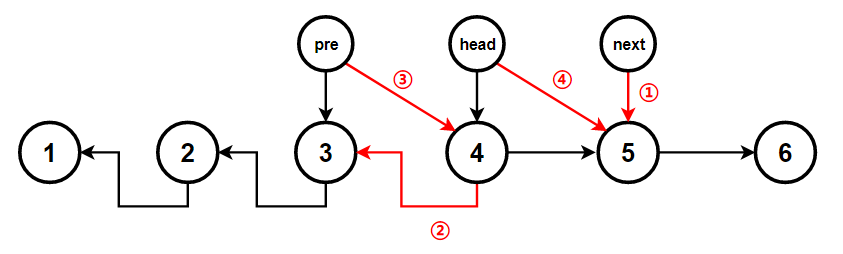

这样就完成了一个结点的反转。**持续下去**。代码如下。不要记代码，理解过程自己推就行了，分析中间的一般行为即可。

```go
/**
 * Definition for singly-linked list.
 * type ListNode struct {
 *     Val int
 *     Next *ListNode
 * }
 */
func reverseList(head *ListNode) *ListNode {
    // null或只有一个结点的情况
    if(head == nil || head.next == nil) {
        return head;
    }
    
    // 初始化两个指针指向null
    var pre *ListNode
    var next *ListNode

    for (head != nil){
        next = head.Next
        head.Next = pre
        pre = head
        head = next
    }

    return pre
}


//利用Go语言交换数值的特性，可以只使用一个指针
func reverseList(head *ListNode) *ListNode {
    if head == nil{
        return nil
    }
    var cur *ListNode
    for head != nil{
        head.Next,cur,head = cur,head,head.Next
    }
    return cur
}
```

**==记住下面这个头插法就行！！！==**上述修改指针较为复杂，这里用一种**两个指针**的头插法，也就是引入 **dummy 结点**，然后把**第一个结点**先弄好，之后每次将新的结点插入到 dummy 结点的**后面一个**。

```go
func reverseList(head *ListNode) *ListNode {
    // null或只有一个结点的情况
    if(head == nil || head.next == nil) {
        return head;
    }
    // 引入dummy结点
	var dummy *ListNode
    // 使用一个cur表示当前正在反转的结点
    var cur *ListNode
    // head一直后移
    head = head.next;
    // 先把链表第一个结点放到dummy后面当做反转后的最后一个结点
    dummy.next = cur
    cur.next = nil
    // 下面就是不断遍历了
     while(head != nil) {
        // cur指向头结点
        cur = head
        // 移动头结点
        head = head.next;
        // 将cur结点插入到dummy结点之后形成新的链表
        cur.next = dummy.next;
        dummy.next = cur;
    }
    return dummy.next
}
```

---

#### 反转指定范围的链表【中等】

##### 1. 题目

反转从**位置 m 到 n** 的链表。请使用**一趟扫描**完成反转。说明：1 ≤ m ≤ n ≤ 链表长度。

```java
示例:
输入: 1->2->3->4->5->NULL, m = 2, n = 4
输出: 1->4->3->2->5->NULL
```

链接：https://leetcode-cn.com/problems/reverse-linked-list-ii

##### 2. 题解

这里类似反转单向链表，也可以用**栈**的方式解决，但是空间复杂度较高。一般都是用迭代直接修改指针。

###### (1) 迭代法

将链表分为 3 个部分，2 个**不反转**部分和 1 个**反转**的部分。

**关键点**：m的前一个节点；m和n区间的反转；n之后的节点

- 前面的**不反转**部分，**保留最后一个节点**，后面的不反转部分，保留**第一个**节点。
- 对于**反转**部分，要**保留两个端点**。
- 反转结束后，将三个部分**拼接**起来。

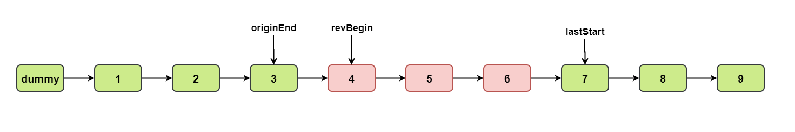

由于**反转**的可能包含第一个结点，所以**引入 dummy 结点**。同时引入一个 **cur** 指针，**从前往后**一直遍历。

1->2->3->4->5->6,假设m=3,n=5
prem = 2, m = 3, n = 5, n + 1= 6

1. 定义一个next指向head的虚拟指针（为了最后返回head），并定义prem

2. 使用迭代法反转m到n的链表，pre为反转后n的节点，current为n+1节点

   链表变为：1->2->3<-4<-5 6

3.  原m节点为prem.Next需要指向n+1节点current（2->3原链表还没断）

   prem.Next.Next = current

4. 反转后的m节点为pre，prem需要重新指向反转后的m节点(2->3链表已经断，更新为了2->5)

   prem.Next = pre

   最终链表变为：1->2->5->4->3->6

```go
/**
 * Definition for singly-linked list.
 * type ListNode struct {
 *     Val int
 *     Next *ListNode
 * }
 */
func reverseBetween(head *ListNode, left int, right int) *ListNode {
    if head == nil || head.Next == nil{
        return head
    }

    dummy := &ListNode{
        Next : head,
    }
    pre := dummy
    for i := 0; i < left - 1; i++{
        pre = pre.Next
    }
    cur := pre.Next 
    for i := 0; i < right - left; i++{
        cur.Next, pre.Next, cur.Next.Next = cur.Next.Next, cur.Next, pre.Next
    }
    return dummy.Next //head
}
```

#### K个一组翻转链表【困难】

##### 1. 题目

给你一个链表，每 **k 个节点一组**进行翻转，请你返回翻转后的链表。k 是一个正整数，它的值小于或等于链表的长度。如果节点总数**不是 k** 的整数倍，那么请将最后**剩余的节点保持原有顺序**。

题目要求：你的算法只能使用**常数**的额外空间。

示例：

```java
给你这个链表：1->2->3->4->5
当 k = 2 时，应当返回: 2->1->4->3->5
当 k = 3 时，应当返回: 3->2->1->4->5
```

不是仅交换数值，需要**交换结点**。

链接：https://leetcode-cn.com/problems/reverse-nodes-in-k-group

##### 2. 题解

题目要求：你的算法只能使用**常数**的额外空间。说明**不能用递归**，只能用**迭代**的方式进行。

做题之前先自己画个图想想大致思路，理清每一个临界位置的指向。

- 首先通过 **k 次 for 循环用 end 指针指向翻转元素的末尾**。
- 此时判断一下如果翻转元素不到 k 个，即 end==null，说明**已经到达末尾**，直接返回即可。
- 接下来需要定义两个指针 **pre 和 pLast 分别记录翻转元素的前驱和后继**，以便将翻转元素前后两部分连接起来。
- 之后再重置 **pre 和 end 指针**，进入下一次循环。
- 遍历完之后返回 dummy 带头结点下一个元素即可。

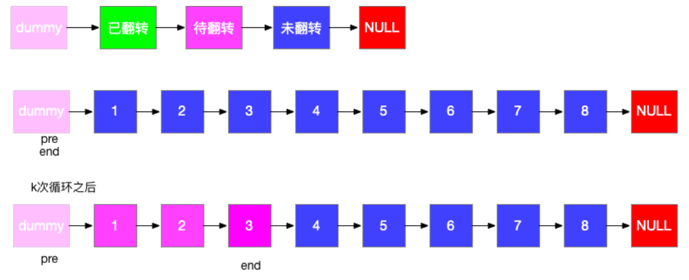

由于第一个结点需要进行**反转**，所以需要一个 **dummy** 结点。

```go
/**
 * Definition for singly-linked list.
 * type ListNode struct {
 *     Val int
 *     Next *ListNode
 * }
 */
func reverseKGroup(head *ListNode, k int) *ListNode{
   //特殊情况，反转即本身
    if k <= 1{
        return head
    }
    
    //定义dummy节点,dummy.Next保存头结点信息
    dummy := &ListNode{
        Next: head,
    }
    //定义尾结点，确定每一组的尾部
    tail := dummy
    //移动tail到每一组的结尾
    for i := 0; i < k; i++{
        //如果不足K个节点
        if tail.Next == nil{
            return dummy.Next
        }
        tail = tail.Next
    }
    
    zero := dummy
    for{
        //反转
        first := zero.Next //保存zero节点的next节点信息
        zero.Next = tail //将zero节点指向这一组的尾结点
        l, r := first, first.Next // 相邻的两个节点（左右节点）
        first.Next = tail.Next //原始的本组首节点指向下一组的首节点
        for i := 2; i <= k; i++ {
			tmp := r.Next //暂存右节点的next节点信息
			r.Next = l // 交换左右两个节点
			l, r = r, tmp //向后移动一位
		}
        
		// 位移k个节点
        zero = first 
        tail = first
        for i := 0; i < k; i++{
            if tail.Next == nil{
                return dummy.Next
            }
            tail = tail.Next
        }
    }
}
```

#### 两两交换链表中的节点【中等】

##### 1. 题目

给定一个链表，**两两交换**其中相邻的节点，并返回交换后的链表。你**不能**只是单纯的改变节点内部的值，而是**需要实际的进行节点交换**。

示例:

```
给定 1->2->3->4, 你应该返回 2->1->4->3.
```

链接：https://leetcode-cn.com/problems/swap-nodes-in-pairs

##### 2. 题解

这里应该也可以利用 K 个一组反转链表的解法，只不过 K = 2。

###### (1) 双指针遍历法

- 首先由于需要操作**头结点**，因此引入一个 **dummy** 结点，用于保存最后返回的头结点。
- 再引入一个 **cur 结点**，后续 cur 作为 dummy 结点移动。
- 后续的结点**两两一组进行交换**，主要是注意指针的变换，类似于普通的**变量交换**，画图理解即可！
- 当完成两个之后，cur 指针往**后移动两步**，head 移动到 cur 的**后面**，再次重复上述的交换动作。直到 cur 的后面没有结点或者只有一个结点为止。

图示如下图。

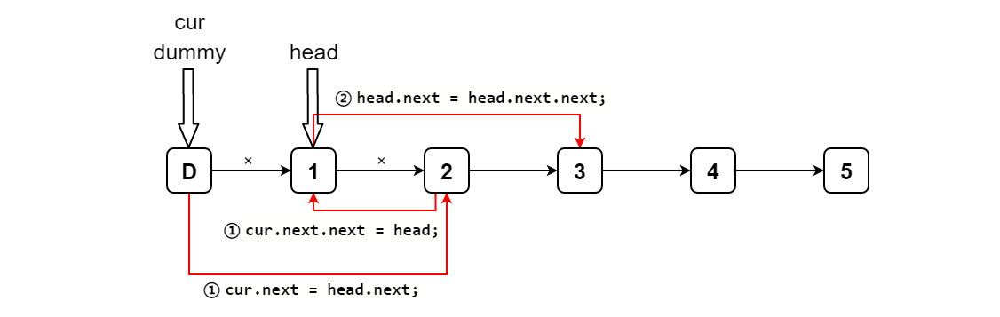

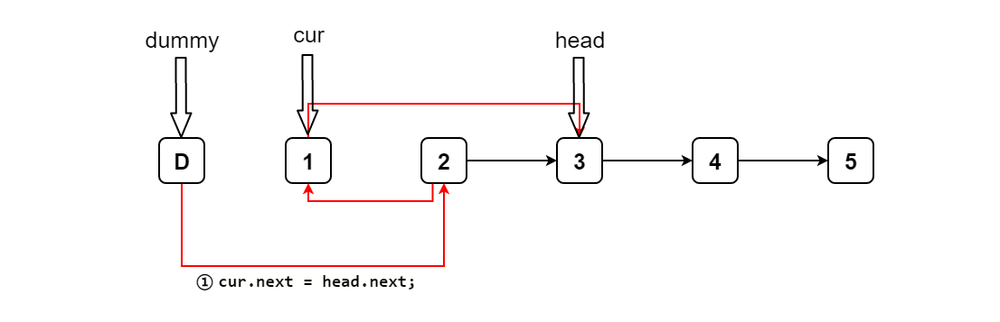

```go
/**
 * Definition for singly-linked list.
 * type ListNode struct {
 *     Val int
 *     Next *ListNode
 * }
 */
func swapPairs(head *ListNode) *ListNode {
    //特殊情况处理
    if head == nil || head.Next == nil{
        return head
    }

    //需要操作头结点，引入dummy节点，cur节点
    dummy := &ListNode{
        Next: head,
    }
    cur := dummy //cur节点用于标识当前节点

    //当cur节点后面不足2个节点就停止
    for(cur.Next != nil && cur.Next.Next != nil){
        //交换，典型三步
        cur.Next = head.Next //cur.Next指向当前分组的第一个节点,也相当于保存了第一个节点的信息，方便后续指向head节点
        head.Next = head.Next.Next //第二个节点Next指向第一个节点
        cur.Next.Next = head //第一个节点Next指向头结点

         // cur往后移动2个结点
        cur = cur.Next.Next
        // head移动到cur后面
        head = cur.Next
    }

    return dummy.Next
}
```

###### (2) 递归解法

用 newHead 表示新的链表的头节点，原始链表的第二个节点，则**原始链表中的其余节点的头节点是 newHead.next**。令 head.next = swapPairs(newHead.next)，表示将其余节点进行两两交换，交换后的**新的头节点为 head 的下一个节点**。然后**令 newHead.next = head，即完成了所有节点的交换**。最后返回新的链表的头节点 newHead。

```go
func swapPairs(head *ListNode) *ListNode {
    if head == nil || head.Next == nil{
        return head
    }
    //newHead表示原始链表第二个节点，新链表的头结点
    newHead := head.Next
    //原始链表的其余节点的头结点就是newHead.Next，下面表示两两交换
    head.Next = swapPairs(newHead.Next)
    //最终一步
    newHead.Next = head
    return newHead
}
```

#### [剑指 Offer 06. 从尾到头打印链表【简单】](https://leetcode-cn.com/problems/cong-wei-dao-tou-da-yin-lian-biao-lcof/)

##### 1. 题目

输入一个链表的头节点，从尾到头反过来返回每个节点的值（用数组返回）。

```
输入：head = [1,3,2]
输出：[2,3,1]
```

##### 2. 题解

###### (1) 递归法

因为是从尾到头返回每一个节点的值，所以很容易想到如果从最后的节点将值放入数组中，然后再往前逐步将数据放入数组，最后回到头节点返回即可，可以想到递归就能轻松做到，只要注意递归函数的结束条件即可。

```go
/**
 * Definition for singly-linked list.
 * type ListNode struct {
 *     Val int
 *     Next *ListNode
 * }
 */
func reversePrint(head *ListNode) []int {
    if head == nil {
        return []int{}
    }
    res := reversePrint(head.Next)
    return append(res, head.Val)
}
```

###### (2)栈

```go
import "container/list"

func reversePrint(head *ListNode) []int {
    if head == nil {
        return []int{}
    }
	
    //初始化一个栈
    res := list.New()
    for head != nil{
        res.PushFront(head.Val)//入栈
        head = head.Next
    }
    ret := []int{}
    for e := res.Front(); e != nil; e = e.Next(){ //从栈顶依次读取栈内数据
        ret = append(ret, e.Value.(int))
    }
    
    return ret
}

/****************************************************************/
func reversePrint(head *ListNode) []int {
    res := []int{}
    result := []int{}
    if head == nil{
        return res
    }
    
    for head != nil{
        res = append(res, head.Val)
        head = head.Next
    }

    for len(res) > 0{
        val := res[len(res) - 1]
        res = res[:len(res) - 1]
        result = append(result, val)
    }

    return result
}
```

###### (3)反转链表再生成数组返回

```go
func reversePrint(head *ListNode) []int {
    if head == nil {
        return []int{}
    }
    
	var newHead *ListNode
    res := []int{}
    
    for head != nil{
        node := head.Next
        head.Next = newHead
        newHead = head
        head = node
    }
    
    for newHead != nil{
        res = append(res, newHead.Val)
        newHead = newHead.Next
    }
    
    return res
}
```

###### (4)顺序获取值生成数组，反转数组

```go
func reversePrint(head *ListNode) []int {
    if head == nil {
        return []int{}
    }
	
    res := []int{}
    
    for head != nil{
        res = append(res, head.Val)
        head = head.Next
    }
    
    for i,j := 0, len(res)-1; i < j;{
        res[i], res[j] = res[j], res[i]
        i++
        j--
    }
    
    return res
}
```


### 链表合并与切分类题目

#### 合并两个有序的链表【简单】

##### 1. 题目

两个链表都是从小到大排列，合并两个链表，使其合并之后依然是从小到大排列。

##### 2. 题解

###### (1) 递归法

**递归版本**，额外空间为 **O(N)**。

```go
/**
 * Definition for singly-linked list.
 * type ListNode struct {
 *     Val int
 *     Next *ListNode
 * }
 */
func mergeTwoLists(l1 *ListNode, l2 *ListNode) *ListNode {
    if l1 == nil {
        return l2
    }else if l2 == nil {
        return l1
    }
    
	//比较两个链表当前第一个节点值的大小，交换指针，比较好写但是难理解（1）
    if l1.Val > l2.Val{
        l1, l2 = l2, l1
    }
    l1.Next = mergeTwoLists(l1.Next, l2)  
    return l1
    
    //好理解的部分（2）
    if l1.Val > l2.Val {
		l2.Next = mergeTwoList(l1, l2.Next)
		return l2
	} else {
		l1.Next = mergeTwoList(l1.Next, l2)
		return l1
	}
}
```

###### (2) 非递归版本

**非递归版本**：就是需要找到**小的起始值**开始遍历合并。

```go
func mergeTwoLists(l1 *ListNode, l2 *ListNode) *ListNode {
    temp := &ListNode{}
    res := temp

    //遍历比较
    for l1 != nil && l2 != nil{
        if l1.Val < l2.Val{
            temp.Next = l1
            l1 = l1.Next
        }else{
            temp.Next = l2
            l2 = l2.Next
        }
        temp = temp.Next
    }
    //当其中一个链表为空的时候，续接另一个链表
    if l1 == nil{
        temp.Next = l2
    }else{
        temp.Next = l1
    }

    return res.Next
}
```

#### 合并K个有序链表【困难】

##### 1. 题目

**合并 k** 个排序链表，返回合并后的排序链表。请分析和描述算法的复杂度。

示例:

```
输入:
[
  1->4->5,
  1->3->4,
  2->6
]
输出: 1->1->2->3->4->4->5->6
```

链接：https://leetcode-cn.com/problems/merge-k-sorted-lists

##### 2. 题解

###### (1) 逐一比较

- 比较 k 个节点（每个链表的首节点），获得最小值的节点。
- 选用小顶堆
- 将选中的节点接在最终有序链表的后面。

```go
type ListNodes []*ListNode

func (l *ListNodes) Len() int {
	return len(*l)
}

func (l *ListNodes) Less(i, j int) bool {
	return (*l)[i].Val < (*l)[j].Val
}

func (l *ListNodes) Swap(i, j int) {
	(*l)[i], (*l)[j] = (*l)[j], (*l)[i]
}

func (l *ListNodes) Pop() interface{} {
	n := len(*l)
	x := (*l)[n-1]
	*l = (*l)[:n-1]
	return x
}

func (l *ListNodes) Push(x interface{}) {
	*l = append(*l, x.(*ListNode))
}

func mergeKLists(lists []*ListNode) *ListNode {
	listNodes := &ListNodes{}
	heap.Init(listNodes)
	for _, v := range lists {
		if v != nil {
			heap.Push(listNodes, v)
		}
	}
	head := &ListNode{}
	idx := head
	for listNodes.Len() > 0 {
		val := heap.Pop(listNodes).(*ListNode)
		idx.Next = val
		if val.Next != nil {
			heap.Push(listNodes, val.Next)
		}
		idx = idx.Next
	}
	return head.Next
}
```

###### (2) 用优先队列优化方法

- 将当前所有单链表头部元素构建成优先队列，该优先队列的最小值为全局最小值
- 取出该最小值，从最小值所属队列取出它的后继重新加入优先队列
- 重复如上操作，直到队列不包含任何元素

```go
type PQ []*ListNode 

func (p PQ) Len() int { return len(p) }
func (p PQ) Swap(i, j int) {
    p[i], p[j] = p[j], p[i]
}
func (p PQ) Less(i, j int) bool {
    return p[i].Val < p[j].Val
}

func (p *PQ) Push(x interface{}) {
	node := x.(*ListNode)
	*p = append(*p, node)
}

func (p *PQ) Pop() interface{} {
	old := *p
	n := len(old)
	item := old[n-1]
	*p = old[0 : n-1]
	return item
}

func mergeKLists(lists []*ListNode) *ListNode {
    h := &ListNode {
        Val: -1,
        Next: nil,
    }
    t := h
    if len(lists) == 0 {
        return h.Next
    }
    
    pq := make(PQ, 0)
    for i, _ := range lists {
        if lists[i] != nil {
            pq = append(pq, lists[i])
        }
    }
    heap.Init(&pq)
    
    for len(pq) > 0 {
        item := heap.Pop(&pq).(*ListNode)
        next := item.Next
        
        item.Next = t.Next
        t.Next = item
        t = item
        
        if next != nil {
            heap.Push(&pq, next)
        }
    }
    
    return h.Next
}
```

###### (3) 逐一两两合并链表

利用上题的思想，**将合并 k 个链表的问题转化成合并 2 个链表 k-1 次**。

```go
func mergeKLists(lists []*ListNode) *ListNode {
    if len(lists) == 0{
        return nil
    }
    res := lists[0]
    for i := 1; i < len(lists); i++{
        res = merge(res, lists[i])
    }
    return res
}

func merge(l1 *ListNode, l2 *ListNode) *ListNode{
    if l1 == nil{
        return l2
    }else if l2 == nil{
        return l1
    }
    
    if l1.Val > l2.Val{
        l1, l2 = l2, l1
    }
    l1.Next = merge(l1.Next, l2)
    return l1
}
```

###### (4) 分治法

这个方法沿用了上面的解法，但是进行了较大的优化。我们不需要对大部分节点重复遍历多次。

```go
func mergeKLists(lists []*ListNode) *ListNode {
    return merge(lists, 0, len(lists) - 1)
}

func merge(lists []*ListNode, l, r int) *ListNode{
    if l == r{
        return lists[l]
    }
    if l > r{
        return nil
    }
    mid := l + (r - l) / 2

    return mergeTwoLists(merge(lists, l, mid), merge(lists, mid + 1, r))
}


func mergeTwoLists(l1 *ListNode, l2 *ListNode) *ListNode{
    if l1 == nil{
        return l2
    }else if l2 == nil{
        return l1
    }

    if l1.Val > l2.Val{
        l1, l2 = l2, l1
    }
    l1.Next = mergeTwoLists(l1.Next, l2)
    return l1
}
```


#### 分隔链表【中等】

##### 1. 题目

给定一个**链表**和一个**特定值 x**，对链表进行分隔，使得所有**小于 x 的节点都在大于或等于 x 的节点之前**。你应当保留两个分区中每个节点的初始相对位置。

示例:

```
输入: head = 1->4->3->2->5->2, x = 3
输出: 1->2->2->4->3->5
```

链接：https://leetcode-cn.com/problems/partition-list

##### 2. 题解

###### (1) 双指针法

可以用两个指针`before` 和 `after` 来追踪**两个链表**。两个指针可以用于分别创建两个链表，然后将这两个链表连接即可获得所需的链表。

- 引入 **Dummy** 结点。

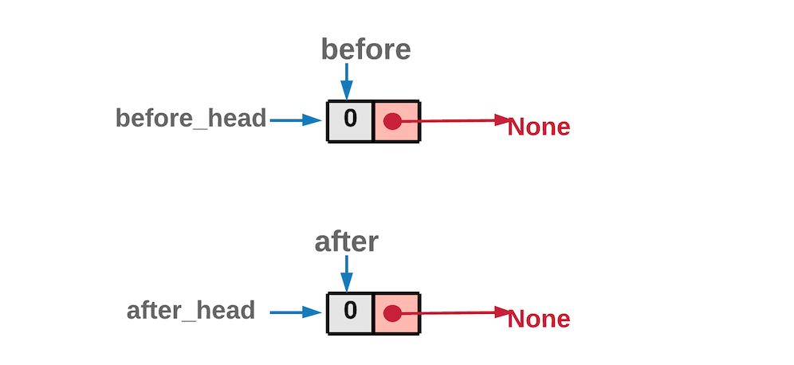

- 不断**遍历**原链表，**小的结点挂载到小的链表，大于等于的结点挂载到大的结点**。

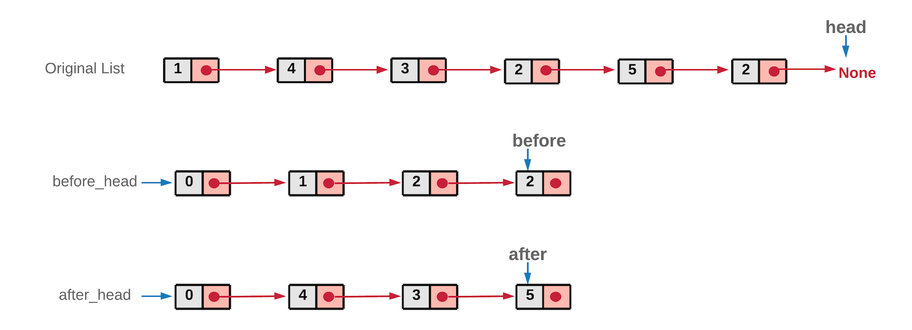

- 最后将**两个链表连接起来**。整个过程没有新建结点，额外空间是 O(1) 的。

```go
/**
 * Definition for singly-linked list.
 * type ListNode struct {
 *     Val int
 *     Next *ListNode
 * }
 */
func partition(head *ListNode, x int) *ListNode {
    //low存储小于x的节点，high存储大于x的节点
    dummyLow := &ListNode{}
    dummyHigh := &ListNode{}
    low := dummyLow
    high := dummyHigh

    for head != nil{
        if head.Val < x{
            low.Next = head
            low = low.Next
        }else{
            high.Next = head
            high = high.Next
        }
        head = head.Next
    }

    //连接两个链表
    low.Next, high.Next = dummyHigh.Next, nil

    return dummyLow.Next
}
```


#### 奇偶链表【中等】

##### 1. 题目

给定一个单链表，把所有的**奇数节点**和**偶数节点**分别**排在一起**。请注意，这里的奇数节点和偶数节点指的是**节点编号**的奇偶性，而**不是节点的值的奇偶性**。

请尝试使用**原地算法**完成。你的算法的空间复杂度应为 **O(1)**，时间复杂度应为 O(N)，N 为节点总数。

```java
示例 1:
输入: 1->2->3->4->5->NULL
输出: 1->3->5->2->4->NULL

示例 2:
输入: 2->1->3->5->6->4->7->NULL 
输出: 2->3->6->7->1->5->4->NULL
```

说明：应当保持奇数节点和偶数节点的**相对顺序**。链表的第一个节点视为奇数节点，第二个节点视为偶数节点，以此类推。

链接：https://leetcode-cn.com/problems/odd-even-linked-list

##### 2. 题解

###### (1) 双指针法

这个题跟上个题类似，只不过判断条件变化了。将奇节点放在一个链表里，偶链表放在另一个链表里。然后把偶链表接在奇链表的**尾部**。

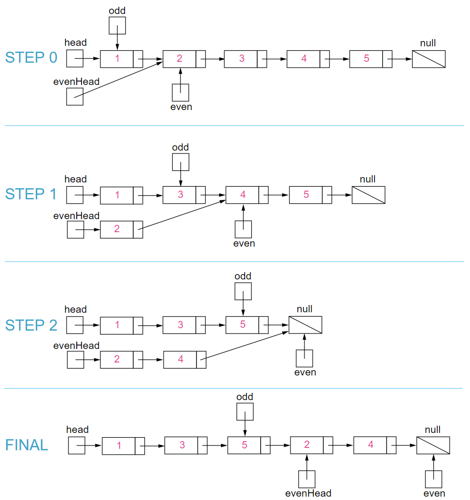

```java
/**
 * Definition for singly-linked list.
 * type ListNode struct {
 *     Val int
 *     Next *ListNode
 * }
 */
func oddEvenList(head *ListNode) *ListNode {
    if head == nil {
        return nil
    }

    //用head2来保存偶节点头部
    head2 := head.Next
    h1 := head
    h2 := head2

    for h1.Next != nil && h2.Next != nil{
        //两个指针交替前进
        h1.Next = h2.Next
        h1 = h1.Next
        h2.Next = h1.Next
        h2 = h2.Next
    }
    //将偶链表头部连接到奇链表尾部
    h1.Next = head2

    return head
}
```


#### 链表分隔成K个链表【中等】

##### 1.题目

给定一个头结点为 root 的链表, 编写一个函数以将链表**分隔为 k 个连续**的部分。每部分的长度应该尽可能的相等: 任意两部分的长度差距不能超过 1，也就是说可能有些部分为 null。这k个部分应该按照在链表中出现的顺序进行输出，并且排在前面的部分的长度应该大于或等于后面的长度。

返回一个符合上述规则的链表的列表。

```java
示例 1：
输入: 
root = [1, 2, 3], k = 5
输出: [[1],[2],[3],[],[]]
解释:
输入输出各部分都应该是链表，而不是数组。
例如, 输入的结点 root 的 val= 1, root.next.val = 2, \root.next.next.val = 3, 且 root.next.next.next = null。
第一个输出 output[0] 是 output[0].val = 1, output[0].next = null。
最后一个元素 output[4] 为 null, 它代表了最后一个部分为空链表。
    
示例 2：
输入: 
root = [1, 2, 3, 4, 5, 6, 7, 8, 9, 10], k = 3
输出: [[1, 2, 3, 4], [5, 6, 7], [8, 9, 10]]
解释:
输入被分成了几个连续的部分，并且每部分的长度相差不超过1.前面部分的长度大于等于后面部分的长度。
```

链接：https://leetcode-cn.com/problems/split-linked-list-in-parts

##### 2. 题解

###### (1) 辅助空间法

使用额外空间，肯定可以做出来，但是代价有点高。

###### (2) 迭代法

本题实质：考察如何划分一个整数 n。
巧妙类比：
（1）先数出有多少块**小糖**，得 n 块；
（2）将 n 块小糖分给 **k 个小朋友**，从左往右**均分** **(n / k)** 块；
（3）前面的**(n % k)** 个人在分的时候**多的一份**，记录一下**前面有多少个人需要多分一份**。

```go
/**
 * Definition for singly-linked list.
 * type ListNode struct {
 *     Val int
 *     Next *ListNode
 * }
 */
func splitListToParts(root *ListNode, k int) []*ListNode {
    cur := root 
    n := 0
    //遍历链表得到链表总长度
    for cur != nil{
        cur = cur.Next
        n++
    }

    width := n / k
    rem := n % k

    var res []*ListNode //创建返回的结果切片
    cur = root

    last := 0 //用来指示前面的链表多分配一个节点
    for i := 0; i < k; i++{
        write := root //保存当前头结点信息
        
        if i < rem{
            last = 1
        }else{
            last = 0
        }
        //寻找分割点
        for j := 1; j < width + last; j++{
            root = root.Next
        }
        //进行分割
        if root != nil{
            temp := root.Next
            root.Next = nil
            res = append(res, write)
            root = temp
        }else{
            res = append(res, nil)
        }
    }
    return res
}
```


#### 重排链表【中等】

##### 1. 题目

给定一个**单链表 L**：L0→L1→…→Ln-1→Ln ，将其重新排列后变为： L0→Ln→L1→Ln-1→L2→Ln-2→…

也就是**不断从链表两边取结点组合形成新的链表**。

你不能只是单纯的改变节点内部的值，而是需要实际的进行**节点交换**。

```java
示例 1:
给定链表 1->2->3->4, 重新排列为 1->4->2->3.
    
示例 2:
给定链表 1->2->3->4->5, 重新排列为 1->5->2->4->3.
```

链接：https://leetcode-cn.com/problems/reorder-list

##### 2. 题解

###### (1) 线性表存储法

链表的缺点就是**不能随机存储**，当我们想取末尾元素的时候，只能从头遍历一遍，很耗费时间。第二次取末尾元素的时候，又得遍历一遍。

所以先来个简单粗暴的想法，**把链表存储到线性表中**，然后用双指针依次从头尾取元素即可。

```go
func reorderList(head *ListNode)  {
    // 单节点直接返回
    if head == nil || head.Next == nil {
        return
    }

    // list 顺序存储所有节点
    var list []*ListNode
    var p = head
    for p != nil {
        list = append(list, p)
        p = p.Next
    }

    // 双指针 左右同时向中间靠拢
    var i, j = 0, len(list)-1
    for i < j {
        list[i].Next = list[j]
        list[j].Next = list[i+1]
        i++
        j--
    }
    list[i].Next = nil // 尾部节点
}
```

###### (2) 逆转后半部分法

- 利用由于是**一头一尾取元素**的特点。先利用**快慢指针找到链表的中间结点**。
- 将后半部分**链表逆序**（可以迭代或者递归逆序）。
- 最后将前后**两个部分的链表交替连接合并起来即可**。

```go
/**
 * Definition for singly-linked list.
 * type ListNode struct {
 *     Val int
 *     Next *ListNode
 * }
 */
func reorderList(head *ListNode)  {
    if head == nil || head.Next == nil || head.Next.Next == nil{
        return
    }

    //利用快慢指针找中点，把链表分成两部分
    slow := head
    fast := head
    for fast.Next != nil && fast.Next.Next != nil{
        slow = slow.Next
        fast = fast.Next.Next
    }

    //断开指针，将链表分为两个部分，newHead成为新的链表的头部
    newHead := slow.Next
    slow.Next = nil

    //第二个链表逆序
    newHead = reverseList(newHead)
    
 	var temp *ListNode
    //链表节点交错合并
    for newHead != nil{
        temp = head.Next
        head.Next = newHead
        head = temp

        temp = newHead.Next
        newHead.Next = head
        newHead = temp
    }
}

//逆序链表
func reverseList(head *ListNode) *ListNode{
    if (head == nil){
        return nil
    }

    var pre *ListNode
    var next *ListNode

    for (head != nil){
        next = head.Next
        head.Next = pre
        pre = head
        head = next
    }   

    return pre
}
```


#### 两个链表当成数字相加生成新链表【中等】

##### 1. 题目

给出两个**非空的链表**用来表示两个**非负**的整数。其中，它们各自的位数是按照 **逆序 的方式存储**的，并且它们的每个节点只能存储 一位 数字。如果，我们将这两个数相加起来，则会返回一个新的链表来表示它们的和。您可以假设除了数字 0 之外，这两个数都不会以 0 开头。

示例：

```java
输入：(2 -> 4 -> 3) + (5 -> 6 -> 4)
输出：7 -> 0 -> 8
原因：342 + 465 = 807
```

链接：https://leetcode-cn.com/problems/add-two-numbers

##### 2. 题解

###### (1) 使用栈

使用两个栈，将**两个链表压栈**，然后**逐渐弹栈**，使用一个 **ca 变量来保存进位**信息。最后注意**最高位**是否有进位。

```java
public static Node addTwoListWithSatck(Node head1, Node head2) {
    // 初始化两个栈并把链表压栈
    Stack<Integer> stack1 = new Stack<>();
    Stack<Integer> stack2 = new Stack<>();
    while (head1 != null) {
        stack1.push(head1.value);
        head1 = head1.next;
    }
    while (head2 != null) {
        stack2.push(head2.value);
        head2 = head2.next;
    }
    // 记录进位 0-无进位 1-有进位
    int ca = 0;
    int n1 = 0;
    int n2 = 0;
    int n = 0;
    Node node = null;
    Node pre = null;
    // 不断弹栈
    while (!stack1.isEmpty() || !stack2.isEmpty()) {
        n1 = stack1.isEmpty() ? 0 : stack1.pop();
        n2 = stack2.isEmpty() ? 0 : stack2.pop();
        // 求两个位置的和并判断是否有进位
        n = n1 + n2 + ca;
        pre = node;
        // 只记录个位
        node = new Node(n % 10);
        node.next = pre;
        // 记录进位信息
        ca = n / 10;
    }
    // 当两个栈都弹完看看进位信息是否为1 是则还需要再加一个结点
    if (ca == 1) {
        pre = node;
        node = new Node(1);
        node.next = pre;
    }
    return node;
}
```

上述空间复杂度为 O(N)。

###### (2) 直接相加法

直接将两个链表加起来就行了。由于输入的两个链表都是逆序存储数字的位数的，因此两个链表中同一位置的数字可以直接相加。

我们同时遍历两个链表，逐位计算它们的和，并与当前位置的进位值相加。

如果两个链表的长度不同，则可以认为长度短的链表的后面有若干个 00 。

此外，如果链表遍历结束后，carry>0，还需要在答案链表的后面附加一个节点，节点的值为 carry。

````go
func addTwoNumbers(l1 *ListNode, l2 *ListNode) *ListNode {
    dummy := new(ListNode) //new函数会分配内存，返回的值是一个指向该类型零值的地址。空指针引用会报错
    cur := dummy
    carry := 0 //保存进位信息

    for l1 != nil || l2 != nil || carry > 0{
        cur.Next = new(ListNode)
        cur = cur.Next
        if l1 != nil{
            carry += l1.Val
            l1 = l1.Next
        }
        if l2 != nil{
            carry += l2.Val
            l2 = l2.Next
        }

        cur.Val = carry % 10
        carry /= 10
    }
    return dummy.Next
}
````


### 删除结点类题目

#### 删除链表结点【简单】

##### 1. 题目

请编写一个函数，使其可以删除某个**链表中给定的（非末尾）节点**，你将只被给定要求被删除的节点。

现有一个链表 -- head = [4,5,1,9]，它可以表示为:


链接：https://leetcode-cn.com/problems/delete-node-in-a-linked-list/

示例 1：

```
输入：head = [4,5,1,9], node = 5
输出：[4,1,9]
解释：给定你链表中值为 5 的第二个节点，那么在调用了你的函数之后，该链表应变为 4 -> 1 -> 9.
```

- 链表至少包含两个节点。
- 链表中所有节点的值都是唯一的。
- 给定的节点为非末尾节点并且一定是链表中的一个有效节点。
- 不要从你的函数中返回任何结果。

##### 2. 题解

此题是**没有给头结点**的，比较特殊，**不能通过遍历**来找到该结点。

- 按照题目要求先**确保不是尾结点**。
- 然后用该结点的**下一个结点的==值覆盖==**掉要删除元素的值，最后再**将重复元素断链**即达到了删除重复结点的方法。

```go
/**
 * Definition for singly-linked list.
 * type ListNode struct {
 *     Val int
 *     Next *ListNode
 * }
 */
func deleteNode(node *ListNode) {
    node.Val = node.Next.Val //用该结点的下一个结点的值覆盖掉要删除元素的值
    node.Next = node.Next.Next //重复元素断链
}
```

#### 删除等于某个值的全部节点【简单】

##### 1. 题目

删除链表中等于给定值 **val** 的所有节点。

**示例:**

```
输入: 1->2->6->3->4->5->6, val = 6
输出: 1->2->3->4->5
```

连接：https://leetcode-cn.com/problems/remove-linked-list-elements/

##### 2. 题解

- 由于可能需要删除头结点，**引入 dummy 节点**。
- 需要注意几种特殊情况，一是删除头结点，二是需要删除的节点连在一起，三是删除末尾节点。

```go
func removeElements(head *ListNode, val int) *ListNode {
    if head == nil{
        return head
    }
    //可能删除头结点，引入dummy节点
    dummy := &ListNode{
        Next: head,
    }
    cur := dummy

    for cur != nil && cur.Next != nil{
         // 如果下一个结点的值与给定值相等，则跳过下一个结点
        // 此时cur指针不动，这是为了应对几个需要删除的结点连在一起
        if cur.Next.Val == val{
            cur.Next = cur.Next.Next
        }else{
            // 如果不是要删的就直接移动cur指针即可
            cur = cur.Next
        }
    }
    return dummy.Next
}
```

#### 删除排序链表中的重复元素【简单】

##### 1. 题目

给定一个**排序链表**，删除**所有重复**的元素，使得每个元素**只出现一次**。

```java
示例 1:
输入: 1->1->2
输出: 1->2

示例 2:
输入: 1->1->2->3->3
输出: 1->2->3
```

链接：https://leetcode-cn.com/problems/remove-duplicates-from-sorted-list

##### 2. 题解

解法跟上一个类似。直接**迭代遍历**，对比**当前值和下一个结点**的值，如果**相同则跳过下一个结点**，如果不同则移动当前节点到下一个。

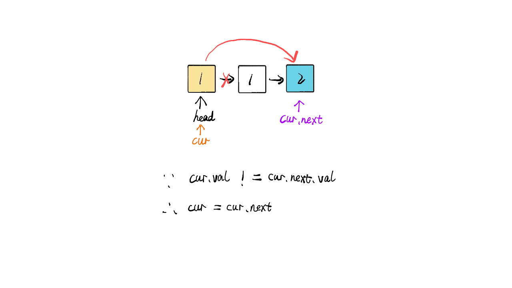

这里头结点是肯定保留的，所以不用 dummy 结点。

```go
func deleteDuplicates(head *ListNode) *ListNode {
    cur := head
    for cur != nil && cur.Next != nil{
        if cur.Val == cur.Next.Val{
            cur.Next = cur.Next.Next
        }else{
            cur = cur.Next
        }
    }
    return head
}
```


#### 删除排序链表中的重复元素II【中等】

##### 1. 题目

给定一个**排序链表**，删除所有含有**重复数字**的节点，只保留原始链表中 **没有重复出现** 的数字。

```java
示例 1:
输入: 1->2->3->3->4->4->5
输出: 1->2->5

示例 2:
输入: 1->1->1->2->3
输出: 2->3
```

链接：https://leetcode-cn.com/problems/remove-duplicates-from-sorted-list-ii

##### 2. 题解

这种题用额外空间非常容易。但是这样就炸了。

迭代**滑动窗口**解决。与链表的其他题目类似，为了防止**删除头结点的极端**情况发生，先创建空结点 **dummy**，使 dummy 指向传入的 head 结点。
然后创建 **cur** 的指针，指向链表的**头部**（即 dummy）。
接着对 cur 指针**迭代**，因为要对比 cur( cur 最初始的定义指向空结点)指针的**下一个结点与下下一个结点的值**是否相等，为了防止产生空指针异常，故**退出迭代的条件**为：**cur.next != null && cur.next.next != null**。
在迭代过程中，如果 **cur.next.val == cur.next.next.val** 说明此时**有重复元素**，此时创建一个**临时指针 temp**，指向 cur 的**下一个节点**，即temp 指向的**第一个重复元素**所在的位置。通过 while 循环**去重**，去重后，temp 指向的是**重复元素中的最后一个位置**。最后 cur.next = temp.next 就实现了**消除**重复元素。
当然，如果为发现重复元素，则直接向后迭代即可。迭代完成后，返回 dummy 的 next。

```go
func deleteDuplicates(head *ListNode) *ListNode {
    if head == nil{
        return head
    }
    //可能删除头结点，定义dummy节点
    dummy := &ListNode{
        Next: head,
    }
    cur := dummy

    for cur.Next != nil && cur.Next.Next != nil{
        if cur.Next.Val == cur.Next.Next.Val{
            temp := cur.Next
            //循环去重,此时temp指向重复元素的最后一个
            for temp != nil && temp.Next != nil && temp.Val == temp.Next.Val{
                //这里与普通去重不一样的是要删除自身的重复节点
                temp = temp.Next 
            }
            //去重完毕后，最后一个重复节点的下一个节点续接到之前节点
            cur.Next = temp.Next
        }else{
            cur = cur.Next
        }
    }
    return dummy.Next
}
```

#### 删除链表倒数第K个结点【中等】

##### 1. 题目

给定一个链表，删除链表的**倒数第 n 个**节点，并且返回链表的**头结点**。

示例：

```
给定一个链表: 1->2->3->4->5, 和 n = 2.
当删除了倒数第二个节点后，链表变为 1->2->3->5.
```

说明：给定的 n 保证是**有效**的。

进阶：你能尝试使用一趟扫描实现吗？

链接：https://leetcode-cn.com/problems/remove-nth-node-from-end-of-list

##### 2. 题解

###### (1) 两次遍历法

**删除倒数第 n 个结点**，也就是删除从列表开头数起的第 **(L - n + 1）**个结点，其中 L 是列表的**长度**。只要我们找到列表的长度 L，这个问题就很容易解决。


```go
func removeNthFromEnd(head *ListNode, n int) *ListNode {
    dummy := &ListNode{
        Next: head,
    }

    //第一次遍历求链表长度
    length := 0
    first := head
    for first != nil{
        length ++
        first = first.Next
    }
    //得到前段不变的链表长度
    length = length - n

    first = dummy
    for length > 0{
        length --
        first = first.Next
    }

    //删除节点
    first.Next = first.Next.Next
    return dummy.Next
}
```

###### (2) 双指针单次遍历法

上述算法可以优化为只使用**一次遍历**。可以使用**两个指针**而不是一个指针。第一个指针从列表的开头**向前移动** n+1 步，而第二个指针将从列表的**开头出发**。现在，这两个指针**被 n 个结点分开**。我们通过**同时移动两个指针向前来保持这个恒定的间隔**，直到**第一个指针到达最后一个结点**。此时**第二个指针**将指向从最后一个结点数起的**第 n 个结点**。我们重新链接第二个指针所引用的结点的 next 指针指向该结点的下下个结点。


```go
func removeNthFromEnd(head *ListNode, n int) *ListNode {
    dummy := &ListNode{
        Next: head,
    }

    fast := dummy
    slow := dummy

    //fast指针先行n步
    for i := 0; i <= n; i++{
        fast = fast.Next
    }

    //两个指针一起移动,直至fast指针到末尾
    for fast != nil{
        fast = fast.Next
        slow = slow.Next
    }

    //此时slow指针的Next节点就是要删除的节点
    slow.Next = slow.Next.Next
    
    return dummy.Next
}
```


### 结点搜索定位类题目

#### 寻找链表中间结点【简单】

##### 1. 题目

给定一个带有**头结点** head 的非空单链表，返回链表的**中间结点**。如果有两个中间结点，则返回**第二个中间结点**。

```java
示例 1：
输入：[1,2,3,4,5]
输出：此列表中的结点 3 (序列化形式：[3,4,5])
返回的结点值为 3 。 (测评系统对该结点序列化表述是 [3,4,5])。
注意，我们返回了一个 ListNode 类型的对象 ans，这样：
ans.val = 3, ans.next.val = 4, ans.next.next.val = 5, 以及 ans.next.next.next = NULL.
    
示例 2：
输入：[1,2,3,4,5,6]
输出：此列表中的结点 4 (序列化形式：[4,5,6])
由于该列表有两个中间结点，值分别为 3 和 4，我们返回第二个结点。
```

链接：https://leetcode-cn.com/problems/middle-of-the-linked-list

##### 2. 题解

###### (1) 利用数组

空间消耗较大，不写了。

###### (2) 单指针法

使用单个指针，**遍历两次**即可。

```go
func middleNode(head *ListNode) *ListNode {
    cur := head
    n := 0
    //第一次遍历求链表长度
    for cur != nil{
        cur = cur.Next
        n++
    }

    //第二次走到一半即为中间节点
    k := 0
    cur = head
    for k < n/2{
        cur = cur.Next
        k++
    }
    return cur
}
```

###### (3) 双指针法

使用**快慢双指针**，快指针一次走两步，慢指针一次走一步。**当快指针到链尾部，慢指针就在中间了。**

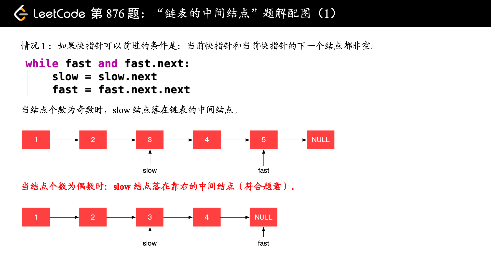

```go
func middleNode(head *ListNode) *ListNode {
    slow, fast := head, head

    //  fast的Next要不为空
    for fast != nil && fast.Next != nil{
        slow = slow.Next
        fast = fast.Next.Next
    }
    return slow
}
```


### 排序类题目【待解决】

#### 链表的插入排序【中等】

##### 1. 题目

对链表进行**插入排序**。

**示例 1：**

```
输入: 4->2->1->3
输出: 1->2->3->4
```

连接：https://leetcode-cn.com/problems/insertion-sort-list/

##### 2. 题解

与传统插入排序不同，**无法**对已排序链表**从尾至首遍历**进行插入。

- 为链表增加一个头部，其值为**无穷小**。
- 对已排序链表部分**从首至尾**遍历，找到所有**小于当前遍历元素的位置**，进行链表的**尾部插入**。
- 将"**已排序链表部分**"->"**待排序链表部分**"进行**拼接**。

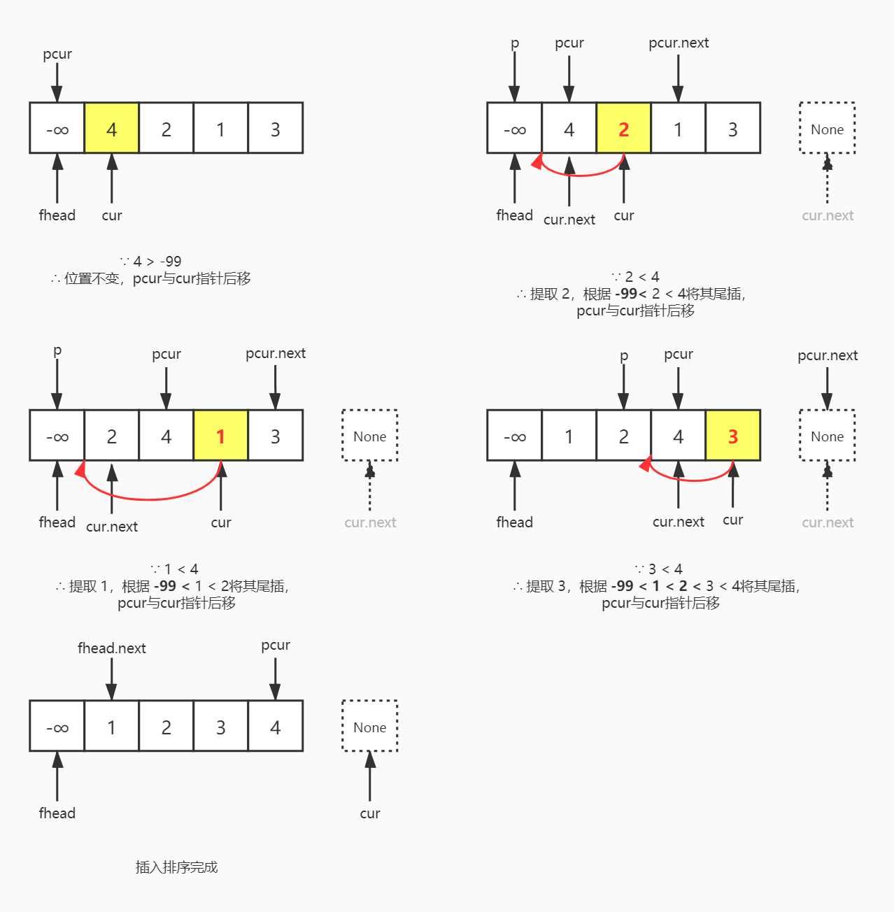

 ```go
func insertionSortList(head *ListNode) *ListNode {
    if head == nil{
        return nil
    }
    dummy := &ListNode{
        Next: head,
    }

    lastSorted, cur := head, head.Next
    for cur != nil{
        if lastSorted.Val <= cur.Val{
            lastSorted = lastSorted.Next
        }else{
            prev := dummy
            for prev.Next.Val <= cur.Val{
                prev = prev.Next
            }
            lastSorted.Next = cur.Next //保存下一个节点的信息
            cur.Next = prev.Next
            prev.Next = cur
        }
        cur = lastSorted.Next
    }
    return dummy.Next
}
 ```


#### 排序链表【中等】

##### 1. 题目

在 **O(n log n)** 时间复杂度和**常数级空间**复杂度下，对**链表进行排序**。

```java
示例 1:
输入: 4->2->1->3
输出: 1->2->3->4

示例 2:
输入: -1->5->3->4->0
输出: -1->0->3->4->5
```

链接：https://leetcode-cn.com/problems/sort-list

##### 2. 题解

###### (1) 归并排序（递归法）

前面的链表插入排序也是可以排序，但是复杂度比较高。O(n log n) 可以联系到归并排序？根据时间复杂度我们自然想到**二分法**，从而联想到**归并**排序。

① **分割 cut 环节**： 找到当前链表**中点**，并从中点将链表**断开**（以便在下次递归 cut 时，链表片段拥有**正确边界**）；
我们使用 fast , slow 快慢**双指针法**，**奇数个节点找到中点**，偶数个节点找到**中心左边的节点**。
找到中点 slow 后，执行 slow.next = null 将链表**切断**。
递归分割时，输入当前链表左端点 head 和中心节点 slow 的下一个节点 tmp (因为链表是从 slow 切断的)。
cut 递归终止条件： 当 head.next == null 时，说明只有一个节点了，直接返回此节点。

② **合并 merge 环节**： 将两个**排序链表合并**，转化为一个排序链表。
**双指针法合并**，建立辅助 ListNode h 作为头部。
设置两指针 left, right 分别指向**两链表头部**，比较两指针处节点值大小，由小到大加入合并链表头部，指针**交替前进**，直至**添加完两个链表**。
返回辅助 ListNode h 作为头部的下个节点 h.next。
时间复杂度 **O(l + r)**，l, r 分别代表**两个链表长度**。

③ 当题目输入的 head == null 时，直接返回 null。


```java
public ListNode sortList(ListNode head) {
    // Base case
    if(head == null || head.next == null) return head;
    // 使用快慢指针寻找链表中间节点
    ListNode slow, fast;
    slow = head; fast = head.next;
    while(fast != null && fast.next != null){
        head = head.next; fast = fast.next.next;
    }
    fast = head.next; head.next = null;

    // 分治，递归调用
    return merge(sortList(slow), sortList(fast));
}

// 归并操作-合并两个排序链表
ListNode merge(ListNode a, ListNode b){
    ListNode dummy = new ListNode(0);
    ListNode head = dummy;
    while(a != null && b != null){
        if (a.val < b.val){
            dummy.next = a; dummy = a; a = a.next;
        } else {
            dummy.next = b; dummy = b; b = b.next;
        }
    }
    dummy.next = (a == null) ? b : a;
    return head.next;
}
```


### 链表相交与环类问题

#### 判断链表是否有环【简单】

##### 1. 题目

给定一个链表，判断链表中**是否有环。**


链接：https://leetcode-cn.com/problems/linked-list-cycle/

##### 2. 题解

###### (1) 哈希表法

我们可以通过检查一个结点此前**是否被访问过**来判断链表是否为环形链表。常用的方法是使用**哈希表**。

**时间复杂度：O(n)**，对于含有 n 个元素的链表，每个元素访问最多一次。添加一个结点到哈希表中只需要花费 O(1) 的时间。

**空间复杂度：O(n)**，空间取决于添加到哈希表中的元素数目，最多可以添加 n 个元素。

```go
func hasCycle(head *ListNode) bool {
    seen := map[*ListNode]struct{}{}

    for head != nil{
        if _, ok := seen[head]; ok{
            return true
        }
        seen[head] = struct{}{}
        head = head.Next
    }
    return false
}
```

###### (2) 快慢双指针法

使用快慢指针。通过使用具有 **不同速度** 的快、慢两个指针遍历链表，**空间复杂度可以被降低至 O(1）**。**慢指针每次移动一步，而快指针每次移动两步。**在最糟糕的情形下，**时间复杂度为 O(N+K)，也就是 O(n)**。


```go
func hasCycle(head *ListNode) bool {
    if head == nil || head.Next == nil{
        return false
    }
    //初始时快指针要在慢指针前一步，不然初始就会相遇
    slow, fast := head, head.Next

    for slow != fast{
        //如果遍历完还没有相遇
        if fast == nil || fast.Next == nil{
            return false
        }

        slow = slow.Next
        fast = fast.Next.Next 
    }
    return true
}
```


#### 判断链表是否有环并返回第一个入环结点【中等】

##### 1. 题目

给定一个链表，返回链表开始入环的第一个节点。 如果链表无环，则返回 null。为了表示给定链表中的环，我们使用整数 pos 来表示链表尾连接到链表中的位置（索引从 0 开始）。 如果 pos 是 -1，则在该链表中没有环。

说明：不允许修改给定的链表。


链接：https://leetcode-cn.com/problems/linked-list-cycle-ii

##### 2. 题解

###### (1) 哈希表法

可以使用 **HashMap** 的方式来进行判断，但是**空间复杂度高**。

###### (2) 快慢双指针法

采用**“快慢指针”**的方法。就是有两个指针 fast 和 slow，开始的时候两个指针都指向链表头 head，然后在每一步

操作中 slow 向前走一步即：slow = slow.next，而 fast 每一步向前两步即：fast = fast.next.next。

由于 fast 要比 slow 移动的快，如果有环，fast 一定会先进入环，而 slow 后进入环。当两个指针都进入环之后，经过一定步的操作之后二者一定能够在环上相遇，并且此时 slow 还没有绕环一圈，也就是说一定是在 slow 走完第一圈之前相遇。可以看下图：

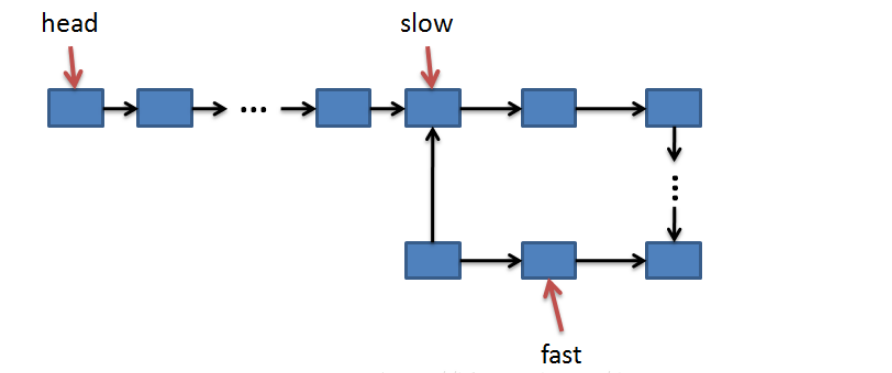

相遇之后 fast 指针回到头部，slow 指针不动。然后两者一起再次移动，两个都一次**移动一步**，直到相遇。

使用**双指针**，一个指针 **fast** 每次移动**两个节点**，一个指针 **slow** 每次移动**一个节点**。因为存在环，所以两个指针必定相遇在环中的某个节点上。假设相遇点在下图的 **z1** 位置，此时 fast 移动的节点数为 **x+2y+z**，slow 为 **x+y**，由于 fast 速度比 slow 快一倍，因此 **x+2y+z=2(x+y)**，得到 **x=z**（这个证明过程**记一下**，有的面试官会叫证明）。

在相遇点，slow 要到环的入口点还需要**移动 z 个节点**，如果让 fast 重新**从头开始移动**，并且速度变为每次移动一个节点，那么它到环入口点**还需要移动 x 个节点**。在上面已经推导出 x=z，因此 fast 和 slow 将在**环入口点相遇**。

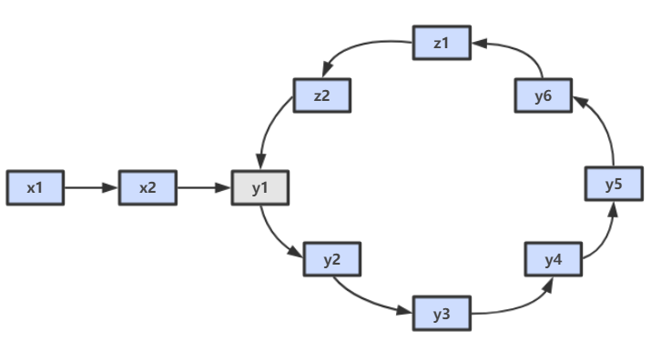

```go
func detectCycle(head *ListNode) *ListNode {
    if head == nil || head.Next == nil || head.Next.Next == nil{
        return nil
    }

    //初始时让二者直接走一次，便于后续计算
    slow, fast:= head.Next, head.Next.Next
    for slow != fast{
        if fast.Next == nil || fast.Next.Next == nil{
            return nil
        }
        slow = slow.Next
        fast = fast.Next.Next
    }
    //相遇之后，fast从头开始走，二者相遇的地方就是环的入口
    fast = head
    for slow != fast{
        slow = slow.Next
        fast = fast.Next
    }
    return slow
}
```


#### 判断两个无环链表是否相交，并找出交点

##### 1. 题目

只是判断两个链表是否存在交点，，即 [编程之美 3.6]() 的问题。

##### 2. 题解

###### (1)Hash表法

- 首先遍历链表head1，把遍历到的节点的地址放在HashSet中
- 接着遍历head2，每遍历一个节点，就判断这个节点的地址在HashSet是否存在，如果存在则说明两个链表相交且当前遍历到的节点就是相交节点，否则遍历到head2结束，则说明不相交

```go
func getIntersectionNode(headA, headB *ListNode) *ListNode {
    seen := map[*ListNode]struct{}{}
	
    for headA != nil{
        seen[headA] = struct{}{}
        headA = headA.Next
    }

    for headB != nil{
        if _, ok := seen[headB]; ok{
            return headB
        }
        headB = headB.Next
    }
    return nil
}
```

###### (2)首尾相接法

- 把第一个链表的结尾连接到第二个链表的**开头**，看第二个链表**是否存在环**；
- 如果存在则相交，环入口即为相交节点

```go
func getIntersectionNode(headA, headB *ListNode) *ListNode {
    cur := headA
    //将A的尾结点和B的头结点连接起来
    for cur.Next != nil{
        cur = cur.Next
    } 
    cur.Next = headB

    //防止空指针读取出错
    if headA == nil || headA.Next == nil || headA.Next.Next == nil{
        return nil
    }
    //快慢指针判断成环
    slow, fast := headA.Next, headA.Next.Next
    for slow != fast{
        if fast.Next == nil || fast.Next.Next == nil{
            return nil
        }
        slow = slow.Next
        fast = fast.Next.Next
    }
	//找出入环点
    fast = headA
    for slow != fast{
        fast = fast.Next
        slow = slow.Next
    }

    //还原链表
    cur.Next = nil

    return slow
}
```

###### (3)尾结点法

直接比较两个链表的**最后一个节点是否相同**。

- 遍历l1,l2两个链表，记录长度n1,n2
- 长链表先走（n1-n2），之后两个指针同步移动
- 相等则表示找到相交点

###### （4）循环法（究极简单）

两个链表同时开始遍历，一次完成后从另一个节点的头部继续遍历，两个遍历点的相交节点即为入环点，如果没有相交，则链表不相交

```go
func getIntersectionNode(headA, headB *ListNode) *ListNode {
    l1, l2 := headA, headB

    for l1 != l2{
        if l1 == nil{
            l1 = headB
        }else{
            l1 = l1.Next
        }

        if l2 == nil{
            l2 = headA
        }else{
            l2 = l2.Next
        }
    }

    return l1
}
```


#### 判断两个有环链表是否相交

需要分为是否有环和是否相交的两种情况。各种进行讨论。如果两个有环的链表相交，那最后肯定是两个**共享一个环**。


### 其他题目

#### 循环向右旋转链表【中等】

##### 1. 题目

给定一个链表，旋转链表，将链表每个节点向**右移动** k 个位置，其中 k 是**非负数**。

**示例 1:**

```java
输入: 1->2->3->4->5->NULL, k = 2
输出: 4->5->1->2->3->NULL
解释:
向右旋转 1 步: 5->1->2->3->4->NULL
向右旋转 2 步: 4->5->1->2->3->NULL
```

**示例 2:**

```java
输入: 0->1->2->NULL, k = 4
输出: 2->0->1->NULL
解释:
向右旋转 1 步: 2->0->1->NULL
向右旋转 2 步: 1->2->0->NULL
向右旋转 3 步: 0->1->2->NULL
向右旋转 4 步: 2->0->1->NULL
```

链接：https://leetcode-cn.com/problems/rotate-list

##### 2. 题解

###### (1) 连接成环法

链表中的点**已经相连**，一次旋转操作意味着：

- 先将链表**闭合成环**。
- 找到相应的位置**断开**这个环，确定新的链表头和链表尾。


> 新的链表头在哪里？

在位置 **n-k** 处，其中 **n** 是链表中点的**个数**，新的链表**尾**就在头的前面，位于位置 **n-k-1**。

我们这里假设 k < n

> 如果 k >= n 怎么处理？

k 可以被写成 k = (k / n) * n + k % n **两者加和**的形式，其中前面的部分**不影响**最终的结果，因此**只需要考虑 k % n** 的部分，这个**值一定比 n 小**。

**取模相当于循环转了几圈。**

```go
func rotateRight(head *ListNode, k int) *ListNode {
    if head == nil || head.Next == nil{
        return head
    }

    //将链表合并成环
    cur := head
    n := 1
    for cur.Next != nil{
        cur = cur.Next
        n++
    }
    cur.Next = head

    //找到新的尾部节点（n - k%n - 1）,取余防止出现k>n的情况
    //新的头结点(n - k%n)
    cur = head
    for i := 0; i < n-k%n-1; i++{
        cur = cur.Next
    }
    newHead := cur.Next
    //打开环
    cur.Next = nil

    return newHead
}
```

###### (2) 取模旋转法

**不连接成环。**

1. 求出链表的**长度 len**。
2. **k = k % len** 取余就是需要**右移的距离**。
3. **找到倒数第 k 个位置**。可以使用**双指针法**。
4. 记录**慢指针**的 next 节点，这就是最后要返回的节点。

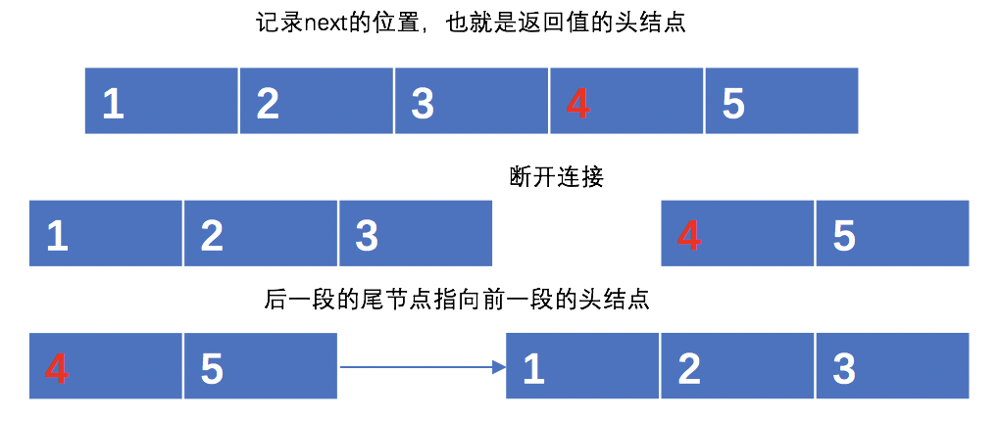

```go
func rotateRight(head *ListNode, k int) *ListNode {
    if head == nil || head.Next == nil{
        return head
    }

    cur := head

    //求出链表的长度
    n := 1
    for cur.Next != nil{
        cur= cur.Next
        n++
    }
    //k%n即需要右移的距离
    k = k % n
    if k == 0{
        return head
    }

    cur = head
    //利用快慢指针，快指针先行k%n，慢指针点最终指向新链表的尾结点
    fast := head
    for k > 0{
        k--
        fast = fast.Next
    }
    for fast.Next != nil{
        fast = fast.Next
        cur = cur.Next
    }
    //拼接链表
    fast.Next = head
    //新的头结点
    head = cur.Next
    //断开连接
    cur.Next = nil 
    
    return head
}
```


#### 复制结点带有随机指针的链表【中等】

##### 1. 题目

给定一个链表，每个节点包含一个额外增加的**随机指针**，该指针可以指向链表中的**任何节点或空节点**。要求返回这个链表的 **深拷贝**。 用一个由 n 个节点组成的链表来表示输入/输出中的链表。我们用一个由 n 个节点组成的链表来表示输入/输出中的链表。

每个节点用一个 [val, random_index] 表示：

- val：一个表示 Node.val 的整数。
- random_index：随机指针指向的节点索引（范围从 0 到 n-1）；如果不指向任何节点，则为  null 

链接：https://leetcode-cn.com/problems/copy-list-with-random-pointer

##### 2. 题解

###### (1) Map保存法

使用一个 **Map** 来保存**原有结点与副本结点的对应关系**，然后根据原结点的关系从 map 中取对应的副本结点**并设置关系**。map 中的结点的**指针关系依然没变**。

```go
func copyRandomList(head *Node) *Node {
    //key 是uintptr类型 存储源的当前指针的地址
    //value 存储copy的新创建的节点指针
    nodeMap := make(map[uintptr]*Node)
    cur := head

    //第一次遍历存储map
    for cur != nil{
        node := &Node{Val: cur.Val}
        nodeMap[uintptr(unsafe.Pointer(cur))] = node
        cur = cur.Next
    }
    //通过再次遍历来实现next和random 关系的建立
    cur = head
    for cur != nil{
         node := nodeMap[uintptr(unsafe.Pointer(cur))]
		node.Next = nodeMap[uintptr(unsafe.Pointer(cur.Next))]
		node.Random	= nodeMap[uintptr(unsafe.Pointer(cur.Random))]
		cur = cur.Next
    }
    return nodeMap[uintptr(unsafe.Pointer(head))]
}
```

时间、空间复杂度均为 **O(N)**。

###### (2) 迭代复制法（最优）

空间复杂度降为 **O(1)**。

- 遍历两次，第一次在每个节点的后面**复制一个值一样的结点**。

- 第二次遍历时根据原有结点的**随机指针设置复制后的随机指针**（因为原结点与复制结点是挨着的，所以**有位置关系**）。

- 最后将复制后的链表与原链表**完全分开**即可。

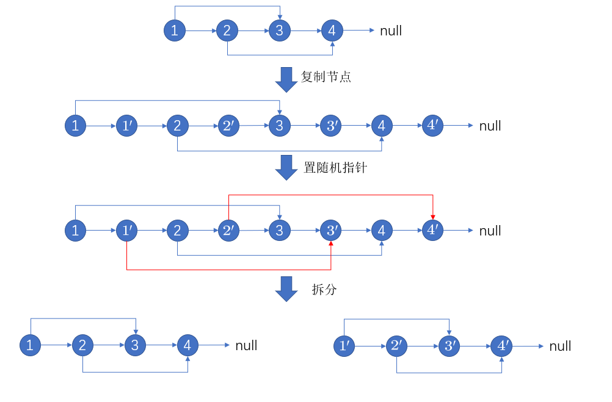

```go
func copyRandomList(head *Node) *Node {
    if head == nil{
        return nil
    }
    //将每个节点复制到下一个节点
    cur := head
    for cur != nil{
        temp := &Node{
            Val: cur.Val,
        }
        temp.Next = cur.Next
        cur.Next = temp
        cur = cur.Next.Next
    }

    //复制随机指针
    cur = head
    for cur != nil{
        //随机指针为空的不管
        if cur.Random != nil{
            //拷贝当前节点的随机指针的指向
            cur.Next.Random = cur.Random.Next
        }
        //移动两步
        cur = cur.Next.Next
    }

    //拆分两条链表
    cur = head
    copyHead := cur.Next
    copyCur := copyHead
    for copyCur.Next != nil{
         //移动原链表指针
         cur.Next = cur.Next.Next
         cur = cur.Next
         //移动复制链表指针
         copyCur.Next = copyCur.Next.Next
         copyCur = copyCur.Next
    }
    //结束
    cur.Next = nil
    return copyHead
}
```


#### 判断链表是否是回文结构【简单】

##### 1. 题目

请判断一个链表是否为**回文链表**。

**链接**：https://leetcode-cn.com/problems/palindrome-linked-list/

**示例 1:**

```
输入: 1->2
输出: false
```

**示例 2:**

```
输入: 1->2->2->1
输出: true
```

##### 2. 题解

###### (1) 压栈法

采用栈的方式，将链表结点全部**压栈**，然后**逐渐弹栈依次与原链表进行比较**。需要得空间为 O(N) 。

```java
/**
 * 判断单向链表是否是回文结构--使用栈
 *
 * @param head 链表头部
 * @return 是否回文结构
 */
private static boolean isPalindromeListUsingStack(Node head) {
    if (head == null) {
        return true;
    }
    // 利用栈
    Stack<Node> stack = new Stack<>();
    // 将节点全部压栈
    Node temp = head;
    while (temp != null) {
        stack.push(temp);
        temp = temp.next;
    }

    // 元素逐个弹出与链表顺序一一比较
    while (head != null) {
        if (head.value != stack.pop().value) {
            return false;
        }
        head = head.next;
    }
    return true;
}
```

###### (2) 半边压栈法

不需要把链表全部压栈，只需要把链表的**一半**元素压栈即可。这个方法需要找到链表的**中间结点**，找的方式可以使用**双指针**。

###### (3) 逆转链表法

不用栈，首先使用**双指针**方式找到链表**中间结点**，然后从此处**反转**链表的**左半部分**，使其最后**指向中间结点**，然后从两边的**两侧同时开始移动**比较，最后一定要**恢复**链表右边的结构为原样。

这个过程虽然复杂但是空间复杂度为 **O(1)**。

```go
func isPalindrome(head *ListNode) bool {
    //定义快慢指针
    slow, fast := head, head
    pre := &ListNode{}
    for fast != nil && fast.Next != nil{
        cur := slow
        slow = slow.Next
        fast = fast.Next.Next
		//反转链表
        cur.Next = pre
        pre = cur
    }

    //  链表奇数个节点
    if fast != nil{
        slow = slow.Next
    }

    //不断判断pre和slow是否相等
    for slow != nil{
        if slow.Val != pre.Val{
            return false;
        }
        slow = slow.Next
        pre = pre.Next
    }

    return true
}
```


#### 链表子序列（组件）【中等】

##### 1. 题目

给定一个链表（链表结点包含一个整型值）的**头结点 head**。同时给定列表 G，该列表是上述链表中整型值的**一个子集**。返回列表 G 中组件的个数，这里对组件的定义为：链表中一段**最长连续结点**的值（该值必须在列表 G 中）构成的集合。

```java
示例 1：
输入: 
head: 0->1->2->3
G = [0, 1, 3]
输出: 2
解释: 
链表中,0 和 1 是相连接的，且 G 中不包含 2，所以 [0, 1] 是 G 的一个组件，同理 [3] 也是一个组件，故返回 2。
    
示例 2：
输入: 
head: 0->1->2->3->4
G = [0, 3, 1, 4]
输出: 2
解释: 
链表中，0 和 1 是相连接的，3 和 4 是相连接的，所以 [0, 1] 和 [3, 4] 是两个组件，故返回 2。
```

链接：https://leetcode-cn.com/problems/linked-list-components

##### 2. 题解

利用**额外空间**进行辅助解答。

- 首先将数组内容放入一个 **Set** 中，用于判断**是否包含**该元素。
- 遍历**链表**，每个结点都去 Set 中看是否包含这个值。同时维护一个 flag 变量来解决**多个元素连续出现**的情况。

```go
func numComponents(head *ListNode, G []int) int {
    if len(G) == 0 || head == nil{
        return 0
    }

    gMap := make(map[int]bool, 0)
    for _, num := range G {
        gMap[num] = true
    }

    count := 0
    cur := head
    for cur != nil{
        //找到每一个组件的末尾节点
        if gMap[cur.Val] && (cur.Next == nil || !gMap[cur.Next.Val]){
            count ++
        }
        cur = cur.Next
    }
    return count
}
```


#### 二进制链表转整数【简单】

##### 1. 题目

给你一个**单链表**的引用结点 head。链表中每个结点的值不是 0 就是 1。已知此链表是一个整数数字的二进制表示形式。

请你返回该链表所表示数字的 十进制值 。

示例 1：

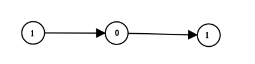

```java
输入：head = [1,0,1]
输出：5
解释：二进制数 (101) 转化为十进制数 (5)
```


链接：https://leetcode-cn.com/problems/convert-binary-number-in-a-linked-list-to-integer

##### 2. 题解

###### (1) 算法解

利用**二进制转十进制**的算法。一次遍历即可。

```go
func getDecimalValue(head *ListNode) int {
    sum := 0
    for head != nil{
        sum = sum * 2 + head.Val
        head = head.Next
    }
    return sum
}
```

###### (2) 位运算


```go
func getDecimalValue(head *ListNode) int {
    res := 0
    for head != nil {
        res = (res << 1) | (head.Val)
        head = head.Next
    }
    return res
}
```

