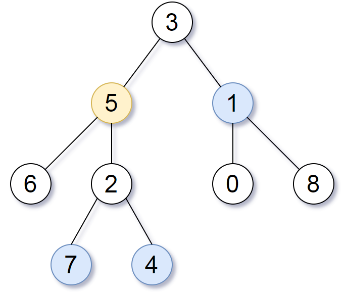

[TOC]


### 树题目

#### 技巧

- **递归**解深度相关的题，可以设置一个**全局的最大深度**，用于**记录已经访问到的最大深的深度**。
- 掌握二叉树的**迭代层序遍历**，很多题可用！只需少量修改即可。
- 掌握二叉树的序列化与反序列化方法，可用用于**子树问题**的判断。
- **递归遍历**的时候，如果需要**改变顺序**，可以考虑**先递归右树**。
- 求深度的题目可以用递归，也可以用**层序遍历**进行迭代求解。
- **暴力递归**类似于**后续遍历**，也就是默认能得到左右子树的信息再构造自己的信息，树形 dp。


### 普通遍历类题目

树的遍历方式总体分为**两类**：**深度优先搜索（DFS）、广度优先搜索（BFS）**；

- **常见的 DFS** ： **先序遍历、中序遍历、后序遍历；**
- **常见的 BFS** ： **层序遍历（即按层遍历）。**

#### 二叉树遍历

##### 1. 题目

写出二叉树的**前序、中序、后续**遍历。

##### 2. 题解

递归方式会访问一个结点**三次**，在第几次进行数据处理就是不同的顺序了。

###### (1) 递归方式前序遍历【简单】

```go
func preorderTraversal(root *TreeNode) []int {
    res := []int{}
    node := root
    if node == nil {
        return nil
    }
    res = append(res, node.Val)
    res = append(res, preorderTraversal(node.Left)...)
    //… 其实是go的一种语法糖。它的第一个用法主要是用于函数有多个不定参数的情况，可以接受多个不确定数量的参数。第二个用法是slice可以被打散进行传递
    res = append(res, preorderTraversal(node.Right)...)//preorderTraversal(node.Right)的元素被打散一个个append进res
    return res
}


```

###### (2) 递归方式中序遍历【简单】

```go
func inorderTraversal(root *TreeNode) []int {
    res := []int{}
    node := root
    if node == nil{
        return nil
    }

    res = append(res, inorderTraversal(node.Left)...)
    res = append(res, node.Val)
    res = append(res, inorderTraversal(node.Right)...)
    
    return res
}
```

######  (3) 递归方式后序遍历【简单】

```go
func postorderTraversal(root *TreeNode) []int {
    res := []int{}

    node := root
    if node == nil{
        return nil
    }
    res = append(res, postorderTraversal(node.Left)...)
    res = append(res, postorderTraversal(node.Right)...)
    res = append(res, node.Val)

    return res
}
```

###### (4) 迭代方式前序遍历【中等】

使用**栈**，先将**根节点压栈**，只要**栈不为空则一直弹出**，弹出一个处理数据，然后**先压入右子结点，再压入左子结点**（由于是利用栈，所以压入顺序相反是**==先右后左==**）。

- 先将**根节点**入**栈**。
- 从栈**弹出**一个结点，弹出后**处理数据**。
- 如果根节点存在**右**孩子，则将**右孩子**入栈。
- 如果根节点存在**左**孩子，则将**左孩子**入栈（注意：**一定是右孩子先入栈，然后左孩子入栈**）。
- 重复 2 - 4 直到**栈为空**。

```go
func preorderTraversal(root *TreeNode) []int {
    var res []int
    var stack []*TreeNode

    //root != nil 只为了第一次root判断，必须放最后
    for len(stack) > 0 || root != nil {
        for root != nil{
            res = append(res, root.Val) //前序输出
            stack = append(stack, root.Right) //右节点入栈
            root = root.Left //移至左节点
        }
        index := len(stack) - 1 //栈顶
        root = stack[index] //出栈
        stack = stack[:index]
    }
    return res
}
```

###### (5) 迭代方式中序遍历【中等】

也是利用**栈**的方式进行。

- 先将**根节点**入栈。
- 将当前节点的**所有左孩子**入栈，直到**左孩子为空**。
- 访问**栈顶**元素，如果栈顶元素**存在右孩子**，则变换到**右子节点**继续第 2 步。
- 重复第 2、3 步，直到**栈为空**并且所有的节点都被访问。

```go
func inorderTraversal(root *TreeNode) []int {
    var res []int
    var stack []*TreeNode

	for root != nil || len(stack) > 0 {
		for root != nil {
            //持续将当前结点的左子节点压栈
			stack = append(stack, root)
			root = root.Left
		}
        // 压完之后进行数据处理并在处理完后变到右子树上
        // 弹出数据处理
		root = stack[len(stack)-1]
		stack = stack[:len(stack)-1]
        // 处理数据
		res = append(res, root.Val)
        // 变到右子树
		root = root.Right
	}
	return res
}
```

###### (6) 迭代方式后序遍历【困难】

使用**两个栈** s1 和 s2。

1. 将**根节点**压入 s1 中。
2. 从 s1 中**弹出**元素，并依次将其**==左孩子和右孩子压入 s1==** 中。此过程中**==每从 s1 弹出一个元素都将其压入到栈 s2 中==**。直到 **==s1 为空==**为止。
3. 从 **s2 中依次弹出元素**处理即是**后序遍历**。

```go
func postorderTraversal(root *TreeNode) []int {
    if root == nil {
        return nil
    }
    var res []int
    var stack1 []*TreeNode
    var stack2 []*TreeNode
    var index int
    
    //根节点压入栈1
    stack1 = append(stack1, root)
    //退出条件为栈1为空
    for len(stack1) > 0 {
        //栈1每弹出一个元素压入栈2
        index = len(stack1) - 1
        root = stack1[index]
        stack2 = append(stack2, root)
        stack1 = stack1[:index]

        //再将当前弹出元素的左右子节点分别入栈
        if root.Left != nil{
            stack1 = append(stack1, root.Left)
        }
        if root.Right != nil{
            stack1 = append(stack1, root.Right)
        }
    }
    //当栈1为空时，依次弹出栈2元素
    for len(stack2) > 0{
        index = len(stack2) - 1
        root = stack2[index]
        res = append(res, root.Val)
        stack2 = stack2[:index]
    }
    return res
}
```

###### (7) 二叉树的Morris遍历【困难】

Morris 遍历的核心思想是利用树的大量空闲指针，实现空间开销的极限缩减。

**前序遍历**

1. 新建临时节点，令该节点为 root；
2. 如果当前节点的**左子节点为空，将当前节点加入答案，并遍历当前节点的右子节点**；
3. 如果当前节点的**左子节点不为空，在当前节点的左子树中找到当前节点在中序遍历下的前驱节点**：
    - 如果**前驱节点的右子节点为空，将前驱节点的右子节点设置为当前节点**。然后**将当前节点加入答案**，并**将前驱节点的右子节点更新为当前节点。当前节点更新为当前节点的左子节点**。
    - 如果**前驱节点的右子节点为当前节点，将它的右子节点重新设为空。当前节点更新为当前节点的右子节点**。

4. 重复步骤 2 和步骤 3，直到遍历结束。

```go
func preorderTraversal(root *TreeNode) (vals []int) {
    var p1, p2 *TreeNode = root, nil
    for p1 != nil {
        p2 = p1.Left
        if p2 != nil {
            for p2.Right != nil && p2.Right != p1 {
                p2 = p2.Right
            }
            if p2.Right == nil {
                vals = append(vals, p1.Val)
                p2.Right = p1
                p1 = p1.Left
                continue
            }
            p2.Right = nil
        } else {
            vals = append(vals, p1.Val)
        }
        p1 = p1.Right
    }
    return
}
```


可以根据 Morris 遍历**加工出二叉树的前中后序遍历**。空间复杂度 **O(1)**。


#### N叉树的前序.遍历【简单】

##### 1.题目

给定一个 N 叉树，返回其节点值的*前序遍历*。

例如，给定一个 `3叉树` :


返回其前序遍历: `[1,3,5,6,2,4]`。

##### 2.题解

###### （1）DFS法

```go
var res []int

func preorder(root *Node) []int {
    res = []int{}
    dfs(root)
    return res
}

func dfs(root *Node){
    if root != nil{
        res = append(res, root.Val)
        for _, n := range root.Children{
            dfs(n)
        }
    }
}
```

###### (2)迭代法

```go
func preorder(root *Node) []int {
    var res = []int{}
    if root == nil{
        return res
    }
    var stack = []*Node{root}
    for len(stack) > 0{
       //取出栈顶元素
       root = stack[len(stack) - 1]
       res = append(res, root.Val)
       stack = stack[:len(stack) - 1]

        //把该节点的所有子节点顺序入栈
        for i := len(root.Children) - 1; i>=0; i-- {
		    stack = append(stack,root.Children[i])
	    }
        /**
        for _, n := range root.Children{
        stack = append(stack, n)
        }
        **/
    }
    return res
}
```


#### N叉树的后序遍历【简单】

##### 1. 题目

使用**后序遍历**方式遍历一颗 N 叉树。


后续遍历顺序为：[5, 6, 3, 2, 4, 1]。

多叉树结点类 Node 如下。

```go
/**
 * Definition for a Node.
 * type Node struct {
 *     Val int
 *     Children []*Node
 * }
 */
```

连接：https://leetcode-cn.com/problems/n-ary-tree-postorder-traversal/

##### 2. 题解

###### (1) DFS法

直接使用**递归**的方式进行遍历。比较简单，参考普通的递归后序遍历。

```go
var res []int

func postorder(root *Node) []int {
    res = []int{}
	dfs(root)
	return res
}

func dfs(root *Node) {
	if root != nil {
		for _, n := range root.Children {
			dfs(n)
		}
		res = append(res, root.Val) //后序输出
	}
}
```

###### (2) 迭代法

可以使用和 **N叉树的前序遍历** 相同的方法，使用一个**栈**来得到**后序遍历**。首先把**根节点入栈**。当每次从**栈顶**取出一个节点 u 时，就把 u 的**所有子节点顺序压入栈**中。例如 u 的子节点从左到右为 **v1, v2, v3**，那么推入栈的顺序应当为 v1, v2, v3，这样就保证了**下一个遍历到的节点**（即 u 的第一个子节点 v3）出现在**栈顶**的位置。在遍历结束之后，我们把遍历结果**反转**，就可以得到后序遍历。

```go
func postorder(root *Node) []int {
    var res = []int{}
    if root == nil{
        return res
    }
    var stack = []*Node{root}
    for len(stack) > 0{
        //取出栈顶元素
        root = stack[len(stack) - 1]
        res = append(res, root.Val)
        stack = stack[:len(stack) - 1]
        
        //把该节点的所有子节点顺序入栈
        for _, n := range root.Children{
            stack = append(stack, n)
        }
    }

    l := len(res) - 1
    //反转遍历结果
    for i := 0; i < l/2 + 1; i++{
        res[i], res[l-i] = res[l-i], res[i]
    }
    return res
}
```


### 层序遍历类题目

树的**层序遍历**的套路及其深厚，掌握**使用队列的模板**就行了。

#### 二叉树的层序遍历 I【中等】

##### 1. 题目

给你一个二叉树，请你返回其按 **层序遍历** 得到的节点值。 （即**逐层地**，**从左到右**访问所有节点）。

示例：
二叉树：[3, 9, 20, null, null, 15, 7]

```java
    3
   / \
  9  20
    /  \
   15   7
```

返回其层次遍历结果：

```java
[
  [3],
  [9,20],
  [15,7]
]
```

链接：https://leetcode-cn.com/problems/binary-tree-level-order-traversal

##### 2. 题解

###### (1) 迭代法BFS

对二叉树的层序遍历就是**使用 BFS 遍历**，那么可以使用**队列**进行辅助。下面的模板是非常有用的，记住可以解很多题。

- ==**根节点入队。**==
- ==**循环直到队列为空，每次出队一个结点，并将其左右子节点入队。**==
- ==**为了控制按层进行打印，需要有个循环记录一下这一层的结点个数，所以使用一个 for 循环来遍历这一层。**==
- ==**当一层的元素处理完的时候，下一层的结点又已经全部入队，持续循环即可。**==

```go
func levelOrder(root *TreeNode) [][]int {
    var res = [][]int{}
    if root == nil{
        return res
    }

    //使用辅助队列并把根节点从前端入队
    queue := list.New()
    queue.PushFront(root)
    for queue.Len() > 0{    
        //保存当前层数据的切片
        var curLevel []int
        //保存当前层节点个数
        count := queue.Len()
        //处理当前层节点，读取数据，并把左右子节点入队
        for count > 0{
            //从队列后端取出数据
            element := queue.Back()
            node := element.Value.(*TreeNode)
            curLevel = append(curLevel, node.Val)

            //把左右子节点依次从队列前端入队
            if node.Left != nil{
                queue.PushFront(node.Left)
            }
            if node.Right != nil{
                queue.PushFront(node.Right)
            }
            //删除节点，并把当前剩余节点数-1
            queue.Remove(element)
            count --
        }
        res = append(res, curLevel)
    }
    return res
}
```

###### (2) 递归法DFS

首先确认树**非空**，然后调用**递归函数** process(node, level)，参数是**当前节点和节点的层次**。程序过程如下：

- 输出列表称为 resList，当前**最高层数**就是列表的**长度 size()**。比较访问节点**所在的层次 level** 和**当前最高层**次 size 的大小，如果前者**更大就说明访问到了新的 level 则向 resList 添加一个空列表**。
- 将当前节点插入到**对应层的列表** **resList[level]** 中。
- 递归**非空的孩子节点**：process(node.left / node.right, level + 1)。

```go
var res [][]int
func levelOrder(root *TreeNode) [][]int {
    res = [][]int{}
    dfs(root, 0)
    return res
}

func dfs(root *TreeNode, level int){
    if root != nil{
        //如果遍历到新的层次
        if len(res) == level{
            //结果中添加新的一层
            res = append(res, []int{})
        }
        //将当前节点值加入到该层中
        res[level] = append(res[level], root.Val)
        //递归进行，有可能要考虑左右子节点!=nil
        dfs(root.Left, level+1)
        dfs(root.Right, level+1)
    }
}
```

#### 二叉树的层次遍历 II【简单】

区别上一个题目。给定一个二叉树，返回其节点值**自底向上的层次遍历**。 （即按从叶子节点所在层到根节点所在的层，逐层从左向右遍历）。

例如：
给定二叉树 [3, 9, 20, null, null, 15, 7]

```java
	3
   / \
  9  20
    /  \
   15   7
```

返回其自底向上的层次遍历为：

```java
[
  [15,7],
  [9,20],
  [3]
]
```

链接：https://leetcode-cn.com/problems/binary-tree-level-order-traversal-ii

##### 2. 题解

思路类似前面的普通层序遍历，但是是**反过来**的，其实很容易想到只需要把上述题目的**解逆序**即可。

###### （1）BFS

参考上述的 **BFS** 解法，只需在**最后调用**反转。

```go
func levelOrderBottom(root *TreeNode) [][]int {
    var res = [][]int{}
    if root == nil{
        return res
    }

    //使用辅助队列并把头结点入队
    queue := list.New()
    queue.PushFront(root)
    for queue.Len() > 0{
        //保存当前层数据的切片
        curLevel := []int{}
        //保存当前层节点个数
        count := queue.Len()
        for count > 0{
            //从队列后端取出数据
            element := queue.Back()
            node := element.Value.(*TreeNode)
            curLevel = append(curLevel, node.Val)

            if node.Left != nil{
                queue.PushFront(node.Left)
            }
            if node.Right != nil{
                queue.PushFront(node.Right)
            }
            //删除当前节点
            queue.Remove(element)
            count --
        }
        res = append(res, curLevel)
    }
    l := len(res)
    for i := 0; i < l/2; i++{
        res[i], res[l-1-i] = res[l-1-i], res[i]
    }
    return res
}
```

将结果**逆序**即可。

###### （2）递归

```go
var res [][]int
func levelOrderBottom(root *TreeNode) [][]int {
    res = [][]int{}
    dfs(root, 0)

    //按层反转res
    l := len(res)
    for i := 0; i < l/2; i++{
        res[i], res[l-1-i] = res[l-1-i], res[i]
    }
    return res
}

func dfs(root *TreeNode, level int){
    if root != nil{
        if len(res) == level{
            res = append(res, []int{})
        }
        res[level] = append(res[level], root.Val)

        dfs(root.Left, level+1)
        dfs(root.Right, level+1)
    }
}
```


#### N叉树的层序遍历【中等】

##### 1. 题目

给定一个 N 叉树，返回其节点值的**层序遍历**。 (即从左到右，逐层遍历)。

例如，给定一个 `3叉树` :


返回其层序遍历:

```java
[
   [1],
   [3,2,4],
   [5,6]
]
```

连接：https://leetcode-cn.com/problems/n-ary-tree-level-order-traversal/

##### 2. 题解

###### (1) 迭代法BFS

参考普通的层序遍历方法，很容易写出来，就是使用一个**队列**，每出一个队列元素就将**其全部子元素放入队列**中。

详细图示：https://leetcode-cn.com/problems/n-ary-tree-level-order-traversal/solution/ncha-shu-de-ceng-xu-bian-li-by-leetcode/

```go
func levelOrder(root *Node) [][]int {
    res := [][]int{}
    if root == nil{
        return res
    }

    //创建一个新的队列，并将根节点从前端入队
    queue := list.New()
    queue.PushFront(root)

    for queue.Len() > 0{
        //保存当前层数据的切片
        curLevel := []int{}
        //保存当前层节点个数
        count := queue.Len()
        for count > 0 {
            //取出队列中最后的元素
            element := queue.Back()
            node := element.Value.(*Node)
            curLevel = append(curLevel, node.Val)

            for _, n := range node.Children{
                queue.PushFront(n)
            }

            //删除当前节点
            queue.Remove(element)
            count --
        }

        res = append(res, curLevel)
    }
    return res
}
```

###### (2) 递归DFS

可以使用**递归**来解决这个问题，通常**不能使用递归进行广度优先搜索**。这是因为广度优先搜索基于队列，而递归运行时使用**堆栈**，适合**深度**优先搜索。但可以**以不同的顺序添加到最终列表**中，只要**知道节点在哪一层并确保在那一层的列表顺序正确**就可以了。

这里递归的方式也是类似上面的二叉树的层序遍历方式。

```go
var res [][]int
func levelOrder(root *Node) [][]int {
    res = [][]int{}
    dfs(root, 0)
    return res
}

func dfs(root *Node, level int){
    if root != nil{
         if len(res) == level{
             res = append(res, []int{})
         }
         res[level] = append(res[level], root.Val)
         for _, n := range root.Children{
             dfs(n, level+1)
         }
    }
}
```

---

#### 二叉树的层平均值【简单】

##### 1. 题目

给定一个非空二叉树, 返回一个由**每层**节点**平均值**组成的数组。

输入:

```java
    3
   / \
  9  20
    /  \
   15   7
```

输出: [3, 14.5, 11]。解释：第 0 层的平均值是 3,  第 1 层是 14.5, 第 2 层是 11。因此返回 [3, 14.5, 11]。

链接：https://leetcode-cn.com/problems/average-of-levels-in-binary-tree

##### 2. 题解

###### (1) 迭代法BFS

参考**层序遍历**二叉树的代码，求每一层的平均值即可。在原来的代码上小改即可。

```go
func averageOfLevels(root *TreeNode) []float64 {
    res := []float64{}
    if root == nil{
        return res
    }
    //创建新的队列并把根节点入队
    queue := list.New()
    queue.PushFront(root)
    
    for queue.Len() > 0 {
        //保存当前层节点个数
        count := queue.Len()
        n := count

        var sum int 
        var ave float64

        for count > 0{
            //取出队列中最后的元素
            element := queue.Back()
            node := element.Value.(*TreeNode)

            sum += node.Val
            
            if node.Left != nil{
                queue.PushFront(node.Left)
            }
            if node.Right != nil{
                queue.PushFront(node.Right)
            }

            //删除当前节点
            queue.Remove(element)
            count --
        }
        //每一层计算一次平均值
        ave = float64(sum) / float64(n)
        res = append(res, ave)
    }
    return res
}
```

###### (2) 递归DFS

可以使用**深度优先搜索**遍历整颗二叉树。使用**两个数组 sum** 存放树中**每一层的节点数值之和**，以及 **count** 存放树中每一层的**节点数量之和**。在遍历时需要**额外记录当前节点所在的高度**，并根据高度 h **更新数组元素 sum[h]** 和 count[h]。在遍历结束之后，**res = sum / cnt** 即为答案。

```go
var res [][]float64
func averageOfLevels(root *TreeNode) []float64 {
    res = [][]float64{}
    dfs(root, 0)

    var ave []float64
    var sum float64     
    var count int
    for i := 0; i < len(res); i++{
        count = 0
        sum = 0
        for _, n := range res[i]{
            sum += n
            count ++
        }
        ave = append(ave, sum/float64(count))
    }

    return ave
}

func dfs(root *TreeNode, level int){
    if root != nil{
        if len(res) == level{
            res = append(res, []float64{})
        }
        res[level] = append(res[level], float64(root.Val))

        dfs(root.Left, level+1)
        dfs(root.Right, level+1)
    }
}
```

#### 二叉树的右视图【中等】

##### 1. 题目

给定一棵二叉树，想象自己站在它的**右侧**，按照从顶部到底部的顺序，返回**从右侧所能看到的节点值**。

示例:

输入: [1, 2, 3, null, 5, null, 4]
输出: [1, 3, 4]
解释:

```java
   1            <---
 /   \
2     3         <---
 \     \
  5     4       <---
```

链接：https://leetcode-cn.com/problems/binary-tree-right-side-view

##### 2. 题解

###### (1) 广度优先遍历法BFS

其实就是类似二叉树的**层序遍历的广度优先算法**，只不过每次处理的数据的时候仅处理**这一层的最后一个结点**即可。依然采用**队列**进行辅助。

```go
import "container/list"
func rightSideView(root *TreeNode) []int {
    res := []int{}
    if root == nil{
        return res
    }
    queue := list.New()
    queue.PushFront(root)
    curLevelVal := 0 

    for queue.Len() > 0{
        // 获取当前层的节点个数
        count := queue.Len()
        node := &TreeNode{}
        
        for count > 0{
            //将最后的节点出队
            element := queue.Back()
            node = element.Value.(*TreeNode)

            if node.Left != nil{
                queue.PushFront(node.Left)
            }
            if node.Right != nil{
                queue.PushFront(node.Right)
            }

            queue.Remove(element)
            count --
        }
        //将每一层的最后一个节点的值拿出来
        curLevelVal = node.Val
        res = append(res, curLevelVal)
    }
    return res
}
```

如果list包不允许调用

```go
func rightSideView(root *TreeNode) []int {
	var res []int
    if root == nil{
        return res
    }
    //节点指针的切片模拟队列
	var queue = []*TreeNode{root}
	var level int
	for len(queue) > 0 {
		count := len(queue)
		for count > 0{
            //新的一层，右节点先遍历，这样每一层的第一个节点就是右节点
			if len(res) == level {
				res = append(res, queue[0].Val)
			}
			if queue[0].Right != nil {
				queue = append(queue, queue[0].Right)
			}
			if queue[0].Left != nil {
				queue = append(queue, queue[0].Left)
			}
			//删除第一个节点
			queue = queue[1:]
             count --
		}
		level++
	}
	return res
}
```


###### (2) 深度优先遍历（前序遍历方式）

设定一个**全局变量**记录当前插入 ans 的**最大层数**，递归**先序遍历右子树**即可得到**二叉树的右视图**。

注意整个框架是**先序遍历**！即第一次访问这个结点时就处理数据，这时候先判断当前层是不是比当前最大深度高，如果是，说明是新来到了一层，而且**是新的一层的最右边的结点**（因为是遍历**右子树**，所以是**先递归右子树**）。

```go
var res []int
func rightSideView(root *TreeNode) []int {
    res = []int{}
    dfs(root, 0)
    return res
}

func dfs(root *TreeNode, level int){
    if root != nil{
        if len(res) == level{
            res = append(res, root.Val)
        }
        dfs(root.Right, level+1)
        dfs(root.Left, level+1)
    }
}
```

#### 之字形按层打印二叉树【中等】

##### 1. 题目

给定一个二叉树，返回其节点值的**锯齿形层次**遍历。（即先从左往右，再从右往左进行下一层遍历，以此类推，层与层之间**交替进行**）。

例如：
给定二叉树 [3, 9, 20, null, null, 15, 7]

```java
   3
  / \
  9  20
    /  \
   15   7
```

 返回锯齿形层次遍历如下：

```java
[
  [3],
  [20,9],
  [15,7]
]
```

链接：https://leetcode-cn.com/problems/binary-tree-zigzag-level-order-traversal

##### 2. 题解

###### (1) 广度优先遍历BFS

都是一个套路啊，一定要记住 普通的层序遍历思路。

这个题也是，按照普通的层序遍历，**然后加一个记录层数的标志**，判断是在单层还是双层，然后决定是否**反转这一层的数据**即可。

```go
func zigzagLevelOrder(root *TreeNode) [][]int {
    res := [][]int{}
    if root == nil{
        return res
    }

    //创建队列并将根节点入队
    queue := list.New()
    queue.PushFront(root)
    level := 1

    for queue.Len() > 0{
        //保存当前层长度
        count := queue.Len()
        //创建数据切片
        curLevel := []int{}
        //处理每一层的数据
        for count > 0{
            //最后节点出队
            element := queue.Back()
            node := element.Value.(*TreeNode)
            //节点值保存在切片中
            curLevel = append(curLevel, node.Val)
            //子节点入队
            if node.Left !=  nil{
                 queue.PushFront(node.Left)
            }
            if node.Right != nil{
                queue.PushFront(node.Right)
            }   
            //删除当前节点
            queue.Remove(element)
            count --
        }
        //偶数层反转
        if level % 2 == 0{
            for i := 0; i < len(curLevel)/2; i++{
                curLevel[i], curLevel[len(curLevel)-1-i] = curLevel[len(curLevel)-1-i], curLevel[i] 
            } 
        }
        res = append(res, curLevel)
        level ++
    }
    return res
}
```


#### 二叉树每层的最大值【中等】

##### 1. 题目

您需要在二叉树的**每一行中找到最大的值**。

输入: 

          1
         / \
        3   2
       / \   \  
      5   3   9 

输出: [1, 3, 9]

链接：https://leetcode-cn.com/problems/find-largest-value-in-each-tree-row

##### 2. 题解

###### (1) 按层遍历BFS

按照普通的按层遍历方式进行层序遍历，然后**统计每一层的最大值**即可。

```go
func largestValues(root *TreeNode) []int {
    res := []int{}
    if root == nil{
        return res
    }
    queue := list.New()
    queue.PushFront(root)

    for queue.Len() > 0{
        count := queue.Len()
        flag := 1
        var curLevelMax int = 0

        for count > 0{
            element := queue.Back()
            node := element.Value.(*TreeNode)
            if node.Val > curLevelMax || flag == 1{
                curLevelMax = node.Val
            }

            if node.Left != nil{
                queue.PushFront(node.Left)
            }
            if node.Right != nil {
                queue.PushFront(node.Right)
            }

            queue.Remove(element)
            count --
            flag = 0
        }
        res = append(res, curLevelMax)
    }
    return res
}
```

###### (2) 递归法DFS

**递归**方式遍历，每次到某一层时判断这个**结点与这一层已有的最大值的大小关系**。整体是先序遍历结构。

```go
var res []int
func largestValues(root *TreeNode) []int {
    res = []int{}
    dfs(root, 0)
    return res
}

func dfs(root *TreeNode, level int){
    if root != nil{
        // 如果当前的结点所在的层是新的层，则添加当前值到列表中作为最大值
        if len(res) == level{
            res = append(res, root.Val)
        }else{// 否则是已经遍历过的层，获取已有的记录并判断是否要更新数据
            if root.Val > res[level]{
                res[level] = root.Val
            }
        }

        dfs(root.Left, level+1)
        dfs(root.Right, level+1)
    }
}
```


#### 层数最深叶子节点的和【中等】

##### 1. 题目

给你一棵二叉树，请你返回**层数最深**的叶子节点的和。


```java
输入：root = [1,2,3,4,5,null,6,7,null,null,null,null,8]
输出：15
```

链接：https://leetcode-cn.com/problems/deepest-leaves-sum/

##### 2. 题解

###### (1) BFS层序遍历法

层序遍历二叉树，利用 sum 求**每一行的节点数之和**，每遍历一层，判断**队列是否还有元素**，如果还有说明**还没到最后一层**，则清空 sum，比较容易想到。下面就是层序遍历的模板。

```go
func deepestLeavesSum(root *TreeNode) int {
    if root == nil{
        return 0
    }
    sum := 0

    queue := list.New()
    queue.PushFront(root)

    for queue.Len() > 0{
        count := queue.Len()
        sum = 0
        for count > 0{
            element := queue.Back()
            node := element.Value.(*TreeNode)
            sum += node.Val

            if node.Left != nil{
                queue.PushFront(node.Left)
            }
            if node.Right != nil{
                queue.PushFront(node.Right)
            }

            queue.Remove(element)
            count --
        }
    }
    return sum
}
```

###### (2) 递归法DFS

使用**递归**的方式，需要维护 sum 与**深度的全局变量**。整个框架是属于**前序遍历**的框架。只是处理数据的时候携带上了**已经遍历的深度值**。这个递归的模板也类似。

```go
var sum int 
//定义树的最大深度，每回合更新
var deepLevel int 
func deepestLeavesSum(root *TreeNode) int {
    sum = 0
    deepLevel = 0
    dfs(root, 0)
    return sum
}

func dfs(root *TreeNode, level int){
    if root != nil{
        if level > deepLevel{ // 如果有更深的深度则更新sum和最大深度deepLevel
            sum = root.Val
            deepLevel = level
        }else if level == deepLevel{
            sum += root.Val
        }
        dfs(root.Left, level+1)
        dfs(root.Right, level+1)
    }
}
```

#### 找树左下角的值【中等】

给定一个二叉树，在树的**最后一行找到最左边的值**。

**示例 1:**

输入：

    	2
       / \
      1   3

输出：

```java
1
```

**示例** 2:

输入:

        1
       / \
      2   3
     /   / \
    4   5   6
       /
      7

输出:

```java
7
```

链接：https://leetcode-cn.com/problems/find-bottom-left-tree-value

##### 2. 题解

###### (1) 层序遍历法

可以按照层序的模板求最后的一行的第一个节点。这个就比较简单了，只需要做**一点修改即可**。

```go
func findBottomLeftValue(root *TreeNode) int {
    var queue []*TreeNode
    queue = append(queue, root)
    cur := 1
    var res int 
    for {
        if len(queue) <= 0 {
            break
        }
        res = queue[0].Val
        for i := 0; i < cur; i++ {
            temp := queue[0]
            queue = queue[1:]
            
            if temp.Left != nil {
                queue = append(queue, temp.Left) 
            }
            if temp.Right != nil {
                queue = append(queue, temp.Right)
            }
        }
        cur = len(queue)
    }
    return res
}
```

###### (2) 递归法 DFS

其实就是求**最后一行**的**第一个节点**。利用**递归方式**：整体采用**先序遍历**的方式，同时维护**两个变量**，一个是**某一层第一个**数的值，另一个是当前遍历到的**最深的高度**。当**第一次**当前层**大于**目前遍历到的**最深的层**的时候**更新数据**，由于是先序遍历，所以一定是每行左边第一个节点开启新的一行。

```go
var left int
var deepLevel int
func findBottomLeftValue(root *TreeNode) int {
    left = -65536
    deepLevel = 0
    //如果传入0，会不判断第一层
    dfs(root,1)
    return left
}

func dfs(root *TreeNode, level int){
    if root == nil{
        return
    }
    // 当第一次当前层大于目前遍历到的最深的层的时候更新数据
    // 由于是先序遍历，所以一定是每行左边第一个节点开启新的一行
    if level > deepLevel{
        deepLevel = level
        left = root.Val
    }
    dfs(root.Left, level+1)
    dfs(root.Right, level+1)
}
```


### 二叉树特征判断问题

#### 判断是否是完全二叉树【中等】

##### 1. 题目

给定一个二叉树，确定它是否是一个**完全二叉树**。

链接：https://leetcode-cn.com/problems/check-completeness-of-a-binary-tree/

##### 2. 题解

###### (1) 层序遍历法

- **按层遍历**，每层都**从左到右**进行遍历（所以整体是**层序 BFS 遍历**的框架，只是加了一些逻辑）。
- 如果当前节点有右子节点但是没有左子节点，直接返回 false。
- 如果当前节点**并不是左右孩子都有**，那么之后的**节点必须全都为叶子结点**，否则返回 false。
- **维护一个标志位，标志遇到第一个不是左右孩子都有的结点时打开。**

```go
func isCompleteTree(root *TreeNode) bool {
    if root == nil{
        return true
    }
    //切片模拟队列并加入根节点
    queue := []*TreeNode{}
    queue = append(queue, root)

    //最后节点必须是叶子节点的标志位
    flag := false

    for len(queue) > 0{
        //弹出前端节点进行判断
        head := queue[0]
        queue = queue[1:]

        //不符合条件返回(最后必须全为叶子节点但没有，或者是只有右节点)
        if flag && (head.Left != nil || head.Right != nil) || (head.Left == nil && head.Right != nil){
            return false
        }

        if head.Left != nil{
            queue = append(queue, head.Left)
        }
        if head.Right != nil{
            queue = append(queue, head.Right)
        }else{// 遇到第一个不是全有左右子节点的结点 则后面的全部节点必须为叶子结点
            flag = true
        }
    }
    return true
}
```

再来一种层序遍历的解法：把一颗树的节点（包括空节点）按**层序遍历排成一行**，当且仅当存在两个相邻节点：**前一个为null，后一个不为 null 时，才不是完全二叉树**。

```go
func isCompleteTree(root *TreeNode) bool {
    if root == nil{
        return true
    }
    queue := []*TreeNode{}
    queue = append(queue, root)
    pre := root
    for len(queue) > 0{
        node := queue[0]
        queue = queue[1:]
        //把一颗树的节点（包括空节点）按层序遍历排成一行
        //当且仅当存在两个相邻节点：前一个为null，后一个不为 null 时，才不是完全二叉树
        if pre == nil && node != nil{
            return false
        }
        if node != nil{
            queue = append(queue, node.Left)
            queue = append(queue, node.Right)
        }
        pre = node
    }
    return true
}
```

#### 判断是否是平衡二叉树【简单】

##### 1. 题目

给定一个二叉树，判断它是否是**高度平衡的二叉树**。

本题中，一棵高度平衡二叉树定义为：

一个二叉树每个节点 的左右两个子树的高度差的**绝对值不超过 1**。

**示例 1:**

给定二叉树 [3, 9, 20, null, null, 15, 7]

```java
    3
   / \
  9  20
    /  \
   15   7
```

返回 true 。

**示例 2:**

给定二叉树 [1,2,2,3,3,null,null,4,4]

```java
       1
      / \
     2   2
    / \
   3   3
  / \
 4   4
```

返回 false 。

链接：https://leetcode-cn.com/problems/balanced-binary-tree

##### 2. 题解

###### (1) 暴力递归法

直接使用**树形 dp 套路**求解。维护一个 是否平衡 的标志位，递归函数返回**当前节点的最大高度值**。

```go
//树型DP模板
func isBalanced(root *TreeNode) bool {
    if root == nil {
        return true
    }
    //利用左右子树高度信息判断是否平衡
    return abs(height(root.Left) - height(root.Right)) <= 1 && isBalanced(root.Left) && isBalanced(root.Right)
}
//返回当前节点的最大高度值
func height(root *TreeNode) int {
    //节点为nil返回高度为0
    if root == nil {
        return 0
    }
    //构造自己的高度信息，即当前节点的最大高度值（同时需要自己的高度+1）
    return max(height(root.Left), height(root.Right)) + 1
}
func max(x, y int) int {
    if x > y {
        return x
    }
    return y
}
func abs(x int) int {
    if x < 0 {
        return -1 * x
    }
    return x
}
```

时间复杂度：O(n2)，遍历O(n)，同时一个节点高度如果是d，height方法会调用d次，最坏时O(n),总时间复杂度O(n2)

空间复杂度：O(n)，其中 n是二叉树中的节点个数。空间复杂度主要取决于递归调用的层数，递归调用的层数不会超过 n。

###### (2)自底向上的递归

方法一由于是自顶向下递归，因此对于同一个节点，函数 height 会被重复调用，导致时间复杂度较高。如果使用自底向上的做法，则对

于每个节点，函数 height 只会被调用一次。

自底向上递归的做法类似于**后序遍历**，对于当前遍历到的节点，先**递归地判断其左右子树是否平衡**，再判断**以当前节点为根的子树是否平**

**衡**。如果一棵子树是平衡的，则返回其高度（高度一定是非负整数），否则返回 −1。如果存在一棵子树不平衡，则整个二叉树一定不

平衡。

```go
//自底向上的递归
func isBalanced(root *TreeNode) bool {
    return height(root) >= 0
}
//返回当前节点的最大高度值
func height(root *TreeNode) int {
    //节点为nil返回高度为0
    if root == nil {
        return 0
    }
    leftHeight := height(root.Left)
    rightHeight := height(root.Right)
    //判断左右子树高度差距
    if leftHeight == -1 || rightHeight == -1 || abs(leftHeight - rightHeight) > 1{
        return -1
    }
    //构造自己的高度信息，即当前节点的最大高度值（同时需要自己的高度+1）
    return max(leftHeight, rightHeight) + 1
}
func max(x, y int) int {
    if x > y {
        return x
    }
    return y
}
func abs(x int) int {
    if x < 0 {
        return -1 * x
    }
    return x
}
```


#### 求二叉树的最大深度【简单】

##### 1. 题目

输入一棵二叉树的根节点，求该树的深度。从根节点到叶节点依次经过的节点（含根、叶节点）形成树的一条路径，**最长**路径的长度为树的深度。

例如：给定二叉树 [3, 9, 20, null, null, 15, 7]

        3
       / \
      9  20
        /  \
       15   7

返回它的最大深度 3 。

链接：https://leetcode-cn.com/problems/maximum-depth-of-binary-tree/

##### 2. 题解

###### (1) 递归法DFS(后序遍历)

树形 dp 套路求解，但是此处的**返回值就只有深度值** 本身，其实都不用额外构造返回的数据结构了。树的后序遍历 / 深度优先搜索往往利用 **递归 或 栈** 实现，本文使用**递归**实现。

**关键点**： 此树的深度和其左（右）子树的深度之间的**关系**。显然，此树的深度 等于 左子树的深度 与 右子树的深度 中的 **最大值 +1** 。

```go
//树形DP求解
func maxDepth(root *TreeNode) int {
    if root == nil{
        return 0
    }
    left := maxDepth(root.Left)
    right := maxDepth(root.Right)
    // 构造自己的高度信息
    return max(left, right) + 1
}
func max(a, b int) int{
    if a > b{
        return a
    }
    return b
}
```

###### (2) 层序遍历(BFS)

就是普通的**层序遍历模板**。树的层序遍历 / 广度优先搜索往往利用 **队列** 实现。**关键点：** 每遍历一层，则计数器 +1 ，直到**遍历完成**，则可得到树的深度。**面试经常考非递归**。

```go
func maxDepth(root *TreeNode) int {
    if root == nil{
        return 0
    }
    //切片模拟队列，根节点入队
    queue := []*TreeNode{}
    queue = append(queue, root)
    //初始高度为0
    depth := 0
    for len(queue) > 0{
        depth ++
        //保存当前层元素个数
        count := len(queue)
        for count > 0{
            //取出队列的头结点
            node := queue[0]
            queue = queue[1:]

            if node.Left != nil{
                queue = append(queue, node.Left)
            }
            if node.Right != nil{
                queue = append(queue, node.Right)
            }
            count --
        }
    } 
    return depth
}
```


#### 二叉树的最小深度【简单】

##### 1. 题目

给定一个二叉树，找出其最小深度。最小深度是**从根节点到最近叶子节点**的**最短路径**上的节点数量。说明: 叶子节点是指没有子节点的节点。

示例：给定二叉树 [3, 9, 20, null, null, 15, 7]。

```java
    3
   / \
  9  20
    /  \
   15   7
```

返回它的最小深度  2.

链接：https://leetcode-cn.com/problems/minimum-depth-of-binary-tree

##### 2. 题解

###### (1) 递归法

直接使用**暴力递归**非常 easy。

```go
func minDepth(root *TreeNode) int {
    if root == nil{
        return 0
    }
    //直接过去左边的信息和右边信息
    minLeft := minDepth(root.Left)
    minRight := minDepth(root.Right)
    //构造自己的返回信息
    if minLeft != 0 && minRight == 0{
        return minLeft + 1 
    }
    if minLeft == 0 && minRight != 0{
        return minRight + 1
    }
    //左右高度较小的+1
    return min(minLeft, minRight) + 1
}
func min(a, b int) int{
    if a > b{
        return b
    }
    return a
}
```

###### (2) 递归法DFS

直接利用递归法求，类似于层序遍历部分中常见的递归法套路，也就是维护一个层数变量，**每次遇到叶子节点**的时候判断一下是否需要更新最小深度。

```go
func minDepth(root *TreeNode) int {
    if root == nil{
        return 0
    }
    //用于最终终止条件
    if root.Left == nil && root.Right == nil{
        return 1
    }
    //保存最小深度值
    minDep := math.MaxInt32
    if root.Left != nil{
        minDep = min(minDepth(root.Left), minDep)
    }
    if root.Right != nil{
        minDep = min(minDepth(root.Right), minDep)
    }
    return minDep + 1
}
func min(a, b int) int{
    if a > b{
        return b
    }
    return a
}
```

###### (3) 层序遍历BFS

前面**深度优先搜索方法**的**缺陷**是**所有节点**都必须访问到，以保证能够找到最小深度。因此复杂度是 O(N) 。一个**优化**的方法是利用**广度优先搜索**，按照树的**层序遍历**，**==第一个访问到的叶子就是最小深度的节点==**，这样就不用遍历所有的节点了。

```go
func minDepth(root *TreeNode) int {
    if root == nil{
        return 0
    }
    //创建队列，根节点入队
    queue := []*TreeNode{}
    queue = append(queue, root)
    //记录最低层数
    minD := 0
    for len(queue) > 0{
        minD++
        count := len(queue)
        for count > 0{
            node := queue[0]
            queue = queue[1:]
            //如果是叶子节点就退出
            if node.Left ==  nil && node.Right == nil{
                return minD
            }
            if node.Left != nil{
                queue = append(queue, node.Left)
            }
            if node.Right != nil{
                queue = append(queue, node.Right)
            }
            count --
        }
    }
    return minD
}
```


#### N叉树的最大深度【简单】

##### 1. 题目

给定一个 N 叉树，找到其最大深度。

最大深度是指从根节点到最远叶子节点的最长路径上的节点总数。

例如，给定一个 `3叉树` :


我们应返回其最大深度 3。

连接：https://leetcode-cn.com/problems/maximum-depth-of-n-ary-tree/

##### 2. 题解

###### (1) 递归法

也是使用递归法，也是用**暴力递归**即可。过程不多说了，只是获取默认信息的时候默认是从**全部的子树获取**的信息。

```go
func maxDepth(root *Node) int {
    if root == nil{
        return 0
    }
    //如果递归到最后一层
    if root.Children == nil || len(root.Children) == 0{
        return 1
    }
    var level int
    for _, n := range root.Children{
        //取各个子树中最高的高度
        level = max(level, maxDepth(n))
    }
    //每次返回各子树的最大高度+1
    return level + 1 
}
func max(a, b int) int{
    if a > b{
        return a
    }
    return b
}
```

###### (2) 层序遍历BFS

也可以套用**层序遍历**的模板求解。这里就不放代码了。

```go
func maxDepth(root *Node) int {
    if root == nil{
        return 0
    }
    queue := []*Node{}
    queue = append(queue, root)
    var level int
    for len(queue) > 0{
        count := len(queue)
        for count > 0{
            node := queue[0]
            queue = queue[1:]
            for _, n := range node.Children{
                queue = append(queue, n)
            }
            count --
        }
        level++
    }
    return level
}
```


#### 对称二叉树【简单】

##### 1. 题目

给定一个二叉树，检查它是否是镜像对称的。例如，二叉树 [1,2,2,3,4,4,3] 是对称的。

        1
       / \
      2   2
     / \ / \
    3  4 4  3

链接：https://leetcode-cn.com/problems/symmetric-tree

##### 2. 题解

###### (1) 递归法DFS

```go
func isSymmetric(root *TreeNode) bool {
    if root == nil{
        return true
    }
    return dfs(root.Left, root.Right)
}

func dfs(left *TreeNode, right *TreeNode) bool {
    // 递归的终止条件是两个节点都为空
    // 或者两个节点中有一个为空
    // 或者两个节点的值不相等
    if left == nil && right == nil{
        return true
    }
    if left == nil || right == nil{
        return false
    }
    if left.Val != right.Val{
        return false
    }
    // 再递归的比较左节点的左孩子和右节点的右孩子
    // 以及比较左节点的右孩子和右节点的左孩子
    return dfs(left.Left, right.Right) && dfs(left.Right, right.Left)
}
```

(2)迭代法

每次提取两个结点并比较它们的值（队列中每两个连续的结点应该是相等的，而且它们的子树互为镜像），然后将两个结点的左右子结点

按相反的顺序插入队列中。

```go
func isSymmetric(root *TreeNode) bool {
    if root == nil{
        return true
    }
    left, right := root, root
    queue := []*TreeNode{}
    queue = append(queue, left)
    queue = append(queue, right)
    for len(queue) > 0{
        left, right =  queue[0], queue[1]
        queue = queue[2:]
        //左右子节点都为空则跳过
        if left == nil && right == nil{
            continue
        }
        if left ==  nil || right == nil{
            return false
        }
        if left.Val != right.Val{
            return  false
        }
        //每个结点的左右子结点按相反的顺序插入队列中
        queue = append(queue, left.Left)
        queue = append(queue, right.Right)

        queue = append(queue, left.Right)
        queue = append(queue, right.Left)
    }
    return true
}
```


### 搜索二叉树问题

- 搜索二叉树利用其**特殊的结构**，往往有独特的解法。二叉搜索树**递归时如果涉及到比较**，可以每次**直接砍掉一半不用递归**。
- 搜索二叉树的中序遍历是递增的，如果依然是中序遍历的模板，**但是先遍历右子树，再处理数据，再遍历左子树就会是降序。**

#### 判断是否是二叉搜索树【中等】

##### 1. 题目

给定一个二叉树，判断其是否是一个有效的二叉搜索树。假设一个二叉搜索树具有如下特征：

- 节点的左子树只包含小于当前节点的数。
- 节点的右子树只包含大于当前节点的数。
- 所有左子树和右子树自身必须也是二叉搜索树。

链接：https://leetcode-cn.com/problems/validate-binary-search-tree

##### 2. 题解

###### (1) 非递归中序遍历法

对于搜索二叉树，其中序遍历是递增的，所以利用非递归的方式可以逐步检验。整体是**非递归中序遍历的模板**。

```go
func isValidBST(root *TreeNode) bool {
    //切片模拟栈
    stack := []*TreeNode{}
    inorder := math.MinInt32
    for len(stack) > 0 || root != nil{
        //持续入栈
        for root != nil{
            stack = append(stack, root)
            root = root.Left
        }
        //栈顶出栈
        root = stack[len(stack) -1 ]
        stack = stack[:len(stack) - 1]
        if root.Val <= inorder{
            return false
        }
        inorder = root.Val
        root = root.Right
    }
    return true
}
```

###### (2) 递归法

递归判断。

```java
func isValidBST(root *TreeNode) bool {
    return helper(root, math.MinInt64, math.MaxInt64)
}

func helper(root *TreeNode, lower, upper int) bool {
    if root == nil {
        return true
    }
    if root.Val <= lower || root.Val >= upper {
        return false
    }
    return helper(root.Left, lower, root.Val) && helper(root.Right, root.Val, upper)
}
```

#### 二叉搜索树中查找结点【简单】

##### 1. 题目

在一颗二叉搜索树中**找到给定的目标结点**，找不到返回 NULL。

连接：https://leetcode-cn.com/problems/search-in-a-binary-search-tree/

##### 2. 题解

别看这个题简单啊，有的面试可能会考啊。

###### (1) 递归法

递归实现非常简单：

- 如果根节点为空 root == null 或者根节点的值等于搜索值 val == root.val，返回根节点。

- 如果 val < root.val，进入根节点的左子树查找 searchBST(root.left, val)。

- 如果 val > root.val，进入根节点的右子树查找 searchBST(root.right, val)。

- 返回根节点。

```go
func searchBST(root *TreeNode, val int) *TreeNode {
    if root == nil{
        return nil
    }
    if root.Val == val{
        return root
    }
    if root.Val < val{
        return searchBST(root.Right, val)
    }
    if root.Val > val{
        return searchBST(root.Left, val)
    }
    return nil
}
```

###### (2) 迭代法

为了**降低空间复杂度**，将递归转换为**迭代**：

- 如果根节点不空 root != null 且根节点不是目的节点 val != root.val：

- 如果 val < root.val，进入根节点的**左子树查找** root = root.left。

- 如果 val > root.val，进入根节点的**右子树查找** root = root.right。

- 返回 root。

```go
func searchBST(root *TreeNode, val int) *TreeNode {
    for root != nil{
        if root.Val == val{
            return root
        }else if root.Val > val{
            root = root.Left
        }else {
            root = root.Right
        }
    }
    return nil
}
```

下面的插入结点的过程其实就是搜索的过程，与这个题类似。

#### 二叉搜索树插入结点【中等】

##### 1. 题目

给定二叉搜索树（BST）的**根节点**和要插入树中的**值**，将**值插入二叉搜索树**。 返回插入后二叉搜索树的**根节点**。 保证原始二叉搜索树中**不存在新值**。注意，可能存在多种有效的插入方式，只要树在插入后仍保持为二叉搜索树即可。 你可以返回任意有效的结果。

例如，给定二叉搜索树和 插入的值 5。

        4
       / \
      2   7
     / \
    1   3

链接：https://leetcode-cn.com/problems/insert-into-a-binary-search-tree

##### 2. 题解

二叉搜索树的巨大优势就是：在平均情况下，能够在 O(logN) 的时间内完成搜索和插入元素。二叉搜索树的插入方法非常简单，将**插入的节点作为叶子节点的子节点插入**。插入到**哪个叶节点**可以遵循以下原则：

- 若 val > node.val，插入到**右**子树。
- 若 val < node.val，插入到**左**子树。

###### (1) 递归方式

算法：

- 若 root == null，则返回 TreeNode(val)。
- 若 val > root.val，插入到右子树。
- 若 val < root.val，插入到左子树。
- 返回 root。

```go
func insertIntoBST(root *TreeNode, val int) *TreeNode {
    if root == nil{
        return &TreeNode{Val:val}
    }
    // 插入左子树
    if val < root.Val{
        root.Left = insertIntoBST(root.Left, val)
    }else{// 插入右子树
        root.Right = insertIntoBST(root.Right, val)
    }
    return root
}
```

######  (2) 迭代法

上面的递归可以转换成**迭代**的解决方案。也就是不断根据结点值往左边或者右边找插入点。

```java
func insertIntoBST(root *TreeNode, val int) *TreeNode {
    if root == nil { //添加新节点
        return &TreeNode{Val: val}
    }
    p := root //记录root节点
    for p != nil {
        if val < p.Val {
            if p.Left == nil { //此时插入成功
                p.Left = &TreeNode{Val: val}
                return root
            }
            p = p.Left
        } else {
            if p.Right == nil {
                p.Right = &TreeNode{Val: val}
                return root
            }
            p = p.Right
        }
    }
    return root
}
```

#### 二叉搜索树的范围和【简单】

##### 1. 题目

给定二叉搜索树的根结点 `root`，返回 `L` 和 `R`（含）之间的**所有结点的值的和**。

二叉搜索树保证具有唯一的值。

**示例 1：**

```
输入：root = [10,5,15,3,7,null,18], L = 7, R = 15
输出：32
```

连接：https://leetcode-cn.com/problems/range-sum-of-bst/

##### 2. 题解

这个题就是利用二叉搜索树的特性，**不用每个节点都去遍历的**。

在代码中用**递归和迭代**的方法分别实现了**深度优先搜索**。

###### (1) 递归法DFS

对树进行**深度优先搜索**，对于**当前节点 node**，如果 node.val **小于等于 L**，那么**只需要继续搜索它的右子树**；如果 **node.val 大于等于 R**，那么只需要继续搜索它的**左子树**；如果 **node.val 在区间 (L,  R)** 中，则需要搜索它的**所有子树**。

```go
var sum int
func rangeSumBST(root *TreeNode, L int, R int) int {
    sum = 0
    if root == nil{
        return 0
    }
    dfs(root, L, R)
    return sum
}

func dfs(node *TreeNode, left int, right int){
    if node == nil{
        return
    }  
    //如果Val<left,递归右子树
    if node.Val < left{
        dfs(node.Right, left, right)
    }
    //如果Val>right,递归左子树
    if node.Val > right{
        dfs(node.Left, left, right)
    } 
    //如果值在left和right之间，加上，然后递归左右子树
    if node.Val <=right && node.Val >= left{
        sum += node.Val
        dfs(node.Right, left, right)
        dfs(node.Left, left, right)
    }
}
```

不使用新的函数：

```go
func rangeSumBST(root *TreeNode, L int, R int) int {
    if root == nil{
        return 0
    }
    if root.Val < L{//递归遍历右子树
        return rangeSumBST(root.Right, L, R)
    }
    if root.Val > R{//递归遍历左子树
        return rangeSumBST(root.Left, L, R)
    }
    //返回当前节点值并遍历左右子树
    return root.Val + rangeSumBST(root.Right, L, R) + rangeSumBST(root.Left, L, R)
}
```


###### (2) 迭代DFS

也可以使用**迭代**的方式实现上述的 DFS。无非就是进行了一次遍历。

```go
func rangeSumBST(root *TreeNode, L int, R int) int {
    sum := 0
    //栈
    stack := []*TreeNode{}
    stack = append(stack, root)
    for len(stack) > 0{
        //拿出一个节点
        node := stack[len(stack)-1]
        stack = stack[:len(stack)-1]
        if node != nil{
            //如果符合L,R
            if node.Val >= L && node.Val <= R{
                sum += node.Val
                stack = append(stack, node.Left)
                stack = append(stack, node.Right)
            }
            //先压左，再右
            if node.Val > R{
                stack = append(stack, node.Left)
            }
            if node.Val < L{
                stack = append(stack, node.Right)
            }
        }
    }
    return sum
}
```

---

#### 两棵二叉搜索树值的合并(所有元素)【中等】[待解决]

##### 1. 题目

给你 `root1` 和 `root2` 这两棵二叉搜索树。请你返回一个列表，其中包含 **两棵树** 中的**所有整数**并按 **升序** 排序。


```java
输入：root1 = [2,1,4], root2 = [1,0,3]
输出：[0,1,1,2,3,4]
```

连接：https://leetcode-cn.com/problems/all-elements-in-two-binary-search-trees/

##### 2. 题解

###### (1) 暴力法

**遍历 + 排序**方法。对两棵树进行任意形式的遍历（深度优先搜索、广度优先搜索、前序遍历、中序遍历、后序遍历），并将遍历到的所有元素放入一个**数组**中，最后对这个数组进行**排序**即可。

```go
func getAllElements(root1 *TreeNode, root2 *TreeNode) []int {
    var res []int
    res = preOrder(root1)
    res = append(res, preOrder(root2)...)
    sort.Ints(res)
    return res
}
//迭代前序遍历
func preOrder(root *TreeNode)[]int{
    res := []int{}
    stack := []*TreeNode{}
    stack = append(stack, root)

    for len(stack) > 0{
        for root != nil{
            res = append(res, root.Val)
            stack = append(stack, root.Right)
            root = root.Left
        }
        index := len(stack) - 1
        root = stack[index]
        stack = stack[:index]
    }
    return res
}
```


###### (2) 遍历+有序链表排序

方法一中并没有用到二叉搜索树本身的性质。如果对二叉搜索树进行**中序遍历**，就可以直接得到树中所有元素**升序排序后**的结果。因此我们可以对两棵树分别进行中序遍历，得到数组 v1 和 v2，它们分别存放了两棵树中的所有元素，且均已有序。在这之后，得到的两个结果链表就是有序的，通过**归并排序的方法对 v1 和 v2 进行排序**，就可以得到最终的结果。

关键点是**合并**两个有序的链表。

```java
func getAllElements(root1 *TreeNode, root2 *TreeNode) []int {
    res1 := dfs(root1)
    res2 := dfs(root2)

    return merge(res1, res2)
}

func dfs(root *TreeNode) []int{
    res := []int{}
    if root == nil{
        return res
    }
    //中序遍历
    res = append(res, dfs(root.Left)...)
    res = append(res, root.Val)
    res = append(res, dfs(root.Right)...)
    return res
}

func merge(a, b []int) []int{
    res := []int{}
    i, j := 0, 0

    for i < len(a) && j < len(b){
        if a[i] < b[j]{
            res = append(res, a[i])
            i++
        }else{
            res = append(res, b[j])
            j++
        }
    }

    if i >= len(a) && j < len(b){
        res = append(res, b[j:]...)
    }

    if j >= len(b) && i < len(a){
        res = append(res, a[i:]...)
    }

    return res
}
```

时间复杂度：O(n) 两次的中序遍历和一次的归并操作都是 O(n) 的时间复杂度。
空间复杂度：O(n)。

###### (3) **遍历+优先队列**

在树遍历的时候用一个优先队列（默认**小根堆**）来**添加元素**；然后将优先队列的元素**逐个取出到 list** 中即可。


---

#### 二叉搜索树中的众数【中等】

##### 1. 题目

给定一个**有相同值**的二叉搜索树（BST），找出 BST 中的**所有众数**（出现**频率最高**的元素）。

例如：给定 BST [1, null, 2, 2]，返回 [2].

```
   1
    \
     2
    /
   2
```

连接：https://leetcode-cn.com/problems/find-mode-in-binary-search-tree/

##### 2. 题解

###### (1) 递归法(中序遍历)

二叉搜索树的**左右子结点和父结点**之间有大小关系的限制，且二叉树的**中序遍历是升序**的。由此，问题可以转变成在**一组升序排列的数中查找众数**。

既然数字是**升序**的，就可以**遍历一次**完成统计。从小到大遍历数据找到**次数最大**的即可。

```go
var max int     //最大值
var res []int   //结果
var cur int     //当前
var counter int //当前计数

func findMode(root *TreeNode) []int {
	res, max, cur, counter = []int{}, 1, 0, 0
	dfs(root)
	return res
}
//递归中序遍历
func dfs(root *TreeNode) {
	if root != nil {
		dfs(root.Left)
        //如果遍历到节点值不等于当前保存的值，更新当前计数
		if root.Val != cur {
			counter = 0
             cur = root.Val //更新当前保存值
		}
		counter++
        //如果当前计数大于保存的最大计数
		if max < counter {
			max = counter //更新最大计数
			res = []int{root.Val} //更新返回的列表
		} else if max == counter { //如果计数相等，则添加
			res = append(res, root.Val)
		}
		dfs(root.Right)
	}
}}
}
```

---

**大佬的写法**

```go
func findMode(root *TreeNode) (answer []int) {
    var base, count, maxCount int

    update := func(x int) {
        if x == base {
            count++
        } else {
            base, count = x, 1
        }
        if count == maxCount {
            answer = append(answer, base)
        } else if count > maxCount {
            maxCount = count
            answer = []int{base}
        }
    }

    var dfs func(*TreeNode)
    dfs = func(node *TreeNode) {
        if node == nil {
            return
        }
        dfs(node.Left)
        update(node.Val)
        dfs(node.Right)
    }
    dfs(root)
    return
}
```


#### 搜索二叉树的最近公共祖先【简单】

##### 1. 题目

给定一个二叉搜索树, 找到该树中**两个指定节点的最近公共祖先**。百度百科中最近公共祖先的定义为：“对于有根树 T 的两个结点 p、q，最近公共祖先表示为一个结点 x，满足 x 是 p、q 的祖先且 x 的深度尽可能大（一个节点也可以是它自己的祖先）。”

例如，给定如下二叉搜索树:  root = [6,2,8,0,4,7,9,null,null,3,5]


```
输入: root = [6,2,8,0,4,7,9,null,null,3,5], p = 2, q = 8
输出: 6 
解释: 节点 2 和节点 8 的最近公共祖先是 6。
```

链接：https://leetcode-cn.com/problems/lowest-common-ancestor-of-a-binary-search-tree

##### 2. 题解

###### (1) 层序迭代法BFS

直接使用**层序遍历**的方式，由于搜索二叉树的特性，可以知道**最近公共结点是小于等于两个结点的较大值**，**大于等于两个结点的较小值**。找到第一个符合条件的结点即可。整体就是**层序遍历**的模板。

```go
func lowestCommonAncestor(root, p, q *TreeNode) *TreeNode {
	if root == nil{
        return nil
    }
    //得到两个节点的最大最小值
    var min int
    var max int
    if p.Val > q.Val{
        min, max = q.Val, p.Val
    }else{
        max, min = q.Val, p.Val
    }
    //进行层序遍历
    queue := []*TreeNode{}
    queue = append(queue, root)
    for len(queue) > 0{
        node := queue[0]
        queue = queue[1:]
        if node.Val >= min && node.Val <= max{
            return node
        }
        if node.Left != nil{
            queue = append(queue, node.Left)
        }
        if node.Right != nil{
            queue =append(queue, node.Right)
        }
    }
    return nil
}
```

###### (2) 递归法

依然是利用搜索二叉树的特性，**如果 p 和 q 在 root 的两边，那么 root 就是 p 和 q 的最低的公共祖先**，这种情况包含三种具体的情况：

- **p 和 q 在 root 的两边**；
- p 就是 root，q 在 root 的哪边**无所谓**；
- q 就是 root，p 在 root 的哪边**无所谓**；

如果不是上面的情况，p 和 q 要么**全在** root 的左边，要么**全在** root 的右边，这时只需递归的去 root 的左子树或右子树中找 p 和 q 的最低公共祖先.

```go
func lowestCommonAncestor(root, p, q *TreeNode) *TreeNode {
	if root == nil || p == nil || q == nil{
        return nil
    }
    //如果两个节点都在当前节点的左子树则继续遍历左子树
    if p.Val < root.Val && q.Val < root.Val{
        return lowestCommonAncestor(root.Left, p, q)
    }
    //如果两个节点都在当前节点的右子树则继续遍历右子树
    if p.Val > root.Val && q.Val > root.Val{
        return lowestCommonAncestor(root.Right, p, q)
    }
    //满足条件直接返回
    if p.Val <= root.Val && q.Val>= root.Val{
        return root
    }
    //剩余情况就是p, q其中一个为root,另一个无论大小都可
    return root
}
```

这里还有一个找两个**普通**二叉树结点的最近公共祖先问题，见后面。

----

#### 二叉搜索树结点最小距离问题【简单】

##### 1. 题目

给定一个**二叉搜索树**的根节点 root，返回树中**任意两节点**的差的最小值。

示例：

```java
输入: root = [4, 2, 6, 1, 3, null, null]
输出: 1
```

给定的树 [4, 2, 6, 1, 3, null, null] 可表示为下图:

          4
        /   \
      2      6
     / \    
    1   3  

最小的差值是 1, 它是节点 1 和节点 2 的差值, 也是节点 3 和节点 2 的差值。

链接：https://leetcode-cn.com/problems/minimum-distance-between-bst-nodes

还有一个题是求**任意两结点的绝对值之差的最小值**，其实是一样的。

连接：https://leetcode-cn.com/problems/minimum-absolute-difference-in-bst/submissions/

##### 2. 题解

这个题其实就是考察二叉搜索树的中序遍历是递增的性质。最小的距离肯定产生与两个相邻的结点之间。中序遍历可以通过递归或者迭代进行。

###### (1) 递归中序遍历法

只需要**记录前一个结点**，然后对比前一个和当前节点的值即可。整体是**中序遍历架构**，中序遍历可用递归或者迭代实现。

```go
var res int
var lastNode *TreeNode = nil
func minDiffInBST(root *TreeNode) int {
    res = math.MaxInt32
    process(root)
    return res
}

func process(root *TreeNode){
    if root == nil{
        return
    }
    process(root.Left)
    //如果上一个节点不为空则计算更新最小值
    if(lastNode != nil){
        res = min(res, root.Val - lastNode.Val)
    }
    //更新上一个节点的指针为当前节点
    lastNode = root
    process(root.Right) 
}
func min(a, b int) int{
    if a > b{
        return b
    }
    return a
}
```

###### (2) 迭代中序遍历方法

修改成迭代方式进行。整体就是迭代中序遍历的方式。

```go
// 中序遍历
func minDiffInBST(root *TreeNode) int {
	var res []int
    stack := []*TreeNode{}
	min := 1<<63-1
    for root!=nil||len(stack)>0{
        //持续将当前节点的左子节点压栈
    	for root!=nil{
    		stack = append(stack,root)
    		root =root.Left
		}
        //弹出数据处理
		node :=stack[len(stack)-1]
		stack = stack[:len(stack)-1]
		res = append(res,node.Val)
        
		if len(res)>1 {
            //更新最小值
			r := node.Val-res[len(res)-2]
			if min>r{
				min = r
			}
		}
        //处理右节点
		root = node.Right
	}
	if len(res)<2 {
		return res[0]
	}
	return min
}
```

-----

#### 修剪二叉搜索树【简单】

##### 1. 题目

给定一个二叉搜索树，同时给定**最小边界 L 和最大边界 R**。通过**修剪**二叉搜索树，使得所有节点的**值在 [L, R]** 中 (R >= L) 。你可能需要**改变树的根节点**，所以结果应当返回修剪好的二叉搜索树的**新的根节点**。

```java
输入: 
    1
   / \
  0   2

  L = 1
  R = 2

输出: 
    1
      \
       2
```

链接：https://leetcode-cn.com/problems/trim-a-binary-search-tree

##### 2. 题解

###### (1) 递归法

修剪一棵树，如果根结点的值小于给定的左边界 L，那么当前结点及其**左子树**就会被修**剪掉**，修**剪后的树**应该是其**右子树**，但是右子树不一定是符合范围的树，所以要对其**右子树进行递归修剪**，然后返回修剪后的右子树。同理，根结点的值大于给定的右边界  R，修剪后的树应该是其左子树且要对左子树修剪。涉及到改变树的结构，就需要更新链接，如果当前结点值在范围内，那么修建其左右子树，并且更新左右链接。最后将当前修剪好的子树返回。
时间复杂度为O(n)， 空间复杂度与树高成正比。

```go
func trimBST(root *TreeNode, low int, high int) *TreeNode {
    if root == nil{
        return nil
    }
    //如果当前节点值小于low,删除当前节点及左子树，并遍历右节点
    if root.Val < low{
        return trimBST(root.Right, low, high)
    }
    //如果当前节点值大于low,删除当前节点及右子树，并遍历左节点
    if root.Val > high{
        return trimBST(root.Left, low, high)
    }    
    // 涉及到改变树结构的，肯定要改变链接
    // 通过这两个链接更新，当前结点的左右子树都是修剪过的了
    root.Left = trimBST(root.Left, low, high)
    root.Right = trimBST(root.Right, low, high)
    return root
}
```


#### 把二叉搜索树转换为累加树【简单】

##### 1. 题目

给定一个二叉搜索树（Binary Search Tree），把它转换成为**累加树**（Greater Tree)，使得每个节点的值是**原来的节点值加上所有大于它的节点值之和**。

例如：

输入: 原始二叉搜索树:

```java
	  5
    /   \
   2     13
```

输出: 转换为累加树:

```java
      18
    /   \
  20     13
```

链接：https://leetcode-cn.com/problems/convert-bst-to-greater-tree

##### 2. 题解

主要是靠思考！**二叉搜索树**的中序遍历就是按照**升序排列**的。那如果**先遍历右子树则就是降序排列**的！

这个题的思路是**先处理最大的数据**，**最大的就是其本身**，所以不变，后续的结点都是**当前的结点+后面的比它大的所有结点之和**，所以维护一个 **sum 变量**，用于记录已经求**的和**。

注意：整个代码是属于**中序遍历**的框架，但是是**==先递归右子树==，==再递归左子树==**，这样处理顺序就是**从大到小**了。

```go
var sum int = 0 //LeetCode的坑，不在函数里初始化就会把本地结果提交报错
func convertBST(root *TreeNode) *TreeNode {
    cur := root
    helper(cur)
    return root
}
//搜索二叉树先遍历右子树再遍历左子树就是降序遍历
func helper(root *TreeNode){
    if root == nil{
        return
    }
    //先递归右子树
    convertBST(root.Right)
    //更新sum值
    sum += root.Val
    //将当前遍历过的节点设置为sum
    root.Val = sum
    //递归左子树
    convertBST(root.Left)
}
```

同样思路的官方写法：

```go
func convertBST(root *TreeNode) *TreeNode {
    sum := 0
    var dfs func(*TreeNode)
    dfs = func(node *TreeNode) {
        if node != nil {
            dfs(node.Right)
            sum += node.Val
            node.Val = sum
            dfs(node.Left)
        }
    }
    dfs(root)
    return root
}
```


### 构造二叉树类与变换题目

技巧：

- 可以考虑使用 **HashMap** 存储位置关系。
- 通过数组递归构造二叉树是有套路模板的，注意比较下面几个题。

#### 有序数组构造成搜索二叉树【简单】

##### 1. 题目

将一个按照**升序排列**的有序数组，转换为一棵**高度平衡**二叉搜索树。本题中，一个高度平衡二叉树是指一个二叉树每个节点 的左右两个子树的高度差的绝对值**不超过 1**。

示例：给定有序数组: [-10, -3, 0, 5, 9]。

一个**可能的答案**是：[0, -3, 9, -10, null, 5]，它可以表示下面这个高度平衡二叉搜索树：

          0
         / \
        -3  9
       /   /
     -10  5

链接：https://leetcode-cn.com/problems/convert-sorted-array-to-binary-search-tree

##### 2. 题解

###### (1) 递归法

由于是高度平衡，所以考虑使用**二分方式**进行。每次取数组的**中间元素作为根节点**，根节点**左边的作为左子树**，右边的作为**右子树**。如果只有一个元素，那么**直接返回这个结点**。

```go
func sortedArrayToBST(nums []int) *TreeNode {
    return helper(nums, 0, len(nums) - 1)
}

func helper(nums []int, left, right int) *TreeNode {
    if left > right {
        return nil
    }
    //从中间节点开始构造子树
    mid := (left + right) / 2
    root := &TreeNode{Val: nums[mid]}
    root.Left = helper(nums, left, mid - 1)
    root.Right = helper(nums, mid + 1, right)
    return root
}
```

这个题可以当做**通过数组递归构造二叉树**的模板。

#### 最大二叉树【中等】

##### 1. 题目

给定一个**不含重复元素**的整数数组。一个以此数组构建的**最大二叉树**定义如下：

- 二叉树的**根**是数组中的**最大元素**。
- **左子树**是通过数组中最大值**左边部分构造出的最大二叉树**。
- **右子树**是通过数组中最大值右**边部分构造出的最大二叉树**。
- 通过给定的数组构建最大二叉树，并且输出这个树的**根节点**。

示例 ：输入：[3, 2, 1, 6, 0, 5]。输出：返回下面这棵树的根节点。

         6
       /   \
       3     5
        \    / 
         2  0   
           \
            1

链接：https://leetcode-cn.com/problems/maximum-binary-tree

##### 2. 题解

这个题就是套用了上题的模板，只是构造条件有所变化。

###### (1) 递归法

直接寻找当前有效数组中的最大值作为根结点，然后以此处的索引为分界线，构造其左右子树。

```go
func constructMaximumBinaryTree(nums []int) *TreeNode {
    return helper(nums, 0, len(nums)-1)
}
func helper(nums []int, left, right int) *TreeNode{
    if left > right{
        return nil
    }
    max, index := nums[left], left
    for i := left; i <= right; i++{
        if max < nums[i]{
            max = nums[i]
            index = i
        }
    }
    root := &TreeNode{Val:max}
    root.Left = helper(nums, left, index - 1)
    root.Right = helper(nums, index + 1, right)
    return root
}
```

###### (2)迭代法

- 依次插入，先选取首项为root
- 接下来每一项：如果小于root，则插入root的右树（insertRight），如果大于root，则选取该点为新root，将原树变为新root的左树（reRoot）
- 实现insertRight与reRoot函数

```go
func constructMaximumBinaryTree(nums []int) *TreeNode {
    if len(nums) == 0 {
        return nil
    }
    //先选取首项作为root
    root := newNode(nums[0])
    //实现符合要求的插入函数，遍历一次数组插入
    for _, val := range nums[1:] {
        root = insert(val, root)
    }
    return root
}
//把构造新节点的方法封装
func newNode(val int) *TreeNode{
    return &TreeNode {
        Val: val,
        Left: nil,
        Right: nil,
    }
}
//实现插入，如果小于root，则插入root的右树
func insert(val int, root *TreeNode) *TreeNode {
    // 插入右子树
    if val < root.Val {
        insertRight(val, root)
        return root
    } 
 	//返回新的树
    return reRoot(val, root)
}

// 插入root的右树
// 对于路径上的节点，如果遇到小于该值的节点，则用该值取代原节点，并将该节点的子树赋值给新节点的左树
func insertRight(val int, root *TreeNode) {
    cursor := root
    for {
        if cursor.Right != nil {
            if cursor.Right.Val < val {
                cursor.Right = reRoot(val, cursor.Right)
                return
            } 
            cursor = cursor.Right
        } else {
            break
        }
    }
    cursor.Right = newNode(val)
    return
}

// 修改根为新节点并将原树赋值为新root的左树
func reRoot(val int, root *TreeNode) (newRoot *TreeNode) {
    newRoot = newNode(val)
    newRoot.Left = root
    return
}
```


#### 使用先序遍历构造搜索二叉树【中等】

##### 1. 题目

返回与给定**先序遍历** `preorder` 相匹配的**二叉搜索树**（binary **search** tree）的**根结点。**

```java
输入：[8,5,1,7,10,12]
输出：[8,5,10,1,7,null,12]
```


连接：https://leetcode-cn.com/problems/construct-binary-search-tree-from-preorder-traversal/

##### 2. 题解

###### (1) 递归法

**先序遍历数组的第一个节点一定是搜索二叉树的根节点**。根结点后面的值被**分为左子树部分**（小于根）和**右子树**（大于根）部分（严格区分）。

找到比**根小**的值为根的**左子树**，找到比根大的值为**右子树**。递归找出所有树形关系。返回即为二叉搜索树。

**递归套路还是蛮多**的，都是默认得到下一级的信息然后构造自己的信息返回。

````go
func bstFromPreorder(preorder []int) *TreeNode {
    //第一个节点作为根节点
	root:=&TreeNode{Val:preorder[0]}
    //遍历构建
	for i:=1;i<len(preorder);i++{
		buildBST(preorder[i],root)
	}
	return root
}
func buildBST(i int, root *TreeNode){
	if i<root.Val{//如果传入值小于根节点值
		if root.Left==nil{ //左节点为空则直接挂载
			root.Left=&TreeNode{Val:i}
			return
		}else{//继续递归
			buildBST(i,root.Left)
		}
	}
	if i>root.Val{
		if root.Right==nil{
			root.Right=&TreeNode{Val:i}
			return
		}else{
			buildBST(i,root.Right)
		}
	}
}
````

以下的方法取首元素作为根节点，然后找到小于根节点的分界线对数组进行二分递归即可，减少了pop(0)的操作，程序更快了，如果还有

优化的点的话，就是写成闭包函数，把递归的参数由传输组变成传坐标。

```go
func bstFromPreorder(preorder []int) *TreeNode {
    if devide := len(preorder); devide > 0 {
        for i, val := range preorder {
            if val > preorder[0] {
                devide = i
                break
            }
        }
        return &TreeNode{
            Val: preorder[0],
            Left: bstFromPreorder(preorder[1: devide]),
            Right: bstFromPreorder(preorder[devide: ]),
        }
    }
    return nil
}
```


---

#### 从中序与后序遍历序列构造二叉树【中等】

##### 1. 题目

根据一棵树的**中序遍历与后序遍历**构造二叉树。

注意：你可以假设树中**没有重复**的元素。

例如，给出：

```java
中序遍历 inorder = [9,3,15,20,7]
后序遍历 postorder = [9,15,7,20,3]
```

返回如下的二叉树：

    	3
       / \
      9  20
        /  \
       15   7

链接：https://leetcode-cn.com/problems/construct-binary-tree-from-inorder-and-postorder-traversal

##### 2. 题解

图解可以看看这个：https://leetcode-cn.com/problems/construct-binary-tree-from-inorder-and-postorder-traversal/solution/tu-jie-gou-zao-er-cha-shu-wei-wan-dai-xu-by-user72/

贼 6。

###### (1)递归法

根据中序遍历和后续遍历的特性对树的还原过程分析：

- 首先在**后序**遍历序列中找到**根节点(最后一个元素)**。

- 根据**根节点**在**中序**遍历序列中找到**根节点的位置。**

- 根据根节点的位置将**中序遍历序列分为左子树和右子树。**

- 根据**根节点**的位置确定**左子树和右子树**在中序数组和后续数组中的**左右边界位置**。（重要！！）确定边界之后将左右边界的数组传入

  递归函数。

- **递归构造左子树和右子树**。在后序遍历的数组中整个数组是先存储左子树的节点，再存储右子树的节点，最后存储根节点，如果按每次选择「后序遍历的最后一个节点」为根节点，则先被构造出来的应该为右子树。

- 返回根节点结束。

```go
func buildTree(inorder []int, postorder []int) *TreeNode {
    idxMap := map[int]int{}
    for i, v := range inorder {
        idxMap[v] = i
    }
    var build func(int, int) *TreeNode
    build = func(inorderLeft, inorderRight int) *TreeNode {
        // 无剩余节点
        if inorderLeft > inorderRight {
            return nil
        }

        // 后序遍历的末尾元素即为当前子树的根节点
        val := postorder[len(postorder)-1]
        postorder = postorder[:len(postorder)-1]
        root := &TreeNode{Val: val}

        // 根据 val 在中序遍历的位置，将中序遍历划分成左右两颗子树
        // 由于我们每次都从后序遍历的末尾取元素，所以要先遍历右子树再遍历左子树
        inorderRootIndex := idxMap[val]
        root.Right = build(inorderRootIndex+1, inorderRight)
        root.Left = build(inorderLeft, inorderRootIndex-1)
        return root
    }
    return build(0, len(inorder)-1)
}
```

---

###### (2)迭代法

迭代法的实现基于以下发现:

- 如果将中序遍历反序，则得到反向的中序遍历，即每次遍历右孩子，再遍历根节点，最后遍历左孩子。
- 如果将后序遍历反序，则得到反向的前序遍历，即每次遍历根节点，再遍历右孩子，最后遍历左孩子
- 「反向」的意思是交换遍历左孩子和右孩子的顺序，即反向的遍历中，右孩子在左孩子之前被遍历。

因此可以使用和「[ 从前序与中序遍历序列构造二叉树](https://leetcode-cn.com/problems/construct-binary-tree-from-preorder-and-inorder-traversal/)」的迭代方法类似的方法构造二叉树。

对于后序遍历中的任意两个连续节点 u和 v（在后序遍历中，u 在 v 的前面），根据后序遍历的流程，我们可以知道 u 和 v只有两种可能的关系：

* u 是 v的右儿子。这是因为在遍历到 u之后，下一个遍历的节点就是 u 的双亲节点，即 v；
* v 没有右儿子，并且 u 是 v的某个祖先节点（或者 v本身）的左儿子。如果 v没有右儿子，那么上一个遍历的节点就是 v的左儿子。如果 v没有左儿子，则从 v开始向上遍历 v的祖先节点，直到遇到一个有左儿子（且 v不在它的左儿子的子树中）的节点 v_a ，那么 uu 就是 v_a的左儿子。

我们归纳出上述的算法流程：

1. 我们用一个栈和一个指针辅助进行二叉树的构造。初始时栈中存放了根节点（后序遍历的最后一个节点），指针指向中序遍历的最后一个节点；
2. 我们依次枚举后序遍历中除了第一个节点以外的每个节点。如果 index 恰好指向栈顶节点，那么我们不断地弹出栈顶节点并向左移动 index，并将当前节点作为最后一个弹出的节点的左儿子；如果 index 和栈顶节点不同，我们将当前节点作为栈顶节点的右儿子；


```go
func buildTree(inorder []int, postorder []int) *TreeNode {
    if len(postorder) == 0 {
        return nil
    }
    root := &TreeNode{Val: postorder[len(postorder)-1]}
    stack := []*TreeNode{root}
    inorderIndex := len(inorder) - 1
    for i := len(postorder) - 2; i >= 0; i-- {
        postorderVal := postorder[i]
        node := stack[len(stack)-1]
        if node.Val != inorder[inorderIndex] {
            node.Right = &TreeNode{Val: postorderVal}
            stack = append(stack, node.Right)
        } else {
            for len(stack) > 0 && stack[len(stack)-1].Val == inorder[inorderIndex] {
                node = stack[len(stack)-1]
                stack = stack[:len(stack)-1]
                inorderIndex--
            }
            node.Left = &TreeNode{Val: postorderVal}
            stack = append(stack, node.Left)
        }
    }
    return root
}
```


#### 递增顺序查找树【简单】

##### 1. 题目

给你一个树，请你 **按中序遍历** 重新排列树，使树中**最左边的结点现在是树的根**，并且每个结点没有左子结点，只有一个右子结点。（退化成一个链表）

输入：[5, 3, 6, 2, 4, null, 8, 1, null, null, null, 7, 9]

          5
         / \
        3    6
       / \    \
      2   4    8
     /        / \ 
    1        7   9


输出：[1, null, 2, null, 3, null, 4, null, 5, null, 6, null, 7, null, 8, null, 9]

```java
 1
  \
   2
    \
     3
      \
       4
        \
         5
          \
           6
            \
             7
              \
               8
                \
                 9  
```

链接：https://leetcode-cn.com/problems/increasing-order-search-tree

##### 2. 题解

在树上进行**中序遍历**，但会将树中的节点之间**重新连接而不使用额外的空间**。具体地，当我们遍历到一个节点时，把它的**左孩子设为空**，

并将**其本身作为上一个遍历到的节点的右孩子**。

```go
func increasingBST(root *TreeNode) *TreeNode {
    //直接构建树
    tree := &TreeNode{}
    cur := tree
    //中序遍历
    var inorder func(node *TreeNode)
    inorder = func(node *TreeNode){
        if node == nil{
            return
        }
        inorder(node.Left)
        node.Left = nil
        cur.Right = node
        cur = node
        inorder(node.Right)
    }
    inorder(root)
    return tree.Right
}
```

----


### 距离与路径相关问题

#### 根结点到叶子节点路径总合【简单】

##### 1. 题目

给定一个二叉树和一个**目标和**，判断该树中是否存在**根节点到叶子节点**的路径，这条路径上**所有节点值相加等于目标**和。说明: 叶子节点是指没有子节点的节点。

示例：给定如下二叉树，以及目标和 sum = 22，

              5
             / \
            4   8
           /   / \
          11  13  4
         /  \      \
        7    2      1

返回 true, 因为存在目标和为 22 的根节点到叶子节点的路径 5->4->11->2。

链接：https://leetcode-cn.com/problems/path-sum

##### 2. 题解

###### (1) 递归法

直接先序递归，每经过一个节点就将目标值减去节点值，并与之后的节点值对比，如果刚好相等且为叶子节点，则认为找到。

```go
func hasPathSum(root *TreeNode, sum int) bool {
    if root == nil {
        return false
    }
    if root.Left == nil && root.Right == nil {
        return sum == root.Val
    }
    return hasPathSum(root.Left, sum - root.Val) || hasPathSum(root.Right, sum - root.Val)
}
```

###### (2) 迭代法(广度优先)

利用**队列**进行

```go
func hasPathSum(root *TreeNode, sum int) bool {
    if root == nil{
        return false
    }
    //模拟队列
    queue := []*TreeNode{}
    //存储值
    queueVal := []int{}
    //根节点入队
    queue = append(queue, root)
    queueVal = append(queueVal, root.Val)
    
    for len(queue) > 0{
        //取出队列中第一个节点
        node := queue[0]
        queue = queue[1:]
        temp := queueVal[0]
        queueVal = queueVal[1:]
        //如果遍历到叶子结点，判断节点值是否等于剩余的sum
        if node.Left == nil && node.Right == nil{
            if temp == sum{
                return true
            }
            //如果不等于继续遍历而不是直接返回false
            continue
        }
        //子节点入队,节点值加上之前的值入队
        if node.Left != nil{
            queue = append(queue, node.Left)
            queueVal = append(queueVal, node.Left.Val + temp)
        }
        if node.Right != nil{
            queue = append(queue, node.Right)
            queueVal = append(queueVal, node.Right.Val + temp)
        }
    }
    return false
}
```


#### 二叉树中所有距离为K的结点【中等】

##### 1. 题目

给定一个**二叉树**（具有根结点 root）， 一个**目标结点** **target** ，和一个**整数值 K** 。返回**到目标结点 target 距离为 K** 的**所有结点**的值的列表。 答案可以以**任何顺序**返回。

示例 1：输入：root = [3, 5, 1, 6, 2, 0, 8, null, null, 7, 4],  target = 5, K = 2。输出：[7, 4, 1]



解释：所求结点为与目标结点（**值为 5**）距离**为 2** 的结点，值分别为 7，4，以及 1。

链接：https://leetcode-cn.com/problems/all-nodes-distance-k-in-binary-tree

##### 2. 题解

###### (1) DFS 

不使用树转图，直接在树中dfs找到target节点，并在过程中记录从root到target的全部父节点。问题转化为从target和target的父节点上找

距离为K K-1 K-2 ...远的节点。

```go
func distanceK(root *TreeNode, target *TreeNode, K int) []int {
    res := make([]int, 0)
    if root == nil {
        return res
    }
    // parents 存了从root到target的父节点
    parents := make([]*TreeNode, 0, 500)
    // 递归调用，遍历，用于存储父节点到parents
    var parentPath func(root, target *TreeNode) bool
    parentPath = func(root, target *TreeNode) bool {
        if root == nil {
            return false
        }
        if root == target {
            return true
        }
        parents = append(parents, root)
        if parentPath(root.Left, target) || parentPath(root.Right, target) {
            return true
        }
        parents = parents[:len(parents)-1]
        return false
    }
    parentPath(root, target)

    // 先从target子树下获取所有的节点
    res = append(res, find(target, K)...)

    // 从target的父节点处另一边的子树下获取所有节点
    depth := 1
    pre := target
    for len(parents) > 0 && depth <= K {
        last := parents[len(parents)-1]
        parents = parents[:len(parents)-1]
        if K == depth {
            res = append(res, last.Val)
        }else if pre == last.Left {
            res = append(res, find(last.Right, K-depth-1)...)
        } else {
            res = append(res, find(last.Left, K-depth-1)...)
        }
        depth++
        pre = last
    }
    return res
}

// 递归获取距离指定节点root的k个单位远的数值
func find(root *TreeNode, k int) []int {
    //保存结果
    res := make([]int, 0)
    if root == nil {
        return res
    }
    //找到距离为K的节点值
    if k == 0 {
        res = append(res, root.Val)
        return res
    }
    //递归找左右子节点
    l := find(root.Left, k-1)
    r := find(root.Right, k-1)
    //将找到的节点切片一个一个传入
    res = append(res, l...)
    res = append(res, r...)
    return res
}
```

#### 二叉树的直径【简单】

##### 1. 题目

给定一棵二叉树，你需要计算它的**直径长度**。一棵二叉树的直径长度是**任意两个结点路径长度中的最大值**。这条路径可能穿过也可能不穿过根结点。

示例：给定二叉树

          1
         / \
        2   3
       / \     
      4   5    

返回 3, 它的长度是路径 [4, 2, 1, 3] 或者 [5, 2, 1, 3]。

注意：两结点之间的路径长度是以它们之间边的数目表示。

链接：https://leetcode-cn.com/problems/diameter-of-binary-tree

##### 2. 题解

###### (1) 深度优先搜索

首先我们知道一条路径的长度为**该路径经过的节点数减一**，所以求直径（即求路径长度的最大值）等效于求路径经过节点数的最大值减一。

而任意一条路径均可以被看作由某个节点为起点，从其**左儿子和右儿子向下遍历的路径拼接**得到。所以整体架构是**后序遍历**。也是典型的**树形 dp** 的方法。

[过程图示](https://leetcode-cn.com/problems/diameter-of-binary-tree/solution/shi-pin-jie-shi-di-gui-dai-ma-de-yun-xing-guo-chen/)

```go
var res int
func diameterOfBinaryTree(root *TreeNode) int {
    res = 1
    depth(root)
    return res - 1
}

func depth(node *TreeNode) int{
    if node == nil{
        return 0
    }
    //分别递归获取左右子树的直径信息
    leftD := depth(node.Left)
    rightD := depth(node.Right)

    //直径等于left+right+1,跟新res
    res = max(res, leftD + rightD + 1)
    //构造自己的直径并返回
    return max(leftD, rightD) + 1
}
func max(a, b int) int{
    if a > b{
        return a
    }
    return b
}
```

---

#### 二叉树的所有路径【简单】

##### 1. 题目

给定一个二叉树，返回所有从根节点到叶子节点的路径。说明: 叶子节点是指没有子节点的节点。

示例输入：

```java
   1
 /   \
2     3
 \
  5
```

输出: ["1->2->5", "1->3"]。解释: 所有根节点到叶子节点的路径为: 1->2->5, 1->3

链接：https://leetcode-cn.com/problems/binary-tree-paths

##### 2. 题解

###### (1) DFS

最直观的方法是使用深度优先搜索。在深度优先搜索遍历二叉树时，我们需要考虑当前的节点以及它的孩子节点。

- 如果当前节点**不是叶子节点**，则在当前的路径末尾添加该节点，并继续递归遍历该节点的每一个孩子节点。
- 如果当前节点**是叶子节点**，则在当前路径末尾添加该节点后我们就得到了一条从根节点到叶子节点的路径，将该路径加入到答案即可。

如此，当遍历完整棵二叉树以后我们就得到了所有从根节点到叶子节点的路径。

```go
var paths []string
func binaryTreePaths(root *TreeNode) []string {
    paths = []string{}
    helper(root, "")
    return paths
}

func helper(root *TreeNode, path string){
    if root != nil{
        //将路径值转为字符串
        pathSB := path
        pathSB += strconv.Itoa(root.Val)
        //如果是叶子结点，加入
        if root.Left == nil && root.Right == nil{
            paths = append(paths, pathSB)
        }else{//否则加入箭头，继续遍历
            pathSB += "->"
            helper(root.Left, pathSB)
            helper(root.Right, pathSB)
        }
    }
}
```

###### (2) BFS

维护一个**队列**，**存储节点以及根到该节点的路径**。

- 一开始这个队列里只有根节点。在每一步迭代中，我们取出队列中的首节点，
- 如果它是叶子节点，则将它对应的路径加入到答案中。
- 如果它不是叶子节点，则将它的所有孩子节点加入到队列的末尾。
- 当队列为空时广度优先搜索结束，我们即能得到答案。

```GO
func binaryTreePaths(root *TreeNode) []string {
    paths := []string{}
    if root == nil{
        return paths
    }
    //队列，存储节点以及根到该节点的路径
    nodeQueue := []*TreeNode{}
    pathQueue := []string{}
    //根节点入队
    nodeQueue = append(nodeQueue, root)
    pathQueue = append(pathQueue, strconv.Itoa(root.Val))

    for len(nodeQueue) > 0{
        //取出队首的元素
        node, path := nodeQueue[0], pathQueue[0]
        nodeQueue = nodeQueue[1:]
        pathQueue = pathQueue[1:]

        //如果是叶子节点，则添加
        if node.Left == nil && node.Right == nil{
            paths = append(paths, path)
            continue
        }
        //否则递归遍历左右子树
        if node.Left != nil{
            nodeQueue = append(nodeQueue, node.Left)
            pathQueue = append(pathQueue, path + "->" + strconv.Itoa(node.Left.Val))
        }
        if node.Right != nil{
            nodeQueue = append(nodeQueue, node.Right)
            pathQueue = append(pathQueue, path + "->" + strconv.Itoa(node.Right.Val))
        }
    }
    return paths
}
```


#### 求根到叶子节点数字之和【中等】

##### 1. 题目

给定一个二叉树，它的每个结点都存放一个 0-9 的数字，每条从根到叶子节点的路径都代表一个数字。例如，从根到叶子节点路径 1->2->3 代表数字 123。计算从根到叶子节点生成的所有数字之和。示例 1:

```java
输入: [1,2,3]
    1
   / \
  2   3
输出: 25
解释:
从根到叶子节点路径 1->2 代表数字 12.
从根到叶子节点路径 1->3 代表数字 13.
因此，数字总和 = 12 + 13 = 25.
```

链接：https://leetcode-cn.com/problems/sum-root-to-leaf-numbers

##### 2. 题解

直接**先序遍历**的模板套用一下即可，比较好理解。

```go
func sumNumbers(root *TreeNode) int {
	return dfs(root, 0)
}

func dfs(root *TreeNode, sum int) int {
	if root == nil {
		return 0
	}
	sum = sum*10 + root.Val
	if root.Left == nil && root.Right == nil {
		return sum
	}
	return dfs(root.Left, sum) + dfs(root.Right, sum)
}
```


### 暴力递归

#### 二叉树的坡度【简单】

##### 1. 题目

给定一个二叉树，计算整个树的**坡度**。一个树的节点的坡度定义为，该节点**左子树的结点之和**和**右子树结点之和**的**差的绝对值**。空结点的的坡度是 0。整个树的坡度就是其**所有节点**的**坡度之和**。

```java
输入: 
         1
       /   \
      2     3
输出: 1
解释: 
结点的坡度 2 : 0
结点的坡度 3 : 0
结点的坡度 1 : |2-3| = 1
树的坡度 : 0 + 0 + 1 = 1
```

链接：https://leetcode-cn.com/problems/binary-tree-tilt

##### 2. 题解

###### (1) 递归法

借助**暴力递归**的思想，每次迭代的**返回值**是以当前节点为树的整棵树的**所有节点值之和**。然后递归的过程中将每个节点的坡度计算并加上。暴力递归好简单。整个模板是**后序遍历**模板。

```go
var res int 
func findTilt(root *TreeNode) int {
    res = 0
    process(root)
    return res
}
func process(node *TreeNode) int{
    if node == nil{
        return 0
    }
    //从左右子树获取所有节点值之和
    left := process(node.Left)
    right := process(node.Right)
    //计算每个节点的坡度值并更新res
    if left > right{
        res += (left - right)
    }else{
        res += (right - left)
    }
    //返回以自己为根节点的整棵树的所有节点值之和
    return left + right + node.Val
}
```


### 其他

#### 删除给定值的叶子节点【中等】

##### 1. 题目

给你一棵**以 root 为根**的二叉树和一个**整数 target** ，请你删除**所有值为 target 的 叶子节点** 。注意，一旦删除值为 target 的**叶子节点**，它的父节点就可能**变成叶子节点**；如果新叶子节点的**值恰好也是 target** ，那么这个节点**也应该被删除**。也就是说，你需要**重复此过程直到不能继续删除**。


连接：https://leetcode-cn.com/problems/delete-leaves-with-a-given-value/

##### 2. 题解

由于需要删除所有值为 target 的**叶子节点**，那么的操作**顺序**应当从二叉树的**叶子节点开始**，**逐步向上**直到二叉树的根为止。因此我们可以使用**递归**的方法遍历整颗二叉树，并在**回溯时**进行删除操作。这样对于二叉树中的每个节点，它**的子节点一定先于它被操作。这其实也就是二叉树的后序遍历**。

具体地，当回溯到某个节点 u 时，如果 u 的左右孩子均不存在（这里有两种情况，一是节点 u 的孩子本来就不存在，二是节点 u 的孩子变成了叶子节点并且值为 target，导致其被删除），并且值为 target，那么我们**要删除节点 u**，递归函数的返回值为**空节点**；如果节点 u **不需要被删除**，那么递归函数的**返回值为节点 u 本身**。

```go
func removeLeafNodes(root *TreeNode, target int) *TreeNode {
    if root == nil{
        return nil
    }
    //后序遍历
    //递归设置节点的左右节点值
    root.Left = removeLeafNodes(root.Left, target)
    root.Right = removeLeafNodes(root.Right, target)
    //如果是子节点且刚好要删除，则返回nil，否则返回root本身
    //判断是否等于target的子节点
    if root.Left == nil && root.Right == nil && root.Val == target{
        return nil
    }
    //否则不删除直接返回
    return root
}
```

---

#### 二叉树剪枝

##### 1. 题目

给定二叉树根结点 root ，此外树的每个结点的值要么是 0，要么是 1。返回移除了**所有不包含 1** 的子树的原二叉树。

( 节点 X 的子树为 X 本身，以及所有 X 的后代。)

链接：https://leetcode-cn.com/problems/binary-tree-pruning

##### 2. 题解

###### ① 递归

```go
func pruneTree(root *TreeNode) *TreeNode {
    return deal(root)
}
func deal(node *TreeNode) *TreeNode{
    if node == nil{
        return nil
    }
    //递归处理左右子树
    node.Left = deal(node.Left)
    node.Right = deal(node.Right)
    //判断是否叶子节点且值为0
    if node.Left == nil && node.Right == nil && node.Val == 0{
        return nil 
    }
    return node
}
```


---

#### 二叉树的序列化与反序列化

##### 1. 题目

```java
请实现两个函数，分别用来序列化和反序列化二叉树
```

二叉树的序列化是指：把一棵二叉树按照某种遍历方式的结果以某种格式保存为字符串，从而使得内存中建立起来的二叉树可以持久保存。序列化可以基于先序、中序、后序、层序的二叉树遍历方式来进行修改，序列化的结果是一个字符串，序列化时通过 某种符号表示空节点（#），以  ！表示一个**结点值的结束**（value!）。

二叉树的反序列化是指：根据某种遍历顺序得到的序列化字符串结果 str，重构二叉树。

**链接**：https://leetcode-cn.com/problems/xu-lie-hua-er-cha-shu-lcof

##### 2. 题解

序列化：二叉树的层次遍历，子树为Null的情况也需要加上

反序列化：切割序列化后的字符串，利用队列辅助，层次遍历构造回原始二叉树

```go
func serialize(root *TreeNode) string {
	ans := "["

	// 中序遍历
	nodeQueue := make([]*TreeNode,0)
	nodeQueue = append(nodeQueue,root) // 添加根元素

	for len(nodeQueue) != 0 {
		tmpNode := nodeQueue[0]
		nodeQueue = nodeQueue[1:]

		if tmpNode == nil {
			ans += "null" + ","
			continue // null无需无差别添加子节点
		} else {
			ans += strconv.Itoa(tmpNode.Val) + ","
		}

		nodeQueue = append(nodeQueue,tmpNode.Left)
		nodeQueue = append(nodeQueue,tmpNode.Right)
	}

	ans = ans[:len(ans)-1] // 去掉最后一个","

	return ans + "]"
}

func deserialize(data string) *TreeNode {
	data = data[1:len(data)-1]  // 去除[]
	dataSplit := strings.Split(data,",") // 切割
	if len(dataSplit) == 1 {  // 按照序列化规则，如果根节点有内容，至少切出三个元素
		return nil
	}
	nodeQueue := make([]*TreeNode,0)
	dataSplitCount := 0
	rootVal,_ := strconv.Atoi(dataSplit[dataSplitCount]) // Itoa 不会出错，Atoi可能会出错，所以有error
	root := &TreeNode{Val: rootVal,Left: nil,Right: nil}
	dataSplitCount++
	nodeQueue = append(nodeQueue,root) // 添加首元素

	for len(nodeQueue) != 0 {
		tmpNode := nodeQueue[0]
		nodeQueue = nodeQueue[1:]

		leftNodeContext := dataSplit[dataSplitCount]  // 添加左节点
		dataSplitCount++
		if leftNodeContext == "null" {
			tmpNode.Left = nil
		} else {
			leftVal,_ := strconv.Atoi(leftNodeContext)
			leftNode := &TreeNode{Val: leftVal,Left: nil,Right: nil}
			tmpNode.Left = leftNode
			nodeQueue = append(nodeQueue,leftNode)
		}

		rightNodeContext := dataSplit[dataSplitCount]
		dataSplitCount++
		if rightNodeContext == "null" {
			tmpNode.Right = nil
		} else {
			rightVal,_ := strconv.Atoi(rightNodeContext)
			rightNode := &TreeNode{Val: rightVal,Left: nil,Right: nil}
			tmpNode.Right = rightNode
			nodeQueue = append(nodeQueue,rightNode)
		}
	}

	return root
}
```

---

#### 叶子相似的树【简单】

##### 1. 题目

请考虑一颗二叉树上**所有的叶子**，这些叶子的值按**从左到右**的顺序排列形成一个 ***叶值序列*** 。


举个例子，如上图所示，给定一颗叶值序列为 **(6, 7, 4, 9, 8)** 的树。如果有两颗二叉树的**叶值序列是相同**，那么我们就认为它们是 **叶相似** 的。如果给定的两个头结点分别为 root1 和 root2 的树是叶相似的，则返回 true；否则返回 false 。

链接：https://leetcode-cn.com/problems/leaf-similar-trees

##### 2. 题解

###### (1) DFS遍历叶子节点法

首先找出给定的两个树的叶值序列。之后可以比较它们看看是否相等。要找出树的叶值序列，可以使用 DFS。如果结点是**叶子**，那么 dfs 函数会**写入结点的值**，然后**递归**地探索每个子结点。这可以保证按**从左到右的顺序**访问每片叶子，因为在右孩子结点之前完全探索了左孩子结点。

```go
func leafSimilar(root1 *TreeNode, root2 *TreeNode) bool {
    //保存两树的叶子节点
    leaves1 := []int{}
    leaves2 := []int{}
    //不传入指针会报错....
    dfs(root1, &leaves1)
    dfs(root2, &leaves2)
    if len(leaves1) != len(leaves2){
        return false
    }
    for i, _ := range leaves1{
        if leaves1[i] != leaves2[i]{
            return false
        }
    }
    return true
}
//先序递归遍历
func dfs(node *TreeNode, leafVal *[]int){
    if node == nil{
        return
    }
    //递归遍历左子树
    dfs(node.Left, leafVal)
    //保存叶子结点
    if node.Left == nil && node.Right == nil{
        *leafVal = append(*leafVal, node.Val)
    }
    //递归遍历右子树
    dfs(node.Right, leafVal)
}
```

---

#### 二叉树的镜像【简单】

##### 1. 题目

翻转一棵二叉树，得到二叉树的**镜像**。

输入：

     	  4
        /   \
      2     7
     / \   / \
    1   3 6   9

输出：

          4
        /   \
      7     2
     / \   / \
    9   6 3   1

链接：https://leetcode-cn.com/problems/invert-binary-tree

##### 2. 题解

观察一下，其实就是交换了一个结点的左右子树。所以可以用**递归的方式从下往上进行交换**，这样先操作子节点再操作根节点就是典型的**后序遍历**。所以整体递归的架构是后序遍历。

```go
func invertTree(root *TreeNode) *TreeNode {
    if root == nil{
        return nil
    }
    //获取左右的子树信息
    left := invertTree(root.Left)
    right := invertTree(root.Right)
    //分别设置之后返回自己
    root.Left = right
    root.Right = left
    return root
}
```

---

#### 合并二叉树

给定两个二叉树，想象当你将它们中的一个覆盖到另一个上时，两个二叉树的一些节点便会重叠。

你需要将他们合并为一个新的二叉树。合并的规则是如果两个节点重叠，那么将他们的值相加作为节点合并后的新值，否则不为 NULL 的节点将直接作为新二叉树的节点。

示例 1:

输入: 

```java
          1                         2                             
         / \                       / \                            
        3   2                     1   3                        
       /                           \   \                      
      5                             4   7      
```

输出合并后的树:

```java
	     3
	    / \
	   4   5
	  / \   \ 
	 5   4   7
```

注意: 合并必须从两个树的**根节点**开始。
链接：https://leetcode-cn.com/problems/merge-two-binary-trees

##### 2. 题解

###### ① 递归法(DFS)

我们可以对这两棵树**同时进行前序遍历**，并将对应的节点进行**合并**。在遍历时，如果两棵树的当前节点**均不为空**，我们就将它们的值进行**相加**，并对它们的左孩子和右孩子进行**递归合并**；如果其中**有一棵树为空**，那么我们返回**另一颗树作为结果**；如果两棵树均为空，此时返回任意一棵树均可（因为都是空）。

下面合并的时候把 t1 t2 的值直接合并到 t1 之上。

[过程图解](https://leetcode-cn.com/problems/merge-two-binary-trees/solution/he-bing-er-cha-shu-by-leetcode/)

```go
func mergeTrees(t1 *TreeNode, t2 *TreeNode) *TreeNode {
    if t1 == nil{
        return t2
    }
    if t2 == nil{
        return t1
    }
    //合并到t1树上
    t1.Val += t2.Val
    //递归左右子树
    t1.Left = mergeTrees(t1.Left, t2.Left)
    t1.Right = mergeTrees(t1.Right, t2.Right)
    return t1
}
```

###### ② 迭代法(BFS)

- 首先判断两个二叉树是否为空，如果两个二叉树都为空，则合并后的二叉树也为空，如果只有一个二叉树为空，则合并后的二叉树为另一个非空的二叉树。
- 如果两个二叉树都不为空，则首先计算合并后的根节点的值，然后从合并后的二叉树与两个原始二叉树的根节点开始广度优先搜索，从根节点开始同时遍历每个二叉树，并将对应的节点进行合并。
- 使用三个队列分别存储合并后的二叉树的节点以及两个原始二叉树的节点。初始时将每个二叉树的根节点分别加入相应的队列。每次从每个队列中取出一个节点，判断两个原始二叉树的节点的左右子节点是否为空。如果两个原始二叉树的当前节点中至少有一个节点的左子节点不为空，则合并后的二叉树的对应节点的左子节点也不为空。对于右子节点同理。
- 如果合并后的二叉树的左子节点不为空，则需要根据两个原始二叉树的左子节点计算合并后的二叉树的左子节点以及整个左子树。考虑以下两种情况：
  - 如果两个原始二叉树的左子节点都不为空，则合并后的二叉树的左子节点的值为两个原始二叉树的左子节点的值之和，在创建合并后的二叉树的左子节点之后，将每个二叉树中的左子节点都加入相应的队列；
  - 如果两个原始二叉树的左子节点有一个为空，即有一个原始二叉树的左子树为空，则合并后的二叉树的左子树即为另一个原始二叉树的左子树，此时也不需要对非空左子树继续遍历，因此不需要将左子节点加入队列。
- 对于右子节点和右子树，处理方法与左子节点和左子树相同。

```go
func mergeTrees(t1, t2 *TreeNode) *TreeNode {
    if t1 == nil {
        return t2
    }
    if t2 == nil {
        return t1
    }
    merged := &TreeNode{Val: t1.Val + t2.Val}
    queue := []*TreeNode{merged}
    queue1 := []*TreeNode{t1}
    queue2 := []*TreeNode{t2}
    for len(queue1) > 0 && len(queue2) > 0 {
        node := queue[0]
        queue = queue[1:]
        node1 := queue1[0]
        queue1 = queue1[1:]
        node2 := queue2[0]
        queue2 = queue2[1:]
        left1, right1 := node1.Left, node1.Right
        left2, right2 := node2.Left, node2.Right
        if left1 != nil || left2 != nil {
            if left1 != nil && left2 != nil {
                left := &TreeNode{Val: left1.Val + left2.Val}
                node.Left = left
                queue = append(queue, left)
                queue1 = append(queue1, left1)
                queue2 = append(queue2, left2)
            } else if left1 != nil {
                node.Left = left1
            } else { // left2 != nil
                node.Left = left2
            }
        }
        if right1 != nil || right2 != nil {
            if right1 != nil && right2 != nil {
                right := &TreeNode{Val: right1.Val + right2.Val}
                node.Right = right
                queue = append(queue, right)
                queue1 = append(queue1, right1)
                queue2 = append(queue2, right2)
            } else if right1 != nil {
                node.Right = right1
            } else { // right2 != nil
                node.Right = right2
            }
        }
    }
    return merged
}
```

---

#### 二叉树左子节点的和【简单】

##### 1. 题目

计算给定二叉树的**所有左叶子之和**。

示例：

        3
       / \
      9  20
        /  \
       15   7

在这个二叉树中，有两个左叶子，分别是 9 和 15，所以返回 24。

链接：https://leetcode-cn.com/problems/sum-of-left-leaves

##### 2. 题解

###### (1) 递归法

整体**先序**遍历。维护一个变量，用于**判断当前节点是否是左子节点**，如果是则加上，否则**继续递归**。

```go
var sum int
func sumOfLeftLeaves(root *TreeNode) int {
    sum = 0
    process(root, false)
    return sum
}
func process(root *TreeNode, isLeft bool){
    if root == nil{
        return
    }
    //是左叶子节点
    if root.Left == nil && root.Right == nil && isLeft{
        sum += root.Val
    }
    // 递归左子树时默认为true，如果此时为叶子节点则加起来
    process(root.Left, true)
    process(root.Right, false)
}
```

---

####  单值二叉树【简单】

##### 1. 题目

如果二叉树每个节点**都具有相同的值**，那么该二叉树就是*单值*二叉树。只有给定的树是单值二叉树时，才返回 `true`；否则返回 `false`。

连接：https://leetcode-cn.com/problems/univalued-binary-tree/

##### 2. 题解

###### (1) 递归法

一棵树是**单值**的，说明后面的每一个结点值都与根节点值一样。首先保存根节点值，然后依次判断是不是相同的即可。整体是先序遍历。

```go
func isUnivalTree(root *TreeNode) bool {
    if root == nil{
        return false
    }
    res := root.Val
    return process(root, res)
}
func process(root *TreeNode, res int) bool{
    if root == nil{
        return true
    }
    if root.Val != res{
        return false
    }
    left := process(root.Left, res)
    right := process(root.Right, res)
    return left && right
}
```

---

#### 相同的树

##### 1. 题目

给定两个二叉树，编写一个函数来检验**它们是否相同**。如果两个树在结构上相同，并且节点具有相同的值，则认为它们是相同的。

示例 1：输入：[1,2,3],   [1,2,3]

               1         1
              / \       / \
             2   3     2   3

输出: true

链接：https://leetcode-cn.com/problems/same-tree

##### 2. 题解

###### (1) 递归法

这个题是典型的操作两棵树的题目，直接使用递归的方式进行判断即可。整体是先序遍历。

```go
func isSameTree(p *TreeNode, q *TreeNode) bool {
    if p == nil && q == nil{
        return true
    }
    if p == nil || q == nil || p.Val != q.Val{
        return false
    }
    //递归处理左右子树
    left := isSameTree(p.Left, q.Left)
    right := isSameTree(p.Right, q.Right)
    return left && right
}
```

---

#### 最长同值路径

##### 1. 题目

给定一个二叉树，找到**最长的路径**，这个路径中的**每个节点具有相同值**。 这条路径可以经过也**可以不经过根节点**。注意：两个节点之间的路径长度由它们之间的边数表示。

输入:

              5
             / \
            4   5
           / \   \
          1   1   5

输出：3。

链接：https://leetcode-cn.com/problems/longest-univalue-path

##### 2. 题解

###### ① 递归法

**思路**

我们可以将任何路径（具有相同值的节点）看作是最多**两个从其根延伸出的箭头**。

具体地说，路径的根将是唯一节点，因此该节点的父节点不会出现在该路径中，而箭头将是根在该路径中只有一个子节点的路径。

然后，对于每个节点，我们想知道向左延伸的最长箭头和向右延伸的最长箭头是什么？我们可以用递归来解决这个问题。

**算法**

令 **arrow_length(node)** 为从节点 node 延伸出的最长箭头的长度。如果 node.Left 存在且与节点 node 具有相同的值，则该值就会是 **1 + arrow_length(node.left)**。在 node.right 存在的情况下也是一样。

当我们计算箭头长度时，候选答案将是该节点在**两个方向上的箭头之和**。我们将这些候选答案记录下来，并返回最佳答案。

path计算路径，f父节点，跟父节点相同就+1，不同就剪枝 从0计算。

```go
var res int
func longestUnivaluePath(root *TreeNode) int {
    res = 0
    dfs(root, 0, 0)
    return res
}
func dfs(root *TreeNode, f int, path int) int{
    if root == nil{
        return 0
    }
    l := dfs(root.Left, root.Val, path)//左树最长路径
    r := dfs(root.Right, root.Val, path) //右树最长路径
    //判断路径是否增加
    res = max(r+l, res)
    //相等时从l和r中选取最长路径，+1
    if f == root.Val{
        return max(l, r) + 1
    }
    return 0
}

func max(a, b int) int{
    if a > b{
        return a
    }
    return b
}
```

----


#### 节点与其祖先之间的最大差值

##### 1. 题目

给定二叉树的根节点 root，找出存在于不同节点 A 和 B 之间的最大值 V，其中 **V = |A.val - B.val|**，**且 A 是 B 的祖先。**

（如果 A 的任何子节点之一为 B，或者 A 的任何子节点是 B 的祖先，那么我们认为 A 是 B 的祖先）

示例：


输入：[8,3,10,1,6,null,14,null,null,4,7,13]
输出：7
解释： 
我们有大量的节点与其祖先的差值，其中一些如下：
|8 - 3| = 5
|3 - 7| = 4
|8 - 1| = 7
|10 - 13| = 3
在所有可能的差值中，最大值 7 由 |8 - 1| = 7 得出。

链接：https://leetcode-cn.com/problems/maximum-difference-between-node-and-ancestor

##### 2. 题解

###### 递归法

对于当前节点 node：在它所在的路径上(从 root 到 node)的最大差值 value 必定是 MAX(abs(max_value-node.val), abs(min_value-node.val)) 。其中 max_value 为**路径上的节点最大值**，min_value 为路径上的**节点最小值**，因为最大差值的绝对值 value 可能是最大值减去当前节点得到的，也可能是最小值减去当前节点得到的，可以想象成一个**数轴**，两端分别为 max_value 和 min_value，我们要求的 value 实际上是**节点到两端的最大距离**。
DFS 的过程中更新 **max_value 和 min_value**，同时记录当前最大值 res 即可。

```go
var maxDiff int
func maxAncestorDiff(root *TreeNode) int {
	maxDiff = 0
	dfs(root, root.Val, root.Val)
	return maxDiff
}

func dfs(root *TreeNode, min, max int) {
	if nil == root {
		return
	}
	val := root.Val
	if val < min {
		min = val
	}
	if val > max {
		max = val
	}
	if max - min > maxDiff {
		maxDiff = max - min
	}
	if nil != root.Left {
		dfs(root.Left, min, max)
	}
	if nil != root.Right {
		dfs(root.Right, min, max)
	}
	return
}
```

---

#### 从叶结点开始的最小字符串

##### 1. 题目

给定一颗根结点为 root 的二叉树，树中的每一个结点都有一个从 0 到 25 的值，分别代表字母 'a' 到 'z'：值 0 代表 'a'，值 1 代表 'b'，依此类推。

找出按字典序最小的字符串，该字符串从这棵树的一个叶结点开始，到根结点结束。

（小贴士：字符串中任何较短的前缀在字典序上都是较小的：例如，在字典序上 "ab" 比 "aba" 要小。叶结点是指没有子结点的结点。）

**示例 1：**


```
输入：[25,1,3,1,3,0,2]
输出："adz"
```

**示例 2：**


```
输入：[2,2,1,null,1,0,null,0]
输出："abc"
```

链接：https://leetcode-cn.com/problems/smallest-string-starting-from-leaf

##### 2. 题解

###### 递归法

直接用前序遍历的方式遍历整棵树，同时记录遍历的路径，如果遍历到当前节点是叶子节点，翻转再判断大小。

```go
func smallestFromLeaf(root *TreeNode) string {
    var min string //记录最小值
    var path []byte //记录路径
    traverse(root, &min, path)
    return min
}

func traverse(root *TreeNode, min *string, path []byte) {
	if root == nil {
		return
	}
	path = append(path, byte(root.Val+'a'))
	// 如果是叶子节点
	if root.Left == nil && root.Right == nil {
        //翻转
		rev := reverse(string(path))
		if *min == "" || rev < *min {
			*min = rev
		}
		return
	}
    //递归遍历左右子树
	traverse(root.Left, min, path)
	traverse(root.Right, min, path)
}
//翻转
func reverse(str string) (result string) {
	for _, v := range str {
		result = string(v) + result
	}
	return
}
```


#### Trie[待解决]


Trie，又称前缀树或字典树，用于判断字符串是否存在或者是否具有某种字符串前缀。

##### 实现一个 Trie

[208. Implement Trie (Prefix Tree) (Medium)](https://leetcode.com/problems/implement-trie-prefix-tree/description/)

```java
class Trie {

    private class Node {
        Node[] childs = new Node[26];
        boolean isLeaf;
    }

    private Node root = new Node();

    public Trie() {
    }

    public void insert(String word) {
        insert(word, root);
    }

    private void insert(String word, Node node) {
        if (node == null) return;
        if (word.length() == 0) {
            node.isLeaf = true;
            return;
        }
        int index = indexForChar(word.charAt(0));
        if (node.childs[index] == null) {
            node.childs[index] = new Node();
        }
        insert(word.substring(1), node.childs[index]);
    }

    public boolean search(String word) {
        return search(word, root);
    }

    private boolean search(String word, Node node) {
        if (node == null) return false;
        if (word.length() == 0) return node.isLeaf;
        int index = indexForChar(word.charAt(0));
        return search(word.substring(1), node.childs[index]);
    }

    public boolean startsWith(String prefix) {
        return startWith(prefix, root);
    }

    private boolean startWith(String prefix, Node node) {
        if (node == null) return false;
        if (prefix.length() == 0) return true;
        int index = indexForChar(prefix.charAt(0));
        return startWith(prefix.substring(1), node.childs[index]);
    }

    private int indexForChar(char c) {
        return c - 'a';
    }
}
```

##### 实现一个 Trie，用来求前缀和

[677. Map Sum Pairs (Medium)](https://leetcode.com/problems/map-sum-pairs/description/)

```html
Input: insert("apple", 3), Output: Null
Input: sum("ap"), Output: 3
Input: insert("app", 2), Output: Null
Input: sum("ap"), Output: 5
```

```java
class MapSum {

    private class Node {
        Node[] child = new Node[26];
        int value;
    }

    private Node root = new Node();

    public MapSum() {

    }

    public void insert(String key, int val) {
        insert(key, root, val);
    }

    private void insert(String key, Node node, int val) {
        if (node == null) return;
        if (key.length() == 0) {
            node.value = val;
            return;
        }
        int index = indexForChar(key.charAt(0));
        if (node.child[index] == null) {
            node.child[index] = new Node();
        }
        insert(key.substring(1), node.child[index], val);
    }

    public int sum(String prefix) {
        return sum(prefix, root);
    }

    private int sum(String prefix, Node node) {
        if (node == null) return 0;
        if (prefix.length() != 0) {
            int index = indexForChar(prefix.charAt(0));
            return sum(prefix.substring(1), node.child[index]);
        }
        int sum = node.value;
        for (Node child : node.child) {
            sum += sum(prefix, child);
        }
        return sum;
    }

    private int indexForChar(char c) {
        return c - 'a';
    }
}
```

----


