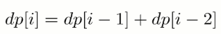

[TOC]

### 递归与动态规划题目

递归和动态规划都是将原问题**拆成多个子问题然后求解**，他们之间最本质的区别是，**动态规划保存了子问题的解**，避免重复计算。


### 斐波那契数列类题目

#### 斐波那契数列【简单】

##### 1. 题目

求斐波那契数列的**第 n 项**，n <= 39。


##### 2. 解题

如果使用**递归**求解，会**重复计算**一些子问题。例如，计算 f(4) 需要计算 f(3) 和 f(2)，计算 f(3) 需要计算 f(2) 和 f(1)，可以看到 f(2) 被**重复计算**了。


递归是将一个问题划分成**多个子问题**求解，动态规划也是如此，但是**动态规划**会把子问题的**解缓存**起来，从而避免重复求解子问题。

```java
public int Fibonacci(int n) {
    // Base case
    if (n <= 1)
        return n;
    int[] fib = new int[n + 1];
    // 初始化
    fib[1] = 1;
    // 自底向上计算即可
    for (int i = 2; i <= n; i++)
        fib[i] = fib[i - 1] + fib[i - 2];
    return fib[n];
}
```

考虑到第 i 项只与第 **i - 1** 和第 **i - 2** 项有关，因此**只需要存储前两项**的值就能求解第 i 项，从而将**空间复杂度**由 O(N) 降低为 O(1)。

```java
public int Fibonacci(int n) {
    if (n <= 1) {
        return n;
    }
    // 两个指针，一个前一个后
    int back = 0, front = 1;
    // 存放最终结果
    int fibAns = 0;
    for (int i = 2; i <= n; i++) {
        fibAns = back + front;
        back = front;
        front = fibAns;
    }
    return fibAns;
}
```

由于待求解的 n 小于 40，因此可以将前 40 项的结果**先进行计算**，之后就能以 **O(1)** 时间复杂度得到第 n 项的值。

```java
public class Solution {

    private int[] fib = new int[40];
	// 预先计算并缓存
    public Solution() {
        fib[1] = 1;
        for (int i = 2; i < fib.length; i++)
            fib[i] = fib[i - 1] + fib[i - 2];
    }

    public int Fibonacci(int n) {
        return fib[n];
    }
}
```

#### 跳台阶/爬楼梯【简单】

##### 1. 题目

一只青蛙一次可以跳上 **1 级台阶**，也可以跳上 **2 级**。求该青蛙跳上一个 **n 级的台阶总共有多少种跳法**。


连接：https://leetcode-cn.com/problems/climbing-stairs/

##### 2. 解题

当 **n = 1** 时，只有**一种**跳法：


当 **n = 2** 时，有**两种**跳法：


跳 n 阶台阶，可以**先跳 1 阶台阶**，**再跳 n-1** 阶台阶；或者**先跳 2 阶**台阶，再跳 **n-2 阶**台阶。而 n-1 和 n-2 阶台阶的跳法可以看成**子问题**，该问题的递推公式为：


也可也看成是**裴波那契**类型的题目。

```java
public int JumpFloor(int n) {
    if (n <= 2) {
        return n;
    }
    int back = 1, front = 2;
    int result = 1;
    // 滚动计算
    for (int i = 2; i < n; i++) {
        result = back + front;
        back = front;
        front = result;
    }
    return result;
}
```

----

#### 变态跳台阶【简单】

##### 1. 题目

一只青蛙一次可以跳上 1 级台阶，也可以跳上 2 级... 它也**可以跳上 n 级**。求该青蛙跳上一个 n 级的台阶总共有多少种跳法。


##### 2. 解题

###### (1) 动态规划

每个位置都是之前位置的结果的**和**。

```java
public int JumpFloorII(int target) {
    int[] dp = new int[target];
    Arrays.fill(dp, 1);
    for (int i = 1; i < target; i++) {
        for (int j = 0; j < i; j++) {
            dp[i] += dp[j];
        }
    }
    return dp[target - 1];
}
```

###### (2) 数学推导

跳上 n-1 级台阶，可以从 n-2 级跳 1 级上去，也可以从 **n-3 级**跳 2 级上去...，那么

```java
f(n-1) = f(n-2) + f(n-3) + ... + f(0)
```

同样，跳上 n 级台阶，可以从 n-1 级跳 1 级上去，也可以从 n-2 级跳 2 级上去... ，那么

```java
f(n) = f(n-1) + f(n-2) + ... + f(0)
```

综上可得

```java
f(n) - f(n-1) = f(n-1)
```

即：

```java
f(n) = 2*f(n-1)
```

所以 f(n) 是一个等比数列

```java
public int JumpFloorII(int target) {
    return (int) Math.pow(2, target - 1);
}
```

#### 母牛生产问题

题目描述：假设农场中成熟的母牛每年都会生 1 头小母牛，并且永远不会死。第一年有 1 只小母牛，从第二年开始，母牛开始生小母牛。每只小母牛 **3 年**之后成熟又可以生小母牛。给定整数 N，求 N 年后牛的**数量**。

第 i 年成熟的牛的**数量**为：


### 路径类题目

#### 矩阵中的不同路径【中等】

##### 1. 题目

一个机器人位于一个 m x n 网格的左上角 （起始点在下图中标记为“Start” ）。机器人每次只能向下或者向右移动一步。机器人试图达到网格的右下角（在下图中标记为“Finish”）。问**总共有多少条不同的路径**？


链接：https://leetcode-cn.com/problems/unique-paths

##### 2. 题解

###### (1) 动态规划法

令 dp\[i][j] 是到达 i, j 位置的路径数。由于**某个位置只能从上方或者左方**到来，所以**路线数量就是上方和左方路线数量的和。**状态方程：

```java
dp[i][j] = dp[i-1][j] + dp[i][j-1]
```

初始化：对于第一行 dp\[0][j]，或者第一列 dp\[i][0]，由于都是在边界，所以**只能为 1**。

时间复杂度：O(m * n)，空间复杂度：O(m * n)

```java
public int uniquePaths(int m, int n) {
    int[][] dp = new int[m][n];
    // 初始化第一行和第一列
    for (int i = 0; i < n; i++) dp[0][i] = 1;
    for (int i = 0; i < m; i++) dp[i][0] = 1;
    for (int i = 1; i < m; i++) {
        for (int j = 1; j < n; j++) {
            dp[i][j] = dp[i - 1][j] + dp[i][j - 1];
        }
    }
    return dp[m - 1][n - 1];
}
```

**优化**：因为每次只需要 dp\[i-1][j], dp\[i][j-1]。所以可以只记录这两个数。

```java
public int uniquePaths2(int m, int n) {
    int[] pre = new int[n];
    int[] cur = new int[n];
    Arrays.fill(pre, 1);
    Arrays.fill(cur, 1);
    for (int i = 1; i < m; i++) {
        for (int j = 1; j < n; j++) {
            cur[j] = cur[j - 1] + pre[j];
        }
        pre = cur.clone();
    }
    return pre[n - 1];
}
```

###### (2) 数学推导法

也可以直接用数学公式求解，这是一个组合问题。机器人总共移动的次数 S=m+n-2，向下移动的次数 D=m-1，那么问题可以看成从 S 中取出 D 个位置的组合数量，这个问题的解为 C(S, D)。

```java
public int uniquePaths3(int m, int n) {
    // 总共的移动次数
    int totalMove = m + n - 2;
    // 向下的移动次数
    int downMove = m - 1;
    long res = 1;
    for (int i = 1; i <= downMove; i++) {
        res = res * (totalMove - downMove + i) / i;
    }
    return (int) res;
}
```

#### 最小路径和【中等】

##### 1. 题目

给定一个包含非负整数的 m x n 网格，请找出一条从**左上角到右下角**的路径，使得路径上的**数字总和为最小**。

说明：每次只能向下或者向右移动一步。示例：

````java
输入:
[
  [1,3,1],
  [1,5,1],
  [4,2,1]
]
输出: 7
解释: 因为路径 1→3→1→1→1 的总和最小。
````

链接：https://leetcode-cn.com/problems/minimum-path-sum

也可以求**最大**路径和，差不多的。

##### 2. 题解

类似上一题！只不过这里 dp 数组表示的是到达  m, n 坐标时的最小的和。

这里状态方程为：

```java
dp[i][j] = Math.min(dp[i - 1][j], dp[i][j - 1]) + grid[i][j];
```

```java
public int minPathSum(int[][] grid) {
    int row = grid.length;
    int col = grid[0].length;
    if (row == 0 || col == 0) return 0;

    int[][] dp = new int[row][col];
    // 初始化第一行第一列
    dp[0][0] = grid[0][0];
    for (int i = 1; i < row; i++) {
        dp[i][0] = dp[i - 1][0] + grid[i][0];
    }
    for (int j = 1; j < col; j++) {
        dp[0][j] = dp[0][j - 1] + grid[0][j];
    }

    for (int i = 1; i < row; i++) {
        for (int j = 1; j < col; j++) {
            dp[i][j] = Math.min(dp[i - 1][j], dp[i][j - 1]) + grid[i][j];
        }
    }
    return dp[row - 1][col - 1];
}
```

可以用一个一维数组来代替二维数组优化空间。

```java
public int minPathSum2(int[][] grid) {
    // Base case
    if (grid.length == 0 || grid[0].length == 0) return 0;
    int m = grid.length, n = grid[0].length;
    int[] dp = new int[n];
    for (int i = 0; i < m; i++) {
        for (int j = 0; j < n; j++) {
            // 只能从上侧走到该位置
            if (j == 0) {
                dp[j] = dp[j];
            } else if (i == 0) {
                // 只能从左侧走到该位置
                dp[j] = dp[j - 1];
            } else {
                dp[j] = Math.min(dp[j - 1], dp[j]);
            }
            dp[j] += grid[i][j];
        }
    }
    return dp[n - 1];
}
```


### 数组区间问题

#### 数组区间和【简单】

##### 1. 题目

给定一个整数数组  nums，**求出数组从索引 i 到 j  (i ≤ j) 范围内元素的总和**，包含 i,  j 两点。

示例：

```java
给定 nums = [-2, 0, 3, -5, 2, -1]，求和函数为 sumRange()
sumRange(0, 2) -> 1
sumRange(2, 5) -> -1
sumRange(0, 5) -> -3
```

说明：你可以假设数组不可变。会多次调用 sumRange 方法。

链接：https://leetcode-cn.com/problems/range-sum-query-immutable

##### 2. 题解

求区间 i \~ j 的和，可以**转换为 sum[j + 1] - sum[i]**，其中 **sum[i] 为 0 \~ i - 1** 的和。因此先**滚动计算**出各个位置之前的和就行了。

```java
// 存放计算好的和
private int[] sums;

public NumArray(int[] nums) {
    sums = new int[nums.length + 1];
    for (int i = 1; i <= nums.length; i++) {
        // 滚动计算数组和
        sums[i] = sums[i - 1] + nums[i - 1];
    }
}

public int sumRange(int i, int j) {
    return sums[j + 1] - sums[i];
}
```


### 字符串与序列类题目

#### 数组最大子序列和【简单】

##### 1. 题目

给定一个整数数组 nums ，找到一个具有**最大和的连续子数组**（子数组最少包含一个元素），返回其**最大和**。

示例：

```java
输入: [-2,1,-3,4,-1,2,1,-5,4],
输出: 6
解释: 连续子数组 [4,-1,2,1] 的和最大，为 6。
```

进阶：如果你已经实现**复杂度为 O(n) 的解法**，尝试使用更为精妙的分治法求解。

链接：https://leetcode-cn.com/problems/maximum-subarray

##### 2. 题解

###### (1) 动态规划

动态规划的是首先对数组进行遍历，当前最大连续子序列**和为 sum**，结果为 ans。

- 如果 **sum > 0**，则说明 sum **对结果有增益效果**，则 sum 保留并加上当前遍历数字。
- 如果 **sum <= 0**，则说明 sum 对结果**无增益效果**，需要**舍弃**，则 sum 直接**更新为当前遍历数字**。
- 每次**比较 sum 和 ans 的大小**，将最大值置为 ans，遍历结束返回结果。

```java
public int maxSubArray(int[] nums) {
    // 数组长度
    int len = nums.length;
    if (len == 0) return 0;
    // 构造dp数组 dp数组存放的是以当前索引位置结束的子数组中的最大子序列和
    int[] dp = new int[len];
    // 初始化
    dp[0] = nums[0];
    // 遍历nums数组
    for (int i = 1; i < len; i++) {
        // 说明之前是正增益
        if (dp[i - 1] >= 0) {
            dp[i] = dp[i - 1] + nums[i];
        } else {
            // 直接取值
            dp[i] = nums[i];
        }
    }
    // 最后不要忘记遍历dp数组找到子序列和最大值
    int res = dp[0];
    for (int i = 1; i < len; i++) {
        res = Math.max(res, dp[i]);
    }
    return res;
}
```

可以进一步**压缩空间**。**状态压缩** , 只需要一个变量 subMax 保存前面子组合的**最大值**，另外一个 max 保存**全局最大值**。其实代码结构差不多。

```java
public int maxSubArray2(int[] nums) {
    if (nums == null) return 0;
    // 全局最大值
    int maxSum = nums[0];
    // 前一个子组合的最大值,状态压缩
    int subMax = nums[0];
    for (int i = 1; i < nums.length; i++) {
        if (subMax > 0) {
            // 前一个子组合最大值大于0，正增益
            subMax = subMax + nums[i];
        } else {
            // 前一个子组合最大值小于0，抛弃前面的结果
            subMax = nums[i];
        }
        // 计算全局最大值 滚动更新即可
        maxSum = Math.max(maxSum, subMax);
    }
    return maxSum;
}
```

###### (2) 分治法

分治法是将整个**数组切分成几个小组**，然后每个小组再切分成几个**更小的小组**，一直到不能继续切分也就是**只剩一个数字**为止。每个小组会**计算出最优值**，汇报给上一级的小组，一级一级汇报，上级拿到下级的汇报找到最大值，得到最终的结果。和**归并排序**的算法类似，先切分，再合并结果。

这个问题中的关键就是**如何切分**这些组合才能使每个小组之间**不会有重复的组合**（有重复的组合意味着有重复的计算量）。

首先是切分分组方法，就这个案例中的例子来，我们有一个数组 [-2, 1, -3, 4, -1, 2, 1, -5, 4] ，一共有 9 个元素，我们 center = (start + end) / 2 这个原则，得到中间元素的索引为 4 ，也就是 -1，拆分成**三个组合**：

- [-2, 1, -3, 4, -1] 以及它的子序列（在 -1 左边的并且包含它的为一组）。
- [2, 1, -5, 4] 以及它的子序列（在 -1 右边不包含它的为一组）。
- 任何包含 -1 以及它右边元素 2 的序列为一组（换言之就是包含左边序列的最右边元素以及右边序列最左边元素的序列，比如 [4, -1, 2, 1]，这样就保证这个组合里面的任何序列都不会和上面两个重复）。

以上的三个组合内的序列没有任何的重复的部分，而且一起构成所有子序列的全集，计算出这个三个子集合的最大值，然后取其中的最大值，就是这个问题的答案了。

然而前两个子组合可以用递归来解决，一个函数就搞定，第三个跨中心的组合应该怎么计算最大值呢？

答案就是先计算左边序列里面的包含最右边元素的子序列的最大值，也就是从左边序列的最右边元素向左一个一个累加起来，找出累加过程中每次累加的最大值，就是左边序列的最大值。

同理找出右边序列的最大值，就得到了右边子序列的最大值。左右两边的最大值相加，就是包含这两个元素的子序列的最大值。

在计算过程中，累加和比较的过程是关键操作，一个长度为 n 的数组在递归的每一层都会进行 n 次操作，分治法的递归层级在 logNlogN 级别，所以整体的时间复杂度是 O(nlogn)O(nlogn)，在时间效率上不如动态规划的 O(n)O(n) 复杂度。

分治法的思路是这样的，其实也是分类讨论。

连续子序列的最大和主要由这三部分子区间里元素的最大和得到：

- 第 1 部分：子区间 [left, mid]；
- 第 2 部分：子区间 [mid + 1, right]；
- 第 3 部分：包含子区间[mid , mid + 1]的子区间，即 nums[mid] 与nums[mid + 1]一定会被选取。

对它们三者求最大值即可。


```java
public int maxSubArray(int[] nums) {
    return maxSubArrayDivideWithBorder(nums, 0, nums.length - 1);
}

private int maxSubArrayDivideWithBorder(int[] nums, int start, int end) {
    if (start == end) {
        // 只有一个元素，也就是递归的结束情况
        return nums[start];
    }

    // 计算中间值
    int center = (start + end) / 2;
    int leftMax = maxSubArrayDivideWithBorder(nums, start, center); // 计算左侧子序列最大值
    int rightMax = maxSubArrayDivideWithBorder(nums, center + 1, end); // 计算右侧子序列最大值

    // 下面计算横跨两个子序列的最大值

    // 计算包含左侧子序列最后一个元素的子序列最大值
    int leftCrossMax = Integer.MIN_VALUE; // 初始化一个值
    int leftCrossSum = 0;
    for (int i = center ; i >= start ; i --) {
        leftCrossSum += nums[i];
        leftCrossMax = Math.max(leftCrossSum, leftCrossMax);
    }

    // 计算包含右侧子序列最后一个元素的子序列最大值
    int rightCrossMax = nums[center+1];
    int rightCrossSum = 0;
    for (int i = center + 1; i <= end ; i ++) {
        rightCrossSum += nums[i];
        rightCrossMax = Math.max(rightCrossSum, rightCrossMax);
    }

    // 计算跨中心的子序列的最大值
    int crossMax = leftCrossMax + rightCrossMax;

    // 比较三者，返回最大值
    return Math.max(crossMax, Math.max(leftMax, rightMax));
}
```

#### 判断是否是字符串子序列【简单】

##### 1. 题目

给定字符串 sub 和 origin ，**判断 sub  是否为 origin 的子序列**。你可以认为 sub  和 origin 中仅包含英文小写字母。字符串 origin 可能会很长（长度 ~= 500,000），而 sub  是个短字符串（长度 <=100）。

字符串的一个子序列是原始字符串**删除一些（也可以不删除）字符而不改变剩余字符相对位置**形成的新字符串。（例如，"ace"是"abcde"的一个子序列，而"aec"不是）。

```java
示例 1:
s = "abc", t = "ahbgdc"
返回 true.

示例 2:
s = "axc", t = "ahbgdc"
返回 false.
```

后续挑战：如果有大量输入的 Sub ，称作S1, S2, ... , Sk 其中 k >= 10 亿，你需要依次检查它们是否为 Origin 的子序列。在这种情况下，你会怎样改变代码？

链接：https://leetcode-cn.com/problems/is-subsequence

##### 2. 题解

如果是匹配一个较短字符串 **sub** ，对于 **sub** 中每一个`char` 都**优先匹配最开始**遇到的，直接扫描一遍 **origin** 即可。

```java
public boolean isSubsequence(String sub, String origin) {
    int index = 0;
    for (char ch : sub.toCharArray()) {
        while (index < origin.length() && origin.charAt(index) != ch) {
            index++;
        }
        index++;
    }
    return index <= origin.length();
}
```

一种**双百**的解法复杂度为 O(N)，记住**这种解法**。

从 sub 中**依次取出一个字符**，到 origin 中去**查找**，记录第一次出现的位置；sub 中取出下一个字符，**从上次出现位置的下一个**开始查找，直到 sub 中的字符**全部扫描**完成。

```java
public boolean isSubsequence2(String sub, String origin) {
    // Base case
    if (sub == null || origin == null) return true;
    int alreadyUseIndex = 0, location = 0;
    for (int i = 0; i < sub.length(); i++) {
        // 找到当前字符在origin字符串中第一次出现的索引
        location = origin.indexOf(sub.charAt(i), alreadyUseIndex);
        // 说明没找到直接返回
        if (location < 0) {
            return false;
        }
        // 更新已经找过的索引
        alreadyUseIndex = location + 1;
    }
    return true;
}
```

后序挑战，如果 Sub 数量极大。

```java
public boolean isSubsequence3(String sub, String origin) {
    // 预处理,开头加一个空字符作为匹配入口
    origin = " " + origin;
    int len = origin.length();
    // 记录每个位置的下一个ch的位置
    int[][] dp = new int[len][26];
    for (char ch = 0; ch < 26; ch++) {
        int position = -1;
        // 从后往前记录dp
        for (int i = len - 1; i >= 0; i--) {
            dp[i][ch] = position;
            if (origin.charAt(i) == ch + 'a') {
                position = i;
            }
        }
    }
    // 匹配
    int i = 0;
    // 跳跃遍历
    for (char ch : sub.toCharArray()) {
        i = dp[i][ch - 'a'];
        if (i == -1) return false;
    }
    return true;
}
```


#### 回文子串数量【中等】

##### 1. 题目

给定一个字符串，你的任务是**计算这个字符串中有多少个回文子串**。具有不同开始位置或结束位置的子串，即使是由**相同的字符组成**，也会被计为是**不同的子串**。

```java
示例 1:
输入: "abc"
输出: 3
解释: 三个回文子串: "a", "b", "c".

示例 2:
输入: "aaa"
输出: 6
说明: 6个回文子串: "a", "a", "a", "aa", "aa", "aaa".
```

输入的字符串长度不会超过 1000。

链接：https://leetcode-cn.com/problems/palindromic-substrings

##### 2. 题解

###### (1) 中心扩展法

在长度为 N 的字符串中，可能的**回文串中心位置**有 **2N-1** 个：**单个字母或两个字母中间（此时中间没有字母）**。

**从每一个回文串中心**开始统计回文串数量。**回文区间 [a, b]** 表示 S[a], S[a+1], ..., S[b] 是**回文串**，根据回文串定义可知 [a+1, b-1] 也是回文区间。

对于**每个可能**的回文串中心位置，尽**可能扩大它的回文区间** [left, right]。当 **left >= 0 and right < N and S[left] == S[right] 时，扩大区间**。此时回文区间表示的回文串为 S[left], S[left+1], ..., S[right]。

```java
public int countSubstrings(String str) {
    int len = str.length(), res = 0;
	// 从左到右变量
    for (int center = 0; center <= 2 * len - 1; ++center) {
        // 计算左边界
        int left = center / 2;
        // 计算右边界
        int right = left + center % 2;
        // 从中心向两边扩散：保证索引不越界且字母相等
        while (left >= 0 && right < len && str.charAt(left) == str.charAt(right)) {
            res++;
            left--;
            right++;
        }
    }
    return res;
}
```

###### (2) 马拉车算法

马拉车算法可以在线性时间内**找出以任何位置为中心的最大回文串**。

###### (3) 动态规划

状态：dp\[i][j] 表示字符串 s 在 [i, j] 区间的子串是否是一个回文串。

状态转移方程：当 s[i] == s[j] && (j - i < 2 || dp\[i + 1][j - 1]) 时，dp\[i][j]=true，否则为 false。

- 当只有一个字符时，比如 a 自然是一个回文串。
- 当有两个字符时，如果是相等的，比如 aa，也是一个回文串。
- 当有三个及以上字符时，比如 ababa 这个字符记作串 1，把两边的 a 去掉，也就是 bab 记作串 2，可以看出只要串 2 是一个回文串，那么左右各多了一个 a 的串 1 必定也是回文串。所以**当 s[i]==s[j] 时**，自然要看 dp\[i+1][j-1] 是不是一个回文串。

```java
public int countSubstrings2(String str) {
    // 动态规划法
    boolean[][] dp = new boolean[str.length()][str.length()];
    int ans = 0;
    for (int j = 0; j < str.length(); j++) {
        for (int i = 0; i <= j; i++) {
            if (str.charAt(i) == str.charAt(j) && (j - i < 2 || dp[i + 1][j - 1])) {
                dp[i][j] = true;
                ans++;
            }
        }
    }
    return ans;
}
```

---

#### 字符串的最长回文子序列

##### 1. 题目

给定一个字符串 s，找到其中最长的回文子序列。可以假设 s 的最大长度为1000。**最长回文子序列和上一题最长回文子串的区别是，子串是字符串中连续的一个序列，而子序列是字符串中保持相对位置的字符序列，例如，"bbbb"可以是字符串"bbbab"的子序列但不是子串。**给定一个字符串s，找到其中最长的回文子序列。可以假设s的最大长度为1000。

示例 1：

```
输入:
"bbbab"
输出:
4
```

一个可能的最长回文子序列为 "bbbb"。

示例 2：

```
输入:
"cbbd"
输出:
2
```

一个可能的最长回文子序列为 "bb"。

链接：https://leetcode-cn.com/problems/longest-palindromic-subsequence/

##### 2. 题解

###### (1) 动态规划法

**dp\[i][j] 表示 s 的第 i 个字符到第 j 个字符组成的子串中，最长的回文序列长度是多少。**

如果 s 的第 i 个字符和第 j 个字符相同的话

```java
f[i][j] = f[i + 1][j - 1] + 2
```

如果 s 的第 i 个字符和第 j 个字符不同的话

````java
f[i][j] = max(f[i + 1][j], f[i][j - 1])
````

然后注意遍历顺序，i 从最后一个字符开始往前遍历，j 从 i + 1 开始往后遍历，这样可以保证每个子问题都已经算好了。

**初始化**：f\[i][i] = 1 单个字符的最长回文序列是 1。

**结果**：f\[0][n - 1]。

计算方向如下所示。


```java
public int longestPalindromeSubseq(String str) {
    int len = str.length();
    int[][] dp = new int[len][len];
    // 从后往前dp
    for (int i = len - 1; i >= 0; i--) {
        // 初始化
        dp[i][i] = 1;
        for (int j = i + 1; j < len; j++) {
            // 状态转移方程
            if (str.charAt(i) == str.charAt(j)) {
                dp[i][j] = dp[i + 1][j - 1] + 2;
            } else {
                dp[i][j] = Math.max(dp[i + 1][j], dp[i][j - 1]);
            }
        }
    }
    // 整个s的最长回文子串长度
    return dp[0][len - 1];
}
```


#### 背包问题

先得到该问题的局部解然后扩展到全局问题解。

我们可以假设一个B(k,C) 方法，第k件物品，当前背包所剩下的容量C（初始则C=W）情况下，能够偷的最大价值量。

B( i , c ) = max{ F( i - 1 , C ) ,  v(i) + F( i - 1, C - w[i] ) };

##### （1）记忆化搜索

```java
/**
 * 记忆化搜索
 * 时间复杂度: O(n * C) 其中n为物品个数; C为背包容积
 * 空间复杂度: O(n * C)
 */
public class Solution01 {
    private static int count = 0;
    private static int[][] memo;

    public int knapsack(int[] w, int[] v, int C) {
        int n = w.length;
        memo = new int[n][C + 1];
        for(int i = 0;i<n;i++)
            Arrays.fill(memo[i],-1);

        return bestValue(w, v, n - 1, C);
    }

    // 用 [0...index]的物品,填充容积为c的背包的最大价值
    private int bestValue(int[] w, int[] v, int i, int C) {
        count++;
        if (i < 0 || C <= 0)
            return 0;

        if (memo[i][C] != -1) // 记忆化搜索
            return memo[i][C];

        int res = 0;
        res = bestValue(w, v, i - 1, C);
        if (C >= w[i])
            res = max(res, v[i] + bestValue(w, v, i - 1, C - w[i]));

        return memo[i][C] = res;
    }

    private int max(int a, int b) {
        return a > b ? a : b;
    }

    public static void main(String[] args) {
        int[] w = {5,4,6,3};
        int[] v = {10,40,30,50};
        System.out.println(new Solution01().knapsack(w, v, 10));
        System.out.println("count of bestValue() exec：" + count);
        PrintHelper.print2DArray(memo);
    }
}
```

##### （2）动态规划


```java
/**
 * 动态规划
 * 时间复杂度: O(n * C) 其中n为物品个数; C为背包容积
 * 空间复杂度: O(n * C)
 */
public class Solution02 {
    public int knapsack(int[] w, int[] v, int C) {
        int n = w.length;
        int[][] memo = new int[n][C + 1];

        if (n == 0 || C == 0)
            return 0;

        for (int j = 0; j <= C; j++)
            memo[0][j] = (j >= w[0] ? v[0] : 0);

        for (int i = 1; i < n; i++) {
            for (int j = 0; j <= C; j++) {
                memo[i][j] = memo[i - 1][j];
                if (j >= w[i]) {
                    memo[i][j] = max(memo[i][j], v[i] + memo[i - 1][j - w[i]]);
                }
            }
        }

        return memo[n - 1][C];
    }

    private int max(int a, int b) {
        return a > b ? a : b;
    }


    public static void main(String[] args) {
        int[] w = {1, 2, 3};
        int[] v = {6, 10, 12};
        int C = 5;
        System.out.println(new Solution02().knapsack(w, v, C));
    }
}

```

##### （3）动态规划优化思路1

优化思路：第i行元素只依赖于第i-1行元素，理论上，只需要保持两行元素即可


```java
/// 动态规划改进: 滚动数组
/// 时间复杂度: O(n * C) 其中n为物品个数; C为背包容积
/// 空间复杂度: O(C), 实际使用了2*C的额外空间
public class Solution1 {

    public int knapsack01(int[] w, int[] v, int C){

        if(w == null || v == null || w.length != v.length)
            throw new IllegalArgumentException("Invalid w or v");

        if(C < 0)
            throw new IllegalArgumentException("C must be greater or equal to zero.");

        int n = w.length;
        if(n == 0 || C == 0)
            return 0;

        int[][] memo = new int[2][C + 1];

        for(int j = 0 ; j <= C ; j ++)
            memo[0][j] = (j >= w[0] ? v[0] : 0);

        for(int i = 1 ; i < n ; i ++)
            for(int j = 0 ; j <= C ; j ++){
                memo[i % 2][j] = memo[(i-1) % 2][j];
                if(j >= w[i])
                    memo[i % 2][j] = Math.max(memo[i % 2][j], v[i] + memo[(i-1) % 2][j - w[i]]);
            }

        return memo[(n-1) % 2][C];
    }
}
```

##### （4）动态规划优化思路2


```java
/// 动态规划改进
/// 时间复杂度: O(n * C) 其中n为物品个数; C为背包容积
/// 空间复杂度: O(C), 只使用了C的额外空间
public class Solution2 {

    public int knapsack01(int[] w, int[] v, int C){

        if(w == null || v == null || w.length != v.length)
            throw new IllegalArgumentException("Invalid w or v");

        if(C < 0)
            throw new IllegalArgumentException("C must be greater or equal to zero.");

        int n = w.length;
        if(n == 0 || C == 0)
            return 0;

        int[] memo = new int[C+1];

        for(int j = 0 ; j <= C ; j ++)
            memo[j] = (j >= w[0] ? v[0] : 0);

        for(int i = 1 ; i < n ; i ++)
            for(int j = C ; j >= w[i] ; j --)
                memo[j] = Math.max(memo[j], v[i] + memo[j - w[i]]);

        return memo[C];
    }
}
```

##### （5）背包问题更多变种

- **多重背包问题**：每个物品不不⽌1个，有 num(i) 个
- **完全背包问题**：每个物品可以⽆无限使⽤用
- **多维费用背包问题**：要考虑物品的体积和重量量两个维度？
- **物品间加入更更多约束**：物品间可以互相排斥；也可以互相依赖


#### 最长上升子序列

##### 1. 题目

**Longest Increasing Subsequence (LIS)**

**【Leetcode 300】最长上升子序列** 

给定一个无序的整数数组，找到其中最长上升子序列的长度。

**示例:**

```
输入: [10,9,2,5,3,7,101,18]
输出: 4 
解释: 最长的上升子序列是 [2,3,7,101]，它的长度是 4。
```

**说明:**

- 可能会有多种最长上升子序列的组合，你只需要输出对应的长度即可。
- 你算法的时间复杂度应该为 O(*n2*) 。

**进阶:** 你能将算法的时间复杂度降低到 **O(*n* log *n*)** 吗?

##### 2. 题解

LIS( i ) 表示以**第 i 个数字为结尾**的最长上升子序列的长度。

LIS( i ) 表示 [0...i] 的范围内，选择数字 nums[i] 可以获得的最长上升子序列的长度。

LIS ( i )  =   max<sub>j<i</sub>( 1 + LIS( j ) if nums[i] > nums[j] )。

```java
public class Solution {

    public int lengthOfLIS(int[] nums) {
        int n = nums.length;
        if (n == 0) {
            return 0;
        }

        int res = 1;
        int[] memo = new int[n];
        // 全部填充为1
        Arrays.fill(memo, 1);

        for (int i = 1; i < n; i++) {
            for (int j = 0; j < i; j++) {
                if (nums[j] < nums[i])
                    memo[i] = max(memo[i] , memo[j] + 1);
            }
        }

        for(int i = 0; i < n; i++){
            res = max(memo[i], res);
        }
        return res;
    }

    private int max(int a, int b) {
        return a > b ? a : b;
    }

    public static void main(String[] args) {
        int[] arr = {10, 9, 2, 5, 3, 7, 101, 18};
        System.out.println(new Solution().lengthOfLIS(arr));
    }
}
```

这里思考一个问题：在上面的代码中只求**解出了上升子序列的长度**，那么如何求出具体的上升子序列呢？

```java
public class Solution2 {
    // 记录一下有几个上升子序列
    private static List<Integer> LISindex = new ArrayList<>(); 

    public List<List<Integer>> lengthOfLIS(int[] nums) {
        List<List<Integer>> resList = new ArrayList<>();
        int n = nums.length;
        if (n == 0) {
            return null;
        }

        int res = 1;
        int[] memo = new int[n];

        Arrays.fill(memo, 1);

        for (int i = 1; i < n; i++) {
            for (int j = 0; j < i; j++) {
                if (nums[j] < nums[i])
                    memo[i] = max(memo[i], memo[j] + 1);
            }
        }

        for (int i = 0; i < n; i++) {
            res = max(memo[i], res);
        }

        for (int i = 0; i < n; i++) {
            if (memo[i] == res)
                // 遍历一下最长子序列最后一位是谁，统计一共有多少个子序列
                LISindex.add(i); 
        }

        for (int lastIndex : LISindex) {
            ArrayList<Integer> list = new ArrayList<>();
            int nowMemoCount = memo[lastIndex];

            for (int i = lastIndex; i >= 0; i--) {
                if (nowMemoCount - memo[i] == 1 || nowMemoCount - memo[i] == 0) {
                    list.add(nums[i]);
                    nowMemoCount--;
                }
            }
            resList.add(reverseList(list));
        }

        return resList;
    }

    private int max(int a, int b) {
        return a > b ? a : b;
    }

    private List<Integer> reverseList(ArrayList<Integer> list) {
        List<Integer> newList = new ArrayList<>();
        for (int i = list.size() - 1; i >= 0; i--) {
            newList.add(list.get(i));
        }
        return newList;
    }

    public static void main(String[] args) {
        int[] arr = {10, 9, 2, 5, 3, 7, 101, 18};
        System.out.println(new Solution2().lengthOfLIS(arr));
    }
}
```


#### 最长公共子序列

##### 1. 题目

**Longest Common Sequence (LCS)**：给出两个字符串 S1 和 S2，求这两个字符串的最长公共子序列的长度。

LCS( m , n ) S1[0…m] 和 S2[0…n] 的最长公共子序列的长度。

**S1[m] == S2[n] :**  

LCS(m,n) = 1 + LCS(m-1,n-1) 

**S1[m] != S2[n] :**   

LCS(m,n) = max( LCS(m-1,n) , LCS(m,n-1) )


```java
/**
 * 最长公共子序列
 */
public class Solution3 {

    public int LCS(String s1, String s2) {
        return bestLength(s1, s2, s1.length() - 1, s2.length() - 1);
    }

    public int bestLength(String s1, String s2, int m, int n) {
        if (m < 0 || n < 0)
            return 0;
        int lcs = 0;
        if (s1.charAt(m) == s2.charAt(n)) {
            lcs = 1 + bestLength(s1, s2, m - 1, n - 1);
        } else {
            lcs = max(bestLength(s1, s2, m - 1, n), bestLength(s1, s2, m, n - 1));
        }
        return lcs;
    }

    private int max(int a, int b) {
        return a > b ? a : b;
    }

    public static void main(String[] args) {
        System.out.println(new Solution3().LCS("ABCDEE", "ABDCEE"));
    }
}
```


#### 打家劫舍【简单】

##### 1. 题目

你是一个专业的小偷，计划偷窃**沿街**的房屋。每间房内都藏有一定的现金，影响你偷窃的唯一制约因素就是相邻的房屋装有相互连通的防盗系统，如果**两间相邻的房屋在同一晚上被小偷闯入**，系统会自动报警。给定一个代表每个房屋存放金额的非负整数数组，计算你不触动警报装置的情况下 ，**一夜之内能够偷窃到的最高金额**。

```java
示例 1：

输入：[1,2,3,1]
输出：4
解释：偷窃 1 号房屋 (金额 = 1) ，然后偷窃 3 号房屋 (金额 = 3)。
     偷窃到的最高金额 = 1 + 3 = 4 。
示例 2：

输入：[2,7,9,3,1]
输出：12
解释：偷窃 1 号房屋 (金额 = 2), 偷窃 3 号房屋 (金额 = 9)，接着偷窃 5 号房屋 (金额 = 1)。
     偷窃到的最高金额 = 2 + 9 + 1 = 12 。
```


链接：https://leetcode-cn.com/problems/house-robber

##### 2. 题解

定义 **dp 数组**用来存储**最大的抢劫量**，其中 dp[i] 表示抢到**第 i 个住户时**的最大抢劫量。

由于不能抢劫邻近住户，如果抢劫了第 i -1 个住户，那么就不能再抢劫第 i 个住户，所以


```java
public int rob(int[] nums) {
    if (nums == null || nums.length == 0) {
        return 0;
    }
    if (nums.length == 1) {
        return nums[0];
    }
    int[] dp = new int[nums.length];
    dp[0] = nums[0];
    dp[1] = Math.max(nums[0], nums[1]);

    for(int i = 2; i < nums.length; i++) {
        dp[i] = Math.max(dp[i - 1], dp[i - 2] + nums[i]);
    }
    return dp[dp.length - 1];
}
```

由于是可以进行滚动计算的，所以不需要 dp 这么大的空间，类似斐波那契数列，可以优化如下。

```java
public int rob2(int[] nums) {
    if (nums == null || nums.length == 0) {
        return 0;
    }
    int length = nums.length;
    if (length == 1) {
        return nums[0];
    }
    int slow = nums[0], fast = Math.max(nums[0], nums[1]);
    for (int i = 2; i < length; i++) {
        int temp = fast;
        fast = Math.max(slow + nums[i], fast);
        slow = temp;
    }
    return fast;
}
```

#### 打家劫舍II【中等】

##### 1. 题目

题目跟上题一样，只不过条件改成**所有的房屋都围成一圈**。

```java
示例 1:
输入: [2,3,2]
输出: 3
解释: 你不能先偷窃 1 号房屋（金额 = 2），然后偷窃 3 号房屋（金额 = 2）, 因为他们是相邻的。
    
示例 2:
输入: [1,2,3,1]
输出: 4
解释: 你可以先偷窃 1 号房屋（金额 = 1），然后偷窃 3 号房屋（金额 = 3）。
     偷窃到的最高金额 = 1 + 3 = 4 。
```

链接：https://leetcode-cn.com/problems/house-robber-ii

##### 2. 题解

**环状排列**意味着**第一个房子和最后一个房子**中只能**选择一个**偷窃，因此可以把此环状排列房间问题**约化为两个单排排列房间子问题**：

- 在**不偷窃第一个房子**的情况下（即 nums[1:]），最大金额是 P1；
- 在**不偷窃最后一个房子**的情况下（即 nums[:n-1]），最大金额是 P2。
- 综合偷窃最大金额： 为以上两种情况的较大值，即 **max(p1, p2)**。

```java
public int rob(int[] nums) {
    // Base case
    if (nums == null || nums.length == 0) return 0;
    int len = nums.length;
    if (len == 1) return nums[0];
    // 不偷窃第一个房子和不偷窃最后一个房子取较大值
    return Math.max(normalRob(nums, 0, len - 2), normalRob(nums, 1, len - 1));
}


// 指定范围的打家劫舍
private int normalRob(int[] nums, int firstRob, int lastRob) {
    int pre2 = 0, pre1 = 0;
    for (int i = firstRob; i <= lastRob; i++) {
        int cur = Math.max(pre1, pre2 + nums[i]);
        pre2 = pre1;
        pre1 = cur;
    }
    return pre1;
}
```

#### 除数博弈【简单】

##### 1. 题目

爱丽丝和鲍勃一起玩游戏，他们轮流行动。爱丽丝先手开局。最初，黑板上有一个**数字 N** 。在每个玩家的回合，玩家需要执行以下操作：

- 选出任一 x，满足 0 < x < N 且 **N % x == 0** 。
- 用 **N - x 替换**黑板上的数字 N 。

如果玩家无法执行这些操作，就会输掉游戏。只有在爱丽丝在游戏中取得胜利时才返回 True，否则返回 false。假设两个玩家都以**最佳状态**参与游戏。

```java
示例 1：
输入：2
输出：true
解释：爱丽丝选择 1，鲍勃无法进行操作。
    
示例 2：
输入：3
输出：false
解释：爱丽丝选择 1，鲍勃也选择 1，然后爱丽丝无法进行操作。
```


链接：https://leetcode-cn.com/problems/divisor-game

##### 2. 题解

###### (1) 归纳法

观察：谁先从 2 的基础减去 1 谁胜。统计**能取模的次数**，**次数为奇数则 Alice 赢，返回 true**。

- 最终结果应该是占到 2 的赢，占到 1 的输；
- 若当前为奇数，奇数的约数只能是奇数或者 1，因此下一个一定是偶数；
- 若当前为偶数， 偶数的约数可以是奇数可以是偶数也可以是 1，因此直接减 1，则下一个是奇数；
- 因此，奇则输，偶则赢。

直接写出：

```java
public boolean divisorGame(int N) {
    return N % 2 == 0;
}
```

###### (2) 动态规划法

基本思路：

将所有的**小于等于 N 的解**都找出来，基于前面的，递推后面的。

状态转移: 如果 **i 的约数**里面有存在为 False 的（即输掉的情况），则当前 i 应为 True；如果没有，则为 False。

求出**所有 3-N** 的因子，比较大小：

- 若得 0（即**可以给别人一个 0**），说明拿到该值**必胜**，将该值转化为 1；

- 若得 1（即**必须给别人一个 1**），说明拿到该值**必输**，将该值转化为 0；

补充：为了让dp[i] 的 i 与 N 对应，给不会出现的 dp[0] 和 dp[1] 一个极大值；

```java
public boolean divisorGame(int N) {
    if (N == 1) return false;
    if (N == 2) return true;
    boolean[] dp = new boolean[N + 1];
    dp[1] = false;
    dp[2] = true;
    for (int i = 3; i <= N; i++) {
        for (int j = 1; j < i; j++) {
            if (i % j == 0 && !dp[i - j]) {
                dp[i] = true;
                break;
            }
        }
    }
    return dp[N];
}
```

#### 买卖股票的最佳时机【简单】

##### 1. 题目

给定一个**数组**，它的第 i 个元素是一支给定股票第 i 天的价格。如果你最多**只允许完成一笔交易**（即买入和卖出一支股票一次），设计一个算法来计算你所能获取的最大利润。注意：你不能在买入股票前卖出股票。

```java
示例 1:
输入: [7,1,5,3,6,4]
输出: 5
解释: 在第 2 天（股票价格 = 1）的时候买入，在第 5 天（股票价格 = 6）的时候卖出，最大利润 = 6-1 = 5 。注意利润不能是 7-1 = 6, 因为卖出价格需要大于买入价格；同时，你不能在买入前卖出股票。
    
示例 2:
输入: [7,6,4,3,1]
输出: 0
解释: 在这种情况下, 没有交易完成, 所以最大利润为 0。
```

链接：https://leetcode-cn.com/problems/best-time-to-buy-and-sell-stock

##### 2. 题解

使用贪心策略，假设第 i 轮进行卖出操作，买入操作价格应该在 i **之前并且价格最低**。


```java
public int maxProfit(int prices[]) {
    // 最小价格
    int minPrice = Integer.MAX_VALUE;
    // 记录最大利润
    int maxProfit = 0;
    // 遍历更新这个值
    for (int i = 0; i < prices.length; i++) {
        // 更新最小价格
        if (prices[i] < minPrice) {
            minPrice = prices[i];
        } else if (prices[i] - minPrice > maxProfit) {
            // 更新最大利润
            maxProfit = prices[i] - minPrice;
        }
    }
    return maxProfit;
}

```


#### 使用最小花费爬楼梯【简单】

##### 1. 题目

数组的每个索引作为一个阶梯，**第 i 个阶梯**对应着一个非负数的体力花费值 **cost\[i]** (索引从 0 开始)。每当你爬上一个阶梯你都要花费对应的体力花费值，然后你可以选择继续爬一个阶梯或者爬两个阶梯。您需要找到达到楼层**顶部**的最低花费。在开始时，你可以选择从**索引为 0 或 1 的元素**作为**初始阶梯**。

```java
示例 1:
输入: cost = [10, 15, 20]
输出: 15
解释: 最低花费是从cost[1]开始，然后走两步即可到阶梯顶，一共花费15。
示例 2:
输入: cost = [1, 100, 1, 1, 1, 100, 1, 1, 100, 1]
输出: 6
解释: 最低花费方式是从cost[0]开始，逐个经过那些1，跳过cost[3]，一共花费6。
```

链接：https://leetcode-cn.com/problems/min-cost-climbing-stairs

##### 2. 题解

###### (1) 动态规划法

dp[i] 意为爬到第 i 级需要的**最小**花费。

题意中的**第 0 级和第 1 级**是不需要花费体力即可到达的（见题目示例 1，可直接从 cost[1] 开始，即到达第 1 级**不需要**花费）。即 **dp[0] = 0; dp[1] = 0**。
对于爬到第i级需要的最小体力，可以选择从第 i - 1 级往上爬一步到达，也可以选择从第 i - 2 级往上爬两步到达。前者需要的体力等于爬到第 i - 1 级需要的最小体力 dp[i - 1] 再加上从第 i - 1 级往上爬要耗费的体力 cost[i - 1]，同理我们也可以得到后者需要的体力，这两者的较小者就是爬到第 i 级需要的最小体力。因此可得状态转移方程：

```java
dp[i] = Math.min(dp[i-2] + cost[i-2], dp[i-1] + cost[i-1]);
```

```java
public int minCostClimbingStairs(int[] cost) {
    // dp[0] dp[1] 默认为0
    int[] dp = new int[cost.length + 1];
    for(int i = 2; i < dp.length; i++) {
        // 选择一步到达或者两步到达的较小值
        dp[i] = Math.min(dp[i - 2] + cost[i - 2], dp[i - 1] + cost[i - 1]);
    }
    return dp[dp.length - 1];
}
```

这里也可以优化空间。

```java
public int minCostClimbingStairs2(int[] cost) {
    int f1 = 0, f2 = 0;
    for (int i = 0; i < cost.length; i++) {
        int minCost = cost[i] + Math.min(f1, f2);
        f1 = f2;
        f2 = minCost;
    }
    return Math.min(f1, f2);
}
```


### 待整理

递归和动态规划都是将原问题拆成多个子问题然后求解，他们之间最本质的区别是，动态规划保存了子问题的解，避免重复计算。

#### 斐波那契数列

##### 爬楼梯

[70. Climbing Stairs (Easy)](https://leetcode.com/problems/climbing-stairs/description/)

题目描述：有 N 阶楼梯，每次可以上一阶或者两阶，求有多少种上楼梯的方法。

定义一个数组 dp 存储上楼梯的方法数（为了方便讨论，数组下标从 1 开始），dp[i] 表示走到第 i 个楼梯的方法数目。

第 i 个楼梯可以从第 i-1 和 i-2 个楼梯再走一步到达，走到第 i 个楼梯的方法数为走到第 i-1 和第 i-2 个楼梯的方法数之和。



考虑到 dp[i] 只与 dp[i - 1] 和 dp[i - 2] 有关，因此可以只用两个变量来存储 dp[i - 1] 和 dp[i - 2]，使得原来的 O(N) 空间复杂度优化为 O(1) 复杂度。

```java
public int climbStairs(int n) {
    if (n <= 2) {
        return n;
    }
    int pre2 = 1, pre1 = 2;
    for (int i = 2; i < n; i++) {
        int cur = pre1 + pre2;
        pre2 = pre1;
        pre1 = cur;
    }
    return pre1;
}
```

##### 强盗抢劫

[198. House Robber (Easy)](https://leetcode.com/problems/house-robber/description/)

题目描述：抢劫一排住户，但是不能抢邻近的住户，求最大抢劫量。

定义 dp 数组用来存储最大的抢劫量，其中 dp[i] 表示抢到第 i 个住户时的最大抢劫量。

由于不能抢劫邻近住户，如果抢劫了第 i -1 个住户，那么就不能再抢劫第 i 个住户，所以


```java
public int rob(int[] nums) {
    int pre2 = 0, pre1 = 0;
    for (int i = 0; i < nums.length; i++) {
        int cur = Math.max(pre2 + nums[i], pre1);
        pre2 = pre1;
        pre1 = cur;
    }
    return pre1;
}
```

##### 强盗在环形街区抢劫

[213. House Robber II (Medium)](https://leetcode.com/problems/house-robber-ii/description/)

```java
public int rob(int[] nums) {
    if (nums == null || nums.length == 0) {
        return 0;
    }
    int n = nums.length;
    if (n == 1) {
        return nums[0];
    }
    return Math.max(rob(nums, 0, n - 2), rob(nums, 1, n - 1));
}

private int rob(int[] nums, int first, int last) {
    int pre2 = 0, pre1 = 0;
    for (int i = first; i <= last; i++) {
        int cur = Math.max(pre1, pre2 + nums[i]);
        pre2 = pre1;
        pre1 = cur;
    }
    return pre1;
}
```

##### 信件错排

题目描述：有 N 个 信 和 信封，它们被打乱，求错误装信方式的数量。

定义一个数组 dp 存储错误方式数量，dp[i] 表示前 i 个信和信封的错误方式数量。假设第 i 个信装到第 j 个信封里面，而第 j 个信装到第 k 个信封里面。根据 i 和 k 是否相等，有两种情况：

- i==k，交换 i 和 k 的信后，它们的信和信封在正确的位置，但是其余 i-2 封信有 dp[i-2] 种错误装信的方式。由于 j 有 i-1 种取值，因此共有 (i-1)\*dp[i-2] 种错误装信方式。
- i != k，交换 i 和 j 的信后，第 i 个信和信封在正确的位置，其余 i-1 封信有 dp[i-1] 种错误装信方式。由于 j 有 i-1 种取值，因此共有 (i-1)\*dp[i-1] 种错误装信方式。

综上所述，错误装信数量方式数量为：


##### 母牛生产

[程序员代码面试指南-P181](#)

题目描述：假设农场中成熟的母牛每年都会生 1 头小母牛，并且永远不会死。第一年有 1 只小母牛，从第二年开始，母牛开始生小母牛。每只小母牛 3 年之后成熟又可以生小母牛。给定整数 N，求 N 年后牛的数量。

第 i 年成熟的牛的数量为：


---

#### 矩阵路径

##### 矩阵的最小路径和

[64. Minimum Path Sum (Medium)](https://leetcode.com/problems/minimum-path-sum/description/)

```html
[[1,3,1],
 [1,5,1],
 [4,2,1]]
Given the above grid map, return 7. Because the path 1→3→1→1→1 minimizes the sum.
```

题目描述：求从矩阵的左上角到右下角的最小路径和，每次只能向右和向下移动。

```java
public int minPathSum(int[][] grid) {
    if (grid.length == 0 || grid[0].length == 0) {
        return 0;
    }
    int m = grid.length, n = grid[0].length;
    int[] dp = new int[n];
    for (int i = 0; i < m; i++) {
        for (int j = 0; j < n; j++) {
            if (j == 0) {
                dp[j] = dp[j];        // 只能从上侧走到该位置
            } else if (i == 0) {
                dp[j] = dp[j - 1];    // 只能从左侧走到该位置
            } else {
                dp[j] = Math.min(dp[j - 1], dp[j]);
            }
            dp[j] += grid[i][j];
        }
    }
    return dp[n - 1];
}
```

##### 矩阵的总路径数

[62. Unique Paths (Medium)](https://leetcode.com/problems/unique-paths/description/)

题目描述：统计从矩阵左上角到右下角的路径总数，每次只能向右或者向下移动。


```java
public int uniquePaths(int m, int n) {
    int[] dp = new int[n];
    Arrays.fill(dp, 1);
    for (int i = 1; i < m; i++) {
        for (int j = 1; j < n; j++) {
            dp[j] = dp[j] + dp[j - 1];
        }
    }
    return dp[n - 1];
}
```

也可以直接用数学公式求解，这是一个组合问题。机器人总共移动的次数 S=m+n-2，向下移动的次数 D=m-1，那么问题可以看成从 S 中取出 D 个位置的组合数量，这个问题的解为 C(S, D)。

```java
public int uniquePaths(int m, int n) {
    int S = m + n - 2;  // 总共的移动次数
    int D = m - 1;      // 向下的移动次数
    long ret = 1;
    for (int i = 1; i <= D; i++) {
        ret = ret * (S - D + i) / i;
    }
    return (int) ret;
}
```

-----

#### 数组区间

##### 数组区间和

[303. Range Sum Query - Immutable (Easy)](https://leetcode.com/problems/range-sum-query-immutable/description/)

```html
Given nums = [-2, 0, 3, -5, 2, -1]

sumRange(0, 2) -> 1
sumRange(2, 5) -> -1
sumRange(0, 5) -> -3
```

求区间 i \~ j 的和，可以转换为 sum[j + 1] - sum[i]，其中 sum[i] 为 0 \~ i - 1 的和。

```java
class NumArray {

    private int[] sums;

    public NumArray(int[] nums) {
        sums = new int[nums.length + 1];
        for (int i = 1; i <= nums.length; i++) {
            sums[i] = sums[i - 1] + nums[i - 1];
        }
    }

    public int sumRange(int i, int j) {
        return sums[j + 1] - sums[i];
    }
}
```

##### 数组中等差递增子区间的个数

[413. Arithmetic Slices (Medium)](https://leetcode.com/problems/arithmetic-slices/description/)

```html
A = [1, 2, 3, 4]
return: 3, for 3 arithmetic slices in A: [1, 2, 3], [2, 3, 4] and [1, 2, 3, 4] itself.
```

dp[i] 表示以 A[i] 为结尾的等差递增子区间的个数。

在 A[i] - A[i - 1] == A[i - 1] - A[i - 2] 的条件下，{A[i - 2], A[i - 1], A[i]} 是一个等差递增子区间。如果 {A[i - 3], A[i - 2], A[i - 1]} 是一个等差递增子区间，那么 {A[i - 3], A[i - 2], A[i - 1], A[i]} 也是等差递增子区间，dp[i] = dp[i-1] + 1。

```java
public int numberOfArithmeticSlices(int[] A) {
    if (A == null || A.length == 0) {
        return 0;
    }
    int n = A.length;
    int[] dp = new int[n];
    for (int i = 2; i < n; i++) {
        if (A[i] - A[i - 1] == A[i - 1] - A[i - 2]) {
            dp[i] = dp[i - 1] + 1;
        }
    }
    int total = 0;
    for (int cnt : dp) {
        total += cnt;
    }
    return total;
}
```

----

#### 分割整数

##### 分割整数的最大乘积

[343. Integer Break (Medim)](https://leetcode.com/problems/integer-break/description/)

题目描述：For example, given n = 2, return 1 (2 = 1 + 1); given n = 10, return 36 (10 = 3 + 3 + 4).

```java
public int integerBreak(int n) {
    int[] dp = new int[n + 1];
    dp[1] = 1;
    for (int i = 2; i <= n; i++) {
        for (int j = 1; j <= i - 1; j++) {
            dp[i] = Math.max(dp[i], Math.max(j * dp[i - j], j * (i - j)));
        }
    }
    return dp[n];
}
```

##### 按平方数来分割整数

[279. Perfect Squares(Medium)](https://leetcode.com/problems/perfect-squares/description/)

题目描述：For example, given n = 12, return 3 because 12 = 4 + 4 + 4; given n = 13, return 2 because 13 = 4 + 9.

```java
public int numSquares(int n) {
    List<Integer> squareList = generateSquareList(n);
    int[] dp = new int[n + 1];
    for (int i = 1; i <= n; i++) {
        int min = Integer.MAX_VALUE;
        for (int square : squareList) {
            if (square > i) {
                break;
            }
            min = Math.min(min, dp[i - square] + 1);
        }
        dp[i] = min;
    }
    return dp[n];
}

private List<Integer> generateSquareList(int n) {
    List<Integer> squareList = new ArrayList<>();
    int diff = 3;
    int square = 1;
    while (square <= n) {
        squareList.add(square);
        square += diff;
        diff += 2;
    }
    return squareList;
}
```

##### 分割整数构成字母字符串

[91. Decode Ways (Medium)](https://leetcode.com/problems/decode-ways/description/)

题目描述：Given encoded message "12", it could be decoded as "AB" (1 2) or "L" (12).

```java
public int numDecodings(String s) {
    if (s == null || s.length() == 0) {
        return 0;
    }
    int n = s.length();
    int[] dp = new int[n + 1];
    dp[0] = 1;
    dp[1] = s.charAt(0) == '0' ? 0 : 1;
    for (int i = 2; i <= n; i++) {
        int one = Integer.valueOf(s.substring(i - 1, i));
        if (one != 0) {
            dp[i] += dp[i - 1];
        }
        if (s.charAt(i - 2) == '0') {
            continue;
        }
        int two = Integer.valueOf(s.substring(i - 2, i));
        if (two <= 26) {
            dp[i] += dp[i - 2];
        }
    }
    return dp[n];
}
```

---

#### 最长递增子序列

已知一个序列 {S<sub>1</sub>, S<sub>2</sub>,...,S<sub>n</sub>}，取出若干数组成新的序列 {S<sub>i1</sub>, S<sub>i2</sub>,..., S<sub>im</sub>}，其中 i1、i2 ... im 保持递增，即新序列中各个数仍然保持原数列中的先后顺序，称新序列为原序列的一个 **子序列** 。

如果在子序列中，当下标 ix > iy 时，S<sub>ix</sub> > S<sub>iy</sub>，称子序列为原序列的一个 **递增子序列** 。

定义一个数组 dp 存储最长递增子序列的长度，dp[n] 表示以 S<sub>n</sub> 结尾的序列的最长递增子序列长度。对于一个递增子序列 {S<sub>i1</sub>, S<sub>i2</sub>,...,S<sub>im</sub>}，如果 im < n 并且 S<sub>im</sub> < S<sub>n</sub>，此时 {S<sub>i1</sub>, S<sub>i2</sub>,..., S<sub>im</sub>, S<sub>n</sub>} 为一个递增子序列，递增子序列的长度增加 1。满足上述条件的递增子序列中，长度最长的那个递增子序列就是要找的，在长度最长的递增子序列上加上 S<sub>n</sub> 就构成了以 S<sub>n</sub> 为结尾的最长递增子序列。因此 dp[n] = max{ dp[i]+1 | S<sub>i</sub> < S<sub>n</sub> && i < n} 。

因为在求 dp[n] 时可能无法找到一个满足条件的递增子序列，此时 {S<sub>n</sub>} 就构成了递增子序列，需要对前面的求解方程做修改，令 dp[n] 最小为 1，即：


对于一个长度为 N 的序列，最长递增子序列并不一定会以 S<sub>N</sub> 为结尾，因此 dp[N] 不是序列的最长递增子序列的长度，需要遍历 dp 数组找出最大值才是所要的结果，max{ dp[i] | 1 <= i <= N} 即为所求。

##### 最长递增子序列

[300. Longest Increasing Subsequence (Medium)](https://leetcode.com/problems/longest-increasing-subsequence/description/)

```java
public int lengthOfLIS(int[] nums) {
    int n = nums.length;
    int[] dp = new int[n];
    for (int i = 0; i < n; i++) {
        int max = 1;
        for (int j = 0; j < i; j++) {
            if (nums[i] > nums[j]) {
                max = Math.max(max, dp[j] + 1);
            }
        }
        dp[i] = max;
    }
    return Arrays.stream(dp).max().orElse(0);
}
```

使用 Stream 求最大值会导致运行时间过长，可以改成以下形式：

```java
int ret = 0;
for (int i = 0; i < n; i++) {
    ret = Math.max(ret, dp[i]);
}
return ret;
```

以上解法的时间复杂度为 O(N<sup>2</sup>)，可以使用二分查找将时间复杂度降低为 O(NlogN)。

定义一个 tails 数组，其中 tails[i] 存储长度为 i + 1 的最长递增子序列的最后一个元素。对于一个元素 x，

- 如果它大于 tails 数组所有的值，那么把它添加到 tails 后面，表示最长递增子序列长度加 1；
- 如果 tails[i-1] < x <= tails[i]，那么更新 tails[i] = x。

例如对于数组 [4,3,6,5]，有：

```html
tails      len      num
[]         0        4
[4]        1        3
[3]        1        6
[3,6]      2        5
[3,5]      2        null
```

可以看出 tails 数组保持有序，因此在查找 S<sub>i</sub> 位于 tails 数组的位置时就可以使用二分查找。

```java
public int lengthOfLIS(int[] nums) {
    int n = nums.length;
    int[] tails = new int[n];
    int len = 0;
    for (int num : nums) {
        int index = binarySearch(tails, len, num);
        tails[index] = num;
        if (index == len) {
            len++;
        }
    }
    return len;
}

private int binarySearch(int[] tails, int len, int key) {
    int l = 0, h = len;
    while (l < h) {
        int mid = l + (h - l) / 2;
        if (tails[mid] == key) {
            return mid;
        } else if (tails[mid] > key) {
            h = mid;
        } else {
            l = mid + 1;
        }
    }
    return l;
}
```

##### 一组整数对能够构成的最长链

[646. Maximum Length of Pair Chain (Medium)](https://leetcode.com/problems/maximum-length-of-pair-chain/description/)

```html
Input: [[1,2], [2,3], [3,4]]
Output: 2
Explanation: The longest chain is [1,2] -> [3,4]
```

题目描述：对于 (a, b) 和 (c, d) ，如果 b < c，则它们可以构成一条链。

```java
public int findLongestChain(int[][] pairs) {
    if (pairs == null || pairs.length == 0) {
        return 0;
    }
    Arrays.sort(pairs, (a, b) -> (a[0] - b[0]));
    int n = pairs.length;
    int[] dp = new int[n];
    Arrays.fill(dp, 1);
    for (int i = 1; i < n; i++) {
        for (int j = 0; j < i; j++) {
            if (pairs[j][1] < pairs[i][0]) {
                dp[i] = Math.max(dp[i], dp[j] + 1);
            }
        }
    }
    return Arrays.stream(dp).max().orElse(0);
}
```

##### 最长摆动子序列

[376. Wiggle Subsequence (Medium)](https://leetcode.com/problems/wiggle-subsequence/description/)

```html
Input: [1,7,4,9,2,5]
Output: 6
The entire sequence is a wiggle sequence.

Input: [1,17,5,10,13,15,10,5,16,8]
Output: 7
There are several subsequences that achieve this length. One is [1,17,10,13,10,16,8].

Input: [1,2,3,4,5,6,7,8,9]
Output: 2
```

要求：使用 O(N) 时间复杂度求解。

```java
public int wiggleMaxLength(int[] nums) {
    if (nums == null || nums.length == 0) {
        return 0;
    }
    int up = 1, down = 1;
    for (int i = 1; i < nums.length; i++) {
        if (nums[i] > nums[i - 1]) {
            up = down + 1;
        } else if (nums[i] < nums[i - 1]) {
            down = up + 1;
        }
    }
    return Math.max(up, down);
}
```

---

#### 最长公共子序列

对于两个子序列 S1 和 S2，找出它们最长的公共子序列。

定义一个二维数组 dp 用来存储最长公共子序列的长度，其中 dp[i][j] 表示 S1 的前 i 个字符与 S2 的前 j 个字符最长公共子序列的长度。考虑 S1<sub>i</sub> 与 S2<sub>j</sub> 值是否相等，分为两种情况：

- 当 S1<sub>i</sub>==S2<sub>j</sub> 时，那么就能在 S1 的前 i-1 个字符与 S2 的前 j-1 个字符最长公共子序列的基础上再加上 S1<sub>i</sub> 这个值，最长公共子序列长度加 1，即 dp\[i][j] = dp\[i-1][j-1] + 1。
- 当 S1<sub>i</sub> != S2<sub>j</sub> 时，此时最长公共子序列为 S1 的前 i-1 个字符和 S2 的前 j 个字符最长公共子序列，或者 S1 的前 i 个字符和 S2 的前 j-1 个字符最长公共子序列，取它们的最大者，即 dp\[i][j] = max{ dp\[i-1][j], dp\[i][j-1] }。

综上，最长公共子序列的状态转移方程为：


对于长度为 N 的序列 S<sub>1</sub> 和长度为 M 的序列 S<sub>2</sub>，dp\[N][M] 就是序列 S<sub>1</sub> 和序列 S<sub>2</sub> 的最长公共子序列长度。

与最长递增子序列相比，最长公共子序列有以下不同点：

- 针对的是两个序列，求它们的最长公共子序列。
- 在最长递增子序列中，dp[i] 表示以 S<sub>i</sub> 为结尾的最长递增子序列长度，子序列必须包含 S<sub>i</sub> ；在最长公共子序列中，dp[i][j] 表示 S1 中前 i 个字符与 S2 中前 j 个字符的最长公共子序列长度，不一定包含 S1<sub>i</sub> 和 S2<sub>j</sub>。
- 在求最终解时，最长公共子序列中 dp\[N][M] 就是最终解，而最长递增子序列中 dp[N] 不是最终解，因为以 S<sub>N</sub> 为结尾的最长递增子序列不一定是整个序列最长递增子序列，需要遍历一遍 dp 数组找到最大者。

```java
public int lengthOfLCS(int[] nums1, int[] nums2) {
    int n1 = nums1.length, n2 = nums2.length;
    int[][] dp = new int[n1 + 1][n2 + 1];
    for (int i = 1; i <= n1; i++) {
        for (int j = 1; j <= n2; j++) {
            if (nums1[i - 1] == nums2[j - 1]) {
                dp[i][j] = dp[i - 1][j - 1] + 1;
            } else {
                dp[i][j] = Math.max(dp[i - 1][j], dp[i][j - 1]);
            }
        }
    }
    return dp[n1][n2];
}
```

---

#### 0-1 背包

有一个容量为 N 的背包，要用这个背包装下物品的价值最大，这些物品有两个属性：体积 w 和价值 v。

定义一个二维数组 dp 存储最大价值，其中 dp[i][j] 表示前 i 件物品体积不超过 j 的情况下能达到的最大价值。设第 i 件物品体积为 w，价值为 v，根据第 i 件物品是否添加到背包中，可以分两种情况讨论：

- 第 i 件物品没添加到背包，总体积不超过 j 的前 i 件物品的最大价值就是总体积不超过 j 的前 i-1 件物品的最大价值，dp\[i][j] = dp\[i-1][j]。
- 第 i 件物品添加到背包中，dp\[i][j] = dp\[i-1][j-w] + v。

第 i 件物品可添加也可以不添加，取决于哪种情况下最大价值更大。因此，0-1 背包的状态转移方程为：


```java
public int knapsack(int W, int N, int[] weights, int[] values) {
    int[][] dp = new int[N + 1][W + 1];
    for (int i = 1; i <= N; i++) {
        int w = weights[i - 1], v = values[i - 1];
        for (int j = 1; j <= W; j++) {
            if (j >= w) {
                dp[i][j] = Math.max(dp[i - 1][j], dp[i - 1][j - w] + v);
            } else {
                dp[i][j] = dp[i - 1][j];
            }
        }
    }
    return dp[N][W];
}
```

##### 空间优化

在程序实现时可以对 0-1 背包做优化。观察状态转移方程可以知道，前 i 件物品的状态仅与前 i-1 件物品的状态有关，因此可以将 dp 定义为一维数组，其中 dp[j] 既可以表示 dp[i-1][j] 也可以表示 dp[i][j]。此时，


因为 dp[j-w] 表示 dp[i-1][j-w]，因此不能先求 dp[i][j-w]，以防将 dp[i-1][j-w] 覆盖。也就是说要先计算 dp[i][j] 再计算 dp[i][j-w]，在程序实现时需要按倒序来循环求解。

```java
public int knapsack(int W, int N, int[] weights, int[] values) {
    int[] dp = new int[W + 1];
    for (int i = 1; i <= N; i++) {
        int w = weights[i - 1], v = values[i - 1];
        for (int j = W; j >= 1; j--) {
            if (j >= w) {
                dp[j] = Math.max(dp[j], dp[j - w] + v);
            }
        }
    }
    return dp[W];
}
```

##### 无法使用贪心算法的解释

0-1 背包问题无法使用贪心算法来求解，也就是说不能按照先添加性价比最高的物品来达到最优，这是因为这种方式可能造成背包空间的浪费，从而无法达到最优。考虑下面的物品和一个容量为 5 的背包，如果先添加物品 0 再添加物品 1，那么只能存放的价值为 16，浪费了大小为 2 的空间。最优的方式是存放物品 1 和物品 2，价值为 22.

| id   | w    | v    | v/w  |
| ---- | ---- | ---- | ---- |
| 0    | 1    | 6    | 6    |
| 1    | 2    | 10   | 5    |
| 2    | 3    | 12   | 4    |

##### 变种

- 完全背包：物品数量为无限个

- 多重背包：物品数量有限制

- 多维费用背包：物品不仅有重量，还有体积，同时考虑这两种限制

- 其它：物品之间相互约束或者依赖

##### 划分数组为和相等的两部分

[416. Partition Equal Subset Sum (Medium)](https://leetcode.com/problems/partition-equal-subset-sum/description/)

```html
Input: [1, 5, 11, 5]

Output: true

Explanation: The array can be partitioned as [1, 5, 5] and [11].
```

可以看成一个背包大小为 sum/2 的 0-1 背包问题。

```java
public boolean canPartition(int[] nums) {
    int sum = computeArraySum(nums);
    if (sum % 2 != 0) {
        return false;
    }
    int W = sum / 2;
    boolean[] dp = new boolean[W + 1];
    dp[0] = true;
    for (int num : nums) {                 // 0-1 背包一个物品只能用一次
        for (int i = W; i >= num; i--) {   // 从后往前，先计算 dp[i] 再计算 dp[i-num]
            dp[i] = dp[i] || dp[i - num];
        }
    }
    return dp[W];
}

private int computeArraySum(int[] nums) {
    int sum = 0;
    for (int num : nums) {
        sum += num;
    }
    return sum;
}
```

##### 改变一组数的正负号使得它们的和为一给定数

[494. Target Sum (Medium)](https://leetcode.com/problems/target-sum/description/)

```html
Input: nums is [1, 1, 1, 1, 1], S is 3.
Output: 5
Explanation:

-1+1+1+1+1 = 3
+1-1+1+1+1 = 3
+1+1-1+1+1 = 3
+1+1+1-1+1 = 3
+1+1+1+1-1 = 3

There are 5 ways to assign symbols to make the sum of nums be target 3.
```

该问题可以转换为 Subset Sum 问题，从而使用 0-1 背包的方法来求解。

可以将这组数看成两部分，P 和 N，其中 P 使用正号，N 使用负号，有以下推导：

```html
                  sum(P) - sum(N) = target
sum(P) + sum(N) + sum(P) - sum(N) = target + sum(P) + sum(N)
                       2 * sum(P) = target + sum(nums)
```

因此只要找到一个子集，令它们都取正号，并且和等于 (target + sum(nums))/2，就证明存在解。

```java
public int findTargetSumWays(int[] nums, int S) {
    int sum = computeArraySum(nums);
    if (sum < S || (sum + S) % 2 == 1) {
        return 0;
    }
    int W = (sum + S) / 2;
    int[] dp = new int[W + 1];
    dp[0] = 1;
    for (int num : nums) {
        for (int i = W; i >= num; i--) {
            dp[i] = dp[i] + dp[i - num];
        }
    }
    return dp[W];
}

private int computeArraySum(int[] nums) {
    int sum = 0;
    for (int num : nums) {
        sum += num;
    }
    return sum;
}
```

DFS 解法：

```java
public int findTargetSumWays(int[] nums, int S) {
    return findTargetSumWays(nums, 0, S);
}

private int findTargetSumWays(int[] nums, int start, int S) {
    if (start == nums.length) {
        return S == 0 ? 1 : 0;
    }
    return findTargetSumWays(nums, start + 1, S + nums[start])
            + findTargetSumWays(nums, start + 1, S - nums[start]);
}
```

##### 01 字符构成最多的字符串

[474. Ones and Zeroes (Medium)](https://leetcode.com/problems/ones-and-zeroes/description/)

```html
Input: Array = {"10", "0001", "111001", "1", "0"}, m = 5, n = 3
Output: 4

Explanation: There are totally 4 strings can be formed by the using of 5 0s and 3 1s, which are "10","0001","1","0"
```

这是一个多维费用的 0-1 背包问题，有两个背包大小，0 的数量和 1 的数量。

```java
public int findMaxForm(String[] strs, int m, int n) {
    if (strs == null || strs.length == 0) {
        return 0;
    }
    int[][] dp = new int[m + 1][n + 1];
    for (String s : strs) {    // 每个字符串只能用一次
        int ones = 0, zeros = 0;
        for (char c : s.toCharArray()) {
            if (c == '0') {
                zeros++;
            } else {
                ones++;
            }
        }
        for (int i = m; i >= zeros; i--) {
            for (int j = n; j >= ones; j--) {
                dp[i][j] = Math.max(dp[i][j], dp[i - zeros][j - ones] + 1);
            }
        }
    }
    return dp[m][n];
}
```

##### 找零钱的最少硬币数

[322. Coin Change (Medium)](https://leetcode.com/problems/coin-change/description/)

```html
Example 1:
coins = [1, 2, 5], amount = 11
return 3 (11 = 5 + 5 + 1)

Example 2:
coins = [2], amount = 3
return -1.
```

题目描述：给一些面额的硬币，要求用这些硬币来组成给定面额的钱数，并且使得硬币数量最少。硬币可以重复使用。

- 物品：硬币
- 物品大小：面额
- 物品价值：数量

因为硬币可以重复使用，因此这是一个完全背包问题。完全背包只需要将 0-1 背包中逆序遍历 dp 数组改为正序遍历即可。

```java
public int coinChange(int[] coins, int amount) {
    if (amount == 0 || coins == null || coins.length == 0) {
        return 0;
    }
    int[] dp = new int[amount + 1];
    for (int coin : coins) {
        for (int i = coin; i <= amount; i++) { //将逆序遍历改为正序遍历
            if (i == coin) {
                dp[i] = 1;
            } else if (dp[i] == 0 && dp[i - coin] != 0) {
                dp[i] = dp[i - coin] + 1;
            } else if (dp[i - coin] != 0) {
                dp[i] = Math.min(dp[i], dp[i - coin] + 1);
            }
        }
    }
    return dp[amount] == 0 ? -1 : dp[amount];
}
```

##### 找零钱的硬币数组合

[518\. Coin Change 2 (Medium)](https://leetcode.com/problems/coin-change-2/description/)

```text-html-basic
Input: amount = 5, coins = [1, 2, 5]
Output: 4
Explanation: there are four ways to make up the amount:
5=5
5=2+2+1
5=2+1+1+1
5=1+1+1+1+1
```

完全背包问题，使用 dp 记录可达成目标的组合数目。

```java
public int change(int amount, int[] coins) {
    if (amount == 0 || coins == null || coins.length == 0) {
        return 0;
    }
    int[] dp = new int[amount + 1];
    dp[0] = 1;
    for (int coin : coins) {
        for (int i = coin; i <= amount; i++) {
            dp[i] += dp[i - coin];
        }
    }
    return dp[amount];
}
```

##### 字符串按单词列表分割

[139. Word Break (Medium)](https://leetcode.com/problems/word-break/description/)

```html
s = "leetcode",
dict = ["leet", "code"].
Return true because "leetcode" can be segmented as "leet code".
```

dict 中的单词没有使用次数的限制，因此这是一个完全背包问题。该问题涉及到字典中单词的使用顺序，因此可理解为涉及顺序的完全背包问题。

求解顺序的完全背包问题时，对物品的迭代应该放在最里层。

```java
public boolean wordBreak(String s, List<String> wordDict) {
    int n = s.length();
    boolean[] dp = new boolean[n + 1];
    dp[0] = true;
    for (int i = 1; i <= n; i++) {
        for (String word : wordDict) {   // 对物品的迭代应该放在最里层
            int len = word.length();
            if (len <= i && word.equals(s.substring(i - len, i))) {
                dp[i] = dp[i] || dp[i - len];
            }
        }
    }
    return dp[n];
}
```

##### 组合总和

[377. Combination Sum IV (Medium)](https://leetcode.com/problems/combination-sum-iv/description/)

```html
nums = [1, 2, 3]
target = 4

The possible combination ways are:
(1, 1, 1, 1)
(1, 1, 2)
(1, 2, 1)
(1, 3)
(2, 1, 1)
(2, 2)
(3, 1)

Note that different sequences are counted as different combinations.

Therefore the output is 7.
```

涉及顺序的完全背包。

```java
public int combinationSum4(int[] nums, int target) {
    if (nums == null || nums.length == 0) {
        return 0;
    }
    int[] maximum = new int[target + 1];
    maximum[0] = 1;
    Arrays.sort(nums);
    for (int i = 1; i <= target; i++) {
        for (int j = 0; j < nums.length && nums[j] <= i; j++) {
            maximum[i] += maximum[i - nums[j]];
        }
    }
    return maximum[target];
}
```

----

#### 股票交易

##### 需要冷却期的股票交易

[309. Best Time to Buy and Sell Stock with Cooldown(Medium)](https://leetcode.com/problems/best-time-to-buy-and-sell-stock-with-cooldown/description/)

题目描述：交易之后需要有一天的冷却时间。


```java
public int maxProfit(int[] prices) {
    if (prices == null || prices.length == 0) {
        return 0;
    }
    int N = prices.length;
    int[] buy = new int[N];
    int[] s1 = new int[N];
    int[] sell = new int[N];
    int[] s2 = new int[N];
    s1[0] = buy[0] = -prices[0];
    sell[0] = s2[0] = 0;
    for (int i = 1; i < N; i++) {
        buy[i] = s2[i - 1] - prices[i];
        s1[i] = Math.max(buy[i - 1], s1[i - 1]);
        sell[i] = Math.max(buy[i - 1], s1[i - 1]) + prices[i];
        s2[i] = Math.max(s2[i - 1], sell[i - 1]);
    }
    return Math.max(sell[N - 1], s2[N - 1]);
}
```

##### 需要交易费用的股票交易

[714. Best Time to Buy and Sell Stock with Transaction Fee (Medium)](https://leetcode.com/problems/best-time-to-buy-and-sell-stock-with-transaction-fee/description/)

```html
Input: prices = [1, 3, 2, 8, 4, 9], fee = 2
Output: 8
Explanation: The maximum profit can be achieved by:
Buying at prices[0] = 1
Selling at prices[3] = 8
Buying at prices[4] = 4
Selling at prices[5] = 9
The total profit is ((8 - 1) - 2) + ((9 - 4) - 2) = 8.
```

题目描述：每交易一次，都要支付一定的费用。


```java
public int maxProfit(int[] prices, int fee) {
    int N = prices.length;
    int[] buy = new int[N];
    int[] s1 = new int[N];
    int[] sell = new int[N];
    int[] s2 = new int[N];
    s1[0] = buy[0] = -prices[0];
    sell[0] = s2[0] = 0;
    for (int i = 1; i < N; i++) {
        buy[i] = Math.max(sell[i - 1], s2[i - 1]) - prices[i];
        s1[i] = Math.max(buy[i - 1], s1[i - 1]);
        sell[i] = Math.max(buy[i - 1], s1[i - 1]) - fee + prices[i];
        s2[i] = Math.max(s2[i - 1], sell[i - 1]);
    }
    return Math.max(sell[N - 1], s2[N - 1]);
}
```


##### 只能进行两次的股票交易

[123. Best Time to Buy and Sell Stock III (Hard)](https://leetcode.com/problems/best-time-to-buy-and-sell-stock-iii/description/)

```java
public int maxProfit(int[] prices) {
    int firstBuy = Integer.MIN_VALUE, firstSell = 0;
    int secondBuy = Integer.MIN_VALUE, secondSell = 0;
    for (int curPrice : prices) {
        if (firstBuy < -curPrice) {
            firstBuy = -curPrice;
        }
        if (firstSell < firstBuy + curPrice) {
            firstSell = firstBuy + curPrice;
        }
        if (secondBuy < firstSell - curPrice) {
            secondBuy = firstSell - curPrice;
        }
        if (secondSell < secondBuy + curPrice) {
            secondSell = secondBuy + curPrice;
        }
    }
    return secondSell;
}
```

##### 只能进行 k 次的股票交易

[188. Best Time to Buy and Sell Stock IV (Hard)](https://leetcode.com/problems/best-time-to-buy-and-sell-stock-iv/description/)

```java
public int maxProfit(int k, int[] prices) {
    int n = prices.length;
    if (k >= n / 2) {   // 这种情况下该问题退化为普通的股票交易问题
        int maxProfit = 0;
        for (int i = 1; i < n; i++) {
            if (prices[i] > prices[i - 1]) {
                maxProfit += prices[i] - prices[i - 1];
            }
        }
        return maxProfit;
    }
    int[][] maxProfit = new int[k + 1][n];
    for (int i = 1; i <= k; i++) {
        int localMax = maxProfit[i - 1][0] - prices[0];
        for (int j = 1; j < n; j++) {
            maxProfit[i][j] = Math.max(maxProfit[i][j - 1], prices[j] + localMax);
            localMax = Math.max(localMax, maxProfit[i - 1][j] - prices[j]);
        }
    }
    return maxProfit[k][n - 1];
}
```

---

#### 字符串编辑

##### 删除两个字符串的字符使它们相等

[583. Delete Operation for Two Strings (Medium)](https://leetcode.com/problems/delete-operation-for-two-strings/description/)

```html
Input: "sea", "eat"
Output: 2
Explanation: You need one step to make "sea" to "ea" and another step to make "eat" to "ea".
```

可以转换为求两个字符串的最长公共子序列问题。

```java
public int minDistance(String word1, String word2) {
    int m = word1.length(), n = word2.length();
    int[][] dp = new int[m + 1][n + 1];
    for (int i = 1; i <= m; i++) {
        for (int j = 1; j <= n; j++) {
            if (word1.charAt(i - 1) == word2.charAt(j - 1)) {
                dp[i][j] = dp[i - 1][j - 1] + 1;
            } else {
                dp[i][j] = Math.max(dp[i][j - 1], dp[i - 1][j]);
            }
        }
    }
    return m + n - 2 * dp[m][n];
}
```

##### 编辑距离

[72. Edit Distance (Hard)](https://leetcode.com/problems/edit-distance/description/)

```html
Example 1:

Input: word1 = "horse", word2 = "ros"
Output: 3
Explanation:
horse -> rorse (replace 'h' with 'r')
rorse -> rose (remove 'r')
rose -> ros (remove 'e')
Example 2:

Input: word1 = "intention", word2 = "execution"
Output: 5
Explanation:
intention -> inention (remove 't')
inention -> enention (replace 'i' with 'e')
enention -> exention (replace 'n' with 'x')
exention -> exection (replace 'n' with 'c')
exection -> execution (insert 'u')
```

题目描述：修改一个字符串成为另一个字符串，使得修改次数最少。一次修改操作包括：插入一个字符、删除一个字符、替换一个字符。

```java
public int minDistance(String word1, String word2) {
    if (word1 == null || word2 == null) {
        return 0;
    }
    int m = word1.length(), n = word2.length();
    int[][] dp = new int[m + 1][n + 1];
    for (int i = 1; i <= m; i++) {
        dp[i][0] = i;
    }
    for (int i = 1; i <= n; i++) {
        dp[0][i] = i;
    }
    for (int i = 1; i <= m; i++) {
        for (int j = 1; j <= n; j++) {
            if (word1.charAt(i - 1) == word2.charAt(j - 1)) {
                dp[i][j] = dp[i - 1][j - 1];
            } else {
                dp[i][j] = Math.min(dp[i - 1][j - 1], Math.min(dp[i][j - 1], dp[i - 1][j])) + 1;
            }
        }
    }
    return dp[m][n];
}
```

##### 复制粘贴字符

[650. 2 Keys Keyboard (Medium)](https://leetcode.com/problems/2-keys-keyboard/description/)

题目描述：最开始只有一个字符 A，问需要多少次操作能够得到 n 个字符 A，每次操作可以复制当前所有的字符，或者粘贴。

```
Input: 3
Output: 3
Explanation:
Intitally, we have one character 'A'.
In step 1, we use Copy All operation.
In step 2, we use Paste operation to get 'AA'.
In step 3, we use Paste operation to get 'AAA'.
```

```java
public int minSteps(int n) {
    if (n == 1) return 0;
    for (int i = 2; i <= Math.sqrt(n); i++) {
        if (n % i == 0) return i + minSteps(n / i);
    }
    return n;
}
```

```java
public int minSteps(int n) {
    int[] dp = new int[n + 1];
    int h = (int) Math.sqrt(n);
    for (int i = 2; i <= n; i++) {
        dp[i] = i;
        for (int j = 2; j <= h; j++) {
            if (i % j == 0) {
                dp[i] = dp[j] + dp[i / j];
                break;
            }
        }
    }
    return dp[n];
}
```


#### 1 矩阵最小的路径和

题目描述：给定一个 N * M 的矩阵 arr，从左上角开始每次只能向下或者向右走，最后到达右下角。路径上所有点的数字和为路径和，求最小的路径和。

因为每次只能向下和向右，所以第一行只能从左一直往右走，而第一列只能从上一直往下走，并且将经过的点累加起来。某个位置是由其上方的位置和左边的位置决定的。

典型的动态规划。状态方程为： dp\[i][j] = min( dp\[i - 1][j] ,dp\[i][j - 1] ) + arr\[i][i] 。dp\[i][j] 表示 达到点 arr\[i][j] 是的最小路径和，因为每次只能向下或者向右，所以要达到 arr\[i][j] 必须先经过 arr\[i - 1][j - 1] 或者 arr\[i][j - 1] 其中一个点，找出路径最小的即可。

```java
public static int minSumPath(int[][] array) {
    // Base case
    if (array == null || array.length == 0 || array[0] == null
            || array[0].length == 0) {
        return 0;
    }
    int row = array.length;
    int col = array[0].length;
    // 以原数组的大小初始化动态数组
    int[][] dp = new int[row][col];
    // 初始化第一个元素
    dp[0][0] = array[0][0];
    // 分别初始化第一行和第一列
    for (int i = 1; i < row; i++) {
        dp[i][0] = dp[i - 1][0] + array[i][0];
    }
    for (int i = 1; i < col; i++) {
        dp[0][i] = dp[0][i - 1] + array[0][i];
    }
    // 进行持续计算
    for (int i = 1; i < row; i++) {
        for (int j = 0; j < col; j++) {
            // 动态规划数组
            dp[i][j] = Math.min(dp[i - 1][j], dp[j - 1][i]) + array[i][j];
        }
    }
    return dp[row - 1][col - 1];
}
```


#### 2 机器人到达指定位置方法数

N个位置，1~N, N大于等于2，开始时机器人在其中的 M 位置，它可以向左或者右走。如果到了位置 1，下一步只能是位置 2；如果到了位置 N, 下一步只能是位置 N - 1 。机器人走 K 步，最终来到位置 P 的总方法一共有多少种？

##### ① 暴力递归方式

通过**尝试**的方式找到解决方法！

```java
// N : 位置为1 ~ N，固定参数
// cur : 当前在cur位置，可变参数
// rest : 还剩res步没有走，可变参数
// P : 最终目标位置是P，固定参数
// 该函数的含义：只能在1~N这些位置上移动，
// 当前在cur位置，走完rest步之后，停在P位置的方法数作为返回值返回
public static int walk(int N, int cur, int rest, int P) {
    // 如果没有剩余步数了，当前的cur位置就是最后的位置
    // 如果最后的位置停在P上，那么之前做的移动是有效的
    // 如果最后的位置没在P上，那么之前做的移动是无效的
    if (rest == 0) {
        return cur == P ? 1 : 0;
    }
    // 如果还有rest步要走，而当前的cur位置在1位置上，那么当前这步只能从1走向2
    // 后续的过程就是，来到2位置上，还剩rest-1步要走
    if (cur == 1) {
        return walk(N, 2, rest - 1, P);
    }
    // 如果还有rest步要走，而当前的cur位置在N位置上，那么当前这步只能从N走向N-1
    // 后续的过程就是，来到N-1位置上，还剩rest-1步要走
    if (cur == N) {
        return walk(N, N - 1, rest - 1, P);
    }
    // 如果还有rest步要走，而当前的cur位置在中间位置上，那么当前这步可以走向左，也可以走向右
    // 走向左之后，后续的过程就是，来到cur-1位置上，还剩rest-1步要走
    // 走向右之后，后续的过程就是，来到cur+1位置上，还剩rest-1步要走
    // 走向左、走向右是截然不同的方法，所以总方法数要都算上
    return walk(N, cur + 1, rest - 1, P) + walk(N, cur - 1, rest - 1, P);
}
```

暴力递归下时间复杂度，高度为 k 的二叉树的搜索过程。


上述机器人走路的过程其实可以映射成一颗二叉树的遍历，其中存在大量的重复过程。比如 f(5, 5) 表示当前在 5 还剩 5 步，它后面的数量与之前的状态无关。

 

##### ② 缓存数组方式

以下使用**缓存数组**来减少重复过程的计算（**没有计算**的状态拿一个**特殊值**表示）。--- 记忆化搜索

```java
public static int walkWays2(int N, int E, int S, int K) {
	// 初始化一个二维数组来记录已经走过的状态
    int[][] dp = new int[K + 1][N + 1];
    // 将数组全部初始化为 -1 说明是还没有算过的
	for (int i = 0; i <= K; i++) {
		for (int j = 0; j <= N; j++) {
			dp[i][j] = -1;
		}
	}
    // 这次带上状态记录数组
	return f2(N, E, K, S, dp);
}
```

```java
public static int f2(int N, int E, int rest, int cur, int[][] dp) {
    // 说明缓存记录中已经有了记录 直接查询返回
    if (dp[rest][cur] != -1) {
        return dp[rest][cur];
    }
    // 缓存记录没命中
    if (rest == 0) {
        // 返回之前记录状态信息到数组中
        dp[rest][cur] = cur == E ? 1 : 0;
        return dp[rest][cur];
    }
    // rest > 0 有路可以走
    if (cur == 1) { // 1 -> 2
        dp[rest][cur] = f1(N, E, rest - 1, 2);
    } else if (cur == N) {
        dp[rest][cur] = f1(N, E, rest - 1, N - 1);
    } else {
        dp[rest][cur] = f1(N, E, rest - 1, cur - 1) + f1(N, E, rest - 1, cur + 1);
    }
    return dp[rest][cur];
}

```


##### ③ 严格表结构法

通过分析表的结构来找答案。

```java
public static int ways3(int N, int M, int K, int P) {
    // 参数无效直接返回0
    if (N < 2 || K < 1 || M < 1 || M > N || P < 1 || P > N) {
        return 0;
    }
    int[] dp = new int[N + 1];
    dp[P] = 1;
    for (int i = 1; i <= K; i++) {
        int leftUp = dp[1];// 左上角的值
        for (int j = 1; j <= N; j++) {
            // 直接根据三种情况的依赖关系进行填表
            int tmp = dp[j];
            if (j == 1) {
                dp[j] = dp[j + 1];
            } else if (j == N) {
                dp[j] = leftUp;
            } else {
                dp[j] = leftUp + dp[j + 1];
            }
            leftUp = tmp;
        }
    }
    return dp[M];
}
```


#### 3 换钱的最少张数

给定数组 arr, arr 中所有的值都为正数且不重复。每个值代表一中面值的货币，每种面值的货币可以使用**任意张**，再给定一个整数 aim 代表要找的钱数，求组成 aim 的最少货币数。

**思路**

如果 arr 的长度为 N, 则生成一个行数为 N , 列数为 aim + 1 的动态规划表 dp\[N][aim + 1], dp\[i][j] 的含义为: 在可以任意使用 arr[0...i] 货币的情况下，组成 j 所需的最小张数。

设: arr = [5, 2, 3, 1] aim = 5

1.dp\[0..N - 1][0] 的值表示找钱数为 0 时需要的最少张数，所以全设为 0。（矩阵的第一列）

```
　　　　　0 0 0 0 0 0

　　dp=　0 0 0 0 0 0

　　　　　0 0 0 0 0 0

　　　　　0 0 0 0 0 0　
```


2. dp\[0][0...aim] 的值表示只能使用 arr[0] 货币也就是 5 的情况下，找 0 , 1, 2, 3, 4, 5 的钱的情况下。其中无法找开的一律设为 32 位的最大值，记为 **max**.

　　　　　　0  max  max  max  max  1  

　　dp =　   0   

　　　　　    0

　　　　　　0

   　3. 剩下的位置依次**从左到右**，再**从上到下**计算。假设计算到 (i,j) 位置，dp\[i][j] 的值**可能**来自下面的情况:

- **完全不使用**当前货币 arr[i] 情况系的最少张数，即 **dp\[i-1][j] + 0** 的值；
- 只**使用一张**当前货币 arr[i] 的情况下的最少张数，即**dp\[i - 1][j - arr[i]] + 1**  其中 j - arr[i] 的值为使用了一张arr[i] 后，还需要凑多少钱。 i - 1 是指使用 arr[i] 之前的钱来兑换；
- 只使用**两张**当前货币 arr[i] 的情况下的最少张数，即 **dp\[i - 1][j - 2 * arr[i]] + 2**；
- 只使用**三张**当前货币 arr[i] 的情况下的最少张数，即 **dp\[i - 1][j - 3 * arr[i]] + 3**；
- ........

==**所有情况中，取最小的纸张数**==。所以:

dp\[i][j] = min{dp\[i - 1][j],  dp\[i - 1][j - k * arr[i]]} + k  ==>

dp\[i][j] = min{dp\[i - 1][j], min{dp\[i - 1][j - x * arr[i]] + x (x >= 1)}}  ==>

设 x - 1 = y  >= 0  ==> x = y + 1代入得

dp\[i][j] = min{dp\[i - 1][j], min{dp\[i - 1][j - arr[i] - y * arr[i] + y + 1 (y >= 0)}}

又因为m in{dp\[i - 1][j - arr[i] - y * arr[i] + y (y >= 0)] =>

dp\[i][j - arr[i]] 因为其中 dp\[i - 1][j - y * arr[i] + y] = dp\[i][j] 

 最终有:dp\[i][j] = min{dp\[i - 1][j], dp\[i][j - arr[i] + 1]} 如果 j - arr[i] < 0,即发生越界。

说明 arr[i] 太大了，用一张都会超出钱数j，所以令 dp\[i][j] = dp\[i - 1][j] 即可。

　　　　

```
		0   max  max  max  max   1  

dp =　  0   max   1　 max　2　　1

		0　　max　 1　 1　　2　  1

		0　　1　　　1　 1　　2　　1
```


```java
package chapter_4.solution3;

public class Solution {

    public static void main(String[] args) {
        int[] arr = {5,2,3,1};
        int aim = 5;
        System.out.println(minConins1(arr, aim));
    }

    public static int minCoins1(int[] arr, int aim){
        if(arr == null || arr.length == 0 || aim < 0){
            return -1;
        }
        int[][] dp = new int[arr.length][aim+1];
        int max = Integer.MAX_VALUE;
        // 设置第一行
        for(int j = 1; j <= aim; j++){
            dp[0][j] = max;
            if(j - arr[0] >= 0 && dp[0][j - arr[0]] != max ){
                dp[0][j] = dp[0][j - arr[0]] + 1;
            }
        }
        int left = 0;
        for(int i=1; i < arr.length; i++){
            for(int j=1; j <=aim; j++){
				left = max;
                if(j-arr[i] >=0 && dp[i][j-arr[i]] != max){
                    left = dp[i][j-arr[i]] + 1;
                }
                dp[i][j] = Math.min(left, dp[i-1][j]);
            }
        }
        return dp[arr.length-1][aim] != max ? dp[arr.length-1][aim] : -1;
    }
}
```


#### 4 换钱的方法数

给定数组 arr，arr 中所有的值都为整数且不重复。每个值代表一种面值的货币，每种面值的货币可以使用任意张，再给定一个整数 aim 代表要换的钱数，求换钱有多少种方法。

举例：
arr = [5, 10, 25, 1]， aim = 0
组成0元的方法有1种，就是所有面值的货币都不用。所以返回1。
arr = [5, 10, 25, 1] , aim = 15
组成15元的方法有6种，分别为3张5元、1张10元+1张5元、1张10元+5张1元、10张1元+1张5元、2张5元+5元一张和15元一张。所以返回6。
arr = [3, 5] , aim = 2
任何方法都无法组成2元。所以返回0。

##### ① 暴力递归法

这道题可以体现暴力递归、记忆搜索和动态规划之间的关系，并且还可以在动态规划的基础上再进行一次优化。
暴力递归的方法。如果 arr = [5, 10, 25, 1] , aim = 1000， 分析过程如下：

1. 用 0 张 5 元的货币，让 [10, 25, 1] 组成剩下的 1000， 最终方法数记为 res1。
2. 用 1 张 5 元的货币，让 [10, 25, 1] 组成剩下的 995， 最终方法数记为 res2。
3. 用 2 张 5 元的货币，让 [10, 25, 1] 组成剩下的 990，最终方法数记为 res3。
    ………
4. 用 200 张 5 元的货币，让 [10, 25, 1] 组成剩下的 0，最终方法数记为 res201。

那么 **res1 + res2 + … + res201** 的值就是总的方法数。根据如上的分析过程定义递归函数 process(arr, index, aim)，它的含义是如何用 arr[index…N - 1] 这些面值的钱组成 aim，返回**总**的方法数。

```java
// 换钱的方法数
public static int coins1(int[] arr, int aim){
    // 方法一：暴力递归，时间复杂度最差为O（aim^N）
    if(arr == null || arr.length == 0 || aim < 0){
        return 0;
    }
    return process1(arr, 0, aim);
}

private static int process1(int[] arr, int index, int aim) {
    // 方法数为0
    int res = 0;
    // 说明index到了钱币面值数组的末尾
    if(index == arr.length){ // 因递归中有index + 1,所以最大为arr.length
        // aim=0,只有一种方法，就是所有面值都不用 如果剩余的钱 aim 刚好为0，则认为找到一种方法
        res = aim == 0 ? 1 : 0;
    } else {
        for(int i = 0; arr[index] * i <= aim; i++){
            res += process1(arr, index + 1, aim - arr[index] * i);
            // 对于arr[5,10,25,1],aim=1000
            // 用0张5，让[5,10,25,1]组成剩下的1000，方法res1
            // 用1张5，让[5,10,25,1]组成剩下的995，方法res2
            // 用200张5，让[5,10,25,1]组成剩下的0，方法res201
            // res  =res1 + .... + res201
        }
    }
    return res;
}
```

上述的暴力递归存在大量的重复计算，可能造成栈溢出。当已经使用 0 张 5 元 + 1张 10 元的情况下，后续应该求[25, 1] 组成剩下的 990 的方法总数。当已经使用 2 张 5 元 + 0 张 10 元的情况下，后续还是求 [25, 1] 组成剩下的990 的方法总数。两种情况下都需要求 process(arr, 2, 990)。类似这样的**重复计算**在暴力递归的过程中大量产生，所以暴力递归方法的时间复杂度非常高，并且与 arr 中钱的面值有关，最差的情况下为 O(aim^N)。

##### ② 缓存数组法

进行一些优化处理，process(arr, index, aim) 中 arr 始终**不变**的，**变化的**只有 **index** 和 **aim**，所以可以用p(index, aim) 表示一个递归的过程。重复计算是因为没一个递归过程都没记下来，所以下次还要重复去求，所以可以事先准备好一个 **map**，**每计算完一个递归过程，都将结果记录到 map 中**。当下次进行同样的递归过程之前，先在 map 中查询这个递归过程是否已经计算过，如果已经计算过，就把值拿出来直接用，如果没有计算过，需要再进入递归过程。具体看下面的代码中的 coins2 方法，它和 coins1 方法的区别就是准备好**全局变量 map**，记录已经计算过的递归过程的结果，防止下次重复计算。因为本题的递归过程可由两个变量表示，所以map 是一张二维表。map\[i][j] 表示递归过程 p(i,j) 的返回值。另外还有一些特别值，map\[i][j] 表示递归过程 p(i,j) 从来没有计算过。map\[i][j] == -1表示递归过程 p(i,j) 计算过，但返回值是 0。如果 map\[i][j] 的值既不等于 0，也不等于 -1，记为 a，则表示递归过程 p(i, j) 的**返回值为 a**。

```java
// 获得换钱的方法数目(记忆搜索方法O(N*aim^2))
public static int getCoinNum02(int[] arr, int aim) {
    if (arr == null || arr.length == 0 || aim <= 0) {
        return 0;
    }
    // 用于记录的memo map
    int[][] map = new int[arr.length + 1][aim + 1];
    return process02(arr, 0, aim, map);

}
// 使用记录数组的记忆化搜索
public static int process02(int[] arr, int index, int aim, int[][] map) {
    
    int res = 0;
    if (index == arr.length) {
        res = aim == 0 ? 1 : 0;
    } else {
        int mapValue = 0;
        for (int i = 0; arr[index] * i <= aim; i++) {
            
            // 对比记录已经计算过的值
            mapValue = map[index + 1][aim - arr[index] * i];
            if (mapValue != 0) {
                // 找到已经计算的结果
                res += mapValue == -1 ? 0 : mapValue;
            } else {
                res += process02(arr, index + 1, aim - arr[index] * i, map);
            }
        }
    }
    // 更新记录map的值
    map[index][aim] = res == 0 ? -1 : res;
    return res;
}
```

分析递归函数的状态可以由哪些变量表示，做出相应**维度**和大小的 map 即可。记忆化搜索方法的时间复杂度为**O(N * aim ^ 2)**。


##### ③ 动态规划法

```java
    //方法二：动态规划，非最优，时间复杂度为O（N×aim）
    public static int coins2(int[] arr, int aim) {
        if (arr == null || arr.length == 0 || aim < 0) {
            return 0;
        }
        int[][] dp = new int[arr.length][aim + 1];
        // dp[i][j]表示使用arr[0...i]组成j的方法数
        for (int i = 0; i < arr.length; i++) {
            dp[i][0] = 1;// 矩阵第一列，组成0的方法：1种
        }
        for (int j = 0; arr[0] * j <= aim; j++) {
            dp[0][arr[0] * j] = 1;//矩阵第一行，arr[0]组成arr[0]*j的方法：1种
        }
        // 求一般位置的dp[i][j],由两者叠加
        for (int i = 1; i < arr.length; i++) {
            for (int j = 1; j <= aim; j++) {
                dp[i][j] = dp[i - 1][j];// 不用arr[i]组成j
                dp[i][j] += j - arr[i] >= 0 ? dp[i][j - arr[i]] : 0;// 先用一张arr[i],剩下arr[0...i]组成j-arr[i]
            }
        }
        return dp[arr.length - 1][aim];// arr[0...N]组成aim的方法数
    }
```

还可以结合空间压缩写出更 NB 的动态规划。


#### 5 最长递增子序列

给定一个长度为N的数组，找出一个最长的单调自增子序列（不一定连续，但是顺序不能乱）。例如：给定一个长度为6的数组A{5， 6， 7， 1， 2， 8}，则其最长的单调递增子序列为{5，6，7，8}，长度为4.

① 先获取最长递增子序列的 dp 数组，d**p[i] 表示以 nums[i] 这个数结尾的最长递增子序列的长度**。
其值默认为 1，及当前位置的数是 num[0 - i] 中最大的数。dp[i] 为 dp[0...i - 1] 中最大的值 + 1。

② 根据获取的 dp 数字**反求**最长递增子序列。找到 dp 数组中最大的值 max 和位置，从右往左依次遍历，如果某个位置的 **dp[i] == max - 1 且 num[i] < num[max]**。则这个数可以定义为**倒数第二大**的数，依次类推。

注意：时间复杂度是 O(N^2)。因为求 dp 数组是 O(N^2)。可以使用一种二分查找的方式来将 dp 数组的生成复杂度降低到 O(NlogN)，也即整体的复杂度。

```java
// 生成dp数组
public int[] getDp(int[] array) {

    int[] dp = new int[array.length];
    for (int i = 0; i < dp.length; i++) {
        // 默认为1
        dp[i] = 1;
        // 当前的dp值跟之前的全部比他小的值得dp+1进行对比，选择最大的
        for (int j = 0; j < i; j++) {
            if (array[i] > array[j]) {
                dp[i] = Math.max(dp[i], dp[j] + 1);
            }
        }
    }
    return dp;
}

/**
 * 根据dp数组和原数组找最长递增子序列
 */
public int[] generateLIS(int[] array, int[] dp) {
    // 最大递增序列长度
    int length = 0;
    // 最大dp值的索引，同时也是最长递增子序列的结尾值
    int index = 0;
    // 首先寻找上述两个值
    for (int i = 0; i < dp.length; i++) {
        if (dp[i] > length) {
            length = dp[i];
            index = i;
        }
    }
    int[] lis = new int[length];
    // 先把最后一个值填上
    lis[--length]  = array[index];
    for (int i = index; i >= 0; i--) {
        // 同时满足这两个条件才是前一个符合条件的数
        if (array[i] < array[index] && dp[index] == dp[i] + 1) {
            lis[--length] = array[i];
            index = i;
        }
    }
    return lis;
}
```


#### 6 最大公共子串

求两个字符串的最长公共子串。

再次辨析下两者的关系：

**最长公共子序列 VS 最长公共子串：**

**找两个字符串的最长公共子串，这个子串要求在原字符串中是连续的。而最长公共子序列则并不要求连续。**

其实最长公共子串的算法求解思想与最长公共子序列的思路基本类似。

DP 数组表示必须把 str1[i] 和 str2[j] 当做公共子串的最后一个字符的情况下最长公共子串的长度。

可以初始化第一行和第一列。相等为 1，不相等为 0。普通位置如果 str1[i] 和 str2[j] 两字符相同，则 dp\[i][j] 的值为左上角的值 + 1。


```java
// 获取DP数组 DP数组表示必须把str1[i] str2[j]当做公共子串的最后一个字符的情况下最长公共子串的长度
public int[][] getDp(String string1, String string2) {

    char[] str1 = string1.toCharArray();
    char[] str2 = string2.toCharArray();

    // dp数组中的元素默认全部为0不用管
    int[][] dp = new int[str1.length][str2.length];
    // 根据base case初始化第一行
    for (int i = 0; i < str1.length; i++) {
        if (str1[i] == str2[0]) {
            dp[i][0] = 1;
        }
    }
    // 根据base case初始化第一列
    for (int i = 0; i < str2.length; i++) {
        if (str2[i] == str1[0]) {
            dp[0][i] = 1;
        }
    }
    // 从位置1开始，如果字符相等则最长的子串长度 + 1
    for (int i = 1; i < str1.length; i++) {
        for (int j = 1; j < str2.length; j++) {
            if (str1[i] == str2[j]) {
                dp[i][j] = dp[i - 1][j - 1] + 1;
            }
        }
    }
    return dp;
}
```

获取到 dp  数组之后，找到其中的最大值，然后倒推回去就找到最大公共子串了。


#### 7 最小编辑代价

给定两个字符串 str1 和 str2，再给定三个整数 ic，dc，rc，分别代表插入、删除、替换一个字符的代价，返回将str1 编辑成 str2 的最小代价。
举例：
str1="abc"   str2="adc"  ic=5    dc=3   rc=2，从"abc"编辑到"adc"把b替换成d代价最小，为2；
str1="abc"   str2="adc"  ic=5    dc=3   rc=10，从"abc"编辑到"adc"，先删除b再插入d代价最小，为8；

经典动态规划方法，利用二维数组 dp \[][] 保存动态规划表；
假设 str1 长度为 M[0.....M - 1]，str2 长度为 N[0.......N - 1]，dp 大小为 (M + 1) * (N + 1)；

dp\[i][j] 表示 str1[0......i - 1]编辑成 str2[0......j - 1]的最小编辑代价，dp 大小为(M + 1) * (N + 1)是为了从空串开始计算，即 dp\[0][0] 表示空串编辑到空串的最小编辑代价。


**如何生成 dp\[][]:**

1.dp\[0][0] 表示空串编辑成空串，故 dp\[0][0] = 0;

2.求第一行 dp\[0][j]，空串编辑成 str2[0....j - 1]，则 dp\[0][j] = ic * j;

3.求第一列 dp\[i][0]，str1[0......i - 1]编辑成空串，则dp\[i][0] = dc * i;

4.求dp\[i][j]，即 str1[0....i - 1]编辑成str2[0.....j - 1]，四种可能的途径：

- str1[0....i - 1] 先编辑成 str2[0.....j - 2]，再由 str2[0.....j - 2] 到 str2[0.....j - 1]，即 dp\[i][j - 1] + ic;

- str1[0....i - 1] 先编辑成 str1[0.....i - 2]，再由 str1[0.....i - 2]到 str2[0.....j - 1]，即 dc + dp\[i - 1][j];

- 如果 str1[i - 1] == str2[j - 1],则 dp\[i][j] = dp\[i - 1][j - 1];
- 如果 str1[i - 1] != str2[j - 1],则 dp\[i][j] = dp\[i - 1][j - 1] + rc;   

选择上面四个中**最小的值**作为 dp\[i][j]，时间复杂度 O(MN)，空间复杂度 O(MN)。最小编辑距离为 dp\[M][N]。

```java
public int findMinCost(String str1, String str2, int ic, int dc, int rc) {
    if (str1 == null || str2 == null) {
        return 0;
    }
    char[] chs1 = str1.toCharArray();
    char[] chs2 = str2.toCharArray();
    // dp数组长宽为字符串长度+1，因为需要考虑空串的情况
    int row = chs1.length + 1;
    int col = chs2.length + 1;
    int[][] dp = new int[row][col];
    // 初始化第一行和第一列
    for (int i = 1; i < row; i++) {
        dp[i][0] = dc + i;
    }
    for (int j = 1; j < col; j++) {
        dp[0][j] = ic * j;
    }
    // 四种普通情况取最小的
    for (int i = 1; i < row; i++) {
        for (int j = 1; j < col; j++) {
            if (chs1[i - 1] == chs2[j - 1]) {
                dp[i][j] = dp[i - 1][j - 1];
            } else {
                dp[i][j] = dp[i - 1][j - 1] + rc;
            }
            dp[i][j] = Math.min(dp[i][j], dp[i][j - 1] + ic);
            dp[i][j] = Math.min(dp[i][j], dp[i - 1][j] + dc);
        }
    }
    return dp[row - 1][col - 1];
}
```


#### 8 排成一条线的纸牌博弈问题

有一个整型数组 A，代表数值不同的纸牌排成一条线。玩家 a 和玩家 b 依次拿走每张纸牌，规定玩家 a 先拿，玩家 b 后拿，但是每个玩家每次只能拿走最左或最右的纸牌，玩家 a 和玩家 b 都绝顶聪明，他们总会采用最优策略。请返回最后获胜者的分数。
给定纸牌序列  A 及序列的大小 n，请返回最后分数较高者得分数(相同则返回任意一个分数)。保证 A 中的元素均小于等于 1000。且 A 的大小小于等于300。
测试样例：
[1, 2, 100, 4], 4
返回：101

##### ① 暴力递归法

定义递归函数 **f(i, j)** ,表示如果 arr[i...j] 这个排列上的纸牌被绝顶聪明的人**先拿**，最终能够获得什么分数。
定义递归函数 **s(i,j)** ,表示如果 a[i..j] 这个排列上的纸牌被绝顶聪明的人**后拿**，最终能获得什么分数。
首先来分析 **f(i, j)**，具体过程如下：
1.如果 i == j (只有一张纸牌)，会被先拿纸牌的人拿走，所以返回 arr[i];
2.如果 i != j,先拿纸牌的人有**两种**选择，要么拿走 arr[i], 要么拿走 arr[j];
如果拿走 arr[i], 剩下 arr[i + 1, j]。对于 arr[i + 1, j] 的纸牌，当前玩家成了**后拿**的人，因此他后续能获得的分数为s(i + 1, j)。如果拿走 arr[j], 那么剩下 arr[i, j - 1],当前玩家后续能获得的分数为 s[i, j - 1],作为绝顶聪明的人，必然会在两种决策中选择**最优**的。所以返回 **max{arr[i] + s[i + 1, j], arr[j] + s\[i][j - 1]}**
然后来分析 **s(i, j)**:
1.如果 i == j, 后拿纸牌的人什么也拿不到，返回 0。
2.如果 i != j, 玩家的对手会先拿纸牌。对手要么先拿走 arr[i], 要么先拿走 arr[j], 如果对手拿走 arr[i], 那么排列剩下arr[i + 1, j], 如果对手拿走 arr[j], 剩下arr[i, j - 1]。对手也是绝顶聪明的人，所以也会把**最差**的情况留给玩家因此返回 **min{f(i + 1, j), f(i, j - 1)}**。

```java
// 暴力递归法
public int cardGame(int[] arr, int n) {
    if (arr == null || n == 0) {
        return 0;
    }
    return Math.max(f(arr, 0, n - 1), s(arr, 0, n - 1)); // write code here
}

// 先手拿取最大
public int f(int[] arr, int start, int end) {
    if (start == end) {
        return arr[start];
    }
    return Math.max(arr[start] + s(arr, start + 1, end), arr[end] + s(arr, start, end - 1));
}

// 后手拿取最小
public int s(int[] arr, int start, int end) {
    if (start == end) {
        return arr[start];
    }
    return Math.min(f(arr, start + 1, end), f(arr, start, end - 1));
}
```


##### ② 动态规划法

第一个玩家每次会保证自己是本次和另一个玩家取完最大值后再取剩下的的和最大 f\[i][j] 就记录最大值即

```java
Math.max(arr[j] + s[i][j - 1], arr[i] + s[i + 1][j]);
```

对于另一个玩家来说，会取第一个玩家取完剩下的较大的数，对于第一个玩家来说就是没取数之前较小的即

```java
Math.min(f[i + 1][j], f[i][j - 1]);
```

需要借助**两个** dp 数组。

```java
// 动态规划法
public int cardGameDp(int[] arr, int n) {
    if (arr == null || arr.length == 0) {
        return 0;
    }
    // 需要两个dp数组
    int[][] f = new int[n][n];
    int[][] s = new int[n][n];
    for (int j = 0; j < arr.length; j++) {
        f[j][j] = arr[j];
        for (int i = j - 1; i >= 0; i--) {
            // f[i][j]表示在arr[i...j]区间内当前玩家最大的累加和
            f[i][j] = Math.max(arr[j] + s[i][j - 1], arr[i] + s[i + 1][j]);
            // s[i][j]表示在arr[i..j]区间内的最小累加和
            s[i][j] = Math.min(f[i + 1][j], f[i][j - 1]);
        }
    }
    return Math.max(f[0][n - 1], s[0][n - 1]);
}
```

