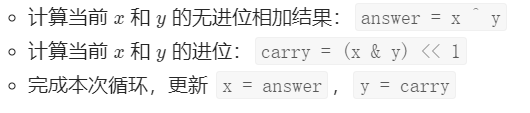

[TOC]

### 字符串题目

#### 最长回文子串【中等】

##### 1. 题目

给定一个**字符串 s**，找到 s 中最长的**回文子串**。你可以假设 s 的最大长度为 1000。

**示例 1：**

```java
输入: "babad"
输出: "bab"
```

注意: "aba" 也是一个有效答案。
**示例 2：**

```java
输入: "cbbd"
输出: "bb"
```


链接：https://leetcode-cn.com/problems/longest-palindromic-substring

##### 2. 题解

###### (1) 中心扩展算法

**面试**记住这个是好理解的。回文串一定是**对称**的，所以可以**每次循环选择一个中心**，进行左右扩展，判断**左右字符是否相等**即可。


每个位置向两边扩散都会**出现一个窗口大小（len）**。如果 len>maxLen(用来表示最长回文串的长度）。则更新 maxLen 的值。因为最后要返回的是具体子串，而不是长度，因此，还需要记录一下 maxLen 时的起始位置（maxStart），即此时还要 maxStart=len。

```go
func longestPalindrome(s string) string {
    if len(s) == 0{
        return ""
    }
    strlen := len(s)
    left, right := 0, 0 
    length := 1 //中心扩展窗口大小
    maxLen := 0 //保存最长回文子串长度
    maxStart := 0 //最长回文子串的起始位置

    //从左到右以每个元素为中心判断
    for i := 0; i < strlen; i++{
        left = i - 1
        right = i + 1

        //以当前位置及其左边或右边同时为中心进行扩散
        for left >= 0 && s[left] == s[i]{ //如果左边界未越界,向左边界扩展
            length ++
            left --
        }
        for right < strlen && s[right] == s[i]{ //如果右边界未越界,向右边界扩展
            length ++
            right ++
        }
        //以当前center为中心扩散
        for left >= 0 && right < strlen &&  s[right] == s[left]{
            length += 2
            left --
            right ++
        }
        //发现最大长度就更新
        if length > maxLen{
            maxLen = length
            maxStart = left
        }
        //换中心的时候重置长度
        length = 1
    }
    return s[maxStart + 1: maxStart + maxLen + 1]
}
```

优化：中心扩散的方法，其实做了很多**重复计算**。动态规划就是为了**减少重复计算**的问题。动态规划听起来很高大上。其实说白了就是空间换时间，将计算结果暂存起来，避免重复计算。

###### (2) 动态规划

首先定义：字符串 s 从**下标 i 到下标 j 的字串为 P(i, j)**，若 s 从下标 i 到下标 j 的字串为**回文串**，则 P(i, j) = **true**，否则 P(i, j) = **false**。如下图所示：


则 **P(i, j) = (P(i + 1, j - 1) && s[i] == s[j])**。如下图所示。

所以如果想知道 **P（i, j）**的情况，不需要调用判断回文串的函数了，只需要**知道 P（i+1，j−1）的情况**就可以了，这样时间复杂度就少了 O(n)。因此可以用动态规划的方法，空间换时间，把已经**求出的 P（i，j）存储**起来。


如果 **s[i+1, j-1] 是回文串，那么只要 s[i] == s[j]，就可以确定 s[i, j] 也是回文串了。**

注意：求长度为 1 和长度为 2 的 P(i, j) 时**不能**用上边的公式，因为代入公式后会遇到 P\[i][j] 中 i > j 的情况，比如求P\[1][2] 的话，需要知道 P\[1+1][2-1]=P\[2][1] ，而 P\[2][1] 代表着 S[2, 1] 是不是回文串，这显然是不对的，所以需要单独判断。

所以先初始化长度是 **1** 的回文串的 P [i , j]，这样利用上边提出的公式 P(i, j) = (P(i + 1, j - 1) && S[i] == S[j])，然后两边向外**各扩充一个字符**，长度为 3 的，为 5 的，所有**奇数长度**的就都求出来了。同理，**初始化长度是 2** 的回文串 P[i,i+1]，利用公式，长度为 4 的，6 的所有**偶数长度**的就都求出来了。

```go
func longestPalindrome(s string) string {
    n := len(s)
    res := ""
    //初始化二维数组
    dp := make([][]int, n)
    for i := 0; i < n; i++{
        dp[i] = make([]int, n)
    }
    //l表示子串的长度
    for l := 0; l < n; l++{
        //i表示子串开始位置的下标
        for i := 0; i + l < n; i++{
            //j表示子串结束位置的下标
            j := i + l
            //长度为1和2
            if l == 0{
                dp[i][j] = 1
            }else if l == 1{
                if s[i] == s[j]{ //长度为2且相同字符
                    dp[i][j] = 1
                }
            }else{
                if s[i] == s[j]{
                    dp[i][j] = dp[i+1][j-1]
                }
            }
            //边界条件，如果得到的dp[i][j]是回文子串，且当前的长度比之前保存的长度要大，则更新最大回文子串
            if dp[i][j] > 0 && l + 1 > len(res){
                res = s[i:i+l+1]
            }
        }
    }
    return res
}
```

时间复杂度：两层循环 O(n²）。

空间复杂度：用二维数组 P 保存每个子串的情况 O(n²)。

下面分析空间使用情况：（以”babad“为例）


当我们求长度为 5  的子串的情况时，其实只用到了 4 长度的情况，而长度为 1 和 2  和 3 的子串情况其实已经不需要了。

但是由于我们并不是用 P 数组的下标进行的循环，暂时没有想到优化的方法。

那么我们换种思路，公式不变：

其实从递推公式中我们可以看到，我们首先知道了 i +1 才会知道 i ，所以我们只需要倒着遍历就行了。

###### (3) Manacher 算法

这个以后补充。


#### 仅仅反转字母【917简单】

##### 1. 题目

给定一个字符串 S，返回 “反转后的” 字符串，其中不是字母的字符都保留在原地，而所有字母的位置发生反转。

```java
示例 1：
输入："ab-cd"
输出："dc-ba"
示例 2：
输入："a-bC-dEf-ghIj"
输出："j-Ih-gfE-dCba"
示例 3：
输入："Test1ng-Leet=code-Q!"
输出："Qedo1ct-eeLg=ntse-T!"
```

链接：https://leetcode-cn.com/problems/reverse-only-letters

##### 2. 题解

###### (1) 双指针法

利用双指针，类似快排的操作，从左到右**不断交换**即可。

```go
func reverseOnlyLetters(S string) string {
    if len(S) <= 1{
        return S
    }
    left, right := 0, len(S) - 1
    //将字符串转换为byte类型，因为字符串类型本身是不可变的
    s2 := []byte(S)
    for{
        //交换字符
        if isLetter(s2[left]) && isLetter(s2[right]){
            s2[left], s2[right] = s2[right], s2[left]
            left ++
            right --
        }
        //寻找下一个字符
        if !isLetter(s2[left]){
            left ++
        }
        if !isLetter(s2[right]){
            right --
        }
        //指针相遇就退出
        if left >= right{
            break
        }
    }
    return string(s2)
}
func isLetter(s byte) bool{
    if s >= 'a' && s <= 'z' || s >= 'A' && s <= 'Z'{
        return true
    }
    return false
}
```

###### (2) 字母栈

将 s 中的**所有字母单独存入栈**中，所以**出栈等价于对字母反序**操作。（或者可以用数组存储字母并反序数组。）

然后，遍历 s 的所有字符，如果是字母就**选择栈顶元素输出**。

```go
func reverseOnlyLetters(S string) string {
    //创建字母栈
    stack := []byte{}
    //string转换为byte
    s2 := []byte(S)
    //将字母压栈
    for i := 0; i < len(s2); i++{
        if isLetter(s2[i]){
            stack = append(stack, s2[i])
        }
    }
    //遍历原字符切片，遇到字母就从栈顶弹出字母替换掉
    for i := 0; i < len(s2); i++{
        if isLetter(s2[i]){
            s2[i] = stack[len(stack)-1]
            stack = stack[:len(stack)-1]
        }
    }
    return string(s2)
}
func isLetter(s byte) bool{
    if s >= 'a' && s <= 'z' || s >= 'A' && s <= 'Z'{
        return true
    }
    return false
}
```

#### 分割平衡字符串【1221简单】

##### 1. 题目

在一个「平衡字符串」中，'L' 和 'R' 字符的数量是相同的。给出一个平衡字符串 s，请你将它分割成尽可能多的平衡字符串。返回可以通过分割得到的平衡字符串的最大数量。

```java
示例 1：
输入：s = "RLRRLLRLRL"
输出：4
解释：s 可以分割为 "RL", "RRLL", "RL", "RL", 每个子字符串中都包含相同数量的 'L' 和 'R'。
示例 2：
输入：s = "RLLLLRRRLR"
输出：3
解释：s 可以分割为 "RL", "LLLRRR", "LR", 每个子字符串中都包含相同数量的 'L' 和 'R'。
示例 3：
输入：s = "LLLLRRRR"
输出：1
解释：s 只能保持原样 "LLLLRRRR".
```

链接：https://leetcode-cn.com/problems/split-a-string-in-balanced-strings

##### 2. 题解

直接从左到右遍历，记录出现**过的 L 和 R 的个数**，一旦遇到相同的就记录一次，然后清零。这里需要两个变量来记录左右的个数，但是这种可以直接只用一个变量来加减判断是否**等于 0** 就行。

```go
func balancedStringSplit(s string) int {
    count := 0
    res := 0

    for i := 0; i < len(s); i++{
        if s[i] == 'L'{
            count ++
        }else{
            count --
        }
        if count == 0{
            res ++
        }
    }
    return res
}
```


#### 反转字符串【344简单】

##### 1. 题目

给定一个字符串对应的 char 数组，反转这个字符串。

```java
输入：["h","e","l","l","o"]
输出：["o","l","l","e","h"]
```

连接：https://leetcode-cn.com/problems/reverse-string/

##### 2. 题解

###### (1) 双指针法

**双指针**直接反转。

```go
func reverseString(s []byte)  {
    if len(s) < 2{
        return
    }
    left, right := 0, len(s) - 1
    for{
        s[left], s[right] = s[right], s[left]
        left++
        right--
        if left >= right{
            break
        } 
    }
}
```

###### (2) 单指针法

可以只用一个指针遍历**一半的数组**即可。

```go
func reverseString(s []byte)  {
    for i := 0; i < len(s)/2; i++{
        s[i], s[len(s)-1-i] = s[len(s)-1-i], s[i]
    }
}
```


#### 字符串中的连续字符【1446简单】

##### 1. 题目

给你一个字符串 s ，字符串的「能量」定义为：只包含一种字符的最长非空子字符串的长度。

请你返回字符串的能量。

```java
示例 1：
输入：s = "leetcode"
输出：2
解释：子字符串 "ee" 长度为 2 ，只包含字符 'e' 。
```

链接：https://leetcode-cn.com/problems/consecutive-characters

##### 2. 题解

直接从左到右变遍历记录各个连续字符出现的次数，遇到不同的字符就更新计数器。

```go
func maxPower(s string) int {
    res := 0
    count := 1
    temp := s[0]
    for i := 1; i < len(s); i++{
        if s[i] == temp{
            count ++
        }else{
            res = max(res, count)
            count = 1
            temp = s[i]
        }
    }
    res = max(res, count)
    return res
}
func max(x, y int) int{
    if x > y{
        return x
    }
    return y
}
```


####  数组中的字符串匹配【1408简单】

##### 1. 题目

给你一个字符串数组 words ，数组中的每个字符串都可以看作是一个单词。请你按 任意 顺序返回 words 中是其他单词的**子字符串**的所有单词。

```java
输入：words = ["mass","as","hero","superhero"]
输出：["as","hero"]
解释："as" 是 "mass" 的子字符串，"hero" 是 "superhero" 的子字符串。["hero","as"] 也是有效的答案。
```

链接：https://leetcode-cn.com/problems/string-matching-in-an-array

##### 2. 题解

用 StringBuffer 把所有的单词都**拼接**起来，用‘,’隔开，当在前面找 **indexOf** 得到的索引和从后面找 **lastIndexOf** 得到的索引假如**是一致**时，意味着这个单词是**独一无二**的，在其他单词也不包含，假如不等就是在其他单词中**也包含**。

```go
func stringMatching(words []string) []string {
    var res []string
    l := len(words)
    //逐个将每个单词和除自己之外的每个单词进行匹配，如果是子串，则ok
    for i := 0; i < l; i++{
        for j := 0; j < l; j++{
            if i != j && strings.Contains(words[j], words[i]){
                res = append(res, words[i]) 
                break //只要i是任意一个的子串即可
            }
        }
    }
    return res
}
```

#### 字符串的最大公因子【1071简单】

##### 1. 题目

对于字符串 S 和 T，只有在 S = T + ... + T（T 与自身连接 1 次或多次）时，我们才认定 “T 能除尽 S”。

返回最长字符串 X，要求满足 X 能除尽 str1 且 X 能除尽 str2。

```java
输入：str1 = "ABCABC", str2 = "ABC" 输出："ABC"
输入：str1 = "ABABAB", str2 = "ABAB" 输出："AB"
输入：str1 = "LEET", str2 = "CODE" 输出：""
```

链接：https://leetcode-cn.com/problems/greatest-common-divisor-of-strings

##### 2. 题解

辗转相除法求最大公约数。太强了。。感觉这题难度不是简单。。

```go
func gcdOfStrings(str1 string, str2 string) string {
    // 假设str1是N个x，str2是M个x，那么str1+str2肯定是等于str2+str1的
    if !((str1+str2) == (str2+str1)){
        return ""
    }
    // 辗转相除法求最大公约数
    return str1[0: gcd(len(str1), len(str2))]
}
//辗转相除法
func gcd(a, b int) int{
    if b == 0{
        return a 
    }else{
        return gcd(b, a%b)
    }
}
```


#### 检测大写字母【520简单】

##### 1. 题目

给定一个单词，你需要判断单词的大写使用是否正确。我们定义，在以下情况时，单词的大写用法是正确的：

- 全部字母**都是大写**，比如"USA"。
- 单词中所有字母**都不是大写**，比如"leetcode"。
- 如果单词不只含有一个字母，**只有首字母大写**， 比如 "Google"。

否则，我们定义这个单词没有正确使用大写字母。

```java
输入: "USA" 输出: True
输入: "FlaG" 输出: False
```

链接：https://leetcode-cn.com/problems/detect-capital

##### 2. 题解

直接统计全部大写字母的数量即可。

```go
func detectCapitalUse(word string) bool {
    if len(word) <= 1{
        return true
    }
    //如果首字母是大写
    if isUpLetter(word[0]){
        //第二个字母也是大写
        if isUpLetter(word[1]){
            //剩余的字母必须全部大写
            for i := 2; i < len(word); i++{
                if !isUpLetter(word[i]){
                    return false
                }
            }
        }else{//剩余的字母必须全部小写
            for i := 2; i < len(word); i++{
                if isUpLetter(word[i]){
                    return false
                }
            }
        }
    }else{//剩余的字母必须全部小写
        for i := 1; i < len(word); i++{
            if isUpLetter(word[i]){
                return false
            }
        }       
    }
    return true
}
func isUpLetter(a byte) bool{
    if a >= 'A' && a <= 'Z'{
        return true
    }
    return false
}
```

#### 重新格式化字符串【1417简单】

##### 1. 题目

给你一个混合了数字和字母的字符串 s，其中的字母均为小写英文字母。请你将该字符串重新格式化，使得任意两个相邻字符的类型都不同。也就是说，字母后面应该跟着数字，而数字后面应该跟着字母。请你返回 重新格式化后 的字符串；如果无法按要求重新格式化，则返回一个 空字符串 。

```java
输入：s = "a0b1c2" 输出："0a1b2c"
解释："0a1b2c" 中任意两个相邻字符的类型都不同。 "a0b1c2", "0a1b2c", "0c2a1b" 也是满足题目要求的答案。
输入：s = "leetcode" 输出：""
解释："leetcode" 中只有字母，所以无法满足重新格式化的条件。
输入：s = "1229857369" 输出：""
解释："1229857369" 中只有数字，所以无法满足重新格式化的条件。
输入：s = "covid2019" 输出："c2o0v1i9d"
输入：s = "ab123" 输出："1a2b3"
```

链接：https://leetcode-cn.com/problems/reformat-the-string

##### 2. 题解

定义两个变量，对数字字符和字母字符计数，如果数量相差 2 及以上，直接溜溜球。为了节省空间计数的两个变量拿来复用，哪个数大，哪个从零开始，**每次加 2**，自己走自己的，互不干涉。反正数字字符和字母字符最终都要放进去。通过双指针将字符放入到字符数组中，返回字符串。

```go
func reformat(s string) string {
    //对数字和字母分别进行存储
    str, num := []byte{}, []byte{}
    //将字母数字分别存储起来
    for _, c := range []byte(s){
        if c >= '0' && c <= '9'{
            num = append(num, c)
        }
        if c >= 'a' && c <= 'z'{
            str = append(str, c)
        }
    }
    //如果字符串比数字长
    if len(str) - len(num) == 1{
        return crossJoin(str, num)
    }
    if len(str) - len(num) <= 1 && len(num) - len(str) <= 1{
        return crossJoin(num, str)
    }

    //如果两者之间差距超过1则无法格式化
    return ""
}

func crossJoin(a, b []byte) string{
    res := []byte{}
    //向结果中交叉插入a和b
    for i, c := range b{
        res = append(res, a[i], c)
    }
    //如果a的长度比b长一位
    if len(a) > len(b){
        res = append(res, a[len(a)-1])
    }
    return string(res)
}
```


#### 学生出勤记录【551简单】

##### 1. 题目

给定一个字符串来代表一个学生的出勤记录，这个记录仅包含以下三个字符：

'A' : Absent，缺勤
'L' : Late，迟到
'P' : Present，到场
如果一个学生的出勤记录中不超过一个'A'(缺勤)并且不超过两个连续的'L'(迟到),那么这个学生会被奖赏。

你需要根据这个学生的出勤记录判断他是否会被奖赏。

```java
输入: "PPALLP" 输出: True
输入: "PPALLL" 输出: False
输入: "AA" 输出: False
```

链接：https://leetcode-cn.com/problems/student-attendance-record-i

##### 2. 题解

统计字符串中 A 的数目并检查 LLL 是否是给定字符串的一个子串。

```go
func checkRecord(s string) bool {
    countA := 0
    for i := 0; i < len(s); i++{
        if s[i] == 'A'{
            countA ++
        }
        if i <= len(s)-3 && s[i] == 'L' && s[i+1] == 'L' && s[i+2] == 'L'{
            return false
        }  
    }
    return countA < 2
}
```


### 其他

#### 字符串数组的最长公共前缀【简单】


##### 1. 题目

编写一个函数来查找字符串数组中的最长公共前缀。如果不存在公共前缀，返回空字符串 ""。

示例 1:

```java
输入: ["flower","flow","flight"]
输出: "fl"
```

示例 2:

```java
输入: ["dog","racecar","car"]
输出: ""
解释: 输入不存在公共前缀。
```

链接：https://leetcode-cn.com/problems/longest-common-prefix/

##### 2. 题解

###### （1）横向扫描

依次遍历字符串数组中的每个字符串，对于每个遍历到的字符串，更新最长公共前缀，当遍历完所有的字符串以后，即可得到字符串数组中的最长公共前缀。


```go
func longestCommonPrefix(strs []string) string {
    if len(strs) == 0{
        return ""
    }
    prefix := strs[0]
    count := len(strs)
    for i := 1; i < count; i++{
        //求公共前缀
        prefix = lcp(prefix, strs[i])
        //如果公共前缀已经为0，则直接退出
        if len(prefix) == 0{
            break
        }
    }
    return prefix
}
func lcp(str1, str2 string) string{
    length := min(len(str1), len(str2))
    index := 0
    for index < length && str1[index] == str2[index]{
        index++
    }
    return str1[:index]
}
func min(x, y int) int {
    if x < y {
        return x
    }
    return y
}
```

- 时间复杂度：O(mn)，其中 m 是字符串数组中的字符串的平均长度，n 是字符串的数量。最坏情况下，字符串数组中的每个字符串的每个字符都会被比较一次。

- 空间复杂度：O(1)。使用的额外空间复杂度为常数。

###### （2）纵向扫描

纵向扫描时，从前往后遍历所有字符串的每一列，比较相同列上的字符是否相同，如果相同则继续对下一列进行比较，如果不相同则当前列不再属于公共前缀，当前列之前的部分为最长公共前缀。


```go
func longestCommonPrefix(strs []string) string {
    if len(strs) == 0{
        return ""
    }
    //纵向比较所有字符串的每一列
    for i := 0; i < len(strs[0]); i++{
        for j := 0; j < len(strs); j++{
            //如果遍历到某个字符串的末尾或者第n个的j列不相等
            if i == len(strs[j]) || strs[j][i] != strs[0][i]{
                return strs[0][:i]
            }
        }
    }
    return strs[0]
}
```

复杂度与横向比较相同。


#### 验证回文字符串【简单】

##### 1. 题目

给定一个字符串，验证它是否是回文串，只考虑字母和数字字符，**可以忽略字母的大小写**。 说明：本题中，我们将空字符串定义为有效的回文串。

示例 1:

```
输入: "A man, a plan, a canal: Panama"
输出: true
```

示例 2:

```
输入: "race a car"
输出: false
```

链接：https://leetcode-cn.com/problems/valid-palindrome/

##### 2. 题目

###### (1) 逆序比较

判断字符串的**逆序**与原字符串是否相同即可。逆序之后只需简单判断是否是回文串即可。

###### (2) 双指针法原字符串直接分析

**直接在原字符串 s 上使用双指针**。在移动任意一个指针时，需要不断地向另一指针的方向移动，直到遇到一个字母或数字字符，或者两指针重合为止。也就是说，我们每次将指针移到下一个字母字符或数字字符，再判断这两个指针指向的字符是否相同。

```go
func isPalindrome(s string) bool {
    s = strings.ToLower(s)
    left, right := 0, len(s) - 1
    for left < right{
        for left < right && !isLetOrNum(s[left]){
            left++
        }
        for left < right && !isLetOrNum(s[right]){
            right--
        }
        if left < right{
            if s[left] != s[right]{
                return false
            }
            left++
            right--
        }       
    }
    return true
}
func isLetOrNum(ch byte) bool{
    return (ch >= 'a' && ch <= 'z') || (ch >= 'A' && ch <= 'Z') || (ch >= '0' && ch <= '9')
}
```


#### 构造最长回文串

##### 1.题目

LeetCode:  给定一个包含大写字母和小写字母的字符串，找到**通过这些字母构造**成的最长的回文串。在构造过程中，请注意区分大小写。比如`"Aa"`不能当做一个回文字符串。

回文串：是一个正读和反读都一样的字符串，比如“level”或者“noon”等等就是回文串。

```java
输入:
"abccccdd"
输出:
7
解释:可以构造的最长的回文串是"dccaccd", 它的长度是 7。
```

**链接：**https://leetcode-cn.com/problems/longest-palindrome/

##### 2.题解

现在考虑一下可以构成回文串的两种情况：

- 字符出现**次数**为**双数**的组合
- **字符出现次数为偶数的组合+单个字符中出现次数最多且为奇数次的字符** 

统计字符出现的**次数**即可，**双数才能构成回文**。因为允许中间一个**数单独出现**，比如“abcba”，所以如果最后有字母落单，总**长度可以加 1**。首先将字符串转变为**字符数组**。然后遍历该数组，判断对应字符是否在 hashset 中，如果不在就加进去，如果在就让 count++，然后移除该字符！这样就能找到**出现次数为双数的字符个数**。

```go
func longestPalindrome(s string) int {
    hash := make(map[byte]int)
    sum := 0
    //将s中的字符存储到hash中
    for i := 0; i < len(s); i++{
        hash[s[i]]++
    }
    //对比hash,如果存在
    for _, v := range hash{
        sum += (v/2) * 2
    }

    if sum == len(s) {
        return sum
    } else {
        return sum + 1
    }
}
```


#### 字符串相加

##### 1. 题目

给定两个字符串形式的非负整数 num1 和num2 ，计算它们的和。

注意：

num1 和num2 的长度都小于 5100.
num1 和num2 都只包含数字 0-9.
num1 和num2 都不包含任何前导零。
你不能使用任何內建 BigInteger 库， 也不能直接将输入的字符串转换为整数形式。
链接：https://leetcode-cn.com/problems/add-strings

##### 2. 题解

算法流程： 设定 i，j **两指针**分别指向 num1，num2 尾部，模拟人工加法；

计算进位： 计算 carry = tmp / 10，代表当前位相加是否产生进位；
添加当前位： 计算 tmp = n1 + n2 + carry，并将当前位 tmp % 10 添加至 res 头部；
索引溢出处理： 当指针 i或j 走过数字首部后，给 n1，n2 赋值为 00，相当于给 num1，num2 中长度较短的数字前面填 00，以便后续计算。
当遍历完 num1，num2 后跳出循环，并根据 carry 值决定是否在头部添加进位 11，最终返回 res 即可。

```go
func addStrings(num1 string, num2 string) string {
    add := 0
    ans := ""
    for i, j := len(num1) - 1, len(num2) - 1; i >= 0 || j >= 0 || add != 0; i, j = i - 1, j - 1 {
        var x, y int
        if i >= 0 {
            x = int(num1[i] - '0')
        }
        if j >= 0 {
            y = int(num2[j] - '0')
        }
        result := x + y + add
        ans = strconv.Itoa(result%10) + ans
        add = result / 10
    }
    return ans
}
```


#### 二进制求和

##### 1. 题目

给你两个二进制字符串，返回它们的和（用二进制表示）。

输入为 非空 字符串且只包含数字 1 和 0。

示例 1:

```java
输入: a = "11", b = "1"
输出: "100"
```

示例 2:

```java
输入: a = "1010", b = "1011"
输出: "10101"
```

链接：https://leetcode-cn.com/problems/add-binary

##### 2. 题解

###### （1）模拟

```go
func addBinary(a string, b string) string {
    ans := ""
    carry := 0
    lenA, lenB := len(a), len(b)
    n := max(lenA, lenB)

    for i := 0; i < n; i++ {
        if i < lenA {
            carry += int(a[lenA-i-1] - '0')
        }
        if i < lenB {
            carry += int(b[lenB-i-1] - '0')
        }
        ans = strconv.Itoa(carry%2) + ans
        carry /= 2
    }
    if carry > 0 {
        ans = "1" + ans
    }
    return ans
}

func max(x, y int) int {
    if x > y {
        return x
    }
    return y
}
```

###### (2)位运算

以下题目也是：

- 只出现一次的数字 II
- 只出现一次的数字 III
- 数组中两个数的最大异或值
- 重复的DNA序列
- 最大单词长度乘积

我们可以设计这样的算法来计算：

- 把 a 和 b转换成整型数字 x 和 y，在接下来的过程中，x保存结果，y保存进位。
- 当进位不为 0时
- 
- 返回 x的二进制形式

#### 各位相加

##### 1. 题目

给定一个非负整数 num，反复将各个位上的数字相加，直到结果为一位数。

示例:

```java
输入: 38
输出: 2 
解释: 各位相加的过程为：3 + 8 = 11, 1 + 1 = 2。 由于 2 是一位数，所以返回 2。
```

进阶:
你可以不使用循环或者递归，且在 **O(1) 时间复杂度**内解决这个问题吗？
链接：https://leetcode-cn.com/problems/add-digits

##### 2. 题解

###### (1) 普通方法

循环取模计算。如果 num = 123，num / 10 = 12，num % 10 = 3；更新 num = 15。

再次计算得 num = 6。

```go
func addDigits(num int) int {
    for num >= 10{
        num = num /10 + num % 10
    }
    return num
}
```

- 时间复杂度：O(n)，n为数字的位数
- 空间复杂度：O(1)

###### (2) 高级解法

对 9 取模，方法一的进阶。参考：https://leetcode-cn.com/problems/add-digits/solution/java-o1jie-fa-de-ge-ren-li-jie-by-liveforexperienc/

- 除个位外，每一位上的值都是通过 `(9+1)` 进位的过程得到的，想一下 **拨算盘进位**
- 把整数 n 看成 n 样物品，原本是以 10 个 1 份打包的，现在从这些 10 个 1 份打包好的里面，拿出 1 个，让它们以 9 个为 1 份打包。
- 这样就出现了两部分的东西：
    - 原本 10 个现在 9 个 1 份的，打包好的物品，这些，我们不用管
    - 零散的物品，它们还可以分成：
        * 从原来打包的里面拿出来的物品，它们的总和 =》 **原来打包好的份数** =》 **10进制进位的次数** =》 **10 进制下，除个位外其他位上的值的总和**
        * 以 10 个 1 份打包时，打不进去的零散物品 =》 **10 进制个位上的值**
- 如上零散物品的总数，就是第一次处理 num 后得到的累加值
- 如果这个累加值 >9，那么如题就还需要将各个位上的值再相加，直到结果为个位数为止。也就意味着还需要来一遍如上的过程。
- 那么按照如上的思路，似乎可以通过 **n % 9** 得到最后的值
- 但是有1个关键的问题，如果 num 是 9 的倍数，那么就不适用上述逻辑。原本我是想得到 n 被打包成 10 个 1 份的份数+打不进 10 个 1 份的散落个数的和。通过与 9 取模，去获得那个不能整除的 1，作为计算份数的方式，但是如果可以被 9 整除，我就无法得到那个 1，也得不到个位上的数。
- 所以需要做一下特殊处理，**(num - 1) % 9 + 1**
- 可以这么做的原因：原本可以被完美分成 9 个为一份的 n 样物品，我故意去掉一个，那么就又可以回到上述逻辑中去得到我要的n 被打包成 10 个一份的份数+打不进 10 个一份的散落个数的和。而这个减去的 1 就相当于从，在 10 个 1 份打包的时候散落的个数中借走的，本来就不影响原来 10 个 1 份打包的份数，先拿走再放回来，都只影响散落的个数，所以没有关系。


```go
func addDigits(num int) int {
    return (num - 1) % 9 + 1
}
```


