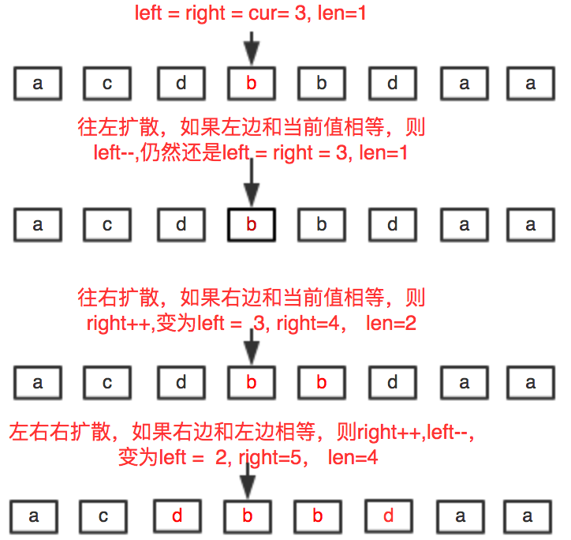
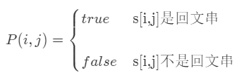
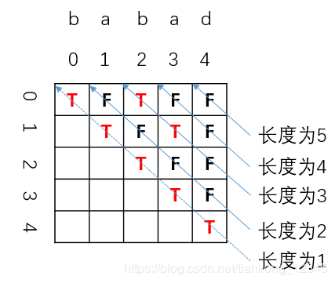

[TOC]

### 字符串题目

#### 最长回文子串【中等】

##### 1. 题目

给定一个**字符串 s**，找到 s 中最长的**回文子串**。你可以假设 s 的最大长度为 1000。

**示例 1：**

```java
输入: "babad"
输出: "bab"
```

注意: "aba" 也是一个有效答案。
**示例 2：**

```java
输入: "cbbd"
输出: "bb"
```


链接：https://leetcode-cn.com/problems/longest-palindromic-substring

##### 2. 题解

###### (1) 中心扩展算法

**面试**记住这个是好理解的。回文串一定是**对称**的，所以可以**每次循环选择一个中心**，进行左右扩展，判断**左右字符是否相等**即可。



每个位置向两边扩散都会**出现一个窗口大小（len）**。如果 len>maxLen(用来表示最长回文串的长度）。则更新 maxLen 的值。因为最后要返回的是具体子串，而不是长度，因此，还需要记录一下 maxLen 时的起始位置（maxStart），即此时还要 maxStart=len。

```java
public String longestPalindrome1(String str) {

    if (str == null || str.length() == 0) return "";
    int strLen = str.length();
    int left = 0;
    int right = 0;
    int len = 1;
    int maxStart = 0;
    int maxLen = 0;

    // 从左到右以每个元素为中心判断
    for (int center = 0; center < strLen; center++) {
        left = center - 1;
        right = center + 1;
        // 首先是以当前位置及其左边或者右边同时为中心进行扩散
        while (left >= 0 && str.charAt(left) == str.charAt(center)) {
            len++;
            left--;
        }
        while (right < strLen && str.charAt(right) == str.charAt(center)) {
            len++;
            right++;
        }
        // 以当前center为中心扩散
        while (left >= 0 && right < strLen && str.charAt(right) == str.charAt(left)) {
            // 长度+2
            len = len + 2;
            left--;
            right++;
        }
        // 如果发现最大长度就更新
        if (len > maxLen) {
            maxLen = len;
            maxStart = left;
        }
        // 重置最大长度
        len = 1;
    }
    return str.substring(maxStart + 1, maxStart + maxLen + 1);
}
```

优化：中心扩散的方法，其实做了很多**重复计算**。动态规划就是为了**减少重复计算**的问题。动态规划听起来很高大上。其实说白了就是空间换时间，将计算结果暂存起来，避免重复计算。

用一个 boolean **dp\[l][r] 表示字符串从 i 到 j 这段是否为回文**。试想如果 **dp\[l][r]=true**，要判断 dp\[l-1][r+1] 是否为回文。只需要判断字符串在(l-1)和（r+1)两个位置是否为相同的字符，就减少了很多重复计算。
进入正题，动态规划关键是找到初始状态和状态转移方程。

- **初始状态**，l = r 时，此时 **dp\[l][r]=true**。
- **状态转移方程**，dp\[l][r]=true 并且 (l-1) 和（r+1) 两个位置为相同的字符，此时 **dp\[l-1][r+1]=true**。

```java
public String longestPalindrome3(String str) {
    if (str == null || str.length() < 2) return str;
    // 字符串长度
    int strLen = str.length();
    int maxStart = 0;  // 最长回文串的起点
    int maxEnd = 0;    // 最长回文串的终点
    int maxLen = 1;    // 最长回文串的长度
    // dp数组
    boolean[][] dp = new boolean[strLen][strLen];

    for (int right = 1; right < strLen; right++) {
        for (int left = 0; left < right; left++) {
            // 状态转移方程
            if (str.charAt(left) == str.charAt(right) && (right - left <= 2 || dp[left + 1][right - 1])) {
                dp[left][right] = true;
                // 更新结果
                if (right - left + 1 > maxLen) {
                    maxLen = right - left + 1;
                    maxStart = left;
                    maxEnd = right;
                }
            }
        }
    }
    // 根据索引找到最长回文字符串
    return str.substring(maxStart, maxEnd + 1);
}
```

###### (2) 动态规划

首先定义：字符串 s 从**下标 i 到下标 j 的字串为 P(i, j)**，若 s 从下标 i 到下标 j 的字串为**回文串**，则 P(i, j) = **true**，否则 P(i, j) = **false**。如下图所示：



则 **P(i, j) = (P(i + 1, j - 1) && s[i] == s[j])**。如下图所示。

所以如果想知道 **P（i, j）**的情况，不需要调用判断回文串的函数了，只需要**知道 P（i+1，j−1）的情况**就可以了，这样时间复杂度就少了 O(n)。因此可以用动态规划的方法，空间换时间，把已经**求出的 P（i，j）存储**起来。


如果 **s[i+1, j-1] 是回文串，那么只要 s[i] == s[j]，就可以确定 s[i, j] 也是回文串了。**

注意：求长度为 1 和长度为 2 的 P(i, j) 时**不能**用上边的公式，因为代入公式后会遇到 P\[i][j] 中 i > j 的情况，比如求P\[1][2] 的话，需要知道 P\[1+1][2-1]=P\[2][1] ，而 P\[2][1] 代表着 S[2, 1] 是不是回文串，这显然是不对的，所以需要单独判断。

所以先初始化长度是 **1** 的回文串的 P [i , j]，这样利用上边提出的公式 P(i, j) = (P(i + 1, j - 1) && S[i] == S[j])，然后两边向外**各扩充一个字符**，长度为 3 的，为 5 的，所有**奇数长度**的就都求出来了。同理，**初始化长度是 2** 的回文串 P[i,i+1]，利用公式，长度为 4 的，6 的所有**偶数长度**的就都求出来了。

```java
public static String longestPalindrome(String s) {
    int sLen = s.length();
    int maxLen = 0;
    String ans = "";
    boolean[][] P = new boolean[sLen][sLen];
    // 遍历所有长度
    for (int len = 1; len <= sLen; len++) {
        for (int start = 0; start < sLen; start++) {
            int end = start + len - 1;
            // 下标越界，结束循环
            if (end >= sLen) {
                break;
            }
            P[start][end] = (len == 1 || len == 2 || P[start + 1][end - 1]) && s.charAt(start) == s.charAt(end);
            if (P[start][end] && len > maxLen) {
                maxLen = len;
                ans = s.substring(start, end + 1);
            }
        }
    }
    return ans;
}
```

时间复杂度：两层循环 O(n²）。

空间复杂度：用二维数组 P 保存每个子串的情况 O(n²)。

下面分析空间使用情况：（以”babad“为例）



当我们求长度为 5  的子串的情况时，其实只用到了 4 长度的情况，而长度为 1 和 2  和 3 的子串情况其实已经不需要了。

但是由于我们并不是用 P 数组的下标进行的循环，暂时没有想到优化的方法。

那么我们换种思路，公式不变：

其实从递推公式中我们可以看到，我们首先知道了 i +1 才会知道 i ，所以我们只需要倒着遍历就行了。

###### (3) Manacher 算法

这个以后补充。


#### 仅仅反转字母【917简单】

##### 1. 题目

给定一个字符串 S，返回 “反转后的” 字符串，其中不是字母的字符都保留在原地，而所有字母的位置发生反转。

```java
示例 1：
输入："ab-cd"
输出："dc-ba"
示例 2：
输入："a-bC-dEf-ghIj"
输出："j-Ih-gfE-dCba"
示例 3：
输入："Test1ng-Leet=code-Q!"
输出："Qedo1ct-eeLg=ntse-T!"
```

链接：https://leetcode-cn.com/problems/reverse-only-letters

##### 2. 题解

###### (1) 双指针法

利用双指针，类似快排的操作，从左到右**不断交换**即可。

```java
public static String reverseOnlyLetters(String str) {

    if(str == null || str.length() <= 1) return str;
    // 左右指针
    int i = 0;
    int j = str.length() - 1;
    char[] nums = str.toCharArray();
    while(true) {
        // 找到左边第一个字母
        while(true) {
            if(i < j && !isLetter(nums[i])) {
                i++;
            } else {
                break;
            }
        }
        // 找到右边第一个字母
        while(true) {
            if(i < j && !isLetter(nums[j])) {
                j--;
            } else {
                break;
            }
        }
		// 复合条件就交换
        if(i <= j) {
            swap(nums, i, j);
            i++;
            j--;
        }
        // 指针相遇就退出
        if(i >= j) {
            break;
        }
    }
    return new String(nums);
}

private static boolean isLetter(char c) {
    return (c >= 'a' && c <= 'z') || (c >= 'A' && c <= 'Z');
}

private static void swap(char[] nums, int i, int j) {
    char temp = nums[i];
    nums[i] = nums[j];
    nums[j] = temp;
}
```

###### (2) 字母栈

将 s 中的**所有字母单独存入栈**中，所以**出栈等价于对字母反序**操作。（或者可以用数组存储字母并反序数组。）

然后，遍历 s 的所有字符，如果是字母就**选择栈顶元素输出**。

```java
public String reverseOnlyLetters2(String str) {
    Stack<Character> letters = new Stack();
    // 将全部字母压栈
    for (char c: str.toCharArray()) {
        if (Character.isLetter(c)) {
            letters.push(c);
        }
    }
    // 构造结果
    StringBuilder ans = new StringBuilder();
    for (char c: str.toCharArray()) {
        // 如果当前是字母就从栈中弹出一个字母进行替换
        if (Character.isLetter(c)) {
            ans.append(letters.pop());
        } else {
            ans.append(c);
        }
    }
    return ans.toString();
}
```

#### 分割平衡字符串【1221简单】

##### 1. 题目

在一个「平衡字符串」中，'L' 和 'R' 字符的数量是相同的。给出一个平衡字符串 s，请你将它分割成尽可能多的平衡字符串。返回可以通过分割得到的平衡字符串的最大数量。

```java
示例 1：
输入：s = "RLRRLLRLRL"
输出：4
解释：s 可以分割为 "RL", "RRLL", "RL", "RL", 每个子字符串中都包含相同数量的 'L' 和 'R'。
示例 2：
输入：s = "RLLLLRRRLR"
输出：3
解释：s 可以分割为 "RL", "LLLRRR", "LR", 每个子字符串中都包含相同数量的 'L' 和 'R'。
示例 3：
输入：s = "LLLLRRRR"
输出：1
解释：s 只能保持原样 "LLLLRRRR".
```

链接：https://leetcode-cn.com/problems/split-a-string-in-balanced-strings

##### 2. 题解

直接从左到右遍历，记录出现**过的 L 和 R 的个数**，一旦遇到相同的就记录一次，然后清零。这里需要两个变量来记录左右的个数，但是这种可以直接只用一个变量来加减判断是否**等于 0** 就行。

```java
public int balancedStringSplit(String str) {
    int counter = 0;
    int res = 0;
    for (int i = 0; i < str.length(); i++) {
        if (str.charAt(i) == 'L') {
            counter++;
        } else {
            counter--;
        }
        if (counter == 0) {
            res++;
        }
    }
    return res;
}
```


#### 反转字符串【344简单】

##### 1. 题目

给定一个字符串对应的 char 数组，反转这个字符串。

```java
输入：["h","e","l","l","o"]
输出：["o","l","l","e","h"]
```

连接：https://leetcode-cn.com/problems/reverse-string/

##### 2. 题解

###### (1) 双指针法

**双指针**直接反转。

```java
public void reverseString(char[] nums) {
    if(nums == null || nums.length < 2) return;
    int i = 0;
    int j = nums.length - 1;
    while(true) {

        swap(nums, i, j);
        i++;
        j--;
        if(i >= j) {
            break;
        }
    }
}

private void swap(char[] nums, int i, int j) {
    char temp = nums[i];
    nums[i] = nums[j];
    nums[j] = temp;
}
```

###### (2) 单指针法

可以只用一个指针遍历**一半的数组**即可。

```java
public void reverseString2(char[] str) {
    int len = str.length;
    char temp;
    for (int i = 0; i < len / 2; i++) {
        temp = str[i];
        str[i] = str[len - 1 - i];
        str[len - 1 - i] = temp;
    }
}
```


#### 字符串中的连续字符【1446简单】

##### 1. 题目

给你一个字符串 s ，字符串的「能量」定义为：只包含一种字符的最长非空子字符串的长度。

请你返回字符串的能量。

```java
示例 1：
输入：s = "leetcode"
输出：2
解释：子字符串 "ee" 长度为 2 ，只包含字符 'e' 。
```

链接：https://leetcode-cn.com/problems/consecutive-characters

##### 2. 题解

直接从左到右变遍历记录各个连续字符出现的次数，遇到不同的字符就更新计数器。

```java
public int maxPower(String str) {

    if(str == null) return 0;
    int res = 1;
    // 字符计数器
    int counter = 1;
    // 上一个字符
    char temp = str.charAt(0);
    for(int i = 1; i < str.length(); i++) {
        // 如果当前的字符与上一个相同
        if(str.charAt(i) == temp) {
            counter++;
        } else {
            // 不同就更新结果并重置计数器
            res = Math.max(res, counter);
            counter = 1;
            temp = str.charAt(i);
        }
    }
    // 最后一定要更新结果，防止出现aaaaa这种记录
    res = Math.max(res, counter);
    return res;
}
```


####  数组中的字符串匹配【1408简单】

##### 1. 题目

给你一个字符串数组 words ，数组中的每个字符串都可以看作是一个单词。请你按 任意 顺序返回 words 中是其他单词的**子字符串**的所有单词。

```java
输入：words = ["mass","as","hero","superhero"]
输出：["as","hero"]
解释："as" 是 "mass" 的子字符串，"hero" 是 "superhero" 的子字符串。["hero","as"] 也是有效的答案。
```

链接：https://leetcode-cn.com/problems/string-matching-in-an-array

##### 2. 题解

用 StringBuffer 把所有的单词都**拼接**起来，用‘,’隔开，当在前面找 **indexOf** 得到的索引和从后面找 **lastIndexOf** 得到的索引假如**是一致**时，意味着这个单词是**独一无二**的，在其他单词也不包含，假如不等就是在其他单词中**也包含**。

```java
public List<String> stringMatching(String[] words) {
    List<String> resList = new ArrayList<String>();
    StringBuffer buffer = new StringBuffer();
    // 将字符串全部拼接
    for (int i = 0; i < words.length; i++) {
        buffer.append(words[i]);
        buffer.append(",");
    }
    // 寻找某个单词的前后出现索引，不相同则说明包含子串
    for (int i = 0; i < words.length; i++) {
        if (buffer.indexOf(words[i]) != buffer.lastIndexOf(words[i])) {
            resList.add(words[i]);
        }
    }
    return resList;
}
```

#### 字符串的最大公因子【1071简单】

##### 1. 题目

对于字符串 S 和 T，只有在 S = T + ... + T（T 与自身连接 1 次或多次）时，我们才认定 “T 能除尽 S”。

返回最长字符串 X，要求满足 X 能除尽 str1 且 X 能除尽 str2。

```java
输入：str1 = "ABCABC", str2 = "ABC" 输出："ABC"
输入：str1 = "ABABAB", str2 = "ABAB" 输出："AB"
输入：str1 = "LEET", str2 = "CODE" 输出：""
```

链接：https://leetcode-cn.com/problems/greatest-common-divisor-of-strings

##### 2. 题解

辗转相除法求最大公约数。太强了。。感觉这题难度不是简单。。

```java
public String gcdOfStrings(String str1, String str2) {
    // 假设str1是N个x，str2是M个x，那么str1+str2肯定是等于str2+str1的。
    if (!(str1 + str2).equals(str2 + str1)) {
        return "";
    }
    // 辗转相除法求最大公约数
    return str1.substring(0, gcd(str1.length(), str2.length()));
}

private int gcd(int a, int b) {
    if (b == 0) {
        return a;
    } else {
        return gcd(b, a % b);
    }
}
```


#### 检测大写字母【520简单】

##### 1. 题目

给定一个单词，你需要判断单词的大写使用是否正确。我们定义，在以下情况时，单词的大写用法是正确的：

- 全部字母**都是大写**，比如"USA"。
- 单词中所有字母**都不是大写**，比如"leetcode"。
- 如果单词不只含有一个字母，**只有首字母大写**， 比如 "Google"。

否则，我们定义这个单词没有正确使用大写字母。

```java
输入: "USA" 输出: True
输入: "FlaG" 输出: False
```

链接：https://leetcode-cn.com/problems/detect-capital

##### 2. 题解

直接统计全部大写字母的数量即可。

```java
public boolean detectCapitalUse(String word) {
    if(word == null) return false;
    int counter = 0;
    // 记录大写字母的个数即可
    for(int i = 0; i < word.length(); i++) {
        if(isUpperLetter(word.charAt(i))) counter++;
    }
    // 全为小写
    if(counter == 0) return true;
    // 全为大写
    if(counter == word.length()) return true;
    // 一个大写且为首字母大写
    if(counter == 1 && isUpperLetter(word.charAt(0))) return true;
    return false;
}

private boolean isUpperLetter(char c) {
    return c >= 'A' && c <= 'Z';
}
```

#### 重新格式化字符串【1417简单】

##### 1. 题目

给你一个混合了数字和字母的字符串 s，其中的字母均为小写英文字母。请你将该字符串重新格式化，使得任意两个相邻字符的类型都不同。也就是说，字母后面应该跟着数字，而数字后面应该跟着字母。请你返回 重新格式化后 的字符串；如果无法按要求重新格式化，则返回一个 空字符串 。

```java
输入：s = "a0b1c2" 输出："0a1b2c"
解释："0a1b2c" 中任意两个相邻字符的类型都不同。 "a0b1c2", "0a1b2c", "0c2a1b" 也是满足题目要求的答案。
输入：s = "leetcode" 输出：""
解释："leetcode" 中只有字母，所以无法满足重新格式化的条件。
输入：s = "1229857369" 输出：""
解释："1229857369" 中只有数字，所以无法满足重新格式化的条件。
输入：s = "covid2019" 输出："c2o0v1i9d"
输入：s = "ab123" 输出："1a2b3"
```

链接：https://leetcode-cn.com/problems/reformat-the-string

##### 2. 题解

定义两个变量，对数字字符和字母字符计数，如果数量相差 2 及以上，直接溜溜球。为了节省空间计数的两个变量拿来复用，哪个数大，哪个从零开始，**每次加 2**，自己走自己的，互不干涉。反正数字字符和字母字符最终都要放进去。通过双指针将字符放入到字符数组中，返回字符串。

```java
public String reformat(String str) {
    int charCounter = 0, digitCounter = 0;
    char[] chars = str.toCharArray();
    // 统计数字与字母的个数
    for (char c : chars) {
        int a = c >= '0' && c <= '9' ? charCounter++ : digitCounter++;
    }
    // 数量相差超过1直接返回
    if (Math.abs(charCounter - digitCounter) > 1) {
        return "";
    }
    if (charCounter > digitCounter) {
        charCounter = 0;
        digitCounter = 1;
    } else {
        charCounter = 1;
        digitCounter = 0;
    }
    for (char c : str.toCharArray()) {
        if (c >= '0' && c <= '9') {
            chars[charCounter] = c;
            charCounter += 2;
        } else {
            chars[digitCounter] = c;
            digitCounter += 2;
        }
    }
    return new String(chars);
}
```


#### 学生出勤记录【551简单】

##### 1. 题目

给定一个字符串来代表一个学生的出勤记录，这个记录仅包含以下三个字符：

'A' : Absent，缺勤
'L' : Late，迟到
'P' : Present，到场
如果一个学生的出勤记录中不超过一个'A'(缺勤)并且不超过两个连续的'L'(迟到),那么这个学生会被奖赏。

你需要根据这个学生的出勤记录判断他是否会被奖赏。

```java
输入: "PPALLP" 输出: True
输入: "PPALLL" 输出: False
输入: "AA" 输出: False
```

链接：https://leetcode-cn.com/problems/student-attendance-record-i

##### 2. 题解

统计字符串中 A 的数目并检查 LLL 是否是给定字符串的一个子串。

```java
public boolean checkRecord(String str) {
    int counter = 0;
    // 统计A的个数
    for (int i = 0; i < str.length(); i++)
        if (str.charAt(i) == 'A') counter++;
    return counter < 2 && !str.contains("LLL");
}
```

也可以遍历这个字符串一次不使用 contains 来解决这个问题。在单遍循环中，统计 A 的数目并检查子字符串 LLL 是否是一个子串。

```java
public boolean checkRecord(String str) {
    int counter = 0;
    for (int i = 0; i < str.length() && counter < 2; i++) {
        if (str.charAt(i) == 'A')
            counter++;
        // 直接遍历的时候判断是否有LLL
        if (i <= str.length() - 3 && str.charAt(i) == 'L' && str.charAt(i + 1) == 'L' && str.charAt(i + 2) == 'L')
            return false;
    }
    return counter < 2;
}
```


### 其他

#### 字符串数组的最长公共前缀【简单】

##### 1. 题目

编写一个函数来查找字符串数组中的最长公共前缀。如果不存在公共前缀，返回空字符串 ""。

示例 1:

```java
输入: ["flower","flow","flight"]
输出: "fl"
```

示例 2:

```java
输入: ["dog","racecar","car"]
输出: ""
解释: 输入不存在公共前缀。
```

链接：https://leetcode-cn.com/problems/longest-common-prefix/

##### 2. 题解

将**数组第一个元素和最后一个元素的字符从前往后**对比即可！

```java
public String longestCommonPrefix(String[] strs) {
    // Base case
    if (strs.length == 0) return "";
    String res = strs[0];
    for (int i = 1; i < strs.length; i++) {
        int j = 0;
        // 依次对比
        for (; j < res.length() && j < strs[i].length(); j++) {
            // 遇到不相等的情况
            if (res.charAt(j) != strs[i].charAt(j)) break;
        }
        res = res.substring(0, j);
        if ("".equals(res)) return res;
    }
    return res;
}
```


#### 验证回文字符串【简单】

##### 1. 题目

给定一个字符串，验证它是否是回文串，只考虑字母和数字字符，**可以忽略字母的大小写**。 说明：本题中，我们将空字符串定义为有效的回文串。

示例 1:

```
输入: "A man, a plan, a canal: Panama"
输出: true
```

示例 2:

```
输入: "race a car"
输出: false
```

链接：https://leetcode-cn.com/problems/valid-palindrome/

##### 2. 题目

###### (1) 逆序比较

判断字符串的**逆序**与原字符串是否相同即可。

```java
public boolean isPalindrome(String s) {
    StringBuffer sgood = new StringBuffer();
    int length = s.length();
    for (int i = 0; i < length; i++) {
        char ch = s.charAt(i);
        if (Character.isLetterOrDigit(ch)) {
            sgood.append(Character.toLowerCase(ch));
        }
    }
    StringBuffer sgoodRev = new StringBuffer(sgood).reverse();
    return sgood.toString().equals(sgoodRev.toString());
}
```

###### (2) 双指针法

初始时，左右指针分别指向字符串的两侧，随后我们不断地将这两个指针相向移动，每次移动一步，并判断这两个指针指向的字符是否相同。当这两个指针相遇时，就说明是回文串。

```java
public boolean isPalindrome2(String s) {
    StringBuffer buffer = new StringBuffer();
    int length = s.length();
    // 转换大小写
    for (int i = 0; i < length; i++) {
        char ch = s.charAt(i);
        if (Character.isLetterOrDigit(ch)) {
            buffer.append(Character.toLowerCase(ch));
        }
    }
    int n = buffer.length();
    // 双指针
    int left = 0, right = n - 1;
    while (left < right) {
        if (Character.toLowerCase(buffer.charAt(left)) != Character.toLowerCase(buffer.charAt(right))) {
            return false;
        }
        // 移动指针
        ++left;
        --right;
    }
    return true;
}
```

###### (3) 原字符串直接分析

**直接在原字符串 s 上使用双指针**。在移动任意一个指针时，需要不断地向另一指针的方向移动，直到遇到一个字母或数字字符，或者两指针重合为止。也就是说，我们每次将指针移到下一个字母字符或数字字符，再判断这两个指针指向的字符是否相同。

```java
public  boolean isPalindrome3(String str) {
    if (str.length() == 0) return true;
    int left = 0, right = str.length() - 1;
    // 从头和尾开始向中间遍历
    while (left < right) {
        // 字符不是字母和数字的情况
        if (!Character.isLetterOrDigit(str.charAt(left))) {
            left++;
            // 字符不是字母和数字的情况
        } else if (!Character.isLetterOrDigit(str.charAt(right))) {
            right--;
        } else {
            // 判断二者是否相等
            if (Character.toLowerCase(str.charAt(left)) != Character.toLowerCase(str.charAt(right)))
                return false;
            left++;
            right--;
        }
    }
    return true;
}
```


#### 构造最长回文串

LeetCode:  给定一个包含大写字母和小写字母的字符串，找到**通过这些字母构造**成的最长的回文串。在构造过程中，请注意区分大小写。比如`"Aa"`不能当做一个回文字符串。

回文串：是一个正读和反读都一样的字符串，比如“level”或者“noon”等等就是回文串。

```java
输入:
"abccccdd"
输出:
7
解释:可以构造的最长的回文串是"dccaccd", 它的长度是 7。
```

现在考虑一下可以构成回文串的两种情况：

- 字符出现**次数**为**双数**的组合
- **字符出现次数为偶数的组合+单个字符中出现次数最多且为奇数次的字符** 

统计字符出现的**次数**即可，**双数才能构成回文**。因为允许中间一个**数单独出现**，比如“abcba”，所以如果最后有字母落单，总**长度可以加 1**。首先将字符串转变为**字符数组**。然后遍历该数组，判断对应字符是否在 hashset 中，如果不在就加进去，如果在就让 count++，然后移除该字符！这样就能找到**出现次数为双数的字符个数**。

```java
// https://leetcode-cn.com/problems/longest-palindrome/description/
class Solution {
    public  int longestPalindrome(String s) {
        if (s.length() == 0)
            return 0;
        // 用于存放字符
        HashSet<Character> hashset = new HashSet<Character>();
        char[] chars = s.toCharArray();
        int count = 0;
        for (int i = 0; i < chars.length; i++) {
            if (!hashset.contains(chars[i])) {// 如果hashset没有该字符就保存进去
                hashset.add(chars[i]);
            } else {// 如果有,就让count++（说明找到了一个成对的字符），然后把该字符移除
                hashset.remove(chars[i]);
                count++;
            }
        }
        return hashset.isEmpty() ? count * 2 : count * 2 + 1;
    }
}
```

#### 最长回文子串

> Leetcode: LeetCode: 最长回文子串 给定一个字符串 s，找到 s 中最长的回文子串。你可以假设 s 的最大长度为1000。

示例 1：

```
输入: "babad"
输出: "bab"
注意: "aba"也是一个有效答案。
```

示例 2：

```
输入: "cbbd"
输出: "bb"
```

以某个元素为中心，分别计算偶数长度的回文最大长度和奇数长度的回文最大长度。


```java
//https://leetcode-cn.com/problems/longest-palindromic-substring/description/
class Solution {
    private int index, len;

    public String longestPalindrome(String s) {
        if (s.length() < 2)
            return s;
        for (int i = 0; i < s.length() - 1; i++) {
            PalindromeHelper(s, i, i);
            PalindromeHelper(s, i, i + 1);
        }
        return s.substring(index, index + len);
    }

    public void PalindromeHelper(String s, int l, int r) {
        while (l >= 0 && r < s.length() && s.charAt(l) == s.charAt(r)) {
            l--;
            r++;
        }
        if (len < r - l - 1) {
            index = l + 1;
            len = r - l - 1;
        }
    }
}
```


#### 字符串相加

##### 1. 题目

给定两个字符串形式的非负整数 num1 和num2 ，计算它们的和。

注意：

num1 和num2 的长度都小于 5100.
num1 和num2 都只包含数字 0-9.
num1 和num2 都不包含任何前导零。
你不能使用任何內建 BigInteger 库， 也不能直接将输入的字符串转换为整数形式。
链接：https://leetcode-cn.com/problems/add-strings

##### 2. 题解

算法流程： 设定 i，j **两指针**分别指向 num1，num2 尾部，模拟人工加法；

计算进位： 计算 carry = tmp // 10，代表当前位相加是否产生进位；
添加当前位： 计算 tmp = n1 + n2 + carry，并将当前位 tmp % 10 添加至 res 头部；
索引溢出处理： 当指针 i或j 走过数字首部后，给 n1，n2 赋值为 00，相当于给 num1，num2 中长度较短的数字前面填 00，以便后续计算。
当遍历完 num1，num2 后跳出循环，并根据 carry 值决定是否在头部添加进位 11，最终返回 res 即可。

```java
class Solution {
    public String addStrings(String num1, String num2) {
        // 存放结果的Builder
        StringBuilder res = new StringBuilder("");
        // 找到两个字符串的最右边的索引位置
        int i = num1.length() - 1, j = num2.length() - 1;
        // 用于记录进位
        int carry = 0;
        // 索引指针从右到左移动，如果超过索引则用0代替
        while (i >= 0 || j >= 0) {
            // 获取两个数值
            int n1 = i >= 0 ? num1.charAt(i) - '0' : 0;
            int n2 = j >= 0 ? num2.charAt(j) - '0' : 0;
            // 求和
            int tmp = n1 + n2 + carry;
            // 判断是否有进位，然后更新进位信息
            carry = tmp / 10;
            // 将结果添加到最后
            res.append(tmp % 10);
            // 同时移动两个指针
            i--;
            j--;
        }
        // 最后再看看是否有进位
        if (carry == 1) res.append(1);
        // 结果逆序
        return res.reverse().toString();

    }
}
```


#### 二进制求和

##### 1. 题目

给你两个二进制字符串，返回它们的和（用二进制表示）。

输入为 非空 字符串且只包含数字 1 和 0。

示例 1:

```java
输入: a = "11", b = "1"
输出: "100"
```

示例 2:

```java
输入: a = "1010", b = "1011"
输出: "10101"
```

链接：https://leetcode-cn.com/problems/add-binary

##### 2. 题解

这个题跟上面的题一毛一样，只不过把十进制改成二进制。修改一下数字即可了。

```java
class Solution {
    public String addStrings(String num1, String num2) {
        // 存放结果的Builder
        StringBuilder res = new StringBuilder("");
        // 找到两个字符串的最右边的索引位置
        int i = num1.length() - 1, j = num2.length() - 1;
        // 用于记录进位
        int carry = 0;
        // 索引指针从右到左移动，如果超过索引则用0代替
        while (i >= 0 || j >= 0) {
            // 获取两个数值
            int n1 = i >= 0 ? num1.charAt(i) - '0' : 0;
            int n2 = j >= 0 ? num2.charAt(j) - '0' : 0;
            // 求和
            int tmp = n1 + n2 + carry;
            // 判断是否有进位，然后更新进位信息  这两步改成2进制
            carry = tmp / 2;
            // 将结果添加到最后
            res.append(tmp % 2);
            // 同时移动两个指针
            i--;
            j--;
        }
        // 最后再看看是否有进位
        if (carry == 1) res.append(1);
        // 结果逆序
        return res.reverse().toString();

    }
}
```


#### 各位相加

##### 1. 题目

给定一个非负整数 num，反复将各个位上的数字相加，直到结果为一位数。

示例:

```java
输入: 38
输出: 2 
解释: 各位相加的过程为：3 + 8 = 11, 1 + 1 = 2。 由于 2 是一位数，所以返回 2。
```

进阶:
你可以不使用循环或者递归，且在 **O(1) 时间复杂度**内解决这个问题吗？
链接：https://leetcode-cn.com/problems/add-digits

##### 2. 题解

###### (1) 普通方法

循环取模计算。如果 num = 123，num / 10 = 12，num % 10 = 3；更新 num = 15。

再次计算得 num = 6。

```java
public int addDigits(int num) {
	while (num >= 10) {
		num = num / 10 + num % 10;
	}
	return num;
}
```

- 时间复杂度：O(n)，n为数字的位数
- 空间复杂度：O(1)

###### (2) 高级解法

对 9 取模，方法一的进阶。参考：https://leetcode-cn.com/problems/add-digits/solution/java-o1jie-fa-de-ge-ren-li-jie-by-liveforexperienc/

```java
public int addDigits(int num) {
    return (num - 1) % 9 + 1;
}
```


