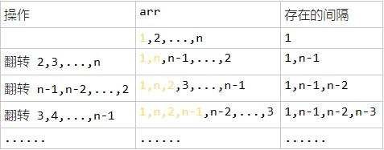
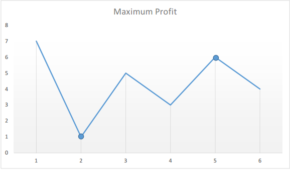
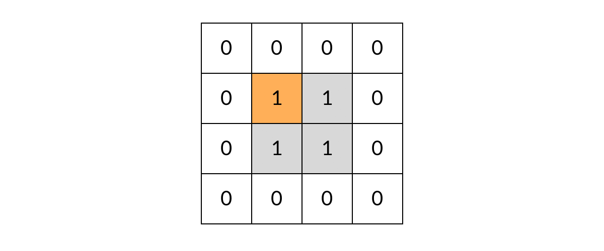

[TOC]

### 数组与矩阵题目

#### 技巧

- 有时候无序的数组可以直接使用 **Arrays.sort()** 进行排序，可能会方便很多！
- 对于一些固定的数组值，比如只有 0 和 1，可以改变这个值（其他值或者当前值的相反数）来表示当前位置已经被访问，这样可以减少空间。
- 涉及数组中**查找搜索**的问题，可以考虑能否**二分**！


### 元素查找类题目

#### 数组中重复的数字【简单】

[NowCoder](https://www.nowcoder.com/practice/623a5ac0ea5b4e5f95552655361ae0a8?tpId=13&tqId=11203&tPage=1&rp=1&ru=/ta/coding-interviews&qru=/ta/coding-interviews/question-ranking)

##### 1. 题目描述

在一个**长度为 n** 的数组里的所有数字都在 **0 到 n-1** 的范围内。数组中某些数字是**重复**的，但不知道有几个数字是重复的，也不知道每个数字重复几次。请**找出**数组中**任意一个重复**的数字。

```html
Input:
{2, 3, 1, 0, 2, 5}

Output:
2
```

##### 2. 解题思路

这个题就是**数组大小和数的范围**都给了。要求时间复杂度 **O(N)**，空间复杂度 **O(1)**。因此**不能使用排序**的方法，也不能使用额外的标记数组。

对于这种数组元素在 **[0, n - 1] 范围**内的问题，可以将**值为 i 的元素调整到第 i 个位置上进行求解**。**如果当前位置的值不等于索引则不断进行交换，如果交换之后已经存在，说明重复了**。

以 (2, 3, 1, 0, 2, 5) 为例，**遍历**到位置 4 时，该位置上的数为 2，但是第 2 个位置上已经有一个 2 的值了，因此可以知道 2 重复：


```java
public int findRepeatNumber(int[] nums) {
    // Base case
    if (nums == null || nums.length <= 0) return -1;
    // 遍历一次数组
    for (int i = 0; i < nums.length; i++) {
        // 如果当前位置不等于索引则不断进行交换
        while (nums[i] != i) {
            // 如果已经有了
            if (nums[i] == nums[nums[i]]) {
                return nums[i];
            }
            // 交换
            swap(nums, i, nums[i]);
        }
    }
    return -1;
}

private void swap(int[] nums, int i, int j) {
    int t = nums[i];
    nums[i] = nums[j];
    nums[j] = t;
}
```

#### 二维数组中的查找【简单】

##### 1. 题目

给定一个二维数组，其每一行**从左到右递增排序**，**从上到下也是递增排序**。给定一个数，判断这个数是否在该二维数组中。

```html
Consider the following matrix:
[
  [1,   4,  7, 11, 15],
  [2,   5,  8, 12, 19],
  [3,   6,  9, 16, 22],
  [10, 13, 14, 17, 24],
  [18, 21, 23, 26, 30]
]

Given target = 5, return true.
Given target = 20, return false.
```

连接：https://leetcode-cn.com/problems/er-wei-shu-zu-zhong-de-cha-zhao-lcof/

##### 2. 题解

要求时间复杂度 **O(M + N)**，空间复杂度 **O(1)**。其中 M 为行数，N 为 列数。

该二维数组中的一个数，**小于它的数一定在其左边**，大于它的数一定在**其下边**。因此，从**右上角开始查找**，就可以根据 target 和当前元素的大小关系来缩小查找区间，当前元素的查找区间为左下角的所有元素 。


下面的代码是从**右上角**开始搜索的。

```java
public boolean findNumberIn2DArray(int[][] matrix, int target) {
    // Base case
    if(matrix == null || matrix.length == 0 || matrix[0].length == 0) return false;
    // 行号
    int i = 0;
    // 列号
    int j = matrix[0].length - 1;
    // 遍历越界则退出
    while((i <= matrix.length - 1) && (j >= 0)) {
        // 找到
        if(target == matrix[i][j]) {
            return true;
        } else if(target < matrix[i][j]) {
            j--;
        } else {
            i++;
        }
    }
    return false;
}
```

#### N个数字中缺失的数字【简单】

##### 1. 题目

给定一个包含 0, 1, 2, ..., n 中 **n 个数的序列**，找出 0 .. n 中**没有出现**在序列中的那个数。

```java
示例 1:
输入: [3,0,1]
输出: 2
    
示例 2:
输入: [9,6,4,2,3,5,7,0,1]
输出: 8
```

链接：https://leetcode-cn.com/problems/missing-number

##### 2. 题解

###### (1) 位运算

由于**异或运算（XOR）满足结合律**，并且对一个数进行两次完全相同的异或运算会得到原来的数，因此我们可以通过异或运算找到缺失的数字。

我们知道数组中有 n 个数，并且缺失的数在 \[0..n] 中。因此我们可以先得到 \[0..n] 的异或值，再将结果对数组中的每一个数进行一次异或运算。未缺失的数在\[0..n] 和数组中各出现一次，因此异或后得到 0。而缺失的数字只在 \[0..n] 中出现了一次，在数组中没有出现，因此最终的异或结果即为这个缺失的数字。

```java
class Solution {
    public int missingNumber(int[] nums) {
        int missing = nums.length;
        for (int i = 0; i < nums.length; i++) {
            missing ^= i ^ nums[i];
        }
        return missing;
    }
}
```

###### (2) 数学法

可以用 **高斯求和公式 求出 0-n 的和 s = ((n + 1) * n) / 2**，减去数组中所有数的和，就得到了缺失的数字。

```java
public int missingNumber(int[] nums) {
    // 期待的和
    int expectedSum = nums.length * (nums.length + 1) / 2;
    // 计算实际的全部和
    int actualSum = 0;
    for (int num : nums) actualSum = actualSum + num;
    // 得到结果
    return expectedSum - actualSum;
}
```


### 双指针题目

#### 盛水最多的容器【中等】

给你 **n 个**非负整数 a1，a2，...，an，每个数代表坐标中的一个点 (i, ai) 。在坐标内画 **n 条垂直线**，垂直线 i 的两个端点分别为 (i, ai) 和 (i, 0)。找出其中的两条线，使得它们与 x 轴共同构成的**容器可以容纳最多的水**。

说明：你不能倾斜容器，且 n 的值至少为 2。


图中垂直线代表输入数组 [1, 8, 6, 2, 5, 4, 8, 3, 7]。在此情况下，容器能够容纳水（表示为蓝色部分）的最大值为 49。

```java
示例：
输入：[1,8,6,2,5,4,8,3,7]
输出：49
```

链接：https://leetcode-cn.com/problems/container-with-most-water

##### 2. 题解

###### (1) 双指针法

注意：每次**移动的是较短**的那边的棒子。

这种方法背后的思路在于，两线段之间形成的区域总是会受到其中**较短那条长度**的限制。此外，**两线段距离越远**，得到的面积就越大。

我们在由线段长度构成的数组中使用**两个指针**，一个放在**开始**，一个置于**末尾**。 此外使用变量 **maxArea** 来持续存储到**目前为止所获得的最大面积**。 在每一步中找出指针所指向的两条线段形成的区域，更新 maxArea，并将指向较**短线段的指针向较长线段那端移动一步**。

这种方法如何工作？

最初考虑由**最外围两条线段**构成的区域。现在为了使面积**最大化**，需要考虑更长的两条线段之间的区域。如果试图将指向较长线段的**指针向内侧移动**，矩形区域的面积将受限于**较短的线段而不会获得任何增加**。但是，在同样的条件下，移动指向较短线段的指针尽管造成了矩形宽度的减小，但**却可能会**有助于面积的增大。因为**移动较短线段的指针会得到一条相对较长的线段**，这可以**克服由宽度减小**而引起的面积减小。

具体动图流程参考：https://leetcode-cn.com/problems/container-with-most-water/solution/sheng-zui-duo-shui-de-rong-qi-by-leetcode/

```java
public int maxArea(int[] height) {
    // 记录遇到的最大面积值
    int maxArea = 0;
    // 双指针遍历数组，直到两个指针相遇
    for(int left = 0, right = height.length - 1; left < right; ) {
        // 计算当前两个指针下的面积
        int area = (right - left) * Math.min(height[left], height[right]);
        // 更新最大值
        maxArea = Math.max(maxArea, area);
        // 根据高度判断该移动哪个指针：每次移动高度较低的的指针
        if(height[left] < height[right]) {
            left++;
        } else {
            right--;
        }
    }
    return maxArea;
}
```


### 其他题目

#### 优美的排列【中等】

##### 1. 题目

给定两个整数 n 和 k，你需要实现一个**数组**，这个数组包含**从 1 到 n** 的 n 个不同整数，同时满足以下条件：

① 如果这个数组是 [a1, a2, a3, ... , an] ，那么数组 [|a1 - a2|, |a2 - a3|, |a3 - a4|, ... , |an-1 - an|] 中应该**有且仅有 k 个不同**整数；

② 如果存在多种答案，你只需实现并返回其中**任意一种**。

```java
示例 1:
输入: n = 3, k = 1
输出: [1, 2, 3]
解释: [1, 2, 3] 包含 3 个范围在 1-3 的不同整数， 并且 [1, 1] 中有且仅有 1 个不同整数 : 1

示例 2:
输入: n = 3, k = 2
输出: [1, 3, 2]
解释: [1, 3, 2] 包含 3 个范围在 1-3 的不同整数， 并且 [2, 1] 中有且仅有 2 个不同整数: 1 和 2
```


链接：https://leetcode-cn.com/problems/beautiful-arrangement-ii

##### 2. 题解

###### (1) 翻转法

啊这个题注意**数据范围是 1 - n** 。一开始还以为是随便自己凑 n 个数据。

由于给定数据范围是 1 - N，如果**正常排列**那么肯定是**只有一个不同的整数**，所以必须要**转换**一下。

- 假设有一个数组：1, 2, ..., n; 此时只有 **1 种间隔;**
- 一种巧妙的方式是进行**翻转**。如下图。



- 可以发现每次**反转**会**多出一种间隔**，k 种间隔就**反转 k 次**即可；一般想到这里就会开始写代码，然后不断的反转数数组。但是这样**不是最好**的。
- 进一步观察发现如果需要 **k 个不同**的间隔，**前 k 个数需要间隔从==两端取==**；剩下的数字则按**照降序或者升序**排列；

```java
public int[] constructArray(int n, int k) {
    int[] array = new int[n];
    int left = 1, right = n;

    // 前k个数需要间隔从两端取；
    int i = 0;
    while (true) {
        if(i < k) { array[i] = left; i++; left++; } else break;
        if(i < k) { array[i] = right; i++; right--; } else break;
    }

    // 剩下的数字则按照降序或者升序排列；
    if(k % 2 == 1) {
        for (int j = k; j < array.length; j++) {
            array[j] = left;
            left++;
        }
    } else {
        for (int j = k; j < array.length; j++) {
            array[j] = right;
            right--;
        }
    }
    return array;
}
```

----

#### 最大交换【中等】

##### 1. 题目

给定一个**非负整数**，你至多可以交换**一次数字**中的**任意两位**。返回你能得到的**最大值**。

```java
示例 1 :
输入: 2736
输出: 7236
解释: 交换数字2和数字7。
    
示例 2 :
输入: 9973
输出: 9973
解释: 不需要交换。
```

链接：https://leetcode-cn.com/problems/maximum-swap

##### 2. 题解

###### (1) 贪心法

尽量交换**前面的大数位**，并且和它交换的数还得是**在它后面大于它的最大数**。

- **倒序**使用数组存储下来**每个位置**，在它及**它以后的最大数的索引**。
- 然后**再正序**从一个数开始**遍历**，如果它及它以后的**最大数不是它本身**，那么这个数就是我们需要交换的。

```java
public int maximumSwap(int num) {
    // 将数字转为char数组
    char[] charArray = String.valueOf(num).toCharArray();
    // 最大值
    int max = Integer.MIN_VALUE;
    // 最大值所在索引
    int maxIndex = 0;
    // 初始化一个数组并拷贝这个数的个位
    int [] array = new int[charArray.length];
    array[charArray.length - 1] = charArray.length - 1;

    // 从个位往高位遍历（逆序遍历）
    for (int i = charArray.length - 1; i >= 0; i--) {
        // char运算！！！
        if (charArray[i] - '0' > max) {
            // 更新最大值数值和最大值指针
            max = charArray[i] - '0';
            maxIndex = i;
        }
        array[i] = maxIndex;
    }
    // 正向遍历找到第一个符合条件的交换元素
    for (int i = 0; i < charArray.length; i ++) {
        if (array[i] != i && charArray[array[i]] != charArray[i]) {
            char tmp = charArray[i];
            charArray[i] = charArray[array[i]];
            charArray[array[i]] = tmp;
            break;
        }
    }
    return Integer.parseInt(new String(charArray));
}
```

---

---

#### 三数之和

##### 1. 题目

给你一个包含 n 个整数的数组 nums，判断 nums 中是否存在三个元素 a，b，c ，使得 **a + b + c = 0** ？请你找出所有满足条件且**不重复**的三元组。

注意：答案中不可以包含重复的三元组。

 ```java
示例：
给定数组 nums = [-1, 0, 1, 2, -1, -4]，
满足要求的三元组集合为：
[
  [-1, 0, 1],
  [-1, -1, 2]
]
 ```

链接：https://leetcode-cn.com/problems/3sum

##### 2. 题解

###### (1) **穷举法**

该算法的内循环为 `if (nums[i] + nums[j] + nums[k] == 0)` 语句，总共执行的次数为 N(N-1)(N-2) = N<sup>3</sup>/6-N<sup>2</sup>/2+N/3，因此它的近似执行次数为 \~N<sup>3</sup>/6，增长数量级为 **O(N<sup>3</sup>)**。

```java
// 穷举法 No Offer
public class ThreeSumSlow implements ThreeSum {
    @Override
    public int count(int[] nums) {
        int N = nums.length;
        int cnt = 0;
        for (int i = 0; i < N; i++) {
            for (int j = i + 1; j < N; j++) {
                for (int k = j + 1; k < N; k++) {
                    if (nums[i] + nums[j] + nums[k] == 0) {
                        cnt++;
                    }
                }
            }
        }
        return cnt;
    }
}
```

###### (2) **二分查找方式**

将数组进行**排序**，对两个元素**求和**，并用**二分查找方法**查找是否存在该**和**的**相反数**，如果存在，就说明存在和为 0 的三元组。

应该注意的是，只有数组**不含有相同元素**才能使用这种解法，否则二分查找的结果会出错。

该方法可以将 ThreeSum 算法增长数量级降低为 **O(N<sup>2</sup>logN)**。

```java
public class ThreeSumBinarySearch implements ThreeSum {

    @Override
    public int count(int[] nums) {
        // 先排序
        Arrays.sort(nums);
        int N = nums.length;
        int cnt = 0;
        for (int i = 0; i < N; i++) {
            for (int j = i + 1; j < N; j++) {
                int target = -nums[i] - nums[j];
                int index = BinarySearch.search(nums, target);
                // 应该注意这里的下标必须大于 j，否则会重复统计。
                if (index > j) {
                    cnt++;
                }
            }
        }
        return cnt;
    }
}
```

```java
public class BinarySearch {

    public static int search(int[] nums, int target) {
        int l = 0, h = nums.length - 1;
        while (l <= h) {
            int m = l + (h - l) / 2;
            if (target == nums[m]) {
                return m;
            } else if (target > nums[m]) {
                l = m + 1;
            } else {
                h = m - 1;
            }
        }
        return -1;
    }
}
```

###### (3) 排序+双指针法

更有效的方法是先将**数组排序**，然后使用**双指针**进行查找，时间复杂度为 **O(N<sup>2</sup>)**。

这个题排序很关键呀！直接用系统的排序算法即可，**Arrays.sort()**。

- 标签：数组遍历
- 首先对数组进行**排序**，排序后固定一个数 **nums[i]**，再使用**左右指针指向 nums[i]后面的两端**，数字分别为 nums[L] 和 nums[R]，计算三个数的和 sum 判断是否满足为 0，满足则添加进结果集。
- 如果 nums[i] **大于 0**，则三数之和**必然无法等于 0**，结束循环
- 如果 nums[i] == nums[i-1]，则说明该数字**重复**，会导致结果重复，所以应该**跳过**
- 当 sum == 0 时，nums[L] == nums[L+1] 则会导致结果重复，应该**跳过**，L++
- 当 sum == 0 时，nums[R] == nums[R−1] 则会导致结果重复，应该**跳过**，R--
- 时间复杂度：O(n^2)，n 为数组长度。
- 算法动图链接：https://leetcode-cn.com/problems/3sum/solution/hua-jie-suan-fa-15-san-shu-zhi-he-by-guanpengchn/

```java
class Solution {
    public static List<List<Integer>> threeSum(int[] nums) {
        List<List<Integer>> ans = new ArrayList();
        // Base case
        int len = nums.length;
        if(nums == null || len < 3) return ans;
        // 对原始数组排序
        Arrays.sort(nums); 

        for (int i = 0; i < len ; i++) {
            // 如果当前数字大于0，则三数之和一定大于0，所以结束循环
            if(nums[i] > 0) break; 
            // 去重相同的数就判断一次即可
            if(i > 0 && nums[i] == nums[i-1]) continue; 
            // 当前元素右边部分的左右指针
            int L = i + 1;
            int R = len - 1;
            while(L < R){
                int sum = nums[i] + nums[L] + nums[R];
                if(sum == 0){
                    ans.add(Arrays.asList(nums[i],nums[L],nums[R]));
                    while (L < R && nums[L] == nums[L + 1]) L++; // 去重
                    while (L < R && nums[R] == nums[R - 1]) R--; // 去重
                    L++;
                    R--;
                }
                else if (sum < 0) L++;
                else if (sum > 0) R--;
            }
        }        
        return ans;
    }
}
```

##### 3. 测试

基于算法 4。

如果 T(N) \~ aN<sup>b</sup>logN，那么 T(2N)/T(N) \~ 2<sup>b</sup>。

例如对于暴力的 ThreeSum 算法，近似时间为 \~N<sup>3</sup>/6。进行如下实验：多次运行该算法，每次取的 N 值为前一次的两倍，统计每次执行的时间，并统计本次运行时间与前一次运行时间的比值，得到如下结果：

|   N   | Time(ms) | Ratio |
| :---: | :------: | :---: |
|  500  |    48    |   /   |
| 1000  |   320    |  6.7  |
| 2000  |   555    |  1.7  |
| 4000  |   4105   |  7.4  |
| 8000  |  33575   |  8.2  |
| 16000 |  268909  |  8.0  |

可以看到，T(2N)/T(N) \~ 2<sup>3</sup>，因此可以确定 T(N) \~ aN<sup>3</sup>logN。

```java
public class RatioTest {

    public static void main(String[] args) {
        int N = 500;
        int loopTimes = 7;
        double preTime = -1;
        while (loopTimes-- > 0) {
            int[] nums = new int[N];
            StopWatch.start();
            ThreeSum threeSum = new ThreeSumSlow();
            int cnt = threeSum.count(nums);
            System.out.println(cnt);
            double elapsedTime = StopWatch.elapsedTime();
            double ratio = preTime == -1 ? 0 : elapsedTime / preTime;
            System.out.println(N + "  " + elapsedTime + "  " + ratio);
            preTime = elapsedTime;
            N *= 2;
        }
    }
}
```

```java
// 计时器
public class StopWatch {

    private static long start;

    public static void start() {
        start = System.currentTimeMillis();
    }
    public static double elapsedTime() {
        long now = System.currentTimeMillis();
        return (now - start) / 1000.0;
    }
}
```


#### 最接近的三数之和

##### 1. 题目

三数之和题目的变形。

给定一个包括 n 个整数的数组 nums 和 一个目标值 target。找出 nums 中的**三个整数**，使得它们的**和与 target 最接近**。返回这三个数的和。假定每组输入只存在**唯一答案**。

```java
例如，给定数组 nums = [-1，2，1，-4], 和 target = 1.
与target最接近的三个数的和为 2. (-1 + 2 + 1 = 2).
```

链接：https://leetcode-cn.com/problems/3sum-closest

##### 2. 题解

###### 排序+双指针

三数之和题目的变形。所以直接利用三数之和的排序+双指针方法进行求解，原理是一样的。只是注意编码的问题。

动图连接：[算法动图](https://leetcode-cn.com/problems/3sum-closest/solution/hua-jie-suan-fa-16-zui-jie-jin-de-san-shu-zhi-he-b/)

```java
class Solution {
    public int threeSumClosest(int[] nums, int target) {
        // 对数组排序
        Arrays.sort(nums);
        // 用前三个元素初始化一个值
        int ans = nums[0] + nums[1] + nums[2];
        for (int i = 0; i < nums.length; i++) {
            // 对当前索引位置后面的元素进行双指针遍历
            int start = i + 1, end = nums.length - 1;
            // 不断移动双指针
            while (start < end) {
                int sum = nums[start] + nums[end] + nums[i];
                // 如果距离值更小则更小ans值
                if (Math.abs(target - sum) < Math.abs(target - ans))
                    ans = sum;
                // 然后根据情况移动左右指针    
                if (sum > target)
                    end--;
                else if (sum < target)
                    start++;
                else
                    // 如果刚好等于，则直接返回ans=0即可。
                    return ans;
            }
        }
        return ans;
    }
}
```

---

#### 删除排序数组中的重复项

##### 1. 题目

给定一个排序数组，你需要在 **原地** 删除重复出现的元素，使得每个元素**只出现一次**，返回移除后数组的**新长度**。

不要使用额外的数组空间，你必须在 原地 修改输入数组 并在使用 **O(1)** 额外空间的条件下完成。

```java
示例 1:
给定数组 nums = [1,1,2], 
函数应该返回新的长度 2, 并且原数组 nums 的前两个元素被修改为 1, 2。 
你不需要考虑数组中超出新长度后面的元素。
    
示例 2:
给定 nums = [0,0,1,1,1,2,2,3,3,4],
函数应该返回新的长度 5, 并且原数组 nums 的前五个元素被修改为 0, 1, 2, 3, 4。
你不需要考虑数组中超出新长度后面的元素。
```

链接：https://leetcode-cn.com/problems/remove-duplicates-from-sorted-array

##### 2. 题解

###### 双指针法

这个题 AC 方式有点怪异。

首先注意数组是**有序**的，那么**重复的元素一定会相邻**。

要求删除重复元素，实际上就是将**不重复的**元素移到数组的**左侧**。

考虑用 **2 个指针**，一个在**慢指针记作 p**，一个在**快指针记作 q**，算法流程如下：

比较 p 和 q 位置的元素是否**相等**。

- 如果**相等**，q 后移 **1 位**，相当于跳过重复元素。
- 如果**不相等**，将 q 位置的元素**复制到 p + 1** 位置上（先将 p + 1），p 后移一位，q 后移 1 位
    重复上述过程，直到 q 等于数组长度。

返回 p + 1，即为新数组长度。


```java
public int removeDuplicates(int[] nums) {
    // Base case
    if (nums.length == 0) return 0;
    // 慢指针
    int p = 0;
    // 快指针从1处开始
    for (int q = 1; q < nums.length; q++) {
        // 如果快慢指针所指的内容不同，则把快指针处的数据复制到慢指针的下一个位置
        if (nums[q] != nums[p]) {
            // 先将慢指针移动到下一个位置
            p++;
            // 拷贝值
            nums[p] = nums[q];
        }
    }
    return p + 1;
}
```

---

#### 删除全部指定元素

##### 1. 题目

给你一个数组 nums 和一个值 val，你需要 **原地 移除所有数值等于 val 的元素**，并返回移除后数组的**新长度**。

不要使用额外的数组空间，你必须仅使用 O(1) 额外空间并 **原地** 修改输入数组。

元素的顺序可以改变。**你不需要考虑数组中超出新长度后面的元素**。（这里的条件跟上一题类似，相当于只需要把最后的结果搬运到数组的前面就行了，后面的不用管内容）

```java
示例 1:
给定 nums = [3,2,2,3], val = 3,
函数应该返回新的长度 2, 并且 nums 中的前两个元素均为 2。
你不需要考虑数组中超出新长度后面的元素。
    
示例 2:
给定 nums = [0,1,2,2,3,0,4,2], val = 2,
函数应该返回新的长度 5, 并且 nums 中的前五个元素为 0, 1, 3, 0, 4。
注意这五个元素可为任意顺序。
你不需要考虑数组中超出新长度后面的元素。
```


链接：https://leetcode-cn.com/problems/remove-element

##### 2. 题解

###### 交换移除

用后面的元素替换前面需要删除的元素，同时将有效的数组长度 - 1。

```java
public int removeElement(int[] nums, int val) {
    int i = 0;
    int len = nums.length;
    // 遍历
    while (i < len) {
        // 这个元素是需要删除的
        if (nums[i] == val) {
            // 用当前数组有效范围的最后一个元素替换需要删除的元素
            nums[i] = nums[len - 1];
            // 由于删除了一个元素，缩小数组范围
            len--;
        } else {
            i++;
        }
    }
    // 返回最终还剩多少有效数组长度即可
    return len;
}
```

###### 拷贝覆盖

顺序遍历数组，如果遇到某个值与目标值不同，则直接将其复制到索引 ans 之下，同时 ans 索引依次增加。

```java
class Solution {
    public int removeElement(int[] nums, int val) {
        // 索引从0开始
        int ans = 0;
        for(int num: nums) {
            // 某个值与目标值不同
            if(num != val) {
                // 值覆盖
                nums[ans] = num;
                ans++;
            }
        }
        return ans;
    }
}
```

---

#### 字典序的下一个排列

##### 1. 题目

实现获取下一个排列的函数，算法需要将给定数字**序列**重新排列成字典序中**下一个更大**的排列。

如果**不存在**下一个更大的排列，则将数字重新排列成**最小的排列**（即升序排列）。

必须**原地**修改，只允许使用额外**常数**空间。

以下是一些例子，输入位于左侧列，其相应输出位于右侧列。

```java
1,2,3 → 1,3,2
3,2,1 → 1,2,3
1,1,5 → 1,5,1
```


链接：https://leetcode-cn.com/problems/next-permutation

##### 2. 题解

###### 遍历法

具体流程参考下图，详细解释看：https://leetcode-cn.com/problems/next-permutation/solution/xia-yi-ge-pai-lie-by-leetcode/


```java
public class Solution {
    public void nextPermutation(int[] nums) {
        // 初始索引，即数组的倒数第二个数开始
        int i = nums.length - 2;
        // 从右往左找到第一个非单调增的数字对应的索引
        while (i >= 0 && nums[i + 1] <= nums[i]) {
            // 指针左移
            i--;
        }
        // 说明索引有效（即当前数不是最大的，可以整下一个字典序）
        if (i >= 0) {
            // 从右往左寻找第一个大于索引值的元素
            int j = nums.length - 1;
            while (j >= 0 && nums[j] <= nums[i]) {
                j--;
            }
            // 交换这两个元素即可生成
            swap(nums, i, j);
        }
        // 如果当前数是最大的，则将其变为最小的，即反转整个数组
        reverse(nums, i + 1);
    }

    // 反转整个数组
    private void reverse(int[] nums, int start) {
        int i = start, j = nums.length - 1;
        while (i < j) {
            swap(nums, i, j);
            i++;
            j--;
        }
    }
	// 交换两个元素
    private void swap(int[] nums, int i, int j) {
        int temp = nums[i];
        nums[i] = nums[j];
        nums[j] = temp;
    }
}
```

---

#### 最长递增连续序列

##### 1. 题目

给定一个未经排序的整数数组，找到最长且连续的的递增序列。

**示例 1:**

```java
输入: [1,3,5,4,7]
输出: 3
```

解释: 最长连续递增序列是 [1, 3, 5], 长度为3。
尽管 [1, 3, 5, 7] 也是升序的子序列, 但它**不是连续**的，因为 5 和 7 在原数组里被 4 隔开。 
**示例 2:**

```java
输入: [2,2,2,2,2]
输出: 1
```

解释: 最长连续递增序列是 [2], 长度为1。
注意：数组长度不会超过10000。
链接：https://leetcode-cn.com/problems/longest-continuous-increasing-subsequence

##### 2. 题解

这是个easy题，注意条件是**递增的且挨着**的。所以一旦遇到非递增的就重新计数就行了。然后比较大小。

```java
public int findLengthOfLCIS(int[] nums) {
    // Base case
    if(nums.length <= 1)
        return nums.length;
    // 至少都是1    
    int ans = 1;
    int count = 1;
    for(int i = 0;i < nums.length - 1; i++) {
        if(nums[i + 1] > nums[i]) {
            count++;
        } else {  
            // 计数器归零
            count = 1;
        }
        // 最后比较一下count 和 ans防止是最后一个count最大
        ans = count > ans ? count : ans;
    }
    return ans;
}
```


#### 检查整数及其两倍数是否存在

##### 1. 题目

给你一个整数数组 arr，请你检查是否存在两个整数 N 和 M，满足 N 是 M 的两倍（即，N = 2 * M）。

更正式地，检查是否存在两个下标 i 和 j 满足：

```java
i != j
0 <= i, j < arr.length
arr[i] == 2 * arr[j]
```

```java
示例 1：
输入：arr = [10,2,5,3]
输出：true
解释：N = 10 是 M = 5 的两倍，即 10 = 2 * 5 。
    
示例 2：
输入：arr = [7,1,14,11]
输出：true
解释：N = 14 是 M = 7 的两倍，即 14 = 2 * 7 。
示例 3：
输入：arr = [3,1,7,11]
输出：false
解释：在该情况下不存在 N 和 M 满足 N = 2 * M 。
```

链接：https://leetcode-cn.com/problems/check-if-n-and-its-double-exist

##### 5. 题解

注意本题：数字可能为负数或0或正数。不一定都是正数。

###### (1) 直接用Set

```java
public boolean checkIfExist(int[] arr) {
    // 存放元素的set
    HashSet<Integer> set = new HashSet();
    // 依次遍历检查
    for (int i = 0; i < arr.length; i++) {
        // 如果set中有返回true
        if (set.contains(arr[i] * 2) || (arr[i] % 2 == 0 && set.contains(arr[i] / 2)))
            return true;
        // 没有直接加入set中
        else {
            set.add(arr[i]);
        }
    }
    return false;
}
```

###### (2) 排序+指针法

先排序，再使用指针的方式寻找。时间和空间都能超90%。

```java
public boolean checkIfExist(int[] arr) {
    if (arr == null || arr.length == 0) return false;
    // 先对数组排序
    Arrays.sort(arr);
    // 得到长度
    int len = arr.length;
    // 指针指向第一个
    int pointer = 0;
    int num = 0;
    for (int i = 0; i < len; i++) {
        num = arr[i] * 2;
        while (pointer < len && num > arr[pointer]) {
            pointer++;
        }
        // 找到的条件
        if(pointer < len && pointer != i && num == arr[pointer]) {
            return true;
            // 这一趟遍历完成
        } else if(pointer == len) {
            break;
        }
    }
    return false;
}
```


#### 数组+1

##### 1. 题目

给定一个由整数组成的非空数组所表示的非负整数，在该数的基础上加一。

最高位数字存放在数组的首位， 数组中每个元素只存储单个数字。

你可以假设除了整数 0 之外，这个整数不会以零开头。

```java
示例 1:
输入: [1,2,3]
输出: [1,2,4]
解释: 输入数组表示数字 123。
    
示例 2:
输入: [4,3,2,1]
输出: [4,3,2,2]
解释: 输入数组表示数字 4321。
```


链接：https://leetcode-cn.com/problems/plus-one

##### 2. 题解

这个题需要注意的就是最后一位是 9 的情况。

```java
public int[] plusOne(int[] digits) {
    // 从后往前遍历
    for (int i = digits.length - 1; i >= 0; i--) {
        // 当前位+1
        digits[i]++;
        // 如果当前位加一之后不为0，说明没有发生进位，直接退出
        digits[i] = digits[i] % 10;
        if (digits[i] != 0) return digits;
    }
    // 下面处理全是9的情况，此时直接把第一为初始化为1，后面默认为0即可
    digits = new int[digits.length + 1];
    digits[0] = 1;
    return digits;
}
```


#### 买卖股票的最佳时机

给定一个数组，它的第 i 个元素是一支给定股票第 i 天的价格。

如果你最多只允许完成一笔交易（即买入和卖出一支股票一次），设计一个算法来计算你所能获取的最大利润。

注意：你不能在买入股票前卖出股票。

 ```java
示例 1:

输入: [7,1,5,3,6,4]
输出: 5
解释: 在第 2 天（股票价格 = 1）的时候买入，在第 5 天（股票价格 = 6）的时候卖出，最大利润 = 6-1 = 5 。
     注意利润不能是 7-1 = 6, 因为卖出价格需要大于买入价格；同时，你不能在买入前卖出股票。
示例 2:

输入: [7,6,4,3,1]
输出: 0
解释: 在这种情况下, 没有交易完成, 所以最大利润为 0。
 ```

链接：https://leetcode-cn.com/problems/best-time-to-buy-and-sell-stock

假设给定的数组为：`[7, 1, 5, 3, 6, 4]`

如果我们在图表上绘制给定数组中的数字，我们将会得到：



我们来假设自己来购买股票。随着时间的推移，每天我们都可以选择出售股票与否。那么，假设在第 i 天，如果我们要在今天卖股票，那么我们能赚多少钱呢？

显然，如果我们真的在买卖股票，我们肯定会想：如果我是**在历史最低点买的股票就好了**！太好了，在题目中，我们只要用一个**变量记录一个历史最低价格 minprice**，我们就可以假设自己的股票是在那天买的。那么我们在第 i 天卖出股票能得到的利润就是 **prices[i] - minprice**。

因此，我们只需要遍历价格数组一遍，**记录历史最低点，然后在每一天考虑这么一个问题：如果我是在历史最低点买进的，那么我今天卖出能赚多少钱**？当考虑完所有天数之时，我们就得到了最好的答案。

```java
public class Solution {
    public int maxProfit(int prices[]) {
        // 最小价格
        int minPrice = Integer.MAX_VALUE;
        // 记录最大利润
        int maxProfit = 0;
        // 遍历更新这个值
        for (int i = 0; i < prices.length; i++) {
            // 更新最小价格
            if (prices[i] < minPrice)
                minPrice = prices[i];
            else if (prices[i] - minPrice > maxProfit)
                // 更新最大利润
                maxProfit = prices[i] - minPrice;
        }
        return maxProfit;
    }
}
```


#### 移动零到末尾

##### 1. 题目

给定一个数组 nums，编写一个函数将**所有 0 移动到数组的末尾，同时保持非零元素的相对顺序**。

```java
示例:
输入: [0,1,0,3,12]
输出: [1,3,12,0,0]
```

说明:

必须在原数组上操作，不能拷贝额外的数组。
尽量减少操作次数。

链接：https://leetcode-cn.com/problems/move-zeroes

##### 2. 题解

这个题肯定不能用额外空间。

###### (1) 两次遍历

我们创建**两个指针 i 和 j**，第一次遍历的时候指针 j 用来记录当前有多少非 0 元素。即遍历的时候每遇到一个非 0 元素就将其往数组左边挪，第一次遍历完后，j 指针的下标就指向了**最后一个非 0 元素下标**。
第二次遍历的时候，起始位置就**从 j 开始到结束**，将剩下的这段区域内的元素**全部置为 0**。

```java
class Solution {
    public void moveZeroes(int[] nums) {
        if(nums == null) {
            return;
        }
        // 第一次遍历的时候，j指针记录非0的个数，只要是非0的统统都赋给nums[j]
        int j = 0;
        for(int i = 0; i < nums.length; i++) {
            if(nums[i] != 0) {
                // 直接挨着幅值即可
                nums[j++] = nums[i];
            }
        }
        // 非0元素统计完了，剩下的都是0了
        // 所以第二次遍历把末尾的元素都赋为0即可
        for(int i = j; i < nums.length; i++) {
            nums[i] = 0;
        }
    }
}	
```

###### (2) 一次遍历

这里参考了**快速排序**的思想，快速排序首先要确定一个待分割的元素做中间点 x，然后把所有小于等于 x 的元素放到 x 的左边，大于 x 的元素放到其右边。
这里我们可以用 0 当做这个**中间点**，把**不等于 0** (注意题目没说不能有负数)的放到中间点的**左边**，等于 0 的放到其**右边**。
这的中间点就是 0 本身，所以实现起来比**快速排序简单很多**，我们使用两个指针 i 和 j，只要 nums[i] != 0，我们就交换 nums[i] 和 nums[j]。

```java
class Solution {
    public void moveZeroes(int[] nums) {
        if(nums == null) {
            return;
        }
        // 两个指针i和j
        int j = 0;
        for(int i = 0; i < nums.length; i++) {
            // 当前元素!=0，就把其交换到左边，等于0的交换到右边
            if(nums[i] != 0) {
                int tmp = nums[i];
                nums[i] = nums[j];
                nums[j++] = tmp;
            }
        }
    }
}	
```


#### 最大连续1的个数

##### 1. 题目

给定一个二进制数组， 计算其中最大连续1的个数。

```java
示例 1:
输入: [1,1,0,1,1,1]
输出: 3
解释: 开头的两位和最后的三位都是连续1，所以最大连续1的个数是 3.
```

注意：

输入的数组只包含 0 和1。
输入数组的长度是正整数，且不超过 10,000。

链接：https://leetcode-cn.com/problems/max-consecutive-ones


##### 2. 题解

可以直接用 0 当做分隔符，然后用 split 的方式求最长的。

也可以直接一次遍历，记录最长的连续值即可。也就是遇到为 0 的就统计一次，遇到 1 则小计数器增加。

```java
public int findMaxConsecutiveOnes(int[] nums) {
    if(nums == null || nums.length == 0) {
        return 0;
    }
    // 小计数器
    int temp = 0;
    // 最大值
    int max = 0;
    for(int i = 0; i < nums.length; i++) {
        // 如果值为1则小计数器+1
        if(nums[i] == 1) {
            temp++;
            // 否则对比更新当前最大值并将小计数器置0
        } else {
            max = Math.max(temp, max);
            temp = 0;
        }
    }
	// 最后比较一次小计数器和最大值，防止出现[1]这样的情况
    return Math.max(temp, max);
}
```


#### 子数组最大平均长度 I

##### 1. 题目

给定 n 个整数，找出平均数最大且长度为 k 的连续子数组，并输出该最大平均数。

```java
示例 1:
输入: [1,12,-5,-6,50,3], k = 4
输出: 12.75
解释: 最大平均数 (12-5-6+50)/4 = 51/4 = 12.75
```


注意:

1 <= k <= n <= 30,000。
所给数据范围 [-10,000，10,000]。

链接：https://leetcode-cn.com/problems/maximum-average-subarray-i

##### 2. 题解

利用滑动窗口，挨着**滑动求最大值**就行。相比于创建一个累加和数组，**再遍历计算最大平均值**，本方法只需要遍历一次数组 num，从中找出长度为 k 的子数组最大和。

```java
public class Solution {
    public double findMaxAverage(int[] nums, int k) {
        // 记录前k个数的和
        double sum = 0;
        // 先计算前k个数的和
        for (int i = 0; i < k; i++) {
            sum += nums[i];
        }
        double res = sum;
        // 使用滑动窗口
        for (int i = k; i < nums.length; i++) {
            // 更新K个数的和
            sum = sum + nums[i] - nums[i - k];
            // 更新最大值
            res = Math.max(res, sum);
        }
        return res / k;
    }
}
```


#### 寻找数组的中心索引

##### 1. 题目

给定一个整数类型的数组 nums，请编写一个能够返回数组 “中心索引” 的方法。

我们是这样定义数组 中心索引 的：数组中心索引的**左侧所有元素相加的和等于右侧所有元素相加的和**。

如果数组不存在中心索引，那么我们应该返回 -1。如果数组有多个中心索引，那么我们应该返回最**靠近左边**的那一个。

```java
示例 1：
输入：
nums = [1, 7, 3, 6, 5, 6]
输出：3
解释：
索引 3 (nums[3] = 6) 的左侧数之和 (1 + 7 + 3 = 11)，与右侧数之和 (5 + 6 = 11) 相等。
同时, 3 也是第一个符合要求的中心索引。
    
示例 2：
输入：
nums = [1, 2, 3]
输出：-1
解释：
数组中不存在满足此条件的中心索引。
```


说明：

nums 的长度范围为 [0, 10000]。任何一个 nums[i] 将会是一个范围在 [-1000, 1000]的整数。

链接：https://leetcode-cn.com/problems/find-pivot-index

##### 2. 题解

首先计算全部元素的和 sum，同时维护一个中心索引左边和的变量 leftSum，每到一个位置，便用全部元素 sum - leftSum，得到中心索引右边的全部和，同时进行比较。之后滚动更新 leftSum 的值。

```java
public int pivotIndex(int[] nums) {
    if(nums == null || nums.length <= 2) {
        return -1;
    }
    // 先计算全部元素的和
    int sum = 0;
    for(int i = 0; i < nums.length; i++) {
        sum = sum + nums[i];
    }
    // 维护一个中心索引左边和的变量
    int leftSum = 0;
    for(int i = 0; i < nums.length; i++) {
        // 实时计算右边的和
        int rightSum = sum - leftSum - nums[i];
        // 相等返回
        if(leftSum == rightSum) {
            return i;
        }
        // 更新左边的和
        leftSum = leftSum + nums[i];
    }
    return -1;
}
```


#### 数组按奇偶排列

##### 1. 题目

给定一个非负整数数组 num 一个数组，在该数组中， num 的所有**偶数元素之后跟着所有奇数元素**。

你可以返回满足此条件的任何数组作为答案。

**示例：**

```
输入：[3,1,2,4]
输出：[2,4,3,1]
输出 [4,2,3,1]，[2,4,1,3] 和 [4,2,1,3] 也会被接受。
```

连接：https://leetcode-cn.com/problems/sort-array-by-parity/

##### 2. 题解

可以使用辅助空间，也可以遍历两次。这样复杂度过高。

直接利用**快排思想**原地交换指针即可。

维护两个指针 i 和 j，循环保证**每刻小于 i 的变量都是偶数**（也就是 A[k] % 2 == 0 当 k < i），所有**大于 j 的都是奇数**。

所以， 4 种情况针对 (A[i] % 2, A[j] % 2)：

- 如果是 (0, 1)，那么万事大吉 i++ 并且 j--。
- 如果是 (1, 0)，那么交换两个元素，然后继续。
- 如果是 (0, 0)，那么说明 i 位置是正确的，只能 i++。
- 如果是 (1, 1)，那么说明 j 位置是正确的，只能 j--。

通过这 4 种情况，循环不变量得以维护，并且 **j-i** 不断变小。最终就可以得到**奇偶有序**的数组。

```java
public int[] sortArrayByParity(int[] nums) {
    // 两个指针从两边开始
    int i = 0, j = nums.length - 1;
    // 直到两指针相交
    while (i < j) {
        // 说明i处是奇数，j处是偶数，则交换两个位置
        if (nums[i] % 2 > nums[j] % 2) {
            int tmp = nums[i];
            nums[i] = nums[j];
            nums[j] = tmp;
        }
        // 如果i处为偶数移动指针
        if (nums[i] % 2 == 0) i++;
        // 如果j处为奇数移动指针
        if (nums[j] % 2 == 1) j--;
    }

    return nums;
}
```


#### 有序数组中出现次数超过25%的元素

##### 1. 题目

给你一个非递减的 有序 整数数组，已知这个数组中恰好有一个整数，它的出现次数超过数组元素总数的 25%。

请你找到并返回这个整数。

```java
示例：
输入：arr = [1,2,2,6,6,6,6,7,10]
输出：6
```

链接：https://leetcode-cn.com/problems/element-appearing-more-than-25-in-sorted-array

##### 2. 题解

1. 求出 25% 对应的出现次数 threshold
2. 遍历数组
3. 由于是有序数组，只需比较 当前位置 i 值和 i + threshold的值是否相等即可。

```java
public int findSpecialInteger(int[] arr) {
    // Gap
    int threshold = arr.length / 4;
    for (int i = 0; i < arr.length; i++) {
        // 如果某位置与gap之后的相同就是找到
        if (arr[i + threshold] == arr[i]) {
            return arr[i];
        }
    }
    return 0;
}
```


#### 找到所有数组中消失的数字

##### 1. 题目

给定一个范围在  1 ≤ a[i] ≤ n ( n = 数组大小 ) 的 整型数组，数组中的元素一些出现了两次，另一些只出现一次。

**找到所有在 [1, n] 范围之间没有出现在数组中的数字。**

您能在不使用额外空间且时间复杂度为O(n)的情况下完成这个任务吗? 你可以假定返回的数组不算在额外空间内。

**示例:**

```java
输入:
[4,3,2,7,8,2,3,1]
输出:
[5,6]
```

链接：https://leetcode-cn.com/problems/find-all-numbers-disappeared-in-an-array

##### 2. 题解

可以使用哈希表的方式解答，但是空间复杂度过高。

这里采取一种巧妙的方法，遍历两次即可。我们可以在输入数组本身以**某种方式标记**已访问过的数字，然后再找到缺失的数字。

- 遍历输入数组的每个元素一次。
- 我们将把 **|nums[i]|-1** 索引位置的元素标记为**负数**。
- 再次遍历数组，若当前数组元素 nums[i] 为负数，说明我们在数组中存在数字 i+1。

图示如下：https://leetcode-cn.com/problems/find-all-numbers-disappeared-in-an-array/solution/zhao-dao-suo-you-shu-zu-zhong-xiao-shi-de-shu-zi-2/

```java
public List<Integer> findDisappearedNumbers(int[] nums) {
    // 一次遍历
    for (int i = 0; i < nums.length; i++) {

        // 计算当前元素对应的下标，减一是因为数组下标是从0开始的，而数字是从1开始的
        int newIndex = Math.abs(nums[i]) - 1;
        // 如果新下标位置处的元素大于0，说明没有标记过
        if (nums[newIndex] > 0) {
            // 标记为-1，这样即不改变原数字又能标记已经有了的位置
            nums[newIndex] = -1 * nums[newIndex];
        }
    }
    // 存放结果
    List<Integer> result = new LinkedList<Integer>();
    // 遍历一次，如果当前位置的值为正数，说明没有！！！
    for (int i = 1; i <= nums.length; i++) {
        if (nums[i - 1] > 0) {
            result.add(i);
        }
    }
    return result;
}
```


#### 岛屿的最大面积

##### 1. 题目

给定一个包含了一些 0 和 1 的非空二维数组 grid 。

一个 岛屿 是由一些相邻的 1 (代表土地) 构成的组合，这里的「相邻」要求两个 1 必须在水平或者竖直方向上相邻。你可以假设 grid 的四个边缘都被 0（代表水）包围着。

找到给定的二维数组中最大的岛屿面积。(如果没有岛屿，则返回面积为 0 。)

```java
示例 1:
[[0,0,1,0,0,0,0,1,0,0,0,0,0],
 [0,0,0,0,0,0,0,1,1,1,0,0,0],
 [0,1,1,0,1,0,0,0,0,0,0,0,0],
 [0,1,0,0,1,1,0,0,1,0,1,0,0],
 [0,1,0,0,1,1,0,0,1,1,1,0,0],
 [0,0,0,0,0,0,0,0,0,0,1,0,0],
 [0,0,0,0,0,0,0,1,1,1,0,0,0],
 [0,0,0,0,0,0,0,1,1,0,0,0,0]]
对于上面这个给定矩阵应返回 6。注意答案不应该是 11 ，因为岛屿只能包含水平或垂直的四个方向的 1 。

示例 2:
[[0,0,0,0,0,0,0,0]]
对于上面这个给定的矩阵, 返回 0。
```

链接：https://leetcode-cn.com/problems/max-area-of-island

##### 2. 题解

下面我们一步步地构造出方格类 DFS 的代码。

首先，每个方格与其上下左右的四个方格相邻，则 DFS 每次要分出四个岔：

```java
// 基本的 DFS 框架：每次搜索四个相邻方格
void dfs(int[][] grid, int r, int c) {
    dfs(grid, r - 1, c); // 上边相邻
    dfs(grid, r + 1, c); // 下边相邻
    dfs(grid, r, c - 1); // 左边相邻
    dfs(grid, r, c + 1); // 右边相邻
}
```

但是，对于网格边缘的方格，上下左右**并不都有邻居**。一种做法是在递归调用之前判断方格的位置，例如位于左边缘，则不访问其左邻居。但这样一个一个判断写起来比较麻烦，我们可以用“**先污染后治理”**的方法，**先做递归调用，再在每个 DFS 函数的开头判断坐标是否合法，不合法的直接返回**。同样地，我们还需要判断该方格是否有岛屿（值是否为 1），否则也需要返回。

```java
// 处理方格位于网格边缘的情况
void dfs(int[][] grid, int r, int c) {
    // 若坐标不合法，直接返回
    if (!(0 <= r && r < grid.length && 0 <= c && c < grid[0].length)) {
        return;
    }
    // 若该方格不是岛屿，直接返回
    if (grid[r][c] != 1) {
        return;
    }
    dfs(grid, r - 1, c);
    dfs(grid, r + 1, c);
    dfs(grid, r, c - 1);
    dfs(grid, r, c + 1);
}
```

但是这样还有一个问题：DFS 可能会不停地“**兜圈子”**，永远停不下来，如下图所示：



那么我们需要**标记遍历过的方格**，保证方格不进行重复遍历。标记遍历过的方格并不需要使用额外的空间，只需要**改变方格中存储的值**就可以。在这道题中，值为 0 表示非岛屿（不可遍历），值为 1 表示岛屿（可遍历），我们用 2 表示已遍历过的岛屿。

```java
public int maxAreaOfIsland(int[][] grid) {
    // Base case
    if (grid.length == 0 || grid[0].length == 0) {
        return 0;
    }
    // Answer
    int res = 0;    
    // 遍历二维数组
    for (int r = 0; r < grid.length; r++) {
        for (int c = 0; c < grid[0].length; c++) {
            // 当前格子为岛屿
            if (grid[r][c] == 1) {
                // 求这个岛屿相邻的岛屿个数
                int a = area(grid, r, c);
                res = Math.max(res, a);
            }
        }
    }
    return res;
}

int area(int[][] grid, int r, int c) {
    // 如果不是有效的位置
    if (!(0 <= r && r < grid.length && 0 <= c && c < grid[0].length)) {
        // 直接返回0个
        return 0;
    }
    // 不是1直接返回0个
    if (grid[r][c] != 1) {
        return 0;
    }
    // 到这里说明是岛屿1，此时标记访问过的岛屿为2
    grid[r][c] = 2;
    // 递归求上下左右的位置是否是1，至少也要返回一个1
    return 1 
        + area(grid, r - 1, c)
        + area(grid, r + 1, c)
        + area(grid, r, c - 1)
        + area(grid, r, c + 1);
}
```


#### 复制0

##### 1. 题目

给你一个长度固定的整数数组 arr，请你将该数组中出现的**每个零都复写一遍**，并将其余的元素**向右平移**。

注意：请**不要在超过该数组长度的位置写入元素**。

要求：请对输入的数组 就地 进行上述修改，不要从函数返回任何东西。

```java
示例 1：
输入：[1,0,2,3,0,4,5,0]
输出：null
解释：调用函数后，输入的数组将被修改为：[1,0,0,2,3,0,0,4]
    
示例 2：
输入：[1,2,3]
输出：null
解释：调用函数后，输入的数组将被修改为：[1,2,3]
```

链接：https://leetcode-cn.com/problems/duplicate-zeros

##### 2. 题解

本题如果用额外空间还是蛮简单的，有点类似于将空格替换成20%的题目。

但是不能用额外空间。只能**从右到左**进行复制，多余的不要就行了。

```java
// 时间复杂度：O(n) 空间复杂度：O(1)
public void duplicateZeros(int[] arr) {
    int count = 0;
    int len = arr.length;
    int i = 0;
    // 统计0的个数
    while(i + count < len) {
        if(arr[i++] == 0) count++;
    }
    // 因为循环中i自增到了下一个值，此处i--返回到上一个结束值
    i--;
    int j = len - 1;
    // i从结束值开始，j从数组末尾开始，从后往前扫描，开始复制
    // 特别需要注意的是：若最后一个数字是0，统计需要复制的0时统计了该数，但若复制一次，则数组可能越界
    // 此处+1判断，如果越界，则只复制本身
    if(count + i + 1 > len) {
        arr[j--] = arr[i--];
        count--;
    }
    // 遇0则复制两次，非0则复制本身
    // count<=0时，说明前面没有0了，保持不变就行
    while(count > 0) {
        arr[j--] = arr[i];
        // 遇到0复制两次
        if(arr[i] == 0) {
            arr[j--] = arr[i];
            count--;
        }
        i--;
    }
}
```


#### [1512. 好数对的数目](https://leetcode-cn.com/problems/number-of-good-pairs/)

##### 1. 题目

给你一个整数数组 nums 。如果一组数字 (i,j) **满足 nums[i] == nums[j] 且 i < j** ，就可以认为这是一组 好数对 。返回好数对的数目。

```java
输入：nums = [1,2,3,1,1,3] 输出：4
解释：有 4 组好数对，分别是 (0,3), (0,4), (3,4), (2,5) ，下标从 0 开始
输入：nums = [1,1,1,1] 输出：6
解释：数组中的每组数字都是好数对
输入：nums = [1,2,3] 输出：0
```

##### 2. 题解

###### (1) 使用Map

出现好数对的次数是可以根据公式计算的，所以用 map 统计每个数字出现的次数即可。

```java
public int numIdenticalPairs(int[] nums) {
    Map<Integer, Integer> map = new HashMap<Integer, Integer>();
    // 放入Map中并记录每个数字出现的次数
    for (int num : nums) {
        map.put(num, map.getOrDefault(num, 0) + 1);
    }
    int ans = 0;
    for (int value : map.values()) {
        ans = ans + value * (value - 1) / 2;
    }
    return ans;
}
```

另一种使用额外空间的解法：

```java
public int numIdenticalPairs2(int[] nums) {
    int[] temp = new int[101];
    int ans = 0;
    for (int num : nums) {
        // temp[num]存放的就是满足条件1的数目
        temp[num]++;
        //t emp[num]-1理解为：满足条件1的好数对的数目。只不过这里的求值过程为倒序的
        ans += temp[num] - 1;
    }
    return ans;
}
```


#### 数组的字典序全排列

##### 1. 题目

输入一个数组并按照字典序进行全排列输出。

##### 2. 题解

如果当前排列是 **124653**，找它的下一个排列的方法是，**从这个序列中从右至左找第一个左邻小于右邻的数**，如果找不到，则所有排列求解完成，如果找得到则说明排列未完成。本例中将找到 **46**，记录 4 所在的位置为 **i**，找到后不能直接将 46 位置互换，**而又要从右到左到第一个比 4 大的数**。本例找到的数是 5，其位置计为 j，**将 i 与 j 所在元素交换**得到 125643，**然后将 i+1至最后一个元素从小到大排序**得到 125346，这就是 124653 的下一个排列。

```java
public void getNum(int[] nums) {
    int temp = 0;
    // 从右往左找
    for (int i = nums.length - 2; i != -1; i--) {
        for (int j = nums.length - 1; j > i; j--) {
            // 找到第一个左邻小于右邻的数
            if (nums[i] < nums[j]) {
                // 记录数值
                temp = nums[i];
                nums[j] = nums[j];
                nums[j] = temp;
                // 将 i+1至最后一个元素从小到大排序
                Arrays.sort(nums, i + 1, nums.length);
                i = nums.length - 1;
                // 打印一次
                for (int k : nums) {
                    System.out.print(k);
                }
                System.out.println();
            }
        }
    }
}
```


