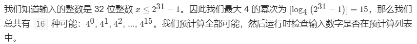
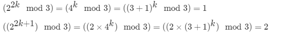
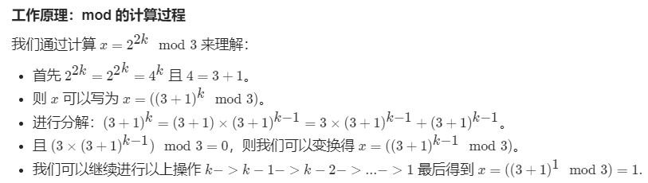

[TOC]

### 位运算

#### **基本原理**

0s 表示一串 0，1s 表示一串 1。

```
x ^ 0s = x      x & 0s = 0      x | 0s = x
x ^ 1s = ~x     x & 1s = x      x | 1s = 1s
x ^ x = 0       x & x = x       x | x = x
```

- 利用 x ^ 1s = \~x 的特点，可以将位级表示翻转；利用 x ^ x = 0 的特点，可以将三个数中重复的两个数去除，只留下另一个数。
- 利用 x & 0s = 0 和 x & 1s = x 的特点，可以实现掩码操作。一个数 num 与 mask：00111100 进行位与操作，只保留 num 中与 mask 的 1 部分相对应的位。
- 利用 x | 0s = x 和 x | 1s = 1s 的特点，可以实现设值操作。一个数 num 与 mask：00111100 进行位或操作，将 num 中与 mask 的 1 部分相对应的位都设置为 1。

位与运算技巧：

- n&(n-1) 去除 n 的位级表示中最低的那一位。例如对于二进制表示 10110100，减去 1 得到 10110011，这两个数相与得到 10110000。
- n&(-n) 得到 n 的位级表示中最低的那一位。-n 得到 n 的反码加 1，对于二进制表示 10110100，-n 得到 01001100，相与得到 00000100。
- n-n&(\~n+1) 去除 n 的位级表示中最高的那一位。

移位运算：

- \>\> n 为算术右移，相当于除以 2<sup>n</sup>；
- \>\>\> n 为无符号右移，左边会补上 0。
- &lt;&lt; n 为算术左移，相当于乘以 2<sup>n</sup>。

** mask 计算** 

要获取 111111111，将 0 取反即可，\~0。

要得到只有第 i 位为 1 的 mask，将 1 向左移动 i-1 位即可，1&lt;&lt;(i-1) 。例如 1&lt;&lt;4 得到只有第 5 位为 1 的 mask ：00010000。

要得到 1 到 i 位为 1 的 mask，1&lt;&lt;(i+1)-1 即可，例如将 1&lt;&lt;(4+1)-1 = 00010000-1 = 00001111。

要得到 1 到 i 位为 0 的 mask，只需将 1 到 i 位为 1 的 mask 取反，即 \~(1&lt;&lt;(i+1)-1)。

说明：位运算的题目基本上都带有靠经验积累才会做的特征，也就是准备阶段需要做足够多的题，面试时才会有良好的感觉。


#### 15.二进制中1的个数【简单】

##### 1. 题目

请实现一个函数，输入一个整数，输出该数二进制表示中 1 的个数。例如，把 9 表示成二进制是 1001，有 2 位是 1。因此，如果输入 9，则该函数输出 2。

```java
输入：00000000000000000000000000001011
输出：3
解释：输入的二进制串 00000000000000000000000000001011 中，共有三位为 '1'。
```

链接：https://leetcode-cn.com/problems/er-jin-zhi-zhong-1de-ge-shu-lcof

##### 2. 题解

直接用位运算的方式，这是一个**模板**，记住！！！

```go
func hammingWeight(num uint32) int {
    var res int
    for num != 0{
        // 与1相与，如果是1则是1
        if num & 1 == 1{
            res++
        }
        //往右移位1位直到num为0
        num = num >> 1
    }
    return res
}
```


#### [461. 汉明距离【简单】](https://leetcode-cn.com/problems/hamming-distance/)

##### 1. 题目

两个整数之间的汉明距离指的是这两个数字对应**二进制位不同的位置的数目**。给出两个整数 x 和 y，计算它们之间的汉明距离。

示例:

```java
输入: x = 1, y = 4  输出: 2
解释:
1   (0 0 0 1)
4   (0 1 0 0)
       ↑   ↑
```

上面的箭头指出了对应二进制位不同的位置。

**链接：**https://leetcode-cn.com/problems/hamming-distance/

##### 2. 题解

这个题也就是利用上一题中的模板求解！

```go
func hammingDistance(x int, y int) int {
    var res int
    // 两个数字相异或，如果不同就为1
    num := x ^ y
    // 下面就是求二进制中1的个数的模板
    for num != 0{
        if num & 1 == 1{
            res ++
        }
        num = num >> 1
    }
    return res
}
```


#### [136. 只出现一次的数字【简单】](https://leetcode-cn.com/problems/single-number/)

##### 1. 题目

给定一个非空整数数组，除了某个元素只出现一次以外，其余每个元素均出现两次。找出那个只出现了一次的元素。

说明：你的算法应该具有线性时间复杂度。 你可以**不使用额外空间**来实现吗？

```java
输入: [2,2,1] 输出: 1
输入: [4,1,2,1,2] 输出: 4
```

**链接：**https://leetcode-cn.com/problems/single-number/

##### 2. 题解

###### (1) 位运算法

使用异或运算，如果**两个数相同，则其异或结果为 0**。如果把全部数字都做异或，最后的结果就是只出现一次的数字。

```go
func singleNumber(nums []int) int {
    var res int 
    for i := 0; i < len(nums); i++{
        res = res ^ nums[i]
    }
    return res
}
```

大佬写法：

```go
func singleNumber(nums []int) int {
    for i := 1; i < len(nums); i++{
        nums[0] ^= nums[i]
    }
    return nums[0]
}
```


#### 268. 找出数组中缺失的那个数

##### 1.题目

```html
Input: [3,0,1]
Output: 2
```

题目描述：数组元素在 0-n 之间，但是有一个数是缺失的，要求找到这个缺失的数。

**链接：**https://leetcode-cn.com/problems/missing-number/

##### 2.题解

```go
func missingNumber(nums []int) int {
    //  期待的和
    exceptedSum := len(nums) * (len(nums) + 1) / 2
    // 计算实际的全部和
    actualSum := 0
    for _, v := range nums{
        actualSum += v
    }
    return exceptedSum - actualSum
}
```


#### 260. 只出现一次的数字III

##### 1.题目

给定一个整数数组 `nums`，其中恰好有两个元素只出现一次，其余所有元素均出现两次。 找出只出现一次的那两个元素。

**示例 :**

```
输入: [1,2,1,3,2,5]
输出: [3,5]
```

**链接：**https://leetcode-cn.com/problems/single-number-iii/

##### 2.题解

两个不相等的元素在位级表示上必定会有一位存在不同。

将数组的所有元素异或得到的结果为不存在重复的两个元素异或的结果。

**diff &= -diff** 得到出 **diff 最右侧不为 0 的位**，也就是不存在重复的两个元素在位级表示上最右侧不同的那一位，利用这一位就可以将两个元素区分开来。

- 使用异或运算可以帮助我们消除出现两次的数字；我们计算 `bitmask ^= x`，则 `bitmask` 留下的就是出现奇数次的位。

    

- `x & (-x)` 是保留位中最右边 `1` ，且将其余的 `1` 设位 `0` 的方法。

    

**算法：**

首先计算 `bitmask ^= x`，则 `bitmask` 不会保留出现两次数字的值，因为相同数字的异或值为 `0`。但是 `bitmask` 会保留只出现一次的两个数字（`x` 和 `y`）之间的差异。


我们可以直接从 `bitmask` 中提取 `x` 和 `y` 吗？不能，但是我们可以用 `bitmask` 作为标记来分离 `x` 和 `y`。

我们通过 `bitmask & (-bitmask)` 保留 `bitmask` 最右边的 `1`，这个 `1` 要么来自 `x`，要么来自 `y`。


当我们找到了 `x`，那么 `y = bitmask^x`

```go
func singleNumber(nums []int) []int {
    diff := 0
    //得到只出现一次的两个数字之间的差异
    for _, num := range nums{
        diff ^= num
    }
    diff &= -diff //得到最右不为0的一位，来自于x或者y
    res := make([]int, 2)
    for _, num := range nums{
        if num & diff == 0{
            res[0] ^= num
        }else{
            res[1] ^= num
        }
    }
    return res
}
```

**更容易理解的说法：**

- 任何一个数字异或它自己其结果都等于0
- 所有数字异或后，出现偶数次的数字都抵消了，只剩下两个出现一次的数
- 假设两个数字为`a`和`b`，最后异或的结果为`c`
- 我们这时候，只要知道c对应的二进制数中某一个位为1的位数N，比如十进制7二进制表示形式为111，那么可取N=1/2/3，然后将c与数组中第N位为1的数挨个进行异或，异或结果就是a，b中一个，然后用c异或其中一个数，就可以求出另外一个数了。

**通过上述方法为什么就能得到问题的解呢？**

- `c`中第`N`位为1表示`a`或`b`中有一个数的第`N`位也为1，假设该数为`a`
- 如下图所示，当将`c`与数组中第`N`位为1的数进行异或时，也就是将`x`与`a`外加上其他第`N`位为1的出现过偶数次的数进行异或，化简即为`x`与`a`异或，结果即为`b`

```
c = a ^ b
d ^ d ^ e ^ e ... a ^ c = a ^ c = a ^ a ^ b = b
```


#### 190. 翻转一个数的比特位

##### 1.题目

颠倒给定的 32 位无符号整数的二进制位.

```
输入: 00000010100101000001111010011100
输出: 00111001011110000010100101000000
解释: 输入的二进制串 00000010100101000001111010011100 表示无符号整数 43261596，
     因此返回 964176192，其二进制表示形式为 00111001011110000010100101000000。
```

##### 2.题解

###### (1)逐位颠倒

要检索整数 `n` 中最右边的位，可以应用模运算（即 `n%2`）或与运算（即 `n &1`）


关键思想是，对于位于索引 `i` 处的位，在反转之后，其位置应为 `31-i`（注：索引从零开始）

- 我们从右到左遍历输入整数的位字符串（即 `n=n>>1`）。要检索整数的最右边的位，我们应用与运算（`n&1`）
- 对于每个位，我们将其反转到正确的位置（即`（n&1）<<power`）。然后添加到最终结果
- 当 `n==0` 时，我们终止迭代

```go
func reverseBits(num uint32) uint32 {
    res := uint32(0)
    power := uint32(31)
    for num != 0 {
        //将num的每一位翻转到正确位置
        res += (num & 1) << power
        num = num >> 1
        power -= 1
    }
    return res
}
```

**复杂度分析:**

- 时间复杂度：O(log2*N*)，在算法中，我们有一个循环来迭代输入的最高非零位，即log2*N*。

- 空间复杂度：O(1)，因为不管输入是什么，内存的消耗是固定的。

###### (2)带记忆化的按字节颠倒

每字节（8 位的比特位）反转可能更有效。由于该题的输入是固定的 32 位整数，所以在本题中不一定是这样的。但是在处理长字节流时，它会变得更有效。


使用字节作为迭代单位的另一个隐含优点是，我们可以使用记忆化技术，可以缓存先前计算的值，以避免重新计算。

**算法：**

- 我们按字节遍历整数。为了检索整数中最右边的字节，我们应用位掩码为 `11111111` 的与操作（即 `n&0xff`）。
- 对于每个字节，首先我们通过一个名为 `reverseByte(byte)` 的函数来反转字节中的位。然后将反转的结果添加到答案中。
- 对于函数 `reverseByte(byte)`，我们使用记忆化技术，它缓存函数的结果并直接返回结果，以便将来遇到相同的输入。

注意，可以选择更小的单位而不是字节，例如 4 位的单位，这将需要更多的计算来交换更少的缓存空间。记忆化技术是空间和计算时间之间的权衡。

```go
func reverseByte(b uint32, cache map[uint32]uint64) uint64 {
    value, ok := cache[b]
    if ok {
        return value
    }
    value = (uint64(b) * 0x0202020202 & 0x010884422010) % 1023
    cache[b] = value
    return value
}
func reverseBits(num uint32) uint32 {
    ret := uint64(0)
    power := uint64(24)
    var cache = map[uint32]uint64{}

    for num != 0 {
        ret += reverseByte(num & 0xff, cache) << power
        num = num >> 8
        power -= 8
    }
    return uint32(ret)
}
```

**复杂度分析**:

- 时间复杂度：O(1)。尽管我们在算法中有一个循环，但是无论输入是什么，迭代次数都是固定的，因为在我们的问题中整数是固定大小（32 位）的。
- 空间复杂度：O(1)，同样，尽管我们使用了缓存来保留反转字节的结果，但缓存中的大小总数限制为 2^8=256。

###### (3)只使用位操作

在方法 2 中，我们展示了一个关于如何在不使用循环语句的情况下反转字节中的位的示例。在面试过程中，你可能会被要求在不使用循环的情况下反转整个 32 位。在这里，我们提出了一种只使用位操作的解决方案。

可以看作是一种分治的策略，我们通过掩码将 32 位整数划分成具有较少位的块，然后通过将每个块反转，最后将每个块的结果合并得到最终结果。

在下图中，我们演示如何使用上述思想反转两个位。同样的，这个想法可以应用到比特块上。


**算法：**

- 首先，我们将原来的 32 位分为 2 个 16 位的块。
- 然后我们将 16 位块分成 2 个 8 位的块。
- 然后我们继续将这些块分成更小的块，直到达到 1 位的块。
- 在上述每个步骤中，我们将中间结果合并为一个整数，作为下一步的输入。

```go
func reverseBits(num uint32) uint32 {
    num = (num >> 16) | (num << 16)
    num = ((num & 0xff00ff00) >> 8) | ((num & 0x00ff00ff) << 8)
    num = ((num & 0xf0f0f0f0) >> 4) | ((num & 0x0f0f0f0f) << 4)
    num = ((num & 0xcccccccc) >> 2) | ((num & 0x33333333) << 2)
    num = ((num & 0xaaaaaaaa) >> 1) | ((num & 0x55555555) << 1)
    return num
}
```

**复杂度分析**

- 时间复杂度：O(1)，没有使用循环。
- 空间复杂度：O(1)，没有使用变量。


#### 6. 不用额外变量交换两个整数

如果给定**整数 a 和 b**，用以下三行代码即可交换 a 和b 的值

```java
a = a ^ b;
b = a ^ b;
a = a ^ b;
```

假设 a 异或 b 的结果记为 c，**c 就是 a 整数位信息和 b 整数位信息的所有不同信息**。

- 比如：a = 4 = 100，b = 3 = 011，a^b = c = 111

a 异或 c 的结果就是 b，比如：a = 4 = 100，c = 111，a^c = 011 = 3 = b

b 异或c 的结果就是 a，比如：b = 3 = 011，c = 111，b^c = 100 = 4 = a


#### 231. 判断一个数是不是 2 的 n 次方

##### 1.题目

给定一个整数，编写一个函数来判断它是否是 2 的幂次方。

```
输入: 1
输出: true
解释: 20 = 1
```

**链接：**https://leetcode-cn.com/problems/power-of-two/

##### 2.题解

###### (1)二进制个数

统计二进制中1的个数，二进制表示只有一个 1 存在。

###### (2)位运算

利用 1000 & 0111 == 0 这种性质，得到以下解法：

```go
func isPowerOfTwo(n int) bool {
    return n > 0 && (n & (n-1)) == 0
}
```


#### 342.  判断一个数是不是 4 的 n 次方

##### 1.题目

给定一个整数 (32 位有符号整数)，请编写一个函数来判断它是否是 4 的幂次方。

```
输入: 16
输出: true
```

##### 2.题解

各种骚操作：https://leetcode-cn.com/problems/power-of-four/solution/4de-mi-by-leetcode/

这种数在二进制表示中有且只有一个奇数位为 1，例如 16（10000）。

也可以使用正则表达式进行匹配。

###### (1)最简单

```go
func isPowerOfFour(num int) bool {
    if num == 0{
        return false
    }
    for num % 4 == 0{
        num /= 4
    }
    return num == 1
}
```

###### (2)暴力法 + 预计算



###### (3)数学运算


###### (4)位操作

- 我们首先检查 `num` 是否为 `2` 的幂：`x > 0 and x & (x - 1) == 0`
- 现在的问题是区分 2 的偶数幂（当 x是 `4` 的幂时）和 2 的奇数幂（当 x不是 4 的幂时）。在二进制表示中，这两种情况都只有一位为 1，其余为 0

###### (5)位运算 + 数学运算

- 我们首先检查 `num` 是否为 `2` 的幂：`x > 0 and x & (x - 1) == 0`

- 下一步是考虑 a=2k和 a=2k+1两种情况，对 x对 `3` 进行取模：

    

- 若 x为 `2` 的幂且 `x%3 == 1`，则 x为 `4` 的幂




#### 693. 交替位二进制数

##### 1.题目

给定一个正整数，检查它的二进制表示是否总是 0、1 交替出现：换句话说，就是二进制表示中相邻两位的数字永不相同。

```html
输入：n = 5
输出：true
解释：5 的二进制表示是：101
```

**链接：**https://leetcode-cn.com/problems/binary-number-with-alternating-bits/

##### 2.题解

###### (1)转换成字符串

让我们把给定的数字转换成一个二进制数字串。然后，我们应该简单地检查两个相邻的数字是否相同。

###### (2)除以2

我们可以通过 n%2 和 n/2 操作获得最后一位和其余的位。如果最后一位等于剩余的最后一位，那么两个相邻的位具有相同的值，则答案是 False 的，反之，答案是 True 的

```java
func hasAlternatingBits(n int) bool {
    a := n ^ (n >> 1)
    return a & (a + 1) == 0
}
```


#### 476. 求一个数的补码

##### 1.题目

给定一个正整数，输出它的补数。补数是对该数的二进制表示取反。

```html
输入: 5
输出: 2
解释: 5 的二进制表示为 101（没有前导零位），其补数为 010。所以你需要输出 2 。
```

题目描述：不考虑二进制表示中的首 0 部分。

**链接：**https://leetcode-cn.com/problems/number-complement/

##### 2.题解

5的二进制是101 取反就是010 实际上就是101和111的异或运算

111的求解过程就是获取5最高为1总位数3的全为1的的过程

```go
func findComplement(num int) int {
    temp := num
    n := 1
    for temp > 0{
        n = n << 1
        temp = temp >> 1
    } 
    n = n - 1 //得到全为1的位数
    return num ^ n //与原来数字异或即可得到补数
}
```


#### 371. 不用运算符实现整数的加法

##### 1.题目

**不使用**运算符 `+` 和 `-` ，计算两整数 `a` 、`b` 之和。

```
输入: a = 1, b = 2
输出: 3
```

##### 2.题解

a ^ b 表示没有考虑进位的情况下两数的和，(a & b) << 1 就是进位。

递归会终止的原因是 (a & b) << 1 最右边会多一个 0，那么继续递归，进位最右边的 0 会慢慢增多，最后进位会变为 0，递归终止。

- a^b：得到不含进位之和
- (a & b)<<1：进位
- 只要进位不为零，则迭代；否则返回。

```go
func getSum(a int, b int) int {
    if b != 0{ //只要进位不为0
        return getSum(a^b, (a&b) << 1) //不含进位之和，进位
    }
    return a 
}
```


#### 318. 最大单词长度乘积

##### 1.题目

给定一个字符串数组 `words`，找到 `length(word[i]) * length(word[j])` 的最大值，并且这两个单词不含有公共字母。你可以认为每个单词只包含小写字母。如果不存在这样的两个单词，返回 0

```html
输入: ["abcw","baz","foo","bar","xtfn","abcdef"]
输出: 16 
解释: 这两个单词为 "abcw", "xtfn"。
```

##### 2.题解

###### (1)暴力法

检查一个字符串中是否包含另一个字符串中的任意字符，可以利用 strings 包中的 strings.ContainsAny(s1,s2)函数

```go
func maxProduct(words []string) int {
    lenth := len(words)
    var res = 0
    for i:=0;i<lenth-1;i++{
        for j:=i+1;j<lenth;j++{
            if !strings.ContainsAny(words[i],words[j]) && res < len(words[i]) * len(words[j]){
                res = len(words[i]) * len(words[j])
            }
        }
    }
    return res
}
```

###### (2)位操作+预计算

```go
func maxProduct(words []string) int {
    if words == nil || len(words) < 2{
        return 0
    }
    length := len(words)
    masks := make([]int, length)
    for i, word := range words[:]{
        for _, c := range word{
            masks[i] |= 1 << uint(c - 'a') //预存下来每一个
        }
    }
    max := 0
    for i := 0; i < length; i++{
        for j := i + 1; j < length; j++ {
            if (masks[i] & masks[j]) == 0 {
				prod := len(words[i]) * len(words[j])
				if prod > max {
					max = prod
				}
			}
        }
    }
    return max
}
```


#### 338. 统计从 0 \~ n 每个数的二进制表示中 1 的个数

##### 1.题目

给定一个非负整数 **num**。对于 **0 ≤ i ≤ num** 范围中的每个数字 **i** ，计算其二进制数中的 1 的数目并将它们作为数组返回。

```
输入: 2
输出: [0,1,1]
```

```
输入: 5
输出: [0,1,1,2,1,2]
```

**链接：**https://leetcode-cn.com/problems/counting-bits/

##### 2.题解

对于数字 6(110)，它可以看成是 4(100) 再加一个 2(10)，因此 dp[i] = dp[i&(i-1)] + 1;

```go
func countBits(num int) []int {
    res := make([]int, num + 1)
    for i := 1; i <= num; i++{
        res[i] = res[i & (i - 1)] + 1
    }
    return res
}
```


