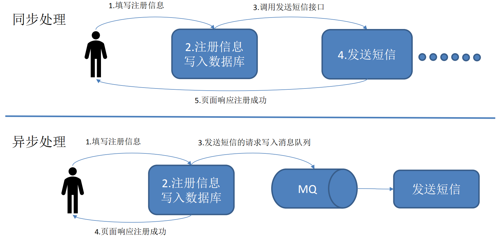
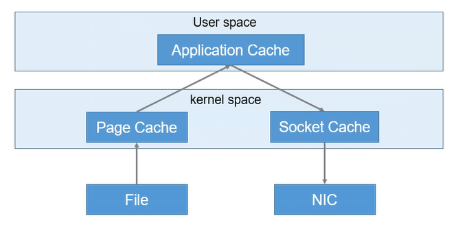
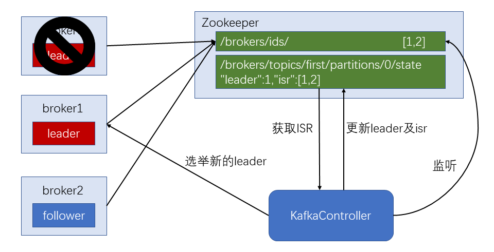

<!-- TOC -->

- [深入浅出 Kafka（一）初识](#深入浅出-kafka一初识)
    - [一、定义](#一定义)
    - [二、消息队列（Message Queue）](#二消息队列message-queue)
        - [传统消息队列的应用场景](#传统消息队列的应用场景)
        - [使用消息队列的好处](#使用消息队列的好处)
        - [消息队列的两种模式](#消息队列的两种模式)
            - [1. 点对点（Queue，不可重复消费）](#1-点对点queue不可重复消费)
            - [2. 发布/订阅（Topic，可以重复消费）](#2-发布订阅topic可以重复消费)
    - [三、Kafka基础架构](#三kafka基础架构)
    - [参考资料](#参考资料)

<!-- /TOC -->

# 深入浅出 Kafka（一）初识

> 开始前，可以阅读 Kafka 官方介绍：[Kafka 中文文档 - ApacheCN](http://kafka.apachecn.org/intro.html)


## 一、定义

Kafka 是一个分布式的基于发布/订阅模式的消息队列（Message Queue），主要应用于大数据实时处理领域。 


## 二、消息队列（Message Queue）

### 传统消息队列的应用场景




### 使用消息队列的好处 

- 解耦 
    - 允许你独立的扩展或修改两边的处理过程，只要确保它们遵守同样的接口约束。 

- 可恢复性 
    - 系统的一部分组件失效时，不会影响到整个系统。消息队列降低了进程间的耦合度，所以即使一个处理消息的进程挂掉，加入队列中的消息仍然可以在系统恢复后被处理。 

- 缓冲
    - 有助于控制和优化数据流经过系统的速度，解决生产消息和消费消息的处理速度不一致的情况。 

- 灵活性 & 峰值处理能力
    - 在访问量剧增的情况下，应用仍然需要继续发挥作用，但是这样的突发流量并不常见。如果为以能处理这类峰值访问为标准来投入资源随时待命无疑是巨大的浪费。使用消息队列能够使关键组件顶住突发的访问压力，而不会因为突发的超负荷的请求而完全崩溃。 

- 异步通信 
    - 很多时候，用户不想也不需要立即处理消息。消息队列提供了异步处理机制，允许用户把一个消息放入队列，但并不立即处理它。想向队列中放入多少消息就放多少，然后在需要的时候再去处理它们。


### 消息队列的两种模式

Java消息服务（Java Message Service，JMS）规范目前支持两种消息模型：点对点（point to point， queue）和发布/订阅（publish/subscribe，topic）。

#### 1. 点对点（Queue，不可重复消费）

消息生产者生产消息发送到queue中，然后消息消费者从queue中取出并且消费消息。
消息被消费以后，queue中不再有存储，所以消息消费者不可能消费到已经被消费的消息。Queue支持存在多个消费者，但是对一个消息而言，只会有一个消费者可以消费。


#### 2. 发布/订阅（Topic，可以重复消费）

Pub/Sub发布订阅（广播）：使用topic作为通信载体

消息生产者（发布）将消息发布到topic中，同时有多个消息消费者（订阅）消费该消息。和点对点方式不同，发布到topic的消息会被所有订阅者消费。

topic实现了发布和订阅，当你发布一个消息，所有订阅这个topic的服务都能得到这个消息，所以从1到N个订阅者都能得到一个消息的拷贝。


## 三、Kafka基础架构


- **Producer**：消息生产者，就是向kafka broker发消息的客户端；

- **Consumer**：消息消费者，向kafka broker取消息的客户端；

- **Consumer Group(CG)**：消费者组，由多个consumer组成。****消费者组内每个消费者负责消费不同分区的数据，一个分区只能由一个消费者消费；消费者组之间互不影响。所有的消费者都属于某个消费者组，即消费者组是逻辑上的一个订阅者。

- **Broker** 一台kafka服务器就是一个broker。一个集群由多个broker组成。一个broker可以容纳多个topic。

- **Topic** 可以理解为一个队列，**生产者和消费者面向的都是一个topic**；

- **Partidion** 为了实现扩展性，一个非常大的topic可以分布到多个broker（即服务器）上，**一个topic可以分为多个partition**，每个partition是一个有序的队列；（分区主要使用来实现负载均衡）

- **Replica** 副本，为保证集群中的某个节点发生故障时，该节点上的partition数据不丢失，且kafka仍然能够继续工作，kafka提供了副本机制，一个topic的每个分区都有若干个副本，一个**leader**和若干个**follower**。

- **Leader** 每个分区多个副本的“主”，生产者发送数据的对象，以及消费者消费数据的对象都是leader。

- **Follower** 每个分区多个副本中的“从”，实时从leader中同步数据，保持和leader数据的同步。leader发生故障时，某个follower会成为新的follower。


## 参考资料

- [Note/Kafka.md at master · Tiankx1003/Note](https://github.com/Tiankx1003/Note/blob/master/Markdown/HadoopEcosys/Kafka.md)


<!-- TOC -->

- [深入浅出 Kafka（二）单节点部署](#深入浅出-kafka二单节点部署)
    - [系统环境](#系统环境)
    - [一、宿主机部署](#一宿主机部署)
        - [安装 Zookeeper（可选择，自带或是独立的 zk 服务）](#安装-zookeeper可选择自带或是独立的-zk-服务)
        - [下载 Kafka](#下载-kafka)
        - [启动 Zookeeper 服务（可选择，自带或是独立的 zk 服务）](#启动-zookeeper-服务可选择自带或是独立的-zk-服务)
        - [启动 Kafka 服务](#启动-kafka-服务)
        - [创建 Topic](#创建-topic)
        - [查看 Topic](#查看-topic)
        - [产生消息](#产生消息)
        - [消费消息](#消费消息)
        - [删除 Topic](#删除-topic)
        - [查看描述 Topic 信息](#查看描述-topic-信息)
    - [二、容器化部署](#二容器化部署)
        - [1 Zookeeper + 1 Kafka](#1-zookeeper--1-kafka)
        - [与容器内的开发环境交互](#与容器内的开发环境交互)
    - [三、Kafka 配置说明](#三kafka-配置说明)
    - [参考资料](#参考资料)

<!-- /TOC -->


# 深入浅出 Kafka（二）单节点部署

> 单节点部署环境，主要用于学习与调试。集群化部署方案，请访问「深入浅出 Kafka（三）集群化部署」；若部署完单节点想进一步学习，请转向「深入浅出 Kafka（四）架构深入」。


## 系统环境

- CentOS 7.4
- Kafka 2.11


## 一、宿主机部署

### 安装 Zookeeper（可选择，自带或是独立的 zk 服务）

下载

```shell
wget https://mirrors.huaweicloud.com/apache/zookeeper/zookeeper-3.4.10/zookeeper-3.4.10.tar.gz
```

启动 

```SHELL
sh zkServer.sh start
```


### 下载 Kafka

从[官网下载](https://kafka.apache.org/downloads)Kafka 安装包，解压安装，或直接使用命令下载。

```shell
wget https://mirrors.huaweicloud.com/apache/kafka/1.1.0/kafka_2.12-1.1.0.tgz
```

解压安装

```shell
tar -zvxf kafka_2.11-1.0.0.tgz -C /usr/local/
cd /usr/local/kafka_2.11-1.0.0/
```

修改配置文件

```
vim config/server.properties
```

修改其中

```
log.dirs=data/kafka-logs
listeners=PLAINTEXT://192.168.72.133:9092
```

> 另外 advertised.listeners，是暴露给外部的 listeners，如果没有设置，会用 listeners


### 启动 Zookeeper 服务（可选择，自带或是独立的 zk 服务）

使用安装包中的脚本启动单节点 Zookeeper 实例：

```
bin/zookeeper-server-start.sh -daemon config/zookeeper.properties
```


### 启动 Kafka 服务

使用 kafka-server-start.sh 启动 kafka 服务

前台启动

```
bin/kafka-server-start.sh config/server.properties
```

后台启动

```
bin/kafka-server-start.sh -daemon config/server.properties
```


### 创建 Topic

使用 kafka-topics.sh 创建但分区单副本的 topic test

```
bin/kafka-topics.sh --create --zookeeper localhost:2181 --replication-factor 1 --partitions 1 --topic test
```


### 查看 Topic

```
bin/kafka-topics.sh --list --zookeeper localhost:2181
```


### 产生消息

使用 kafka-console-producer.sh 发送消息

```
bin/kafka-console-producer.sh --broker-list localhost:9092 --topic test
```


### 消费消息

使用 kafka-console-consumer.sh 接收消息并在终端打印

```
bin/kafka-console-consumer.sh --zookeeper localhost:2181 --topic test --from-beginning
```


### 删除 Topic

```
bin/kafka-topics.sh --delete --zookeeper localhost:2181 --topic test
```


### 查看描述 Topic 信息

```shell
[root@localhost kafka_2.11-1.0.0]# bin/kafka-topics.sh --describe --zookeeper 
Topic:test      PartitionCount:1        ReplicationFactor:1     Configs:
        Topic: test     Partition: 0    Leader: 1       Replicas: 1     Isr: 1
```

第一行给出了所有分区的摘要，每个附加行给出了关于一个分区的信息。 由于我们只有一个分区，所以只有一行。

- Leader
    - 是负责给定分区的所有读取和写入的节点。 每个节点将成为分区随机选择部分的领导者。

- Replicas
    - 是复制此分区日志的节点列表，无论它们是否是领导者，或者即使他们当前处于活动状态。

- Isr
    - 是一组 “同步” 副本。这是复制品列表的子集，当前活着并被引导到领导者。


## 二、容器化部署

　　在上述的篇幅中，实现了宿主机上部署单节点环境（1 Zookeeper + 1 Kafka）。但是在不同环境配置上具有差异性，初学者入门需要进行复杂的配置，可能会造成配置失败。

　　使用 Docker 容器化部署可以实现开箱即用，免去了很多安装配置的时间。

### 1 Zookeeper + 1 Kafka

　　以 [wurstmeister/kafka - Docker Hub](https://hub.docker.com/r/wurstmeister/kafka/) 为例，使用 docker-compose 运行一个只有一个 ZooKeeper node 和一个 Kafka broker 的开发环境：

```yaml
version: '2'
services:
  zoo1:
    image: wurstmeister/zookeeper
    restart: unless-stopped
    hostname: zoo1
    ports:
      - "2181:2181"
    container_name: zookeeper

  # kafka version: 1.1.0
  # scala version: 2.12
  kafka1:
    image: wurstmeister/kafka
    ports:
      - "9092:9092"
    environment:
      KAFKA_ADVERTISED_HOST_NAME: localhost
      KAFKA_ADVERTISED_LISTENERS: PLAINTEXT://192.168.72.133:9092
      KAFKA_ZOOKEEPER_CONNECT: "zoo1:2181"
      KAFKA_BROKER_ID: 1
      KAFKA_OFFSETS_TOPIC_REPLICATION_FACTOR: 1
      KAFKA_CREATE_TOPICS: "stream-in:1:1,stream-out:1:1"
    depends_on:
      - zoo1
    container_name: kafka
```

　　这里利用了 wurstmeister/kafka 提供的环境参数 `KAFKA_CREATE_TOPICS` 使Kafka运行后自动创建 topics。


### 与容器内的开发环境交互

　　可以使用 `docker exec` 命令直接调用 kafka 容器内的脚本来进行创建/删除 topic，启动 console producer 等等操作。

　　如果本地存有与容器内相同的 Kafka 版本文件，也可以直接使用本地脚本文件。如上述 docker-compose.yml 文件所示，kafka1 的 hostname 即是 kafka1，端口为 9092，通过 kafka1:9092 就可以连接到容器内的 Kafka 服务。


**列出所有 topics** (在本地 kafka 路径下)

```shell
$ bin/kafka-topics.sh --zookeeper localhost:2181 --list
```

**列出所有 Kafka brokers**

```shell
$ docker exec zookeeper bin/zkCli.sh ls /brokers/ids
```


## 三、Kafka 配置说明

详细：[server.properties - Kafka 中文文档 - ApacheCN](http://kafka.apachecn.org/documentation.html#configuration)

```properties
# Licensed to the Apache Software Foundation (ASF) under one or more
# contributor license agreements.  See the NOTICE file distributed with
# this work for additional information regarding copyright ownership.
# The ASF licenses this file to You under the Apache License, Version 2.0
# (the "License"); you may not use this file except in compliance with
# the License.  You may obtain a copy of the License at
#
#    http://www.apache.org/licenses/LICENSE-2.0
#
# Unless required by applicable law or agreed to in writing, software
# distributed under the License is distributed on an "AS IS" BASIS,
# WITHOUT WARRANTIES OR CONDITIONS OF ANY KIND, either express or implied.
# See the License for the specific language governing permissions and
# limitations under the License.

# see kafka.server.KafkaConfig for additional details and defaults

############################# Server Basics #############################

# The id of the broker. This must be set to a unique integer for each broker.
broker.id=0

############################# Socket Server Settings #############################

# The address the socket server listens on. It will get the value returned from 
# java.net.InetAddress.getCanonicalHostName() if not configured.
#   FORMAT:
#     listeners = listener_name://host_name:port
#   EXAMPLE:
#     listeners = PLAINTEXT://your.host.name:9092
listeners=PLAINTEXT://192.168.72.133:9092

# Hostname and port the broker will advertise to producers and consumers. If not set, 
# it uses the value for "listeners" if configured.  Otherwise, it will use the value
# returned from java.net.InetAddress.getCanonicalHostName().
#advertised.listeners=PLAINTEXT://your.host.name:9092

# Maps listener names to security protocols, the default is for them to be the same. See the config documentation for more details
#listener.security.protocol.map=PLAINTEXT:PLAINTEXT,SSL:SSL,SASL_PLAINTEXT:SASL_PLAINTEXT,SASL_SSL:SASL_SSL

# The number of threads that the server uses for receiving requests from the network and sending responses to the network
num.network.threads=3

# The number of threads that the server uses for processing requests, which may include disk I/O
num.io.threads=8

# The send buffer (SO_SNDBUF) used by the socket server
socket.send.buffer.bytes=102400

# The receive buffer (SO_RCVBUF) used by the socket server
socket.receive.buffer.bytes=102400

# The maximum size of a request that the socket server will accept (protection against OOM)
socket.request.max.bytes=104857600


############################# Log Basics #############################

# A comma separated list of directories under which to store log files
log.dirs=/tmp/kafka-logs

# The default number of log partitions per topic. More partitions allow greater
# parallelism for consumption, but this will also result in more files across
# the brokers.
num.partitions=1

# The number of threads per data directory to be used for log recovery at startup and flushing at shutdown.
# This value is recommended to be increased for installations with data dirs located in RAID array.
num.recovery.threads.per.data.dir=1

############################# Internal Topic Settings  #############################
# The replication factor for the group metadata internal topics "__consumer_offsets" and "__transaction_state"
# For anything other than development testing, a value greater than 1 is recommended for to ensure availability such as 3.
offsets.topic.replication.factor=1
transaction.state.log.replication.factor=1
transaction.state.log.min.isr=1

############################# Log Flush Policy #############################

# Messages are immediately written to the filesystem but by default we only fsync() to sync
# the OS cache lazily. The following configurations control the flush of data to disk.
# There are a few important trade-offs here:
#    1. Durability: Unflushed data may be lost if you are not using replication.
#    2. Latency: Very large flush intervals may lead to latency spikes when the flush does occur as there will be a lot of data to flush.
#    3. Throughput: The flush is generally the most expensive operation, and a small flush interval may lead to excessive seeks.
# The settings below allow one to configure the flush policy to flush data after a period of time or
# every N messages (or both). This can be done globally and overridden on a per-topic basis.

# The number of messages to accept before forcing a flush of data to disk
#log.flush.interval.messages=10000

# The maximum amount of time a message can sit in a log before we force a flush
#log.flush.interval.ms=1000

############################# Log Retention Policy #############################

# The following configurations control the disposal of log segments. The policy can
# be set to delete segments after a period of time, or after a given size has accumulated.
# A segment will be deleted whenever *either* of these criteria are met. Deletion always happens
# from the end of the log.

# The minimum age of a log file to be eligible for deletion due to age
log.retention.hours=168

# A size-based retention policy for logs. Segments are pruned from the log unless the remaining
# segments drop below log.retention.bytes. Functions independently of log.retention.hours.
#log.retention.bytes=1073741824

# The maximum size of a log segment file. When this size is reached a new log segment will be created.
log.segment.bytes=1073741824

# The interval at which log segments are checked to see if they can be deleted according
# to the retention policies
log.retention.check.interval.ms=300000

############################# Zookeeper #############################

# Zookeeper connection string (see zookeeper docs for details).
# This is a comma separated host:port pairs, each corresponding to a zk
# server. e.g. "127.0.0.1:3000,127.0.0.1:3001,127.0.0.1:3002".
# You can also append an optional chroot string to the urls to specify the
# root directory for all kafka znodes.
zookeeper.connect=localhost:2181

# Timeout in ms for connecting to zookeeper
zookeeper.connection.timeout.ms=6000


############################# Group Coordinator Settings #############################

# The following configuration specifies the time, in milliseconds, that the GroupCoordinator will delay the initial consumer rebalance.
# The rebalance will be further delayed by the value of group.initial.rebalance.delay.ms as new members join the group, up to a maximum of max.poll.interval.ms.
# The default value for this is 3 seconds.
# We override this to 0 here as it makes for a better out-of-the-box experience for development and testing.
# However, in production environments the default value of 3 seconds is more suitable as this will help to avoid unnecessary, and potentially expensive, rebalances during application startup.
group.initial.rebalance.delay.ms=0
```

- advertised.listeners and listeners 两个配置文件的区别：[kafka - advertised.listeners and listeners - fxjwind - 博客园](https://www.cnblogs.com/fxjwind/p/6225909.html?utm_source=tuicool&utm_medium=referral)


## 参考资料

- [CentOS7 下 Kafka 的安装介绍 - 个人文章 - SegmentFault 思否](https://segmentfault.com/a/1190000012990954)

- 非常重要：[kafka 踩坑之消费者收不到消息 - kris - CSDN 博客](https://blog.csdn.net/qq_25868207/article/details/81516024)

- [kafka 安装搭建(整合 springBoot 使用) - u010391342 的博客 - CSDN 博客](https://blog.csdn.net/u010391342/article/details/81430402)

- [Zookeeper+Kafka 的单节点配置 - 紫轩弦月 - 博客园](https://www.cnblogs.com/ALittleMoreLove/archive/2018/07/31/9396745.html)

- [@KafkaListener 注解解密 - laomei - CSDN 博客](https://blog.csdn.net/sweatOtt/article/details/86714272)

- [使用Docker快速搭建Kafka开发环境 - 简书](https://www.jianshu.com/p/ac03f126980e)


<!-- TOC -->

- [深入浅出 Kafka（四）架构深入](#深入浅出-kafka四架构深入)
    - [一、Kafka 工作流程及文件存储机制](#一kafka-工作流程及文件存储机制)
    - [二、Kafka 生产者](#二kafka-生产者)
        - [1. 分区策略](#1-分区策略)
            - [（1）分区的原因](#1分区的原因)
            - [（2）分区的原则](#2分区的原则)
        - [2. 数据可靠性保证](#2-数据可靠性保证)
            - [（1）副本数据同步策略](#1副本数据同步策略)
            - [（2）ISR](#2isr)
            - [（3）ack 应答机制](#3ack-应答机制)
            - [（4）ack 参数设置(asks)](#4ack-参数设置asks)
            - [（4）数据一致性问题（故障处理）](#4数据一致性问题故障处理)
        - [3. Exactly Once 语义](#3-exactly-once-语义)
    - [三、Kafka 消费者](#三kafka-消费者)
        - [1. 消费方式](#1-消费方式)
        - [2. 分区分配策略](#2-分区分配策略)
        - [3. offset 的维护](#3-offset-的维护)
    - [四、Kafka 高效读写数据](#四kafka-高效读写数据)
        - [1. 顺序写磁盘](#1-顺序写磁盘)
        - [2. 零拷贝技术](#2-零拷贝技术)
    - [五、Zookeeper 在 Kafka 中的作用](#五zookeeper-在-kafka-中的作用)
    - [六、Kafka 事务](#六kafka-事务)
        - [1. Producer事务事务](#1-producer事务事务)
        - [2. Consumer **事务**](#2-consumer-事务)

<!-- /TOC -->

# 深入浅出 Kafka（四）架构深入

## 一、Kafka 工作流程及文件存储机制


　　Kafka 中消息是以 topic 进行分类的，生产者生产消息，消费者消费消息，都是面向 topic 的。

　　topic 是逻辑上的概念，而 partition 是物理上的概念，每个 partition 对应于一个 log 文件，该 log 文件中存储的就是 producer 生产的数据。Producer 生产的数据会被不断追加到该 log 文件末端，且每条数据都有自己的 offset。消费者组中的每个消费者，都会实时记录自己消费到了哪个 offset，以便出错恢复时，从上次的位置继续消费。

   

　　由于生产者生产的消息会不断追加到 log 文件末尾，为防止 log 文件过大导致数据定位效率低下，Kafka 采取了**分片**和**索引**机制，将每个 partition 分为多个 segment。每个 segment 对应两个文件——“.index”文件和 “.log” 文件。这些文件位于一个文件夹下，该文件夹的命名规则为：topic 名称 + 分区序号。例如，first 这个 topic 有三个分区，则其对应的文件夹为 first-0,first-1,first-2。

```
00000000000000000000.index
00000000000000000000.log
00000000000000170410.index
00000000000000170410.log
00000000000000239430.index
00000000000000239430.log
```

　　index 和 log 文件以当前 segment 的第一条消息的 offset 命名。


　　**“.index”文件存储大量的索引信息，“.log”文件存储大量的数据**，**索引文件中的元数据指向对应数据文件中**message 的物理偏移地址。


## 二、Kafka 生产者

### 1. 分区策略

#### （1）分区的原因

- **方便在集群中扩展**，每个 Partition 可以通过调整以适应他所在的机器，而一个 topic 可以有多个 Partition 组成，因此这个集群就可以适应任意大小的数据了；
- **可以提高并发**，因为可以以 Partition 为单位读写了。


#### （2）分区的原则

- 我们将 producer 发送的数据封装成一个 ProducerRecord 对象。


1. 指明 partition 的情况下，直接将指明的值直接作为 partition 值；
2. 没有指明 partition 值但有 key 的情况下，将 key 的 hash 值与 topic 的 partition 数进行取余得到 partition 值；
3. 既没有 partition 值有没有 key 值的情况下，第一次调用时随机生成一个整数(后面调用在这个整数上自增)，将这个值的 topic 可用的 partition 总数取余得到 partition 值，也就是常说的 Round Robin（轮询调度）算法。


### 2. 数据可靠性保证

　　为保证 producer 发送的数据，能可靠的发送到指定的 topic，topic 的每个 partition 收到 producer 发送的数据后，都需要向 producer 发送 ack（acknowledgement 确认收到），如果 producer 收到 ack，就会进行下一轮的发送，否则重新发送数据。


#### （1）副本数据同步策略

| **方案**                         | **优点**                                                 | **缺点**                                                  |
| -------------------------------- | -------------------------------------------------------- | --------------------------------------------------------- |
| **半数以上完成同步，就发送 ack** | 延迟低                                                   | 选举新的 leader 时，容忍 n 台节点的故障，需要 2n+1 个副本 |
| **全部完成同步，才发送 ack**     | 选举新的 leader 时，容忍 n 台节点的故障，需要 n+1 个副本 | 延迟高                                                    |

Kafka 选择了第二种方案，原因如下：

1. 同样为了容忍 n 台节点的故障，第一种方案需要 2n+1 个副本，而第二种方案只需要 n+1 个副本，而 Kafka 的每个分区都有大量的数据，第一种方案会造成大量数据的冗余。
2. 虽然第二种方案的网络延迟会比较高，但网络延迟对 Kafka 的影响较小（同一网络环境下的传输）。


#### （2）ISR

　　采用第二种方案之后，设想以下情景：leader 收到数据，所有 follower 都开始同步数据，但有一个 follower，因为某种故障，迟迟不能与 leader 进行同步，那 leader 就要一直等下去，直到它完成同步，才能发送 ack。这个问题怎么解决呢？

　　Leader 维护了一个动态的 **in-sync replica set** (ISR)，意为和 leader 保持同步的 follower 集合。当 ISR 中的 follower 完成数据的同步之后，leader 就会给 producer 发送 ack。如果 follower 长时间未向 leader 同步数据，则该 follower 将被踢出 ISR，该时间阈值由 **replica.lag.time.max.ms** 参数设定。Leader 发生故障之后，就会从 ISR 中选举新的 leader。


#### （3）ack 应答机制

　　对于某些不太重要的数据，对数据的可靠性要求不是很高，能够容忍数据的少量丢失，所以没必要等 ISR 中的 follower 全部接收成功。

　　所以 Kafka 为用户提供了三种可靠性级别，用户根据对可靠性和延迟的要求进行权衡，选择以下的配置。


#### （4）ack 参数设置(asks)

- 0：producer 不等待 broker 的 ack，这一操作提供了一个最低的延迟，broker 一接收到还没有写入磁盘就已经返回，当 broker 故障时有可能**丢失数据**。
- 1：producer 等待 broker 的 ack，partition 的 leader 落盘成功后返回 ack，如果在 follower 同步成功之前 leader 故障，那么就会**丢失数据**。


- -1(all)：producer 等待 broker 的 ack，partition 的 leader 和 follower（是 ISR 中的） 全部落盘成功后才返回 ack，但是如果 follower 同步完成后，broker 发送 ack 之前，leader 发生故障，producer 重新发送消息给新 leader 那么会造成**数据重复**。


#### （4）数据一致性问题（故障处理）


- **follower 故障**
    follower 发生故障后会被临时踢出 ISR，待该 follower 恢复后，follower 会读取本地磁盘记录的上次的 HW，并将 log 文件高于 HW 的部分截取掉，从 HW 开始向 leader 进行同步。等该 **follower 的 LEO 大于等于该 Partition 的 HW**，即 follower 追上 leader 之后，就可以重新加入 ISR 了。

- **leader 故障**
    leader 发生故障之后，会从 ISR 中选出一个新的 leader，之后，为保证多个副本之间的数据一致性，其余的 follower 会先将各自的 log 文件高于 HW 的部分截掉，然后从新的 leader 同步数据。

**== 注意：这只能保证副本之间的数据一致性，并不能保证数据不丢失或者不重复。==**

**注意**：这只能保证副本之间的数据一致性，并不能保证数据不丢失或者不重复。


### 3. Exactly Once 语义

　　将服务器的 ACK 级别设置为 -1，可以保证 Producer 到 Server 之间不会丢失数据，即 At Least Once 语义。相对的，将服务器 ACK 级别设置为 0，可以保证生产者每条消息只会被 发送一次，即 At Most Once 语义。 

　　**At Least Once 可以保证数据不丢失，但是不能保证数据不重复**；相对的，At Least Once 可以保证数据不重复，但是不能保证数据不丢失。但是，对于一些非常重要的信息，比如说交易数据，下游数据消费者要求数据既不重复也不丢失，即 Exactly Once 语义。在 0.11 版本以前的 Kafka，对此是无能为力的，只能保证数据不丢失，再在下游消费者对数据做全局去重。对于多个下游应用的情况，每个都需要单独做全局去重，这就对性能造成了很大影响。 

　　0.11 版本的 Kafka，引入了一项重大特性：幂等性。所谓的幂等性就是指 Producer 不论向 Server 发送多少次重复数据，Server 端都只会持久化一条。幂等性结合 At Least Once 语义，就构成了 Kafka 的 Exactly Once 语义。即： 

<center>At Least Once + 幂等性 = Exactly Once</center>

　　要启用幂等性，只需要将 Producer 的参数中 enable.idompotence 设置为 true 即可。Kafka 的幂等性实现其实就是将原来下游需要做的去重放在了数据上游。开启幂等性的 Producer 在初始化的时候会被分配一个 PID，发往同一 Partition 的消息会附带 Sequence Number。而 Broker 端会对 <PID, Partition, SeqNumber> 做缓存，当具有相同主键的消息提交时，Broker 只会持久化一条。 

　　但是 PID 重启就会变化，同时不同的 Partition 也具有不同主键，**所以幂等性无法保证跨分区跨会话**的 Exactly Once。


## 三、Kafka 消费者

### 1. 消费方式

　　**consumer 采用 pull（拉）模式从 broker 中读取数据。**

　　**push（推）模式很难适应消费速率不同的消费者，因为消息发送速率是由 broker 决定的。**它的目标是尽可能以最快速度传递消息，但是这样很容易造成 consumer 来不及处理消息，典型的表现就是拒绝服务以及网络拥塞。而 pull 模式则可以根据 consumer 的消费能力以适当的速率消费消息。

　　**pull 模式不足之处是，如果 kafka 没有数据，消费者可能会陷入循环中，一直返回空数据。**针对这一点，Kafka 的消费者在消费数据时会传入一个时长参数 timeout，如果当前没有数据可供消费，consumer 会等待一段时间之后再返回，这段时长即为 timeout。


### 2. 分区分配策略

　　一个 consumer group 中有多个 consumer，一个 topic 有多个 partition，所以必然会涉及到 partition 的分配问题，即确定那个 partition 由哪个 consumer 来消费。

　　Kafka 有两种分配策略，一是 **RoundRobin**，一是 **range**。


　　**roundrobin**根据 partition 号对 consumer 个数取模后轮循分配


 

　　**range**提前按照均匀分配的原则计算个数后直接分配。


　　在订阅多个 partition 时 range 会有**不均匀**问题，kafka 默认为 range，因为不考虑多 partition 订阅时，range 效率更高。


### 3. offset 的维护

　　由于 consumer 在消费过程中可能会出现断电宕机等故障，consumer 恢复后，需要从故障前的位置的继续消费，所以 consumer 需要实时记录自己消费到了哪个 offset，以便故障恢复后继续消费。

　　group + topic + partition（GTP） 才能确定一个 offset！


　　Kafka 0.9 版本之前，consumer 默认将 offset 保存在 Zookeeper 中，从 0.9 版本开始，consumer 默认将 offset 保存在 Kafka 一个内置的 topic 中，该 topic 为 `__consumer_offsets`（此时消费者对于 offset 相当于生产者）。

1）修改配置文件 consumer.properties

```properties
exclude.internal.topics=false
```

2）读取offset

- 0.11.0.0 之前版本:

```shell
bin/kafkabin/kafka--consoleconsole--consumer.sh consumer.sh ----topic __consumer_offsets topic __consumer_offsets ----zookeeper zookeeper hadoophadoop102102:2181 :2181 ----formatter formatter

"kafka.coordinator.GroupMetadataManager"kafka.coordinator.GroupMetadataManager\\$OffsetsMessageFormatter" $OffsetsMessageFormatter" ----consumer.config config/consumer.properties consumer.config config/consumer.properties ----fromfrom--beginningbeginning
```

- 0.11.0.0 之后版本(含): 

```shell
bin/kafkabin/kafka--consoleconsole--consumer.sh consumer.sh ----topic __consumer_offsets topic __consumer_offsets ----zookeeper zookeeper hadoophadoop102102:2181 :2181 ----formatter formatter

"kafka.coordinator.group.GroupMetadataManager"kafka.coordinator.group.GroupMetadataManager\\$OffsetsMessageForm$OffsetsMessageFormatter" atter" ----consumer.config config/consumer.propertiesconsumer.config config/consumer.properties ----fromfrom--beginningbeginning
```

　　同一个消费者组中的消费者， 同一时刻只能有一个消费者消费。


## 四、Kafka 高效读写数据

### 1. 顺序写磁盘

　　Kafka 的 producer 生产数据，要写入到 log 文件中，写的过程是一直追加到文件末端，为顺序写。官网有数据表明，同样的磁盘，顺序写能到到 600M/s，而随机写只有 100k/s。这与磁盘的机械机构有关，顺序写之所以快，是因为其省去了大量磁头寻址的时间。


### 2. 零拷贝技术

　　零拷贝主要的任务就是避免 CPU 将数据从一块存储拷贝到另外一块存储，主要就是利用各种零拷贝技术，避免让 CPU 做大量的数据拷贝任务，减少不必要的拷贝，或者让别的组件来做这一类简单的数据传输任务，让 CPU 解脱出来专注于别的任务。这样就可以让系统资源的利用更加有效。

　　更详细，请参考：[浅析Linux中的零拷贝技术 - 简书](https://www.jianshu.com/p/fad3339e3448)




## 五、Zookeeper 在 Kafka 中的作用

　　Kafka 集群中有一个 broker 会被选举为 Controller，负责管理集群 broker 的上下线，所有 topic 的分区副本分配和 leader 选举等工作。

　　Controller 的管理工作都是依赖于 Zookeeper 的。

　　以下为 partition 的 leader 选举过程：




## 六、Kafka 事务

　　Kafka 从0.11 版本开始引入了事务支持。事务可以保证 Kafka 在 Exactly Once 语义的基础上，生产和消费可以跨分区和会话，要么全部成功，要么全部失败。

　　**注意**：这里的事务主要谈的是生产者（Producer）的事务


### 1. Producer事务事务

　　为了实现跨分区跨会话的事务，需要引入一个全局唯一的 Transaction ID（**一定是客户端给的**），并将 Producer 获得的 PID 和 Transaction ID 绑定。这样当 Producer 重启后就可以通过正在进行的 Transaction ID 获得原来的 PID。 

　　为了管理 Transaction，Kafka 引入了一个新的组件 Transaction Coordinator。Producer 就是通过和 Transaction Coordinator 交互获得 Transaction ID 对应的任务状态。Transaction Coordinator 还负责将事务所有写入 Kafka 的一个内部 Topic，这样即使整个服务重启，由于事务状态得到保存，进行中的事务状态可以得到恢复，从而继续进行。


### 2. Consumer **事务** 

　　上述事务机制主要是从 Producer 方面考虑，对于 Consumer 而言，事务的保证就会相对较弱，尤其时无法保证 Commit 的信息被精确消费。这是由于 Consumer 可以通过 offset 访问任意信息，而且不同的 Segment File 生命周期不同，同一事务的消息可能会出现重启后被删除的情况。


<!-- TOC -->

- [深入浅出 Kafka（五）Kafka API](#深入浅出-kafka五kafka-api)
    - [一、Producer API](#一producer-api)
        - [1. 消息发送流程](#1-消息发送流程)
        - [2. 异步发送 API](#2-异步发送-api)
            - [（1）不带回调函数的异步（AsyncProducer）](#1不带回调函数的异步asyncproducer)
            - [（2）带回调函数的异步（CallbackProducer）](#2带回调函数的异步callbackproducer)
        - [3. 同步发送 API](#3-同步发送-api)
            - [（1）同步发送（SyncProducer）](#1同步发送syncproducer)
    - [二、Consumer API](#二consumer-api)
        - [1. 自动提交 offset](#1-自动提交-offset)
        - [2. 手动提交 offset](#2-手动提交-offset)
            - [（1）同步提交 commitSync offset](#1同步提交-commitsync-offset)
            - [（2）异步提交 commitAsync offset](#2异步提交-commitasync-offset)
            - [（3）数据漏消费和重复消费分析](#3数据漏消费和重复消费分析)
        - [3. 自定义存储 offset](#3-自定义存储-offset)
    - [三、自定义 Interceptor](#三自定义-interceptor)
        - [1. 拦截器原理](#1-拦截器原理)
        - [2. 拦截器案例](#2-拦截器案例)

<!-- /TOC -->

# 深入浅出 Kafka（五）Kafka API

## 一、Producer API

### 1. 消息发送流程

　　Kafka 的 Producer 发送消息采用的是**异步发送**的方式。

　　在消息发送的过程中，涉及到了两个线程 —— main 线程和 Sender 线程，以及一个线程共享变量——RecordAccumulator（接收器）。

　　main 线程将消息发送给 RecordAccumulator，Sender 线程不断从 RecordAccumulator 中拉取消息发送到 Kafka broker。


相关参数：

- **batch.size**：只有数据积累到 batch.size 之后，sender 才会发送数据。
- **linger.ms**：如果数据迟迟未达到 batch.size，sender 等待 linger.time 之后就会发送数据。


### 2. 异步发送 API

- **KafkaProducer** 需要创建一个生产者对象，用来发送数据
- **ProducerConfig** 获取所需的一系列配置参数
- **ProducerRecord** 每条数据都要封装成一个 ProducerRecord 对象

```xml
<dependency>
    <groupId>org.apache.kafka</groupId>
    <artifactId>kafka-clients</artifactId>
    <version>0.11.0.0</version>
</dependency>
```

#### （1）不带回调函数的异步（AsyncProducer）

```java
package com.tian.kafka.producer;

import org.apache.kafka.clients.producer.KafkaProducer;
import org.apache.kafka.clients.producer.ProducerConfig;
import org.apache.kafka.clients.producer.ProducerRecord;
import org.apache.kafka.common.serialization.StringSerializer;

import java.util.Properties;

/**
 * 不带回调函数的异步 Producer API
 */
public class AsyncProducer {
    public static void main(String[] args) {
        Properties props = new Properties();
        props.put(ProducerConfig.BOOTSTRAP_SERVERS_CONFIG,
                "hadoop101:9092,hadoop102:9092,hadoop103:9092");
        props.put(ProducerConfig.KEY_SERIALIZER_CLASS_CONFIG,
                StringSerializer.class.getName());
        props.put(ProducerConfig.VALUE_SERIALIZER_CLASS_CONFIG,
                StringSerializer.class.getName());
        props.put(ProducerConfig.ACKS_CONFIG, "all");
        props.put(ProducerConfig.RETRIES_CONFIG, 1);
        props.put(ProducerConfig.LINGER_MS_CONFIG, 1);
        // 配置拦截器

        // 通过配置创建 KafkaProducer 对象
        KafkaProducer<String, String> producer = new KafkaProducer<>(props);
        for (int i = 0; i < 1000; i++) {
            ProducerRecord<String, String> record = new ProducerRecord<>("first", "message" + i);
            producer.send(record);
        }
        producer.close();
    }
}
```

#### （2）带回调函数的异步（CallbackProducer）

```java
package com.tian.kafka.producer;

import org.apache.kafka.clients.producer.*;
import org.apache.kafka.common.serialization.StringSerializer;

import java.util.Properties;

/**
 * 带回调函数的异步Producer API
 */
public class CallbackProducer {
    public static void main(String[] args) {
        Properties props = new Properties();
        props.put(ProducerConfig.BOOTSTRAP_SERVERS_CONFIG,
                "192.168.72.133:9092");
        props.put(ProducerConfig.KEY_SERIALIZER_CLASS_CONFIG,
                StringSerializer.class.getName());
        props.put(ProducerConfig.VALUE_SERIALIZER_CLASS_CONFIG,
                StringSerializer.class.getName());
        props.put(ProducerConfig.ACKS_CONFIG, "all");
        props.put(ProducerConfig.RETRIES_CONFIG, 1);
        KafkaProducer<String, String> producer = new KafkaProducer<>(props);
        for (int i = 0; i < 1000; i++) {
            ProducerRecord<String, String> record = new ProducerRecord<>("first", "message" + i);
            producer.send(record, new Callback() {
                @Override
                public void onCompletion(RecordMetadata recordMetadata, Exception e) {
                    if (e == null)
                        System.out.println("success:" + recordMetadata.topic() +
                                "-" + recordMetadata.partition() +
                                "-" + recordMetadata.offset());
                    else e.printStackTrace();
                }
            });

        }
        producer.close();
    }
}
```


### 3. 同步发送 API

#### （1）同步发送（SyncProducer）

```java
package com.tian.kafka.producer;

import org.apache.kafka.clients.producer.KafkaProducer;
import org.apache.kafka.clients.producer.ProducerConfig;
import org.apache.kafka.clients.producer.ProducerRecord;
import org.apache.kafka.clients.producer.RecordMetadata;
import org.apache.kafka.common.serialization.StringSerializer;

import java.util.Properties;
import java.util.concurrent.ExecutionException;

/**
 * 同步 Producer API
 */
public class SyncProducer {
    public static void main(String[] args) throws ExecutionException, InterruptedException {
        // 创建 properties 对象用于存放配置
        Properties props = new Properties();
        // 添加配置
        props.put(ProducerConfig.BOOTSTRAP_SERVERS_CONFIG, "hadoop101:9092,hadoop102:9092,hadoop103:9092");
        props.put(ProducerConfig.KEY_SERIALIZER_CLASS_CONFIG, StringSerializer.class.getName());
        props.put(ProducerConfig.VALUE_SERIALIZER_CLASS_CONFIG, StringSerializer.class.getName());
        props.put(ProducerConfig.ACKS_CONFIG, "all");
        props.put(ProducerConfig.RETRIES_CONFIG, 1); // 重试次数
        props.put(ProducerConfig.LINGER_MS_CONFIG, 500);
        // 通过已有配置创建 kafkaProducer 对象
        KafkaProducer<String, String> producer = new KafkaProducer<>(props);
        // 循环调用 send 方法不断发送数据
        for (int i = 0; i < 100; i++) {
            ProducerRecord<String, String> record = new ProducerRecord<>("first", "message" + i);
            RecordMetadata metadata = producer.send(record).get();// 通过 get()方法实现同步效果
            if (metadata != null)
                System.out.println("success:" + metadata.topic() + "-" +
                        metadata.partition() + "-" + metadata.offset());
        }
        producer.close(); // 关闭生产者对象
    }
}
```


## 二、Consumer API

　　Consumer 消费数据时的可靠性是很容易保证的，因为数据在 Kafka 中是持久化的，故不用担心数据丢失问题。
　　由于 consumer 在消费过程中可能会出现断电宕机等故障，consumer 恢复后，需要从故障前的位置的继续消费，所以 consumer 需要实时记录自己消费到了哪个 offset，以便故障恢复后继续消费。
　　所以 offset 的维护是 Consumer 消费数据是必须考虑的问题。

### 1. 自动提交 offset

```xml
<dependency>
    <groupId>org.apache.kafka</groupId>
    <artifactId>kafka-clients</artifactId>
    <version>0.11.0.0</version>
</dependency>
```

- **KafkaConsumer**：需要创建一个消费者对象，用来消费数据
- **ConsumerConfig**：获取所需的一系列配置参数
- **ConsuemrRecord**：每条数据都要封装成一个 ConsumerRecord 对象

为了使我们能够专注于自己的业务逻辑，Kafka 提供了自动提交 offset 的功能。

自动提交 offset 的相关参数：

- **enable.auto.commit**：是否开启自动提交 offset 功能
- **auto.commit.interval.ms**：自动提交 offset 的时间间隔

```java
package com.tian.kafka.consumer;

import org.apache.kafka.clients.consumer.ConsumerConfig;
import org.apache.kafka.clients.consumer.ConsumerRecord;
import org.apache.kafka.clients.consumer.ConsumerRecords;
import org.apache.kafka.clients.consumer.KafkaConsumer;
import org.apache.kafka.common.serialization.StringDeserializer;

import java.util.Arrays;
import java.util.Properties;

/**
 * 自动提交 offset
 */
public class AutoCommitOffset {
    public static void main(String[] args) {
        Properties props = new Properties();
        props.put(ConsumerConfig.BOOTSTRAP_SERVERS_CONFIG,
                "hadoop101:9092,hadoop102:9092");
        props.put(ConsumerConfig.KEY_DESERIALIZER_CLASS_CONFIG,
                StringDeserializer.class.getName());
        props.put(ConsumerConfig.VALUE_DESERIALIZER_CLASS_CONFIG,
                StringDeserializer.class.getName());
        props.put(ConsumerConfig.GROUP_ID_CONFIG,"tian"); // groupid
        props.put(ConsumerConfig.AUTO_OFFSET_RESET_CONFIG,"earliest");
        props.put(ConsumerConfig.ENABLE_AUTO_COMMIT_CONFIG,true); // 自动提交
        KafkaConsumer<String, String> consumer = new KafkaConsumer<>(props);
        consumer.subscribe(Arrays.asList("first")); // 添加需要消费的 topic
        try {
            while(true){
                ConsumerRecords<String, String> records = consumer.poll(100);
                for (ConsumerRecord<String, String> record : records) {
                    System.out.println(record.value());
                }
            }
        } finally {
            consumer.close();// 在死循环中无法调用 close 方法，所以需要使用 finally
        }
    }
}
```


### 2. 手动提交 offset

　　虽然自动提交 offset 十分简介便利，但由于其是基于时间提交的，开发人员难以把握 offset 提交的时机。因此 Kafka 还提供了手动提交 offset 的 API。
　　手动提交 offset 的方法有两种: 分别是 **commitSync**（**同步提交**）和 **commitAsync**（**异步提交**）。两者的相同点是，都会将本次 poll 的一批数据最高的偏移量提交; 不同点是，commitSync 阻塞当前线程，一直到提交成功，并且会自动失败充实（由不可控因素导致，也会出现提交失败）; 而 commitAsync 则没有失败重试机制，故有可能提交失败。

#### （1）同步提交 commitSync offset

　　由于同步提交 offset 有失败重试机制，故更加可靠，以下为同步提交 offset 的示例

```java
package com.tian.kafka.consumer;

import org.apache.kafka.clients.consumer.ConsumerRecord;
import org.apache.kafka.clients.consumer.ConsumerRecords;
import org.apache.kafka.clients.consumer.KafkaConsumer;

import java.util.Arrays;
import java.util.Properties;

/**
 * 同步手动提交 offset
 */
public class CustomComsumer {

    public static void main(String[] args) {

        Properties props = new Properties();
        props.put("bootstrap.servers", "hadoop102:9092");//Kafka 集群
        props.put("group.id", "test");// 消费者组，只要 group.id 相同，就属于同一个消费者组
        props.put("enable.auto.commit", "false");// 关闭自动提交 offset
        props.put("key.deserializer", "org.apache.kafka.common.serialization.StringDeserializer");
        props.put("value.deserializer", "org.apache.kafka.common.serialization.StringDeserializer");

        KafkaConsumer<String, String> consumer = new KafkaConsumer<>(props);
        consumer.subscribe(Arrays.asList("first"));// 消费者订阅主题

        while (true) {
            ConsumerRecords<String, String> records = consumer.poll(100);// 消费者拉取数据
            for (ConsumerRecord<String, String> record : records) {
                System.out.printf("offset = %d, key = %s, value = %s%n", record.offset(), record.key(), record.value());
            }
            consumer.commitSync();// 同步提交，当前线程会阻塞直到 offset 提交成功
        }
    }
}
```


#### （2）异步提交 commitAsync offset

　　虽然同步提交 offset 更可靠一些，但是由于其会阻塞当前线程，直到提交成功。因此吞吐量会收到很大的影响，因此更多的情况下，会选用异步提交 offset 的方式。

```java
package com.tian.kafka.consumer;

import org.apache.kafka.clients.consumer.*;
import org.apache.kafka.common.TopicPartition;
import org.apache.kafka.common.serialization.StringDeserializer;

import java.util.Arrays;
import java.util.Map;
import java.util.Properties;

/**
 * 异步手动提交 offset
 */
public class AsyncManualCommitOffset {
    public static void main(String[] args) {
        Properties props = new Properties();
        props.put(ConsumerConfig.BOOTSTRAP_SERVERS_CONFIG, "hadoop101:9092");
        props.put(ConsumerConfig.GROUP_ID_CONFIG, "tian");
        props.put(ConsumerConfig.ENABLE_AUTO_COMMIT_CONFIG, false);
        props.put(ConsumerConfig.KEY_DESERIALIZER_CLASS_CONFIG,
                StringDeserializer.class.getName());
        props.put(ConsumerConfig.VALUE_DESERIALIZER_CLASS_CONFIG,
                StringDeserializer.class.getName());
        KafkaConsumer<String, String> consumer = new KafkaConsumer<String,String>(props);
        consumer.subscribe(Arrays.asList("first"));
        while (true) {
            ConsumerRecords<String, String> records = consumer.poll(100);
            for (ConsumerRecord<String, String> record : records) {
                System.out.println("offset:" + record.offset() +
                        "key:" + record.key() + "value" + record.value());
            }
            consumer.commitAsync(new OffsetCommitCallback() {
                public void onComplete(Map<TopicPartition, OffsetAndMetadata> map, Exception e) {
                    if (e != null)
                        System.out.println("commit failed for" + map);
                }
            });// 异步提交
        }
    }
}
```


#### （3）数据漏消费和重复消费分析 

　　无论是同步提交还是异步提交 offset，都有可能会造成数据的漏消费或者重复消费。先提交 offset 后消费，有可能造成数据的漏消费；而先消费后提交 offset，有可能会造成数据的重复消费。


### 3. 自定义存储 offset

　　Kafka 0.9 版本之前，offset 存储在 zookeeper，0.9 版本之后，默认将 offset 存储在 Kafka 的一个内置的 topic 中。除此之外，Kafka 还可以选择自定义存储 offset。
　　offset 的维护是相当繁琐的，因为需要考虑到消费者的 Rebalance。
　　当有新的消费者加入消费者组、已有的消费者推出消费者组或者所订阅的主题的分区发生变化，就会触发到分区的重新分配，重新分配的过程叫做 Rebalance。
　　消费者发生 Rebalance 之后，每个消费者消费的分区就会发生变化。因此消费者要首先获取到自己被重新分配到的分区，并且定位到每个分区最近提交的 offset 位置继续消费。
　　要实现自定义存储 offset，需要借助 ConsumerRebalanceListener，以下为示例代码，其中提交和获取 offset 的方法，需要根据所选的 offset 存储系统自行实现。

```java
package com.tian.kafka.consumer;

import org.apache.kafka.clients.consumer.*;
import org.apache.kafka.common.TopicPartition;

import java.util.*;

/**
 * 自定义存储 offset
 */
public class CustomConsumer {

    private static Map<TopicPartition, Long> currentOffset = new HashMap<>();

    public static void main(String[] args) {
        Properties props = new Properties();
        props.put("bootstrap.servers", "hadoop102:9092");//Kafka 集群
        props.put("group.id", "test");// 消费者组，只要 group.id 相同，就属于同一个消费者组
        props.put("enable.auto.commit", "false");// 关闭自动提交 offset
        props.put("key.deserializer", "org.apache.kafka.common.serialization.StringDeserializer");
        props.put("value.deserializer", "org.apache.kafka.common.serialization.StringDeserializer");

        KafkaConsumer<String, String> consumer = new KafkaConsumer<>(props);
        // 消费者订阅主题
        consumer.subscribe(Arrays.asList("first"), new ConsumerRebalanceListener() {
            
            // 该方法会在 Rebalance 之前调用
            @Override
            public void onPartitionsRevoked(Collection<TopicPartition> partitions) {
                commitOffset(currentOffset);
            }

            // 该方法会在 Rebalance 之后调用
            @Override
            public void onPartitionsAssigned(Collection<TopicPartition> partitions) {
                currentOffset.clear();
                for (TopicPartition partition : partitions) {
                    consumer.seek(partition, getOffset(partition));// 定位到最近提交的 offset 位置继续消费
                }
            }
        });

        while (true) {
            ConsumerRecords<String, String> records = consumer.poll(100);// 消费者拉取数据
            for (ConsumerRecord<String, String> record : records) {
                System.out.printf("offset = %d, key = %s, value = %s%n", record.offset(), record.key(), record.value());
                currentOffset.put(new TopicPartition(record.topic(), record.partition()), record.offset());
            }
            commitOffset(currentOffset); 
        }
    }

    // 获取某分区的最新 offset
    private static long getOffset(TopicPartition partition) {
        return 0;
    }

    // 提交该消费者所有分区的 offset
    private static void commitOffset(Map<TopicPartition, Long> currentOffset) {

    }
}
```


## 三、自定义 Interceptor

### 1. 拦截器原理

　　Producer 拦截器 (interceptor) 是在 Kafka 0.10 版本被引入的，主要用于实现 clients 端的定制化控制逻辑。
对于 producer 而言，interceptor 使得用户在消息发送前以及 producer 回调逻辑前有机会对消息做一些定制化需求，比如修改消息等。同时，producer 允许用户指定多个 interceptor 按序作用于同一条消息从而形成一个拦截链(interceptor chain)。Intercetpor 的实现接口是 `org.apache.kafka.clients.producer.ProducerInterceptor`，

其定义的方法包括：

1. configure (configs)
    获取配置信息和初始化数据时调用。
2. onSend (ProducerRecord)：
    该方法封装进 KafkaProducer.send 方法中，即它运行在用户主线程中。Producer 确保在消息被序列化以及计算分区前调用该方法。用户可以在该方法中对消息做任何操作，但最好保证不要修改消息所属的 topic 和分区，否则会影响目标分区的计算。
3. onAcknowledgement (RecordMetadata, Exception)：
    该方法会在消息从 RecordAccumulator 成功发送到 Kafka Broker 之后，或者在发送过程中失败时调用。并且通常都是在 producer 回调逻辑触发之前。onAcknowledgement 运行在 producer 的 IO 线程中，因此不要在该方法中放入很重的逻辑，否则会拖慢 producer 的消息发送效率。
4. close：
    关闭 interceptor，主要用于执行一些资源清理工作
    如前所述，interceptor 可能被运行在多个线程中，因此在具体实现时用户需要自行确保线程安全。另外倘若指定了多个 interceptor，则 producer 将按照指定顺序调用它们，并仅仅是捕获每个 interceptor 可能抛出的异常记录到错误日志中而非在向上传递。这在使用过程中要特别留意。


### 2. 拦截器案例

- **需求 **
    实现一个简单的双 interceptor 组成的拦截链。第一个 interceptor 会在消息发送前将时间戳信息加到消息 value 的最前部；第二个 interceptor 会在消息发送后更新成功发送消息数或失败发送消息数。


```java
package com.tian.kafka.interceptor;

import org.apache.kafka.clients.producer.ProducerInterceptor;
import org.apache.kafka.clients.producer.ProducerRecord;
import org.apache.kafka.clients.producer.RecordMetadata;

import java.util.Map;

/**
 * 增加时间戳
 */
public class TimeInterceptor implements ProducerInterceptor<String,String> {
    /**
     * 返回一个新的 recorder，把时间戳写入消息体的最前部
     * @param record
     * @return
     */
    @Override
    public ProducerRecord<String, String> onSend(ProducerRecord<String, String> record) {
        return new ProducerRecord(record.topic(),record.partition(),record.timestamp(),
                record.key(),System.currentTimeMillis() + "," + record.value().toString());
    }

    @Override
    public void onAcknowledgement(RecordMetadata recordMetadata, Exception e) {

    }

    @Override
    public void close() {

    }

    @Override
    public void configure(Map<String, ?> map) {

    }
}
```

```java
package com.tian.kafka.interceptor;

import org.apache.kafka.clients.producer.ProducerInterceptor;
import org.apache.kafka.clients.producer.ProducerRecord;
import org.apache.kafka.clients.producer.RecordMetadata;

import java.util.Map;

/**
 * 统计发送消息成功和发送消息失败数，
 * 并在 producer 关闭时打印这连个计时器
 */
public class CountInterceptor implements ProducerInterceptor<String,String> {
    private int errorCounter = 0;
    private int successCounter = 0;

    /**
     * 直接返回传入的参量
     * @param producerRecord
     * @return producerRecord
     */
    @Override
    public ProducerRecord<String, String> onSend(ProducerRecord<String, String> producerRecord) {
        return producerRecord;
    }

    /**
     * 统计成功和失败的次数
     * @param recordMetadata
     * @param e
     */
    @Override
    public void onAcknowledgement(RecordMetadata recordMetadata, Exception e) {
        if(e == null)
            successCounter++;
        else
            errorCounter++;
    }

    /**
     * 打印结果
     */
    @Override
    public void close() {
        System.out.println("Successful sent:" + successCounter);
        System.out.println("Failed sent:" + errorCounter);
    }

    @Override
    public void configure(Map<String, ?> map) {

    }
}
```

```java
package com.tian.kafka.interceptor;

import org.apache.kafka.clients.producer.KafkaProducer;
import org.apache.kafka.clients.producer.ProducerConfig;
import org.apache.kafka.clients.producer.ProducerRecord;
import org.codehaus.jackson.map.ser.std.StringSerializer;

import java.util.ArrayList;
import java.util.List;
import java.util.Properties;

/**
 * 主程序
 */
public class InterceptorProducer {
    public static void main(String[] args) {
        // 配置信息
        Properties props = new Properties();
        props.put(ProducerConfig.BOOTSTRAP_SERVERS_CONFIG,"hadoop101:9092");
        props.put(ProducerConfig.ACKS_CONFIG,"all");
        props.put(ProducerConfig.RETRIES_CONFIG,0);
        props.put(ProducerConfig.BATCH_SIZE_CONFIG,16384);
        props.put(ProducerConfig.LINGER_MS_CONFIG,1);
        props.put(ProducerConfig.BUFFER_MEMORY_CONFIG,33664432);
        props.put(ProducerConfig.KEY_SERIALIZER_CLASS_CONFIG,
                StringSerializer.class.getName());
        props.put(ProducerConfig.VALUE_SERIALIZER_CLASS_CONFIG,
                StringSerializer.class.getName());
        // 构建拦截链
        List<String> interceptors = new ArrayList<String>();
        interceptors.add("com.tian.kafka.interceptor.TimeInterceptor");
        interceptors.add("com.tian.kafka.interceptor.CountInterceptor");
        props.put(ProducerConfig.INTERCEPTOR_CLASSES_CONFIG, interceptors);
        String topic = "first";
        KafkaProducer<String, String> producer = new KafkaProducer<>(props);
        // 发送消息
        for (int i = 0; i < 100; i++) {
            ProducerRecord<String, String> record = new ProducerRecord<>(topic, "message" + 1);
            producer.send(record);
        }
        // 关闭 producer
        producer.close();
    }
}
```

```bash
# 测试
# 在 kafka 上启动消费者，然后运行客户端 java 程序。
kafka-console-consumer.sh --bootstrap-server hadoop102:9092 --from-beginning --topic first
# 1501904047034,message0
# 1501904047225,message1
# 1501904047230,message2
# 1501904047234,message3
# 1501904047236,message4
# 1501904047240,message5
# 1501904047243,message6
# 1501904047246,message7
# 1501904047249,message8
# 1501904047252,message9
```


<!-- TOC -->

- [深入浅出 Kafka（六）Spring Kafka API](#深入浅出-kafka六spring-kafka-api)
    - [一、Producer](#一producer)
        - [1. KafkaProducer](#1-kafkaproducer)
        - [2. KafkaProducerConfig](#2-kafkaproducerconfig)
    - [二、Consumer](#二consumer)
        - [3. KafkaConsumer](#3-kafkaconsumer)
        - [4. KafkaConsumerConfig](#4-kafkaconsumerconfig)
    - [三、配置文件](#三配置文件)
    - [四、pom 依赖](#四pom-依赖)
    - [参考资料](#参考资料)

<!-- /TOC -->

# 深入浅出 Kafka（六）Spring Kafka API

　　在上一节中学习了如何通过 Kafka API 的方式进行生产者和消费者及其配置，但是主要是通过手动编写 Java 代码的方式实现。在项目开发中，我们主要会使用到 SpringBoot 框架，这里就将带你 SpringBoot 与 Kafka 整合，通过注解和配置的方式轻松集成。

　　这里将列举，最常见的生产者和消费者使用方式，更完整的 API 文档，请转向 [Overview (Spring Kafka 2.2.8.RELEASE API)](https://docs.spring.io/spring-kafka/api/) 学习。

　　送上本节 DEMO 项目代码，[点击预览](https://github.com/frank-lam/open-code-lab/tree/master/springboot/springboot-kafka-sample)。


## 一、Producer

### 1. KafkaProducer

```java
package cn.frankfeekr.springbootkafkasample.client;

import org.slf4j.Logger;
import org.slf4j.LoggerFactory;
import org.springframework.beans.factory.annotation.Autowired;
import org.springframework.beans.factory.annotation.Value;
import org.springframework.kafka.core.KafkaTemplate;
import org.springframework.web.bind.annotation.GetMapping;
import org.springframework.web.bind.annotation.RequestParam;
import org.springframework.web.bind.annotation.RestController;


@RestController
public class KafkaProducer {

    private static final Logger LOG = LoggerFactory.getLogger(KafkaProducer.class);

    @Autowired
    private KafkaTemplate<String, String> kafkaTemplate;

    @Value("${app.topic.foo}")
    private String topic;


    @GetMapping("demo")
    public String send(@RequestParam String msg){
//        LOG.info("sending message='{}' to topic='{}'", message, topic);
        kafkaTemplate.send(topic,"key", msg);
        return "send success";
    }
}
```

### 2. KafkaProducerConfig

```java
package cn.frankfeekr.springbootkafkasample.client;

import org.apache.kafka.clients.producer.ProducerConfig;
import org.apache.kafka.common.serialization.StringSerializer;
import org.springframework.beans.factory.annotation.Value;
import org.springframework.context.annotation.Bean;
import org.springframework.context.annotation.Configuration;
import org.springframework.kafka.core.DefaultKafkaProducerFactory;
import org.springframework.kafka.core.KafkaTemplate;
import org.springframework.kafka.core.ProducerFactory;

import java.util.HashMap;
import java.util.Map;

@Configuration
public class KafkaSenderConfig {

    @Value("${spring.kafka.bootstrap-servers}")
    private String bootstrapServers;

    @Bean
    public Map<String, Object> producerConfigs() {
        Map<String, Object> props = new HashMap<>();
        props.put(ProducerConfig.BOOTSTRAP_SERVERS_CONFIG, bootstrapServers);
        props.put(ProducerConfig.KEY_SERIALIZER_CLASS_CONFIG, StringSerializer.class);
        props.put(ProducerConfig.VALUE_SERIALIZER_CLASS_CONFIG, StringSerializer.class);
        return props;
    }

    @Bean
    public ProducerFactory<String, String> producerFactory() {
        return new DefaultKafkaProducerFactory<>(producerConfigs());
    }

    @Bean
    public KafkaTemplate<String, String> kafkaTemplate() {
        return new KafkaTemplate<>(producerFactory());
    }

}
```


## 二、Consumer

### 3. KafkaConsumer

```java
package cn.frankfeekr.springbootkafkasample.client;

import org.apache.kafka.clients.consumer.Consumer;
import org.apache.kafka.clients.consumer.ConsumerRecord;
import org.slf4j.Logger;
import org.slf4j.LoggerFactory;
import org.springframework.kafka.annotation.KafkaListener;
import org.springframework.kafka.support.Acknowledgment;
import org.springframework.stereotype.Service;

@Service
public class KafkaConsumer {

    private static final Logger LOG = LoggerFactory.getLogger(KafkaConsumer.class);

    @KafkaListener(topics = "${app.topic.foo}")
    public void listen(ConsumerRecord<String, String> record, Acknowledgment ack, Consumer<?, ?> consumer) {
        LOG.warn("topic:{},key: {},partition:{}, value: {}, record: {}",record.topic(), record.key(),record.partition(), record.value(), record);
        if (record.topic().equalsIgnoreCase("test")){
            throw new RuntimeException();
        }
        System.out.println("提交 offset ");
        consumer.commitAsync();
    }
}
```


### 4. KafkaConsumerConfig

```java
package cn.frankfeekr.springbootkafkasample.client;

import org.apache.kafka.clients.consumer.ConsumerConfig;
import org.apache.kafka.common.serialization.StringDeserializer;
import org.springframework.beans.factory.annotation.Value;
import org.springframework.context.annotation.Bean;
import org.springframework.context.annotation.Configuration;
import org.springframework.kafka.annotation.EnableKafka;
import org.springframework.kafka.config.ConcurrentKafkaListenerContainerFactory;
import org.springframework.kafka.config.KafkaListenerContainerFactory;
import org.springframework.kafka.core.ConsumerFactory;
import org.springframework.kafka.core.DefaultKafkaConsumerFactory;
import org.springframework.kafka.listener.ConcurrentMessageListenerContainer;
import org.springframework.kafka.listener.ContainerProperties;

import java.util.HashMap;
import java.util.Map;

@EnableKafka
@Configuration
public class KafkaConsumerConfig {

    @Value("${spring.kafka.bootstrap-servers}")
    private String bootstrapServers;

    @Bean
    public Map<String, Object> consumerConfigs() {
        Map<String, Object> props = new HashMap<>();
        props.put(ConsumerConfig.BOOTSTRAP_SERVERS_CONFIG, bootstrapServers);
        props.put(ConsumerConfig.KEY_DESERIALIZER_CLASS_CONFIG, StringDeserializer.class);
        props.put(ConsumerConfig.VALUE_DESERIALIZER_CLASS_CONFIG, StringDeserializer.class);
        props.put(ConsumerConfig.ENABLE_AUTO_COMMIT_CONFIG, false);
        props.put(ConsumerConfig.GROUP_ID_CONFIG, "foo");
        props.put(ConsumerConfig.AUTO_OFFSET_RESET_CONFIG, "earliest");

        return props;
    }


    @Bean
    public ConsumerFactory<String, String> consumerFactory() {
        return new DefaultKafkaConsumerFactory<>(consumerConfigs());
    }

    @Bean
    public KafkaListenerContainerFactory<ConcurrentMessageListenerContainer<String, String>> kafkaListenerContainerFactory() {
        ConcurrentKafkaListenerContainerFactory<String, String> factory = new ConcurrentKafkaListenerContainerFactory<>();
        factory.setConcurrency(3);
        factory.getContainerProperties().setAckMode(ContainerProperties.AckMode.MANUAL);
        factory.setConsumerFactory(consumerFactory());
        return factory;
    }

}
```


## 三、配置文件

```yaml
server:
  port: 9090
spring:
  kafka:
    bootstrap-servers: 127.0.0.1:9092
app:
  topic:
    foo: frankfeekr
```


## 四、pom 依赖

```xml
<?xml version="1.0" encoding="UTF-8"?>
<project xmlns="http://maven.apache.org/POM/4.0.0" xmlns:xsi="http://www.w3.org/2001/XMLSchema-instance"
         xsi:schemaLocation="http://maven.apache.org/POM/4.0.0 https://maven.apache.org/xsd/maven-4.0.0.xsd">
    <modelVersion>4.0.0</modelVersion>
    <parent>
        <groupId>org.springframework.boot</groupId>
        <artifactId>spring-boot-starter-parent</artifactId>
        <version>2.1.7.RELEASE</version>
        <relativePath/> <!-- lookup parent from repository -->
    </parent>
    <groupId>cn.frankfeekr</groupId>
    <artifactId>springboot-kafka-sample</artifactId>
    <version>0.0.1-SNAPSHOT</version>
    <name>springboot-kafka-sample</name>
    <description>Demo project for Spring Boot</description>

    <properties>
        <java.version>1.8</java.version>
    </properties>

    <dependencies>
        <dependency>
            <groupId>org.springframework.boot</groupId>
            <artifactId>spring-boot-starter-web</artifactId>
        </dependency>

        <dependency>
            <groupId>org.springframework.boot</groupId>
            <artifactId>spring-boot-starter-test</artifactId>
            <scope>test</scope>
        </dependency>

        <dependency>
            <groupId>org.springframework.kafka</groupId>
            <artifactId>spring-kafka</artifactId>
            <version>2.2.7.RELEASE</version>
        </dependency>
    </dependencies>

    <build>
        <plugins>
            <plugin>
                <groupId>org.springframework.boot</groupId>
                <artifactId>spring-boot-maven-plugin</artifactId>
            </plugin>
        </plugins>
    </build>

</project>
```


## 参考资料

- [Spring for Apache Kafka](https://docs.spring.io/spring-kafka/reference/html)
- [Overview (Spring Kafka 2.2.8.RELEASE API)](https://docs.spring.io/spring-kafka/docs/2.2.8.RELEASE/api/)
- [SpringBoot整合Kafka实现发布订阅 - 简书](https://www.jianshu.com/p/7a284bf4efc9)
- [SpringBoot 集成 Spring For Kafka 操作 Kafka 详解 · 小豆丁个人博客](http://www.mydlq.club/article/34/)