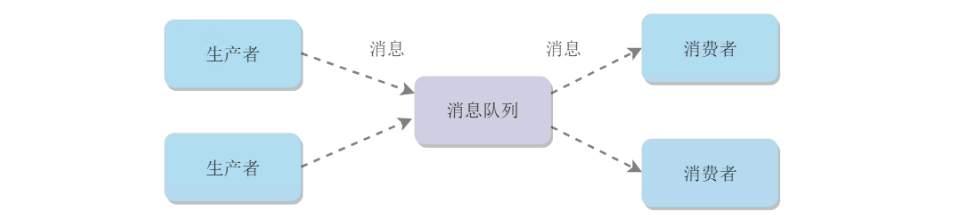
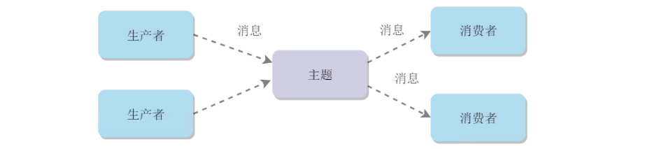
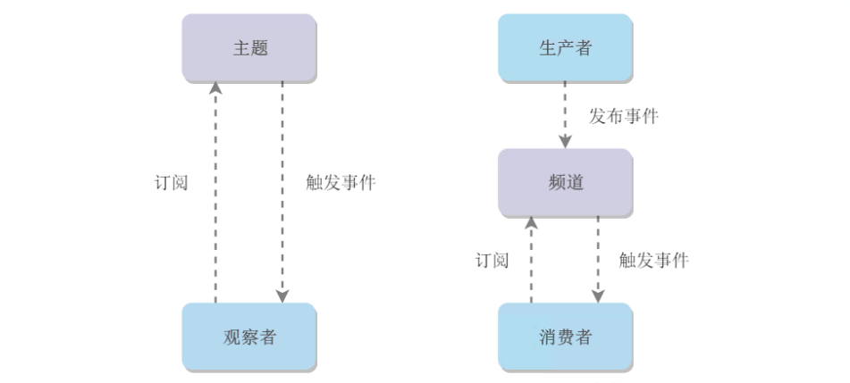
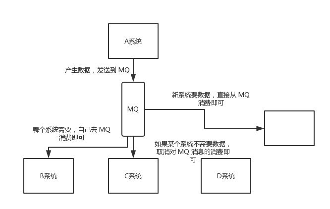
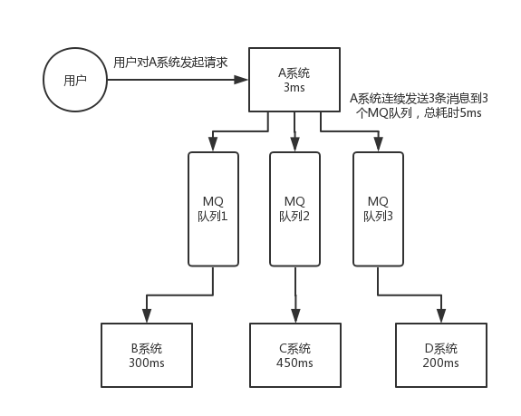
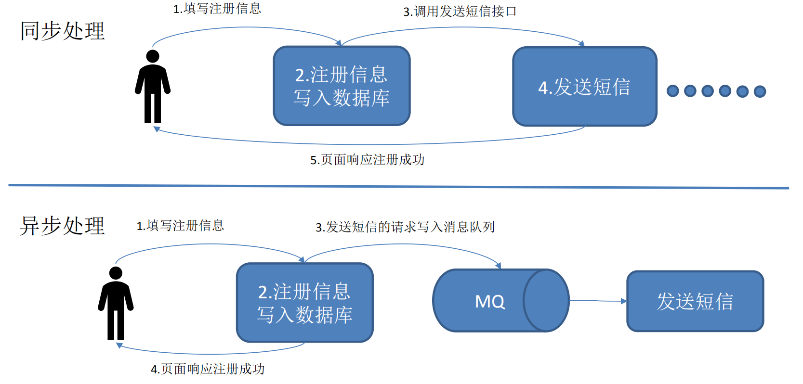

[TOC]

### 消息队列概述

#### 基础

##### 1. 什么是消息队列

可以把消息队列比作是一个存放消息的容器，当需要使用消息的时候可以取出消息供自己使用。消息队列是分布式系统中重要的组件，使用消息队列主要是为了**通过异步处理提高系统性能和削峰、降低系统耦合性**。目前使用较多的消息队列有 ActiveMQ，RabbitMQ，Kafka，RocketMQ 等。

##### 2. 消息模型

###### (1) 点对点模型

消息生产者向消息队列中发送了一个消息之后，只能**被一个消费者消费一次**。**不可重复消费**。

###### (2) 发布/订阅模型

消息生产者向频道发送一个消息之后，**多个消费者可以从该频道订阅到这条消息并消费**。**可以重复消费**。

**发布与订阅模式**和**观察者模式**有以下不同：

- **观察者模式中**，观察者和主题都知道对方的存在；而在发布与订阅模式中，生产者与消费者不知道对方的存在，它们之间通过频道进行通信。
- **观察者模式是同步的**，当事件触发时，主题会调用观察者的方法，然后等待方法返回；**而发布与订阅模式是异步的**，生产者向频道发送一个消息之后，就不需要关心消费者何时去订阅这个消息，可以立即返回。

##### 3. 使用场景

> **为什么使用消息队列?**

消息队列常见的使用场景有很多，比较核心的有 3 个：**解耦**、**异步**、**削峰**。

###### (1) 解耦

A 系统发送数据到 **BCD 三个系统**，通过接口调用发送。如果 E 系统也要这个数据呢？那如果 C 系统现在不需要了呢？A 系统负责人几乎崩溃......

在这个场景中，**A 系统**跟其它各种乱七八糟的系统**严重耦合**，A 系统产生一条比较关键的数据，很多系统都需要 A 系统将这个数据发送过来。A 系统要时时刻刻考虑 BCDE 四个系统如果挂了该咋办？要不要重发，要不要把消息存起来？

如果使用 MQ，**A 系统产生一条数据，发送到 MQ 里面去，哪个系统需要数据自己去 MQ 里面消费**。如果新系统需要数据，直接从 MQ 里消费即可；如果某个系统不需要这条数据了，就取消对 MQ 消息的消费即可。这样下来，**A 系统压根儿不需要去考虑要给谁发送数据，不需要维护这个代码，也不需要考虑人家是否调用成功、失败超时等情况。**

通过一个 MQ，Pub/Sub 发布订阅消息这么一个模型，A 系统就**跟其它系统彻底解耦**了。当一个系统或者一个模块，调用了多个系统或者模块，互相之间的调用很复杂，维护起来很麻烦，就可以考虑这样做。

###### (2) 异步

**A 系统接收一个请求**，需要在自己**本地写库**，还需要在 **BCD 三个系统写库**，自己本地写库要 3ms，BCD 三个系统分别写库要 300ms、450ms、200ms。最终请求总延时是 3 + 300 + 450 + 200 = 953ms，接近 1s，太久了。一般要求是每个请求都必须在 200 ms 以内完成。

如果**使用 MQ**，那么 A 系统连续**发送 3 条消息到 MQ 队列**中，然后各个系统自己去写库，假如耗时 5ms，A 系统从接受一个请求到返回响应给用户，总时长是 3 + 5 = 8ms，对于用户而言，其实感觉上就是点个按钮，**8ms 以后就直接返回**了。

一个异步与同步的例子：

###### (3) 削峰

每天 0:00 到 12:00，A 系统风平浪静，每秒并发请求数量就 **50 个**。结果每次一到 12:00 ~ 13:00 ，每秒并发请求数量突然会暴增到 5k+ 条。但是系统是**直接基于 MySQL** 的，大量的请求涌入 MySQL，每秒钟对 MySQL 执行约 5k 条 SQL。一般的 MySQL，扛到每秒 2k 个请求就差不多了，请求太多就炸了。

但是高峰期一过，到了下午的时候，就成了**低峰期**，可能也就 1w 的用户同时在网站上操作，每秒中的请求数量可能也就 50 个请求，对整个系统几乎没有任何的压力。

如果使用 MQ，**每秒 5k 个请求写入 MQ**，A 系统每秒钟**最多处理 2k 个请求**，因为 MySQL 每秒钟最多处理 2k 个。A **系统从 MQ 中慢慢拉取请求**，每秒钟就拉取 2k 个请求，不要超过自己每秒能处理的最大请求数量就行，这样即使是高峰期的时候，A 系统也绝对不会挂掉。而 MQ 每秒钟 5k 个请求进来，就 2k 个请求出去，结果就导致在中午**高峰期**（1 个小时），可能有几十万甚至几百万的**请求积压**在 MQ 中。

这个短暂的高峰期积压是可以的，只要高峰期一过，A 系统就会快速将积压的消息给解决掉。

##### 4. 使用消息队列的问题

- **系统可用性降低**：系统可用性在某种程度上降低。在加入 MQ 之前，你不用考虑消息丢失或者说 MQ 挂掉等等的情况，但是引入 MQ 之后就需要去考虑了，比如需要考虑消息队列的**高可用**！
- **系统复杂性提高**：加入MQ之后需要保证消息**没有被重复消费、处理消息丢失的情况、保证消息传递的顺序性、消息堆积**等等问题！
- **一致性问题**：上面讲了消息队列可以实现异步，消息队列带来的异步确实可以提高系统响应速度。但是，万一消息的真正消费者并没有正确消费消息怎么办？这样就会导致数据不一致的情况了！比如 A 系统处理完了直接返回成功了，客户就以为这个请求已经成功；但是问题是，要是 BCD 三个系统那里，BD 两个系统写库成功了，结果 C 系统写库失败了，这里数据就不一致。

所以消息队列实际是一种非常复杂的架构，引入它有很多好处，但是也得针对它带来的坏处做各种额外的技术方案和架构来规避掉。

##### 5. 可靠性

###### (1) 发送端的可靠性

发送端完成操作后**一定能将消息成功发送到消息队列**中。

实现方法：在**本地数据库建一张消息表**，将消息数据与业务数据保存在同一数据库实例里，这样就可以利用本地数据库的事务机制。**事务提交成功后，将消息表中的消息转移到消息队列中，若转移消息成功则删除消息表中的数据，否则继续重传**。

###### (2) 接收端的可靠性

接收端能够从消息队列**成功消费一次**消息。

两种实现方法：

- 保证接收端处理消息的**业务逻辑**具有**幂等性**：只要具有幂等性，那么消费多少次消息，最后处理的结果都是一样的。
- 保证**消息具有唯一编号**，并使用一张**日志表来记录已经消费的消息编号**。

#### JMS与AMQP

##### 1. JMS

###### (1) JMS简介

JMS（JAVA Message Service,java消息服务）是 Java 的消息服务，JMS 的客户端之间可以通过 JMS 服务进行异步消息传输。**JMS API 是一个消息服务的标准或者说是规范**，允许应用程序组件基于 JavaEE 平台创建、发送、接收和读取消息。它使分布式通信耦合度更低，消息服务更加可靠以及异步性。

**ActiveMQ 就是基于 JMS 规范实现的。**

###### (2) JMS两种消息模型

**点到点（P2P）模型**：使用**队列（Queue）**作为消息通信载体；满足**生产者与消费者模式**，一条消息只能被一个消费者使用，未被消费的消息在队列中保留直到被消费或超时。比如：生产者发送100条消息的话，两个消费者来消费一般情况下两个消费者会按照消息发送的顺序各自消费一半。

**发布/订阅（Pub/Sub）模型**：发布订阅模型（Pub/Sub） 使用**主题（Topic）**作为消息通信载体，类似于**广播模式**；发布者发布一条消息，该消息通过主题传递给所有的订阅者，**在一条消息广播之后才订阅的用户则是收不到该条消息的**。

###### (3) JMS消息正文格式

JMS 定义了五种不同的消息正文格式，以及调用的消息类型，允许发送并接收以一些**不同形式的数据**，提供现有消息格式的一些级别的兼容性。

- **StreamMessage**：Java 原始值的数据流。
- **MapMessage**：一套名称-值对。
- **TextMessage**：一个字符串对象。
- **ObjectMessage**：一个序列化的 Java 对象。
- **BytesMessage**：一个字节的数据流。

##### 2. AMQP

AMQP 即 Advanced Message Queuing Protocol，一个提供统一消息服务的应用层标准高级消息队列协议（二进制应用层协议），是应用层协议的一个开放标准，为面向消息的中间件设计，**兼容 JMS**。基于此协议的客户端与消息中间件可传递消息，并不受客户端/中间件同产品，不同的开发语言等条件的限制。

**RabbitMQ 就是基于 AMQP 协议实现的。**

提供了五种消息模型：①direct exchange；②fanout exchange；③topic change；④headers exchange；⑤system exchange。本质来讲，后四种和 JMS 的 pub/sub 模型没有太大差别，仅是在**路由机制**上做了更详细的划分。

##### 3. JMS与AMQP比较

|     对比     |                     JMS                     |          AMQP          |
| :----------: | :-----------------------------------------: | :--------------------: |
|     定义     |                  Java API                   |        **协议**        |
|    跨语言    |                     否                      |         **是**         |
|    跨平台    |                     否                      |         **是**         |
| 支持消息类型 | 提供**两种消息模型**：① 点对点; ② 发布/订阅 | **提供了五种消息模型** |
| 支持消息类型 |              支持多种消息类型               |  **byte**[]（二进制）  |

**总结：**

- AMQP 为消息定义了**线路层**（wire-level protocol）的协议，而 JMS 所定义的是 API 规范。在 Java 体系中，多个 client 均可以通过 JMS 进行交互，不需要应用修改代码，但是其对跨平台的支持较差。而 AMQP 天然具有**跨平台、跨语言特性**。
- JMS 支持 TextMessage、MapMessage 等复杂的**消息类型**；而 AMQP 仅**支持 byte[] 消息类型**（复杂的类型可**序列化后**发送）。
- 由于 Exchange 提供的路由算法，AMQP 可以提供多样化的**路由方式来传递消息到消息队列**，而 JMS 仅支持 队列 和 主题/订阅 方式两种。 

#### 常见消息队列

##### 1. ActiveMQ

**ActiveMQ** 的社区算是比较成熟，但是较目前来说，ActiveMQ 的性能比较差，而且版本迭代很慢，**不推荐使用**。

##### 2. RabbitMQ

**RabbitMQ** 在吞吐量方面虽然稍逊于 Kafka 和 RocketMQ ，但是由于它基于 erlang 开发，所以并发能力很强，性能极其好，延时很低，达到微秒级。但是也因为 RabbitMQ 基于 erlang 开发，所以国内很少有公司有实力做 erlang 源码级别的研究和定制。如果业务场景对并发量要求不是太高（十万级、百万级），那这四种消息队列中，RabbitMQ 一定是你的首选。如果是**大数据领域的实时计算、日志采集等场景，用 Kafka 是业内标准的**，绝对没问题，社区活跃度很高，绝对不会黄，何况几乎是全世界这个领域的事实性规范。

##### 3. RocketMQ

**RocketMQ** 阿里出品，Java 系开源项目，可以根据源码定制 MQ，并且 RocketMQ 有阿里巴巴的实际业务场景的实战考验。RocketMQ 社区活跃度相对较为一般，不过也还可以，文档相对来说简单一些，然后接口这块不是**按照标准 JMS 规范**走的有些系统要迁移需要修改大量代码。

##### 4. Kafka

**kafka** 的特点其实很明显，就是仅仅提供较少的核心功能，但是**提供超高的吞吐量，ms 级的延迟，极高的可用性以及可靠性，而且分布式可以任意扩展**。同时 kafka 最好是支撑较少的 topic 数量即可，保证其超高吞吐量。kafka 唯一的一点劣势是有**可能消息重复消费**，那么对数据准确性会造成极其轻微的影响，在大数据领域中以及日志采集中，这点轻微影响可以忽略这个特性天然适合大数据实时计算以及日志收集。

##### 5. 总结

|           特性           |               ActiveMQ                |                      RabbitMQ                      |                           RocketMQ                           |                            Kafka                             |
| :----------------------: | :-----------------------------------: | :------------------------------------------------: | :----------------------------------------------------------: | :----------------------------------------------------------: |
|      **单机吞吐量**      | 万级，比 RocketMQ、Kafka 低一个数量级 |                    同 ActiveMQ                     |                     10 万级，支撑高吞吐                      | **10 万级**，高吞吐，一般配合大数据类的系统来进行**实时数据计算、日志采集**等场景 |
| topic 数量对吞吐量的影响 |                                       |                                                    | topic 可以达到几百/几千的级别，吞吐量会有较小幅度的下降，这是 RocketMQ 的一大优势，在同等机器下，可以支撑大量的 topic | topic 从几十到几百个时候，吞吐量会大幅度下降，在同等机器下，Kafka 尽量保证 topic 数量不要过多，如果要支撑大规模的 topic，需要增加更多的机器资源 |
|        **时效性**        |               **ms 级**               |     微秒级，这是 RabbitMQ 的一大特点，延迟最低     |                            ms 级                             |                     **延迟在 ms 级以内**                     |
|        **可用性**        |      高，基于主从架构实现高可用       |                    同 ActiveMQ                     |                    **非常高，分布式架构**                    | **非常高，分布式**，一个数据多个副本，少数机器宕机，不会丢失数据，不会导致不可用 |
|      **消息可靠性**      |         有较低的概率丢失数据          |                      基本不丢                      |              经过参数优化配置，可以做到 0 丢失               |              经过参数优化配置，可以做到 0 丢失               |
|       **功能支持**       |         MQ 领域的功能极其完备         | 基于 erlang 开发，并发能力很强，性能极好，延时很低 |           MQ 功能较为完善，还是分布式的，扩展性好            | 功能较为简单，主要支持简单的 MQ 功能，在大数据领域的实时计算以及日志采集被大规模使用 |

综上，各种对比之后，有如下建议：

不推荐用 ActiveMQ。

所以**中小型公司**，技术实力较为一般，技术挑战不是特别高，用 **RabbitMQ** 是不错的选择；**大型公司**，基础架构研发实力较强，用 **RocketMQ** 是很好的选择。

如果是**大数据领域**的实时计算、日志采集等场景，用 **Kafka** 是业内标准的，绝对没问题，社区活跃度很高，几乎是全世界这个领域的事实性规范。

#### 参考资料

- [Observer vs Pub-Sub](http://developers-club.com/posts/270339/)
- [消息队列中点对点与发布订阅区别](https://blog.csdn.net/lizhitao/article/details/47723105)