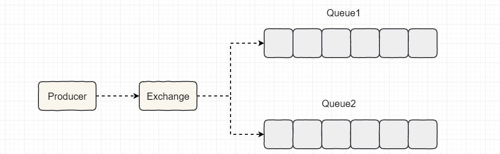
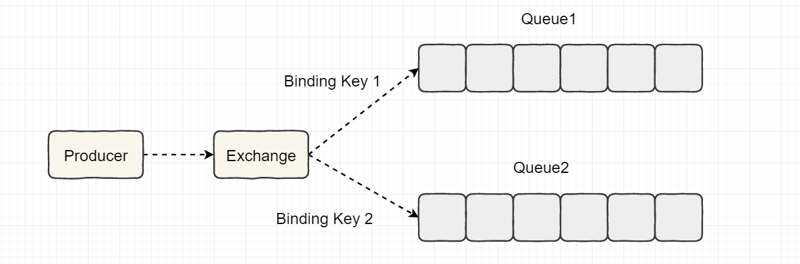

[TOC]

### RabbitMQ

#### 基础

RabbitMQ 是采用 Erlang 语言实现 **AMQP**(Advanced Message Queuing Protocol，高级消息队列协议）**的消息中间件**，它最初起源于金融系统，用于在分布式系统中存储转发消息。

RabbitMQ 的特点：

- **可靠性：** RabbitMQ 使用一些机制来保证消息的可靠性，如持久化、传输确认及发布确认等。
- **灵活的路由：** 在消息进入队列之前，通过交换器来路由消息。对于典型的路由功能，RabbitMQ 己经提供了一些内置的交换器来实现。针对更复杂的路由功能，可以将多个交换器绑定在一起，也可以通过插件机制来实现自己的交换器。
- **扩展性：** 多个 RabbitMQ 节点可以组成一个**集群**，也可以根据实际业务情况动态地扩展集群中节点。
- **高可用性：** 队列可以在集群中的机器上设置镜像，使得在部分节点出现问题的情况下队列仍然可用。
- **支持多种协议：** RabbitMQ 除了**原生支持 AMQP 协议**，还支持 STOMP、MQTT 等多种消息中间件协议。
- **多语言客户端：** RabbitMQ 几乎支持所有常用语言，比如 Java、Python、Ruby、PHP、C#、JavaScript等。
- **易用的管理界面：** RabbitMQ 提供了一个易用的用户界面，使得用户可以监控和管理消息、集群中的节点等。在安装 RabbitMQ 的时候会介绍到，安装好 RabbitMQ 就自带管理界面。
- **插件机制：** RabbitMQ 提供了许多插件，以实现从多方面进行扩展，当然也可以编写自己的插件。感觉这个有点类似 Dubbo 的 SPI 机制。

#### RabbitMQ架构

整体模型架构如下所示。

##### 1. Producer与Consumer

- **Producer(生产者)**：生产消息的一方（邮件投递者）。
- **Consumer(消费者)**：消费消息的一方（邮件收件人）。

消息一般由 2 部分组成：**消息头**（或者说是标签 Label）和 **消息体**。消息体也可以称为 **payLoad**，消息体是不透明的，而消息头则由一系列的**可选属性组成**，这些属性包括 **routing-key**（路由键）、**priority**（相对于其他消息的优先权）、**delivery-mode**（指出该消息可能需要持久性存储）等。生产者把消息交由 RabbitMQ 后，RabbitMQ 会根据消息头把消息发送给感兴趣的 Consumer(消费者)。

##### 2. Exchange

###### (1) 概述

交换器，在 RabbitMQ 中，消息并不是直接被投递到 **Queue(消息队列)** 中的，中间还必须经过 **Exchange(交换器)** 这一层，**Exchange(交换器)** 会把的消息分配到对应的 **Queue(消息队列)** 中。**Exchange(交换器)** 用来接收生产者发送的消息并将这些消息路由给服务器中的队列中，如果路由不到，或许会返回给 **Producer(生产者)** ，或许会被直接丢弃掉 。这里可以将 RabbitMQ 中的交换器看作一个简单的实体。

**Exchange有 4 种类型，不同的类型对应着不同的路由策略**：**direct(默认)**，**fanout**，**topic** 和 **headers**，不同类型的Exchange 转发消息的**策略**有所区别。

生产者将消息发给**交换器**的时候，一般会指定一个 **RoutingKey(路由键)**，用来指定这个消息的路由规则，而这个 **RoutingKey 需要与交换器类型和绑定键(BindingKey)联合使用才能最终生效**。

RabbitMQ 中通过 **Binding(绑定)** 将 **Exchange(交换器)** 与 **Queue(消息队列)** 关联起来，在绑定的时候一般会指定一个 **BindingKey(绑定建)**，这样 RabbitMQ 就知道如何正确将消息路由到队列了，如下图所示。一个绑定就是基于路由键将交换器和消息队列连接起来的路由规则，所以可以将**交换器理解成一个由绑定构成的路由表**。Exchange 和 Queue 的绑定可以是**多对多**的关系。Binding (绑定) 示意图：

生产者将消息发送给交换器时，需要一个**RoutingKey**，当 BindingKey 和 RoutingKey 相匹配时，消息会被路由到对应的队列中。在绑定多个队列到同一个交换器的时候，这些绑定允许使用相同的 BindingKey。

###### (2) Exchange Types

RabbitMQ 常用的 Exchange Type 有 **fanout**、**direct**、**topic**、**headers** 这四种。

##### 3. Queue

**Queue(消息队列)** 用来保存消息直到发送给消费者。它是消息的容器，也是消息的终点。一个消息可投入一个或多个队列。消息一直在队列里面，等待消费者连接到这个队列将其取走。

**RabbitMQ** 中消息只能存储在 **队列** 中，这一点和 **Kafka** 这种消息中间件**相反**。Kafka 将消息存储在 **topic（主题）** 这个逻辑层面，而相对应的队列逻辑只是 topic 实际存储文件中的位移标识。 RabbitMQ 的生产者生产消息并最终投递到队列中，消费者可以从队列中获取消息并消费。

**多个消费者可以订阅同一个队列**，这时队列中的消息会被平均分摊（Round-Robin，即轮询）给多个消费者进行处理，而不是每个消费者都收到所有的消息并处理，这样避免的消息被重复消费。

**RabbitMQ** 不支持队列层面的广播消费，如果有广播消费的需求，需要在其上进行二次开发,这样会很麻烦，不建议这样做。

##### 4. Broker

一个 RabbitMQ Broker 可以简单地看作一个 **RabbitMQ 服务节点**，或者 RabbitMQ **服务实例**。

