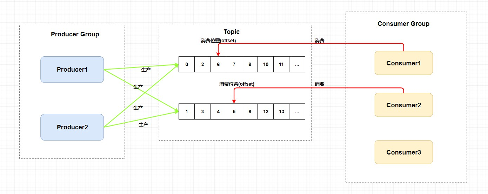
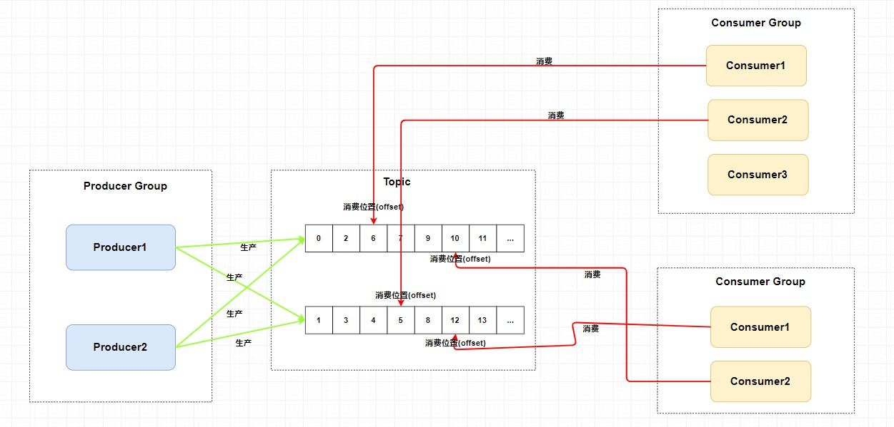
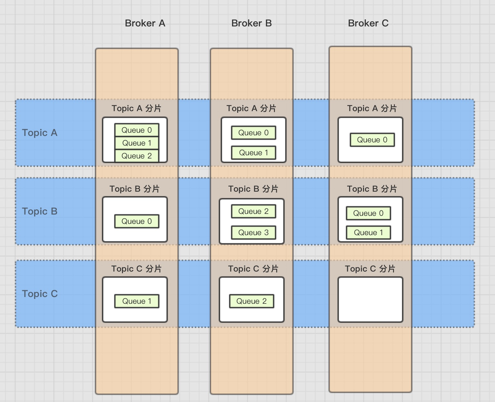
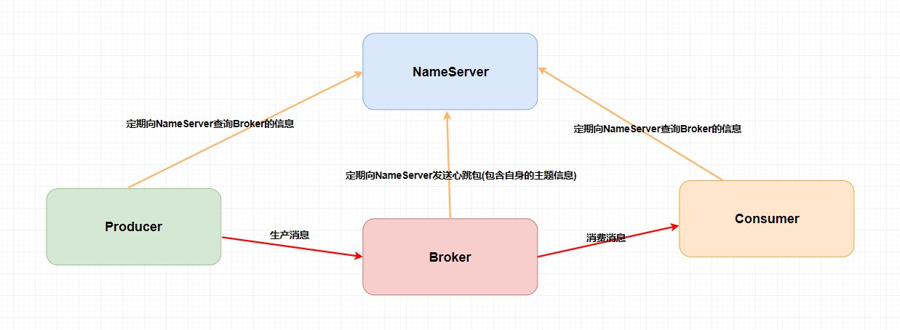
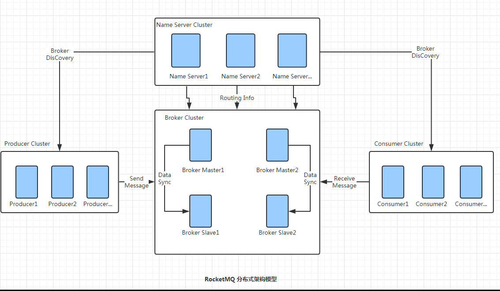
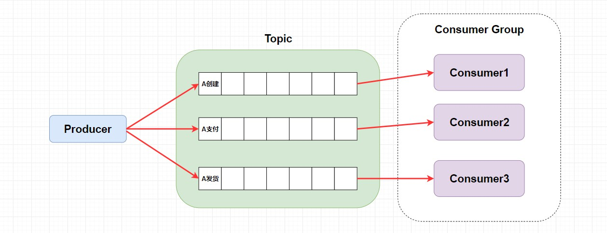
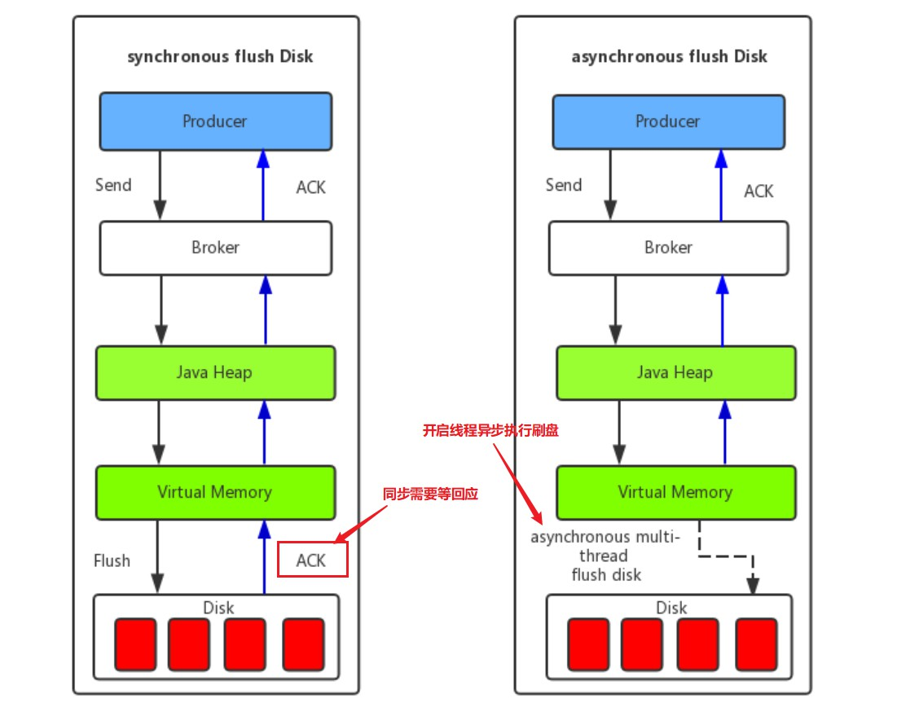
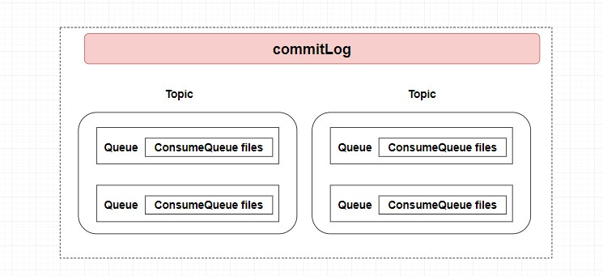
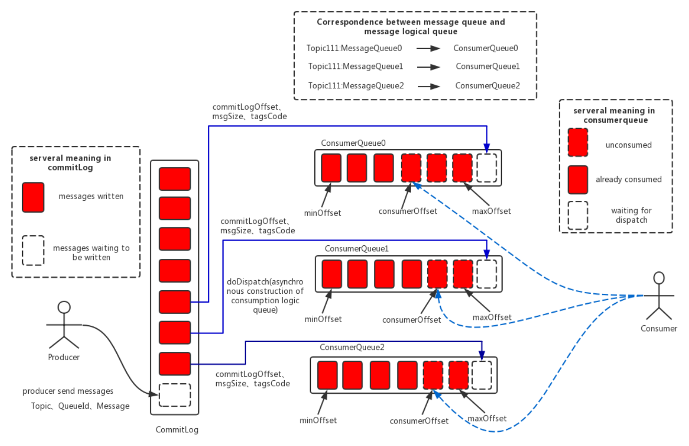

[TOC]

### RocketMQ

#### 基础

##### 1. 概述

**RocketMQ** 是一个 **队列模型** 的消息中间件，具有**高性能、高可靠、高实时、分布式** 的特点。它是一个采用 Java 语言开发的分布式的消息系统，由**阿里巴巴**团队开发并贡献给 Apache。

#### RocketMQ消息模型

##### 1. 模型概述

对于主题模型的实现来说**每个消息中间件的底层设计都是不一样的**，就比如 Kafka 中的 **分区** ，RocketMQ 中的 **队列**，RabbitMQ 中的 **Exchange** 。可以理解为 **主题模型/发布订阅模型 就是一个标准**，那些中间件只不过照着这个标准去实现而已。

整个图中有 **Producer Group 、Topic 、Consumer Group**  三个角色。

- **Producer Group 生产者组**：代表某一类的生产者，比如有多个秒杀系统作为生产者，这多个合在一起就是一个 Producer Group 生产者组，它们一般生产相同的消息。
- **Consumer Group 消费者组**：代表某一类的消费者，比如有多个短信系统作为消费者，这多个合在一起就是一个 Consumer Group 消费者组，它们一般消费相同的消息。
- **Topic 主题**：代表一类**消息**，比如订单消息，物流消息等等。

图中生产者组中的生产者会向主题发送消息，而 **主题中存在多个队列**，生产者每次生产消息之后是指定主题中的某个队列发送消息的。

每个主题中都有**多个队列**(这里还不涉及到 Broker)，集群消费模式下，一个消费者集群多台机器共同消费一个 topic 的多个队列，**一个队列只会被一个消费者消费**。如果某个消费者挂掉，分组内其它消费者会接替挂掉的消费者继续消费。就像上图中 Consumer1 和 Consumer2 分别对应着两个队列，而 Consuer3 是没有队列对应的，所以一般来讲要控制 消费者组中的消费者个数和主题中队列个数相同。

##### 2. 消费位置

**每个消费组在每个队列上维护一个消费位置** ，为什么？

在发布订阅模式中一般会涉及到**多个消费者组**，而每个**消费者组在每个队列中的消费位置都是不同的**。如果此时有多个消费者组，那么消息被一个消费者组消费完之后是不会删除的(因为其它消费者组也需要)，它仅仅是为每个消费者组维护一个 **消费位移(offset)** ，每次消费者组消费完会返回一个成功的响应，然后队列再把维护的消费位移加一，这样就不会出现刚刚消费过的消息再一次被消费了。

**为什么一个主题中需要维护多个队列** ？答案是 **提高并发能力**。

所以总结来说，RocketMQ 通过使用在一个 **Topic 中配置多个队列并且每个队列维护每个消费者组的消费位置** 实现了 主题模式/发布订阅模式 。

#### RocketMQ架构

##### 1. 四大组件及其联系

RocketMQ 技术架构中有四大角色 **NameServer 、Broker 、Producer 、Consumer** 。

- **Broker**： 主要负责消息的**存储、投递和查询以及服务高可用保证**。说白了就是消息队列服务器，生产者生产消息到 Broker，消费者从 Broker 拉取消息并消费。

    一个 Topic 中存在多个队列，一个 Topic 分布在多个 Broker上，一个 Broker 可以配置多个 Topic ，它们是多对多的关系。 如果某个 Topic 消息量很大，应该给它多配置几个队列(提高并发能力)，并且尽量多分布在不同 Broker 上，以减轻某个 Broker 的压力 。

    Topic 消息量都比较均匀的情况下，如果某个 broker 上的队列越多，则该 broker 压力越大。所以一般需要配置多个 Broker。

    

- **NameServer**： 其实也是一个 **注册中心** ，主要提供两个功能：**Broker 管理 和 路由信息管理**。说白了就是 Broker 会**将自己的信息注册到 NameServer 中**，此时 NameServer 就存放了很多 Broker 的信息(Broker 的路由表)，**消费者和生产者就从 NameServer 中获取路由表然后照着路由表的信息和对应的 Broker 进行通信**(生产者和消费者定期会向 NameServer 去查询相关的 Broker 的信息)。

- **Producer**： **消息发布**的角色，支持分布式集群方式部署。说白了就是**生产者**。

- **Consumer**： **消息消费**的角色，支持分布式集群方式部署。支持以 **push 推，pull 拉两种模式**对消息进行消费。同时也支持集群方式和广播方式的消费，它提供实时消息订阅机制。说白了就是**消费者**。

四个组件关系如下图所示。

NameServer 干啥用的，这不多余吗？直接 Producer 、Consumer 和 Broker 直接进行生产消息，消费消息不就好了么？

Broker 是需要保证高可用的，如果整个系统仅仅靠着一个 Broker 来维持的话，那么这个 Broker 的压力会很大，所以需要使用多个 Broker 来保证 **负载均衡**。

如果消费者和生产者**直接**和多个 Broker 相连，那么当 Broker 修改的时候必定会**牵连着每个生产者和消费者**，这样就会产生**耦合问题**，而 **NameServer 注册中心**就是用来解决这个问题的。

> RocketMQ 不使用 ZooKeeper 作为注册中心的原因，以及自制的 NameServer 优缺点？

ZooKeeper 作为支持顺序一致性的中间件，在某些情况下，它**为了满足一致性，会丢失一定时间内的可用性**，RocketMQ 需要**注册中心只是为了发现组件地址**，在某些情况下，RocketMQ 的注册中心**可以出现数据不一致性**，这同时也是 NameServer 的缺点，因为 NameServer 集群间**互不通信**，它们之间的注册信息可能会不一致。另外，当有新的服务器加入时，NameServer 并**不会立马通知**到 Produer，而是由 Produer 定时去请求 NameServer 获取最新的 Broker/Consumer 信息。

##### 2. 集群架构

RocketMQ 中的技术架构肯定不止前面那么简单，因为上面图中的四个角色都是需要做**集群**的。官网的集群架构图如下。

集群架构与之前的乞丐版架构图也没什么区别，主要是一些细节上的差别。

第一、Broker 做了集群并且还进行了**主从部署** ，由于**消息分布在各个 Broker 上**。一旦某个 Broker 宕机，则该 Broker 上的消息读写都会受到影响。所以 RocketMQ 提供了 **master/slave** 的结构，salve 定时从 master 同步数据(同步刷盘或者异步刷盘)，如果 master 宕机，则 slave 提供消费服务，但是不能写入消息。

第二、为了保证 **HA** ，NameServer 也做了**集群部署**，但是注意它是 **去中心化** 的。也就意味着**它没有主节点**，可以很明显地看出 NameServer 的所有节点是没有进行**信息同步**的，在 RocketMQ 中是通过 单个 Broker 和**所有 NameServer 保持长连接**，并且在每隔 30 秒 Broker 会向所有 Nameserver **发送心跳**，心跳包含了自身的 Topic 配置信息，这个步骤就对应这上面的 Routing Info。

第三、**生产者**需要向 Broker **发送消息**的时候，需要先**从 NameServer 获取关于 Broker 的路由信息**，然后通过 轮询 的方法去向每个队列中生产数据以达到 **负载均衡** 的效果。

第四、**消费者**通过 NameServer 获取所有 Broker 的路由信息后，向 **Broker 发送 Pull 请求**来获取消息数据。Consumer 可以以两种模式启动：**广播**（Broadcast）**和集群**（Cluster）。广播模式下，一条消息会发送给 同一个消费组中的所有消费者 ，集群模式下消息只会发送给一个消费者。

其实 Kafka 的架构基本和 RocketMQ 类似，只是它**注册中心使用了 Zookeeper** 、它的 **分区** 就相当于 RocketMQ 中的 **队列**。

#### RocketMQ消费问题

##### 1. 顺序消费

###### (1) 普通顺序与严格顺序

从上面的技术架构中可知 RocketMQ 在**主题上是无序**的、它只有在**队列层面才是保证有序**的。

这又扯到两个概念：**普通顺序** 和 **严格顺序**。

- **普通顺序**：指消费者通过**同一个消费队列收到的消息是有顺序的**，不同消息队列收到的消息则**可能是无顺序**的。普通顺序消息在 Broker **重启情况下不会保证消息顺序性** (短暂时间) 。
- **严格顺序**：指消费者收到的**所有消息**均是有**顺序**的。严格顺序消息**即使在异常情况下也会保证消息的顺序性** 。

但是，严格顺序看起来虽好，实现它可会付出巨大的代价。如果使用严格顺序模式，Broker 集群中只要有一台机器不可用，则整个集群都不可用。严格顺序主要场景**也就在 binlog 同步**。

一般而言 MQ 都是**能容忍短暂的乱序**，所以推荐使用**普通顺序模式**。

###### (2) 保证顺序消费

如果使用普通顺序模式 ，Producer 生产消息的时候会进行**轮询**(取决于**负载均衡策略**)来向同一主题的不同消息队列发送消息。那么如果此时有几个消息分别是同一个订单的创建、支付、发货，在轮询的策略下这三个消息会**被发送到不同队列**，因为在**不同的队列此时就无法使用 RocketMQ 带来的队列有序特性来保证消息有序性**了。

那么，怎么解决呢？

其实很简单，需要处理的仅仅是**将同一语义下的消息放入同一个队列**(比如这里是同一个订单)，那就可以使用 **Hash 取模法** 来**保证同一个订单在同一个队列**中就行了。

##### 2. 重复消费

**幂等**：在编程中一个幂等操作的特点是其**任意多次执行所产生的影响均与一次执行的影响相同**。需要给消费者实现**幂等**，也就是对同一个消息的处理结果，执行多少次都不变。

不过最主要的还是需要**根据特定场景使用特定的解决方案** ，要明确消息重复消费是否是**完全不能忍受还是可以忍受**，然后再选择**强校验和弱校验**的方式。

如何给业务实现幂等？需要结合具体的业务。可以使用写入 **Redis** 来保证，因为 Redis 的 key 和 value 就是**天然支持幂等**的。当然还有使用**数据库插入法**，基于数据库的**唯一键**来保证**重复数据**不会被插入多条。

##### 3. 消息堆积问题

消息队列一个很重要的功能是**削峰**，但峰值太大可能造成导致消息堆积在队列中。产生消息堆积的根源其实就只有两个：**生产者生产太快或者消费者消费太慢**。

可以从多个角度去思考解决这个问题，当流量到峰值的时候是因为生产者生产太快，可以使用一些**限流降级**的方法，当然也可以增加多个消费者实例去水平扩展增加消费能力来匹配生产的激增。如果消费者**消费过慢**的话，可以先检查**是否是消费者出现了大量的消费错误**，或者打印一下日志查看是否是哪一个线程卡死，出现了锁资源不释放等的问题。

当然最快速解决消息堆积问题的方法还是**增加消费者实例**，不过**同时还需要增加每个主题的队列数量** 。别忘了在 RocketMQ 中，**一个队列只会被一个消费者消费**。

##### 4. 回溯消费

回溯消费是指 Consumer **已经消费成功**的消息，由于业务上需求需要**重新消费**，在 RocketMQ 中， Broker 在向Consumer 投递成功消息后，**消息仍然需要保留** 。并且重新消费一般是按照**时间维度**，例如由于 Consumer 系统故障，恢复后需要重新消费 **1 小时前**的数据，那么 Broker 要提供一种机制，可以按照时间维度来回退消费进度。**RocketMQ 支持按照时间回溯消费，时间维度精确到毫秒。**

#### RocketMQ刷盘机制

##### 1. 同步刷盘和异步刷盘

如上图所示，在同步刷盘中需要**等待一个刷盘成功的 ACK**，同步刷盘对 MQ 消息可靠性来说是一种不错的保障，但是 性能上会有较大影响 ，一般地适用于**金融**等特定业务场景。

而**异步刷盘**往往是**开启一个线程去异步地执行刷盘操作**。消息刷盘采用后台异步线程提交的方式进行， 降低了读写延迟 ，提高了 MQ 的性能和吞吐量，一般适用于**如发验证码**等对于**消息保证要求不太高**的业务场景。一般**异步刷盘只有在 Broker 意外宕机的时候会丢失部分数据**。

可以设置 Broker 的参数 **FlushDiskType** 来调整刷盘策略(ASYNC_FLUSH 或者 SYNC_FLUSH)。

##### 2. 同步复制和异步复制

同步刷盘和异步刷盘是在**单个结点**层面的，而同步复制和异步复制主要是指的 **Borker 主从模式**下，主节点返回消息给客户端的时候是否需要同步从节点。

- **同步复制**： 也叫"同步双写"，也就是说**只有消息同步双写到主从结点上时才返回写入成功** 。
- **异步复制**： **消息写入主节点之后就直接返回写入成功** 。

然而很多事情是没有完美的方案的，就比如进行消息写入的节点越多就更能保证消息的可靠性，但是随之的性能也会下降，所以需要程序员根据特定业务场景去选择适应的主从复制方案。

那么**异步复制会不会也像异步刷盘那样影响消息的可靠性呢？**答案是不会的，因为两者就是不同的概念，对于消息可靠性是通过不同的刷盘策略保证的，而像异步同步复制策略仅仅是影响到了 **可用性** 。为什么呢？其主要原因**是 RocketMQ 不支持自动主从切换的，当主节点挂掉之后，生产者就不能再给这个主节点生产消息了**。

比如这个时候采用异步复制的方式，在主节点还未发送完需要同步的消息的时候主节点挂掉了，这个时候从节点就少了一部分消息。但是此时生产者无法再给主节点生产消息了，**消费者可以自动切换到从节点进行消费**(仅仅是消费)，所以在主节点挂掉的时间只会产生主从结点短暂的消息不一致的情况，降低了可用性，而当主节点重启之后，从节点那部分未来得及复制的消息还会继续复制。

在单主从架构中，如果一个主节点挂掉了，那么也就意味着整个系统不能再生产了。那么这个可用性的问题能否解决呢？**一个主从不行那就多个主从的**。但是这种复制方式同样也会带来一个问题，那就是无法保证**严格顺序** 。在上文中提到如何保证的消息顺序性是通过将一个语义的消息发送在同一个队列中，使用 `Topic` 下的队列来保证顺序性的。如果此时主节点 A 负责的是订单 A 的一系列语义消息，然后它挂了，这样其他节点是无法代替主节点 A 的，如果任意节点都可以存入任何消息，那就没有顺序性可言了。

而在 RocketMQ 中采用了 **Dledger** 解决这个问题。他要求在写入消息的时候，要求**至少消息复制到半数以上的节点**之后，才给客⼾端返回写入成功，并且它是支持通过选举来动态切换主节点的。也不是说 Dledger 是个完美的方案，至少在 Dledger 选举过程中是无法提供服务的，而且他必须要使用三个节点或以上，如果多数节点同时挂掉他也是无法保证可用性的，而且要求消息复制板书以上节点的效率和直接异步复制还是有一定的差距的。

##### 3. 存储机制

在 Topic 中的 **队列**是以什么样的形式存在的？队列中的消息又是如何进行存储持久化的呢？ 这里涉及到了 RocketMQ 的**存储结构**。

###### (1) 存储架构的角色

RocketMQ **消息存储架构**中的三大角色：**CommitLog** 、**ConsumeQueue** 和 **IndexFile**。

- **CommitLog**：消息主体以及元数据的存储主体，存储 Producer 端写入的消息主体内容，消息内容不是定长的。单个文件大小默认 1G ，文件名长度为 20 位，左边补零，剩余为起始偏移量，比如 00000000000000000000 代表了第一个文件，起始偏移量为 0，文件大小为 1G=1073741824；当第一个文件写满了，第二个文件为00000000001073741824，起始偏移量为 1073741824，以此类推。**消息主要是顺序写入日志文件**，当文件满了，写入下一个文件。
- **ConsumeQueue**：**消息消费队列**，引入的目的主要是提高消息消费的性能，由于 RocketMQ 是**基于主题** Topic 的订阅模式，消息消费是针对主题进行的，如果要遍历 commitlog 文件中根据 Topic 检索消息是非常低效的。Consumer 即**可根据 ConsumeQueue 来查找待消费的消息**。其中 ConsumeQueue（逻辑消费队列）作为消费消息的索引，保存了指定 Topic 下的队列消息在 CommitLog 中的**起始物理偏移量 offset**，消息大小 size 和消息 Tag 的 HashCode 值。consumequeue 文件可以看成是基于 topic 的 commitlog **索引文件**，故 consumequeue 文件夹的组织方式如下：topic/queue/file 三层组织结构，具体存储路径为：$HOME/store/consumequeue/{topic}/{queueId}/{fileName}。同样 consumequeue 文件采取定长设计，每一个条目共 20 个字节，分别为 8 字节的 commitlog 物理偏移量、4 字节的消息长度、8 字节tag hashcode，单个文件由 30W 个条目组成，可以像数组一样随机访问每一个条目，每个 ConsumeQueue 文件大小约 5.72M。
- **IndexFile**：**索引文件**，提供了一种可以通过 key 或时间区间来查询消息的方法。

总结来说，整个消息存储的结构，最主要的就是 **CommitLog** 和 **ConsumeQueue** 。ConsumeQueue 可以大概理解为 Topic 中的**队列**。

###### (2) 存储结构详解

RocketMQ 采用的是 **混合型存储结构** ，即为 **Broker 单个实例下所有的队列共用一个日志数据文件来存储消息**。有意思的是在同样高并发的 **Kafka 中会为每个 Topic 分配一个存储文件**。这就有点类似于有一大堆书需要装上书架，RockeMQ 是不分书的种类直接成批的塞上去的，而 Kafka 是将书本放入指定的分类区域的。

而 RocketMQ 为什么要这么做呢？原因是 **提高数据的写入效率** ，不分 Topic 意味着有更大的几率获取 **成批** 的消息进行数据写入，但也会带来一个麻烦就是读取消息的时候需要**遍历整个大文件**，这是非常耗时的。

所以，在 RocketMQ 中又使用了 **ConsumeQueue** 作为**每个队列的索引文件**来 提升读取消息的效率。可以直接根据队列的消息序号，计算出索引的全局位置（索引序号 * 索引固定长度 20），然后直接读取这条索引，再根据索引中记录的消息的全局位置，找到消息。

RockeMQ 的存储架构图如下：

首先，可以直接 把 ConsumerQueue 理解为 **Queue**。

图中**红色方块**  代表**被写入的消息**，虚线方块代表**等待被写入**的。左边的生产者发送消息会指定 Topic 、QueueId 和具体消息内容，而在 Broker 中不管是什么消息，直接**全部顺序存储到了 CommitLog**。而根据生产者指定的 Topic 和 QueueId 将这条消息本身在 CommitLog 的**偏移**(offset)，消息本身大小，和 tag 的 hash 值存入对应的 ConsumeQueue **索引文件**中。而在每个队列中都保存了 ConsumeOffset 即每个消费者组的消费位置，而消费者拉取消息进行消费的时候只需要根据 ConsumeOffset 获取下一个未被消费的消息就行了。

为什么 CommitLog 文件要设计成固定大小的长度？**内存映射机制**。

#### 参考资料

- 《RocketMQ技术内幕》：https://blog.csdn.net/prestigeding/article/details/85233529
- 关于 RocketMQ 对 MappedByteBuffer 的一点优化：https://lishoubo.github.io/2017/09/27/MappedByteBuffer%E7%9A%84%E4%B8%80%E7%82%B9%E4%BC%98%E5%8C%96/
- 阿里中间件团队博客-十分钟入门RocketMQ：http://jm.taobao.org/2017/01/12/rocketmq-quick-start-in-10-minutes/
- 分布式事务的种类以及 RocketMQ 支持的分布式消息：https://www.infoq.cn/article/2018/08/rocketmq-4.3-release
- 滴滴出行基于RocketMQ构建企业级消息队列服务的实践：https://yq.aliyun.com/articles/664608
- 基于《RocketMQ技术内幕》源码注释：https://github.com/LiWenGu/awesome-rocketmq