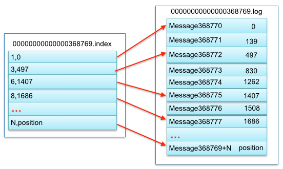
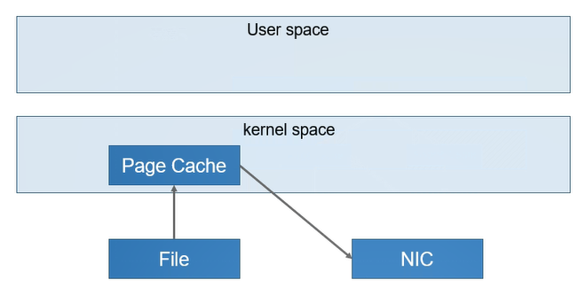
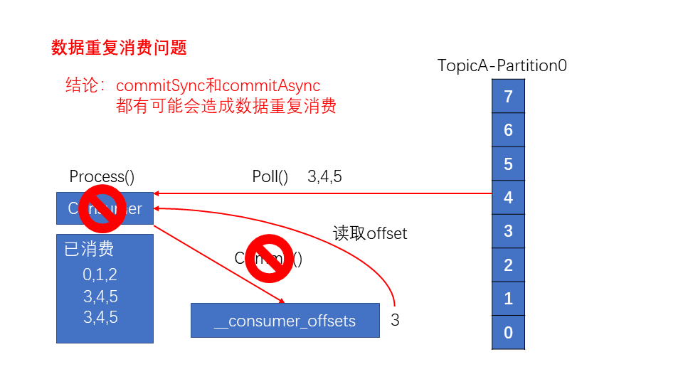

[TOC]

### Kafka

#### 基础

##### 1. 概述

**Kafka 是一种分布式的，基于发布 / 订阅的消息系统。** Kafka 是最初由 Linkedin 公司开发，是一个分布式、支持分区的（partition）、多副本的（replica），**基于 Zookeeper 协调的分布式消息系统**，它的最大的特性就是可以实时的处理大量数据以满足各种需求场景：比如基于 hadoop 的批处理系统、低延迟的实时系统、Storm/Spark 流式处理引擎， web/nginx 日志、访问日志，消息服务等等。

主要特点如下：

- 以时间复杂度为 O(1) 的方式**提供消息持久化能力**，即使对 TB 级以上数据也能保证**常数时间复杂度的访问性能**。
- **高吞吐率**。即使在非常廉价的商用机器上也能做到单机支持**每秒 100K 条以上**消息的传输。
- 支持 Kafka Server 间的消息分区，及分布式消费，同时保证**每个 Partition 内的消息顺序传输**。
- 同时支持离线数据处理和实时数据处理。
- Scale out：支持在线水平扩展。

Kafka 是一个分布式流式处理平台。

流平台具有三个关键功能：

1. **消息队列**：发布和订阅消息流，这个功能类似于消息队列，这也是 Kafka 也被归类为消息队列的原因。
2. **容错的持久方式存储记录消息流**： Kafka 会把消息**持久化到磁盘**，有效避免了消息丢失的风险。
3. **流式处理平台：** 在消息发布的时候进行处理，Kafka 提供了一个完整的**流式处理类库**。

Kafka 的主要应用场景：

1. **消息队列** ：建立实时流数据管道，以可靠地在系统或应用程序之间获取数据。
2. **数据处理：** 构建实时的流数据处理程序来转换或处理数据流。
3. **日志收集**：可以用 Kafka 收集各种服务的 **log**，通过 kafka 以**统一接口服务**的方式开放给各种 consumer，例如 hadoop、Hbase、Solr 等。
4. **消息系统**：解耦和生产者和消费者、缓存消息等。
5. **用户活动跟踪**：Kafka 经常被用来记录 web 用户或者 app 用户的各种活动，如浏览网页、搜索、点击等活动，这些活动信息被各个服务器发布到 kafka 的 topic 中，然后订阅者通过订阅这些 topic 来做**实时的监控分析**，或者装载到 hadoop、数据仓库中做**离线分析和挖掘**。
6. **运营指标**：Kafka 也经常用来记录运营监控数据。包括收集各种分布式应用的数据，生产各种操作的集中反馈，比如报警和报告。

##### 2. 主题与分区

在 Kafka 中，**消息**以**主题（Topic）**来分类，每一个**主题**都对应一个 **「消息队列」**，这有点儿类似于数据库中的表。但是如果把所有同类的消息都塞入到一个“中心”队列中，势必缺少可伸缩性，无论是生产者/消费者数目的增加，还是消息数量的增加，都可能耗尽系统的性能或存储。


使用一个生活中的例子来说明：现在 A 城市生产的某商品需要运输到 B 城市，走的是公路，那么单通道的高速公路不论是在「A 城市商品增多」还是「现在 C 城市也要往 B 城市运输东西」这样的情况下都会出现「吞吐量不足」的问题。所以现在引入**分区（Partition）**的概念，类似“允许多修几条道”的方式对我们的主题完成了水平扩展。

##### 3. Broker与集群

一个 Kafka **服务器也称为 Broker**，它接受生产者发送的消息并存入磁盘；Broker 同时服务消费者拉取分区消息的请求，返回目前已经提交的消息。使用特定的机器硬件，一个 Broker 每秒可以处理成千上万的分区和百万量级的消息。

若干个 Broker 组成一个**集群（Cluster）**，其中集群内某个 Broker 会成为**集群控制器**（Cluster Controller），它负责管理集群，包括分配分区到 Broker、监控 Broker 故障等。在集群内，**一个分区由一个 Broker 负责**，这个 Broker 也称为这个分区的 **Leader**；当然一个分区可以被复制到多个 Broker 上来实现冗余，这样当存在 Broker 故障时可以将其分区重新分配到其他 Broker 来负责。下图是一个样例：


Kafka 的一个关键性质是**日志保留（retention）**，可以配置主题的消息保留策略，譬如只保留一段时间的日志或者只保留特定大小的日志。当超过这些限制时，老的消息会被删除。也可以针对某个主题单独设置消息过期策略，这样对于不同应用可以实现个性化。

##### 4. 多集群

随着业务发展往往需要多集群，通常处于下面几个原因：

- 基于数据的隔离。
- 基于安全的隔离。
- 多数据中心（容灾）。

当构建多个数据中心时，往往需要实现消息互通。举个例子，假如用户修改了个人资料，那么后续的请求无论被哪个数据中心处理，这个更新需要反映出来。又或者多个数据中心的数据需要汇总到一个总控中心来做数据分析。

上面说的分区复制冗余机制只适用于同一个 Kafka 集群内部，对于多个 Kafka 集群消息同步可以使用 Kafka 提供的 MirrorMaker 工具。本质上来说，MirrorMaker 只是一个 Kafka 消费者和生产者，并使用一个队列连接起来而已。它从一个集群中消费消息，然后往另一个集群生产消息。

#### Kafka架构模型


- **Producer（生产者）**：消息生产者。
- **Consumer（消费者）**：消息消费者。
- **Consumer Group(CG)**：**消费者组**，由多个 consumer 组成。消费者组内每个消费者负责消费**不同分区 Partition** 的数据，一个分区只能由一个消费者消费；消费者组之间互不影响。所有的消费者都属于某个消费者组，即消费者组是**逻辑上的一个订阅者**。如果只有一个消费组，那么架构其实就是消息模型中的点对点模型，如果有多个消费组，那就对应了消息模型中的发布订阅模型。
- **Broker**：可以看作是一个独立的 Kafka **服务器实例**。多个 Kafka Broker 组成一个 Kafka Cluster。

- **Topic（主题）**：Producer 将消息发送到特定的**主题**，Consumer 通过订阅特定的 Topic(主题) 来消费消息。
- **Partition（分区）**：**Partition** 属于 Topic 的一部分。一个 **Topic 可以有多个 Partition**，并且同一 Topic 下的 Partition 可以**分布在不同的 Broker 上**，这也就表明一个 Topic 可以横跨多个 Broker 。Kafka 中的 **Partition** 实际上可以对应成为**消息队列中的队列**。分区主要使用来实现负载均衡。
- **Replica**：为保证集群中的某个节点发生故障时，该节点上的 partition 数据不丢失，且 kafka 仍然能够继续工作，kafka 提供了**副本机制**，一个 topic 的每个分区都有若干个副本，副本包含一个 **leader** 和若干个 **follower**。
- **Leader**：每个分区**多个副本的“主”**，生产者发送数据的对象，以及消费者消费数据的对象都是 leader。

- **Follower**：每个分区**多个副本中的“从**”，实时从 leader 中**同步**数据，保持和 leader 数据的同步。leader 发生故障时，选举一个 follower 会成为新的 leader。

服务端(brokers)和客户端(producer、consumer)之间通信通过 **TCP 协议**来完成。

#### Kafka与存储实现

##### 1. Kafka与文件系统

Kafka 的消息是**存在于文件系统**之上的。Kafka 高度依赖文件系统来存储和缓存消息，一般的人认为 “磁盘是缓慢的”，所以对这样的设计持有怀疑态度。实际上，磁盘比人们预想的快很多也慢很多，这取决于它们如何被使用；一个好的磁盘结构设计可以使之跟网络速度一样快。

现代的操作系统针对**磁盘的读写**已经做了一些优化方案来加快磁盘的访问速度。比如，**预读**会提前将一个比较大的磁盘快读入内存。**后写**会将很多小的逻辑写操作合并起来组合成一个大的物理写操作。并且，操作系统还会将主内存剩余的所有空闲内存空间都用作**磁盘缓存**，所有的磁盘读写操作都会经过统一的磁盘缓存（除了直接 I/O 会绕过磁盘缓存）。综合这几点优化特点，**如果是针对磁盘的顺序访问，某些情况下它可能比随机的内存访问都要快，甚至可以和网络的速度相差无几**。

**Topic 其实是逻辑上的概念，面向消费者和生产者，物理上存储的其实是 Partition**，每一个 Partition 最终对应一个**目录，里面存储所有的消息和索引文件**。默认情况下，每一个 Topic 在创建时如果不指定 Partition 数量时只会创建 1 个 Partition。比如创建一个 Topic 名字为 test ，没有指定 Partition 的数量，那么会默认创建一个 **test-0 的文件夹**，这里的命名规则是：**<topic_name>-<partition_id>**。


任何发布到 Partition 的消息都会被**追加到 Partition 数据文件的尾部**，这样的**顺序写磁盘操作让 Kafka 的效率非常高**（经验证，**==顺序写磁盘==**效率比随机写内存还要高，这是 Kafka 高吞吐率的一个很重要的保证）。

每一条消息被发送到 Broker 中，会**根据 Partition 规则**选择被存储到哪一个 Partition。如果 Partition 规则设置的合理，所有消息可以均匀分布到不同的 Partition中。

##### 2. 底层存储细节

假设现在 Kafka 集群**只有一个 Broker**，创建 2 个 Topic 名称分别为：「topic1」和「topic2」，Partition 数量分别为 1、2，那么的**根目录**下就会创建如下**三个文件夹**：

```shell
| --topic1-0
| --topic2-0
| --topic2-1
```

在 Kafka 的**文件存储**中，**同一个 Topic 下有多个不同的 Partition**，每个 Partition 都为一个**目录**，而每一个目录又被平均分配成多个大小相等的 **Segment File** 中，Segment File 又由 **index file 和 data file 组成**，他们总是**成对出现**，后缀 “.index” 和 “.log” 分表表示 Segment **索引文件和数据文件**。**索引文件中的元数据指向对应数据文件中** message 的物理偏移地址。


现在假设设置每个 Segment 大小为 500 MB，并启动生产者向 topic1 中写入大量数据，topic1-0 文件夹中就会产生类似如下的一些文件：

```shell
| --topic1-0 
   | --00000000000000000000.index 
   | --00000000000000000000.log 
   | --00000000000000368769.index 
   | --00000000000000368769.log 
   | --00000000000000737337.index 
   | --00000000000000737337.log 
   | --00000000000001105814.index 
   | --00000000000001105814.log 
| --topic2-0 
| --topic2-1
```

**Segment 是 Kafka 文件存储的最小单位。**Segment 文件命名规则：Partition 全局的第一个 Segment **从 0** 开始，后续每个 Segment 文件名为上一个 Segment 文件**最后一条消息的 offset 值**。数值最大为 64 位 long 大小，19 位数字字符长度，没有数字用 0 填充。如 00000000000000368769.index 和 00000000000000368769.log。

以上面的一对 Segment File 为例，说明一下**索引文件和数据文件对应关系**：



其中以索引文件中元数据 **<3, 497>** 为例，依次在数据文件中表示第 3 个 message（在全局 Partition 表示第 368769 + 3 = 368772 个 message）以及该消息的物理偏移地址为 497。

注意该 index 文件并不是从 0 开始，也不是每次递增 1 的，这是因为 Kafka 采取**稀疏索引存储**的方式，每隔一定字节的数据建立一条索引，它减少了索引文件大小，使得能够把 index 映射到内存，降低了查询时的磁盘 IO 开销，同时也并没有给查询带来太多的时间消耗。

因为其文件名为上一个 Segment 最后一条消息的 offset ，所以当需要查找一个指定 offset 的 message 时，通过在所有 segment 的文件名中进行**二分查找**就能找到它归属的 segment ，再在其 index 文件中找到其对应到文件上的物理位置，就能拿出该 message。

由于消息在 Partition 的 Segment 数据文件中是**顺序读写**的，且消息消费后不会删除（删除策略是针对过期的 Segment 文件），这种顺序磁盘 IO 存储设计师 Kafka 高性能很重要的原因。

> Kafka 是如何准确的知道 message 的偏移的呢？

这是因为在 Kafka 定义了标准的数据存储结构，在 Partition 中的**每一条 message 都包含了以下三个属性**：

- **offset**：表示 message 在当前 Partition 中的偏移量，是一个逻辑上的值，唯一确定了 Partition 中的一条 message，可以简单的认为是一个 id。

- **MessageSize**：表示 message 内容 data 的大小。

- **data**：message 的具体内容。

#### 生产者

##### 1. 写消息流程

流程如下：

1. 首先创建一个 **ProducerRecord**，这个对象需要包含消息的**主题（topic）和值（value）**，可以选择性**指定一个键值（key）或者分区（partition）**。
2. 发送消息时，生产者会对键值和值**序列化成字节数组**，然后发送到**分配器（partitioner）**。
3. 如果指定了**分区**，那么分配器返回该分区即可；否则，分配器将会**基于键值**来选择一个分区并返回。
4. 选择完分区后，生产者知道了消息所属的主题和分区，它将这条记录添加到相同主题和分区的**批量消息**中，另一个线程负责发送这些批量消息到对应的 Kafka broker。
5. 当 broker 接收到消息后，如果成功写入则**返回一个包含消息的主题、分区及位移的 RecordMetadata 对象**，否则返回异常。
6. 生产者接收到结果后，对于异常可能会进行重试。

#### 消费者

##### 1. 消费者与消费组

如果生产者写入消息的速度比消费者读取的速度快，这样随着时间增长，**消息堆积**越来越严重。对于这种场景可以**增加多个消费者**来进行**水平扩展**。

Kafka 消费者是**消费组**的一部分，当**多个消费者形成一个消费组**来消费主题时，每个消费者会收到**不同分区**的消息。假设有一个 T1 主题，该主题有 4 个分区；同时有一个消费组 G1，这个消费组只有一个消费者 C1。那么消费者 C1 将会收到这 4 个分区的消息，如下所示：


如果增加新的消费者 C2 到消费组 G1，那么每个消费者将会分别收到**两个分区**的消息，如下所示：


如果增加到 4 个消费者，那么每个消费者将会分别收到**一个分区**的消息，如下所示：


但如果继续增加消费者到这个消费组，**剩余的消费者将会空闲**，不会收到任何消息：


总而言之，可以通过增加消费组的消费者来进行水平扩展提升消费能力。这也是为什么建议创建主题时使用比较多的分区数，这样可以在消费负载高的情况下增加消费者来提升性能。另外，消费者的数量**不应该比分区数多**，因为多出来的消费者是空闲的，没有任何帮助。

**Kafka 一个很重要的特性就是，只需写入一次消息，可以支持任意多的应用读取这个消息。**换句话说，**每个应用都可以读到全量的消息**。为了使得每个应用都能读到全量消息，应用需要有**不同的消费组**。对于上面的例子，假如新增了一个新的消费组 G2，而这个消费组有**两个消费者**，那么会是这样的：


在这个场景中，消费组 G1 和消费组 G2 都能收到 T1 主题的**全量消息**，在逻辑意义上来说它们**属于不同的应用**。

总结：如果应用需要读取全量消息，那么请**为该应用设置一个消费组**；如果该应用消费能力不足，那么考虑在这个消费组里增加消费者。

##### 2. 消费组与分区重平衡

当**新的消费者**加入**消费组**，它会消费一个或多个分区，而这些分区之前是由其他消费者负责的；另外当消费者离开消费组（比如重启、宕机等）时，它所消费的分区会**分配给其他分区**。这种现象称为**重平衡（rebalance）**。重平衡是 Kafka 一个很重要的性质，这个性质保证了高可用和水平扩展。**不过也需要注意到，在重平衡期间，所有消费者都不能消费消息，因此会造成整个消费组短暂的不可用。**而且将分区进行重平衡也会**导致原来的消费者状态过期**，从而导致消费者需要重新更新状态，这段期间也会降低消费性能。后面我们会讨论如何安全的进行重平衡以及如何尽可能避免。

消费者通过**定期发送心跳**（hearbeat）到一个作为组协调者（group coordinator）的 broker 来保持在消费组内存活。这个 broker 不是固定的，每个消费组都可能不同。当消费者拉取消息或者提交时，便会发送心跳。

如果消费者超过一定时间没有发送心跳，那么它的**会话（session）就会过期**，组协调者会认为该消费者已经宕机，然后触发重平衡。可以看到，从消费者宕机到会话过期是有一定时间的，这段时间内该消费者的分区都不能进行消息消费；通常情况下，可以进行**优雅关闭**，这样消费者会发送离开的消息到组协调者，这样组协调者可以**立即进行重平衡**而不需要等待会话过期。

在 0.10.1 版本，Kafka 对心跳机制进行了修改，将发送心跳与拉取消息进行分离，这样使得发送心跳的频率不受拉取的频率影响。另外更高版本的 Kafka 支持配置一个消费者多长时间不拉取消息但仍然保持存活，这个配置可以避免活锁（livelock）。**活锁**是指应用没有故障但是由于某些原因不能进一步消费。

##### 3. Partition与消费模型

Kafka 中一个 topic 中的消息是**被打散分配在多个 Partition(分区) 中存储的**， Consumer Group 在消费时需要从不同的 Partition 获取消息，那最终如何重建出 Topic 中消息的**顺序**？

答案是：**没有办法**。**Kafka 只会保证在 Partition 内消息是有序的，而不管全局的情况**。

下一个问题是：Partition 中的**消息可以被（不同的 Consumer Group）多次消费**，那 Partition中被消费的消息是何时删除的？ Partition 又是如何知道一个 Consumer Group 当前消费的位置呢？

无论消息是否被消费，**除非消息到期 Partition 从不删除消息**。例如设置保留时间为 2 天，则消息发布 2 天内任何 Group 都可以消费，2 天后消息自动被删除。
Partition 会为**每个 Consumer Group 保存一个偏移量**，记录 **Group 消费到的位置**。 如下图：


##### 4. Kafka与pull模型

消费者应该向 Broker **要数据（pull）**还是 Broker 向消费者**推送数据（push）**？

**consumer 采用 pull（拉）模式从 broker 中读取数据。**

push 模式和 pull 模式各有优劣。

**push 模式很难适应消费速率不同的消费者，因为消息发送速率是由 broker 决定的**。push 模式的目标是尽可能以最快速度传递消息，但是这样很容易造成 Consumer 来不及处理消息，典型的表现就是拒绝服务以及网络拥塞。**而 pull 模式则可以根据 Consumer 的消费能力以适当的速率消费消息。**

**对于 Kafka 而言，pull 模式更合适。**pull 模式**可简化 broker 的设计**，Consumer 可自主控制**消费消息的速率**，同时 Consumer 可以自己控制消费方式：即可批量消费也可逐条消费，同时还能选择不同的提交方式从而实现不同的传输语义。

##### 5. Kafka如何保证消息消费顺序

在使用消息队列的过程中经常有业务场景需要**严格保证**消息的消费顺序，比如同时发了 2 个消息，这 2 个消息对应的操作分别对应的数据库操作是：更改用户会员等级、根据会员等级计算订单价格。假如这两条消息的消费顺序不一样造成的最终结果就会截然不同。

Kafka 中 **Partition(分区)是真正保存消息的地方**，发送的消息都被放在了这里。而的 Partition(分区) 又存在于 Topic(主题) 这个概念中，并且可以给 Topic 指定**多个 Partition**。


每次添加消息到 Partition(分区) 的时候都会采用**尾加法**，如上图所示。Kafka 只能保证**一个 Partition(分区) 中的消息有序**，而**不能保证 Topic(主题) 中所有 Partition(分区) 的全局有序性**。

消息在被追加到 **Partition**(分区) 的时候都会**分配一个特定的偏移量**（offset）。Kafka **通过偏移量（offset）来保证消息在分区内的顺序性**。

所以就有一种很简单的保证消息消费顺序的方法：**1 个 Topic 只对应一个 Partition**。这样当然可以解决问题，但是破坏了 Kafka 的设计初衷。

还有一种方法，Kafka 中发送一条消息的时候，可以指定 **topic，partition，key，data**（数据） 4 个参数。如果发送消息的时候指定了 Partition 的话，所有消息都**会被发送到指定的 Partition**。并且同一个 key 的消息可以**保证只发送到同一个 partition**，这个可以采用表/对象的 id 来作为 key 。

总结一下，对于如何保证 Kafka 中消息消费的顺序，有了下面两种方法：

1. 1 个 Topic 只对应一个 Partition。
2. **发送消息的时候通过参数发送到指定的 key/Partition**（推荐）。

##### 6. 如何保证消息不丢失/可靠性

###### (1) 生产者丢失消息

生产者(Producer) 调用 send 方法发送消息之后，**消息可能因为网络问题**并没有发送过去。 所以不能默认在调用 send 方法发送消息之后消息消息发送成功了。为了确定消息是发送成功，**需要判断消息发送的结果**。但是要注意的是  Kafka 生产者(Producer) 使用  send 方法发送消息实际上是**异步操作**，可以通过 get()方法获取调用结果，但是这样也让它变为了**同步操作**，示例代码如下：

```java
SendResult<String, Object> sendResult = kafkaTemplate.send(topic, o).get();
if (sendResult.getRecordMetadata() != null) {
    logger.info("生产者成功发送消息到" + sendResult.getProducerRecord().topic() 
                + "-> " + sendResult.getProducerRecord().value().toString());
}
```

但是一般**不推荐这么做**！可以采用为其**添加回调函数**的形式，示例代码如下：

````java
ListenableFuture<SendResult<String, Object>> future = kafkaTemplate.send(topic, o);
future.addCallback(result 
                   -> logger.info("生产者成功发送消息到topic:{} partition:{}的消息", 
                                  result.getRecordMetadata().topic(), 
                                  result.getRecordMetadata().partition()),
                   ex 
                   -> logger.error("生产者发送消失败，原因：{}", 
                                   ex.getMessage()));
````

如果消息发送失败的话，检查失败的原因之后**重新发送**即可！

另外这里推荐为 Producer 的 **retries（重试次数）设置一个比较合理的值**，一般是 **3**，但是为了保证消息不丢失的话一般会设置比较大一点。设置完成之后，当出现网络问题之后能够**自动重试消息发送**，避免消息丢失。另外，建议还要设置**重试间隔**，因为间隔太小的话重试的效果就不明显了。

###### (2) 消费者丢失消息

消息在被追加到 Partition (分区)的时候都会**分配一个特定的偏移量**（offset）。偏移量（offset) 表示 Consumer 当前消费到的 Partition(分区) 的所在的位置。Kafka 通过**偏移量（offset）可以保证消息在分区内的顺序性**。


当消费者**拉取**到了分区的某个消息之后，**消费者会自动提交 offset**。自动提交的话会有一个问题，如果当消费者刚拿到这个消息准备进行真正消费的时候，突然挂掉了，**消息实际上并没有被消费，但是 offset 却被自动提交了**。

**解决办法也比较粗暴，关闭自动提交 offset，每次在真正消费完消息之后再自己手动提交 offset 。** 但是这样会带来消息被**重新消费**的问题。比如刚刚消费完消息之后，还没提交 offset，结果自己挂掉了，那么这个消息理论上就会被消费两次。

###### (3) Kafka弄丢消息

Kafka 为分区（Partition）引入了多副本（Replica）机制。试想一种情况：假如 leader 副本所在的 broker 突然挂掉，那么就要从 follower 副本重新选出一个 leader ，但是 leader 的数据还有一些没有被 follower 副本的同步的话，就会造成消息丢失。

**(1) 设置 acks = all**：解决办法就是设置  **acks = all**。acks 是 Kafka 生产者(Producer)  很重要的一个参数。acks 的默认值即为 1，代表消息被 leader 副本接收之后就算被成功发送。当配置 **acks = all** 代表则**所有副本都要接收到该消息**之后该消息才算真正成功被发送。

**(2) 设置 replication.factor >= 3**：为了保证 leader 副本能有 follower 副本能同步消息，一般会为 topic 设置 **replication.factor >= 3**。这样就可以**保证每个分区(partition) 至少有 3 个副本**。虽然造成了数据冗余，但是带来了数据的安全性。

**(3) 设置 min.insync.replicas > 1**：一般情况下还需要设置 **min.insync.replicas> 1** ，这样配置代表消息至少要被写入到 **2 个副本**才算是被成功发送。**min.insync.replicas** 的默认值为 1 ，在实际生产中应尽量避免默认值 1。但是，为了保证整个 Kafka 服务的高可用性，需要确保 **replication.factor > min.insync.replicas** 。为什么呢？设想一下加入两者相等的话，只要是有一个副本挂掉，整个分区就无法正常工作了。这明显违反高可用性！一般推荐设置成 **replication.factor = min.insync.replicas + 1**。

**(4) 设置 unclean.leader.election.enable = false**：Kafka 0.11.0.0 版本开始 **unclean.leader.election.enable** 参数的默认值由原来的 true 改为 false。消息会被发送到 leader 副本，然后 follower 副本才能从 leader 副本中拉取消息进行同步。多个 follower 副本之间的**消息同步情况不一样**，当配置了 **unclean.leader.election.enable = false**  的话，当 leader 副本发生故障时就不会从  follower 副本中和 leader 同步程度达不到要求的副本中选择出  leader ，这样降低了消息丢失的可能性。

##### 7. 如何保证消息不被重复消费

如何保证消息**不被重复消费**？换句话说就是如何保证消息消费的**幂等性**？

###### (1) 重复消费问题

**每个消息**被写进去后都有一个 **offset**，代表其序号，然后 consumer 消费该数据之后，隔一段时间，会把**自己消费过的消息的 offset 提交一下**，代表已经消费过了。下次要是重启，就会继续从上次**消费到的 offset** 来继续消费。

但是如果直接 kill 消费者进程然后再重启，就导致 consumer 有些消息处理了，但是**没来得及提交 offset**。等重启之后，少数消息就会**再次消费一次**。

其他 MQ 也会有这种重复消费的问题，那么针对这种问题需要从业务角度，考虑它的幂等性。

举个例子，当消费一条消息时就往数据库插入一条数据。如何**保证重复消费**也插入一条数据呢？那就需要从**幂等性**角度考虑了。

###### (2) 保证幂等性 

**怎么保证消息队列消费的幂等性？**需要结合业务来思考，比如下面的例子：

- 比如某个数据要**写数据库**，先根据**主键查一下**，如果数据有了，就别插入了而是 **update** 一下。
- 如果是**写 Redis**，那没问题，反正每次都是 set，**天然幂等性**。
- 对于消息可以**建个表**（专门存储消息消费记录）。生产者发送消息前**判断库中是否有记录**（有记录说明已发送），没有记录，先入库，状态为**待消费**，然后发送消息并把主键 id 带上。消费者接收消息时通过主键 ID 查询记录表，判断消息状态是否已消费。若没消费过，则处理消息，处理完后，更新消息记录的状态为已消费。

#####  8. offset的维护

由于 consumer 在消费过程中可能会出现断电宕机等故障，consumer 恢复后，需要从故障前的位置的继续消费，所以 consumer 需要实时记录自己消费到了哪个 **offset**，以便故障恢复后继续消费。

**group + topic + partition（GTP） 才能确定一个 offset！**


Kafka 0.9 版本之前，consumer 默认**将 offset 保存在 Zookeeper 中**，从 0.9 版本开始，consumer 默认**将 offset 保存在 Kafka 本地一个内置的 topic 中**，该 topic 为 **__consumer_offsets**（此时消费者对于 offset 相当于生产者）。

1）修改配置文件 consumer.properties。

```properties
exclude.internal.topics=false
```

2）读取 offset。

- 0.11.0.0 之前版本：

```shell
bin/kafkabin/kafka--consoleconsole--consumer.sh consumer.sh ----topic __consumer_offsets topic __consumer_offsets ----zookeeper zookeeper hadoophadoop102102:2181 :2181 ----formatter formatter

"kafka.coordinator.GroupMetadataManager"kafka.coordinator.GroupMetadataManager\\$OffsetsMessageFormatter" $OffsetsMessageFormatter" ----consumer.config config/consumer.properties consumer.config config/consumer.properties ----fromfrom--beginningbeginning
```

- 0.11.0.0 之后版本(含)：

```shell
bin/kafkabin/kafka--consoleconsole--consumer.sh consumer.sh ----topic __consumer_offsets topic __consumer_offsets ----zookeeper zookeeper hadoophadoop102102:2181 :2181 ----formatter formatter

"kafka.coordinator.group.GroupMetadataManager"kafka.coordinator.group.GroupMetadataManager\\$OffsetsMessageForm$OffsetsMessageFormatter" atter" ----consumer.config config/consumer.propertiesconsumer.config config/consumer.properties ----fromfrom--beginningbeginning
```

同一个消费者组中的消费者， 同一时刻只能有一个消费者消费。


#### 可靠性

##### 1. 概述

Kafka 中的可靠性保证有如下四点：

- 对于**一个分区**来说，它的**消息是有序**的。如果一个生产者向一个分区先写入消息 A，然后写入消息 B，那么消费者会先读取消息 A 再读取消息 B。
- 当消息写入所有 **in-sync 状态的副本**后，消息才会认为**已提交（committed）**。这里的写入有可能只是写入到文件系统的**缓存**，不一定刷新到磁盘。生产者可以等待不同时机的确认，比如等待分区主副本**写入即返回**，或者等待所有 in-sync 状态副本写入才返回。
- 一旦消息已提交，那么**只要有一个副本存活，数据不会丢失**。
- 消费者只能**读取到已提交**的消息。

可靠性不是无偿的，它与系统可用性、吞吐量、延迟和硬件价格息息相关，得此失彼。因此往往需要做权衡，一味的追求可靠性并不实际。

##### 2. 多副本机制

**Kafka** 为分区（Partition）引入了**多副本（Replica）机制**。分区（Partition）中的多个副本之间会有一个 leader ，其他副本称为 **follower**。发送的消息会**被发送到 leader 副本**，然后 follower 副本才能从 leader 副本中**拉取消息进行同步**。

生产者和消费者**只与 leader 副本交互**。其他副本只是 leader 副本的**拷贝**，它们的存在只是为了**保证消息存储的安全性**。当 leader 副本发生故障时会从 follower 中**选举出一个 leader**，但是 follower 中如果有和 leader 同步程度达不到要求的参加不了 leader 的竞选。

**多副本机制的好处**：

1. Kafka 通过给特定 Topic 指定多个 Partition，而各个 Partition 可以**分布在不同的 Broker 上**，这样便能提供比较好的并发能力（**负载均衡**）。
2. Partition 可以指定对应的 Replica 数，这也极大地提高了消息存储的**安全性**，提高了容灾能力，不过也相应的增加了所需要的存储空间。

##### 3. 副本数据同步策略

|             **方案**             |                         **优点**                         |                         **缺点**                          |
| :------------------------------: | :------------------------------------------------------: | :-------------------------------------------------------: |
| **半数以上完成同步，就发送 ack** |                          延迟低                          | 选举新的 leader 时，容忍 n 台节点的故障，需要 2n+1 个副本 |
|   **全部完成同步，才发送 ack**   | 选举新的 leader 时，容忍 n 台节点的故障，需要 n+1 个副本 |                          延迟高                           |

Kafka 选择了第二种方案，原因如下：

1. 同样为了容忍 n 台节点的故障，第一种方案需要 2n+1 个副本，而第二种方案只需要 n+1 个副本，而 Kafka 的每个分区都有大量的数据，第一种方案会造成大量数据的冗余。
2. 虽然第二种方案的网络延迟会比较高，但网络延迟对 Kafka 的影响较小（同一网络环境下的传输）。


#### Kafka与Zookeeper

ZooKeeper 主要为 Kafka 提供**元数据的管理**的功能。

1. **Broker 注册**：在 Zookeeper 上会有一个专门**用来进行 Broker 服务器列表记录**的节点。每个 Broker 在启动时，都会到 Zookeeper 上进行**注册**，即到 **/brokers/ids** 下创建属于自己的节点。每个 Broker 就会将自己的 IP 地址和端口等信息记录到该节点中去。
2. **Topic 注册**：在 Kafka 中，同一个Topic 的消息会被**分成多个分区并将其分布在多个 Broker 上**，这些分区信息及与 Broker 的**对应关系也都是由 Zookeeper 在维护**。比如创建了一个名字为 **my-topic** 的主题并且它有两个分区，对应到 zookeeper 中会创建这些文件夹：**/brokers/topics/my-topic/Partitions/0、/brokers/topics/my-topic/Partitions/1**。
3. **负载均衡**：Kafka 通过给特定 Topic 指定多个 Partition，而各个 Partition 可以分布在不同的 Broker 上，这样便能提供比较好的并发能力。 对于同一个 Topic 的不同 Partition，Kafka 会**尽力将这些 Partition 分布到不同的 Broker 服务器上**。当生产者产生消息后也会尽量投递到不同 Broker 的 Partition 里面。当 Consumer 消费的时候，Zookeeper 可以根据当前的 Partition 数量以及 Consumer 数量来实现**动态负载均衡**。

以下为 partition 的 leader 选举过程：


#### Kafka高效读写数据

##### 1. 顺序写磁盘

Kafka 的 Producer 生产数据，要**写入到 log 文件**中，写的过程是一直**追加到文件末端，为顺序写**。官网有数据表明，同样的磁盘，顺序写能到到 **600M/s**，而随机写只有 **100k/s**。这与磁盘的机械机构有关，顺序写之所以快，是因为其省去了大量磁头寻址的时间。所以千万别以为写硬盘都很慢。

##### 2. 零拷贝技术

Kafka 的消息会有**多个订阅者**，生产者发布的消息会被不同的消费者多次消费，为了优化这个流程，Kafka 使用了**"零拷贝技术"**。




"零拷贝技术" 只用将**磁盘文件的数据复制到页面缓存中一次**，然后将数据**从页面缓存直接发送到网络中**（发送给不同的订阅者时，都可以使用同一个页面缓存），避免了重复复制操作。

如果有 10 个消费者，传统方式下，数据复制次数为 4 * 10=40 次，而使用“零拷贝技术”只需要 1+10=11 次，一次为从磁盘复制到页面缓存，10 次表示 10 个消费者各自读取一次页面缓存。


#### Kafka事务

Kafka 从 0.11 版本开始引入了**事务**。事务可以保证 Kafka 在 **Exactly Once 语义**的基础上，生产和消费可以**跨分区和会话，要么全部成功，要么全部失败**。**注意**：这里的事务主要谈的是**生产者**（Producer）的事务。

##### 1. Producer事务

为了实现跨分区跨会话的事务，需要引入一个**全局唯一的 Transaction ID**（**一定是客户端给的**），并将 Producer 获得的 PID 和 Transaction ID 绑定。这样当 Producer 重启后就可以通过正在进行的 Transaction ID 获得原来的 PID。 

为了管理 Transaction，Kafka 引入了一个新的组件 **Transaction Coordinator**。Producer 就是通过和 Transaction Coordinator 交互获得 Transaction ID 对应的任务状态。Transaction Coordinator 还负责将事务所有写入 Kafka 的一个内部 Topic，这样即使整个服务重启，由于事务状态得到保存，进行中的事务状态可以得到恢复，从而继续进行。

##### 2. Consumer事务 

上述事务机制主要是从 Producer 方面考虑，对于 Consumer 而言，事务的保证就会相对较弱，尤其时无法保证 Commit 的信息被精确消费。这是由于 Consumer 可以通过 offset 访问任意信息，而且不同的 Segment File 生命周期不同，同一事务的消息可能会出现重启后被删除的情况。


#### Producer API

##### 1. 消息发送流程

Producer 发送消息采用的是**异步发送**的方式。消息发送的过程涉及两个线程：**main 线程和 Sender 线程**，以及一个线程共享变量：**RecordAccumulator**（接收器）。

**main 线程将消息发送给 RecordAccumulator，Sender 线程不断从 RecordAccumulator 中拉取消息发送到 Kafka broker。**


相关参数：

- **batch.size**：只有数据积累到 batch.size 之后，sender 才会发送数据。
- **linger.ms**：如果数据迟迟未达到 batch.size，sender 等待 linger.time 之后就会发送数据。

##### 2. 异步发送API

- **KafkaProducer**：需要创建一个**生产者对象**，用来发送数据。
- **ProducerConfig**：获取所需的一系列配置参数。
- **ProducerRecord**：每条数据都要封装成一个 **ProducerRecord** 对象。

```xml
<dependency>
    <groupId>org.apache.kafka</groupId>
    <artifactId>kafka-clients</artifactId>
    <version>0.11.0.0</version>
</dependency>
```

###### (1) 不带回调函数的异步（AsyncProducer）

```java
import org.apache.kafka.clients.producer.KafkaProducer;
import org.apache.kafka.clients.producer.ProducerConfig;
import org.apache.kafka.clients.producer.ProducerRecord;
import org.apache.kafka.common.serialization.StringSerializer;

import java.util.Properties;

/**
 * 不带回调函数的异步Producer API
 */
public class AsyncProducer {
    public static void main(String[] args) {
        Properties props = new Properties();
        props.put(ProducerConfig.BOOTSTRAP_SERVERS_CONFIG,
                  "hadoop101:9092,hadoop102:9092,hadoop103:9092");
        props.put(ProducerConfig.KEY_SERIALIZER_CLASS_CONFIG,
                  StringSerializer.class.getName());
        props.put(ProducerConfig.VALUE_SERIALIZER_CLASS_CONFIG,
                  StringSerializer.class.getName());
        props.put(ProducerConfig.ACKS_CONFIG, "all");
        props.put(ProducerConfig.RETRIES_CONFIG, 1);
        props.put(ProducerConfig.LINGER_MS_CONFIG, 1);
        // 配置拦截器
        // 通过配置创建KafkaProducer对象
        KafkaProducer<String, String> producer = new KafkaProducer<>(props);
        for (int i = 0; i < 1000; i++) {
            ProducerRecord<String, String> record = new ProducerRecord<>("first", "message" + i);
            producer.send(record);
        }
        producer.close();
    }
}
```

###### (2) 带回调函数的异步（CallbackProducer）

```java
import org.apache.kafka.clients.producer.*;
import org.apache.kafka.common.serialization.StringSerializer;
import java.util.Properties;

/**
 * 带回调函数的异步Producer API
 */
public class CallbackProducer {
    public static void main(String[] args) {
        Properties props = new Properties();
        props.put(ProducerConfig.BOOTSTRAP_SERVERS_CONFIG,
                  "192.168.72.133:9092");
        props.put(ProducerConfig.KEY_SERIALIZER_CLASS_CONFIG,
                  StringSerializer.class.getName());
        props.put(ProducerConfig.VALUE_SERIALIZER_CLASS_CONFIG,
                  StringSerializer.class.getName());
        props.put(ProducerConfig.ACKS_CONFIG, "all");
        props.put(ProducerConfig.RETRIES_CONFIG, 1);
        KafkaProducer<String, String> producer = new KafkaProducer<>(props);
        for (int i = 0; i < 1000; i++) {
            ProducerRecord<String, String> record = new ProducerRecord<>("first", "message" + i);
            producer.send(record, new Callback() {
                @Override
                public void onCompletion(RecordMetadata recordMetadata, Exception e) {
                    if (e == null)
                        System.out.println("success:" + recordMetadata.topic() +
                                           "-" + recordMetadata.partition() +
                                           "-" + recordMetadata.offset());
                    else e.printStackTrace();
                }
            }); 
        }
        producer.close();
    }
}
```

##### 3. 同步发送API

###### (1) 同步发送（SyncProducer）

```java
import org.apache.kafka.clients.producer.KafkaProducer;
import org.apache.kafka.clients.producer.ProducerConfig;
import org.apache.kafka.clients.producer.ProducerRecord;
import org.apache.kafka.clients.producer.RecordMetadata;
import org.apache.kafka.common.serialization.StringSerializer;
import java.util.Properties;
import java.util.concurrent.ExecutionException;

/**
 * 同步 Producer API
 */
public class SyncProducer {
    public static void main(String[] args) throws ExecutionException, InterruptedException {
        // 创建properties对象用于存放配置
        Properties props = new Properties();
        // 添加配置
        props.put(ProducerConfig.BOOTSTRAP_SERVERS_CONFIG, "hadoop101:9092,hadoop102:9092,hadoop103:9092");
        props.put(ProducerConfig.KEY_SERIALIZER_CLASS_CONFIG, StringSerializer.class.getName());
        props.put(ProducerConfig.VALUE_SERIALIZER_CLASS_CONFIG, StringSerializer.class.getName());
        props.put(ProducerConfig.ACKS_CONFIG, "all");
        props.put(ProducerConfig.RETRIES_CONFIG, 1); // 重试次数
        props.put(ProducerConfig.LINGER_MS_CONFIG, 500);
        // 通过已有配置创建kafkaProducer对象
        KafkaProducer<String, String> producer = new KafkaProducer<>(props);
        // 循环调用 send 方法不断发送数据
        for (int i = 0; i < 100; i++) {
            ProducerRecord<String, String> record = new ProducerRecord<>("first", "message" + i);
            // 通过get()方法实现同步效果
            RecordMetadata metadata = producer.send(record).get();
            if (metadata != null)
                System.out.println("success:" + metadata.topic() + "-" +
                        metadata.partition() + "-" + metadata.offset());
        }
        producer.close(); // 关闭生产者对象
    }
}
```

#### Consumer API

Consumer 消费数据时的可靠性是很容易保证的，因为数据在 Kafka 中是**持久化**的，故一般不用担心数据丢失问题。

而由于 consumer 在消费过程中可能会出现断电宕机等故障，consumer 恢复后，需要从**故障前的位置的继续消费**，所以 consumer 需要**实时记录自己消费到了哪个 offset**，以便故障恢复后继续消费。所以 offset 的维护是 Consumer 消费数据是必须考虑的问题。

##### 1. 自动提交offset

```xml
<dependency>
    <groupId>org.apache.kafka</groupId>
    <artifactId>kafka-clients</artifactId>
    <version>0.11.0.0</version>
</dependency>
```

- **KafkaConsumer**：需要创建一个消费者对象，用来消费数据。
- **ConsumerConfig**：获取所需的一系列配置参数。
- **ConsuemrRecord**：每条数据都要封装成一个 ConsumerRecord 对象。

为了能专注于自己的业务逻辑，Kafka 提供了**自动提交 offset** 的功能。自动提交 offset 的相关参数：

- **enable.auto.commit**：是否开启自动提交 offset 功能。
- **auto.commit.interval.ms**：自动提交 offset 的时间间隔。

```java
import org.apache.kafka.clients.consumer.ConsumerConfig;
import org.apache.kafka.clients.consumer.ConsumerRecord;
import org.apache.kafka.clients.consumer.ConsumerRecords;
import org.apache.kafka.clients.consumer.KafkaConsumer;
import org.apache.kafka.common.serialization.StringDeserializer;

import java.util.Arrays;
import java.util.Properties;

/**
 * 自动提交 offset
 */
public class AutoCommitOffset {
    public static void main(String[] args) {
        Properties props = new Properties();
        props.put(ConsumerConfig.BOOTSTRAP_SERVERS_CONFIG,
                  "hadoop101:9092,hadoop102:9092");
        props.put(ConsumerConfig.KEY_DESERIALIZER_CLASS_CONFIG,
                  StringDeserializer.class.getName());
        props.put(ConsumerConfig.VALUE_DESERIALIZER_CLASS_CONFIG,
                  StringDeserializer.class.getName());
        props.put(ConsumerConfig.GROUP_ID_CONFIG,"tian"); // groupid
        props.put(ConsumerConfig.AUTO_OFFSET_RESET_CONFIG,"earliest");
        props.put(ConsumerConfig.ENABLE_AUTO_COMMIT_CONFIG,true); // 自动提交
        KafkaConsumer<String, String> consumer = new KafkaConsumer<>(props);
        consumer.subscribe(Arrays.asList("first")); // 添加需要消费的 topic
        try {
            while(true){
                ConsumerRecords<String, String> records = consumer.poll(100);
                for (ConsumerRecord<String, String> record : records) {
                    System.out.println(record.value());
                }
            }
        } finally {
            consumer.close();// 在死循环中无法调用 close 方法，所以需要使用 finally
        }
    }
}
```

但是自动提交可能引起**消息消费失败**的问题。

##### 2. 手动提交offset

虽然自动提交 offset 十分简介便利，但由于其是**基于时间**提交的，开发人员难以把握 offset 提交的时机。因此 Kafka 还提供了手动提交 offset 的 API。
手动提交 offset 的方法有两种: 分别是 **commitSync**（**同步提交**）和 **commitAsync**（**异步提交**）。两者的相同点是，都会将**本次 poll 的一批数据最高的偏移量提交**；不同点是，commitSync **阻塞当前线程**，一直到提交成功，并且会自动失败充实（由不可控因素导致，也会出现提交失败）；而 commitAsync 则没有失败重试机制，故有可能提交失败。

###### (1) 同步提交commitSync offset

由于同步提交 offset 有失败重试机制，**故更加可靠**，以下为同步提交 offset 的示例

```java
import org.apache.kafka.clients.consumer.ConsumerRecord;
import org.apache.kafka.clients.consumer.ConsumerRecords;
import org.apache.kafka.clients.consumer.KafkaConsumer;

import java.util.Arrays;
import java.util.Properties;

/**
 * 同步手动提交 offset
 */
public class CustomComsumer {

    public static void main(String[] args) {

        Properties props = new Properties();
        props.put("bootstrap.servers", "hadoop102:9092");//Kafka 集群
        props.put("group.id", "test");// 消费者组，只要 group.id 相同，就属于同一个消费者组
        props.put("enable.auto.commit", "false");// 关闭自动提交 offset
        props.put("key.deserializer", "org.apache.kafka.common.serialization.StringDeserializer");
        props.put("value.deserializer", "org.apache.kafka.common.serialization.StringDeserializer");

        KafkaConsumer<String, String> consumer = new KafkaConsumer<>(props);
        consumer.subscribe(Arrays.asList("first"));// 消费者订阅主题

        while (true) {
            // 消费者拉取数据
            ConsumerRecords<String, String> records = consumer.poll(100);
            for (ConsumerRecord<String, String> record : records) {
                System.out.printf("offset = %d, key = %s, value = %s%n", record.offset(), record.key(), record.value());
            }
            consumer.commitSync();// 同步提交，当前线程会阻塞直到offset提交成功
        }
    }
}
```

###### (2) 异步提交commitAsync offset

虽然同步提交 offset 更可靠一些，但是由于其会**阻塞当前线程**，直到提交成功。因此**吞吐量会受到很大的影响**，因此更多的情况下，会选用异步提交 offset 的方式。

```java
import org.apache.kafka.clients.consumer.*;
import org.apache.kafka.common.TopicPartition;
import org.apache.kafka.common.serialization.StringDeserializer;

import java.util.Arrays;
import java.util.Map;
import java.util.Properties;

/**
 * 异步手动提交 offset
 */
public class AsyncManualCommitOffset {
    public static void main(String[] args) {
        Properties props = new Properties();
        props.put(ConsumerConfig.BOOTSTRAP_SERVERS_CONFIG, "hadoop101:9092");
        props.put(ConsumerConfig.GROUP_ID_CONFIG, "tian");
        props.put(ConsumerConfig.ENABLE_AUTO_COMMIT_CONFIG, false);
        props.put(ConsumerConfig.KEY_DESERIALIZER_CLASS_CONFIG,
                StringDeserializer.class.getName());
        props.put(ConsumerConfig.VALUE_DESERIALIZER_CLASS_CONFIG,
                StringDeserializer.class.getName());
        KafkaConsumer<String, String> consumer = new KafkaConsumer<String,String>(props);
        consumer.subscribe(Arrays.asList("first"));
        while (true) {
            ConsumerRecords<String, String> records = consumer.poll(100);
            for (ConsumerRecord<String, String> record : records) {
                System.out.println("offset:" + record.offset() +
                        "key:" + record.key() + "value" + record.value());
            }
            consumer.commitAsync(new OffsetCommitCallback() {
                public void onComplete(Map<TopicPartition, OffsetAndMetadata> map, Exception e) {
                    if (e != null)
                        System.out.println("commit failed for" + map);
                }
            });// 异步提交
        }
    }
}
```

###### (3) 数据漏消费和重复消费分析 

无论是同步提交还是异步提交 offset，都**有可能会造成数据的漏消费或者重复消费**。**先提交 offset 后消费，有可能造成数据的漏消费；而先消费后提交 offset，有可能会造成数据的重复消费。**



##### 3. 自定义存储offset

Kafka 0.9 版本之前，offset 存储在 **zookeeper**，0.9 版本之后，默认将 offset 存储在 Kafka 的一个**内置的 topic 中**。除此之外，Kafka 还可以选择**自定义存储 offset**。

offset 的维护是相当繁琐的，因为需要考虑到消费者的 **Rebalance**。当有新的消费者加入消费者组、已有的消费者推出消费者组或者所订阅的主题的分区发生变化，就会**触发到分区的重新分配，重新分配的过程叫做 Rebalance。**

消费者发生 Rebalance 之后，每个**消费者消费的分区就会发生变化**。因此消费者要首先获取到自己被重新分配到的分区，并且定位到每个分区**最近提交的 offset 位置**继续消费。

要实现自定义存储 offset，需要借助 **ConsumerRebalanceListener**，以下为示例代码，其中提交和获取 offset 的方法，需要根据所选的 offset 存储系统自行实现。

```java
import org.apache.kafka.clients.consumer.*;
import org.apache.kafka.common.TopicPartition;

import java.util.*;

/**
 * 自定义存储offset
 */
public class CustomConsumer {

    private static Map<TopicPartition, Long> currentOffset = new HashMap<>();

    public static void main(String[] args) {
        Properties props = new Properties();
        props.put("bootstrap.servers", "hadoop102:9092");// Kafka集群
        props.put("group.id", "test");// 消费者组，只要group.id相同，就属于同一个消费者组
        props.put("enable.auto.commit", "false");// 关闭自动提交offset
        props.put("key.deserializer", "org.apache.kafka.common.serialization.StringDeserializer");
        props.put("value.deserializer", "org.apache.kafka.common.serialization.StringDeserializer");

        KafkaConsumer<String, String> consumer = new KafkaConsumer<>(props);
        // 消费者订阅主题
        consumer.subscribe(Arrays.asList("first"), new ConsumerRebalanceListener() {
            
            // 该方法会在Rebalance之前调用
            @Override
            public void onPartitionsRevoked(Collection<TopicPartition> partitions) {
                commitOffset(currentOffset);
            }

            // 该方法会在Rebalance之后调用
            @Override
            public void onPartitionsAssigned(Collection<TopicPartition> partitions) {
                currentOffset.clear();
                for (TopicPartition partition : partitions) {
                    // 定位到最近提交的offset位置继续消费
                    consumer.seek(partition, getOffset(partition));
                }
            }
        });

        while (true) {
            // 消费者拉取数据
            ConsumerRecords<String, String> records = consumer.poll(100);
            for (ConsumerRecord<String, String> record : records) {
                System.out.printf("offset = %d, key = %s, value = %s%n", record.offset(), record.key(), record.value());
                currentOffset.put(new TopicPartition(record.topic(), record.partition()), record.offset());
            }
            commitOffset(currentOffset); 
        }
    }

    // 获取某分区的最新offset
    private static long getOffset(TopicPartition partition) {
        return 0;
    }

    // 提交该消费者所有分区的offset
    private static void commitOffset(Map<TopicPartition, Long> currentOffset) {
    }
}
```


#### Spring整合Kafka

##### 1. Producer

###### (1) KafkaProducer

```java
import org.slf4j.Logger;
import org.slf4j.LoggerFactory;
import org.springframework.beans.factory.annotation.Autowired;
import org.springframework.beans.factory.annotation.Value;
import org.springframework.kafka.core.KafkaTemplate;
import org.springframework.web.bind.annotation.GetMapping;
import org.springframework.web.bind.annotation.RequestParam;
import org.springframework.web.bind.annotation.RestController;

@RestController
public class KafkaProducer {

    private static final Logger LOG = LoggerFactory.getLogger(KafkaProducer.class);

    @Autowired
    private KafkaTemplate<String, String> kafkaTemplate;

    @Value("${app.topic.foo}")
    private String topic;

    @GetMapping("demo")
    public String send(@RequestParam String msg){
		// LOG.info("sending message='{}' to topic='{}'", message, topic);
        kafkaTemplate.send(topic,"key", msg);
        return "send success";
    }
}
```

###### (2) KafkaProducerConfig

```java
import org.apache.kafka.clients.producer.ProducerConfig;
import org.apache.kafka.common.serialization.StringSerializer;
import org.springframework.beans.factory.annotation.Value;
import org.springframework.context.annotation.Bean;
import org.springframework.context.annotation.Configuration;
import org.springframework.kafka.core.DefaultKafkaProducerFactory;
import org.springframework.kafka.core.KafkaTemplate;
import org.springframework.kafka.core.ProducerFactory;

import java.util.HashMap;
import java.util.Map;

@Configuration
public class KafkaSenderConfig {

    @Value("${spring.kafka.bootstrap-servers}")
    private String bootstrapServers;

    @Bean
    public Map<String, Object> producerConfigs() {
        Map<String, Object> props = new HashMap<>();
        props.put(ProducerConfig.BOOTSTRAP_SERVERS_CONFIG, bootstrapServers);
        props.put(ProducerConfig.KEY_SERIALIZER_CLASS_CONFIG, StringSerializer.class);
        props.put(ProducerConfig.VALUE_SERIALIZER_CLASS_CONFIG, StringSerializer.class);
        return props;
    }

    @Bean
    public ProducerFactory<String, String> producerFactory() {
        return new DefaultKafkaProducerFactory<>(producerConfigs());
    }

    @Bean
    public KafkaTemplate<String, String> kafkaTemplate() {
        return new KafkaTemplate<>(producerFactory());
    }
}
```

##### 2. Consumer

###### (1) KafkaConsumer

```java
import org.apache.kafka.clients.consumer.Consumer;
import org.apache.kafka.clients.consumer.ConsumerRecord;
import org.slf4j.Logger;
import org.slf4j.LoggerFactory;
import org.springframework.kafka.annotation.KafkaListener;
import org.springframework.kafka.support.Acknowledgment;
import org.springframework.stereotype.Service;

@Service
public class KafkaConsumer {

    private static final Logger LOG = LoggerFactory.getLogger(KafkaConsumer.class);

    @KafkaListener(topics = "${app.topic.foo}")
    public void listen(ConsumerRecord<String, String> record, Acknowledgment ack, Consumer<?, ?> consumer) {
        LOG.warn("topic:{},key: {},partition:{}, value: {}, record: {}",record.topic(), record.key(),record.partition(), record.value(), record);
        if (record.topic().equalsIgnoreCase("test")){
            throw new RuntimeException();
        }
        System.out.println("提交 offset ");
        consumer.commitAsync();
    }
}
```

###### (2) KafkaConsumerConfig

```java
import org.apache.kafka.clients.consumer.ConsumerConfig;
import org.apache.kafka.common.serialization.StringDeserializer;
import org.springframework.beans.factory.annotation.Value;
import org.springframework.context.annotation.Bean;
import org.springframework.context.annotation.Configuration;
import org.springframework.kafka.annotation.EnableKafka;
import org.springframework.kafka.config.ConcurrentKafkaListenerContainerFactory;
import org.springframework.kafka.config.KafkaListenerContainerFactory;
import org.springframework.kafka.core.ConsumerFactory;
import org.springframework.kafka.core.DefaultKafkaConsumerFactory;
import org.springframework.kafka.listener.ConcurrentMessageListenerContainer;
import org.springframework.kafka.listener.ContainerProperties;

import java.util.HashMap;
import java.util.Map;

@EnableKafka
@Configuration
public class KafkaConsumerConfig {

    @Value("${spring.kafka.bootstrap-servers}")
    private String bootstrapServers;

    @Bean
    public Map<String, Object> consumerConfigs() {
        Map<String, Object> props = new HashMap<>();
        props.put(ConsumerConfig.BOOTSTRAP_SERVERS_CONFIG, bootstrapServers);
        props.put(ConsumerConfig.KEY_DESERIALIZER_CLASS_CONFIG, StringDeserializer.class);
        props.put(ConsumerConfig.VALUE_DESERIALIZER_CLASS_CONFIG, StringDeserializer.class);
        props.put(ConsumerConfig.ENABLE_AUTO_COMMIT_CONFIG, false);
        props.put(ConsumerConfig.GROUP_ID_CONFIG, "foo");
        props.put(ConsumerConfig.AUTO_OFFSET_RESET_CONFIG, "earliest");

        return props;
    }

    @Bean
    public ConsumerFactory<String, String> consumerFactory() {
        return new DefaultKafkaConsumerFactory<>(consumerConfigs());
    }

    @Bean
    public KafkaListenerContainerFactory<ConcurrentMessageListenerContainer<String, String>> kafkaListenerContainerFactory() {
        ConcurrentKafkaListenerContainerFactory<String, String> factory = new ConcurrentKafkaListenerContainerFactory<>();
        factory.setConcurrency(3);
        factory.getContainerProperties().setAckMode(ContainerProperties.AckMode.MANUAL);
        factory.setConsumerFactory(consumerFactory());
        return factory;
    }
}
```

##### 3. 配置文件

```yaml
server:
  port: 9090
spring:
  kafka:
    bootstrap-servers: 127.0.0.1:9092
app:
  topic:
    foo: frankfeekr
```

##### 4. pom依赖

```xml
<?xml version="1.0" encoding="UTF-8"?>
<project xmlns="http://maven.apache.org/POM/4.0.0" xmlns:xsi="http://www.w3.org/2001/XMLSchema-instance"
         xsi:schemaLocation="http://maven.apache.org/POM/4.0.0 https://maven.apache.org/xsd/maven-4.0.0.xsd">
    <modelVersion>4.0.0</modelVersion>
    <parent>
        <groupId>org.springframework.boot</groupId>
        <artifactId>spring-boot-starter-parent</artifactId>
        <version>2.1.7.RELEASE</version>
        <relativePath/> <!-- lookup parent from repository -->
    </parent>
    <groupId>cn.frankfeekr</groupId>
    <artifactId>springboot-kafka-sample</artifactId>
    <version>0.0.1-SNAPSHOT</version>
    <name>springboot-kafka-sample</name>
    <description>Demo project for Spring Boot</description>

    <properties>
        <java.version>1.8</java.version>
    </properties>

    <dependencies>
        <dependency>
            <groupId>org.springframework.boot</groupId>
            <artifactId>spring-boot-starter-web</artifactId>
        </dependency>

        <dependency>
            <groupId>org.springframework.boot</groupId>
            <artifactId>spring-boot-starter-test</artifactId>
            <scope>test</scope>
        </dependency>

        <dependency>
            <groupId>org.springframework.kafka</groupId>
            <artifactId>spring-kafka</artifactId>
            <version>2.2.7.RELEASE</version>
        </dependency>
    </dependencies>

    <build>
        <plugins>
            <plugin>
                <groupId>org.springframework.boot</groupId>
                <artifactId>spring-boot-maven-plugin</artifactId>
            </plugin>
        </plugins>
    </build>

</project>
```


#### 参考资料

- https://www.infoq.cn/article/kafka-analysis-part-1 - Kafka 设计解析（一）：Kafka 背景及架构介绍
- [http://www.dengshenyu.com/%E5%88%86%E5%B8%83%E5%BC%8F%E7%B3%BB%E7%BB%9F/2017/11/06/kafka-Meet-Kafka.html](http://www.dengshenyu.com/分布式系统/2017/11/06/kafka-Meet-Kafka.html) - Kafka系列（一）初识Kafka

- https://lotabout.me/2018/kafka-introduction/ - Kafka 入门介绍
- https://www.zhihu.com/question/28925721 - Kafka 中的 Topic 为什么要进行分区? - 知乎
- https://blog.joway.io/posts/kafka-design-practice/ - Kafka 的设计与实践思考
- [http://www.dengshenyu.com/%E5%88%86%E5%B8%83%E5%BC%8F%E7%B3%BB%E7%BB%9F/2017/11/21/kafka-data-delivery.html](http://www.dengshenyu.com/分布式系统/2017/11/21/kafka-data-delivery.html) - Kafka系列（六）可靠的数据传输
- [Kafka系列第三篇！10 分钟学会如何在 Spring Boot 程序中使用 Kafka 作为消息队列?](https://mp.weixin.qq.com/s?__biz=Mzg2OTA0Njk0OA==&mid=2247486269&idx=2&sn=ec00417ad641dd8c3d145d74cafa09ce&chksm=cea244f6f9d5cde0c8eb233fcc4cf82e11acd06446719a7af55230649863a3ddd95f78d111de&token=1633957262&lang=zh_CN#rd)
- [CentOS7 下 Kafka 的安装介绍 - 个人文章 - SegmentFault 思否](https://segmentfault.com/a/1190000012990954)
- 非常重要：[kafka 踩坑之消费者收不到消息 - kris - CSDN 博客](https://blog.csdn.net/qq_25868207/article/details/81516024)
- [kafka 安装搭建(整合 springBoot 使用) - u010391342 的博客 - CSDN 博客](https://blog.csdn.net/u010391342/article/details/81430402)
- [Zookeeper+Kafka 的单节点配置 - 紫轩弦月 - 博客园](https://www.cnblogs.com/ALittleMoreLove/archive/2018/07/31/9396745.html)
- [@KafkaListener 注解解密 - laomei - CSDN 博客](https://blog.csdn.net/sweatOtt/article/details/86714272)
- [使用Docker快速搭建Kafka开发环境 - 简书](https://www.jianshu.com/p/ac03f126980e)
- [Spring for Apache Kafka](https://docs.spring.io/spring-kafka/reference/html)
- [Overview (Spring Kafka 2.2.8.RELEASE API)](https://docs.spring.io/spring-kafka/docs/2.2.8.RELEASE/api/)
- [SpringBoot整合Kafka实现发布订阅 - 简书](https://www.jianshu.com/p/7a284bf4efc9)
- [SpringBoot 集成 Spring For Kafka 操作 Kafka 详解 · 小豆丁个人博客](http://www.mydlq.club/article/34/)

