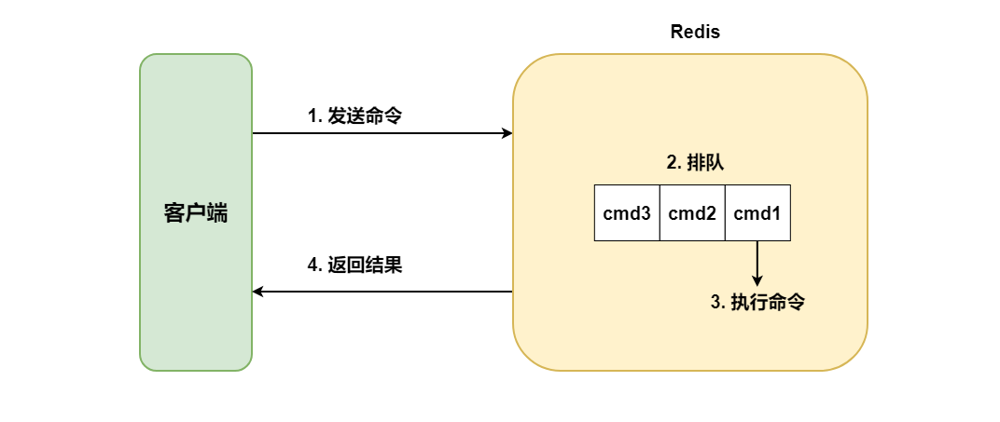
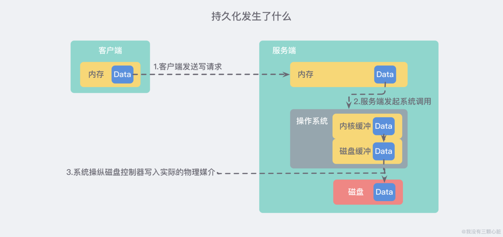
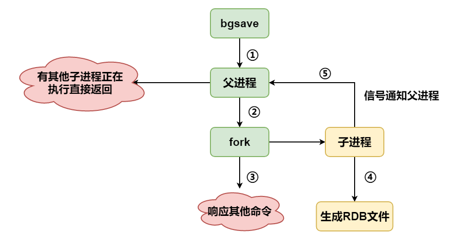
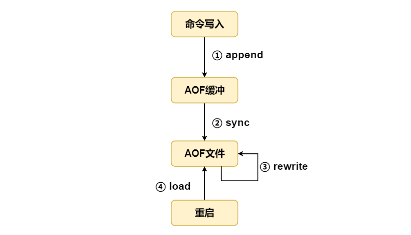
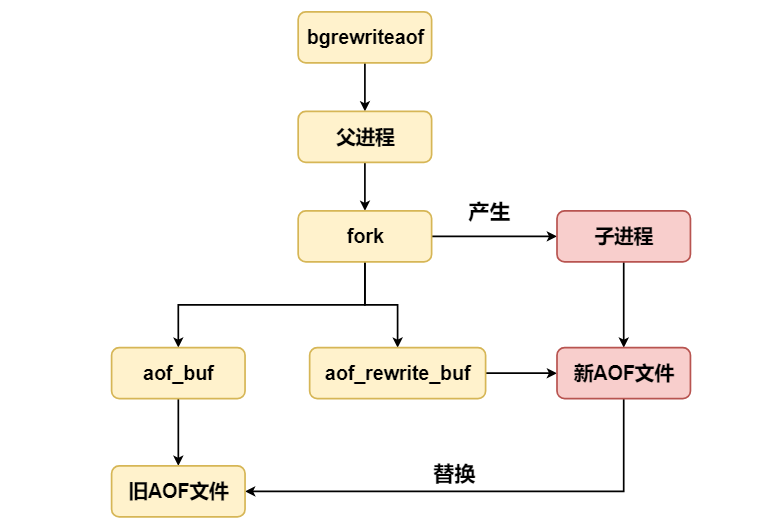
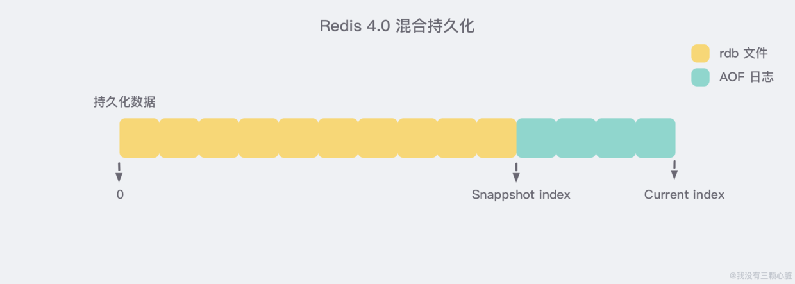
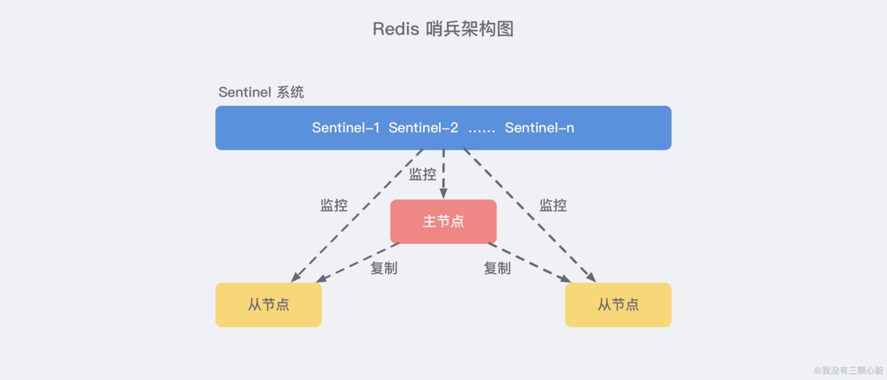
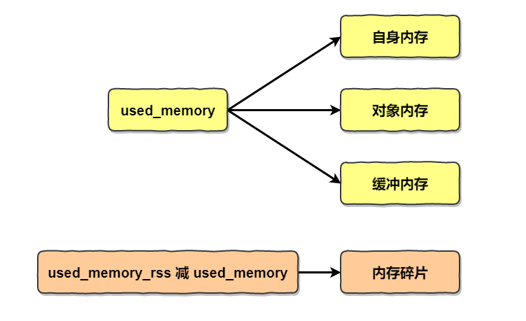
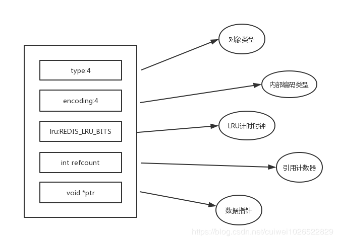

# 1. 缓存理论

## 1.1 缓存基本特征
### 1.1.1 命中率
缓存命中：某个请求能够通过访问缓存得到相应
### 1.1.2 最大空间
缓存通常位于内存中，比磁盘空间要小很多，最大空间不可能很大，当超过最大空间需要进行部分缓存数据淘汰
### 1.1.3 缓存淘汰(更新)策略
#### 1. FIFO/LRU/LFU算法剔除
剔除算法常用于缓存使用量超过预设最大值的时候。Redis使用maxmemory-policy参数设置剔除策略。
1. FIFO先进先出策略(First In First Out)
在实时性的场景下，需要经常访问最新的数据，就可使用这个策略。
2. LRU最近最久未使用策略(Least Recently Used)
优先淘汰最久未使用的数据。可以保证缓存中都是热点数据，也就是经常被访问的数据，从而保证缓存命中率
3. LFU最不经常使用策略(Least Frequently Used)
优先淘汰一段时间内使用次数最少的数据

#### 2. 超时剔除
给缓存设置超时时间，过期自动删除，如Redis中的expire命令

#### 3. 主动更新
对于高一致性要求场景，需要在真实数据更新后，立即更新缓存

## 1.2 缓存位置
1. 浏览器：当HTTP响应允许进行缓存时，浏览器会将HTML,CSS,JS,图片等静态资源缓存
2. ISP: 网络服务提供商(ISP)是网络访问的第一跳，通过将数据缓存在ISP能大大提高用户访问速度
3. 反向代理：反向代理位于服务器之前
4. 本地缓存
5. 分布式缓存
6. 数据库缓存
7. 程序内部缓存
8. CPU多级缓存

## 1.3 CDN
内容分发网络(Content distribution network)是一种互连的网络系统，利用更靠近用户的服务器将静态资源更快更可靠的分发给用户。

## 1.4 缓存问题
### 1.4.1 缓存穿透
对一个一定不存在的数据进行请求，就会穿透缓存到达数据库
#### 解决方案
首先可以在应用层记录一下缓存穿透的次数，方便问题查找与预警
- 参数校验
最基本就是做好参数校验，不合法的参数直接返回异常信息给客户端
- 缓存无效的key
如果缓存和数据库都查不到某个key的数据就写一个这个键的空对象到Redis中并设置过期时间；
可以解决请求的key变化不频繁的情况，但如果每次构建不同的请求key，会缓存大量无效的key，如果一定要用，将过期时间设置的短一些。
- 使用布隆过滤器
判断key是否合法。把所有可能存在的请求的值都放在布隆过滤器中，判断用户请求是否存在于过滤器中。
适用于数据命中率不高、数据相对固定、实时性低（通常是数据集大）的场景。

### 1.4.2 缓存雪崩
由于数据没有加载到缓存中，或者缓存数据同一时间大面积失效（过期），又或者缓存服务器宕机，导致大量请求到达数据库
#### 解决方案
- 为了防止缓存在同一时间大面积过期导致的缓存雪崩，可以通过**观察用户行为**，合理设置**缓存过期时间**来实现；
- 为了防止缓存服务器宕机出现的缓存雪崩，可以使用**分布式缓存**，保证**缓冲层的高可用**。分布式缓存中每一个节点只缓存部分的数据，当某个节点宕机时可以保证其它节点的缓存仍然可用，实现**高可用**。
- 也可以进行**缓存预热**，提前放一些数据到缓存中，避免在系统刚启动不久由于还未将大量数据进行缓存而导致缓存雪崩。
- **依赖隔离组件为后端限流并降级**。可以考虑进行服务降级，并对重要的资源进行**隔离**。
按时间节点来讲：
- **事前**：尽量保证整个 Redis 集群的**高可用性**，发现机器宕机尽快补上。选择合适的**内存淘汰策略**。
- **事中**：**本地 Ehcache 缓存** + **hystrix 限流&降级**，避免 MySQL 崩掉。
- **事后**：利用 Redis **持久化**机制保存的数据**尽快恢复缓存**。

### 1.4.3 缓存一致性问题
缓存层和存储层的数据存在着一定时间窗口的不一致性。缓存一致性要求数据**更新的同时缓存数据也能够实时更新**。
#### 解决方案
- 在数据更新的同时立即去更新缓存，一致性最高
- 在读缓存之前先判断缓存是否最新的，如果不是则先更新

### 1.4.4 缓存“无底洞”问题
为了满足业务要求添加了大量缓存节点，但是性能不但没有好转反而下降的现象。

**产生原因：**缓存系统通常采用hash函数将key映射到对应的缓存节点，随着缓存节点数目的增加，键值分布到更多的节点上，导致客户端一次批量操作会涉及**多次网络操作**，这意味着批量操作的耗时会随着节点数目的增加而不断增大。此外网络连接数变多，对节点的性能也有一定影响。
#### 解决方案
- 优化批量数据操作命令
- 减少网络通信次数
- 降低接入成本，使用长连接/连接池，NIO等

分布式条件下，以Redis的mget指令为例，有四种批量操作解决方案：
- 串行命令。逐次执行n个get命令
- 串行IO
- 并行IO
- hash_tag实现，可以强制将多个key强制分配到一个节点上，减少操作

## 1.5 数据分布
### 1.5.1 哈希分布
数据计算哈希值后，按照哈希分配到不同的节点上，hash(key)%N
存在问题：数据需要重新分布(再哈希)，可能导致大量数据迁移
### 1.5.2 顺序分布
顺序分布的优势：
- 能保持原有顺序
- 并且能够准确控制每台服务器存储的数据量，使得存储空间利用率最大

## 1.6 一致性哈希
Distributed Hash Table(DHT)：其目的是为了克服传统哈希分布在服务器节点数量变化再哈希时大量数据迁移的问题
### 1.6.1 基本原理
将哈希空间看做一个哈希环。每个数据对象通过哈希取模得到哈希值之后，存放到哈希环中顺时针方向第一个大于等于该哈希值的节点上。
一致性哈希在增加或者删除节点时只会影响到哈希环中相邻的节点
### 1.6.2 虚拟节点
一致性哈希存在数据分布不均的情况，主要是因为节点在哈希环分布的不均匀。
可以通过增加虚拟节点解决，将虚拟节点映射到真实节点上

## 1.7 缓存实现
## 1.7.1 本地缓存
自带的map等数据结构，在多实例情况下，每个实例都各自保存一份缓存，具有不一致性
## 1.7.2 分布式缓存
使用Redis或memcached的，在多实例情况下，每个实例共用一份缓存数据，缓存具有一致性。

# 2. Redis基础
## 2.1 概述
> **啥是 Redis？**

Redis 是速度非常快的**非关系型（NoSQL）内存键值数据库**，可以存储键和五种不同类型的值之间的映射。

### 2.1.1 Redis特性
- **速度快**：单线程模型、数据都在内存中。
- 基于**键值对**的数据结构服务器：NoSQL 非关系型。
- 丰富的功能：缓存、发布订阅、Lua 脚本、简单事务、流水线。
- 简单稳定。
- 客户端语言多：使用 TCP 通信。
- **可以持久化**：RDB 和 AOF。
- **主从复制**：实现数据多个副本。
- **高可用与分布式**：Redis Sentinel、Redis Cluster。

### 2.1.2 Redis的应用场景
#### 1. 缓存
将热点数据放到**内存**中，设置内存的**最大使用量**以及**淘汰策略**来保证缓存的命中率。

- **缓存热点数据**：缓存热点数据，可以降低数据库压力。
- **缓存 Session**：可以使用 Redis 来统一存储多台应用服务器的**会话信息**。当应用服务器不再存储用户的会话信息，使得服务器**无状态**，一个用户可以请求任意一个应用服务器，从而更容易实现高可用性以及**可伸缩性**。

#### 2. 消息队列与发布订阅系统
**List 是一个双向链表**，可以通过 lpush 和 rpop 写入和读取消息，从而实现**简单的**消息队列或发布订阅系统（但是不够强大）。不过最好使用 Kafka、RabbitMQ 等**消息中间件**。

#### 3. 分布式锁实现
在**分布式场景**下，无法使用单机环境下的锁来对多个节点上的进程进行同步。可以使用 Redis 自带的 **SETNX 命令**实现分布式锁，除此之外还可以使用官方提供的 **RedLock 分布式锁** 实现。

#### 4. 其它
- **社交网络**：**Set** 可以实现交集、并集等操作，从而实现**共同好友**等功能。
- **排行榜系统**：**ZSet** 可以实现**有序性**操作，从而实现**排行榜**等功能。
- **计数器**：可以对 **String** 进行自增自减运算，从而实现计数器功能。Redis 这种内存型数据库的读写性能非常高，很适合**存储频繁读写的计数量**。比如视频的播放量、商品浏览次数等。
- **查找表**：例如 **DNS** 记录就很适合使用 Redis 进行存储。查找表和缓存类似，也是利用了**Redis 快速**的查找特性。但是查找表的内容不能失效，而缓存的内容可以失效，因为缓存不作为可靠的数据来源。
- **附近位置、摇一摇**：Redis 的 GEO 功能可以用于实现附近位置，摇一摇这种基于位置信息的功能。

### 2.1.3 Redis与Memcached对比
两者都是**非关系型内存键值数据库**，主要有以下不同：
#### 1. 数据类型
Memcached **仅支持字符串类型**，而 Redis 支持五种不同的数据类型，可以更灵活地解决问题。
#### 2. 数据持久化
Redis 支持两种持久化策略：**RDB 快照和 AOF 日志**，而 Memcached**不支持**持久化。
#### 3. 分布式
Memcached **不支持分布式**，只能通过在客户端使用**一致性哈希**来实现分布式存储，这种方式在存储和查询时都需要先在客户端计算一次数据所在的节点。

Redis Cluster 实现了**分布式**的支持。
#### 5. 内存管理机制
在 Redis 中，并不是所有数据都一直存储在内存中，可以将一些**很久没用的 value 交换到磁盘**，而 Memcached 的数据则会**一直**在内存中。
Memcached 将内存分割成**特定长度的块**来存储数据，以完全解决内存碎片的问题。但是这种方式会使得内存的利用率不高，例如块的大小为 128 bytes，只存储 100 bytes 的数据，那么剩下的 28 bytes 就浪费掉了。

## 2.2 命令与架构基础
### 2.2.1 单线程架构
Redis 是单线程架构，单线程也没有了并发问题。

> **为什么单线程还能这么快**？

- **纯内存访问**。Redis 数据都存放在**内存**中，访问速度极快。
- **IO 多路复用架构**。Redis 使用 **epoll 作为 IO 多路复用技术的实现**，再加上 Redis 自身的事件处理模型将 **epoll** 中的连接、读写、关闭等都转化为事件，在 IO 上浪费时间少。
- **单线程架构**。简化了数据结构和算法的实现，同时**单线程避免了线程切换**的竞争产生的开销。

> **单线程可能引发的问题**？

如果每个命令**执行时间过长**，会造成其他命令的**阻塞**，这非常难受。

### 2.2.2 命令执行基本流程


- **发送命令**
- **命令排队**
- **执行命令**
- **返回结果**

其中 **发送命令 + 返回结果** 是通过**网络**进行的，使用命令时可以考虑尽量**减少这个次数**。由于是**单线程**架构，所以如果命令过多或者前面的命令执行阻塞着，后面的命令在队列中**排队执行**。**慢查询** 主要统计**执行命令** 的时间。

## 2.3 基本命令与数据类型
### 2.3.1 全局命令
列举一些常见的全部数据结构都**通用**的命令。

|          命令           |                             释义                             |
| :---------------------: | :----------------------------------------------------------: |
|       **keys ***        |         查看所有键（遍历所有键，O(N)，线上禁止使用）         |
|       **dbsize**        |        键总数（不会遍历所有键，直接从遍历获取，O(1)）        |
|     **exists key**      |            查看键是否存在（存在为 1，不存在为 0）            |
|  **del key [key ...]**  |                   删除键（可多个键同时删）                   |
| **expire key seconds**  | 对键添加过期时间（大于等于 0 即是过期时间，-1 是没有设置，-2 键不存在） |
|       **ttl key**       |                     查看键剩余的过期时间                     |
|      **type key**       |                       查看键的数据结构                       |
| **object encoding key** |                       获取键的内部编码                       |

### 2.3.2 键管理命令
#### 1. 单个键管理
##### (1) 键过期
与键过期相关的指令。
```
expire key seconds		# 键在seconds秒后过期
expire key timestamp	# 键在秒级时间戳timestamp后过期
ttl key					# 查看键过期剩余时间，秒级
pttl key				# 查看键过期剩余时间，毫秒级
expireat key timestamp	# 设置键的秒级过期时间戳
pexpire key milliseconds  # 键在milliseconds毫秒后过期
setex 					# 设置键并设置过期时间，多用！！
```
**过期时间**：
```
大于等于0的整数:键剩余过期时间
-1:键没有设置过期时间
-2:键不存在
```
与过期相关的命令需要**注意**：
- 如果 expire key 不存在，返回结果为 0。
- 如果设置过期时间为负值，键会立即被删除，犹如使用了 del 命令一样。
- 对于**字符串类型的键**，执行 **set 命令**会**去掉**过期时间（ttl 变为 -1），这个问题在开发中很容易被忽视。**setex 命令**做为 **set + expire** 命令的组合，即是原子命令，而且少了一次网络时间，开发多用！！
- Redis **不支持二级数据结构**（如hash、list）**内部元素的过期功能**，如不能对 hash 中某个元素设置过期。

##### (2) 迁移键
有三种方式：
- move：不建议使用。仅在实例内部用。
- **dump + restore**：dump 会将键值序列化，采用 RDB 格式。restore 将序列化的数据还原。
- **migrate**：实际就是将 dump 、restore、del 三个命令进行组合，从而简化了流程，而且具有原子性。**推荐使用**。

|      命令      |       作用域       | 原子性 | 支持多个键 |
| :------------: | :----------------: | :----: | :--------: |
|      move      |   Redis 实例内部   |   是   |     否     |
| dump + restore |   Redis 实例之间   |   否   |     否     |
|  **migrate**   | **Redis 实例之间** | **是** |   **是**   |

##### (3) 其他
**键重命名**：键重命名的时候会执行 del 命令删除旧的键，如果键对应的值较大，可能造成阻塞。
```
rename key newkey
```
**随机返回一个键**：
```
randomkey
```

#### 2. 遍历键
提供了两种遍历键的方式：**keys 和 scan**。
##### (1) keys全量遍历键
即使用 keys 命令。支持 pattern 匹配，如果是全部键则**pattern 为 \***。可以进行正则表达式匹配遍历键。

注意：如果包含**大量的键**，那么可能会造成 Redis **阻塞**！**生产环境别用**！
##### (2) scan渐进式遍历键
采用 scan 命令以**渐进式**的方式遍历键，以**解决 keys 指令可能造成的阻塞问题**，每次 scan 命令的时间**复杂度是 O(1)**。每次执行 scan 可以想象成只扫描一个字典中的**一部分键**，直到将字典中的所有键遍历完成。
```
scan cursor [match pattern] [count number]
```
- **cursor：游标**，必备参数。第一次遍历从 0 开始，每次 scan 遍历完会返回当前的 cursor 值，直到其值为 0， 表示遍历结束。
- match pattern：匹配模式，可选。
- count number：每次要遍历的键的个数，默认 10。

注意：每次 scan 完成都会返回上一次遍历的游标值，下一次请求时携带上从这个 cursor 开始遍历。注意：如果 scan 过程中如果有键的变化（增删改等），可能会造成键的遍历**不完全或重复的问题**。

此外还有其他集合类型的遍历指令。如 **hscan、sscan、zscan** 等来解决 hgetall、smembers、zrange 等可能带来的阻塞问题。

#### 3. 数据库管理
**切换数据库**：共有 16 个数据库。
```
select dbIndex
```
**清除数据库**：数据量大的话存在阻塞的可能性。
```
flushdb		# 清除当前数据库
flushall	# 清除全部数据库
```

## 2.4 数据结构与内部编码
有五种基本的数据结构，还有一些拓展的结构都是基于它们实现的。**键的类型只能为字符串，值支持五种数据类型：字符串、列表、集合、散列表、有序集合**。

|  数据类型  |        可以存储的值        |                             操作                             |
| :--------: | :------------------------: | :----------------------------------------------------------: |
| **STRING** |   字符串、整数或者浮点数   | 1. 对整个字符串或者字符串的其中一部分执行操作 <br/> 2. 对整数和浮点数执行自增或者自减操作 |
|  **LIST**  |            列表            | 1. 从两端**压入或者弹出**元素 <br/> 2. 对单个或者多个元素  <br/>3. 进行修剪，只保留一个范围内的元素 |
|  **SET**   |        **无序**集合        | 1. 添加、获取、移除单个元素 <br/>2. 检查一个元素是否存在于集合中 <br/>3. 计算交集、并集、差集<br/> 4. 从集合里面随机获取元素 |
|  **HASH**  | 包含**键值对**的无序散列表 | 1. 添加、获取、移除单个键值对  <br/>2. 获取所有键值对 <br/> 3. 检查某个键是否存在 |
|  **ZSET**  |        **有序集合**        | 1. 添加、获取、删除元素 <br/> 2. 根据分值范围或者成员来获取元素  <br/>3. 计算一个键的排名 |

每一种数据结构都有**两种以上**的**内部编码**实现。
> **为什么这样设计**？

可以改进内部编码但是**不影响对外**的数据结构和命令，可以**平滑升级**。多种内部编码在不同的应用场景下可以**发挥各自的优势**，比如有的数据结构可以节省内存。

|  数据结构  |           内部编码            |
| :--------: | :---------------------------: |
| **string** |       raw、int、embstr        |
|  **hash**  |    **hashtable**、ziplist     |
|  **list**  |    **linkedlist**、ziplist    |
|  **set**   |     **hashtable**、intset     |
|  **zset**  | **skiplist（跳表）**、ziplist |

## 2.5 String
非常重要啊，其他的都是基于这个来的。字符串类型的**值**可以是：**简单字符串、复复杂字符串（JSON、XML等）、数字（整数、浮点数）、甚至是二进制（图片、视频、音频等）**，最大 512M。
### 2.5.1 常用命令
#### 1. 设置值
```
set key value [ex seconds] [px milliseconds] [nx|xx]
```
- **ex seconds**: 设置**秒级**过期时间。
- **px milliseconds**: 设置**毫秒级**过期时间。
- **nx**: 键必须**不存在**才可以设置成功，用于**添加**。
- **xx**: 键必须**存在**才可以设置成功，用于**更新**。

除了 set 之外，还有两个命令：setex，extnx。其作用与上述的 ex 和 nx 选项相同。
```
setex key seconds value
setnx key value
```

>  **extnx的应用**

由于 Redis 的**单线程**机制，如果**多个**客户端同时执行 setex key seconds value，根据 setnx 的特性则**只有一个**客户端能够设置成功，所以 setnx 可以作为**分布式锁**的一种实现方案。

#### 2. 获取值
```
get key	# 键不存在返回nil（空）
```
#### 3. 批量设置值
```
mset key value [key value ...]	# 一次性设置多个值
```
#### 4. 批量获取值
```
mget key [key ...]
mget a b c d
```
批量设置与获取可以提高效率，因为如果执行 N 次单个 get 命令会在网络中**往返 N 次**，而批量操作只会在网络中**往返 1 次**，可以**预防 Redis 或网络阻塞**。
#### 5. 计数
```
incr key
decr key
incrby key increment
decrby key decrement
incrbyfloat key increment
```
可以自增、自减、设置增量。Redis 由于其**单线程**架构，计数的时候贼方便，都不需要使用 CAS 来保证计数准确性。
#### 6. 其他
```
append key value   	# 在字符串后面追加value，变长
strlen key			# 字符串长度
getset key value	# 设置并返回原值，返回键原来的值
getrange key start end  # 获取部分字符串
```

### 2.5.2 内部编码
- **int**：8 字节的长整形。
- **embstr**：小于等于 39 个字节的字符串。
- **raw**：大于 39 个字节的字符串。

Redis 会根据当前值的**类型和长度**决定使用哪种内部编码实现。

### 2.5.3 典型使用场景
**缓存功能**：推荐的键名定义方式：**业务名：对象名：id：[属性]**。

**计数**：快速计数、查询缓存，比如实现**视频播放数计数**。

**共享session**：使用 Redis 存储各个 Web 服务器的 **session** 信息，集中管理。

**限速**：防止短信功接口被频繁访问，限制一分钟内只能请求一次。限制一个 IP 地址在一分钟内的访问次数。

### 2.5.4 Hash
结构像下面这样，KEY 里面的 **value** 才包含**真正的 key 和 value**。


Hash 类型的**值**本身又是一个**键值对结构**。注意业务重点关注 **Filed ：Value** 关系。
#### 1. 命令
##### (1) 设置值
```
hset key field value
```
```
hest user:1 name tom
```
##### (2) 获取值
```
hget key field
```
````
hget user:1 name
````
##### (3) 删除field
```
hdel key field [field ...]
```
可以批量删除 field 的个数:
```
hdel user:1 name address class
```
##### (4) 计算field个数
```
hlen key
```
##### (5) 批量设置与获取
```
hmget key field [field ...]		# 批量获取
hmset key field value [field value...]  # 批量设置
```
##### (6) 判断filed是否存在
```
hexists key field
```
##### (7) 其他
```
hkeys key  		# 获取所有field
hvals key		# 获取所有value
hgetall key		# 获取所有的field-value，即返回Map
hincrby key field 		# 自增，作用在field上
hincrbyfloat key field  # 自增
```

#### 2. 内部编码
- **ziplist**（压缩列表）：当 filed**个数少**且没有大的 value 时使用。
- **hashtable**（哈希表）：当 filed 个数多或有大的 value 时使用。

ziplist 更加**紧凑**，在数据量较少时可以连续存储元素，更节约内存。

#### 3. 使用场景
##### (1) 缓存用户信息
可以用于记录的**用户信息**，比如 key 是用户的 id，field 是用户的信息（如名字、学校等），value 是信息的值。

好处：hash 是紧凑的，有这个值才设置，而关系型数据库是稀疏的，没有也会占位置。比如有的用户没有电话信息，在关系型数据库也会为 null，而在 hash 中直接不管即可。

缓存用户信息的几种实现方式：
- 原生字符串：每个属性一个键（键太多了）。
- 序列号字符串类型：将用户信息序列号之后用一个键保存（需要反序列化）。
- 使用 hash：只用一个键保存 id，用户信息用 field-value 保存。

#### 4. 再哈希
Redis 中的字典相当于 Java 中的 **HashMap**，内部实现也差不多类似，都是通过 **"数组 + 链表"** 的链地址法来解决部分 **哈希冲突**，同时这样的结构也吸收了两种不同数据结构的优点。

**实际上 hash 结构的内部包含两个 hashtable**，通常情况下**只有一个** hashtable 是**有值**的，但是在字典扩容缩容时，需要分配新的 hashtable，然后进行 **渐进式搬迁**。

大字典的扩容是比较耗时间的，需要**重新申请新的数组**，然后将旧字典所有链表中的元素重新挂接到新的数组下面，这是一个 **O(n) 级别**的操作，作为单线程的 Redis 很难承受这样耗时的过程，所以 Redis 使用 **渐进式 rehash** 小步搬迁：


渐进式 rehash 会在 rehash 的同时，保留**新旧两个 hash 结构**，如上图所示，如果正在迁移那么查询时会**同时查询两个 hash 结构**，然后在后续的定时任务以及 hash 操作指令中，循序渐进的把旧字典的内容迁移到新字典中。当搬迁完成了，就会使用新的 hash 结构取而代之。

### 2.5.5 List
列表用于存储多个**有序**的字符串，每个字符串称为元素。由于元素是**有序**的，所以可以通过**索引**来访问元素或者进行**范围访问**。可以充当栈与队列的角色。

列表从左到右索引为 **0 ~ N - 1**，从右到左为 **-1 ~ -N**。

#### 1. 命令
##### (1) 插入元素
**左右两边** 插入元素：插入两端。
```
lpush key value [value...]
rpush key value [value...]
```
**指定位置处**插入元素：找到**等于 pivot** 的元素并在前或后插入元素。
```
linsert key before|after pivot value
```
##### (2) 查找元素
获取指定范围元素。
```
lrange key start end
lrange key 0 -1 	# 列出全部元素
```
获取列表指定索引下标的元素。
```
lindex key index
lindex name -1	# 获取最后一个元素
```
获取列表长度。
```
llen key
```
##### (3) 删除元素
左右两边弹出删除。
```
lpop key
rpop key
```
按照索引范围修建列表。
```
ltrim key start end
```
##### (4) 修改元素
修改指定索引处的元素。
```
lset key index newValue
```
##### (5) 阻塞弹出
阻塞式弹出元素。从左右阻塞式弹出元素，即普通弹出的阻塞版本。
```
blpop key [key...] timeout
brpop key [key...] timeout
```
**key [key...]**：多个列表的键。**timeout**：阻塞时间。
- 若列表为空，timeout = 3，则客户端等待 3 秒后返回，若 timeout = 0，则此时客户端一直阻塞等下去。若等待期间插入元素则立即返回。
- 列表不为空，立即返回。

> **使用 brpop 需要注意的点**

如果是多个键，那么 brpop 会从左到右遍历键，一旦有一个键能弹出元素，客户端立即返回。如果多个客户端对同一个键执行 brpop，那么最先执行 brpop 命令的客户端可以先获取到弹出值。然后后面的继续阻塞。

#### 2. 内部编码
- **ziplist**：**压缩列表**。元素少且元素长度小时使用，减少内存消耗。
- **linkedlist**：**链表**。元素多使用。

#### 3. 使用场景
##### (1) 消息队列
使用 **lpush + brpop** 可以实现**阻塞队列**，生产者客户端使用 lpush 生产，多个消费者客户端从使用 brpop 命令阻塞式“抢”列表中的元素，多个客户端保证了消费的负载均衡和高可用。
- **lpush + lpop = Stack**（栈）
- lpush + rpop = Queue（队列）
- lpush + ltrim = Capped Collection（有限集合）
- lpush + brpop = Message Queue（消息队列）

##### (2) 文章列表
每个**用户的文章列表**用 list 存储，然后可以分页获取列表。

### 2.5.6 Set
用于保存多个字符串元素，与列表不同，set 中元素**不能重复**，并且集合中元素是**无序**的。除增删改查之外还可以做多个集合的**交集、并集、差集**。
#### 1. 命令
##### (1) 集合内操作
添加元素。
```
sadd key element [element...]
```
删除元素。
```
srem key element [element...]
```
计算元素个数：是 **O(1)** 的命令，不会遍历集合的元素，而是直接用 Redis 的内部计数变量。
```
scard key
```
判断元素是否在集合中：是则返回 1，不是返回 0。
```
sismember key element
```
随机返回集合汇总指定个数元素，默认返回一个，不删除元素。
```
srandmember key [count]
```
从集合随机弹出元素，并且删除。
```
spop key
```
获取所有元素，结果无序。是比较重的指令，元素过多会**阻塞**。
```
smembers key
```

##### (2) 集合间操作
求多个集合的交集。
```
sinter key [key...]
```
求多个集合的并集。
```
sunion key [key...]
```
求多个集合的差集。
```
sdiff key [key...]
```
将**结果进行保存**。将集合间交集、并集、差集的结果保存在 destination key 中。
```
sinterstore destination key [key...]
sunionstore destination key [key...]
sdiffstore destination key [key...]
```

#### 2. 内部编码
- **intset**：元素是整数且个数较少时使用。
- **hashtable**：元素较多或不全是整数时使用。

#### 3. 使用场景
##### (1) 标签
集合类型的典型场景是**标签**。比如一个用户的兴趣点就是标签，使用集合间的交并差就可以用在**社交**上了，比如计算**共同兴趣**。
- sadd = Tagging（标签）
- spop/srandmember = Random item（生成随机数，比如抽奖）
- sadd + sinter = Social Graph（**社交需求**）

### 2.5.7 Zset
Zset 在 **Set 类型**的基础上增加了一个**分数**，其特性为元素**不可重复**且多了**排序**的功能。元素不能重复但是 **score 可以重复**。

比较一下 列表、集合、有序集合。
| 数据结构 | 是否允许元素重复 | 是否有序 | 有序实现方式 |        应用场景        |
| :------: | :--------------: | :------: | :----------: | :--------------------: |
| **List** |        是        |    是    |   索引下标   | **时间轴、消息队列**等 |
| **Set**  |        否        |    否    |      无      |  **标签、社交系统**等  |
| **Zset** |        否        |    是    |    分数值    |   **排行榜系统**等。   |

#### 1. 命令
##### (1) 集合内操作
添加成员。
```
zadd key score member [score member...]
```
计算成员个数。
```
zcard key
```
计算某个成员分数。
```
zscore key member
```
计算成员排名。
```
zrank key member	# 从低到高排名
zrevrank key member	# 从高到低排名
```
删除成员。
```
zrem key member [member...]
```
增加成员分数。
```
zincrby key increment member
```
返回**指定排名范围**的成员。
```
zrange key start end [withscores]	# 从低到高返回
zrevrank key start end [withscores] # 从高到低返回
```
返回**指定分数范围**的成员，也有正反两种方式。
```
zrangescore key min max [withscores] [limit offset count]
zrevrankscore key min max [withscores] [limit offset count]
```
返回指定分数范围成员的**个数**。
```
zcount key min max
```
删除指定**排名内**的升序元素。
```
zremrangebyrank key start end
```
删除指定**分数范围**的成员。
```
zremrangebyscore key start end
```

##### (2) 集合间操作
两集合交集。
```
zinterstore destination numkeys key [key...] [weights weight [weight...]] [aggregate sum|min|max]
```
两集合并集。
```
zunionstore destination numkeys key [key...] [weights weight [weight...]] [aggregate sum|min|max]
```

#### 2. 内部编码
- **ziplist**：压缩列表。元素个数较少且值较小时用。
- **skiplist**：**跳表**。元素个数多或值大时用。（后面详细介绍跳表）

#### 3. 使用场景
##### (1) 排行榜系统
典型应用就是**排行榜系统**啊。比如按用户点赞数，按播放数排名。可以轻易获取排行榜前十的内容。

## 2.6 重要底层数据结构
### 2.6.1 字典dictht
**dictht** 是一个**散列表**结构，使用**拉链法保存哈希冲突**。

Redis 的字典 dict 中包含**两个哈希表 dictht**，这是为了方便**进行 rehash 操作**。在扩容时，将其中一个 dictht 上的键值对 rehash 到另一个 dictht 上面，完成之后**释放空间并交换**两个 dictht 的角色。

**rehash** 操作不是一次性完成，而是采用**渐进方式**，这是为了避免一次性执行过多的 rehash 操作给服务器带来过大的**负担（阻塞）** 。

渐进式 rehash 通过记录 dict 的 rehashidx 完成，它从 0 开始，然后每执行一次 rehash 都会递增。例如在一次 rehash 中，要把 dict[0] rehash 到 dict[1]，这一次会把 dict[0] 上 table[rehashidx] 的键值对 rehash 到 dict[1] 上，dict[0] 的 table[rehashidx] 指向 null，并令 rehashidx++。

**在 rehash 期间**，每次对字典执行添加、删除、查找或者更新操作时，都会**执行一次渐进式 rehash**。

采用渐进式 rehash 会导致字典中的数据分散在**两个** dictht 上，因此对字典的查找操作也需要分别到两个 dictht 去执行。

### 2.6.2 跳表
**跳表**是 **zset** 的底层实现之一。

跳跃表是基于**多指针有序链表**实现的，可以看成多个**有序链表**。


在**查找**时，从**上层指针**开始查找，找到对应的区间之后再到**下一层**去查找。下图演示了查找 22 的过程。


> **为什么要用跳表而不用其他数据结构？**

首先，因为 zset 要支持**随机的插入和删除**，所以它**不宜使用数组来实现**，关于排序问题，也很容易就想到 **红黑树/ 平衡树** 这样的树形结构，与红黑树等平衡树相比，跳跃表具有以下优点：
- **插入速度非常快速，因为不需要进行旋转等操作来维护平衡性**。
- 更容易实现。
- 支持**无锁操作**。

### 2.6.3 redisObject对象
#### 1. 概述
redisObject 是一个**结构体**。Redis 内部使用一个 redisObject 对象来表示**所有的 key 和 value**，每次在 Redis 数据块中创建一个键值对时，一个是键对象，一个是值对象，而 Redis 中的**每个对象都是由 redisObject 结构来表示**。

redisObject 最主要的信息：
```
typedef struct redisObject{
    // 类型
    unsigned type:4;
    // 编码
    unsigned encoding:4;
    // 指向底层数据结构的指针
    void *ptr;
    // 引用计数，用于内存回收
    int refcount;
    // 记录最后一次被程序访问的时间
    unsigned lru:22;
} robj
```

#### 2. 内存回收与共享
因为 c 语言不具备自动内存回收功能，当将 redisObject 对象作为数据库的键或值而不是作为参数存储时其生命周期是非常长的，为了解决这个问题，Redis **自己构建了一个内存回收机制**，通过 redisobject 结构中的 **refcount** 实现。这个属性会随着对象的**使用状态而不断变化**。当对象的引用计数值变为 0 时，对象所占用的**内存就会被释放**。refcount 属性除了能实现内存回收以外，还能实现内存共享 。

## 2.7 Redis高级功能
### 2.7.1 慢查询分析
通过慢查询分析找到有问题的命令进行优化。可以通过**慢查询日志**来进行分析。慢查询只统计**执行命令的时间**，而不统计网络传输的时间和排队时间。

**慢查询记录**保存在**慢查询日志**中，这是一个**先进先出队列**，可以**设置队列大小**。

#### 1. 配置参数
在**配置文件**中配置下面参数：
```
# 记录超过time时间的命令，判定为慢查询，单位微秒，默认10000微秒
slowlog-log-slower-than	time
# 设置慢查询结果列表的最大长度
slowlog-max-len
```
也可命令行动态修改：
```
config slowlog-log-slower-than	20000
config slowlog-max-len 1000
# 将配置持久化到配置文件中
config rewrite
```

#### 2. 查看慢查询日志
慢查询日志记录其实是放在**列表**中的。

获取慢查询日志（指定条数 n）：
```
slowlog get [n]
```
获取当前慢查询列表长度：
```
slowlog len
```
重置慢查询日志：
```
slowlog reset
```
#### 3. 最佳实践
- **slowlog-log-slower-than**：默认值 **10000** 微秒，也就是超过 **10 毫秒** 判定为慢查询，需要根据 Redis 的 **并发量** 调整该值。高流量场景建议设置低一些。
- **slowlog-max-len**：建议线上**调大慢查询列表**，可以保存更多慢查询记录。
- **慢查询记录持久化**。防止慢查询日志队列溢出，可以定期使用 slowlog get 指令获取慢查询记录并 **持久化到 MySQL 中**，然后清理已经持久化的慢查询记录。

### 2.7.2 Pipeline流水线
流水线技术采用将多条**命令打包**的方式将命令发送到 Redis 进行执行，并将**多条命令**的执行结果以**打包**的方式返回给客户端，这样多条命令**只在网络中传输一次**，这就大大**节省了网络中传输命令的**时间。

许多客户端带有这个功能，如 Jedis。客户端与服务端网络延时越大，效果越明显。而且组装后的命令比单个命令逐一执行要快。

注意：如果一次 Pipeline 操作数据量或命令太多，可能导致**阻塞**，可以分成几次执行。

> **原生的批量操作命令** 如 mget 一次也能批量操作数据，和 **Pipeline** 有什么不同？

- **原生批量** 操作命令是 **原子** 的，**Pipeline 是非原子** 的。
- **原生批量** 命令是 **一个命令对应多个 key**，Pipeline 则支持 **多个命令** 。
- **原生批量** 命令是 Redis **服务端** 支持实现，而 Pipeline 由 **客户端和服务器共同支持** 实现。

### 2.7.3 事务与Lua
为了保证多条命令组合的 **原子性**， Redis 提供了 **简单的事务** 功能以及 **集成 Lua 脚本** 来解决。
#### 1. 简单事务
Redis 事务**需要将多个命令放到 multi 和 exec 命令直接执行**。这两个命令直接的命令是原子执行的。执行 multi 命令后，后面的命令并**不会立即执行**，而是暂时保存起来，直到执行 exec 命令才**统一执行**。一个事务包含了**多个命令**，服务器在执行事务期间就不会去执行其它客户端的命令请求。

使用 discard 命令取代 exec 命令可以停止事务功能。

事务中的**多个命令被一次性发送**给服务器，而不是一条一条发送，这种方式被称为**流水线**，它可以减少客户端与服务器之间的网络通信次数从而提升性能。

|   命令    |                             含义                             |
| :-------: | :----------------------------------------------------------: |
| **MULTI** | 表示**开始收集命令**，后面所有命令都**不是马上执行**，而是加入到一个**队列**中 |
| **EXEC**  |         **执行** MULTI 后面命令**队列中的所有命令**          |
|  DISCARD  |                     放弃执行队列中的命令                     |
|   WATCH   | "观察"，"监控"一个 KEY, 在当前队列外的其他命令操作这个 KEY 时，**放弃执行自己**队列的命令，是一种**乐观锁**的策略 |
|  UNWATCH  |                       放弃监控一个 KEY                       |

**之所以是简单事务是因为 Redis 在事务失败时不进行回滚，而是继续执行余下的命令**, 这与传统事务型数据库不一样，以下是这种做法的优点：
Redis 命令只会因为错误的**语法而失败**（并且这些问题不能在入队时发现），或是命令用在了错误类型的键上面：这也就是说，从实用性的角度来说，**失败的命令是由编程错误** 造成的，而这些错误应该在开发的过程中被发现，而不应该出现在生产环境中。因为不需要对回滚进行支持，所以 Redis 的内部可以**保持简单且快速**。因此需要**加强对生产环境中的错误异常处理**。

Redis 事务的几个性质：
- **单独的隔离操作**：事务中的所有命令会被序列化、按顺序执行，在执行的过程中不会被其他客户端发送来的命令打断。
- **没有隔离级别的概念**：队列中的命令在事务没有被提交之前不会被实际执行。
- **不保证原子性**：Redis 中的一个事务中如果存在命令执行失败，那么其他命令依然会被执行，没有回滚机制。
- Redis 是以**乐观锁**的策略操作事务的，如上述的 WATCH 指令，没有悲观锁。

> **事务执行出错怎么办？**

分为两种，一是**命令错误**。即命令写错了，这种时候**不执行**事务。

第二种是**运行时错误**，语法正确但是发生一些异常，这种时候前面之前的命令是不会变化的，也就是 Redis **不支持回滚**。需要开发人员自己解决。

#### 2. 集成Lua脚本
集成 Lua 脚本可以**自己定义指令**。执行 Lua 脚本用 **eval**（单次调用脚本，每次都传输到服务端） 或 **evalsha**（脚本存在服务端，复用） 命令。

Lua 脚本发送到服务端之后会被当做一个**普通命令**排队执行。

### 2.7.4 Bitmaps
实现**对位**的操作，可以节约内存。Bitmaps 本身也是一种**字符串**，只不过可以对字符串的**位**进行操作。可以把它想成一个以位为单位的数组，数组中每个单元**只能存储 0 或 1**，数组的下标称为**偏移量**。

#### 1. 命令
**设置值**：设置键的第 offset 个位（从 0 算起）的值。
```
setbit key offset value
```
**获取值**：获取 offset 处的值。
```
getbit key offset
```
**获取 1 的个数**：获取 Bitmaps 指定范围内值为 1 的个数（不给范围则为全部）。
```
bitcount key [start end]
```
**Bitmaps 间的运算**：可以做多个 Bitmaps 直接的交集、并集、非、异或等操作并将结果放在 destkey 中。
```
bitop and|or|not|xor destkey key [key ...]
```
计算 Bitmaps 中第一个值为 targetBit 的偏移量。
```
bitops key targetBit [start] [end]
```

#### 2. 使用场景
- 可以用于用户**登录统计**（如活跃用户数统计）。
- 网址**黑名单、白名单**。

### 2.7.5 HyperLogLog
#### 1. 概述
HyperLogLog 实际也是**字符串**类型。它是一种**基数算法**， 通过 HyperLogLog 可以利用**极小的内存**空间完成**独立总数**的统计，数据集可以是 **IP、Email、ID** 等。

提供了三个命令：**pfadd、pfcount、pfmerge**。

HyperLogLog 使用内存量小的惊人，所以存在一定的**误差率**，官方给 0.81% 误差。

使用场景：
- 只为了计算**独立总数**、不需要获取单条数据。
- 能够容忍一定的误差率。

### 2.7.6 发布订阅
Redis 也提供了发布消息、订阅频道、取消订阅以及按照模式订阅的**基础**发布订阅功能。


相比于专业的消息队列系统，Redis 的发布订阅略显**粗糙**，例如**无法实现消息堆积和回溯**。如果能容忍的场景是可以的，因为实现简单。可以用于变更通知。

### 2.7.7 GEO
Redis 提供了 GEO（**地理信息定位**）的功能，可以方便的存放**地理位置**。可以用于实现**附近位置，摇一摇**这种基于位置信息的功能。GEO 底层采用 **zset** 实现。

GEO 可以存储地理位置的**精度、维度、成员信息**。可以使用 GEO 方便的计算两个位置之间的**距离**以及其他位置信息。

在一个地图应用中，车的数据、餐馆的数据、人的数据可能会有百万千万条，如果使用 **Redis** 的 **Geo** 数据结构，它们将 **全部放在一个** zset 集合中。在 **Redis** 的集群环境中，集合可能会从一个节点迁移到另一个节点，如果单个 key 的数据过大，会对集群的迁移工作造成较大的影响，在集群环境中单个 key 对应的数据量不宜超过 1M，否则会导致集群迁移出现卡顿现象，影响线上服务的正常运行。所以建议 **Geo** 的数据使用 **单独的 Redis 实例部署**，不使用集群环境。

如果数据量过亿甚至更大，就需要对 **Geo** 数据进行拆分，按国家拆分、按省拆分，按市拆分，在人口特大城市甚至可以按区拆分。这样就可以显著降低单个 zset 集合的大小。

### 2.7.8 事件
Redis 服务器是一个**事件驱动**程序。
#### 1. 文件事件
**服务器** 通过 **套接字** 与客户端或者其它服务器进行通信，**文件事件就是对套接字操作的抽象**。

Redis 基于 **Reactor 模式** 开发了自己的网络事件处理器，使用 I/O **多路复用** 程序来同时监听多个套接字，并将到达的事件传送给文件事件分派器，分派器会根据套接字产生的**事件类型**调用相应的事件处理器。


#### 2. 时间事件
服务器有一些操作需要在**给定的时间点**执行，时间事件是对这类定时操作的抽象。

时间事件又分为：
- **定时事件**：是让一段程序在指定的时间之内执行一次。
- **周期性事件**：是让一段程序每隔指定时间就执行一次。

Redis 将所有时间事件都放在一个**无序链表**中，通过遍历整个链表查找出已到达的时间事件，并调用相应的事件处理器。

#### 3. 事件的调度与执行
服务器需要**不断监听文件事件的套接字**才能得到待处理的文件事件，但是不能一直监听，否则时间事件无法在规定的时间内执行，因此监听时间应该根据距离现在最近的时间事件来决定。

从事件处理的角度来看，服务器运行流程如下：


## 2.8 其他
### 2.8.1 Redis客户端操作
Redis 使用**单线程**来处理多个客户端的访问。

#### 1. 客户端通信协议
客户端与服务端的通信协议建立在 **TCP** 至上。Redis 定义了 **RESP** （Redis 序列化协议）用于客户端与服务端交互。有了这个通信协议各个编程语言就可以自己实现相应的 Redis 客户端。
#### 2. Jedis
**Jedis** 是 Java 中的 Redis 客户端。基础使用是用**直连**的方式，但是最好使用 **Jedis 连接池** （JedisPool）的方式进行操作，这样可以减少连接时创建 **TCP 连接** 的开销。JedisPool 是**单例**的。

Jedis.close() 在**直连状态**下是**关闭连接**，如果使用了连接池，则使用完成后 **close 操作不是关闭** 连接，而是**归还**到连接池中。
#### 3. 客户端管理
Redis 提供了客户端相关的 API 对其**状态进行监控和管理**。
##### (1) 输入与输出缓冲区
**输入缓冲区**：Redis 为每个客户端分配了输入缓冲区，作用是将客户端**发送的命令进行缓存**，之后 Redis 会逐渐**拉取**指令并执行。如果有指令执行时间过长，可能导致输入缓冲区指令堆积严重。

**输出缓冲区**：Redis 也为每个客户端分配了输出缓冲区，作用是**保存返回给客户端命令执行的结果**，为与客户端交互返回结果提供缓冲。按客户端不同输出缓冲区还可以具体分为普通客户端输出缓冲区、发布订阅输出缓冲区、复制输出缓冲区。实际上输出缓冲区由两部分组成：**固定缓冲区（16K）和动态缓冲区**，固定缓冲区（使用的是字节数组）返回比较小的执行结果，动态缓冲区（使用的是列表）返回比较大的结果。固定缓冲区用尽则使用动态缓冲区。

##### (2) 客户端管理指令
**列出与 Redis 服务器相连接的所有客户端连接信息**：输出每一行就表示一个客户端连接。每个连接都有一些重要的属性。如**标识属性**：id（唯一 ID）、addr（客户端连接 IP 与端口）、fd（socket 的文件描述符）、name（客户端名字），**输入缓冲区属性**：qbuf（输入缓存区总容量）、qbuf-free（输入缓存区剩余容量）、**输出缓冲区属性**：obl、oll、omem，**存活状态属性**：age（已连接时间）、idle（最近一次空闲时间）。

# 3. Redis持久化
## 3.1 持久化概述
持久化方式：**RDB、AOF、混合持久化**。


1. 客户端向数据库**发送写命令** (数据在客户端的内存中)。
2. 数据库**接收**到客户端的**写请求** (数据在服务器的内存中)。
3. 数据库**调用系统 API**将数据写入磁盘 (数据在内核缓冲区中)。
4. 操作系统将**写缓冲区**传输到**磁盘控控制器** (数据在磁盘缓存中)。
5. 操作系统的磁盘控制器将数据 **写入实际的物理媒介** 中 (数据在磁盘中)。

**注意**：上面的过程其实是 **极度精简** 的，在实际的操作系统中，**缓存**和**缓冲区**会比这 **多得多**。

## 3.2 RDB持久化
RDB 持久化是把当前进程数据生成**快照**保存到硬盘的过程。
### 3.2.1 触发机制
触发 RDB 持久化过程分为**手动触发**和**自动触发**。
#### (1) 手动触发
**手动触发** 分别对应 **save** 和 **bgsave** 命令。
**save**：**阻塞** 当前 Redis 服务器，直到 RDB 过程完成。如果数据量大可能阻塞太长，已经**废弃**，生产环境别用。
**bgsave**：Redis 进程执行 **fork** 操作创建**子进程**，RDB 持久化过程由**子进程负责**，完成后自动结束。**阻塞只发生在 fork 创建子进程的阶段，一般时间很短**，生产环境使用。

#### (2) 自动触发
自动触发的场景：
- **save m n** 表示如果在 m 秒内数据集存在 n 次修改时，**自动触发 bgsave**。
- 如果从节点执行 **全量复制** 操作，主节点自动执行 bgsave 生成 RDB 文件并发送给从节点。
- 执行 debug reload 命令重新加载 Redis 时，也会自动触发 save 操作。
- 默认情况下执行 shutdown 命令时，如果没有开启 AOF，则自动执行 bgsave。

### 3.2.2 流程说明
#### 1. 流程概述
**bgsave** 是主流的触发 RDB 持久化的方式，流程如下：


1. Redis 父进程首先判断：当前**是否正在执行** save 或 bgsave/bgrewriteaof（后面会详细介绍该命令）的子进程，如果在执行则 bgsave 命令**直接返回**。bgsave/bgrewriteaof 的子进程**不能同时执行**，主要是基于性能方面的考虑：两个并发的子进程同时执行大量的磁盘写操作，可能引起严重的性能问题。
2. 父进程执行 **fork** 操作**创建子进程**，这个过程中**父进程是阻塞**的，Redis 不能执行来自客户端的任何命令，但这个阻塞时间**很短**。
3. 父进程 fork 创建完子进程后，**bgsave 命令** 返回 "Background saving started" 信息并 **不再阻塞** 父进程，并可以响应其他命令。
4. 子进程**创建 RDB** 文件，根据**父进程内存快照生成临时快照文件**，完成后对**原有文件**进行**原子替换**。
5. 子进程发送信号给父进程表示完成，父进程**更新统计信息**。

#### 2. 写时复制机制
RBD 也叫“**快照**”持久化。操作系统多进程写时复制 **COW(Copy On Write) 机制** 十分重要。**Redis** 在持久化时会调用 glibc 的函数 **fork** 产生一个**子进程**，简单理解也就是基于当前进程 **复制** 了一个进程，主进程和子进程会**共享**内存里面的代码块和数据段：


所以 **快照持久化** 可以完全交给 **子进程** 来处理，**父进程** 则继续 **处理客户端请求**。**子进程** 做数据持久化，它**不会修改现有的内存数据结构**，它只是对数据结构进行**遍历读取**，然后序列化写到磁盘中。但是 **父进程** 不一样，它必须持续服务客户端请求，然后对**内存数据结构进行不间断的修改**。

这个时候就会使用操作系统的 **Copy On Write 机制**来进行 **数据段页面** 的**分离**。数据段是由很多操作系统的页面组合而成，当父进程对其中一个页面的数据进行**修改**时，会将**被共享的页面复制一份分离**出来，然后 **对这个复制的页面进行修改**。这时 **子进程** 相应的页面是 **没有变化的**，还是进程产生时**那一瞬间**的数据。

子进程因为数据没有变化，它能看到的**内存里的数据在进程产生的一瞬间就凝固**了，再也不会改变，这也是为什么 **Redis** 的持久化 **叫「快照」的原因**。接下来子进程就可以非常安心的遍历数据了进行序列化写磁盘了。

### 3.2.3 RDB文件
RDB 文件是经过**压缩的二进制文件**，Redis 默认采用 **LZF 算法**对生成的 RDB 文件做**压缩处理**，压缩后的文件**远远小于**内存大小。

**RDB 文件保存在 dir 配置指定的目录下，文件名通过 dbfilename 配置**。

### 3.2.4 RDB优缺点
#### 1. 优点
RDB 文件是紧凑压缩的二进制文件，消耗**空间少**。RDB 文件代办某个时间点上的**数据快照**，所以非常适合于**备份，全量复制**等场景。Redis **加载 RDB 文件恢复数据的速度远远快于** AOF 方式。
#### 2. 缺点
RDB **无法做到实时持久化，秒级持久化**。因为 RDB 属于**重量级操作**，不能频繁执行。一般用于**数据冷备和复制传输**。RDB 是用特定的二进制格式存储，会出现多版本的格式，导致新老版本不兼容。

## 3.3 AOF持久化
由于 RDB 不适合实时持久化，所以 Redis 提供了 AOF 持久化方式。**AOF 持久化**(即 Append Only File 持久化)，则是将 Redis 执行的每次写**命令记录到单独的日志文件**中，当 Redis **重启**时**再次执行** AOF 文件中的命令来恢复数据。与 RDB 相比，AOF 的**实时性更好**，因此已成为主流的持久化方案。

### 3.3.1 使用AOF
- 配置开启 AOF：**appendonly yes**。
- 文件名配置：**appendfilename**。默认 appendonly.aof。
- 保存路径：**dir**。
- 缓冲区同步文件策略：**appendfsync** 参数配置。

### 3.3.2 工作流程
AOF 工作流程如下：命令写入、文件同步、文件重写、重启加载。



#### 1. 命令写入
写入的内容直接是**文本协议格式**。这样可以提高兼容性同时避免二次处理的开销，而且**可读性**更好。

如果每条指令都直接写入硬盘，那开销太大了，所以**写的命令**都是先追加到 **aod_buf（缓冲区）**中，之后根据一定的**同步策略**将缓冲区的命令同步到磁盘中。Redis 可以提供**多种缓冲区同步策略**，在性能和安全性方面做出平衡。

#### 2. 文件同步
指令被写入 AOF 日志，而 **AOF 日志** 是以 **文件** 的形式存在的，当程序对 AOF 日志文件进行写操作时，实际上是将内容写到了**内核为文件描述符分配的一个内存缓存** 中，然后内核会异步将命令数据刷回到磁盘。

有多种 AOF 缓冲区同步文件策略，由 **appendfsync** 参数配置，可配置值如下。

| 同步策略可配置值 |                             说明                             |
| :--------------: | :----------------------------------------------------------: |
|      always      | 命令写入 **aof_buf** 后**立即调用系统** **fsync 操作**同步到 AOF 文件，fsync 完成后线程返回。这样**每次有写命令都要同步**到 AOF 文件，硬盘 IO 成为性能瓶颈，此时只能支持大约**几百** TPS 写入，严重降低了性能，别用啊。 |
|        no        | 命令写入 **aof_buf** 后调用系统 **write 操作**，不对 AOF 文件做 **fsync 同步**；同步**由操作系统负责**，通常同步周期为 **30 秒**。文件同步的时间**不可控**，且缓冲区中堆积的数据会很多，数据安全性**无法保证**。 |
| **everysec** | 命令写入 **aof_buf** 后调用系统 **write 操作**，write 完成后线程**返回**；**fsync 同步文件**操作由**专门的线程每秒调用一次**。它是前述两种策略的折中，是性能和数据安全性的平衡，因此是 Redis 的**默认推荐配置**。理论上来说系统宕机丢失的数据也在 **2 秒**之内（不是 1 秒）。 |

> **关于系统调用write与fsync**

**write 系统调用** 会**触发延迟写机制**。Linux 在内核提供页缓冲区来提高硬盘 IO 性能。write 操作在**写入系统缓冲区**后**直接返回**。同步硬盘操作依赖于系统调度机制。同步文件之前，如果系统宕机，那么缓冲区内的数据丢失。

**fsync 系统调用** 针对单个文件操作（比如 AOF 文件），将 **阻塞** 直到数据写入硬盘后返回，做 **强制硬盘同步**，保证数据持久化，但是开销较大。

#### 3. 文件重写
Redis 服务器执行的**写命令**随时间越来越多，AOF 文件也会**越来越大**；过大的 AOF 文件不仅会影响服务器的正常运行，也会导致**数据恢复需要的时间过长**。

> **AOF持久化方式为什么要文件重写？**

**AOF 重写** 是指 **定期重写 AOF 文件**，**减小了 AOF 文件的体积**。由于重写后 AOF 执行的命令减少了，文件重写既可以减少文件占用的空间，也可以**加快加载恢复的速度**。

> **文件重写为什么能压缩AOF文件？**

- **过期** 的数据不再写入文件。
- **无效的命令** 不再写入文件：如有些数据被重复设值(set mykey v1，set mykey v2)、有些数据被删除了(sadd myset v1，del myset)等等。
- 多条命令可以 **合并为一个**：如 sadd myset v1，sadd myset v2，sadd myset v3 可以合并为 sadd myset v1 v2 v3。

需要注意的是，**AOF 重写** 是把 Redis **进程内的数据转化为写命令**，同步到新的 AOF 文件；**不会对旧的** AOF 文件进行任何读取、写入操作！

> **AOF重写何时进行？触发机制？**

1. **手动触发**：直接调用 **bgrewriteaof** 命令。该命令的执行与 bgsave 有些类似：都是 fork 子进程进行具体的工作，且都只有在 fork 时阻塞。
2. **自动触发**：根据 **auto-aof-rewrite-min-size** 和 **auto-aof-rewrite-percentage** 参数，以及 aof_current_size 和 aof_base_size 状态确定触发时机。
  - auto-aof-rewrite-min-size：执行 AOF **重写时**，文件的**最小体积**，默认值为 64MB。
  - auto-aof-rewrite-percentage：执行 AOF 重写时，**当前** AOF 大小(即 aof_current_size)和上一次重写时 AOF 大小(aof_base_size)的**比值**。
  - 只有当 auto-aof-rewrite-min-size 和 auto-aof-rewrite-percentage 两个参数**同时满足**时，才会自动触发 AOF 重写，即 **bgrewriteaof** 操作。

> **AOF重写流程？**



1. Redis 父进程首先判断当前是否存在**正在执行** bgsave/bgrewriteaof 的子进程，如果存在则 bgrewriteaof 命令**直接返回**；如果存在 bgsave 命令则等 bgsave 执行完成后再执行，这个主要是基于性能方面的考虑。
2. 父进程执行 **fork 操作**创建**子进程**，这个过程中**父进程是阻塞**的，仅这一段时间。
3. 父进程 fork 后，**bgrewriteaof 命令返回** "Background append only file rewrite started" 信息并**不再阻塞**父进程，然后可以继续响应其他命令。Redis 的所有写命令**依然写入 AOF 缓冲区**，并根据 appendfsync 策略同步到硬盘，保证原有 AOF 机制的正确。
4. 由于 fork 操作使用 **写时复制技术**，子进程只能 **共享 fork 操作时** 的内存数据。由于父进程**依然在响应命令**，因此 Redis 使用 **AOF 重写缓冲区**(图中的 aof_rewrite_buf)保存这部分数据，防止 **新 AOF 文件生成期间丢失这部分数据** 。也就是说，bgrewriteaof 执行期间，Redis 的**写命令同时追加**到 aof_buf 和 aof_rewirte_buf 两个缓冲区。缓冲区专门用于保存 **在重写期间操作数据带来的变化**。
5. 子进程根据**内存快照**，按照命令合并规则写入到**新的 AOF** 文件。子进程写完新的 AOF 文件后，向父进程发信号，父进程更新**统计信息**，具体可以通过 **info persistence** 查看。
6. 父进程把 AOF **重写缓冲区（aof_rewrite_buf）**的数据写入到**新的** AOF 文件，这样就保证了新 AOF 文件所保存的数据库状态和服务器**当前状态一致**。
7. 使用新的 AOF 文件**替换**老文件，完成 AOF 重写。

#### 4. 重启加载
当 AOF **开启** 时，Redis 启动时会 **优先载入AOF文件** 来恢复数据；

**文件校验机制**：如果 **加载损坏** 的 AOF 文件时会 **拒绝启动**，并打印日志。损坏的 AOF 文件也是可以修复的。

## 3.4 混合持久化
重启 Redis 时，很少使用 RDB 来恢复内存状态，因为会丢失大量数据。通常使用 **AOF 日志重放**，但是重放 AOF 日志性能相对 RDB 来说要**慢很多**，这样在 Redis 实例很大的情况下，启动需要花费很长的时间。

**Redis 4.0** 为了解决这个问题，带来了一个新的持久化选项：**混合持久化**。将 RDB 文件的内容和增量的 AOF 日志文件**存在一起**。这里的 AOF 日志不再是全量的日志，而是**自持久化开始到持久化结束** 的这段时间发生的**增量 AOF 日志**，通常这部分 AOF 日志很小：



于是在 Redis 重启的时候，可以先加载 RDB 的内容，然后再重放增量 AOF 日志就可以完全替代之前的 AOF 全量文件重放，**重启效率因此大幅得到提升**。

## 3.5 持久化问题与优化
持久化阻塞主线程场景主要有：**fork 阻塞和 AOF 追加阻塞**。**fork 阻塞时间跟内存量和系统有关，AOF 追加阻塞说明系统硬盘资源紧张**。

### 3.5.1 fork操作
当 Redis 做 RDB 或 AOF 重写时，必不可少的操作就是执行 **fork 系统调用来创建子进程**，但这是一个**重量级操作**。虽然 fork 创建的子进程不需要拷贝父进程的物理空间，但是会**复制父进程的空间内存页表**（页表相当于内存的索引、目录）。所以 fork 操作耗时与**进程总内存量**息息相关。**父进程**的数据空间越大，内存页表越大，fork 时复制**耗时也会越多**。

> **如何改善 fork 操作的耗时？**

- 控制 Redis 实例 **最大可用内存**，fork 耗时与内存量成正比。线上建议一个 Redis 实例内存控制在 10GB 之内。
- 合理配置 Linux 内存分配策略，避免物理内存不足导致 fork 失败。
- 降低 fork 操作频率，如可用适当放宽 AOF 自动触发时机。

### 3.5.2 子进程开销
需要重点关注。

- CPU：尽量保证同一时刻只有一个子进程执行重写操作。
- 内存：避免在大量写入时做子进程**重写**操作，这样将导致父进程维护大量页副本，造成内存消耗。
- 硬盘：不要和其他高硬盘负载的服务部署到一起，如存储服务、消息队列服务等。

### 3.5.3 AOF追加阻塞
AOF 持久化时 **everysec** 是常用的同步硬盘策略。Redis 使用**另一条线程每秒执行 fsync 同步硬盘**。当系统资源**繁忙**时，会造成 Redis **主线程阻塞**。

注意：**everysec** 配置**最多可能丢失 2 秒**内的数据，不是 1 秒。如果系统 fsync 缓慢，将会导致 Redis 线程阻塞影响效率。

# 4. Redis主从复制
## 4.1 主从复制基础
### 4.1.1 概述
复制能解决 **单点故障** 问题，是实现分布式系统 **高可用** 的基础。复制机制下数据集可以有多个副本，这些副本可以用于 **读写分离、故障转移、实时备份** 等场景。

**主从复制**，是指将一台 Redis 服务器的数据，复制到其他的 Redis 服务器。前者称为 **主节点(master)**，后者称为 **从节点(slave)**。且数据的复制是 **单向** 的，只能由**主节点到从节点**。Redis 主从复制支持**主从同步**和**从从同步**两种，后者是 Redis 后续版本新增的功能，以减轻主节点的同步负担。

### 4.1.2 主从复制的作用
- **数据冗余**：主从复制实现了数据的**热备份**，是持久化之外的一种数据冗余方式。
- **故障恢复**：当主节点出现问题时，可以由从节点提供服务，实现快速的故障恢复 (实际上是一种服务的冗余)。
- **负载均衡**：在主从复制的基础上，配合读写分离，可以由主节点提供写服务，由从节点提供读服务（即写 Redis 数据时应用连接主节点，读 Redis 数据时应用连接从节点），分担服务器负载。尤其是在写少读多的场景下，通过多个从节点分担读负载，可以大大提高 Redis 服务器的并发量。
- **高可用基石**：除了上述作用以外，主从复制还是哨兵和集群能够实施的**基础**，因此说主从复制是 Redis 高可用的基础。

### 4.1.3 复制建立与断开
参与复制的 Redis 实例分为**主节点**（master）和**从节点**（slave）。复制的数据流是**单向**的，只能由主节点到从节点。默认情况下，Redis 实例都是主节点。

#### 1. 建立复制
配置方式：
- 在**配置文件**中加入 **slaveof {masterHost} {masterPort}** 随 Redis 启动生效。
- 在 Redis-server 启动命令后加入 --slaveof {masterHost} {masterPort} 生效。
- 直接使用**命令**：**slaveof {masterHost} {masterPort}** 生效。

**slaveof 配置**都是在**从节点发起**。主从节点复制关系建立成功之后可以用 **info replication** 命令查看**复制相关状态**。

复制可以使用 **sync 和 fsync**，sync 只支持全量复制，所以主要用**后者**。

#### 2. 断开复制
在从节点执行 **slaveof no one** 断开主从复制关系。断开之后从节点变成主节点，但是原来同步的数据 **不会丢失**。如果从节点断开主从复制进而又把**另一个**节点当做主节点，则切换后从节点会 **清空** 之前同步的数据。

#### 3. 只读
默认情况下，从节点使用 **slave-read-only=yes** 配置为**只读模式**。生产环境这样做！因为对从节点的修改主节点是不知道的。

### 4.1.4 复制拓扑关系
Redis 复制的拓扑关系可以支持 **单层或多层** 复制关系。根据复杂性可以分为**一主一从、一主多从、树状主从结构**。
#### 1. 一主一从结构
最简单的拓扑结构，用于主节点出现宕机时从节点提供**故障转移**支持。


当应用写命令并发量较高时且需要持久化时，可以只在从节点上开始 AOF，这样既保证数据安全又避免了持久化对主节点的影响。
#### 2. 一主多从结构
应用端可以利用多个从节点实现**读写分离**，对于**读占比较大**的场景，或者某些**耗时**的操作，可以把读命令发送到**从节点**来分担主节点的压力。

对于**写并发量较大**的场景，**多个从节点**会导致主节点写命令的多次发送到从节点而消耗网络带宽，**增大了主节点的负担**。


#### 3. 树状主从结构
引入**复制中间层**，可以降低主节点发送给从节点的数据量，**减小主节点负担**。


上图中引入中间层 slave1，减少主节点传输给从节点的消耗，而 slave1 可以继续往下复制数据给下一层的节点。

## 4.2 复制原理
### 4.2.1 复制过程
复制大致有六个过程：
1. **保存主节点信息**。
2. **连接主节点**。从节点内部通过每秒运行的**定时任务**维护复制相关逻辑，当定时任务**发现存在新的主节点**的时候，会尝试与该节点**建立连接**。连接成功会产生日志，连接失败则会无限**重连**。
3. **发送 ping 命令**。从节点发送 ping 指令给主节点进行**首次通信**，用于检测网络情况和主节点是否可以处理请求。如果返回 pong 失败，则主节点会**断开连接**下一次定时任务继续**重连**。
4. **权限认证**。这发生在主节点设置了 requirepass 参数时。
5. **数据同步**。主从连接首次通信正常后，主节点会把持有的数据**全部发送**给从节点，这是**非常耗时**的操作。
6. **命令持续复制**。接下来主节点会**持续**把命令发送给从节点，**保证主从数据一致性**。


复制过程中最核心的便是：**数据同步**，下面详述。

### 4.2.2 psync
sync 与 psync 命令都能用于实现数据同步，但是 sync 指令只能实现全量复制，用的较少。**psync 运行需要的核心组件如下**：
- 主从节点各自**复制偏移量**。
- 主节点**复制积压缓冲区**。
- 主节点**运行 id**。

#### 1. 复制偏移量
参与复制的主从节点**都会**维护各自的**复制偏移量**。通过对比主从节点的复制偏移量，可以判断主从节点**数据是否一致**。从节点会每秒上报自己的复制偏移量给主节点。

复制偏移量的统计信息在 **info replication** 中的 **master_repl_offset** 指标中。


#### 2. 复制积压缓冲区
**复制积压缓冲区** 是保存在 **主节点** 上的一个**固定长度的队列**，默认 **1MB**，当主节点在于从节点连接后创建。这时候主节点写命令的时候，**不但把命令发给从节点，还会写入到复制积压缓冲区**。


复制积压缓冲区是一个**定长的先进先出队列**（FIFO），所以能够实现**保存最近已复制数据**的功能，用于**部分复制和复制命令丢失时的数据补救**。

复制积压缓冲区的统计信息在 **info replication** 中的 **repl_backlog_size** 指标中。

#### 3. 主节点运行id
每个 Redis **结点**启动后会分配动态分配一个 40 位的十六进制字符串作为**运行 Id**，可以**唯一标识** Redis 节点。

#### 4. psync使用
从节点使用 **psync** 命令完成部分**复制和全量复制**功能。格式如下:

```
# runId: 从节点复制主节点的运行Id
# offset: 当前从节点已经复制的偏移量，第一次参与复制则为-1
psync {runId} {offset}
```


**主节点**根据 psync 参数与自身**参数情况** 选择进行回复。
- +**FULLRESYNC** {runId} {offset}：从节点触发全量复制。
- +**CONTINUE**：从节点触发部分复制。
- +**ERR**：主节点版本低于2.8，无法识别 psync 命令。

### 4.2.3 数据同步流程
Redis 2.8 之后使用 **psync** 命令完成主从数据同步，同步可以分为：**全量复制、部分复制**。
- **全量复制**：一般用于**初次复制**的场景，开销较大。
- **部分复制**：用于处理在主从复制中因**网络闪断**等原因造成的**数据丢失**场景，从节点再次连接主节点后，如果条件允许，主节点**补发**丢失的数据给从节点。可以避免开销过大。

#### 1. 全量复制
主从**第一次建立复制**时必须经历的阶段，触发全量复制的命令是 **sync（Redis2.8之前） 和 fsync（Redis2.8之后）**。

> **全量复制流程**

- 由于是第一次复制，从节点没有复制偏移量和主节点运行 Id，所以发送 **fsync ？-1**。
- 主节点判断这是全量复制，返回 +FULLRESYNC。
- 从节点接收到主节点的响应数据，即可保存运行 Id 和偏移量 offset。
- 主节点执行 **bgsave** 命令保存 **RDB 文件到本地**。
- 主节点把 RDB 文件**发送**到从节点，从节点将其作为本地数据文件。如果 RDB 文件过大，那么发送过程可能非常耗时。
- 从节点从开始接收 RDB 快照到接收完成期间，主节点仍然可以响应指令，主节点把这一时期的命令数据保存在**复制客户端缓冲区**内，等从节点加载完 RDB 文件后，主节点再把缓冲区内的数据发送到从节点，保证数据一致性。
- 从节点接收完主节点传送来的数据后会**清空自身旧数据**，然后**加载 RDB 文件**。
- 如果从节点开启了 AOF 持久化，那么加载完 RDB 后会立即执行 **bgrewriteaof** 操作进行持久化。

全量复制是一个**非常耗时**的操作。主要**时间开销**有：
- 主节点 bgsave 的时间。
- RBD 文件网络传输时间。
- 从节点清空数据时间。
- 从节点加载 RDB 时间。
- 可能的 AOF 重写时间。

除了**第一次**复制执行全量复制之外，其他的场景应该**避免使用全量复制**。

> **全量复制发生的场景**

全量复制开销极大，需要规避。这里分析一下全量复制发生的场景:
- **第一次建立复制**。不可避免，建议在**低峰**时进行。
- **节点运行 Id 不匹配**。主从复制关系建立后，从节点会保存主节点的运行 id，如果主节点故障重启，会造成 id 变化（因为是动态 Id），从节点发现 id 变化便会认为是一个**新的**节点从而进行全量复制。这种情况需要从架构上规避，如提供**故障转移**功能。当主节点发生故障之后，可以采用支持自动故障转移的**哨兵或集群**方案，让**从节点成为主节点**。
- **复制积压缓冲区不足**。在进行部分复制时，如果 **offset 不在复制积压缓冲区中**，比如主从断开的时间过长，复制积压缓冲区记录的命令早就**超过**了默认的 1MB，这时候为了保证数据一致性就会把部分复制**退化**为全量复制。所以大流量的场景需要**增大复制积压缓冲区**。

#### 2. 部分复制
使用如下命令实现部分复制，可以优化全量复制带来的开销。如果出现**网络闪断或者命令丢**失等异常情况，从节点会向主节点要求**补发**丢失的命令数据，如果主节点的**复制积压缓冲区**内存在这部分数据则可以直接发送给从节点。大大降低了开销。
```
psync {runId} {offset}
```

> **部分复制流程**

部分复制流程如下：
- 主从节点如果出现网络中断，时间超过 **repl-timeout** 时就认为从节点故障并中断复制链接。
- 此时主节点依然可以响应指令，但是复制链接中断所以**无法**发送命令给从节点，不过主节点内部**存在复制积压缓冲区**，依然**可以保存最近一段时间**内的写命令数据。
- 当主从再次连接之后，两者通过**偏移量 offset** 在**复制积压缓冲区**寻找，如果 offset **在缓冲区** 中，则 **直接根据这个偏移量补发** 数据即可。

### 4.2.4 心跳机制
主从结点在建立复制之后，它们之间维护着**长连接**并彼此发送**心跳命令**。心跳机制：
- 主从节点都有心跳检查机制。
- 主节点默认每隔 **10** 秒对从节点发送 ping 命令，判断从节点的状态。
- 从节点在主线程中每隔 1 秒发送 **replconf ack {offset}** 命令给主节点报告自己的 **offset 信息**。

### 4.2.5 异步复制
主节点不但负责数据读写，而且还会把写命令同步给从节点。**写命令的发送**过程是**异步**完成的，也就是说主节点自身处理完读写命令后**直接返回给客户端**，并**不等待从节点复制**完成。

**由于主从复制是异步的，所以会造成从节点的数据相对主节点存在延迟，可能造成一定的数据不一致**。具体延迟可以通过 **info replication** 中**主从节点的复制偏移量**计算出。

### 4.2.6 复制过程Demo
在 Redis 中，用户可以通过执行 SLAVEOF 命令或者设置 slaveof 选项，让一个服务器去复制另一个服务器，以下三种方式是 **完全等效** 的：
- **配置文件**：在从服务器的配置文件中加入：`slaveof <masterip> <masterport>`。
- **启动命令**：redis-server 启动命令后加入 `--slaveof <masterip> <masterport>`。
- **客户端命令**：Redis 服务器启动后，直接通过客户端执行命令：`slaveof <masterip> <masterport>`，让该 Redis 实例成为从节点。

需要注意的是：**主从复制的开启，完全是在从节点发起的，不需要主节点做任何事情**。

## 4.3 开发与运维中的问题
### 4.3.1 读写分离
读写分离：对于**读占比较高**的场景，可以把一部分读流量分摊到**从节点**来减轻主节点的压力，同时需要**写操作永远只在主节点**进行。


当使用从节点响应读请求时，客户端可能存在**复制数据延迟、读到过期数据、从节点故障**等问题。

#### 1. 数据延迟问题
Redis 复制数据的延迟是由于**异步复制的特性**决定无法改变的，延迟也取决于网络带宽和命令阻塞等情况。这会造成刚在主节点写入的数据从节点可能暂时**读不到**。

允许**短暂延迟**的场景还行，不行的话可以**编写外部监控程序监听主从节点的复制偏移量，**当延迟较大时触发报警或者通知客户端别去读取延迟过高的节点。具体延迟可以通过 **info replication** 中**主从节点的复制偏移量**计算出。

当延迟字节量过高时，可以采用 Zookeeper 的监听回调机制实现客户端通知。但是这种方式成本比较高。

#### 2. 读到过期数据问题
Redis 键过期删除策略有**惰性删除和定时删除**。如果主节点包含了大量**会过期**的数据，可能主节点数据**已经过期**，但是过期的命令可能还没有来得及发到从节点，从而导致在从节点读取到过期的数据。但是 Redis 3.2 之后的版本中，**从节点读数据时也会检查过期时间**，已经解决了这个问题。

#### 3. 从节点故障问题
对于从节点故障问题，需要在客户端维护可用从节点列表。做 Redis 读写分离其实维护成本挺高，建议做之前考虑使用 **Redis Cluster** 等分布式解决方案。

### 4.3.2 主从配置不一致问题
**主从配置不一致** 是一个容易忽视的问题，主从节点之间有的配置可以不一致，但是**内存相关**的配置最好是一致的，如 maxmemory。

### 4.3.3 复制风暴问题
**复制风暴** 指的是 **大量从节点** 对同一主节点或者同一台机器的多个主节点在 **短时间内发起全量复制** 的过程，这会造成主节点开销极大，需要规避。

在一主多从的架构下，如果主节点故障重启，**运行 id 改变**，那么就会对**各个从节点发起全量复制**。主节点短时间内需要生成大量 RDB 文件，传输 RDB 文件也会造成短时间内带宽消耗巨大。

解决方案：**减少** 单个主节点挂载从节点数量，或者使用加入 **中间层的树状架构** 来保护主节点。如果是单机多个主节点，可以把主节点部署在不同的机器上。

# 5. Redis哨兵
## 5.1 Redis Sentinel架构基础
### 5.1.1 普通主从复制的问题
**主从复制** 带来了以下问题：
- 一旦主节点**出现故障**，需要手动将一个从节点晋升为主节点，同时需要修改应用方的主节点地址，还需要命令其他从节点去复制新的主节点，整个过程都需要**人工干预**。
- 主节点的**写能力**受到单机的限制。
- 主节点的**存储能力**受到单机的限制。

### 5.1.2 Redis Sentinel架构
主节点出现故障时，**Redis Sentinel** 能**自动完成故障发现和故障转移**，并**通知应用方**，从而实现真正的**高可用** 。

Redis Sentinel 是一个**分布式架构**，其中包含**若干个 Sentinel 节点**和 Redis 数据节点，每个 Sentinel 节点会对数据节点和**其余** Sentinel 节点进行监控，当它发现节点不可达时，会对节点做**下线标识**。如果被标识的是**主节点**，它还会和其他Sentinel 节点进行“**协商**”，当大多数 Sentinel 节点**都认为主节点不可达**时，它们会**选举出一个 Sentinel 节点**来完成**自动故障转移**的工作，同时会将这个变化**实时通知**给 Redis 应用方。

整个过程完全是**自动**的，不需要人工来介入，实现了**高可用**。

Redis Sentinel 与 Redis 主从复制的架构相比较**只是多了若干 Sentinel 节点**，所以 Redis Sentinel **并没有** 针对 Redis 节点做特殊处理。



**Sentinel 节点本身就是独立的 Redis 节点，只不过它们有一些特殊，它们不存储数据，只支持部分命令。** Sentinel 节点**集合**会定期对**所有节点**进行监控，特别是对主节点的**故障实现自动转移**。

Redis Sentinel 同时包含了**若个 Sentinel 节点**，这样做也带来了两个好处:
1. 对于节点的**故障判断**是由多个 Sentinel 节点**共同完成**，这样可以有效地**防止误判**。
2. Sentinel 节点集合是由若干个 Sentinel 节点组成的，这样即使个别 Sentinel 节点不可用，整个 Sentinel 节点集合依然是健壮的，防止 Sentinel 出现单点故障。

### 5.1.3 Sentinel的功能
Redis Sentinel 具有以下几个功能:
- **监控**：Sentinel 节点会定期检测 Redis 数据节点、其余 Sentinel 节点是否可达。
- **通知**：Sentinel 节点会将故障转移的结果通知给应用方。
- **主节点故障转移**：实现从节点晋升为主节点并维护后续正确的主从关系。
- **配置提供者**：在 Redis Sentinel 结构中，客户端在初始化的时候连接的是 Sentinel 节点**集合**，从中获取主节点信息。

### 5.1.4 Sentinel部署与配置
部署实操可以看看 Sentinel 架构的部署过程：
https://blog.csdn.net/cuiwjava/article/details/98844949

#### 1. 配置参数及优化
Redis 安装目录下有一个 **sentinel.conf**，是默认的 Sentinel 节点**配置文件**。
```
port 26379	# 端口
dir /opt/soft/redis/data  # 工作目录
sentinel monitor mymaster 127.0.0.1 6379 2	# 配置主节点地址端口，不可达票数为2
sentinel down-after-milliseconds mymaster 30000
sentinel parallel-syncs mymaster 1
sentinel failover-timeout mymaster 180000
#sentinel auth-pass <master-name> <password>
#sentinel notification-script <master-name> <script-path>
#sentinel client-reconfig-script <master-name> <script-path>
```

##### ① sentinel monitor
```
$ sentinel monitor <master-name> <ip> <port> <quorum>
```
Sentinel 节点会定期监控**主节点**，所以从配置上必然也会有所体现，Sentinel 节点要监控的是一个名字叫做 \<master-name>，ip 地址和端口为 \<ip>\<port> 的**主节点**。

**\<quorum>** 代表要判定**主节点最终不可达所需要的票数**。

\<quorum>参数用于故障发现和判定，例如将 quorum 配置为2，代表至少有 2 个 Sentinel 节点**认为**主节点不可达，那么这个不可达的判定才是客观的。一般建议将其**设置为 Sentinel 节点数量的一半加 1**。

同时 **\<quorum>** 还与 Sentinel 节点的**领导者选举**有关，至少要有 **max（quorum，num（sentinels）/2+1）** 个 Sentinel 节点参与选举，才能选出领导者 Sentinel，从而完成故障转移。

但实际上 Sentinel 节点会对**所有节点**进行监控，但是在 Sentinel 节点配置中没有看到有关从节点和其余 Sentinel 节点的配置，那是因为 Sentinel 节点会**自动**从**主节点**中获取有关**从节点以及其余 Sentinel 节点**的相关信息。

例如某个 Sentinel **初始节点配置** 如下：

```
port 26379
daemonize yes
logfile "26379.log"
dir /opt/soft/redis/data
sentinel monitor mymaster 127.0.0.1 6379 2	# 只有主节点的配置
sentinel down-after-milliseconds mymaster 30000
sentinel parallel-syncs mymaster 1
sentinel failover-timeout mymaster 180000
```

 当所有节点启动后，配置文件中的内容发生了**变化**，原来的配置文件中会**自动加入从节点和其他 Sentinel 结点的信息**，并且会去掉一些默认配置参数。如下。

```
port 26379
daemonize yes
logfile "26379.log"
dir "/opt/soft/redis/data"
sentinel monitor mymaster 127.0.0.1 6379 2
sentinel config-epoch mymaster 0
sentinel leader-epoch mymaster 0
#发现两个slave节点
sentinel known-slave mymaster 127.0.0.1 6380
sentinel known-slave mymaster 127.0.0.1 6381
#发现两个sentinel节点
sentinel known-sentinel mymaster 127.0.0.1 26380 282a70ff56c36ed56e8f7ee6ada741
24140d6f53
sentinel known-sentinel mymaster 127.0.0.1 26381 f714470d30a61a8e39ae031192f1fe
ae7eb5b2be
sentinel current-epoch 0
```

Redis Sentine l可以**同时监控多个主节点**。配置时只需要指定**多个 masterName** 来区分**不同的主节点**即可。


##### ② sentinel down-after-milliseconds
配置结点间不可达**超时时间**。
```
$ sentinel down-after-milliseconds <master-name> <times>
```
每个 Sentinel 节点都要通过**定期发送 ping 命令**来判断 Redis 数据节点和其余 Sentinel 节点**是否可达**，如果超过了 down-after-milliseconds 配置的**时间**且没有有效的回复，则判定节点不可达，\<times>（单位为毫秒）就是超时时间。

##### ③ sentinel parallel-syncs
用来限制在一次**故障转移**之后，**每次向新的主节点发起复制操作** 的从节点个数。
```
$ sentinel parallel-syncs <master-name> <nums>
```
##### ④ sentinel failover-timeout
failover-timeout 通常被解释成**故障转移超时时间**，但实际上它作用于故障转移的各个阶段。

#### 2. 部署技巧
- Sentinel 节点不应该部署在一台物理“机器”上。
- 部署**三个以上且奇数个**的 Sentinel 节点。3 个以上是通过增加 Sentinel 节点的个数提高对于故障判定的**准确性**，因为领导者选举需要至少一半加 1 个节点，奇数个节点可以在满足该条件的基础上节省一个节点。

### 5.1.5 哨兵部署与故障转移Demo（详见之前文件）
#### 1. 第一步：创建主从节点配置文件并启动
#### 2. 第二步：创建哨兵节点配置文件并启动
#### 3. 第三步：模拟故障转移

## 5.2 Redis Sentinel API与客户端
### 5.2.1 Sentinel API
Sentinel 节点是一个**特殊的 Redis 节点**，它有自己**专属的 API**。

**① sentinel masters**：展示所有被监控的**主节点**状态以及相关的统计信息。

**② sentinel master \<master name>**：展示指定 \<master name> 的**主节点**状态以及相关的统计信息。

**③ sentinel slaves \<master name>**：展示指定 \<master name> 的**从节点**状态以及相关的统计信息。

**④ sentinel sentinels \<master name>**：展示指定 \<master name> 的 **Sentinel 节点集合**（不包含当前 Sentinel节点)。

**⑤ sentinel failover \<master name>**：对指定 \<master name> **主节点进行强制故障转移**（没有和其他 Sentinel 节点“协商”），当故障转移完成后，其他 Sentinel 节点按照故障转移的结果**更新自身配置**，这个命令在 Redis Sentinel 的**日常运维中非常有用**.

**⑥ sentinel remove \<master name>**：取消对某个主节点的监控。

### 5.2.2 客户端连接
#### 1. 概述
**客户端初始化时连接** 的是 Sentinel **节点集合**，**不再是** 具体的 Redis 节点，但 Sentinel 只是配置中心不是代理。

Sentinel 节点集合具备了**监控、通知、自动故障转移、配置提供者若干功能**，也就是说实际上最了解主节点信息的就是 Sentinel 节点集合，而各个主节点可以通过 \<master-name> 进行标识的，所以无论哪种编程语言的客户端，如果需要正确地连接 Redis Sentinel，必须有 **Sentinel 节点集合和 masterName 两个参数**。

客户端基本操作：
- 遍历 Sentinel 节点集合获取一个可用的 Sentinel 节点，Sentinel 节点之间可以**共享数据**，所以从**任意**一个 Sentinel 节点获取**主节点**信息都是可以的。
- 需要**验证**当前获取的“主节点”是真正的主节点，这样做的目的是为了防止**故障转移期间**主节点的变化。
- 保持和 Sentinel 节点集合的“联系”，时刻获取关于主节点的相关“信息”。

#### 2. Jedis
Jedis 也提供了 **Sentinel** 连接池。连接时**遍历** Sentinel 结点集合，找到**一个**可用的 Sentinel 结点，然后从中得到**主节点信息**。

## 5.3 哨兵实现原理
详细介绍一下哨兵机制是如何实现的。
### 5.3.1 三个定时监控任务
一套合理的监控机制是 Sentinel 节点判定节点**不可达**的重要保证，Redis Sentinel 通过**三个定时监控任务**完成对各个节点发现和监控。
#### 1. Sentinel与数据结点的定时任务
每隔 **10 秒**，每个 **Sentinel 节点** 会向 **主节点和从节点** 发送 **info 命令** 获取最新的拓扑结构。


如在一个主节点执行 **info replication** 命令。
```
# Replication
role:master
connected_slaves:2
slave0:ip=127.0.0.1,port=6380,state=online,offset=4917,lag=1
slave1:ip=127.0.0.1,port=6381,state=online,offset=4917,lag=1
```
Sentinel 节点通过对上述结果进行**解析**就可以找到相应的**从节点**。

这个定时任务的作用具体可以表现在三个方面：
- 通过向主节点执行 info 命令，获取从节点的信息，这也是为什么 Sentinel 节点不需要显式配置监控从节点。
- 当有新的从节点加入时都可以**立刻感知**出来。
- 节点不可达或者故障转移后，可以通过 info 命令实时**更新**节点拓扑信息。

#### 2. Sentinel之间的定时任务
每隔 **2 秒**，**每个 Sentinel 节点** 会向 Redis **数据节点**的  **\__sentinel__：hello** 频道上发送该 Sentinel 节点对于**主节点的判断**以及当前 Sentinel **节点的信息**，同时每个 Sentinel 节点也会**订阅该频道**，来了解其他 Sentinel 节点以及它们对主节点的判断。


所以这个定时任务可以完成以下两个工作:
- 发现**新的 Sentinel 节点**：通过订阅主节点的 \__sentinel__：hello 了解其他的 Sentinel 节点信息，如果是新加入的 Sentinel 节点，将该 Sentinel 节点信息保存起来，并与该 Sentinel 节点创建连接。
- Sentinel 节点之间**交换主节点的状态**，作为后面**客观下线**以及**领导者选举**的依据。

#### 3. 心跳定时任务
每隔 **1 秒**，每个 Sentinel 节点会向**主节点、从节点、其余 Sentinel 节点**发送一条 **ping 命令做一次心跳检测**，来确认这些节点当前**是否可达**。通过上面的定时任务，Sentinel 节点对主节点、从节点、其余 Sentinel 节点**都建立起连接**，实现了对**每个节点**的监控，这个定时任务是节点失败判定的重要依据。


### 5.3.2 主观下线与客观下线
#### 1. 主观下线
**每个 Sentinel 节点** 会每隔 1 秒对主节点、从节点、其他 Sentinel 节点发送 ping 命令做**心跳检测**，当这些节点超过 down-after-milliseconds **没有进行有效回复**，这个 Sentinel 节点就会对**该节点做失败判定**，这个行为叫做**主观下线**。


从字面意思也可以很容易看出主观下线是**当前 Sentinel 节点的一家之言**，存在**误判**的可能。也就是可能就这一个 Sentinel 认为一个结点是下线了。

#### 2. 客观下线
当 Sentinel 主观下线的节点是**主节点**时，该 Sentinel 节点会通过 **sentinel ismaster-down-by-addr** 命令向其他 Sentinel 节点**询问对主节点的判断**，当**超过 \<quorum> 个数**，Sentinel 节点认为主节点**确实有问题**，这时该 Sentinel 节点会**做出客观下线**的决定，也就是大部分 Sentinel 节点都对主节点的下线做了同意的判定，那么这个判定就是**客观**的。


注意：**从节点、Sentinel 节点在主观下线后，没有后续的故障转移操作**。**只对主节点做故障转移**。

### 5.3.3 领导者Sentinel选举
假如 Sentinel 节点对于**主节点**已经做了**客观下线**，并不是马上进行故障转移。实际上**故障转移的工作**只需要**一个 Sentinel 节点来完成**即可，所以 Sentinel 节点之间会做一个**领导者选举**的工作，选出一个 Sentinel 节点**作为领导者进行故障转移**的工作。Redis 使用了 **Raft 算法** 实现领导者选举。大致思路：
1. 每个在线的 Sentinel 节点都有资格成为领导者，当它确认主节点主观下线时候，会向其他 Sentinel 节点发送 sentinel is-master-down-by-addr 命令，要求**将自己**设置为领导者。
2. 收到命令的 Sentinel 节点，如果没有同意过其他 Sentinel 节点的 sentinel is-master-down-by-addr 命令，将**同意**该请求，否则拒绝。
3. 如果该 Sentinel 节点发现**自己的票数已经大于等于 max（quorum，num（sentinels）/2 + 1）**，那么它将成为**领导者**。每个 Sentinel 节点只有**一票**。
4. 如果此过程没有选举出领导者，将进入**下一次**选举。


选举的过程非常快，基本上谁先完成客观下线，谁就是领导者。

### 5.4.4 故障转移过程
故障转移过程如下。故障转移每一步都可以通过**发布订阅**来获取。
1. 假如主节点出现**故障**，此时两个从节点与主节点**失去连接**，**主从复制失败**。


2. 每个 Sentinel 节点通过**定期监控**发现主节点出现了故障。  


3. 多个 Sentinel 节点对主节点的故障**达成一致**，**选举出 sentinel-3 节点作为领导者负责故障转移**。


4. Sentinel 领导者节点执行了**故障转移**。流程如下。


需要在**从节点列表**中选出一个节点作为**新的主节点**，选择方法有：
1. 过滤“不健康”的节点；
2. 选择 **salve-priority** 最高的从节点列表；
3. 选择**复制偏移量最大（复制数据最完整）** 的节点；
4. 选择 runid 最小的从节点。

- 假设这里从节点 1 变成主节点。
- Sentinel 领导者节点会对选出来的从节点执行 slaveof no one 命令让其成为**主节点**，此时原来的从节点 1 变成新的主节点。
- Sentinel 领导者节点会向**剩余的从节点**发送命令，让它们成为新主节点的从节点，**复制规则** 和 parallel-syncs 参数有关。
- 然后 Sentinel 领导者节点**通知**客户端。
- 最后原来的故障主节点**重启**成为一个**从节点**。

**故障转移后** 整个 Redis Sentinel 的**拓扑结构图**如下。


整个故障转移过程会产生大量的**日志**，如有需要再看看。

### 5.3.5 节点上下线
#### 1. 节点下线
对**主节点**进行下线，比较合理的做法是选出一个“合适”（例如性能更高的机器）的**从节点**，使用 **sentinel failover** 功能将从节点晋升主节点，只需要在任意可用的 Sentinel 节点。
```
sentinel failover <master name>
```
在**任意**一个 Sentinel 节点上（例如26379端口节点）执行 sentinel failover 即可。如果需要对**从节点或者 Sentinel 节点**进行下线，只需要确定好是临时还是永久下线后执行相应操作即可。

#### 2. 节点上线
**从节点上线**：添加 **slaveof {masterIp} {masterPort}** 的配置，使用 redis-server 启动即可，它将被 Sentinel 节点**自动发现**。

**Sentinel 节点上线**：添加 **sentinel monitor** 主节点的配置，使用 redis-sentinel 启动即可，它将被其余 Sentinel 节点**自动发现**。

## 5.4 高可用读写分离
Redis Sentinel 实现 **读写分离高可用** 可以依赖 Sentinel 节点的**消息通知**，获取 Redis 数据节点的**状态变化**。

**从节点** 一般可以起到两个作用：
1. 当主节点出现故障时，作为主节点的后备“顶”上来实现**故障转移**，Redis Sentinel 已经实现了该功能的自动化，实现了真正的高可用。
2. 扩展主节点的**读能力**，尤其是在**读多写少的场景**非常适用。


但上述模型中，从节点 **不是高可用** 的，如果 slave-1 节点**出现故障**，首先客户端 client-1 将与其**失联**，其次 Sentinel 节点只会对该节点做**主观下线**，因为 Redis Sentinel 的**故障转移是针对主节点**的。

所以很多时候 Redis Sentinel 中的**从节点仅仅是作为主节点一个热备**，不让它参与客户端的读操作，就是为了保证整体高可用性，但实际上这种使用方法还是有一些浪费，尤其是在有很多从节点或者确实需要读写分离的场景，所以**如何实现从节点的高可用**是非常有必要的。

**Redis Sentinel 读写分离设计思路**：Redis Sentinel 在对各个节点的监控中，如果有对应**事件**的发生，都会发出相应的**事件消息**。在设计 Redis Sentinel 的**从节点高可用**时，只要能够实时掌握**所有从节点的状态**，把所有从节点看做一个**资源池**，无论是上线还是下线从节点，客户端都能**及时感知**到（将其从资源池中添加或者删除），这样从节点的高可用目标就达到了。


# 6. Redis Cluster
Redis Cluster 是 Redis 的**分布式**解决方案。当遇到单机**内存、并发、流量等瓶颈**时可以采用 cluster 架构的解决方案。

## 6.1 数据分布理论
分布式数据库首先要解决把**整个数据集**按照分区规则**映射到多个节点**的问题，即把数据集划分到多个节点上，每个**节点**负责整体数据的一个**子集**。

需要重点关注的是**数据分区方案**。常见的分区规则有**哈希分区和顺序分区**两种：
- **哈希分区**：离散度好，数据分布业务无关，无法顺序访问。代表产品：**Redis Cluster**、Dynamo、Cassandra。
- **顺序分区**：离散度易倾斜、数据分布业务相关，可顺序访问。代表产品：**HBase**、Bigtable。

### 6.1.1 哈希数据分区方案
常见的哈希分区规则有几种：
#### 1. 节点取模分区
使用特定的数据，如 Redis 的**键或用户 ID**，再根据节点数量 N 使用公式：**hash（key）% N** 计算出哈希值，用来决定数据**映射**到哪一个节点上。

这种方案存在一个问题：当节点数量变化时，如扩容或收缩节点，数据节点映射关系都需要**重新计算再哈希**，会导致数据的大量**重新迁移**。所以扩容时通常采用**翻倍扩容**，避免数据映射全部被打乱导致全量迁移的情况。

#### 2. 一致性哈希分区
一致性哈希分区**（Distributed Hash Table）**实现思路是为系统中**每个节点分配一个 token**，范围一般在 0~232，这些token 构成一个**哈希环**。数据读写执行节点查找操作时，先根据 key 计算 hash 值，然后**顺时针找到第一个大于等于该哈希值**的 token节点 并存储数据。


与哈希取余分区相比，一致性哈希分区将 **增减节点的影响限制在相邻节点**。以上图为例，如果在 node1 和 node2 之间增加 node5，则只有 node2 中的一部分数据会迁移到 node5；如果去掉 node2，则原 node2 中的数据只会迁移到 node4 中，只有 node4 会受影响。

一致性哈希分区的主要问题在于，当 **节点数量较少** 时，增加或删减节点，对**单个节点**的影响可能很大，**造成数据的严重不平衡**。还是以上图为例，如果去掉 node2，node4 中的数据由总数据的 1/4 左右变为 1/2 左右，与其他节点相比负载过高。

正因为一致性哈希分区的这些缺点，一些分布式系统采用**虚拟槽**对一致性哈希进行改进，比如 Dynamo 系统。

#### 3. 虚拟槽分区
这种方案在 **一致性哈希分区的基础上**，引入了 **虚拟节点** 的概念。Redis 集群使用的便是该方案，其中的**虚拟节点**称为 **槽（slot）**。槽是介于数据和实际节点之间的虚拟概念，每个实际节点包含一定数量的槽，每个槽包含哈希值在一定范围内的数据。

虚拟槽分区巧妙地使用了**哈希空间**，使用分散度良好的**哈希函数**把所有数据映射到一个**固定范围**的整数集合中，**整数定义为槽（slot）**。这个范围一般**远远大于节点数**，比如 Redis Cluster 槽范围是 **0~16383**。

在使用了槽的一致性哈希分区中，**槽是数据管理和迁移的基本单位**。槽**解耦**了 **数据和实际节点** 之间的关系，增加或删除节点对系统的影响很小。仍以上图为例，系统中有 `4` 个实际节点，假设为其分配 `16` 个槽(0- 15)，那么 槽 0 - 3 位于 node1；4 - 7 位于 node2；以此类推....

如果此时删除 node2，只需要**将槽 4-7 重新分配**即可，例如槽 4-5 分配给 node1，槽 6 分配给 node3，槽 7 分配给 node4；可以看出删除 node2 后，数据在其他节点的分布**仍然较为均衡**。

采用大范围槽的主要目的是为了方便数据**拆分和集群扩展**。

### 6.1.2 Redis数据分区
**Redis Cluster** 就是**采用虚拟槽分区**。所有的键根据哈希函数映射到 **0~16383** 整数槽内，计算公式：**slot=CRC16（key）&16383**。每一个节点负责维护一部分**槽以及槽所映射的键值数据**。


数据分区是**分布式存储的核心**，理解和灵活运用数据分区规则对于掌握 Redis Cluster 非常有帮助。

## 6.2 集群的作用与功能限制
### 6.2.1 集群的作用
- **数据分区：** 数据分区 (或称数据分片)是集群最核心的功能。集群将数据分散到多个节点，**一方面** 突破了 Redis 单机内存大小的限制，**存储容量大大增加**；**另一方面** 每个主节点都可以对外提供读服务和写服务，**大大提高了集群的响应能力**。Redis 单机**内存**大小受限问题，在介绍持久化和主从复制时都有提及，如果单机内存太大，`bgsave` 和 `bgrewriteaof` 的 `fork` 操作可能导致主进程阻塞，主从环境下主机切换时可能导致从节点长时间无法提供服务，全量复制阶段主节点的复制缓冲区可能溢出。
- **高可用：** 集群支持**主从复制**和主节点的 **自动故障转移** （与哨兵类似），当任一节点发生故障时，集群仍然可以对外提供服务。

### 6.2.2 集群的功能限制
Redis 集群相对单机在功能上存在一些限制。
- **key 批量操作支持有限**。如 mset、mget，目前只支持具有**相同 slot 值**的 key 执行批量操作。对于映射为不同 slot 值的 key 由于执行 mget、mget 等操作可能存在于多个节点上因此不被支持。
- **key 事务操作支持有限**。同理只支持多 key 在**同一节点**上的事务操作，当多个 key 分布在不同的节点上时无法使用事务功能。
- key 作为数据分区的最小粒度，因此**不能将一个大**的键值对象如 hash、lis t等映射到不同的节点。
- 不支持多数据库空间。单机下的 Redis 可以支持 16 个数据库，集群模式下**只能使用一个**数据库空间，即 db0。
- 复制结构**只支持一层**，从节点只能复制主节点，不支持嵌套树状复制结构。

## 6.3 集群搭建
集群架构如下。集群中的每一个 Redis 节点都 **互相两两相连**，客户端任意 **直连** 到集群中的 **任意一台**，就可以对其他 Redis 节点进行 **读写** 的操作。


搭建集群的三个步骤：
- 准备节点。
- 节点握手。
- 分配槽。

### 6.3.1 节点准备
Redis 集群一般由多个节点组成，节点数量**至少**为 **6 个**才能保证组成完整 ，高可用的集群。每个节点需要**开启配置 cluster-enabled yes**，让 Redis 运行在集群模式下。

建议为集群内所有节点**统一目录**，一般划分三个目录：**conf、data、log**，分别存放**配置、数据和日志**相关文件。把 6 个节点**配置**统一放在 conf 目录下，集群相关配置如下：
```
#节点端口
port 6379
# 开启集群模式
cluster-enabled yes
# 节点超时时间，单位毫秒
cluster-node-timeout 15000
# 集群内部配置文件
cluster-config-file "nodes-6379.conf"
```
其他配置和**单机模式一致**即可，这里配置文件命名规则 **redis-{port}.conf**，准备好配置后**启动所有节点**
```
redis-server conf/redis-6379.conf
redis-server conf/redis-6380.conf
redis-server conf/redis-6381.conf
redis-server conf/redis-6382.conf
redis-server conf/redis-6383.conf
redis-server conf/redis-6384.conf
```
检查**节点日志**是否正确，日志内容如下：
```
cat log/redis-6379.log
* No cluster configuration found, I'm cfb28ef1deee4e0fa78da86abe5d24566744411e
# Server started, Redis version 3.0.7
* The server is now ready to accept connections on port 6379
```
6379 节点**启动成功**，第一次启动时如果没有集群配置文件，它会**自动创建**一份。

集群模式的 Redis 除了原有的配置文件之外**又加了一份集群配置文件**。当集群内节点信息发生变化，如添加节点、节点下线、故障转移等。节点会**自动保存**集群状态到配置文件中。需要注意的是，Redis **自动维护集群配置文件**，不要手动修改，防止节点重启时产生集群信息错乱。

节点 6379 首次启动后生成集群配置如下：
```
#cat data/nodes-6379.conf
cfb28ef1deee4e0fa78da86abe5d24566744411e 127.0.0.1:6379 myself,master - 0 0 0 connected
vars currentEpoch 0 lastVoteEpoch 0
```
文件内容记录了集群**初始状态**，这里最重要的是**节点 ID**，它是一个 40 位 16 进制字符串，用于**唯一标识集群内一个节点**，之后很多集群操作都要借助于节点 ID 来完成。注意：节点 ID **不同于运行 ID**。节点 ID 在集群初始化时**只创建一次**，节点重启时会加载集群配置文件进行**重用**，而 Redis 的**运行 ID 每次重启都会变化**。

在节点 6380 执行 **cluster nodes** 命令获取集群节点状态：
```
127.0.0.1:6380>cluster nodes
8e41673d59c9568aa9d29fb174ce733345b3e8f1 127.0.0.1:6380 myself,master - 0 0 0 connected
```
每个节点目前只能识别出**自己**的节点信息。如果启动 6 个节点，但每个节点彼此并不知道对方的存在，需要通过**节点握手**让 6 个节点彼此**建立联系**从而组成一个集群。

### 6.3.2 节点握手
节点握手是指一批运行在集群模式下的节点通过 **Gossip 协议**彼此通信，达到感知对方的过程。节点握手是集群彼此通信的第一步，由**客户端**发起命令：**cluster meet {ip} {port}**。两个结点直接先用 **meet** 消息进行握手（成功后回复 pong 消息），然后使用 **ping/pong** 消息维护**正常通信**。


只需要在集群内**任意节点**上执行 cluster meet 命令**加入新节点**，握手状态会通过**消息**在集群内**传播**，这样其他节点会**自动发现新节点并发起握手流程**。

最后执行 cluster nodes 命令确认 6 个节点都彼此感知并组成集群。

节点建立握手之后集群**还不能正常工作**，这时集群处于**下线状态**，所有的数据读写都被禁止。因为目前所有的**槽**没有分配到节点，因此**集群无法完成槽到节点的映射**。只有当 16384 个槽**全部分配**给节点后，集群才进入**在线状态**。

### 6.3.3 分配数据槽
Redis 集群把所有的数据映射到 **16384 个槽**中。每个 key 会映射为一个**固定的槽**，只有当节点分配了槽，才能响应和这些槽关联的键命令。


Redis 集群中内置了 **16384** 个哈希槽。当客户端连接到 Redis 集群之后，会同时得到一份关于这个 **集群的配置信息**，当客户端具体对某一个 **key 值**进行操作时，会计算出它的一个 **Hash 值**，然后把**结果对 16384  求余数**，这样每个 key 都会**对应一个编号在 0-16383 之间的哈希槽**，Redis 会根据节点数量 **大致均等** 的将哈希槽映射到不同的节点。

通过 **cluster addslots** 命令为节点分配槽。这里利用 bash 特性批量设置槽（slots），命令如下：
```
redis-cli -h 127.0.0.1 -p 6379 cluster addslots {0...5461}
redis-cli -h 127.0.0.1 -p 6380 cluster addslots {5462...10922}
redis-cli -h 127.0.0.1 -p 6381 cluster addslots {10923...16383}
```
把 16384 个 slot 平均分配给 6379、6380、6381 **三个** 节点。执行 cluster info 查看集群状态。

当前集群状态是 OK，集群进入**在线状态**。所有的槽都已经分配给节点，执行 cluster nodes 命令可以看到**节点和槽的分配关系**：

目前还有三个节点**没有使用**，作为一个完整的集群，每个负责**处理槽的节点应该具有从节点**，保证当它出现故障时可以**自动进行故障转移**。集群模式下，Reids 节点角色分为**主节点和从节点**。首次启动的节点和**被分配槽的节点都是主节点**，从节点负责**复制**主节点槽信息和相关的数据。

使用 **cluster replicate {nodeId}** 命令让一个节点成为**从节点**。其中命令执行必须在对应的**从节点上**执行，nodeId 是要复制主节点的节点 ID，命令如下：
```
127.0.0.1:6382>cluster replicate cfb28ef1deee4e0fa78da86abe5d24566744411e
OK
127.0.0.1:6383>cluster replicate 8e41673d59c9568aa9d29fb174ce733345b3e8f1
OK
127.0.0.1:6384>cluster replicate 40b8d09d44294d2e23c7c768efc8fcd153446746
OK
```
Redis 集群模式下的主从复制使用了之前介绍的 Redis 复制流程，依然**支持全量和部分复制。** 复制（replication）完成后，整个集群的**结构**如下图所示。


上述即依照 Redis 协议**手动建立**一个集群。它由 6 个节点构成，3 个主节点负责处理槽和相关数据，3 个从节点负责故障转移。手动比较复杂，Redis 官方提供了 **redis-trib.rb** 工具方便我们快速搭建集群，用这个工具需要安装 Ruby 环境。

## 6.4 结点通信机制
### 6.4.1 通信流程
在分布式存储中需要提供维护 **节点元数据信息** 的机制，所谓**元数据**是指：节点负责哪些数据，是否出现故障等状态信息。常见的元数据维护方式分为：**集中式和 P2P 方式**。Redis 集群采用 P2P 的 **Gossip（流言）协议**，Gossip 协议工作**原理**就是**节点彼此不断通信交换信息，一段时间后所有的节点都会知道集群完整的信息，这种方式类似流言传播**。


通信过程说明：
- 集群中的**每个节点**都会单独开辟一个 **TCP** 通道，用于节点之间彼此通信，通信端口号在基础端口上加 **10000**。
- 每个节点在**固定周期**内通过特定规则选择几个节点发送 **ping 消息**。
- 接收到 ping 消息的节点用 **pong 消息** 作为响应。

集群中每个节点通过一定规则挑选要通信的节点，每个节点可能知道全部节点，也可能仅知道部分节点，只要这些节点彼此可以正常通信，**最终它们会达到一致的状态。** 当节点出故障、新节点加入、主从角色变化、槽信息变更等事件发生时，通过 **不断的 ping/pong 消息通信**，经过一段时间后所有的节点都会知道**整个集群全部节点的最新状态**，从而达到**集群状态同步**的目的。

### 6.4.2 Gossip消息
Gossip 协议的主要职责就是**信息交换**。信息交换的载体就是节点彼此发送的 Gossip 消息。常用的 Gossip 消息可分为：**ping 消息、pong 消息、meet 消息、fail 消息** 等。


- **meet 消息**：用于通知**新节点**加入
- **ping 消息**：用于检测节点**是否在线和交换彼此状态**信息。ping 消息发送**封装**了自身节点和部分其他节点的状态数据。
- **pong 消息**：当接收到 ping、meet 消息时，作为响应**消息回复**给发送方确认消息正常通信。
- **fail 消息**：当节点判定集群内另一个节点下线时，会向集群内广播一个 fail 消息。

所有的消息格式划分为：**消息头和消息体**。消息头包含发送节点自身状态数据，接收节点根据消息头就可以获取到发送节点的相关数据。

集群内所有的消息都**采用相同的消息头结构** clusterMsg，是一个**结构体**。

**消息体** clusterMsgData 定义发送消息的**数据**。通过消息头判断消息类型和状态，通过消息体传送数据。

### 6.4.3 消息类型
集群中的节点采用 **固定频率（每秒10次）** 的 **定时任务** 进行通信相关的工作：判断是否需要发送消息及消息类型、确定接收节点、发送消息等。如果集群状态发生了变化，如增减节点、槽状态变更，通过节点间的通信，所有节点会很快得知整个集群的状态，使**集群收敛**。

节点间发送的消息主要分为 5 种：**meet 消息、ping 消息、pong 消息、fail 消息、publish 消息**。不同的消息类型，通信协议、发送的频率和时机、接收节点的选择等是不同的：
- **MEET 消息：** 在节点握手阶段，当节点收到客户端的 `CLUSTER MEET` 命令时，会向新加入的节点发送 `MEET` 消息，请求新节点加入到当前集群；新节点收到 MEET 消息后会回复一个 `PONG` 消息。
- **PING 消息**： 集群里每个节点每秒钟会选择部分节点发送 PING 消息，接收者收到消息后会回复一个 PONG 消息。PING 消息的内容是自身节点和部分其他节点的状态信息，作用是彼此交换信息，以及检测节点是否在线。PING 消息使用 Gossip 协议发送，接收节点的选择兼顾了收敛速度和带宽成本，具体规则如下：(1)随机找 5 个节点，在其中选择最久没有通信的 1 个节点；(2)扫描节点列表，选择最近一次收到 PONG 消息时间大于 cluster_node_timeout / 2 的所有节点，防止这些节点长时间未更新。
- **PONG消息：** `PONG` 消息封装了自身状态数据。可以分为两种：**第一种** 是在接到 `MEET/PING` 消息后回复的 `PONG` 消息；**第二种** 是指节点向集群广播 `PONG` 消息，这样其他节点可以获知该节点的最新信息，例如故障恢复后新的主节点会广播 `PONG` 消息。
- **FAIL 消息：** 当一个主节点判断另一个主节点进入 `FAIL` 状态时，会向集群广播这一 `FAIL` 消息；接收节点会将这一 `FAIL` 消息保存起来，便于后续的判断。
- **PUBLISH 消息：** 节点收到 `PUBLISH` 命令后，会先执行该命令，然后向集群广播这一消息，接收节点也会执行该 `PUBLISH` 命令。

## 6.5 集群伸缩
集群伸缩的原理可以抽象为**槽和对应数据在不同节点之间的灵活移动**。

### 6.5.1 集群扩容
**集群扩容**即需要把当前的节点的**槽和数据分一些给新的节点**（进行移动）。过程如下：
- 准备新节点。
- 加入集群。
- 迁移槽和数据。
- 添加从节点。

新节点的配置建议和集群内的节点配置保持一致，配置后启动新节点即可。

新节点采用 **cluster meet 命令** 加入到集群中。一旦与集群任意一个建立联系，各个节点最终都会感知。但是新加入的节点没有分配槽也是无法进行读写的。

需要迁移槽和数据。确定哪些槽需要迁移到新的节点，保证迁移之后各个节点槽的数量**均匀**。数据迁移是**逐个槽**进行的。

迁移过程如下：


图示如下：


可以使用 redis-trib 工具的 **reshard** 命令简化数据迁移的工作量。由于槽用于 **hash 运算** 本身顺序没有意义，所以 **无需强制要求节点负责槽的顺序性**，也就是一个结点上槽不一定是连续的。数据迁移完之后，集群又多了一个主节点，此时应该再给这个结点**配备一个从节点**。此时扩容完成。

### 6.5.2 集群收缩
集群收缩即将集群中的节点**安全下线**。如果下线的结点分配有槽，需要将槽和数据迁移到其他节点，保证下线后数据完整性。需要将这个下线节点的槽**均匀的分配到其他节点**。也可以使用 **reshard** 命令进行迁移（reshard 迁移的目标节点只能有一个，所以下图需要执行 3 次命令）。如下图。


如果下线的结点没有负责槽或本身是从节点，则可以通过 **cluster forget {downNodeId}** 通知集群内其他节点**忘记**这个下线结点，这样其他节点就不再与这个结点进行 Gossip 通信，之后即可正常关闭。建议生产环境用 **redis-trib.rb 工具的 del-node** 命令进行节点下线。

如果下线主节点但**不下线从节点**，则需要把这个存留的从节点**指向**其他节点。如果主从节点**都下线**，建议先下线从节点再下线主节点，防止不必要的**全量复制**。

## 6.6 请求路由
与客户端通信时，Redis 集群为了追求性能最大化，**没有采用代理** 的方式，而是采用 **客户端直连节点** 的方式进行。

### 6.6.1 请求重定向MOVED
在集群模式下，**Redis 接收任何键相关命令时首先计算键对应的槽，再根据槽找出所对应的节点，如果节点是自身（槽命中），则处理键命令；否则回复 MOVED 重定向错误，告诉客户端请求正确的节点。这个过程就是 MOVED 重定向。**


可以借助 **cluster keyslot {key}** 命令返回 key 对应的**槽**。


**返回的重定向信息包含了键所对应的槽和负责该槽的节点地址。**根据这些信息客户端可以**重新发起请求**。注意：集群中的节点对于不属于它的键操作**只回复重定向响应，不会进行命令转发**。

Redis 槽计算是根据**键**的有效部分使用 **CRC16 函数计算出散列值**，然后对 16383 **取模**，可以得到**映射的槽**。计算出键对应的槽之后，需要查找槽对应的节点。集群内通过**消息交换**每个节点都会知道**所有节点的槽信息**，内部**保存**在 **clusterState** 结构中。

根据 MOVED 重定向机制，客户端可以随机连接集群内**任一节点**获取键的信息。

### 6.6.2 Smart客户端
但是如果**每次都进行重定向**肯定会有性能开销，所以可以使用 **Smart 客户端**。大多数开发语言的 Redis 客户端都采用 Smart 客户端支持集群协议。Smart 客户端通过在**内部维护 slot（槽）与 node（节点）的映射关系**，在本地就可以实现键到节点的查找。

客户端执行多节点命令和操作（如 keys，flushall）的时候会遍历多个节点完成操作。

### 6.6.3 ASK重定向
如果当键**正在迁移**的时候集群收到对键的操作命令，如果数据**都在**原来的节点，直接执行并返回。然而此时可能一部分键在旧的节点上，而**另一部分数据已经迁移到新的节点**上，这时候集群就会回复 **ASK 重定向异常**。客户端解析这个异常信息并再次发起请求。

执行流程如下：


注意在集群下进行**键迁移时**如果使用 **mget、mset 等批量操作**时，slot 迁移数据期间由于键列表**无法保证在同一结点**，可能导致**大量错误**。虽然集群环境下优先使用 Pipeline 方式进行批量操作，但是 Pipeline 依然无法解决上述问题。所以啊，迁移键的时候最好就别进行批量操作了，慎用！

> **ASK 重定向和 MOVED 重定向的区别？**

两者都是对客户端的重定向控制，但是有本质区别。
- **ASK 重定**：向说明集群正在**进行 slot 数据迁移**，客户端无法知道什么时候迁移完成，因此只能**临时性的重定向**，客户端也**不会更新 slots 缓存**。
- **MOVED 重定向**：说明键对应的槽已经**明确迁移到了**新的节点，类似于**永久重定向**，客户端需要**更新 slots 缓存**。

## 6.7 故障转移
Redis 集群自身实现了高可用，**不需要 Sentinel**，但是机制类似于 Redis Sentinel。

### 6.7.1 故障发现
集群间通过 **ping/pong** 消息实现结点通信，消息不但可以传播节点槽信息，还能传播其他**状态信息**，比如：主从状态、节点故障等。故障发现也是基于消息传播机制实现的，也是分为**主观下线和客观下线**。节点的状态使用 **clusterState** 结构体的 **flags 属性** 进行定义。

#### 1. 主观下线
集群中每个节点都会定期给其他节点发送 ping 消息，接收节点回复 pong 进行响应。如果响应超时，则发送节点认为对方存在故障，标记为**主观下线状态**（pfail 状态）。主观下线是**一个节点**对于另一个节点不可用的判断，仅代表这一个节点的意见，可能存在**误判**。

#### 2. 客观下线
当某个节点认为一个节点不可用时，会得到主观下线的结论，然后相应的节点状态会随消息在集群内传播。客观下线则是需要**多个**节点**达成共识**，都认为一个节点不可用。**当半数以上持有槽的主节点都标记某个结点是主观下线时，触发客观下线流程。** 注意只是 **主节点** 参与决策。每个节点收到的其他节点发送的 **主观下线信息** 是具有 **有效期** 的，如果时间过长，主观下线信息会过期。

集群中的节点**每次**收到其他节点的主观下线（pfail）状态时，**都会尝试触发客观下线**。首先会计算有效的主观下线报告数量，如果数量大于槽节点的**一半**，则更新为**客观下线**，同时向集群广播下线节点的 fail 消息。

广播下线节点的 fail 消息可以通知集群内所有的节点**标记故障节点为客观下线状态**并立即生效，同时通知故障节点的**从节点触发故障转移流程**（如果故障的就是从节点就不需要了）。如果不可用的节点持有槽，则需要进行**故障转移**。

#### 6.7.2 故障转移与恢复
故障节点客观下线后，如果是持有槽的**主节点**，则需要在它的**从节点**中选出一个替换它，实现集群的高可用。

过程如下：
1. 资格检查。每个从节点**都要**检查最后与主节点直接的短线时间，如果过长则不具有资格。这时候可能有多个有资格成为主节点的从节点。
2. 设置选举时间。每个从节点都会触发选举来选择**自己作为主节点**。但是选谁？当从节点符合故障转移资格后，**更新** 触发故障选举的时间，只有达到时间后才能触发选举。每个**从节点进行选举的时间是不一样**的，这个触发时间记录在 clusterState 结构体中。这里采用**延迟触发机制**。**复制偏移量越大的从节点的触发选举的时间越早，因为它的数据完整性最高**。


所以从节点中**复制偏移量最大**的节点将**提前触发选举**，它成为主节点的几率也**更大**。
3. 发起选举。当从节点定时任务监测到达故障选举时间到达之后，发起选举流程，即更新配置纪元和广播选举消息。
4. 选举投票。持有槽的主节点才会处理选举消息，每个节点具有**一票**。
5. 替换主节点。选举成功的从节点触发替换主节点操作。当前从节点取消复制变成主节点。之后自己接管原来主节点负责的槽。然后向集群**广播**自己成为主节点的状态信息。

整个故障转移过程也会产生大量的日志，可以模拟一下故障场景，好好看看日志。

## 6.8 集群运维
### 6.8.1 带宽消耗问题
集群的带宽消耗主要为：**读写命令消耗 + Gossip 消息消耗**。Gossip 消息**别太频繁**，不然可能占用较多带宽。官方建议集群最大规模不要超过 1000。

### 6.8.2 Pub/Sub广播问题
Redis 的 Pub/Sub（发布/订阅）功能用于针对频道实现**消息的发布和订阅**。但是集群模式下 publish 命令会向所有的节点进行广播，造成每条 publish 数据都会在集群内所有节点传播一次，加重带宽负担。

在含有**大量**节点集群中应该**避免频繁使用发布订阅功能**，否则会严重消耗集群内网络带宽。

### 6.8.3 集群倾斜问题
#### 1. 数据倾斜
主要有几种：
- 节点和槽分配严重不均匀。可以使用 **redis-trib.rb 工具的 rebalance** 命令进行平衡。
- 不同槽对应键数量差异过大。主要是发现键多的槽。
- 集合对象包含大量元素。使用 redis-cli --bigkeys 找出大集合对象，然后可以考虑分解。
- 内存相关配置不一致。
#### 2. 请求倾斜
对特定的节点请求过多，造成负载不均衡。
- 合理设计键，让请求均匀。
- 对热点的大集合对象进行拆分，避免都请求到一个节点。
- 对于一致性要求不高的场合可以使用本地缓存减少热键调用。

### 6.8.4 集群读写分离
集群模式下的读写分离成本比较高，可以直接**拓展主节点**的数量来提高集群性能，一般**不建议**集群模式下做读写分离。

# 7. Redis内存
Redis 就是**内存数据库**，所以理解 Redis 的内存是非常关键的。
## 7.1 内存消耗
内存消耗分为**自身内存**消耗和**子进程内存**消耗。
### 7.1.1 内存使用统计
内存统计信息通过 **info memory** 指令查看。重点指标如下：

|           属性名            |                           属性说明                           |
| :-------------------------: | :----------------------------------------------------------: |
|       **used_memory**       | Redis 分配器分配的内存**总量**，也就是内部存储的所有数据内存占用量 |
|     **used_memory_rss**     |    从**操作系统**的角度显示 Redis 进程占用的物理内存总量     |
|    **used_memory_peak**     |       内存**使用的最大值**，表示 used_memory **峰值**        |
|   used_memory_peak_human    |            以**可读的格式**返回 used_memory peak             |
|       used_memory_lua       |                   Lua 引擎锁消耗的内存大小                   |
| **mem_fragmentation_ratio** |   used_memory_rss/used_memory **比值**，表示**内存碎片率**   |
|        mem_allocator        |           Redis 所使用的内存分配器 默认为 jemalloc           |

重点关注：**used_memory_rss**，**used_memory**，及两者比值 **mem_fragmentation_ratio**。

- 当 **mem_fragmentation_ratio >1** 时，说明 used_memory_rss-used_memory 多出的部分**内存并没有用于数据存储**，而是被内存碎片所消耗，如果两者相差很大，**说明内存碎片率严重**。
- 当 **mem_fragmentation_ratio <1** 时，这种情况一般出现在操作系统把 Redis 内存**交换到硬盘导致**，由于硬盘速度远远慢于内存，Redis 性能会变得很差，甚至僵死。

### 7.1.2 内存消耗划分
Redis 进程内存消耗主要有四个部分：**自身内存、对象内存、缓冲内存、内存碎片**。


#### 1. 自身内存
自身内存很小。
#### 2. 对象内存
是占用最多的内存，就是保存用户的**所有数据**。所有的数据都采用 key-value 的方式进行存储。键对象都是字符串，所以应该避免过长的键。不同数据结构占用内存不同。
#### 3. 缓冲区内存
缓冲内存就是**缓冲区**内存，是实现功能很重要的一部分。缓冲内存主要包括：**客户端缓冲、复制积压缓冲区、AOF 缓冲区**。
##### ① 客户端缓冲区
客户端缓冲指的是所有接入到 Redis 服务器 TCP 连接的**输入输出缓冲**。**输入缓冲** 无法控制，最大空间为1G，如果超过将断开连接。**输出缓冲** 通过参数 client-output-buffer-limit 控制。客户端分为普通客户端、从客户端、订阅客户端，配置情况不同。
##### ② 复制积压缓冲区
Redis2.8 以后提供了一个**可重用的固定大小缓冲区用于实现部分复制**功能，根据 repl-backlog-size 参数控制，默认 1MB。对于复制积压缓冲区**整个主节点只有一个**，所有的从节点**共享**此缓冲区，因此可以**设置较大**的缓冲区空间，如 100MB，这部分内存投入是有价值的，可以**有效避免全量复制**。
##### ③ AOF缓冲区
这部分空间用于在 **AOF 重写期间保存最近的写入命令**。此空间的消耗用户无法控制，消耗的内存取决于AOF 重写时间和写入命令量，这部分空间占用通常很小。

#### 4. 内存碎片
为了更好的管理和重复利用内存，分配内存策略一般采用**固定范围的内存块**进行分配。在 64 位系统中将内存空间划分为：小、大、巨大三个范围。每个范围内又划分为多个小的**内存块单位**。比如保存 5KB 对象可能会采用 8KB 的块存储，而剩下的 3KB 空间变为了**内存碎片**不能再分配给其他对象存储。

正常的碎片率 **mem_fragmentation_ratio** 在 **1.03** 左右。

> **高内存碎片率的原因？**

当存储的数据**长短差异较大**时候，以下场景容易出现**高内存碎片**问题：
- **频繁做更新操作**，例如频繁对已存在的键执行 append，setrange 等更新操作。
- 大量过期**键删除**，键对象过期删除后，释放的空间无法得到充分利用，导致碎片率上升。

> **出现高内存碎片率的解决方法？**

- **数据对齐**：尽量做数据对齐，比如数据尽量采用数字类型或者固定长度字符串等，但是这要看具体业务。
- **安全重启**：重启节点可以做到内存碎片重启整理，因此可以利用高可用架构，如 sentinel 或者 cluster ，将碎片率过高的主节点转换为**从节点**，进行安全重启。

### 7.1.3 子进程内存消耗
主要是指执行 **RDB、AOF 重写** 时 Redis 创建的 **子进程内存** 消耗。Redis 执行 fork 操作产生的子进程内存占用量对外表现为与父进程**相同**，理论上需要**一倍的物理内存**来完成重写操作。但 Linux 具有**写时复制**技术，父子进程会**共享相同的物理内存页**，当**父进程处理写请求**时会对**需要修改的页复制出一份副本完成写操作**，而子进程依然**读取 fork 时整个父进程的内存快照**。

子进程内存消耗总结如下：
- Redis 产生的子进程并**不需要消耗 1 倍**（**理论上是 1 倍但是一般不需要这么多**）的父进程内存，实际消耗根据期间写入命令量决定，但是依然要预留出一些内存防止溢出。
- 需要设置 sysctl vm.overcommit_memory=1 允许内核可以分配所有的物理内存，防止 Redis 进程 执行 fork 时候因系统剩余内存不足而失败。
- 排查当前系统是否支持并开启 THP，如果开启建议**关闭**，防止 copy-on-write 期间内存过度消耗。

## 7.2 内存管理
Redis 主要通过 **控制内存上限和回收策略** 来实现内存管理。
### 7.2.1 设置内存上限
Redis 使用 **maxmemory** 参数限制**最大可用内存**。限制内存目的：
1. 用于缓存场景，当超出内存上限 maxmemory 时使用 LRU 等**删除策略释放空间**。
2. 防止所用内存**超过**服务器物理内存。

需要注意的是，maxmemory 限制的是 Redis **实际使用的内存量**，也就是 used_memory 统计项对应内存。由于**内存碎片率**的存在，**实际消耗**的内存可能会比 maxmemory 设置的**更大**，实际使用时要小心这部分内存**溢出**。

Redis 的内存上限可以通过 **config set maxmemory** 进程**动态修改**，即修改最大可用内存，实现动态伸缩 Redis 内存。

### 7.2.2 内存回收策略
内存回收机制主要体现在两个方面：
- 删除到达**过期**时间的键对象。
- 内存使用达到 **maxmemory** 上限时触发内存溢出控制策略。

#### 1. 删除过期键对象
精准维护每个键过期时间会导致消耗大量的 CPU，对于单线程的 Redis 来说**成本过高**，因此采用**惰性删除**和**定时任务删除**机制实现过期键的内存回收。

**惰性删除：** 用于当客户端**读取带有超时属性**的键时，如果**已经超过键设置的过期时间**，会**执行删除操作并返回空**，这种策略是出于节省 CPU 成本考虑，不需要单独维护 TTL 链表来处理过期键的删除。但是单独用这种方式**存在内存泄露的问题**，当过期键**一直没有访问**将无法得到及时的删除，从而导致内存不能及时释放。

**定时删除任务：** Redis 内部维护一个**定时任务**，默认每秒运行 **10 次**（通过配置 hz 控制）。定时任务中删除过期键逻辑采用了**自适应算法**，根据键的过期比例，使用**快慢两种速率**模式回收键。可以用作惰性删除的补充。从每个数据库随机检查 20 个键如果超过 25% 的键过期了则循环执行回收逻辑直到不足 25% 或者运行超时为止。流程如下：


#### 2. 内存溢出控制策略
> MySQL 里有 2000w 数据，Redis 中只存 20w 的数据，如何保证 Redis 中的数据都是**热点数据?**

内存使用达到 **maxmemory 上限** 时触发内存溢出控制策略。具体由 **maxmemory-policy** 参数控制。

Redis 支持 6 种策略。

|         策略         |                             说明                             |
| :------------------: | :----------------------------------------------------------: |
|      noeviction      |     **默认**策略，**拒绝写入**，不删除数据，只响应读操作     |
|  **volatitle-lru**   | 根据 **LRU 算法**删除**过期的键**，直到腾出足够空间，如果**没有可删除的键**则会**退到默认策略** |
|     allkeys-lru      | 根据 **LRU 算法**删除键，不管是否超时，**直到腾出足够空间**  |
|    allkeys-random    |           **随机删除所有键**，直到腾出足够空间为止           |
| **volatitle-random** |             **随机删除过期键**，直到腾出足够空间             |
|  **volatitle-ttl**   | 根据键对象的 TTL，删除**最近要过期**的键。如果没有可删除的键则会退到默认策略 |

如果**内存频繁溢出，会频繁触发内存回收操作，非常影响性能**。如果当前 Redis 有从节点 ，回收内存操作对应的删除命令会**同步**到从节点，导致**写放大**的问题。

## 7.3 内存优化
### 7.3.1 RedisObject对象
Redis 存储所有**值对象**在内部定义为 **redisObject** 结构体。Redis 存储数据都采用 redisObject 封装。理解 redisObject 对内存优化非常有帮助。



字段含义：
- **type**：表示当前对象使用的**数据类型**。
- **encoding**：表示 Redis 内部**编码类型**。
- **lru**：记录对象最后一次**被访问**的时间。用于辅助 LRU 算法实现内存回收。
- **refcount**：记录当前对象**被引用**的次数，用于通过引用次数回收内存。
- **ptr**：与对象的数据**内容相关**，如果是整数，直接存储数据；否则表示指向数据的**指针**。

高并发写入场景中，在条件允许情况下，建议字符串**长度控制在 39 字节**以内，减少**创建 redisObject** 内存分配次数，从而提高性能。

### 7.3.2 缩减键值对象
**减少内存** 最直接的就是缩减 key 和 value **长度**。常见需求是把业务对象**序列化**成二进制数组放入 Redis。所以可以采用**高效**的序列化工具降低数组大小。也可以使用一些压缩算法对值压缩。

### 7.3.3 共享对象池
**共享对象池** 是指在 Redis 内部维护 **[0-9999] 的整数对象池**。创建大量的**整数**类型 redisObject 存在内存开销，每个redisObject 内部结构至少占用 16 个字节，甚至超过了整数自身空间消耗。所以 Redis 内存维护一个【0-9999】整数对象池，用于**节约内存**。除了整数值对象，其他类型如 list、hash、set、zset 内部元素也可以使用整数对象池。因此开发中在满足需求的前提下，尽可能使用整数对象以节省内存。

可见当数据**大量使用【0-9999】的整数**时，共享对象池可以节约大量内存。当多一个引用时，数据的**引用数**会 + 1。

**注意**：当设置 maxmemory 并**启用 LRU 相关淘汰策略**：volatile-lru，allkeys-lru 时，Redis **禁止使用**共享对象池。

> **为啥开启maxmemory和LRU淘汰策略后对象池无效**？

LRU 算法晓获取对象**最后被访问时间**，以便淘汰**最长未访问**数据，每个对象最后访问时间存储在 redisObject 对象的 **lru 字段**。对象共享意味着多个引用共享**同一个** redisObject  这时 lru 字段也会**被共享**，导致**无法获取**每个对象的最后访问时间。如果没有设置 maxmemory，直到内存被用尽 Redis 也不会触发内存回收，所以共享对象池可以正常工作。

综上所述，**共享对象池与 maxmemory+LRU 策略冲突，使用时需要注意**。

此外，对于 **ziplist 编码** 的值对象，即使内部数据为整数也**无法**使用共享对象池，因为 ziplist 使用**压缩且内存连续**的结构，对象共享判断成本过高。

> **为啥只有整数对象池？**

首先整数对象池**复用的几率最大**，其次对象共享的一个关键操作就是判断相等性，Redis 之所以只有整数对象池，是因为整数**比较算法**时间复杂度 **O(1)**, 只保留一万个整数为了防止对象池浪费。

如果**字符串判断相等性**，时间复杂度 O(N) 特别是长字符串更消耗性能 (浮点数在Redis内部使用字符串存储)。

对于更复杂的数据结构如 hash/list 等，相等性判断需要 O(N^2)。这样的开销显然不合理，因此 Redis 只保留整数共享对象池。

### 7.3.4 字符串优化
字符串对象是 Redis 内部最常用的数据类型。所有的**键都是字符串**类型，值对象数据除了整数之外都使用字符串存储。

Redis 没有采用原生 C 语言字符串类型而是自己实现了字符串结构：**内部简单动态字符串(SDS)** 。SDS 存在空间预分配机制，字符串之所以采用预分配的方式是**防止修改操作需要不断重分配内存和字节数据拷贝**。但这同样会造成**内存浪费**。

#### 优化
- **尽量减少字符串频繁修改操作如 append、setrange等，改为直接使用 set 修改字符串，降低预分配带来的内存浪费和内存碎片化**。
- **字符串重构**：不一定把每份数据作为字符串整体存储，像 json 这样的数据可以使用 hash 结构，使用**二级结构**存储也能节省内存。

### 7.3.5 编码优化
所谓编码就是具体使用哪种**底层数据结构**来实现。编码不同将直接影响数据的内存占用和读写效率。使用 **object encoding {key}** 命令获取编码类型。

通过不同编码实现**效率和空间的平衡**。比如当我们的存储只有 10 个元素的**列表**，当使用**双向链表**数据结构时，必然需要维护大量的内部字段如每个元素需要：前置指针，后置指针，数据指针等，造成空间浪费，如果采用**连续线性内存结构**的压缩列表(ziplist) 将会节省大量内存而由于数据长度较小，存取操作时间复杂度即使为 O(N^2) 也可以满足要求。**ziplist 编码** 是应用范围最广的一种，可以分别作为 hash/ list / zset /类型的底层数据结构实现。ziplist 就是**效率和空间的平衡**的重要体现。

编码类型转换在 Redis 写入数据时**自动完成**，这个转换过程是**不可逆**的。转换规则只能从**小内存编码向大内存编码**转换。

此外，**intset** 是集合 (set) 的类型编码的一种，当使用**整数集合**时尽量使用 intset 编码。

### 7.3.6 控制键的数量
当使用 Redis 存储大量数据时，通常会存在**大量键**，过多的键同样会消耗大量内存。

对于存储相同的数据内容利用 Redis 的数据结构**降低外层键的数量**，也可以节省大量内存，如使用 hash 结构。

对于**大量小对象**的存储场景，非常适合用 **ziplist 编码的 hash 类型** 控制键的规模来降低内存。

# 8. Redis阻塞
Redis 是单线程架构，阻塞起来很难受啊，这里总结一下可能导致 Redis 阻塞的情况。主要分为内在原因和外在原因。

**内在原因**：不合理的使用 API 或数据结构、CPU 饱和、持久化阻塞等。

**外在原因**：CPU 竞争、内存交换、网络问题等。

## 8.1 阻塞发现
如何发现阻塞问题？先寻找是不是 Redis 内在原因，如果不是的话，再定位阻塞发生可能的外在原因。
- **应用层可以加入异常监控逻辑**，比如引入日志系统，统计阻塞的情况。
- 可以借助一些 Redis 监控系统进行阻塞监控。
- 可以通过定期分析 Redis 日志的方式来发现阻塞的问题。
- 使用 Redis 提供的慢查询功能进行慢查询分析，如 slowlog get {n} 获取慢查询记录。但是慢查询只记录命令执行的时间，而阻塞原因是多种多样的。

## 8.2 阻塞内在原因
### 8.2.1 API或数据结构使用不合理
有的命令的时间复杂度是 **O(N)** 的，如果数据量比较大（**大对象**），那么就容易造成阻塞。**应该避免在大对象上执行复杂度超过 O(N) 的命令**。

这类原因适合用**慢查询记录**来进行查找。大对象的查找可以通过 **redis-cli --bigkeys** 命令进行扫描寻找。

#### 解决方法：
1. 修改为时间**复杂度较低**的算法。比如 hegtall 修改为 hmget，禁用 keys、sort 命令等。
2. **调整大对象**。将大对象数据拆分成多个小对象，防止一次操作读取过多数据。

### 8.2.2 CPU饱和
Redis 执行命令只会用一个 CPU，CPU 饱和是指 Redis 把单核 CPU 使用到了接近 100%。使用 **top 命令** 可以识别出 Redis 进程是否占用了较多 CPU。

### 8.2.3 持久化阻塞
持久化过程挺多造成阻塞的原因。

#### 1. fork阻塞
fork 操作发生在**执行 RDB 或 AOF 的重写**时，主线程调用 fork 产生**子进程**完成持久化操作。这个过程也可能阻塞。

可以执行 **info stats** 命令获取到 **latest_fork_usec** 指标查看最近一次 fork 操作的耗时。

#### 2. AOF刷盘阻塞
开启 AOF 持久化时，文件刷盘方式一般采用每秒 1 次，后台线程每秒对 AOF 文件做 **fsync** 操作。当主线程发现距离上一次的 fsync 成功**超过 2 秒**时，为了数据安全性它会**阻塞**直到后台线程执行 fsync **成功**。

这种阻塞行为主要是由**硬盘压力**引起的，比如其他进程正在大量占用硬盘资源，导致 Redis 进程刷盘超时。可以使用 **iotop** 指令查看进程使用**硬盘资源**的情况。

#### 3. HugePage写操作阻塞
子进程在执行重写期间利用 Linux 写时复制技术降低内存开销，因此只有在写操作的时候 Redis 才复制要修改的内存页。

对于**开启了 Transparent HugePage** 的操作系统，每次**写命令**引起的复制内存页单位由 4K 变为 2MB，增大了 512倍，会**拖慢写操作**执行时间。

## 8.3 阻塞外在原因
### 8.3.1 CPU竞争
Redis 是典型的 CPU 密集型应用，不建议和其他密集型服务一起部署。其他进程可能竞争 CPU。此外，如果做了 CPU 绑定，那么子进程和父进程会共享使用同一个 CPU，子进程占用 CPU 通常较大，对于开启了持久化或者参与复制的主节点不建议绑定 CPU。

### 8.3.2 内存交换
Redis 本来就是基于内存工作的，如果**发生了内存交换**那么对性能影响**极大**。排查方式如下：
- 查询 Redis 进程号。
- 根据进程号查看内存交换信息。

为防止内存交换，需要保证机器**内存充足**，也确保所有 Redis 实例**设置最大可用内存**。

### 8.3.3 网络问题
通信通过网络进行，网络也可能出现问题导致阻塞。常见问题有：**连接拒绝、网络延迟、网卡软中断** 等。

# 9. Redis运维
## 9.1 Linux相关优化
Redis 部署在 Linux 上，所以 Linux 的配置也会影响 Redis 性能。
- Linux > 3.5， vm.swappiness 建议为 1， 否则建议为 0。
- Transparent Huge Pages（THP）建议关闭掉。
- 建议对 Redis 所有节点所在机器使用 **NTP** 服务。
- 合理设置 ulimit 保证网络连接正常。
- 合理设置 tcp-backlog 参数。

## 9.2 Redis安全建议
- 根据网络环境决定是否设置 Redis 密码。
- 合理的防火墙可以防止攻击。
- bind 可以将 Redis 的访问绑定到指定网卡上。
- 可以适当错开 Redis 默认端口启动，防止被攻击

## 9.3 其他
### 9.3.1 bigkey
bigkey 可能造成数据倾斜、超时阻塞、网络拥塞，是 Redis 生产环境的一颗定时炸弹。删除 bigkey 通常使用**渐进式**遍历的方式进行，防止出现阻塞。

### 9.3.2 热点key
可以通过客户端、代理、monitor、抓包等方式找到热点 key 进行分析。
