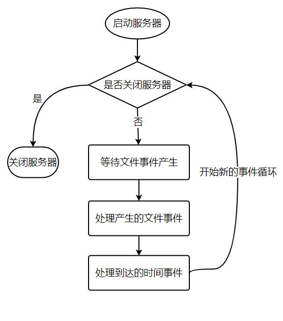

[TOC]

## Redis基础

- 五种基本数据结构：string、list、hash、set、zset。
- 每种数据结构都有多种内部编码，用于不同的场景，可以节约内存。
- 单线程架构下，使用指令是需要注意有的指令可能会造成**阻塞**！！这个对性能影响很大。

### 一、概述

> **啥是 Redis？**

Redis 是速度非常快的**非关系型（NoSQL）内存键值数据库**，可以存储键和五种不同类型的值之间的映射。

**==键==的类型只能为==字符串==，==值==支持五种数据类型：==字符串、列表、集合、散列表、有序集合==**。

Redis 支持很多特性，例如将内存中的数据持久化到硬盘中，使用复制来扩展读性能，使用分片来扩展写性能。

#### Redis特性

- **速度快**：单线程模型、数据都在内存中
- 基于**键值对**的数据结构服务器：NoSQL 非关系型
- 丰富的功能：缓存、发布订阅、Lua 脚本、简单事务、流水线
- 简单稳定
- 客户端语言多：使用 TCP 通信
- **可以持久化**：RDB 和 AOF
- **主从复制**：实现数据多个副本
- **高可用与分布式**：Redis Sentinel、Redis Cluster

---

#### Redis的应用场景

##### 1. 缓存

将热点数据放到**内存**中，设置内存的**最大使用量**以及**淘汰策略**来保证缓存的命中率。经常使用的就这个吧。

- **缓存热点数据**：缓存热点数据，可以降低数据库压力。
- **缓存 Session**：可以使用 Redis 来统一存储多台应用服务器的**会话信息**。当应用服务器不再存储用户的会话信息，使得服务器**无状态**，一个用户可以请求任意一个应用服务器，从而更容易实现高可用性以及**可伸缩性**。

##### 2. 消息队列与发布订阅系统

**List 是一个双向链表**，可以通过 lpush 和 rpop 写入和读取消息，从而实现简单的消息队列或发布订阅系统（但是不够强大）。不过最好使用 Kafka、RabbitMQ 等**消息中间件**。

##### 3. 分布式锁实现

在分布式场景下，无法使用单机环境下的锁来对多个节点上的进程进行同步。

可以使用 ==Redis 自带的 SETNX 命令实现分布式锁==，除此之外，还可以使用官方提供的 ==RedLock 分布式锁==实现。

##### 4. 其它

- **社交网络**：**Set** 可以实现交集、并集等操作，从而实现**共同好友**等功能。
- **排行榜系统**：**ZSet** 可以实现**有序性**操作，从而实现**排行榜**等功能。
- **计数器**：可以对 **String** 进行自增自减运算，从而实现计数器功能。Redis 这种内存型数据库的读写性能非常高，很适合**存储频繁读写的计数量**。比如视频的播放量、商品浏览次数等。
- 查找表：例如 **DNS** 记录就很适合使用 Redis 进行存储。查找表和缓存类似，也是利用了 **Redis 快速**的查找特性。但是查找表的内容不能失效，而缓存的内容可以失效，因为缓存不作为可靠的数据来源。
- **附近位置、摇一摇**：Redis 的 GEO 功能可以用于实现附近位置，摇一摇这种基于位置信息的功能。

---

#### 单线程架构

Redis 是单线程架构，单线程也没有了并发问题。

> **为什么单线程还能这么快**？

- **纯内存访问**。Redis 数据都存放在内存中，访问速度极快。
- **高效的数据结构**。例如跳表和哈希还有压缩链表
- **IO 多路复用**。Redis 使用 **epoll 作为 IO 多路复用技术的实现**，再加上 Redis 自身的事件处理模型将 **epoll** 中的连接、读写、关闭等都转化为事件，在 IO 上浪费时间少。
- **单线程架构**。简化了数据结构和算法的实现，同时**单线程避免了线程切换**的竞争产生的开销。

> **单线程的问题**？

如果每个命令**执行时间过长**，会造成其他命令的**阻塞**，这非常难受。

---

#### 命令执行基本流程

Redis 命令执行流程如下图。


- 发送命令
- 命令排队
- 执行命令
- 返回结果

其中 **发送命令 + 返回结果** 是通过网络进行的，使用命令时可以考虑尽量**减少这个次数**。由于是**单线程**架构，所以如果命令过多或者前面的命令执行阻塞着，后面的命令在队列中**排队执行**。慢查询主要统计执行命令的时间。


### 二、数据类型与API

#### 全局命令

列举一些常见的全部数据结构都通用的命令。

|        命令         |                             释义                             |
| :-----------------: | :----------------------------------------------------------: |
|       keys *        |         查看所有键（遍历所有键，O(N)，线上禁止使用）         |
|       dbsize        |        键总数（不会遍历所有键，直接从遍历获取，O(1)）        |
|     exists key      |            查看键是否存在（存在为 1，不存在为 0）            |
|  del key [key ...]  |                   删除键（可多个键同时删）                   |
| expire key seconds  | 对键添加过期时间（大于等于 0 即是过期时间，-1 是没有设置，-2 键不存在） |
|       ttl key       |                     查看键剩余的过期时间                     |
|      type key       |                       查看键的数据结构                       |
| object encoding key |                       获取键的内部编码                       |

---

#### 键管理

##### 1. 单个键管理

###### ① 键重命名

键重命名的时候会执行 del 命令删除旧的键，如果键对应的值较大，可能造成阻塞。

```mysql
rename key newkey
```

###### ② 随机返回一个键

```mysql
randomkey
```

###### ③ 键过期

与键过期相关的指令。

```mysql
expire key seconds		# 键在seconds秒后过期
expire key timestamp	# 键在秒级时间戳timestamp后过期
ttl key					# 查看键过期剩余时间，秒级
pttl key				# 查看键过期剩余时间，毫秒级
expireat key timestamp	# 设置键的秒级过期时间戳
pexpire key milliseconds# 键在milliseconds毫秒后过期
setex 					# 设置键并设置过期时间，多用！！
```

**过期时间**

```mysql
大于等于0的整数:键剩余过期时间
-1:键没有设置过期时间
-2:键不存在
```

与过期相关的命令需要**注意**：

- 如果 expire key 不存在，返回结果为 0。
- 如果设置过期时间为负值，键会立即被删除，犹如使用了 del 命令一样。
- persist 命令可以将键的过期时间清除，清除后 ttl 变为 -1，这样键就不会过期了。
- 对于**字符串类型的键**，执行 **set 命令**会**去掉**过期时间（ttl 变为 -1），这个问题在开发中很容易被忽视。**setex 命令**做为 **set + expire** 命令的组合，即是原子命令，而且少了一次网络时间，开发多用！！
- Redis **不支持二级数据结构**（如hash、list）**内部元素的过期功能**，如不能对 hash 中某个元素设置过期。

###### ④ 迁移键

- move：不建议使用。仅在实例内部用。
- dump + restore：dump 会将键值序列化，采用 RDB 格式。restore 将序列化的数据还原。
- migrate：实际就是将 dump 、restore、del 三个命令进行组合，从而简化了流程，而且具有原子性。==**推荐使用** ==。

对比一下

|      命令      |     作用域     | 原子性 | 支持多个键 |
| :------------: | :------------: | :----: | :--------: |
|      move      | Redis 实例内部 |   是   |     否     |
| dump + restore | Redis 实例之间 |   否   |     否     |
|  **migrate**   | Redis 实例之间 |   是   |     是     |

##### 2. 遍历键

提供了两种遍历键的方式：keys 和 scan。

###### ① keys全量遍历键

即使用 keys 命令。支持 pattern 匹配，如果是全部键则 **pattern 为 ***。可以进行正则表达式匹配遍历键。

注意：如果包含大量的键，那么可能会造成 Redis **阻塞**！**生产环境别用**！

###### ② scan渐进式遍历键

采用 scan 命令以**渐进式**的方式遍历键，以解决 keys 指令可能造成的阻塞问题，每次 scan 命令的时间**复杂度是 O(1)**。每次执行 scan 可以想象成只扫描一个字典中的一部分键，直到将字典中的所有键遍历完成。

```mysql
scan cursor [match pattern] [count number]
```

- cursor：游标，必备参数。第一次遍历从 0 开始，每次 scan 遍历完会返回当前的 cursor 值，直到其值为 0， 表示遍历结束。
- match pattern：匹配模式，可选。
- count number：每次要遍历的键的个数，默认 10。

注意：每次 scan 完成都会返回上一次遍历的游标值，下一次请求时携带上从这个 cursor 开始遍历。

此外还有其他集合类型的遍历指令。如 **hscan、sscan、zscan** 等来解决 hgetall、smembers、zrange 等可能带来的阻塞问题。

但是：如果 scan 过程中如果有键的变化（增删改等），可能会造成键的遍历不完全或重复的问题。

##### 3. 数据库管理

- 切换数据库：

```mysql
select dbIndex
```

- 清除数据库：数据量大的话存在阻塞的可能性。

```mysql
flushdb		# 清除当前数据库
flushall	# 清除全部数据库
```


#### 数据结构与内部编码

有五种基本的数据结构，还有一些拓展的结构都是基于它们实现的。

|  数据类型  |        可以存储的值        |                             操作                             |
| :--------: | :------------------------: | :----------------------------------------------------------: |
| **STRING** |   字符串、整数或者浮点数   | 1. 对整个字符串或者字符串的其中一部分执行操作 <br/> 2.对整数和浮点数执行自增或者自减操作 |
|  **LIST**  |            列表            | 1. 从两端**压入或者弹出**元素 <br/> 2. 对单个或者多个元素  <br/>3.进行修剪，只保留一个范围内的元素 |
|  **SET**   |        **无序**集合        | 1. 添加、获取、移除单个元素 <br/>2. 检查一个元素是否存在于集合中 <br/>3.计算交集、并集、差集<br/> 4.从集合里面随机获取元素 |
|  **HASH**  | 包含**键值对**的无序散列表 | 1. 添加、获取、移除单个键值对  <br/>2. 获取所有键值对 <br/> 3. 检查某个键是否存在 |
|  **ZSET**  |        **有序集合**        | 1. 添加、获取、删除元素 <br/> 2. 根据分值范围或者成员来获取元素  <br/>3.计算一个键的排名 |

每一种数据结构都有**两种以上**的**内部编码**实现。

> **为什么这样设计**？

- 可以改进内部编码但是**不影响对外**的数据结构和命令，可以平滑升级。
- 多种内部编码可以在不同的应用场景下**发挥各自的优势**，比如有的数据结构可以节省内存。

| 数据结构 |      内部编码       |
| :------: | :-----------------: |
|  string  |  raw、int、embstr   |
|   hash   | hashtable、ziplist  |
|   list   | linkedlist、ziplist |
|   set    |  hashtable、intset  |
|   zset   |  skiplist、ziplist  |


####  STRING

非常重要啊，其他的都是基于这个来的。

字符串类型的**值**可以是：**简单字符串、复复杂字符串（JSON、XML等）、数字（整数、浮点数）、甚至是二进制（图片、视频、音频等）**，最大 512M。


##### 1. 常用命令

###### ① 设置值

```mysql
set key value [ex seconds] [px milliseconds] [nx|xx]
```

- **ex seconds**: 设置**秒级**过期时间
- **px milliseconds**: 设置**毫秒级**过期时间
- **nx**: 键必须**不存在**才可以设置成功，用于**添加**
- **xx**: 键必须**存在**才可以设置成功，用于**更新**

除了 set 之外，还有两个命令：setex，extnx。其作用与上述的 ex 和 nx 选项相同。

```mysql
setex key seconds value
setnx key value
```

>  **extnx 的应用**

由于 Redis 的**单线程**机制，如果**多个**客户端同时执行 setex key seconds value，根据 setnx 的特性则**只有一个**客户端能够设置成功，所以 setnx 可以作为**分布式锁**的一种实现方案。

###### ② 获取值

```mysql
get key
```

键不存在返回 nil（空）。

###### ③ 批量设置值

```mysql
mset key value [key value ...]
```

一次性设置多个值。

###### ④ 批量获取值

```mysql
mget key [key ...]
```

```mysql
mget a b c d
```

批量设置与获取可以提高效率，因为如果执行 N 次单个 get 命令会在网络中**往返 N 次**，而批量操作只会在网络中**往返 1 次**，可以**预防 Redis 或网络阻塞**。

###### ⑤ 计数

```mysql
incr key
decr key
incrby key increment
decrby key decrement
incrbyfloat key increment
```

可以自增、自减、设置增量。

Redis 由于其**单线程**架构，计数的时候贼方便，都不需要使用 CAS 来保证计数准确性。

###### ⑥ 其他

```mysql
append key value   	# 在字符串后面追加value，变长
strlen key			# 字符串长度
getset key value	# 设置并返回原值，返回键原来的值
getrange key start end  # 获取部分字符串
```

##### 2. 内部编码

- int：8 字节的长整形。
- embstr：小于等于39 个字节的字符串。
- raw：大于 39 个字节的字符串。

Redis 会根据当前值的**类型和长度**决定使用哪种内部编码实现。

##### 3. 典型使用场景

###### ① 缓存功能

推荐的键名定义方式：

```
业务名：对象名：id：[属性]
```

###### ② 计数

快速计数、查询缓存，比如实现视频播放数计数。

###### ③ 共享 session

使用 Redis 存储各个 Web 服务器的 session 信息，集中管理。

###### ④ 限速

防止短信功接口不被频繁访问，限制一分钟内只能请求一次。

限制一个 IP 地址在一分钟内的访问次数。


#### HASH

结构像下面这样，KEY 里面的 **value** 才包含**真正的 key 和 value**。


Hash 类型的**值**本身又是一个**键值对结构**。注意业务重点关注 **Filed ：Value** 关系。

##### 1. 命令

###### ① 设置值

```mysql
hset key field value
```

```mysql
例子：hest user:1 name tom
```

###### ② 获取值

```mysql
hget key field
```

````mysql
例子：hget user:1 name
````

###### ③ 删除 field

```mysql
hdel key field [field ...]
```

可以批量删除 field 的个数。

```mysql
例子：hdel user:1 name address class
```

###### ④ 计算 field 个数

```mysql
hlen key
```

###### ⑤ 批量设置与获取

```mysql
hmget key field [field ...]		# 批量获取
hmset key field value [field value...]  # 批量设置
```

###### ⑥ 判断 filed 是否存在

```mysql
hexists key field
```

###### ⑦ 其他

```mysql
hkeys key  		# 获取所有field
hvals key		# 获取所有value
hgetall key		# 获取所有的field-value，即返回Map
hincrby key field 		# 自增，作用在field上
hincrbyfloat key field  # 自增
```

##### 2. 内部编码

- **ziplist**（压缩列表）：当 filed 个数少且没有大的 value 时使用
- **hashtable**（哈希表）：当 filed 个数多或有大的 value 时使用

ziplist 更加紧凑，在数据量较少时可以连续存储元素，更节约内存。

##### 3. 使用场景

###### 缓存用户信息

可以用于记录的**用户信息**，比如 key 是用户的 id，field 是用的信息（如名字、学校等），value 是信息的值。好处：hash 是紧凑的，有这个值才设置，而关系型数据库是稀疏的，没有也会占位置。比如有的用户没有电话信息，在关系型数据库也会为 null，而在 hash 中直接不管即可。

缓存用户信息的几种实现方式：

- 原生字符串：每个属性一个键（键太多了）。
- 序列号字符串类型：将用户信息序列号之后用一个键保存（需要反序列化）。
- 使用 hash：只用一个键保存 id，用户信息用 field-value 保存。

##### 4. 再哈希

Redis 中的字典相当于 Java 中的 **HashMap**，内部实现也差不多类似，都是通过 **"数组 + 链表"** 的链地址法来解决部分 **哈希冲突**，同时这样的结构也吸收了两种不同数据结构的优点。

**实际上字典结构的内部包含两个 hashtable**，通常情况下**只有一个** hashtable 是**有值**的，但是在字典扩容缩容时，需要分配新的 hashtable，然后进行 **渐进式搬迁** *(下面说原因)*。

大字典的扩容是比较耗时间的，需要**重新申请新的数组**，然后将旧字典所有链表中的元素重新挂接到新的数组下面，这是一个 O(n) 级别的操作，作为单线程的 Redis 很难承受这样耗时的过程，所以 Redis 使用 **渐进式 rehash** 小步搬迁：


渐进式 rehash 会在 rehash 的同时，保留**新旧两个 hash 结构**，如上图所示，查询时会**==同时查询==两个 hash 结构**，然后在后续的定时任务以及 hash 操作指令中，循序渐进的把旧字典的内容迁移到新字典中。当搬迁完成了，就会使用新的 hash 结构取而代之。

#### List

列表用于存储多个**有序**的字符串，每个字符串称为元素。由于元素是有序的，所以可以通过索引来访问元素或者进行范围访问。

可以充当栈与队列的角色。

列表从左到右索引为 **0 ~ N - 1**，从右到左为 **-1 ~ -N**。


##### 1. 命令

###### ① 插入元素

左右两边插入元素：插入两端。

```mysql
lpush key value [value...]
rpush key value [value...]
```

指定位置处插入元素：找到**等于 pivot** 的元素并在前或后插入元素。

```mysql
linsert key before|after pivot value
```

###### ② 查找元素

- 获取指定范围元素。

```mysql
lrange key start end 
```

```mysql
lrange key 0 -1 	# 列出全部元素
```

- 获取列表指定索引下标的元素

```mysql
lindex key index
```

```mysql
lindex name -1	# 获取最后一个元素
```

- 列表长度。

```mysql
llen key
```

###### ③ 删除元素

- 左右两边弹出删除。

```mysql
lpop key
rpop key
```

- 按照索引范围修建列表

```mysql
ltrim key start end
```

###### ④ 修改元素

- 修改指定索引处的元素。

```mysql
lset key index newValue
```

###### ⑤ 阻塞弹出

- 阻塞式弹出元素。从左右阻塞式弹出元素，即普通弹出的阻塞版本。

```mysql
blpop key [key...] timeout
brpop key [key...] timeout
```

`key [key...]` 多个列表的键。

`timeout` 阻塞时间。

- 若列表为空，timeout = 3，则客户端等待 3 秒后返回，若 timeout = 0，则此时客户端一直阻塞等下去。若等待期间插入元素则立即返回。

- 列表不为空，立即返回。

> **使用 brpop 需要注意的点**

- 如果是多个键，那么 brpop 会从左到右遍历键，一旦有一个键能弹出元素，客户端立即返回。
- 如果多个客户端对一个同一个键执行 brpop，那么最先执行 brpop 命令的客户端可以先获取到弹出值。然后后面的继续阻塞。

##### 2. 内部编码

- ziplist：压缩列表。元素少且元素长度小时使用，减少内存消耗。
- linkedlist：链表。元素多使用。

##### 3. 使用场景

###### ① 消息队列

使用 lpush + brpop 可以实现阻塞队列，生产者客户端使用 lpush 生产，多个消费者客户端从使用 brpop 命令阻塞式“抢”列表中的元素，多个客户端保证了消费的负载均衡和高可用。

- **lpush + lpop = Stack**（栈）
- lpush + rpop = Queue（队列）
- lpush + ltrim = Capped Collection（有限集合）
- **lpush + brpop = Message Queue**（消息队列）

###### ② 文章列表

每个用户的文章列表用 list 存储，然后可以分页获取列表。


#### SET

用于保存多个字符串元素，与列表不同，set 中元素**不能重复**，并且集合中元素是**无序**的。

除增删改查之外还可以做多个集合的交集、并集、差集。


##### 1. 命令

###### ① 集合内操作

- 添加元素

```mysql
sadd key element [element...]
```

- 删除元素

```mysql
srem key element [element...]
```

- 计算元素个数：是 **O(1)** 的命令，不会遍历集合的元素，而是直接用 Redis 的内部计数变量。

```mysql
scard key
```

- 判断元素是否在集合中：是则返回 1，不是返回 0。

```mysql
sismember key element
```

- 随机返回集合汇总指定个数元素，默认返回一个，不删除元素。

```mysql
srandmember key [count]
```

- 从集合随机弹出元素，并且删除。

```mysql
spop key
```

- 获取所有元素，结果无序。是比较重的指令，元素过多会**阻塞**。

```mysql
smembers key
```

###### ② 集合间操作

- 求多个集合的交集。

```mysql
sinter key [key...]
```

- 求多个集合的并集。

```mysql
sunion key [key...]
```

- 求多个集合的差集。

```mysql
sdiff key [key...]
```

- 将**结果进行保存**。将集合间交集、并集、差集的结果保存在 destination key 中。

```mysql
sinterstore destination key [key...]
sunionstore destination key [key...]
sdiffstore destination key [key...]
```

##### 2. 内部编码

- intset：元素是整数且个数较少时使用。
- hashtable：元素较多或不全是整数时使用。

##### 3. 使用场景

###### ① 标签

集合类型的典型场景是**标签**。比如一个用户的兴趣点就是标签，使用集合间的交并差就可以用在社交上了，比如计算共同兴趣。

- sadd = Tagging（标签）
- spop/srandmember = Random item（生成随机数，比如抽奖）
- sadd + sinter = Social Graph（社交需求）

----

#### ZSET

相当于在 **SET 类型**的基础上增加了一个**分数**，其特性为元素不可重复且多了**排序**的功能。元素不能重复但是 score 可以重复。


比较一下 列表、集合、有序集合。

| 数据结构 | 是否允许元素重复 | 是否有序 | 有序实现方式 |       应用场景       |
| :------: | :--------------: | :------: | :----------: | :------------------: |
|   List   |        是        |    是    |   索引下标   |  时间轴、消息队列等  |
|   Set    |        否        |    否    |      无      |   标签、社交系统等   |
|   Zset   |        否        |    是    |    分数值    | 排行榜系统、设计等。 |

##### 1. 命令

###### ① 集合内操作

- 添加成员

```mysql
zadd key score member [score member...]
```

- 计算成员个数

```mysql
zcard key
```

- 计算某个成员分数

```mysql
zscore key member
```

- 计算成员排名

```mysql
zrank key member	# 从低到高排名
zrevrank key member	# 从高到低排名
```

- 删除成员

```mysql
zrem key member [member...]
```

- 增加成员分数

```mysql
zincrby key increment member
```

- 返回**指定排名范围**的成员

```mysql
zrange key start end [withscores]	# 从低到高返回
zrevrank key start end [withscores] # 从高到低返回
```

- 返回**指定分数范围**的成员，也有正反两种方式。具体参数查资料吧。

```mysql
zrangescore key min max [withscores] [limit offset count]
zrevrankscore key min max [withscores] [limit offset count]
```

- 返回指定分数范围成员的**个数**。

```mysql
zcount key min max
```

- 删除指定**排名内**的升序元素。

```mysql
zremrangebyrank key start end
```

- 删除指定**分数范围**的成员。

```mysql
zremrangebyscore key start end
```

###### ②  集合间操作

- 交集

```mysql
zinterstore destination numkeys key [key...] [weights weight [weight...]] [aggregate sum|min|max]
```

- 并集

```mysql
zunionstore destination numkeys key [key...] [weights weight [weight...]] [aggregate sum|min|max]
```

##### 2. 内部编码

- ziplist：压缩列表。元素个数较少且值较小时用。
- skiplist：**跳跃表**。元素个数多或值大时用。（后面详细介绍跳表）

##### 3. 使用场景

###### ① 排行榜系统

典型应用就是排行榜系统啊。比如按用户点赞数，按播放数排名。可以轻易获取排行榜前十的内容。


### 三、重要数据结构

#### 字典

**dictht** 是一个**散列表**结构，使用**拉链法保存哈希冲突**。

```c
/* This is our hash table structure. Every dictionary has two of this as we
 * implement incremental rehashing, for the old to the new table. */
typedef struct dictht {
    dictEntry **table;
    unsigned long size;
    unsigned long sizemask;
    unsigned long used;
} dictht;
```

```c
typedef struct dictEntry {
    void *key;
    union {
        void *val;
        uint64_t u64;
        int64_t s64;
        double d;
    } v;
    struct dictEntry *next;
} dictEntry;
```

Redis 的字典 dict 中包含**两个哈希表 dictht**，这是为了方便进行 rehash 操作。在扩容时，将其中一个 dictht 上的键值对 rehash 到另一个 dictht 上面，完成之后释放空间并交换两个 dictht 的角色。

```c
typedef struct dict {
    dictType *type;
    void *privdata;
    dictht ht[2];
    long rehashidx; /* rehashing not in progress if rehashidx == -1 */
    unsigned long iterators; /* number of iterators currently running */
} dict;
```

**rehash** 操作不是一次性完成，而是采用**渐进方式**，这是为了避免一次性执行过多的 rehash 操作给服务器带来过大的负担（阻塞）。

渐进式 rehash 通过记录 dict 的 rehashidx 完成，它从 0 开始，然后每执行一次 rehash 都会递增。例如在一次 rehash 中，要把 dict[0] rehash 到 dict[1]，这一次会把 dict[0] 上 table[rehashidx] 的键值对 rehash 到 dict[1] 上，dict[0] 的 table[rehashidx] 指向 null，并令 rehashidx++。

在 rehash 期间，每次对字典执行添加、删除、查找或者更新操作时，都会执行一次渐进式 rehash。

采用渐进式 rehash 会导致字典中的数据分散在两个 dictht 上，因此对字典的查找操作也需要到对应的 dictht 去执行。

```c
/* Performs N steps of incremental rehashing. Returns 1 if there are still
 * keys to move from the old to the new hash table, otherwise 0 is returned.
 *
 * Note that a rehashing step consists in moving a bucket (that may have more
 * than one key as we use chaining) from the old to the new hash table, however
 * since part of the hash table may be composed of empty spaces, it is not
 * guaranteed that this function will rehash even a single bucket, since it
 * will visit at max N*10 empty buckets in total, otherwise the amount of
 * work it does would be unbound and the function may block for a long time. */
int dictRehash(dict *d, int n) {
    int empty_visits = n * 10; /* Max number of empty buckets to visit. */
    if (!dictIsRehashing(d)) return 0;

    while (n-- && d->ht[0].used != 0) {
        dictEntry *de, *nextde;

        /* Note that rehashidx can't overflow as we are sure there are more
         * elements because ht[0].used != 0 */
        assert(d->ht[0].size > (unsigned long) d->rehashidx);
        while (d->ht[0].table[d->rehashidx] == NULL) {
            d->rehashidx++;
            if (--empty_visits == 0) return 1;
        }
        de = d->ht[0].table[d->rehashidx];
        /* Move all the keys in this bucket from the old to the new hash HT */
        while (de) {
            uint64_t h;

            nextde = de->next;
            /* Get the index in the new hash table */
            h = dictHashKey(d, de->key) & d->ht[1].sizemask;
            de->next = d->ht[1].table[h];
            d->ht[1].table[h] = de;
            d->ht[0].used--;
            d->ht[1].used++;
            de = nextde;
        }
        d->ht[0].table[d->rehashidx] = NULL;
        d->rehashidx++;
    }

    /* Check if we already rehashed the whole table... */
    if (d->ht[0].used == 0) {
        zfree(d->ht[0].table);
        d->ht[0] = d->ht[1];
        _dictReset(&d->ht[1]);
        d->rehashidx = -1;
        return 0;
    }

    /* More to rehash... */
    return 1;
}

```

#### 跳跃表

是 **zset** 的底层实现之一。

跳跃表是基于**==多指针有序链表==**实现的，可以看成多个**有序链表**。


在**查找**时，从**上层指针**开始查找，找到对应的区间之后再到**下一层**去查找。下图演示了查找 22 的过程。


> **为什么要用跳表而不用其他数据结构？**

首先，因为 zset 要支持随机的插入和删除，所以它 **不宜使用数组来实现**，关于排序问题，我们也很容易就想到 **红黑树/ 平衡树** 这样的树形结构，为什么 Redis 不使用这样一些结构呢？

1. **性能考虑：** 在高并发的情况下，树形结构需要执行一些类似于 rebalance 这样的可能涉及整棵树的操作，相对来说跳跃表的变化只涉及局部 _(下面详细说)_；
2. **实现考虑：** 在复杂度与红黑树相同的情况下，跳跃表实现起来更简单，看起来也更加直观；

基于以上的一些考虑，Redis 基于 **William Pugh** 的论文做出一些改进后采用了 **跳跃表** 这样的结构。

与红黑树等平衡树相比，跳跃表具有以下优点：

- **==插入速度==非常快速，因为不需要进行旋转等操作来维护平衡性**；
- 更容易实现；
- 支持**无锁操作**。

#### redisObject对象

##### 1. 概述

redisObject 其实是一个**结构体**。

Redis 内部使用一个 redisObject 对象来表示**所有的 key 和 value**，每次在 Redis 数据块中创建一个键值对时，一个是键对象，一个是值对象，而 Redis 中的每个对象都是由 redisObject 结构来表示。

在 Redis 中，键总是一个字符串对象，而值可以是字符串、列表、集合等对象，所以我们通常说键为字符串键，表示这个键对应的值为字符串对象，我们说一个键为集合键时，表示这个键对应的值为集合对象。

redisObject 最主要的信息：

```c
typedef struct redisObject{
    // 类型
    unsigned type:4;
    // 编码
    unsigned encoding:4;
    // 指向底层数据结构的指针
    void *ptr;
    // 引用计数
    int refcount;
    // 记录最后一次被程序访问的时间
    unsigned lru:22;
} robj
```

##### 2. 内存回收与共享

因为 c 语言不具备自动内存回收功能，当将 redisObject 对象作为数据库的键或值而不是作为参数存储时其生命周期是非常长的，为了解决这个问题，Redis 自己构建了一个内存回收机制，通过 redisobject结 构中的 **refcount** 实现。这个属性会随着对象的使用状态而不断变化。当对象的引用计数值变为 0 时，对象所占用的内存就会被释放。

refcount 属性除了能实现内存回收以外，还能实现内存共享 。

### 四、Redis拓展功能

#### 慢查询分析

通过慢查询分析找到有问题的命令进行优化。可以通过慢查询日志来进行分析。

慢查询只统计执行命令的时间，而不统计网络传输的时间和排队时间。

慢查询记录保存在**慢查询日志**中，这是一个**先进先出队列**，可以**设置队列大小**。

##### 1. 配置参数

在**配置文件**中配置下面参数

```mysql
slowlog-log-slower-than	time # 记录超过time时间的命令，判定为慢查询，单位微秒，默认10000微秒
slowlog-max-len	# 设置慢查询结果列表的最大长度
```

也可命令行动态修改

```mysql
config slowlog-log-slower-than	20000
config slowlog-max-len 1000
config rewrite	# 将配置持久化到配置文件中
```

##### 2. 查看慢查询日志

慢查询日志记录其实是放在列表中的。

- 获取慢查询日志（指定条数 n）

```mysql
slowlog get [n]	
```

- 获取当前慢查询列表长度

```mysql
slowlog len
```

- 重置慢查询日志

```mysql
slowlog reset
```

##### 3. 最佳实践

- slowlog-log-slower-than：默认值 10000微秒，也就是超过10毫秒判定为慢查询，需要根据Redis的并发量调整该值。高流量场景建议设置低一些。
- slowlog-max-len：建议线上调大慢查询列表，可以保存更多慢查询记录。
- **慢查询记录持久化**。防止慢查询日志队列溢出，可以定期使用 slowlog get 指令获取慢查询记录并持久化到 MySQL中，然后清理已经持久化的慢查询记录。

---

#### Pipeline

流水线技术采用将多条**命令打包**的方式将命令发送到 Redis 进行执行，并将多条命令的执行结果以**打包**的方式返回给客户端，这样多条命令只在网络中传输一次，这就大大**节省了网络中传输命令的**时间。

许多客户端带有这个功能，如 Jedis。

客户端与服务端网络延时越大，效果越明显。而且组装后的命令比单个命令逐一执行要快。

注意：如果一次 Pipeline 操作数据量或命令太多，可能导致**阻塞**，可以分成几次执行。

> **原生的批量操作命令**如 mget 一次也能批量操作数据，和 **Pipeline** 有什么不同？

- 原生批量操作命令是原子的，Pipeline 是非原子的。
- 原生批量命令是一个命令对应多个 key，Pipeline 则支持多个命令。
- 原生批量命令是 Redis 服务端支持实现，而 Pipeline 由客户端和服务器共同支持实现。

---

#### 事务与Lua

为了保证多条命令组合的**原子性**， Redis 提供了**简单的事务**功能以及**集成 Lua 脚本**来解决。

##### 1. 简单事务

之所以是简单的事务，是因为**不支持回滚**功能。

**需要将多个命令放到 ==multi== 和 ==exec== 命令直接执行。**这两个命令直接的命令是原子执行的。

执行 multi 命令后，后面的命令并不会立即执行，而是暂时保存起来，直到执行 exec 命令才统一执行。

使用 discard 命令取代 exec 命令可以停止事务功能。

一个事务包含了**多个命令**，服务器在执行事务期间，不会改去执行其它客户端的命令请求。

事务中的**多个命令被一次性发送**给服务器，而不是一条一条发送，这种方式被称为**流水线**，它可以减少客户端与服务器之间的网络通信次数从而提升性能。

|   命令    |                             含义                             |
| :-------: | :----------------------------------------------------------: |
| **MULTI** | 表示**开始收集命令**，后面所有命令都**不是马上执行**，而是加入到一个**队列**中 |
| **EXEC**  |         **执行** MULTI 后面命令**队列中的所有命令**          |
|  DISCARD  |                     放弃执行队列中的命令                     |
|   WATCH   | “观察”、“监控”一个KEY, 在当前队列外的其他命令操作这个KEY时，**放弃执行自己**队列的命令，是一种**乐观锁**的策略 |
|  UNWATCH  |                       放弃监控一个KEY                        |

Redis 执行错误时**不会整体回滚**。

如果你有使用关系式数据库的经验， 那么 “==**Redis 在事务失败时不进行回滚，而是继续执行余下的命令**==”这种做法可能会让你觉得有点奇怪。以下是这种做法的优点：
Redis 命令只会因为错误的**语法而失败**（并且这些问题不能在入队时发现），或是命令用在了错误类型的键上面：这也就是说，从实用性的角度来说，**失败的命令是由编程错误**造成的，而这些错误应该在开发的过程中被发现，而不应该出现在生产环境中。
因为不需要对回滚进行支持，所以 Redis 的内部可以**保持简单且快速**。

因我我们需要**加强对生产环境中的错误异常处理**。

Redis 事务的几个性质：

- 单独的隔离操作：事务中的所有命令会被序列化、按顺序执行，在执行的过程中不会被其他客户端发送来的命令打断。
- 没有隔离级别的概念：队列中的命令在事务没有被提交之前不会被实际执行。
- 不保证原子性：Redis 中的一个事务中如果存在命令执行失败，那么其他命令依然会被执行，没有回滚机制。
- Redis 是以**乐观锁**的策略操作事务的，如上述的 WATCH 指令，没有悲观锁。

> **事务执行出错怎么办？**

分为两种，一是**命令错误**。即命令写错了，这种时候**不执行**事务。

第二种是**运行时错误**，语法正确但是发生一些异常，这种时候前面之前的命令是不会变化的，也就是 Redis ==**不支持回滚**==。需要开发人员自己解决。

##### 2. 集成Lua脚本

集成 Lua 脚本可以**自己定义指令**。

执行 Lua 脚本用 eval（单次调用脚本，每次都传输到服务端） 或 evalsha（脚本存在服务端，复用） 命令。

Lua 脚本发送到服务端之后会被当做一个普通命令排队执行。


#### Bitmaps

实现对位的操作，节约内存。

Bitmaps 本身不是一种数据结构，也是一种字符串，只不过可以对字符串的位进行操作。可以把它想成一个以位为单位的数组，数组中每个单元只能存储 0 或 1，数组的下标称为偏移量。

##### 1. 命令

- 设置值：设置键的第 offset 个位（从 0 算起）的值。

```mysql
setbit key offset value
```

- 获取值：获取 offset 处的值。

```mysql
getbit key offset
```

- 获取 Bitmaps 指定范围内值为 1 的个数（不给范围则为全部）。

```mysql
bitcount key [start end]
```

- Bitmaps 间的运算：可以做多个 Bitmaps 直接的交集、并集、非、异或等操作并将结果放在 destkey 中。

```mysql
bitop and|or|not|xor destkey key [key ...]
```

- 计算 Bitmaps 中第一个值为 targetBit 的偏移量

```mysql
bitops key targetBit [start] [end]
```

##### 2. 使用场景

- 可以用于用户登录统计（如活跃用户数统计）。
- 网址黑名单、白名单。

---

#### HyperLogLog

##### 1. 概述

HyperLogLog 不是一种新的数据结构，实际是字符串类型。它是一种**基数算法**， 通过 HyperLogLog 可以利用**极小的内存**空间完成**独立总数**的统计，数据集可以是 **IP、Email、ID** 等。

提供了三个命令：**pfadd、pfcount、pfmerge**。

HyperLogLog 使用内存量小的惊人，所以存在一定的**误差率**，官方给 0.81% 误差。

使用场景：

- 只为了计算独立总数、不需要获取单条数据。
- 能够容忍一定的误差率。


---

#### 发布订阅

Redis 也提供了发布消息、订阅频道、取消订阅以及按照模式订阅的基础发布订阅功能。


相比于专业的消息队列系统，Redis 的发布订阅略显**粗糙**，例如**无法实现消息堆积和回溯**。如果能容忍的场景是可以的，因为实现简单。

可以用于变更通知。

----

#### GEO

Redis 提供了 GEO（地理信息定位）的功能，可以方便的存放地理位置。可以用于实现==**附近位置，摇一摇**==这种基于位置信息的功能。GEO 底层采用 **zset** 实现。

GEO 可以存储地理位置的精度、维度、成员信息。可以使用 GEO 方便的计算两个位置之间的**距离**以及其他位置信息。

在一个地图应用中，车的数据、餐馆的数据、人的数据可能会有百万千万条，如果使用 **Redis** 的 **Geo** 数据结构，它们将 **全部放在一个** zset 集合中。在 **Redis** 的集群环境中，集合可能会从一个节点迁移到另一个节点，如果单个 key 的数据过大，会对集群的迁移工作造成较大的影响，在集群环境中单个 key 对应的数据量不宜超过 1M，否则会导致集群迁移出现卡顿现象，影响线上服务的正常运行。

所以，这里建议 **Geo** 的数据使用 **单独的 Redis 实例部署**，不使用集群环境。

如果数据量过亿甚至更大，就需要对 **Geo** 数据进行拆分，按国家拆分、按省拆分，按市拆分，在人口特大城市甚至可以按区拆分。这样就可以显著降低单个 zset 集合的大小。


### 五、其他

#### Redis与Memcached对比

两者都是**非关系型内存键值数据库**，主要有以下不同：

##### 1. 数据类型 

Memcached **仅支持字符串类型**，而 Redis 支持五种不同的数据类型，可以更灵活地解决问题。

##### 2. 数据持久化

Redis 支持两种持久化策略：**RDB 快照和 AOF 日志**，而 Memcached **不支持**持久化。

##### 3. 分布式

Memcached **不支持分布式**，只能通过在客户端使用**一致性哈希**来实现分布式存储，这种方式在存储和查询时都需要先在客户端计算一次数据所在的节点。

Redis Cluster 实现了**分布式**的支持。

##### 4. 内存管理机制

- 在 Redis 中，并不是所有数据都一直存储在内存中，可以将一些**很久没用的 value 交换到磁盘**，而 Memcached 的数据则会**一直**在内存中。
- Memcached 将内存分割成**特定长度的块**来存储数据，以完全解决内存碎片的问题。但是这种方式会使得内存的利用率不高，例如块的大小为 128 bytes，只存储 100 bytes 的数据，那么剩下的 28 bytes 就浪费掉了。


#### Redis客户端操作

Redis 使用单线程来处理多个客户端的访问。

##### 1. 客户端通信协议

客户端与服务端的通信协议建立在 TCP 至上。

Redis 定义了 RESP （Redis 序列化协议）用于客户端与服务端交互。有了这个通信协议各个编程语言就可以自己实现相应的 Redis 客户端。

##### 2. Jedis

Jedis 是 Java 中的 Redis 客户端。

基础使用是用**直连**的方式，但是最好使用 **Jedis 连接池** （JedisPool）的方式进行操作，这样可以减少连接时创建 **TCP 连接**的开销。JedisPool 是单例的。

Jedis.close() 在**直连状态**下是**关闭连接**，如果使用了连接池，则使用完成后 close 操作不是关闭连接，而是**归还**到连接池中。

Jedis 还可以实现 **Pipeline** 操作和执行 **Lua 脚本**（也有 eval 和 evalsha 两个方法）。

依赖

```xml
<!-- Redis客户端 -->
<dependency>
    <groupId>redis.clients</groupId>
    <artifactId>jedis</artifactId>
</dependency>

```

**连接单机版**

第一步：创建一个 Jedis 对象。需要指定服务端的 IP 及端口。
第二步：使用 Jedis 对象操作数据库，每个 Redis 命令对应一个方法。
第三步：打印结果。
第四步：关闭 Jedis。

```java
@Test
public void testJedis() throws Exception {
    // 第一步：创建一个Jedis对象。需要指定服务端的ip及端口。
    Jedis jedis = new Jedis("192.168.25.153", 6379);
    // 第二步：使用Jedis对象操作数据库，每个redis命令对应一个方法。
    String result = jedis.get("hello");
    // 第三步：打印结果。
    System.out.println(result);
    // 第四步：关闭Jedis
    jedis.close();
}
```

**使用连接池连接单机版**

第一步：创建一个 JedisPool 对象。需要指定服务端的 IP 及端口。
第二步：从 JedisPool 中获得 Jedis 对象。
第三步：使用 Jedis 操作 Redis 服务器。
第四步：操作完毕后关闭 Jedis 对象，连接池回收资源。
第五步：关闭 JedisPool 对象。

```java
@Test
public void testJedisPool() throws Exception {
    // 第一步：创建一个JedisPool对象。需要指定服务端的ip及端口。
    JedisPool jedisPool = new JedisPool("192.168.25.153", 6379);
    // 第二步：从JedisPool中获得Jedis对象。
    Jedis jedis = jedisPool.getResource();
    // 第三步：使用Jedis操作redis服务器。
    jedis.set("jedis", "test");
    String result = jedis.get("jedis");
    System.out.println(result);
    // 第四步：操作完毕后关闭jedis对象，连接池回收资源。
    jedis.close();
    // 第五步：关闭JedisPool对象。
    jedisPool.close();
}

```

**连接集群版**

第一步：使用 JedisCluster 对象。需要一个 Set\<HostAndPort> 参数。Redis节点的列表。
第二步：直接使用 JedisCluster 对象操作 Redis。在系统中单例存在。
第三步：打印结果.
第四步：系统关闭前，关闭 JedisCluster 对象。

```java
@Test
public void testJedisCluster() throws Exception {
    // 第一步：使用JedisCluster对象。需要一个Set<HostAndPort>参数。Redis节点的列表。
    Set<HostAndPort> nodes = new HashSet<>();
    nodes.add(new HostAndPort("192.168.25.153", 7001));
    nodes.add(new HostAndPort("192.168.25.153", 7002));
    nodes.add(new HostAndPort("192.168.25.153", 7003));
    nodes.add(new HostAndPort("192.168.25.153", 7004));
    nodes.add(new HostAndPort("192.168.25.153", 7005));
    nodes.add(new HostAndPort("192.168.25.153", 7006));
    JedisCluster jedisCluster = new JedisCluster(nodes);
    // 第二步：直接使用JedisCluster对象操作redis。在系统中单例存在。
    jedisCluster.set("hello", "100");
    String result = jedisCluster.get("hello");
    // 第三步：打印结果
    System.out.println(result);
    // 第四步：系统关闭前，关闭JedisCluster对象。
    jedisCluster.close();
}

```

##### 3. 客户端管理

Redis 提供了客户端相关的 API 对其**状态进行监控和管理**。

###### 输入与输出缓冲区

- **输入缓冲区**：Redis 为每个客户端分配了输入缓冲区，作用是将客户端发送的命令进行**缓存**，之后 Redis 会逐渐**拉取**指令并执行。如果有指令执行时间过长，可能导致输入缓冲区指令堆积严重。
- **输出缓冲区**：Redis 也为每个客户端分配了输出缓冲区，作用是保存命令执行的结果返回给客户端，为 Redis 与客户端交互返回结果提供缓冲。按客户端不同输出缓冲区还可以具体分为普通客户端输出缓冲区、发布订阅输出缓冲区、复制输出缓冲区。实际上输出缓冲区由两部分组成：**固定缓冲区（16K）和动态缓冲区**，固定缓冲区（使用的是字节数组）返回比较小的执行结果，动态缓冲区（使用的是列表）返回比较大的结果。固定缓冲区用尽则使用动态缓冲区。

###### 管理指令

- 列出与 Redis 服务器相连接的所有客户端连接信息。输出每一行就表示一个客户端连接。每个连接都有一些重要的属性。如**标识属性**：id（唯一 ID）、addr（客户端连接 IP 与端口）、fd（socket 的文件描述符）、name（客户端名字），**输入缓冲区属性**：qbuf（输入缓存区总容量）、qbuf-free（输入缓存区剩余容量）、**输出缓冲区属性**：obl、oll、omem，**存活状态属性**：age（已连接时间）、idle（最近一次空闲时间）。

```mysql
client list
```

- 获取客户端信息：可以有效的帮助开发和运维找到客户端可能存在的问题。

```mysql
info client
```


#### 事件

Redis 服务器是一个**事件驱动**程序。

##### 1. 文件事件

服务器通过**套接字**与客户端或者其它服务器进行通信，**文件事件就是对套接字操作的抽象**。

Redis 基于 **Reactor 模式**开发了自己的网络事件处理器，使用 I/O **多路复用**程序来同时监听多个套接字，并将到达的事件传送给文件事件分派器，分派器会根据套接字产生的事件类型调用相应的事件处理器。


----

##### 2. 时间事件

服务器有一些操作需要在**给定的时间点**执行，时间事件是对这类定时操作的抽象。

时间事件又分为：

- **定时事件**：是让一段程序在指定的时间之内执行一次；
- **周期性事件**：是让一段程序每隔指定时间就执行一次。

Redis 将所有时间事件都放在一个==无序链表==中，通过遍历整个链表查找出已到达的时间事件，并调用相应的事件处理器。

---

##### 3. 事件的调度与执行

服务器需要不断监听文件事件的套接字才能得到待处理的文件事件，但是不能一直监听，否则时间事件无法在规定的时间内执行，因此监听时间应该根据距离现在最近的时间事件来决定。

事件调度与执行由 **aeProcessEvents 函数**负责，伪代码如下：

```python
def aeProcessEvents():
    # 获取到达时间离当前时间最接近的时间事件
    time_event = aeSearchNearestTimer()
    # 计算最接近的时间事件距离到达还有多少毫秒
    remaind_ms = time_event.when - unix_ts_now()
    # 如果事件已到达，那么 remaind_ms 的值可能为负数，将它设为 0
    if remaind_ms < 0:
        remaind_ms = 0
    # 根据 remaind_ms 的值，创建 timeval
    timeval = create_timeval_with_ms(remaind_ms)
    # 阻塞并等待文件事件产生，最大阻塞时间由传入的 timeval 决定
    aeApiPoll(timeval)
    # 处理所有已产生的文件事件
    procesFileEvents()
    # 处理所有已到达的时间事件
    processTimeEvents()

```

将 aeProcessEvents 函数置于一个循环里面，加上初始化和清理函数，就构成了 Redis 服务器的**主函数**，伪代码如下：

```python
def main():
    # 初始化服务器
    init_server()
    # 一直处理事件，直到服务器关闭为止
    while server_is_not_shutdown():
        aeProcessEvents()
    # 服务器关闭，执行清理操作
    clean_server()

```

从事件处理的角度来看，服务器运行流程如下：



#### 一个简单的论坛系统分析

该论坛系统功能如下：

- 可以发布文章；
- 可以对文章进行点赞；
- 在首页可以按文章的发布时间或者文章的点赞数进行排序显示。

##### 1. 文章信息

文章包括标题、作者、赞数等信息，在关系型数据库中很容易构建一张表来存储这些信息，在 Redis 中可以使用 **HASH** 来存储每种信息以及其对应的值的映射。

Redis 没有关系型数据库中的**表**这一概念来将同种类型的数据存放在一起，而是使用**==命名空间==**的方式来实现这一功能。**键名的前面部分存储命名空间**，后面部分的内容存储 ID，通常**使用 : 来进行分隔**。例如下面的 HASH 的键名为 article:92617，其中 article 为命名空间，ID 为 92617。


---

##### 2. 点赞功能

当有用户为一篇文章点赞时，除了要对该文章的 votes 字段进行加 1 操作，还必须记录该用户已经对该文章进行了点赞，防止用户点赞次数超过 1。可以建立文章的**已投票用户**集合来进行记录。

为了节约内存，规定一篇文章发布满一周之后，就不能再对它进行投票，而文章的已投票集合也会被删除，可以为文章的已投票集合设置一个一周的**过期时间**就能实现这个规定。


----

##### 3. 对文章进行排序

为了按发布时间和点赞数进行排序，可以建立一个文章发布时间的**有序集合**和一个文章点赞数的有序集合。（下图中的 score 就是这里所说的点赞数；下面所示的有序集合分值并不直接是时间和点赞数，而是根据时间和点赞数间接计算出来的）


#### 参考资料

- Carlson J L. Redis in Action[J]. Media.johnwiley.com.au, 2013.
- [黄健宏. Redis 设计与实现 [M]. 机械工业出版社, 2014.](http://redisbook.com/index.html)
- [REDIS IN ACTION](https://redislabs.com/ebook/foreword/)
- [Skip Lists: Done Right](http://ticki.github.io/blog/skip-lists-done-right/)
- [论述 Redis 和 Memcached 的差异](http://www.cnblogs.com/loveincode/p/7411911.html)
- [Redis 3.0 中文版- 分片](http://wiki.jikexueyuan.com/project/redis-guide)
- [Redis 应用场景](http://www.scienjus.com/redis-use-case/)
- [Using Redis as an LRU cache](https://redis.io/topics/lru-cache)

**优秀文章**

1. 阿里云 Redis 开发规范 - [https://www.infoq.cn/article/K7dB5AFKI9mr5Ugbs_px](https://www.infoq.cn/article/K7dB5AFKI9mr5Ugbs_px)
2. 为什么要防止 bigkey？ - [https://mp.weixin.qq.com/s?__biz=Mzg2NTEyNzE0OA==&mid=2247483677&idx=1&sn=5c320b46f0e06ce9369a29909d62b401&chksm=ce5f9e9ef928178834021b6f9b939550ac400abae5c31e1933bafca2f16b23d028cc51813aec&scene=21#wechat_redirect](https://mp.weixin.qq.com/s?__biz=Mzg2NTEyNzE0OA==&mid=2247483677&idx=1&sn=5c320b46f0e06ce9369a29909d62b401&chksm=ce5f9e9ef928178834021b6f9b939550ac400abae5c31e1933bafca2f16b23d028cc51813aec&scene=21#wechat_redirect)
3. Redis【入门】就这一篇！ - [https://www.wmyskxz.com/2018/05/31/redis-ru-men-jiu-zhe-yi-pian/](https://www.wmyskxz.com/2018/05/31/redis-ru-men-jiu-zhe-yi-pian/)
4. 《Redis 设计与实现》 - [http://redisbook.com/](http://redisbook.com/)
5. 【官方文档】Redis 数据类型介绍 - [http://www.redis.cn/topics/data-types-intro.html](http://www.redis.cn/topics/data-types-intro.html)
6. 《Redis 深度历险》 - [https://book.douban.com/subject/30386804/](https://book.douban.com/subject/30386804/)
7. 阿里云 Redis 开发规范 - [https://www.infoq.cn/article/K7dB5AFKI9mr5Ugbs_px](https://www.infoq.cn/article/K7dB5AFKI9mr5Ugbs_px)
8. Redis 快速入门 - 易百教程 - [https://www.yiibai.com/redis/redis_quick_guide.html](https://www.yiibai.com/redis/redis_quick_guide.html)
9. Redis【入门】就这一篇! - [https://www.wmyskxz.com/2018/05/31/redis-ru-men-jiu-zhe-yi-pian/](https://www.wmyskxz.com/2018/05/31/redis-ru-men-jiu-zhe-yi-pian/)

**Redis**数据结构源码分析

1. Redis 数据结构-字符串源码分析：[https://my.oschina.net/mengyuankan/blog/1926320](https://my.oschina.net/mengyuankan/blog/1926320)
2. Redis 数据结构-字典源码分析： [https://my.oschina.net/mengyuankan/blog/1929593](https://my.oschina.net/mengyuankan/blog/1929593)
