[TOC]

### Redis哨兵

主从复制带来了以下问题：

- 一旦主节点**出现故障**，需要手动将一个从节点晋升为主节点，同时需要修改应用方的主节点地址，还需要命令其他从节点去复制新的主节点，整个过程都需要**人工干预**。
- 主节点的写能力受到单机的限制。

- 主节点的存储能力受到单机的限制。

这一点也不高可用。

主节点出现故障时，**Redis Sentinel** 能**自动完成故障发现和故障转移**，并**通知应用方**，从而实现真正的**高可用** 。

#### Redis Sentinel架构

Redis Sentinel 是一个**分布式架构**，其中包含若干个 Sentinel 节点和 Redis 数据节点，每个 Sentinel 节点会对数据节点和**其余** Sentinel 节点进行监控，当它发现节点不可达时，会对节点做**下线标识**。如果被标识的是**主节点**，它还会和其他Sentinel 节点进行“协商”，当大多数 Sentinel 节点**都认为主节点不可达**时，它们会**选举出一个 Sentinel 节点**来完成**自动故障转移**的工作，同时会将这个变化实时通知给 Redis 应用方。

整个过程完全是自动的，不需要人工来介入，实现了高可用。

Redis Sentinel 与 Redis 主从复制模式**只是多了若干 Sentinel 节点**，所以 Redis Sentinel **并没有**针对 Redis 节点做了特殊处理。

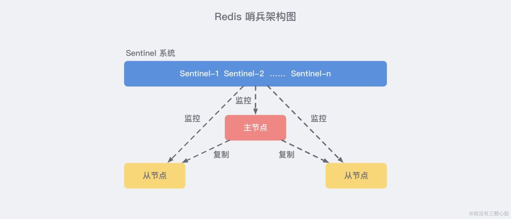

**Sentinel 节点本身就是独立的 Redis 节点，只不过它们有一些特殊，它们不存储数据，只支持部分命令。** 

Sentinel 节点**集合**会定期对**所有节点**进行监控，特别是对主节点的**故障实现自动转移**。

Redis Sentinel 包含了**若个 Sentinel 节点**，这样做也带来了两个好处:
1. 对于节点的**故障判断**是由多个 Sentinel 节点**共同完成**，这样可以有效地**防止误判**。
2. Sentinel节点集合是由若干个 Sentinel节 点组成的，这样即使个别 Sentinel 节点不可用，整个 Sentinel 节点集合依然是健壮的。防止 Sentinel 的单点故障。

Redis Sentinel 具有以下几个功能:

- **监控**：Sentinel 节点会定期检测 Redis 数据节点、其余 Sentinel 节点是否可达。
- **通知**：Sentinel 节点会将故障转移的结果通知给应用方。
- **主节点故障转移**：实现从节点晋升为主节点并维护后续正确的主从关系。
- **配置提供者**：在 Redis Sentinel 结构中，客户端在初始化的时候连接的是 Sentinel 节点**集合**，从中获取主节点信息。


#### Redis Sentinel部署与配置

部署实操可以看看 Sentinel 架构的部署过程：https://blog.csdn.net/cuiwjava/article/details/98844949

##### 1. 配置参数及优化

Redis 安装目录下有一个 **sentinel.conf**，是默认的 Sentinel 节点配置文件。

```bash
port 26379	# 端口
dir /opt/soft/redis/data  # 工作目录
sentinel monitor mymaster 127.0.0.1 6379 2	# 配置主节点地址端口，不可达票数为2
sentinel down-after-milliseconds mymaster 30000
sentinel parallel-syncs mymaster 1
sentinel failover-timeout mymaster 180000
#sentinel auth-pass <master-name> <password>
#sentinel notification-script <master-name> <script-path>
#sentinel client-reconfig-script <master-name> <script-path>
```

**① sentinel monitor**

```bash
sentinel monitor <master-name> <ip> <port> <quorum>
```

Sentinel 节点会定期监控**主节点**，所以从配置上必然也会有所体现，Sentinel 节点要监控的是一个名字叫做 \<master-name>，ip 地址和端口为 \<ip>\<port> 的**主节点**。

**\<quorum>** 代表要判定**主节点最终不可达所需要的票数**。\<quorum>参数用于故障发现和判定，例如将 quorum 配置为2，代表至少有 2 个 Sentinel 节点**认为**主节点不可达，那么这个不可达的判定才是客观的。一般建议将其**设置为 Sentinel 节点数量的一半加 1**。

同时 **\<quorum>** 还与 Sentinel 节点的**领导者选举**有关，至少要有 **max（quorum，num（sentinels）/2+1）**个 Sentinel 节点参与选举，才能选出领导者 Sentinel，从而完成故障转移。

但实际上 Sentinel 节点会对**所有节点**进行监控，但是在 Sentinel 节点配置中没有看到有关从节点和其余 Sentinel 节点的配置，那是因为 Sentinel 节点会**自动**从**主节点**中获取有关**从节点以及其余 Sentinel 节点**的相关信息。 

例如某个 Sentinel **初始节点配置**如下：

```bash
port 26379
daemonize yes
logfile "26379.log"
dir /opt/soft/redis/data
sentinel monitor mymaster 127.0.0.1 6379 2	# 只有主节点的配置
sentinel down-after-milliseconds mymaster 30000
sentinel parallel-syncs mymaster 1
sentinel failover-timeout mymaster 180000
```

 当所有节点启动后，配置文件中的内容发生了**变化**，原来的配置文件中会**自动加入从节点和其他 Sentinel 结点的信息**，并且会去掉一些默认配置参数。如下。

```bash
port 26379
daemonize yes
logfile "26379.log"
dir "/opt/soft/redis/data"
sentinel monitor mymaster 127.0.0.1 6379 2
sentinel config-epoch mymaster 0
sentinel leader-epoch mymaster 0
#发现两个slave节点
sentinel known-slave mymaster 127.0.0.1 6380
sentinel known-slave mymaster 127.0.0.1 6381
#发现两个sentinel节点
sentinel known-sentinel mymaster 127.0.0.1 26380 282a70ff56c36ed56e8f7ee6ada741
24140d6f53
sentinel known-sentinel mymaster 127.0.0.1 26381 f714470d30a61a8e39ae031192f1fe
ae7eb5b2be
sentinel current-epoch 0
```

Redis Sentine l可以**同时监控多个主节点**。配置时只需要指定**多个 masterName** 来区分不同的主节点即可。

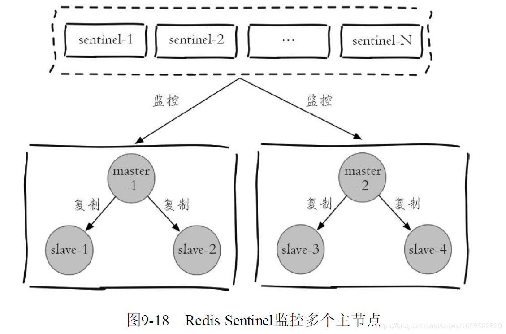

**② sentinel down-after-milliseconds**

配置结点间不可达超时时间。

```bash
sentinel down-after-milliseconds <master-name> <times>
```

每个 Sentinel 节点都要通过**定期发送 ping 命令**来判断 Redis 数据节点和其余 Sentinel 节点**是否可达**，如果超过了 down-after-milliseconds 配置的**时间**且没有有效的回复，则判定节点不可达，\<times>（单位为毫秒）就是超时时间。

**③ sentinel parallel-syncs **

用来限制在一次故障转移之后，**每次向新的主节点发起复制操作**的从节点个数。

```bash
sentinel parallel-syncs <master-name> <nums>
```

**④ sentinel failover-timeout **

failover-timeout 通常被解释成**故障转移超时时间**，但实际上它作用于故障转移的各个阶段。

##### 2. 部署技巧

- Sentinel 节点不应该部署在一台物理“机器”上。
- 部署**至少三个且奇数个**的 Sentinel 节点。3 个以上是通过增加 Sentinel 节点的个数提高对于故障判定的**准确性**，因为领导者选举需要至少一半加 1 个节点，奇数个节点可以在满足该条件的基础上节省一个节点。


#### demo

##### 1. 第一步：创建主从节点配置文件并启动

正确安装好 Redis 之后，我们去到 Redis 的安装目录 *(mac 默认在 `/usr/local/`)*，找到 `redis.conf` 文件复制三份分别命名为 `redis-master.conf`/`redis-slave1.conf`/`redis-slave2.conf`，分别作为 `1` 个主节点和 `2` 个从节点的配置文件 *(下图演示了我本机的 `redis.conf` 文件的位置)*

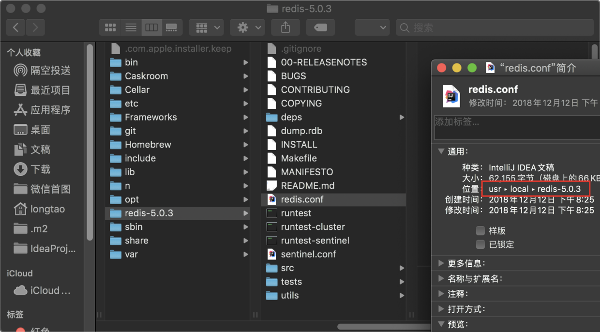

打开可以看到这个 `.conf` 后缀的文件里面有很多说明的内容，全部删除然后分别改成下面的样子：

```bash
#redis-master.conf
port 6379
daemonize yes
logfile "6379.log"
dbfilename "dump-6379.rdb"
 
#redis-slave1.conf
port 6380
daemonize yes
logfile "6380.log"
dbfilename "dump-6380.rdb"
slaveof 127.0.0.1 6379
 
#redis-slave2.conf
port 6381
daemonize yes
logfile "6381.log"
dbfilename "dump-6381.rdb"
slaveof 127.0.0.1 6379
```

然后我们可以执行 `redis-server <config file path>` 来根据配置文件启动不同的 Redis 实例，依次启动主从节点：

```bash
redis-server /usr/local/redis-5.0.3/redis-master.conf
redis-server /usr/local/redis-5.0.3/redis-slave1.conf
redis-server /usr/local/redis-5.0.3/redis-slave2.conf
```

节点启动后，我们执行 `redis-cli` 默认连接到我们端口为 `6379` 的主节点执行 `info Replication` 检查一下主从状态是否正常：*(可以看到下方正确地显示了两个从节点)*

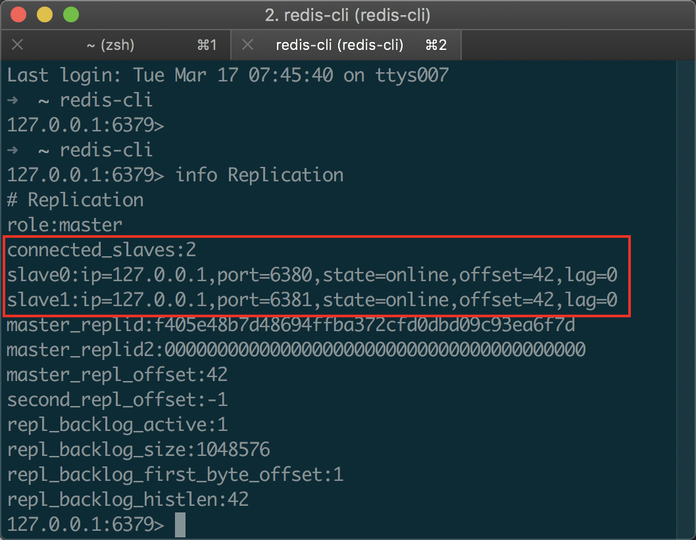

##### 2. 第二步：创建哨兵节点配置文件并启动

按照上面同样的方法，我们给哨兵节点也创建三个配置文件。*(哨兵节点本质上是特殊的 Redis 节点，所以配置几乎没什么差别，只是在端口上做区分就好)*

```bash
# redis-sentinel-1.conf
port 26379
daemonize yes
logfile "26379.log"
sentinel monitor mymaster 127.0.0.1 6379 2

# redis-sentinel-2.conf
port 26380
daemonize yes
logfile "26380.log"
sentinel monitor mymaster 127.0.0.1 6379 2

# redis-sentinel-3.conf
port 26381
daemonize yes
logfile "26381.log"
sentinel monitor mymaster 127.0.0.1 6379 2
```

其中，`sentinel monitor mymaster 127.0.0.1 6379 2` 配置的含义是：该哨兵节点监控 `127.0.0.1:6379` 这个主节点，该主节点的名称是 `mymaster`，最后的 `2` 的含义与主节点的故障判定有关：至少需要 `2` 个哨兵节点同意，才能判定主节点故障并进行故障转移。

执行下方命令将哨兵节点启动起来：

```bash
redis-server /usr/local/redis-5.0.3/redis-sentinel-1.conf --sentinel
redis-server /usr/local/redis-5.0.3/redis-sentinel-2.conf --sentinel
redis-server /usr/local/redis-5.0.3/redis-sentinel-3.conf --sentinel
```

使用 `redis-cil` 工具连接哨兵节点，并执行 `info Sentinel` 命令来查看是否已经在监视主节点了：

```bash
# 连接端口为 26379 的 Redis 节点
➜  ~ redis-cli -p 26379
127.0.0.1:26379> info Sentinel
# Sentinel
sentinel_masters:1
sentinel_tilt:0
sentinel_running_scripts:0
sentinel_scripts_queue_length:0
sentinel_simulate_failure_flags:0
master0:name=mymaster,status=ok,address=127.0.0.1:6379,slaves=2,sentinels=3
```

此时你打开刚才写好的哨兵配置文件，你还会发现出现了一些变化：

##### 3. 第三步：演示故障转移

首先，我们使用 `kill -9` 命令来杀掉主节点，**同时** 在哨兵节点中执行 `info Sentinel` 命令来观察故障节点的过程：

```bash
➜  ~ ps aux | grep 6379
longtao          74529   0.3  0.0  4346936   2132   ??  Ss   10:30上午   0:03.09 redis-server *:26379 [sentinel]
longtao          73541   0.2  0.0  4348072   2292   ??  Ss   10:18上午   0:04.79 redis-server *:6379
longtao          75521   0.0  0.0  4286728    728 s008  S+   10:39上午   0:00.00 grep --color=auto --exclude-dir=.bzr --exclude-dir=CVS --exclude-dir=.git --exclude-dir=.hg --exclude-dir=.svn 6379
longtao          74836   0.0  0.0  4289844    944 s006  S+   10:32上午   0:00.01 redis-cli -p 26379
➜  ~ kill -9 73541
```

如果 **刚杀掉瞬间** 在哨兵节点中执行 `info` 命令来查看，会发现主节点还没有切换过来，因为哨兵发现主节点故障并转移需要一段时间：

```bash
# 第一时间查看哨兵节点发现并未转移，还在 6379 端口
127.0.0.1:26379> info Sentinel
# Sentinel
sentinel_masters:1
sentinel_tilt:0
sentinel_running_scripts:0
sentinel_scripts_queue_length:0
sentinel_simulate_failure_flags:0
master0:name=mymaster,status=ok,address=127.0.0.1:6379,slaves=2,sentinels=3
```

一段时间之后你再执行 `info` 命令，查看，你就会发现主节点已经切换成了 `6381` 端口的从节点：

```bash
# 过一段时间之后在执行，发现已经切换了 6381 端口
127.0.0.1:26379> info Sentinel
# Sentinel
sentinel_masters:1
sentinel_tilt:0
sentinel_running_scripts:0
sentinel_scripts_queue_length:0
sentinel_simulate_failure_flags:0
master0:name=mymaster,status=ok,address=127.0.0.1:6381,slaves=2,sentinels=3
```

但同时还可以发现，**哨兵节点认为新的主节点仍然有两个从节点** *(上方 slaves=2)*，这是因为哨兵在将 `6381` 切换成主节点的同时，将 `6379` 节点置为其从节点。虽然 `6379` 从节点已经挂掉，但是由于 **哨兵并不会对从节点进行客观下线**，因此认为该从节点一直存在。当 `6379` 节点重新启动后，会自动变成 `6381` 节点的从节点。

另外，在故障转移的阶段，哨兵和主从节点的配置文件都会被改写：

- **对于主从节点：** 主要是 `slaveof` 配置的变化，新的主节点没有了 `slaveof` 配置，其从节点则 `slaveof` 新的主节点。
- **对于哨兵节点：** 除了主从节点信息的变化，纪元(epoch) *(记录当前集群状态的参数)* 也会变化，纪元相关的参数都 +1 了。


#### Redis Sentinel API与客户端

##### 1. Sentinel API

Sentinel 节点是一个**特殊的 Redis 节点**，它有自己**专属的 API**。

**① sentinel masters**

展示所有被监控的**主节点**状态以及相关的统计信息。

```bash
127.0.0.1:26379> sentinel masters
1) 1) "name"
2) "mymaster-2"
3) "ip"
4) "127.0.0.1"
5) "port"
6) "6382"
.........忽略............
2) 1) "name"
2) "mymaster-1"
3) "ip"
4) "127.0.0.1"
5) "port"
6) "6379"
.........忽略............
```

**② sentinel master \<master name>**

展示指定 \<master name> 的**主节点**状态以及相关的统计信息。

**③ sentinel slaves \<master name>**

展示指定 \<master name> 的**从节点**状态以及相关的统计信息。

**④ sentinel sentinels \<master name>**

 展示指定 \<master name> 的 **Sentinel 节点集合**（不包含当前 Sentinel节点)。

**⑤ sentinel failover \<master name>**

对指定 \<master name> **主节点进行强制故障转移**（没有和其他 Sentinel 节点“协商”），当故障转移完成后，其他 Sentinel 节点按照故障转移的结果**更新自身配置**，这个命令在 Redis Sentinel 的**日常运维中非常有用**.

```bash
127.0.0.1:26379> sentinel failover mymaster-2
OK
```

**⑥ sentinel remove \<master name>**

取消对某个主节点的监控。

##### 2. 客户端连接

###### ①概述

**客户端初始化时连接**的是 Sentinel **节点集合**，**不再是**具体的 Redis 节点，但 Sentinel 只是配置中心不是代理。

Sentinel 节点集合具备了监控、通知、自动故障转移、配置提供者若干功能，也就是说实际上最了解主节点信息的就是 Sentinel 节点集合，而各个主节点可以通过 \<master-name> 进行标识的，所以无论哪种编程语言的客户端，如果需要正确地连接 Redis Sentinel，必须有 **Sentinel 节点集合和 masterName 两个参数**。

客户端基本操作：

- 遍历 Sentinel 节点集合获取一个可用的 Sentinel 节点，Sentinel 节点之间可以**共享数据**，所以从**任意**一个 Sentinel 节点获取**主节点**信息都是可以的。

- 需要**验证**当前获取的“主节点”是真正的主节点，这样做的目的是为了防止**故障转移期间**主节点的变化。

- 保持和 Sentinel 节点集合的“联系”，时刻获取关于主节点的相关“信息”。

###### ② Jedis

Jedis 提供了 Sentinel 连接池。

````java
public JedisSentinelPool(String masterName, # 主节点名
       Set<String> sentinels,	# Sentinel节点集合
       final GenericObjectPoolConfig poolConfig,    # common-pool连接池配置
       final int connectionTimeout,		# 连接超时
       final int soTimeout,			# 读写超时
       final String password, 	# 主节点密码
       final int database,		# 当前数据库索引
       final String clientName)	# 客户端名
````

连接时**遍历** Sentinel 结点集合，找到**一个**可用的 Sentinel 结点，然后从中得到**主节点信息**。


#### 哨兵实现原理

详细介绍一下哨兵机制是如何实现的。

##### 1. 三个定时监控任务

一套合理的监控机制是 Sentinel 节点判定节点**不可达**的重要保证，Redis Sentinel 通过**三个定时监控任务**完成对各个节点发现和监控。

###### ① Sentinel与数据结点的定时任务

每隔 **10 秒**，每个 **Sentinel 节点**会向**主节点和从节点**发送 **info 命令**获取最新的拓扑结构。

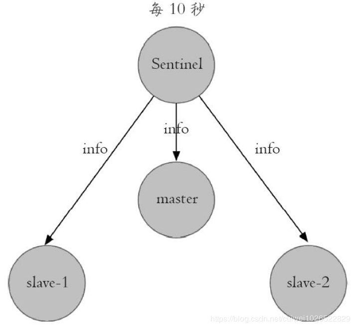

如在一个主节点执行 info replication 命令。

```bash
# Replication
role:master
connected_slaves:2
slave0:ip=127.0.0.1,port=6380,state=online,offset=4917,lag=1
slave1:ip=127.0.0.1,port=6381,state=online,offset=4917,lag=1
```

Sentinel 节点通过对上述结果进行**解析**就可以找到相应的**从节点**。

这个定时任务的作用具体可以表现在三个方面：

- 通过向主节点执行 info 命令，获取从节点的信息，这也是为什么 Sentinel 节点不需要显式配置监控从节点。

- 当有新的从节点加入时都可以**立刻感知**出来。

- 节点不可达或者故障转移后，可以通过 info 命令实时**更新**节点拓扑信息。

###### ② Sentinel之间的定时任务

每隔 **2 秒**，每个 Sentinel 节点会向 Redis **数据节点**的  **\__sentinel__：hello** 频道上发送该 Sentinel 节点对于**主节点的判断**以及当前 Sentinel **节点的信息**，同时每个 Sentinel 节点也会**订阅该频道**，来了解其他 Sentinel 节点以及它们对主节点的判断。

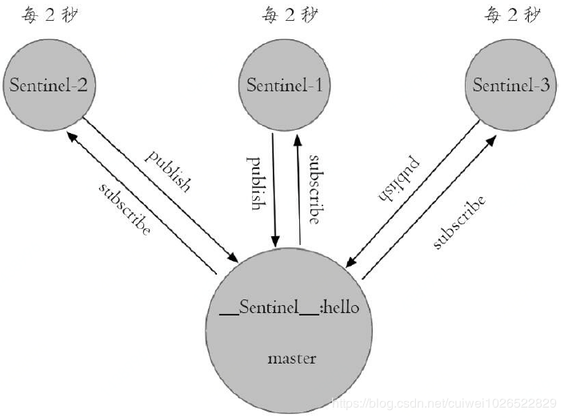

所以这个定时任务可以完成以下两个工作:

- 发现新的 Sentinel 节点：通过订阅主节点的 \__sentinel__：hello 了解其他的 Sentinel 节点信息，如果是新加入的 Sentinel 节点，将该 Sentinel 节点信息保存起来，并与该 Sentinel 节点创建连接。

- Sentinel 节点之间**交换主节点的状态**，作为后面**客观下线**以及**领导者选举**的依据。

###### ③ 心跳定时任务

每隔 **1 秒**，每个 Sentinel 节点会向**主节点、从节点、其余 Sentinel 节点**发送一条 **ping 命令做一次心跳检测**，来确认这些节点当前**是否可达**。通过上面的定时任务，Sentinel 节点对主节点、从节点、其余 Sentinel 节点都建立起连接，实现了对**每个节点**的监控，这个定时任务是节点失败判定的重要依据。

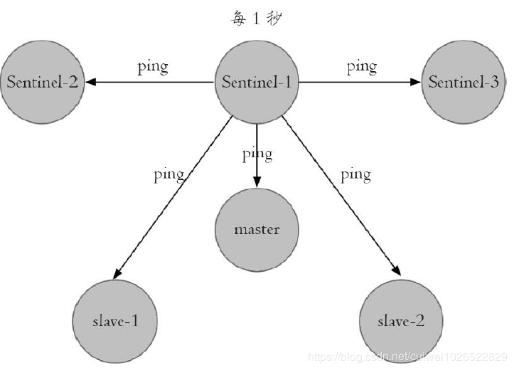

##### 2. 主观下线与客观下线

###### ① 主观下线

每个 Sentinel 节点会每隔 1 秒对主节点、从节点、其他 Sentinel 节点发送 ping 命令做**心跳检测**，当这些节点超过 down-after-milliseconds **没有进行有效回复**，这个 Sentinel 节点就会对**该节点做失败判定**，这个行为叫做**主观下线**。

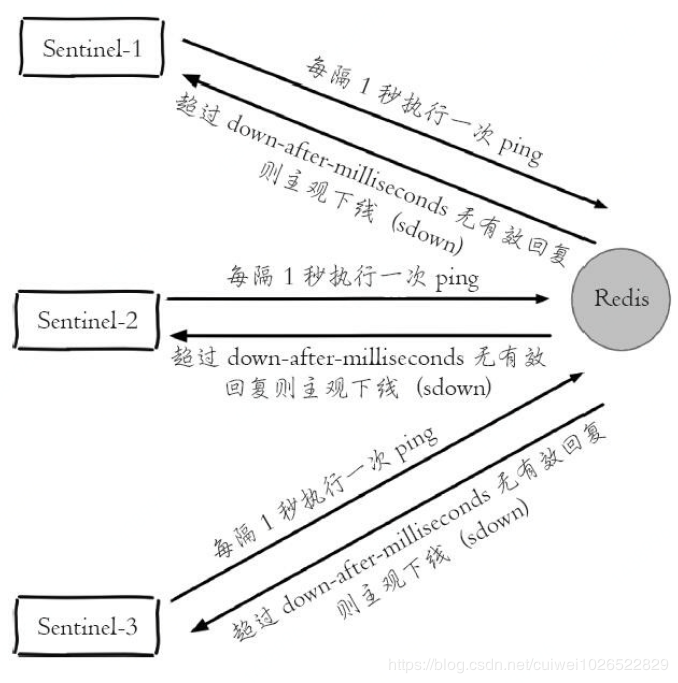

从字面意思也可以很容易看出主观下线是**当前 Sentinel 节点**的一家之言，存在**误判**的可能。也就是可能就这一个 Sentinel 认为一个结点是下线了。

###### ② 客观下线

当 Sentinel 主观下线的节点是**主节点**时，该 Sentinel 节点会通过 sentinel ismaster-down-by-addr 命令向其他 Sentinel 节点**询问对主节点的判断**，当**超过 \<quorum> 个数**，Sentinel 节点认为主节点确实有问题，这时该 Sentinel 节点会**做出客观下线**的决定，也就是大部分 Sentinel 节点都对主节点的下线做了同意的判定，那么这个判定就是客观的。

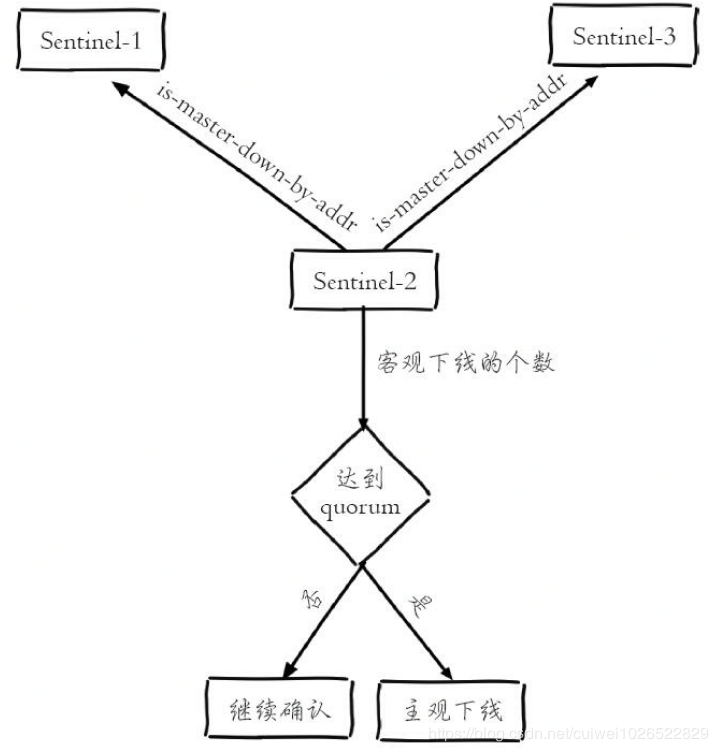

注意：**从节点、Sentinel 节点在主观下线后，没有后续的故障转移操作**。只对主节点做故障转移。

##### 3. 领导者Sentinel选举

假如 Sentinel 节点对于**主节点**已经做了**客观下线**，并不是马上进行故障转移。实际上**故障转移的工作**只需要**一个 Sentinel 节点来完成**即可，所以 Sentinel 节点之间会做一个**领导者选举**的工作，选出一个 Sentinel 节点**作为领导者进行故障转移**的工作。Redis 使用了 **Raft 算法**实现领导者选举。大致思路：

1）每个在线的 Sentinel 节点都有资格成为领导者，当它确认主节点主观下线时候，会向其他 Sentinel 节点发送 sentinel is-master-down-by-addr 命令，要求**将自己**设置为领导者。
2）收到命令的 Sentinel 节点，如果没有同意过其他 Sentinel 节点的 sentinel is-master-down-by-addr 命令，将同意该请求，否则拒绝。 
3）如果该 Sentinel 节点发现**自己的票数已经大于等于max（quorum，num（sentinels）/2+1）**，那么它将成为领导者。因为每个 Sentinel 节点只有**一票**。
4）如果此过程没有选举出领导者，将进入**下一次**选举。
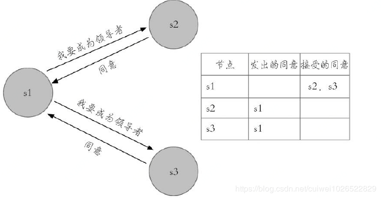

选举的过程非常快，基本上谁先完成客观下线，谁就是领导者。

##### 4. 故障转移过程

故障转移过程如下。故障转移每一步都可以通过**发布订阅**来获取。

主节点出现**故障**，此时两个从节点与主节点**失去连接**，**主从复制失败**。

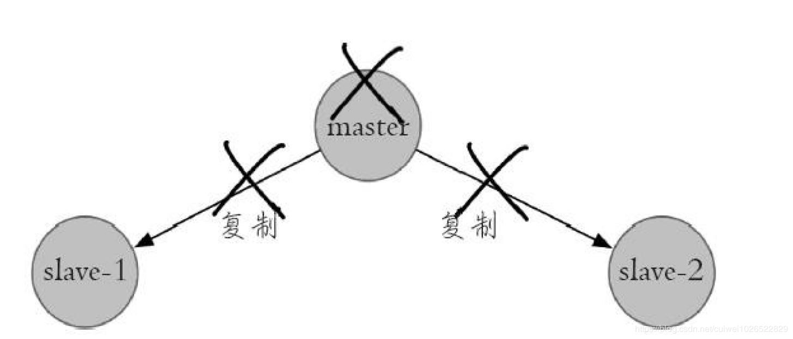

每个 Sentinel 节点通过**定期监控**发现主节点出现了故障。 

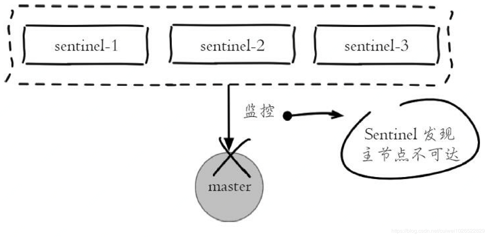

多个 Sentinel 节点对主节点的故障**达成一致**，**选举出 sentinel-3 节点作为领导者负责故障转移**。

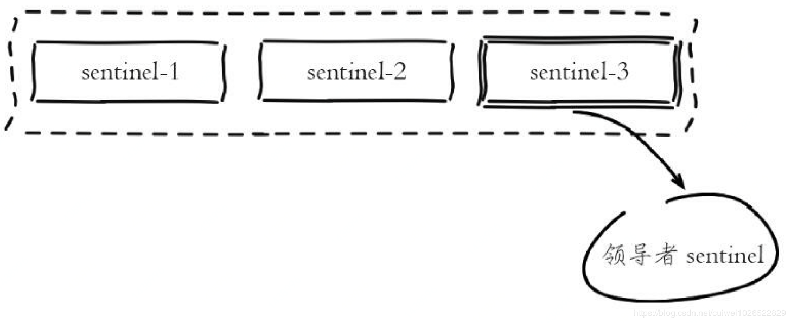

Sentinel 领导者节点执行了**故障转移**。流程如下。

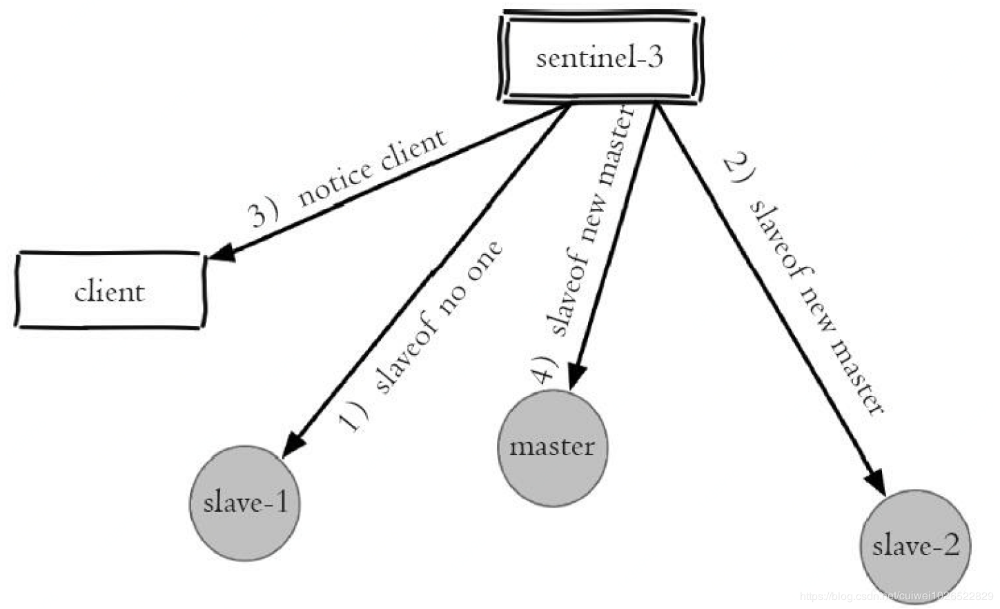

需要在**从节点列表**中选出一个节点作为**新的主节点**，选择方法有：① 过滤“不健康”的节点；② 选择 **salve-priority** 最高的从节点列表；③ 选择**复制偏移量最大（复制数据最完整）**的节点；④ 选择 runid 最小的从节点。

- 假设这里从节点 1 变成主节点。

- Sentinel 领导者节点会对选出来的从节点执行 slaveof no one 命令让其成为**主节点**，此时原来的从节点 1 变成新的主节点。

- Sentinel 领导者节点会向**剩余的从节点**发送命令，让它们成为新主节点的从节点，**复制规则**和 parallel-syncs 参数有关。

- 然后 Sentinel 领导者节点**通知**客户端。

- 最后原来的故障主节点**重启**成为一个**从节点**。

故障转移后整个 Redis Sentinel 的拓扑结构图如下。

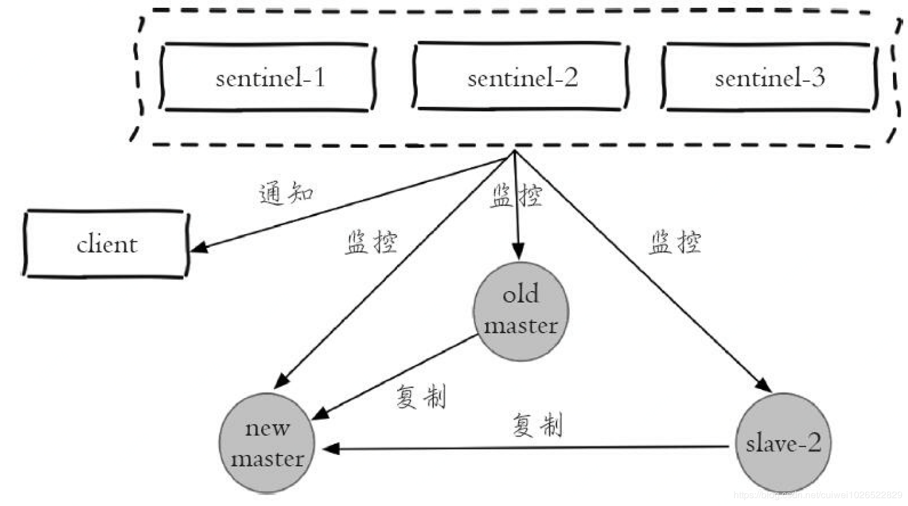

整个故障转移过程会产生大量的**日志**，如有需要再看看。

##### 5. 节点上下线

###### ① 节点下线

对**主节点**进行下线，比较合理的做法是选出一个“合适”（例如性能更高的机器）的**从节点**，使用 **sentinel failover** 功能将从节点晋升主节点，只需要在任意可用的 Sentinel 节点。

```bash
sentinel failover <master name>
```

在**任意**一个 Sentinel 节点上（例如26379端口节点）执行 sentinel failover 即可。

如果需要对**从节点或者 Sentinel 节点**进行下线，只需要确定好是临时还是永久下线后执行相应操作即可。

###### ② 节点上线

**从节点上线**：添加 **slaveof {masterIp} {masterPort}** 的配置，使用 redis-server 启动即可，它将被 Sentinel 节点**自动发现**。

**Sentinel 节点上线**：添加 **sentinel monitor** 主节点的配置，使用 redis-sentinel 启动即可，它将被其余 Sentinel 节点**自动发现**。


#### 高可用读写分离

Redis Sentinel 实现**读写分离高可用**可以依赖 Sentinel 节点的**消息通知**，获取 Redis 数据节点的**状态变化**。

**从节点**一般可以起到两个作用：第一，当主节点出现故障时，作为主节点的后备“顶”上来实现**故障转移**，Redis Sentinel已经实现了该功能的自动化，实现了真正的高可用。第二，扩展主节点的**读能力**，尤其是在**读多写少的场景**非常适用。

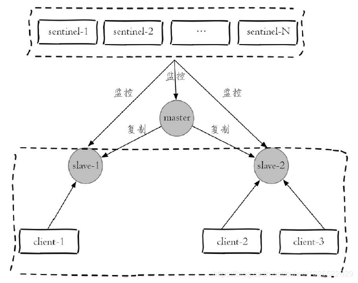

但上述模型中，从节点**不是高可用**的，如果 slave-1 节点出现故障，首先客户端 client-1 将与其失联，其次 Sentinel 节点只会对该节点做**主观下线**，因为 Redis Sentinel 的**故障转移是针对主节点**的。

所以很多时候，Redis Sentinel 中的**从节点仅仅是作为主节点一个热备**，不让它参与客户端的读操作，就是为了保证整体高可用性，但实际上这种使用方法还是有一些浪费，尤其是在有很多从节点或者确实需要读写分离的场景，所以**如何实现从节点的高可用**是非常有必要的。

**Redis Sentinel 读写分离设计思路**

Redis Sentinel 在对各个节点的监控中，如果有对应**事件**的发生，都会发出相应的**事件消息**。

在设计 Redis Sentinel 的**从节点高可用**时，只要能够实时掌握**所有从节点的状态**，把所有从节点看做一个**资源池**，无论是上线还是下线从节点，客户端都能**及时感知**到（将其从资源池中添加或者删除），这样从节点的高可用目标就达到了。

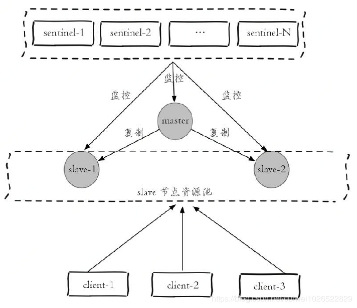