[TOC]

### Redis Cluster

Redis Cluster 是 Redis 的**分布式**解决方案。当遇到单机内存、并发、流量等瓶颈时可以采用 cluster 架构的解决方案。

#### 数据分布理论

分布式数据库首先要解决把**整个数据集**按照分区规则**映射到多个节点**的问题，即把数据集划分到多个节点上，每个节点负责整体数据的一个子集。

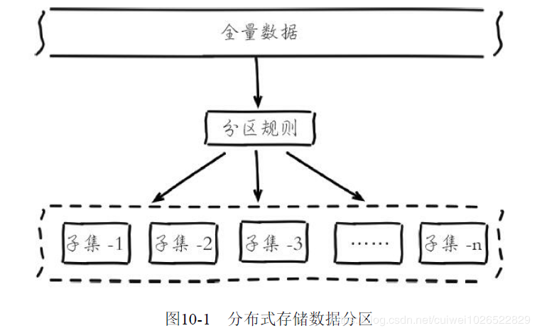

需要重点关注的是**数据分区方案**。常见的分区规则有**哈希分区和顺序分区**两种。

- 哈希分区：离散度好，数据分布业务无关，无法顺序访问。代表产品：**Redis Cluster**、Dynamo、Cassandra。
- 顺序分区：离散度易倾斜、数据分布业务相关，可顺序访问。代表产品：**HBase**、Bigtable。

##### 1. 哈希数据分区方案

常见的哈希分区规则有几种。

###### ① 节点取模分区

使用特定的数据，如 Redis 的键或用户 ID，再根据节点数量 N 使用公式：**hash（key）% N** 计算出哈希值，用来决定数据**映射**到哪一个节点上。

这种方案存在一个问题：当节点数量变化时，如扩容或收缩节点，数据节点映射关系需要**重新计算再哈希**，会导致数据的大量**重新迁移**。所以扩容时通常采用**翻倍扩容**，避免数据映射全部被打乱导致全量迁移的情况。

###### ② 一致性哈希分区

一致性哈希分区**（Distributed Hash Table）**实现思路是为系统中**每个节点分配一个 token**，范围一般在 0~232，这些token 构成一个**哈希环**。数据读写执行节点查找操作时，先根据 key 计算 hash 值，然后**顺时针找到第一个大于等于该哈希值**的 token节点 并存储数据。

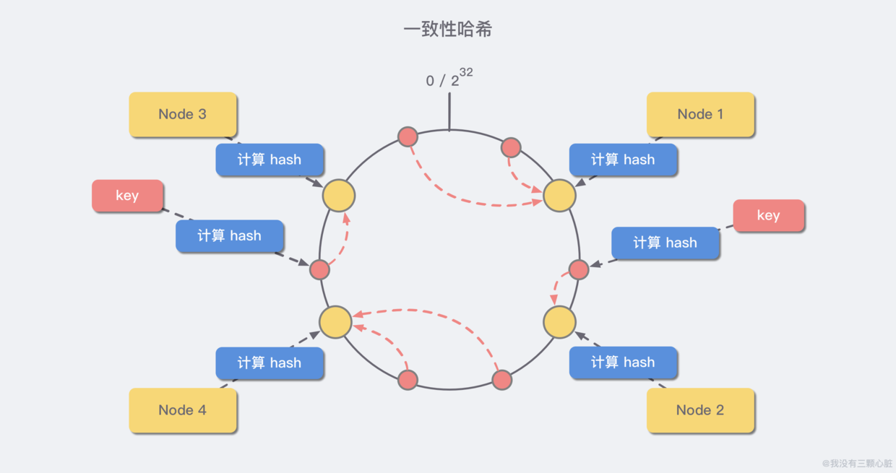

与哈希取余分区相比，一致性哈希分区将 **增减节点的影响限制在相邻节点**。以上图为例，如果在 `node1` 和 `node2` 之间增加 `node5`，则只有 `node2` 中的一部分数据会迁移到 `node5`；如果去掉 `node2`，则原 `node2` 中的数据只会迁移到 `node4` 中，只有 `node4` 会受影响。

一致性哈希分区的主要问题在于，当 **节点数量较少** 时，增加或删减节点，**对单个节点的影响可能很大**，造成数据的严重不平衡。还是以上图为例，如果去掉 `node2`，`node4` 中的数据由总数据的 `1/4` 左右变为 `1/2` 左右，与其他节点相比负载过高。

正因为一致性哈希分区的这些缺点，一些分布式系统采用**虚拟槽**对一致性哈希进行改进，比如 Dynamo 系统。

###### ③ 虚拟槽分区

这种方案在 **一致性哈希分区的基础上**，引入了 **虚拟节点** 的概念。Redis 集群使用的便是该方案，其中的虚拟节点称为 **槽（slot）**。槽是介于数据和实际节点之间的虚拟概念，每个实际节点包含一定数量的槽，每个槽包含哈希值在一定范围内的数据。

虚拟槽分区巧妙地使用了**哈希空间**，使用分散度良好的哈希函数把所有数据映射到一个**固定范围**的整数集合中，**整数定义为槽（slot）**。这个范围一般**远远大于节点数**，比如 Redis Cluster 槽范围是 **0~16383**。

在使用了槽的一致性哈希分区中，**槽是数据管理和迁移的基本单位**。槽 **解耦** 了 **数据和实际节点** 之间的关系，增加或删除节点对系统的影响很小。仍以上图为例，系统中有 `4` 个实际节点，假设为其分配 `16` 个槽(0-15)； 

- 槽 0-3 位于 node1；4-7 位于 node2；以此类推....

如果此时删除 `node2`，只需要将槽 4-7 重新分配即可，例如槽 4-5 分配给 `node1`，槽 6 分配给 `node3`，槽 7 分配给 `node4`；可以看出删除 `node2` 后，数据在其他节点的分布仍然较为均衡。

采用大范围槽的主要目的是为了方便数据**拆分和集群扩展**。**每个节点会负责一定数量的槽**。

##### 2. Redis数据分区

**Redis Cluster** 就是**采用虚拟槽分区**。

所有的键根据哈希函数映射到 **0~16383** 整数槽内，计算公式：**slot=CRC16（key）&16383**。每一个节点负责维护一部分槽以及槽所映射的键值数据。

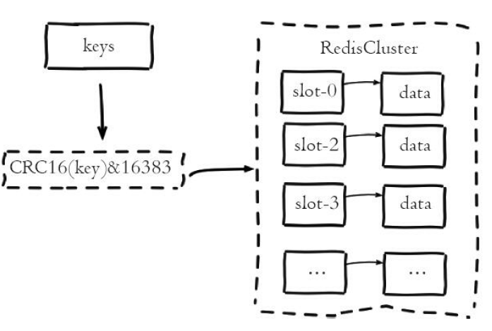

比如。

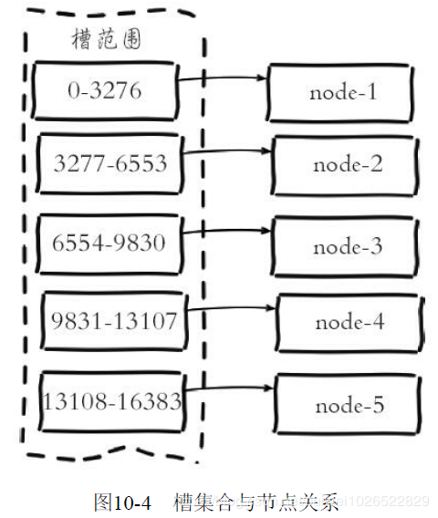

当前集群有 5 个节点，每个节点平均大约负责 3276 个槽。由于采用**高质量的哈希算法**，每个槽所映射的数据通常比较均匀，将数据平均划分到 5 个节点进行**数据分区**。

数据分区是**分布式存储的核心**，理解和灵活运用数据分区规则对于掌握 Redis Cluster 非常有帮助。 

#### 集群的作用与功能限制

##### 1. 集群的作用

- **数据分区：** 数据分区 *(或称数据分片)* 是集群最核心的功能。集群将数据分散到多个节点，**一方面** 突破了 Redis 单机内存大小的限制，**存储容量大大增加**；**另一方面** 每个主节点都可以对外提供读服务和写服务，**大大提高了集群的响应能力**。Redis 单机内存大小受限问题，在介绍持久化和主从复制时都有提及，例如，如果单机内存太大，`bgsave` 和 `bgrewriteaof` 的 `fork` 操作可能导致主进程阻塞，主从环境下主机切换时可能导致从节点长时间无法提供服务，全量复制阶段主节点的复制缓冲区可能溢出……
- **高可用：** 集群支持主从复制和主节点的 **自动故障转移** *（与哨兵类似）*，当任一节点发生故障时，集群仍然可以对外提供服务。

##### 2. 集群的功能限制

Redis 集群相对单机在功能上存在一些限制。

- **key 批量操作支持有限**。如 mset、mget，目前只支持具有**相同 slot 值**的 key 执行批量操作。对于映射为不同 slot 值的 key 由于执行 mget、mget 等操作可能存在于多个节点上因此不被支持。
- **key 事务操作支持有限**。同理只支持多 key 在**同一节点**上的事务操作，当多个 key 分布在不同的节点上时无法使用事务功能。
- key 作为数据分区的最小粒度，因此**不能将一个大**的键值对象如 hash、lis t等映射到不同的节点。
- 不支持多数据库空间。单机下的 Redis 可以支持 16 个数据库，集群模式下**只能使用一个**数据库空间，即 db0。
- 复制结构**只支持一层**，从节点只能复制主节点，不支持嵌套树状复制结构。

#### 集群搭建

集群架构如下。集群中的每一个 Redis 节点都 **互相两两相连**，客户端任意 **直连** 到集群中的 **任意一台**，就可以对其他 Redis 节点进行 **读写** 的操作。

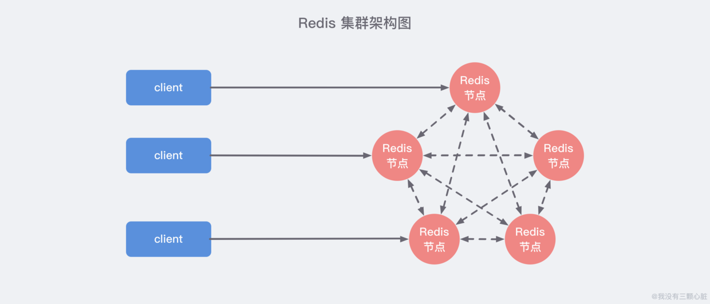

三个步骤：

- 准备节点
- 节点握手
- 分配槽

##### 1. 节点准备

Redis 集群一般由多个节点组成，节点数量至少为 **6 个**才能保证组成完整 ，高可用的集群。每个节点需要**开启配置 cluster-enabled yes**，让 Redis 运行在集群模式下。

建议为集群内所有节点**统一目录**，一般划分三个目录：**conf、data、log**，分别存放配置、数据和日志相关文件。把 6 个节点**配置**统一放在 conf 目录下，集群相关配置如下：

```bash
#节点端口
port 6379
# 开启集群模式
cluster-enabled yes
# 节点超时时间，单位毫秒
cluster-node-timeout 15000
# 集群内部配置文件
cluster-config-file "nodes-6379.conf"
```

其他配置和**单机模式一致**即可，配置文件命名规则 redis-{port}.conf，准备好配置后**启动所有节点**。

```bash
redis-server conf/redis-6379.conf
redis-server conf/redis-6380.conf
redis-server conf/redis-6381.conf
redis-server conf/redis-6382.conf
redis-server conf/redis-6383.conf
redis-server conf/redis-6384.conf
```

检查**节点日志**是否正确，日志内容如下：

```bash
cat log/redis-6379.log
* No cluster configuration found, I'm cfb28ef1deee4e0fa78da86abe5d24566744411e
# Server started, Redis version 3.0.7
* The server is now ready to accept connections on port 6379
```

6379 节点**启动成功**，第一次启动时如果没有集群配置文件，它会**自动创建**一份。

集群模式的 Redis 除了原有的配置文件之外**又加了一份集群配置文件**。当集群内节点信息发生变化，如添加节点、节点下线、故障转移等。节点会**自动保存**集群状态到配置文件中。需要注意的是，Redis **自动维护集群配置文件**，不要手动修改，防止节点重启时产生集群信息错乱。 

节点 6379 首次启动后生成集群配置如下：

```bash
#cat data/nodes-6379.conf
cfb28ef1deee4e0fa78da86abe5d24566744411e 127.0.0.1:6379 myself,master - 0 0 0 connected
vars currentEpoch 0 lastVoteEpoch 0
```

文件内容记录了集群**初始状态**，这里最重要的是**节点 ID**，它是一个 40 位 16 进制字符串，用于**唯一标识集群内一个节点**，之后很多集群操作都要借助于节点 ID 来完成。

需要注意是，节点 ID **不同于运行 ID**。节点 ID 在集群初始化时**只创建一次**，节点重启时会加载集群配置文件进行**重用**，而 Redis 的运行 ID 每次重启都会变化。

在节点 6380 执行 **cluster nodes** 命令获取集群节点状态：

```bash
127.0.0.1:6380>cluster nodes
8e41673d59c9568aa9d29fb174ce733345b3e8f1 127.0.0.1:6380 myself,master - 0 0 0 connected
```

每个节点目前只能识别出**自己**的节点信息。如果启动 6 个节点，但每个节点彼此并不知道对方的存在，需要通过**节点握手**让 6 个节点彼此**建立联系**从而组成一个集群。

##### 2. 节点握手

节点握手是指一批运行在集群模式下的节点通过 Gossip 协议彼此通信，达到感知对方的过程。

节点握手是集群彼此通信的第一步，由**客户端**发起命令：**cluster meet {ip} {port}**。

两个结点直接先用 **meet** 消息进行握手（成功后回复 pong 消息），然后使用 **ping/pong** 消息维护**正常通信**。

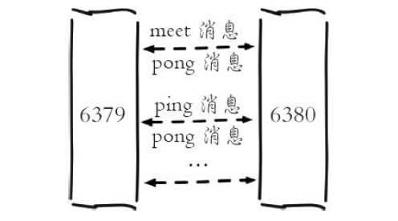

只需要在集群内**任意节点**上执行 cluster meet 命令**加入新节点**，握手状态会通过消息在集群内**传播**，这样其他节点会**自动发现新节点并发起握手流程**。

最后执行 cluster nodes 命令确认 6 个节点都彼此感知并组成集群：

```bash
127.0.0.1:6379> cluster nodes
4fa7eac4080f0b667ffeab9b87841da49b84a6e4 127.0.0.1:6384 master - 0 1468073975551
5 connected
cfb28ef1deee4e0fa78da86abe5d24566744411e 127.0.0.1:6379 myself,master - 0 0 0 connected
be9485a6a729fc98c5151374bc30277e89a461d8 127.0.0.1:6383 master - 0 1468073978579
4 connected
40622f9e7adc8ebd77fca0de9edfe691cb8a74fb 127.0.0.1:6382 master - 0 1468073980598
3 connected
8e41673d59c9568aa9d29fb174ce733345b3e8f1 127.0.0.1:6380 master - 0 1468073974541
1 connected
40b8d09d44294d2e23c7c768efc8fcd153446746 127.0.0.1:6381 master - 0 1468073979589
2 connected
```

节点建立握手之后集群还不能正常工作，这时集群处于**下线状态**，所有的数据读写都被禁止。由于目前所有的**槽**没有分配到节点，因此**集群无法完成槽到节点的映射**。只有当 16384 个槽**全部分配**给节点后，集群才进入**在线状态**。 

##### 3. 分配槽

Redis 集群把所有的数据映射到 16384 个槽中。每个 key 会映射为一个**固定的槽**，只有当节点分配了槽，才能响应和这些槽关联的键命令。

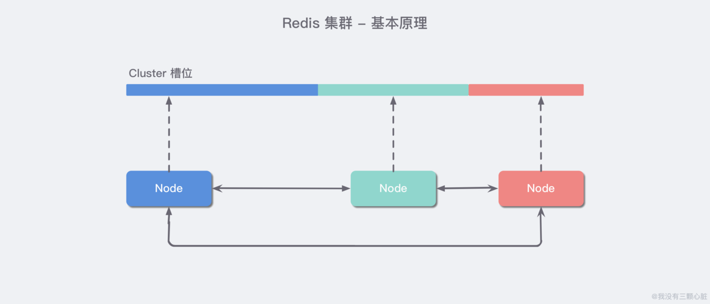

Redis 集群中内置了 `16384` 个哈希槽。当客户端连接到 Redis 集群之后，会同时得到一份关于这个 **集群的配置信息**，当客户端具体对某一个 `key` 值进行操作时，会计算出它的一个 Hash 值，然后把结果对 `16384`  **求余数**，这样每个 `key` 都会对应一个编号在 `0-16383` 之间的哈希槽，Redis 会根据节点数量 **大致均等** 的将哈希槽映射到不同的节点。 

通过 **cluster addslots** 命令为节点分配槽。这里利用 bash 特性批量设置槽（slots），命令如下：

```bash
redis-cli -h 127.0.0.1 -p 6379 cluster addslots {0...5461}
redis-cli -h 127.0.0.1 -p 6380 cluster addslots {5462...10922}
redis-cli -h 127.0.0.1 -p 6381 cluster addslots {10923...16383}
```

把 16384 个 slot 平均分配给 6379、6380、6381 **三个**节点。执行 cluster info 查看集群状态，如下所示：

```bash
127.0.0.1:6379> cluster info
cluster_state:ok
cluster_slots_assigned:16384
cluster_slots_ok:16384
cluster_slots_pfail:0
cluster_slots_fail:0
cluster_known_nodes:6
cluster_size:3
cluster_current_epoch:5
cluster_my_epoch:0
cluster_stats_messages_sent:4874
cluster_stats_messages_received:4726
```

当前集群状态是 OK，集群进入**在线状态**。所有的槽都已经分配给节点，执行 cluster nodes 命令可以看到**节点和槽的分配关系**：

```bash
127.0.0.1:6379> cluster nodes
4fa7eac4080f0b667ffeab9b87841da49b84a6e4 127.0.0.1:6384 master - 0 1468076240123
5 connected
cfb28ef1deee4e0fa78da86abe5d24566744411e 127.0.0.1:6379 myself,master - 0 0 0 connected
0-5461
be9485a6a729fc98c5151374bc30277e89a461d8 127.0.0.1:6383 master - 0 1468076239622
4 connected
40622f9e7adc8ebd77fca0de9edfe691cb8a74fb 127.0.0.1:6382 master - 0 1468076240628
3 connected
8e41673d59c9568aa9d29fb174ce733345b3e8f1 127.0.0.1:6380 master - 0 1468076237606
1 connected
5462-10922
40b8d09d44294d2e23c7c768efc8fcd153446746 127.0.0.1:6381 master - 0 1468076238612
2 connected
10923-16383
```

目前还有三个节点**没有使用**，作为一个完整的集群，每个负责**处理槽的节点应该具有从节点**，保证当它出现故障时可以**自动进行故障转移**。集群模式下，Reids 节点角色分为**主节点和从节点**。首次启动的节点和被分配槽的节点都是主节点，从节点负责**复制**主节点槽信息和相关的数据。

使用 **cluster replicate {nodeId}** 命令让一个节点成为**从节点**。其中命令执行必须在对应的**从节点上**执行，nodeId 是要复制主节点的节点 ID，命令如下：

```bash
127.0.0.1:6382>cluster replicate cfb28ef1deee4e0fa78da86abe5d24566744411e
OK
127.0.0.1:6383>cluster replicate 8e41673d59c9568aa9d29fb174ce733345b3e8f1
OK
127.0.0.1:6384>cluster replicate 40b8d09d44294d2e23c7c768efc8fcd153446746
OK
```

Redis 集群模式下的主从复制使用了之前介绍的 Redis 复制流程，依然**支持全量和部分复制。**复制（replication）完成后，整个集群的结构如下图所示。

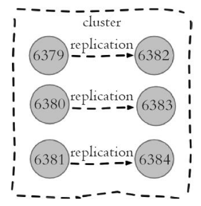

上述即依照 Redis 协议手动建立一个集群。它由 6 个节点构成，3 个主节点负责处理槽和相关数据，3 个从节点负责故障转移。手动比较复杂，Redis 官方提供了 **redis-trib.rb** 工具方便我们快速搭建集群，用这个工具需要安装 Ruby 环境。

##### 4. 完整demo

###### 第一步：创建集群节点配置文件

首先我们找一个地方创建一个名为 `redis-cluster` 的目录：

```bash
mkdir -p ~/Desktop/redis-cluster
```

然后按照上面的方法，创建六个配置文件，分别命名为：`redis_7000.conf`/`redis_7001.conf`.....`redis_7005.conf`，然后根据不同的端口号修改对应的端口值就好了：

```bash
# 后台执行
daemonize yes
# 端口号
port 7000
# 为每一个集群节点指定一个 pid_file
pidfile ~/Desktop/redis-cluster/redis_7000.pid
# 启动集群模式
cluster-enabled yes
# 每一个集群节点都有一个配置文件，这个文件是不能手动编辑的。确保每一个集群节点的配置文件不通
cluster-config-file nodes-7000.conf
# 集群节点的超时时间，单位：ms，超时后集群会认为该节点失败
cluster-node-timeout 5000
# 最后将 appendonly 改成 yes(AOF 持久化)
appendonly yes
```

记得把对应上述配置文件中根端口对应的配置都修改掉 *(port/ pidfile/ cluster-config-file)*。

###### 第二步：分别启动 6 个 Redis 实例

```bash
redis-server ~/Desktop/redis-cluster/redis_7000.conf
redis-server ~/Desktop/redis-cluster/redis_7001.conf
redis-server ~/Desktop/redis-cluster/redis_7002.conf
redis-server ~/Desktop/redis-cluster/redis_7003.conf
redis-server ~/Desktop/redis-cluster/redis_7004.conf
redis-server ~/Desktop/redis-cluster/redis_7005.conf
```

然后执行 `ps -ef | grep redis` 查看是否启动成功：

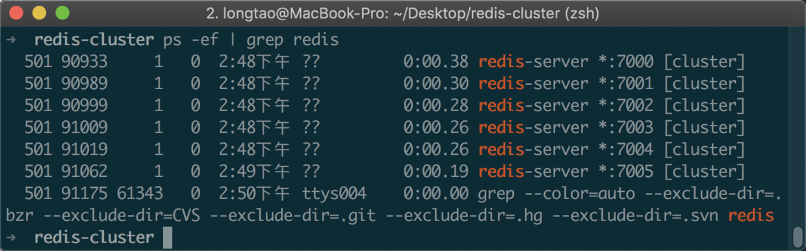

可以看到 `6` 个 Redis 节点都以集群的方式成功启动了，**但是现在每个节点还处于独立的状态**，也就是说它们每一个都各自成了一个集群，还没有互相联系起来，我们需要手动地把他们之间建立起联系。

###### 第三步：建立集群

执行下列命令：

```bash
redis-cli --cluster create --cluster-replicas 1 127.0.0.1:7000 127.0.0.1:7001 127.0.0.1:7002 127.0.0.1:7003 127.0.0.1:7004 127.0.0.1:7005
```

- 这里稍微解释一下这个 `--replicas 1` 的意思是：我们希望为集群中的每个主节点创建一个从节点。

观察控制台输出：

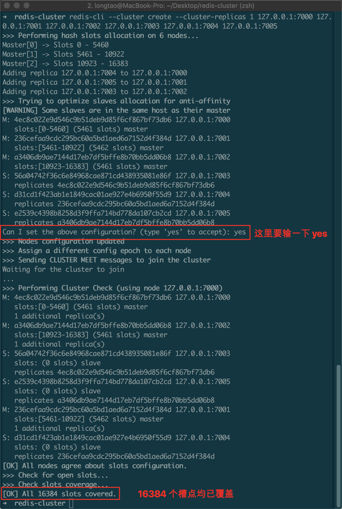

看到 `[OK]` 的信息之后，就表示集群已经搭建成功了，可以看到，这里我们正确地创建了**三主三从**的集群。

###### 第四步：验证集群

我们先使用 `redic-cli` 任意连接一个节点：

```bash
redis-cli -c -h 127.0.0.1 -p 7000
127.0.0.1:7000>
```

- `-c`表示集群模式；`-h` 指定 ip 地址；`-p` 指定端口。

然后随便 `set` 一些值观察控制台输入：

```bash
127.0.0.1:7000> SET name wmyskxz
-> Redirected to slot [5798] located at 127.0.0.1:7001
OK
127.0.0.1:7001>
```

可以看到这里 Redis 自动帮我们进行了 `Redirected` 操作跳转到了 `7001` 这个实例上。

我们再使用 `cluster info` *(查看集群信息)* 和 `cluster nodes` *(查看节点列表)* 来分别看看：*(任意节点输入均可)*

```bash
127.0.0.1:7001> CLUSTER INFO
cluster_state:ok
cluster_slots_assigned:16384
cluster_slots_ok:16384
cluster_slots_pfail:0
cluster_slots_fail:0
cluster_known_nodes:6
cluster_size:3
cluster_current_epoch:6
cluster_my_epoch:2
cluster_stats_messages_ping_sent:1365
cluster_stats_messages_pong_sent:1358
cluster_stats_messages_meet_sent:4
cluster_stats_messages_sent:2727
cluster_stats_messages_ping_received:1357
cluster_stats_messages_pong_received:1369
cluster_stats_messages_meet_received:1
cluster_stats_messages_received:2727

127.0.0.1:7001> CLUSTER NODES
56a04742f36c6e84968cae871cd438935081e86f 127.0.0.1:7003@17003 slave 4ec8c022e9d546c9b51deb9d85f6cf867bf73db6 0 1584428884000 4 connected
4ec8c022e9d546c9b51deb9d85f6cf867bf73db6 127.0.0.1:7000@17000 master - 0 1584428884000 1 connected 0-5460
e2539c4398b8258d3f9ffa714bd778da107cb2cd 127.0.0.1:7005@17005 slave a3406db9ae7144d17eb7df5bffe8b70bb5dd06b8 0 1584428885222 6 connected
d31cd1f423ab1e1849cac01ae927e4b6950f55d9 127.0.0.1:7004@17004 slave 236cefaa9cdc295bc60a5bd1aed6a7152d4f384d 0 1584428884209 5 connected
236cefaa9cdc295bc60a5bd1aed6a7152d4f384d 127.0.0.1:7001@17001 myself,master - 0 1584428882000 2 connected 5461-10922
a3406db9ae7144d17eb7df5bffe8b70bb5dd06b8 127.0.0.1:7002@17002 master - 0 1584428884000 3 connected 10923-16383
127.0.0.1:7001>
```


#### 结点通信机制

##### 1. 通信流程

在分布式存储中需要提供维护**节点元数据信息**的机制，所谓**元数据**是指：节点负责哪些数据，是否出现故障等状态信息。常见的元数据维护方式分为：**集中式和P2P方式**。Redis 集群采用 P2P 的 **Gossip（流言）协议**，Gossip 协议工作**原理**就是**节点彼此不断通信交换信息，一段时间后所有的节点都会知道集群完整的信息，这种方式类似流言传播**。


通信过程说明：

- 集群中的每个节点都会单独开辟一个 **TCP** 通道，用于节点之间彼此通信，通信端口号在基础端口上加 10000。 

- 每个节点在**固定周期**内通过特定规则选择几个节点发送 **ping 消息**。

- 接收到 ping 消息的节点用 **pong 消息**作为响应。

集群中每个节点通过一定规则挑选要通信的节点，每个节点可能知道全部节点，也可能仅知道部分节点，只要这些节点彼此可以正常通信，**最终它们会达到一致的状态。**当节点出故障、新节点加入、主从角色变化、槽信息变更等事件发生时，通过不断的 ping/pong 消息通信，经过一段时间后所有的节点都会知道**整个集群全部节点的最新状态**，从而达到**集群状态同步**的目的。

##### 2. Gossip消息

Gossip 协议的主要职责就是**信息交换**。信息交换的载体就是节点彼此发送的 Gossip 消息。常用的 Gossip 消息可分为：**ping 消息、pong 消息、meet 消息、fail 消息**等。

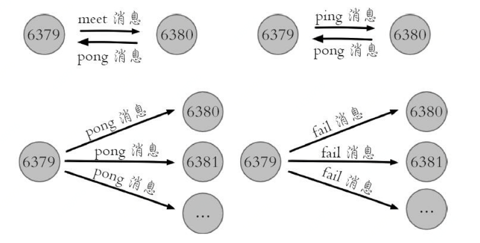

- meet 消息：用于通知**新节点**加入。
- ping 消息：用于检测节点**是否在线和交换彼此状态**信息。ping 消息发送**封装**了自身节点和部分其他节点的状态数据。

- pong 消息：当接收到 ping、meet 消息时，作为响应**消息回复**给发送方确认消息正常通信。

- fail 消息：当节点判定集群内另一个节点下线时，会向集群内广播一个 fail 消息。

所有的消息格式划分为：**消息头和消息体**。消息头包含发送节点自身状态数据，接收节点根据消息头就可以获取到发送节点的相关数据。

集群内所有的消息都**采用相同的消息头结构** clusterMsg，是一个结构体。

```c
union clusterMsgData {
    /* ping,meet,pong消息体*/
    struct {
    /* gossip消息结构数组 */
        clusterMsgDataGossip gossip[1];
 
            } ping;
    /* FAIL 消息体 */
    struct {
        clusterMsgDataFail about;
            } fail;
    // ...
};
```

**消息体** clusterMsgData 定义发送消息的**数据**。通过消息头判断消息类型和状态，通过消息体传送数据。

##### 3. 消息类型

集群中的节点采用 **固定频率（每秒10次）** 的 **定时任务** 进行通信相关的工作：判断是否需要发送消息及消息类型、确定接收节点、发送消息等。如果集群状态发生了变化，如增减节点、槽状态变更，通过节点间的通信，所有节点会很快得知整个集群的状态，使集群收敛。

节点间发送的消息主要分为 `5` 种：`meet 消息`、`ping 消息`、`pong 消息`、`fail 消息`、`publish 消息`。不同的消息类型，通信协议、发送的频率和时机、接收节点的选择等是不同的：

- **MEET 消息：** 在节点握手阶段，当节点收到客户端的 `CLUSTER MEET` 命令时，会向新加入的节点发送 `MEET` 消息，请求新节点加入到当前集群；新节点收到 MEET 消息后会回复一个 `PONG` 消息。
- **PING 消息：** 集群里每个节点每秒钟会选择部分节点发送 `PING` 消息，接收者收到消息后会回复一个 `PONG` 消息。**PING 消息的内容是自身节点和部分其他节点的状态信息**，作用是彼此交换信息，以及检测节点是否在线。`PING` 消息使用 Gossip 协议发送，接收节点的选择兼顾了收敛速度和带宽成本，**具体规则如下**：(1)随机找 5 个节点，在其中选择最久没有通信的 1 个节点；(2)扫描节点列表，选择最近一次收到 `PONG` 消息时间大于 `cluster_node_timeout / 2` 的所有节点，防止这些节点长时间未更新。
- **PONG消息：** `PONG` 消息封装了自身状态数据。可以分为两种：**第一种** 是在接到 `MEET/PING` 消息后回复的 `PONG` 消息；**第二种** 是指节点向集群广播 `PONG` 消息，这样其他节点可以获知该节点的最新信息，例如故障恢复后新的主节点会广播 `PONG` 消息。
- **FAIL 消息：** 当一个主节点判断另一个主节点进入 `FAIL` 状态时，会向集群广播这一 `FAIL` 消息；接收节点会将这一 `FAIL` 消息保存起来，便于后续的判断。
- **PUBLISH 消息：** 节点收到 `PUBLISH` 命令后，会先执行该命令，然后向集群广播这一消息，接收节点也会执行该 `PUBLISH` 命令。


#### 集群伸缩

集群伸缩的原理可以抽象为**槽和对应数据在不同节点之间的灵活移动**。

##### 1. 集群扩容

集群扩容即需要把当前的节点的槽和数据分一些给新的节点（进行移动）。过程如下：

- 准备新节点。
- 加入集群。
- 迁移槽和数据。
- 添加从节点。

新节点的配置建议和集群内的节点配置保持一致，配置后启动新节点即可。

新节点采用 **cluster meet 命令**加入到集群中。一旦与集群任意一个建立联系，各个节点最终都会感知。但是新加入的节点没有分配槽也是无法进行读写的。

需要迁移槽和数据。确定哪些槽需要迁移到新的节点，保证迁移之后各个节点槽的数量**均匀**。数据迁移是**逐个槽**进行的。

迁移过程如下：


图示如下：

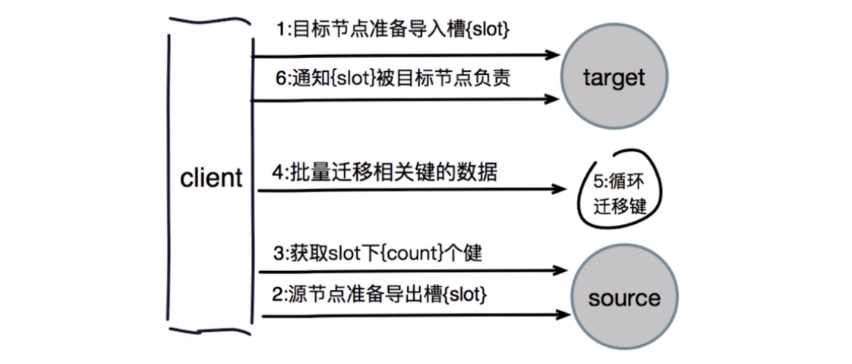

可以使用 redis-trib 工具的 **reshard** 命令简化数据迁移的工作量。

由于槽用于 **hash 运算**本身顺序没有意义，所以**无需强制要求节点负责槽的顺序性**，也就是一个结点上槽不一定是连续的。

数据迁移完之后，集群又多了一个主节点，此时应该再给这个结点**配备一个从节点**。此时扩容完成。

##### 2. 集群收缩

集群收缩即将集群中的节点安全下线。如果下线的结点分配有槽，需要将槽和数据迁移到其他节点，保证下线后数据完整性。需要将这个下线节点的槽均匀的分配到其他节点。也可以使用 **reshard** 命令进行迁移（reshard 迁移的目标节点只能有一个，所以下图需要执行 3 次命令）。如下图。

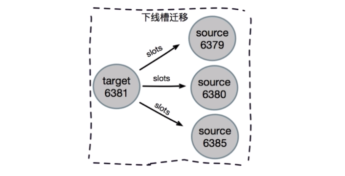

如果下线的结点没有负责槽或本身是从节点，则可以通过 **cluster forget {downNodeId}** 通知集群内其他节点**忘记**这个下线结点，这样其他节点就不再与这个结点进行 Gossip 通信，之后即可正常关闭。建议生产环境用 **redis-trib.rb 工具的 del-node** 命令进行节点下线。

如果下线主节点但**不下线从节点**，则需要把这个存留的从节点**指向**其他节点。

如果主从节点**都下线**，建议先下线从节点再下线主节点，防止不必要的全量复制。


#### 请求路由

与客户端通信时，Redis 集群为了追求性能最大化，没有采用代理的方式，而是采用**客户端直连节点**的方式进行。

##### 1. 请求重定向MOVED

在集群模式下，**Redis 接收任何键相关命令时首先计算键对应的槽，再根据槽找出所对应的节点，如果节点是自身（槽命中），则处理键命令；否则回复 MOVED 重定向错误，告诉客户端请求正确的节点。这个过程就是 MOVED 重定向。**

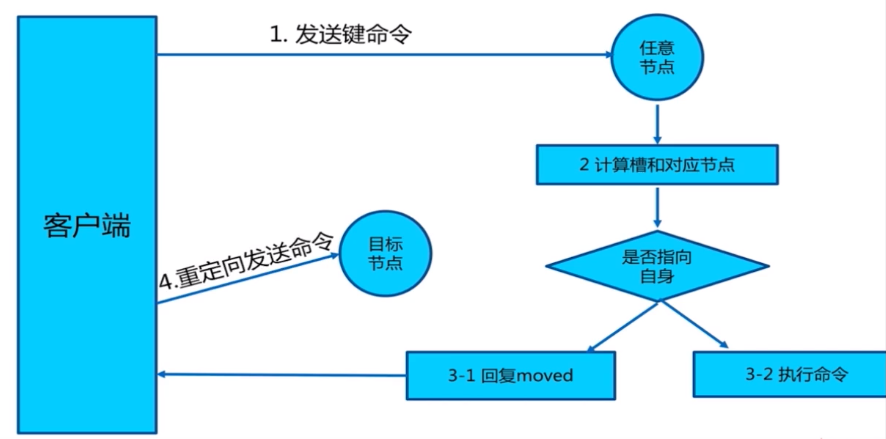

可以借助 **cluster keyslot {key}** 命令返回 key 对应的**槽**。

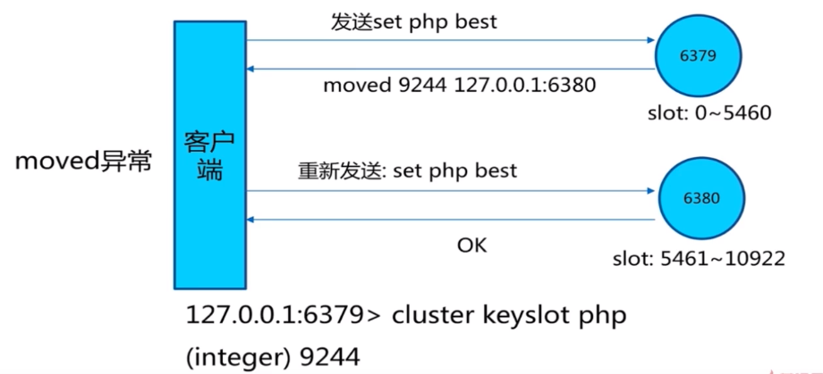

**返回的重定向信息包含了键所对应的槽和负责该槽的节点地址。**根据这些信息客户端可以重新发起请求。

注意：集群中的节点对于不属于它的键操作**只回复重定向响应，不会进行命令转发**。

Redis 槽计算是根据键的有效部分使用 CRC16 函数计算出散列值，然后对 16383 **取模**，可以得到映射的槽。

计算出键对应的槽之后，需要查找槽对应的节点。集群内通过**消息交换**每个节点都会知道**所有节点的槽信息**，内部**保存**在 clusterState 结构中。

根据 MOVED 重定向机制，客户端可以随机连接集群内**任一节点**获取键的信息。

##### 2. Smart客户端

但是如果**每次都进行重定向**肯定会有性能开销，所以可以使用 **Smart 客户端**。大多数开发语言的 Redis 客户端都采用 Smart 客户端支持集群协议。Smart 客户端通过在**内部维护 slot（槽）与 node（节点）的映射关系**，在本地就可以实现键到节点的查找。

如 JedisCluster 会选择一个运行节点，获取节点与槽的信息，解析之后缓存在本地，并为**每个节点创建唯一的 JedisPool 连接池**。早期版本 Jedis 每次收到重定向错误（可能由于集群伸缩导致槽迁移）都会**更新**节点和槽的信息。然而如果每次都更新 slots 信息的话可能会产生 **cluster slots 风暴**问题，影响客户端性能。后续的版本对这个机制进行了改进，减少了客户端更新 slots 缓存的次数，可以容忍一定的重定向请求。

客户端执行多节点命令和操作（如 keys，flushall）的时候会遍历多个节点完成操作。

##### 3. ASK重定向

如果当键**正在迁移**的时候集群收到对键的操作命令，如果数据**都在**原来的节点，直接执行并返回。然而此时可能一部分键在旧的节点上，而**另一部分数据已经迁移到新的节点**上，这时候集群就会回复 **ASK 重定向异常**。客户端解析这个异常信息并再次发起请求。

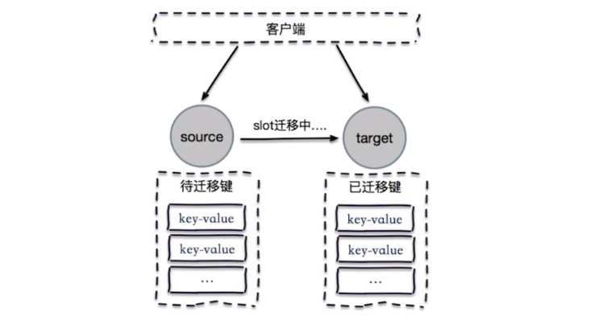

执行流程如下

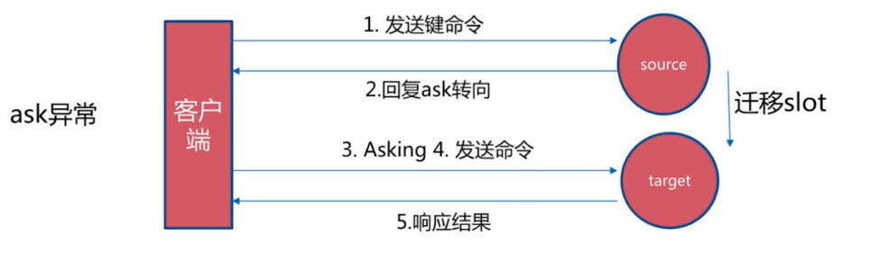

注意在集群下进行**键迁移时**如果使用 **mget、mset 等批量操作**时，slot 迁移数据期间由于键列表无法保证在同一结点，可能导致**大量错误**。虽然集群环境下优先使用 Pipeline 方式进行批量操作，但是 Pipeline 依然无法解决上述问题。所以啊，迁移键的时候最好就别进行批量操作了，慎用！

> **ASK 重定向和 MOVED 重定向的区别？**

两者都是对客户端的重定向控制，但是有本质区别。

ASK 重定向说明集群正在**进行 slot 数据迁移**，客户端无法知道什么时候迁移完成，因此只能**临时性的重定向**，客户端也**不会更新 slots 缓存**。

而 MOVED 重定向说明键对应的槽已经**明确迁移到了**新的节点，类似于**永久重定向**，客户端需要**更新 slots 缓存**。


#### 故障转移

Redis 集群自身实现了高可用，**不需要 Sentinel**，但是机制类似于 Redis Sentinel。

##### 1. 故障发现

集群间通过 ping/pong 消息实现结点通信，消息不但可以传播节点槽信息，还能传播其他状态信息，比如：主从状态、节点故障等。

故障发现也是基于消息传播机制实现的，分为**主观下线和客观下线**。

节点的状态使用 **clusterState** 结构体的 **flags 属性**进行定义。

###### ① 主观下线

主观下线是**一个节点**对于另一个节点不可用的判断，仅代表这一个节点的意见，可能存在**误判**。

集群中每个节点都会定期给其他节点发送 ping 消息，接收节点回复 pong 进行响应。如果响应超时，则发送节点认为对方存在故障，标记为**主观下线状态**（pfail 状态）。

###### ② 客观下线

客观下线则是需要**多个**节点**达成共识**，都认为一个节点不可用。如果不可用的节点持有槽，则需要进行故障转移。

当某个节点认为一个节点不可用时，相应的节点状态会随消息在集群内传播。

**当半数以上持有槽的主节点都标记某个结点是主观下线时，触发客观下线流程。**注意只是**主节点**参与决策。

每个节点收到的其他节点发送的**主观下线信息**是具有**有效期**的，如果时间过长，主观下线信息会过期。

集群中的节点**每次**收到其他节点的主观下线（pfail）状态时，**都会尝试触发客观下线**。首先会计算有效的主观下线报告数量，如果数量大于槽节点的**一半**，则更新为**客观下线**，同时向集群广播下线节点的 fail 消息。

广播下线节点的 fail 消息可以通知集群内所有的节点**标记故障节点为客观下线状态**并立即生效，同时通知故障节点的**从节点触发故障转移流程**（如果故障的就是从节点就不需要了）。

##### 2. 故障恢复

故障节点客观下线后，如果是持有槽的**主节点**，则需要在它的**从节点**中选出一个替换它，实现集群的高可用。

过程如下：

**① 资格检查。**每个从节点**都要**检查最后与主节点直接的短线时间，如果过长则不具有资格。这时候可能有多个有资格成为主节点的从节点。

**② ==设置选举时间==。**每个从节点都会触发选举来选择自己作为主节点。但是选谁？当从节点符合故障转移资格后，**更新**触发故障选举的时间，只有达到时间后才能触发选举。每个从节点进行选举的时间是不一样的，这个触发时间记录在 clusterState 结构体中。这里采用**延迟触发机制**。**复制偏移量越大的从节点的触发选举的时间越早，因为它的数据完整性最高。**

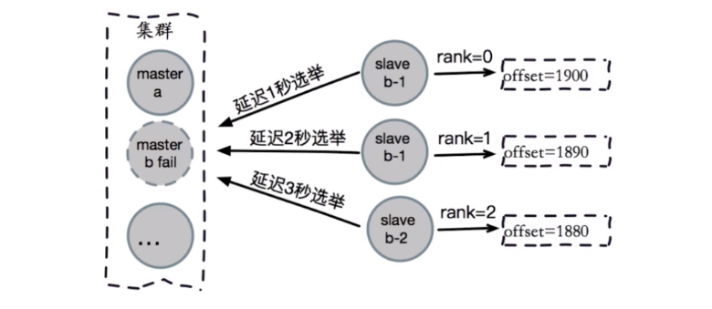

所以从节点中**复制偏移量最大**的节点将**提前触发选举**，它成为主节点的几率也**更大**。

**③ 发起选举**。当从节点定时任务监测到达故障选举时间到达之后，发起选举流程，即更新配置纪元和广播选举消息。

**④ 选举投票**。持有槽的主节点才会处理选举消息，每个节点具有一票。

**⑤ 替换主节点**。选举成功的从节点触发替换主节点操作。当前从节点取消复制变成主节点。之后自己接管原来主节点负责的槽。然后向集群广播自己成为主节点的状态信息。

整个故障转移过程也会产生大量的日志，可以模拟一下故障场景，好好看看日志。


#### 集群运维

##### 1. 带宽消耗

集群的带宽消耗主要为：**读写命令消耗 + Gossip 消息消耗**。Gossip 消息别太频繁，不然可能占用较多带宽。

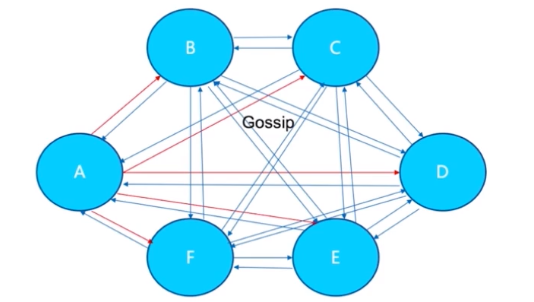

官方建议集群最大规模不要超过 1000。

##### 2. Pub/Sub广播问题

Redis 的 Pub/Sub（发布/订阅）功能用于针对频道实现消息的发布和订阅。但是集群模式下 publish 命令会向所有的节点进行广播，造成每条 publish 数据都会在集群内所有节点传播一次，加重带宽负担。


在含有**大量**节点集群中应该**避免频繁使用发布订阅功能**，否则会严重消耗集群内网络带宽。

##### 3. 集群倾斜

###### ① 数据倾斜

主要有几种：

- 节点和槽分配严重不均匀。可以使用 **redis-trib.rb 工具的 rebalance** 命令进行平衡。
- 不同槽对应键数量差异过大。主要是发现键多的槽
- 集合对象包含大量元素。使用 redis-cli --bigkeys 找出大集合对象，然后可以考虑分解。
- 内存相关配置不一致。

###### ② 请求倾斜

对特点的节点请求过多，造成负载不均衡。

- 合理设计键，让请求均匀。

- 对热点的大集合对象进行拆分，避免都请求到一个节点。
- 对于一致性要求不高的场合可以使用本地缓存减少热键调用。

##### 4. 集群读写分离

集群模式下的读写分离成本比较高，可以直接**拓展主节点**的数量来提高集群性能，一般**不建议**集群模式下做读写分离。


#### 参考资料

- 《Redis开发与运维》