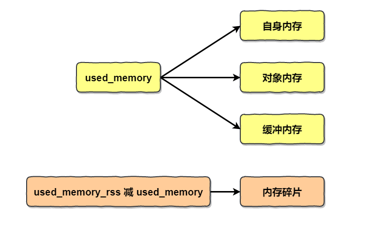
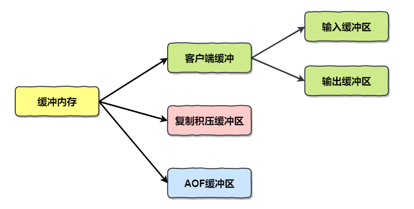
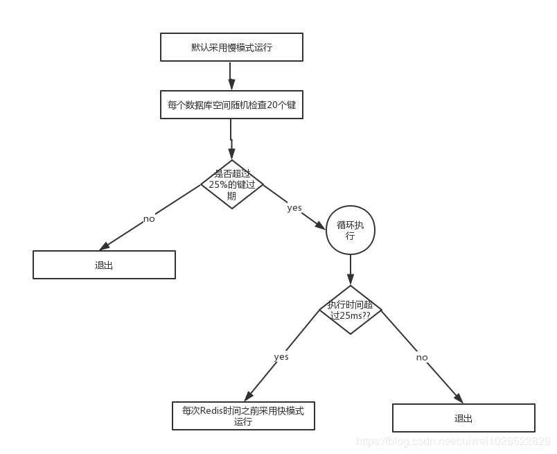
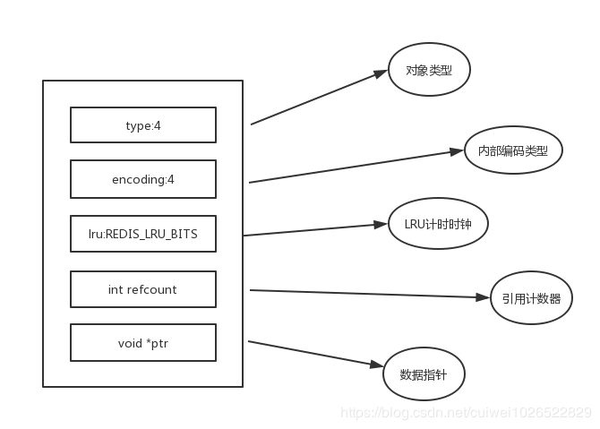

[TOC]

### Redis内存

Redis 就是内存数据库，所以理解 Redis 的内存是非常关键的。

#### 内存消耗

内存消耗分为**自身内存**消耗和**子进程内存**消耗。

##### 1. 内存使用统计

内存统计信息通过 **info memory** 指令查看。重点指标如下。

|           属性名            |                           属性说明                           |
| :-------------------------: | :----------------------------------------------------------: |
|       **used_memory**       | Redis 分配器分配的内存**总量**，也就是内部存储的所有数据内存占用量 |
|     **used_memory_rss**     |    从**操作系统**的角度显示 Redis 进程占用的物理内存总量     |
|    **used_memory_peak**     |       内存**使用的最大值**，表示 used_memory **峰值**        |
|   used_memory_peak_human    |            以**可读的格式**返回 used_memory peak             |
|       used_memory_lua       |                   Lua 引擎锁消耗的内存大小                   |
| **mem_fragmentation_ratio** |   used_memory_rss/used_memory **比值**，表示**内存碎片率**   |
|        mem_allocator        |           Redis 所使用的内存分配器 默认为 jemalloc           |

重点关注：**used_memory_rss**，**used_memory**，及两者比值 **mem_fragmentation_ratio**。

- 当 **mem_fragmentation_ratio >1** 时，说明 used_memory_rss-used_memory 多出的部分**内存并没有用于数据存储**，而是被内存碎片所消耗，如果两者相差很大，**说明内存碎片率严重**。

- 当 **mem_fragmentation_ratio <1** 时，这种情况一般出现在操作系统把 Redis 内存**交换到硬盘导致**，由于硬盘速度远远慢于内存，Redis 性能会变得很差，甚至僵死。

##### 2. 内存消耗划分

Redis 进程内存消耗主要有四个部分：自身内存、对象内存、缓冲内存、内存碎片。

###### ① 自身内存

自身内存很小。

###### ② 对象内存

是占用最多的内存，就是保存用户的**所有数据**。所有的数据都采用 key-value 的方式进行存储。键对象都是字符串，所以应该避免过长的键。不同数据结构占用内存不同。

###### ③ 缓冲内存

缓冲内存就是**缓冲区**内存，是实现功能很重要的一部分。

缓冲内存主要包括：客户端缓冲、复制积压缓冲区、AOF 缓冲区。

**① 客户端缓冲区**：客户端缓冲指的是所有接入到 Redis 服务器 TCP 连接的**输入输出缓冲**。**输入缓冲**无法控制，最大空间为1G，如果超过将断开连接。**输出缓冲**通过参数 client-output-buffer-limit 控制。客户端分为普通客户端、从客户端、订阅客户端，配置情况不同。

**② 复制积压缓冲区**：Redis2.8 以后提供了一个**可重用的固定大小缓冲区用于实现部分复制**功能，根据 repl-backlog-size 参数控制，默认 1MB。对于复制积压缓冲区**整个主节点只有一个**，所有的从节点**共享**此缓冲区，因此可以**设置较大**的缓冲区空间，如 100MB，这部分内存投入是有价值的，可以**有效避免全量复制**。

**③ AOF缓冲区**：这部分空间用于在 **AOF 重写期间保存最近的写入命令**。此空间的消耗用户无法控制，消耗的内存取决于AOF 重写时间和写入命令量，这部分空间占用通常很小。

###### ④ 内存碎片

为了更好的管理和重复利用内存，分配内存策略一般采用**固定范围的内存块**进行分配。在 64 位系统中将内存空间划分为：小、大、巨大三个范围。每个范围内又划分为多个小的**内存块单位**。

比如保存 5KB 对象可能会采用 8KB 的块存储，而剩下的 3KB 空间变为了**内存碎片**不能再分配给其他对象存储。

正常的碎片率 **mem_fragmentation_ratio** 在 **1.03** 左右。

> **高内存碎片率的原因？**

当存储的数据**长短差异较大**时候，以下场景容易出现**高内存碎片**问题：

- 频繁做更新操作，例如频繁对已存在的键执行 append，setrange 等更新操作。

- 大量过期**键删除**，键对象过期删除后，释放的空间无法得到充分利用，导致碎片率上升。

> **出现高内存碎片率的解决方法？**

- **数据对齐**：尽量做数据对齐，比如数据尽量采用数字类型或者固定长度字符串等，但是这要看具体业务；

- **安全重启**：重启节点可以做到内存碎片重启整理，因此可以利用高可用架构，如 sentinel 或者 cluster ，将碎片率过高的主节点转换为**从节点**，进行安全重启。

##### 3. 子进程内存消耗

主要是指执行 RDB、AOF 重写时 Redis 创建的**子进程内存**消耗。Redis 执行 fork 操作产生的子进程内存占用量对外表现为与父进程**相同**，理论上需要**一倍的物理内存**来完成重写操作。但 Linux 具有**写时复制**技术，父子进程会**共享相同的物理内存页**，当**父进程处理写请求**时会对**需要修改的页复制出一份副本完成写操作**，而子进程依然**读取 fork 时整个父进程的内存快照**。

子进程内存消耗总结如下：

- Redis 产生的子进程并**不需要消耗 1 倍**（理论上是 1 倍但是一般不需要这么多）的父进程内存，实际消耗根据期间写入命令量决定，但是依然要预留出一些内存防止溢出。
- 需要设置 sysctl vm.overcommit_memory=1 允许内核可以分配所有的物理内存，防止 Redis 进程 执行 fork 时候因系统剩余内存不足而失败。
- 排查当前系统是否支持并开启 THP(内存大页)，如果开启建议**关闭**，防止 copy-on-write 期间内存过度消耗。

#### 内存管理

Redis 主要通过**控制内存上限和回收策略**来实现内存管理。

##### 1. 设置内存上限

Redis 使用 **maxmemory** 参数限制**最大可用内存**。限制内存目的：

1. 用于缓存场景，当超出内存上限 maxmemory 时使用 LRU 等**删除策略释放空间**；
2. 防止所用内存**超过**服务器物理内存。

需要注意的是，maxmemory 限制的是 Redis **实际使用的内存量**，也就是 used_memory 统计项对应内存。由于**内存碎片率**的存在，**实际消耗**的内存可能会比 maxmemory 设置的**更大**，实际使用时要小心这部分内存**溢出**。

Redis 的内存上限可以通过 **config set maxmemory** 进程**动态修改**，即修改最大可用内存，实现动态伸缩 Redis 内存。

##### 2. 内存回收策略

内存回收机制主要体现在两个方面：

- 删除到达**过期**时间的键对象
- 内存使用达到 **maxmemory** 上限时触发内存溢出控制策略

###### ① 删除过期键对象

精准维护每个键过期时间会导致消耗大量的 CPU，对于单线程的 Redis 来说**成本过高**，因此采用**惰性删除**和**定时任务删除**机制实现过期键的内存回收。

**惰性删除：**用于当客户端**读取带有超时属性**的键时，如果**已经超过键设置的过期时间**，会**执行删除操作并返回空**，这种策略是出于节省 CPU 成本考虑，不需要单独维护 TTL 链表来处理过期键的删除。但是单独用这种方式**存在内存泄露的问题**，当过期键**一直没有访问**将无法得到及时的删除，从而导致内存不能及时释放。

**定时删除任务：**Redis 内部维护一个**定时任务**，默认每秒运行 10 次（通过配置 hz 控制）。定时任务中删除过期键逻辑采用了**自适应算法**，根据键的过期比例，使用**快慢两种速率**模式回收键。可以用作惰性删除的补充。流程如下。从每个数据库随机检查 20个 键如果超过 25% 的键过期了则循环执行回收逻辑直到不足 25% 或者运行超时为止。

###### ② 内存溢出控制策略

> MySQL 里有 2000w 数据，Redis 中只存 20w 的数据，如何保证 Redis 中的数据都是热点数据?

内存使用达到 maxmemory 上限时触发内存溢出控制策略。具体由 **maxmemory-policy** 参数控制。

Redis 支持 6 种策略。

|       策略        |                             说明                             |
| :---------------: | :----------------------------------------------------------: |
|    noeviction     |     **默认**策略，**拒绝写入**，不删除数据，只响应读操作     |
| **volatitle-lru** | 根据 **LRU 算法**删除**过期的键**，直到腾出足够空间，如果**没有可删除的键**则会退到默认策略 |
|    allkeys-lru    | 根据 **LRU 算法**删除键，不管是否超时，**直到腾出足够空间**  |
|  allkeys-random   |           **随机删除所有键**，直到腾出足够空间为止           |
| volatitle-random  |             **随机删除过期键**，直到腾出足够空间             |
|   volatitle-ttl   | 根据键对象的 TTL，删除**最近要过期**的键。如果没有可删除的键则会退到默认策略 |

如果**内存频繁溢出，会频繁触发内存回收操作，非常影响性能**。

如果当前 redis 有从节点 ，回收内存操作对应的删除命令会**同步**到从节点，导致**写放大**的问题。

#### 内存优化

##### 1. RedisObject对象

Redis 存储所有**值对象**在内部定义为 redisObject 结构体。Redis 存储数据都采用 redisObject 封装。理解 redisObject 对内存优化非常有帮助。

字段含义：

- type：表示当前对象使用的**数据类型**。
- encoding：表示 Redis 内部**编码类型**。
- lru：记录对象最后一次**被访问**的时间。用于辅助 LRU 算法实现内存回收。
- refcount：记录当前对象**被引用**的次数，用于通过引用次数回收内存。
- *ptr：与对象的数据**内容相关**，如果是整数，直接存储数据；否则表示指向数据的**指针**。

高并发写入场景中，在条件允许情况下，建议字符串**长度控制在 39 字节**以内，减少**创建 redisObject** 内存分配次数，从而提高性能。

##### 2. 缩减键值对象

减少内存最直接的就是缩减 key 和 value **长度**。

常见需求是把业务对象**序列化**成二进制数组放入 Redis。所以可以采用**高效**的序列化工具降低数组大小。也可以使用一些压缩算法对值压缩。

##### 3. 共享对象池

共享对象池是指在 Redis 内部维护 **[0-9999] 的整数对象池**。创建大量的**整数**类型 redisObject 存在内存开销，每个redisObject 内部结构至少占用 16个字节，甚至超过了整数自身空间消耗。所以 Redis 内存维护一个【0-9999】整数对象池，用于**节约内存**。除了整数值对象，其他类型如 list、hash、set、zset 内部元素也可以使用整数对象池。因此开发中在满足需求的前提下，尽可能使用整数对象以节省内存。

当多一个引用时，数据的**引用数**会 + 1。

可见当数据**大量使用【0-9999】的整数**时，共享对象池可以节约大量内存。

**注意**：当设置 maxmemory 并**启用 LRU 相关淘汰策略**：volatile-lru，allkeys-lru 时，Redis **禁止使用**共享对象池。

> **为啥开启 maxmemory 和 LRU 淘汰策略后对象池无效？**

LRU 算法晓获取对象最后被访问时间，以便淘汰**最长未访问**数据，每个对象最后访问时间存储在 redisObject 对象的 **lru 字段**。对象共享意味着多个引用共享**同一个** redisObject  这时 lru 字段也会**被共享**，导致**无法获取**每个对象的最后访问时间。如果没有设置 maxmemory，直到内存被用尽 Redis 也不会触发内存回收，所以共享对象池可以正常工作。

综上所述，**共享对象池与 maxmemory+LRU 策略冲突，使用时需要注意**。

此外，对于 **ziplist 编码**的值对象，即使内部数据为整数也**无法**使用共享对象池，因为 ziplist 使用**压缩且内存连续**的结构，对象共享判断成本过高。

> **为啥只有整数对象池？**

首先整数对象池**复用的几率最大**，其次对象共享的一个关键操作就是判断相等性，Redis 之所以只有整数对象池，是因为整数**比较算法**时间复杂度 **O(1)**, 只保留一万个整数为了防止对象池浪费。

如果**字符串判断相等性**，时间复杂度 O(N) 特别是长字符串更消耗性能 (浮点数在Redis内部使用字符串存储)。

对于更复杂的数据结构如 hash/list 等，相等性判断需要 O(N^2)。这样的开销显然不合理，因此 Redis 只保留整数共享对象池。

##### 4. 字符串优化

字符串对象是 Redis 内部最常用的数据类型。所有的**键都是字符串**类型，值对象数据除了整数之外都使用字符串存储。

Redis 没有采用原生 C 语言字符串类型而是自己实现了字符串结构：**内部简单动态字符串(SDS)** 。SDS 存在空间预分配机制，字符串之所以采用预分配的方式是**防止修改操作需要不断重分配内存和字节数据拷贝**。但这同样会造成**内存浪费**。

**优化：**

- **尽量减少字符串频繁修改操作如 append、setrange等，改为直接使用 set 修改字符串，降低预分配带来的内存浪费和内存碎片化。**
- **字符串重构**：不一定把每份数据作为字符串整体存储，像 json 这样的数据可以使用 hash 结构，使用**二级结构**存储也能节省内存。

##### 5. 编码优化

所谓编码就是具体使用哪种**底层数据结构**来实现。编码不同将直接影响数据的内存占用和读写效率。使用 **object encoding {key}** 命令获取编码类型。

通过不同编码实现**效率和空间的平衡**。比如当我们的存储只有 10 个元素的**列表**，当使用**双向链表**数据结构时，必然需要维护大量的内部字段如每个元素需要：前置指针，后置指针，数据指针等，造成空间浪费，如果采用**连续线性内存结构**的压缩列表(ziplist) 将会节省大量内存而由于数据长度较小，存取操作时间复杂度即使为 O(N^2) 也可以满足要求。**ziplist 编码**是应用范围最广的一种，可以分别作为 hash/ list / zset /类型的底层数据结构实现。ziplist 就是**效率和空间的平衡**的重要体现。

编码类型转换在 Redis 写入数据时**自动完成**，这个转换过程是**不可逆**的。转换规则只能从**小内存编码向大内存编码**转换。

此外，**intset** 是集合 (set) 的类型编码的一种，当使用**整数集合**时尽量使用 intset 编码。

##### 6. 控制键的数量

当使用 Redis 存储大量数据时，通常会存在**大量键**，过多的键同样会消耗大量内存。

对于存储相同的数据内容利用 Redis 的数据结构**降低外层键的数量**，也可以节省大量内存，如使用 hash 结构。

对于**大量小对象**的存储场景，非常适合用 **ziplist 编码的 hash 类型**控制键的规模来降低内存。

#### 参考资料

- 《Redis 开发与运维》