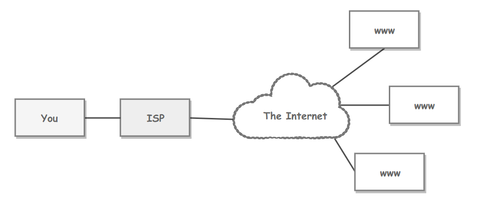
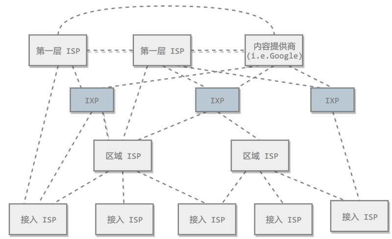
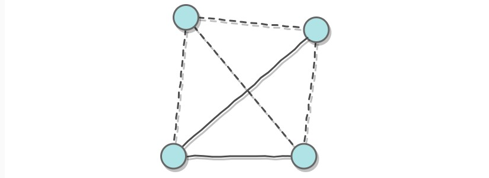
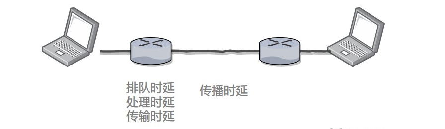
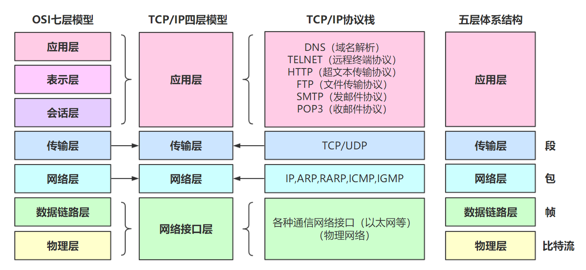

[TOC]

### 网络基础

#### ISP

互联网服务提供商 ISP 可以从互联网管理机构获得许多 **IP 地址**，同时拥有通信线路以及路由器等联网设备，个人或机构向 ISP 缴纳一定的费用就可以接入互联网。

目前的互联网是一种**多层次 ISP 结构**，ISP 根据覆盖面积的大小分为第一层 ISP、区域 ISP 和接入 ISP。互联网交换点 IXP 允许两个 ISP 直接相连而不用经过第三个 ISP。

---

#### 主机之间的通信方式

- 客户-服务器（**C/S**）：客户是服务的请求方，服务器是服务的提供方。

- 对等（**P2P**）：不区分客户和服务器。

----

#### 电路交换与分组交换

##### 1. 电路交换

电路交换用于电话通信系统，两个用户要通信之前需要建立一条专用的物理链路，并且在整个通信过程中始终占用该链路。由于通信的过程中不可能一直在使用传输线路，因此电路交换对线路的利用率很低，往往不到 10%。

##### 2. 分组交换

每个分组都有首部和尾部，包含了源地址和目的地址等控制信息，在同一个传输线路上同时传输多个分组互相不会影响，因此在同一条传输线路上允许同时传输多个分组，也就是说分组交换不需要占用传输线路。

在一个邮局通信系统中，邮局收到一份邮件之后，先存储下来，然后把相同目的地的邮件一起转发到下一个目的地，这个过程就是存储转发过程，分组交换也使用了存储转发过程。

----

#### 时延

总时延 = 排队时延 + 处理时延 + 传输时延 + 传播时延

##### 1. 排队时延

分组在路由器的输入队列和输出队列中排队等待的时间，取决于网络当前的通信量。

##### 2. 处理时延

主机或路由器收到分组时进行处理所需要的时间，例如分析首部、从分组中提取数据、进行差错检验或查找适当的路由等。

##### 3. 传输时延

主机或路由器传输数据帧所需要的时间。

其中 l 表示数据帧的长度，v 表示传输速率。

##### 4. 传播时延

电磁波在信道中传播所需要花费的时间，电磁波传播的速度接近光速。

其中 l 表示信道长度，v 表示电磁波在信道上的传播速度。

-----

#### 计算机网络体系结构

##### 1. OSI七层协议

七层协议。其中表示层和会话层用途如下：

-  **表示层** ：数据压缩、加密以及数据描述，这使得应用程序不必关心在各台主机中数据内部格式不同的问题。

-  **会话层** ：建立及管理会话。

五层协议没有表示层和会话层，而是将这些功能留给应用程序开发者处理。

OSI 七层协议示意图

##### 2. 五层协议(多用)

-  **应用层** ：为特定应用程序提供数据传输服务，例如 **HTTP、DNS 等协议**。数据单位为报文。

-  **传输层** ：为进程提供通用数据传输服务。由于应用层协议很多，定义通用的传输层协议就可以支持不断增多的应用层协议。运输层包括两种协议：传输控制协议 **TCP**，提供面向连接、可靠的数据传输服务，数据单位为报文段；用户数据报协议 **UDP**，提供无连接、尽最大努力的数据传输服务，数据单位为用户数据报。TCP 主要提供完整性服务，UDP 主要提供及时性服务。

-  **网络层** ：为主机提供数据传输服务。而传输层协议是为主机中的进程提供数据传输服务。网络层把传输层传递下来的报文段或者用户数据报封装成分组。在计算机网络中进行通信的两个计算机之间可能会经过很多个数据链路，也可能还要经过很多通信子网。网络层的任务就是选择合适的网间路由和交换结点， 确保数据及时传送。网络层协议主要有 **IP 协议，ARP 协议**等。

-  **数据链路层** ：网络层针对的还是**主机之间的数据传输**服务，而主机之间可以有很多链路，链路层协议就是为同一链路的主机提供数据传输服务。数据链路层把网络层传下来的分组封装成帧。链路层协议有 **PPP 协议、CSMA/CD 协议**等。

-  **物理层** ：考虑的是怎样在传输媒体上传输数据比特流，而不是指具体的传输媒体。物理层的作用是尽可能屏蔽传输媒体和通信手段的差异，使数据链路层感觉不到这些差异。

##### 3. TCP/IP

它只有**四层**，相当于五层协议中数据链路层和物理层合并为**网络接口层**。

TCP/IP 体系结构不严格遵循 OSI 分层概念，应用层可能会直接使用 IP 层或者网络接口层。

##### 4. 数据在各层之间的传递过程

在向下的过程中，需要**添加**下层协议所需要的**首部或者尾部**，而在向上的过程中不断**拆开**首部和尾部。

路由器只有下面三层协议，因为路由器位于网络核心中，不需要为进程或者应用程序提供服务，因此也就不需要传输层和应用层。

#### 物理层

物理层放这里略讲。

##### 1. 通信方式

根据信息在传输线上的传送方向，分为以下三种通信方式：

- 单工通信：单向传输
- 半双工通信：双向交替传输
- 全双工通信：双向同时传输

##### 2. 带通调制

模拟信号是连续的信号，数字信号是离散的信号。带通调制把数字信号转换为模拟信号。

